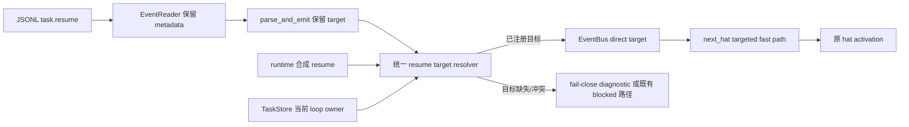
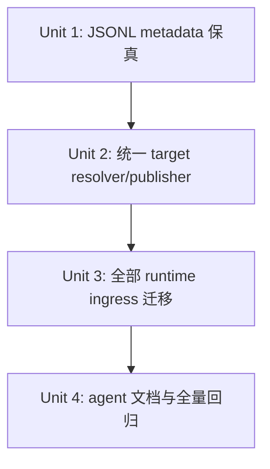

# 将 `task.resume` 修复为运行时定向恢复机制

## 0. 计划状态

**READY**：本计划的实施关键决策均有当前代码、测试结构或可执行调用链证据支持，置信度均不低于 0.85。计划只要求修改 runtime、协议保真路径、测试和 agent-facing skill 文档；不修改任何 preset YAML、preset schema、manifest、hat 事件配置或业务事件拓扑。

- **代码基线**：当前分支 `pittcat-dev`，HEAD `e4048b6456594c9b0966a3fadac5338e07839562`。
- **调查范围**：`ralph-proto` Event/EventBus；`ralph-core` EventReader、EventLoop 的事件接收/重建/发布/hat 选择、rejection/resume、Task/TaskStore、现有恢复与测试；`ralph-cli` 的 resume/recovery 集成测试；agent-facing recovery skill 文档；相关 Git 历史。
- **已执行的验证命令**：`git status --short`、`git rev-parse HEAD`、`rg` 调用链检索、`sed` 源码核验、`wc -l` 文件规模核验、`git log --oneline -- <相关文件>`、测试模块注册检索。
- **本计划阶段未执行**：没有运行测试、build、clippy 或 doctest；这些命令写入第 9 节，由 Executor 按 Unit 串行执行。原因是本次请求是写计划，不是实现。
- **阻塞项**：无。实现阶段若发现 `task.resume` 的真实调用链与本计划冲突，必须按 Unit 的停止条件暂停并重新记录证据，不能自行扩展方案。

## Goal Capsule

- **目标**：任何带有原始触发 hat、任务标识或 runtime 恢复上下文的 `task.resume`，都必须在 runtime 内解析为一个已注册的目标 hat，并在下一次调度中优先激活该 hat；目标不明或目标不存在时必须 fail-close 并留下可诊断结果，不能无目标广播、静默丢失或错误激活其他 hat。
- **执行边界**：保留外部可见的 `task.resume` topic 和现有 payload 字段；修复运行时路由与事件元数据保真；不要求 preset 增加 `task.resume` trigger。
- **不可改变的契约**：`loop.resume` 的启动/continue 语义、普通业务事件的订阅路由、EventBus 的 explicit target 直达语义、现有 TTL/budget/terminal guard、旧 payload 的可解析性必须保持。
- **停止条件**：任何 Unit 出现目标 hat 解析来源不一致、测试 Red 不是目标行为失败、需要新增配置/依赖、或回归范围超出本计划时，立即停止该 Unit 并回到证据/决策记录。
- **尾部责任**：实现者必须完成本计划全部 Unit、Verification Contract 和 Definition of Done；不得把“补全剩余 task.resume 调用点”留给后续任务。

## 1. 功能目标

### 1.1 业务目标与调用方

调用方是 EventLoop、rejection/recovery runtime、JSONL EventReader，以及被恢复的 hat。`task.resume` 的职责是把一个已经存在的任务或恢复意图交还给原来负责该任务/触发事件的 hat，让该 hat 在下一次 activation 中读取原始触发上下文和 correction context 后继续工作。

### 1.2 当前行为

1. `EventReader::Event` 已有 `triggered: Option<String>`，`From<Event>` 也会将它转换成 `ralph_proto::Event.target`。
2. 但 `process_parse_result` 的多条 accepted 路径重新使用 `Event::new(event.topic, payload)`，导致已经读出的 target/source/wave/system metadata 被丢弃。
3. `EventBus::publish` 对有 target 的事件会绕过订阅匹配直达目标 hat；无 target 的 `task.resume` 则依赖订阅或普通调度，无法保证原 hat 被唤醒。
4. `next_hat` 已有 targeted pending event fast path，但它只能处理已经带 `event.target` 且进入正确 pending queue 的事件。
5. 多个 runtime 生成路径直接 `Event::new("task.resume", payload)`，没有统一附加目标；现有 `validate_resume_routing` 只能在部分路径验证，不能把所有 resume 变成定向恢复。

### 1.3 目标行为

- JSONL 中 `triggered` 指向 `executor` 的 `task.resume`，经过 EventReader、accepted gate、publish 和 `next_hat` 后，下一次 activation 必须是 `executor`，即使 `executor` 的 preset 声明没有 `task.resume` trigger。
- runtime 生成的 resume 必须通过统一目标解析/发布边界；能确认原 hat 时带 `Event.target` 发布，不能确认时不广播到其他 hat。
- 若 payload 只有 `task_id`/`task_key`，runtime 可从当前 loop 的 TaskStore 找到任务 owner，并只在 owner 已注册且任务身份匹配时恢复 owner。
- 重复的同一恢复意图不能制造无限 pending resume；既有 retry budget、TTL 和 exhausted/blocked 行为仍由原机制决定。
- 旧的 `task.resume` payload、旧 JSONL（没有 `triggered`、没有新字段）仍可解析；缺少目标且无法从任务恢复时进入现有 fail-close/diagnostic 路径，不得猜测一个 hat。

### 1.4 范围与非目标

**本次范围**：事件元数据保真、统一 resume target resolution、所有已确认 runtime resume 发布点迁移、task owner fallback、定向调度优先级、恢复 skill 文档同步、runtime/CLI 回归测试。

**非目标**：不改 preset YAML/schema/manifest/index、不给每个 hat 增加 `task.resume` trigger、不新增 `task.resume.v2` topic、不新增配置开关/环境变量/数据库迁移、不重写 `loop.resume` 启动语义、不改变业务事件拓扑、不把普通事件改成广播。

### 1.5 输入、输出、状态和错误语义

- **输入**：JSONL `topic/payload/triggered/hat/source/wave/system_injected`；runtime 生成的 resume payload；payload 中已有的 `target_hat`、`task_id`、`task_key`、`original_trigger_topic`、`original_trigger_payload`；当前 loop 注册 hat 和 TaskStore。
- **输出**：一个带 `Event.target` 的 `task.resume` 进入目标 hat pending queue；或一个明确的 fail-close diagnostic/blocked 结果，且不把 resume 投递给错误 hat。
- **状态变化**：目标 hat 被 `next_hat` 选中；恢复事件按现有 prompt injection 进入该 hat prompt；正常 retry/TTL/budget 计数继续沿用现有状态。
- **副作用**：目标事件可进入现有 events/outbox/diagnostic 路径；重复恢复遵循既有幂等/预算语义；不得增加新的持久化文件。
- **错误**：未注册 target、任务不存在、task owner 与显式 target 冲突、target 缺失且无法安全推断时，fail-close 并记录可检索诊断；不得 fallback 到任意 round-robin hat。
- **兼容性**：保留 `task.resume` topic、旧 payload 可选字段和 `loop.resume`；不要求旧 preset 添加 trigger。
- **性能**：target 已存在时 O(1) EventBus 定向入队；task fallback 只做当前 loop 的已有 TaskStore 查询；不得引入全量历史扫描或网络调用。
- **安全/权限**：外部/JSONL target 只能指向已注册 hat；system-injected 只绕过现有 source guard，不绕过 target 注册检查；不能把不可信 payload 的 `target_hat` 当成无条件授权。

### 1.6 已确认与待验证假设

**已确认假设**：EventBus 的 target 直达语义已经满足“不依赖 preset trigger”；`next_hat` 已有 target fast path；Task 已有 `owner_hat_id`；旧 Event JSONL 的 `triggered` 是可选字段。

**待验证但不阻塞的实现细节**：各 runtime 发布点的 activation/loop id 参数需要按实际函数签名接入统一 helper；若某个历史路径没有 task identity，则必须使用该路径已经确认的 recovery target，不能由 Executor 临时发明 fallback。验证动作在 Unit 2/3 的 Acceptance Red 前完成，失败则按停止条件回退。

## 2. 代码库现状与证据

### 2.1 当前实现入口

外部 JSONL 入口是 `crates/ralph-core/src/event_reader.rs::Event` 与 `impl From<Event> for ralph_proto::Event`。运行时入口是 `crates/ralph-core/src/event_loop/parse_and_emit.rs::process_parse_result` 及其 accepted/recovery 分支。runtime 合成事件主要经过 `crates/ralph-core/src/event_loop/disposition.rs::publish_synthetic` 或直接调用 `EventBus::publish`。目标入队和调度分别位于 `crates/ralph-proto/src/event_bus.rs::EventBus::publish` 与 `crates/ralph-core/src/event_loop/state_recovery.rs::EventLoop::next_hat`。任务身份和 owner 位于 `crates/ralph-core/src/task.rs`、`crates/ralph-core/src/task_store.rs`。

### 2.2 Evidence Ledger

| Evidence ID | 来源 | 观察结果 | 对计划的影响 | 可靠性 |
|---|---|---|---|---|
| E1 | `ralph-proto/src/topics.rs` | `task.resume` 与 `loop.resume` 是不同 topic；`task.resume` 是恢复 topic。 | 只修 task.resume 恢复机制，不替换 loop.resume 启动流程。 | 高 |
| E2 | `ralph-proto/src/event.rs:8-71` | proto Event 有 `target`、`source`、wave metadata、`system_injected`，并提供 `with_target`。 | 复用现有 Event 接口，不新增 target 字段或新事件类型。 | 高 |
| E3 | `ralph-proto/src/event_bus.rs:88-128` | 有效 explicit target 直接进入目标 hat pending queue；未注册 target 返回空 recipients；无 target 才走订阅匹配。 | preset 不需要增加 task.resume trigger；未知目标必须 fail-close。 | 高 |
| E4 | `ralph-core/src/event_reader.rs:135-202` | JSONL `triggered` 是可选目标；`From<Event>` 已转换为 proto `target`。 | JSONL 入口能力已存在，缺陷在后续事件重建/发布保真。 | 高 |
| E5 | `ralph-core/src/event_loop/parse_and_emit.rs` 多个 accepted 分支 | accepted 事件多处用 `Event::new(event.topic, payload)` 重建。 | Unit 1 必须先修复元数据保真，并用真实 process_parse_result 测试证明。 | 高 |
| E6 | `ralph-core/src/event_loop/state_recovery.rs:316-490` | `next_hat` 先消费 `pending_recovery_hat`，再扫描 targeted pending event，然后才走普通调度。 | 只要 target 进入 bus，原 hat 会优先激活；不应改成 preset trigger 方案。 | 高 |
| E7 | `ralph-core/src/task.rs:144-232,351-373` | Task 已有 `loop_id` 和 `owner_hat_id`；owner 用于 lifecycle 权限和 delegate。 | 可复用任务 owner 作为缺少显式 target 时的安全 fallback，不需改 Task schema。 | 高 |
| E8 | `ralph-core/src/task_store.rs:639-660` | TaskStore 已有按 `(task_id, loop_id)` 查找 open task 的 API。 | task fallback 可限定当前 loop，避免跨 loop 误路由。 | 高 |
| E9 | `ralph-core/src/event_loop/rejection.rs:468-620,751-830` | resume payload 已携带 `target_hat`、原始 trigger、retry key 等上下文；manifest resume 已使用 targeted Event。 | 保留 payload 兼容，统一发布边界复用现有字段和 manifest pattern。 | 高 |
| E10 | `ralph-core/src/event_loop/mod.rs:370-390` 与 `tests/u16_resume_routing.rs` | 已有 routing validation，但只覆盖部分调用方，并且原测试关注订阅消费者。 | 新机制要把 target 解析/投递集中到 runtime，而不是继续在 preset 中补 trigger。 | 高 |
| E11 | `crates/ralph-core/src/event_loop/tests/mod.rs` | 已有 `u16_resume_routing`、`parallel_forge_manifest_resume`、`u3_trigger_context_prompt`、`u3_jsonl_emit_gate` 等真实 EventLoop 测试模块。 | 新测试应加入现有 event_loop 测试入口，沿用 nextest，不另造测试框架。 | 高 |
| E12 | `crates/ralph-core/src/event_loop/disposition.rs` | `task.resume` 属于 Recovery，合成 recovery 事件进入 accepted transition；诊断/loop control 走 direct channel。 | 不能简单绕过现有 disposition；统一 helper 必须保持 Recovery 的持久/发布语义。 | 高 |
| E13 | `crates/ralph-core/src/event_loop/parse_and_emit.rs:3742-3761` | 当前合成事件最终按 disposition 发布，但事件对象若此前被重建，target 已丢失。 | 修复事件对象保真优先于修改 EventBus。 | 高 |
| E14 | `crates/ralph-core/src/event_loop/completion_and_termination.rs`、`wave_scope.rs`、`event_processing.rs`、`dispatch_and_handoff.rs` | 存在多处直接构造/发布 task.resume，部分带 target，部分不带。 | Unit 3 必须建立调用点清单并全部迁移或明确保留合法的 `ralph`/safe target。 | 高 |
| E15 | `crates/ralph-core/src/event_loop/tests/u16_resume_routing.rs` 历史说明 | 过去已经出现“只 warn 但仍发布错误 resume”的 P0 修复背景。 | 新计划禁止只增加日志；目标错误必须阻止错误投递。 | 高 |
| E16 | `crates/ralph-core/src/event_loop/tests/mod.rs` 与 `crates/ralph-cli/tests/integration_resume.rs` | 测试入口是 Rust unit/integration，仓库硬规则要求 nextest。 | 计划只使用真实 nextest 命令，不使用裸 `cargo test -p ralph-cli`。 | 高 |
| E17 | `crates/ralph-core/src/event_loop/parse_and_emit.rs` 当前 4762 行 | 文件接近 5000 行硬上限。 | 不在该文件继续堆叠新的 resolver；新机制应放入已有合适模块或新增小模块。 | 高 |
| E18 | `crates/ralph-core/data/ralph-tools.md`、`ralph-tools-recovery-directives.md` | agent-facing 文档已描述收到 task.resume 后读取恢复上下文，但未能保证“runtime 已把它送到原 hat”。 | 实现后必须同步文档，使 agent 规则描述外部可观察契约而非内部实现。 | 高 |

### 2.3 受影响范围

- **生产模块**：`ralph-proto::Event`/`EventBus` 只作为现有契约消费者；`ralph-core::event_reader`、`event_loop/parse_and_emit.rs`、`event_loop/state_recovery.rs`、`event_loop/rejection.rs`、`event_loop/disposition.rs`、`event_loop/event_processing.rs`、`event_loop/completion_and_termination.rs`、`event_loop/wave_scope.rs`、`event_loop/dispatch_and_handoff.rs`，以及必要时新增的 event_loop 小模块。
- **任务数据**：现有 `.ralph/agent/tasks.jsonl` 通过 `TaskStore` 只读查询 owner；不改格式、不新增文件。
- **CLI/API**：`ralph-cli` resume/recovery 集成测试消费者；不新增 CLI 参数、不改变 `ralph run --continue` 的 `loop.resume` 入口。
- **agent 文档**：`crates/ralph-core/data/ralph-tools.md`、`ralph-tools-recovery-directives.md`；保留并验证现有 `integration_agent_reference.rs` 稳定 anchor，不写内部 ledger 路径。
- **测试模块**：上述已有 event_loop 测试及 `ralph-cli/tests/integration_resume.rs`、`ce_executor_recovery.rs`、`integration_agent_reference.rs`。
- **明确不受影响**：所有 `presets/en/*.yml`、`presets/schemas/*.yml`、`presets/manifest.yml`、`presets/index.json`、zsh preset completion、普通业务 topic 的订阅关系。

## 3. 决策记录与置信度

| Decision ID | 决策问题 | 候选方案 | 最终选择 | 支持证据 | 排除其他方案的原因 | 置信度 |
|---|---|---|---|---|---|---:|
| D1 | 是否通过修改所有 preset 增加 `task.resume` trigger？ | A. 每个 preset/hat 增加 trigger；B. runtime 给 Event 加 target，利用 direct delivery。 | 选择 B。**(session-settled: user-directed — chosen over 修改 preset 事件配置：preset 太多且用户要求机制层无痛切换。)** | E2、E3、E6、E14 | A 会把一个 runtime 控制面契约分散到大量业务配置，并且不能修复 JSONL target 丢失；B 已是现有 EventBus 语义。 | 0.99 |
| D2 | 如何修复 JSONL resume 不激活原 hat？ | A. 在调度器猜测；B. 保留 EventReader 转换后的 target/source/wave/system metadata 到最终 publish。 | 选择 B。 | E4、E5、E6、E13 | A 无法恢复已丢失的身份，且会污染普通调度；B 是最小行为修复，直接覆盖现有丢失点。 | 0.99 |
| D3 | runtime 生成的 resume 是否统一从一个发布边界发出？ | A. 各调用点继续手写 `Event::new`；B. 新增/复用一个 runtime helper，统一解析 target、校验注册、发布并保留现有 disposition。 | 选择 B。 | E9、E10、E12、E14、E15 | A 已导致带 target/不带 target 漂移；仅加日志不能阻止错误投递。 | 0.96 |
| D4 | 缺少显式 target 时如何找原 hat？ | A. round-robin/当前 hat 猜测；B. 按显式 Event target → JSONL `triggered` → payload target_hat（经注册/任务一致性校验）→ 当前 loop open task owner；无法安全确认则 fail-close。 | 选择 B。 | E4、E7、E8、E9、E15 | A 会把恢复交给错误 hat；B 的来源都是已有身份字段，且 owner 查询限定 loop。 | 0.92 |
| D5 | 是否新增数据库/配置保存 resume intent？ | A. 新增状态表/配置；B. 复用现有 Event target、JSONL metadata、TaskStore、pending recovery state。 | 选择 B。 | E2、E4、E7、E8、E9、E12 | A 扩大持久化面且无直接证据需要新存储；现有数据边界已能承载目标。 | 0.94 |
| D6 | 重复 resume 如何处理？ | A. 无限制重复 publish；B. 保留已有 retry key、TTL、budget、accepted transition/idempotency，并在统一边界禁止同一 pending 恢复意图重复入队。 | 选择 B。 | E9、E12、历史 `resume_budget`、现有 recovery tests | A 会重现历史 resume storm；B 复用现有预算/幂等语义，新增逻辑只负责 pending target 的去重。 | 0.90 |
| D7 | 新测试放在哪里？ | A. 新建另一套 E2E harness；B. 扩展现有 `crates/ralph-core/src/event_loop/tests/` 真实 EventLoop 测试，并补 CLI integration。 | 选择 B。 | E11、E16 | A 成本高且不能直接覆盖 process_parse_result；现有测试已有 fixture 和 EventReader 注入方式。 | 0.98 |

上述 D4/D6 在实现开始前仍需由 Unit 2/3 的真实 Red 测试验证；若测试证明某个 payload 形状无法区分两个 owner，必须停止并把该分支改为 fail-close，而不是降低安全约束。

## Planning Contract

### 高层技术设计

实现原则是“修复身份保真 + 统一恢复入口 + 保持现有调度器”：不修改 EventBus 的既有 direct-target 规则，不在 preset 中补 topic，不把普通业务事件重新路由。新 helper 必须是小模块或已有职责明确的恢复模块中的小接口，避免继续膨胀已达 4762 行的 `parse_and_emit.rs`。

### 兼容与回归不变量

1. `loop.resume` 仍由 `initialize_resume_with_context` 处理；本计划不把启动 resume 改回 `task.resume`。
2. 有 explicit target 的普通事件仍只进目标 hat；无 target 的普通业务事件仍按订阅匹配。
3. 未注册 target 仍返回空 recipients，不能 fallback 到 `human_pending` 或其他 hat。
4. `task.resume` 仍被 disposition 识别为 Recovery；现有 outbox/phase authority/TTL/budget 不被绕过。
5. `task.resume` payload 的旧字段和缺失可选字段仍能解析；新逻辑不能要求旧 JSONL 必须有新增字段。
6. preset 文件、schema、manifest、index 不产生 diff；若测试因 preset 内容变化失败，必须停止，不得更新 snapshot 以掩盖回归。
7. `ralph-tools*.md` 只描述 agent 下一步动作和外部契约，不泄漏 resolver、ledger 或内部函数细节。

## 4. BDD 行为规格

### Feature: runtime 将 task.resume 定向交还原 hat

  Background:
    Given loop 已注册至少两个 hat，且其中一个 hat 是某个 task 或原始 trigger 的 owner
    And EventBus、EventReader、EventLoop 使用真实 runtime 实现
    And preset 没有为 owner 额外声明 `task.resume` trigger

  Scenario: JSONL 的 triggered 目标被保留并激活原 hat
    Given JSONL 中存在 `task.resume`，`triggered` 为 `executor`
    When EventLoop 读取并处理该事件
    Then `executor` 的 pending queue 收到带 target=`executor` 的 resume
    And 下一次 `next_hat` 返回 `executor`
    And 其他 hat 不收到该 resume

  Scenario: runtime 合成 resume 使用已确认的原 hat
    Given rejection/recovery 路径已确认 target hat 为 `executor`
    When runtime 生成 task.resume
    Then publish 的 Event.target 为 `executor`
    And `executor` 在下一次调度被激活
    And 不要求修改 preset trigger

  Scenario: task owner 可作为缺少显式 target 的安全恢复来源
    Given payload 含当前 loop 内存在的 open `task_id`
    And该 task 的 `owner_hat_id` 为已注册的 `executor`
    When runtime 解析 task.resume target
    Then resume 定向到 `executor`
    And owner 之外的 hat 不会收到该 resume

  Scenario: 无法确认 target 时 fail-close
    Given task.resume 没有 Event target、triggered、有效 payload target_hat 或可匹配的 open task owner
    When runtime 尝试发布恢复
    Then 不把 task.resume 投递给任意业务 hat
    And记录现有可检索的 misrouted/dead-letter/blocked 诊断结果
    And不进入 round-robin 猜测路径

  Scenario: target 未注册时 fail-close
    Given task.resume 指向不存在的 hat
    When runtime 处理恢复
    Then EventBus 不产生任何 recipient
    And不把事件转给 Ralph、当前 hat或其他 hat

  Scenario: 旧 payload 和旧 JSONL 仍可恢复或安全失败
    Given task.resume payload 没有新字段，或 JSONL 没有 `triggered`
    When runtime 处理恢复
    Then payload 仍能解析并保留既有 correction/TTL/budget 行为
    And若已有旧 target 来源则定向恢复
    And若确实没有安全 target 则 fail-close，而不是猜测

  Scenario: 重复恢复不制造无限 pending resume
    Given相同 loop、hat、task identity 和 retry key 的 task.resume 已在目标 queue 中
    When同一恢复信号再次进入 runtime
    Then目标 queue 不新增等价重复项
    And既有 retry budget/TTL 计数和 exhausted/blocked 语义保持不变

  Scenario: manifest/continue 恢复语义不回归
    Given现有 manifest resume 或 `ralph run --continue` 场景
    When执行既有 resume 流程
    Then `loop.resume` 启动路径仍按原契约工作
    And manifest targeted task.resume 仍按原 target、original trigger 和 pending recovery pin 工作

  Scenario: 普通业务事件路由不回归
    Given一个没有 explicit target 的普通业务事件和多个订阅者
    When EventBus publish 该事件
    Then仍按现有 specific subscription/wildcard 优先规则路由
    And本次 task.resume 机制不改变其 recipients

## 5. 验收与测试策略

| Scenario | 验收条件 | 测试入口 | 推荐层级 | 风险补充测试 | 是否 E2E |
|---|---|---|---|---|---|
| S1 JSONL target 保真 | 真实 `process_parse_result` 后 `peek_pending("executor")` 中事件 target 为 executor，`next_hat` 返回 executor | `ralph-core/src/event_loop/tests/` 新增恢复路由测试并注册 `tests/mod.rs` | EventLoop integration | Characterization，覆盖 accepted 重建路径 | 否 |
| S2 合成 resume 定向 | 每个迁移的 runtime call site 发布的 Event.target 与确认 target 相等 | 新 helper 单测 + 各调用方真实 EventLoop 测试 | 单元 + 集成 | Contract：target/recipient/next_hat 三层同时断言 | 否 |
| S3 task owner fallback | 当前 loop open task owner 为 executor 时只收到 executor；跨 loop 或 closed task 不得匹配 | 新 resolver 单测，使用临时 TaskStore fixture | 单元 | Property/边界：缺 task、closed、跨 loop、owner 未注册 | 否 |
| S4 fail-close | unknown/missing/conflicting target 没有错误 hat recipient，并产生明确诊断或 blocked 结果 | `task_resume_runtime_routing.rs` | EventLoop integration | Fault injection：注册表漂移、恶意 target | 否 |
| S5 旧兼容 | 无新字段的 payload/JSONL 仍解析；缺目标时不 silent broadcast | `event_reader` 现有测试、recovery envelope、CLI integration_resume | 单元 + CLI 集成 | Characterization/differential against existing payload builder | 否 |
| S6 幂等 | 等价 resume 重复输入只保留一条 pending 意图，预算与 TTL 不变 | 新 helper 单测 + real EventBus test | 单元 + 集成 | Idempotency；不修改已有 budget tests | 否 |
| S7 manifest/continue | 现有 manifest resume target/original trigger/pin 和 CLI continue 断言全部保持 | `parallel_forge_manifest_resume.rs`, `integration_resume.rs` | 集成 | Compatibility regression | 否 |
| S8 普通事件 | EventBus 既有 direct target、unknown target、specific/wildcard tests 全通过 | `ralph-proto` event_bus tests | 单元/协议 | Differential regression on routing matrix | 否 |
| S9 agent 文档 | `ralph tools skill load` 仍能加载 recovery guidance，且描述 target 是 runtime 提供的恢复上下文 | `integration_agent_reference.rs` | CLI integration | 静态 drift scan | 否 |

每个验收测试必须断言三件事：事件是否进入正确 pending queue、下一次选中的 hat 是否正确、非目标 hat 是否没有收到事件。只断言 payload 文本或只断言日志不算通过。

## 6. 需求—测试追踪矩阵

| Requirement ID | 需求 | Scenario | 验收测试 | 单元测试 | 集成/契约测试 | E2E | Evidence |
|---|---|---|---|---|---|---|---|
| R1 | JSONL target 不丢失 | S1 | `jsonl_task_resume_preserves_target_and_activates_original_hat` | Event metadata copy helper | process_parse_result + EventBus + next_hat | 否 | E4-E6,E13 |
| R2 | runtime 合成 resume 必须定向 | S2 | `synthetic_task_resume_is_published_with_confirmed_target` | resolver/publisher cases | 每类调用点至少一条真实路径 | 否 | E9-E15 |
| R3 | task owner 安全 fallback | S3 | `task_resume_resolves_open_task_owner_in_same_loop` | task/loop/registration matrix | EventLoop task fixture | 否 | E7-E8 |
| R4 | unknown/missing/conflict fail-close | S4 | `task_resume_never_broadcasts_without_safe_target` | resolver error classification | EventBus recipient + diagnostic | 否 | E3,E10,E15 |
| R5 | 旧 payload/JSONL 兼容 | S5 | `legacy_task_resume_payload_remains_parseable` | serde/payload compatibility | CLI resume/recovery | 否 | E4,E9,E16 |
| R6 | 重复恢复受控 | S6 | `duplicate_task_resume_does_not_duplicate_pending_intent` | dedup identity | EventBus queue | 否 | E9,E12 |
| R7 | loop/manifest resume 不变 | S7 | existing manifest/continue tests remain green | existing recovery unit tests | `parallel_forge_manifest_resume`, `integration_resume` | 否 | E1,E9,E11 |
| R8 | 普通事件路由不变 | S8 | existing EventBus direct/subscription tests remain green | `ralph-proto` event tests | event_loop routing regression | 否 | E3,E6 |
| R9 | agent-facing guidance 与实现一致 | S9 | existing agent reference anchors plus updated behavior | 文档 anchor checks | CLI skill load | 否 | E18 |

## 7. 严格串行开发单元

执行顺序固定：

`Unit 1` → 完成 Acceptance Red、最小实现、回归和关闭 → `Unit 2` → 完成全部测试和回归 → `Unit 3` → 完成全部测试和回归 → `Unit 4` → 完成全部测试和回归。

### Unit 1：保留 JSONL task.resume 的 target 元数据

#### 1. Unit 目标

完成一个行为：JSONL 中已有的 `triggered`/target 在 `process_parse_result` 的 accepted/recovery 重建路径中不再丢失，并能驱动原 hat 下一次 activation。

#### 2. 对应需求与 Scenario

R1、S1；D2；E4、E5、E6、E13。

#### 3. 外部可观察结果

向 EventLoop 输入带 `triggered: executor` 的 `task.resume` 后，`executor` pending queue 收到 target=executor 的事件，`next_hat` 返回 executor；不改 preset。

#### 4. 当前行为基线

EventReader 转换阶段已经产生 target，但 accepted 分支重新调用 `Event::new`。当前缺少覆盖“JSONL 读取 → accepted 处理 → pending queue → next_hat”的完整断言，因此先增加 Characterization/Acceptance 测试，预期在当前代码上因 target 丢失而失败。

#### 5. 输入与输出

- 输入：真实临时 events JSONL，事件 topic=`task.resume`、payload 为合法旧 resume payload、triggered=`executor`，并注册 executor 与另一个 hat。
- 输出：accepted publish 的 proto Event 保留 target/source/wave/system metadata；executor pending queue 有一条定向 resume。
- 错误：target 未注册仍保持 EventBus 现有空 recipient，不在本 Unit 添加 fallback。
- 不变量：普通业务事件的 metadata 复制也不能丢；`loop.resume` 不改变。

#### 6. 修改位置

- `crates/ralph-core/src/event_loop/parse_and_emit.rs`：只修改 accepted candidate 到 proto Event 的重建边界，复用原 event metadata；不新增 resolver、不修改事件校验规则。
- `crates/ralph-core/src/event_loop/tests/mod.rs`：注册本 Unit 的测试模块。
- `crates/ralph-core/src/event_loop/tests/`：新增真实 EventLoop routing characterization test，具体文件名由实现者按现有命名确认，但必须进入 `tests/mod.rs`，不得新建另一测试框架。
- `crates/ralph-proto/src/event.rs`：仅在测试需要时复用现有 builder；不得修改公开 Event 结构。

#### 7. 可依赖能力

现有 `EventReader::Event`、`From<Event>`、`EventBus::publish`、`next_hat`、测试 fixture。

#### 8. 禁止依赖的未来能力

不得在本 Unit 实现 task owner fallback、统一 resume helper、调用点迁移、去重策略或 preset 文案修改。

#### 9. 验收测试

测试先写在现有 event_loop tests 模块中：临时 JSONL 写入带 `triggered=executor` 的 task.resume，调用真实 `process_parse_result`，断言 executor queue 的 Event.target、非目标 queue、`next_hat`。运行：`cargo nextest run -p ralph-core -- jsonl_task_resume_preserves_target`。当前基线预期失败原因是 accepted 路径使用 `Event::new` 丢失 target；若失败是 fixture、编译或命令错误，不算有效 Red。

#### 10. Acceptance Red

首先运行上述单测；预期断言 `target == Some("executor")` 或 `next_hat == executor` 失败，而 events reader 能正确读到 triggered。若测试没有进入 `process_parse_result`、只在 fixture 构造阶段失败或没有执行到 routing 断言，必须修正测试后重新 Red。

#### 11. 单元测试拆分

1. metadata copy：target/source/wave/system_injected 全部保留。
2. target queue：targeted task.resume 只进入 executor。
3. scheduler：targeted pending event 优先返回 executor。
4. ordinary event regression：无 target 的普通事件仍使用原订阅路由。

Fake 只允许使用临时文件和真实 EventBus；不得 mock EventBus.publish 或 next_hat。

#### 12. Red → Green → Refactor 顺序

`jsonl_task_resume_preserves_target_and_activates_original_hat` Red → 最小替换 accepted 重建逻辑为“复制原 metadata” → Green → 增加 wave/system metadata 与普通事件回归断言 → Green → 在测试保护下抽取局部 metadata copy helper（如确有必要）→ 当前 event_loop routing 测试 Green。

#### 13. 最小实现范围

只修复 EventReader 已读到的 metadata 在最终 accepted Event 中的保真；不改变任何 target 解析优先级、不改变 EventBus、不新增状态。

#### 14. 集成验证

真实联合 EventReader、process_parse_result、EventBus、next_hat；payload parser 可用现有 fixture，不能 mock routing。目标是证明 P0 bug 已被真实链路覆盖。

#### 15. 风险驱动测试

必须保留 Characterization，因为旧代码没有完整覆盖该链路；必须加 metadata regression，因为只修 target 可能误丢 source/wave/system flag。

#### 16. 回归范围

运行 Unit 1 测试、`u3_jsonl_emit_gate`、`u3_trigger_context_prompt`、`origin_guard`、`parallel_forge_manifest_resume`，以及 `ralph-proto` EventBus targeted/unknown-target tests。理由是本 Unit 改动位于所有 accepted 事件的共用重建边界。

#### 17. 预期文件变更

| 位置 | 变更类型 | 变更原因 | Evidence |
|---|---|---|---|
| `crates/ralph-core/src/event_loop/parse_and_emit.rs` | 修改现有生产文件 | 保留 accepted Event metadata | E5,E13 |
| `crates/ralph-core/src/event_loop/tests/mod.rs` | 修改测试注册 | 纳入真实测试 | E11 |
| `crates/ralph-core/src/event_loop/tests/task_resume_runtime_routing.rs` | 新增测试 | 覆盖 JSONL→activation | E4-E6 |

#### 18. 完成标准

当前 Scenario、Unit 测试、相关集成/回归、build、clippy、typecheck 通过；无 skip、无弱断言、无 preset diff；证据更新且文件仍不超过 5000 行；Unit 可独立提交。

#### 19. 停止条件

如果 accepted Event 的真实类型不是当前证据所示、target 丢失发生在更早层、或修复需要改变 EventBus，停止并重新调查；不得顺手进入 Unit 2。

#### 20. 风险与注意事项

风险是“只保留 target，误删其他 metadata”或改变普通事件路由。检测方式是 metadata 四字段断言和普通事件回归；缓解措施是复制原 Event 的所有可选路由字段；剩余风险是尚未覆盖每个特殊 accepted 分支，由 Unit 4 的调用点回归覆盖。

### Unit 2：建立统一的 task.resume target 解析与定向发布边界

#### 1. Unit 目标

完成一个行为：所有新的 runtime resume 发布都经过一个已注册目标检查的统一边界；安全目标按优先级解析，无法安全解析时 fail-close。

#### 2. 对应需求与 Scenario

R2、R3、R4；S2、S3、S4；D3、D4、D5；E3、E7-E10、E15。

#### 3. 外部可观察结果

统一边界返回“定向发布/重复已存在/拒绝及原因”三类可测试结果；定向发布只把 resume 放入确认 hat，拒绝不把它广播给任何错误 hat。

#### 4. 当前行为基线

`build_task_resume_payload`、`resolve_target_hat`、`validate_resume_routing` 和 manifest resume 分散存在；部分调用点只验证或只日志，不统一发布。现有测试覆盖单个 validation/manifest 场景，未覆盖所有发布来源。

#### 5. 输入与输出

- 输入：已有 Event target、JSONL triggered、payload target_hat、payload task_id/task_key、当前 loop id、注册 hat、TaskStore。
- 解析优先级：内部 Event target → JSONL triggered 已转成的 target → payload target_hat（须已注册且与 task identity 一致）→ 当前 loop open task owner（须已注册）；任何冲突拒绝，不能猜测。
- 输出：带 `with_target` 的 task.resume 交给现有 Recovery/disposition 发布；等价 pending resume 返回重复/不再入队；拒绝输出现有诊断/blocked 结果。
- 不变量：现有 TTL、retry key、budget、accepted transition 不绕过；不新增配置或持久化。

#### 6. 修改位置

- `crates/ralph-core/src/event_loop/resume_routing.rs`：计划新增的小型恢复路由模块；负责 target resolution、registered-hat 校验、pending 等价判定和统一结果类型。该文件当前不存在，属于明确的计划新增文件；不得继续扩张 4762 行的 `parse_and_emit.rs`。
- `crates/ralph-core/src/event_loop/mod.rs`：声明/导出新模块及必要的内部类型；不改变 `EventLoopResumeDecision` 的既有公开语义，除非测试证明必须扩展且记录决策。
- `crates/ralph-core/src/task_store.rs`：优先复用现有 `find_open_task_id_in_loop`；只有现有 API 不足且有真实 Red 时才增加最小只读查找接口，不改任务 JSONL 格式。
- `crates/ralph-core/src/event_loop/tests/task_resume_runtime_routing.rs`：计划新增并在 `tests/mod.rs` 注册的真实测试模块，覆盖 target priority、unknown、conflict、owner fallback、duplicate；现有 `u16_resume_routing.rs` 继续保留其已有 validation 测试。

#### 7. 可依赖能力

Unit 1 的 metadata 保真；EventBus direct target；Task/TaskStore owner；现有 diagnostics、TTL、budget、manifest resume。

#### 8. 禁止依赖的未来能力

不得迁移所有历史 call site，不得修改 preset，不得改变 agent prompt 文案，不得改变 `loop.resume`。

#### 9. 验收测试

先覆盖 resolver 的直接输入输出，再用真实 EventBus 验证 recipients 和 pending queue；运行 `cargo nextest run -p ralph-core -- u16_` 与新增测试名。所有 unknown/conflict case 必须断言没有错误 recipient，而不是只断言返回错误字符串。

#### 10. Acceptance Red

先添加 targetless synthetic resume 的 resolver/dispatch acceptance test，当前代码没有统一边界，预期无法得到 typed decision 或会产生无 target publish；再添加 task owner case，预期现有代码无法从 task identity 定向恢复。若 Red 只来自缺少 import/fixture，必须修正测试，不得开始实现。

#### 11. 单元测试拆分

1. explicit Event target 优先且必须 registered。
2. payload target_hat 只有在已注册且与 task identity 一致时生效。
3. 同 loop open task owner fallback。
4. closed task、跨 loop task、不存在 task、未注册 owner 全部 fail-close。
5. 两个来源冲突时 fail-close。
6. 同一 pending identity 重复输入不重复入队。

不得 mock TaskStore 的 owner 判断；可使用真实临时 TaskStore。不得 mock EventBus 的 recipient 结果。

#### 12. Red → Green → Refactor 顺序

resolver explicit target Red → 最小 target validation Green → owner fallback Red → 复用 TaskStore 当前 loop 查找 Green → conflict/unknown Red → fail-close result Green → duplicate Red → pending identity check Green → 抽取纯 resolver 与发布边界 → 集成测试 Green。

#### 13. 最小实现范围

必须实现明确优先级、注册校验、task loop/owner 校验、冲突拒绝、pending 去重返回值；必须沿用原 payload/retry/TTL/budget；不实现新配置、新存储、新 topic。

#### 14. 集成验证

真实 EventBus、TaskStore、EventLoop hat registry 联合验证；诊断 sink 可使用现有 fixture，但不得 mock target registration 或 next_hat。

#### 15. 风险驱动测试

必须做 Idempotency 和边界状态测试，因为历史资料记录过重复 resume storm，且 TaskStore 有 loop-scoped owner 约束。需要一个未知 target fault case，验证不错误广播。

#### 16. 回归范围

运行 `u16_resume_routing`、`recovery_envelope_u7_u8`、`protocol_violation_recovery`、`stale_breaker`、`parallel_forge_manifest_resume`、`ralph-proto` EventBus tests。理由是这些测试共同覆盖 routing validation、payload、budget、TTL、manifest、direct delivery。

#### 17. 预期文件变更

| 位置 | 变更类型 | 变更原因 | Evidence |
|---|---|---|---|
| `crates/ralph-core/src/event_loop/resume_routing.rs` | 新增 Adapter/机制模块 | 统一 target resolution/publish | E3,E7-E10,E17 |
| `crates/ralph-core/src/event_loop/mod.rs` | 修改现有生产文件 | 注册模块/内部导出 | E11 |
| `crates/ralph-core/src/task_store.rs` | 仅在 Red 证明需要时修改 | 复用/补足 loop-scoped owner 查询 | E8 |
| `crates/ralph-core/src/event_loop/tests/task_resume_runtime_routing.rs` | 新增测试 | 验证 fail-close 与 owner | E10,E15 |

#### 18. 完成标准

resolver 和发布边界所有测试通过；unknown/conflict 无 recipient；duplicate 不扩大 queue；相关回归、build、clippy、typecheck 通过；没有新增配置/依赖/preset diff；Unit 可独立提交。

#### 19. 停止条件

如果 payload 的 task identity 不能唯一对应 owner、现有 TaskStore 只能跨 loop 查找、或旧 budget 只能通过绕过统一边界才能保持，停止并重新比较方案；不能临时选择当前 hat 作为 fallback。

#### 20. 风险与注意事项

主要风险是把 payload 中不可信 target 当成授权、或把显式 target 与 owner 冲突时错误地偏向其中一个。检测方式是 conflict/unknown/未注册 owner 测试；缓解措施是 explicit target 必须 registered，task fallback 必须 same-loop 且 owner 一致；剩余风险是历史路径尚未全部接入，留给 Unit 3。

### Unit 3：迁移所有 runtime task.resume 生成路径

#### 1. Unit 目标

完成一个行为：所有已确认的 runtime task.resume 生成点都调用 Unit 2 的统一边界，并为每条路径提供原 hat 或安全目标；不再存在未解释的裸 `Event::new("task.resume", ...)` 发布。

#### 2. 对应需求与 Scenario

R2、R4、R6；S2、S4、S6；D3、D6；E9、E12、E14、E15。

#### 3. 外部可观察结果

rejection、completion/termination、wave scope、event processing、handoff timeout、drift、manifest 等 runtime recovery 触发后，resume 要么定向到正确 hat，要么 fail-close；不能因为调用点不同而出现“有时 target、有时无 target”。

#### 4. 当前行为基线

已确认直接构造/发布点包括 `completion_and_termination.rs`、`wave_scope.rs`、`event_processing.rs`、`dispatch_and_handoff.rs` 及其他 `rg` 清单命中点；manifest 与部分 handoff 已有 targeted pattern。必须在实现前用 `rg -n 'task\.resume'` 生成一次调用点清单，并逐点标注“迁移/已统一/合法 boot 例外”。

#### 5. 输入与输出

每个 call site 保留原 payload、reason、retry key、original trigger、budget、TTL、diagnostic 和 activation context，只替换最终 Event 创建/发布边界；输出遵循 Unit 2 typed result。

#### 6. 修改位置

- `crates/ralph-core/src/event_loop/completion_and_termination.rs`：迁移 invalid-step/phase violation 等 task.resume publish；不改终止状态机和 budget 判定。
- `crates/ralph-core/src/event_loop/wave_scope.rs`：迁移 persistent/open-task recovery；不改 wave scope 判定。
- `crates/ralph-core/src/event_loop/event_processing.rs`：迁移 recovery dispatch；不改业务事件解析和权限判定。
- `crates/ralph-core/src/event_loop/dispatch_and_handoff.rs`：保留已有 safe target 选择，只改统一 publish；不改 handoff timeout 规则。
- `crates/ralph-core/src/event_loop/state_recovery.rs`、`drift/engine.rs`、其他 `rg` 确认命中点：逐点迁移，已有 targeted path 必须保持 payload/target 等价。
- `crates/ralph-core/src/event_loop/tests/`：按 call-site 风险补真实测试，不新增只检查源码文本的 preset 测试。

#### 7. 可依赖能力

Unit 2 的 resolver/publisher；现有每个模块的 target 计算、budget、TTL、diagnostic 和 manifest context。

#### 8. 禁止依赖的未来能力

不得修改 preset、schema、event policy 的业务拓扑；不得把所有 recovery 合并成一个新 topic；不得修改 `loop.resume`。

#### 9. 验收测试

为每个发布族至少建立一条真实路径测试：rejection recovery、phase/completion recovery、wave recovery、handoff timeout、manifest recovery。每条测试断言 target、recipient、next_hat 和原 payload 字段。运行按模块 targeted nextest，再运行 Unit 3 回归清单。

#### 10. Acceptance Red

先运行新增的“所有 runtime resume ingress 均经过统一边界”的真实行为测试，以及每一类 call-site 的目标断言；当前至少有裸 Event::new 路径会无 target 或绕过统一 dedup，预期失败。若某路径是合法 `loop.resume` boot 或已有 targeted manifest path，测试应把它标为保留例外，而不是强行迁移。

#### 11. 单元测试拆分

1. invalid-step recovery 保留 target/payload。
2. phase violation budget 内 resume 定向，预算耗尽仍走原 blocked/exhausted。
3. persistent/open-task wave recovery 定向 owner/safe target。
4. handoff timeout safe target 保持不变。
5. manifest resume target/original trigger/pin 保持不变。
6. 所有 migrated source 的 unknown target 不广播。

真实 recovery predicate 和 budget 不允许 mock；只允许 fake 外部文件/ledger。

#### 12. Red → Green → Refactor 顺序

call-site inventory acceptance Red → 迁移第一类 rejection path Green → 迁移 phase/completion path Red/Green → 迁移 wave path Red/Green → 迁移 handoff/drift/其他命中点 Red/Green → 运行全量 resume ingress regression → 抽取重复 glue 代码，不改变各路径业务判断。

#### 13. 最小实现范围

必须覆盖 inventory 中每一个已确认 runtime task.resume publish；保留每条路径的原 reason/payload/budget/TTL/target 语义；明确记录合法不迁移的 boot/manifest 例外。不得做无关重构。

#### 14. 集成验证

真实 EventLoop recovery paths + EventBus + next_hat；accepted transition/disposition 必须真实运行。可以 fake 时间/临时 workspace，但不能 fake publisher 以逃避 target 断言。

#### 15. 风险驱动测试

这是高风险迁移，必须做 Characterization 和 Differential：同一 recovery 输入比较迁移前后 payload/reason/budget/diagnostic，允许且只允许 target/recipient 从错误/缺失变为正确。必须做 Fault Injection：unknown target、registry drift、outbox/publish rejection，确保不 silent success。

#### 16. 回归范围

直接测试：`recovery_envelope_u7_u8`、`protocol_violation_recovery`、`wave_recovery_timeout`、`wave_policy_rejection`、`handoff_dispatch`、`parallel_forge_manifest_resume`、`u16_resume_routing`、`stale_breaker`、`p1_1_plan_blocked_escalation`。相邻模块：`origin_guard`、`event_policy`、`execution_contract_commit_boundary`、`termination`、`isolated_complex_regression`。公开消费者：`ralph-cli/tests/integration_resume.rs`、`ce_executor_recovery.rs`、`integration_emit_policy.rs`。原因是这些路径共同决定恢复是否发布、是否持久化、是否终止和 CLI 是否可继续。

#### 17. 预期文件变更

| 位置 | 变更类型 | 变更原因 | Evidence |
|---|---|---|---|
| `crates/ralph-core/src/event_loop/completion_and_termination.rs` | 修改现有生产文件 | 统一 phase/completion resume | E14 |
| `crates/ralph-core/src/event_loop/wave_scope.rs` | 修改现有生产文件 | 统一 wave recovery resume | E14 |
| `crates/ralph-core/src/event_loop/event_processing.rs` | 修改现有生产文件 | 统一 recovery dispatch | E14 |
| `crates/ralph-core/src/event_loop/dispatch_and_handoff.rs` | 修改现有生产文件 | 复用 safe target 但统一发布 | E9,E14 |
| `crates/ralph-core/src/event_loop/state_recovery.rs`、`drift/engine.rs`及其他 rg 命中点 | 仅按 inventory 修改 | 消除未解释裸发布 | E14 |
| `crates/ralph-core/src/event_loop/tests/*.rs` | 新增/修改测试 | 每类真实路径验收 | E11,E16 |

#### 18. 完成标准

inventory 中无未解释裸 task.resume publish；所有场景和回归通过；既有 budget/TTL/terminal/manifest 行为保持；没有 preset/schema/manifest diff；build/clippy/typecheck 通过；Unit 可独立提交。

#### 19. 停止条件

发现一个 call site 的 target 不能从已有上下文安全得到、需要修改 preset 才能通过、或迁移导致 payload/budget 变化，停止该 call site，记录新 Evidence 和 Decision，不得用 `ralph`/当前 hat 兜底。

#### 20. 风险与注意事项

最大风险是漏迁移一个旁路导致成功率仍低，或迁移时绕过原有 budget/termination。检测方式是源码 inventory + 每类真实路径测试 + 运行回归；缓解措施是统一 helper、逐点清单和原字段 differential 断言；剩余风险是罕见 feature 组合，需在最终全量 nextest/E2E 继续覆盖。

### Unit 4：同步 agent-facing 恢复契约并完成全量回归门禁

#### 1. Unit 目标

完成一个行为：agent 在收到 `task.resume` 时看到的文档契约与新 runtime 外部行为一致，同时整个仓库证明旧 preset、旧 resume、普通路由和安全边界没有回归。

#### 2. 对应需求与 Scenario

R5、R7、R8、R9；S5、S7、S8、S9；D1、D5；E1、E3、E11、E16、E18。

#### 3. 外部可观察结果

agent-facing skill 明确说明：`task.resume` 是 runtime 定向交付的恢复信号；agent 读取 payload/original trigger 并继续；若恢复信号缺少可用上下文，应执行既有检查/停止规则，不自行广播或重发相同 payload。文档不承诺 preset trigger。

#### 4. 当前行为基线

`ralph-tools.md` 与 `ralph-tools-recovery-directives.md` 已有 task.resume 和 manifest resume 规则，但强调点仍可能让人误以为 hat 必须自行订阅。CLI integration agent reference 测试已锁定稳定 anchor，不能删除或弱化断言。

#### 5. 输入与输出

- 输入：Unit 3 已完成的 runtime 行为与既有 skill 文档。
- 输出：只更新 agent-facing 文档中可复用的动作契约；相关 anchor/CLI skill load 测试继续通过。
- 不变量：不写内部函数名、ledger 路径、计划编号、preset 专属说明或 operator-only CLI 控制面。

#### 6. 修改位置

- `crates/ralph-core/data/ralph-tools.md`：更新“收到 task.resume 时”的外部行为和失败停止条件。
- `crates/ralph-core/data/ralph-tools-recovery-directives.md`：补充“runtime 已定向交付；agent 不需要修改 preset trigger”的通用说明，保留已有 correction/manifest 语义。
- `crates/ralph-cli/tests/integration_agent_reference.rs`：只在稳定用户可见 anchor 变化时同步结构化断言；不新增 preset 文案锁定测试。

#### 7. 可依赖能力

Unit 1-3 已验证的 runtime contract；现有 skill loader 和 agent reference tests。

#### 8. 禁止依赖的未来能力

不得新增 preset-specific 文本、内部实现细节、操作员启动参数或新 event topic 文档；不得改变事件业务拓扑。

#### 9. 验收测试

运行 `cargo nextest run -p ralph-cli --test integration_agent_reference -- task_resume`，并运行 `scripts/check-cli-doc-drift.sh`。断言文档告诉 agent 收到定向 resume 后读取上下文、继续原任务、失败时停止；不锁定整段 prompt byte equality。

#### 10. Acceptance Red

先更新行为测试/anchor（如当前 anchor 不足则新增稳定外部契约断言），在文档未更新前预期失败；如果只能通过删除原有 anchor 或把精确断言改模糊来 Green，必须停止并保留原断言。

#### 11. 单元测试拆分

1. skill loader 能加载两个 recovery skill。
2. task.resume 说明含 target/original trigger 的 agent action。
3. 缺上下文时包含可执行的检查/停止条件。
4. 原有 `required_fields`、`policy-check` anchor 不回归。

#### 12. Red → Green → Refactor 顺序

新增/调整稳定契约断言 Red → 最小文档修改 Green → drift scan Green → 清理重复且不改变语义的文档措辞 → agent reference tests Green。

#### 13. 最小实现范围

只同步 agent-facing contract；不修改 runtime，不重写 preset，不把内部机制泄漏给 agent。

#### 14. 集成验证

真实 `ralph` skill loader、CLI integration test、静态 doc drift scan；不使用简单 grep 代替 loader 行为测试。

#### 15. 风险驱动测试

文档属于 prompt 注入面，必须做现有 anchor regression；不做全文 snapshot，因为项目硬规则禁止用 prompt 文本锁定行为。

#### 16. 回归范围

运行 agent reference、CLI resume/recovery、所有 Unit 1-3 targeted tests；最后执行完整 `./scripts/run-tests.sh`、`cargo test --workspace --exclude ralph-e2e --doc`、`cargo run -p ralph-e2e -- --mock`。理由是文档与 runtime/CLI 行为共同组成 agent 可见契约。

#### 17. 预期文件变更

| 位置 | 变更类型 | 变更原因 | Evidence |
|---|---|---|---|
| `crates/ralph-core/data/ralph-tools.md` | 修改文档 | 更新 task.resume agent action | E18 |
| `crates/ralph-core/data/ralph-tools-recovery-directives.md` | 修改文档 | 更新定向恢复契约 | E18 |
| `crates/ralph-cli/tests/integration_agent_reference.rs` | 仅必要时修改测试 | 保持稳定 anchor | E11,E18 |

#### 18. 完成标准

文档、anchor、drift、Unit 1-3 回归、build、clippy、typecheck、doctest、mock E2E 全部通过；preset 文件无 diff；Evidence/Decision 更新；无跳过/弱断言；计划目标完全可观察。

#### 19. 停止条件

如果文档需要写内部 ledger、runtime 函数、preset 名称或 operator-only 参数才能表达行为，停止并把内容放回开发文档/代码注释；如果完整回归发现原有测试失败，不得更新 snapshot 或跳过。

#### 20. 风险与注意事项

风险是 agent 文档与 runtime 契约漂移，或文档改动破坏 skill anchor。检测方式是真实 loader + drift scan + CLI tests；缓解措施是只改稳定外部动作规则，保留原 anchor；剩余风险由未来新增 recovery topic 的文档同步规则承担。

## 8. Unit 串行依赖图

- Unit 2 依赖 Unit 1，因为 resolver 必须接收已经保真的 Event target；否则测试会把 P0 丢字段问题误判为 resolver 问题。
- Unit 3 依赖 Unit 2，因为所有 call site 必须使用已验证的统一边界；否则每个 call site 会重新做关键设计。
- Unit 4 依赖 Unit 3，因为文档必须描述最终 runtime 外部行为，全量回归必须包含完整 ingress inventory。
- 不允许交换顺序；Unit 2 不提前迁移历史 call site，Unit 3 不提前改 agent 文档，Unit 4 不通过修改测试掩盖前置 Unit 失败。

## 9. 执行命令清单

所有 Rust 测试均遵守仓库规则：使用 `cargo nextest run`，不使用裸 `cargo test -p ralph-cli`。

| 时机 | 命令 | 目的 | 预期结果 | 失败是否可进入下一步 |
|---|---|---|---|---|
| U1 Acceptance Red/Green | `cargo nextest run -p ralph-core -- jsonl_task_resume_preserves_target` | 验证 JSONL target 保真与原 hat activation | Red 为 target 丢失；Green 断言全通过 | 否 |
| U1 回归 | `cargo nextest run -p ralph-core -- u3_jsonl_emit_gate u3_trigger_context_prompt origin_guard parallel_forge_manifest_resume` | 保护 accepted/recovery/origin/manifest | 全部通过 | 否 |
| U2 单元/集成 | `cargo nextest run -p ralph-core -- u16_ task_resume` | resolver、fail-close、owner、duplicate | 全部通过 | 否 |
| U2 协议回归 | `cargo nextest run -p ralph-proto -- event_bus` | 保护 direct target、unknown target、普通订阅 | 全部通过 | 否 |
| U3 runtime recovery | `cargo nextest run -p ralph-core -- recovery_envelope_u7_u8 protocol_violation_recovery wave_recovery_timeout wave_policy_rejection handoff_dispatch parallel_forge_manifest_resume stale_breaker p1_1_plan_blocked_escalation` | 覆盖所有迁移族与预算/终止 | 全部通过 | 否 |
| U3 CLI 回归 | `cargo nextest run -p ralph-cli --test integration_resume --test ce_executor_recovery --test integration_emit_policy` | 保护公开 resume/recovery/policy consumer | 全部通过 | 否 |
| U4 文档行为 | `cargo nextest run -p ralph-cli --test integration_agent_reference -- task_resume` | 验证 agent-facing skill loader/anchor | 全部通过 | 否 |
| U4 文档 drift | `scripts/check-cli-doc-drift.sh` | 验证命令/文档引用未漂移 | 退出码 0 | 否 |
| 每个 Unit build/lint/typecheck | `cargo build`；`cargo clippy` | 编译和 lint | 无错误/新增 warning 不被忽略 | 否 |
| U4 doctest | `cargo test --workspace --exclude ralph-e2e --doc` | 仓库允许的 doctest 例外 | 通过 | 否 |
| U4 mock E2E | `cargo run -p ralph-e2e -- --mock` | 真实 CLI 单进程跨边界验证 | 通过 | 否 |
| 最终全量 | `./scripts/run-tests.sh` | nextest 两阶段全 workspace + 文档/规则门禁 | 通过 | 否 |

若最终全量出现时序 flake，只能按仓库规则使用 `RALPH_BASELINE_SERIAL=1 ./scripts/run-tests.sh` 进行诊断性复核；不得把 serial fallback 当默认通过路径。

## Verification Contract

- 所有计划 Scenario 必须映射到真实测试；只测字符串、preset 文本或日志不算验收。
- 每个 `task.resume` 相关测试都必须同时验证 target、recipient、next_hat 和非目标隔离。
- 所有旧 resume/manifest/continue 测试保持通过；`loop.resume` 不得被改写。
- `presets/`、schema、manifest、index、zsh completion 在实现 diff 中必须没有变更。
- 不新增 `.only`、skip、ignore、弱化断言或无解释 snapshot/golden 更新。
- 测试命令失败时不得进入下一 Unit；必须先定位是实现 Red、环境错误还是回归错误。

## Definition of Done

### 每个 Unit 的关闭条件

- 当前 Scenario Acceptance Red 是目标行为缺失导致的真实失败。
- 最小实现通过 Unit tests，且完成 Refactor 后仍通过。
- 真实集成测试、受影响回归、build、clippy、typecheck 通过。
- Evidence Ledger 和 Decision Records 已更新，关键决策仍不低于 0.85。
- 没有未来 Unit 行为提前实现，没有无关清理，没有测试债务，Unit 可独立提交。

### 全局完成条件

- R1-R9 全部有通过测试和 Evidence。
- JSONL、synthetic、task owner、manifest 四类恢复均能定向到正确 hat。
- unknown/missing/conflicting target fail-close，不会广播或 round-robin 猜测。
- duplicate resume 受现有 retry key/TTL/budget/idempotency 约束，不产生无限 pending。
- 普通 EventBus 订阅/direct target/unknown target 行为不变。
- `loop.resume`、旧 payload、旧 JSONL、旧 preset 全部兼容。
- 全量 nextest、doctest、mock E2E、lint、build、typecheck 通过。
- `.ralph` 运行时状态文件没有被手工修改，仓库没有临时文件进入 diff。
- 所有 abandoned attempt code 已删除，未留下实验性旁路或死代码。

## 10. 最终质量门禁

最终必须逐项检查：

- 所有 Scenario、Acceptance、Unit、集成、CLI、协议和必要 E2E 通过。
- Characterization 测试仍通过，旧 payload/manifest/continue 兼容测试仍通过。
- 适用的幂等、unknown target fault injection、普通路由 regression 全部通过。
- build、clippy、typecheck、doctest、`scripts/check-cli-doc-drift.sh`、`./scripts/run-tests.sh` 通过。
- 没有新增失败/跳过测试、`.only`、弱化断言、无解释 snapshot/golden 更新。
- 没有 preset/schema/manifest/index/zsh completion 变更。
- 没有未处理 BLOCKED decision；所有执行关键决策置信度仍 ≥ 0.85。
- 实际变更只落在本计划列出的 runtime、测试和 agent-facing 文档范围。
- Unit 严格按 U1→U2→U3→U4 完成，每个形成完整 Acceptance Red → Unit Red → Green → Refactor → Integration → Regression → Close 闭环。

## 11. 最终计划自检

| 检查项 | 结果 | 证据或说明 |
|---|---|---|
| 这是实施计划而不是 Roadmap 吗 | 是 | 有真实入口、调用链、测试 Red、Unit 边界和命令。 |
| Executor 是否仍需做关键设计决策 | 否 | D1-D7 已确定；未决实现细节有明确验证动作和停止条件。 |
| 所有文件和接口是否有代码库证据 | 是 | 生产/测试路径均来自 E1-E18；新增模块明确标为计划新增。 |
| 所有关键决策置信度是否 ≥ 0.85 | 是 | 最低 D6=0.90，D4=0.92。 |
| 是否存在未处理的低置信度假设 | 否 | 待验证细节不阻塞，且绑定 Unit 2/3 的 Red 与停止条件。 |
| 每个 Unit 是否只有一个可观察行为 | 是 | U1 metadata 保真、U2 统一解析、U3 ingress 迁移、U4 文档/回归门禁。 |
| 每个 Unit 是否可以独立验证 | 是 | 每个 Unit 有独立 nextest、集成、回归和关闭标准。 |
| 每个 Unit 是否有真实 Red | 是 | 每个 Unit 明确当前缺陷导致的 Red，不接受 fixture/编译错误。 |
| 每个 Unit 是否包含回归范围 | 是 | 各 Unit 第 16 节列出直接、相邻和公开消费者。 |
| 是否存在未来 Unit 依赖 | 否 | 依赖图只有线性前置依赖，Unit 不提前实现后续能力。 |
| 是否存在泛化任务描述 | 否 | 未使用“完善逻辑/添加测试”等空泛任务替代对象和行为。 |
| 所有 Scenario 是否可追踪到测试和 Unit | 是 | R/S/测试/Unit 可由第 6 节和各 Unit 交叉追踪。 |
| 所有关键决策是否有 Evidence | 是 | D1-D7 均绑定 E 编号。 |
| 计划是否可以严格串行执行 | 是 | U1→U2→U3→U4，前一 Unit 未关闭不得进入后者。 |
