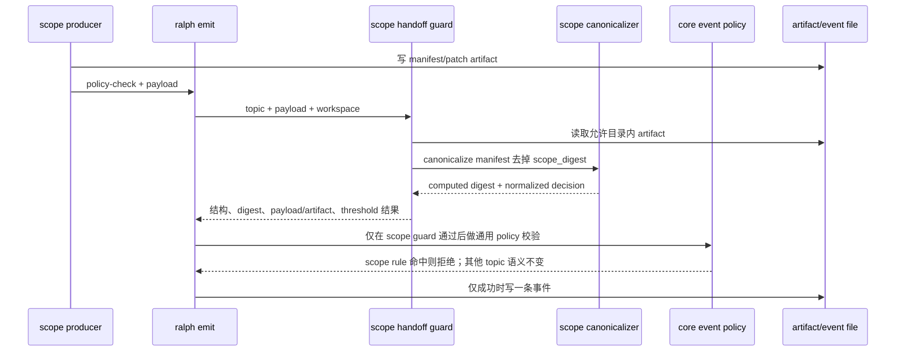

# fix: 根治 scope handoff 反向门禁与 digest 契约漂移

## Goal Capsule

- **Objective：** 修复 `redteam.plan.resolved`、`postmerge.changemap.ready` 和 merge scope 交接中的 P0/P1 错误，同时证明 `ce-executor-pipeline`、`ce-executor-pipeline-loop` 及其他非 scope topic 的既有 `payload_consistency` 行为不变。
- **范围 authority：** 当前代码和可执行测试优先于注释与 agent-facing 文档；scope 规则由现有 CLI scope handoff 入口和对应 preset schema 共同定义；通用 `payload_consistency` 仍保持“谓词命中即拒绝”的语义。
- **执行 profile：** 严格按 U1 → U2 → U3 → U4 → U5 执行。每个 Unit 必须先完成 Acceptance Red，再完成最小实现、单元测试、集成验证、受影响回归和完成检查。
- **停止条件：** 发现 scope guard 的真实调用链与本计划不符、公共 evaluator 必须改变语义才能通过 scope 测试、digest 兼容范围无法确认、`ce-executor-pipeline` 出现未解释行为变化、或任一关键 Decision 置信度下降到 0.85 以下时停止并更新计划。
- **Tail ownership：** 本计划只定义修复边界和验证合同；Coding Agent 不得为了让 scope 测试通过而翻转公共 evaluator、放宽非 scope preset、跳过 builtin parity 或删除失败断言。
- **Product Contract preservation：** 沿用 `docs/plans/2026-08-08-004-feat-multi-plan-scope-resolution-and-convergence-gates-plan.md` 的 scope 业务目标，不改变三套 preset 的业务流程；本计划仅修复该计划实现后暴露的门禁语义和 artifact 交接缺陷。

## Product Contract

### Requirements

- **R1. Scope 合法结果必须能够通过。** 当 scope topic 的 payload 满足已声明 schema 和业务阈值，`ralph emit --policy-check` 与正式 emit 都必须接受；不得因为字段存在或 confidence 达标而触发违规门禁。
- **R2. Scope 非法结果必须继续被拒绝。** 缺少强制字段、类型错误、路径越界、digest 不匹配、低 confidence、critical unknown、resolved count 不足或 boundary conflict 等情况必须返回结构化拒绝，不得写入事件文件。
- **R3. 通用 payload gate 语义不可改变。** `payload_consistency` 规则仍表示“`when` 命中即为违规”；`work.done`、`fix.done` 和 pipeline 规则的合法/非法边界不得被 scope 修复改变。
- **R4. Scope digest 必须有单一、可复算的定义。** manifest 的 digest 必须按固定 canonical JSON 规则计算，不能把自身字段算入 digest；校验和生成必须使用同一规则。
- **R5. Payload 与 artifact 必须自洽。** scope payload 中的关键决策字段不能与 manifest 中的 scope decision 相互矛盾；只验证路径和文件 hash 不足以证明交接正确。
- **R6. `redteam.attack.mapped` 的合法 predecessor 必须通过。** `predecessor_event` 缺失或不是规定 topic 时拒绝；字段存在且值正确时不得被同一条 payload rule 误拒绝。跨事件历史证明不在本次新增范围内，schema 与既有事件状态路径已有的约束保持不变。
- **R7. 同类配置错误必须在 preset 检查阶段暴露。** scope topic 不得使用“合法条件命中即拒绝”的 structural assertion；严格 preset lint 必须阻止同类规则重新进入 builtin preset。
- **R8. 文档、schema、preset 和 runtime 必须一致。** agent-facing scope digest 流程、schema 字段说明、preset gate 语义和 CLI 实现必须描述同一行为。

### Actors and callers

- **Operator：** 通过 `ralph emit --policy-check` 或正式 `ralph emit` 发送 scope handoff。
- **Scope-producing hat：** `merge-batch`、`post-merge-converge`、`red-team-attack` 的 producer 写 artifact 并构造 payload。
- **Runtime：** `ralph-cli` 的 scope handoff guard、`ralph-core` 的 event policy validator 和 preset lint。
- **其他 preset：** 尤其是 `ce-executor-pipeline` 和 `ce-executor-pipeline-loop`，继续使用通用 payload consistency 规则。

### Current and target observable behavior

| 行为 | 当前代码可观察结果 | 目标结果 |
| --- | --- | --- |
| resolved confidence | `overall_confidence: 100` 命中 `gt: 89`，被当作违规拒绝 | 达标值通过；低于阈值才拒绝 |
| scope field presence | `exists: true` 命中后拒绝合法 payload | structural presence 由 schema/typed scope guard 校验 |
| attack predecessor | `exists:true AND eq` 在合法值存在时命中并拒绝 | 缺失由 required field 拒绝，错误值由允许值/负向规则拒绝，正确值通过 |
| digest | 文档要求去掉 `scope_digest` 后 canonicalize，代码却 hash 原始文件字节 | 生成与校验共用同一 self-excluding canonicalizer |
| pipeline payload | 现有矛盾 payload 通过 `payload_consistency` 被拒绝 | 行为保持不变，新增回归证明 |

### Scope boundaries

**In scope：**

- `crates/ralph-cli/src/policy_check/gates.rs` 的 scope digest、scope payload/artifact 一致性和 scope threshold 校验。
- `crates/ralph-core/src/preset_lint/` 的 scope 规则结构性防回归 lint。
- `presets/en/red-team-attack.yml`、`presets/en/post-merge-converge.yml`、`presets/en/merge-batch.yml` 的错误 scope rules。
- 受影响的三个 preset schema、builtin integration/BDD fixture、scope handoff unit tests、pipeline characterization/regression tests。
- `crates/ralph-core/data/ralph-tools-emit.md` 和 preset author/review 资料中的 scope contract。

**Out of scope：**

- 不修改通用 `event_policy_payload_consistency::evaluate` 的 Hit/Miss 语义。
- 不改 `work.done`、`fix.done`、`stabilization.*` 或其他非 scope topic 的业务规则。
- 不新增 CLI 子命令、环境变量、数据库迁移或外部依赖。
- 不引入新的跨事件 predecessor 状态机；本次只修正现有 schema/payload gate 的反向表达。
- 不重新设计 8 月 8 日计划中的 Git scope attribution 算法。

**Deferred to Follow-Up Work：**

- 将 scope validator 从 `policy_check/gates.rs` 拆成独立模块，仅在实际文件规模或编译依赖证明必要时处理。
- 为 scope producer 提供 runtime 自动生成 payload 的新 CLI/API；本次先通过验证 payload 与 manifest 一致性阻断错误交接。
- 对所有历史遗留 scope artifact 做批量重写；旧 artifact 在新规则下需要重新生成，不做静默迁移。

### Inputs, outputs, state, errors, constraints

- **Inputs：** topic、JSON payload、workspace root、scope manifest/patch 文件、当前 preset config 和已有事件状态。
- **Outputs：** accepted/rejected policy result；拒绝时保留现有 `ValidationError`、`reason_code`、gate 和 observed fields 结构；成功时继续写入一个业务事件。
- **State change：** policy-check 不产生事件；正式 emit 只有所有 guard 通过后才写事件；失败不写事件文件。
- **Error semantics：** 结构错误、类型错误、路径错误、digest 错误、threshold 错误和 payload/artifact 不一致全部 fail-close；非 scope topic 不进入 scope guard。
- **Compatibility:** 不兼容错误的旧 scope digest 和错误 scope rule；必须重新生成 scope artifact。非 scope preset 的既有 payload semantics 保持兼容。
- **Performance:** scope guard 只读取已声明的 manifest/patch 文件一次并做有限 JSON 解析；不增加 Git 扫描、不读取外部服务、不引入异步路径。
- **Security:** 保持 `.ralph/{merge,post-merge,red-team}/` 路径限制、路径穿越阻断、符号链接边界和 digest 验证；`--unsafe-no-policy-check` 不能绕过 scope guard。

### Confirmed and unconfirmed assumptions

**已确认事实：** 见 Evidence Ledger E1–E12。

**待验证假设：**

- 无。manifest 形状和 digest 输出规则已经在 D8 中固定；执行期间若真实 artifact 与 D8 冲突，必须触发 Unit stop condition，而不是增加兼容分支。

## Planning Contract

### Current implementation entry and call chain

```text
ralph emit [--policy-check] topic -j payload
  → crates/ralph-cli/src/commands/emit/command_impl.rs
  → policy_check::gates::check_scope_handoff_guard
  → topic-specific scope checks in policy_check/gates.rs
  → policy_check::unified / ralph-core event policy validation
  → event_policy::validation::payload_consistency rules
  → accept or reject before event-file write
```

`payload_consistency` is a same-payload pure evaluator. `exists:true` returns `Hit` when a field exists, and `Hit` is converted into `SemanticGateViolation`; this is not an assertion framework. Scope artifact file reads and SHA checks are in the CLI guard. Preset lint currently validates rule shape, topic, fields and operators, not semantic polarity.

### Evidence Ledger

| Evidence ID | 来源 | 观察结果 | 对计划的影响 | 可靠性 |
| --- | --- | --- | --- | --- |
| E1 | `crates/ralph-core/src/event_policy_payload_consistency.rs::EvalOutcome`, `eval_predicate`, tests `exists_present_value_is_hit` | `Hit` 表示规则命中，随后由 runtime 当成拒绝；`exists:true` 对存在字段返回 `Hit` | 禁止全局翻转 evaluator；scope 修复必须改规则归属或规则表达 | 高 |
| E2 | `crates/ralph-core/src/event_policy/validation.rs::validate_event` payload consistency 分支 | 只对当前 payload 求值，首个 Hit 生成 `payload_consistency:<id>` gate | predecessor 不能用“合法条件”写成 same-payload 正向 assertion；跨历史能力不能凭 YAML 声称存在 | 高 |
| E3 | `presets/en/red-team-attack.yml:215-309` | resolved confidence/coverage 和多条 `exists:true` 规则会在合法 payload 命中；predecessor 使用 `exists:true AND eq` | P0 直接来源；U3 必须逐条替换并加合法/非法成对测试 | 高 |
| E4 | `presets/en/post-merge-converge.yml:199-258` | resolved confidence 与 scope structural fields 具有同类反向表达 | P1 不是 red-team 特例，U3 必须覆盖 post-merge | 高 |
| E5 | `presets/en/merge-batch.yml:119-137` | boundary path/status 使用 `exists:true AND non_empty:true`，合法字段会命中 | merge-batch 也会受影响，不能只修 red-team | 高 |
| E6 | `crates/ralph-cli/src/policy_check/gates.rs:799-855,1194-1255` | scope guard 已是四个 scope topic 的强制入口；校验路径、字段类型和原始文件 SHA | 复用现有入口，不新增 CLI；U1/U2 在此收敛 digest 与 scope semantics | 高 |
| E7 | `crates/ralph-cli/src/policy_check/gates.rs:62-105` | 注释和注入文档声称 digest 排除自身字段，但实现直接 hash 原始文件 bytes | P1 是实现/文档契约漂移；U1 必须统一生成和校验算法 | 高 |
| E8 | `crates/ralph-core/src/preset_lint/payload_consistency.rs:51-145` | lint 检查 duplicate/topic/field/op/shape/message，不检查“合法条件被写成拒绝条件” | U4 增加针对受保护 scope topic 的结构性 lint；不靠自然语言 message 推断 | 高 |
| E9 | `crates/ralph-core/tests/scenarios/redteam_scope_direct_target.yml` 与 `scenarios.rs` | 现有 green 场景使用精简自定义 config，不覆盖 builtin red-team payload rules | 必须增加真实 builtin CLI/BDD acceptance，避免 fixture 把错误规则删掉 | 高 |
| E10 | `crates/ralph-core/tests/scenarios/redteam_scope_attack_mapped_gate.yml:120-157` | 只测试缺 predecessor 被拒绝，没有测试合法 predecessor 通过 | U3 必须补合法 predecessor acceptance，防止门禁只会拒绝 | 高 |
| E11 | `presets/schemas/red-team-attack.yml:186-214` | `predecessor_event` 已是 required field，并有 literal allowed-value 文档 | 删除反向 `exists:true` 规则后，missing/错值由 schema/allowed value 负责；不需要新增状态机 | 高 |
| E12 | `crates/ralph-cli/src/presets.rs:1647-1844` 与 `crates/ralph-core/src/event_policy/tests/tests_part2.rs:3580-3711` | ce executor pipeline 已有合法 payload 与真正矛盾 payload 的 payload gate 测试 | U3/U4 必须将这些测试作为回归保护，不修改公共 evaluator | 高 |
| E13 | `docs/plans/2026-08-08-004-feat-multi-plan-scope-resolution-and-convergence-gates-plan.md:197-227,256-284` | 上游计划明确复用现有 scope guard、payload consistency 和 canonical scope manifest，但当前实现留下了 digest 与 polarity 缺口 | 本计划是对该计划实现结果的纠偏，不重新定义 scope 业务目标 | 高 |
| E14 | `cargo nextest run -p ralph-core --test scenarios -- redteam_scope_`、`cargo nextest run -p ralph-cli --bin ralph -- preset_lint` | 现有 redteam scope scenarios 通过；preset_lint 匹配测试通过，但未发现 semantic polarity | “测试绿”不能作为 builtin 语义正确的证据；U3/U4 必须补真实行为覆盖 | 高 |

### Key Technical Decisions

| Decision ID | 决策问题 | 候选方案 | 最终选择 | 支持证据 | 排除其他方案的原因 | 置信度 |
| --- | --- | --- | --- | --- | --- | --- |
| D1 | 是否修改公共 payload evaluator 语义 | 全局把 Hit 改成 assertion success；为 scope 增加另一个 evaluator；保持 evaluator 不变并修正 scope owner | 保持 evaluator 不变，scope 结构/阈值由现有 scope guard 负责，preset 只声明负向矛盾 | E1、E2、E12 | 全局翻转会直接改变 ce executor 的既有拒绝行为；新增第二 evaluator 会造成语义分叉 | 0.98 |
| D2 | scope digest 放在哪一层统一 | 新 CLI 命令；agent 各自计算；复用现有 `policy_check/gates.rs` helper 并让生成/校验共用 canonicalizer | 扩展现有 scope guard 所在模块；不新增 CLI surface；canonicalizer 是该模块的唯一 digest 入口 | E6、E7、E13 | 新命令超出范围；分散实现正是当前漂移根因 | 0.93 |
| D3 | digest 如何兼容旧错误 artifact | 兼容 raw-byte digest；同时接受两种算法；切换为 canonical self-excluding 并要求旧 artifact 重生成 | 使用文档已经声明的 canonical self-excluding 规则；旧 scope artifact fail-close，不做双算法 | E7、E13、U1 round-trip 验收要求 | 双算法会保留歧义并继续让 producer 选择错误算法；本计划无历史批量迁移需求 | 0.90 |
| D4 | scope threshold 放在哪里 | 继续增加正向 YAML rules；扩展通用 DSL；在现有 scope guard 做显式 typed checks | 在四个 scope topic 的 typed guard 中校验 status/confidence/count/coverage/proceed/boundary consistency；通用 YAML 只保留真实矛盾 | E2、E6、E8 | 通用 DSL 没有 `lt/lte/not` 等表达全部 invalid cases 的稳定能力；正向 YAML 已证明容易反转 | 0.91 |
| D5 | predecessor gate 如何修复 | 新增跨事件状态机；保留反向 `exists+eq`；删除 `exists` 并使用 schema required/allowed value 和负向 wrong-value rule | 不新增状态机；让 required/allowed value 负责 missing/wrong，合法 literal 只通过；如保留 payload rule，必须是“值不等于 literal”的违规表达 | E10、E11、E2 | 本次未发现可直接复用的 redteam prior-event typed state API；新增状态机扩大范围且不是 P0 必需条件 | 0.88 |
| D6 | 如何防止同类规则复发 | 只依赖 code review；按 message 文本做启发式 lint；增加 scope topic/field/operator 的结构性 lint | 新增 deterministic lint `preset.payload_consistency_scope_positive_assertion`，保护四个 scope topic 的 structural fields（path/digest/status/base SHA/patch fields/predecessor）和 positive threshold predicates（resolved confidence/coverage/count）；不解析 message 文案；pipeline 规则走原 lint | E8、E12 | message 文本不是稳定契约；全局禁止 `exists` 会误伤合法负向规则；按 scope contract 限定影响面 | 0.92 |
| D7 | 如何证明其他 preset 未回归 | 只跑 scope tests；修改后跑全 workspace；先固定 pipeline characterization，再跑受影响回归和全量 | U1/U3 先固定/执行 pipeline 既有行为，U4 lint parity，最后按仓库 nextest + full gate 验证 | E12、AGENTS.md build/test hard rules | 只跑全量不能证明关键行为；只跑 scope 不能发现 pipeline 语义漂移 | 0.95 |
| D8 | scope manifest 使用哪一种 decision 形状 | 同时接受当前运行中出现的嵌套 `resolution` 和计划定义的顶层 contract；只接受 `multi-plan-scope/v1` 顶层 canonical contract | 只接受上游计划定义的 `multi-plan-scope/v1` canonical top-level fields；旧的嵌套 `resolution` artifact fail-close，producer 文档/fixture 必须重写为 canonical shape | E13 明确定义 manifest top-level fields；本次诊断 artifact 显示嵌套 shape 导致 payload handoff drift；U2/U5 的真实 fixture 验证该边界 | 双格式兼容会永久保留不确定字段来源并掩盖 producer 未按 contract 写 artifact；本次目标是消除而不是扩大 ambiguity | 0.90 |

### High-Level Technical Design



边界原则：scope guard 负责文件、digest、typed decision 和跨字段关系；core payload evaluator 只负责既有 same-payload negative predicates；schema 负责 required/allowed value；preset lint 只在加载时阻止已知的 scope assertion 反转。

### Adversarial review target

计划完成后必须专门尝试以下绕过：

- 在 `redteam.plan.resolved` 中把 confidence 从 90 改为 100，确认仍通过而不是命中旧规则。
- 删除 manifest 字段但保留 payload 字段，确认 reject。
- 修改 manifest 决策字段而不改 payload，确认 reject。
- 改变 manifest `scope_digest` 自身，确认 canonical digest 不自引用且校验结果稳定。
- 用错误 predecessor、缺失 predecessor、正确 predecessor 各发一次，确认只有前两者拒绝。
- 用合法 `work.done`/`fix.done` 和真正矛盾的 ce executor payload，确认原行为分别保持通过/拒绝。
- 在 scope topic 增加一个新的 `exists:true` structural assertion，确认 strict preset lint 拒绝。

## BDD 行为规格

### Feature: Scope handoff accepts valid evidence without changing pipeline gates

  Background:
    Given workspace contains a readable scope manifest and patch under the topic-specific `.ralph` root
    And the selected builtin preset is loaded through the real CLI path

  Scenario: A valid red-team resolved handoff is accepted
    Given `scope_status=resolved`, confidence is at least 90, critical unknown count is zero, and all artifact digests match
    When the producer runs `ralph emit redteam.plan.resolved --policy-check`
    Then validation succeeds
    And the real emit writes exactly one event only after the same guard succeeds

  Scenario: A low-confidence resolved handoff is rejected
    Given the payload says `scope_status=resolved` and confidence is below 90
    When the producer runs policy-check
    Then validation returns a structured scope handoff error
    And no event row is written

  Scenario: A payload that disagrees with the manifest is rejected
    Given the manifest records a different confidence or scope status than the payload
    When the producer runs policy-check
    Then validation rejects the handoff
    And the error identifies the inconsistent scope field

  Scenario: Canonical digest is stable and self-excluding
    Given the manifest is serialized with the canonical scope format and contains its digest field
    When the digest is recomputed by the guard
    Then the declared digest matches the computed digest
    And changing only the digest field does not change the bytes used for digest calculation

  Scenario: A tampered artifact is rejected
    Given the payload declares a digest for a manifest or patch whose bytes were changed
    When the producer runs policy-check, including with `--unsafe-no-policy-check`
    Then the scope guard rejects before any event write

  Scenario: A legal attack predecessor is accepted
    Given `redteam.attack.mapped` contains the required literal predecessor value and all schema fields
    When the attack-surface mapper runs policy-check
    Then validation succeeds

  Scenario: An absent or wrong attack predecessor is rejected
    Given `predecessor_event` is absent or has another value
    When the attack-surface mapper runs policy-check
    Then validation rejects and experiment-runner is not activated

### Feature: Existing pipeline payload consistency remains unchanged

  Scenario: A legal ce-executor completion payload remains accepted
    Given a valid `work.done` or `fix.done` payload from the existing pipeline tests
    When the same event policy validator runs
    Then it remains accepted

  Scenario: A true ce-executor contradiction remains rejected
    Given a completion payload claims success while carrying failed or blocked units
    When the same event policy validator runs
    Then the existing `payload_consistency:<rule_id>` gate rejects it
    And the gate name and observed fields remain available to correction tooling

### Feature: Preset lint blocks recurrence

  Scenario: A scope structural assertion written as a positive existence rule is rejected at strict lint
    Given a preset declares `exists:true` for a protected scope structural field
    When strict preset lint runs
    Then it returns the dedicated polarity/contract finding
    And the preset is not accepted as a runnable builtin

  Scenario: A non-scope negative contradiction rule remains allowed
    Given `ce-executor-pipeline` declares a same-payload contradiction rule
    When strict preset lint runs
    Then no new scope-polarity finding is produced for that rule

## Acceptance and Test Strategy

| Scenario | Acceptance condition | Test entry and layer | Risk supplement | E2E |
| --- | --- | --- | --- | --- |
| valid redteam resolved | real builtin policy-check accepts and formal emit writes one event | new/extended `crates/ralph-cli/tests/integration_emit_policy.rs`, CLI integration | Characterization of existing scope guard plus real artifact files | No; CLI integration covers boundary |
| low threshold / inconsistency | reject with `scope_handoff_inconsistent`, no event write | `crates/ralph-cli/src/policy_check/gates.rs` unit tests | boundary values 89/90/100; nested decision shape | No |
| canonical digest | producer/checker agree and digest field is excluded | scope guard unit tests in existing gates test module | round-trip and order/whitespace mutation tests | No |
| tampered file | reject raw artifact change and unsafe bypass | existing CLI integration test file plus gates unit test | fault injection by editing file after digest calculation | No |
| legal/wrong predecessor | legal accepts; missing/wrong rejects | `crates/ralph-core/tests/scenarios.rs` real EventLoop fixture plus CLI integration | state/retry assertion that experiment-runner is not activated | No |
| pipeline preservation | existing legal/contradictory work.done/fix.done outcomes unchanged | `crates/ralph-core/src/event_policy/tests/tests_part2.rs`, `crates/ralph-cli/src/presets.rs` | differential characterization before/after | No |
| lint recurrence | protected scope positive assertion fails strict lint; pipeline negative rule unaffected | `crates/ralph-core/src/preset_lint/payload_consistency.rs` tests and builtin lint command | mutation-style swap of `gt`/`exists` polarity | No |
| docs/schema parity | docs and schema describe actual canonical digest and gate ownership | `scripts/check-cli-doc-drift.sh`, preset parity/preset lint | author/review fixture anchor checks | No |

All CLI integration tests must scrub inherited agent runtime environment when they model human CLI behavior, following `crates/ralph-cli/tests/common/mod.rs` conventions.

## Requirements–Test–Unit Traceability

| Requirement | BDD scenarios | Acceptance tests | Unit tests | Integration/contract | E2E | Evidence |
| --- | --- | --- | --- | --- | --- | --- |
| R1 | valid redteam resolved; legal predecessor | CLI builtin acceptance | scope guard valid payload tests | `integration_emit_policy` | No | E3,E6,E9,E10 |
| R2 | low threshold; payload mismatch; tampered artifact; wrong predecessor | CLI rejection tests | boundary/error tests | real emit no-write assertions | No | E3,E6,E7 |
| R3 | legal/contradictory pipeline payload | existing pipeline tests remain exact | evaluator characterization | core event policy tests | No | E1,E2,E12 |
| R4 | canonical digest stable; tampered artifact | digest acceptance/rejection | canonicalizer round-trip tests | CLI guard artifact verification | No | E7,E13 |
| R5 | payload/artifact mismatch | structured rejection | normalized decision comparison | builtin CLI acceptance/rejection | No | E6,D8 |
| R6 | legal/wrong predecessor | attack mapped integration/BDD | schema/predicate tests | real EventLoop scenario | No | E10,E11 |
| R7 | lint recurrence | strict preset lint | lint finding tests | all builtin strict lint | No | E8,E14 |
| R8 | docs/schema parity | drift and parity checks | no separate unit | doc/schema command gates | No | E7,E13 |

## Implementation Units

执行顺序固定为：

`U1 → U2 → U3 → U4 → U5`

### U1. 固定 scope digest canonicalization 行为

**1. Unit 目标**

让 scope manifest 的 digest 生成和校验对同一份 artifact 使用同一套“排除自身字段的 canonical JSON”规则，同时不改变 patch digest 和 merge boundary digest 的既有语义。

**2. 对应需求与 Scenario**

- Requirements: R4。
- Scenarios: canonical digest stable; tampered artifact。
- Decisions: D2、D3。
- Evidence: E6、E7、E13。

**3. 外部可观察结果**

scope payload 的 `scope_digest` 按文档生成后，`ralph emit redteam.plan.resolved --policy-check` 不再因为 runtime 使用另一套 hash 输入而拒绝；修改 manifest 内容仍然拒绝。

**4. 当前行为基线**

当前 `verify_artifact_digest` 直接对原始文件 bytes hash，而注入文档规定移除 `scope_digest` 后 canonicalize。现有 tests 只用不含 digest 的简单 artifact，因此没有捕获自引用/格式漂移。

**5. 输入与输出**

- 输入：允许目录内的 JSON manifest、声明 digest、digest 字段名。
- 输出：computed digest 或 `scope_handoff_inconsistent`。
- 错误：文件不可读、JSON 无法解析、canonicalization 失败、digest mismatch 均 reject。
- 不变量：patch 文件仍按其既有 raw-byte digest；merge boundary 仍走其既有 canonical boundary helper；非 scope topic 不调用此路径。

**6. 修改位置**

- `crates/ralph-cli/src/policy_check/gates.rs`：当前职责是 scope artifact path/digest guard；将 scope manifest digest 分支明确分离为计划新增的内部 `verify_scope_manifest_digest` 逻辑，保留 `verify_artifact_digest` 对 patch artifact 的 raw-byte 语义和 merge boundary 的现有分支。
- `crates/ralph-cli/src/policy_check/gates.rs` 内现有 tests：增加 canonical round-trip、self-exclusion、tamper 和 malformed JSON 测试。
- `crates/ralph-core/data/ralph-tools-emit.md`：U5 才同步文档；U1 先以代码测试固定实际规则，避免本 Unit 同时改 agent guidance。

明确不修改 `event_policy_payload_consistency.rs`、`commands/emit/command_impl.rs`、patch digest 的输入规则和任何 pipeline preset。

**7. 可依赖能力**

已有 `verify_artifact_digest`、`verify_canonical_json_digest`、`sha2` 依赖和 tempfile artifact tests。

**8. 禁止依赖的未来能力**

不得等待 U2 的 payload/artifact decision 比对；U1 只证明 digest 输入一致，不提前改变 threshold 或 payload schema。

**9. 验收测试**

- canonical manifest 含 `scope_digest` 时，生成/校验得到相同 digest。
- 仅修改 `scope_digest` 字段本身时，canonical digest 输入不变。
- 修改任一业务字段时，digest 变化并 reject 旧声明。
- manifest 不是 JSON object、文件不存在或 path 越界时 reject。
- patch digest 的现有 raw-byte acceptance/rejection tests 继续通过。

**10. Acceptance Red**

首先新增 `scope_digest_excludes_self_and_uses_canonical_json` characterization/acceptance test，使用包含自身 digest 字段的 manifest，并按 `ralph-tools-emit.md` 规则计算期望值。当前实现预期失败，失败原因必须是 declared digest 与原始 bytes hash 不一致；编译失败、fixture 缺失或测试未进入 `verify_artifact_digest` 不算有效 Red。

**11. 单元测试拆分**

- canonical object with self digest：输入含 digest，期望 computed digest 等于去 self 后 canonical bytes 的 hash。
- self-field mutation：只改 digest 值，期望 computed digest 不变。
- content mutation：改业务字段，期望 computed digest 改变。
- malformed/non-object manifest：期望结构化 scope error，不 panic。
- patch raw digest characterization：输入 patch bytes，期望仍按原始 bytes hash。

不 Mock hash 或 JSON canonicalization；文件系统只使用现有 tempfile pattern。

**12. Red → Green → Refactor 顺序**

1. 运行 self-excluding canonical test，确认当前 raw-byte helper 真实失败。
2. 在现有 scope digest helper 内引入统一 canonicalization，并让 scope manifest 分支使用它。
3. 运行 self-exclusion 和 content mutation tests 至 Green。
4. 增加 malformed/patch preservation tests，逐个 Green。
5. Refactor 仅限 helper 重复逻辑，保持错误字段和 reason code 不变。

**13. 最小实现范围**

只实现 scope manifest 的 canonical self-excluding digest；不接受双算法、不添加兼容开关、不改变 patch digest 和 merge boundary digest。

**14. 集成验证**

使用真实 `check_scope_handoff_guard` 和临时 workspace；真实读取 manifest，禁止 Mock 文件内容。正式 event write 不在本 Unit 验证，留给 U2/U3。

**15. 风险驱动测试**

采用 round-trip/property-style 字段顺序与 digest 自身变异测试，因为当前缺陷来自编解码输入契约漂移；不增加 fuzz，当前 JSON 体积和 parser 边界不属于本 Unit 的新风险。

**16. 回归范围**

运行 gates 内 merge/postmerge/redteam digest tests；确认 merge boundary canonical helper 和 patch raw digest characterization 不变。未通过不得进入 U2。

**17. 预期文件变更**

| 位置 | 变更类型 | 变更原因 | Evidence |
| --- | --- | --- | --- |
| `crates/ralph-cli/src/policy_check/gates.rs` | 修改现有生产文件和测试 | 统一 scope manifest digest 输入 | E6,E7 |

**18. 完成标准**

所有 U1 tests Green；现有 gates tests Green；无公共 evaluator/pipeline diff；fmt、targeted nextest、build 通过；证据记录补充实际 canonical bytes 行为。

**19. 停止条件**

canonical JSON 与现有 manifest fixture 无法同时满足、需要双算法、需要新增依赖、或 patch/merge digest 行为发生未计划变化时停止。

**20. 风险与注意事项**

- 风险：旧 scope artifact 使用 raw digest。检测：旧 fixture/运行 artifact 的 declared digest 在新 canonicalizer 下失败。缓解：明确旧 artifact 需重生成，不提供静默双兼容。剩余风险：运行中的旧 loop 需要重新写 artifact。
- 风险：`serde_json` 对 map order 的行为与文档假设不一致。检测：round-trip/order mutation test。缓解：以测试固定的 canonical serializer 作为唯一实现，不依赖注释。

### U2. 在现有 scope guard 中验证 typed decision 与 artifact 一致

**1. Unit 目标**

让四个 scope topic 在 digest/path/type 检查之后，拒绝 payload 与 manifest decision 不一致或违反 resolved threshold 的交接。

**2. 对应需求与 Scenario**

- Requirements: R1、R2、R5。
- Scenarios: valid redteam resolved; low threshold; payload disagrees with manifest; tampered artifact。
- Decisions: D2、D4。
- Evidence: E3、E4、E5、E6、D8。

**3. 外部可观察结果**

同一个 artifact 的合法 flattened payload 通过；缺字段、类型错误、低 confidence、critical unknown、resolved count/coverage/boundary 矛盾或 payload/artifact mismatch 都在 event write 前以结构化 scope error 拒绝。

**4. 当前行为基线**

`check_scope_handoff_guard` 已按 topic 分支验证必需字段、路径和文件 hash，但 `check_redteam_plan_resolved_scope_fields` 与 postmerge counterpart 对 `_overall_confidence`、`_critical_unknown_count` 等值只做存在和 u64 类型读取，未验证 manifest decision 与 payload 的一致性；threshold 主要错误地散落在 payload rules。

**5. 输入与输出**

- 输入：scope topic、payload object、manifest JSON、patch/boundary artifact。
- 输出：`Ok` 或既有 `ValidationError`，字段指向第一个不一致的 scope field。
- 状态：失败时不写事件；成功不改变 payload，继续进入既有 event policy。
- 不变量：只对四个 scope topic生效；路径限制和 unsafe bypass 强制保留。

**6. 修改位置**

- `crates/ralph-cli/src/policy_check/gates.rs`：扩展现有四个 topic-specific scope functions；使用 U1 canonical digest；加入 manifest decision extraction、payload comparison 和 typed threshold checks。
- `crates/ralph-cli/src/policy_check/gates.rs` tests：扩展已有 `redteam_plan_resolved_accepts_real_artifact`、postmerge acceptance 和 rejection tests，使用真实 JSON artifact。
- `crates/ralph-cli/tests/integration_emit_policy.rs`：扩展真实 `ralph emit` subprocess 测试，使用 builtin preset 和 `scrub_agent_runtime_env` 约定。

明确不修改 core evaluator，不让 CLI guard读取 `.ralph/events.jsonl` 代替 manifest，不新增 config field。

**7. 可依赖能力**

依赖 U1 canonical digest、已有 `required_scope_string/u64`、`validate_scoped_artifact_path` 和 `verify_artifact_digest`。

**8. 禁止依赖的未来能力**

不得等待 U3 删除 preset rules；U2 必须在当前错误 rules 仍存在时证明 scope guard 的独立错误行为。U2 不修改 schema 或 prompt。

**9. 验收测试**

- redteam resolved payload 与 manifest decision 完全一致时通过。
- confidence 89 reject，90/100 按 schema/threshold 规则分别验证。
- critical unknown > 0、resolved count=0、coverage<90、boundary conflict=true 时 reject。
- payload 与 manifest 的 confidence/status/base SHA 任一不一致时 reject。
- JSON number 作为字符串、null、缺失字段均 reject，不 panic。
- manifest/patch tamper 仍 reject，`--unsafe-no-policy-check` 不能绕过。

**10. Acceptance Red**

新增 `redteam_builtin_scope_payload_matches_manifest` 和 `redteam_scope_threshold_boundary` 测试，先运行当前 scope guard。当前代码预期会在后续通用 payload rule 或字段读取上失败，或无法发现 payload/artifact mismatch；有效 Red 必须显示目标字段没有被 typed guard 检查，而不是显示 fixture/命令问题。

**11. 单元测试拆分**

- decision extraction：固定 D8 的 top-level manifest shape；嵌套 `resolution` 形状必须返回明确的 contract mismatch，不允许 fallback。
- resolved threshold matrix：89/90/100、critical unknown 0/1、resolved count 0/1、coverage 89/90。
- payload/artifact equality：逐字段变异，期望精确 field/reason code。
- type/null/missing：期望 `scope_handoff_inconsistent`。
- topic isolation：非 scope topic 不调用 scope validator。

不 Mock manifest parser 或 digest；可以 Fake workspace path，但 artifact 文件必须真实写入 tempfile。

**12. Red → Green → Refactor 顺序**

1. 先运行 valid/mismatch/threshold acceptance tests，记录当前错误 rules 或 guard 缺口。
2. 实现 decision extraction 与 equality check，先让 valid/mismatch Green。
3. 增加 threshold matrix，按字段逐个 Green。
4. 保留并运行 tamper/path/type rejection tests。
5. Refactor 错误构造，保持 reason code 和 observed field 结构可供 correction tooling 使用。

**13. 最小实现范围**

只增加 scope typed checks和 payload/artifact consistency；不改变通用 payload evaluator，不引入新的 event state machine，不自动修复 payload。

**14. 集成验证**

必须通过真实 `ralph emit` subprocess 验证 policy-check 和正式 emit 两条路径；验证 reject 时 events 文件为空，accept 时只写一条事件。可以使用临时 preset workspace，但必须在 U3 前增加 builtin preset 真实覆盖，不能将精简 config 作为最终证据。

**15. 风险驱动测试**

采用 contract test 风格验证 payload ↔ manifest；采用边界矩阵验证阈值；采用 fault injection 修改 artifact bytes 验证 fail-close。并发不适用，因为 guard 是单次同步读取且本 Unit 不改变写锁。

**16. 回归范围**

运行现有 gates tests、`integration_emit_policy` scope handoff tests、CLI policy-check tests；确认非 scope topic pass-through 和 unsafe scope rejection 保持。

**17. 预期文件变更**

| 位置 | 变更类型 | 变更原因 | Evidence |
| --- | --- | --- | --- |
| `crates/ralph-cli/src/policy_check/gates.rs` | 修改现有生产文件和测试 | typed scope decision/threshold/equality | E6,D8 |
| `crates/ralph-cli/tests/integration_emit_policy.rs` | 新增/修改集成测试 | 真实 CLI accept/reject/no-write | E6,E9 |

**18. 完成标准**

四个 scope topic 的 guard matrix Green；CLI accept/reject/no-write 通过；不修改公共 evaluator；U1 与现有 digest tests 通过。

**19. 停止条件**

真实 canonical manifest shape 无法稳定解析、必须支持多个互相冲突的 artifact schema、或 payload/artifact equality 会破坏既有 accepted fixture 时停止，重新审查 D8 并不得进入 U3。

**20. 风险与注意事项**

- 风险：scope producer 当前可能把 decision 放在嵌套对象而 payload 使用顶层字段。检测：characterization fixture。缓解：只选择一个明确 schema shape 并同步 schema/prompt。剩余风险：旧 producer 需要重写 payload。
- 风险：threshold 从 YAML 移到 CLI 后错误信息顺序变化。检测：断言 reason code/field，不锁定无关文本。缓解：保持结构化 field/gate，不改变普通 payload gate 输出。

### U3. 修正三个 builtin preset 的 scope 违规表达并保持 pipeline 语义

**1. Unit 目标**

让三个 builtin preset 只用“真正非法条件”触发拒绝，并让 redteam predecessor 的合法值通过；不改变 ce executor pipeline 的通用 payload semantics。

**2. 对应需求与 Scenario**

- Requirements: R1、R2、R3、R6。
- Scenarios: valid redteam resolved; legal/wrong predecessor; legal/contradictory pipeline payload。
- Decisions: D1、D4、D5。
- Evidence: E1–E5、E10–E12。

**3. 外部可观察结果**

加载 builtin `red-team-attack`、`post-merge-converge`、`merge-batch` 后，合法 scope event 通过；真正的 scope contradiction 被拒绝；`ce-executor-pipeline` 和 loop preset 的既有 accepted/rejected cases 结果不变。

**4. 当前行为基线**

red-team 的 `gt:89`、coverage `gt:89`、多个 `exists:true` 和 predecessor `exists:true AND eq` 会把合法值命中；post-merge 与 merge-batch 存在相同模式。现有 redteam scenario 只用简化 config，攻击 mapped 只覆盖 missing predecessor。

**5. 输入与输出**

- 输入：三个真实 builtin preset config 和 valid/invalid scope payload。
- 输出：preset lint/runtime policy 的 accept/reject；合法 payload 不触发 `payload_consistency` gate。
- 不变量：`payload_consistency` evaluator、非 scope rule、ce executor rule ID/message/observed fields不改变。

**6. 修改位置**

- `presets/en/red-team-attack.yml`：移除 structural positive assertions；保留/改写真正的 negative contradiction；修正 predecessor 为 schema-required/allowed-value 所需的负向表达或删除重复 rule。
- `presets/en/post-merge-converge.yml`：同样移除 positive confidence/exists assertions，保留真正的 resolved contradiction。
- `presets/en/merge-batch.yml`：移除 boundary path/status 的 positive existence assertion；结构校验由 typed guard/schema负责。
- `presets/schemas/red-team-attack.yml`、`presets/schemas/post-merge-converge.yml`、`presets/schemas/merge-batch.yml`：只有当 required/allowed values 与目标行为不一致时同步；不为了测试而复制文案。
- `crates/ralph-core/tests/scenarios/redteam_scope_attack_mapped_gate.yml`：扩展为合法 predecessor acceptance 和 missing/wrong rejection 的真实 EventLoop 场景；不删除原 reject assertion。
- `crates/ralph-cli/src/presets.rs`：只在结构化 builtin parity/semantic tests需要入口时增加测试，不锁定完整 YAML 文案。

明确不修改 `crates/ralph-core/src/event_policy_payload_consistency.rs`、`ce-executor-pipeline*.yml`、`ce-executor-pipeline` preset tests。

**7. 可依赖能力**

依赖 U2 typed guard、现有 schema required/allowed-value validator、现有 builtin embedding/manifest parity。

**8. 禁止依赖的未来能力**

不得提前新增 lint finding；U3 只修当前三套 preset 和真实行为测试，lint 防复发留给 U4。

**9. 验收测试**

- builtin redteam valid resolved payload passes policy-check and formal emit.
- builtin redteam confidence 89/critical unknown/resolved count/coverage/boundary conflict invalid cases reject.
- builtin postmerge valid resolved payload passes; invalid proceed/status combination rejects.
- builtin merge-batch valid boundary payload passes; missing/outside/tampered artifact rejects through guard/schema rather than positive payload rule。
- attack mapped correct predecessor passes; missing/wrong predecessor rejects; experiment-runner remains inactive on rejection.
- existing ce executor legal/contradictory tests produce exact prior accept/reject outcomes。

**10. Acceptance Red**

先运行新增真实 builtin acceptance tests。当前预期至少在 `redteam-scope-resolved-confidence`、`redteam-scope-manifest-path-root` 或 predecessor gate 处失败；若测试没有加载 builtin preset，必须停止并修正测试入口，不得接受“精简 config 绿”。

**11. 单元测试拆分**

- redteam rule matrix：逐条验证 valid/invalid payload 与 rule gate。
- postmerge rule matrix：resolved/blocked/ambiguous 合法和矛盾组合。
- merge-batch boundary matrix：schema/typed guard负责 presence/path，payload consistency不误拒合法字段。
- predecessor matrix：correct/missing/wrong。
- ce executor differential characterization：执行修改前记录的相同 payload，结果与 gate ID/acceptance保持一致。

不允许通过删除或放宽现有 pipeline 断言来 Green；不 Mock `validate_event` 或真实 builtin config。

**12. Red → Green → Refactor 顺序**

1. 运行真实 builtin valid tests，确认旧反向 rules 导致 Red。
2. 先修 red-team rules，跑 redteam valid/invalid matrix Green。
3. 修 postmerge rules，跑 postmerge matrix Green。
4. 修 merge-batch rules，跑 boundary matrix Green。
5. 添加/修正 predecessor negative behavior，跑 correct/missing/wrong matrix Green。
6. 运行 ce executor differential tests，若有任何结果变化立即停止，不修改 pipeline 以掩盖问题。
7. Refactor YAML comments/IDs，使 comments 只解释违规条件，不把“合法要求”写成 `when`。

**13. 最小实现范围**

只修改三个 scope builtin 的 event policy rules 和必要 schema parity；不引入新操作符、不翻转 evaluator、不做全 preset 文案重写。

**14. 集成验证**

使用真实 builtin config 经过 embedded preset/parity 加载，再通过 core EventLoop scenario 和 CLI emit integration 双路径验证。既有 pipeline 测试必须原样运行。

**15. 风险驱动测试**

采用 differential characterization，因为这是高风险配置语义修复；采用 mutation-style rule polarity test，人工把 `exists:true`/positive threshold 恢复到旧形状时测试必须失败。

**16. 回归范围**

直接回归 redteam/postmerge/merge-batch scope scenarios、CLI scope handoff integration、preset strict lint；相邻回归 ce executor pipeline/loop payload tests、所有 public builtin parse/strict lint/parity。不得只跑 scope fixtures。

**17. 预期文件变更**

| 位置 | 变更类型 | 变更原因 | Evidence |
| --- | --- | --- | --- |
| `presets/en/red-team-attack.yml` | 修改配置 | 删除反向 scope rules | E3 |
| `presets/en/post-merge-converge.yml` | 修改配置 | 删除反向 scope rules | E4 |
| `presets/en/merge-batch.yml` | 修改配置 | 删除反向 boundary rules | E5 |
| `presets/schemas/{red-team-attack,post-merge-converge,merge-batch}.yml` | 仅必要时修改配置 | 保持 schema/preset parity | E11,E13 |
| `crates/ralph-core/tests/scenarios/redteam_scope_attack_mapped_gate.yml` | 修改 fixture | 覆盖 legal predecessor | E10 |
| `crates/ralph-core/tests/scenarios.rs` | 修改测试 | 注册/执行真实 workflow scenario | E9,E10 |
| `crates/ralph-cli/src/presets.rs` | 修改测试 | builtin semantic/parity coverage | E12 |

**18. 完成标准**

三个 builtin 的合法 scope path 和所有 invalid matrix Green；ce executor differential tests 无变化；preset parse/strict lint/parity 通过；无 evaluator 修改。

**19. 停止条件**

任何 pipeline accepted/rejected 结果、gate ID、observed field 发生未解释变化；schema required/allowed value 与 prompt 事实冲突；真实 builtin 无法加载时停止，不改成自定义 fixture。

**20. 风险与注意事项**

- 风险：删除 rule 后错误 payload 可能依赖 schema/typed guard才能拒绝。检测：每个 invalid matrix必须在明确的 guard/schema层失败。缓解：不删除对应 structural validation，只删除错误的 positive payload rule。
- 风险：comments继续误导 agent。检测：U5 doc/prompt review 和 rule polarity lint。缓解：所有规则说明写“违规条件”，不写“合法要求”作为 `when`。

### U4. 增加 scope 规则 polarity lint 并锁定非 scope pipeline 不受影响

**1. Unit 目标**

让 strict preset lint 在加载阶段拒绝已知 scope structural/threshold 正向 assertion，同时证明同一 lint 不会限制 `ce-executor-pipeline` 的合法负向规则。

**2. 对应需求与 Scenario**

- Requirements: R3、R7。
- Scenarios: scope structural assertion rejected; non-scope negative contradiction allowed。
- Decisions: D1、D6、D7。
- Evidence: E8、E12、E14。

**3. 外部可观察结果**

错误 scope preset 在运行前得到稳定 finding ID 和指向 rule/topic/field 的诊断；合法 pipeline preset 继续通过 strict lint。

**4. 当前行为基线**

当前 `check_payload_consistency` 只检查结构/字段/op/message，不判断 rule 是否把合法状态写成 Hit。`cargo nextest run -p ralph-cli --bin ralph -- preset_lint` 的匹配测试通过，但没有 semantic polarity finding。

**5. 输入与输出**

- 输入：解析后的 `RalphConfig`、payload rules、strictness。
- 输出：deterministic lint finding；scope protected rule 在 strict mode 是 Error，非 scope rule 不新增 finding。
- 不变量：默认 lint 的既有 severity 模型和已有 finding ID不变；不解析 message文本。

**6. 修改位置**

- `crates/ralph-core/src/preset_lint/payload_consistency.rs`：增加 scope topic/field/operator 的结构化检查，复用现有 AST traversal。
- `crates/ralph-core/src/preset_lint/finding_id.rs`：新增 finding 常量和注释。
- `crates/ralph-core/src/preset_lint/mod.rs`：保留现有 lint aggregator，接入新 finding。
- 同文件 tests：增加正向 scope assertion reject、合法 negative scope rule allow、ce executor non-scope allow。

明确不使用 rule message、preset 名称之外的 prompt 文本推断语义；不把全局 `exists:true` 禁止；不修改 runtime evaluator。

**7. 可依赖能力**

依赖 U3 最终 scope rule 列表、已有 schema field union、AST field/op traversal和 strict lint aggregator。

**8. 禁止依赖的未来能力**

不得在 lint 中实现运行时文件读取、digest计算、事件历史读取或 payload/artifact comparison；这些属于 U1/U2 runtime guard。

**9. 验收测试**

- protected scope structural field + `exists:true` produces new strict finding。
- protected scope positive threshold rule produces new strict finding。
- existing valid negative `critical_unknown_count gt 0` rule is allowed。
- `ce-executor-pipeline` work/fix contradiction rules produce no new scope finding。
- all public builtins pass strict lint after U3 config correction。

**10. Acceptance Red**

先构造一个只含 scope protected positive rule 的 parsed config，并运行 strict lint。当前预期 findings 为空；这证明 lint 缺口真实存在。若 findings 非空，必须记录其来源并确认不是已有 unknown field/op finding。

**11. 单元测试拆分**

- field protection：scope topic + structural field + exists true -> finding。
- threshold protection：scope status resolved + positive threshold -> finding。
- valid violation rule：scope status resolved + critical unknown gt 0 -> no new polarity finding。
- non-scope isolation：work.done/fix.done rule -> no new polarity finding。
- default/strict severity：遵循现有 lint strictness pattern。

不 Mock AST traversal；使用现有 `RalphConfig::parse_yaml`/test config builder。

**12. Red → Green → Refactor 顺序**

1. 运行 protected positive rule test，确认当前 lint 漏报。
2. 添加 finding ID 和 scope contract predicate检查，使该 test Green。
3. 添加 threshold、valid-negative、pipeline-isolation tests并逐个 Green。
4. 接入 aggregator，运行 builtin strict lint。
5. Refactor 重复字段集合/消息生成，保持 stable finding ID。

**13. 最小实现范围**

只增加 deterministic scope contract lint；不做自然语言分析、不改变默认 lint 的其他 finding、不对 pipeline rules 加特殊豁免列表。

**14. 集成验证**

运行 core preset lint tests、CLI builtin strict lint 和 preset parity；用 U3 已修正 builtin 作为 clean fixture，用临时错误 scope config 作为 negative fixture。

**15. 风险驱动测试**

采用 mutation test 思路：把合法 scope rule 临时变为旧的 positive assertion，lint 必须失败；把非 scope pipeline rule保持原样，lint必须不产生新 finding。

**16. 回归范围**

所有 `preset_lint` core tests、CLI strict lint gate tests、public builtin parse/strict contract、ce executor preset tests。失败不得进入 U5。

**17. 预期文件变更**

| 位置 | 变更类型 | 变更原因 | Evidence |
| --- | --- | --- | --- |
| `crates/ralph-core/src/preset_lint/payload_consistency.rs` | 修改生产文件和测试 | 结构性防止 scope polarity 复发 | E8 |
| `crates/ralph-core/src/preset_lint/finding_id.rs` | 修改生产文件 | 新 finding ID | E8 |
| `crates/ralph-core/src/preset_lint/mod.rs` | 修改生产文件 | aggregator/export parity | E8 |

**18. 完成标准**

坏 scope rule strict lint fail；修正 builtin strict lint pass；pipeline rules无新 finding；finding ID、severity和诊断字段有测试保护。

**19. 停止条件**

需要读取 message 文本才能判断、必须对全局 rule 禁止某 operator、或现有 preset 出现无法解释的新增 finding 时停止，重新缩小 lint contract。

**20. 风险与注意事项**

- 风险：lint contract 过窄，漏掉新的 scope protected field。检测：protected field 集合与四个 scope schema required/field_docs parity test。缓解：将 scope structural/threshold field 集合集中定义并测试。
- 风险：lint contract 过宽，误伤 pipeline。检测：U3/U4 pipeline regression。缓解：只按 scope topic/schema contract匹配。

### U5. 同步 agent-facing contract、preset review 资料并完成全量回归

**1. Unit 目标**

让 agent、preset author/reviewer 和 runtime 对 scope digest、scope gate ownership、predecessor 和 policy-check 的说明一致，并通过最终对抗性审查与全量质量门禁。

**2. 对应需求与 Scenario**

- Requirements: R8。
- Scenarios: docs/schema parity; all adversarial review targets。
- Decisions: D2、D3、D6、D7。
- Evidence: E7、E13、AGENTS.md hard rules。

**3. 外部可观察结果**

agent 按注入文档计算的 digest 能通过 policy-check；preset author/reviewer 能在 lint/fixture 中发现 scope assertion 反转；文档 drift command 不再报告旧实现描述。

**4. 当前行为基线**

`ralph-tools-emit.md` 已描述 canonical self-excluding digest，但 gates 实现使用 raw bytes；schema/preset comments 声称 predecessor 是 prior accepted event，但当前 payload rule 只是 same-payload evaluator。author/review 资料需要与最终 lint finding 和 command table 对齐。

**5. 输入与输出**

- 输入：U1–U4 的最终代码、finding ID、preset/schema行为。
- 输出：更新后的 emit guide、preset author/review references/fixtures/tests，以及 doc-drift/parity 结果。
- 不变量：注入文档只描述 agent 可执行动作，不泄露内部函数名/ledger路径；不将一次事故写入通用 guide。

**6. 修改位置**

- `crates/ralph-core/data/ralph-tools-emit.md`：修正 canonical digest、payload/artifact self-consistency、scope guard 不可由 unsafe bypass绕过、predecessor实际语义。
- `skills/ralph-preset-author/references/commands.md`、`finding-rubric.md`、`patterns.md`、`prompt-visibility.md`：同步 scope lint/finding/contract。
- `skills/ralph-preset-review/references/commands.md`、`finding-rubric.md`、`patterns.md`、`prompt-visibility.md`、`agent-skill-audit.md`：同步 reviewer view。
- `skills/ralph-preset-review/fixtures/aaf-review-negative-fixture.yml`：增加 scope positive assertion negative case；该路径由仓库 preset-review 规则明确列出，不得替换为未确认的等价 fixture。
- `skills/ralph-preset-review/tests/test_skill_anchors.py`：更新稳定 anchor，保持 author/review 镜像一致。
- `crates/ralph-core/data/ralph-tools-cmdref.md`：仅当 command table 受字段/行为变化影响时同步。

**7. 可依赖能力**

依赖 U1–U4 已确定的 canonicalizer、scope guard行为、finding ID和实际 preset/schema contract。

**8. 禁止依赖的未来能力**

不得在文档中添加尚未实现的命令、字段、内部 ledger 路径、一次性 plan ID 或 reviewer-only 实现细节。

**9. 验收测试**

- `scripts/check-cli-doc-drift.sh` 无 drift。
- author/review anchor test 通过。
- negative fixture 能触发 scope polarity finding，clean builtin 不触发。
- `ralph-tools-emit.md` 的 digest 步骤与 U1 代码测试一致。
- schema field docs 不再声称 same-payload rule 能证明 prior accepted history，除非代码已有该能力。

**10. Acceptance Red**

在修改文档前运行 doc drift/anchor tests，并对比 U1–U4 的最终实际行为。当前预期出现 digest contract 或 finding reference drift；如果没有 Red，必须确认测试确实扫描了相关 anchors，而不是因为路径未被纳入扫描而假绿。

**11. 单元测试拆分**

- doc drift catches stale digest semantics。
- author/review anchor parity remains exact。
- negative fixture triggers new finding。
- clean preset does not trigger new finding。

这些测试不锁定完整 prompt 文案，只锁定稳定的能力 anchor、finding ID和命令入口。

**12. Red → Green → Refactor 顺序**

1. 运行 drift/anchor/fixture tests，记录旧文档或 fixture 的真实差异。
2. 更新 emit guide 和 author/review references，使 drift/anchor tests Green。
3. 更新 negative fixture 与 anchor tests，使正负场景均 Green。
4. Refactor 文档重复段落，保留一个可审计的 scope contract 表述。
5. 运行最终对抗性审查和全量回归。

**13. 最小实现范围**

只同步受 U1–U4 影响的 agent-facing/operator-review 文档；不扩展新 CLI，不新增事故报告到通用 skill。

**14. 集成验证**

运行 doc drift、preset lint、presets parity、author/review skill anchor 和完整 workspace tests；再运行 mock E2E 作为最终 runtime smoke。

**15. 风险驱动测试**

使用 documentation contract test，因为 guide 是 agent 的输入；使用 negative fixture，因为 lint finding 演进可能造成 reviewer 对错误 preset 假阴性。

**16. 回归范围**

包括所有 scope CLI/core tests、三套 preset strict lint/parity、ce executor pipeline tests、`scripts/check-cli-doc-drift.sh`、`./scripts/run-tests.sh`、Rust build/clippy、`cargo run -p ralph-e2e -- --mock`。任一失败都不得宣布计划完成。

**17. 预期文件变更**

| 位置 | 变更类型 | 变更原因 | Evidence |
| --- | --- | --- | --- |
| `crates/ralph-core/data/ralph-tools-emit.md` | 修改文档 | 修正 agent-facing scope contract | E7 |
| `skills/ralph-preset-author/references/` 受影响文件 | 修改文档 | author lint/command contract | E8 |
| `skills/ralph-preset-review/references/` 受影响文件 | 修改文档 | review lint/command contract | E8 |
| `skills/ralph-preset-review/fixtures/` 受影响 fixture | 修改 fixture | 负向审查覆盖 | E8 |
| `skills/ralph-preset-review/tests/test_skill_anchors.py` | 修改测试 | anchor parity | E8 |
| `crates/ralph-core/data/ralph-tools-cmdref.md` | 仅在 drift 证据要求时修改 | command reference parity | E7 |

**18. 完成标准**

文档和代码对 digest/polarity/predecessor 表述一致；skill anchor、negative fixture、doc drift、preset parity 和全量质量门禁通过；未新增不执行的测试。

**19. 停止条件**

文档必须描述尚未实现的 runtime capability、skill anchor 需要新增未计划接口、或全量回归暴露 pipeline 语义变化时停止，不用文档措辞掩盖代码差异。

**20. 风险与注意事项**

- 风险：注入 guide 过度暴露 runtime 实现细节。检测：按 AGENTS.md agent-facing readability/scope rules审查。缓解：只保留触发条件、动作、字段来源和停止条件。
- 风险：author/review 两份 reference drift。检测：anchor test 和 fixture review。缓解：同步更新受影响 finding/command 表，不创建不存在的 shared common skill。

## Unit 串行依赖图

```text
U1 canonical digest
  ↓ 提供唯一 digest 输入和 round-trip tests
U2 typed scope decision/artifact guard
  ↓ 提供 payload/artifact 与 threshold 的真实 accept/reject contract
U3 builtin scope rule correction
  ↓ 提供 clean builtin config 和 legal/illegal runtime matrix
U4 recurrence lint and pipeline isolation
  ↓ 提供稳定 finding/strict-lint contract
U5 docs/author-review sync and full regression
```

U2 不能先于 U1，因为它必须使用最终 digest contract；U3 不能先于 U2，因为删除 YAML rule 前必须有 typed guard 承接非法状态；U4 不能先于 U3，因为 lint 的 protected rule 集合必须基于最终 builtin contract；U5 不能先于 U4，因为文档和 reviewer finding 必须引用最终 finding ID与实际行为。

## Verification Contract

### Targeted commands

所有 Rust 测试必须使用 `cargo nextest run` 系列；不得使用裸 `cargo test -p ralph-cli`。

- `cargo nextest run -p ralph-cli --bin ralph -- <scope guard test substring>`：U1/U2 运行 gates unit tests；预期目标测试通过，失败不得进入下一步。
- `cargo nextest run -p ralph-cli --test integration_emit_policy -- <scope test substring>`：U2/U3 验证真实 CLI emit、policy-check 和 no-write；预期 valid accept、invalid reject。
- `cargo nextest run -p ralph-core --test scenarios -- redteam_scope_`：U3 验证真实 EventLoop scope BDD；预期所有 redteam scope scenarios通过。
- `cargo nextest run -p ralph-core -- <payload_consistency/preset_lint test substring>`：U3/U4 验证 evaluator characterization 和 lint。
- `cargo nextest run -p ralph-cli --bin ralph -- preset_lint`：U4/U5 验证 CLI preset lint gate。
- `cargo nextest run -p ralph-core -- preset_lint`：U4/U5 验证 core lint。
- `cargo nextest run -p ralph-cli --bin ralph -- presets`：U3/U5 验证 preset parse/embedded/manifest parity。
- `scripts/check-cli-doc-drift.sh`：U5 验证 CLI/agent-facing command docs 不漂移。
- `.venv/bin/python -m pytest skills/ralph-preset-review/tests/test_skill_anchors.py`：U5 按仓库 Python 约束使用项目 `.venv`；若 `.venv` 不存在，停止并报告环境阻塞，不创建新的全局环境。

### Affected regression and final gates

- `cargo nextest run -p ralph-cli -- <ce-executor-pipeline related substring>`：确认 pipeline accepted/rejected behavior unchanged。
- `cargo nextest run -p ralph-core -- <event_policy related substring>`：确认公共 evaluator and state policy unchanged。
- `cargo build`：Rust compile/typecheck。
- `cargo clippy`：lint，按仓库既有配置执行。
- `./scripts/run-tests.sh`：最终 workspace nextest two-phase、doctest 和全量 gate；这是最终完成的必要条件。
- `cargo run -p ralph-e2e -- --mock`：最终 mock E2E smoke，确认 CLI runtime path仍可启动。

测试失败时不得进入下一 Unit。测试若只因命令错误、环境损坏或 fixture 未执行而失败，不算有效 Red，必须先修正验证入口并记录证据。

## Definition of Done

全局完成条件：

- R1–R8 每项都有通过的 Scenario 和可执行测试。
- U1–U5 严格按顺序完成完整 Acceptance Red → Green → Refactor → Integration → Regression → Close。
- 通用 `payload_consistency` evaluator 的 Hit/Miss 行为未改变。
- `ce-executor-pipeline` 与 `ce-executor-pipeline-loop` 的合法/矛盾 payload regression 均保持原结果。
- 三个 scope builtin 的合法 payload 通过，非法 payload fail-close，失败不写事件。
- scope digest 生成和校验使用同一 canonical self-excluding规则；patch/merge boundary digest没有未计划变化。
- payload/artifact decision mismatch 有结构化拒绝；unsafe scope emit 仍不可绕过。
- strict preset lint 能拒绝同类 scope polarity regression，且不误伤 pipeline negative rules。
- schema、preset、emit guide、author/review references 和 fixtures 一致。
- `cargo nextest` 相关测试、`cargo build`、`cargo clippy`、`scripts/check-cli-doc-drift.sh`、`./scripts/run-tests.sh` 和 mock E2E通过。
- 没有新增 skipped/ignored/only 测试，没有削弱现有断言，没有无解释的 snapshot/golden 更新。
- 计划证据和 Decision 记录已根据执行结果更新；所有关键置信度仍不低于 0.85；没有 BLOCKED decision。
- 每个 Unit 的改动可独立提交，且没有把未来 Unit 的能力提前实现到当前 diff。

## Risk Analysis and Mitigation

| 风险 | 触发条件 | 检测 | 缓解 | 剩余风险 |
| --- | --- | --- | --- | --- |
| 公共 evaluator 回归 | 修改 `event_policy_payload_consistency` 或改变 Hit/Miss | pipeline differential tests、git diff scope review | 禁止修改 evaluator；scope 只走 typed guard | 新增 scope field 若错误加入通用 rule仍需 lint发现 |
| 合法 scope 被误拒 | valid payload 命中旧/新 negative rule | builtin CLI acceptance matrix | valid/invalid 成对测试；真实 builtin而非精简fixture | 新 producer 可能构造未记录字段形状 |
| 非法 scope 被放行 | 删除 YAML rule但 guard/schema未承接 | invalid matrix、tamper/mismatch tests | 每个删除的 rule必须有明确承接层 | 新的 scope field 后续可能未加入保护集合 |
| digest 漂移 | producer与checker使用不同 canonical bytes | round-trip/order/self mutation | 单一 canonicalizer；文档由测试行为反推 | 旧运行中的 artifact需重生成 |
| lint误伤 pipeline | lint按全局 operator或message启发式限制 | ce executor strict lint/regression | 按 scope topic contract限定 | 新 preset需同步 scope contract |
| 文档假能力 | guide声称 prior-event proof但代码没有 | doc review/anchor/manual adversarial scan | 只描述已实现能力；跨事件状态另列 follow-up | agent 仍可能自定义错误payload，guard负责阻断 |
| 测试假绿 | fixture未加载 builtin preset | CLI subprocess with `-H builtin:*`、preset parity | acceptance test必须证明实际 builtin加载 | embedded/root parity 漂移由全量门禁捕获 |

## Final Quality Gate

计划执行结束时，审查人必须逐项确认：

- 所有计划 Scenario 均映射到测试和 Unit。
- 所有测试实际执行，未被 skip/ignore/only 或错误 selector 绕过。
- 关键 Red 是目标能力缺失导致，而不是环境/命令/fixture问题。
- 真实 builtin 和 pipeline regression 都通过。
- digest canonicalizer、scope typed guard、preset rules、lint、schema、文档形成闭环。
- 对抗性样例不能恢复 P0/P1：合法 scope 不被误拒，非法 scope 不能通过，payload/artifact mismatch不能通过，unsafe不能绕过。
- 任何新发现的公开调用方、未确认 manifest shape、兼容冲突或 confidence <0.85 均已停止并修订计划，而不是在执行中猜测。

## Plan Self-Check

| 检查项 | 结果 | 证据或说明 |
| --- | --- | --- |
| 这是实施计划而不是 Roadmap 吗 | 是 | 五个 Unit 都有具体行为、入口、Red、测试和完成标准 |
| Executor 是否仍需做关键设计决策 | 否 | D1–D7 已固定 evaluator、scope guard、digest、lint、测试边界 |
| 所有文件和接口是否有代码库证据 | 是 | 现有路径均来自 E1–E14；新增内容只标为“新增/扩展测试”或 follow-up |
| 所有关键决策置信度是否 ≥ 0.85 | 是 | D1–D8 均为 0.88–0.98；D8 固定 canonical manifest shape |
| 是否存在未处理的低置信度假设 | 否 | manifest shape、digest、lint、pipeline isolation 均有明确决策、证据和 stop condition |
| 每个 Unit 是否只有一个可观察行为 | 是 | digest、typed guard、builtin rules、lint、文档 contract 分开 |
| 每个 Unit 是否可以独立验证 | 是 | 每个 Unit 有 acceptance、unit、integration、regression 和 close 条件 |
| 每个 Unit 是否有真实 Red | 是 | 每个 Unit 指定当前实现下的目标失败及无效 Red 排除条件 |
| 每个 Unit 是否包含回归范围 | 是 | U1–U5 均列出直接和相邻回归 |
| 是否存在未来 Unit 依赖 | 否 | 依赖图严格线性且禁止提前实现未来能力 |
| 是否存在泛化任务描述 | 否 | 文件、函数职责、输入输出、断言和命令均具体化 |
| 所有 Scenario 是否可追踪到测试和 Unit | 是 | R/Scenario/测试/Unit/Evidence 矩阵已给出 |
| 所有关键决策是否有 Evidence | 是 | D1–D7 均关联代码、测试或上游计划证据 |
| 计划是否可以严格串行执行 | 是 | U1 → U2 → U3 → U4 → U5，无并行分支 |
