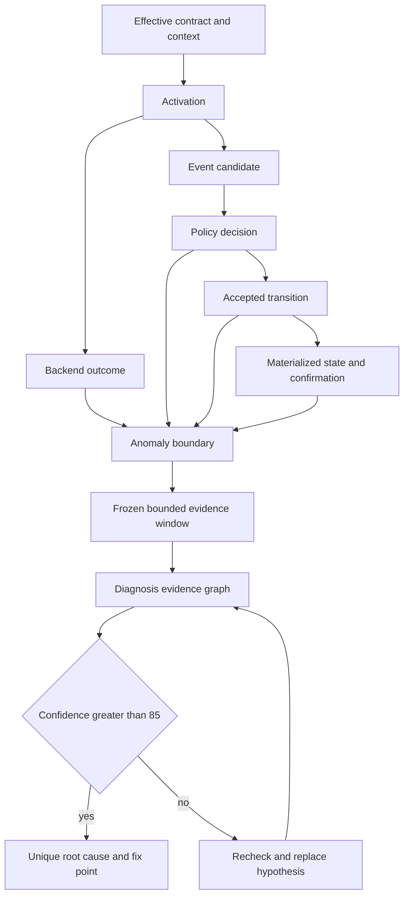

# Ralph 因果诊断证据闭环 - Plan

## Goal Capsule

- **Objective:** Operator 在一次 Ralph loop 结束后，仅凭该次 run 留存的关键证据，将异常收敛到唯一责任域和具体修复点，最终根因置信度严格高于 85。
- **Means:** 建立有界的因果飞行记录器，在关键边界生成决策收据，并让 `ralph-run-diagnosis` 依据同一证据契约重建因果链。
- **Product authority:** 本文确定录制边界、归因规则、置信度门禁与报告行为；后续规划可以选择实现结构，但不得弱化这些行为约束。
- **Open blockers:** 无。

---

## Product Contract

### Summary

Ralph 将关键运行状态、决策依据和结果组织成可机械核验的因果证据链。
`ralph-run-diagnosis` 使用这条证据链输出唯一根因、责任域和修复点；低于置信度门禁的结论不得作为完成结果交付。

### Problem Frame

当前 Ralph 已生成 `diagnosis-input.json`、`runtime-trace.jsonl`、`feedback.jsonl` 等诊断产物，并能记录 isolated activation outcome。
这些产物可以证明文件状态、部分生命周期和若干局部事实，但尚不能证明每个关键因果边界都被覆盖，也缺少贯穿 activation、事件决策、状态提交、恢复与 backend 结果的统一关联身份。

当前 CLI reporter 会聚合 recovery、drift、orchestration、errors 等既有产物，并对新增 sidecar 提供通用摘要；深层归因仍由 diagnosis skill 读取 raw rows 和 Tier 产物完成。
现行 skill 允许置信度达到 60 的发现进入归因表，P0 门槛为 70，证据不足时可进入未核实疑点。
这些行为无法满足单次 run 内完成唯一归因且置信度严格高于 85 的目标。

### Actors

- A1. **Operator:** 发起 Ralph loop，并在结束后消费可执行的唯一根因和修复位置。
- A2. **Ralph runtime:** 执行编排、记录关键状态和决策事实，并在异常发生时冻结有界证据窗口。
- A3. **Diagnosis engine and skill:** 校验证据覆盖、重建因果链、反驳候选假设并形成最终报告。
- A4. **Agent and backend:** 作为被观察的执行参与方提供结果，但不自行决定最终归因。

### Key Decisions

- **单次 run 完成取证。** (session-settled: user-directed — chosen over 定向复跑补证据: 异常发生时必须保留足够证据，诊断不能依赖复现) Governs R1, R3, R10.
- **只录制关键因果边界。** (session-settled: user-directed — chosen over 全量 prompt、完整输出和全部操作录制: 控制存储、隐私与运行成本) Governs R1, R3, R12.
- **采用因果飞行记录器加关键决策收据。** (session-settled: user-approved — chosen over 继续零散补字段或为所有决策生成重型收据: 在诊断能力与长期维护成本之间取得平衡) Governs R2, R4, R5, R6.
- **按最上游可预防原因归责。** (session-settled: user-directed — chosen over 将最后一个失败动作直接归给 agent: preset 能预防的 agent 错误应归 preset) Governs R8.
- **置信度门禁严格高于 85。** (session-settled: user-directed — chosen over 低置信推断或概率排序: 低于门槛必须重新核验并提出新方案) Governs R10, R11.

### Causal Evidence Shape



### Requirements

**关键证据录制**

- R1. 标准 Ralph loop 必须在无需 operator 预先猜测故障类型的情况下，记录有效运行契约、activation、backend 结果、候选事件、policy 决策、状态提交与确认、恢复动作和终止结果等关键因果边界。
- R2. 同一执行链上的关键记录必须共享稳定的关联身份和可排序时序，使诊断能够区分期望状态、观察事实、决策权威与最终结果。
- R3. 正常路径只保留有界摘要；检测到异常或契约不一致时，runtime 必须冻结异常前后的有界关键证据窗口，且不得依赖第二次 run 补录。
- R4. 每个关键决策收据必须足以回答“基于什么事实和规则作出什么决定”，并引用有效契约、决策结果、稳定原因及前后状态证据。
- R5. 诊断 manifest 必须证明关键因果边界的覆盖情况，而不只证明文件存在、大小、哈希与可读性；任何缺口都必须被结构化标识。

**Skill 联动与归因**

- R6. Runtime、CLI reporter 与 `ralph-run-diagnosis` 必须消费同一版本化证据契约，禁止在 skill 中维护一套会与 runtime 漂移的平行事实分类。
- R7. Diagnosis 必须从证据链中选出一个唯一主根因域：`runtime`、`preset`、`agent`、`backend` 或 `diagnostic_capture_contract`。
- R8. Diagnosis 必须按最上游可预防原因归责；仅当 preset 契约明确、可见信息充分、runtime 正确执行且 backend 正常时，agent 的无理由违约才归 `agent`。
- R9. 每个完成的诊断必须给出具体修复点及其因果证据；修复点可以是 runtime 机制、preset 配置或指令、agent 契约、backend 集成，或诊断采集边界。
- R10. 最终唯一根因置信度必须严格高于 85；低于门槛时，diagnosis 必须在本次 run 的现有证据中切换核验路径、反驳当前假设并形成新的候选方案，且不得宣称诊断完成。
- R11. 若决定性证据缺失，但 coverage 证据能证明应记录的关键边界未被记录，唯一根因必须归 `diagnostic_capture_contract`，并把缺失采集点作为修复点。

**边界与质量**

- R12. 录制必须默认排除完整 prompt、完整模型输出、无界 tool stream 和无关文件内容，只保存完成因果核验所需的有界事实、摘要、指纹和引用。
- R13. 置信度必须来自可检查的证据覆盖、独立账本一致性、收据完整性和反事实核验，不能来自诊断 agent 的主观自评分。
- R14. 未启用或不具备新证据契约的 legacy run 可以生成降级报告，但不得声称满足唯一根因和严格高于 85 的完成门禁。
- R15. 诊断报告必须保留被否决假设、重新核验动作和分数变化，使 operator 能审计最终唯一归因如何胜出。

### Key Flows

- F1. 关键证据录制
  - **Trigger:** Ralph loop 开始执行或进入新的 activation。
  - **Actors:** A2, A4
  - **Steps:** Runtime 建立关联身份；记录关键边界摘要与决策收据；发现异常时冻结有界前后窗口；终止时生成覆盖证明。
  - **Outcome:** 本次 run 形成自描述、可核验且存储有界的因果证据包。
  - **Covered by:** R1-R5, R12.
- F2. 唯一根因诊断
  - **Trigger:** Operator 对已结束的 run 调用 diagnosis skill。
  - **Actors:** A1, A3
  - **Steps:** Skill 校验 coverage；重建因果链；按最上游可预防规则比较候选根因；低于门禁时更换证据路径重新核验；输出唯一根因和修复点。
  - **Outcome:** 报告以严格高于 85 的置信度完成，或把可证明的采集契约缺陷作为唯一根因。
  - **Covered by:** R6-R11, R13-R15.

### Acceptance Examples

- AE1. **Covers R7-R10.** Given preset 指令未提供完成终态事件所需的关键信息，when agent 未发出终态事件，then 唯一根因是 `preset`，报告指向缺失的 preset 契约或可见信息。
- AE2. **Covers R7-R10.** Given preset 契约明确、信息可见、runtime 与 backend 均正常，when agent 仍违反终态义务，then 唯一根因是 `agent`，且证据排除三个上游责任域。
- AE3. **Covers R2, R4, R7, R9.** Given 事件已通过 policy 并被接受，when runtime 未完成承诺的状态提交或确认，then 唯一根因是 `runtime`，报告引用断裂的 transition 收据。
- AE4. **Covers R2, R7, R9.** Given activation 契约正确且 runtime 已正常派发，when backend 超时、异常退出或返回不可消费结果，then 唯一根因是 `backend`，报告引用 backend outcome 与相邻边界收据。
- AE5. **Covers R5, R10, R11.** Given 某关键边界应被录制但 coverage 证明该记录缺失，when 其他证据不足以确定业务故障，then 唯一根因是 `diagnostic_capture_contract`，而不是猜测 runtime、preset 或 agent。
- AE6. **Covers R10, R13, R15.** Given 首个候选根因置信度为 85 或更低，when skill 执行重新核验，then 旧假设被显式保留为已否决或未通过，只有新结论严格高于 85 时报告才标记诊断完成。

### Success Criteria

- 已知真值的故障注入场景覆盖 `runtime`、`preset`、`agent`、`backend` 和 `diagnostic_capture_contract`，并包含多个表象相同但根因不同的对照组。
- 每个验收场景都返回正确的唯一责任域、可执行修复点和严格高于 85 的可复算置信度。
- 任何置信度为 85 或更低的候选结论都不会进入完成报告，并能看到重新核验或替换假设的审计轨迹。
- 标准 run 无需保存完整 prompt 或完整模型输出即可完成关键因果链核验；录制大小和单条记录均保持有界。
- Runtime 证据契约与 diagnosis skill 的行为测试能发现关联身份缺失、coverage 漂移、收据缺失和归因规则漂移。

### Scope Boundaries

- 不建设全量 session replay、完整 prompt 归档或完整模型输出录屏。
- 不依赖定向复跑、第二次模型调用或人工补写本次 run 的证据。
- 不在诊断后自动修改源码、preset 或 agent 指令；报告止于可信根因、修复点和建议。
- 不用概率排行榜替代唯一主根因；贡献因素可以保留，但不得稀释主归因。
- 不承诺 legacy 或主动关闭关键证据录制的 run 满足新完成门禁。

### Dependencies / Assumptions

- 关键因果边界可以通过有界事实、摘要、指纹和引用完成核验，不需要保存敏感全文。
- “严格高于 85”是证据计分门禁；后续规划需要定义可复算计分方式和防止虚高的校准场景。
- 贡献因素允许出现在报告中，但唯一主根因必须按 R8 的可预防性规则确定。
- 精确存储上限、异常触发条件、收据字段和保留周期属于规划阶段的实现决策，不得改变本文的行为边界。

### Sources / Research

- `crates/ralph-core/src/diagnostics/input_bundle.rs`：现有 bundle 身份与 artifact integrity 契约。
- `crates/ralph-core/src/diagnostics/runtime_trace.rs`：现有 runtime trace 阶段与有界结构。
- `crates/ralph-cli/src/loop_runner/activation_outcome.rs`：现有 isolated activation outcome 原始事实。
- `crates/ralph-core/src/diagnosis/bundle.rs`：现有 sidecar reader、摘要与 evidence gap 行为。
- `crates/ralph-core/src/diagnosis/reporter.rs`：现有 recovery、drift、orchestration、errors 与 bundle 报告聚合。
- `skills/ralph-run-diagnosis/SKILL.md`：现有 bundle-first、L0-L7 与归因工作流。
- `skills/ralph-run-diagnosis/references/confidence-rubric.md`：现行 60 分入表、P0 70 分及低置信加深规则。
- `docs/achieved/plan/2026-08-12-001-feat-run-diagnosis-trace-debug-enhancement-plan.md`：bundle-first 三件套的既有目标。
- `docs/plans/2026-08-15-1823-fix-empty-channel-activation-observability-plan.md`：activation outcome 可观测性既有目标。

---

# 实现级开发计划（Implementation Plan)

> 本部分是基于代码库证据的实现计划，交付给 Coding Agent 按 `Unit 1 → Unit 10` 严格串行执行。
> 上半部分 Product Contract 是行为权威（product authority)，本部分不得弱化其中任何行为约束；
> 若实现中发现与 Product Contract 冲突，停止并按 Unit 停止条件流程回写，不得自行改约。

---

## 0. 计划状态

- **状态： `READY`**。所有实施关键决策（DT1-DT10）置信度均 ≥ 0.85，见 §3。
- **代码库基线**: HEAD = `6ff0367c`(`fix(parallel-forge): 复审整改 F-003 correction 耗尽入口与 F-107 动态验证场景`),2026-08-26。
- **调查范围**: `crates/ralph-core/src/diagnostics/`(16 文件，6494 行）、`crates/ralph-core/src/diagnosis/`(7 文件）、`crates/ralph-cli/src/loop_runner/`(activation_outcome / inner / execution / entry)、`crates/ralph-core/src/event_loop/`(parse_and_emit/legacy、policy、state_machine_stage、accepted_transition、event_origin、precheck_gate_runner、resume_routing、dispatch_and_handoff)、`crates/ralph-core/src/config/telemetry.rs`、`skills/ralph-run-diagnosis/`(SKILL.md + 12 个 references)、测试基础设施（run-tests.sh、scenarios.rs、tests/common/mod.rs、skills/tests/)。
- **已执行的验证命令**:
  - `grep` 全 workspace 确认无 `correlation_id` / `trace_id` 字段（0 命中）;
  - `grep` 确认 `RuntimeTracePhase` 的唯一 exhaustive match 位于 `runtime_trace.rs:153-159`;
  - 阅读 `crates/ralph-core/src/config/telemetry.rs` 全文，确认 `runtime_diagnosis.enabled` / `write_artifacts` 默认均为 `false` 且被测试钉住（`telemetry.rs:490-528`);
  - 确认 `EventLoop` 持有 `self.diagnostics` 且 event_loop 代码可直接调用 `log_runtime_trace`(`dispatch_and_handoff.rs:890-913`);
  - 确认 `scripts/check-cli-doc-drift.sh` 存在；确认 repo 根 `.venv` 含 pytest 9.1.1(`skills/.venv` 不存在）。
- **尚未执行的验证**（已编入对应 Unit 的 Red/验证步骤，不构成阻塞）:
  - minimal(runtime_diagnosis_artifacts）模式创建哪些 logger 的精确清单（U1 第一步阅读 `diagnostics/mod.rs:253-290` 激活矩阵 + `integration_tests.rs:626/650` 断言确认）;
  - `ralph diagnose --help` 当前输出快照（U9 第一步）。
- **阻塞项**: 无。

---

## 1. 功能目标

以 Product Contract 为权威，此处只固化为可验收的工程语义：

- **业务目标**: 单次 Ralph run 结束后，operator 仅凭本次 run 留存证据即可得到唯一根因域（`runtime` / `preset` / `agent` / `backend` / `diagnostic_capture_contract`)、具体修复点与严格 >85 的可复算置信度。
- **用户/调用方**: operator（消费 `ralph diagnose --causal` 与诊断报告）;`ralph-run-diagnosis` skill（消费同一版本化证据契约）。
- **当前行为**（证据见 §2.2): sidecar 已存在但无跨 artifact 关联身份（E7)；关键决策（origin 拒绝、policy accept、commit 确认、恢复分派）无持久收据（E9/E10/E11);manifest 只证明文件存在不证明边界覆盖（E5/E6)；无异常冻结窗口（E21)；默认配置下根本不产生 sidecar(E3);skill 置信度走主观计分、60 入表（E13)。
- **目标行为**: 默认标准 run 即有界录制 8 类因果边界；每条记录携带共享关联身份与契约摘要；异常时冻结有界窗口；manifest v2 给出边界级覆盖证明；`ralph diagnose --causal` 输出确定性唯一归因 + 机检置信度分项；skill 以 >85 机检门禁替换现行 60/70 规则。
- **行为差异**: 见 §4 各 Feature 的 Scenario。
- **本次范围**: `ralph-core`(diagnostics/diagnosis/config)、`ralph-cli`(diagnose 命令、loop_runner 接线）、`skills/ralph-run-diagnosis/` + `skills/tests/test_run_diagnosis_contract.py`。
- **非目标**（沿用 Scope Boundaries): 不做全量 replay；不自动修代码；legacy run 不承诺新门禁；不改 backend adapter 的输出结构（`ExecutionResult`/`PtyExecutionResult` 不加字段，E20 现有字段足够）。
- **输入**: 现有运行时决策点（policy/origin/commit/recovery/termination）的内部事实；有效配置（`EventPolicyConfig`、hats 拓扑）。
- **输出**: 新 sidecar `evidence-window.jsonl`;`runtime-trace.jsonl` 新增 decision/contract 收据行与 `causal` 字段；`diagnosis-input.json` 升级 v2（含 `boundary_coverage`);`ralph diagnose --causal` 的 markdown/JSON 新段落；skill 报告新增被否决假设与分数变化小节。
- **状态变化**: 新增配置块 `telemetry.causal_evidence`（默认开）;`DiagnosticsOptions` 新增模式位；`DIAGNOSIS_INPUT_SCHEMA_VERSION` 升级 v2（读侧兼容 v1=Legacy)。
- **错误语义**: 证据录制全部 best-effort（沿用现有 `degraded` 翻转语义，`runtime_trace.rs:210-236`)，永不使 loop 失败；录制失败本身计入 coverage gap。
- **兼容性要求**: 旧版 runtime-trace 行（无 `causal` 字段）reader 必须正常解析；v1 manifest 必须可读并标 Legacy；业务事件路径零变化（E17 off/on 等价测试必须持续全绿）。
- **性能要求**: 正常路径每行 ≤ 8 KiB(field cap 复用）；冻结窗口内存 ≤ `window_capacity`（默认 200）条；归因分析为离线命令，无运行时开销。
- **安全/权限要求**: 证据默认排除完整 prompt/模型输出/无关文件内容（R12)；收据只存 digest 与有界摘要。
- **已知约束**: 单文件 ≤5000 行（`reporter.rs` 已 3581 行，归因引擎必须独立新文件，E12)；测试入口必须 nextest(HARD RULE 1/2);CLI 测试必须 `common::ralph_bin()` scrub(E16);forbid(unsafe_code) 下测试不得改 env（用 `to_diagnostics_options_with_full` 模式，telemetry.rs:621-672)。
- **已确认假设**: 见 §2.2 Evidence Ledger，全部为高可靠。
- **待验证假设**: 仅两条非阻塞项，见 §0「尚未执行的验证」，均已在对应 Unit 内设为第一步验证动作，验证失败走 Unit 停止条件。

---

## 2. 代码库现状与证据

### 2.1 当前实现入口

- **录制写侧入口**: `DiagnosticsCollector`(`crates/ralph-core/src/diagnostics/mod.rs`,1909 行）,CLI 在 `crates/ralph-cli/src/main.rs:259-307` 每次 run 构造一个；session 目录 `<workspace>/.ralph/diagnostics/<YYYY-MM-DDTHH-MM-SS>/`(`mod.rs:469-478`)。
- **配置桥接**: `TelemetryConfig::to_diagnostics_options`(`config/telemetry.rs:95`)→ `DiagnosticsOptions`(diagnostics/mod.rs:253-290);`ralph.yml` 的 `telemetry.runtime_diagnosis.*`。
- **事件管线**（证据 E8/E9):`EventLoop::process_events_from_jsonl` → `event_reader.rs:229` 读 → `event_parser.rs:244` 解析 → `event_origin.rs:341` origin 校验 → `policy.rs:47-64` ValidationPipeline / `event_policy/validation.rs:801` → `state_machine_stage.rs:202-249` 候选校验 → `:325` 唯一 live 变更点 → `:443` commit → `accepted_transition.rs` outbox。
- **状态提交**: `OutboxEntry`(`accepted_transition.rs:47-80`，写 `.ralph/agent/accepted-transitions.jsonl`,FileLock+fsync);`StateLedger`(state/ledger.rs:80,`.ralph/ledger.jsonl`);`StateProjector` 是 tasks.jsonl 唯一写者。
- **恢复**: `resume_routing.rs:365/568`;`precheck_gate_runner.rs:137-167`(DispatchOutcome::Resume/Exhausted);`wave_scope.rs:1148-1244`(inject_completion_correction)。
- **Backend 边界**: `CliExecutor::execute → ExecutionResult`(ralph-adapters/cli_executor.rs:50-61);`ExecutionOutcome`(ralph-cli/loop_runner/execution.rs:4-52);activation outcome 行（activation_outcome.rs:399-422，写入 runtime-trace)。
- **终止**: `completion_and_termination.rs`;`inner.rs:357-402` finalize(6 文件 integrity 快照）；sentinel `.ralph/loop-termination-reason.json`(entry.rs:57)。
- **读侧**: `diagnosis/bundle.rs`（三个硬编码 reader + `build_suggestions_and_gaps` 纯函数）;`diagnosis/reporter.rs`（双视图）;CLI `crates/ralph-cli/src/commands/diagnose.rs`(`ralph diagnose`)。
- **skill**: `skills/ralph-run-diagnosis/SKILL.md` + 12 个 references；契约测试 `skills/tests/test_run_diagnosis_contract.py`。
- **构建/验证**: `./scripts/run-tests.sh`（两阶段 nextest + doctest,E18);`just lint`(clippy -D warnings);`cargo fmt --check`;`scripts/check-cli-doc-drift.sh`;skill pytest 用 repo 根 `.venv/bin/python -m pytest skills/tests -q`。

### 2.2 Evidence Ledger

| Evidence ID | 来源 | 观察结果 | 对计划的影响 | 可靠性 |
|---|---|---|---|---|
| E1 | `crates/ralph-core/src/diagnostics/runtime_trace.rs:37-47,52-92,153-159` | `RuntimeTracePhase` 7 个 variant；唯一 exhaustive match(as_str）在 :153-159;`RuntimeTraceEntry` 含 `fields: Option<Value>`,append 时按 8 KiB cap | 收据以新 phase/kind + `fields` 承载；新增 variant 由编译器强制同步 match | 高 |
| E2 | `crates/ralph-core/src/diagnosis/bundle.rs:442-467` | `is_runtime_trace_record` 只校验 6 字段存在；不校验 phase 值、不拒绝未知字段 | 新增 phase/kind/可选字段对现有 reader 向后兼容 | 高 |
| E3 | `crates/ralph-core/src/config/telemetry.rs:148-230,490-528` | `runtime_diagnosis.enabled`/`write_artifacts` 默认 false 且有测试钉死；默认 run 无任何 sidecar | R1 要求标准 run 必须录制 → 需要独立默认开启的 `causal_evidence` 层，不得翻转旧默认（避免破坏既有语义钉测试） | 高 |
| E4 | `diagnostics/mod.rs:253-290`;`telemetry.rs:95-139` | `DiagnosticsOptions` 模式矩阵（full/runtime_diagnosis_artifacts/trace_only）与桥接函数是既定扩展点 | 新增 `causal_evidence` 模式位走同一桥接，不发明第二套机制 | 高 |
| E5 | `crates/ralph-cli/src/loop_runner/inner.rs:386-393`;`diagnostics/mod.rs:1686-1698` | finalize 硬编码 6 个 artifact 名；trace_only 排除名单硬编码 | 新增 `evidence-window.jsonl` 必须同步这两处 + skill artifact-manifest | 高 |
| E6 | `diagnostics/input_bundle.rs:152`;`diagnosis/bundle.rs:49-52,242-247` | manifest schema `run-diagnosis-input/v1`;reader 对未知版本报 `SchemaMismatch` | v2 升级沿用既有版本处理路径；v1 映射为 Legacy 语义 | 高 |
| E7 | 全 workspace grep(`correlation_id`/`trace_id` 0 命中）;`accepted_transition.rs:50` | 无跨 artifact 关联身份；`activation_id` 仅存于 resume 路由与 OutboxEntry | 必须新增共享关联身份（DT1) | 高 |
| E8 | `event_loop/dispatch_and_handoff.rs:890-913` | `EventLoop` 持有 `self.diagnostics`,event_loop 内可直接 `log_runtime_trace` | 收据 emit site 不需要新建依赖通道 | 高 |
| E9 | `event_origin.rs:341-452`;调查确认 | origin 拒绝仅 bus 事件 + 内存列表，无持久记录；policy accept 完全无记录 | 决策收据（U3）必须覆盖 accept 与 origin reject | 高 |
| E10 | `accepted_transition.rs:47-80`;`state/ledger.rs:42-54` | outbox/ledger 记录 transition 已提交；tasks.jsonl 投影写与接受事件之间无确认记录 | commit 确认收据（U4）链接 transition_id → 投影结果 | 高 |
| E11 | `precheck_gate_runner.rs:32,137-167`;`resume_routing.rs:365,568`;`wave_scope.rs:1148-1244` | 恢复分派决策（Resume/Exhausted/correction）只有内存计数与结果事件，无决策收据 | 恢复收据（U5）落点已定位 | 高 |
| E12 | `diagnosis/reporter.rs`（实读 3581 行） | 接近 5000 行 HARD RULE 上限 | 归因引擎必须新文件 `diagnosis/causal.rs`，不得堆进 reporter.rs | 高 |
| E13 | `skills/ralph-run-diagnosis/references/confidence-rubric.md:9-40,51-60` | 现行 60 入表 / P0 70 / 主观计分 / mode 硬顶 | 替换为机检分项 + >85 门禁（U10);mode 硬顶改为契约版本门控（R14) | 高 |
| E14 | `skills/tests/test_run_diagnosis_contract.py`(323 行）;repo 根 `.venv` 含 pytest 9.1.1 | skill 契约测试存在且可运行：`.venv/bin/python -m pytest skills/tests -q`（不进 run-tests.sh) | U10 的验证命令确定 | 高 |
| E15 | `crates/ralph-core/tests/scenarios.rs:1177,2044`;`diagnostics/integration_tests.rs` | BDD harness 断言业务事件不断言 sidecar；诊断行为测试的既有模式是 TempDir + 真 EventLoop + collector | 收据类验收测试落 diagnostics 集成测试模式，不用 BDD yml | 高 |
| E16 | `crates/ralph-cli/tests/common/mod.rs:21-45` | `ralph_bin()`/`scrub_agent_runtime_env` 是 CLI 集成测试唯一合法入口（HARD RULE 5) | U9 测试必须用 `common::ralph_bin()` | 高 |
| E17 | `event_loop/tests/diagnostics_equivalence.rs`;`tests/diagnostics_off_on.rs` | off/on 业务事件等价性已有测试锚点 | 所有新录制不得改变业务事件流；这两个文件是全计划回归锚点 | 高 |
| E18 | `scripts/run-tests.sh:65,299-398`;`mise.toml:17` | 两阶段 nextest;SERIAL filter 含 partial_timeout/test_execute_wave/wave_supervisor;nextest 钉 0.9.140 | 最终门禁命令确定；禁止裸 cargo test | 高 |
| E19 | `activation_outcome.rs:233-251,399-422` | `ActivationOutcomeFacts` 已含 backend_success/exit_code/watchdog_timeout/merge 结果并写入 runtime-trace(kind=`hat_activation_outcome`) | backend 域归因（U8）直接消费现有行，不改 adapter | 高 |
| E20 | `ralph-adapters/src/cli_executor.rs:50-61`;`loop_runner/execution.rs:4-52` | backend outcome 有 exit_code/timed_out/termination；无 parse-failure 字段 | AE4(backend 域）证据足够；明确非目标：不改 adapter 结构 | 高 |
| E21 | 调查确认（grep + 模块通读） | 无 freeze 机制、无有界证据窗口、无边界级覆盖 manifest | U6/U7 为纯新增，无旧行为兼容负担 | 高 |
| E22 | `scripts/check-cli-doc-drift.sh`（文件存在已验证） | CLI 文档漂移静态扫描脚本 | U9 后必跑 | 高 |
| E23 | `crates/ralph-core/src/capability_inventory.rs:19-28,230-322` | compile-time include_str 只覆盖 preset-author/review 两个 skill 的 5 份文档，不含 run-diagnosis | U10 改 run-diagnosis skill 不触发 capability_inventory；无需动它 | 高 |
| E24 | `diagnostics/input_bundle.rs:287-339` | manifest 写入 atomic(NamedTempFile persist)，失败仅 warn + degraded | 新写盘路径沿用同一 best-effort 语义 | 高 |

### 2.3 受影响范围

**生产模块（已确认存在）**:
- `crates/ralph-core/src/diagnostics/mod.rs`(collector：模式位、causal context、ring buffer、boundary counters)
- `crates/ralph-core/src/diagnostics/runtime_trace.rs`(phase variant + `causal` 字段）
- `crates/ralph-core/src/diagnostics/input_bundle.rs`(v2 + `boundary_coverage`)
- `crates/ralph-core/src/diagnostics/` 新增 `evidence_window.rs`(U6)
- `crates/ralph-core/src/config/telemetry.rs`(`causal_evidence` 配置块）
- `crates/ralph-core/src/event_loop/parse_and_emit/legacy.rs`(:4256-4292 收据 emit)
- `crates/ralph-core/src/event_loop/event_origin.rs`(origin 拒绝收据）
- `crates/ralph-core/src/event_loop/state_machine_stage.rs`(:443 commit 收据）
- `crates/ralph-core/src/event_loop/precheck_gate_runner.rs`、`resume_routing.rs`、`wave_scope.rs`（恢复收据）
- `crates/ralph-core/src/event_loop/dispatch_and_handoff.rs`(causal context 设置点）
- `crates/ralph-core/src/diagnosis/causal.rs`(**计划新增**，归因引擎）
- `crates/ralph-core/src/diagnosis/bundle.rs`(v2 coverage 投影 + 新 EvidenceGap)
- `crates/ralph-cli/src/commands/diagnose.rs`(`--causal`)
- `crates/ralph-cli/src/loop_runner/inner.rs`(:674 context 设置；:386-393 finalize 名单；:3499 watchdog 冻结触发）
- `crates/ralph-cli/src/loop_runner/activation_outcome.rs`（异常 outcome 冻结触发）

**测试模块**: 新增 `crates/ralph-core/tests/{causal_evidence_activation,causal_correlation,decision_receipts_policy,decision_receipts_commit,decision_receipts_recovery,evidence_window,causal_attribution}.rs`(**计划新增**)；修改 `crates/ralph-core/tests/{diagnosis_input_bundle,diagnosis_report_bundle}.rs`、`crates/ralph-cli/tests/diagnose.rs`、`skills/tests/test_run_diagnosis_contract.py`。

**配置**: `ralph.yml` 新增 `telemetry.causal_evidence`（默认开，缺省即开）。

**文档/skill**: `skills/ralph-run-diagnosis/SKILL.md` + `references/{confidence-rubric,artifact-manifest,report-template,verification-pipeline}.md`。

**构建目标**: 仅 `ralph-core` / `ralph-cli` 两 crate；无新外部依赖（全部用现有 serde/serde_json/sha2/tempfile——sha2 已在用，见 inner.rs:81-92 的 SHA-256 integrity 计算）。

**明确不受影响**: `ralph-api` / `ralph-tui`（调查确认无 bundle/reporter 引用）;backend adapters(E20);`presets/**`（本计划不改任何 preset);`crates/ralph-core/data/ralph-tools*.md`(`ralph diagnose --causal` 是 operator 命令，不进 loop 内 agent prompt;U9 完成标准里含一次人工复核确认）。

---

## 3. 决策记录与置信度

| Decision ID | 决策问题 | 候选方案 | 最终选择 | 支持证据 | 排除其他方案的原因 | 置信度 |
|---|---|---|---|---|---|---|
| DT1 | 关联身份放哪里、什么形态 | (a) 新 sidecar;(b) `RuntimeTraceEntry` 加可选 `causal` 字段 + collector 持有当前上下文自动 stamp;(c) 复用 outbox activation_id | (b) | E1,E2,E7,E8 | (a) 多一个文件多一套 reader/注册同步（E5)，且关联身份必须出现在每条既有行上才有 join 价值；(c) activation_id 语义是 resume 路由（`resume:{loop}:{iter}`),event_loop 决策点处不总是可得，强行复用会污染其语义 | 0.88 |
| DT2 | 决策收据载体 | (a) 新 `decision-receipts.jsonl` sidecar;(b) 扩展 runtime-trace 新 phase `Decision` + kind 区分 + `fields` payload | (b) | E1,E2,E5 | (a) 需同步 finalize 名单、trace_only 排除名单、bundle reader 三处硬编码（E5)，漂移面大；(b) reader 天然兼容（E2),8KiB cap 天然满足 R12 | 0.87 |
| DT3 | 标准 run 如何「无需预先猜测」就有证据 | (a) 翻转 `runtime_diagnosis.enabled` 默认为 true;(b) 新增 `telemetry.causal_evidence{enabled=true 默认}` 独立层，复用 collector minimal session | (b) | E3,E4；产品契约 R1 + 「主动关闭」措辞 | (a) 直接撞碎 `test_default_telemetry_is_noop` 等钉测试且把 drift/responder/prompt-injection 一并默认开启，语义爆炸；(b) 只开录制不开 responder，面最小 | 0.86 |
| DT4 | 异常冻结窗口实现 | (a) collector 内 `VecDeque` ring（默认容量 200)+ 异常触发写 `evidence-window.jsonl`;(b) 事后从 runtime-trace 按序号切片 | (a) | E21;`log_rotation.rs` 的容量上限先例（MAX_LOG_FILES=5) | (b) 依赖 trace 行已含全部所需上下文，但 R3 要求窗口可含比正常路径更细的前后文（ring 可缓存未落盘的扩展字段），且切片要求 reader 端重建「异常点」，判定逻辑漂移风险高 | 0.85 |
| DT5 | 覆盖证明放哪里、如何兼容 | (a) manifest 升 v2 加 `boundary_coverage`;(b) 独立 coverage sidecar | (a) | E5,E6,E24 | (b) 又一个文件+注册同步；manifest 本来就是「证明」语义的家，v1→Legacy 路径已存在 | 0.87 |
| DT6 | 归因逻辑写在哪 | (a) skill markdown 规则；(b) ralph-core 新模块 `diagnosis/causal.rs` 确定性引擎，skill 消费输出 | (b) | R6（禁平行分类）,E12,E15 | (a) 直接违反 R6 且不可单测；(b) 可用 synthetic fixture 做 5 域 + 对照组的确定性测试 | 0.87 |
| DT7 | 置信度如何「可复算」且 >85 | 机检分项加总：coverage 完整 +30；收据/账本一致 +25；四个落选域各有 ≥1 条反驳证据 +20；关联链完整 +15；异常时冻结窗口存在 +10；满分 100，完成门禁 = 严格 >85。capture_contract 路径以「coverage 证明缺口决定性 + 无矛盾证据」计分 | 同左 | R10,R13,E13；产品契约「严格高于 85」 | 保留主观计分（现状）违反 R13；纯 0/100 二值无法表达「缺口决定性」梯度 | 0.85 |
| DT8 | CLI 形态 | (a) 新子命令 `ralph causal`;(b) `ralph diagnose --causal` 扩展现有命令 | (b) | diagnose.rs 已有 session/legacy 双分支结构（:241,:345)；复用 session 解析 | (a) 新命令 = 新注册 + 新补全 + 新文档面，且与 diagnose 语义重叠 | 0.88 |
| DT9 | 测试落层 | 引擎=ralph-core 模块单测 + synthetic session fixture 集成测；收据=TempDir+真 EventLoop 集成测；CLI=ralph-cli tests/diagnose.rs;skill=pytest 契约测试 | 同左 | E14,E15,E16,E17 | BDD yml 不断言 sidecar(E15)；全 E2E 成本高且无必要 | 0.90 |
| DT10 | legacy/v1 与门禁关系 | v1 manifest / 无 coverage → `causal` 输出标 `not_evaluable` + 降级报告，门禁不可达成 | 同左 | E6,R14；现有 ManifestStatus::Legacy/Missing 语义 | 让 legacy 也出门禁分 = 违反 R14 | 0.90 |

无低于 0.85 的决策；无 BLOCKED 项。

---

## 4. BDD 行为规格

> 说明： 仓库 BDD harness(`scenarios.rs`）断言业务事件、不断言 sidecar(E15)，因此下列 Gherkin 是行为规格；其可执行形式落在 §5 指定的集成/单元测试，除明确标注外不新增 `scenarios/*.yml`。

```gherkin
Feature: 因果证据默认录制 (U1)
  标准 run 无需 operator 预先配置即产生因果证据会话

  Scenario: S1.1 默认配置创建因果会话
    Given ralph.yml 不含 telemetry 配置块
    When 一次 loop 正常启动并结束
    Then 存在 .ralph/diagnostics/<session>/ 且含 runtime-trace.jsonl 与 diagnosis-input.json
    And recovery responder / drift 检测 / prompt 注入仍处于默认关闭语义

  Scenario: S1.2 显式关闭则不录制
    Given ralph.yml 配置 telemetry.causal_evidence.enabled: false
    When 一次 loop 启动并结束
    Then 不产生新的 diagnostics session 目录

  Scenario: S1.3 与既有模式共存不双写
    Given RALPH_DIAGNOSTICS=1 (full 模式)
    When 一次 loop 启动并结束
    Then 只存在一个 session 目录, 且 causal 记录写入该 full session
```

```gherkin
Feature: 关联身份与有效契约收据 (U2)
  同一执行链上的关键记录共享稳定关联身份与契约摘要

  Scenario: S2.1 同一 activation 的 trace 行共享关联身份
    Given loop 以 loop_id=L 运行到第 i 次迭代
    When 该迭代产生多条 runtime-trace 行
    Then 每行 causal.loop_id == "L" 且 causal.iteration == i
    And 行可按 sequence 严格排序

  Scenario: S2.2 启动时写有效契约收据
    When loop 完成身份装配 (input bundle identity 完成)
    Then runtime-trace.jsonl 存在且仅存在一条 kind=contract_receipt 行
    And 其 fields 含 contract_digest / terminal_topics_digest / hats_digest / preset_label

  Scenario: S2.3 契约变化则 digest 变化
    Given 两份仅在 event_policy.schemas 上不同的配置
    When 各跑一次 loop
    Then 两次 contract_digest 不同

  Scenario: S2.4 旧行兼容
    Given 一行不含 causal 字段的 v1 runtime-trace 行
    When reader 解析
    Then 解析成功且 causal 为 None, 不计入 malformed_lines
```

```gherkin
Feature: Policy 决策收据 (U3)
  每个事件级 policy/origin 决策留下「基于什么规则作出什么决定」的收据

  Scenario: S3.1 接受收据
    Given diagnostics 会话激活
    When 一个业务事件通过 origin guard 与 policy 校验并被接受
    Then runtime-trace 存在 phase=decision, kind=policy_receipt, fields.decision=accept 的行
    And fields 含 rule_refs, event_digest, topic, hat, contract_digest
    And fields 不含事件完整 payload

  Scenario: S3.2 policy 拒绝收据
    When 一个事件因 required_fields 缺失被 policy 拒绝
    Then 存在 decision=reject 的 policy_receipt 行, fields.reason_code 为稳定机读串
    And 该行与 .ralph/recovery.jsonl 中对应 RejectionRecord 可通过 retry_key 对账

  Scenario: S3.3 origin guard 拒绝收据
    When 一个事件因 hat 越权 topic 被 origin guard 拒绝
    Then 存在持久 policy_receipt 行 (今天此路径无任何持久记录)
    And fields.rule_refs 含 origin_guard

  Scenario: S3.4 收据有界
    When 事件 payload 含超长字段
    Then 收据行单字段不超过 8 KiB, 只存 digest 与截断摘要
```

```gherkin
Feature: 状态提交确认收据 (U4)
  接受的 transition 与其状态物化结果之间有可对账的确认记录

  Scenario: S4.1 提交成功确认
    When 一个接受的 transition 成功完成 state machine 投影与 tasks.jsonl 写盘
    Then 存在 kind=commit_receipt, fields.commit_status=committed 的行
    And fields.transition_id 等于对应 OutboxEntry.transition_id

  Scenario: S4.2 提交失败回滚确认
    When 投影 commit 失败并回滚到 pre-batch 快照
    Then 存在 commit_status=rolled_back 的 commit_receipt 行
    And fields 含失败原因摘要

  Scenario: S4.3 断裂可检测
    Given 一个 accepted transition 的 outbox 行存在
    When 对应 commit_receipt 缺失
    Then (U8 起) 归因引擎将其识别为 runtime 域断裂证据
```

```gherkin
Feature: 恢复决策收据 (U5)
  每次恢复分派决策记录「哪个拒绝、选什么动作、剩余预算」

  Scenario: S5.1 resume 决策收据
    When 一个可重试拒绝触发 task.resume
    Then 存在 kind=recovery_receipt, fields.action=resume 的行
    And fields 含 retry_key, attempt, budget_remaining, target_hat, reason_code

  Scenario: S5.2 precheck 耗尽收据
    When 某 topic 的 precheck 重试耗尽
    Then 存在 action=exhausted 的 recovery_receipt 行
    And 其 retry_key 与随后 plan.blocked 事件的 payload 一致

  Scenario: S5.3 correction 注入收据
    When inject_completion_correction 触发 correction
    Then 存在 action=correction 的 recovery_receipt 行, 含 rejection_digest 计数
```

```gherkin
Feature: 异常冻结有界证据窗口 (U6)
  检测到异常时冻结异常前后的有界关键证据, 不依赖第二次 run

  Scenario: S6.1 正常终止不写窗口
    When loop 以正常完成 (LOOP_COMPLETE) 终止
    Then evidence-window.jsonl 不存在, manifest 中其 status=not_applicable

  Scenario: S6.2 异常触发冻结
    When 发生 watchdog timeout / 非零退出 / precheck 耗尽 / recovery 耗尽 / 异常 activation outcome 之一
    Then <session>/evidence-window.jsonl 存在
    And 首行为 anomaly 描述行 (trigger 种类, ts, iteration)
    And 其后为触发点前最近至多 window_capacity 条窗口行 + 触发后至终止的行

  Scenario: S6.3 窗口容量有界
    Given window_capacity = 200
    When 异常前已产生 1000 条候选窗口行
    Then 冻结文件至多 200 条触发前行, 最旧的被丢弃

  Scenario: S6.4 窗口不含全文
    Then 窗口内任何行不含完整 prompt 或完整模型输出 (字段 cap 与 digest 规则与 runtime-trace 相同)
```

```gherkin
Feature: 边界覆盖证明 manifest v2 (U7)
  manifest 证明关键因果边界的覆盖情况, 缺口结构化

  Scenario: S7.1 全覆盖
    Given 一次全部边界均被录制的 run
    When finalize 写出 diagnosis-input.json
    Then schema_version = run-diagnosis-input/v2
    And boundary_coverage 含 8 个边界 (effective_contract, activation, backend_outcome,
        event_candidate, policy_decision, state_commit, recovery_action, termination)
    And 每个边界 expected == recorded 且 status = covered

  Scenario: S7.2 边界缺口结构化
    Given 录制期间某边界的 logger 进入 degraded
    When finalize
    Then 该边界 status = gap, 含机读 reason
    And reader 投影产生对应 EvidenceGap

  Scenario: S7.3 v1 兼容为 Legacy
    Given 一份 v1 diagnosis-input.json
    When v2 reader 读取
    Then 读取成功, coverage 视为缺失, causal 门禁标记 not_evaluable (R14)

  Scenario: S7.4 未知更高版本
    Given 一份 schema_version 非 v1/v2 的 manifest
    When reader 读取
    Then 状态为 SchemaMismatch (沿用既有分支)
```

```gherkin
Feature: 唯一根因归因与可复算置信度 (U8)
  归因引擎按最上游可预防规则输出唯一根因域与机检置信度

  Scenario: S8.1 (AE1) preset 域
    Given 证据链显示 contract_receipt 中终态事件 required 信息在 preset 可见契约里缺失
    And runtime 各收据完整, backend outcome 正常
    When 执行归因
    Then primary_domain = preset, 修复点指向缺失的 preset 契约/可见信息

  Scenario: S8.2 (AE2) agent 域
    Given preset 契约明确、可见信息充分、policy/commit 收据完整、backend 正常
    And agent 未履行终态义务
    When 执行归因
    Then primary_domain = agent
    And rejected_hypotheses 含 preset/runtime/backend 三域及其反驳证据引用

  Scenario: S8.3 (AE3) runtime 域
    Given 事件 accepted 且 outbox 存在对应 transition
    And commit_receipt 缺失或 commit_status=rolled_back
    When 执行归因
    Then primary_domain = runtime, 修复点引用断裂的 transition 收据

  Scenario: S8.4 (AE4) backend 域
    Given activation 契约正确且 runtime 正常派发
    And hat_activation_outcome 行显示 backend_success=false / exit_code 非零 / watchdog_timeout=true
    When 执行归因
    Then primary_domain = backend, 引用该 outcome 行与相邻收据

  Scenario: S8.5 (AE5) diagnostic_capture_contract 域
    Given coverage 证明某关键边界应录制而未录制
    And 其余证据不足以确定业务故障域
    When 执行归因
    Then primary_domain = diagnostic_capture_contract
    And 修复点 = 缺失采集点清单

  Scenario: S8.6 同表象对照组
    Given 三组表象相同 (agent 未发终态事件) 的 synthetic 证据包
    When 分别归因
    Then 分别得到 preset / agent / diagnostic_capture_contract, 互不混淆

  Scenario: S8.7 低于门禁不宣称完成
    Given 证据使最高候选得分 <= 85
    When 归因输出
    Then 报告 status=incomplete, 保留被否决假设与缺口清单
    And 不输出 primary_domain 为完成态结论

  Scenario: S8.8 可复算
    Given 同一证据包
    When 连续执行两次归因
    Then 两次结构化输出逐字节一致
```

```gherkin
Feature: CLI 归因输出 (U9)
  ralph diagnose --causal 输出唯一根因、修复点与置信度分项

  Scenario: S9.1 正常输出
    When operator 执行 ralph diagnose --causal --session latest
    Then 输出含 primary_domain / fix_point / confidence 分项 / rejected_hypotheses

  Scenario: S9.2 legacy 降级
    Given 目标 session 为 v1 或无契约
    When 执行 ralph diagnose --causal
    Then 输出明确 not_evaluable 与原因, 不声称满足 >85 门禁

  Scenario: S9.3 JSON 契约
    When 执行 ralph diagnose --causal --format json
    Then JSON 含 causal 对象, 字段与 CausalAttributionReport 序列化一致
```

```gherkin
Feature: skill 置信度门禁升级 (U10)
  diagnosis skill 消费同一契约, >85 机检门禁替换 60/70 规则

  Scenario: S10.1 rubric 替换
    Then confidence-rubric.md 以机检分项 (DT7) 为唯一计分来源
    And 完成门禁为严格 >85, 60/70 规则全文移除

  Scenario: S10.2 报告可审计
    Then report-template 含被否决假设、重新核验动作、分数变化小节
    And skill 契约测试锚定上述小节与门禁文案

  Scenario: S10.3 skill 不维护平行分类
    Then SKILL.md 引用 ralph diagnose --causal 输出为归因事实来源
    And 不在 skill 内重新定义根因域枚举或计分公式 (只引用)
```

---

## 5. 验收与测试策略

| Scenario | 验收条件（关键断言） | 测试入口 | 推荐测试层级 | 风险补充测试 | 是否需要 E2E |
|---|---|---|---|---|---|
| S1.1 | 默认 config → session 存在且含 trace/bundle;responder 仍关 | `crates/ralph-core/tests/causal_evidence_activation.rs`（新增） | 集成（TempDir+真 EventLoop+collector,E15) | 配置矩阵单测（telemetry.rs 内） | 否 |
| S1.2 | `enabled:false` → 无新 session 目录 | 同上 | 集成 | — | 否 |
| S1.3 | full 模式单 session;causal 行写入该 session | 同上 + `diagnostics/mod.rs` 矩阵单测 | 集成+单元 | — | 否 |
| S2.1 | 多行共享 causal.loop_id/iteration;sequence 单调 | `crates/ralph-core/tests/causal_correlation.rs`（新增） | 集成 | — | 否 |
| S2.2 | 恰好一条 contract_receipt;fields 三 digest + preset_label | 同上 | 集成 | digest 稳定性单测（同输入同 digest) | 否 |
| S2.3 | 不同 schemas → 不同 digest | runtime_trace.rs 或新 causal 模块单测 | 单元 | — | 否 |
| S2.4 | 旧行解析成功，causal=None,0 malformed | `causal_correlation.rs` | 集成（reader 兼容） | serde round-trip 单测 | 否 |
| S3.1-S3.3 | accept/reject/origin-reject 三类收据字段完备；与 recovery.jsonl 按 retry_key 对账 | `crates/ralph-core/tests/decision_receipts_policy.rs`（新增） | 集成 | — | 否 |
| S3.4 | 单字段 ≤8KiB；无完整 payload | 同上 + 复用 `field_size_cap.rs` 模式 | 集成 | Property 式超长输入用例（手工参数化即可） | 否 |
| S4.1-S4.2 | committed/rolled_back 收据；transition_id 等于 outbox | `crates/ralph-core/tests/decision_receipts_commit.rs`（新增） | 集成 | — | 否 |
| S4.3 | outbox 有、收据缺 → 引擎报 runtime 断裂 | `crates/ralph-core/tests/causal_attribution.rs`(U8) | 集成 | — | 否 |
| S5.1-S5.3 | resume/exhausted/correction 收据字段；与 plan.blocked payload 一致 | `crates/ralph-core/tests/decision_receipts_recovery.rs`（新增） | 集成 | — | 否 |
| S6.1-S6.4 | 正常终止无文件；异常触发文件存在、首行 anomaly、≤capacity、无全文 | `crates/ralph-core/tests/evidence_window.rs`（新增） | 集成 | 容量边界单元测试（ring push 201 条 → 200 条） | 否 |
| S7.1-S7.4 | v2 八边界；gap 结构化；v1→Legacy；未知版本→SchemaMismatch | 修改 `tests/diagnosis_input_bundle.rs` + `tests/diagnosis_report_bundle.rs` | 集成 | serde round-trip | 否 |
| S8.1-S8.6 | 5 域 + 对照组归因正确；rejected_hypotheses 完备 | `diagnosis/causal.rs` 模块单测 + `tests/causal_attribution.rs`（新增，synthetic session fixture) | 单元+集成 | Differential 思路的对照组（同表象不同根因）即 S8.6 | 否 |
| S8.7 | 得分 ≤85 → status=incomplete；无完成态结论 | 同上单测 | 单元 | — | 否 |
| S8.8 | 两次 analyze 输出逐字节一致 | 同上单测 | 单元（确定性） | — | 否 |
| S9.1-S9.3 | CLI 输出字段、legacy 降级、JSON 契约 | 修改 `crates/ralph-cli/tests/diagnose.rs`（用 `common::ralph_bin()`,E16) | 集成 | — | 否 |
| S10.1-S10.3 | skill 文档锚点、>85 门禁文案、报告模板小节 | 修改 `skills/tests/test_run_diagnosis_contract.py` | pytest 契约测试 | — | 否 |

测试层级选择理由： 证据录制与归因均为确定性文件/内存行为，集成测试（真 EventLoop+collector,TempDir）是最低成本且能覆盖真实管线的层级（E15)；引擎规则复杂但输入是 synthetic 证据包，单测即可穷举 5 域 × 对照组；无跨进程/网络边界，故不需要 E2E(`cargo run -p ralph-e2e` 不纳入本计划）。

---

## 6. 需求—测试追踪矩阵

| Requirement | 需求摘要 | Scenario | 验收测试 | 单元测试 | 集成/契约测试 | E2E | Unit | Evidence |
|---|---|---|---|---|---|---|---|---|
| R1 | 默认录制 8 类因果边界 | S1.1-S1.3,S7.1 | causal_evidence_activation.rs | telemetry.rs 矩阵单测 | 同左 | 否 | U1,U7 | E3,E4 |
| R2 | 共享关联身份+可排序时序 | S2.1,S2.4 | causal_correlation.rs | runtime_trace.rs 单测 | 同左 | 否 | U2 | E1,E7 |
| R3 | 有界摘要+异常冻结窗口 | S6.1-S6.4 | evidence_window.rs | ring 容量单测 | 同左 | 否 | U6 | E21 |
| R4 | 决策收据四要素 | S2.2,S3.1-S3.3,S4.1-S4.2,S5.1-S5.3 | decision_receipts_*.rs | digest/reason_code 单测 | 同左 | 否 | U2,U3,U4,U5 | E1,E9,E10,E11 |
| R5 | 边界级覆盖证明 | S7.1-S7.4 | diagnosis_input_bundle.rs / diagnosis_report_bundle.rs（改） | input_bundle.rs 单测 | 同左 | 否 | U7 | E5,E6 |
| R6 | 同一版本化契约，无平行分类 | S9.3,S10.3 | diagnose.rs（改）/ test_run_diagnosis_contract.py | — | 契约测试 | 否 | U8,U9,U10 | E13,E23 |
| R7 | 唯一主根因域五选一 | S8.1-S8.6 | causal_attribution.rs | causal.rs 单测 | 同左 | 否 | U8 | E19,E20 |
| R8 | 最上游可预防归责 | S8.1,S8.2,S8.6 | 同上 | 同上 | 同左 | 否 | U8 | —（规则来自 Product Contract) |
| R9 | 具体修复点+因果证据 | S8.1-S8.5 | 同上（断言 fix_point 字段） | 同上 | 同左 | 否 | U8 | — |
| R10 | 严格 >85；不足则重新核验不宣称完成 | S8.7,S10.1 | causal_attribution.rs + skill 契约测试 | 计分单测 | 契约测试 | 否 | U8,U10 | E13 |
| R11 | 采集缺口→capture_contract 域 | S8.5,S7.2 | causal_attribution.rs | 同上 | 同左 | 否 | U7,U8 | E6,E21 |
| R12 | 默认排除全文，有界 | S3.4,S6.4 | field_size_cap.rs（复用断言模式） | cap 单测 | 同左 | 否 | U1-U6 | E1 |
| R13 | 置信度来自机检信号 | S8.7,S8.8 | causal_attribution.rs | 计分/确定性单测 | 同左 | 否 | U8 | E13 |
| R14 | legacy 降级不门禁 | S7.3,S9.2 | diagnosis_report_bundle.rs + diagnose.rs（改） | — | 同左 | 否 | U7,U9 | E6 |
| R15 | 保留被否决假设与分数变化 | S8.2,S9.1,S10.2 | causal_attribution.rs + test_run_diagnosis_contract.py | 同上 | 契约测试 | 否 | U8,U10 | E13 |

无无测试需求、无无需求测试、无无 Unit 的 Scenario、无无 Evidence 的关键决策（R8/R9 是产品契约直接给出的归因规则，由 DT6 承接，证据为契约本身 + E19/E20 可用输入字段）。

---

## 7. 严格串行开发单元

执行顺序： `Unit 1 → Unit 2 → … → Unit 10`，禁止并行或跳序。每个 Unit 完成后必须满足其 §18 完成标准才可进入下一 Unit。

---

### Unit 1: `telemetry.causal_evidence` 配置块与默认开启的因果会话

#### 1. Unit 目标
默认配置（无 `telemetry:` 块）的 `ralph run` 也会创建含 `runtime-trace.jsonl` / `diagnosis-input.json` 等最小写器的 diagnostics session;`telemetry.causal_evidence.enabled: false` 显式关闭；与 full / minimal / trace_only 模式共存不双写。只交付「会话默认存在」这一个可观察行为。

#### 2. 对应需求与 Scenario
- Requirement: R1（录制默认开启部分）、R12（有界，复用现有 cap)
- Scenario: S1.1, S1.2, S1.3
- Decision: DT3；Evidence: E3, E4, E17, E24

#### 3. 外部可观察结果
- 默认 run 结束后 `.ralph/diagnostics/<session>/` 存在且含 runtime-trace.jsonl、diagnosis-input.json（最小集合，见 §6 修改位置）;
- `causal_evidence.enabled: false` 时无新 session;
- `RALPH_DIAGNOSTICS=1` 时仍只有一个 session。

#### 4. 当前行为基线
默认配置 = 完全无 session(`telemetry.rs:148-230` 默认 false/false；钉测试 `test_default_telemetry_is_noop` :490-512、`test_to_diagnostics_options_default_config_is_disabled` :663-672)。基线由这两个既有测试锁定，不需要新增 Characterization Test。

#### 5. 输入与输出
- 输入： `ralph.yml` 的 `telemetry.causal_evidence.{enabled, window_capacity}`（均可缺省）；进程 env `RALPH_DIAGNOSTICS`。
- 输出： `DiagnosticsOptions` 新增字段 `causal_evidence: bool`;collector 激活矩阵新行。
- 错误： `window_capacity = 0` → `ConfigError::TelemetryValidation`（沿用现有校验风格，telemetry.rs:246-283)。
- 状态变化： 无运行时状态；仅配置与 options。
- 副作用： 默认配置下新增 session 目录与最小 sidecar 写器。
- 不变量： `runtime_diagnosis` 块的既有默认与钉测试全部保持绿；off/on 业务事件等价（E17)。

#### 6. 修改位置
- `crates/ralph-core/src/config/telemetry.rs` — 新增 `CausalEvidenceConfig { enabled: bool (默认 true), window_capacity: usize (默认 200) }`，挂到 `TelemetryConfig`；改 `to_diagnostics_options_inner`(:118-139）填新 options 字段。当前职责： telemetry 配置 SSOT；修改边界： 只加新块与新字段桥接，不改 `RuntimeDiagnosisConfig` 任何默认值。
- `crates/ralph-core/src/diagnostics/mod.rs` — `DiagnosticsOptions`(:253-290）加 `causal_evidence: bool`；激活矩阵/`with_options`(:557-587 起）让 causal 模式创建最小写器集合。修改边界： 只扩展矩阵；不改 full/minimal/trace_only 现有分支语义。
- `crates/ralph-cli/src/main.rs`(:259-307)— 不动（options 已由 config 桥接产生）。若实现时发现 collector 构造点另有过滤逻辑，停止并回报（见 §19)。
- 不改： `RuntimeDiagnosisConfig` 默认值、 responder / drift / prompt_injection 任何行为。

#### 7. 可依赖能力
既有 `DiagnosticsOptions` 模式矩阵（E4)、`to_diagnostics_options_with_full` 纯函数测试通道（telemetry.rs:110-116，绕开 forbid(unsafe_code))、既有 collector minimal session 构造。

#### 8. 禁止依赖的未来能力
不得在本 Unit 实现 causal context stamping(U2)、任何收据 kind(U3-U5)、ring buffer(U6)、coverage(U7)。

#### 9. 验收测试
- `crates/ralph-core/tests/causal_evidence_activation.rs`(**新增**):
  - `default_config_creates_causal_session`: 默认 `TelemetryConfig` + `to_diagnostics_options_with_full(_, false)` → collector `is_enabled()` 且 session 写入 runtime-trace.jsonl;断言 responder/drift 相关 logger 未因 causal 模式开启（按 collector 公开行为断言，不断言私有字段）。
  - `causal_evidence_disabled_creates_no_session`: `enabled:false` → 默认情况下无 session 目录。
  - `full_diagnostics_subsumes_causal`: `with_full(_, true)` → 单 session,causal 模式不另建。
- `telemetry.rs` 模块内单测： `causal_evidence` 默认 true;`window_capacity=0` 校验报错；YAML 缺省/显式 false 解析。

#### 10. Acceptance Red
先写 `default_config_creates_causal_session` 并运行 `cargo nextest run -p ralph-core --test causal_evidence_activation`。预期失败： 编译错误（`causal_evidence` 字段/配置不存在）或断言失败（默认无 session)。有效 Red = 「默认配置不产生 session」这一当前行为；无效 Red = 测试自身编译错误以外的环境故障、TempDir 权限问题。

#### 11. 单元测试拆分
- `CausalEvidenceConfig::default()` → enabled=true, window_capacity=200。
- YAML 省略 `causal_evidence` → 默认；显式 `enabled: false` → false。
- `to_diagnostics_options_inner`:（默认 config, full=false)→ causal_evidence=true;(`enabled:false`)→ false;(full=true)→ full 优先且 causal 语义并入 full。
- `validate`: `window_capacity=0` → Err。
- 不允许 Mock: collector 写盘行为必须真实落 TempDir。

#### 12. Red → Green → Refactor 顺序
1. `causal_evidence` 配置解析单测 Red → 加配置块 → Green;
2. options 桥接单测 Red → 改 `to_diagnostics_options_inner` + `DiagnosticsOptions` → Green;
3. 验收集成测试 Red → collector 矩阵接线 → Green;
4. Refactor: 仅消除本 Unit 引入的重复；
5. 回归（§16)。

#### 13. 最小实现范围
必须： 新配置块 + 校验 + options 字段 + collector 矩阵 causal 行（创建最小写器集合： input_bundle/runtime_trace/feedback/recovery/drift/diagnosis-summary —— 精确集合以 U1 第一步阅读 `mod.rs:253-290` 与 `integration_tests.rs:626/650` 确认的 minimal 集合为准）。必须保持： 旧三种模式行为逐字节不变。不实现： causal context、收据、窗口、coverage。

#### 14. 集成验证
`cargo nextest run -p ralph-core --test causal_evidence_activation --test diagnostics_integration`；预期： 新测试绿且 `disabled_collector_produces_no_sidecars` 等旧测试语义需要按 DT3 更新（见 §17——该测试断言「disabled 无 sidecar」,disabled 语义现在 = causal 也关，需显式在测试配置中关闭 causal；这是测试钉的是「全关」语义而非「默认」语义，允许更新但必须在测试注释说明）。

#### 15. 风险驱动测试
无额外类型。理由： 纯配置+会话创建，无解析/并发/外部服务风险。

#### 16. 回归范围
- `cargo nextest run -p ralph-core -- diagnostics`(collector 矩阵、off/on);
- `cargo nextest run -p ralph-core --test diagnostics_off_on`(E17 等价锚点）;
- `cargo nextest run -p ralph-core -- config`(telemetry 解析回归）;
- 理由： options 结构变了，所有构造 `DiagnosticsOptions` 字面量的代码都会编译期暴露，测试覆盖行为面。

#### 17. 预期文件变更
| 位置 | 变更类型 | 变更原因 | Evidence |
|---|---|---|---|
| `crates/ralph-core/src/config/telemetry.rs` | 修改生产 | 新配置块+桥接 | E3,E4 |
| `crates/ralph-core/src/diagnostics/mod.rs` | 修改生产 | options 字段+矩阵 | E4 |
| `crates/ralph-core/tests/causal_evidence_activation.rs` | 新增测试 | S1.1-S1.3 | E15 |
| `crates/ralph-core/tests/diagnostics_integration.rs` | 修改测试 | 「disabled」语义显式化 | DT3 |
| `crates/ralph-core/tests/diagnostics_off_on.rs` | 修改测试（如需要） | 同上 | E17 |

#### 18. 完成标准
S1.1-S1.3 验收绿；新增单测绿；§16 回归绿；`cargo clippy --all-targets --all-features -- -D warnings` 绿；`cargo fmt --check` 绿；无跳过/削弱断言；未提前实现 U2+ 内容；E3/E4 记录更新；可独立提交。

#### 19. 停止条件
发现 collector 构造另有不为人知的过滤/旁路；minimal 写器集合与 `integration_tests.rs` 断言矛盾；需要改动 `runtime_diagnosis` 默认才能成立 → 停止，记录证据，重评 DT3。

#### 20. 风险与注意事项
- 风险： 默认开录制对所有用户新增磁盘写。缓解： 写器全部 best-effort(E24)，单字段 8KiB cap(E1);`artifact_retention`(telemetry.rs:202）已有清理。检测： `diagnostics_integration` 回归。
- 风险： 「disabled 无 sidecar」钉测试语义偏移。缓解： 只允许把测试配置改为「显式全关」，断言本身不得削弱（§14)。

---

### Unit 2: 关联身份与有效契约收据

#### 1. Unit 目标
loop 启动时写恰好一条 `kind=contract_receipt` 的 decision 行（含 contract/terminal-topics/hats 三个 digest 与 preset_label)；此后同一 activation 内每条 runtime-trace 行自动携带 `causal { loop_id, contract_digest }`（行已有 iteration/sequence)；旧行 reader 兼容。只交付「关联身份 + 契约收据」。

#### 2. 对应需求与 Scenario
- Requirement: R2, R4（契约引用部分）
- Scenario: S2.1-S2.4
- Decision: DT1, DT2；Evidence: E1, E2, E7, E8

#### 3. 外部可观察结果
runtime-trace.jsonl 每行含 `causal` 对象；首行附近存在唯一 contract_receipt；同一 run 内所有行 `contract_digest` 一致。

#### 4. 当前行为基线
无任何关联身份字段（E7,0 命中）;contract 概念只以 `RunMetadata.preset_label/config_path` 存在（input_bundle.rs:106-132)，无 digest。无行为测试可钉（纯新增字段），不需要 Characterization Test;reader 兼容性由 S2.4 直接测试。

#### 5. 输入与输出
- 输入： `loop_id`(loop_context)、有效 `EventPolicyConfig`(schemas、terminal_topics)、hats 拓扑、preset_label。
- 输出： `RuntimeTraceEntry.causal: Option<CausalContext>`;`CausalContext { loop_id: String, contract_digest: String }`;`DiagnosticsCollector::set_causal_context(...)` 新公开方法；contract_receipt 行。
- digest 定义： SHA-256(规范化 JSON)取前 16 hex 字符；规范化 = serde_json 序列化后哈希（Map 用 BTreeMap 保证键序确定）。
- 错误： 无新错误类型；写失败沿用 degraded(E24)。
- 不变量： sequence 单调语义不变；reader 对缺 `causal` 行不误判 malformed(E2)。

#### 6. 修改位置
- `diagnostics/runtime_trace.rs`: `RuntimeTraceEntry` 加 `#[serde(default, skip_serializing_if = "Option::is_none")] pub causal: Option<CausalContext>`;`RuntimeTracePhase` 加 `Decision` variant 并更新 :153-159 的 match（编译器强制）。
- `diagnostics/mod.rs`: collector 持有 `causal_context: Option<CausalContext>`;`log_runtime_trace`(:1172）在 entry.causal 为 None 时 stamp；新增 `set_causal_context` + `emit_contract_receipt`(digest 计算 helper 可放此或新小模块）。
- `crates/ralph-cli/src/loop_runner/inner.rs:674` 附近（`update_input_bundle_identity` 调用点）: 身份装配完成时调用 `set_causal_context` + `emit_contract_receipt`。
- `event_loop/dispatch_and_handoff.rs:905-913` 附近： 每 iteration hat 选择时更新 context 的 iteration（通过 `set_causal_context` 重设或专门 setter)。
- 不改： bundle.rs(reader 无需改即可兼容，E2;S2.4 证明）。

#### 7. 可依赖能力
U1 的默认会话；collector 单一写入口（所有 trace 行经 `log_runtime_trace`,E8 证明 event_loop 可达）;sha2 已在依赖中（inner.rs:81-92 使用 SHA-256)。

#### 8. 禁止依赖的未来能力
不得实现 policy/commit/recovery 收据的 fields 内容（U3-U5)；不得实现 ring buffer(U6)。

#### 9. 验收测试
`crates/ralph-core/tests/causal_correlation.rs`(**新增**):
- `rows_in_same_activation_share_causal_identity`: 真 EventLoop + collector 跑一个 mini 流程，读回 runtime-trace.jsonl，断言多行 causal.loop_id/iteration 一致、sequence 严格单调。
- `contract_receipt_written_exactly_once`: 恰好一条 kind=contract_receipt；含三 digest + preset_label。
- `contract_digest_changes_with_policy_schemas`: 两份仅 schemas 不同的配置 → digest 不同（可用同文件内两次 collector 构造）。
- `v1_rows_without_causal_parse_clean`: 手写无 causal 字段的旧格式行进文件，reader(`read_runtime_trace_report`)→ 0 malformed。

#### 10. Acceptance Red
先跑 `contract_receipt_written_exactly_once` → 失败： 无 contract_receipt 行（当前无此概念）。有效 Red = 文件内 0 条 matching kind；无效 Red = collector 未激活导致的「文件不存在」（那是 U1 测试配置问题，不属于本 Red)。

#### 11. 单元测试拆分
- digest 确定性： 同输入同 digest；键序无关（BTreeMap)。
- `set_causal_context` 后 append 的行被 stamp；entry 自带 causal 时不覆盖。
- `RuntimeTracePhase::Decision` as_str = "decision";serde round-trip 含 causal 字段。
- 旧行（无 causal)serde 解析 → None。
- 不允许 Mock: digest 计算与写盘必须真实。

#### 12. Red → Green → Refactor 顺序
1. `causal` 字段 serde 单测 Red → 加字段 → Green;
2. `Decision` phase as_str/round-trip Red → 加 variant + match 臂 → Green;
3. stamp 行为单测 Red → collector context → Green;
4. contract digest 单测 Red → digest helper → Green;
5. 集成验收 Red → inner.rs/dispatch 接线 → Green;
6. Refactor;7. 回归。

#### 13. 最小实现范围
必须： 字段、phase variant、context stamping、contract_receipt 一条、digest 三件套。必须保持： 旧行兼容、sequence 语义、8KiB cap 对新 fields 同样生效（cap 在 append 内统一执行，E1)。不实现： 任何业务决策收据 fields(U3+)、digest 的跨 run 持久索引。

#### 14. 集成验证
`cargo nextest run -p ralph-core --test causal_correlation --test runtime_trace_lifecycle --test diagnosis_report_bundle`；预期： reader 报告行数包含新 decision 行且不 malformed(E2)。

#### 15. 风险驱动测试
- Round-Trip: 新字段 serde 往返（parser 类变更的标准要求）。
- 无 Fuzz： 输入是 runtime 内部结构，不是不可信输入。

#### 16. 回归范围
- `cargo nextest run -p ralph-core -- diagnostics`(writer/reader 全族）;
- `cargo nextest run -p ralph-core --test hat_activation_outcome_contract`(activation outcome 行也走同一 writer，确认契约测试仍绿）;
- `skills/tests` 不动（skill 侧 U10 才改，但跑一次确认没意外锚定行格式： `.venv/bin/python -m pytest skills/tests/test_run_diagnosis_contract.py -q`)。

#### 17. 预期文件变更
| 位置 | 变更类型 | 变更原因 | Evidence |
|---|---|---|---|
| `diagnostics/runtime_trace.rs` | 修改生产 | causal 字段 + Decision variant | E1 |
| `diagnostics/mod.rs` | 修改生产 | context 持有 + stamp + contract receipt | E7,E8 |
| `crates/ralph-cli/src/loop_runner/inner.rs` | 修改生产 | 身份装配点接线 | E7 |
| `crates/ralph-core/src/event_loop/dispatch_and_handoff.rs` | 修改生产 | iteration context 更新 | E8 |
| `crates/ralph-core/tests/causal_correlation.rs` | 新增测试 | S2.1-S2.4 | E15 |

#### 18. 完成标准
S2.1-S2.4 绿；单测绿；§16 回归绿；clippy/fmt 绿；reader 对旧行 0 malformed；未实现 U3+ 收据 fields；可独立提交。

#### 19. 停止条件
发现某条 runtime-trace 写入路径绕过 `log_runtime_trace`（直接构造 writer)→ 停止，补证据，决定是否收敛写入口；digest 输入在 loop 中途可变导致同 run digest 不一致 → 停止，重评 DT1。

#### 20. 风险与注意事项
- 风险： digest 输入含非确定性序列化（HashMap 键序）。检测： `contract_digest_changes_with_policy_schemas` + 确定性单测。缓解： 强制 BTreeMap/排序后序列化。
- 风险： `Decision` variant 影响任何按 phase 过滤的既有逻辑。检测： `grep RuntimeTracePhase` 全量编译+诊断测试族回归（E1 证明 match 唯一）。

---

### Unit 3: Policy 与 origin 决策收据

#### 1. Unit 目标
每个事件级的 origin guard 拒绝、policy accept/reject/warn 决策在 runtime-trace 留下 `phase=decision, kind=policy_receipt` 行，fields 含 `decision / rule_refs / reason_code / topic / hat / event_digest / contract_digest`，拒绝收据可与 `.ralph/recovery.jsonl` 按 retry_key 对账；不含完整 payload。只交付「policy/origin 决策有收据」。

#### 2. 对应需求与 Scenario
- Requirement: R1(event_candidate/policy_decision 边界）, R4, R12
- Scenario: S3.1-S3.4
- Decision: DT2；Evidence: E1, E2, E8, E9

#### 3. 外部可观察结果
origin 拒绝首次有持久记录（E9);policy accept 首次有记录；runtime-trace 中 accept 行数与进入 accepted 阶段的事件数一致。

#### 4. 当前行为基线
origin 拒绝： 仅 bus 诊断 + 内存 `OriginRejection`(event_origin.rs:341-452);policy accept: 无记录（E9);batch 级 accepted/rejected trace 行已存在于 legacy.rs:4256-4292（是批级计数行，不含 per-event 规则与 reason_code)。既有行保留不动，本 Unit 新增 per-event 收据行。

#### 5. 输入与输出
- 输入： 事件级决策点的事实（`OriginCheck` 结果、event_origin.rs:309-318;`PolicyDecision`,event_policy/types.rs:274；稳定 reason 串）。
- 输出： 每个事件一条 policy_receipt 行（accept/warn/reject)。
- 错误： 无新类型。
- 副作用： 每事件一行有界记录（≤8KiB)。
- 不变量： 业务事件流零变化（E17);reject 收据的 retry_key 与 RejectionRecord 一致（rejection.rs:114 字段已有 retry_key)。

#### 6. 修改位置
- `event_origin.rs:341-459`: `filter_events_by_origin` / `validate_event_origin` 拒绝分支追加收据（经 EventLoop.diagnostics,E8)。修改边界： 只加记录调用，不改判定逻辑。
- `event_loop/parse_and_emit/legacy.rs`: ValidationPipeline 决策落点（policy.rs:47-64 构建，legacy.rs:1520 origin、:1547-1598 topic allowlist、:4256-4292 批级行附近）为每个事件补 per-event 收据。修改边界： 新增收据构造 helper + 调用；不动校验规则。
- `diagnostics/` 侧： 收据 fields 构造 helper（新小函数，放 runtime_trace.rs 或 mod.rs 内）。
- 不改： `EventPolicyRule` 判定、origin 规则、bus 诊断事件。

#### 7. 可依赖能力
U1 会话、U2 causal stamping 与 Decision phase;`Rejection` 结构的 retry_key(E11 引用 rejection.rs:114)。

#### 8. 禁止依赖的未来能力
不得在本 Unit 写 commit_receipt(U4)/recovery_receipt(U5)；不得实现 coverage 计数（U7)。

#### 9. 验收测试
`crates/ralph-core/tests/decision_receipts_policy.rs`(**新增**),TempDir + 真 EventLoop(E15):
- `accepted_event_produces_accept_receipt`: 合法事件 → 一条 decision=accept 收据，fields 完备，无完整 payload;
- `policy_rejection_produces_reject_receipt_with_retry_key_join`: required_fields 缺失事件 → reject 收据 + recovery.jsonl 行，retry_key 相等；
- `origin_rejection_produces_persisted_receipt`: hat 越权 topic → 持久收据，rule_refs 含 origin_guard;
- `receipt_fields_are_bounded`: 超长 payload → 单字段 ≤8KiB，只含 digest。

#### 10. Acceptance Red
先跑 `origin_rejection_produces_persisted_receipt` → 失败： 拒绝后 runtime-trace 无 policy_receipt 行（当前只有 bus/内存）。有效 Red = 「事件确实被拒绝（行为正确）但无持久收据」;无效 Red = 事件意外被接受（测试配置错）。

#### 11. 单元测试拆分
- 收据 fields 构造： accept/reject/warn 三分支字段完备性；
- event_digest 确定性（同 payload 同 digest);
- retry_key 透传一致；
- 字段 cap 应用（unicode 截断沿用 field_size_cap.rs 模式）。
- 不允许 Mock: origin/policy 判定必须走真 `validate_event_origin` / ValidationPipeline。

#### 12. Red → Green → Refactor 顺序
1. fields 构造单测 Red → helper → Green;
2. origin 收据集成 Red → event_origin 接线 → Green;
3. policy accept/reject 集成 Red → legacy.rs 接线 → Green;
4. bounded 用例 Red（若 helper 未接 cap)→ 接 cap → Green;
5. Refactor;6. 回归。

#### 13. 最小实现范围
必须： per-event 三分支收据、retry_key 对账、有界。必须保持： 既有批级行（legacy.rs:4256-4292）不变——新旧行并存，reader 不混淆（kind 不同）。不实现： warn findings 的持久化以外的新决策类型；Hold/AcknowledgeAndForward 等 variant 的专门收据（本 Unit 统一按 decision 值记录，不展开）。

#### 14. 集成验证
`cargo nextest run -p ralph-core --test decision_receipts_policy --test diagnostics_off_on`;`off_on_business_event_equivalence` 必须绿（E17)。

#### 15. 风险驱动测试
- 参数化超长/unicode 输入（S3.4)。无并发测试： 收据写在单线程事件处理路径（EventLoop 顺序处理，E15 harness 即证）。

#### 16. 回归范围
- `cargo nextest run -p ralph-core -- event_origin`(origin 行为族）;
- `cargo nextest run -p ralph-core -- event_policy`(policy 校验族）;
- `cargo nextest run -p ralph-core --test scenarios`(BDD 全族，确认业务事件流不变）;
- 理由： 修改点在事件处理热路径，origin/policy/BDD 是直接相邻行为面。

#### 17. 预期文件变更
| 位置 | 变更类型 | 变更原因 | Evidence |
|---|---|---|---|
| `event_origin.rs` | 修改生产 | origin 拒绝收据 | E9 |
| `event_loop/parse_and_emit/legacy.rs` | 修改生产 | policy accept/reject 收据 | E9 |
| `diagnostics/runtime_trace.rs` 或 `mod.rs` | 修改生产 | 收据 fields helper | E1 |
| `crates/ralph-core/tests/decision_receipts_policy.rs` | 新增测试 | S3.1-S3.4 | E15 |

#### 18. 完成标准
S3.1-S3.4 绿；origin/policy/scenarios 回归绿；off/on 等价绿；clippy/fmt 绿；无完整 payload 落盘；可独立提交。

#### 19. 停止条件
发现部分事件路径（如 wave 内部事件）不经 legacy.rs 决策点 → 停止，盘点旁路并重评修改位置；收据写入使 BDD 场景时序变化 → 停止（业务等价被破坏）。

#### 20. 风险与注意事项
- 风险： 热路径每事件一行带来 I/O 放大。检测： 现有诊断测试族耗时对比；缓解： BufWriter 已在用（runtime_trace.rs:169),flush 语义不变。
- 风险： 批级行与 per-event 行语义混淆。缓解： kind 命名隔离 + §13 不变量。

---

### Unit 4: 状态提交确认收据

#### 1. Unit 目标
每个被接受的 transition 在完成 state machine 投影与 tasks.jsonl 写盘后产生 `kind=commit_receipt` 行（`commit_status=committed|rolled_back`,`transition_id` 与 OutboxEntry 一致）；提交失败回滚时产生 `rolled_back` 收据。只交付「提交确认可对账」。

#### 2. 对应需求与 Scenario
- Requirement: R1(state_commit 边界）, R4
- Scenario: S4.1, S4.2(S4.3 是 U8 消费侧）
- Decision: DT2；Evidence: E1, E8, E10

#### 3. 外部可观察结果
runtime-trace 中每个 committed transition 有对应 commit_receipt;outbox 与收据可按 transition_id 1:1 join;rolled_back 收据含失败原因摘要。

#### 4. 当前行为基线
outbox 记录「transition 已提交」(accepted_transition.rs:47-80)；投影写盘（StateProjector）与接受事件之间无确认记录（E10,ledger.rs:42-54 注释明确声明不在 ledger 范围）；回滚存在（state_machine_stage.rs:529-540）但无持久确认。

#### 5. 输入与输出
- 输入： `OutboxEntry.transition_id`、`commit_state_machine_projection` 的结果（state_machine_stage.rs:443)、回滚分支（:529-540)。
- 输出： commit_receipt 行（committed: transition_id + 投影摘要；rolled_back: transition_id + 原因摘要）。
- 错误： 无新类型；CommitFailed 现有语义不变。
- 不变量： 回滚行为本身不变；收据只是记录。

#### 6. 修改位置
- `event_loop/state_machine_stage.rs`: `commit_state_machine_projection`(:443）成功路径与回滚路径（:529-540）各加收据 emit。修改边界： 只在两个出口加记录，不改投影/回滚逻辑。
- `event_loop/accepted_transition.rs`: 不改（transition_id 已可从 commit 路径获得；若实现时发现 commit 路径拿不到 transition_id，停止并按 §19 处理）。
- `diagnostics/` 收据 helper: 复用 U3 helper，增 commit 变体。
- 不改： StateProjector、TaskStore、ledger。

#### 7. 可依赖能力
U1-U3；既有 outbox/ledger；回滚快照机制（state_machine_stage.rs:529-540)。

#### 8. 禁止依赖的未来能力
不实现 recovery_receipt(U5)；不实现 coverage(U7)；不改回滚策略。

#### 9. 验收测试
`crates/ralph-core/tests/decision_receipts_commit.rs`(**新增**):
- `committed_transition_produces_receipt_matching_outbox`: 真管线接受一个状态变更事件 → commit_receipt.committed,transition_id == outbox 行 transition_id;
- `commit_failure_produces_rolled_back_receipt`: 构造投影写失败（候选手段： 让 tasks_path 指向只读位置或注入失败——以实现时可用的最小手段为准，若无法干净注入则停止按 §19)→ rolled_back 收据含原因摘要；
- `accept_without_receipt_is_detectable_in_test_fixture`:（为 U8 铺垫的纯 fixture 构造器测试）手工造「有 outbox 无 receipt」session，断言 fixture 结构符合预期。

#### 10. Acceptance Red
先跑 `committed_transition_produces_receipt_matching_outbox` → 失败： 无 commit_receipt kind 行。有效 Red = transition 成功提交（outbox 有行）但无确认收据；无效 Red = transition 本身未提交（测试场景配置错）。

#### 11. 单元测试拆分
- commit_receipt fields 构造（committed/rolled_back 两态）;
- transition_id 透传；
- 原因摘要截断（≤8KiB)。
- 不允许 Mock: 投影与回滚必须走真 `commit_state_machine_projection`。

#### 12. Red → Green → Refactor 顺序
1. fields 单测 Red → helper → Green;
2. committed 集成 Red → 成功路径接线 → Green;
3. rolled_back 集成 Red → 回滚路径接线 → Green;
4. Refactor;5. 回归。

#### 13. 最小实现范围
必须： 两态收据 + transition_id join。必须保持： 回滚语义、ledger 写序（ledger-first 再 recovery-log,correction/mod.rs:790-905 的顺序约定）不变。不实现： 投影内容的完整快照记录（只摘要）。

#### 14. 集成验证
`cargo nextest run -p ralph-core --test decision_receipts_commit --test scenarios`；确认 state machine 相关 BDD 全绿。

#### 15. 风险驱动测试
- State-Machine 角度： rolled_back 即非法/失败转换的恢复路径覆盖（S4.2)。无并发测试： commit 有 FileLock(ledger.rs:536-585）且单 EventLoop 顺序执行。

#### 16. 回归范围
- `cargo nextest run -p ralph-core -- state_machine`;
- `cargo nextest run -p ralph-core --test scenarios`;
- `cargo nextest run -p ralph-core -- accepted_transition`(outbox 族）;
- 理由： 修改点在 commit 出口，状态机与 outbox 是紧邻行为面。

#### 17. 预期文件变更
| 位置 | 变更类型 | 变更原因 | Evidence |
|---|---|---|---|
| `event_loop/state_machine_stage.rs` | 修改生产 | 两出口收据 | E10 |
| `diagnostics/`(helper) | 修改生产 | commit 收据变体 | E1 |
| `crates/ralph-core/tests/decision_receipts_commit.rs` | 新增测试 | S4.1-S4.3 fixture | E15 |

#### 18. 完成标准
S4.1/S4.2 绿 + fixture 测试绿；回归绿；clippy/fmt 绿；回滚行为无变化（既有测试为证）；可独立提交。

#### 19. 停止条件
commit 路径拿不到 transition_id；投影失败无法在不破坏 forbid(unsafe_code)/公共 API 的前提下注入 → 停止，记录证据，重评失败注入手段（可降级为直接单测回滚分支 + 集成只测 committed)。

#### 20. 风险与注意事项
- 风险： rolled_back 注入手段侵入。检测： §19。剩余风险： 若降级，S4.2 由单测覆盖并在 U8 的 synthetic fixture 中间接覆盖。

---

### Unit 5: 恢复决策收据

#### 1. Unit 目标
`task.resume` 分派、precheck 耗尽、completion correction 注入三类恢复决策各留下 `kind=recovery_receipt` 行，含 `retry_key / action(resume|exhausted|correction) / attempt / budget_remaining / target_hat / reason_code`；耗尽收据与随后 `plan.blocked` 的 retry_key/topic 一致。只交付「恢复决策有收据」。

#### 2. 对应需求与 Scenario
- Requirement: R1（恢复动作边界）, R4
- Scenario: S5.1-S5.3
- Decision: DT2；Evidence: E1, E8, E11

#### 3. 外部可观察结果
三类决策点首次有持久、可对账（retry_key）记录；exhausted 收据与 plan.blocked 事件 payload 一致。

#### 4. 当前行为基线
分派决策只有内存计数（precheck_retries,types.rs:422）与结果事件；`DispatchOutcome::{Resume,Exhausted}`(precheck_gate_runner.rs:32)；决策本身无记录（E11 确认）。

#### 5. 输入与输出
- 输入： `Rejection`(rejection.rs:114 字段族）、`DispatchOutcome`、correction 计数。
- 输出： 每决策一条 recovery_receipt。
- 不变量： 分派结果、重试预算、plan.blocked 行为零变化。

#### 6. 修改位置
- `event_loop/precheck_gate_runner.rs:137-167`(`dispatch_rejection`): Resume/Exhausted 两分支收据。
- `event_loop/resume_routing.rs:365,568`: targeted resume 发布点收据。
- `event_loop/wave_scope.rs:1148-1244`(`inject_completion_correction`): correction 分支收据（含 rejection_digest 计数）。
- 修改边界： 只在决策出口加记录；不改预算/路由逻辑。

#### 7. 可依赖能力
U1-U4；既有 Rejection 字段族；diagnostics 可达性（E8)。

#### 8. 禁止依赖的未来能力
不实现窗口冻结（U6）在 exhausted 时的触发接线（U6 自己接）；不实现 coverage(U7)。

#### 9. 验收测试
`crates/ralph-core/tests/decision_receipts_recovery.rs`(**新增**):
- `retryable_rejection_produces_resume_receipt`: 可重试拒绝 → resume 收据，字段完备；
- `precheck_exhaustion_produces_exhausted_receipt_matching_plan_blocked`: 耗尽 → exhausted 收据 + plan.blocked,retry_key/topic 一致；
- `completion_correction_produces_correction_receipt`: correction 注入 → 收据含 digest 计数。

#### 10. Acceptance Red
先跑 `precheck_exhaustion_produces_exhausted_receipt_matching_plan_blocked` → 失败： plan.blocked 出现但无 recovery_receipt。有效 Red = 行为（blocked）正确发生但决策无记录。

#### 11. 单元测试拆分
- 三种 action 的 fields 完备性；budget_remaining 计算来源正确（precheck 注册表计数）。
- 不允许 Mock: 分派必须走真 `dispatch_rejection` / `publish_targeted_resume`。

#### 12. Red → Green → Refactor 顺序
1. fields 单测 Red → helper → Green;
2. exhausted 集成 Red → precheck 接线 → Green;
3. resume 集成 Red → resume_routing 接线 → Green;
4. correction 集成 Red → wave_scope 接线 → Green;
5. Refactor;6. 回归。

#### 13. 最小实现范围
必须： 三 action 收据 + 对账字段。不实现： 其它恢复路径（stall detector 等）的收据——若时间允许也不做，留给后续计划（本计划范围明确只含三类主路径）。

#### 14. 集成验证
`cargo nextest run -p ralph-core --test decision_receipts_recovery`;`cargo nextest run -p ralph-core -- precheck`;`cargo nextest run -p ralph-cli --test ce_executor_recovery`（既有恢复集成测试族）。

#### 15. 风险驱动测试
无新增类型；重试预算边界（attempt == budget）已含在 exhausted 用例。

#### 16. 回归范围
- `cargo nextest run -p ralph-core -- recovery`;
- `cargo nextest run -p ralph-core --test scenarios`(BDD 全族，correction 路径被多个场景覆盖）;
- `./scripts/run-tests.sh` 的 phase 2 SERIAL 族（partial_timeout 等）在本 Unit 后跑一次： `cargo nextest run -p ralph-core -j 1 -E 'test(/partial_timeout_events_visible/)'`。理由： 恢复路径涉及时序敏感区。

#### 17. 预期文件变更
| 位置 | 变更类型 | 变更原因 | Evidence |
|---|---|---|---|
| `event_loop/precheck_gate_runner.rs` | 修改生产 | exhausted/resume 收据 | E11 |
| `event_loop/resume_routing.rs` | 修改生产 | resume 收据 | E11 |
| `event_loop/wave_scope.rs` | 修改生产 | correction 收据 | E11 |
| `crates/ralph-core/tests/decision_receipts_recovery.rs` | 新增测试 | S5.1-S5.3 | E15 |

#### 18. 完成标准
S5.1-S5.3 绿；回归（含 SERIAL 族）绿；clippy/fmt 绿；plan.blocked 行为不变；可独立提交。

#### 19. 停止条件
发现恢复路径另有决策出口（如 supervisor 路径绕过这三处）→ 停止，盘点后决定是否纳入本 Unit 或记录为已知边界。

#### 20. 风险与注意事项
- 风险： wave/supervisor 模式下的恢复路径与 isolated 不同。检测： §16 回归 + `grep publish_targeted_resume` 全量调用点核对。缓解： 只承诺 isolated 主路径三出口，其它路径在 U7 coverage 中如实反映。

---

### Unit 6: 异常冻结有界证据窗口

#### 1. Unit 目标
collector 维护容量为 `window_capacity`（默认 200）的 ring buffer 缓存近期窗口行；检测到异常（watchdog timeout、非零退出/异常 activation outcome、precheck/recovery 耗尽、非正常终止）时写 `<session>/evidence-window.jsonl`（首行 anomaly 描述 + 有界窗口行）；正常终止不写；新 sidecar 完成全部注册点同步。只交付「异常时冻结窗口」。

#### 2. 对应需求与 Scenario
- Requirement: R3, R12
- Scenario: S6.1-S6.4
- Decision: DT4；Evidence: E5, E21, E24

#### 3. 外部可观察结果
异常 run 的 session 含 evidence-window.jsonl；正常 run 不含；manifest finalize 名单中该文件状态为 present 或 not_applicable。

#### 4. 当前行为基线
无任何 freeze/window 机制（E21)。无旧行为需钉。

#### 5. 输入与输出
- 输入： collector 内 ring buffer（每条进入 `log_runtime_trace` 的行入 ring)；异常触发信号。
- 输出： `evidence-window.jsonl`（触发时一次性写）。
- 错误： 写失败 → degraded(E24 语义），不影响 loop。
- 副作用： 内存 ≤ window_capacity × 单条上限；触发时一次写盘。
- 不变量： 正常路径落盘行为不变；ring 只是镜像缓存。

#### 6. 修改位置
- `crates/ralph-core/src/diagnostics/evidence_window.rs`(**新增生产文件**): ring buffer + freeze writer + anomaly 描述行结构。
- `diagnostics/mod.rs`: collector 持有 ring;`log_runtime_trace` 内镜像入 ring；新 `freeze_evidence_window(trigger)` 方法。
- 触发接线（每个一行调用）:
  - `crates/ralph-cli/src/loop_runner/inner.rs:3499`(watchdog timeout)、`:357` 附近（termination,reason 非正常时）;
  - `crates/ralph-cli/src/loop_runner/activation_outcome.rs:399-422`（异常 outcome status: MergeFailed/Unreadable/Interrupted/backend 失败）;
  - precheck/recovery 耗尽： 在 U5 收据 emit 点之后由同一分支调用 freeze（本 Unit 自己接线，复用 U5 的分支位置）。
- 注册同步（E5): `inner.rs:386-393` finalize 名单加第 7 项 `evidence-window.jsonl`（缺 → NotApplicable);`diagnostics/mod.rs:1686-1698` trace_only 排除断言同步。
- 不改： log_rotation.rs;termination 判定逻辑。

#### 7. 可依赖能力
U1-U5;ring 触发点全部已在代码中定位（E11、inner.rs:3499、activation_outcome.rs)。

#### 8. 禁止依赖的未来能力
不实现 coverage 对窗口行的消费（U7)；不实现引擎读窗口（U8)。

#### 9. 验收测试
`crates/ralph-core/tests/evidence_window.rs`(**新增**):
- `clean_termination_writes_no_window`: 正常完成 → 文件不存在，manifest 状态 not_applicable;
- `anomaly_freezes_bounded_window`: 注入异常（直接调 `freeze_evidence_window` 经 collector 公开 API，或用 watchdog 路径）→ 文件存在、首行 anomaly(trigger/ts/iteration)、窗口行 ≤200;
- `window_capacity_bounds_rows`: 先推 1000 条进 ring 再 freeze → 触发前行 ≤200 且是最新 200;
- `window_rows_exclude_full_text`: 窗口行字段 ≤8KiB，无完整 prompt/output。

#### 10. Acceptance Red
先跑 `anomaly_freezes_bounded_window` → 失败： `freeze_evidence_window` 方法不存在（编译错）→ 加空实现后失败于「文件不存在」。有效 Red = 异常发生但无窗口文件。

#### 11. 单元测试拆分
- ring push 201 → len 200 且最旧被弃；
- freeze 文件首行结构；
- 二次 freeze（同 run 多次异常）→ 幂等覆盖或追加策略：**决策点已在 DT4 内定为「同 run 多次异常只保留首次冻结，后续忽略」**（首次异常最有诊断价值；避免多窗口竞争）——单测钉住该语义；
- 不允许 Mock: 写盘真实。

#### 12. Red → Green → Refactor 顺序
1. ring 容量单测 Red → ring 实现 → Green;
2. freeze 文件结构单测 Red → writer → Green;
3. 幂等语义单测 Red → 首次冻结守卫 → Green;
4. 集成（正常无文件 / 异常有文件）Red → 触发点接线 → Green;
5. 注册同步 → manifest 断言 Green;
6. Refactor;7. 回归。

#### 13. 最小实现范围
必须： ring、freeze writer、五个触发点接线、两处注册同步（E5)。必须保持： 正常路径零新文件。不实现： 多窗口、窗口压缩、保留周期（沿用 session 级 `artifact_retention`)。

#### 14. 集成验证
`cargo nextest run -p ralph-core --test evidence_window --test diagnosis_input_bundle`（后者确认 7 项名单）;`cargo nextest run -p ralph-core -- diagnostics`。

#### 15. 风险驱动测试
- 容量边界（201/1000 条）;
- 幂等（重复触发）;
- 无 Fuzz（内容为内部行）。

#### 16. 回归范围
- `cargo nextest run -p ralph-core -- diagnostics`;
- `cargo nextest run -p ralph-core --test diagnosis_input_bundle --test diagnosis_report_bundle`(manifest 名单变化影响投影）;
- `cargo nextest run -p ralph-cli --test clean_diagnostics`（清理命令可能涉及 session 内容）。
- 理由： finalize 名单变化影响 manifest 与 reader 投影（E5)。

#### 17. 预期文件变更
| 位置 | 变更类型 | 变更原因 | Evidence |
|---|---|---|---|
| `diagnostics/evidence_window.rs` | 新增生产 | ring+freeze | E21 |
| `diagnostics/mod.rs` | 修改生产 | collector 接线 + 排除名单 | E5,E21 |
| `crates/ralph-cli/src/loop_runner/inner.rs` | 修改生产 | 触发点 + finalize 名单 | E5 |
| `crates/ralph-cli/src/loop_runner/activation_outcome.rs` | 修改生产 | 异常 outcome 触发 | E19 |
| `crates/ralph-core/tests/evidence_window.rs` | 新增测试 | S6.1-S6.4 | E15 |

#### 18. 完成标准
S6.1-S6.4 绿；回归绿；clippy/fmt 绿；正常 run 无新文件（S6.1 钉死）；幂等语义有测试；可独立提交。

#### 19. 停止条件
触发点与 U5 分支位置冲突；trace_only 排除名单实际行为与 E5 描述不符 → 停止补证据。

#### 20. 风险与注意事项
- 风险： 异常发生在 collector 未激活（causal 被显式关闭）→ 无窗口。这是 R14 允许的降级，不是 bug；检测： `enabled:false` 下 freeze 调用为 no-op（单测钉住）。
- 风险： ring 内存增长。缓解： 容量 200 × 行上限（每行 fields ≤8KiB,≈1.6MB 上限），可接受；配置可调。

---

### Unit 7: 边界覆盖证明 manifest v2

#### 1. Unit 目标
`diagnosis-input.json` 升级 `run-diagnosis-input/v2`，新增 `boundary_coverage` 段：8 个边界各含 `expected / recorded / status(covered|gap) / reason?`;expected 由决策点调用计数、recorded 由 collector 成功 append 计数；v1 manifest 读侧映射 Legacy(coverage 缺失）,U8 据此标记门禁 not_evaluable。只交付「覆盖证明」。

#### 2. 对应需求与 Scenario
- Requirement: R5, R11（缺口结构化部分）, R14
- Scenario: S7.1-S7.4
- Decision: DT5, DT10；Evidence: E5, E6, E24

#### 3. 外部可观察结果
v2 manifest 含 8 边界覆盖表；reader 投影出 coverage 报告与边界级 EvidenceGap；旧 v1 文件可读且被标 Legacy。

#### 4. 当前行为基线
manifest 只含 6(U6 后 7）个文件的 integrity(path/status/sha256/size/last_modified),input_bundle.rs:84-100；无边界概念（E21);reader 对版本不匹配报 SchemaMismatch(bundle.rs:49-52)。钉测试： `diagnosis_input_bundle.rs`(7 tests)、`diagnosis_report_bundle.rs`(17 tests)。

#### 5. 输入与输出
- 输入： collector 内 boundary counters(`BTreeMap<CausalBoundary, {expected: u64, recorded: u64}>`);8 边界枚举： `effective_contract / activation / backend_outcome / event_candidate / policy_decision / state_commit / recovery_action / termination`。
- 输出： v2 manifest 的 `boundary_coverage`;reader 的 `BoundaryCoverageReport`。
- 计数规则： 决策点调用收据/记录 API 时 expected+=1;append 成功 recorded+=1(logger degraded 时 append 变 no-op,recorded 停增 → gap 自然出现）。
- 错误： 无新类型。
- 不变量： v1 读侧行为 = Legacy，不报错不崩溃。

#### 6. 修改位置
- `diagnostics/input_bundle.rs`: `DIAGNOSIS_INPUT_SCHEMA_VERSION` → `"run-diagnosis-input/v2"`;`DiagnosisInputBundle` 加 `boundary_coverage: Option<Vec<BoundaryCoverage>>`（新 pub 类型同文件或新小文件）;`with_finalized` 签名扩展收 coverage。
- `diagnostics/mod.rs`: collector boundary counters + 在各记录方法入口 expected++、append 成功 recorded++;`finalize_input_bundle` 传入 coverage。
- U1-U6 各记录方法（log_runtime_trace、feedback、recovery 等）的计数归类： contract_receipt→effective_contract;activation 行→activation;hat_activation_outcome→backend_outcome;batch received→event_candidate;policy_receipt→policy_decision;commit_receipt→state_commit;recovery_receipt→recovery_action;termination 行→termination。**归类表即本 Unit 设计产物，executor 按此表实现，不得自行发明第 9 类。**
- `diagnosis/bundle.rs`: `read_manifest` 投影兼容 v1/v2;v1 → coverage=None;v2 → `BoundaryCoverageReport`;gap 边界 → 新 EvidenceGap(affects=边界名）。修改边界： 只加分支；SchemaMismatch 逻辑不动。
- `crates/ralph-cli/src/loop_runner/inner.rs:386-393` finalize 调用点： 传入 coverage。
- 不改： `ManifestStatus` 七态本身；artifact integrity 段。

#### 7. 可依赖能力
U1-U6 全部（边界记录已存在，本 Unit 只加计数与证明）;reader 版本分支（E6)。

#### 8. 禁止依赖的未来能力
不实现归因引擎对 coverage 的消费（U8)；不改 CLI 输出（U9)。

#### 9. 验收测试
- 修改 `crates/ralph-core/tests/diagnosis_input_bundle.rs`: `v2_manifest_contains_eight_boundary_coverage_entries`（全覆盖 run → 8 边界 covered)、`degraded_logger_produces_structured_gap`（模拟 append 失败 → 对应边界 gap + reason);
- 修改 `crates/ralph-core/tests/diagnosis_report_bundle.rs`: `v1_manifest_reads_as_legacy_without_coverage`、`v2_gap_projects_evidence_gap_with_boundary_affects`、`unknown_higher_version_is_schema_mismatch`。

#### 10. Acceptance Red
先跑 `v2_manifest_contains_eight_boundary_coverage_entries` → 失败： manifest 无 boundary_coverage 字段。有效 Red = finalize 成功但无 coverage 段。

#### 11. 单元测试拆分
- 计数器： 调用→expected+1;degraded 时 recorded 停增；
- 归类表： 每个 kind/phase → 正确边界（8 类全覆盖断言）;
- serde: v2 round-trip;v1 JSON 反序列化为 coverage=None;
- reader 投影三分支（v1/v2/未知）。
- 不允许 Mock: manifest 写读真实落盘。

#### 12. Red → Green → Refactor 顺序
1. 类型+serde 单测 Red → 类型 → Green;
2. 计数器单测 Red → collector 计数 → Green;
3. finalize 集成 Red → 接线 → Green;
4. reader 三分支 Red → bundle.rs 分支 → Green;
5. Refactor;6. 回归。

#### 13. 最小实现范围
必须： v2、counters、归类表、reader 三态。必须保持： v1 既有测试全绿（只允许新增，不改旧断言语义；`enabled_run_writes_input_bundle` 等断言的字段仍在）。不实现： 跨 session coverage 聚合。

#### 14. 集成验证
`cargo nextest run -p ralph-core --test diagnosis_input_bundle --test diagnosis_report_bundle --test hat_activation_outcome_contract`。

#### 15. 风险驱动测试
- Round-Trip(v2 serde);
- Differential 思路： 同一 session 分别以 v1/v2 reader 路径读 → v1 路径输出与升级前一致（兼容性证明）。

#### 16. 回归范围
- `cargo nextest run -p ralph-core -- diagnosis`(bundle+reporter 全族）;
- `cargo nextest run -p ralph-cli --test diagnose`(CLI 报表消费 manifest，字段新增不得破坏渲染）;
- 理由： manifest 是 writer/reader/CLI 三方契约（E6)。

#### 17. 预期文件变更
| 位置 | 变更类型 | 变更原因 | Evidence |
|---|---|---|---|
| `diagnostics/input_bundle.rs` | 修改生产 | v2 + coverage 类型 | E6 |
| `diagnostics/mod.rs` | 修改生产 | counters + finalize 传参 | E24 |
| `crates/ralph-cli/src/loop_runner/inner.rs` | 修改生产 | finalize 调用点 | E5 |
| `diagnosis/bundle.rs` | 修改生产 | reader 三态 + gap 投影 | E6 |
| `tests/diagnosis_input_bundle.rs` / `tests/diagnosis_report_bundle.rs` | 修改测试 | S7.1-S7.4 | E15 |

#### 18. 完成标准
S7.1-S7.4 绿；v1 既有测试全绿；CLI 回归绿；clippy/fmt 绿；归类表 8 类有单测钉住；可独立提交。

#### 19. 停止条件
发现某类记录不经 collector 公开方法（绕过计数）→ 停止，收敛写入口；v1 兼容无法在不改旧断言下成立 → 停止，重评 DT5/DT10。

#### 20. 风险与注意事项
- 风险： 计数归类漏类导致系统性 gap 误报。检测： 归类表单测 + S7.1 全覆盖用例。缓解： 归类表集中定义，禁止散落。
- 风险： v2 版本号被旧 binary 读。行为： 旧 binary 报 SchemaMismatch（既有分支，E6)，可接受——单向升级，repo 规则「Backwards compatibility doesn't matter」允许。

---

### Unit 8: 确定性归因引擎与机检置信度

#### 1. Unit 目标
新增 `crates/ralph-core/src/diagnosis/causal.rs`:`pub fn analyze_session(session_dir: &Path, workspace_root: &Path) -> CausalAttributionReport`，确定性消费 session 证据（v2 coverage、runtime-trace 收据、hat_activation_outcome、outbox/ledger/recovery.jsonl)，按 R8 最上游可预防规则输出唯一 `primary_domain`、`fix_point`、机检置信度分项（DT7)、`rejected_hypotheses`;≤85 时 `status=incomplete`。只交付「引擎 + 计分」。

#### 2. 对应需求与 Scenario
- Requirement: R6, R7, R8, R9, R10, R11, R13, R15（引擎侧）
- Scenario: S8.1-S8.8（含 S4.3 消费侧）
- Decision: DT6, DT7；Evidence: E12, E19, E20, E21

#### 3. 外部可观察结果
`CausalAttributionReport` 结构化输出（serde JSON 稳定）;5 域 + 对照组归因正确；两次运行输出逐字节一致。

#### 4. 当前行为基线
无任何归因代码（grep 无 DecisionRecord/attribution 引擎；responder.rs 是运行时响应器，与离线归因无关）。纯新增，无 Characterization Test 需求。

#### 5. 输入与输出
- 输入： session 目录全部 sidecar + workspace 的 `.ralph/ledger.jsonl` / `.ralph/recovery.jsonl` / `.ralph/agent/accepted-transitions.jsonl`。
- 输出（字段即契约，executor 按此实现）:
  - `contract_version: String`(v1/v2/missing);
  - `status: complete | incomplete | not_evaluable`;
  - `primary_domain: Option<runtime|preset|agent|backend|diagnostic_capture_contract>`;
  - `fix_point: Option<String>`（机读： 缺失采集点 / 断裂 transition_id / preset 契约位置 / outcome 行引用）;
  - `confidence: { total: u8, coverage: u8, integrity: u8, refutation: u8, correlation: u8, freeze_window: u8 }`;
  - `rejected_hypotheses: Vec<{ domain, refuted_by: Vec<String> }>`(String = 证据引用，如 `runtime-trace.jsonl#seq=42`);
  - `coverage_gaps: Vec<EvidenceGap>`。
- 计分（DT7，唯一公式）: coverage 完整 +30；收据/账本一致 +25；四个落选域各 ≥1 条反驳证据 +20；关联链完整 +15；异常时冻结窗口存在 +10。`complete` 要求 total > 85（严格）。
- 错误： 文件缺失/损坏不 panic，计入 gaps 并降 status。
- 不变量： 纯函数（同输入同输出，S8.8)；不写任何文件。

#### 6. 修改位置
- `crates/ralph-core/src/diagnosis/causal.rs`(**新增**，预计 <1500 行，远低于 5000 上限；E12 禁止堆进 reporter.rs)。
- `crates/ralph-core/src/diagnosis/mod.rs`: re-export。
- 归因子模块划分（同文件内私有 mod 即可）: 证据加载 → 一致性检查（outbox↔commit_receipt join、retry_key join、sequence 单调）→ R8 规则链（backend→runtime→preset→agent,coverage 缺口优先判 capture_contract)→ 计分。
- 不改： responder.rs、reporter.rs(U9 才接渲染）。

#### 7. 可依赖能力
U1-U7 全部产物；既有 reader(bundle.rs 三个 read_* + `read_rejection_records`,reporter.rs:470);outbox/ledger 读（state/ledger.rs replay 模式可参考）。

#### 8. 禁止依赖的未来能力
不实现 CLI 接线（U9)；不输出 markdown；不被 skill 直接引用（skill 经 CLI 消费，R6)。

#### 9. 验收测试
`crates/ralph-core/tests/causal_attribution.rs`(**新增**)+ `causal.rs` 模块内单测。synthetic session fixture: TempDir 手工构造全套 sidecar（利用 U4 的 fixture 构造器）:
- S8.1 `preset_domain_when_contract_info_missing`;
- S8.2 `agent_domain_when_all_upstream_clean`;
- S8.3 `runtime_domain_when_commit_receipt_missing`(S4.3);
- S8.4 `backend_domain_when_outcome_failed`;
- S8.5 `capture_contract_domain_when_coverage_gap_decisive`;
- S8.6 `same_symptom_three_root_causes_control_group`;
- S8.7 `score_at_or_below_85_is_incomplete`;
- S8.8 `analysis_is_deterministic_byte_identical`。

#### 10. Acceptance Red
先跑 `backend_domain_when_outcome_failed` → 失败： `analyze_session` 不存在（编译错）→ 空实现后失败于断言。有效 Red = 证据包含 backend 失败事实但无归因输出。

#### 11. 单元测试拆分
- 一致性检查： outbox 有收据有→pass;outbox 有收据无→断裂；
- R8 规则链每条规则独立单测（给定证据向量 → 域判定）;
- 计分： 各分项独立 + 边界值 85/86;
- capture_contract 路径： 缺口决定性 + 无矛盾证据 → 该域；
- 反驳证据收集： 落选域各需 ≥1 条；
- 损坏文件降级不 panic。
- 不允许 Mock: 证据加载必须真读文件（fixture 是真文件）。

#### 12. Red → Green → Refactor 顺序
1. 报告类型 + serde Red → Green;
2. 证据加载器 Red → Green;
3. 一致性检查 Red → Green;
4. R8 规则链逐域 Red → Green(backend→runtime→preset→agent→capture_contract 顺序）;
5. 计分 + 门禁 Red → Green;
6. 对照组 + 确定性 Red → Green;
7. Refactor;8. 回归。

#### 13. 最小实现范围
必须： §5 输出契约全字段、5 域规则链、计分、rejected_hypotheses、确定性。必须保持： 只读（不写盘）。不实现： 贡献因素排行、历史 run 对比、自动修复建议生成（修复点只引用证据位置，文本由 skill/报告层组织）。

#### 14. 集成验证
`cargo nextest run -p ralph-core --test causal_attribution`;`cargo nextest run -p ralph-core -- diagnosis`（确认未动既有族）。

#### 15. 风险驱动测试
- Differential 式对照组（S8.6）是核心风险测试： 防「同表象误归因」;
- 损坏/截断 JSONL 输入（复用 bundle.rs malformed 语义的 fixture);
- 无 Fuzz: 输入来自本 runtime 自有格式，malformed 用例已覆盖解析鲁棒性。

#### 16. 回归范围
- `cargo nextest run -p ralph-core -- diagnosis`;
- 本 Unit 纯新增文件，回归面即「编译不破坏既有导出」;
- 理由： 不改任何既有函数签名。

#### 17. 预期文件变更
| 位置 | 变更类型 | 变更原因 | Evidence |
|---|---|---|---|
| `crates/ralph-core/src/diagnosis/causal.rs` | 新增生产 | 归因引擎 | E12,DT6 |
| `crates/ralph-core/src/diagnosis/mod.rs` | 修改生产 | re-export | — |
| `crates/ralph-core/tests/causal_attribution.rs` | 新增测试 | S8.1-S8.8 | E15 |

#### 18. 完成标准
S8.1-S8.8 绿；计分边界（85/86）有测试；确定性测试绿；回归绿；clippy/fmt 绿；引擎零写盘（代码审查 + 测试侧断言 session 目录 mtime/文件集不变）；可独立提交。

#### 19. 停止条件
发现某域判定需要本计划未录制的证据（规则链无法闭合）→ 停止，回写证据缺口，重评是否需要补充录制 Unit（新 Unit 插在本 Unit 前）；计分公式在校准 fixture 上出现虚高/虚低 → 停止，重评 DT7。

#### 20. 风险与注意事项
- 风险： R8「最上游可预防」的判定依赖 contract_receipt 中可见性信息是否充分——preset 域 vs agent 域的分界依赖 U2 的 digest 与 U3 的收据完备性。检测： S8.1/S8.2/S8.6 对照组。缓解： 规则链顺序固定，证据不足时向 capture_contract 收敛而非猜 agent。
- 剩余风险： preset 可见性判定只能基于已录制契约摘要；若摘要粒度不足，S8.1 可能误判 → 该风险在 §19 已设停止条件。

---

### Unit 9: `ralph diagnose --causal` CLI 输出

#### 1. Unit 目标
`ralph diagnose` 新增 `--causal` 标志：在现有 session 报告基础上追加 causal 段落（markdown）或 `causal` 对象（json)，内容直接来自 `analyze_session`；契约缺失/legacy → 明确输出 `not_evaluable` 与原因；CLI 只渲染，不写 `.ralph`。只交付「operator 可消费归因输出」。

#### 2. 对应需求与 Scenario
- Requirement: R6, R9, R14, R15(CLI 侧）
- Scenario: S9.1-S9.3
- Decision: DT8；Evidence: E16, E22

#### 3. 外部可观察结果
`ralph diagnose --causal --session latest` 的 markdown 含 "Causal Attribution" 小节（primary_domain / fix_point / confidence 分项 / rejected_hypotheses);`--format json` 含 `causal` 对象；legacy session 输出降级说明。

#### 4. 当前行为基线
`ralph diagnose` 已有 session/ledger 双视图与 markdown/json 渲染（diagnose.rs:241,345,394-396,531-533);17 个 CLI 集成测试钉住现有输出（`crates/ralph-cli/tests/diagnose.rs`)。基线测试已存在，不加 `--causal` 时输出必须逐字节不变（由既有测试证明）。

#### 5. 输入与输出
- 输入： CLI flag `--causal`;session 解析沿用 `resolve_session`(reporter.rs:952)。
- 输出： markdown 新小节 / json 新键；退出码语义不变（现有测试钉住）。
- 错误： session 不存在等沿用现有 ReporterError 路径。
- 不变量： 无 `--causal` 时输出零变化；不新增写盘。

#### 6. 修改位置
- `crates/ralph-cli/src/commands/diagnose.rs`: clap 参数 + 在 session 分支调用 `ralph_core::diagnosis::analyze_session` + 渲染。修改边界： 只加分支与渲染函数。
- `crates/ralph-core/src/diagnosis/reporter.rs`: 新增独立渲染函数 `render_causal_markdown(&CausalAttributionReport) -> String`（独立小节，不动 `render_markdown` 的小节顺序锁定测试 reporter.rs:2614-2627——若顺序测试因新小节失败，只允许在「含 --causal 时追加小节」语义下更新该测试并注释说明）。
- 不改： 既有小节、ledger 视图、退出码。

#### 7. 可依赖能力
U8 引擎；diagnose.rs 既有结构；`common::ralph_bin()`(E16)。

#### 8. 禁止依赖的未来能力
不改 skill(U10)；不写 `causal-attribution.json` 到磁盘（避免触碰「不手动编辑 .ralph」边界；输出即报告）。

#### 9. 验收测试
修改 `crates/ralph-cli/tests/diagnose.rs`（全部经 `common::ralph_bin()` + `make_scenario_workspace`,E16):
- `causal_flag_renders_attribution_section`: 预造 fixture session（完整证据）→ 输出含 primary_domain 与 confidence 分项；
- `causal_flag_on_legacy_session_reports_not_evaluable`: v1/无契约 session → 降级文案；
- `causal_json_output_matches_report_contract`: json 键与 `CausalAttributionReport` 序列化一致；
- `diagnose_without_causal_flag_output_unchanged`: 显式对照（若既有测试已覆盖则引用，不重复）。

#### 10. Acceptance Red
先跑 `causal_flag_renders_attribution_section` → 失败： `--causal` 未知参数（clap 报错退出码非零）。有效 Red = clap 拒绝新参数；无效 Red = fixture session 构造失败。

#### 11. 单元测试拆分
- `render_causal_markdown`: complete/incomplete/not_evaluable 三态渲染；
- json 键名锁定（serde 字段名即契约）。
- 不允许 Mock: CLI 集成测试跑真 binary。

#### 12. Red → Green → Refactor 顺序
1. 渲染单测 Red → 渲染函数 → Green;
2. clap 参数 + 接线 Red → Green;
3. legacy/json 用例 Red → Green;
4. Refactor;5. 回归。

#### 13. 最小实现范围
必须： flag、三态渲染、json 契约。必须保持： 无 flag 输出逐字节不变。不实现： TUI/API 暴露（确认无引用，§2.3);`--causal` 与 ledger 视图的交互（ledger 视图 + --causal → 明确报错或忽略，取「报错：--causal 仅支持 session 视图」，单测钉住）。

#### 14. 集成验证
`cargo nextest run -p ralph-cli --test diagnose`;`./scripts/check-cli-doc-drift.sh`(E22);`ralph diagnose --help` 人工核对一次新参数说明。

#### 15. 风险驱动测试
无新增类型；CLI 契约测试即风险覆盖（输出是 skill 的消费契约）。

#### 16. 回归范围
- `cargo nextest run -p ralph-cli --test diagnose`(17 既有 + 新增）;
- `cargo nextest run -p ralph-core -- diagnosis`;
- `./scripts/check-cli-doc-drift.sh`;
- 理由： CLI 是三方契约（operator/skill/CI）的渲染出口。

#### 17. 预期文件变更
| 位置 | 变更类型 | 变更原因 | Evidence |
|---|---|---|---|
| `crates/ralph-cli/src/commands/diagnose.rs` | 修改生产 | --causal 接线 | DT8 |
| `crates/ralph-core/src/diagnosis/reporter.rs` | 修改生产 | render_causal_markdown | DT8（行数受 E12 约束，新增 <200 行） |
| `crates/ralph-cli/tests/diagnose.rs` | 修改测试 | S9.1-S9.3 | E16 |

#### 18. 完成标准
S9.1-S9.3 绿；既有 17 测试全绿（无 flag 输出不变）;check-cli-doc-drift 绿；clippy/fmt 绿；可独立提交。

#### 19. 停止条件
小节顺序锁定测试与新小节冲突且无法以「仅 --causal 时追加」语义共存 → 停止，重评渲染位置；发现 `ralph-api`/`ralph-tui` 实际消费 diagnose 输出（与调查结论冲突）→ 停止补证据。

#### 20. 风险与注意事项
- 风险： json 键漂移破坏 skill 消费。检测： 键名锁定测试 + U10 契约测试。缓解： serde rename 集中管理。

---

### Unit 10: skill 置信度门禁升级与契约同步

#### 1. Unit 目标
`ralph-run-diagnosis` skill 消费 `ralph diagnose --causal` 输出为归因事实来源；`confidence-rubric.md` 以 DT7 机检分项为唯一计分来源、完成门禁严格 >85（移除 60 入表 / P0 70);`report-template.md` 新增被否决假设与分数变化小节；`artifact-manifest.md` 补 `evidence-window.jsonl` 与 v2 coverage;`skills/tests/test_run_diagnosis_contract.py` 锚定新契约。只交付「skill 与 runtime 契约对齐」。

#### 2. 对应需求与 Scenario
- Requirement: R6, R10, R13, R14, R15(skill 侧）
- Scenario: S10.1-S10.3
- Decision: DT7, DT10；Evidence: E13, E14, E23

#### 3. 外部可观察结果
skill 文档与契约测试反映新门禁；pytest 全绿；skill 内不再存在与 runtime 平行的根因分类/计分定义（只引用）。

#### 4. 当前行为基线
现行 60/70 规则与主观计分（E13,confidence-rubric.md:9-40)；契约测试锚定现行锚点（E14)。基线由 pytest 钉住。

#### 5. 输入与输出
- 输入： U9 的 CLI 输出契约。
- 输出： 4 个文档文件更新 + 1 个测试文件更新。
- 不变量： skill 的 bundle-first 工作流骨架不变（plan 2026-08-12-001 交付物）；历史检索开关语义不变。

#### 6. 修改位置
- `skills/ralph-run-diagnosis/references/confidence-rubric.md`: 重写计分章为机检分项 + >85 门禁；移除 60/70。
- `skills/ralph-run-diagnosis/references/report-template.md`: 新增「被否决假设与分数变化」小节；frontmatter 增加 causal 相关字段。
- `skills/ralph-run-diagnosis/references/artifact-manifest.md`: Tier B 增加 `evidence-window.jsonl`;Diagnostics 档判定补 v2 coverage 消费。
- `skills/ralph-run-diagnosis/SKILL.md`: Phase 0/3 改为消费 `--causal` 输出；归因四问的根因域枚举改为引用契约（五域）。
- `skills/tests/test_run_diagnosis_contract.py`: 更新/新增锚点断言。
- 不改： capability_inventory.rs(E23 证明不涉及）；其它 skill。

#### 7. 可依赖能力
U1-U9 全部；pytest 基建（E14)。

#### 8. 禁止依赖的未来能力
无（本计划最后 Unit)。

#### 9. 验收测试
- `.venv/bin/python -m pytest skills/tests/test_run_diagnosis_contract.py -q` 全绿；
- 新增断言： rubric 含 >85 门禁与五个机检分项名；report-template 含被否决假设小节；SKILL.md 引用 `--causal`；不存在「60」入表规则残留。

#### 10. Acceptance Red
先更新契约测试断言新门禁 → 运行失败： 文档尚未更新（断言缺失锚点）。有效 Red = 锚点断言失败且失败信息指向缺失内容。

#### 11. 单元测试拆分
pytest 各断言函数即最小测试： 每个锚点/小节/门禁文案一个断言。
- 不允许 Mock: 读真实文档文件。

#### 12. Red → Green → Refactor 顺序
1. 契约测试新断言 Red;
2. confidence-rubric.md 更新 → 部分 Green;
3. report-template.md / artifact-manifest.md / SKILL.md 更新 → 全 Green;
4. 全量 pytest 回归。

#### 13. 最小实现范围
必须： 五个文件同步 + 测试锚点。必须保持： bundle-first 骨架、Tier 模型骨架、历史检索开关。不实现： skill 工作流的其它重构。

#### 14. 集成验证
`.venv/bin/python -m pytest skills/tests -q`（全目录，防旁路锚点）;`cargo nextest run -p ralph-core -- capability_inventory`(E23 确认不受影响，跑一次证明）。

#### 15. 风险驱动测试
契约测试本身就是 anchor 漂移的风险测试。无新增类型。

#### 16. 回归范围
- `.venv/bin/python -m pytest skills/tests -q`;
- `./scripts/run-tests.sh`（最终全量，见 §9/§10);
- 理由： skill 文档被 Rust 侧 include_str 的仅限 author/review(E23)，但仍跑全量门禁兜底。

#### 17. 预期文件变更
| 位置 | 变更类型 | 变更原因 | Evidence |
|---|---|---|---|
| `skills/ralph-run-diagnosis/references/confidence-rubric.md` | 修改文档 | 门禁替换 | E13 |
| `skills/ralph-run-diagnosis/references/report-template.md` | 修改文档 | 审计小节 | R15 |
| `skills/ralph-run-diagnosis/references/artifact-manifest.md` | 修改文档 | 新 sidecar + v2 | E5 |
| `skills/ralph-run-diagnosis/SKILL.md` | 修改文档 | 消费 --causal | R6 |
| `skills/tests/test_run_diagnosis_contract.py` | 修改测试 | 锚点更新 | E14 |

#### 18. 完成标准
S10.1-S10.3 绿；pytest 全目录绿；全量 `./scripts/run-tests.sh` 绿；skill 内无平行根因分类（grep 自查：域枚举只以引用形式出现）；可独立提交。

#### 19. 停止条件
发现 skill 其它 references 内含与 DT7 冲突的计分/归因残留 → 停止，盘点全部 12 个 references 后再改；契约测试断言与 runtime 实际输出字段不一致 → 停止，以 runtime 输出为准修文档。

#### 20. 风险与注意事项
- 风险： 文档与 runtime 输出字段漂移。检测： U9 的 json 键锁定测试 + 本 Unit 契约测试双向锚定。缓解： skill 只引用 CLI 输出，不复述字段清单（引用而非复制，与 HARD RULE 4.8 同原则）。

---

## 8. Unit 串行依赖图

```text
Unit 1 (默认会话)
  ↓ 提供: collector 在任何标准 run 中存在且可写
Unit 2 (关联身份+契约收据)
  ↓ 提供: causal stamping 通道 + Decision phase + contract_digest(U3-U5 收据的公共载体)
Unit 3 (policy 收据)
  ↓ 提供: 收据 fields helper 与 retry_key 对账先例
Unit 4 (commit 收据)
  ↓ 提供: transition join 先例 + 断裂 fixture 构造器
Unit 5 (recovery 收据)
  ↓ 提供: 恢复分支位置(冻结触发点之一)与完整收据面
Unit 6 (冻结窗口)
  ↓ 提供: 异常时的窗口证据 + 第 7 个注册 artifact
Unit 7 (coverage manifest v2)
  ↓ 提供: 边界覆盖证明(R11 判定输入)与 v1/v2 契约版本
Unit 8 (归因引擎)
  ↓ 提供: CausalAttributionReport 结构化契约
Unit 9 (CLI --causal)
  ↓ 提供: operator/skill 可消费的渲染出口
Unit 10 (skill 门禁)
```

依赖说明：
- U2 依赖 U1 的会话存在性（无会话则收据无处可写）;
- U3-U5 依赖 U2 的 Decision phase 与 stamping;U3 先于 U4/U5 因为 helper 与对账先例在 U3 建立；
- U6 依赖 U5 的分支位置（耗尽触发点）与全部收据（窗口内容）;
- U7 依赖 U1-U6 的记录全集（边界定义来自各收据 kind);U7 不能在 U6 前（evidence-window 是 manifest 第 7 项）;
- U8 依赖 U7 的 coverage 与 U2-U5 的收据；
- U9 依赖 U8 的报告类型；U10 依赖 U9 的输出契约。
- 无依赖关系可交换的 Unit 不存在；全部线性。

---

## 9. 执行命令清单

| 命令 | 运行时机 | 验证目的 | 预期结果 | 失败可否继续 |
|---|---|---|---|---|
| `cargo nextest run -p ralph-core --test causal_evidence_activation` | U1 Red/Green | S1.1-S1.3 | 先 Red 后 Green | 否 |
| `cargo nextest run -p ralph-core --test causal_correlation` | U2 | S2.1-S2.4 | 同上 | 否 |
| `cargo nextest run -p ralph-core --test decision_receipts_policy` | U3 | S3.1-S3.4 | 同上 | 否 |
| `cargo nextest run -p ralph-core --test decision_receipts_commit` | U4 | S4.1-S4.3 | 同上 | 否 |
| `cargo nextest run -p ralph-core --test decision_receipts_recovery` | U5 | S5.1-S5.3 | 同上 | 否 |
| `cargo nextest run -p ralph-core --test evidence_window` | U6 | S6.1-S6.4 | 同上 | 否 |
| `cargo nextest run -p ralph-core --test diagnosis_input_bundle --test diagnosis_report_bundle` | U7 | S7.1-S7.4 + 兼容 | 同上 | 否 |
| `cargo nextest run -p ralph-core --test causal_attribution` | U8 | S8.1-S8.8 | 同上 | 否 |
| `cargo nextest run -p ralph-cli --test diagnose` | U9 | S9.1-S9.3 + 既有 17 | 同上 | 否 |
| `.venv/bin/python -m pytest skills/tests -q` | U10（及各 Unit 后可选） | skill 契约 | 全绿 | 否 |
| `cargo nextest run -p ralph-core -- diagnostics` | U1-U7 各 Unit 回归 | 诊断族无回归 | 全绿 | 否 |
| `cargo nextest run -p ralph-core --test diagnostics_off_on` | U1-U6 各 Unit 回归 | off/on 业务等价（E17) | 全绿 | 否 |
| `cargo nextest run -p ralph-core --test scenarios` | U3-U5 回归 | 业务事件流不变 | 全绿 | 否 |
| `cargo nextest run -p ralph-core -j 1 -E 'test(/partial_timeout_events_visible/)'` | U5 后 | 时序敏感族 | 全绿 | 否 |
| `just lint`(= `cargo clippy --all-targets --all-features -- -D warnings`) | 每 Unit 完成标准 | Lint | 全绿 | 否 |
| `cargo fmt --check` | 每 Unit 完成标准 | 格式 | 全绿 | 否 |
| `./scripts/check-cli-doc-drift.sh` | U9 | CLI 文档漂移（E22) | 全绿 | 否 |
| `./scripts/run-tests.sh` | U7、U10 后（至少两次全量）+ 最终 | 全 workspace 两阶段 + doctest(E18) | 全绿 | 否 |

禁止： 裸 `cargo test -p ralph-cli` / `cargo test -p ralph-core`(HARD RULE 1);flake 时唯一兜底 `RALPH_BASELINE_SERIAL=1 ./scripts/run-tests.sh`。

---

## 10. 最终质量门禁

- [ ] S1.1-S10.3 全部 Scenario 的可执行测试通过；
- [ ] R1-R15 在 §6 矩阵中每行至少一个绿测试；
- [ ] 所有单元/集成/契约测试通过；无 E2E 需求（§5 论证）;
- [ ] off/on 业务等价（E17）与 BDD scenarios 全绿（兼容性）;
- [ ] v1 legacy 读取与降级（S7.3/S9.2）通过；
- [ ] 确定性（S8.8）与对照组（S8.6）通过；
- [ ] `just lint`、`cargo fmt --check`、`./scripts/check-cli-doc-drift.sh` 通过；
- [ ] `./scripts/run-tests.sh`（两阶段 + doctest）最终全绿；
- [ ] 无新增 skip/only/忽略标记；无削弱断言；无无解释的 snapshot/golden 更新（本计划不新增任何 snapshot);
- [ ] 无未处理 BLOCKED 决策；DT1-DT10 置信度均未因实现发现跌破 0.85（任何跌破都触发了对应 Unit 的 §19 停止流程）;
- [ ] 实际变更文件 ⊆ 各 Unit §17 并集；
- [ ] 10 个 Unit 均完成 Acceptance Red→Green→Refactor→Integration→Regression→Close 闭环，且严格按序；
- [ ] 已知剩余风险已记录： U4 §20（若 rolled_back 注入降级）、U8 §20(preset 可见性粒度）。

---

## 11. 最终计划自检

| 检查项 | 结果 | 证据或说明 |
|---|---|---|
| 这是实施计划而不是 Roadmap 吗 | 是 | 10 个 Unit 均有修改位置、Red 定义、完成标准；无阶段/里程碑描述 |
| Executor 是否仍需做关键设计决策 | 否 | DT1-DT10 已定；收据字段、计分公式、归类表、文件路径全部给出 |
| 所有文件和接口是否有代码库证据 | 是 | §2.3 每个位置标注已确认/计划新增；新增文件全部显式标记 |
| 所有关键决策置信度是否 ≥ 0.85 | 是 | §3 最低 0.85(DT4/DT7)，均附证据与排除理由 |
| 是否存在未处理的低置信度假设 | 否 | §0 两条未验证项已编入 U1/U9 的第一步验证，不构成决策依赖 |
| 每个 Unit 是否只有一个可观察行为 | 是 | 各 Unit §1 明确单一行为；收据按决策类型拆三个 Unit |
| 每个 Unit 是否可以独立验证 | 是 | 各 §9 验收测试 + §14 集成验证 + 独立提交边界 |
| 每个 Unit 是否有真实 Red | 是 | 各 §10 给出预期失败与有效/无效 Red 判定 |
| 每个 Unit 是否包含回归范围 | 是 | 各 §16 基于调用关系列出 |
| 是否存在未来 Unit 依赖 | 否 | §8 依赖图纯线性，各 Unit §8 列出禁止提前实现项 |
| 是否存在泛化任务描述 | 否 | 无「完善/优化/相应」类表述 |
| 所有 Scenario 是否可追踪到测试和 Unit | 是 | §5/§6 双向矩阵 |
| 所有关键决策是否有 Evidence | 是 | §3 每行含 Evidence ID |
| 计划是否可以严格串行执行 | 是 | §8 线性图 + 每 Unit 闭环 |
