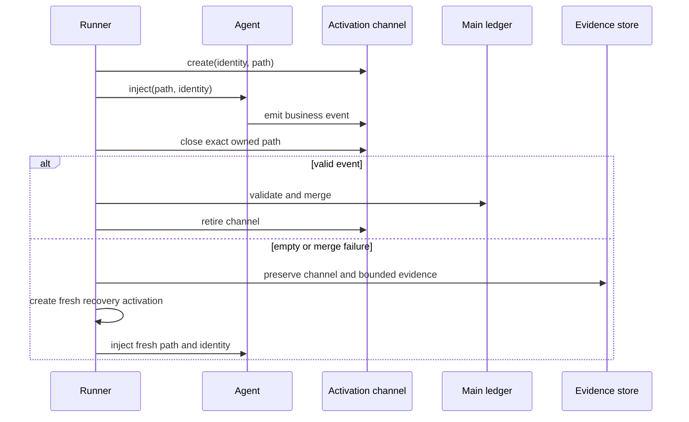

## Goal Capsule

- **Objective:** Isolated Ralph activations must deliver events reliably, recover diagnosably from missing delivery, and never let another loop's stale state decide the current loop's routing.
- **Means:** Give every activation an explicit channel identity and give every loop an isolated authority view, while preserving the existing JSONL and `ralph emit` workflow.
- **Product authority:** The runtime is authoritative for activation identity, channel ownership, event acceptance, recovery attempts, and loop authority; agent text is evidence, not an accepted business transition.
- **Open blockers:** None.

## Product Contract

### Summary

Ralph will make isolated activation delivery explicit and loop-scoped. A failed activation can be retried once with a fresh identity and channel, while every failed attempt remains available as evidence instead of being silently discarded.

### Problem Frame

Repeated `parallel-forge` failures combine two different kinds of implicit state: a workspace-level channel marker and authority records that can lack loop identity. That allows a valid agent result to become an empty activation at merge time, and allows a previous loop's tail to reject current-loop events. The system needs a single, inspectable ownership model for both activation output and loop routing state.

### Key Decisions

- KTD1. **Explicit per-activation channel ownership** (session-settled: user-directed — chosen over inherited file descriptors/pipes and a central event broker: preserves the existing JSONL and CLI workflow while removing implicit marker-based merge decisions). Governs R1, R2, R5.
- KTD2. **One evidence-preserving recovery attempt** (session-settled: user-directed — chosen over immediate failure and silent success: handles transient delivery failures without allowing missing business events to pass as completion). Governs R3, R4.
- KTD3. **Fresh identity for every recovery attempt** (session-settled: user-directed — chosen over reusing the failed channel: prevents duplicate events and mixes of pre- and post-recovery output). Governs R3, R4.
- KTD4. **Loop-scoped authority with automatic stale-state isolation** (session-settled: user-directed — chosen over startup refusal and legacy blind reads: allows reuse while preventing unrelated historical records from influencing current routing). Governs R6, R7.

### Requirements

#### Activation delivery

- R1. Every isolated activation has one runtime-owned identity and one dedicated event channel, and the merge operation uses that activation's channel rather than inferring a channel from mutable workspace-global state.
- R2. Compatibility entry points may continue to help an agent locate its current channel, but compatibility state must not override or redefine the channel selected by the owning activation.
- R3. An activation that ends without an accepted business event is recorded as an incomplete delivery with its output and channel evidence preserved for diagnosis.
- R4. An incomplete delivery receives at most one targeted recovery activation; the recovery uses a new activation identity and a new channel, and the original attempt remains immutable evidence.
- R5. A recovery attempt is accepted only when it produces a valid business event through its own channel; otherwise the runtime enters the configured failure path and must not claim successful completion.

#### Loop authority and termination

- R6. Authority records used by an active loop must belong to that loop and must contain a valid non-empty step; records without loop identity, with another loop identity, or with an empty step cannot influence active-loop routing.
- R7. Starting or reusing a workspace automatically isolates stale authority state from the new loop while retaining the old state as diagnostic history.
- R8. Runtime control termination events remain operable even when business-flow authority is stale or invalid; a business ledger failure must not create a second failure that prevents cancellation or final cleanup from being recorded.

#### Recovery and topology

- R9. The failure path from missing activation delivery reaches cleanup and reporting with enough evidence to distinguish agent non-emission, channel routing failure, and merge/storage failure when the available runtime evidence supports that distinction.
- R10. `parallel-forge` cleanup remains reachable after a wave settles or after a verifier delivery failure, and cleanup reports partial resource retention instead of claiming full cleanup when resources remain.

### Key Flows

- F1. **Normal isolated activation**
  - **Trigger:** A hat activation starts in isolated mode.
  - **Steps:** Runtime assigns an activation identity and channel; the agent emits through that channel; runtime validates and merges only that channel; accepted events advance the loop.
  - **Outcome:** The activation is complete and its channel is retired only after successful merge.
  - **Covered by:** R1, R2, R5.

- F2. **Missing event delivery and recovery**
  - **Trigger:** Backend output exists but no accepted business event is found for an activation with a publish obligation.
  - **Steps:** Runtime preserves the failed attempt; records bounded evidence; starts one fresh recovery activation; validates the new channel; then either advances or enters the failure path.
  - **Outcome:** No missing-event activation becomes silent success, and no retry reuses ambiguous state.
  - **Covered by:** R3, R4, R5, R9.

- F3. **Workspace reuse with stale authority**
  - **Trigger:** A new loop starts in a workspace containing authority records from an earlier loop.
  - **Steps:** Runtime selects only valid records for the active loop; isolates unrelated or malformed records; permits control termination independently of business-flow validation.
  - **Outcome:** The new loop starts from its own authority state and can always record cancellation/final cleanup.
  - **Covered by:** R6, R7, R8.

### Acceptance Examples

- AE1. **Marker mutation does not redirect merge**
  - **Given:** An activation owns channel A and compatibility marker state changes to point at channel B.
  - **When:** The activation closes.
  - **Then:** The runtime merges channel A only and records the marker mismatch as diagnostic evidence.
  - **Covers:** R1, R2.

- AE2. **Empty first attempt gets one fresh recovery**
  - **Given:** The first activation has backend output but no accepted business event.
  - **When:** The runtime invokes recovery.
  - **Then:** The first channel remains inspectable, the recovery uses a new identity/channel, and a second empty result enters failure handling rather than completion.
  - **Covers:** R3, R4, R5.

- AE3. **Stale authority cannot poison a new loop**
  - **Given:** The authority ledger contains malformed, unstamped, and other-loop tail records plus a new active loop identity.
  - **When:** The new loop performs policy validation.
  - **Then:** Only valid records for the active loop influence routing; unrelated records are ignored and classified for diagnosis.
  - **Covers:** R6, R7.

- AE4. **Cancellation survives business-ledger failure**
  - **Given:** Business-flow authority rejects a fail-close or cleanup transition.
  - **When:** The runtime receives a cancellation request.
  - **Then:** Cancellation is recorded through the runtime control path and cleanup/reporting can still be finalized.
  - **Covers:** R8, R9.

### Scope Boundaries

- Central event broker or pipe-based transport is deferred; this work extends the existing file-based event workflow.
- Broad redesign of all supervisor/wave persistence is outside this work; only the activation delivery and loop-authority boundaries needed to prevent this failure family are included.
- Increasing retry counts without changing channel ownership or authority isolation is not considered a solution.

### Dependencies / Assumptions

- Existing JSONL event validation, accepted-transition recording, and `task.resume` recovery semantics remain available for reuse.
- Runtime can retain bounded failed-activation evidence without retaining full model transcripts or unbounded tool streams.
- Existing `parallel-forge` cleanup and reporting hats remain the user-visible failure handoff.

### Sources / Research

- `docs/report/2026-08-26-parallel-forge-2026-08-26-1104-feat-ralph-causal-diagnosis-evidence-loop-plan-diagnosis.md`
- `CONCEPTS.md` entries for `Hat`, `causal flight recorder`, `Recovery Intent`, `Accepted Transition`, and `wave channel registry`
- `crates/ralph-cli/src/loop_runner/paths.rs`
- `crates/ralph-cli/src/loop_runner/hat_channel.rs`
- `crates/ralph-core/src/event_loop/mod.rs`
- `crates/ralph-core/src/event_loop/completion_and_termination.rs`
- `presets/en/parallel-forge.yml`

## Planning Contract

### Key Technical Decisions

- KTD5. Carry the exact prepared channel path through normal and interrupt close paths; use the marker only as the child-process discovery compatibility surface.
- KTD6. Make activation evidence append-only and quarantine failed channels with bounded metadata before cleanup can remove transient runtime files.
- KTD7. Treat a missing loop identity as an invalid runtime write, while allowing readers to ignore legacy/unrelated records rather than treating them as current authority.
- KTD8. Keep runtime recovery and cancellation outside business-flow step validation, while preserving normal schema and routing checks for business events.

### High-Level Technical Design

The current flow has two implicit lookups: the child uses a workspace marker to find its channel, and the close path reads that marker again to find what to merge. The new flow makes the activation object the owner of the prepared path and identity, so close and recovery operate on the exact object created for that attempt.

Authority reads follow the same boundary: an active loop only consumes valid records bearing its own loop identity. Invalid or unrelated records are observable diagnostic history, never current routing state. Runtime control events use a separate termination boundary so stale business state cannot block cancellation.

### System-Wide Impact

- **Runtime:** activation lifecycle, merge/interrupt close paths, recovery bookkeeping, flow-authority reads and writes.
- **Agent interface:** the existing `RALPH_EVENTS_FILE` and `ralph emit` workflow remains available, but the runtime-owned activation path becomes authoritative.
- **Preset/configuration:** `parallel-forge` cleanup and failure routing must cover settled waves and missing verifier delivery; schema and lint checks must stay structurally aligned.
- **Diagnostics:** failed channel artifacts gain a durable bounded evidence path, while full prompts and unbounded tool streams remain out of scope.
- **Compatibility:** legacy unstamped authority data is ignored for active-loop decisions and retained only as historical evidence.

### Risks & Dependencies

- A close-path refactor must cover normal completion, backend interruption, timeout, and cancellation; missing one path would preserve the recurrence.
- Recovery must not accidentally count diagnostic or rejected records as business progress.
- Failed-channel retention must be bounded and must not prevent eventual workspace reuse.
- Preset changes require synchronized schema, lint, BDD, agent-facing guide, and manifest parity checks where applicable.

### Documentation / Operational Notes

- Update the relevant `crates/ralph-core/data/ralph-tools-*.md` guidance only if the agent-visible emit or recovery action changes; keep it command-oriented and free of internal ledger paths.
- Add a diagnosis note describing how to distinguish empty agent output, channel routing mismatch, and merge I/O failure from the retained activation evidence.

## Implementation Units

### U1. Enforce loop-scoped flow authority

- **Goal:** Prevent malformed or cross-loop authority tails from influencing active routing.
- **Requirements:** R6, R7, R8.
- **Dependencies:** None.
- **Files:** `crates/ralph-core/src/event_loop/mod.rs`, `crates/ralph-core/src/event_loop/completion_and_termination.rs`, `crates/ralph-core/src/event_loop/tests/p0_4_flow_authority_ledger_tests.rs`, related event-loop recovery tests.
- **Approach:** Make runtime writes require a real loop identity and non-empty step; make active-loop reads ignore unstamped, malformed, empty-step, and other-loop records; retain diagnostic classification without promoting those records to current state; preserve the independent runtime-control termination path.
- **Patterns to follow:** Existing loop-id filtering tests and accepted-transition/recovery boundary tests.
- **Test scenarios:**
  - Active loop ignores an unstamped tail after valid records for another loop.
  - Active loop ignores an empty-step record and continues using its last valid record.
  - Snapshot writing with no runtime loop identity produces no authority record.
  - Cancellation remains accepted when the business authority ledger contains stale records.
- **Verification:** Flow authority decisions are deterministic across reused workspaces and no new orphan records are emitted.

### U2. Make isolated channel ownership explicit

- **Goal:** Ensure every merge and interrupt path operates on the channel prepared for that activation.
- **Requirements:** R1, R2, R5.
- **Dependencies:** U1 is independent but shared runtime tests should land before integration verification.
- **Files:** `crates/ralph-cli/src/loop_runner/paths.rs`, `crates/ralph-cli/src/loop_runner/hat_channel.rs`, `crates/ralph-cli/src/loop_runner/activation_outcome_close.rs`, `crates/ralph-cli/src/loop_runner/entry.rs`, `crates/ralph-cli/src/loop_runner/inner.rs`, existing loop-runner channel tests.
- **Approach:** Carry the prepared path in close state; validate that it belongs to the current workspace and activation; use the marker only to support child lookup; make marker updates/cleanup safe for the activation lifecycle; distinguish missing, empty, unreadable, and merge-failed channel states.
- **Patterns to follow:** Existing `NormalMergeState`, interrupt merge path, and channel snapshot/refinement logic.
- **Test scenarios:**
  - Marker mutation before close does not redirect merge away from the owned channel.
  - Marker deletion before close still permits merge of the owned channel.
  - A channel from another loop or activation is rejected rather than merged.
  - Normal, interrupt, timeout, and cancellation paths all use the same owned-channel contract.
- **Verification:** A valid event written to the prepared channel reaches the target ledger regardless of later marker changes.

### U3. Preserve evidence and perform one fresh recovery

- **Goal:** Turn missing delivery into a bounded, observable, one-attempt recovery flow.
- **Requirements:** R3, R4, R5, R9.
- **Dependencies:** U2.
- **Files:** `crates/ralph-cli/src/loop_runner/activation_outcome.rs`, `crates/ralph-cli/src/loop_runner/activation_outcome_close.rs`, `crates/ralph-cli/src/loop_runner/inner.rs`, `crates/ralph-cli/src/loop_runner/tests/legacy/activation_outcome.rs`, recovery-focused integration tests.
- **Approach:** Preserve failed channel metadata before cleanup; bind recovery to a new activation identity and channel; ensure only accepted business events reset the missing-delivery gate; after one failed recovery, route to cleanup/reporting with explicit evidence.
- **Patterns to follow:** Existing activation outcome trace schema, `task.resume` recovery envelopes, and bounded diagnosis evidence.
- **Test scenarios:**
  - Empty first channel creates evidence and one fresh recovery activation.
  - Recovery writes to a different channel and cannot replay the first attempt.
  - Empty second channel enters failure handling without silent completion.
  - Backend output mentioning emit but writing no event is classified as incomplete delivery, not success.
- **Verification:** Runtime traces show distinct activation identities, retained first-attempt evidence, and no accepted transition without a valid event.

### U4. Close the parallel-forge failure topology

- **Goal:** Ensure verifier delivery failure and settled waves still reach cleanup and reporting.
- **Requirements:** R9, R10.
- **Dependencies:** U1, U2, U3.
- **Files:** `presets/en/parallel-forge.yml`, `presets/schemas/parallel-forge.yml`, `crates/ralph-core/src/preset_lint/`, `crates/ralph-core/tests/scenarios/`, `crates/ralph-core/tests/scenarios.rs`, `crates/ralph-core/data/ralph-tools-emit.md`, `crates/ralph-core/data/ralph-tools.md` if agent-facing behavior changes.
- **Approach:** Add structural cleanup fallback for settled-wave/failure handoffs; keep cleanup status truthful for retained resources; update schema/lint and real runtime scenarios together; update agent-facing guidance only for changed operator-visible actions.
- **Patterns to follow:** Existing parallel-forge schema parity, workflow activation lint, and `run_workflow_guard_scenario` BDD coverage.
- **Test scenarios:**
  - A settled wave with verifier delivery failure activates cleanup.
  - Cleanup reports partial retention when a resource cannot be removed.
  - Strict preset lint rejects a cleanup topology that cannot consume the required failure/settled handoff.
- **Verification:** Parallel-forge reaches cleanup/reporter on both verified and bounded failure paths, with schema and preset parity intact.

### U5. Full regression and adversarial coverage

- **Goal:** Prove the recurrence is closed across lifecycle boundaries and hostile state combinations.
- **Requirements:** R1-R10 and AE1-AE4.
- **Dependencies:** U1, U2, U3, U4.
- **Files:** Existing event-loop and loop-runner test homes identified above; `docs/solutions/` only if a durable learning is required after verification.
- **Approach:** Add integration-level tests for cross-loop reuse, marker mutation, interrupt close, empty-channel recovery, stale authority plus cancellation, and parallel-forge cleanup. Review for state leakage, duplicate accepted events, and evidence deletion.
- **Patterns to follow:** Existing nextest isolation, real workflow scenario runner, and adversarial regression test conventions.
- **Test scenarios:**
  - Reused workspace combines stale authority, marker mutation, empty first channel, and cancellation without poisoning the new loop.
  - Repeated recovery attempts stop after one fresh activation.
  - Main-ledger events cannot substitute for missing authoritative channel evidence.
  - Full parallel-forge scenario reaches a truthful terminal report after a verifier failure.
- **Verification:** Targeted nextest, preset checks, BDD scenarios, CLI documentation drift checks, and the repository's full test gate pass.

## Verification Contract

- Targeted Rust behavior tests use `cargo nextest run` for the affected package/test subset; never use bare `cargo test` for `ralph-cli` tests.
- Preset changes use the required `ralph-cli` and `ralph-core` preset-lint/preset parity nextest checks.
- Real workflow scenarios use `run_workflow_guard_scenario` through the existing BDD integration tests.
- Agent-facing command or behavior documentation changes run `scripts/check-cli-doc-drift.sh` and the affected command `--help` smoke test.
- Final acceptance uses `./scripts/run-tests.sh`; if and only if a race-related flake requires it, use the documented serial fallback and report the reason.
- Adversarial review must inspect the diff for cross-loop state leakage, marker races, duplicate event acceptance, incomplete evidence retention, recovery budget bypass, and cleanup/reporting dead paths.

## Definition of Done

- Every accepted isolated business event can be traced to its owning activation channel and loop identity.
- Stale, unstamped, malformed, or empty authority records cannot influence an active loop.
- Empty delivery gets exactly one fresh recovery attempt, with failed evidence retained and no silent success.
- `parallel-forge` cleanup and reporting remain reachable and truthful on success and bounded failure paths.
- Targeted tests, preset/schema parity checks, BDD scenarios, documentation drift checks, and `./scripts/run-tests.sh` pass.
- An adversarial code review is complete, all actionable findings are resolved or explicitly reported, and no unrelated user changes are committed.
- Abandoned implementation attempts and temporary artifacts are removed.
