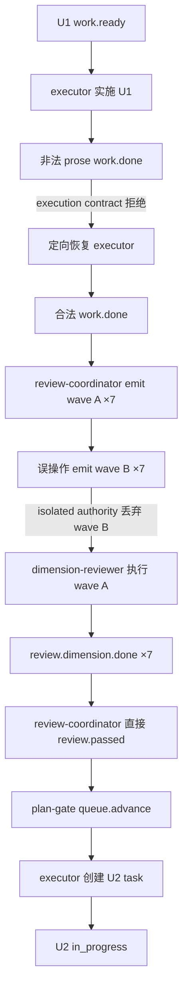

# ce-executor-isolated 非阻塞异常纠正诊断

## 结论摘要

本次运行没有在 U2 阻塞或终止。原报告把 UTC 事件时间与北京时间直接比较，将 `queue.advance` 后约 2 分钟的正常推进误判为 7 小时停滞。

实际情况如下：

- `queue.advance`：2026-06-11 13:11:39 UTC，即北京时间 21:11:39。
- U2 task 创建：2026-06-11 13:13:42 UTC。
- U2 task 开始：2026-06-11 13:13:45 UTC。
- U2 task `task-1781183622-3d64` 状态为 `in_progress`，由 executor 正常执行。

运行能够继续，部分原因确实是 Ralph 的反压与恢复机制生效，但不能把所有异常都归功于兜底：

| 异常 | 为什么没有阻塞 | 性质 |
|---|---|---|
| 第一次 `work.done` 是 prose 字符串 | execution contract 拒绝后定向恢复 executor；随后重发合法 JSON | **兜底机制生效** |
| review wave 重复发送 | isolated authority 拒绝第二批 7 个 business events，首批 wave 继续执行 | **隔离边界生效** |
| U1 绕过 Fixer | review-coordinator 主动发出 schema 合法的 `review.passed`，plan-gate 因而继续 | **agent 绕过，不是兜底** |
| 根 `.ralph` 指针不一致 | 活跃 loop 通过 `loops.json.workspace` 使用 worktree 内状态，未依赖旧 primary 指针推进 | **状态隔离避免影响** |
| 诊断报告时区错误 | 只影响离线分析，不参与运行时调度 | **报告问题** |

## 实际执行链路



### 预期链路差异

```text
预期：
dimension.done ×N
  → review-synthesizer
  → review.failed（存在 safe_auto）
  → fixer
  → fix.applied
  → 复审
  → review.complete/review.passed

实际：
dimension.done ×7
  → review-coordinator 直接 review.passed(skip_reason=trivial_step)
  → plan-gate
```

## 证据清单

### U2 未阻塞

- `.ralph/loops.json` 指向活跃 worktree：
  `.worktrees/2026-06-10-003-refactor-event-loop-and-loop-runner-tests-split-plan-smooth-fox`
- worktree `.ralph/agent/tasks.jsonl`：
  - U1 task 已 `closed`
  - U2 task `task-1781183622-3d64` 已创建并进入 `in_progress`
- worktree events：
  - `queue.advance` 时间为 `2026-06-11T13:11:39.958762418Z`
  - U2 task 创建时间为 `2026-06-11T13:13:42.474469830Z`

### execution contract 恢复成功

`recovery.jsonl` 记录：

- `source=execution_contract`
- `topic=work.done`
- `reason_code=InvalidPayload`
- `safe_target=true`
- `target_hat=executor`
- 后续 outcome 更新为 `recovered`

这条链路证明格式错误事件没有进入正常业务推进，而 executor 获得了重新发布合法事件的机会。

### 重复 wave 被隔离

`recovery.jsonl` 记录：

- `source=wave_dispatcher`
- `reason_code=wave_isolated_multiple_business_emissions`
- 第二个 wave 的 7 个事件被 dropped
- outcome 初始为 `not_retriable`

首个 wave 已经合法进入执行，因此丢弃重复 wave 不会阻断主链。

### U1 review 闭环存在缺口

事件中的 `review.passed`：

- `hat=review-coordinator`
- `changed_lines=80`
- `untracked_files=11`
- `findings_count=20`
- 其中 P2 为 4 项
- `skip_reason=trivial_step`

该事件满足 payload schema，但不符合 preset 对非空、非微小 diff 应进入完整 review/fix 链路的意图。运行继续是因为事件在结构上合法，并非 Ralph 修复了 findings。

### 根 `.ralph` 状态视图不一致

- `.ralph/current-loop-id` 指向旧 primary loop。
- `.ralph/loop.lock` 记录旧 PID。
- `.ralph/loops.json` 记录当前活跃 worktree loop。
- 实际 events、tasks、scratchpad 位于 worktree。

该不一致没有影响当前 worktree loop，但会误导人工诊断和只读取根 `.ralph/current-events` 的工具。

## 问题归因

| 优先级 | 问题 | 类型 | 当前影响 |
|---|---|---|---|
| P1 | `review.passed(trivial_step)` 可在存在非微小 diff 和 actionable findings 时通过 | preset 约束不足 + agent 执行偏离 | 跳过 Fixer，质量闭环不完整 |
| P1 | 诊断工具/报告未统一时区 | 诊断产物问题 | 误报 blocked，可能诱导错误修复 |
| P1 | 根 `.ralph` 的 current 指针与 `loops.json` 活跃 loop 不一致 | Ralph loop 状态展示问题 | 工具可能读取错误运行目录 |
| P2 | `ralph wave emit` 被重复执行 | agent 工具使用问题 | 产生噪音；隔离边界已阻止重复执行 |
| P2 | recovery outcome 出现 `not_retriable → pending`、`recovered → pending` 观测抖动 | 诊断状态问题 | 不影响本次业务推进，但降低报告可信度 |
| P2 | `progress.md` 中 U2 仍显示 pending/TBD | 运行产物同步滞后 | 与 task store 不一致，可能误导后续 agent |

## 哪些兜底真正起作用

1. **Payload execution contract**

   非法 `work.done` 被拒绝，并将恢复目标指向 executor。随后 executor 发布合法 payload，业务链恢复。

2. **Isolated business-emission authority**

   第二批 wave 被拒绝，避免重复 reviewer 工作和重复终态竞争。它属于隔离保护，不是重试机制。

3. **Event-driven queue routing**

   `queue.advance` 正常触发 executor。executor 按 preset 创建 U2 task，证明下一步路由本身工作正常。

4. **Worktree 状态隔离**

   活跃 loop 使用 worktree 内 `.ralph` 状态，根目录陈旧指针没有污染其 task 和 event 流。

## 没有被兜底覆盖的风险

- Ralph 当前只校验 `review.passed` 的字段和枚举值，没有校验：
  - `trivial_step` 是否真的满足 trivial 条件；
  - 是否存在 P0/P1/P2 actionable findings；
  - 是否已经经过 synthesizer；
  - `findings_count > 0` 时是否应该进入 Fixer。
- 因此，“任务继续”不能等价为“review 闭环正确”。
- 当前运行的主要风险是质量门被绕过，而不是任务推进失败。

## 建议

采用小范围修复，不调整整体 hat 拓扑：

1. 给 `review.passed` 增加轻量语义门，禁止明显不成立的 `trivial_step`。
2. 在 review-coordinator 指令中明确：wave 已发出后只能用只读命令验证。
3. 诊断报告统一输出 UTC 与本地时间，并从 `loops.json.workspace` 解析目标运行目录。
4. `ralph loops` 更新 current 指针时增加一致性检查，不迁移或重构状态存储。
5. progress 状态继续由现有 hat 写入，只补充 task store 对账要求。

