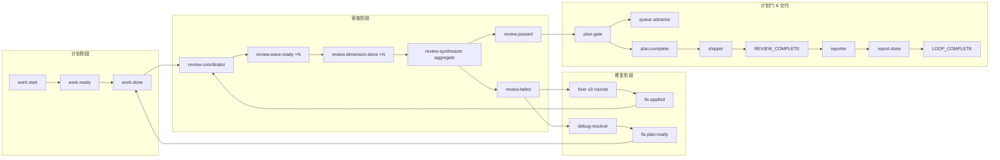
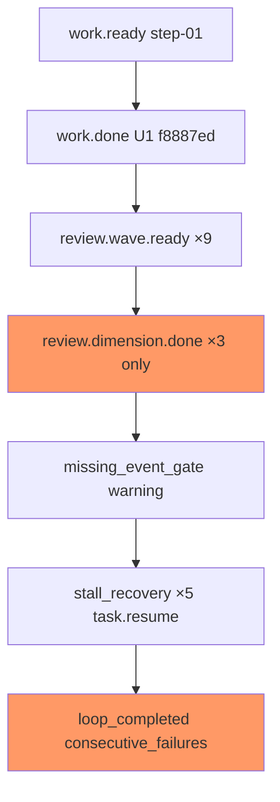

# ce-executor-isolated 多轮运行诊断报告

## 结论摘要

本次对 **4 个 `.ralph` 目录**（2 个 worktree + 2 个主仓指针）做了 preset 预期链路 vs 实际事件/任务/诊断产物的对账。核心判断如下：

| 维度 | 结论 |
|------|------|
| **跑得怎么样** | **部分成功、未闭环**。jolly-pine worktree 完成了 U1/U4 实现与 commit，但 **两次 loop 均以 `consecutive_failures` 或中途卡死结束**；autoresearch worktree 有完整 wave→fix 片段，但 **ralph 内置 hat 多次冒充终态**（`LOOP_COMPLETE`×3），计划未走 shipper→reporter→`report.done` 正规出口。 |
| **机制 vs 编排** | **约 60% 编排/agent 问题、30% 机制缺口、10% 观测噪声**。Wave 聚合超时/缺维、plan-gate 抢跑、schema 缺字段事件落盘，主要是 **preset 指令 + agent 行为**；`event_policy` 对缺字段 `review.passed` / 字符串 `review.failed` 未拒绝是 **机制漏洞**；drift 对 string payload 报 0% 字段是 **观测层误报**。 |
| **兜底有没有生效** | **部分生效、未能救场**。`execution_contract` 在 autoresearch 明确拒绝过非法 `work.done` 并恢复；`stall_recovery` / `missing_event_gate` **有记录但未把 wave 推过终线**；`verdict_gate` + `required_events: [report.done]` **阻止了假 LOOP_COMPLETE 成功退出**（好事）；U1 `trivial_step` 语义门 **本次运行未触发**（无 bypass 样本）。 |

**一句话**：Ralph 的「拒绝坏事件 + 写 recovery」在跑，但 **ce-executor-isolated 的 10-hat 闭环在 review 聚合与 plan 终态上多次被打穿**；不是单一 bug，而是 **agent 绕路 + preset 竞态窗口 + 个别 schema 执行缺口** 叠加。

---

## 1. Preset 预期链路（基线）

来源：`presets/en/ce-executor-isolated.yml` 头部注释与 hats 段。



**关键约束（preset + 源码）**：

- `execution_mode: isolated` — 10 hats，终态 topic 必须在 `publishes` 显式声明（U3）。
- `event_policy.schemas` — 多数业务 topic `payload: json_object` + `required_fields`。
- `execution_contracts.work.done` — `plan_name/task_id/task_key/step/commit_count/changed_lines` + git diff 门。
- `verdict_gate` — `REVIEW_COMPLETE` / `report.done` 的 `pass_or_fail=fail` 时拒绝 `LOOP_COMPLETE`。
- `required_events: [report.done]` — 无 manager 报告不得正常 completion promise。

---

## 2. 实际执行链路对比

### 2.1 ralph-orchestrator · jolly-pine worktree

**路径**：`.worktrees/2026-06-11-002-harden-ce-executor-isolated-nonblocking-anomalies-plan-jolly-pine/.ralph`  
**计划**：`docs/plans/2026-06-11-002-harden-ce-executor-isolated-nonblocking-anomalies-plan.md`

#### Session A — `events-20260611-160909.jsonl`（loop `2026-06-11-002-...-jolly-pine`）

| 步骤 | 预期 | 实际 | 状态 |
|------|------|------|------|
| coordinator → work.ready | step-01 task | ✅ `task-1781194245-b895` | OK |
| executor → work.done | schema + contract | ✅ 569 lines, commit `f8887ed` | OK |
| review-coordinator → wave | 9× `review.wave.ready` | ✅ 9 条（8 JSON + 1 摘要串） | OK |
| dimension-reviewer | 9× `review.dimension.done` | ❌ **仅 3/9**（adversarial, learnings, testing） | **FAIL** |
| review-synthesizer | aggregate → passed/failed | ❌ **未出现** | **FAIL** |
| plan-gate / shipper / reporter | 闭环 | ❌ 未到达 | **FAIL** |
| 终止 | LOOP_COMPLETE + report.done | ❌ `history.jsonl`: `consecutive_failures` @ iter 11 | **FAIL** |



**诊断 session**：`.ralph/diagnostics/2026-06-12T00-09-08/`

- `recovery.jsonl`：`drift_field_completeness` on `review.wave.ready`（11 条，payload 为 JSON **字符串** 时 drift 窗口判 0% 字段 — 见 §4.3）
- `missing_event_gate`：dimension-reviewer、review-coordinator 未履行 publish 义务
- `stall_recovery`：iter 6–10 重复 `stall_no_events`，outcome 多为 `pending` / 一次 `repeated`

#### Session B — `events-20260611-233519.jsonl`（loop `primary-20260611-233519`）

| 步骤 | 预期 | 实际 | 状态 |
|------|------|------|------|
| work.ready / work.done | step-04 U4 | ✅ `task-1781221021-bdf3`, commit `9802655` | OK |
| wave review | 10 维 | ✅ 10× wave.ready + **11** dimension.done（learnings **重复**） | ⚠️ |
| review-synthesizer | review.failed（41 findings, 3 P0） | ⚠️ **晚于 plan.complete 落盘** | **竞态** |
| review-coordinator | 不应抢 synthesizer | ⚠️ `review.passed` empty_diff（**缺 findings_count/fix_round/verdict**） | **FAIL** |
| plan-gate | 等 review 终态 | ❌ `plan.complete` @ `00:12:44` **早于** `review.failed` @ `00:18:51` | **FAIL** |
| shipper → reporter | REVIEW_COMPLETE → report.done | ❌ 未出现 | **FAIL** |

**事件时间序（Session B 尾部，UTC）**：

```
00:07:39  review.dimension.done (learnings, triggered=ralph)
00:10:54  review.passed (review-coordinator, skip_reason=empty_diff)  ← 缺 schema 字段
00:12:44  plan.complete (plan-gate, verdict=pass)                    ← 抢跑
00:18:51  review.failed (review-synthesizer, payload=纯字符串)         ← 应走 Fixer
```

**任务与 progress 对账**：

- `tasks.jsonl`：仅 2 条 closed（step-01 U1、step-04 U4）；**无 step-02/03 task 记录**。
- `progress.md`：声明 **step-02 in_progress**（U2 wave idempotency），与 task store **不一致**。
- U2/U3 代码在 git（`0c915c4`, `af843a1`）但 **未按 plan 逐步 queue.advance 记账**。

---

### 2.2 universal-autoresearch · chipper-crane worktree

**路径**：`.worktrees/2026-06-12-003035-ralph-30d-adaptation-plan-chipper-crane/.ralph`  
**计划**：`docs/plans/2026-06-12_003035-ralph-30d-adaptation-plan.md`

| Session | events 文件 | 终止原因 | 闭环情况 |
|---------|-------------|----------|----------|
| 1 `163921` | 61 行 | `cancelled` | 片段完整：fix.applied、REVIEW_COMPLETE×2，但 **ralph 发 LOOP_COMPLETE + loop.cancel** |
| 2 `200655` | — | `consecutive_failures` | drift 对 work.failed / REVIEW_COMPLETE 字段告警 |
| 3 `233500` | 17 行 | **仍在跑或已挂** | **6× dimension.done 后无 wave.ready**；coordinator 连发 4× work.ready；**ralph 3× LOOP_COMPLETE** + stall |

Session 3 尾部典型 **agent 自救失败**：

- `work.ready` 前几次 **缺 `plan_name/plan_path/complexity`**（最后一次才补全 6 字段）
- `ralph` hat：`LOOP_COMPLETE`×3（字符串 payload，无 `report.done`）
- `stall_recovery` 连续触发；`execution_contract` 曾拒 `work.done`（session `07-34-57` recovery）

---

### 2.3 主仓 `.ralph` 指针目录

| 路径 | 作用 | 本次价值 |
|------|------|----------|
| `ralph-orchestrator/.ralph` | 主仓诊断壳 | 多 session 空目录；**非活跃状态源** |
| `universal-autoresearch/.ralph` | 主仓注册 | 与 worktree 分离；分析以 worktree 为准 |

活跃 loop 均以 `loops.json` 的 `workspace` / `worktree_path` 指向 worktree（jolly-pine 已验证）。

---

## 3. 对账分析（偏离与异常）

### 3.1 Payload schema

| Topic | 预期 | 实际证据 | 是否被 policy 拒绝 |
|-------|------|----------|-------------------|
| `work.done` | json_object + 8 字段 | jolly-pine 两次均合规 | ✅ 接受 |
| `review.wave.ready` | json_object + 11 字段 | 多为 **JSON 字符串**（`ralph wave emit`），可解析为 object | ✅ 接受；drift 误报 |
| `review.passed` | 含 `findings_count/fix_round/verdict/skip_reason` | Session B：**缺前三项** | ❌ **应拒未拒**（已落盘） |
| `review.failed` | json_object + 7 字段 | Session B：**整段 prose 字符串** | ❌ **应拒未拒**（`payload: json_object` 门） |
| `plan.complete` | json_object + verdict | Session B 合规 | ✅ 接受（但 **时机错误**） |
| `LOOP_COMPLETE` | whitelist | autoresearch：**ralph hat 字符串** | ⚠️ 被 `required_events` / 无 report 挡住正常退出 |

**源码依据**：`event_policy.rs` 在 `payload: json_object` 时对非 object 应产生 `PayloadTypeMismatch`；`required_fields` 在 object 上逐字段检查（`event_policy.rs:438-466`）。事件已写入 `events-*.jsonl` 说明当时走了 `PolicyDecision::Accept` 路径，或 **由 loop runner 注入的事件绕过了 agent 输出解析链**（Session B 中 `triggered: ralph` / `shipper` 值得追查）。

### 3.2 Hat 触发逻辑

| Hat | 偏离 |
|-----|------|
| review-coordinator | Session B：在 synthesizer 未完成时发 `review.passed(empty_diff)`；注释写「task.resume recovery from origin guard」 |
| review-synthesizer | `review.failed` 晚到；payload 非 JSON |
| plan-gate | 仅听 `review.passed` 即 `plan.complete`，**未等 review.failed / review.complete** |
| ralph（内置） | autoresearch：冒充 `LOOP_COMPLETE`、`work.ready`；stall 时注入 `task.resume` |
| shipper | Session B：`review.failed` 的 `triggered=shipper` — **顺序反常** |

### 3.3 产物一致性

| 文件 | 问题 |
|------|------|
| `progress.md` | step-02 in_progress，但 tasks 无 step-02/03；step-04 已 closed |
| `tasks.jsonl` | 仅 2 tasks；plan 4 steps 未逐步映射 |
| `summary.md` (Session A) | 「Failed: too many consecutive failures」；events 统计与 events 文件不一致（写 14 events / 10 dimension.done） |
| `fix-log.md` | Session B synthesizer 注明 `fix_round=0 (no fix-log.md)` — Fixer 链未启动 |

---

## 4. 兜底机制专项评估

| 机制 | 设计位置 | 本次是否触发 | 是否达到设计意图 | 判定 |
|------|----------|--------------|------------------|------|
| **execution_contract** (`work.done`) | preset L74-95; `execution_contract.rs` | autoresearch `recovery: execution_contract/InvalidPayload` | 拒绝后 outcome `recovered` | ✅ **生效** |
| **event_policy schema enforce** | preset L103-206; `event_policy.rs` | 未见 `payload_contract` / `EVENT_POLICY_REJECTED` 入 recovery | `review.passed` 缺字段、`review.failed` 字符串仍落盘 | ❌ **缺口** |
| **U1 trivial_step 语义门** | preset `trivial_step_max_changed_lines: 50`; `event_policy.rs` | 无 `skip_reason=trivial_step` 且大 diff 的违规样本 | U1 已实现（progress 有测试证据），**运行态未验** | ⚪ 未触发 |
| **isolation / origin guard** | `event_origin.rs`; preset `topic_deny_rules` | 未见 `boundary_violation` in recovery | ralph 仍发业务 topic（autoresearch） | ⚠️ **部分失效**（ralph 豁免路径） |
| **missing_event_gate** | runtime diagnosis U2 | jolly-pine Session A iter 4-5 | outcome `pending`，wave 仍死 | ⚠️ **只诊断不治愈** |
| **stall_recovery** | `event_loop/mod.rs` inject `task.resume` | 两 worktree 多次 | 重复后 `consecutive_failures` | ⚠️ **触发但未恢复** |
| **drift_monitor** | `drift/detector.rs` field_completeness | 大量 `review.wave.ready` critical | string payload 在 `parse_json_fields` 当 object 解析失败 → 0% 字段 | ⚠️ **噪声**（`drift/alert.rs:336-340`） |
| **verdict_gate** | preset L57-71; `event_loop/mod.rs` | autoresearch 3× LOOP_COMPLETE | loop 未成功 complete；无 `report.done` | ✅ **挡住假成功** |
| **required_events: report.done** | preset L52 | 无 report.done 落盘 | 无 LOOP_COMPLETE 正常 honored | ✅ **生效** |
| **aggregate timeout → review.passed** | review-synthesizer hat | 未观察到 `aggregate_timeout` | Session A wave 未完成即 stall | ❌ **未走到** |

---

## 5. 问题归因表

| ID | 严重度 | 现象 | 归因 | 证据 |
|----|--------|------|------|------|
| P0-1 | **P0** | plan.complete 早于 review.failed，Fixer/shipper 链被短路 | **编排竞态** + plan-gate 触发面过窄 | Session B 事件 ts 序；plan-gate `triggers: [review.passed, review.complete, ...]` 无 `review.failed` |
| P0-2 | **P0** | schema 违规事件落盘（review.passed 缺字段、review.failed 字符串） | **机制缺口**（policy 未拒或注入路径绕过） | `events-20260611-233519.jsonl` L25-27 |
| P0-3 | **P0** | wave 9 维只回 3 维即 stall | **agent 执行** + wave 超时/并发未补偿 | Session A：3/9 dimension.done；missing_event_gate |
| P1-1 | P1 | progress.md 与 tasks.jsonl 长期不一致 | **编排指令**（U4 未完全 dogfood）+ agent | progress step-02 vs tasks 仅 step-01/04 |
| P1-2 | P1 | review-coordinator 发 empty_diff 跳过 synthesizer 合并结论 | **agent 绕路** + preset HARD RULE 执行不力 | review.passed summary 明文写 origin guard recovery |
| P1-3 | P1 | ralph hat 多次 LOOP_COMPLETE / work.ready | **agent 冒充** + isolated 对 ralph 仅 topic_deny 部分 topic | autoresearch session 3 |
| P1-4 | P1 | learnings dimension 重复 done（11/10） | **agent 执行** | Session B 两条 learnings dimension.done |
| P2-1 | P2 | drift critical 刷屏 review.wave.ready | **观测层** string/object 双轨 | `drift/alert.rs` + wave emit 写 string |
| P2-2 | P2 | stall_recovery 重复无 escalation 到 Hard | **机制** Responder 升级不足 | recovery outcome `pending`/`repeated` |
| P2-3 | P2 | 主仓 `.ralph` 与 worktree 易误导分析 | **运维/文档** | 空 diagnostics vs 活跃 worktree |

---

## 6. 修复建议

### 6.1 Preset / 编排（优先）

1. **plan-gate 触发器扩展**  
   - 将 `review.failed` 加入 `triggers`，或在 `review.passed` 处理前强制检查「当前 step 无 pending synthesizer aggregate」。  
   - 在 plan-gate instructions 增加：**若同一 step 存在未消费的 `review.failed`，禁止 `plan.complete`**。

2. **review-coordinator 硬门**  
   - 已有 `skip_reason` 枚举；补充：**禁止在 dimension.done 未齐（wave_id 未 closed）时发 `review.passed`**，除非 `skip_reason=aggregate_timeout` 且由 synthesizer 发出。

3. **progress / task 对账**  
   - U4 已写 preset 指令；增加 **preflight**：plan-gate 读 `progress.md` Current Step 必须与 `task_id` closed 状态一致，否则 `plan.blocked`。

4. **ralph hat 业务 topic**  
   - 扩充 `topic_deny_rules`：ralph → `LOOP_COMPLETE`（除 loop runner 内部注入外）、`work.ready` 等；或 **禁止 agent 迭代以 ralph hat 写 JSONL**（仅 orchestrator 可写）。

### 6.2 Ralph 基座机制

1. **event_policy 一致性审计**  
   - 对 Session B 的 `review.passed` / `review.failed` 做 replay test，确认 `validate_event` 是否被跳过（`triggered=ralph` 注入路径）。  
   - 若注入事件绕过 policy：**统一经同一 `validate_event` 门**。

2. **drift field_completeness**  
   - `parse_json_fields` 已对 `Value::String` 二次解析（`drift/engine.rs:535`）；确认 **EventSnapshot 投影** 与 event_reader 一致，消除 wave.ready 误报。

3. **stall_recovery 升级**  
   - 同一 `retry_key` 连续 N 次 `repeated` 后 Hard：`task.resume` 路由到 **review-coordinator 或 debug-resolver**，并带 wave_id / 缺维列表。

4. **missing_event_gate → 动作**  
   - outcome `pending` 不应只写 recovery；对 wave hat 可自动 **重发 wave 或降级 aggregate_timeout**。

### 6.3 Agent / 产物规范

1. **review.failed payload** 强制 `ralph emit --payload-json` 或结构化模板；preset 加 **emit 前 jq 校验** 一步。  
2. **fix-log.md** 在首次 review.failed 前由 synthesizer 创建，避免 fix_round=0 歧义。  
3. **禁止多 step 单 commit  без plan-gate 知情**（Session B U2+U3+U4 批量）— coordinator 应拆 step 或 plan-gate 检测 git range。

---

## 7. 证据清单（索引）

### 7.1 jolly-pine worktree

| 类型 | 路径 |
|------|------|
| Preset | `presets/en/ce-executor-isolated.yml` |
| Events S1 | `.worktrees/.../jolly-pine/.ralph/events-20260611-160909.jsonl` (15 lines) |
| Events S2 | `.worktrees/.../jolly-pine/.ralph/events-20260611-233519.jsonl` (27 lines) |
| Tasks | `.worktrees/.../jolly-pine/.ralph/agent/tasks.jsonl` (2 closed) |
| Progress | `.worktrees/.../jolly-pine/.ralph/agent/progress.md` |
| History | `.worktrees/.../jolly-pine/.ralph/history.jsonl` |
| Recovery S1 | `.worktrees/.../jolly-pine/.ralph/diagnostics/2026-06-12T00-09-08/recovery.jsonl` |
| Recovery S2 | `.worktrees/.../jolly-pine/.ralph/diagnostics/2026-06-12T07-35-15/recovery.jsonl` |
| Summary S1 | `.worktrees/.../jolly-pine/.ralph/agent/summary.md` |

### 7.2 autoresearch chipper-crane

| 类型 | 路径 |
|------|------|
| Events S1/S3 | `.../chipper-crane/.ralph/events-20260611-163921.jsonl`, `events-20260611-233500.jsonl` |
| Recovery | `.../chipper-crane/.ralph/diagnostics/2026-06-12T04-06-51/recovery.jsonl`, `2026-06-12T07-34-57/recovery.jsonl` |
| History | `.../chipper-crane/.ralph/history.jsonl` |

### 7.3 源码锚点

| 机制 | 文件:行号（约） |
|------|----------------|
| Schema 校验 | `crates/ralph-core/src/event_policy.rs:397-466` |
| RejectWithResume | `crates/ralph-core/src/event_loop/mod.rs:735-774` |
| Flexible payload 读盘 | `crates/ralph-core/src/event_reader.rs:58-85` |
| Drift 字段投影 | `crates/ralph-core/src/drift/alert.rs:311-340` |
| plan-gate triggers | `presets/en/ce-executor-isolated.yml:1344-1348` |

---

## 8. 与既有报告关系

- `docs/report/2026-06-11-ce-executor-isolated-nonblocking-anomalies-corrected-diagnosis.md` 纠正了 **U2 未阻塞** 的时区误判；本报告覆盖 **更新 worktree（jolly-pine）上 6/11–6/12 两轮 session**，并补充 **autoresearch 30d plan** 对照。  
- 机制 vs 编排结论与 `docs/report/2026-06-09-ce-executor-mechanism-vs-orchestration-diagnosis.md` 方向一致：**兜底在，但 preset/agent 绕路使闭环打折**。

---

## 9. 建议的下一步验证（非本报告范围）

```bash
# 1. 对 Session B 问题事件做 replay
cargo test -p ralph-core event_policy -- --nocapture

# 2. preset 硬门
ralph preset check -H builtin:ce-executor-isolated

# 3. 诊断渲染
ralph diagnose --session latest --diagnostics-root .worktrees/.../jolly-pine/.ralph/diagnostics
```

---

*报告生成：2026-06-12 · 基于磁盘产物 + `ce-executor-isolated.yml` + ralph-core 源码对账。*
