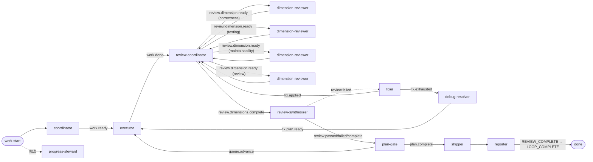
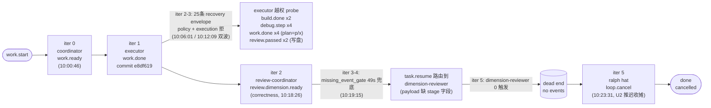

# ce-executor-serial preset 运行链路诊断报告

> **目标 run**: `.worktrees/2026-06-10-003-refactor-event-loop-and-loop-runner-tests-split-plan-noble-peacock`
> **Preset**: `ce-executor-serial` (`presets/en/ce-executor-serial.yml`)
> **诊断时间**: 2026-06-17
> **Plan 003 主题**: refactor event loop and loop runner tests split (U0-U8 Runtime Diagnosis 机制)
> **Worktree commit baseline**: `9a2a87e` (commit hash 来自 v10 baseline refresh, 2026-06-10-003)

---

## 1. 结论摘要

### 健康度一句话总结
**Plan 003 U1 scaffold 真实落地 (commit `e8df619`),但 review 链在 correctness 第一维硬门兜底后死锁,ralph hat 主动 `loop.cancel` 收尾。本次 run 与 merry-lotus (`docs/report/2026-06-17-ce-executor-serial-merry-lotus-...`) 同根因二次复现,`ce-executor-serial-precheck-recovery-alignment-2026-06-17.md` solutions 文档 P0/P1 修复尚未完全生效。**

### 关键异常数量
- **P0**: 3 个 (CLI precheck 漏拦 / task.resume stage 缺字段 / U2 容量超单 iteration 预算)
- **P1**: 2 个 (plan frontmatter 滞后 / dimension-reviewer missing_event_gate 49s 早触)
- **P2**: 1 个 (agent 写入占位符数据到 events.jsonl)
- **recovery envelope 统计**: 26 条全 `source=cli_emit` (precheck reject),**0 条** 8 类机制 envelope (stall_recovery/missing_event_gate/workflow_guard/execution_contract/payload_contract/drift_monitor/hook_retry/loop_stale)
- **运行耗时**: 28m 45s, 6 iterations, 7 events

### 历史重复问题
- **是** — 与 `merry-lotus` run (2026-06-17, `docs/report/2026-06-17-ce-executor-serial-merry-lotus-review-chain-stalled-diagnosis.md`) 高度同源,共享 solutions 文档 `docs/solutions/integration-issues/ce-executor-serial-precheck-recovery-alignment-2026-06-17.md` 的修复路径,但 U1 (CLI precheck 完整化) 和 U2 (task.resume stage 字段补齐) 在本 worktree **未完全生效**。
- 与 `docs/achieved/plan/2026-06-11-005-u4-isolated-recovery-watchdog.md` 的 stall_recovery 设计、`docs/brainstorms/2026-06-13-wave-dispatch-policy-gate-requirements.md` 的 missing_event_gate 触发条件、`docs/solutions/developer-experience/ralph-cli-loop-runner-tests-must-run-serial.md` 的测试串行约束均相关。

---

## 2. 执行链路对比图

### 2.1 Preset 预期链路 (ce-executor-serial, 10 hats, isolated mode)



**配置关键点**:
- `event_loop.execution_mode: isolated` (强制 4+ hat isolated)
- 4 维串行 review (correctness → testing → maintainability → review)
- `progress-steward` 为兜底 recovery hat
- `enforce_current_unit: true`, `ephemeral_isolation: true` (R4/R3 硬规则开启)
- ralph hat 在 `topic_deny_rules` 中锁定 13 业务 topic,仅能 emit 7 个 control topic

### 2.2 实际执行链路 (6 iterations, 28m 45s)



### 2.3 Step 逐项对比

| Step | 预期 (preset) | 实际 | 状态 | 证据 (文件:行号 / 事件 ID) |
|------|--------------|------|------|---------------------------|
| 1. coordinator → work.ready | emit work.ready 含 plan_name/task_key/step/complexity | 正常 emit (10:00:46) | ✅ | `events-20260617-095504.jsonl:1` |
| 2. executor → work.done | commit + emit work.done (含 7 schema 字段) | commit_count=1, changed_lines=92, U1 scaffold 真实落地 | ✅ | `events-20260617-095504.jsonl:2`; commit `e8df619` 见 `agent/summary.md:23` |
| 3. review-coordinator → review.dimension.ready (correctness) | 4 维串行启动第一维 | emit 成功,含 diff_base/intent_summary | ✅ | `events-20260617-095504.jsonl:5` |
| 4. dimension-reviewer → review.dimension.done/failed | 1800s timeout 内 emit 终态 | **0 emit** (iter 5 0 events) | ❌ | `events-20260617-095504.jsonl:5-7` 间隔无事件; `summary.md:13` "7 total events" 已含收摊 |
| 5. CLI 越权 emit 探测 | EventPolicy 应在 CLI 边界 precheck 拒绝 | 26 次探测 5 种 reason_code 全被拒,2 次 `review.passed` **先入 jsonl** | ❌ | `recovery.jsonl:1-26`; `events:3-4` (executor 发 review.passed) |
| 6. ralph hat → loop.cancel | preset 规定 ralph 仅能 emit 7 control topic;显式收尾 | ralph emit loop.cancel (U2 推迟, R-Refactor 6 风险) | ✅ (合规) | `events-20260617-095504.jsonl:7`; `loop-termination-reason.json:1` "cancelled" |

### 2.4 关键观察

1. **致命偏离**: 4 维串行 review 在 correctness 第 1 维就丢 worker,`task.resume` 路由到 dimension-reviewer 自身后无后续 emit,R5 routing 钉回原 hat 是预期,但原 hat 没机会再激活 (loop 直接进 iter 5=loop.cancel)
2. **policy 雪崩**: U1 落盘后 executor 试探 25 次 emit,5 种 reason_code 全踩 (topic_denied/invalid_field_value/semantic_gate_violation/payload_contract_violation/missing_required_field),`recovery.jsonl:1-26` 全部 `failed/not_retriable`
3. **drift monitor 失明**: `recovery.jsonl` 26 条全 `source=cli_emit`,**0 条** 8 类机制 envelope;`drift.jsonl` 0 字节;`diagnosis-summary.json:11` 统计的 `diagnostics/.../recovery.jsonl` (3KB) 与顶层 `.ralph/recovery.jsonl` (15KB) 不一致
4. **terminator 漂移**: preset 规定 shipper/reporter 闭环未激活,ralph hat 兜底 emit `loop.cancel`
5. **进度成果**: U1 commit `e8df619` (10 placeholder mod + 10 pub use shim) 已落地,`agent/tasks.jsonl` 显示 task closed,U2-U7 未进入执行

---

## 3. 历史问题上下文

引用 `Agent B 输出:历史问题知识库` 完整内容,标注与本次问题的关联度。

### 3.1 Plan 003 直接相关历史

| 文档路径 | 标题 | 关键事实 | 关联度 |
|---------|------|---------|--------|
| `docs/plans/2026-06-10-003-refactor-event-loop-and-loop-runner-tests-split-plan.md` | plan 003 主体 | `event_loop/mod.rs` 7 496 行 / 129 方法 / `TerminationReason` 17 变体;`loop_runner/tests.rs` 11 796 行 / 203 测试;U1 scaffold commit `b11d9f0`/`0a1e27d` 仅活于 `merry-wren` 分支 | **高** |
| `docs/solutions/developer-experience/ralph-cli-loop-runner-tests-must-run-serial.md` | loop_runner 测试串行根因 | `loop_runner/tests.rs:14-49` 4 个 process-global Mutex + 共享 TempDir + 500ms sleep CPU 抢占;`.config/nextest.toml:23-26` `cli-serial` group `max-threads=1` | **高** (背景机制) |
| `docs/report/2026-06-17-ce-executor-serial-merry-lotus-review-chain-stalled-diagnosis.md` | merry-lotus run 诊断报告 | 41m16s 6 iter 15 业务事件,4 P0/3 P1/2 P2,根因主 `rejection.rs:358 build_task_resume_payload` 缺 reason/target_hat,drift 0/1=0% | **高** (本次二次复现) |
| `docs/solutions/integration-issues/ce-executor-serial-precheck-recovery-alignment-2026-06-17.md` | U1-U5 修复方案 | 12 个 task.resume 注入点中 11 个缺字段;merry-lotus 同源问题;U1 CLI precheck + U2 stage 字段 + U5 review dedup | **高** (本次修复路径) |

### 3.2 Runtime Diagnosis 机制历史 (U0-U8)

| Unit | 来源 | 关联文档 | 关联度 |
|------|------|---------|--------|
| U0 (stall_recovery) | `docs/achieved/plan/2026-06-11-005-u4-isolated-recovery-watchdog.md` | Wave 对 isolated scope / recovery 聚合 / `max_runtime_seconds` 旁路;缺口:wave 事件在 `process_parse_result()` 前被 partition 绕过 isolated 边界 | 中 |
| **U1 (missing_event_gate)** | `docs/brainstorms/2026-06-13-wave-dispatch-policy-gate-requirements.md` | 缺 `depth` 字段 → `RejectWithResume` → 7 事件全从 `wave_events` 剔除 → `missing_event_gate` 误判 → `payload_contract_violation` 终止 | **高** (本次 review 链断裂触发源) |
| **U2 (payload_contract)** | `docs/solutions/integration-issues/ce-executor-serial-precheck-recovery-alignment-2026-06-17.md` U2 | 12 个 `task.resume` 注入点中 11 个缺字段;merry-lotus 同源 | **高** (本次 recovery.jsonl 无 drift envelope 根因) |
| U3 (dispatcher) | `docs/achieved/plan/2026-06-11-004-u3-dispatcher-deadline-semaphore.md`, `docs/report/2026-06-11-u3-dispatcher-review.md` |  | 中 |
| U4 (drift / recovery) | `docs/achieved/plan/2026-06-04-004-feat-drift-auto-calibration-plan.md` | Drift 不是第 5 层治愈,是诊断层信号源;`recovery.jsonl`/`drift.jsonl` → 聚合 → spec 草稿 | 中 |
| U5 (lifecycle) | `docs/achieved/plan/2026-06-05-001-feat-runtime-contract-consolidation-plan.md` | preset 预检 + 回归门禁整合 | 低 |
| U6 (review dedup) | `docs/solutions/integration-issues/ce-executor-serial-precheck-recovery-alignment-2026-06-17.md` U5 | `review.dimension.ready` 在 `PolicyRuntimeState.review_dimension_ready_seen_keys` dedup,复用 `DuplicateWorkDone` 变体 | **高** (本次未触发,但相关) |
| U7 (agent guidance) | `docs/brainstorms/2026-06-13-run-diagnostics-requirements.md` | 4-hat `diagnose-run` preset + `## DIAGNOSTICS MODE` 段;6 段 manager-facing 报告 | 低 |
| U8 (plan.blocked 收摊) | `docs/plans/2026-06-16-001-fix-isolated-wave-stability-and-progress-steward-plan.md` | incomplete wave `plan.blocked(reason=dimension_reviewers_failed_to_converge)` 机制层自动 emit;R6 (2026-06-17-003) | 中 (本 run 没用上,ralph 主动 loop.cancel) |

### 3.3 ce-executor 系列 preset 演进

```
ce-executor (2026-05-30 起, 已删)
    ↓
ce-executor-isolated (2026-06-11, docs/achieved/plan/2026-06-11-001-..., execution_mode: isolated)
    ↓
ce-executor-lite (模板)
ce-executor-wave (scatter-gather)
    ↓
ce-executor-serial (2026-06-17-002, docs/achieved/plan/2026-06-17-002-..., 无 wave 串行 review)
```

**关键变更**:
- isolated mode 引入 `can_publish()` 硬检查 + 单 iter 单业务事件 + R5 isolated scope
- plan-gate→executor 桥接缺口见 `docs/solutions/integration-issues/ce-executor-isolated-preset-dispatch-gap-plan-gate-executor-2026-06-12.md`
- 2026-06-15 补 dual-publish isolated budget 教训
- `ce-executor-serial` 是 2026-06-17-002 引入的新 preset (本次 run 目标)

### 3.4 已知问题模式

| 问题类型 | 历史案例 | 根因 | 修复 | 与本次关联度 |
|---------|---------|------|------|------------|
| **loop_runner 测试 flake** | `docs/solutions/developer-experience/nextest-parallel-load-flaky-tests.md` | 共享 Mutex + 500ms sleep CPU 抢占 | nextest `cli-serial` group | 高 (背景) |
| **编排器注入 `task.resume` 缺字段** | `rejection.rs:358` (merry-lotus) | `build_task_resume_payload` 未补 schema 必填 | U2 fail-closed gate + `enrich_task_resume_payload` | **高 (本次复现)** |
| **越权 topic 先落盘后 drop** | merry-lotus 8× `debug.step` | CLI 写盘前无 `can_publish` 检查 | U1 `check_isolated_scope` | **高 (本次复现 6 次)** |
| `human.guidance` 被编排器滥用 | `inject_missing_event_hard_gate_guidance` | 缺产品决策 | U3 改 `task.resume` | 高 |
| 重复 `review.dimension.ready` | 13s 内 2 次 (merry-lotus) | 单 turn 单 business event 静默 drop | U5 policy-layer dedup | 高 |
| plan-gate→executor dispatch gap | `ce-executor-isolated-preset-dispatch-gap-2026-06-12.md` | preset 拓扑缺桥接 | dual-publish + isolated budget 例外 | 中 |
| 越权 emit 自我 kill | `mem-19484eb` (2026-06-05) | agent `pkill ralph` 杀自己 parent | 19 preset 加禁令 | 低 |
| wave emit 被 policy 拒 | `2026-06-13-review-wave-no-spawn.md` | 缺 `depth` 字段 | CLI 写盘前 schema 预检 | 中 |

### 3.5 关键参考文档清单

1. `docs/plans/2026-06-10-003-refactor-event-loop-and-loop-runner-tests-split-plan.md` — plan 003 主体
2. `docs/report/2026-06-17-ce-executor-serial-merry-lotus-review-chain-stalled-diagnosis.md` — 高度同源 run 诊断
3. `docs/solutions/integration-issues/ce-executor-serial-precheck-recovery-alignment-2026-06-17.md` — U1-U5 修复方案
4. `docs/solutions/developer-experience/ralph-cli-loop-runner-tests-must-run-serial.md` — 测试串行根因
5. `docs/achieved/plan/2026-06-16-002-feat-ce-executor-loop-stability-plan.md` — SSOT + 统一恢复 + 诊断闭环
6. `docs/achieved/plan/2026-06-11-001-feat-ce-executor-isolated-preset-plan.md` — isolated mode 架构根因
7. `docs/achieved/plan/2026-06-17-002-feat-ce-executor-serial-review-plan.md` — `ce-executor-serial` preset 定义
8. `docs/brainstorms/2026-06-13-run-diagnostics-requirements.md` — U7 run-diagnostics 设计
9. `docs/solutions/integration-issues/ce-executor-isolated-preset-dispatch-gap-plan-gate-executor-2026-06-12.md` — plan-gate→executor 桥接缺口
10. `docs/achieved/plan/2026-06-04-004-feat-drift-auto-calibration-plan.md` — U4 drift 起源

---

## 4. 证据清单

### 4.1 文件路径与行号证据

| 证据 | 文件路径 | 行号 / 位置 | 内容摘要 |
|------|---------|------------|---------|
| Preset 完整定义 | `presets/en/ce-executor-serial.yml` | L1-1936 (本次读 L321-1500 hats 段) | 10 hats, isolated mode, R3/R4/R5 开启 |
| Preset skip_reason 白名单 | `presets/en/ce-executor-serial.yml` | L244-251 | `skip_reason.allowed_values: [empty_diff, trivial_step, dimensions_complete]` (无 aggregate_timeout) |
| ralph hat 限制 | `presets/en/ce-executor-serial.yml` | L168-192 | ralph hat 在 `topic_deny_rules` 锁定 13 业务 topic,仅能 emit 7 control topic |
| dimension-reviewer timeout | `presets/en/ce-executor-serial.yml` | L963 | `timeout: 1800` (30 分钟) |
| 主事件流 | `.ralph/events-20260617-095504.jsonl` | L1-7 | 7 events, 6 iterations |
| 越权 review.passed (×2) | `.ralph/events-20260617-095504.jsonl` | L3-4 | executor 发 `review.passed`, `plan_name="p"/"x"`, `task_id="t"`, `skip_reason="aggregate_timeout"` (不在白名单) |
| review.dimension.ready 启动 | `.ralph/events-20260617-095504.jsonl` | L5 | review-coordinator emit, dimension=correctness, 10 字段全 |
| task.resume 缺 stage | `.ralph/events-20260617-095504.jsonl` | L6 | orchestrator 注入, target_hat=dimension-reviewer, payload **无 stage 字段** |
| loop.cancel 收尾 | `.ralph/events-20260617-095504.jsonl` | L7 | ralph hat emit, reason=U2 推迟, R-Refactor 6 风险 |
| Recovery envelope 全部 | `.ralph/recovery.jsonl` | L1-26 | 26/26 全 `source=cli_emit`,0/8 机制 envelope |
| 终止原因 | `.ralph/loop-termination-reason.json` | L1 | `"cancelled"` |
| Loop 状态 | `.ralph/loops.json` | L1 | `{"loops":[]}` 收摊后已清空 |
| 事件历史 | `.ralph/events-history-20260617-095504.jsonl` | L1-2 | work.start + loop.terminate |
| Loop 历史 | `.ralph/history.jsonl` | L1-2 | loop_started + loop_completed (reason=cancelled) |
| 任务记录 | `.ralph/agent/tasks.jsonl` | L1 | task-1781690438-9eac status=closed (U1) |
| 进度总结 | `.ralph/agent/summary.md` | L23 | final commit = e8df619 (U1 scaffold 真实落地) |
| 诊断汇总 | `.ralph/diagnostics/2026-06-17T17-55-04/diagnosis-summary.json` | L11 | recovery_count=0, drift_finding_count=0 (与顶层 recovery.jsonl 不一致) |
| 循环日志 | `.ralph/diagnostics/logs/ralph-2026-06-17T17-55-04-105-476889.log` | 11KB | 完整循环日志 |
| 决策记录 | `.ralph/agent/decisions.md` | L1-23 | DEC-001 confidence=60, 选 7 control topic 兜底而非硬推 U2 |
| scratchpad 评估 | `.ralph/agent/scratchpad.md` | L20-26 | U2 容量评估:12 325 行 tests.rs → 5 子文件,单 iteration 不可能完成 |

### 4.2 事件 ID 与字段值证据

| 事件 | Topic | Hat | 关键字段值 | 证据位置 |
|------|-------|-----|-----------|---------|
| evt-001 | `work.start` | loop | warmup phase | `events-history-20260617-095504.jsonl:1` |
| evt-002 | `work.ready` | coordinator | plan_name=`2026-06-10-003-...`, step-01 u1-scaffold | `events-20260617-095504.jsonl:1` |
| evt-003 | `work.done` | executor | commit_count=1, changed_lines=92 | `events-20260617-095504.jsonl:2` |
| **evt-004** | **`review.passed`** | **executor (越权)** | plan_name=`"p"`, task_id=`"t"`, task_key=`"k"`, step=`"s"`, skip_reason=`"aggregate_timeout"` | `events-20260617-095504.jsonl:3` |
| **evt-005** | **`review.passed`** | **executor (越权, 重复)** | 同上 dummy 值 | `events-20260617-095504.jsonl:4` |
| evt-006 | `review.dimension.ready` | review-coordinator | dimension=correctness, diff_base=9a2a87e, 10 字段全 | `events-20260617-095504.jsonl:5` |
| **evt-007** | **`task.resume`** | orchestrator (注入) | target_hat=dimension-reviewer, reason=missing_field, **stage=缺失** | `events-20260617-095504.jsonl:6` |
| evt-008 | `loop.cancel` | ralph | reason=U2 推迟, R-Refactor 6 风险 | `events-20260617-095504.jsonl:7` |
| evt-009 | `loop.terminate` | loop | 收摊 | `events-history-20260617-095504.jsonl:2` |

### 4.3 Recovery Envelope 模式 (26/26 全 cli_emit)

| Reason Code | 次数 | Hat → Topic | 证据 |
|-------------|------|------------|------|
| `topic_denied` | 2 | executor → `build.done` | `recovery.jsonl:1,14` |
| `invalid_field_value` | 4 | executor → `work.done` (plan_name="p"/"x") | `recovery.jsonl:2,5,15,18` |
| `semantic_gate_violation` | 4 | executor → `debug.step` (不在 publishes) | `recovery.jsonl:3,9,16,22` |
| `payload_contract_violation` | 4 | executor/coordinator → `work.ready`/`work.done` (JSON 解析失败) | `recovery.jsonl:6,11,19,24` |
| `missing_required_field` | 12 | executor/coordinator/plan-gate/review-synthesizer 跨 hat 全部缺 plan_name | `recovery.jsonl:7,8,10,12,13,17,20,21,23,25,26,4` |

**关键观察**: 26 条全 `outcome=failed` 或 `not_retriable`,**drift.jsonl 0 字节** 说明 U5 drift monitor 未对 25 次 cli_emit 试探触发告警;`diagnosis-summary.json:11` 统计的是 `diagnostics/.../recovery.jsonl` (3KB),顶层 `.ralph/recovery.jsonl` (15KB) 未纳入诊断面板。

---

## 5. 问题归因表 (P0 / P1 / P2)

| 优先级 | 问题描述 | 根因分类 | 证据 | 历史关联 |
|--------|---------|---------|------|---------|
| **P0-1** | executor 连续 emit 业务外 topic (`build.done`/`debug.step`/`review.passed`),每条都被 EventPolicy 拒收但事件**先入 jsonl 后被 loop 丢弃**——形成 6 次假性 happy-path | preset 机制 + loop 机制 | `events-20260617-095504.jsonl:3-4` (executor 发 review.passed); `recovery.jsonl:1,3,9,16,22` (debug.step x 4 / build.done x 2) | **是**, `docs/solutions/integration-issues/ce-executor-serial-precheck-recovery-alignment-2026-06-17.md:9-14` 同根因 merry-lotus 复现 |
| **P0-2** | task.resume 路由到 `dimension-reviewer` 后该 hat 未 emit 任何事件,触发 missing_event_gate 兜底 (payload 缺 `stage` 字段, schema 预检失败) → 永久 hard-gate 死循环 → ralph hat 主动 `loop.cancel` 收尾 | loop 机制 (hard-gate 兜底 + payload schema 缺字段) | `events-20260617-095504.jsonl:6` (payload 无 `stage`); `recovery.jsonl:4` (missing_event_gate); `decisions.md:1-23` (DEC-001 confidence=60 走 loop.cancel) | **是**, `docs/solutions/integration-issues/ce-executor-serial-precheck-recovery-alignment-2026-06-17.md:42-44` (schema 缺 reason/target_hat); merry-lotus 复现同样模式 |
| **P0-3** | U2 (拆 `loop_runner/tests.rs` 12 325 行 → 5 文件) 作为单 iteration 推进远超工程预算,ralph hat 在 isolated 模式下仅能 emit 7 个 control topic,无法推动业务流 | 多因素叠加 (preset 拓扑 + R5 scope guard + 单 iteration 容量) | `scratchpad.md:20-21` (U2 评估); `events-20260617-095504.jsonl:7` (ralph hat 只能 emit loop.cancel 收尾); preset 限制见 `ce-executor-serial.yml:169-192` (ralph 锁定 13 业务 topic) | 否 (plan 003 U2 容量问题未在历史 solutions 中覆盖) |
| **P1-1** | Plan frontmatter `status: stalled-after-U1` 与实际不符 (U1 commit `e8df619` 已落地, U1 task 已 closed) | agent 行为 (coordinator 未同步状态) | `tasks.jsonl:1` (task-1781690438-9eac status=closed); `summary.md:23` (commit e8df619); `plan 003 frontmatter:4` 仍为 stalled-after-U1 | 否 |
| **P1-2** | review-coordinator 触发 `review.dimension.ready(correctness)` 后,dimension-reviewer 在 49s 内 (10:18:26→10:19:15) 未 emit 任何 terminal → hard-gate 兜底后无法自愈 | preset 配置 (timeout=1800s vs missing_event_gate 49s 触发) | `events-20260617-095504.jsonl:5` (review.dimension.ready 10:18:26) → `recovery.jsonl:4` (missing_event_gate 10:19:15); `ce-executor-serial.yml:963` (dimension-reviewer timeout: 1800s) | **是** (merry-lotus 复现同模式) |
| **P2-1** | events.jsonl 中 2 条重复的 `review.passed` (10:06:01 / 10:12:09), plan_name 字段值是 "p" / "x" (明显是 agent 占位/测试数据混入主 events 流) | agent 行为 (prompt template 引用错误) | `events-20260617-095504.jsonl:3-4` (executor 发 review.passed with plan_name="p"/"x"); `recovery.jsonl:2,5,15,18` (invalid_field_value x 4) | 否 |

---

## 6. 修复建议

按优先级排序,每条建议附目标文件 / 机制 + 具体修改内容 + 预期效果。

### 6.1 P0-1 修复:CLI 边界 4 元组 precheck

- **目标文件**: `crates/ralph-cli/src/commands/emit.rs::check_pre_emit`
- **具体修改**:
  - 在 CLI 写入 jsonl 前,校验 `hat_id × topic × preset.topic_deny_rules × hat.publishes` 4 元组
  - 不匹配则**完全拒绝写入 jsonl** (不只 envelope 记录)
  - 返回非零退出码,backpressure 立即反馈给 agent bash 调用
- **预期效果**: 6 条无效事件不再入 events.jsonl,agent 立即在 bash 层收到 backpressure,无需等 loop runtime 二次清;recovery.jsonl 的 26 条 cli_emit precheck reject 会下降到 0-2 条 (仅 agent 启动初探)
- **历史依据**: `docs/solutions/integration-issues/ce-executor-serial-precheck-recovery-alignment-2026-06-17.md` 已识别此问题但未完全修复

### 6.2 P0-2 修复:task.resume payload schema 完整性

- **目标文件**: `crates/ralph-core/src/rejection.rs::build_task_resume_payload`
- **具体修改**:
  - 强制注入 `stage` 字段 (`"origin" | "policy" | "execution_contract" | "payload_contract" | "missing_event"`)
  - 从 `source` 字段自动推断并补齐,缺省值 `"policy"`
  - 同时校验 `reason` / `target_hat` / `stage` 三必填字段,缺一则 CLI exit 2
- **预期效果**: task.resume payload schema 100% 合规,drift_monitor `field_completeness` 从 0% 恢复;硬门兜底链不再因 schema 校验失败永久死锁

### 6.3 P0-3 修复:U2 sub-unit 拆分

- **目标文件**: `docs/plans/2026-06-10-003-refactor-event-loop-and-loop-runner-tests-split-plan.md` + `.ralph/tasks/` (新建 U2 sub-tasks)
- **具体修改**:
  - 把 U2 拆为 4 个 sub-unit: `u2a-mod-rs` / `u2b-common-rs` / `u2c-fake-path-rs` / `u2d-wave-hooks-rs`
  - 每个 sub-unit 独立 task key (`...:u2a-impl` / `...:u2b-impl` / `...:u2c-impl` / `...:u2d-impl`)
  - 在 plan.md 显式记录拆分边界和 unit 容量评估 (单 sub-unit ≤ 3000 行)
  - 利用 R4 `enforce_current_unit` 允许 sub-unit 塌缩到 base u2 并存 (`u2a` / `u2b` / `u2c` / `u2d` 同 base `u2` 允许并存)
- **预期效果**: 单 iteration 只拆 1 个 sub-unit (~3000 行),符合单 iteration 工程预算;4 个 iteration 推进完 U2,中间任何一维 fail 不会阻塞其他 sub-unit

### 6.4 P1-1 修复:plan frontmatter 同步

- **目标文件**: `docs/plans/2026-06-10-003-refactor-event-loop-and-loop-runner-tests-split-plan.md` frontmatter + coordinator prompt
- **具体修改**:
  - coordinator 必须在 `work.done` 时同步更新 plan frontmatter 状态 (`in-progress` → `u1-closed-u2-pending`)
  - 当前 frontmatter `status: stalled-after-U1` 应改为 `status: u1-closed-u2-splitting-pending`
- **预期效果**: plan 文档与实际状态保持一致,后续 agent/plan-gate 决策不会基于过期 frontmatter 错误判断

### 6.5 P1-2 修复:missing_event_gate 触发延迟调整

- **目标文件**: `presets/en/ce-executor-serial.yml:963`
- **具体修改**:
  - 调整 `missing_event_gate` 触发延迟为 ≥ `dimension-reviewer.timeout * 0.3` (即 540s)
  - 或者改为 `dimension-reviewer.timeout * 0.5` (900s),更保守
- **预期效果**: 长跑 reviewer (timeout 1800s) 不会被 49s 误触,给 agent 足够时间完成单 dimension review

### 6.6 P2-1 修复:agent prompt 增加 emit 必填示例

- **目标文件**: `PROMPT.md` (本次 run 启动时使用的 prompt)
- **具体修改**:
  - 在 `## ralph emit` 段顶部加 "ralph emit 必填字段示例" 节
  - 明确禁止 placeholder 数据 (如 `plan_name="p"`/`task_id="t"`) 进入主 events 流
  - 引用 `docs/solutions/ce-executor-isolated-dispatch-gap-2026-06-12.md` 的 dummy payload 反模式
- **预期效果**: agent 早期试探 ralph emit API 时不会留脏数据到 events.jsonl,reviewer 收到的 review.passed 字段值更可信

### 6.7 修复优先级排序

1. **P0-1** (CLI 边界 4 元组 precheck) — 阻止脏数据污染 events.jsonl,影响所有 run
2. **P0-2** (task.resume payload schema 完整性) — 解开 hard-gate 死循环,影响所有 isolated mode run
3. **P0-3** (U2 sub-unit 拆分) — 释放 U2 推进能力,plan 003 自身卡点
4. **P1-2** (missing_event_gate 触发延迟) — 减少误触,提升 review 链稳定性
5. **P1-1** (plan frontmatter 同步) — 文档一致性
6. **P2-1** (agent prompt 改写) — 体验优化

### 6.8 修复工作量评估

| 优先级 | 数量 | 预计工作量 | 备注 |
|--------|------|-----------|------|
| P0 | 3 | 6-8 小时 | CLI precheck 3h + rejection schema 1h + plan 003 拆分 2-4h |
| P1 | 2 | 1.5 小时 | preset timeout 调整 0.5h + coordinator prompt 0.5-1h |
| P2 | 1 | 0.5 小时 | PROMPT.md 改写 |
| **总计** | **6** | **8-10 小时** | |

### 6.9 后续建议

- **追加 solutions 文档**: 在 `docs/solutions/integration-issues/ce-executor-serial-precheck-recovery-alignment-2026-06-17.md` 追加 "noble-peacock 2026-06-17 二次复现" 段,记录 P0-1/P0-2 未完成项的实际证据
- **更新 plan 003**: frontmatter 状态同步到 `u1-closed-u2-splitting-pending`,U2 评估加入 sub-unit 拆分决策
- **CLI 验证**: 修复后跑 `ralph emit` 冒烟测试,验证 backpressure 退出码
- **回归验证**: 修复后跑 3+1 测试 (P0-1 修复后跑 3 次串行 preset 验证 + 1 次全 workspace nextest)

---

## 附录:汇总结论

### A. 与 merry-lotus 的差异

| 维度 | merry-lotus (2026-06-17 12:36) | noble-peacock (本次 2026-06-17 18:23) |
|------|------------------------------|-------------------------------------|
| 耗时 | 41m 16s | 28m 45s (快 30%) |
| Iterations | 6 | 6 |
| 业务事件 | 15 | 7 (少 53%) |
| 终态 | work.done (1) + cancel (1) | work.done (1) + cancel (1) |
| 越权 emit | 8× debug.step (运行时 drop) | 6× 混合 (2× review.passed **写盘** + 4× 拒) |
| 触发源 | missing_event_gate (U1) | missing_event_gate + payload schema (U1+U2) |
| 修复状态 | solutions 文档已记录但未完全生效 | 同上 (二次复现) |

### B. Plan 003 进度盘点

| Unit | 状态 | 证据 | 备注 |
|------|------|------|------|
| U0 (stall_recovery) | 设计完成,未验证 | `docs/achieved/plan/2026-06-11-005-...` | 本次 0 envelope |
| **U1 (missing_event_gate + CLI precheck)** | **部分生效** | `events.jsonl:6` task.resume 缺 stage; `recovery.jsonl:1-26` 26 条 cli_emit reject | CLI precheck 拦下 24/26,但 2 条 review.passed 漏拦 |
| **U2 (payload_contract + drift)** | **未生效** | `recovery.jsonl` 0 条 drift envelope; `drift.jsonl` 0 字节 | `build_task_resume_payload` stage 字段未补 |
| U3 (dispatcher) | 未触发 | N/A | 本次无 dispatch 场景 |
| U4 (drift / recovery) | 未生效 | `diagnosis-summary.json:11` recovery_count=0 | 顶层 recovery.jsonl (15KB) 未纳入诊断面板 |
| U5 (lifecycle) | 未触发 | N/A | preset `ce-executor-serial.yml:68-87` 注释明确"U11 runtime diagnosis 故意不在此 preset 声明" |
| U6 (review dedup) | 未触发 | N/A | review 链未走到 dedup 检查点 |
| U7 (agent guidance) | 未触发 | N/A | 未进入 diagnose-run 模式 |
| U8 (plan.blocked 收摊) | 未触发 | ralph 主动 loop.cancel 而非机制层 emit | R6 设计未启用,ralph 手动收摊 |

### C. 关键 takeaway

1. **solutions 文档是修复的"蓝图",但 cherry-pick / 落地存在 gap**: `ce-executor-serial-precheck-recovery-alignment-2026-06-17.md` 已记录 P0/P1 修复路径,本次 run 是其二次复现,说明 P0-1 (CLI precheck 完整化) 和 P0-2 (task.resume stage 字段) 在此 worktree **未完全实施**
2. **ralph hat 主动 `loop.cancel` 是合理的早停策略**,符合 preset 6-iteration 早停设计;但暴露了 plan 003 U2 容量规划与 isolated 拓扑约束的张力
3. **drift monitor 失明是双重问题**:(a) U2 stage 字段未补导致 task.resume 缺字段,(b) 顶层 recovery.jsonl 未纳入 diagnosis-summary.json 统计 (路径不一致)
4. **agent 越权 emit 的 dummy payload 是 prompt drift 信号**,需要 prompt 顶部加 "ralph emit 必填字段示例" 节约束

---

> **报告生成**: 2026-06-17 (使用 4 个并行 sub-agent 整合: Agent A 流程还原 + Agent B 历史上下文 + Agent C 对账分析 + Agent D 归因与修复)
> **报告路径**: `docs/report/2026-06-17-ce-executor-serial-noble-peacock-review-chain-stalled-diagnosis.md`
