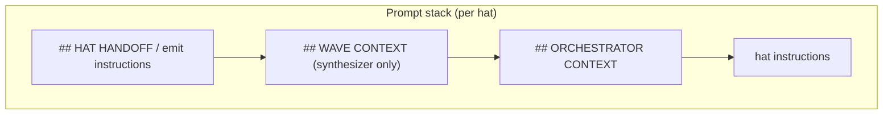
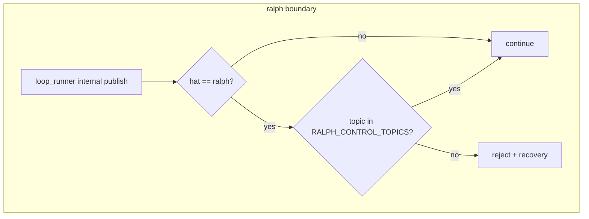

# Ralph serial preset 根因修复

## Overview

在 2026-06-20 协议 SSOT + `preset/engine/` 骨架已经落地的基础上，补齐让 `ce-executor-serial` 端到端跑通的最后几块硬逻辑。本次不重建 engine、不改 wave supervisor 协议，只修四个根因包：

1. handoff 宏观边契约（自环排除、runtime 用 index 视图、engine gate 补全）。
2. `ralph` 伪 hat 边界与反馈（loop_runner 内部 publish 拦截、stall detector 免疫 ralph fallback、steward/reviewer/fixer 触发器）。
3. lint / runtime 一致性（结构化 reason_code、LintResumeHint 按 kind 路由、路径规范化、drift_finding 升级）。
4. state_projection 应用收尾（steward 改读 `## ORCHESTRATOR CONTEXT`、preset_lint 顺序）。

---

## Problem Frame

2026-06-20 的 plan 方向正确（SSOT YAML + 通用 engine + lint/runtime 同视图），但执行结果只到了“骨架”和“接线”层：

- `presets/schemas/ce-executor-serial.yml` 已经把 `handoff_topic_seeds` 扩到 18 条，但 `crates/ralph-core/src/preset/engine/protocol.rs` 的 `is_macro_edge` 没有真正实现自环排除，只检查了 `from_hat` 是否为空字符串。
- `crates/ralph-core/src/preset/engine/gates.rs` 的 `run_gates` 只做了 `missing_fields`，topic ownership、upstream state、handoff artifact 等 gate 未落地。
- `crates/ralph-core/src/event_loop/mod.rs` 在 runtime 构建 `ProtocolView` 时仍用 `from_event_loop`（无 `HandoffIndex`），与 CLI emit 的 `from_event_loop_with_index` 视图不一致。
- `## HAT HANDOFF` 注入块实际位于 `## WAVE CONTEXT` 下方，与 plan 要求相反。
- CLI emit 已拦截 `ralph` 业务 topic，但 `loop_runner` 内部 publish 路径仍可能绕过。
- `progress-steward` 的 instructions 仍在指导 agent 直读 `tasks.jsonl` / `progress.md`，没有切换到 `## ORCHESTRATOR CONTEXT`。

这导致 serial preset 在 `[1] coordinator → work.ready` 反复阻断：宏观边误判 → handoff artifact 逻辑混乱 → executor 未激活 → 后续链路全部未触发。

---

## Requirements Trace

- **R1 / R2 / R3**（handoff 宏观边契约）：engine / lint / runtime 三层对同一 topic 的宏观边判断一致；自环排除正确；runtime gate 使用带 `HandoffIndex` 的 `ProtocolView`。
- **R4**（prompt 顺序）：`build_emit_instructions` 生成的 emit 指令块出现在 prompt 最顶部，高于 `## WAVE CONTEXT`。
- **R5**（路径规范化）：`auto_handoff_prepare` 与 `LintPaths::under_handoff_dir` 处理 workspace root 冷启动和路径规范化。
- **R6 / R9**（ralph 边界）：`ralph` hat 不能发业务 topic；CLI、event origin guard、loop_runner 内部 publish 三层语义一致。
- **R7 / R8**（反馈与 stall）：`dimension-reviewer`、`fixer`、`progress-steward` 订阅 `task.resume`；stall detector 不把 ralph fallback 算作有效进展。
- **R10 / R11 / R13**（lint/runtime 一致性）：engine gate 拒绝输出结构化 reason_code；`LintResumeHint` 按 `RejectionKind` 路由；同一 hat+reason_code 多次拒收升级为 `drift_finding`。
- **R14 / R15 / R16 / R17**（state_projection 收尾）：preset_lint 先检查 state_projection；`## ORCHESTRATOR CONTEXT` 读 projector 缓存；steward instructions 改读注入块；`actions_chain` 顺序正确。
- **SC1 / SC2 / SC3 / SC4**（成功标准）：`ce-executor-serial` 能跑到 `LOOP_COMPLETE`；recovery 中 `hat_handoff_*` 收敛；`ralph diagnose` 给出结构化根因；linter/engine/runtime 三者不矛盾。

---

## Scope Boundaries

- 本次覆盖 `ce-executor-serial` 的 handoff 契约、ralph 边界、lint/runtime 一致性、state_projection 应用收尾。
- 本次覆盖的文件见各 Implementation Unit 的 **Files** 列表。

### Deferred for later

- wave worker 共享状态抽象错误 / supervisor 协议 6 件套（§9 / 21.8）。
- `ce-executor-isolated` 与 `ce-executor-wave` 的移除或重构。
- `ralph-tools*.md` 完整文档同步（P2 级别，主修复验证后批量补）。
- `loop.cancel` 与 `loop.terminate` 语义统一、loops.json stale 清理。

### Outside this product's identity

- 把 Ralph 改造成通用 workflow DSL 或可视化编排器。
- 重写整个 EventBus / StateMachine。
- 为 isolated/wave preset 设计新的 handoff 协议。

### Deferred to Follow-Up Work

- BDD 端到端 scenario 补充（若当前 harness 仍无法覆盖，单独建 task 跟踪）。
- `ralph audit hat-handoff` 集成到 `ralph diagnose` UI。

---

## Context & Research

### Relevant Code and Patterns

- `crates/ralph-core/src/preset/engine/protocol.rs` — `ProtocolView`、`is_macro_edge`、`macro_edges_resolved`。
- `crates/ralph-core/src/preset/engine/gates.rs` — `run_gates`、`RejectionKind`、`GateContext`。
- `crates/ralph-core/src/preset/engine/linter.rs` — `lint_emit`、`auto_handoff_prepare`。
- `crates/ralph-core/src/preset/engine/hint.rs` — `LintResumeHint`、`LintFailureClass`。
- `crates/ralph-core/src/event_loop/mod.rs` — `build_prompt`、`prepend_wave_context`、`prepend_orchestrator_context`、runtime gate 调用点。
- `crates/ralph-core/src/workflow_contract/handoff_index.rs` — `HandoffIndex::from_config`、`consumer_of`。
- `crates/ralph-core/src/config/workflow_contract.rs` — `HANDOFF_TOPIC_SEEDS` 常量、`WorkflowContractConfig`。
- `crates/ralph-core/src/hat_handoff/macro_edges.rs` — runtime 宏观边判定。
- `crates/ralph-core/src/hat_handoff/payload.rs` — `LintPaths::under_handoff_dir`、路径处理。
- `crates/ralph-cli/src/commands/emit.rs` — CLI emit、linter 调用、`ProtocolView` 构造。
- `crates/ralph-cli/src/loop_runner/runner.rs` — loop_runner 内部 publish 路径。
- `presets/schemas/ce-executor-serial.yml` — 协议 SSOT（已含 18 条 `handoff_topic_seeds` 与 `actions_chain`）。
- `presets/en/ce-executor-serial.yml` — preset instructions、triggers、progress-steward 配置。

### Institutional Learnings

- `docs/report/2026-06-21-ralph-main-repo-mechanism-orchestration-bug-audit.md` — 21 项症状根因分析。
- `docs/plans/2026-06-20-001-feat-serial-preset-precheck-as-linter-plan.md` — 2026-06-20 已落地的 SSOT + engine 骨架；本次 plan 是其收尾。
- `docs/achieved/plan/2026-06-17-003-feat-hat-orchestrator-state-projection-phase1-plan.md` — state_projection Phase 1；ORCHESTRATOR CONTEXT 注入已实现，但 steward instructions 未切换。
- `docs/solutions/developer-experience/ralph-cli-loop-runner-tests-must-run-serial.md` — `ralph-cli` 测试必须串行，禁止裸跑 `cargo test -p ralph-cli`。

### External References

- 无额外外部研究；本次为 Rust workspace 内部机制修复，本地模式充分。

---

## Key Technical Decisions

1. **保留 2026-06-20 的 SSOT + engine 骨架，只补硬逻辑。** 不复建 engine、不迁协议位置。`presets/schemas/ce-executor-serial.yml` 的 18 条 `handoff_topic_seeds` 与 `actions_chain` 已经是 SSOT，本次让 runtime 真正按它行动。
2. **`is_macro_edge` 自环排除必须比较 `from_hat` 与唯一 consumer。** 只检查空字符串是上次 plan 的执行漏洞；本次改为：若 `from_hat == consumer_of(topic)`，则该边是自环，不是宏观边。
3. **runtime gate 统一使用 `ProtocolView::from_event_loop_with_index`。** 与 CLI emit 同视图，消除 lint/runtime 对 macro edge 的解析差异。
4. **`## HAT HANDOFF` / emit 指令块置顶。** 即使对 `review-synthesizer`，wave 上下文块也只在它自己 hat 上非空；置顶不会破坏解析，且确保 coordinator/executor 等关键 hat 第一眼看到 handoff 指令。置顶后需验证 prompt 块顺序：对 serial preset 的每个 hat 生成完整 prompt，断言 `## HAT HANDOFF` 出现在 `## WAVE CONTEXT` 之前且 `## ORCHESTRATOR CONTEXT` 的相对位置不变（见 U1 Test scenarios）。
5. **ralph 边界三层一致。** CLI emit、event origin guard、loop_runner 内部 publish 使用同一份 `RALPH_CONTROL_TOPICS` 常量判断；业务 topic 一律 reject 并写 recovery。三层引用点通过编译期或测试期检查确保集合一致（见 U2 Approach）。
6. **state_projection 收尾以 instructions 切换为主。** `prepend_orchestrator_context` 已经实现；本次把 `progress-steward` 的 instructions 从四文件决策树改为读 `## ORCHESTRATOR CONTEXT`，投影 disabled 时保留最小 fallback。
7. **LintResumeHint 按 `RejectionKind` 路由，不再按 message 子串匹配。** `hint.rs` 已有映射；确保 `gates.rs` 输出的 `RejectionKind` 足够细，覆盖本次新增的 rejection 场景。

---

## Open Questions

### Resolved During Planning

- **`HANDOFF_TOPIC_SEEDS` 扩常量还是从 `HandoffIndex` 派生？**  
  **已决**：常量保持 4 条作为非 serial preset 的 default fallback；serial preset 的 `handoff_topic_seeds` 已经在 `presets/schemas/ce-executor-serial.yml` 中声明为 18 条，运行时通过 `WorkflowContractConfig::effective_seeds()` 读取。本次不修常量，只修“读取后如何正确使用”——即 `is_macro_edge` 自环排除和 runtime index 视图。

- **`build_emit_instructions` 置顶是否影响 `review-synthesizer`？**  
  **已决**：不影响。`prepend_wave_context` 对非 synthesizer hat 是 no-op；对 synthesizer，handoff 导航块在 wave 块之上也不会破坏解析。

- **`progress-steward` 改读 `## ORCHESTRATOR CONTEXT` 后原四文件决策树保留哪些？**  
  **已决**：主路径改为读 `## ORCHESTRATOR CONTEXT`；原四文件决策树仅作为 projection disabled 时的 fallback 保留。fallback 策略：先尝试 `progress.md`；若检测到多 step 并行或 merge queue 非空标记，则降级到完整四文件决策树（`tasks.jsonl` / `progress.md` / `memories.md` / `loops.json`），不再作为默认推荐。

### Deferred to Implementation

- `drift_finding` 的 exact TTL 与窗口实现细节（如 5 分钟滑动窗口用 VecDeque 还是 ring buffer）。
- `run_gates` 中 topic ownership 的具体判定是否完全复用 `event_policy` 的 `hat_publishes` 映射，还是引入新的 `execution_contracts.rules` 字段。
- `LintPaths::under_handoff_dir` canonicalize 后是否同时处理 symlink 边界。

---

## High-Level Technical Design

> *This illustrates the intended approach and is directional guidance for review, not implementation specification. The implementing agent should treat it as context, not code to reproduce.*



```mermaid
flowchart TB
    subgraph "Macro edge decision"
        A[event topic] --> B{execution_mode == isolated?}
        B -->|no| C[not macro edge]
        B -->|yes| D{topic in macro_edges_resolved?}
        D -->|no| C
        D -->|yes| E{from_hat == consumer_of(topic)?}
        E -->|yes| C[self-loop excluded]
        E -->|no| F[macro edge]
    end
```



---

## Implementation Units

- [ ] U1. **修复 handoff 宏观边契约**

**Goal:** 让 runtime / lint / engine 三层对「谁是宏观边、是否需要 handoff artifact」有同一答案；自环排除正确；runtime gate 使用带 `HandoffIndex` 的视图。

**Requirements:** R1, R2, R3, R5

**Dependencies:** `HandoffIndex::consumer_of` 已可用，`ProtocolView::from_event_loop_with_index` 已在 `ralph-core` 中定义，`RejectionKind` 已支持 `HandoffArtifact` 等场景。若上述 API 未在 `ralph-core` 中暴露，需先下沉或 re-export，再启动 U1。

**Files:**
- 修改：`crates/ralph-core/src/preset/engine/protocol.rs`
- 修改：`crates/ralph-core/src/preset/engine/gates.rs`
- 修改：`crates/ralph-core/src/event_loop/mod.rs`
- 修改：`crates/ralph-core/src/hat_handoff/macro_edges.rs`
- 测试：`crates/ralph-core/src/preset/engine/protocol.rs`（inline tests）、`crates/ralph-core/src/preset/engine/gates.rs`（inline tests）、`crates/ralph-core/src/event_loop/tests/serial_lint.rs`

**Approach:**
- 在 `ProtocolView::is_macro_edge` 中实现真正的自环排除：先查 `macro_edges_resolved`，若 `from_hat` 为 `Some(h)`，则通过 `HandoffIndex::consumer_of(topic)` 比较 `h == consumer`；相等则返回 `false`。
- `resolve_macro_edges` 已包含 `hat_handoff.macro_topics` 与 `HandoffIndex` 唯一消费者；保持不动。
- 在 `event_loop/mod.rs` 的 runtime gate 调用点，把 `ProtocolView::from_event_loop` 改为 `ProtocolView::from_event_loop_with_index(&self.config.event_loop, Some(&handoff_index))`。
- 在 `gates.rs` 的 `run_gates` 中补充：topic ownership、upstream state（progress.md / step 对齐）、handoff artifact（若 topic 是 macro edge 则检查 `handoff_path` 与 artifact 存在性）。每个 rejection 必须带 `RejectionKind`。
- 同步 `hat_handoff::macro_edges::requires_handoff` 的自环排除语义，确保 runtime dispatcher 与 engine 一致。

**Patterns to follow:**
- `ProtocolView::from_event_loop_with_index` 已在 `crates/ralph-cli/src/commands/emit.rs:1036` 使用。
- `HandoffIndex::consumer_of` 已提供唯一消费者查询。

**Test scenarios:**
- **Happy path:** CLI lint 与 runtime gate 对 `review.dimension.ready` 是否为 macro edge 结论一致。
- **Edge case:** coordinator 自环 `queue.advance` 不被误判为 macro edge。
- **Edge case:** `work.ready`（coordinator → executor，非自环）被判定为 macro edge，触发 auto_prepare。
- **Error path:** macro edge 事件缺少 `handoff_path` 时，`run_gates` 返回 `Reject { kind: HandoffArtifact, message: ... }`。
- **Integration:** runtime gate 使用带 index 的视图后，CLI lint 与 runtime 对同一事件给出相同 `RejectionKind`。
- **Regression:** 对 serial preset 的每个 hat 生成完整 prompt，断言 `## HAT HANDOFF` 出现在 `## WAVE CONTEXT` 之前且 `## ORCHESTRATOR CONTEXT` 的相对位置不变（`## WAVE CONTEXT` 在 `## HAT HANDOFF` 之后、`## ORCHESTRATOR CONTEXT` 在 hat instructions 之前）。

**Verification:**
- `cargo nextest run -p ralph-core -- preset::engine` 或对应测试名前缀绿。
- `cargo nextest run -p ralph-core --test scenarios` 无回归。

---

- [ ] U2. **修复 ralph 边界与反馈**

**Goal:** 堵住 `ralph` 伪 hat 越权发业务事件；让 `task.resume` 能唤醒 reviewer/fixer/steward；stall detector 不被 ralph fallback 欺骗。

**Requirements:** R6, R7, R8, R9

**Dependencies:** U1

**Files:**
- 修改：`crates/ralph-cli/src/loop_runner/runner.rs`
- 修改：`crates/ralph-core/src/event_loop/mod.rs`
- 修改：`presets/en/ce-executor-serial.yml`
- 测试：`crates/ralph-cli/src/loop_runner/tests.rs`（必须串行）、`crates/ralph-core/tests/scenarios.rs`

**Approach:**
- 在 `loop_runner/runner.rs` 的内部 publish 路径增加与 CLI emit 同义的 ralph 边界检查：拦截点必须在任何副作用（metrics 记录、event bus 分发、文件写入）之前执行。若 `hat == "ralph"` 且 topic 不在 `RALPH_CONTROL_TOPICS` 中，直接 reject 并写 recovery（reason_code: `ralph_business_topic_rejected`），不写 `events.jsonl`，不触发任何下游 handler。
- 在 `event_loop/mod.rs` 的 stall detector 中，把 ralph fallback 业务事件从“有效进展”计数中排除。具体：记录事件 origin，若事件 `hat == "ralph"` 且 topic 非 control，则不计入 `had_business_activity`。
- 更新 `presets/en/ce-executor-serial.yml`：
  - `dimension-reviewer` 的 `triggers` 增加 `task.resume`。
  - `fixer` 的 `triggers` 增加 `task.resume`。
  - `progress-steward` 的 `triggers` 增加 `task.resume` 与 `human.guidance`。

**Patterns to follow:**
- CLI emit 的 ralph 拦截逻辑在 `crates/ralph-cli/src/commands/emit.rs` 已有；复用同一份 control topic 集合。
- `RALPH_CONTROL_TOPICS` 定义在 `crates/ralph-core/src/event_origin.rs`。
- 三层同步检查：在 `event_origin.rs` 中增加 `#[test] fn ralph_control_topics_cross_reference()`，通过 `include_str!` 或宏比较 `emit.rs`、`runner.rs` 与 `event_origin.rs` 三处引用的 `RALPH_CONTROL_TOPICS` 集合字节级一致；新增 control topic 时任何一处的遗漏都会导致测试失败。

**Test scenarios:**
- **Happy path:** `ralph` hat 发 `loop.cancel`（control topic）成功写入 events.jsonl。
- **Error path:** `ralph` hat 发 `work.ready` 被 reject，events.jsonl 不增加，recovery.jsonl 出现 `ralph_business_topic_rejected`。
- **Integration:** executor 不响应导致 stall，ralph fallback 连发 2 条业务事件后，stall detector 仍触发 `task.resume(target=progress-steward)`。stall 超时测试使用 mock 时钟替换 `std::time::Instant`（或注入 `Clock` trait），避免串行测试环境中的 CPU 竞争导致时间漂移 flake；若无 mock 时钟，测试容差至少 ±500ms。
- **Edge case:** `ralph` hat 发未知 topic 按 business topic 处理（拒绝）。`RALPH_CONTROL_TOPICS` 采用 `ralph.*` 命名空间约定，未来新增 control topic 必须以 `ralph.` 前缀命名，旧版本通过前缀匹配即可识别，无需更新常量集合。

**Verification:**
- `cargo nextest run -p ralph-cli --bin ralph -- ralph_business` 或对应测试名前缀绿。
- `cargo nextest run -p ralph-core -- test_stall_detector_ignores_ralph_fallback` 绿。若该测试在串行环境中 flake，先用 `cargo nextest run -p ralph-core -- test_stall_detector -- --nocapture` 确认超时阈值，再扩展容差或切换 mock 时钟。

---

- [ ] U3. **修复 lint / runtime 一致性**

**Goal:** engine gate 拒绝时输出结构化 reason_code；`LintResumeHint` 按 `RejectionKind` 路由；路径规范化；拒收累计升级为 `drift_finding`。

**Requirements:** R10, R11, R12, R13

**Dependencies:** U1

**Files:**
- 修改：`crates/ralph-core/src/preset/engine/gates.rs`
- 修改：`crates/ralph-core/src/preset/engine/hint.rs`
- 修改：`crates/ralph-core/src/hat_handoff/payload.rs`（或新建 `crates/ralph-core/src/hat_handoff/paths.rs`）
- 修改：`crates/ralph-core/src/event_loop/mod.rs`（drift_finding 升级逻辑）
- 测试：对应 inline tests

**Approach:**
- `gates.rs`：所有 `Reject` 必须带 `RejectionKind`；新增 reason_code 派生（如 `engine_rejected:<kind>`）供 recovery 与 diagnose 使用。
- `hint.rs`：确保 `LintResumeHint::from_typed_rejection` 覆盖 U1 新增的 rejection kind；禁止按 `message` 子串匹配。若已有映射则补全测试。
- `hat_handoff/payload.rs`（或新建 paths 模块）：`LintPaths::under_handoff_dir` 在 `strip_prefix` 前对 workspace root 做 `canonicalize()`；处理 `parent()==Some("")` 时返回明确错误而非静默 fallback 成绝对路径。调用方降级行为：
  - `linter.rs` 的 `auto_handoff_prepare`：`canonicalize` 失败时返回 `Err`，linter 跳过 handoff 路径检查并记录 `warn` 级日志，继续执行其他 lint 规则。
  - `emit.rs` 的 lint 调用：`canonicalize` 失败时，emit 降级为 no-op lint（不阻止 emit），在 recovery 中记录 `handoff_path_canonicalize_failed` 事件。
  - 所有调用方禁止 `unwrap` 或 `expect`，禁止静默 fallback 成绝对路径。
- `event_loop/mod.rs`：维护每个 hat 的最近 rejection 窗口（如 5 分钟），按 `(hat, reason_code)` 累计；≥3 次时生成 `drift_finding`（severity=Warning），让 `ralph diagnose` 呈现根因。

**Patterns to follow:**
- `RejectionKind::reason_code()` 已存在；`LintResumeHint` 分类映射已存在。
- `std::fs::canonicalize` 处理路径规范化。

**Test scenarios:**
- **Happy path:** `missing_field` rejection 的 reason_code 为 `engine_rejected:missing_field`。
- **Happy path:** `LintResumeHint::from_typed_rejection(HandoffArtifact)` 路由到 source_hat，不是 plan-gate。
- **Edge case:** workspace 路径 `./foo` 与 `/abs/foo` canonicalize 后生成相同的相对 handoff 路径。
- **Error path:** `LintPaths::under_handoff_dir` 在 workspace root 为空或不可解析时返回 `Err`，不静默生成绝对路径。
- **Integration:** 同一 hat 连续 3 次 `missing_field` 拒收，diagnose 输出 `drift_finding:missing_field` 而非 3 条无结构 recovery。

**Verification:**
- `cargo nextest run -p ralph-core -- preset::engine::gates` 绿。
- `cargo nextest run -p ralph-core -- lint_paths` 绿。
- `cargo nextest run -p ralph-core -- drift_finding` 绿。

---

- [ ] U4. **state_projection 应用收尾**

**Goal:** 把已落地的投影机制真正接到 steward 决策里；调整 preset_lint 顺序。

**Requirements:** R14, R15, R16, R17

**Dependencies:** 无（可与 U1 并行，但建议在 U1 后验证）

**Files:**
- 修改：`presets/en/ce-executor-serial.yml`
- 修改：`crates/ralph-core/src/preset_lint/mod.rs`
- 修改：`crates/ralph-core/src/preset_lint/state_projection.rs`（若不存在则创建）
- 测试：`crates/ralph-core/src/preset_lint/tests.rs` 或 inline tests、`crates/ralph-core/tests/scenarios.rs`

**Approach:**
- `presets/en/ce-executor-serial.yml`：
  - 在 `progress-steward` 的 instructions 中，删除「读取 `tasks.jsonl` / `progress.md` / 四文件决策树」的段落。
  - 增加：「以 `## ORCHESTRATOR CONTEXT` 中的 `current_step` / `completed_steps` / `open_tasks` 为唯一依据；若该块缺失或 disabled，fallback 策略为：先读 `.ralph/agent/progress.md`；若检测到多 step 并行或 merge queue 非空标记，则降级到完整四文件决策树（`tasks.jsonl` / `progress.md` / `memories.md` / `loops.json`）」。
- `preset_lint/mod.rs`：调整 lint 运行顺序，把 `state_projection` 检查（`actions_chain` 顺序、`enabled` 一致性）放在 `schema_parity` 之前，保证报告行号与发现顺序一致。
- 若 `crates/ralph-core/src/preset_lint/state_projection.rs` 尚未存在，创建它并承担 `actions_chain` 顺序断言与 `work.done` 必须含 `mark_step_completed` 的校验。

**Patterns to follow:**
- `prepend_orchestrator_context` 已提供 projector 缓存读取；steward 以注入块为主，但对关键字段（`open_tasks` 数量、`current_step` 值）与 `.ralph/agent/progress.md` 做最小校验；偏差超过阈值时降级到四文件读取并记录 `diagnose` 事件。
- `presets/schemas/ce-executor-serial.yml` 的 `state_projection.actions_chain` 已是 SSOT。

**Test scenarios:**
- **Happy path:** executor emit `work.done` 后，`## ORCHESTRATOR CONTEXT` 中的 `completed_steps` 包含该 step。
- **Happy path:** 下一条 `queue.advance` 的 `progress_task_gate` 放行。
- **Happy path:** `progress-steward` 的 instructions 文本中不再出现「读取 tasks.jsonl」或「四文件决策树」。
- **Error path:** 若 schemas 中 `work.done` 的 `actions_chain` 顺序不是 `close_task` 先于 `mark_step_completed`，`preset_lint` 报错。
- **Edge case:** projection disabled 时，`## ORCHESTRATOR CONTEXT` 显示 stub 说明，steward fallback 到 `progress.md`；若 `progress.md` 包含 merge queue 非空标记，则降级到四文件决策树。
- **Error path:** steward 读取注入块后，若 `open_tasks` 数量与 `progress.md` 偏差超过阈值（如 ±2），触发 `diagnose` 事件并降级到多文件读取。

**Verification:**
- `cargo nextest run -p ralph-core -- preset_lint` 绿。
- `cargo nextest run -p ralph-core --test scenarios` 无回归。
- `ralph preset check --strict -H builtin:ce-executor-serial` 绿。

---

- [ ] U5. **验证、回归与文档收尾**

**Goal:** 全 workspace 测试无回归；文档与工具说明同步更新。

**Requirements:** SC1, SC2, SC3, SC4

**Dependencies:** U1, U2, U3, U4

**Files:**
- 修改：`docs/handbook/serial-preset-development.md`（如 handoff 注入顺序、ralph 边界、ORCHESTRATOR CONTEXT 读法有变）
- 修改：`crates/ralph-core/data/ralph-tools-presets.md` 或 `ralph-tools-emit.md`（如新增 reason_code 或 `--bypass-lint` 语义变化）
- 测试：`./scripts/run-tests.sh`

**Approach:**
- 跑 `./scripts/run-tests.sh` 全 workspace（ralph-cli 串行，其他并行）。
- 若出现 flake，先跑一次 targeted test 定位，再用 `RALPH_BASELINE_SERIAL=1 ./scripts/run-tests.sh` 兜底。
- 更新 handbook 中关于 serial preset 的「agent 如何读运行态」段落；若涉及 CLI 行为变化，同步更新 `ralph-tools*.md`。
- 手跑一次 `ralph run` 用 `ce-executor-serial` 到一个 trivial plan，确认能到达 `LOOP_COMPLETE` 或至少无 `[1] coordinator → work.ready` 阻断。

**Test scenarios:**
- **Integration:** `./scripts/run-tests.sh` 全绿。
- **Regression:** `cargo nextest run -p ralph-core --test scenarios` 绿。
- **Manual:** 手跑 serial preset 到 LOOP_COMPLETE（或稳定推进过 executor）。
- **Doc:** handbook 中 serial preset 的 prompts / handoff / state 读法与代码一致。

**Verification:**
- `./scripts/run-tests.sh` 退出码 0。
- 手跑记录保存到 `.ralph/` 或按项目习惯记录。
- 文档反向验证通过（`sed -n` 复核源码引用行号）。

---

## System-Wide Impact

- **Interaction graph:**
  - `event_loop/mod.rs` 的 `build_prompt` 调用序变化（handoff 块置顶）。
  - `event_loop/mod.rs` 的 runtime gate 调用点改为带 index 的 `ProtocolView`。
  - `loop_runner/runner.rs` 的 publish 路径新增 ralph 边界检查。
  - `progress-steward` 的 instructions 读源从文件系统改为注入块。
- **Error propagation:**
  - ralph 业务 topic 拒绝统一走 recovery.jsonl + reason_code。
  - engine gate 的 rejection 统一带 `RejectionKind`，不再依赖 message 子串。
- **State lifecycle risks:**
  - `drift_finding` 窗口需要线程安全（event loop 单线程，但需确认）。
  - `LintPaths::under_handoff_dir` canonicalize 失败时不可静默 fallback 成绝对路径。
- **API surface parity:**
  - CLI emit 与 loop_runner 内部 publish 对 ralph 边界的处理必须一致。
- **Integration coverage:**
  - CLI lint 与 runtime gate 对 macro edge 的一致性不能仅靠 unit test，需要 scenario 或手跑验证。
- **Unchanged invariants:**
  - `RALPH_CONTROL_TOPICS` 集合不变。
  - `presets/schemas/ce-executor-serial.yml` 的 SSOT 位置不变。
  - `state_projector` 的写盘逻辑不变（只改读侧 steward）。

---

## Risks & Dependencies

| Risk | Mitigation |
|------|------------|
| `is_macro_edge` 自环排除改后影响 coordinator 自环 topic（如 `queue.advance`）的 dispatch 行为 | 增加 targeted test；跑 BDD scenarios 无回归 |
| `run_gates` 补全后过度拒收（如把正常事件判为 topic ownership 错误） | 先加 characterization test 捕获当前行为；再逐步启用新 gate |
| `loop_runner` publish 拦截 ralph 业务 topic 影响 operator bypass 机制 | 只拦截 `hat=ralph` 的业务 topic；operator 明确用其他 hat 或 `--bypass-lint` |
| `progress-steward` 改读 ORCHESTRATOR CONTEXT 后，projection disabled 时行为退化 | 保留 fallback 到 `progress.md` 的一句话 |
| canonicalize 在 sandbox / tmp 路径上失败 | 边界测试覆盖；失败时返回 Err 不静默 |
| `ralph-cli` 测试串行导致验证时间长 | 按 AGENTS.md 用 nextest；必要时 `RALPH_BASELINE_SERIAL=1` 兜底 |

---

## Documentation / Operational Notes

- 若 CLI emit 的 error message 变化，同步更新 `crates/ralph-core/data/ralph-tools-emit.md`。
- 若 serial preset 的 instructions 中关于 handoff / state 的读法变化，同步更新 `docs/handbook/serial-preset-development.md`。
- `ralph diagnose` 的 drift 输出格式若调整，在 `docs/handbook/diagnosis.md`（如存在）或相关文档中补充说明。

---

## Sources & References

- **Origin document:** [docs/brainstorms/2026-06-21-serial-preset-root-cause-fix-requirements.md](../brainstorms/2026-06-21-serial-preset-root-cause-fix-requirements.md)
- **Previous plan:** [docs/plans/2026-06-20-001-feat-serial-preset-precheck-as-linter-plan.md](2026-06-20-001-feat-serial-preset-precheck-as-linter-plan.md)
- **State projection Phase 1:** [docs/achieved/plan/2026-06-17-003-feat-hat-orchestrator-state-projection-phase1-plan.md](../achieved/plan/2026-06-17-003-feat-hat-orchestrator-state-projection-phase1-plan.md)
- **Audit report:** [docs/report/2026-06-21-ralph-main-repo-mechanism-orchestration-bug-audit.md](../report/2026-06-21-ralph-main-repo-mechanism-orchestration-bug-audit.md)
- **Key code:** `crates/ralph-core/src/preset/engine/protocol.rs`, `crates/ralph-core/src/preset/engine/gates.rs`, `crates/ralph-core/src/event_loop/mod.rs`, `crates/ralph-cli/src/loop_runner/runner.rs`, `presets/en/ce-executor-serial.yml`
