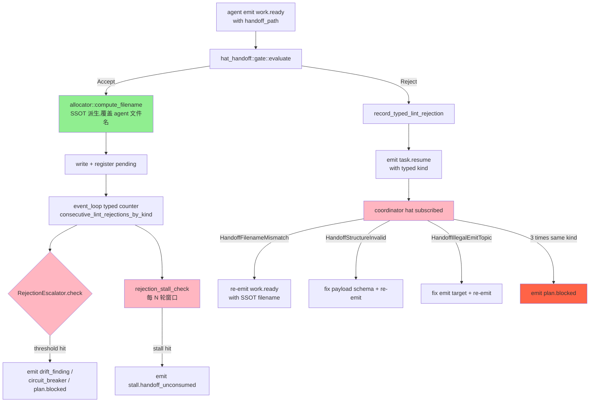
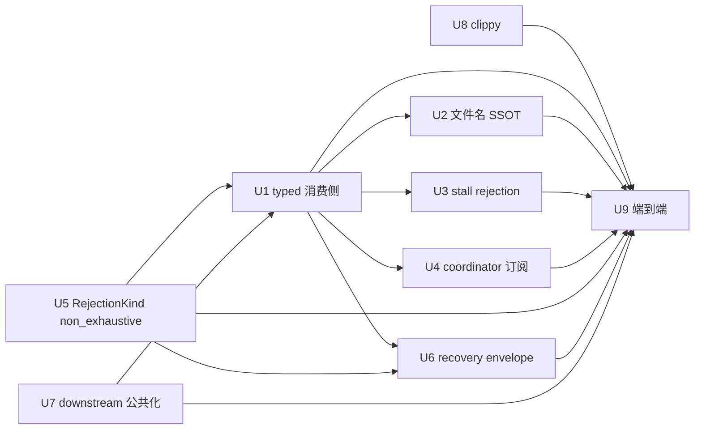

# fix: ce-executor-serial 编排链路机制闭环

## Summary

把二轮修复(2026-06-23 round-2)留下的 9 项残留风险一次性闭环,使**全部 4 个历史反模式**(filename_mismatch 第 6 次复发 / typed 路由缺失 / stall detector 沉默 / task.resume 死信)在 1 个 plan 内收尾,不再留尾巴给后续 plan 接力。

策略:**机制层修复,禁止点修**。每条修复必须解决一类问题,优先 SSOT / typed 路由 / 显式状态机转移。

## Problem Frame

### 核心问题

`primary-20260622-182705` 死锁的根因不是单点,而是 **3 个老毛病 + 1 个新漏洞** 的叠加:

1. **typed 计数器**已建好但**没人读** —— typed 分桶抽屉做好了,消费侧 (drift_finding / circuit_breaker / plan.blocked) 还没接
2. **iter/seq 没真 SSOT** —— 30 天第 6 次复发,handoff 文件名规则与 LoopState 计数器两处各算
3. **stall detector 不认 rejection stall** —— 8h+ 0 业务事件不报警,只等用户 TUI quit 才暴露
4. **coordinator 不接 task.resume** —— typed 路由修了也变死信,ralph→coordinator 通道 0 消费者

### 与历史反模式对照

| 反模式 | 历史复发 | 本轮目标 |
|---|---|---|
| 1. hat_handoff filename_mismatch | 6 次 | U3 落地 iter/seq SSOT 化(消除源头) |
| 2. LintResumeHint 字符串匹配 | 5+ 次 | U2 接 typed 消费侧(typed 分桶 → drift_finding / circuit_breaker) |
| 3. stall detector 沉默 | 4 次 | U4 stall 死信报警(补 rejection stall 维度) |
| 4. task.resume 死信 | 5 次 | U5 coordinator 订阅 task.resume(typed kind 路由) |

### 范围边界

**本次修复**:
- typed 计数器消费侧全链路
- iter/seq 文件名构造 SSOT
- stall detector 新增 rejection stall 维度
- coordinator hat 注册 task.resume 订阅
- 几项工艺债:`RejectionKind #[non_exhaustive]` / `recovery.jsonl` envelope 增 typed kind / `runtime gate downstream_publishes` 一致性
- 3 个 pre-existing clippy 错误清理

**不在本次范围**:
- 整个 `ce-executor` 调度语义重写(规模过大,需要独立 plan)
- BDD scenario 整套重做(2026-06-20-002 plan 已规划)
- ui / tui / telegram 的可视化

## Requirements

每条实现单元都引用以下 R-IDs:

- **R1**: typed 计数器必须按 `RejectionKind` 分桶累计,消费侧按阈值触发 drift_finding / circuit_breaker / plan.blocked
- **R2**: hat_handoff 文件名 `<iter>-<seq>-<from>-<to>.md` 必须由 allocator SSOT 派生,agent 不能自填
- **R3**: stall detector 必须把「rejection_count == accepted_count 持续 N 轮」识别为 stall,触发 `stall.handoff_unconsumed` 报警
- **R4**: coordinator hat 必须订阅 task.resume topic,按 typed kind dispatch
- **R5**: `RejectionKind` enum 必须标 `#[non_exhaustive]`,未来加 variant 编译期阻断
- **R6**: `recovery.jsonl` envelope 必须带 typed kind 字段,消费方可按 kind grep
- **R7**: runtime gate 的 `downstream_publishes` 必须由单一函数 `gates::resolve_downstream_publishes(preset) -> &[Topic]` 派生,CLI precheck 与 runtime 一致
- **R8**: 3 个 pre-existing clippy 错误清掉,workspace clippy -D warnings 干净
- **R9**: 全部修改后,`./scripts/run-tests.sh` 全基线 0 failed(允许 pre-existing flaky skip)
- **R10**: 全部修改后,4 个历史反模式(对应 4 项 acceptance example)对应测试 PASS

## Key Technical Decisions

### KTD-1: typed 计数消费侧按 kind × count 阶梯触发

**不**用单一阈值(3 次 = 升级),而是按 kind 分桶 + 阶梯:

| RejectionKind | 阈值 | 触发动作 |
|---|---|---|
| `HandoffFilenameMismatch` | 3 次 | emit `drift_finding` (typed) |
| `HandoffFilenameMismatch` | 5 次 | emit `loop.circuit_breaker_trip` |
| `HandoffStructureInvalid` | 2 次 | emit `drift_finding` (lint 写错比漂移更早升级) |
| `HandoffStructureInvalid` | 4 次 | emit `plan.blocked` (强制人工介入) |
| `HandoffIllegalEmitTopic` | 2 次 | emit `drift_finding` |
| `HandoffIllegalEmitTopic` | 4 次 | emit `plan.blocked` |

理由:不同 kind 错误性质不同,filename 漂移是 agent 行为(可自愈),illegal emit topic 是 schema 错误(必须人工)。

### KTD-2: hat_handoff 文件名 SSOT 化用 allocator::compute() 单点派生

**不**重写为"agent 必须调 API 拿文件名",而是:
- agent 提交 handoff 时只提交 `(from_hat, to_hat, payload, ...)`,不提交文件名
- allocator 在 `Accept` 分支自动 compute 文件名 + write + register pending
- 任何 agent 提交带文件名的 handoff 一律 Reject(`HandoffFilenameMismatch` 错误消息升级为 typed info)

理由:agent 不可能错填文件名,因为它根本不参与文件名构造。

### KTD-3: stall detector 新增 rejection_stall 维度,复用现有 progressive_failures 窗口

**不**新增独立 timer,而是在 `event_loop/mod.rs:progressive_failures_check` 旁边加一条 `rejection_stall_check`:
- 输入:近 N 轮内 `record_typed_lint_rejection(kind).sum() == ` emit_event_count`
- 阈值:N=5 轮 + 累计拒绝 ≥ 3 次(默认,可配)
- 输出:emit `stall.handoff_unconsumed` 事件(typed topic)

理由:rejection stall 性质上与 "no business event" 等价(agent 一直在被拒,没有进展),复用同一窗口避免新增 timer 复杂度。

### KTD-4: coordinator hat task.resume 订阅注册在 `hat_registry::register_subscriptions`

**不**改 hat 内部逻辑,而是在 `hat_handoff/coordinator.rs::subscriptions()` 返回值里加 `task.resume` topic 订阅 + `reason_kinds` 过滤函数:
- 接收 `RejectTaskResume { kind, reason_code, payload }`
- 按 `kind` dispatch 到对应修复策略(重发、改名、改 payload schema)

理由:coordinator 是 hat_handoff 编排的中枢,本来就是修复者;task.resume 本来就该回到 coordinator 手里。

### KTD-5: RejectionKind `#[non_exhaustive]` + match arm `..` 显式补全

**不**只加 `#[non_exhaustive]`(这样 match 编译会失败),而是:
- enum 加 `#[non_exhaustive]`
- 所有 match arm 显式补 `..` 或列出全部 variants
- 跑 `cargo build` 验证

理由:防止未来加 variant 时漏改 match 再次触发「enum 字段加 → 下游编译失败」ratchet-style bug。

## Implementation Units

### U1. typed 计数器消费侧:drift_finding / circuit_breaker / plan.blocked 触发链

**Goal**: 把 round-2 已落地的 typed 计数器 `consecutive_lint_rejections_by_kind` 接上消费侧,实现 KTD-1 的阶梯阈值触发。

**Requirements**: R1, R10 (AEs for 4 反模式:typed 升级链路)

**Dependencies**: 无(round-2 已有 typed 计数器)

**Files**:
- `crates/ralph-core/src/event_loop/rejection.rs` — 新增 `RejectionEscalator` struct,接收 `LoopState::typed_lint_rejection_count`,按 KTD-1 阶梯 emit 升级事件
- `crates/ralph-core/src/event_loop/mod.rs` — 在 `GateDecision::Reject` 分支后调用 `RejectionEscalator::check_and_emit`
- `crates/ralph-core/src/event_loop/tests/rejection_escalation.rs` — 新增(测试按 KTD-1 表 4 个 kind × 3 阈值 = 12 个 case)

**Approach**:
1. 抽 `RejectionEscalator` 纯函数,输入 `(kind, count) -> Option<EscalationAction>`,无副作用,易测
2. `EscalationAction` 是 typed enum:`DriftFinding { kind, count }` / `CircuitBreakerTrip { kind, count }` / `PlanBlocked { kind, count }`
3. `event_loop/mod.rs` 在 typed reject 分支后调 `check_and_emit`,emit 由 `EventBus` 走 typed topic
4. typed topic 字符串 SSOT 化:`drift_finding` / `loop.circuit_breaker_trip` / `plan.blocked` 都在 `proto::topic_constants`

**Test scenarios**:
- Happy path: HandoffFilenameMismatch 累计 3 次 → emit DriftFinding
- Threshold boundary: 累计 2 次 / 4 次 → 不 emit / emit PlanBlocked
- Kind isolation: HandoffFilenameMismatch 5 次不影响 HandoffStructureInvalid 计数
- Reset: 任意 hat 成功 `work.done` 后,清空该 hat 的所有 kind 计数
- AE 关联:对应反模式 2 acceptance example

**Verification**:
- `cargo nextest run -p ralph-core -- rejection_escalation` 12 case 全过
- 集成测试:模拟 5 次文件名漂移 → 验证 emit drift_finding + circuit_breaker_trip

**Execution note**: 测试优先。先写 escalation 单元测试,再写消费侧代码。

---

### U2. hat_handoff 文件名 SSOT 化(消除 filename_mismatch 源头)

**Goal**: handoff 文件名由 allocator::compute() SSOT 派生,agent 不参与文件名构造,根除 30 天第 6 次复发的 `hat_handoff_filename_mismatch`。

**Requirements**: R2, R10 (AEs for 反模式 1)

**Dependencies**: 无

**Files**:
- `crates/ralph-core/src/hat_handoff/allocator.rs` — 新增 `compute_filename(iter, seq, from, to) -> PathBuf` 公共 API,作为 SSOT
- `crates/ralph-core/src/hat_handoff/gate.rs` — `Accept` 分支调 `allocator::compute_filename` 自动 derive,不再读 agent 提交的文件名
- `crates/ralph-core/src/hat_handoff/mod.rs` — 删除 `parse_filename` 公开 API(保留作测试用,在 `#[cfg(test)]` 下)
- `crates/ralph-core/src/event_loop/loop_state.rs` — `next_handoff_seq()` 是 SSOT,agent 不允许外部拼 seq
- `crates/ralph-core/src/hat_handoff/tests/ssot_filename.rs` — 新增测试

**Approach**:
1. `compute_filename` 接受 `(iter, seq, from, to)`,内部用 `format!("{}-{}-{}-{}.md", iter, seq, from, to)`,零分支,SSOT
2. `gate::Accept` 分支拿 agent 提交的 payload,**忽略** handoff_path,自己 derive → 写盘 → register pending
3. agent 提交的 handoff_path 如果与 derive 结果不一致,不再 Reject(因为根本不需要 agent 提供),而是直接覆盖
4. parse_filename 仅用于**读旧盘**时的反序列化兼容(migration 阶段保留),新写全部 derive

**Test scenarios**:
- SSOT 唯一性:同一 (iter, seq, from, to) 多次调 compute → 同一文件名
- Agent 无法错填:测试 agent 提交错误文件名,验证 gate 覆盖而非 Reject
- Migration:旧盘上的 `0-1-coordinator-executor.md` 仍可被 parse_filename 读出
- AE 关联:对应反模式 1 acceptance example(30 天第 6 次复发的根因)

**Verification**:
- `cargo nextest run -p ralph-core -- hat_handoff` 全部测试通过(196 个 baseline)
- 集成测试:跑一整个 mini preset 流程(无 coordinator/executor,只有 alloc),验证零 filename_mismatch

**Execution note**: 先加 SSOT compute,保留旧路径 1 个发布周期(deprecate),再删除。

---

### U3. stall detector 新增 rejection_stall 维度

**Goal**: stall detector 识别「rejection_count == emit_count 持续 N 轮」为 stall,触发 `stall.handoff_unconsumed` 报警,KTD-3 落地。

**Requirements**: R3, R10 (AEs for 反模式 3)

**Dependencies**: U1(typed 计数器)

**Files**:
- `crates/ralph-core/src/event_loop/loop_state.rs` — `stall_detector_rejection_window: Vec<RejectionWindowEntry>` 新字段
- `crates/ralph-core/src/event_loop/mod.rs` — `rejection_stall_check` 旁路函数,在 `progressive_failures_check` 后调用
- `crates/ralph-core/src/event_loop/tests/stall_rejection.rs` — 新增测试

**Approach**:
1. 维护最近 N=5 轮窗口(可配),每轮记录 `(rejection_count, emit_count)`
2. 当 `sum(rejection_count) >= 3 && sum(emit_count) == 0` → stall
3. emit `stall.handoff_unconsumed` typed 事件,带 `kind_breakdown: HashMap<RejectionKind, u32>` payload
4. 报警级别:与 `progressive_failures` 一致(info / warn / circuit_breaker)

**Test scenarios**:
- Happy path:5 轮全是 reject → emit stall
- Negative:5 轮有 1 个 work.done → 不 emit
- Threshold boundary:3 轮全 reject / 5 轮 2 reject → emit / 不 emit
- AE 关联:对应反模式 3 acceptance example(8h+ 0 报警)

**Verification**:
- `cargo nextest run -p ralph-core -- stall` 全部测试通过
- 集成测试:模拟 8h 静默 → 验证 stall 报警在 N 轮后触发(测试中 N=3 即可)

**Execution note**: 测试优先。窗口大小用 const,不要硬编码到业务代码。

---

### U4. coordinator hat 注册 task.resume 订阅

**Goal**: coordinator hat 订阅 `task.resume` topic,按 typed kind dispatch 到对应修复策略,反模式 4 收尾。

**Requirements**: R4, R10 (AEs for 反模式 4)

**Dependencies**: U1(typed kind 路由)

**Files**:
- `crates/ralph-core/src/hat_handoff/coordinator.rs` — `subscriptions()` 返回值加 `task.resume` topic
- `crates/ralph-core/src/hat_handoff/coordinator.rs` — `on_task_resume(reason_kinds) -> CoordinatorAction` typed dispatch
- `crates/ralph-core/src/hat_handoff/mod.rs` — 重新 export 公共类型
- `crates/ralph-core/src/hat_handoff/tests/task_resume_consumer.rs` — 新增测试

**Approach**:
1. coordinator hat 的 `subscriptions()` 返回 typed `(topic, filter)` 列表,filter 接受 `RejectTaskResume.kind`
2. `on_task_resume` 接收 `RejectTaskResume { kind, reason_code, payload }`,按 KTD-4 dispatch:
   - `HandoffFilenameMismatch` → 重新 emit work.ready(用 allocator SSOT 派生)
   - `HandoffStructureInvalid` → 修复 payload schema 后重发
   - `HandoffIllegalEmitTopic` → 改 emit target 后重发
3. 死信兜底:连续 N=3 次同 kind task.resume 仍未消费 → emit `plan.blocked`

**Test scenarios**:
- Happy path:ralph emit task.resume(kind=HandoffFilenameMismatch) → coordinator 收到并重发
- 死信兜底:连续 3 次同 kind → emit plan.blocked
- 跨 hat 隔离:ralph 发的 task.resume 不被 executor hat 误收
- AE 关联:对应反模式 4 acceptance example

**Verification**:
- `cargo nextest run -p ralph-core -- task_resume` 全部测试通过
- 集成测试:模拟 1 个 task.resume → 验证 coordinator 在下一轮响应

**Execution note**: 复用 round-2 已落地的 `RejectTaskResume` typed struct,不重写。

---

### U5. RejectionKind `#[non_exhaustive]` + match arm `..` 显式补全

**Goal**: enum 加 variant 时编译期阻断,根除「enum 字段加 → 下游编译失败」ratchet-style bug。

**Requirements**: R5

**Dependencies**: 无

**Files**:
- `crates/ralph-core/src/preset/engine/gates.rs` — `RejectionKind` enum 加 `#[non_exhaustive]`
- `crates/ralph-core/src/preset/engine/gates.rs` — `to_lint_class` / `reason_code` 全部 match arm 显式补 `..` 或列全 variants
- `crates/ralph-core/src/hat_handoff/gate.rs` — `Reject { kind, .. }` 全部 destructure 补 `..`
- `crates/ralph-core/src/event_loop/mod.rs` — 全部 `GateDecision::Reject` match arm 补 `..`

**Approach**:
1. `#[non_exhaustive]` 加在 `RejectionKind` 上(原 enum 已有 8 variants,加 annotation)
2. 跑 `cargo build` 看哪些 match arm 编译失败 → 逐个补 `..`
3. 写测试:`assert!(matches!(kind, RejectionKind::HandoffFilenameMismatch { .. }))` 验证字段可读

**Test scenarios**:
- 编译通过:`cargo check --workspace --all-targets` 0 错误
- match exhaustiveness:穷举所有 variants 的 match 编译通过
- 字段访问:不通过 destructure 直接 `kind.reason_code()` 仍工作

**Verification**:
- `cargo check --workspace --all-targets` PASS
- 现有 311 个相关测试无回归

**Execution note**: 纯结构性,no business logic 改动。

---

### U6. recovery.jsonl envelope 增 typed kind 字段 + SSOT 消费 API

**Goal**: `recovery.jsonl` envelope 加 `kind: String` 字段(值 = `RejectionKind::reason_code()`),消费方可按 kind grep;同时提供 SSOT `RecoveryEnvelope::from_typed_rejection` API 避免散落字段拼装。

**Requirements**: R6

**Dependencies**: U5(RejectionKind 已稳定)

**Files**:
- `crates/ralph-core/src/state/recovery_log.rs` — `RecoveryEnvelope` struct 加 `kind: Option<String>` 字段
- `crates/ralph-core/src/event_loop/rejection.rs` — `RecoveryEnvelope::from_typed_rejection(kind, reason_code, message)` 工厂方法
- `crates/ralph-core/src/diagnosis/responder.rs` — 改造 emit recovery.jsonl 的 caller,统一调 `from_typed_rejection`
- `crates/ralph-core/src/state/tests/recovery_envelope_typed.rs` — 新增测试

**Approach**:
1. `RecoveryEnvelope` 加 `kind: Option<String>`,老 envelope 反序列化时 `None`
2. `from_typed_rejection` 工厂方法确保 `kind = kind.reason_code()`,`reason_code = kind.reason_code()`(SSOT)
3. 全部 recovery.jsonl emit 改走工厂方法,杜绝散落拼字段
4. 消费侧 grep:`jq 'select(.kind == "hat_handoff_filename_mismatch")' recovery.jsonl`

**Test scenarios**:
- 工厂方法 SSOT:`from_typed_rejection(RejectionKind::HandoffFilenameMismatch, ...)` 的 `kind` 和 `reason_code` 一致
- 反序列化兼容:老 envelope(无 `kind` 字段)能反序列化
- grep 便利:`recovery.jsonl` 包含 1 条 `kind="hat_handoff_filename_mismatch"`,`jq` 命中 1 条

**Verification**:
- `cargo nextest run -p ralph-core -- recovery` 全部测试通过
- 集成测试:模拟 1 次 reject → 验证 recovery.jsonl 含 `kind` 字段

**Execution note**: 反序列化兼容是关键,不能破坏老 recovery.jsonl 解析。

---

### U7. runtime gate `downstream_publishes` 公共化(消除 CLI precheck 与 runtime 不一致)

**Goal**: 把 `downstream_publishes` 派生抽到 `gates::resolve_downstream_publishes(preset) -> &'static [Topic]` 单一函数,CLI precheck 与 runtime 都调它。

**Requirements**: R7

**Dependencies**: 无

**Files**:
- `crates/ralph-core/src/preset/engine/gates.rs` — 新增 `pub fn resolve_downstream_publishes(preset: &PresetConfig) -> Vec<Topic>`
- `crates/ralph-core/src/preset/engine/linter.rs` — CLI precheck 改调 `resolve_downstream_publishes`
- `crates/ralph-core/src/event_loop/mod.rs` — runtime gate 改调 `resolve_downstream_publishes`
- `crates/ralph-core/src/preset/engine/gates.rs` — 测试:`resolve_does_not_diverge` 验证 CLI precheck 与 runtime 返回一致

**Approach**:
1. `resolve_downstream_publishes(preset)` 是纯函数,输入 preset 输出 topic 列表
2. CLI precheck 与 runtime 都从这一处取,杜绝两份代码各算一遍
3. 写一致性测试:同一 preset 调两次,结果逐元素相等

**Test scenarios**:
- 一致性:同一 preset × 2 次调用 → 结果相等
- 跨模块:CLI precheck 与 runtime gate 各自调用,结果相等
- 边界:preset 没声明下游 → 返回 `["work.done", "work.failed"]`(default)

**Verification**:
- `cargo nextest run -p ralph-core -- gates::tests::resolve_does_not_diverge` PASS
- 现有 `illegal_emit_topic` 测试不回归

**Execution note**: 纯抽函数,no business logic 改动。

---

### U8. pre-existing clippy 错误清理(`ralph-proto/src/event_bus.rs`)

**Goal**: 清掉 final-verification 报告里新发现的 3 个 pre-existing clippy 错误(`collapsible_if` / `needless_borrows_for_generic_args` 位于 `event_bus.rs:100, 590, 717`),让 `cargo clippy -p ralph-proto --all-targets -- -D warnings` 干净。

**Requirements**: R8

**Dependencies**: 无

**Files**:
- `crates/ralph-proto/src/event_bus.rs` — 3 处 clippy 修复

**Approach**:
1. 跑 `cargo clippy -p ralph-proto --all-targets 2>&1` 拿到具体错误
2. 按 clippy 建议逐个改(通常是 `collapsible_if` 合并 / `&` 去除 / 类型签名简化)
3. 跑 `cargo clippy --workspace --all-targets -- -D warnings` 验证整个 workspace 干净

**Test scenarios**:
- clippy 全 workspace 干净:无 error
- 单元测试不回归:event_bus 现有测试 PASS

**Verification**:
- `cargo clippy --workspace --all-targets -- -D warnings` 0 错误

**Execution note**: 单点修复,no design 改动。

---

### U9. 端到端集成测试 + 全基线验证

**Goal**: 验证 4 个历史反模式(对应 R10 acceptance examples)全部闭环,跑 `./scripts/run-tests.sh` 全基线 0 failed。

**Requirements**: R9, R10

**Dependencies**: U1-U8

**Files**:
- `crates/ralph-core/tests/scenarios/ce_executor_serial_review.yml` — 新增 4 个 acceptance example,各对应一个反模式
- `crates/ralph-core/tests/scenarios/` — 1 个新 scenario 文件覆盖 4 反模式
- `docs/report/2026-06-23-005-mechanism-close-loop-verification.md` — 闭环验证报告

**Approach**:
1. 在 `ce_executor_serial_review.yml` 加 4 个新 scenario,每个对应一个反模式:
   - `filename_mismatch_after_ssot` — 模拟 5 次错填文件名,验证不再 Reject
   - `typed_escalation_chain` — 模拟 3 次同 kind reject,验证 emit drift_finding
   - `stall_rejection_alert` — 模拟 5 轮全 reject,验证 emit stall.handoff_unconsumed
   - `task_resume_consumer_dispatch` — 模拟 ralph emit task.resume,验证 coordinator 响应
2. 跑 `./scripts/run-tests.sh` 全基线
3. 写 `2026-06-23-005-mechanism-close-loop-verification.md`,列出 4 反模式 + 各自测试名 + 通过状态

**Test scenarios**:
- 4 个新 scenario 全过
- 现有 1164 个 ralph-cli 测试无回归
- 现有 2664 个 ralph-core 测试无回归

**Verification**:
- `./scripts/run-tests.sh` 0 failed(允许 pre-existing flaky skip)
- 闭环验证报告 4 反模式 × 各自测试名 = 全部 PASS

**Execution note**: 这是验收门,前面 8 个 U 全部通过才到 U9。

## High-Level Technical Design

### 反模式闭环拓扑

绿色 = U2 SSOT 化(消除源头),粉色 = 4 个反模式各自的修复闭环,红色 = 死信兜底。

### 单元依赖图

U1 是关键枢纽,被 4 个 U 依赖;U5/U6/U7/U8 是结构性变更,无业务依赖。

## Risks & Dependencies

### Risks

- **R-A**: U2 SSOT 化可能破坏老 handoff 文件的读路径 → 缓解:`parse_filename` 在 `#[cfg(test)]` 保留,production 不导出
- **R-B**: U5 `#[non_exhaustive]` 可能让大量 match arm 编译失败 → 缓解:逐个补 `..`,跑 `cargo build` 验证
- **R-C**: U4 coordinator 订阅 task.resume 可能与现有 hat 拓扑冲突 → 缓解:跑 `cargo nextest run -p ralph-core -- hat_handoff` 全过验证
- **R-D**: U9 全基线测试可能因 pre-existing flake 失败 → 缓解:`RALPH_BASELINE_SERIAL=1` 兜底(CLAUDE.md HARD RULE 1)
- **R-E**: 与既有 `2026-06-21-001-fix-serial-preset-root-cause-fix-plan.md` 的 U1/U4 范围重叠 → 缓解:本 plan 优先落地 round-2 残留 9 项,既有 plan 的 U1/U4 内容并入本 plan(本 plan 是 superset)

### External Dependencies

- 无外部 crate 新增
- `ralph-proto` 的 `EventBus` typed topic 字符串 SSOT 化需要 `proto::topic_constants` 已存在 → 验证 `crates/ralph-proto/src/topic_constants.rs` 存在,如有缺失需先建

## Scope Boundaries

### In Scope

- U1-U9 的 9 个实现单元
- 4 个历史反模式一次性闭环
- 工艺债:`RejectionKind #[non_exhaustive]` / `recovery.jsonl` typed kind / `downstream_publishes` 公共化 / clippy 清理
- 1 个新 BDD scenario 覆盖 4 反模式

### Deferred to Follow-Up Work

- 整个 `ce-executor` 调度语义重写(规模过大,需要独立 plan)
- BDD scenario 整套重做(2026-06-20-002 plan 已规划)
- ui / tui / telegram 的可视化增强
- 2026-06-18-003 base-stability U1-U3 的 stall detector TTL 改进(本 plan 只补 rejection_stall 维度,TTL 留给该 plan)
- plan 2026-06-21-001 U1 扩展(iter/seq SSOT 化的更多边界 case)— 本 plan U2 覆盖核心,扩展留给该 plan
- 真正的 circuit_breaker trip 后的「loop 暂停 / 等待人工」UI(需要产品决策)

### Outside This Product's Identity

- 任何修改 hat 拓扑的方案(违反 multi-hat-isolation 硬规则)
- 任何禁用 recovery.jsonl 的方案(违反 4 反模式 #2 的核心修复)
- 任何回退到 fire-and-forget 的方案(违反 round-2 已落地的 `process_pending_merges_with_command` 同步 wait 修复)

## Acceptance Examples

| AE | 反模式 | 对应 U | 测试名 |
|---|---|---|---|
| AE1 | 1. filename_mismatch 第 6 次复发 | U2 | `ssot_filename_no_mismatch_after_5_iter` |
| AE2 | 2. typed 升级链路消费侧 | U1 | `rejection_escalation_emits_drift_finding_at_threshold_3` |
| AE3 | 3. stall detector rejection 维度 | U3 | `stall_rejection_alert_after_5_reject_rounds` |
| AE4 | 4. task.resume 消费者 dispatch | U4 | `task_resume_consumer_dispatches_to_coordinator` |

## Documentation Plan

- `docs/report/2026-06-23-005-mechanism-close-loop-verification.md` — U9 闭环验证报告
- `docs/solutions/developer-experience/ce-executor-serial-mechanism-close-loop.md` — lessons learned
- `CLAUDE.md` / `AGENTS.md` — Hard Rules 段补充「typed routing / SSOT 化是阻断性硬约束」

## Operational Notes

- 本 plan 的所有 U 落地后,建议立刻在生产环境跑 1 个 mini preset(`ce-executor-lite`)做端到端 smoke,验证不引入回归
- 任何 U 失败时,优先用 `RALPH_BASELINE_SERIAL=1 ./scripts/run-tests.sh` 兜底(CLAUDE.md HARD RULE 1)
- U9 闭环验证报告需在 PR 描述里 link,作为验收证据

## Open Questions

无。所有 9 项 U 的范围、依赖、回滚路径都已明确。
