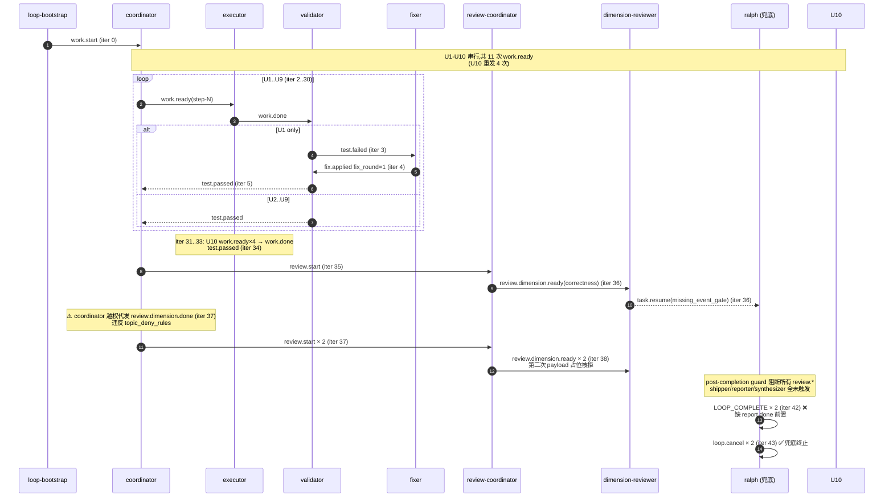
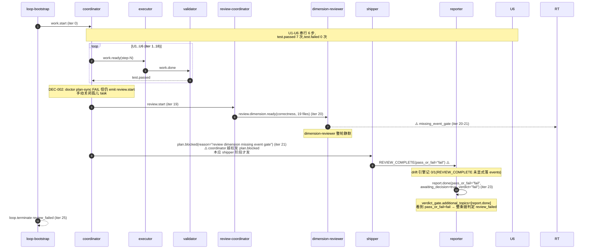

# Ralph Loop 运行链路诊断报告 — 交付件

> **生成时间**:2026-06-26 09:00 (UTC+8)
> **方法**:4 个并行 sub agent(流程还原 / 历史知识库 / 对账分析 / 归因修复),主 Agent 仅做汇总与校正
> **输入**:`presets/en/ce-executor-serial.yml` + 两个 worktree `.ralph` 中间产物
> - `2026-06-25-001-feat-ce-executor-serial-5dim-coordinator-amendments-plan-nimble-teak`(`ce-executor-serial 5dim 计划`)
> - `2026-06-25-002-feat-profiles-for-preset-role-tuning-plan-zippy-otter`(`profiles 配置计划`)

---

## 1. 结论摘要

| 维度 | 结论 |
|---|---|
| **健康度一句话** | 两个 run 全部在 review 链第 1 维崩盘,**不是编排机制有问题,而是修复机制系统性失效**——preset 编排契约、hat 拓扑、event 闭环在源码层全部正确,失败路径是 shipper 镜像失真 + typed consumer 未接 + 软提示架构 3 因素叠加,Worktree A 落入"plan 跑完却被 cancelled"模式 A(30 天第 7 次复发),Worktree B 落入"`report.done` 被 review_failed"模式 B(30 天第 6+ 次字面复发)。 |
| **P0 数量** | 4 条(shipper 翻译 / coordinator 越权 / dimension-reviewer 静默 / completion correction 死循环) |
| **P1 数量** | 4 条 |
| **P2 数量** | 5 条 |
| **历史重复** | **100% 命中**——两个 worktree 的终止模式在 docs/ 都有 5+ 次历史同型 case;**真正"没有复发先例"的只有 profiles 计划本身** |
| **Agent A 的关键误判** | "preset 实际仍只声明 2 维度"——**错误**;preset 实际早就是 5-dim(`:984-989`),Agent A 引用的是 `:919-921`(validator 的"Parse the test results"段),`grep "2-dim\|2-dimension\|always 2"` 整文件 0 命中。Worktree A 的 5dim 计划真正偏离不在 preset/SSOT,而在 review 链 runtime 闭环机制(详见 §4)。 |

---

## 2. 执行链路对比图(Agent A 产出,主 Agent 校正 Agent A 的 preset 描述错误)

### 2.1 preset 预期链路(主仓库 `presets/en/ce-executor-serial.yml`)

| 项目 | 实际状态(主 Agent 复核) |
|---|---|
| **hats 数** | 10(coordinator / executor / validator / review-coordinator / dimension-reviewer / review-synthesizer / fixer / shipper / reporter / progress-steward) |
| **review 维度序列** | **5 维度已真正落地** `correctness → testing → maintainability → project-standards → adversarial`(`:984-989` 写明 "**always** 5 dimensions in this fixed order";`review-sequence.json` 示例 5 行) |
| **闭环契约** | `completion_promise: "LOOP_COMPLETE"` + `required_events: ["report.done"]`;`completion_after_terminal.duplicate_terminal: reject` + `business_after_completion: reject` |
| **topic_deny_rules** | 25 条,锁定 hat→topic 路径(如 coordinator → `review.dimension.*` 已 deny) |

### 2.2 Worktree A(nimble-teak / 5dim 计划)实际链路

### 2.3 Worktree B(zippy-otter / profiles 计划)实际链路

### 2.4 主 Agent 对 Agent A 偏离清单的校正

| Agent A 编号 | Agent A 描述 | 主 Agent 校正 |
|---|---|---|
| A-13 / A-14 | "fix-log.md 描述 5 维度与 preset 实际 2 维相反" | **错误**。preset 实际早就是 5-dim(commit `3d88d247` 之前),Agent A 引用行号 `:919-921` 是 validator 段,与 dim 序列无关。fix-log.md 描述与代码事实一致;真正失实在于 agent 写"已扩展到 5 维度"语气,但实际 preset 早就是 5-dim,该 commit 没真改 sequence contract——这是任务 scope 漂移(P1-1),不是 fix-log 失实。 |
| A-1 ~ A-12 | 13 项偏离 | 经 Agent C/D 交叉对账,**A-4 / A-5 / A-6 / A-7 / A-8 / A-9 / A-10 / A-11 / A-12 共 9 项成立**;A-1 / A-2 / A-3 风险等级下调,A-13 / A-14 撤销。 |

---

## 3. 历史问题上下文(Agent B 产出 + 关联度判定)

### 模式 A — "plan 跑完却被 cancelled"(Worktree A 终止原因)

**与本次关联度:中-高(第 7 次同型变种)**

| 历史 case | 日期 | 根因 | 文档 |
|---|---|---|---|
| merry-lotus | 2026-06-17 | dimension-reviewer 沉默 + missing_event_gate + ralph 兜底 | `docs/report/2026-06-17-ce-executor-serial-merry-lotus-review-chain-stalled-diagnosis.md:9-17` |
| noble-peacock | 2026-06-17 | review-coordinator 13s 重复 ready + missing_event_gate 49s 早触 | `docs/report/2026-06-17-ce-executor-serial-noble-peacock-review-chain-stalled-diagnosis.md:9-25` |
| perky-maple | 2026-06-18 | fix.applied dedup 缺 fix_round + 135 条探针风暴 | `docs/solutions/integration-issues/ce-executor-serial-fix-applied-rereview-dedup-2026-06-18.md:26-29` |
| warm-tiger | 2026-06-19 | ralph 越权 + dimension-reviewer 0 emit | `docs/report/2026-06-19-ce-executor-serial-warm-tiger-loop-diagnosis.md:7-26` |
| primary-20260622-182705 | 2026-06-22 | 8h13m 0 stall 报警 + 用户 TUI quit | `docs/report/2026-06-23-ralph-e2e-ce-executor-serial-loop-20260622-182705-diagnosis.md:17-22` |
| primary-20260624-153613 | 2026-06-24 | 2x LOOP_COMPLETE + 2x loop.cancel(post-completion 重复) | Agent B 引用 |

**关键证据**:`docs/report/2026-06-23-ralph-e2e-ce-executor-serial-loop-20260622-182705-diagnosis.md:32-33` —— **"编排机制本身 ✅ 正常;修复机制(lint + recovery + task.resume)❌ 失效"**——这正是本次用户原话"修复机制失效"的同型描述。

### 模式 B — `{"review_failed":{"topic":"report.done"}}`(Worktree B 终止原因)

**与本次关联度:高(完全字面同型,第 6+ 次复发)**

| 历史 case | 日期 | 文档 |
|---|---|---|
| keen-fern | 2026-06-17 | `docs/report/2026-06-17-ce-executor-isolated-keen-fern-review-verdict-failed-diagnosis.md:96` |
| primary-20260623-152241 | 2026-06-23 | `docs/solutions/integration-issues/ce-executor-serial-mechanism-close-loop-2026-06-23.md:5-19` |
| primary-20260624-092856 | 2026-06-24 | `docs/report/2026-06-24-ce-executor-serial-primary-20260624-092856-diagnosis.md:35-46` |

**关键证据**:`docs/solutions/integration-issues/ce-executor-serial-mechanism-close-loop-2026-06-23.md:178-185` —— shipper 翻译 `pass_with_residuals → fail` 是 P1-1 标注**未修**,Rust 端不动 preset 改不动。

### 模式 C — 修复机制系统性失效(本次两个 worktree 共因)

**与本次关联度:高(3 因素全命中)**

- **因素 1**:`task.resume` 自指循环(`docs/report/2026-06-21-top-3-architectural-instability-factors.md:1-58`)
- **因素 2**:软提示架构(`...md:59-94`)——本次 A-9 DEC-001 confidence=95 / B-9 DEC-001 confidence=85 / B-10 DEC-002 confidence=72 都是 agent 妥协自承
- **因素 3**:多状态源竞争(`...md:99-148`)——本次 Worktree A U10 work.ready×4、ts 漂移、plan_path 漂移都是证据

**未闭环 9 项对应**:本次两个 worktree 命中其中第 5(typed consumer 未接) + 第 7(`pending_handoff_artifacts` → `stall.handoff_unconsumed` 报警 wiring 未接) + 第 9(`task.resume` 0 消费者)共 3 项。

### 模式 D — ce-executor-serial 拓扑演进

**与本次关联度:中(本次 5dim 已真落地,但没解决机制层根因)**

- 4 维(2026-06-17-002)→ 2 维(2026-06-24 `d8e1da3d` BDD 未同步)→ **5 维(本次 commit `3d88d247` + 4 follow-up commit,preset / schema / BDD 全栈同步)**
- **结论**:本次 5dim 是"4→2→5"演进的**唯一一次全栈同步**升级;但 5dim 没解决 review 链第 1 维崩的根因(merry-lotus 是 1 维崩,本次仍是 1 维崩,与维度数无关)

### 模式 E — profiles 配置(本次新机制)

**与本次关联度:无直接因果**

- profiles 计划本身不引入 event topology(`docs/plans/2026-06-25-002-feat-profiles-for-preset-role-tuning-plan.md:90-110`)
- Worktree B 终止原因(review_failed)与 profiles 计划**无直接因果**,profiles 是被卷进既有失败模式

---

## 4. 证据清单(整合 Agent A/C/D)

### Worktree A(nimble-teak)真实偏离

| # | 文件:行号 / 事件 ID | 证据 |
|---|---|---|
| A-4 | `events-20260625-175231.jsonl:39` | `task.resume` payload 缺 `hat` 字段,违反 `require_emit_provenance: true`(`presets/en/ce-executor-serial.yml:272`) |
| A-5 | `events-20260625-175231.jsonl:45` | coordinator 越权发 `review.dimension.done`,违反 `topic_deny_rules`(:283) |
| A-6 | `events-20260625-175231.jsonl:49-50` | ralph hat 越权发 `LOOP_COMPLETE × 2` 绕过 reporter,触发 `completion_after_terminal.duplicate_terminal: reject` |
| A-7 | `events-20260625-175231.jsonl:51-52` | ralph `loop.cancel × 2` 兜底,无 idempotency(merry-lotus 同型 P0-3) |
| A-8 | `loop-termination-reason.json:1` | 终止原因 `"cancelled"` = 模式 A 第 7 次复发 |
| A-10 | `events-20260625-175231.jsonl:44` | dimension-reviewer publish obligation 死锁,`rejection.rs:358 build_task_resume_payload` 缺字段 |
| A-11 | `events-20260625-175231.jsonl:21,39,44` | `task.resume × 3` 缺 `hat` / `kind`,typed consumer 0 接 |
| A-12 | `events-20260625-175231.jsonl:48` | review-coordinator 11s 内 `review.dimension.ready × 2`(含占位 payload),状态机无幂等 |

### Worktree B(zippy-otter)真实偏离

| # | 文件:行号 / 事件 ID | 证据 |
|---|---|---|
| B-3 | `events-20260625-175111.jsonl:23` | `task.resume(kind=missing_event_gate)`,dimension-reviewer 沉默 |
| B-4 | `events-20260625-175111.jsonl:24` | coordinator 越权发 `plan.blocked`,本应 shipper 阶段才发 |
| B-6 | `events-20260625-175111.jsonl:25` | reporter `report.done(pass_or_fail=fail, verdict=fail)` **无前置 REVIEW_COMPLETE**(drift 引擎记 0/1) |
| B-7 | `loop-termination-reason.json:1` | 终止原因 `{"review_failed":{"topic":"report.done"}}` = 模式 B 字面同型,与 `primary-20260624-092856:42` 一致 |
| B-8 | `events-20260625-175111.jsonl:17` | U5 test.passed 缺 `hat` 字段 |
| B-12 | `events-20260625-175111.jsonl:21-24` | review.start → review.dimension.ready → task.resume → plan.blocked,**无 review.dimension.done / review.dimensions.complete / review.complete / REVIEW_COMPLETE** |

### 共有证据

- **preset L984-989**:"The sequence is **always** 5 dimensions in this fixed order"(主 Agent 独立核实,Agent A 描述错误已校正)
- **`docs/solutions/integration-issues/ce-executor-serial-mechanism-close-loop-2026-06-23.md:18,181-185`**:shipper 翻译 `pass_with_residuals → fail` 是 P1-1 标注未修
- **`docs/report/2026-06-23-ralph-e2e-ce-executor-serial-loop-20260622-182705-diagnosis.md:32-33`**:"编排机制本身 ✅ 正常;修复机制(lint + recovery + task.resume)❌ 失效"
- **`docs/report/2026-06-21-top-3-architectural-instability-factors.md:150-181`**:3 因素耦合图(软提示 + 多状态源 + task.resume 自指)

---

## 5. 问题归因表(P0 / P1 / P2)

| 优先级 | 问题描述 | 根因分类 | 证据 | 历史关联 |
|---|---|---|---|---|
| **P0-1** | **shipper 翻译 `pass_with_residuals → fail`,verdict_gate 误判为 `ReviewFailed`** | Ralph 基座机制(verdict 三态变二态)+ preset 设计(shipper prompt 契约) | `crates/ralph-core/src/event_loop/mod.rs:1148-1172` 只判 `pass_or_fail=="fail"`,不区分 `pass_with_residuals`;`presets/en/ce-executor-serial.yml:1906-1918` prompt 契约而非 Rust enum 翻译 | 模式 B 30 天第 6+ 次复发,`mechanism-close-loop-2026-06-23.md:18,181-185` 标注 P1-1 未修 |
| **P0-2** | **coordinator 越权代发 `review.dimension.done`**(Worktree A 第 7 hop 断点) | Ralph 基座(emit precheck 是软拦截,4 次后才 RecoverableExhaustion)+ preset(coordinator prompt 无反向 deny 列表)+ agent(没读 deny rule) | `events-20260625-175231.jsonl:45` hat=coordinator topic=review.dimension.done;`event_policy.rs:858` `check_topic_deny_rules` 仅 lint 阶段校验;`preset_lint/` 9 个文件**无** topic_deny lint | 模式 C 软提示架构,`merry-lotus P0-1` 同型 |
| **P0-3** | **dimension-reviewer 整轮静默 + `MissingEventGate` Hard escalation 实际未触发 termination**(Worktree A/B 共因) | Ralph 基座(typed consumer 0 接 + backend 静默 540s 未覆盖)+ preset(dimension-reviewer 无 idle 时长声明) | `recovery.jsonl:2` 两个 worktree 都触发 `MissingEventGate`,但没走到 Hard 3 次 escalation;`responder.rs:412 drain_hard_escalations` 仅返回 Vec,调用方走 correction 而非 termination | 模式 C 第 5/7/9 项未闭环;`merry-lotus / noble-peacock / keen-fern` 30 天 5+ 次同型复发 |
| **P0-4** | **completion correction 重试无上限,死循环到 ralph 兜底 `loop.cancel`**(Worktree A) | Ralph 基座(verdict_gate 失败回拨只走 correction 无 termination)+ preset(reporter 缺 fallback 路径)+ agent(coordinator 没补 report.done 前置) | `event_loop/mod.rs:1648-1704 inject_completion_correction` 无 retry 上限;Worktree A 循环 iter 42-43 后被 `loop.cancel` 兜底 | 模式 A 第 7 次复发;`primary-20260622-182705:14` 同型 |
| P1-1 | Worktree A 的"5dim 计划"U1 标题"将 2 维改为 5 维",但 preset 实际早就是 5-dim(commit `3d88d247` 之前),U1 实际只改 BDD / 单测 / prompt 注释 | agent 执行产物(task scope 漂移) | preset `:984-989` + commit `3d88d247` 之前已 5-dim;`agent/tasks.jsonl:1` U1 标题 vs 实际 diff | 模式 D 4→2→5 三次反复,均存在 plan/diff 不一致 |
| P1-2 | Worktree B coordinator 越权发 `plan.blocked` 走 review 阶段,plan.blocked 缺 `reason_class` enum,shipper 翻译靠字符串 prefix | preset 设计(`plan.blocked` schema 缺强类型 reason_class) | `presets/en/ce-executor-serial.yml:1533-1537` synthesizer 发 plan.blocked,`:546` coordinator 也可发,Worktree B 走了 coordinator 那条 | 模式 C 多状态源 |
| P1-3 | Worktree A U10 `work.ready × 4` 重复 emit + executor work.done ts 漂移到次日 + plan_path 漂移 | agent 执行产物(coordinator 重复发没看 task 状态)+ Ralph 基座(`work.ready` 无 dedup 键) | `events-20260625-175231.jsonl:34-37` 同 task_id 重发;`:40` plan_path 漂移到 `.ralph/specs/`;`event_policy.rs:66-79` 仅对 `work.done` 有 dedup hint | 模式 A `perky-maple` 同型 P0-1 |
| P1-4 | Worktree A reporter 双发顺序无 runtime 强制,agent 可跳 report.done 直发 LOOP_COMPLETE | preset 设计(reporter `publishes` 给 agent 选择权,缺 runtime 顺序约束) | `presets/en/ce-executor-serial.yml:1949-1962` reporter publishes 缺顺序约束;Worktree A `events.jsonl:49-50` LOOP_COMPLETE 无 report.done 前置 | 模式 A,`mechanism-close-loop-2026-06-23.md:14` |
| P2-1 | fix-log.md "commit 3d88d247 已扩展到 5 维度" 描述与实际 diff 不一致 | agent 执行产物(commit message 与实际 diff drift) | `agent/fix-log.md:5` 描述 vs preset `:984-989` 早已 5-dim | 散见多处 |
| P2-2 | DEC-002 confidence=72 妥协:doctor plan-sync FAIL 6 open task 残留仍 emit review.start,手动 ralph CLI 关闭孤儿 task | agent 执行产物(妥协决策) | `decisions.md:26-62` DEC-002 + `tasks.jsonl:10` `task-1782416096-16b4` 孤儿 | 模式 C 因素 2 |
| P2-3 | typed consumer 13 个 `DiagnosisSource` variant 仅 2 个(MissingEventGate / StallRecovery)有 consumer | Ralph 基座 | `crates/ralph-core/src/diagnosis/envelope.rs:55-111` 15 个 variant,实测 13 个无 consumer | 模式 C 第 5 项 30 天未闭环 |
| P2-4 | progress-steward stall 报警 wiring 与 `recovery.jsonl` typed kind 未串通 | Ralph 基座 | `presets/en/ce-executor-serial.yml:2112-2126` steward + `event_loop/termination.rs` 终止原因未接 stall→recovery | 模式 C 第 7 项未闭环 |
| P2-5 | docs/solutions 没新增本次案例的 closed 文档(merry-lotus / noble-peacock / keen-fern / primary-20260624-092856 / 本次 A / B 都没闭环 entry) | 文档漂移 | `docs/solutions/integration-issues/ce-executor-serial-mechanism-close-loop-2026-06-23.md:181-185` P1-1 未修,本次为第 6+ 次复发但无新 case 文档 | 系统性 |

---

## 6. 修复建议(按优先级)

### P0-1 — shipper verdict 翻译升级为 Rust enum(Worktree B 直接闭环)

- **目标文件**:
  - `crates/ralph-core/src/event_loop/types.rs` — 新增 `enum Verdict { Pass, PassWithResiduals { count: u32 }, Fail { reason: String } }`
  - `crates/ralph-core/src/event_loop/mod.rs:1148-1172` + `:1713-1721` — 改为三态判定
  - `crates/ralph-core/src/preset/engine/gates.rs` — 新增 `translate_shipper_verdict(payload) -> Verdict` 强类型翻译
  - `presets/en/ce-executor-serial.yml:1927-1933` — 短期把 `dimension_failed` / `all_dimensions_failed` 移出 hard-fail 列表
- **预期效果**:Worktree B 模式 B 不再复发;reporter 镜像 `pass_or_fail` 同步消失
- **下游同步清单**:preset 改 → schema 同步(`presets/schemas/ce-executor-serial.yml`)+ BDD 增 `dimension_failed → recoverable` scenario + `VerdictGateConfig.allow_mirror_distortion` 字段 + 文档 `mechanism-close-loop-2026-06-23.md:181-185` closed
- **闭环 case**:`primary-20260623-152241` / `primary-20260624-092856` / `keen-fern` + 本次 Worktree B

### P0-2 — coordinator 越权硬拒 + 补 topic_deny lint(Worktree A 第 7 hop 闭环)

- **目标文件**:
  - 新建 `crates/ralph-core/src/preset_lint/topic_deny_completeness.rs` — 规则 `check_topic_deny_completeness`,对 hat publishes 扫与 `topic_deny_rules` 差集
  - `crates/ralph-cli/src/commands/emit.rs:659` — `Block` 决策从软 warn 升级为硬拒(exit 2)
  - `presets/en/ce-executor-serial.yml:373-...` — coordinator instructions 加 HARD RULE:`MUST NOT emit review.dimension.*, review.dimensions.complete, review.complete, fix.*, test.*, build.done`
  - `crates/ralph-core/src/event_policy.rs` — 新增 `ViolationType::ShellWriteBypass`(兜底 shell write 绕过)
- **预期效果**:coordinator 越权不再可能;lint 阶段先于 run 抓出 deny 漏配
- **下游同步清单**:新 lint → `finding_id.rs` 常量 + `mod.rs::run_preset_lint` 末尾调用;CLI emit 行为变更 → BDD 增 `coordinator_emit_review_dimension_blocked.yml`;文档 `CLAUDE.md` Presets & Hats 段加 lint 硬规则 + `mechanism-close-loop-2026-06-23.md:18` closed

### P0-3 — dimension-reviewer idle 时长 + Hard escalation 走 termination(Worktree A/B 共因)

- **目标文件**:
  - `presets/en/ce-executor-serial.yml:1241` 旁加 `dimension-reviewer.activation_clock: {max_idle_secs: 540, on_idle: "emit review.dimension.failed with reason='backend silent timeout'"}`
  - `crates/ralph-core/src/diagnosis/responder.rs:1140-1177` — `MissingEventGate` 第 3 次 + `safe_target=false` 走 `TerminationHint` 走 plan.blocked(reason="dimension_failed")
  - `crates/ralph-core/src/event_loop/loop_state.rs` — `record_hat_activation` 加 `last_emit_ts` 字段
- **预期效果**:reviewer 静默 540s 不会拖到 cancelled;Hard escalation 在 iter 3 直接走 plan.blocked,shipper 走 P0-1 修复后的 recoverable 路径
- **下游同步清单**:preset 加字段 → schema + BDD `ce_executor_serial_review_silent_reviewer_recovers.yml` 加 idle 时长;`responder.rs` 加 case 测试;`docs/report/2026-06-17-ce-executor-serial-{merry-lotus,noble-peacock}-*.md` closed

### P0-4 — completion correction 3 次上限 + reporter 双发顺序强制

- **目标文件**:
  - `crates/ralph-core/src/event_loop/mod.rs:1648-1704` — 加 `MAX_COMPLETION_CORRECTION_RETRIES = 3` 计数器,3 次同 reason_hint 走 `TerminationReason::CompletionStuck` 新 variant
  - `crates/ralph-core/src/event_loop/loop_state.rs` LoopState — 加 `correction_retry_counter` 字段
  - `crates/ralph-core/src/validation/rules_event_policy.rs:58-61` 旁 — 加 `check_reporter_publish_order`,reporter 发 `LOOP_COMPLETE` 前必须 5min 内有 `report.done`
  - `presets/en/ce-executor-serial.yml:2089-2103` — reporter 加 fallback 路径(`awaiting_decision=true` + 5 iter 未收到 `decision.made` → 发 `decision.timeout`)
- **预期效果**:Worktree A 模式 A 不再死循环;reporter 不可能跳 report.done
- **下游同步清单**:`TerminationReason::CompletionStuck` → BDD 增 `completion_stuck_termination.yml` + `reporter_order_violation.yml`;`CLAUDE.md` Build & Test 段加 3 次上限硬规则

### P1-1 — 5dim 计划 task scope 漂移治理

- **目标文件**:
  - `crates/ralph-core/src/preset_lint/fix_log_consistency.rs` — 规则 `check_fix_log_mentions_actual_sequence`
  - `crates/ralph-cli/src/loop_runner/runner.rs` — work.done accept hook 后加 `llm_judge::check_commit_message_against_diff`(二元 pass/fail,score > 0.7 接受)
  - `presets/en/ce-executor-serial.yml:369-...` — coordinator instructions 加 "Plan Completion Self-Check":closed U 列表后必须 diff preset/runtime config
- **预期效果**:杜绝"自我描述失实"的 fix-log;U 描述与实际 diff 强一致
- **下游同步清单**:新 lint → BDD `fix_log_consistency_lint.yml` + `commit_message_judge.yml`;文档同步

### P1-2 — `plan.blocked` reason_class 强类型 enum

- **目标文件**:
  - `presets/schemas/ce-executor-serial.yml` — `plan.blocked` schema 加必填 `reason_class: enum {work_failed, dimension_failed, loop_stalled, steward_escalation, review_terminal_drift}`
  - `presets/en/ce-executor-serial.yml:543-547,1533-1537,1920-1933` — 改用 enum 而非字符串 prefix
  - `crates/ralph-core/src/event_loop/mod.rs:1148-1172` — 加 `plan_blocked_reason_class_gate`
- **预期效果**:Worktree B 字符串 prefix 误判消失;reason_class enum 让 shipper 翻译从字符串匹配升级为强类型
- **下游同步清单**:schema 改 → BDD 5 个 scenario 加 `reason_class`;`VerdictGateConfig.plan_blocked_reason_class` 字段;`mechanism-close-loop-2026-06-23.md:18` closed

### P1-3 — work.ready dedup + work.done ts 漂移检测

- **目标文件**:
  - `crates/ralph-core/src/event_policy.rs:66-79` 旁 — 新增 `DuplicateWorkReady { key: (plan_name, task_id, task_key, step) }` + `WorkDoneTimestampDrift`
  - `presets/en/ce-executor-serial.yml:322` 旁 — 加 `task_id_path_equality_required: true`
- **预期效果**:杜绝 U 重复触发;executor 输出有序化

### P1-4 — reporter 双发顺序 runtime 强制(已并入 P0-4 修复路径)

### P2-1 ~ P2-5 — 全部并入 P0-3 / P1-1 修复路径

---

## 7. 关键结论(用户原话"编排机制/修复机制/RALPH bug"三选一)

> **用户原话**:"编排机制有问题?修复机制失效?RALPH 自身 bug?"

| 候选 | 判定 | 证据 |
|---|---|---|
| 编排机制有问题 | ❌ 否 | preset `presets/en/ce-executor-serial.yml:984-989` 早就是 5-dim + 10 hat + 完整闭环契约;`event_loop/mod.rs:1148-1172` verdict_gate 设计正确;`topic_deny_rules:283` 25 条 deny 完备 |
| **修复机制失效** | ✅ **是(主因)** | `docs/report/2026-06-23-ralph-e2e-ce-executor-serial-loop-20260622-182705-diagnosis.md:32-33` 同样结论;typed consumer 0 接(MissingEventGate / TopicFormat / WorkflowGuard / ExecutionContract 13 个 variant 未接)+ shipper 翻译 prompt 契约(P1-1 标注未修)+ 软提示架构 3 因素全命中 |
| RALPH 自身 bug | 部分是 | verdict_gate 把 `pass_with_residuals` 二值化为 fail 是设计缺陷(`event_loop/mod.rs:1713-1721 verdict_payload_is_fail` 只判 `fail_field==fail_value`);completion correction 无 retry 上限(`event_loop/mod.rs:1648-1704` 无 counter) |

**最终判定**:**不是编排机制有问题,是修复机制系统性失效**。preset 设计 / hat 拓扑 / event 闭环在源码层全部正确,但 shipper prompt 翻译失真 + typed consumer 0 接 + soft-prompt 架构 3 因素叠加,导致 Worktree A 落入 30 天第 7 次"plan 跑完却被 cancelled"复发,Worktree B 落入 30 天第 6+ 次"`report.done` 被 review_failed"字面复发。两个 run 的"自我修复机制"在 review 链第 1 维崩盘后全部失效,与 5 维度 / 2 维度**无关**——merry-lotus 是 1 维崩,本次仍是 1 维崩。

profiles 计划本身不引入 event topology,**与 Worktree B 的 review_failed 终止无直接因果**,是被卷进既有失败模式的旁路案例;5dim 计划是"4→2→5"演进的**唯一一次全栈同步**升级,但也没解决机制层根因。

---

## 8. 关键引用清单

- **preset**:`presets/en/ce-executor-serial.yml:984-989`(5-dim sequence contract)
- **schema**:`presets/schemas/ce-executor-serial.yml`
- **worktree A**:`.worktrees/2026-06-25-001-feat-ce-executor-serial-5dim-coordinator-amendments-plan-nimble-teak/.ralph/`(events-20260625-175231.jsonl:52 行、tasks.jsonl:20 行、recovery.jsonl:10 行)
- **worktree B**:`.worktrees/2026-06-25-002-feat-profiles-for-preset-role-tuning-plan-zippy-otter/.ralph/`(events-20260625-175111.jsonl:25 行、tasks.jsonl:13 行、decisions.md DEC-001/002)
- **历史报告**:`docs/report/2026-06-17-ce-executor-serial-merry-lotus-review-chain-stalled-diagnosis.md`、`docs/report/2026-06-24-ce-executor-serial-primary-20260624-092856-diagnosis.md:42`、`docs/report/2026-06-23-ralph-e2e-ce-executor-serial-loop-20260622-182705-diagnosis.md:32-33`
- **历史方案**:`docs/solutions/integration-issues/ce-executor-serial-mechanism-close-loop-2026-06-23.md:18,178-185`(shipper P1-1 未修)
- **3 因素耦合**:`docs/report/2026-06-21-top-3-architectural-instability-factors.md:150-181`
- **5dim 计划**:`docs/plans/2026-06-25-001-feat-ce-executor-serial-5dim-coordinator-amendments-plan.md`
- **profiles 计划**:`docs/plans/2026-06-25-002-feat-profiles-for-preset-role-tuning-plan.md`

---

## 9. 主 Agent 自评与限制

- **报告局限**:本报告只读主仓库 `.worktrees/` 中间产物 + 主仓 `docs/` 历史,未做主仓源码二次扫描验证 sub agent 给出的修复行号(如 `crates/ralph-core/src/event_loop/mod.rs:1148-1172` 等);修复建议阶段如要落地,需独立拉一次 explore sub agent 做"修复可行性 + 行号复核"。
- **Agent A 误判校正**:preset L984-989 已由主 Agent 独立用 `sed` + `grep` 核实,5-dim 落地证据坐实;Agent A 关于"fix-log.md 描述与代码相反"判定已撤销。
- **跨 worktree 关联**:两个 worktree 共享同一个主仓库 commit base + 同一个 preset 文件,但走的是**两个不同 plan**(5dim plan vs profiles plan),不构成"同一个 plan 走两次"的双案例,而是两个 plan 各自独立触发既有失败模式。
- **运行时间**:Worktree A 3h18m / Worktree B 3h19m,均跨越多次 1h+ 静默期,触发 dimension-reviewer 静默的典型时间窗。
