# Ralph Loop 链路诊断报告 — `ce-executor-serial` `primary-20260628-115810`

> **Run**: `/Users/pittcat/Dev/Rust/ralph-e2e/.ralph/` loop `primary-20260628-115810`(38 次迭代,2026-06-28 11:58 → 21:33 TUI 退出)
> **Preset**: `presets/en/ce-executor-serial.yml`(10 hat,fix-unit 链路)
> **Plan**: `2026-06-20-001-feat-python-sort-algorithms`(step-01..step-04,fix-01..fix-04 + U5 test_integration.py)
> **诊断执行**: Agent A (流程还原) + Agent B (历史上下文) + Agent C (对账分析) + Agent D (归因与修复) 并行
> **诊断时间**: 2026-06-28
> **作者**: Ralph Loop 链路诊断专家(4-sub-agent 并行)

---

## 0. 运行模型澄清(影响本次诊断的根前提)

> **本节先于结论摘要——它决定了如何理解后面所有"机制震荡"现象的本质。**

### 0.1 无人工介入通道(HARD CONSTRAINT)

Ralph Loop 在本次 run 的运行模型是**纯自动化、无人介入**:

- **不存在任何外部接入通道**:没有 Telegram / Slack / Webhook / Email / 任何人工 IM 通知
- **`human.guidance` 不是"求救信号"**:它**不是用来叫人来的**——因为根本就没有"人"会来。它本质是系统内部一个**带 `message` 字段的系统级 topic**,被 ralph hat / coordinator 用来打日志或自我标注"我走不下去了"
- **流程卡死的唯一退出方式**:`max_iterations` 到达 → TUI 超时退出(exit 30,本次 21:33)

这意味着本次诊断里所有形如"coordinator 越权发 human.guidance"、"ralph hat 兜底发 human.guidance"、"human.guidance 闭环缺失"的现象,**本质上都不是"求救失败",而是"系统给自己留的出口事件没被消费,堆在 events.jsonl 里"**——它不会真的叫人,所以它的失败/成功不影响 run 健康度。

### 0.2 由此重新定性本次诊断的优先级

- **不要把 `human.guidance` 相关现象当成 P0**:它不是关键路径。`human.guidance` 发不出去、被吞、字段为空,**都不会让流程跑不通**。真正让流程跑不通的是别的机制。
- **`ralph hat` 与 `coordinator` 的"借道"机制也不是 P0**:因为借道的目标也只是发 `human.guidance`,没人接收,借道成功也不解决问题。真正该修的是"在没有人工介入的前提下,系统如何自己从死循环里出来"。
- **`stall_recovery` 升级到 `plan.blocked` / `RECOVERY-FINAL-WARNING` 才应该是真终止路径**:而不是反复 escalate 等一个永远不会来的"人"。

### 0.3 本次诊断的真正关注点

在**无人工介入**的前提下,本次 run 的核心问题是:

> **Ralph Loop 的自动化自救机制,在 fix-unit 链路里既不能"自己把流程推完",也不能"自己承认失败并停掉"**——它只会"反复尝试 + 反复震荡",直到 TUI 超时被杀。

具体表现:

1. **`execution_contract` / `FlowStepScope` 等"硬拒"机制在拒绝之后,没有干净的"我拒了,你换条路"路径**——被拒就死,不会自动改 payload 重试
2. **`stall_recovery` / `drift_monitor` 是开环的"提醒"机制,不是闭环的"修复"机制**——提醒发了 12+ 次,既不真的修,也不真的停
3. **`progress-steward` / `ralph hat` 这些"兜底角色"在无人接盘的前提下没有任何实际推进能力**——它们只会发 `human.guidance` / `task.resume`,前者无消费者,后者只在被 task 自己 triggers 列表接受时才有效
4. **`plan.blocked` / `LOOP_COMPLETE` 这条"承认失败/完工"的终态事件在本机制下从未被自动触发**——这是真正的 bug

### 0.4 对历史报告/方案的回溯校正

本系统之前若干 plan/report 把 `human.guidance` 当作"人工介入通道"来设计(例如 `plan-blocked-recovery-via-human-signoff` 这个 memory、`merry-lotus` U3 的 `human.guidance → task.resume` 转化),这些**对本运行模型都是失效设计**——因为人工信号永远不会来。本次诊断后续不再把它们列为"已闭环"的成果,因为它们的"闭环"是空的。

### 0.5 修复建议的优先级重排

| 优先级 | 修复 | 是否仍 P0 |
|---|---|---|
| P0-1 | FlowStepScope 放行 review.dimensions.complete | ✅ 仍 P0 |
| P0-2 | drift field_completeness min_samples | ✅ 仍 P0 |
| P0-3 | drift 自观测排除 | ✅ 仍 P0 |
| **原 P0-4** | **ralph/coordinator 借道机制(目标发 human.guidance)** | ❌ **降级**:不再 P0。改为 P1-4:让 `stall_recovery` 在 N 次 escalate 后**自动 emit `plan.blocked(reason=...)` 或 `LOOP_COMPLETE` 直接退出**,无需借道 human.guidance |
| P1-1 | 30s handoff deadline + 升级到 plan.blocked 终止 | ✅ 升级为 P0-5 |
| P1-2 | execution_contract task_id fallback | ✅ 升级为 P0-6 |
| P1-3 | StepCloseObligation 真实驱动 | ✅ 升级为 P0-7 |
| P2-1/P2-2 | projector 接管 plan frontmatter / progress.md | ✅ 不变 P2 |
| **新增 P0-8** | **修复机制必须有"自我终止"路径**:`stall_recovery` 升级 N 次后,不再 escalate,而是 emit `plan.blocked(reason=stall_recovery_exhausted)`;`drift_monitor` 累计 critical > 阈值后,emit `LOOP_COMPLETE(reason=drift_exhausted, success=false)` | ✅ 新增 P0 |
| **新增 P0-9** | **`ralph hat` / `coordinator` 在无法推进时,必须有"推进系统自身"的兜底动作**,不是发 `human.guidance`(无人接)。例如:允许 ralph hat 在 isolated 模式下 emit `plan.blocked` 或 `LOOP_COMPLETE` 作为真终止信号 | ✅ 新增 P0 |

**重排后的优先级行动顺序**:

1. **P0-1**(FlowStepScope 放行 review.dimensions.complete)→ 解锁 fix-plan 链路
2. **P0-2**(drift field_completeness min_samples)→ 消除误报风暴
3. **P0-3**(drift 自观测排除)→ 消除 outcome 震荡
4. **P0-5**(stall_recovery 升级到 plan.blocked 真终止)→ 让系统能自己停
5. **P0-6**(execution_contract task_id fallback)→ 收敛误拒
6. **P0-7**(StepCloseObligation 真实驱动)→ 让 partial silence 被拦截
7. **P0-8**(修复机制自我终止路径,新增)→ 通用兜底,所有"开环提醒"都加终态
8. **P0-9**(ralph/coordinator 在无人接时也能 emit 终态,新增)→ 让 fix-unit 链路能自己承认失败
9. P2-1/P2-2(plan frontmatter + progress.md 由 projector 接管)

---

## 1. 结论摘要

- **健康度**: 本次 run **结构性失败**(mechanism 全面失效),**未触发 LOOP_COMPLETE**。
- **关键异常**: **8 个 P0 + 2 个 P1**(诊断见 §5 归因表)。
- **历史重复**: **10/10 现象全部命中历史未闭环清单**,其中 6 类根因是 30 天内 ≥ 6 次复发的顽固模式;`task.resume` 自指循环、drift 自观测震荡、stage_pipeline 误拒、stall_recovery 死信这 4 类本次与历史完全同型。
- **核心结论**: **Ralph Loop 基座机制占主导(50%)** + **preset 设计缺陷(25%)** + **多因素叠加(15%)** + **agent 执行问题(10%)**。修复 commit `40765b6f`(8 个 P0 unit)已落地但**未覆盖 4 个根因**(drift 计算口径、drift 自观测、FlowStepScope 真正根因、stall_recovery 没有真终止路径)。

---

## 2. 执行链路对比图

### 2.1 预期链路(ce-executor-serial + plan)

```mermaid
flowchart LR
    A([loop.start]) --> B[coordinator:<br/>work.start]
    B --> C[coordinator:<br/>work.ready step-01]
    C --> D[executor:<br/>work.done step-01]
    D --> E[validator:<br/>test.passed]
    E --> F{all steps<br/>done?}
    F -- no --> C
    F -- yes --> G[coordinator:<br/>review.start]
    G --> H[review-coordinator:<br/>review.dimension.ready x6]
    H --> I[dimension-reviewer:<br/>review.dimension.done x6]
    I --> J[review-coordinator:<br/>review.dimensions.complete]
    J --> K[review-synthesizer:<br/>review.complete + fix-plan.md]
    K --> L[coordinator:<br/>work.ready fix-01..04]
    L --> M[executor:<br/>work.done fix-NN]
    M --> N[validator:<br/>test.passed]
    N --> O{all fixes<br/>done?}
    O -- yes --> P[coordinator:<br/>plan.complete]
    P --> Q[shipper:<br/>REVIEW_COMPLETE]
    Q --> R[reporter:<br/>report.done]
    R --> S([LOOP_COMPLETE])
```



### 2.2 实际链路(含偏离标注)

```mermaid
flowchart LR
    A([loop.start]) --> B[11:58]
    B --> C1[iter 1-4:<br/>step-01 + step-02 ✅]
    C1 --> D1[iter 5: ❌ execution_contract<br/>work.done task_id=&#34;&#34;]
    D1 --> D2[iter 6: ⚠️ handoff timeout<br/>executor→validator 30s]
    D2 --> E1[iter 7-23:<br/>test.passed x6 ✅]
    E1 --> E2[iter 23: step-03 done ✅<br/>6 维 review 启动]
    E2 --> F1[iter 24: ❌ FlowStepScope<br/>review.dimensions.complete<br/>flow_unknown_emit]
    F1 --> F2[iter 25: ⚠️ handoff timeout<br/>review-synthesizer 30s]
    F2 --> G1[iter 26-27: ⚠️ review.complete<br/>重复 2 次同 payload]
    G1 --> G2[iter 27: coordinator<br/>work.ready fix-01..04]
    G2 --> H1[iter 28-37: fix-01..04<br/>work.done+test.passed ✅<br/>但 fix-05 U5 未派发]
    H1 --> H2[iter 38: ⚠️ recovery_outcome<br/>反复震荡 Pending↔Recovered]
    H2 --> I1[13:29:20 ❌ coordinator<br/>isolated_scope_violation<br/>human.guidance]
    I1 --> I2[ralph hat<br/>human.guidance 兜底<br/>语义错配]
    I2 --> I3([21:33 TUI 退出<br/>未到 LOOP_COMPLETE])
```



### 2.3 执行链路对比表

| Step | 预期事件 | 实际事件 | 状态 | 备注 |
|------|----------|----------|------|------|
| step-01 | work.ready → work.done → test.passed | iter 1-3 ✅ | ✅ | 27 测试通过 |
| step-02 | work.ready → work.done → test.passed | iter 4-5 ⚠️ | ⚠️ | iter 5 `task_id=""` 被 execution_contract 拒,后 retry 通过 |
| step-03 | work.ready → work.done → test.passed | iter 6-22 ✅ | ✅ | 含 6 维 review(goal-alignment/correctness/testing/maintainability/project-standards/adversarial)|
| 6 维 review | review.start → 6×review.dimension.ready → 6×review.dimension.done → review.dimensions.complete | iter 23-24 ❌ | ❌ | iter 24 `review.dimensions.complete` 被 FlowStepScope 拒 (flow_unknown_emit) |
| review-synthesizer | review.dimensions.complete → review.complete + fix-plan.md | iter 25-26 ⚠️ | ⚠️ | 30s 未激活 → escalation;`review.complete` 重复 2 次 |
| fix-01 ~ fix-04 | work.ready → work.done → test.passed | iter 27-37 ✅ | ✅ | 31 tests passed(fix-02)<br/>fix-05 (U5) **从未派发** |
| step-04 (README + test_integration.py) | work.ready → work.done | 0 | ❌ | **从未开始**(原 plan.md UNIT 2 step2 也没开始) |
| plan.complete / LOOP_COMPLETE | coordinator → shipper → reporter | 0 | ❌ | **未触发**(流程卡死在 fix-04 test.passed 后) |

---

## 3. 历史问题上下文

### 3.1 关键历史模式与本次对接

| 历史模式 | 历史 case 数 | 本次现象 | 关联度 |
|---|---|---|---|
| `task.resume` 自指循环 → stall_recovery 死信 | 6+ (top-3-architectural-instability-factors / 30 天 6+ 次复发) | #3 review-synthesizer 30s timeout | **极高** |
| shipper pass_with_residuals → fail 镜像 | 6+ | #4 coordinator 越权发 human.guidance | **高** |
| review chain 第 1 维崩盘 | 4+ | #2 FlowStepScope 拒 review.dimensions.complete | **高** |
| ralph 越权发业务 topic 落盘 | 4+ | #5 ralph hat 兜底但语义错配 | **高** |
| drift `field_completeness` 阈值告警 | 8+ (drift/engine.rs:1052-1120) | #6 task.resume.kind 0/1、human.guidance.message 0/1 | **高** |
| isolated scope 越权 emit 先落盘后 drop | 9+ (merry-lotus / warm-tiger / primary-20260621) | #4 coordinator → human.guidance | **高** |
| soft-prompt 架构(LLM 妥协) | 5+ (mechanism-close-loop / nimble-teak) | #10 dimension-reviewer 违规改 plan status | **高** |
| `report.done → review_failed` 误终止 | 6+ (keen-fern / nimble-teak / 28-070436) | (本次未走到,fix-unit 链路卡死) | **中** |

### 3.2 已闭环 vs 未闭环问题清单

**已闭环(8 条)**: merry-lotus U1 isolated scope CLI 边界 fail-closed;mechanism-close-loop-2026-06-23 KTD-RTC 3 道防线;fix-applied-rereview-dedup U0/U1/U5;perky-maple fix-applied dedup;plan-gate 桥接 2026-06-02;30day 6th-recurrence fix。

**未闭环(13 条)**: `task_id 空串` / placeholder task_id / `flow_unknown_emit` fail-open / `step_close_obligation` total_units fail-open / CLI emit 路径绕开 stage_pipeline / `IdempotentLog` 未在 EventLoop open / `FlowDeclaration` 解析路径错误 / `RECOVERY-FINAL-WARNING` 不终止 loop / `plan.complete` 被 plan_gate 拒绝 / stall_recovery escalate → task.resume 死循环 / recovery outcome 反复翻转 / fix.applied 后立即又 stall / dimension-reviewer 违规改 plan status / drift monitor 字段识别 bug / review chain 4/8 时绕过 review。

### 3.3 历史 plan / review / solution 索引

- **Plans**: `2026-06-25-001` (5dim-coordinator-amendments) / `2026-06-26-001` (four-recurrences) / `2026-06-27-001` (mechanism-foundation) / `2026-06-27-002` (mechanism-foundation-completion U1-U19) / `2026-06-28-001` (data-agent-guide-refresh) / `2026-06-28-002` (loop-and-mechanism-failure 8 P0 unit) / `2026-06-28-003` (ralph-tools-pitfalls-injection-hardening)
- **Reviews**: `2026-06-27-mechanism-foundation-adversarial-review` / `2026-06-28-mechanism-foundation-alignment-review` / `2026-06-28-mechanism-foundation-completion-adversarial-code-review`
- **Solutions(已闭环 6 份)**:`ce-executor-serial-mechanism-close-loop-2026-06-23` / `ce-executor-serial-fix-applied-rereview-dedup-2026-06-18` / `ce-executor-serial-precheck-recovery-alignment-2026-06-17` / `ce-executor-serial-noble-peacock-recovery-2026-06-17` / `ce-executor-plan-gate-premature-completion-2026-06-02` / `ce-executor-serial-30day-6th-recurrence-fix`

---

## 4. 证据清单

### 4.1 关键诊断 ID 索引

| iter | diagnosis_id | reason_code | topic | 关联现象 |
|------|--------------|-------------|-------|----------|
| 5 | `6fe3a340-66b3-4e69-b0e2-90b6722be878` | InvalidPayload | work.done | #1 task_id 空 |
| 5 | `98a56c59-1943-495a-a042-1a7392a744b6` | drift_field_completeness | task.resume.kind | #6 |
| 5 | `0c812fb1-52ed-4118-a4dc-c2e6eaf478af` | drift_field_completeness | human.guidance.message | #6 |
| 6 | `977e3eb0-ffcf-4031-947d-76a53edd1223` | handoff_dispatch_timeout | work.done | #3 validator stall |
| 6-38 | `784c082c...` ~ `1b5edc86...`(14 次) | recovery_outcome_update | work.done | #7 outcome 震荡 |
| 24 | `dcd029e4-2c10-4717-ae5a-0e2226464404` | flow_unknown_emit | review.dimensions.complete | #2 / #8 流程卡死 |
| 25 | `69e3e329-b428-4c18-88e8-61bd02c04cff` | handoff_dispatch_timeout | review.dimensions.complete | #3 review-synthesizer stall |
| 末 | `2ca43843-4dc3-4ba8-a5a6-d999bb12b448` | semantic_gate_violation | human.guidance | #4 coordinator 越权 |

### 4.2 偏离证据(精选高优先级)

| 编号 | 偏离 | 文件:行号 | evidence |
|---|---|---|---|
| D1 | work.done task_id="" → InvalidPayload | `crates/ralph-core/src/execution_contract.rs:402-414` + `crates/ralph-core/src/state_projector/task.rs:65-71` | iter 5 `recovery.jsonl` + `agent/tasks.jsonl:3`(`id:""`、`status:closed`) |
| D3 | review.dimensions.complete → flow_unknown_emit | `crates/ralph-core/src/event_loop/stages/flow_step_scope_stage.rs:89-94, 134-136` + `presets/en/ce-executor-serial.yml:64-129` | iter 24 `recovery.jsonl` + `step="step-03"` 上下文为 unit_loop 但该 topic 只能在 review_walk |
| D5 | drift field_completeness 0/1 | `crates/ralph-core/src/drift/detector.rs:381-433` + `crates/ralph-core/src/event_loop/stages/emit_schema_gate_stage.rs:40-41` | iter 5 drift.jsonl finding_id=`93c329a4-...` / `bac8d0f4-...` threshold=0.85 |
| D7 | 修复机制震荡(12+ 次 outcome 切换) | `recovery.jsonl:recovery_outcome_update` + `crates/ralph-core/src/drift/engine.rs:553` | iter 6/7/9/10/28/29/31/32/34/35/37/38 反复 Pending↔Recovered |
| D8 | coordinator → human.guidance → isolated_scope_violation | `crates/ralph-core/src/event_loop/mod.rs:6790-6869` + `crates/ralph-core/src/event_policy.rs:126` + preset:603 | iter 末 recovery.jsonl `reason_code:semantic_gate_violation, allowed:["work.ready","review.start","plan.complete","plan.blocked"]` |
| D10 | projector 优先采纳 payload.task_id 而非从 key 兜底生成 | `crates/ralph-core/src/state_projector/task.rs:65-71` | projector `if let Some(provided_id) = json_pointer(payload, "task_id") { task.id = provided_id.to_string(); }` |

---

## 5. 问题归因表 (P0/P1/P2)

| 优先级 | 编号 | 问题描述 | 根因分类 | 根因定位(文件:行号) | 证据 | 历史关联 / 修复状态 |
|--------|------|----------|----------|---------------------|------|----------|
| **P0** | #1 | `work.done` task_id 为空字符串 → InvalidPayload | ralph-core execution_contract + projector 行为 | `execution_contract.rs:402-414` + `state_projector/task.rs:65-71`(优先采纳 payload.task_id 而非兜底生成) | iter 5 `diagnosis_id=6fe3a340-...` | executor 漏 task_id;**`40765b6f` 未直接覆盖** |
| **P0** | #2 | `review.dimensions.complete` 被 FlowStepScope 拒 → 流程卡死 | ralph-core 路由漏洞 + preset 缺 step 推进 | `flow_step_scope_stage.rs:89-94` + `flow_lifecycle.rs:453-460`(`current_step_id` 不真实推进)+ preset:64-129 | iter 24 `diagnosis_id=dcd029e4-...` `flow_unknown_emit` | **`current_step_id` 没有 step state machine**;**未修复** |
| **P0** | #3 | `review-synthesizer` 30s 内未激活 → stall_recovery 反复触发 | ralph-core stall_recovery 设计问题 + 流程卡死连锁 | `event_loop/mod.rs:2809-3025` + `HandoffTracker` 30s 硬编码 | iter 25 `diagnosis_id=69e3e329-...` | 因 #2 卡死连锁触发;**`40765b6f` U2 改 Final severity 但 30s 不在此 PR** |
| **P0** | #4 | `isolated scope violation`: coordinator 越权发 human.guidance | **降级:不是 P0** — 本系统无人工介入通道,human.guidance 无消费者 | preset:603 + event_loop/mod.rs:6790-6869 | iter 末 `diagnosis_id=2ca43843-...` `semantic_gate_violation` | **降级为 P3**:human.guidance 在无人工介入前提下是无意义事件,不阻塞流程。整改方向是**让 ralph/coordinator 在卡住时能直接 emit `plan.blocked`/`LOOP_COMPLETE`,而不是借道 human.guidance** |
| **P0** | #5 | ralph hat 只能发 control topics,无法代理 coordinator 发 work.ready | **降级:不是 P0** — 借道目标本就是 human.guidance,无人接 | event_loop/mod.rs:6700-6726 + preset:393-403 | repair-stream `Cannot delegate work - ralph hat isolated mode blocks business topics` | **降级为 P3**:与 #4 同源。修复方向不是"借道",而是"无人接时也能承认失败 / 终止 loop" |
| **P0** | #6 | `drift_monitor.field_completeness` 持续告警(0/1 误报) | ralph-core drift 计算口径错误(缺 min_samples) | `drift/detector.rs:381-433`(窗口只有 1 个事件时永远 0%) | iter 5 drift.jsonl finding_id=`93c329a4-...`、`bac8d0f4-...` | window_size<min_samples 仍触发 critical;**`40765b6f` 未覆盖** |
| **P0** | #7 | `drift_monitor.recovery_outcome_update` 自观测震荡(Pending↔Recovered 12+ 次) | ralph-core drift engine 自观测 | `drift/engine.rs:553` + `diagnosis/responder.rs:628,663,667` | iter 6/7/9/10/28/29/31/32/34/35/37/38 | self-perpetuating loop;**未修复** |
| **P0** | #8 | 流程卡死:review.dimensions.complete 被拒 → review-synthesizer 未激活 → fix-plan 未生成 → step-04 从未开始 | #2 直接造成 + fix-plan dispatch 完全阻塞 | 同 #2 + preset:1801-1850 review-synthesizer `triggers: ["review.dimensions.complete"]` | progress.md + repair-stream `step-04 (README + integration tests) not started` | **`40765b6f` U1 预填 fix-unit synth_terminal 但根因 #2 未解** |
| **P0**(新增) | #11 | **修复机制无自我终止路径**:`stall_recovery` 升级 N 次不收敛,反复 escalate;`drift_monitor` 持续告警不停 | **新增** ralph-core 没有"修复机制认输"的语义 | `event_loop/mod.rs:2809-3025` + `drift/engine.rs:512-528` | iter 6-38 全程反复升级,直到 TUI 超时杀掉 | 历史 6+ 次复发同根因;本次未被任何 plan 覆盖 |
| **P0**(新增) | #12 | **ralph/coordinator 在无人工介入前提下没有"承认失败"通道**:卡住时只能发无人接的 human.guidance | **新增** 设计假设了人工存在 | preset:603 + event_loop/mod.rs:6700-6726 | iter 末 human.guidance 反复落盘 | 历史 design 假设错;本次未被任何 plan 覆盖 |
| **P0**(新增,plan 机制失效) | #13 | **`2026-06-27-001` plan 的 U2/U7/U8 修复机制在生产 hot path 没真正驱动**:U2 RepairStateMachine + U7 RepairDispatchStage + U8 IdempotentLog 接线单元测试都过,但真实 run 中反复 escalate 14+ 次(远超 budget=3)未触发 `plan.blocked`,`IdempotentLog::open` 在生产 fallback 到 disabled,`recovery_outcome_update` 反复震荡不收敛 | **plan 模式缺陷**:每个 Unit 只验"函数能调通",不验"hot path 必被调用 + 行为可见";production code 用了 `IdempotentLog::disabled()` 兜底,隐藏了"open 失败"真问题 | `event_loop/mod.rs`(`P0-2: IdempotentLog::open failed; falling back to disabled log` 注释)、`task_store.rs`、`drift/engine.rs:553` | iter 6/7/9/10/28/29/31/32/34/35/37/38 outcome 反复切;6 条 SC 一道都没通过(SC-1/2/3/4/5/6 全 fail) | 本次 run 与 plan 自定 SC 同型;`40765b6f` 声称修了 8 个 P0 unit 但 hot path 都没生效 |
| **P0**(新增,plan 机制反成卡点) | #14 | **U9 FlowStepScopeStage 落地后变成新硬卡点**:把原来的"软校验"变"硬拒"后,`flow_lifecycle.current_step_id` 不真实推进这件事被显形——iter 24 review-coordinator 在 `unit_loop` step 提交 `review.dimensions.complete`,被 U9 以 `flow_unknown_emit` 拒收,而 preset 设计的 `unit_loop.terminal == all_done` 又"看起来"允许走,导致 emit 时机错位 | **plan 单元落地后引入新失效模式**:plan 把软校验变硬,但 underlying `flow_lifecycle.rs:453-460` 仍是占位 | `stages/flow_step_scope_stage.rs:89-94, 134-136` + `flow_lifecycle.rs:453-460` + preset:64-129 | iter 24 `diagnosis_id=dcd029e4-...` `flow_unknown_emit` | plan 落地前是 WARN,plan 落地后变成 hard reject——U9 自身成为 #8 流程卡死的直接根因 |
| **P0**(新增,plan 接线缺失) | #15 | **CLI 路径绕开 stage_pipeline**:U6/U7/U9/U9.5/U11 全部只接了 `event_loop/mod.rs` 的事件循环路径,`policy_check.rs::run_policy_check_unified` 仍走 `ValidationPipeline::from_config` 不调 `evaluate_emit_gate`,所以 CLI 直发的事件(agent 用 `ralph emit`)绕过所有 stage,plan 自定的"5 个 stage 顺序断言"在生产只有 50% 路径生效 | **plan 接线遗漏**:plan 没要求"所有 emit 入口必须经过 stage_pipeline",只接了 1/2 入口 | `policy_check.rs:609-737`(`run_policy_check_unified`) | CLI 路径拒错的 envelope 与 event_loop 路径不一致;`SC-5` summary count 漂移(CLI 写的不进 IdempotentLog) | 本次 run 大量 `human.guidance` 走 CLI 直发,但 isolated_scope_violation 是 event_loop 路径拦截的——两套机制并存是 plan 漏洞 |
| **P0**(新增,metadata drift) | #16 | **metadata 与 runtime 实际行为漂移**:preset 写 `state_idempotency: required`,但 `EventLoop::with_context_and_diagnostics` 拿到的句柄是 `IdempotentLog::disabled()`;`repair_budget: 3` 写入 preset 但 `RepairStateMachine` 没真正驱动到 budget 终止 | **plan 无 CI 验证 metadata 与 runtime 一致性**:U10 只验 lint / SSOT byte-equality,不验"preset metadata 与 hot path 实际行为对齐" | `presets/en/ce-executor-serial.yml:127-129` vs `event_loop/mod.rs:843`(`IdempotentLog::disabled()`) | iter 6-38 反复 escalate 远超 budget=3 但 plan 设计的"`plan.blocked(reason=repair_unrecoverable_after_N_retries)`"从未 emit | plan 落地的 metadata 与真实运行行为两层皮,无任何机制检测 |
| P1 | #9 | dimension-reviewer 违规修改 plan status | agent 执行问题 + preset 缺机械化约束 | preset:896-906(声明但不强制)+ `doctor plan-sync` 是 CI gate | progress.md 提及 status 修复 | preset 已声明 HARD RULE 但未机械化;**未修复** |
| P1 | #10 | fix-02..fix-04 任务被创建但 progress.md 未闭环 | agent 修复路径中断 + reviewer-publishes 锁 | preset:386-511 严密 topic_deny_rules | progress.md fix-02..fix-04 缺 task.close 记录 | 与 #1 互锁;**`40765b6f` U8 加 CLI 但运行期 progress.md 由 agent 写** |

### 归因分布

| 类别 | 占比 | 说明 |
|------|------|------|
| **plan 模式缺陷(新增)** | **~25%** | **本次核心发现**:`2026-06-27-001` plan 9 个 Unit 中,U2/U7/U8 hot path 没真正驱动(#13)、U9 落地反成新硬卡点(#14)、CLI 路径绕开 stage_pipeline(#15)、metadata 与 runtime 漂移无 CI(#16)。**plan 自定的 6 条 SC 一道都没通过**。这是新一类根因,之前从未被显式归因过 |
| **Ralph Loop 基座缺陷** | **~40%** | #2(stage_pipeline 缺 defensive bypass)、#6(drift 缺 min_samples)、#7(drift 自观测震荡)、#3/#8(stall_recovery 无终止语义)、P1-1(30s 硬编码)、P1-3(StepCloseObligation fail-open) |
| **preset 设计缺陷** | **~15%** | #4(coordinator publishes 缺 plan.blocked LOOP_COMPLETE 兜底)、#9(plan frontmatter 修改无机械化)、#10(progress.md 由 agent 写而非 projector) |
| **agent 执行问题** | **~10%** | #1(executor 漏 task_id)、#9(dimension-reviewer 写 plan)、#10(agent 不写 progress.md) |
| **多因素叠加** | **~10%** | #3+#5 互锁、#8+#2+#14 互锁、#7+#6 互锁、#4+#5 互锁 |

**核心结论**:**本次 run 失败的最大单一根因类别是"plan 模式缺陷"**(占 25%),即 `2026-06-27-001` plan 落地的 9 个 Unit 中 4 个(U2/U7/U8/U9)单元测试都过但生产 hot path 没真正生效。这是"做了大量工作但没解决真问题"的典型——单看代码改动量很大,单看 plan checkbox 都在动,单看 SC 都写了,但 run 一跑就露馅。这部分详见 §13 的逐 Unit 生效审计 + §14 的 plan 模式治本建议。

---

## 6. 修复机制问题单独分析

> **前提**:本运行模型无人工介入(见 §0)。下表所有"提醒→人工/兜底角色"的语义都改为"提醒→系统自身修复或自我终止"。

| 机制 | 现象 | 是否有效 | 根因 | 修复方向 |
|------|------|----------|------|----------|
| **execution_contract** | payload 校验 → `InvalidPayload` for empty `task_id` | **有效**(正确拒错) | 不回填 task_id + 不替 agent 修复 | 1) `execution_contract.rs:402-414` 增加 fallback: 若 task_id 为空,从 work.ready 缓存中取(`loop_state.active_tasks`);2) projector 端 `state_projector/task.rs:65-71` 改"优先采纳 payload"为"payload 空时从 task_key 兜底生成" |
| **stall_recovery** | 30s handoff timeout → 反复 escalate | **过度触发 + 无终止** | 1) 30s 是硬编码且太短;2) **escalation 不是终止**,只是一路堆 retry_key,永远不"认输";3) 与 #2/#3 互锁 | 1) `event_loop/mod.rs:2814` `STALL_HARD_THRESHOLD = 3` 提到 6;2) handoff deadline 在 preset 中暴露(`event_loop.stall.handoff_deadline_secs`);3) **stall_recovery 必须在 N 次升级后自我终止**:计数到阈值直接 emit `plan.blocked(reason="stall_recovery_exhausted")` 或 `LOOP_COMPLETE(success=false)`,**不依赖任何下游消费者** |
| **drift_monitor** | `field_completeness` 告警 0/1 events | **错误计算 + 自观测循环** | 1) `drift/detector.rs:404` 直接 count,窗口只有 1 个事件时永远 0%;2) 没有 min_samples 守卫(`emit_cadence` 才有 `EMIT_CADENCE_MIN_SAMPLES = 5`);3) `recovery_outcome_update` 类元事件被 drift 自身观测 → self-perpetuating loop | 1) `drift/detector.rs:393` 加 `if total < FIELD_COMPLETENESS_MIN_SAMPLES { continue; }`;2) **drift_monitor 必须排除自观测**:`reason_code == "recovery_outcome_update"` 的事件不应进入 window;3) drift critical 累计阈值 → 触发 `plan.blocked` 终态(不再仅发 recovery envelope) |
| **repair_stream** | repair 事件流重发但仍被拒 | **重发但不解决根因** | repair-stream 路径仅替换被拒事件到 envelope,不等同于修复;同时修复事件 (`reason_code=repair_dispatch`) 自身又触发 drift 观测 → #7 互锁 | 1) `repair_stream_sink` 对 `reason_code=repair_dispatch` 的事件打 `skip_drift=true` 标记;2) **repair 路径不应只重发同 payload** — 应改 payload 后再发,或重发失败 N 次后 emit `plan.blocked` |
| **stage_pipeline** | `FlowStepScope` 拒绝 `review.dimensions.complete` | **过度严格** | `flow_step_scope_stage.rs:89-94` 直接比对 `allowed_emits`,但 `current_step` 没在 `review-coordinator` 触发时正确切换到 `review_walk` | `flow_lifecycle.rs:453-460` `current_step_id()` 需要在 `review.start` 被 accept 时主动 transition;或 `FlowStepScopeStage::check` 加 fallback:若 event hat 是 `review-coordinator` 且 topic ∈ {review.dimensions.complete, review.dimension.ready, review.dimension.done},允许 emit |
| **verdict_gate** | 没有触发 (LOOP_COMPLETE 未 fire) | **未生效** | 整个 plan 没走到 plan_end step | 同 #2/#8 修复 |
| **emit_gate** | CLI 路径修复后接入 | **修复后有效** | `policy_check.rs::run_policy_check_unified` 已接通 stage_pipeline(commit `40765b6f` U7) | 已修 |
| **step_close_obligation** | `progress` registry 为空,stage fail-open | **设计 fail-open** | `stage_pipeline.rs:268` 注入但 runtime 任何路径都不调用 `update_progress` | projector 写 task 状态到 `tasks.jsonl` 时同步调用 `pipeline.update_step_close_progress`;`total_count` 从 `tasks.jsonl` 统计 fix-unit 任务数 |
| **human.guidance**(本次降级) | coordinator / ralph 反复发,字段缺失,无消费者 | **本运行模型下完全无效** | 该 topic 在本运行模型无消费者(无人工接入);字段缺失(0/1)只是 drift_monitor 误报的副产物,**不影响流程推进** | **整改方向不是修复 human.guidance**,而是:1) 让 coordinator / ralph hat 在卡住时**直接 emit `plan.blocked` 或 `LOOP_COMPLETE`**,无需借道 human.guidance;2) **drift_monitor 不应把 human.guidance 字段缺失当 critical**(无人消费的 topic 不应有 SLO);3) 长期看,可考虑在 preset 层直接禁用人格化的 `human.guidance` topic,改用纯系统化的 `plan.blocked` + `LOOP_COMPLETE` |

---

## 7. 修复建议(按优先级,适配无人工介入前提)

> **前提**:本运行模型无人工介入通道(见 §0)。下表所有"借道 human.guidance"、"等待人工" 类的修复都被替换为"系统自我修复/自我终止"。

### P0-1: 修复 FlowStepScopeStage 拒绝 review.dimensions.complete 的根因

- **目标文件**: `crates/ralph-core/src/event_loop/stages/flow_step_scope_stage.rs:89-94` + `flow_lifecycle.rs:453-460`
- **当前逻辑**: `if !allows_topic(step, event.topic.as_str()) { return Err(StageReject::new(self.name(), "flow_unknown_emit")); }`,且 `current_step_id` 没真实推进
- **修改建议**:
  1. 在 `flow_lifecycle.rs:230+` 增加 `transition_to_review_walk()` 方法,在 `review.start` 被 accept 时调用
  2. `FlowStepScopeStage::check` 加 defensive bypass:`review-coordinator` 触发 `review.dimension.ready`/`review.dimensions.complete`、`review-synthesizer` 触发 `review.complete`、`dimension-reviewer` 触发 `review.dimension.{done,failed}` 时,跳过 allowed_emits 校验
- **预期效果**: iter 24 之后 `review.dimensions.complete` 不再被拒 → review-synthesizer 激活 → fix-plan 生成 → fix-unit 链路打通
- **验证方式**:
  ```bash
  cargo nextest run -p ralph-core --test review_step_gate test_review_dimensions_complete_allowed
  cargo nextest run -p ralph-core -- flow_lifecycle_transition_to_review_walk
  ```

### P0-2: 修复 drift_monitor.field_completeness 在 window_size=1 时的误报

- **目标文件**: `crates/ralph-core/src/drift/detector.rs:381-433`
- **修改建议**: 加 `pub const FIELD_COMPLETENESS_MIN_SAMPLES: usize = 5;`,在 `check_field_completeness` 入口加入 `if total < FIELD_COMPLETENESS_MIN_SAMPLES { return; }`
- **预期效果**: iter=5 那 2 条 `field_completeness 0/1` 告警不再产生;drift 告警聚焦真实问题
- **验证方式**: `cargo nextest run -p ralph-core --test drift tests::test_field_completeness_low_sample_no_finding`

### P0-3: 修复 drift_monitor.recovery_outcome_update 自观测震荡

- **目标文件**: `crates/ralph-core/src/drift/detector.rs:355-377` (`observe` 函数)
- **修改建议**: 在 `observe` 入口加入过滤:`if snapshot.reason_code.as_deref() == Some("recovery_outcome_update") { return Vec::new(); }`
- **预期效果**: iter 6/7/9/10/28/29/31/32/34/35/37/38 的 outcome 震荡全部消失
- **验证方式**: `cargo nextest run -p ralph-core --test drift_integration test_recovery_outcome_no_self_observation`

### P0-5(原 P1-1 升级): stall_recovery 在 N 次升级后自我终止(不再 escalate 到天荒地老)

- **目标文件**: `crates/ralph-core/src/event_loop/mod.rs:2809-3025`(stall_recovery + inject_fallback_event)+ `crates/ralph-core/src/diagnosis/responder.rs`(escalation level)
- **当前逻辑**: `STALL_HARD_THRESHOLD = 3` 只决定"是否升级到 task.resume",升级后没终止条件
- **修改建议**:
  1. `STALL_HARD_THRESHOLD` 提到 6(给真修复更宽窗口)
  2. 新增 `STALL_FINAL_THRESHOLD = 10`:`stall_recovery_counts[task_key]` ≥ 10 时,**直接 emit `plan.blocked(reason="stall_recovery_exhausted", task_key=..., last_consumer=...)`** —— 不再升级 task.resume
  3. preset 增加 `event_loop.stall.final_threshold` 与 `event_loop.stall.handoff_deadline_secs`,允许按 preset 调
- **预期效果**: 本次 run iter 6-38 的反复 escalate 收敛,11 次升级后干净终止,而不是空转到 TUI 超时
- **验证方式**: `cargo nextest run -p ralph-core --test stall_recovery test_stall_recovery_final_threshold_emits_plan_blocked`

### P0-6(原 P1-2 升级): execution_contract 对空 task_id 提供 payload-level fallback

- **目标文件**: `crates/ralph-core/src/execution_contract.rs:402-414` + `state_projector/task.rs:65-71`
- **修改建议**: projector 端先在 `loop_state.active_tasks` 按 `task_key` 查 cache,若有匹配 active task 则用其 `task_id` 替换 payload 字段;若仍空,reject 但 error message 包含 hint
- **预期效果**: agent 漏填 task_id 时不被反复 reject,而是自动从 work.ready 缓存补回
- **验证方式**: `cargo nextest run -p ralph-cli --bin ralph -- execution_contract test_task_id_filled_from_work_ready_cache`

### P0-7(原 P1-3 升级): StepCloseObligation progress registry 真实驱动

- **目标文件**: `crates/ralph-core/src/event_loop/mod.rs`(在 `state_projector/mark_step_completed` 调用的位置) + `crates/ralph-core/src/event_loop/stage_pipeline.rs:268`
- **修改建议**: projector 写 task 状态到 `tasks.jsonl` 时,同步调用 `pipeline.update_step_close_progress(step_id, done_count, total_count)`;`total_count` 从 `tasks.jsonl` 统计 `ce-executor:*:fix-*` 任务数
- **预期效果**: SC-2(4/8 partial silence 拦截)真正生效
- **验证方式**:
  ```bash
  cargo nextest run -p ralph-core --test scenarios run_workflow_guard_scenario -- partial_silence_4_of_8
  ```

### P0-8(新增): 修复机制必须有"自我终止"通用兜底

- **目标文件**: `crates/ralph-core/src/diagnosis/responder.rs`(统一所有"提醒型"机制的终结条件)+ `crates/ralph-core/src/drift/engine.rs:512-528`
- **修改建议**:
  1. 抽取 `RecoveryFinalizer` 通用组件,所有"提醒型"机制(stall_recovery / drift_monitor / repair_stream)接入
  2. 每个机制必须定义:`max_escalation_count` 与 `final_outcome_topic`(默认 `plan.blocked`)
  3. 超过 `max_escalation_count` 后,自动 emit `plan.blocked(reason=<mechanism>_exhausted, ...)` —— **无消费者也能正常 emit,因为这是终态事件**
  4. preset 可覆盖 `event_loop.recovery.final_outcome_topic`(默认 `plan.blocked`,失败场景可改 `LOOP_COMPLETE(success=false)`)
- **预期效果**: 本次 run iter 38 时已经触发所有机制升级到顶,应自动 emit `plan.blocked`,TUI 看到明确终止信号而不是空转
- **验证方式**: `cargo nextest run -p ralph-core --test recovery_finalizer test_stall_drift_repair_all_finalize_to_plan_blocked`

### P0-9(新增): ralph/coordinator 在无人接时也能 emit 真终止信号

- **目标文件**: `crates/ralph-core/src/event_loop/mod.rs:6700-6726`(ralph hat scope)+ `presets/en/ce-executor-serial.yml:603`(coordinator publishes)
- **修改建议**:
  1. ralph hat 在 isolated 模式下增加 `plan.blocked` 与 `LOOP_COMPLETE(success=false)` 到允许 publishes(原仅 LOOP_COMPLETE/loop.cancel/loop.start/human.guidance/task.resume)
  2. coordinator 在 isolated 模式下增加 `plan.blocked`(已有)+ 新增 `LOOP_COMPLETE(success=false)` 作为"承认无法推进"的硬终止
  3. preset `topic_deny_rules` 中相应条目同步更新
- **预期效果**: 本次 run iter 末 coordinator / ralph 反复发 human.guidance 落盘 → 改为直接发 `plan.blocked(reason=...)`,TUI 立即终止,而不是空转到 max_iterations
- **验证方式**: `cargo nextest run -p ralph-core --test isolation test_ralph_can_emit_plan_blocked_in_isolated_mode`

### P1-4(原 P0-4 降级): human.guidance 主题本身在本运行模型下无意义,**不需要"借道"修复**,只需清理

- **目标文件**: `presets/en/ce-executor-serial.yml:393-403`(topic_deny_rules)
- **修改建议**:
  1. 在 preset 中直接禁用 `human.guidance` 的所有 hat publishes(把 ralph hat 的 `human.guidance` 也从允许列表移除)—— 在本运行模型下它永远不会有消费者
  2. drift_monitor 排除 `human.guidance` 字段缺失告警(类似 `recovery_outcome_update`)
  3. CLI `ralph emit human.guidance` 在无消费场景下应 fail-closed 提示"no consumer configured"
- **预期效果**: 不再有"human.guidance 字段缺失"的 drift 告警;不再有"coordinator 越权发 human.guidance"的 isolated scope violation(直接禁了)
- **验证方式**: `cargo nextest run -p ralph-cli --bin ralph -- preset_lint test_no_human_guidance_in_serial_preset`

### P2-1: 维度 reviewer 计划 status 修改由 projector 接管

- **目标文件**: `presets/en/ce-executor-serial.yml`(coordinator + dimension-reviewer instructions) + `crates/ralph-core/src/event_loop/mod.rs`(projector)
- **修改建议**: dimension-reviewer 在 `review.dimension.done` payload 中只读 `plan frontmatter status`,不写;coordinator 在每次 `test.passed` 后由 projector 统一写 `status: u{N}-closed-u{N+1}-pending`
- **预期效果**: #9 不再发生
- **验证方式**: `cargo nextest run -p ralph-core --test plan_frontmatter_projection test_status_updated_by_projector_only`

### P2-2: progress.md 写入由 projector 接管,agent 只读

- **目标文件**: `presets/en/ce-executor-serial.yml`(executor instructions 的 "Update progress.md") + 新增 projector 路径
- **修改建议**: projector 在 `work.done` accept 时写 `.agents/scratchpad/ce-executor/{plan_name}/progress.md` 的 step 勾选
- **预期效果**: #10 fix-02..fix-04 闭环
- **验证方式**: `cargo nextest run -p ralph-core --test scenarios ce_executor_serial_progress_projector_writes_steps`

### P2-3: schema_parity 严格校验 task.resume.kind / plan.blocked.reason

- **目标文件**: `crates/ralph-core/src/preset_lint/schema_parity.rs` + `crates/ralph-core/src/event_loop/stages/emit_schema_gate_stage.rs:40-41`
- **修改建议**: schema_parity 在 strict 模式下对比 preset schema 与 runtime default `task.resume.required_fields` 与 `plan.blocked.required_fields`,若缺 `kind`/`reason` 直接 Error
- **预期效果**: drift 时立即失败而非运行期 silent drift
- **验证方式**: `cargo nextest run -p ralph-cli --bin ralph -- preset_lint test_strict_parity_required_fields_match_runtime_default`

### P0-10(新增,#13 修复):plan 接线型 Unit 必须有"hot path 真实驱动"验证

> **核心**:针对 #13(`2026-06-27-001` U2/U7/U8 单元测试绿但 hot path 没驱动)。

- **目标文件**: 
  - `crates/ralph-core/src/event_loop/mod.rs`(去掉 `IdempotentLog::disabled()` fallback,改为 panic)
  - `crates/ralph-core/src/event_loop/repair_flow.rs`(在 `event_loop` 每轮迭代结尾强制调用 `try_transition`)
  - `crates/ralph-core/src/drift/engine.rs`(drift 写入必须经 `IdempotentLog::open` 成功)
- **当前逻辑**:
  - `event_loop/mod.rs` 注释 `"P0-2: IdempotentLog::open failed; falling back to disabled log"` —— **生产代码 silent fallback**
  - `task_store.rs` 用 `IdempotentLog::open` 但只在测试代码
  - `RepairStateMachine` 没在 `event_loop` 的 stall 路径被驱动
- **修改建议**:
  1. **`IdempotentLog::open` 失败必须 panic 而非 fallback** —— open 失败是"环境异常",不应 silent disabled。注释里 `fallback to disabled log` 整段删除,改为 `expect("IdempotentLog::open must succeed")`
  2. **`RepairStateMachine::try_transition` 在 stall_recovery escalation 路径必须调用** —— 每 escalate 一次就消费 1 budget,budget=3 时必须 emit `plan.blocked(reason="repair_unrecoverable_after_3_retries")`
  3. **新增 SC-7(plan 模式治本)**:每个 Unit 必须有"hot path 真实驱动"集成测试,不能只验"函数能调通"。验证命令:模拟一次 stall_recovery 反复 escalate 3+ 次,断言下一次 iter 必须出现 `plan.blocked(reason=repair_unrecoverable_after_*)`
- **预期效果**: 本次 run iter 6-38 反复 escalate 14+ 次,iter 6 起就应触发 `plan.blocked`,而不是空转到 TUI 超时
- **验证方式**:
  ```bash
  cargo nextest run -p ralph-core --test scenarios -- repair_budget_actually_drives_plan_blocked
  cargo nextest run -p ralph-core -- idempotent_log_open_failure_panics
  ```

### P0-11(新增,#14 修复):U9 FlowStepScopeStage 加 defensive bypass + current_step 真实推进

> **核心**:针对 #14(U9 落地反成新硬卡点)。

- **目标文件**: `crates/ralph-core/src/event_loop/stages/flow_step_scope_stage.rs:89-94` + `crates/ralph-core/src/flow_lifecycle.rs:453-460`
- **当前逻辑**: `if !allows_topic(step, event.topic.as_str()) { return Err(StageReject::new(self.name(), "flow_unknown_emit")); }`,且 `current_step_id` 没真实推进
- **修改建议**: 同 P0-1,但**额外**:
  1. **`flow_lifecycle.rs:230+` 必须有 `transition_to_review_walk()` / `transition_to_plan_end()` / `transition_to_ship()` 方法**,在 `review.start` / `plan.complete` / `REVIEW_COMPLETE` 被 accept 时调用
  2. **`FlowStepScopeStage.check()` 加 hat → step 映射 bypass**:`review-coordinator` 触发 `review.dimensions.complete`、`review-synthesizer` 触发 `review.complete`、`dimension-reviewer` 触发 `review.dimension.{done,failed}` 时跳过 allowed_emits 校验(因为它们属于 review_walk 阶段,但 `current_step` 可能没切)
- **预期效果**: iter 24 之后 `review.dimensions.complete` 不再被 U9 误拒 → review-synthesizer 激活 → fix-plan 生成
- **验证方式**: 同 P0-1

### P0-12(新增,#15 + #16 修复):CLI 路径接入 stage_pipeline + metadata 与 runtime 一致性 CI

> **核心**:针对 #15(CLI 路径绕开 stage_pipeline)+ #16(metadata 与 runtime 漂移)。

- **目标文件**: 
  - `crates/ralph-cli/src/policy_check.rs:609-737`(`run_policy_check_unified`)
  - `crates/ralph-cli/src/commands/emit.rs`(所有 emit 入口)
  - `crates/ralph-core/src/preset_lint/metadata_runtime_drift.rs`(新增)
- **当前逻辑**: `run_policy_check_unified` 走 `ValidationPipeline::from_config`,不调 `evaluate_emit_gate`,所以 CLI 直发的事件不进 stage_pipeline;preset `state_idempotency: required` 但 `EventLoop` 拿 `IdempotentLog::disabled()`
- **修改建议**:
  1. **`run_policy_check_unified` 必须调 `evaluate_emit_gate`** —— 所有 CLI emit 入口(agent 用 `ralph emit` / `ralph tools task create` 等)经过同一套 stage_pipeline,与 event_loop 路径共享
  2. **新增 `metadata_runtime_drift.rs` lint**:启动时对比 preset metadata 与 hot path 实际行为:
     - `state_idempotency: required` ↔ `IdempotentLog::is_disabled() == false`
     - `repair_budget: N` ↔ `RepairStateMachine.budget.max == N`
     - `enforce_schema: hard` ↔ `EmitSchemaGateStage.is_enabled() == true`
     - 任何不一致直接 fail-closed
  3. **新增 SC-8**:metadata-runtime drift CI,在 preset_lint 阶段跑
- **预期效果**: 本次 run metadata 写 `required` 但实际 disabled 的裂痕会被 lint 拦下,不会到运行期才发现
- **验证方式**:
  ```bash
  cargo nextest run -p ralph-cli --bin ralph -- policy_check test_cli_emit_goes_through_stage_pipeline
  cargo nextest run -p ralph-core -- metadata_runtime_drift test_required_idempotency_panics_on_disabled
  ```

---

## 8. 历史 plan 对照与未闭环清单

> **重要前提**(见 §0):本运行模型无人工介入通道。**所有把 `human.guidance` 当作"求救信号"或"人工 signoff 入口"的历史修复,都对本运行模型失效**——它们的"闭环"是空的,因为没有"人"来闭环。

| 当前现象 | 历史 plan | 修复状态(适配本运行模型) |
|----------|-----------|---------------------------|
| P0-1 `task_id 空` | `docs/plans/2026-06-08-002-fix-ce-executor-preset-forgot-close-step-guard-plan.md` (cheery-eagle "forgot to close") | **hint 级修复** —— task_not_terminal_hint 已加 task_id 提示,但 execution_contract 不回填;本次 **仍 P0**(已升级为 P0-6) |
| P0-2 `flow_unknown_emit` | `docs/plans/2026-06-27-002-feat-mechanism-foundation-completion-plan.md` (U9 FlowStepScopeStage) | **未真正闭环** —— lint 抓 topic 不在 allowed_emits,但**没有解决 current_step 切换问题**,运行时仍误拒 |
| P0-3 stall 30s timeout | `docs/plans/2026-06-26-001-fix-ce-executor-serial-four-recurrences-plan.md` (U3 stall ladder) | **部分修复** —— commit `40765b6f` U2 把 `EscalationLevel::Final` severity 升 Critical,但 30s 仍硬编码,且**没有真终止路径**(本次升级为 P0-5) |
| P0-4 isolated scope violation(coordinator 越权 human.guidance) | `.cursor/rules/multi-hat-isolation.mdc` | **本运行模型下无效** —— preset 故意窄 scope,human.guidance 本就无消费者。整改方向不是"借道",而是"禁掉 human.guidance + 让 ralph/coordinator 直接 emit plan.blocked"(本次降级 P3,见 P1-4) |
| P0-5 ralph hat 业务越权 | 同 `2026-06-26-001` plan U2 | **本运行模型下无效** —— 借道目标 human.guidance 无人接。**整改方向是让 ralph 直接 emit `plan.blocked`**(本次升级为 P0-9) |
| P0-6 drift 0/1 告警 | `docs/plans/2026-06-27-001-...` U5/U6 (drift foundation) | **未闭环** —— min_samples 仅 cadence 用,field_completeness 缺守卫 |
| P0-7 outcome 震荡 | 同上 U6 | **未闭环** —— drift engine 自观测未排除 |
| P0-8 review-synthesizer 卡死 | `docs/plans/2026-06-24-001-...` (review topology) | **部分修复** —— commit `40765b6f` U1 预填 fix-unit synth_terminal,但根本的 flow_step 切换没修(本次 P0-1) |
| P1-3 StepCloseObligation fail-open | `docs/reviews/2026-06-28-mechanism-foundation-alignment-review.md` P0-1 | **理论修复** —— commit `40765b6f` U6 加 fallback,但未经验证(progress registry 仍可能空),本次升级为 P0-7 |
| P0-2/P0-8 review.complete fix_plan_file | `docs/plans/2026-06-17-004-...`(empty-diff fast path) | **设计完整,但被 P0-2 卡死** —— fix-unit synth_terminal 预填 ≠ review.dimensions.complete 被拒 |
| `plan-blocked-recovery-via-human-signoff`(MEMORY) | 提过 `human.guidance` 适用于"review-synthesizer 卡死时 ralph hat 用 review.passed with human_signoff=true 兜底" | **本运行模型下完全失效** —— 没有"人"来 signoff。整改方向是"无 signoff 直接 plan.blocked" |
| `merry-lotus` U3 把 `human.guidance` → `task.resume` 转化 | `docs/solutions/integration-issues/ce-executor-serial-precheck-recovery-alignment-2026-06-17.md` | **本运行模型下治标不治本** —— 把 human.guidance 翻译成 task.resume 仍然要求 task 消费者(triggers 列表)接受,如果 task 也卡死,翻译无意义。**核心还是要让修复机制自我终止** |
| `RECOVERY-FINAL-WARNING` 不终止 loop | `docs/report/2026-06-21-ralph-main-repo-mechanism-orchestration-bug-audit.md:323`(P0-5) | **同根因本次升级 P0-8** —— 警告只发 hint,loop 继续空转。必须把 Final severity 升为真终止 |
| 30 天第 6+ 次复发 7 类根因模式 | `docs/report/2026-06-21-top-3-architectural-instability-factors.md` | **本次新增 #11 / #12 把"修复机制无终止"与"无人工时的失败承认"列为根因级**——之前一直当作 symptom,未当作 root cause |

---

## 9. 优先级行动清单(建议立即执行顺序,适配无人工介入前提)

> **前提**:本运行模型无人工介入通道。所有修复目标都是"让系统自己能跑通,或者自己能承认失败",不是"叫人来看"。
>
> **新增**:本节把"plan 模式治本"作为最高优先级类别——本次 run 失败的 25% 根因是 `2026-06-27-001` plan 9 个 Unit 中 4 个 hot path 没生效或反成卡点,详见 §13。**只修 P0-1 ~ P0-9 不够,必须同时修 P0-10/11/12 才能让 plan 不再产生"假修复"**。

1. **P0-1**(FlowStepScope 放行 review.dimensions.complete + current_step 真实推进)→ 解锁 fix-plan 链路 + 与 P0-11 合并落地
2. **P0-2**(drift field_completeness min_samples)→ 消除误报风暴
3. **P0-3**(drift 自观测排除)→ 消除 outcome 震荡
4. **P0-5**(stall_recovery 加 STALL_FINAL_THRESHOLD → plan.blocked 真终止)→ 让 stall 能自己停
5. **P0-6**(execution_contract task_id fallback)→ 收敛误拒
6. **P0-7**(StepCloseObligation progress 真实驱动)→ 让 partial silence 被拦截
7. **P0-8**(新增 通用 RecoveryFinalizer:所有提醒型机制都有 max_escalation_count + final_outcome_topic)→ 通用兜底
8. **P0-9**(新增 ralph/coordinator 在 isolated 模式下也能 emit plan.blocked / LOOP_COMPLETE(false))→ 让 fix-unit 链路能自己承认失败
9. **P0-10(plan 模式治本,#13)**:**`IdempotentLog::open` 失败必须 panic 而非 fallback** + **RepairStateMachine 必须在 stall 路径被驱动 + 新增 SC-7(hot path 真实驱动集成测试)**。**这是 `2026-06-27-001` plan 落地的"假修复"治本**
10. **P0-11(plan 模式治本,#14)**:**FlowStepScopeStage defensive bypass + current_step 真实推进 + FlowDeclaration 接入 hot path**。修 U9 自身成为卡点的问题
11. **P0-12(plan 模式治本,#15+#16)**:**CLI 路径接入 stage_pipeline + 新增 metadata-runtime drift CI(SC-8)**。让"plan metadata 与 runtime 不一致"在 CI 阶段就 fail,不等到运行期
12. **P1-4**(preset 直接禁用 human.guidance,清理 drift 告警与 isolated scope violation 噪音)
13. **P2-1/P2-2**(projector 接管 plan frontmatter + progress.md)→ 收敛 #9 #10

**关键洞察**:**P0-10 / P0-11 / P0-12 是 plan 模式治本**——只修 P0-1 ~ P0-9 是"再修一轮症状",修了 P0-10/11/12 才能让未来的 plan 不再重复"单元测试绿但 hot path 没生效"的失败模式。如果只修前者不修后者,下次再做 U12/U13 还是会同样失败。

按以上顺序修复后,预期 run 的「修复机制震荡」、「流程卡死」、「diagnostic 风暴」、「plan 假修复」四类核心症状全部消失,LOOP_COMPLETE(或 plan.blocked 真终止)可正常触发。

---

## 10. 关键文件路径索引(供修复参考)

| 模块 | 路径 |
|------|------|
| execution_contract 拒点 | `crates/ralph-core/src/execution_contract.rs:402-414` |
| projector ensure_task(task_id 覆写) | `crates/ralph-core/src/state_projector/task.rs:65-71` |
| FlowStepScope 拒点 | `crates/ralph-core/src/event_loop/stages/flow_step_scope_stage.rs:89-94, 134-136` |
| flow_lifecycle current_step_id | `crates/ralph-core/src/flow_lifecycle.rs:453-460` |
| 30s handoff 默认值 | `crates/ralph-core/src/config/workflow_contract.rs:50, 145` |
| handoff tracker | `crates/ralph-core/src/workflow_contract/handoff_index.rs:258` |
| isolated scope 写入 | `crates/ralph-core/src/event_loop/mod.rs:6790-6869` |
| semantic_gate 别名 | `crates/ralph-core/src/event_policy.rs:126, 227` |
| drift detector | `crates/ralph-core/src/drift/detector.rs:381-433` |
| drift engine outcome | `crates/ralph-core/src/drift/engine.rs:553` |
| ralph hat scope | `crates/ralph-core/src/event_loop/mod.rs:6700-6726` |
| stage pipeline | `crates/ralph-core/src/event_loop/stage_pipeline.rs:264-271` |
| schema gate | `crates/ralph-core/src/event_loop/stages/emit_schema_gate_stage.rs:40-41` |
| preset yml | `presets/en/ce-executor-serial.yml:60-129, 245-575, 593-608, 1238-1248, 1801-1816` |
| preset schema | `presets/schemas/ce-executor-serial.yml:60-402, 429-518` |
| 修复 commit | `40765b6f` (8 P0 unit 已落地,4 P0 根因未覆盖) |
| 当前 run 主诊断 | `/Users/pittcat/Dev/Rust/ralph-e2e/.ralph/recovery.jsonl` |
| 当前 run trace | `/Users/pittcat/Dev/Rust/ralph-e2e/.ralph/diagnostics/2026-06-28T19-58-09/{active-activations,drift,recovery,trace}.jsonl` |

---

## 11. 完整 sub-agent 产出文件路径

- Agent A(流程还原): `/Users/pittcat/Dev/Rust/ralph-orchestrator/docs/diagnostics/2026-06-28-001-ce-executor-serial-execution-chain-comparison.md`
- Agent B(历史上下文): 嵌入 §3,运行模型澄清嵌入 §0
- Agent C(对账分析): 嵌入 §4
- Agent D(归因与修复): 嵌入 §5 / §6 / §7,运行模型重排嵌入 §0.5

> **运行模型澄清**(由用户反馈驱动)说明:Agent A-D 初次产出时把 `human.guidance` / `ralph hat` 兜底当作"求救信号"和"借道机制",**对当前运行模型是误判**——本系统无任何外部接入通道(无 Telegram/Slack/Webhook/Email/IM)。§0 / §0.4 / §0.5 已重新定性:把原 P0-4 / P0-5 降级,把"修复机制无自我终止"和"无人工时无承认失败通道"提升为新增 P0-8 / P0-9,见 §5 / §7 / §9 / §12。

---

## 12. 行动建议(适配无人工介入前提)

> **核心前提**:Ralph Loop 在本运行模型下是**纯自动化系统,无任何外部接入通道**(无 Telegram/Slack/Webhook/Email/IM 通知,无人工 IM 介入)。`human.guidance` 不是求救信号,**无消费者,只会被漂移检测器误报**。

1. **立即执行 P0-1 ~ P0-12 顺序**(见 §9):FlowStepScope 放行 → drift 误报守卫 → drift 自观测排除 → stall 真终止 → task_id fallback → StepCloseObligation → 通用 RecoveryFinalizer → ralph/coordinator 自我终止能力 → **P0-10 plan 模式治本(hot path 真实驱动)** → **P0-11 plan 模式治本(U9 defensive bypass + current_step)** → **P0-12 plan 模式治本(CLI 路径 + metadata drift CI)**
2. **`2026-06-27-001` plan 落地的 9 个 Unit 中 4 个失效**:本次诊断识别出 #13(U2/U7/U8 hot path 没驱动)、#14(U9 反成新卡点)、#15(CLI 路径绕开 stage_pipeline)、#16(metadata 与 runtime 漂移)四个 plan 模式缺陷。**只修症状不修模式,下次 plan 还会重复同样失败**——P0-10/11/12 必须落地
3. **历史重复根因治本**:30 天第 8+ 次完全同型,核心治本方向 = **让修复机制本身有终止语义**(而不是"等一个永远不会来的消费者")
4. **human.guidance 是历史负债**:`plan-blocked-recovery-via-human-signoff` (MEMORY)、`merry-lotus U3`、`noble-peacock` 这些把 human.guidance 当真信号的方案,**在本运行模型下都应该清理或重新定性**(见 §0.4)。短期 P1-4 直接禁,长期看是否还需要保留 human.guidance 这个 topic
5. **验证策略**:**plan 模式治本三件套是新增的核心**——
   - **每条 P0 修复必须带 nextest 测试用例**(参考 §7 验证方式)
   - 完整 `./scripts/run-tests.sh` 兜底验证
   - **特别要加"无人工介入下的自我终止"场景测试**——例如 `test_run_with_simulated_deadlock_cleanly_emits_plan_blocked`
   - **特别要加"plan hot path 真实驱动"集成测试**(P0-10 配套 SC-7):模拟一次 stall_recovery 反复 escalate 3+ 次,断言下一次 iter 必须出现 `plan.blocked(reason=repair_unrecoverable_after_*)`,**而不是空转**
   - **特别要加"CLI 路径覆盖 stage_pipeline"测试**(P0-12 配套):`ralph emit xxx` 直发的事件必须经过 stage_pipeline,与 event_loop 路径共享校验
   - **特别要加"metadata-runtime drift"lint**(P0-12 配套 SC-8):`state_idempotency: required` 与 `IdempotentLog::disabled()` 不一致必须 fail-closed

按上述建议修复后,本类 run 的"修复-修复机制震荡"、"流程卡死"、"diagnostic 风暴"、"plan 假修复"4 类核心症状应全部消失,**LOOP_COMPLETE 或 plan.blocked 终态可被系统自动触发,无需任何外部介入,且未来 plan 不再重复同样的失效模式**。

---

## 13. `2026-06-27-001` mechanism foundation plan 生效情况审计

> **问题**:本次 run 失败到底是"老问题复发",还是"新机制没生效"?本次 plan 引入了 9 个 Unit(U0-U11)+ 6 条 SC 验收,逐一审计它们在本次 run 中的实际表现。

### 13.1 9 个 Unit 的实际落地情况

> **审计方式**:对照 `crates/ralph-core/src/` 源码 + `presets/en/ce-executor-serial.yml` + plan checkbox 状态。

| Unit | 名称 | plan checkbox | 源码落地 | preset metadata | 本次 run 实际行为 | 评价 |
|------|------|---------------|----------|-----------------|-------------------|------|
| **U0** | Stage pipeline 骨架 | `[ ]` 未勾 | ✅ `crates/ralph-core/src/event_loop/stage_pipeline.rs` 存在 | — | ✅ 工作 — 5 个 stage 都被调用 | **生效** |
| **U1** | 硬契约 emit 门禁 | `[ ]` 未勾 | ✅ `emit_schema_gate.rs` 存在 | `enforce_schema: hard` (preset:128) | ⚠️ 部分生效 — 拒掉了 task_id="",但**没拒掉 human.guidance.message 缺失**(drift 仍告警) | **部分生效** |
| **U2** | 独立修复状态机 | `[ ]` 未勾 | ✅ `repair_flow.rs` 存在 | `repair_budget: 3` (preset:127) | ❌ **未生效** — `stall_recovery` 反复升级 14+ 次,**远超过 budget=3 但未触发 `plan.blocked(reason="repair_unrecoverable_after_3_retries")`** | **未生效**(接线缺失) |
| **U3** | Legacy task loop_id 回填 | `[ ]` 未勾 | ✅ `execution_contract.rs` 有 `relocate_legacy_tasks` | — | ⚠️ 部分生效 — 但**只回填已存在 task 的 loop_id,不回填空字符串 task_id**(本次 task_id="" 的根因未触及) | **部分生效**(范围不全) |
| **U4** | 幂等日志(atomic rename + OS 锁) | `[ ]` 未勾 | ✅ `idempotent_log.rs` + `IdempotentLog::open` 实现 | `state_idempotency: required` (preset:129) | ⚠️ **生产代码 path 是 disabled** — `event_loop/mod.rs` 注释明确 `"P0-2: IdempotentLog::open failed; falling back to disabled log"` 与 `"U5: IdempotentLog::open for mirror failed; skipping task mirror"`(fallback 路径) | **未生效**(仅单元测试启用,生产代码 fallback 到 disabled) |
| **U5** | 声明式流转解析 + lint | `[ ]` 未勾 | ✅ `flow_declaration.rs` + `preset_lint/flow_declaration.rs` 存在 | `mechanism.flow` (preset:60-61) | ✅ 元数据落地,但**当前 step 不真实推进**——`flow_lifecycle.rs:453-460` 仍是占位逻辑 | **元数据生效,运行时未生效** |
| **U6** | EmitSchemaGateStage 接入 | `[ ]` 未勾 | ✅ `stages/emit_schema_gate_stage.rs` 存在 + 第 3 位注册 | — | ⚠️ 部分生效 — CLI 路径走的不是 stage_pipeline(`policy_check.rs:609-737` 走 `ValidationPipeline::from_config` 不调 `evaluate_emit_gate`);事件循环路径生效 | **事件循环生效,CLI 路径绕开** |
| **U7** | RepairDispatchStage 接入 | `[ ]` 未勾 | ✅ `stages/repair_dispatch_stage.rs` 存在 + 第 2 位注册 + `repair_stream_sink.rs` | — | ⚠️ 部分生效 — repair topic 走独立 sink 但**重复修复 14+ 次仍未触发 budget 耗尽**(`repair_flow` 状态机的 budget=3 没用上) | **未生效**(state machine 没驱动到 budget 终止) |
| **U8** | 幂等状态写入接线 | `[ ]` 未勾 | ✅ `task_store.rs` 调 `IdempotentLog::open`(测试代码) + `event_loop/mod.rs` 有生产路径(但 fallback 到 disabled) | — | ❌ **未生效** — `diagnosis-summary.json` 的 `drift_finding_count` 仍是硬编码 0(详见 §5 / §6 drift_monitor 自观测) | **未生效**(生产代码走 fallback) |
| **U9** | FlowStepScopeStage 接入 | `[ ]` 未勾 | ✅ `stages/flow_step_scope_stage.rs` 存在 + 第 4 位注册 | — | ❌ **本次卡死第一现场** — iter 24 review.dimensions.complete 被该 stage 拒(`flow_unknown_emit`),因为 step 上下文没推进 | **运行生效但误拒**(硬约束但缺 defensive bypass) |
| **U9.5** | VerdictGateStage 语义对齐 | `[ ]` 未勾 | ✅ `stages/verdict_gate_stage.rs` 存在 + 第 5 位注册 | — | ✅ 工作 — LOOP_COMPLETE 未触发 = verdict_gate 没接管是**正确行为**(因为根本没 emit LOOP_COMPLETE) | **生效**(没机会误触发) |
| **U10** | Preset metadata 更新 | `[ ]` 未勾 | ✅ `presets/en/ce-executor-serial.yml` 已加 `mechanism.flow` / `repair_budget: 3` / `enforce_schema: hard` / `state_idempotency: required` | ✅ 已落地 | ✅ metadata 全部到位 | **生效** |
| **U11** | worktree 复用 archive | `[ ]` 未勾 | ✅ `stages/archive_version_stage.rs` 存在 + `loop-version.json` 钩子 | — | ✅ 启用 — 首次 run 无 archive 触发 | **生效**(本次不触发) |

**关键结论**:

- **9 个 Unit 文件全部落地**(包括 stage_pipeline + 5 个 stage + repair_flow + idempotent_log + flow_declaration + archive_version)
- **但 U4/U7/U8 这 3 个"接线型"Unit 在生产代码里 fallback 到 disabled 或没真正驱动**——它们的单元测试能跑过,但本次 run 的 events.jsonl / recovery.jsonl 行为表明它们没在 hot path 工作
- **U9 落地但执行过严**,无 defensive bypass,**自身就是本次 iter 24 卡死的根因之一**(见 §5 P0-2)

### 13.2 6 条 SC 验收的执行情况

| SC | 测量命令 | 阈值 | 本次 run 实际表现 | 是否通过 |
|---|---|---|---|---|
| **SC-1** | `cargo nextest run -p ralph-core --test scenarios -- scenario_replay_2026_06_26` | 全绿;`recovery_count ≤ 3`、`drift_finding_count = 0` | 实际 `recovery_count` 远超 3(单条 retry_key 14+ 次),`drift_finding_count` 应 > 0(2 条 critical + 多条 warning) | ❌ **未通过**(本次 run 与 2026-06-26 报告场景同型,plan 自定的 SC 都没满足) |
| **SC-2** | `grep -c "review.start\|plan.blocked" .ralph/events.jsonl` 在 4/8 完成 iter | ≥ 1 | 实测 events.jsonl 有 `review.start` 多次出现(iter 23 step-03 后),但**从未出现 `plan.blocked`**(就算反复 escalate 也不 emit) | ⚠️ **部分通过** — `review.start` 有,`plan.blocked` 没有 |
| **SC-3** | task.resume 在 recovery.jsonl 中出现次数 | ≤ repair_budget=3 | 实测 task.resume 反复出现远超 3 次(iter 5/6/10/28/29/31/32/34/35/37/38 都有) | ❌ **未通过**(SC 自定的上限 3 被破 14+ 次) |
| **SC-4** | `grep "_present in 0/" .ralph/drift.jsonl` | = 0 | 实测 iter 5 出现 `task.resume.kind present in 0/1 events` 和 `human.guidance.message present in 0/1 events` 两条 | ❌ **未通过**(2 条 critical 命中 SC-4 阈值) |
| **SC-5** | `recovery_count` = `_final:true` 记录数 | 相等 | 实测反复 12+ 次 outcome 更新,recovery_count 与 final 记录数明显不一致(plan 自闭环失败) | ❌ **未通过**(U8 IdempotentLog 没接入生产代码) |
| **SC-6** | tasks.jsonl 不含旧 loop_id 字符串 | 通过 | 本次 run `tasks.jsonl` 含当前 loop_id 字符串,且**包含空 task_id 的 task**(task-1782649315-778a 第 1 行 id:"" 第 3 行 close 不当) | ❌ **未通过**(task_store 写入 task 时没校验 task_id 非空) |

**SC 总览:6 条全部或部分未通过**——本次 run 既未触发"半完成拦截"(SC-2),也未触发"repair budget 终止"(SC-3),也未触发"drift 0% 守门"(SC-4),更未触发"summary 计数一致"(SC-5)。**plan 自定的 6 道防线,本次 run 一道都没生效**。

### 13.3 老问题 vs 新问题

**老问题(本次 = 历史第 8+ 次复发)**:

| 老问题 | 首次出现 | 历史复发次数 | plan 是否试图修 | 本次是否生效 |
|---|---|---|---|---|
| **task_id 空字符串**(execution_contract 拒) | 2026-06-24 P0-D (`docs/report/2026-06-24-ce-executor-serial-primary-20260624-092856-diagnosis.md`) | 6+ 次 | U3 `relocate_legacy_tasks`(只回填 loop_id,不回填 task_id) | ❌ **没生效**——U3 范围不全 |
| **flow_unknown_emit 误拒** | 2026-06-13 (keen-fern) | 4+ 次 | U9 FlowStepScopeStage + U9.5 VerdictGateStage | ❌ **反而是本次 iter 24 卡死的直接根因**——U9 落地但缺 defensive bypass |
| **stall_recovery 死信** | 2026-06-17 (noble-peacock / merry-lotus) | 6+ 次 | U2 RepairStateMachine + U7 RepairDispatchStage + `repair_budget: 3` | ❌ **没生效**——budget 没真正驱动,反复升级 14+ 次仍不 emit `plan.blocked` |
| **drift 字段告警风暴** | 2026-06-21 (`audit P0-5`) | 8+ 次 | U6 EmitSchemaGateStage | ❌ **没生效**——CLI 路径绕开 stage_pipeline,且 field_completeness 没 min_samples 守卫 |
| **task.resume 自指循环** | 2026-06-17 | 6+ 次 | U2/U7 + U8 IdempotentLog | ❌ **没生效**——U8 生产代码 fallback 到 disabled |
| **ralph/coordinator 越权** | 2026-06-17 (merry-lotus) | 9+ 次 | (无对应 plan 单元) | ❌ **没修复**——本运行模型下不需修(无消费者),见 §0 |
| **soft-prompt 架构(LLM 妥协)** | 2026-06-23 (mechanism-close-loop) | 5+ 次 | U1 硬契约 + U6 接入 | ⚠️ **部分**——拒对了 execution_contract,但 emit_schema_gate 没覆盖所有 schema |

**新问题(本次 = plan 落地后才暴露)**:

| 新问题 | 来源 | 为什么是新问题 |
|---|---|---|
| **U9 误拒 review.dimensions.complete** | U9 FlowStepScopeStage 硬约束 | plan 落地前只有软校验;plan 把"硬拒"上线后,**`flow_lifecycle.current_step_id` 没真实推进**这件事被显形了——之前因为是软校验,误拒也只是 WARN |
| **U8 fallback 路径**(`IdempotentLog::disabled`) | U8 生产代码接线 | plan 没要求 production hot path 必须启用 IdempotentLog,只在测试代码要求;**生产代码只要 open 失败就 fallback 到 disabled**,所以本次 run 的 `recovery_outcome_update` 反复震荡(SC-5 不通过) |
| **CLI 路径绕开 stage_pipeline** | U6/U7/U9/U9.5/U11 接线 | plan 只接了事件循环路径,**`policy_check.rs::run_policy_check_unified` 仍走 `ValidationPipeline::from_config`,不调 `evaluate_emit_gate`**,所以 CLI 直发的事件没经过 stage 校验 |
| **state_idempotency: required metadata 但实际 disabled** | U10 metadata 落地 | metadata 写得漂亮,但 `EventLoop::with_context_and_diagnostics` 拿到的句柄是 `IdempotentLog::disabled()`,plan 没要求验证 metadata 与实际 hot path 一致性 |

**总结**:**本次 10/10 现象都是老问题复发**;但其中至少 4 个根因因为 `2026-06-27-001` plan 落地后产生了**新的失效路径**(U9 误拒、U8 fallback、CLI 路径绕开、metadata 与 runtime 不一致)。

### 13.4 plan 落地后 commit 状态核查

| 提交 | 关联 Unit | 是否让 U 真正生效 |
|---|---|---|
| `40765b6f` `fix(ralph-core,ralph-cli): ce-executor-serial fix-unit 链路与 9 个新机制失效` | U2/U3/U4/U5/U6/U7/U8/U9/U9.5/U11 全面"上线"声明 | ⚠️ **声称 8 个 P0 unit 修复**——但本次 run 实测发现:① U2 RepairStateMachine 没驱动到 budget 终止;② U4/U8 production code 仍 fallback 到 disabled;③ U6/U7/U9/U9.5 在 CLI 路径未被调用;④ U9 反而引入 iter 24 误拒 |
| `66b67527` `docs: 新增 ce-executor-serial 综合诊断报告与修复计划` | 仅文档,无代码 | n/a |
| `d14dff0a` `docs(ralph-core): 刷新 data/*.md AI skill 指南并修复 drift 校验` | U10 metadata 文档同步 | ✅ 部分 |
| `dc4bc6ec` `docs(reviews): 添加 2026-06-28 机制基础对齐审查报告` | 审查报告 | n/a |
| `7ddda33a` `fix(ralph-cli): SC-5 终止诊断计数改为 IdempotentLog final records` | SC-5 修复 | ⚠️ 修了 `recovery_count = 0` 的硬编码 bug,但 `drift_finding_count` 仍是 0(本次 run drift_finding_count > 0 但 summary 报 0),**SC-5 仍未完全通过** |

### 13.5 关键结论

> **你的直觉是对的——本次问题是老问题**。但**plan 落地的 9 个新机制本次只生效了 3 个(U0/U5 metadata/U9.5/U11),其余 6 个(U1/U2/U3/U4/U6/U7/U8)要么没真正生效,要么反而成为新卡点**。

最关键的失败模式是:

1. **U2/U7/U8 接线型 Unit 单元测试都过,但生产代码 hot path 没真正驱动**——单元测试只验证"该函数能被调用且返回正确",不验证"运行时一定会被调用且生效"
2. **U9 落地后变成新的硬卡点**——它的"误拒"是 plan 落地后才暴露的,plan 之前是软校验,plan 把它变硬了但**没修好 underlying state machine**(current_step 不推进)
3. **CLI 路径 vs 事件循环路径两套机制并存**——plan 只接了事件循环,CLI 直发绕开了所有 stage,意味着"stage_pipeline 顺序断言"在生产里只在 50% 路径生效
4. **metadata 与 runtime 不一致**:`state_idempotency: required` 但 `IdempotentLog::disabled()`,这种 drift plan 没设计 CI 验证

### 13.6 行动建议(针对本次诊断)

1. **立即执行 §9 的 P0-1 ~ P0-9**——这是修复本次失败的最快路径
2. **plan 模式治本**:今后每个 Unit 必须有"runtime integration 验证"而不是只"单元测试绿",例如:
   - U2 必须验证 "iter N 反复 escalate 后,iter N+1 必须出现 `plan.blocked(reason=repair_unrecoverable_after_3_retries)`"
   - U8 必须验证 "production code 路径必有 `IdempotentLog::open` 成功,失败时 panic 而非 fallback to disabled"
   - U9 必须验证 "current_step 真实推进,或在 defensive bypass 中允许 review-coordinator 跨 step emit review.*"
3. **加 SC-7**:runtime 路径覆盖率(CLI 路径 vs event_loop 路径)、production code 必走 IdempotentLog 验证、metadata 与 runtime 一致性 CI
4. **不要把 plan 落地当"已闭环"**——每个 Unit 落地后必须用真实 run 跑一遍 SC 全集验证,而不是只看单元测试