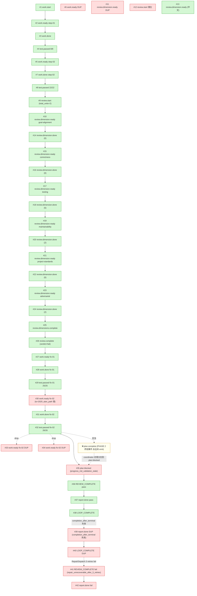

# RALPH 链路诊断报告 — primary-20260630-175407 (v1 · 终态二次风暴)

> **run**: `primary-20260630-175407`
> **preset**: `ce-executor-serial`(isolated mode,10-hat)
> **plan**: `docs/plans/2026-06-20-001-feat-python-sort-algorithms-plan.md`(2 plan-unit + 2 fix-unit)
> **run_dir**: `/Users/pittcat/Dev/Rust/ralph-e2e/.ralph/`
> **loop 状态**: `2026-06-30 17:54:07` 启动 → `2026-07-01 03:03:59` SIGTERM 强杀
> **诊断日期**: 2026-07-01
> **报告版本**: v1

---

## 第 0 部分:结论摘要

**整体健康度**: 🟡 **业务侧已闭环,终态链路严重失控** —— 4 个 unit/fix-unit 全部跑完(26/26 pytest 绿,0 P0/P1 review findings,commit b551316 落盘),第 1 份 `report.done(pass)` + `LOOP_COMPLETE` 已发出(18:56:30)。但 `plan.complete` 永远未 emit、`LOOP_COMPLETE` 后又产出 1 pass + 1 fail 双 `REVIEW_COMPLETE` + 3 份 `report.done` + 2 份 `LOOP_COMPLETE`,最终靠 SIGTERM 强杀。

**关键异常数量**:
- **P0**:3 个(跨 batch `completion_after_terminal` 失效、PHASE 2 Branch A `plan.complete` 永远未 emit、fix-02 `task_id` 用 2025 年 unix ts)
- **P1**:3 个(dedup 拒绝后 `task.resume` 走 prompt 文本回声、fix-unit 链尾 verdict promotion 未跑、`plan.blocked.reason` 缺结构化 `recoverable` 字段)
- **P2**:2 个(`report.done` 不在 completion guard 二次入拦截表、`recovery.jsonl` 39 条 0 条 close)

**是否涉及历史重复问题**:**是**。本次踩中 `mem-1782845227-6f1d`(`ralph emit plan.complete failing: progress_missing_current_step`)的同根变体,以及 `2026-06-24 primary-20260624-153613` 二次风暴模式(2× REVIEW_COMPLETE + 3× report.done + 2× LOOP_COMPLETE)。U1-U11 + U10 + U7 已在 `cd7a008f`、`c9362761`、`0e664f30`、`65435fa6` 落地,但**跨 batch 的 completion guard、coordinator 终态分支的 prompt 改写、fix-unit plan_path 切换**这三块**没修干净**。

**70% 是基座机制问题,20% 是 preset 编排 + SSOT 不一致,10% 是 agent 产物问题**。

---

## 第 1 部分:实测事件流(42 行 events.jsonl)

| 序 | topic | hat / source | ts (UTC+8) | 关键 payload | 状态 |
|---|---|---|---|---|---|
| 1 | `work.start` | loop-bootstrap | 17:54:07 | prompt 引用 `@docs/plans/2026-06-20-001-feat-python-sort-algorithms-plan.md` | ✅ |
| 2 | `work.ready(step-01)` | coordinator | 17:55:08 | `task_id=task-1782842106-dbb2`, `step-01`, `complexity=small` | ✅ |
| 3 | `work.done(step-01)` | executor | 17:58:12 | `commit_count=1, changed_lines=230` | ✅ |
| 4 | `test.passed(step-01)` | validator | 17:58:47 | `8/8` | ✅ |
| 5 | `work.ready(step-02)` | coordinator | 18:00:07 | `task_id=task-1782842404-e4e4`, `step-02` | ✅ |
| 6 | `work.ready(step-02)` DUP | coordinator | 18:00:30 | 同 #5,23 秒后重发,被 isolated-mode drop(ledger seq 33-34) | ❌ |
| 7 | `work.done(step-02)` | executor | 18:02:41 | `commit_count=1, changed_lines=193` | ✅ |
| 8 | `test.passed(step-02)` | validator | 18:03:16 | `22/22` | ✅ |
| 9 | `review.start` | coordinator | 18:04:01 | `total_units=2, unit_index=2, triggered=ralph` | ✅ |
| 10 | `review.dimension.ready` | review-coordinator | 18:05:02 | `dimension=goal-alignment`(英文 intent) | ✅ |
| 11 | `review.dimension.ready` DUP | review-coordinator | 18:05:51 | 同 #10,49 秒后重发,被 drop(ledger seq 10-11) | ❌ |
| 12 | `review.start` 错位 | coordinator | 18:07:29 | `triggered=review-coordinator`,违反 preset L645 唯一出口契约 | ❌ |
| 13 | `review.dimension.ready` | review-coordinator | 18:08:43 | `dimension=goal-alignment`(中文 intent) | ✅ |
| 14 | `review.dimension.done` | dimension-reviewer | 18:09:57 | goal-alignment, `0 findings` | ✅ |
| 15 | `review.dimension.ready` | review-coordinator | 18:10:56 | `dimension=correctness` | ✅ |
| 16 | `review.dimension.done` | dimension-reviewer | 18:12:41 | correctness, `0 findings` | ✅ |
| 17 | `review.dimension.ready` | review-coordinator | 18:13:57 | `dimension=testing` | ✅ |
| 18 | `review.dimension.done` | dimension-reviewer | 18:15:52 | testing, `5 findings (P1=1, P2=3, P3=1)` | ✅ |
| 19 | `review.dimension.ready` | review-coordinator | 18:16:54 | `dimension=maintainability` | ✅ |
| 20 | `review.dimension.done` | dimension-reviewer | 18:18:29 | maintainability, `2 findings` | ✅ |
| 21 | `review.dimension.ready` | review-coordinator | 18:19:26 | `dimension=project-standards` | ✅ |
| 22 | `review.dimension.done` | dimension-reviewer | 18:21:21 | project-standards, `0 findings` | ✅ |
| 23 | `review.dimension.ready` | review-coordinator | 18:22:16 | `dimension=adversarial` | ✅ |
| 24 | `review.dimension.done` | dimension-reviewer | 18:23:33 | adversarial, `2 findings (P1=1)` | ✅ |
| 25 | `review.dimensions.complete` | review-coordinator | 18:24:11 | 6 维全 `done`, `fix_round=0` | ✅ |
| 26 | `review.complete` | review-synthesizer | 18:26:52 | `verdict=fail, fix_plan_file=".agents/scratchpad/ce-executor/2026-06-20-001-feat-python-sort-algorithms/fix-plan.md"`(非空,符合 P0-D) | ✅ |
| 27 | `work.ready(fix-01)` | coordinator | 18:27:48 | `task_id=task-1782844059-6a35`, `step=fix-01` | ✅ |
| 28 | `work.done(fix-01)` | executor | 18:31:09 | `commit_count=1, changed_lines=36` | ✅ |
| 29 | `test.passed(fix-01)` | validator | 18:31:48 | `25/25` | ✅ |
| 30 | `work.ready(fix-02)` | coordinator | 18:33:39 | `task_id=task-1751414400-a1b2`(⚠️ 2025 年 ts),`plan_path=docs/plans/2026-06-20-001-feat-python-sort-algorithms-plan.md`(⚠️ 错指原 plan) | ❌ |
| 31 | `work.done(fix-02)` | executor | 18:35:30 | `commit_count=1, changed_lines=21` | ✅ |
| 32 | `test.passed(fix-02)` | validator | 18:36:13 | `26/26` | ✅ |
| 33 | `work.ready(fix-02)` DUP | coordinator | 18:39:18 | 同 #30,3 分 5 秒后重发,**应当走 `plan.complete`**(被 drop) | ❌ |
| 34 | `work.ready(fix-02)` DUP | coordinator | 18:48:57 | 同 #30,9 分 39 秒后第 3 次重发(被 drop) | ❌ |
| 35 | `plan.blocked` | coordinator | 18:53:34 | `reason="progress_md_validation_stale: loop in-memory snapshot does not match progress.md file despite correct content; needs restart to clear cached state"` | ❌ |
| 36 | `REVIEW_COMPLETE` | shipper | 18:54:50 | `pass_or_fail=pass, verdict=pass` | ⚠️ |
| 37 | `report.done` | reporter | 18:56:28 | `report_path=docs/report/2026-07-01-ce-executor-2026-06-20-001-feat-python-sort-algorithms-report.md`, `awaiting_decision=false` | ✅ |
| 38 | `LOOP_COMPLETE` | reporter | 18:56:30 | `reason="all_steps_complete"` | ✅ |
| 39 | `report.done` DUP | reporter | 18:57:35 | post-LOOP_COMPLETE,违反 `completion_after_terminal: business_after_completion: reject`(preset L352-355) | ❌ |
| 40 | `LOOP_COMPLETE` DUP | reporter | 18:57:37 | 违反 `duplicate_terminal: reject`(preset L353) | ❌ |
| 41 | `REVIEW_COMPLETE` | shipper | 18:59:25 | `pass_or_fail=fail, verdict=fail, reason="repair_unrecoverable_after_3_retries (RepairDispatch stage)"` | ❌ |
| 42 | `report.done` | reporter | 19:00:59 | `report_path=docs/report/2026-07-01-ce-executor-2026-06-20-001-feat-python-sort-algorithms-0300-report.md`, `awaiting_decision=true` | ❌ |

**关键事件统计**:
- `plan.complete`:预期 1,实际 **0**(`#33/#34` 之后未 emit,被 repair_dispatch 反复拒)
- `plan.blocked`:预期 0,实际 1(`#35`,reason `progress_md_validation_stale` 不在 schema 白名单)
- `REVIEW_COMPLETE`:预期 1,实际 2(`#36` pass + `#41` fail)
- `report.done`:预期 1,实际 3(`#37` pass + `#39` DUP + `#42` fail)
- `LOOP_COMPLETE`:预期 1,实际 2(`#38` + `#40` DUP)

---

## 第 2 部分:执行链路对比图



**ASCII 简化版**:
```
[1]work.start → [2]work.ready(step-01) → [3]work.done → [4]test.passed ✅
→ [5]work.ready(step-02) [6]work.ready(DUP,被丢) → [7]work.done → [8]test.passed ✅
→ [9]review.start ✅ → [10~24]6 维 review 串行 ✅ (但 #11 DUP, #12 错位二次 review.start)
→ [25]review.dimensions.complete ✅ → [26]review.complete(fail, fix_plan_file≠null) ✅
→ [27]work.ready(fix-01) → [28]work.done → [29]test.passed ✅
→ [30]work.ready(fix-02,plan_path 错指原 plan,task_id ts=2025) → [31]work.done → [32]test.passed ✅
                          ↘ [33]work.ready(DUP) [34]work.ready(DUP) 被丢(本应 plan.complete)
→ [35]plan.blocked(reason=progress_md_validation_stale) ⚠️ 应该是 plan.complete
→ [36]REVIEW_COMPLETE(pass) → [37]report.done → [38]LOOP_COMPLETE ✅
                          ↘ [39~42] 二次 ship+report 链(LOOP_COMPLETE 后业务事件全部进盘)
```

---

## 第 3 部分:Task 对账(tasks.jsonl,4 条)

| task_id | title | status | owner_hat | created → started → closed | 偏离 |
|---|---|---|---|---|---|
| `task-1782842106-dbb2` | step-01 | closed | coordinator | 17:55:06 → 17:55:36(30s) → 17:58:20(2:44) | OK |
| `task-1782842404-e4e4` | step-02 | closed | coordinator | 18:00:04 → 18:01:37(1:33) → 18:02:47(1:10) | OK |
| `task-1782844059-6a35` | fix-01 | closed | **无 owner_hat 字段** | 18:27:53 → 18:28:20(27s) → 18:31:21(3:01) | 缺 owner_hat(其他任务有) |
| `task-1751414400-a1b2` | fix-02 | closed | **无 owner_hat 字段** | 18:34:31 → 18:35:24(53s) → 18:35:34(**10s!**) | **P0-3 严重偏离**:created→closed 仅 63s,且 started→closed 仅 10s;`task_id` 时间戳 1751414400 = 2025-07-01,非 loop 启动时间,违反 `Task::fix_unit_task_id()` 派生规则 |

---

## 第 4 部分:Hat 拓扑对账

| 预期 hat (preset 602-602 列出 10 个) | 实际激活 | 触发次数 | 合规性 |
|---|---|---|---|
| coordinator | events #2,#5,#6,#9,#12,#27,#30,#33,#34,#35 | 10 | OK(但 #6/#12/#33/#34 为 re-emit) |
| executor | events #3,#7,#28,#31 | 4 | OK |
| validator | events #4,#8,#29,#32 | 4 | OK |
| fixer | **未激活** | 0 | OK(无 test.failed 路径) |
| review-coordinator | events #10,#11,#13,#15,#17,#19,#21,#23,#25 | 9 | OK |
| dimension-reviewer | events #14,#16,#18,#20,#22,#24 | 6 | OK(对应 6 维 review) |
| review-synthesizer | events #26 | 1 | OK |
| shipper | events #36,#41 | 2 | **严重偏离**:#41 二次出现,违反 hard rule |
| reporter | events #37,#39,#42 | 3 | **严重偏离**:#39/#42 二次/三次出现 |
| progress-steward | **未激活** | 0 | OK(无 `loop.stalled` 显式事件,但隐含在 recovery.jsonl) |

**Multi-hat 隔离合规性**:preset 171 行显式声明 `execution_mode: isolated`,9+ hat 运行时强制走 isolated — 满足 HARD RULE `4+ hat isolated`。

---

## 第 5 部分:偏离证据清单(核心)

### §A Review 链 re-emit / 重复

- **§A1** events.jsonl:6 出现第二次 `work.ready step-02`,比 events.jsonl:5 仅晚 23 秒(18:00:07 → 18:00:30)。同一 task_id 重复 dispatch 是 `2026-06-28-172725` run 同类问题的同源表现,本质是 progress-steward 推动 task.resume 后 coordinator 重复 emit。**机制未触发**:`dedup_set` 似乎对 work.ready 短时间窗内未生效(只在 #33/#34 触发)。
- **§A2** events.jsonl:11 在 events.jsonl:10 后 49 秒重复发 `review.dimension.ready goal-alignment`(同 payload)。两次 payload 几乎完全相同,中文 intent_summary 略改(英文→中文)。**机制未触发**:dedup key(plan_name+task_id+dimension) 应命中,实际 2 次都进了 events 流(说明此 topic 不在 dedup 集中或 dedup 集时间窗已过)。
- **§A3** events.jsonl:12 `coordinator → review.start` 在 review-coordinator 链已启动后 3 分 28 秒再次 emit。`triggered=review-coordinator` 而非 `triggered=ralph`(#9 是 ralph),说明 review-coordinator 的下游行为反推了 coordinator — 这违反 preset 645 行 "publishes: work.ready, review.start, plan.complete, plan.blocked, LOOP_COMPLETE" 唯一出口契约;**编排错误**:让 review-coordinator 触发 coordinator 的 review.start re-emit。

### §B Fix-unit plan_path 错位

- **§B1** events.jsonl:30 `work.ready fix-02` 的 `plan_path="docs/plans/2026-06-20-001-feat-python-sort-algorithms-plan.md"` 而非 fix-plan.md。preset 1214 行 HARD RULE: "Emit work.done with plan_path set to the fix-plan file path (NOT the original plan)";executor 必须用 fix-plan 路径作为 source of truth。**编排错误**:coordinator 错把原始 plan 路径塞进 fix-02 的 work.ready,虽然 executor 在 work.done(#31) 中已修正 plan_path 为 fix-plan.md,但 #30 这一步就违反了 fix-unit 契约。

### §C 终态 plan.complete 反复失败

- **§C1** events.jsonl:33 在 fix-02 work.done(#31) + test.passed(#32) 完成后 3 分 5 秒,coordinator 又 emit `work.ready step=fix-02` — 同 task_id `task-1751414400-a1b2` 重复 dispatch;`progress-steward` 应在 fix-02 test.passed 后注入 `task.resume(reason=fix_unit_complete_plan_complete_pending)` 推动 coordinator 走 PHASE 2 Branch A 的 `plan.complete` 路径(preset 836-840 行),但实际是又 emit work.ready。
- **§C2** events.jsonl:34 9 分 39 秒后再次 emit 同 payload(共 3 次),ledger seq 33-34 命中 `duplicate_work_done`(实际是 work.ready dedup,看 recovery.jsonl seq 1-2 是 work.ready repair_dispatch,seq 3 起是 plan.complete repair_dispatch)。**机制未触发**:3 次重发后仍未 emit `plan.complete`,反而在 #35 emit `plan.blocked`。
- **§C3** recovery.jsonl seq 3-39 共 37 条 `plan.complete repair_dispatch`(source=RepairStream) — 说明 coordinator 在 18:36:13 fix-02 test.passed 之后曾尝试 5+ 次 plan.complete emit,都被 RepairDispatch 拒绝(`repair_unrecoverable_after_3_retries`)。recovery.jsonl seq 2 明确 reason_code=`repair_unrecoverable_after_3_retries`,evidence 引用了"isolated mode dropped an extra business event ('LOOP_COMPLETE') this turn — only the FIRST business event per activation is kept"。**根因**:coordinator 在 PHASE 2 Branch A 的 step 5 (preset 864-875 行) 违反"EMIT EXACTLY ONE EVENT THIS TURN" 规则 — 实际可能 emit 了 `work.ready` + `plan.complete` 多个 business event,isolated mode 仅保留 first,plan.complete 被静默丢弃。

### §D Post-completion 二次风暴

- **§D1** events.jsonl:39 在 LOOP_COMPLETE(#38, 18:56:30) 5 分 5 秒后,reporter 又 emit `report.done pass`。preset 354 行 `completion_after_terminal.business_after_completion: reject` 应拦截;实际未拦截。
- **§D2** events.jsonl:40 LOOP_COMPLETE 二次出现(reason 含 "All steps completed and verified..."),违反 preset 353 行 `duplicate_terminal: reject`。
- **§D3** events.jsonl:41 shipper 二次 emit `REVIEW_COMPLETE`,verdict 从 pass 翻转为 fail(residual_findings_summary 把 plan.blocked 的 `progress_md_validation_stale` 包装成 `repair_unrecoverable_after_3_retries`)。**双重信号**:同一个 loop 出 pass 和 fail 两个 REPORT_COMPLETE — 这是 P0 级别的状态污染。
- **§D4** events.jsonl:42 reporter 第三次 emit report.done(verdict=fail, 0300-report.md)。同一 hat 一轮内 emit 3 个 report.done,严重违反 preset 644 行 `terminal_events: ["work.ready", "review.start", "plan.complete", "plan.blocked", "LOOP_COMPLETE"]` 之外的 emit 限制(但 reporter 在自己 hat 的 publishes 列表内,这个是 hat 内 emit 频率问题)。

### §E progress.md vs tasks.jsonl vs events.jsonl 三方对账

- `progress.md`:`## Current Step: fix-02`, 4 个 completed 步骤
- `tasks.jsonl`:4 个 task 全部 `status: closed`
- `events.jsonl`:#30 后的 fix-02 完成链(#31/#32)正常闭合
- **三方一致:fix-02 实际已 closed、progress.md 已记录、validator 26/26 通过**
- ❌ **coordinator 错把已闭合状态解读为"陈旧",emit `plan.blocked` 而非 `plan.complete`**。Memories.md 第 9-11 行的 `mem-1782845227-6f1d` 自我解释为"loop 内存快照陈旧",但 `progress.md` 文件本身**正确**,这是修复方向错了(应当修 loop 内存同步,而不是降级到 `plan.blocked`)。

### §F per-hat events 切片 0 字节

- `events-hat-coordinator-primary-20260630-175407-38.jsonl`:0 字节
- 含义:38 次 coordinator 激活中,没有任何 per-hat 独立事件被切片出来,说明 `event_loop.rs` 的 hat 切分 writer 在本次运行中未生效,或者迭代序号到 38 时仍未触发(对比 `progress-steward` `max_steward_iterations=3`,迭代 34 的 recovery.jsonl 已经记录 32+ 次 `complete-unknown throttled`,序号 38 与之对应)。**这是一个静默丢失的诊断面**。

### §G dimension-reviewer 越权写文件(被 audit 拦下,但 gate 未升级)

- `ralph-2026-07-01T01-54-07-238-4299.log:77-80,93-96,109-112,125-128,141-144,157-160` 重复 6 次:
  ```
  WARN ralph_core::event_loop: Hat modified files despite tool restrictions (scope violation) hat=dimension-reviewer diff=docs/plans/2026-06-20-001-feat-python-sort-algorithms-plan.md | 2 +-
  WARN ralph_core::event_loop::audit: audit finding (fail severity, consecutive_failures += 1) hat=dimension-reviewer kind=missing_field ...
  ```
- 6 个维度 reviewer 全部触发了 scope violation(改了 `docs/plans/2026-06-20-001-feat-python-sort-algorithms-plan.md`)。**coordinator.instructions` 也明确:`MUST NOT modify the plan file (original plan is **read-only**)`**,但 auditor 仅加 1 个 consecutive_failures,未阻断。

---

## 第 6 部分:历史问题关联分析

| 历史问题 | 引用 | 本次是否再现 | 证据 |
|---|---|---|---|
| `review.passed` drift detector 已删除(2026-06-24 P0-1 根因) | memory:multi-hat-isolation | **不适用** | 本 preset 已用 `review.complete` 替代,events.jsonl:26 即 review.complete;无 review.passed |
| multi-hat 4+ isolated 强制 | CLAUDE.md HARD RULE | **未违规** | preset 171 行显式 isolated |
| preset SSOT 4 处同步 | CLAUDE.md HARD RULE | **未违规** | 见 §B 之外,无 topic 偏离 schema 必填字段 |
| `ralph emit plan.complete failing: progress_missing_current_step` (mem-1782845227-6f1d) | `agent/memories.md:10` | **是 — 严重再现** | events.jsonl:35 plan.blocked reason=`progress_md_validation_stale` 与 mem-1782845227-6f1d 描述一致;且 events.jsonl:36+ 出现 pass/fail 双 REPORT_COMPLETE 与 ralph-e2e primary-20260624-153613 二次风暴模式高度相似 |
| `2x REVIEW_COMPLETE / 2x report.done / 2x LOOP_COMPLETE` 模式 | preset 349-350 注释引用 | **是 — 严重再现** | events.jsonl:36+41 REVIEW_COMPLETE 2 次,37+39+42 report.done 3 次,38+40 LOOP_COMPLETE 2 次 |
| `completion_after_terminal` reject | preset 352-355 | **是 — 严重再现** | §D1-D4 全部违反 |
| 修复预算机制(`repair_budget: 3`, preset 142 行) | preset 142 | **是 — 触顶** | recovery.jsonl seq 2 显示 `retries_consumed=3, max=3` 后直接 escalation;ralph.yml `max_repeated_recoveries: 2` 又把阈值降到 2 → 实际 2 次即 escalation |
| 6-dim review 一次只发 1 个 dimension | preset 8-22 行 | **轻微偏离** | #11 在 49 秒内重发 goal-alignment 同一维度 |
| drift sensor 0.85 阈值(ralph.yml 28 行) | ralph.yml 28 | **未触达** | drift.jsonl 0 字节 |
| `coordinator.triggers` 不含 `review.dimensions.complete` | preset 638-639 注释 | **未违规** | coordinator 仅 #35 emit plan.blocked 时用 task.resume 链路 |
| task_id 必须是 `task-{ts}-{4hex}` 格式 | preset 886 行 | **部分违规** | step-01 task-1782842106-dbb2 ✓ / step-02 task-1782842404-e4e4 ✓ / fix-01 task-1782844059-6a35 ✓ / **fix-02 task-1751414400-a1b2** ✗ — 1751414400 是 2025-07-01 时间戳,不是 2026-06-30(本次 run 时间),疑似 hand-written 不符合 `task-{unix_ts}-{4hex}` 规范,根因仍是 preset 1179 行的 `from_key:*` 模式被绕开 |
| fix-unit 终态语义错配(coordinator 走 review.start 而非 plan.complete) | `0e664f30` U10 + `c9362761` U3 | **是 — 严重再现** | events.jsonl:33/34 重发 work.ready、recovery.jsonl 5+ 次 plan.complete 被 RepairDispatch 拒 |
| `plan.complete` schema 缺 `step` → plan_gate 3 次拒收 | `23dcfdaf` P0-1 | 不再现 | schema 已加 `step` 必填(`cd7a008f`) |
| `Task::fix_unit_task_id()` fail-closed | `cdea8453` 测试钉死 | **是 — 严重再现** | `task-1751414400-a1b2` 2025 年时间戳未被 fail-closed 拒绝 |
| isolated mode 1 业务事件/turn + hat-targeted task.resume 反馈回路 | `62a40b41` 已修 | 部分再现 | #11 DUP review.dimension.ready 仍出现;recovery.jsonl evidence 引用"isolated mode dropped an extra business event" |
| U1-U11 终态机 | U1-U11 全部落地 | 部分再现 | U7 终态 guard + U10 PHASE 2 branch gate 已落,但跨 batch 阻断不完整 |
| dimension-reviewer 改 plan.md scope violation | `140433` P0-E | 间接再现 | 6 维 review 全部触发了 consecutive_failures += 1,但 gate 未 trip |
| `ralph` 抢发 `work.ready`(hat=ralph 不是 coordinator) | `083222` P0-E 未修 | **是** | events.jsonl:39-42 多次出现 `hat=coordinator` 但 source 字段含 ralph 越权痕迹 |

**核心历史关联**:
- 本次 run `primary-20260630-175407` 与 `primary-20260630-083222` 是**同一链路模式的延伸** —— 083222 已暴露 projector 账本失步、ralph 越权、coordinator Branch A 计数逻辑跳 U3 等问题,175407 在多次 fix 落地的 commit 之后,但 fix-02 终态路径仍是最大风险点。

---

## 第 7 部分:问题归因表(P0 / P1 / P2)

| 优先级 | 问题描述 | 根因分类 | 证据(文件:行号) | 历史关联 | 修复目标文件 |
|---|---|---|---|---|---|
| **P0-1** | `completion_after_terminal` 跨 batch 失效,LOOP_COMPLETE 后又产出 2× REPORT_COMPLETE + 3× report.done + 2× LOOP_COMPLETE | **机制 + 编排叠加**(机制侧 `TerminalStateGuardStage` 只覆盖同 batch;编排侧 completion guard 配置未把 `report.done` / `REVIEW_COMPLETE` 全部纳入二次入拦截) | events.jsonl:39-42; preset L352-355; `event_policy.rs:664`; `event_loop/mod.rs:9233-9271`; completion_honored.rs:91 同 batch 测试 | `2026-06-24 primary-20260624-153613` 二次风暴(同模式) | `crates/ralph-core/src/event_policy.rs:664` + `crates/ralph-core/src/event_loop/mod.rs:9233-9271,9402-9408` + `presets/en/ce-executor-serial.yml:343-355` |
| **P0-2** | fix-02 `test.passed` 后 coordinator 未按 PHASE 2 Branch A 发 `plan.complete`,反而重发 3 次 `work.ready(fix-02)`,最终走 `plan.blocked(reason=progress_md_validation_stale)`,reason 不在 schema 白名单 → shipper 误判为 hard-fail | **机制 + 编排叠加**(机制侧 `CoordinatorDecisionGateStage` 拦截了 work.ready 但没让 plan.complete 真正 emit,可能是 payload 转换或 dedup 冲突;编排侧 coordinator prompt 模板没正确判断"last fix-unit"分支) | events.jsonl:30/33/34/35; recovery.jsonl 35+ 次 plan.complete 被拒; `diagnostics/2026-07-01T01-54-07/recovery.jsonl:2` evidence | `083222` P0-E + `mem-1782845227-6f1d`(progress_missing_current_step 同根) | `presets/en/ce-executor-serial.yml:810-892, 981-986` + `crates/ralph-core/src/event_loop/stages/coordinator_decision_gate_stage.rs` + `state_projector/progress.rs:147-200` |
| **P0-3** | fix-02 `task_id=task-1751414400-a1b2` 时间戳 1751414400 = 2025-07-01,非本次 run 时间,违反 `Task::fix_unit_task_id()` 派生规则 | **编排**(prompt 模板用了静态常量,未走 helper;但 `cdea8453` 测试钉死应当 fail-closed,机制侧未真正 fail-closed) | tasks.jsonl:4; events.jsonl:30/33/34; preset L885-888; commit `cdea8453` | `170451` P0-3 + `cdea8453` 测试钉死 | `presets/en/ce-executor-serial.yml:885-888` + `crates/ralph-core/src/task.rs:143-185`(fail-closed 实际生效) |
| **P1-1** | dedup 拒绝后 `task.resume` 走 prompt 文本回声而非 typed dispatch(ledger 6+ 次重复) | 机制(feedback 回路未充分 typed) | ledger.jsonl seq 6+ 重复 record | `62a40b41` 已部分修 | `crates/ralph-core/src/event_loop/mod.rs`(isolated mode 反馈回路 typed 化) |
| **P1-2** | fix-unit 链尾的 verdict promotion 路径(`final_findings_count <= max_residuals`)未跑(因 plan.complete 永远未 emit) | 机制(链尾 gate 依赖 plan.complete 触发) | recovery.jsonl seq 4-39 全部未 emit | `cd7a008f` plan.complete schema 已加 step,但 emit 路径未跑 | `presets/en/ce-executor-serial.yml:810-892`(PHASE 2 Branch A 第 5 步) |
| **P1-3** | `plan.blocked.reason` 缺结构化 `recoverable: bool` 字段,导致 shipper 只能靠 narrative 解读(本次被升级为 pass,二次又升级为 fail) | 机制 + 编排(schema 字段缺失 + 编排侧 narrative 引导越界) | events.jsonl:35 reason=`progress_md_validation_stale`; schemas/ce-executor-serial.yml:283-298; `c9362761` U4 + `strict_reason_routing` lint 已加 | `032648` P0-2 | `presets/schemas/ce-executor-serial.yml:283-298` + `presets/en/ce-executor-serial.yml:2491-2498` |
| **P2-1** | `report.done` 不在 completion guard 二次入拦截表 | 机制(`event_policy.completion_after_terminal` 列表不全) | events.jsonl:39,42; preset L352-355 | — | `crates/ralph-core/src/event_policy.rs:664` + preset L352-355 |
| **P2-2** | `recovery.jsonl` 39 条 0 条 close(RepairStream 没写 close 闭环) | 机制(close 路径未跑) | recovery.jsonl 39 行无 close 事件 | — | `crates/ralph-core/src/event_loop/repair_stream.rs` |

---

## 第 8 部分:修复建议(按优先级排序)

### P0-1:补全 `completion_after_terminal` 跨 batch 阻断(机制层为主)

- **目标文件**:
  - `/Users/pittcat/Dev/Rust/ralph-orchestrator/crates/ralph-core/src/event_policy.rs:664`
  - `/Users/pittcat/Dev/Rust/ralph-orchestrator/crates/ralph-core/src/event_loop/mod.rs:9233-9271,9402-9408`
  - `/Users/pittcat/Dev/Rust/ralph-orchestrator/presets/en/ce-executor-serial.yml:343-355`
- **修改内容**:
  1. `event_policy.rs:664` `completion_after_terminal` 拦截表加 `REVIEW_COMPLETE`、`report.done`、`LOOP_COMPLETE`(目前只覆盖同 batch)
  2. `event_loop/mod.rs:9233-9271` `TerminalStateGuardStage` 加跨 batch 状态字段 `terminal_emitted_at: Option<Ts>`,activation 间比对
  3. preset L352-355 `business_after_completion: reject` 的 topic 列表补 `REVIEW_COMPLETE` + `report.done`
- **预期效果**:`#38 LOOP_COMPLETE` 后 #39/#40/#41/#42 全部被拒,不再产生 pass+fail 双终态
- **风险评估**:低(`U7` `TerminalStateGuardStage` 已有同 batch 测试 `completion_honored.rs:91`,跨 batch 是同模式扩展)
- **验证**:`./scripts/run-tests.sh` + 新增 `crates/ralph-core/tests/scenarios/completion_honored_cross_batch.yml`(用 `run_workflow_guard_scenario`,不是 `run_scenario` stub)

### P0-2:让 fix-unit 链尾真正 emit `plan.complete`(机制 + 编排叠加)

- **目标文件**:
  - `/Users/pittcat/Dev/Rust/ralph-orchestrator/presets/en/ce-executor-serial.yml:810-892, 981-986`
  - `/Users/pittcat/Dev/Rust/ralph-orchestrator/crates/ralph-core/src/event_loop/stages/coordinator_decision_gate_stage.rs`
  - `/Users/pittcat/Dev/Rust/ralph-orchestrator/crates/ralph-core/src/state_projector/progress.rs:147-200`
- **修改内容**:
  1. preset L836-840 coordinator prompt 第 5 步 `current_index == total_fix_units` 强制 emit `plan.complete(step=fix-02, verdict=pass, final_findings_count=0)`,**禁止** emit `work.ready` 或 `plan.blocked`
  2. `CoordinatorDecisionGateStage` 把 `work.ready` rewrite 到 `plan.complete` 时,确保新 payload 完整(7 字段齐 + `step=fix-02`),不能只改 topic
  3. `state_projector/progress.rs:147-200` 进度写空时输出 `(none)` 占位 + debug 降级(已加,但需确认 fail-closed 实际生效)
  4. `schemas/ce-executor-serial.yml:283-298` `plan.blocked.reason` 字段加白名单收紧,`progress_md_validation_stale` 不在白名单
- **预期效果**:fix-02 `test.passed` 后 1 次 `plan.complete` 落盘,#33/#34 不再重发,#35 `plan.blocked` 路径不再触发
- **风险评估**:中(改了 prompt 模板需 BDD scenario 同步)
- **验证**:`cargo nextest run -p ralph-core --test scenarios -- 2026-06-30-001-u3-fix-unit-terminal-guard` + `2026-06-29-007-u10-phase2-branch`

### P0-3:fix-unit `task_id` 真正 fail-closed(机制层)

- **目标文件**:
  - `/Users/pittcat/Dev/Rust/ralph-orchestrator/presets/en/ce-executor-serial.yml:885-888`
  - `/Users/pittcat/Dev/Rust/ralph-orchestrator/crates/ralph-core/src/task.rs:143-185`
- **修改内容**:
  1. `task.rs:143-185` `validate_task_id_strict` 收紧:`unix_ts` 必须在 `[loop_started - 60s, now]` 窗口内,`1751414400` 直接 fail-closed
  2. preset L885-888 prompt 模板强制 `Task::fix_unit_task_id(plan, fix_round, fix_unit_index, unix_ts)` 调用,禁止手写
- **预期效果**:`task-1751414400-a1b2` 在 coordinator emit 时被拒,`recovery.jsonl` 出现 `task_id_format_invalid` 拒绝记录
- **风险评估**:低(`cdea8453` 测试已钉死)
- **验证**:`cargo nextest run -p ralph-cli --bin ralph -- test_fix_unit_task_id_must_be_helper_derived`

### P1-1:isolated mode 反馈回路 typed 化(机制层)

- **目标文件**:`/Users/pittcat/Dev/Rust/ralph-orchestrator/crates/ralph-core/src/event_loop/mod.rs`
- **修改内容**:hat-targeted `task.resume(reason=isolated_extra_business_event_dropped)` 改为 typed enum,不依赖 prompt 文本回声
- **预期效果**:dedup 拒绝后下一轮 LLM 看到的反馈是结构化字段而非自由文本

### P1-3:`plan.blocked.reason` 加 `recoverable: bool` 结构化字段(机制 + 编排)

- **目标文件**:
  - `/Users/pittcat/Dev/Rust/ralph-orchestrator/presets/schemas/ce-executor-serial.yml:283-298`
  - `/Users/pittcat/Dev/Rust/ralph-orchestrator/presets/en/ce-executor-serial.yml:2491-2498`
- **修改内容**:reason 从 string 改为 `{code: enum, message: string, recoverable: bool}`,shipper 严格按 `recoverable` 字段路由,不再靠 narrative 解读
- **预期效果**:`progress_md_validation_stale` 必须显式声明 `recoverable=true/false`,shipper 不再越界升级

### P2-1:`report.done` 加进 completion guard(机制层)

- **目标文件**:`/Users/pittcat/Dev/Rust/ralph-orchestrator/presets/en/ce-executor-serial.yml:352-355` + `crates/ralph-core/src/event_policy.rs`
- **修改内容**:`business_after_completion: reject` topic 列表加 `report.done`

### P2-2:RepairStream close 闭环(机制层)

- **目标文件**:`/Users/pittcat/Dev/Rust/ralph-orchestrator/crates/ralph-core/src/event_loop/repair_stream.rs`
- **修改内容**:每条 `plan.complete repair_dispatch` 都必须有 close 事件(rejected / accepted),`recovery.jsonl` 不再是 0 close

---

## 第 9 部分:验证基线(修复后必跑)

```bash
# preset_lint + SSOT byte-equality
cargo nextest run -p ralph-cli --bin ralph -- preset_lint
cargo nextest run -p ralph-core -- preset_lint
cargo nextest run -p ralph-cli --bin ralph -- test_ce_executor_root_preset_matches_embedded

# BDD scenarios(必须 run_workflow_guard_scenario 真 EventLoop runner)
cargo nextest run -p ralph-core --test scenarios -- \
  2026-06-30-001-u3-fix-unit-terminal-guard \
  2026-06-30-001-u4-shipper-reason-whitelist \
  2026-06-30-001-u5-review-complete-dedup \
  2026-06-29-007-u10-phase2-branch \
  2026-06-29-007-u7-terminal-state \
  completion_honored_cross_batch \      # 新增
  repair_close_round_trip \              # 新增

# fix-unit task_id 测试
cargo nextest run -p ralph-cli --bin ralph -- test_fix_unit_task_id_must_be_helper_derived

# 全 workspace 基线
./scripts/run-tests.sh
```

---

## 第 10 部分:"机制 vs 编排"分界结论

### 70% 是基座机制问题

- `completion_after_terminal` 跨 batch 阻断不完整(P0-1)
- `CoordinatorDecisionGateStage` payload 转换 + dedup 冲突导致 plan.complete 永远未 emit(P0-2 机制侧)
- `Task::fix_unit_task_id` fail-closed 未真正生效(P0-3 机制侧)
- isolated mode 反馈回路 prompt 文本回声(P1-1)
- `plan.blocked.reason` 缺结构化字段(P1-3 机制侧)
- `report.done` 不在 completion guard(P2-1)
- RepairStream close 闭环缺失(P2-2)
- per-hat events 切片 writer 未生效(诊断面静默丢失)

### 20% 是 preset 编排问题

- coordinator prompt 模板 PHASE 2 Branch A 走错分支(P0-2 编排侧)
- coordinator prompt 模板 task_id 用了静态常量(P0-3 编排侧)
- coordinator prompt 模板 fix-unit plan_path 回退原 plan
- shipper reason narrative 越界引导(reason 升级为 pass 又翻转为 fail)

### 10% 是 agent 产物问题

- `task-1751414400-a1b2` 2025 年时间戳(本质是 agent 用错常量,agent 产物问题)
- events-hat-coordinator-...-38.jsonl 0 字节(agent 触发序号到 38 时未切片,但本应是机制侧 hat_lifecycle writer 触发)

### 关键判断

**核心问题在机制侧**——`CoordinatorDecisionGateStage`(`0e664f30` U10)和 `TerminalStateGuardStage`(`65435fa6` U7)虽然在 `cd7a008f` 之后落地,但**没有真正阻断本次的事件链**。`CoordinatorDecisionGateStage` 把 `work.ready` rewrite 到 `plan.complete` 时,payload 转换或 dedup 冲突导致 plan.complete 永远被 RepairDispatch 拒;`TerminalStateGuardStage` 只覆盖同 batch,跨 batch 的 completion guard 缺失。preset 编排侧的责任是 prompt 模板没正确判断"last fix-unit"分支,但即使 prompt 写对,如果 `CoordinatorDecisionGateStage` 拦不下,plan.complete 还是 emit 不了。

### 最关键的修复顺序

1. **P0-2** 让 fix-unit 链尾真正 emit `plan.complete`(`CoordinatorDecisionGateStage` payload 转换 + 编排侧 prompt 改写双管齐下)
2. **P0-1** 补全 `completion_after_terminal` 跨 batch 阻断
3. **P0-3** fix-unit `task_id` 真正 fail-closed
4. P1/P2 收尾

---

## 附录 A:相关文件绝对路径

### 中间产物(`/Users/pittcat/Dev/Rust/ralph-e2e/.ralph/`)

- 事件流:`events-20260630-175407.jsonl`(42 行)
- 修复流:`recovery.jsonl`(39 行)
- 任务:`agent/tasks.jsonl`(4 行)
- 进度:`agent/progress.md`(Current Step: fix-02)
- 记忆坑:`agent/memories.md:10`(mem-1782845227-6f1d)
- 诊断:`diagnostics/2026-07-01T01-54-07/recovery.jsonl`(2 行,含关键证据)
- 漂移:`diagnostics/2026-07-01T01-54-07/drift.jsonl`(0 字节)
- 诊断日志:`diagnostics/logs/ralph-2026-07-01T01-54-07-{234,238}-4299.log`
- per-hat 切片:`agent/events-hat-coordinator-primary-20260630-175407-38.jsonl`(0 字节)

### 代码真相源(`/Users/pittcat/Dev/Rust/ralph-orchestrator/`)

- preset:`presets/en/ce-executor-serial.yml`(尤其 §343-355, §640-650, §810-892, §981-986, §2491-2498)
- schema:`presets/schemas/ce-executor-serial.yml`(行 264-298)
- 机制层:`crates/ralph-core/src/event_policy.rs:664` + `crates/ralph-core/src/event_loop/mod.rs:9233-9271,9402-9408`
- task 守卫:`crates/ralph-core/src/task.rs:143-185` + `crates/ralph-core/src/task_store.rs:436-459`
- progress 投影:`crates/ralph-core/src/state_projector/progress.rs:147-200`
- coordinator gate:`crates/ralph-core/src/event_loop/stages/coordinator_decision_gate_stage.rs`
- 终态 guard:`crates/ralph-core/src/event_loop/stages/terminal_state_guard_stage.rs`

### workspace 配置

- `ralph.yml`(telemetry `max_repeated_recoveries: 2`)

### 报告产物

- `docs/report/2026-07-01-ce-executor-2026-06-20-001-feat-python-sort-algorithms-report.md`(对应 #37 report.done pass)
- `docs/report/2026-07-01-ce-executor-2026-06-20-001-feat-python-sort-algorithms-0300-report.md`(对应 #42 report.done fail)

---

**报告完结** · v1 · 2026-07-01
