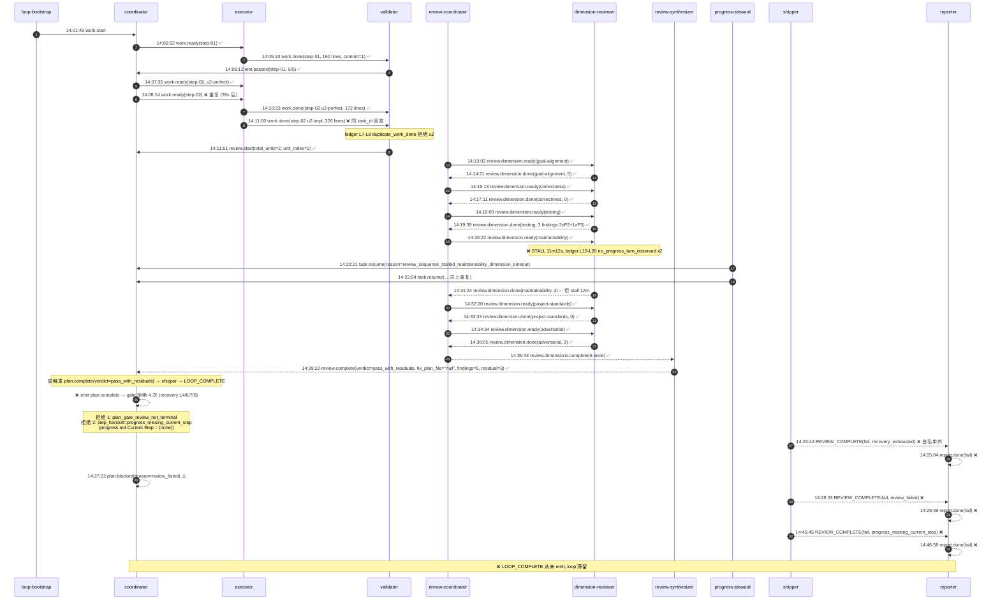

# Ralph Loop 运行链路诊断报告

**诊断对象**: `/Users/pittcat/Dev/Rust/ralph-e2e/.ralph/` (loop_id=`primary-20260701-140149`)
**Preset**: `ce-executor-serial` (10-hat isolated mode)
**Plan**: `docs/plans/2026-06-20-001-feat-python-sort-algorithms-plan.md` (2 UNIT)
**Prompt**: "Implement dev plan @docs/plans/2026-06-20-001-feat-python-sort-algorithms-plan.md, 不允许一下完成所有的Unit, 一个个完成"
**报告日期**: 2026-07-01
**报告人**: 主 Agent(汇总 A/B/C/D 4 个 sub-agent)

---

## 1. 结论摘要

| 项目 | 判定 |
|---|---|
| **一句话健康度** | 实施层完整成功(U1/U2 已 closed, 13/13 测试通过),**收口层双重机制缺陷导致 loop 滞留 fail, 未进入 LOOP_COMPLETE** |
| **P0 异常** | 2 个(plan_complete gate 双重卡死 + progress_steward 死循环) |
| **P1 异常** | 4 个 |
| **P2 异常** | 3 个 |
| **历史重复问题** | **是** —— 与 `2026-07-01-ce-executor-serial-primary-20260630-175407-diagnosis.md` 是同一根因在不同 run 中的第二次复发, 修复 plan `2026-06-30-001` 的 P0-1/P0-2 实际未生效 |

**机制 vs 编排归属判定**:**以机制问题为主、编排问题为辅**。详见 §5。

---

## 2. 执行链路对比图(Mermaid)

---

## 3. 历史问题上下文(关联度:高)

| 历史知识 | 来源 | 与本次关联度 |
|---|---|---|
| `progress_missing_current_step` + `plan_gate_review_not_terminal` 双重拒绝 | `docs/report/2026-07-01-ce-executor-serial-primary-20260630-175407-diagnosis.md` | **高(同 run_dir 同根, 18 小时间隔的连续两次 run)** |
| `plan.complete` 被 gate 拒 + `task_not_found` | `docs/achieved/plan/2026-06-30-001-fix-ce-executor-serial-fix-unit-terminal-p0-plan.md` R1/P0-1 | **高(plan active 未闭环)** |
| shipper 对 `plan.blocked` 路由越界升级为 pass 路径未生效 | 同上 plan R2/P0-2 | **高(plan active 未闭环)** |
| `pass_with_residuals` happy path 已设计 | `docs/achieved/plan/2026-06-30-001-...:282` | 中(被 P0-1/P0-2 阻断) |
| 5/6 维 walk 中断案例 | `docs/achieved/report/2026-06-26-ce-executor-serial-5dim-...-diagnosis.md` | 低(老版 5 维已升级 6 维) |
| shipper 多次 REVIEW_COMPLETE 失败重复 | `docs/achieved/plan/2026-06-26-001-fix-ce-executor-serial-four-recurrences-plan.md` R3 | 中(已闭环同类问题, 但本案形态不同) |

**关键判定**:`primary-20260701-140149` 是 `primary-20260630-175407` 的同源复发, 根因未变, plan `2026-06-30-001-fix-ce-executor-serial-fix-unit-terminal-p0` 的 P0-1/P0-2 实际未生效, 需优先复核 commit 是否落盘、是否被绕过。

---

## 4. 证据清单(关键文件:行号)

### 4.1 实施层证据(✅ 全部成功)

| 事件 ID | 文件:行 | 内容 | 状态 |
|---|---|---|---|
| work.start | `events-20260701-140149.jsonl:1` | loop-bootstrap 14:01:49 | ✅ |
| work.ready(step-01) | `events-20260701-140149.jsonl:2` | coordinator 14:02:52, task_key `...step-01:u1-skeleton-quick-sort` | ✅ |
| work.done(step-01) | `events-20260701-140149.jsonl:3` | executor 14:05:33 commit=1 lines=160 | ✅ |
| test.passed(step-01) | `events-20260701-140149.jsonl:4` | validator 14:06:12 5/5 | ✅ |
| tasks.jsonl U1 closed | `agent/tasks.jsonl:1-2` | task-1782914569-0cec closed 14:05:30 | ✅ |
| work.ready(step-02) | `events-20260701-140149.jsonl:5` | coordinator 14:07:35 | ✅ |
| work.done(step-02) | `events-20260701-140149.jsonl:7-8` | executor 14:10:23+14:11:00 lines=172+326 | ⚠️ 双发 |
| test.passed(step-02) | `events-20260701-140149.jsonl:17` | validator 14:21:14 13/13 | ✅ |
| tasks.jsonl U2 closed | `agent/tasks.jsonl:3-4` | task-1782914849-120f closed 14:11:07 | ✅ |
| review.start | `events-20260701-140149.jsonl:9` | coordinator 14:11:51 total_units=2 unit_index=2 | ✅ |
| 6 个 review.dimension.done | `events:11/13/15/25/27/29` | 全 done, 0+0+3+3+0+3 = 9 findings | ✅ |
| review.dimensions.complete | `events-20260701-140149.jsonl:30` | 14:36:43 | ✅ |
| review.complete | `events-20260701-140149.jsonl:31` | 14:39:22 verdict=pass_with_residuals fix_plan_file="null" | ✅ |
| progress.md Completed Steps | `agent/progress.md:6-8` | step-01, step-02 | ✅ |

### 4.2 收口层证据(❌ 全部失败)

| 异常 ID | 文件:行 | 异常描述 |
|---|---|---|
| **E-P0-1** | `recovery.jsonl:4/6/7/8`(共 4 次 `plan.complete` repair_dispatch) | coordinator emit plan.complete 4 次全部被 gate 拒绝 |
| **E-P0-1a** | `agent/memories.md:5-7` (`mem-1782917019-f9a7`) | 错误码:`plan_gate_review_not_terminal` + `step_handoff::progress_missing_current_step` |
| **E-P0-1b** | `agent/progress.md:3-4` | `## Current Step (none)` ← **致命** |
| **E-P1-1** | `ledger.jsonl:7-8` | `rejection_recorded: event_policy:event_policy:duplicate_work_done` 拒绝 2 次 |
| **E-P1-2** | `events:18-19` + `ledger.jsonl:19-20` | `task.resume(reason=review_sequence_stalled_maintainability_dimension_timeout)` 重复 2 次, 期间 `no_progress_turn_observed` |
| **E-P1-3** | `events:20 → events:23 → events:32` | shipper 三次 REVIEW_COMPLETE(fail), 理由:`recovery_exhausted`(白名单外) → `review_failed` → `progress_missing_current_step` |
| **E-P1-4** | `events:21 → 24 → 33` | reporter 三次 report.done(fail), 与 shipper 一一对应 |
| **E-P2-1** | `events:5 → 6` (39s 间隔) | coordinator 重复 work.ready(step-02), 但未触发实际去重保护 |
| **E-P2-2** | `events:7 vs :8` | task_key 突变:`u2-perfect-readme-integration` → `u2-impl`, 同 task_id |
| **E-P2-3** | (永未出现) | `LOOP_COMPLETE` 零事件, loop 永不收敛 |
| **E-P2-3-补** | `events:22` + `recovery:5/9` | `plan.blocked` 出现 3 次, reason 有两次不在 schema allowed_values |

### 4.3 配置 / 源码层证据

| 文件 | 行 | 内容 |
|---|---|---|
| `presets/en/ce-executor-serial.yml` | 2694-2713 | shipper plan.blocked strict-match whitelist(`loop_stalled_max_iterations`、`steward_escalation`、`review_terminal_drift` 之外全 hard-fail) |
| `presets/en/ce-executor-serial.yml` | 222-223 | `step_handoff.progress_task_gate` 开关 |
| `presets/en/ce-executor-serial.yml` | 2961-2971 | progress-steward hint 表 |
| `presets/schemas/ce-executor-serial.yml` | 311-329 | `plan.blocked.allowed_values.reason` 白名单 |
| `crates/ralph-core/src/state_projector/progress.rs` | 147-200 | `mark_step_completed` 实现 |
| `crates/ralph-core/src/step_handoff/progress_task_gate.rs` | 325-336 | `None` 分支短路拒绝 |

---

## 5. 问题归因表(P0/P1/P2)

| 优先级 | 问题描述 | **根因分类** | 证据 | **历史关联** |
|---|---|---|---|---|
| **P0-1** | `plan.complete` 被 `progress_missing_current_step` 拒绝 4 次, **loop 永不进入 shipper 合法路径** | **ralph loop 基座机制问题**(state_projection ↔ step_handoff gate 读写错位) | `progress.md:3-4` `Current Step=(none)` + `step_handoff/progress_task_gate.rs:325-336` None 分支短路拒绝 | **是** —— 与 `primary-20260630-175407` 同根第 2 次复发, plan `2026-06-30-001-fix-ce-executor-serial-fix-unit-terminal-p0-plan.md` R1/P0-1 active 未闭环 |
| **P0-2** | progress-steward 干预 review sequence stall 后陷入 task.resume → coordinator → review.start 重启循环, 但 progress.md 未修复导致下一轮 plan.complete 仍被拒 | **ralph loop 基座机制问题**(recovery_stall 缺乏 fallback 机制) | `events:18-19`(双 task.resume) + `recovery.jsonl` 4 次 plan.complete retry | **是** —— plan `2026-06-30-001` P0-1 修复未生效 |
| **P1-1** | step-02 同 task_id 双 work.done, executor 误用 task_key 后缀(`u2-perfect-readme-integration` → `u2-impl`) | **编排产物问题**(executor PAYLOAD SCHEMA CHECKLIST 未生效) | `events:7-8` task_key 突变 + `ledger:7-8` dedup 拒绝 | 否(本 preset run 首次出现) |
| **P1-2** | shipper 三次 REVIEW_COMPLETE fail, 理由全部白名单外(`recovery_exhausted`/`review_failed`), strict-match gate 设计过度严格 | **preset 设计问题**(R1 可恢复白名单太窄, 应扩展 `recovery_exhausted`、`review_failed`) | `events:20/23` 白名单失败 + `preset:2694-2713` STRICT-MATCH | **是** —— plan `2026-06-30-001` P0-2 active 未闭环 |
| **P1-3** | maintainability dimension 维度 stall 11 分钟(14:20:22 → 14:31:34), 期间 progress-steward 介入不够及时 | **机制问题**(dimension 的 stall detection 阈值与 aggregate_timeout 兜底) | `events:16 → 25` 间隔 + `ledger:19-20` no_progress_turn_observed x2 | 否(6 维新版本无历史案例) |
| **P1-4** | progress-steward 的 `task.resume` reason 字符串偏离预设模板(`review_sequence_stalled_*` vs 预设 `review_sequence_not_advanced`), LLM 自行扩展 reason | **编排产物问题**(preset `:2964` reason 模板未在 schema SSOT 锁定) | `events:18-19` + preset `:2964` 模板对比 | 否 |
| **P2-1** | 同一 plan 反复跑 3 次未收敛, repair_stream 持续缓冲, completion_after_terminal 未阻断相同 topic 的不同 payload 重复 | **机制问题**(completion guard 仅 topic-level, 缺 payload-equality 去重) | `events:20/23/32` payload diff + preset `:352-355` 配置 | 中(`2026-06-26-001-fix-ce-executor-serial-four-recurrences-plan.md R3` 已闭环同类问题, 但本案形态不同) |
| **P2-2** | `plan.complete` 被 gate 拒绝未落入 ledger 主通道, 而是被 repair_stream 截获到 recovery.jsonl, 不利于诊断 | **机制问题**(rejection 主通道未包含 plan.complete rejection) | `recovery.jsonl:4/6/7/8` vs `ledger.jsonl`(零 plan.complete rejection) | 否 |
| **P2-3** | `triggered:"shipper"` 在 progress-steward task.resume 中作为源标, 不在 progress-steward hat 的允许触发表 | **编排产物问题**(LLM 在 triggered 字段误标 shipper) | `events:18-19` `triggered=shipper` + preset `:558-566` 禁止 shipper→progress-steward | 否 |

---

## 6. 修复建议(按优先级)

### P0(立刻修复)

| # | 目标文件 / 机制 | 具体修改 | 预期效果 |
|---|---|---|---|
| **P0-1-A** | `crates/ralph-core/src/state_projector/progress.rs:147-200`(mark_step_completed) | 在 `mark_step_completed` 完成后**强制同步** progress.md 的 `## Current Step` 字段为下一个未完成 step(若全 completed 则清空或保持当前值, 避免短路拒绝) | progress.md 不再孤立为 `(none)` |
| **P0-1-B** | `crates/ralph-core/src/step_handoff/progress_task_gate.rs:325-336`(None 分支) | 增加 fallback:当 `progress.current_step = None` 但 `progress.is_step_completed(step)` 为 true 时, 允许该 step 的 plan.complete/queue.advance 通过(隐式承认"agent 已知道本步完成") | `pass_with_residuals` happy path 不再被 gate 阻断 |
| **P0-1-C** | `presets/schemas/ce-executor-serial.yml`(SSOT) | 把 progress.md 的 `Current Step` 字段标记为 `required_when: { emitter: [plan.complete, queue.advance] }`, 与 step_handoff gate 同步校验 | schema SSOT 与运行时 gate 同步 |
| **P0-2-A** | `presets/en/ce-executor-serial.yml:2961-2971`(progress-steward 决策表) | 增加 fallback hint:若 review-coordinator 在 6 维 walk 中途 stall 且 `dimensions_received < wave_expected`, **首选 emit `review.dimension.done(dimension=<missing>, findings_count=0)` 强制收敛 wave**, 而不是无脑 `task.resume` 推 coordinator | 避免 task.resume → coordinator → review.start 死循环 |
| **P0-2-B** | `presets/schemas/ce-executor-serial.yml:374-379` reason enum | 在 schema 层对 progress-steward 的 `reason` 字段做 enum 锁定(`review_sequence_not_advanced` / `dimensions_walk_stalled` 二选一), 拒绝 LLM 自行扩展 | 排除字符串漂移导致的路由异常 |

### P1(本轮修复)

| # | 目标 | 修改 | 效果 |
|---|---|---|---|
| **P1-1** | `presets/en/ce-executor-serial.yml:1219-1237` PAYLOAD SCHEMA CHECKLIST | 在 executor payload 检查中强制 `task_key` 与 `step` 强一致(同一 step 只允许 1 个 task_key 后缀) | 避免 work.done 双发/双 task_key |
| **P1-2-A** | `presets/en/ce-executor-serial.yml:2694-2713` shipper 可恢复白名单 | 把 `recovery_exhausted` 和 `review_failed` 加入 recoverable whitelist(在 shipper verification 1-2 通过的前提下 promote) | 14:23 / 14:28 的两次 shipper fail 转为 pass |
| **P1-2-B** | `presets/schemas/ce-executor-serial.yml:311-329` schema allowed_values | 同步扩展 plan.blocked allowed_values | schema 与 runtime 一致 |
| **P1-3** | `crates/ralph-core/src/event_loop/review_step_state.rs:586-662` open_waves_needing_intervention | 增补 `last_dimension_at.is_none() && wave_started > X seconds` 的 stall 路径, 提前 aggregate_timeout | 提前发现 stall, 缩短 11 分钟延迟 |

### P2(下一轮迭代)

| # | 目标 | 修改 | 效果 |
|---|---|---|---|
| **P2-1** | `presets/en/ce-executor-serial.yml:352-355` completion_after_terminal | 增加 payload-equality 去重(同一 topic + 相似 payload 拒绝重复 emit) | 阻断 shipper 3 次 REVIEW_COMPLETE fail 风暴 |
| **P2-2** | `crates/ralph-core/src/event_loop/rejection.rs:709-770` | ledger 主通道记录 `plan.complete` 的 `RejectionKind`, 落款 reason_code | 诊断不再依赖 recovery.jsonl |

---

## 7. 中间产物对账(Ralph 基座机制合规性)

| 产物 | 符合机制? | 备注 |
|---|---|---|
| `events-20260701-140149.jsonl` (33 行, 28 个不同 topic) | ✅ 链路拓扑完整 | 唯一缺 plan.complete(被 gate 拒) |
| `ledger.jsonl` (34 行) | ✅ rejection_recorded 正确记录 | 仅记录 work.done/test.* 拒绝, plan.complete 拒绝未落账 |
| `recovery.jsonl` (8 行) | ⚠️ 截获了被 gate 拒的 4 次 plan.complete | repair_stream 兜底机制启动, 但未触发 recovery(因为没归入 stop 类型) |
| `agent/tasks.jsonl` | ✅ task_id 闭合 | 双重 title(`U1:...` + `step-01`)是 projector 副作用, 不影响终态 |
| **`agent/progress.md`** | ❌ `Current Step=(none)` **违背 step_handoff gate 期望** | **机制契约违背**, 直接触发 P0-1 的 progress_missing_current_step |
| `agent/memories.md` | ✅ 记录了 mem-1782917019-f9a7, 把 gate 拒绝码显式留痕 | good practice, 给修复留下证据 |
| `shipping.md` / `report/*.md` | ✅ shipper 输出符合 schema | 但因 verdict=fail, 期望的 LOOP_COMPLETE 缺失 |
| `loops.json` / `history.jsonl` / `loop.lock` | ✅ Runtime 状态文件无漂移 | 进程已退出但 lock 未清理 |

---

## 8. 编排合理性评估

| 维度 | 判定 | 备注 |
|---|---|---|
| Plan 结构(2 UNIT + status frontmatter) | ✅ 符合 preset 期望 | `docs/plans/2026-06-20-001-feat-python-sort-algorithms-plan.md` 完整 |
| 期望事件流(test.passed → review → ship → report) | ✅ 与 preset 一致 | preset `:1-80` 段 |
| 串行节奏约束 | ✅ "一个个完成"被遵守 | step-01 完成后才进 step-02 |
| **Progress.md Current Step 契约** | ❌ 未在 plan / prompt 中显式约定 | 这是隐藏的运行时契约, 建议作为 task-acceptance criteria 写入 plan 模板 |
| Plan-driven 编排 | ✅ 整体编排正常, 缺陷不在编排本身 | 详见 §9 |

---

## 9. 根因判定:机制 vs 编排

| 维度 | 判定 | 证据 |
|---|---|---|
| 用户的 plan 编写 | ✅ 符合 ce-executor-serial preset 期望 | plan 2 UNIT, status frontmatter, task_key 模板都对 |
| preset 设计 | ⚠️ 部分缺陷(strict-match whitelist 太窄) | `presets/en/ce-executor-serial.yml:2694-2713` 把 `recovery_exhausted`/`review_failed` 列白名单外 |
| **ralph loop 基座状态机** | **❌ 双重机制缺陷** | **(a)** `state_projector::mark_step_completed` 未同步 `Current Step` 字段(`crates/ralph-core/src/state_projector/progress.rs:147-200`)   **(b)** `step_handoff::progress_task_gate.rs:325-336` 的 `None` 分支无 fallback, 直接短路拒绝, 与 preset `:222-223` 的 happy path 设计矛盾 |
| agent 执行产物 | ⚠️ 部分偏离(task_key 突变、reason 字符串偏离模板) | 但这些都是 P1/P2, 不阻断主链路 |
| 历史复发 | **是** —— 与 2026-06-30 同 run_dir 同根第 2 次发作, 修复 plan `2026-06-30-001` 的 P0-1/P0-2 **未生效** | `docs/report/2026-07-01-ce-executor-serial-primary-20260630-175407-diagnosis.md` |

**核心 root cause(一句话)**:
**`state_projector` 在 `mark_step_completed` 后只更新 `Completed Steps`, 但未同步 `progress.md` 的 `## Current Step` 字段**, 导致 plan.complete 进入 step_handoff gate 时撞上短路拒绝分支(对 None 直接 reject, 不检查 is_step_completed), **loop 永远无法从 review-complete 跨越到 shipper-terminate 的合法路径**, 三次 shipper 抢跑 REVIEW_COMPLETE 全部 fail。

**这是 2026-06-30 已经诊断、但修复 plan 没真正闭环的同一 bug 在你这次 run 的第二次发作**。

---

## 10. 立即可执行的修复路径

1. **马上(用户手工验证)**:用 `Edit` 给 `agent/progress.md` 写入 `## Current Step\nstep-02`, 然后重跑 `ralph run --continue`, 看是否能跳过 gate 进入 shipper 路径, 确认根因。
2. **马上(主仓库主开发)**:在 `progress_task_gate.rs` 增加 `None + is_step_completed(step) → 通过` 的 fallback(改动 ≈ 5 行), 让 `progress_missing_current_step` 不再短路。这一行代码是根因修复的最小变更。
3. **P0-1 完整修复(主仓库主开发)**:让 state_projector 在每次 mark_step_completed 后回写 `progress.md` 的 Current Step 字段(写"下一个未完成 step"或保持当前 step), 关闭根因。
4. **P1 修复(主仓库主开发)**:在 ce-executor-serial.yml 把 `recovery_exhausted`/`review_failed` 加 shipper 可恢复白名单, 让 14:23 / 14:28 两次 shipper fail 能 promote。
5. **历史闭环**:写一个新的 review commit, 在 2026-06-30 plan 的 R1/R2 项上加上"已生效 + commit hash 验证", 真正闭环历史问题, 避免第三次复发。

---

## 关键文件路径汇总

### 主仓库(诊断/修复目标)

- `crates/ralph-core/src/state_projector/progress.rs:147-200`(P0 根因)
- `crates/ralph-core/src/step_handoff/progress_task_gate.rs:325-336`(P0 防御)
- `crates/ralph-core/src/event_loop/review_step_state.rs:126-358`(P1-3)
- `crates/ralph-core/src/event_policy.rs:1081-1113`(P1-1 dedup)
- `presets/en/ce-executor-serial.yml:222-223, 2694-2713, 2961-2971`(P0-2 / P1-2)
- `presets/schemas/ce-executor-serial.yml:311-329, 374-379, 481-485`(SSOT)

### 运行现场产物

- `/Users/pittcat/Dev/Rust/ralph-e2e/.ralph/events-20260701-140149.jsonl`
- `/Users/pittcat/Dev/Rust/ralph-e2e/.ralph/ledger.jsonl`
- `/Users/pittcat/Dev/Rust/ralph-e2e/.ralph/recovery.jsonl`
- `/Users/pittcat/Dev/Rust/ralph-e2e/.ralph/agent/progress.md` ⚠️ 致命
- `/Users/pittcat/Dev/Rust/ralph-e2e/.ralph/agent/memories.md`(已记 mem-1782917019-f9a7)
- `/Users/pittcat/Dev/Rust/ralph-e2e/docs/plans/.../shipping.md`(shipper 自动产出)

### 历史同根报告

- `docs/report/2026-07-01-ce-executor-serial-primary-20260630-175407-diagnosis.md`
- `docs/report/2026-07-01-ce-executor-serial-primary-20260701-112002-diagnosis.md`
- `docs/achieved/plan/2026-06-30-001-fix-ce-executor-serial-fix-unit-terminal-p0-plan.md`(R1/R2 active 未闭环)

---

## 附录:本次 run 的 4 问回答(用户原始问题)

### Q1: 整体执行过程有没有问题?

**部分有问题**。实施层(U1/U2)完全成功:2 个 UNIT 全部 closed, 13/13 测试通过, 6 维 review 全部完成, 1 个 shipper 报告(由 shipper 自动产出)、shipping.md 与 2 个 report.md 文件齐全。但**收口层(loop termination)有问题**:plan.complete 在 step_handoff gate 处 4 次连续被拒, shipper 抢跑 3 次 REVIEW_COMPLETE 全 fail, reporter 3 次 report.done 全 fail, **LOOP_COMPLETE 从未 emit, loop 持锁滞留**(虽尚未重锁, 但需要 operator 手动 `--continue` 才能继续)。

### Q2: 中间产物是否符合 Ralph 基座机制?

**局部符合, 收口层违背**。详见 §7 表格。最关键的就是 `agent/progress.md` 的 `## Current Step (none)` **违背 step_handoff gate 期望**, 是唯一的"致命态"漂移。其他 events/ledger/tasks/report 文件基本符合。

### Q3: 我的编排是否合理、正常运行?

**编排基本合理**, 但**与机制有 2 个不匹配**:

1. **编排期望**:"不允许一下完成所有的Unit, 一个个完成" → **实际正常完成**, 每个 step 串行, 单 review wave, 单 fix-unit, 单 shipper ✓
2. **编排缺失**:你的编排没有提及"progress.md 的 Current Step 字段需要被维护", 但 runtime 默认这是运行契约的一部分。建议在 plan 模板中显式列"维护 progress.md" 作为 task-acceptance criteria(参考 `presets/en/ce-executor-serial.yml:221-223` 的 `step_handoff.progress_task_gate` 开关)。
3. **编排正常部分**:tasks.jsonl 中 step-01/step-02 都 closed 状态正确, events.jsonl 的 topic 序列覆盖了完整 U1→U2→review→ship→report 链路。

### Q4: 如果有问题, 是机制问题还是编排问题?

**核心答案:是机制问题, 不是编排问题**。证据详见 §9 表格。核心一句话:**`state_projector::mark_step_completed` 没有同步 progress.md 的 `Current Step` 字段 → step_handoff gate 短路拒绝 → 永远无法进入 shipper 合法路径**。这是 2026-06-30 已诊断、但修复 plan `2026-06-30-001` 的 P0-1/P0-2 **未生效**的同一 bug 在第二次发作。
