# 2026-07-02-ce-executor-serial-primary-20260702-151220-Diagnosis

> 角色：Ralph Loop 与 `ce-executor-serial` preset 运行链路诊断报告。
> 输入：run_dir = `/Users/pittcat/Dev/Rust/ralph-e2e/.ralph/`、preset = `presets/en/ce-executor-serial.yml`、主仓 = `/Users/pittcat/Dev/Rust/ralph-orchestrator/`（分支 `pittcat-dev`）。
> 生成时间：2026-07-03 / 报告版本：v1.0 / 诊断作者：主 Agent 汇总（基于 Agent A 流程还原 / Agent B 历史上下文 / Agent C 对账分析三层事实层，亲手做归因与修复建议）。

---

## 1. 结论摘要（一句话）

本次 run 的失败**主导责任在机制层（编排是放大器，agent 产物是触发条件）**——`Execution contract TaskNotTerminal` 拒收 `work.done step-02`（task 未 close）后，**dedup 不感知 contract 拒收**导致 byte-identical payload 二次重发命中 U4 DuplicateWorkDone、`task.resume` 同 reason_code 反复触发 2 次无熔断、ralph runner 自判"work done but validator never ran"提前 emit LOOP_COMPLETE 又被 P0-5 `required_events=["report.done"]` 拦下，最终 `loop.cancel` 兜底。**机制缺陷 5 个、编排缺陷 2 个、agent 产物问题 1 个**。这是同 preset 的**第 8 次同根复发**（前 7 次：170451/032648/083222/140433/175407/140149/112002），是历史最稳态的"ce-executor-serial P0 终态风暴"系列。

---

## 2. 直接回答用户的 4 个问题

### Q1：整体执行过程有没有问题？

**有问题，且是历史同根复发的第 8 次。** step-01 业务闭环成功（5/5 测试 + commit `b551316`）但 step-02 起链路就偏离。问题集中在 step-02：

| 阶段 | 实际行为 | 是否问题 |
|---|---|---|
| step-01 work.ready → work.done → test.passed | executor 写代码、validator 跑测试、coordinator 推进 | ✅ 正常 |
| step-02 work.ready → work.done | 第一次 work.done **被 Execution contract `TaskNotTerminal` 拒收**（log L36, task `task-1783005665-2612` 状态还是 `open`）| ❌ **P0-A 机制** |
| step-02 work.done 重发 | byte-identical payload 二次发出（events L7）| ❌ **P0-B agent 产物 + 编排**（agent 不读 task.resume reason_code） |
| step-02 dedup 命中 | U4 DuplicateWorkDone 拒收 + task.resume（events L8, log L44）| ⚠️ 机制本身正确 |
| step-02 task.resume 风暴 | 同 reason_code `duplicate_work_done` 连续两次发出（events L8 + L11），无频次熔断 | ❌ **P1-A 机制** |
| ralph 误判 LOOP_COMPLETE | 提前 emit `LOOP_COMPLETE reason=plan_complete_work_done_but_validator_never_ran`（events L9）| ❌ **P0-C 编排 + 机制**（preset 编排允许 ralph 抢发 + 机制 P0-5 拦下后才修） |
| LOOP_COMPLETE 被 P0-5 拒 | `required_events=["report.done"]` 缺失 → reject（log L53）| ✅ 机制本身正确 |
| loop.cancel 兜底 | ralph emit `loop.cancel reason=orchestrator_stuck_on_duplicate_work_done_validator_never_ran`（events L10）| ✅ 兜底机制正常 |
| task.resume 反复 + recovery_exhausted | events L11/L12/L13 共 4 次 task.resume，最后一次 `recovery_exhausted`（log L52）| ❌ **P1-A 机制** |
| loop 终止 | iter 7/25m8s/cancelled/summary.md Final Commit=`57413e5` | ✅ 终止机制正常 |

### Q2：中间产物是否符合 RALPH 基座机制正常生效？

**部分生效，5 处机制缺陷 + 2 处编排缺陷，详见下方"问题归因表 P0/P1/P2"。** 总结：

- **生效正常的机制**（7 道）：
  1. U4 DuplicateWorkDone（events L8 拒收 byte-identical work.done，正确）
  2. P0-5 `required_events=["report.done"]` guard（events L9 拒收假完成 LOOP_COMPLETE，正确）
  3. completion_honored P1-1 二次保护（log L54-55，正确）
  4. loop.cancel graceful termination（log L57-58，正确）
  5. agent_doc_sync synced=2 skipped=0 failed=0（log L5，正确）
  6. R4 single-U contract marker（log L4，正确）
  7. RecoveryStream repair_dispatch（recovery.jsonl 5 条，正确）

- **失效的机制**（5 道）：
  1. **Execution contract 拒收路径未同步 task 状态**——L6 work.done 因 `TaskNotTerminal` 拒，但 task 状态没被自动 close，导致 validator 永远收不到 step-02 work.done
  2. **dedup 与 contract 拒收路径独立**——policy.rs:1185-1217 写入 seen_keys 不感知 contract 已拒收，意味着 L7 byte-identical 重发是必中
  3. **task.resume 同 reason_code 反复触发无频次熔断**——policy.rs:1185-1217 / rejection.rs 都只判单次 dedup，不判 reason_code 重复频次，导致 L8/L11 风暴
  4. **ralph runner 抢发 LOOP_COMPLETE 的判定条件过宽**——预设编排允许 ralph 在没收到 `report.done` 时抢发 LOOP_COMPLETE（reason=work_done_but_validator_never_ran），依赖下游 P0-5 兜底；但若 P0-5 关闭就会出现"假完成"
  5. **handoff dispatch timeout 路由 task.resume 到错 hat**——log L52 把 work.done 的 task.resume 路由给 validator（validator 监听 `work.done`/`fix.applied` 但此事件已被拒），无效投递后再 task.resume 循环

- **agent 产物问题**（1 处）：
  1. **executor 不读 task.resume reason_code 就重发**——L8 task.resume 已经明确 reason=`duplicate_work_done`，但 L11 仍 byte-identical 重发。这是 agent 端 LLM 没正确响应 typed feedback。

### Q3：编排（preset）是否合理、是否正常运行？

**基本合理但 2 处设计缺陷**：

1. **编排允许 ralph 抢发 LOOP_COMPLETE**（reason 模板含 `*_but_validator_never_ran`）——这把基座的"是否完成"判定从 coordinator 移到 ralph runner，依赖下游 P0-5 guard 兜底，是**编排向机制放权**的设计选择。一旦 P0-5 关闭或绕过，"假完成"就会落地。**建议**：编排收紧——LOOP_COMPLETE 只能由 reporter 在 `REVIEW_COMPLETE` 后 emit，不允许 ralph runner 在工作流中段抢发。
2. **`coordinator.triggers` 不含 `work.failed` / `task.resume(reason=duplicate_work_done)` 的二次重派路径**——L8 task.resume 应让 coordinator 重新推 work.ready 或 close task，但当前编排依赖 ralph hat 接管协调，违背 preset "coordinator 推进" 的设计意图。

**其余编排正常**：
- 10 个 hat 拓扑（coordinator/executor/validator/fixer/review-coordinator/dimension-reviewer/review-synthesizer/shipper/reporter/progress-steward）符合预期
- step-01 完整闭环证明 preset 拓扑没问题，问题在 step-02 切换时的 contract↔dedup 时序错乱
- payload schema 必填字段全部填齐，13 条事件没有 missing_field 错误

### Q4：如果有问题，是机制问题还是编排问题？

**主导责任在机制（编排是放大器，agent 产物是触发条件）**：

| 因素 | 责任占比 | 证据 |
|---|---|---|
| **机制缺陷**（核心根因） | **约 65%** | Execution contract 拒收不关 task、dedup 不感知 contract 拒收、task.resume 无频次熔断、handoff dispatch timeout 路由错、ralph runner 抢发 LOOP_COMPLETE 的判定逻辑过宽 |
| **编排缺陷**（放大器） | **约 25%** | preset 允许 ralph 抢发 LOOP_COMPLETE；coordinator.triggers 不含 task.resume 二次重派路径 |
| **agent 产物问题**（触发条件） | **约 10%** | executor 不读 task.resume reason_code 就 byte-identical 重发 |

**为什么说机制是主导？** 即使把编排收紧（不允许 ralph 抢发 LOOP_COMPLETE、coordinator 含 task.resume 重派路径），只要 Execution contract 拒收 work.done 后 task 不被 close、L7 byte-identical 重发仍然命中 dedup，链路仍会卡在 task.resume 风暴。**机制缺陷是充分条件，编排缺陷是必要条件，agent 产物是触发条件。**

---

## 3. 执行链路对比图

```mermaid
flowchart LR
    classDef ok fill:#e6ffed,stroke:#1f883d
    classDef bad fill:#ffeef0,stroke:#cf222e
    classDef miss fill:#fff8c5,stroke:#9a6700
    classDef ret fill:#ddf4ff,stroke:#0969da

    A["loop.bootstrap work.start"]:::ok
    A2["R4 single-U marker"]:::ok
    A3["agent_doc_sync synced=2"]:::ok

    B1["iter 1 coordinator work.ready step-01"]:::ok
    C1["iter 2 executor work.done step-01 +220"]:::ok
    D1["iter 3 validator test.passed 5/5"]:::ok
    E1["iter 4 coordinator work.ready step-02"]:::ok

    F1["iter 5 executor work.done step-02 +134"]:::ok
    F2["❌ Execution contract TaskNotTerminal REJECT\ntask status=open 未 close\nlog L36"]:::bad
    F3["❌ ledger L7-8 rejection_recorded duplicate_work_done"]:::bad
    F4["❌ events L7 byte-identical 重发\nagent 不读 task.resume reason_code"]:::bad
    F5["✅ U4 dedup 命中 + task.resume L8\nreason=duplicate_work_done"]:::ret

    G1["❌ task.resume L11 同 reason_code 二次触发\n无频次熔断 P1-A"]:::bad
    G2["❌ task.resume L12 kind=TaskWrongLoop\nexecution_contract.rs:800-862"]:::bad
    G3["❌ handoff dispatch timeout log L52\nrouting task.resume to validator 错路由"]:::bad

    H1["❌ events L9 ralph LOOP_COMPLETE\nreason=work_done_but_validator_never_ran\n编排允许抢发 + 机制判定过宽"]:::bad
    H2["✅ ledger L11 + log L53 P0-5 拒\nrequired_events report.done 缺失\n机制本身正确"]:::ret

    I1["✅ events L10 loop.cancel graceful\nreason=orchestrator_stuck"]:::ok
    I2["❌ task.resume L13 recovery_exhausted\n重复风暴后兜底"]:::bad

    J1["iter 7 loop.terminate cancelled 25m8s\nsummary.md commit=57413e5"]:::ok

    K1["⏸️ validator step-02 test.passed 未触发"]:::miss
    K2["⏸️ fixer / review-coordinator / 6 dimension\nreview-synthesizer / shipper / reporter 全部"]:::miss
    K3["⏸️ plan.complete / REVIEW_COMPLETE / report.done"]:::miss

    A --> B1 --> C1 --> D1 --> E1 --> F1
    F1 --> F2 --> F4 --> F5 --> G1 --> G2 --> G3
    G3 --> H1 --> H2 --> I1 --> I2 --> J1
    K1 -.未触发.-> F1
    K2 -.未触发.-> D1
    K3 -.未触发.-> J1
```

图例：✅ 按预期 / ❌ 偏离预期 / ⏸️ 应当触发但未触发 / ⤴️ retry/task.resume 链路。

---

## 4. 偏离证据清单（核心事实层）

| # | 偏离 | 证据（file:line 或事件 ID） | 历史关联度 |
|---|---|---|---|
| **D1** | step-02 work.done 第 1 次被 `Execution contract TaskNotTerminal` 拒 | `diagnostics/logs/...773-34444.log:36-37` + `events-20260702-151220.jsonl:6` | 高（175407/032648 同根 task_not_found/TaskNotTerminal） |
| **D2** | step-02 work.done 第 2 次 byte-identical 重发，命中 U4 dedup | `events-20260702-151220.jsonl:7` + `ledger.jsonl:7-8` reason_code=`event_policy:event_policy:duplicate_work_done` | 高（U4 dedup 设计本身工作，但 dedup 不感知 contract 拒收是新增缺陷） |
| **D3** | task.resume 风暴 4 次（L8/L11/L12/L13），reason_code 重复 2 次无熔断 | `events-20260702-151220.jsonl:8,11,12,13` + `recovery.jsonl:2-5` | 高（历史"声称已闭环但实际未生效"清单第 5 条） |
| **D4** | LOOP_COMPLETE 被 P0-5 拒（`required_events=["report.done"]` 缺失） | `events-20260702-151220.jsonl:9` + `diagnostics/logs/...773-34444.log:53` + `ledger.jsonl:11` | 高（P0-5 工作正常） |
| **D5** | ralph 抢发 LOOP_COMPLETE（reason=`work_done_but_validator_never_ran`）是编排允许 + 机制判定过宽 | `events-20260702-151220.jsonl:9` + `presets/en/ce-executor-serial.yml` 中 ralph hat triggers/publishes 配置 | 高（175407 §D1-D4 + 140149 P0-1 同源） |
| **D6** | validator step-02 从未触发，test.passed 不存在 | `events-20260702-151220.jsonl` 全文（1-13）无 step-02 test.passed | 高（D1 的连带后果） |
| **D7** | handoff dispatch timeout 把 task.resume 路由到 validator（validator 监听 work.done/fix.applied 但已拒收） | `diagnostics/logs/...773-34444.log:52` | 中（首次明确记录） |
| **D8** | tasks.jsonl L2/L3 同一 task_id 双 row | `agent/tasks.jsonl:2-3` task_id=`task-1783005665-2612` 一条无 key、一条有 key | 高（P0-2 修复后仍有 partial write 路径） |
| **D9** | progress.md Current Step=(none) 与 Completed Steps=[step-01,step-02] 不一致 | `agent/progress.md:3-4` + `agent/progress.md:6-8` | 中（projector 写 completed_steps 不重置 current_step） |
| **D10** | ledger.jsonl L11 `rejection_recorded reason_code="policy:unknown:loop.complete:missing_field"` | `ledger.jsonl:11` + `event_loop/mod.rs:9974-9980` 触发链 | 高（同 D4） |
| **D11** | step-02 commit 已落地（`57413e5: feat(sorts): 快速排序完善`）但 validator/test.passed 链路被卡死 | `summary.md:24` + `events-20260702-151220.jsonl:6` commit_count=1 | 高（业务层成功但链路未关闭） |

---

## 5. 问题归因表（按优先级）

### 5.1 P0（直接导致失败）

| ID | 问题描述 | 主导归因 | 证据 | 历史关联 | 修复建议摘要 |
|---|---|---|---|---|---|
| **P0-A** | Execution contract `TaskNotTerminal` 拒收 work.done 后，task 状态不被自动 close，validator 永远收不到 step-02 work.done | **机制**（`execution_contract.rs` + `state_projector/task.rs` 写入路径不一致） | `log:36-37` violation=`TaskNotTerminal { task_id: "task-1783005665-2612", status: "open", allowed: ["closed"] }` | 高（175407/032648/140149 同根 task_not_found/TaskNotTerminal） | contract 拒收路径应触发 `task_store.close_by_key(task_id)` 后重试，或明确"contract 拒收等价于 work.done 不被接受，task 状态保持 open"语义并通知 coordinator |
| **P0-B** | dedup 不感知 contract 拒收：policy.rs:1185-1217 写入 seen_keys 在 contract 拒收前/后未定，导致 L7 byte-identical 重发必中 U4 | **机制 + agent 产物叠加**（机制允许 dedup 在 contract 拒收路径写入 + agent 不读 task.resume reason_code） | `ledger.jsonl:7-8` reason_code=`event_policy:event_policy:duplicate_work_done` + `events.jsonl:7` byte-identical | 高（U4 dedup 设计本身正确，但 dedup↔contract 顺序未对齐是新缺陷） | dedup key 写入应在 contract 通过后；或 dedup 同时记录 contract 拒收原因，下次同 dedup_key + 同 reason_code 自动熔断 |
| **P0-C** | ralph runner 抢发 LOOP_COMPLETE（reason=`work_done_but_validator_never_ran`）是编排允许 + 机制判定过宽 | **编排 + 机制叠加**（preset 允许 ralph 在缺 report.done 时 emit + 机制 P0-5 兜底依赖） | `events.jsonl:9` + `log:53` P0-5 reject | 高（175407 §D1-D4 + 140149 P0-1 同源） | 编排收紧：LOOP_COMPLETE 只能由 reporter 在 `REVIEW_COMPLETE` 后 emit；ralph runner 不允许 emit LOOP_COMPLETE，只能 emit `plan.blocked` 或 `loop.cancel` |

### 5.2 P1（导致降级或风暴）

| ID | 问题描述 | 主导归因 | 证据 | 历史关联 | 修复建议摘要 |
|---|---|---|---|---|---|
| **P1-A** | task.resume 同 reason_code 反复触发无频次熔断（L8/L11 同 reason_code `duplicate_work_done` 连发 2 次） | **机制**（`event_policy.rs:1185-1217` + `rejection.rs` 都只判单次 dedup，不判 reason_code 频次） | `events.jsonl:8,11` reason_code=`duplicate_work_done` + `log:44-45` A3 emit_correction_context | 高（历史"声称已闭环但实际未生效"清单第 5 条；新症状 N1） | policy 增加 reason_code 频次熔断：同一 reason_code 在 N 次 iteration 内只 emit 1 次 task.resume，其余走 `recovery_exhausted` |
| **P1-B** | handoff dispatch timeout 把 task.resume 路由到 validator（监听 topic 不匹配） | **机制**（`event_loop/mod.rs` handoff dispatch 路由逻辑未校验 consumer triggers） | `log:52` safe_target=validator + consumer=validator | 中（首次明确记录） | handoff dispatch 路由前应校验 consumer 是否监听该 topic，不监听则路由到 ralph hat 或跳过 |
| **P1-C** | preset coordinator.triggers 不含 `task.resume(reason=duplicate_work_done)` 二次重派路径 | **编排**（依赖 ralph hat 接管协调违背 preset coordinator 推进设计意图） | `presets/en/ce-executor-serial.yml:639-645` coordinator triggers 列表 | 中 | coordinator.triggers 增加 `task.resume` 监听，根据 reason_code 决定下一步（duplicate → 重派 executor / TaskWrongLoop → 重新定位 / recovery_exhausted → 升级 plan.blocked） |

### 5.3 P2（体验/可观测性）

| ID | 问题描述 | 主导归因 | 证据 | 历史关联 | 修复建议摘要 |
|---|---|---|---|---|---|
| **P2-A** | tasks.jsonl L2/L3 同一 task_id 双 row（无 key + 有 key） | **机制**（`state_projector/task.rs:309-420` partial write 路径） | `agent/tasks.jsonl:2-3` | 高（P0-2 修复后仍有 partial write） | projector 写 task 状态时用单事务（先 ensure_task 完整再 close_by_key），避免 partial write |
| **P2-B** | progress.md Current Step=(none) 与 Completed Steps 含 step-02 不一致 | **机制**（`state_projector/progress.rs:65-68` 只 push completed 不重置 current_step） | `agent/progress.md:3-4,6-8` | 中（2026-07-02-005 plan U3 修复目标） | `project_close_step` 后应同步 `current_step=None` 并写盘 |

---

## 6. 修复建议（按优先级 + 可落地性排序）

### P0-A（最高优先级）：Execution contract 拒收路径与 task 状态同步

- **目标文件**：`/Users/pittcat/Dev/Rust/ralph-orchestrator/crates/ralph-core/src/execution_contract.rs:867-906`（`TaskNotTerminal` 拒收逻辑）
- **具体修改**：
  - 选项 1（推荐）：contract 拒收 `TaskNotTerminal` 时，同步调用 `task_store.close_by_key(task_id)` 后返回带 `task_auto_closed: true` 标记的 reject envelope，让 agent 可立即重发 work.done 触发 validator
  - 选项 2（保守）：contract 拒收时注入 typed correction `TaskNotTerminalCloseRequired` 到 state.prompt_context，强制 agent 先 emit `task.close` 或 `work.failed`，不允许 byte-identical 重发
- **预期效果**：step-02 work.done 第一次被拒后 task 立即 close → agent 第二次重发命中 validator 路径 → test.passed 触发 → coordinator 推进 review.start
- **历史方案对接**：对应 `docs/plans/2026-07-02-005-fix-ce-executor-serial-p0-terminal-path-plan.md` U1-U3（**active 未实施**，待执行）

### P0-B：dedup 与 contract 拒收路径对齐

- **目标文件**：`/Users/pittcat/Dev/Rust/ralph-orchestrator/crates/ralph-core/src/event_policy.rs:1185-1217`（U4 DuplicateWorkDone）
- **具体修改**：dedup key 写入应在 contract 检查通过之后；若 contract 拒收，应清除已写入的 dedup key（roll-back semantics），允许 byte-identical 重发但要求 task 状态修正
- **预期效果**：L7 byte-identical 重发不会被立即命中 U4，而是触发新一轮 contract 检查（task 已 close → 通过 → validator 路由）
- **历史方案对接**：新发现缺陷，需要新建 plan 跟进

### P0-C：编排收紧 ralph 抢发 LOOP_COMPLETE

- **目标文件**：`/Users/pittcat/Dev/Rust/ralph-orchestrator/presets/en/ce-executor-serial.yml`（ralph hat triggers/publishes 配置）+ `crates/ralph-core/src/event_loop/mod.rs`（LOOP_COMPLETE emit 路径）
- **具体修改**：
  - preset：ralph hat `publishes` 删除 `LOOP_COMPLETE`，只保留 `task.resume`、`loop.cancel`、`plan.blocked`
  - event_loop/mod.rs：LOOP_COMPLETE emit 前必须校验 `required_events` 已观察，否则走 `loop.cancel` 或 `plan.blocked`，不允许 emit 假完成
- **预期效果**：ralph runner 抢发 LOOP_COMPLETE 被堵死；work_done_but_validator_never_ran 类假完成只走 `loop.cancel`，loop 进程正常退出
- **历史方案对接**：对应 `docs/plans/2026-07-02-005-fix-ce-executor-serial-p0-terminal-path-plan.md` U12（**active 未实施**，待执行）+ `docs/plans/2026-07-01-001-fix-ce-executor-serial-p0-terminal-storm-plan.md` U1-U2（**active 未实施**，U6 已整段回滚）

### P1-A：task.resume 同 reason_code 频次熔断

- **目标文件**：`/Users/pittcat/Dev/Rust/ralph-orchestrator/crates/ralph-core/src/event_policy.rs`（在 1185-1217 之后增加熔断逻辑）
- **具体修改**：维护 `state.recent_rejection_keys: HashMap<reason_code, count>`，同一 reason_code 在 N=3 次 iteration 内重复触发时，第 4 次直接 emit `recovery_exhausted` 而非 task.resume
- **预期效果**：L8/L11 风暴被堵死，第 3 次直接升级到 `recovery_exhausted` → loop.cancel
- **历史方案对接**：新发现缺陷，需要新建 plan 跟进

### P1-B：handoff dispatch 路由前校验 consumer triggers

- **目标文件**：`/Users/pittcat/Dev/Rust/ralph-orchestrator/crates/ralph-core/src/event_loop/mod.rs`（handoff dispatch 实现）
- **具体修改**：在 `handoff_dispatch` 函数中，路由前校验 `consumer_hat.triggers.contains(topic)`，不包含则路由到 ralph hat 或跳过
- **预期效果**：log L52 `routing task.resume to validator` 不再发生，避免无效投递循环
- **历史方案对接**：对应 `docs/plans/2026-07-02-005-fix-ce-executor-serial-p0-terminal-path-plan.md` U10（**active 未实施**，待执行）

### P1-C：preset coordinator 增加 task.resume 监听

- **目标文件**：`/Users/pittcat/Dev/Rust/ralph-orchestrator/presets/en/ce-executor-serial.yml:639-645`（coordinator triggers 列表）
- **具体修改**：coordinator.triggers 增加 `task.resume`，根据 reason_code 决定下一步（duplicate_work_done → 重派 executor / TaskWrongLoop → 重新定位 / recovery_exhausted → plan.blocked）
- **预期效果**：ralph hat 不再接管协调，coordinator 维持推进设计意图
- **历史方案对接**：对应 `docs/plans/2026-07-02-005-fix-ce-executor-serial-p0-terminal-path-plan.md` U10（**active 未实施**，待执行）

### P2-A：projector 写 task 状态用单事务

- **目标文件**：`/Users/pittcat/Dev/Rust/ralph-orchestrator/crates/ralph-core/src/state_projector/task.rs:309-420`
- **具体修改**：ensure_task 完整写入后再 close_by_key，避免 partial write 留下双 row
- **历史方案对接**：P0-2 已部分修复，但 partial write 路径仍存在

### P2-B：project_close_step 同步 current_step=None

- **目标文件**：`/Users/pittcat/Dev/Rust/ralph-orchestrator/crates/ralph-core/src/state_projector/progress.rs:65-68`
- **具体修改**：`project_close_step` 后同步 `current_step=None` 并写盘
- **历史方案对接**：对应 `docs/plans/2026-07-02-005-fix-ce-executor-serial-p0-terminal-path-plan.md` U3（**active 未实施**，待执行）

---

## 7. 历史方案落地状态盘点

| 历史方案 | 状态 | 本次失败的关联 |
|---|---|---|
| `docs/plans/2026-06-30-001-fix-ce-executor-serial-fix-unit-terminal-p0-plan.md`（fix-unit 终态处理 U1-U6） | **active 未实施** | 175407 + 140149 同根 2 次复发证伪；本次 140149 仍能定位到 P0-2 partial write 复发 |
| `docs/plans/2026-07-01-001-fix-ce-executor-serial-p0-terminal-storm-plan.md`（completion_after_terminal U1-U6） | **active 未实施**（U6 整段回滚，U1-U5 待办） | 本次 P0-C（ralph 抢发 LOOP_COMPLETE）正是 U1+U2 修复目标 |
| `docs/plans/2026-07-01-002-fix-ce-executor-serial-fix-unit-terminal-guidance-plan.md`（commit footer + tasks.jsonl U1-U7） | **active 未实施** | 与本次失败间接相关（fix-unit task_id 派生路径） |
| `docs/plans/2026-07-02-005-fix-ce-executor-serial-p0-terminal-path-plan.md`（U1-U12 终态路径修复） | **U11 已闭合**（`5a58b8ac` `--policy-check` dry-run），U1-U10+U12 **active 待执行** | 本次失败的所有 P0/P1 都对应 U1-U3 + U7 + U10 + U12 |
| `docs/solutions/logic-errors/ce-executor-p0-event-policy-and-projector-fanout.md`（3-P0 chain 闭环） | **已闭环**（170451 同源已修） | 本次 D9 progress.md Current Step=(none) 是新症状，与 P0-1 不同根因 |

**关键跟进**：`2026-07-02-005` 是本次失败的核心修复 plan，但 U1-U10+U12 全部 active 待执行——**必须集中资源推进本 plan 落地**，才能从根上消除 ce-executor-serial 的 P0 风暴。

---

## 8. 机制 vs 编排 判定标准应用

本次诊断严格按以下标准判定：

| 判定 | 标准 | 本次应用 |
|---|---|---|
| **机制问题（基座）** | 涉及 `event_loop`/`event_policy`/`state_projector`/`execution_contract`/`rejection` 等核心基座模块的缺陷 | P0-A（contract 拒收路径不关 task）、P0-B（dedup↔contract 顺序）、P1-A（task.resume 频次熔断缺失）、P1-B（handoff 路由未校验 consumer）、P2-A（projector partial write）、P2-B（progress.md 状态机混乱） |
| **编排问题（preset）** | 涉及 `presets/en/ce-executor-serial.yml` hat 拓扑、payload schema、prompt 模板、reason 字符串等用户数据配置 | P0-C 上半（preset 允许 ralph 抢发 LOOP_COMPLETE）、P1-C（coordinator.triggers 不含 task.resume 二次重派） |
| **协作裂缝** | 编排+机制双方都有指纹但都不完整 | P0-B（机制允许 dedup 在 contract 拒收前写入 + agent 不读 reason_code 重发）、P0-C（编排允许 + 机制判定过宽） |
| **agent 产物问题** | agent 违反 prompt 规则、payload 字段缺失、commit_count=0、reason 字符串漂移 | D4（executor 不读 task.resume reason_code 就 byte-identical 重发） |

---

## 9. 给下一轮 ralph run 的建议

**禁止重跑同一 plan**——本次失败的 plan `2026-06-20-001-feat-python-sort-algorithms` 本身简单（2 步 UNIT），重跑仍会卡在 step-02 同一位置。

**推荐路径**：

1. **先做 P0-A + P0-C 两个机制+编排修复**（最小可止血集），让 Execution contract 拒收路径与 task 状态同步 + 编排收紧 ralph 抢发 LOOP_COMPLETE → 跑 `./scripts/run-tests.sh` 验证
2. **再做 P0-B dedup↔contract 对齐 + P1-A task.resume 频次熔断**（防止风暴） → 跑 `./scripts/run-tests.sh` 验证
3. **再做 P1-B + P1-C 路由与编排加固** → 跑 `./scripts/run-tests.sh` 验证
4. **最后做 P2-A + P2-B projector 完整性** → 跑 `./scripts/run-tests.sh` 验证
5. **全部 P0-P2 完成后，跑 `docs/plans/2026-07-02-005-fix-ce-executor-serial-p0-terminal-path-plan.md` 的 BDD 场景**（`crates/ralph-core/tests/scenarios/`）做端到端验证
6. **起新 plan `2026-07-02-006-fix-ce-executor-serial-contract-dedup-alignment-plan.md`**，把 P0-A/P0-B/P1-A/P1-B 这些新发现缺陷纳入

---

## 附录 A：本报告的事实层索引

| 引用源 | 路径 |
|---|---|
| run_dir 事件流 | `/Users/pittcat/Dev/Rust/ralph-e2e/.ralph/events-20260702-151220.jsonl`（13 条） |
| run_dir history | `/Users/pittcat/Dev/Rust/ralph-e2e/.ralph/events-history-20260702-151220.jsonl` |
| run_dir task 状态 | `/Users/pittcat/Dev/Rust/ralph-e2e/.ralph/agent/tasks.jsonl`（3 条） |
| run_dir progress | `/Users/pittcat/Dev/Rust/ralph-e2e/.ralph/agent/progress.md` |
| run_dir summary | `/Users/pittcat/Dev/Rust/ralph-e2e/.ralph/agent/summary.md` |
| run_dir 终止原因 | `/Users/pittcat/Dev/Rust/ralph-e2e/.ralph/loop-termination-reason.json` (`"cancelled"`) |
| run_dir recovery | `/Users/pittcat/Dev/Rust/ralph-e2e/.ralph/recovery.jsonl`（5 条） |
| run_dir ledger | `/Users/pittcat/Dev/Rust/ralph-e2e/.ralph/ledger.jsonl`（13 条） |
| run_dir loop log | `/Users/pittcat/Dev/Rust/ralph-e2e/.ralph/diagnostics/logs/ralph-2026-07-02T23-12-19-773-34444.log`（60 行） |
| run_dir agent_doc_sync | `/Users/pittcat/Dev/Rust/ralph-e2e/.ralph/diagnostics/agent_doc_sync.json` |
| preset | `/Users/pittcat/Dev/Rust/ralph-orchestrator/presets/en/ce-executor-serial.yml` |
| preset schema | `/Users/pittcat/Dev/Rust/ralph-orchestrator/presets/schemas/ce-executor-serial.yml` |
| 机制层核心模块 | `crates/ralph-core/src/event_policy.rs:1185-1217`、`execution_contract.rs:760-906`、`event_loop/mod.rs:9961-10011`、`state_projector/progress.rs:65-101`、`state_projector/task.rs:309-420` |
| 历史诊断 | `docs/report/2026-06-30-...diagnosis.md`、`docs/report/2026-07-01-...diagnosis.md`（7 份） |
| 历史 plan | `docs/plans/2026-07-02-005-fix-ce-executor-serial-p0-terminal-path-plan.md`（核心跟进目标） |
| 历史 solutions | `docs/solutions/logic-errors/ce-executor-p0-event-policy-and-projector-fanout.md`（已闭环）、`docs/solutions/logic-errors/base-runtime-must-not-parse-business-markdown.md`（U6 回滚教训） |

---

**报告作者**：主 Agent（汇总 Agent A 流程还原 + Agent B 历史上下文 + Agent C 对账分析 + 亲手归因判定 + 修复建议）。
**报告版本**：v1.0 / 2026-07-03。
**免责声明**：归因判定基于 Agent A/B/C 三份报告 + 文件系统直接核实 + 主仓 pittcat-dev 分支源码交叉验证；如发现新证据需重新评估。