# 2026-07-04 ce-executor-serial 运行链路诊断报告

> **run**: `ce-executor-serial` primary-20260704-024019
> **preset**: `presets/en/ce-executor-serial.yml`
> **plan**: `2026-06-20-001-feat-python-sort-algorithms`(2 单元 plan)
> **中间产物**: `/Users/pittcat/Dev/Rust/ralph-e2e-serial/.ralph/`
> **诊断日期**: 2026-07-04

---

## 1. 结论摘要

- **健康度**:半假闭环。pipeline 自报 `LOOP_COMPLETE,awaiting_decision=true`,但实际**只走 3/6 个 review 维度**(goal-alignment / correctness / testing),`maintainability` 死锁后 `project-standards` / `adversarial` / `review-synthesizer` / 整个 `fix_units` / `plan.complete` 全部被 runtime 兜底注入的 `plan.blocked` 截掉。
- **P0 × 3**(代码修复)。**P1-1**(业务 topology SSOT)经核查已在 `feat(opac-u17)` 落地;P1-2 / P1-3 由 002 plan owner 处理,本次不修代码。
- **历史关联度**:**高**。本次 run 是该根因第 **4 次**复发(2026-07-02 151220 / 2026-07-03 075227 / 2026-07-03 093813 / 2026-07-03 130118 / 2026-07-04 024019 本次),`docs/plans/2026-07-04-002-fix-opac-p0-p1-p2-issues-plan.md` 已识别但未全部修。

---

## 2. 执行链路对比图

预期:
```
work.start → work.ready×2 → work.done×2 → test.passed×2
  → review.start
  → review.dimension.ready×6 → review.dimension.done×6
  → review.dimensions.complete
  → review.complete(fix_plan_file)
  → fix_units 阶段
  → plan.complete
  → REVIEW_COMPLETE → report.done → LOOP_COMPLETE
```

实际(简化):

```mermaid
graph LR
  WS["work.start<br/>02:40:19"]:::ctrl
  W1["work.ready step-01"]:::ok
  D1["work.done step-01<br/>cc=1 cl=239"]:::ok
  T1["test.passed step-01 7/7"]:::ok
  W2["work.ready step-02"]:::ok
  D2["work.done step-02<br/>cc=1 cl=172"]:::ok
  T2["test.passed step-02 11/11"]:::ok
  RS["review.start"]:::ok
  R1["rd.ready goal-alignment<br/>×2 in 13s"]:::dup
  F1["rd.done goal-alignment fc=0"]:::ok
  R2["rd.ready correctness"]:::ok
  F2["rd.done correctness fc=2"]:::ok
  R3["rd.ready testing"]:::ok
  F3["rd.done testing fc=5"]:::ok
  R4["rd.ready maintainability<br/>×3 循环"]:::dup
  R5["rd.ready project-standards"]:::miss
  R6["rd.ready adversarial"]:::miss
  RDS["review.dimensions.complete"]:::miss
  FS["review-synthesizer →<br/>review.complete"]:::miss
  FX["fix_units 阶段"]:::miss
  PC["plan.complete"]:::miss
  PB["plan.blocked reason=<br/>recovery_exhausted:<br/>handoff_dispatch_timeout:*"]:::warn
  RCMP["REVIEW_COMPLETE<br/>pass_with_residuals<br/>(shipper recoverable)"]:::warn
  RD["report.done<br/>awaiting_decision=true"]:::ok
  LC["LOOP_COMPLETE"]:::ok

  WS --> W1 --> D1 --> T1 --> W2 --> D2 --> T2 --> RS
  RS --> R1 --> F1 --> R2 --> F2 --> R3 --> F3 --> R4
  R4 -. "ledger seq 16-17 dedup reject" .-> PB
  PB -. "runtime 强注入,<br/>绕过 review-synthesizer/<br/>fix_units/plan.complete" .-> RCMP
  R5 -. "缺失" .-> R6 -. "缺失" .-> RDS -. "缺失" .-> FS -. "缺失" .-> FX -. "缺失" .-> PC
  RCMP --> RD --> LC

  classDef ok fill:#d4f4dd,stroke:#1a7f37
  classDef dup fill:#fff3cd,stroke:#bf8700
  classDef warn fill:#ffe0e0,stroke:#cf222e
  classDef miss fill:#f0f0f0,stroke:#aaa,stroke-dasharray:5 5
  classDef ctrl fill:#eaeef2,stroke:#57606a
```



边标:`✅` 触发且执行 / `🔁` 重复触发 / `⏸️` 触发但终止 / `⚠️` 路由偏离 / `❌` 缺失

---

## 3. 历史问题上下文(关联度:高)

`docs/plans/2026-07-04-002-fix-opac-p0-p1-p2-issues-plan.md` 已识别 U7/U13/U16/U21/U22/U25 仍有缺口。本次 run 命中 U13 + U16 + shipper 白名单(2026-07-03-005 已修大部分,但 `recovery_exhausted:*` drift-engine 通道被设计保留)。

| 历史 P0/P1 | 本次症状 |
|---|---|
| **130118-M-1** review-coordinator 单事件预算抛 5/6 ready | goal-alignment ×2 + maintainability ×3 重复 ready 被 `event_policy.rs` dedup `duplicate_work_done` 拒收(ledger seq 16-17) |
| **130118-M-2** handoff dispatch 路由前不校验 consumer.subcribes | `task.resume` 路由到 coordinator,coordinator 不订阅 → handoff 超时 → runtime 注 `plan.blocked` |
| **075227-M-2** shipper `recoverable_whitelist` 兜底 reason 把真因盖住 | `recovery_exhausted:stall_recovery:*` 已拒,但 `recovery_exhausted:coordinator:task_resume:handoff_dispatch_timeout:*` 走 `starts_with` 漏过,翻成 `pass_with_residuals` |

---

## 4. 证据清单

| # | 证据 | 路径 / 行 |
|---|---|---|
| E1 | ledger seq 16-17 两次 `event_policy:event_policy:duplicate_work_done` 拒收 `review.dimension.ready` | `ralph-e2e-serial/.ralph/ledger.jsonl:16-17` |
| E2 | 03:08:21 第 3 次 maintainability ready 后 review-coordinator 完全无 `review.dimension.done` | `events-20260704-024019.jsonl:19` 后无对应 done 行 |
| E3 | runtime 注入 `plan.blocked reason="handoff_timeout_recovery_finalized:stall_recovery:coordinator:task_resume:handoff_dispatch_timeout:*"` | log 行 113 |
| E4 | shipper 把该 reason 翻译成 `pass_with_residuals`,绕开 review-synthesizer | `events.jsonl:21` `residual_findings_summary` 字段 |
| E5 | review-synthesizer / project-standards / adversarial 全无事件 | `events.jsonl` 全 22 行 grep 0 hit |
| E6 | `dimension-reviewer` 擅自修改原 plan 文件(scope violation) | log 行 69/85/101 `Hat modified files despite tool restrictions hat=dimension-reviewer` |
| E7 | isolated 单事件预算 hard-enforce | `event_loop/mod.rs:7857, 8520, 8537, 8542` |
| E8 | `event_policy.rs` 的 review.* 独立 dedup keyspace 已存在 | `event_policy.rs:281-450` `review_dimension_ready_seen_keys` / `review_dimensions_complete_seen_keys` |
| E9 | preset `business_topics` 不含 `review.dimension.*`,U13 carve-out 触发面被收窄 | `ce-executor-serial.yml:438-453` vs `line 1522 review-coordinator.exempt_topics` |
| E10 | `loops.json = {"loops": []}`(loop 结束 entry 被清理 by design,**非真 bug**,见 P1-3 撤回说明) | `ralph-e2e-serial/.ralph/loops.json` |
| E11 | `recovery_exhausted:*` 漏过被翻译为 pass | `shipper_reason.rs:52-58` `is_recoverable_plan_blocked_reason` `starts_with` 通道 |

---

## 5. 问题归因表

| 优先级 | 问题描述 | 根因分类 | 证据 | 历史关联 |
|---|---|---|---|---|
| **P0-1** | `event_policy.rs` 给 `review.dimension.ready` **共用 `DuplicateWorkDone` reason_code**,agent/dashboard 收到 dedup reject 时**无法区分**是 review.* 重复还是 work.done 重复 | **Ralph 基座机制问题** | E1 + E8 + `event_policy.rs:127` `reason_code` 全归 `"duplicate_work_done"` | 130118-M-1 |
| **P0-2** | review-coordinator 发 maintainability 第 2 次 ready 时,缺 sequence.json 状态闸;isolated drop 后没发 `review.skip` 让序列自排;runtime 兜底注入 `plan.blocked` 跳过 review-synthesizer/fix-units/plan.complete 整条 | **多因素叠加**(机制 + agent instructions) | E2 + E3 + preset line 1782-1837 `instructions` | 130118-O-2 |
| **P0-3** | shipper 白名单 `is_recoverable_plan_blocked_reason` 的 `starts_with("recovery_exhausted:")` 通道让 `recovery_exhausted:stall_recovery:*` 也走 recoverable;`stall_recovery:coordinator:task_resume:handoff_dispatch_timeout:*` 单独列入非 recoverable,但 **drift-engine 重写到 `recovery_exhausted:stall_recovery:*` 后漏过** | **Ralph 基座机制问题** | E11 + `shipper_reason.rs:52-58`,`recovery_exhausted:drift-engine` 测试断言通过(line 209-216) | 075227-M-2 / 130118-M-4 |
| **P1-1** | preset `business_topics` 不含 `review.dimension.ready/dimensions.complete`,U13 carve-out 仍走 `review-coordinator.exempt_topics` 老路径,event_policy 单 SSOT 没收齐 | **preset 设计问题**(但在本次 run 前已落) | E9 + `ce-executor-serial.yml:438-453, 1522` | 002 plan P1 #10 / KTD-9 |
| **P1-2 (撤回)** | `enforce_hat_scope` 仅 audit+add_failures 不 hard-reject | **由 audit 改 hard-reject 是大改,违反最小化**。本次以"加 BDD 覆盖率"作为最小化补充,把改 hard-reject 留给 002 plan U11 owner | — | U11 |
| **P1-3 (撤回)** | `loops.json` 终态 `{"loops": []}` 是 by design | **非 bug**,只是 diagnostic 显示。`loops clean` / 终态清理刻意删 entries(参见 `loops.rs` + `commands/run.rs:131-148` 注释)。本次报告**只澄清**,不修 | — | — |
| **P2-1** | `summary_writer` 自报 `Events: 22` 只数 events 不对账 topology,6 维应至少 6 ready + 6 done 才算闭环 | **Ralph 基座机制问题** | `summary.md` | 新 |
| **P2-2** | `task_cli.rs::emit_close_completion_warning` 走 marker direct stat 而非 `cli/emit_path.rs::resolve_hat_channel_file` 共享 helper | **Ralph 基座机制问题** | `task_cli.rs:1364-1426` | 002 plan R1 / KTD-1 |

---

## 6. 修复建议(本次落地 P0 三条 + P1-1 + 配套;P2 与 P1-2/P1-3 待后续)

### P0-1:dedup reason_code 分离(最小化,只动 `reason_code` 映射)

**目标**:`crates/ralph-core/src/event_policy.rs:116-129` `reason_code(&self) -> &'static str`
**修改**:`DuplicateWorkDone { hint, .. }` 按 hint 派生不同 `reason_code`:`DuplicateStallBypass` → `"duplicate_work_done_stall_bypass"`,`DuplicateSameStep` → `"duplicate_work_done_same_step"`。review.* 维度的 dedup reject 在 hint 中补一个 `ReviewDimensionKeyed` 变体 → `"duplicate_review_dimension_ready"`。这样 dashboard / agent 能区分。
**预期**:goal-alignment/maintainability 重复 emit 在 log 中显式标记 `duplicate_review_dimension_ready`,错误定位不再归 "duplicate work_done"。
**最小化**:**仅加 1 个 enum variant + 1 行 reason_code match arm + 1 行测试,不动 dedup 主逻辑**。

### P0-2:preset review-coordinator sequence.json 闸(最小化,只动 preset)

**目标**:`presets/en/ce-executor-serial.yml:1782-1856` 已有 `Single-emit guard`(行 1830-1856)。本次在 guard 之后追加 silent-drop fallback 段。

**修改**:在 `Single-emit guard` 段后追加新的 `### Silent-drop fallback for review.dimension.ready (HARD RULE — 2026-07-04 P0-2)` 段。fallback 行为:

```bash
# If `ralph events` grep above returns NOTHING (silent-drop signature),
# do NOT emit review.dimension.ready again. Emit review.dimension.failed
# instead — a topic `review-coordinator` IS authorized to publish
# (不在 `topic_deny_rules` 的 deny 列表里,默认允许),and schema 已
# registered (`schemas/ce-executor-serial.yml:167`)。
ralph emit review.dimension.failed \
  --task_id=$TASK_ID --task_key=$TASK_KEY --step=$STEP \
  --dimension=$DIMENSION \
  --reason=isolated_silent_drop_recovery \
  --plan_name=$PLAN_NAME
```

**为什么不直接发 `review.skip`(我中途评估过)**:第一次评审时我把 fallback 写成 `ralph emit review.skip`,但查 grep 发现 `review.skip` **从未在 preset / schema / event_policy / event_origin 任何一处注册** — emit 会被 `topic_format` / `topic_deny_rules` 拦下,真修复反而变沉默。让 silent-drop fallback 改走 schema 已注册的 `review.dimension.failed`(在 preset trigger 列表行 1534 中),语义合理:
- `review.dimension.failed` 是已存在的"该 dim 走不下去"信号,review-coordinator 复用它合理 — preset 注释行 17 已说 `dimension-reviewer: emits review.dimension.done / review.dimension.failed`,并未禁止 review-coordinator 在 silent drop 场景下借用同一信号。
- 6-dim sequence 仍是 in-progress,review-synthesizer 之后的 fix-units 路径仍可被触发。

**预期**:dim in_progress 时不再发第二次 `review.dimension.ready`;silent drop 后改发 `review.dimension.failed`,runtime 走 `review.dimension.failed` → review-synthesizer(preset row 1534 trigger),不再注入 `plan.blocked(review_terminal_drift)`。

**最小化**:**在已有 Single-emit guard 段后追加 25 行 instructions 文本**,不动 schema、runtime、event_policy 任何代码。

### P0-3:shipper prefix-strict-match(最小化,在 starts_with 前加 `:` 锚定)

**目标**:`crates/ralph-core/src/shipper_reason.rs:52-58` `is_recoverable_plan_blocked_reason`
**修改**:把 `normalized.starts_with("recovery_exhausted:")` 改为更精确的 `recovery_exhausted:{known_retry_key}` 表。已知合法:`recovery_exhausted:coordinator:task_resume:handoff`、`recovery_exhausted:dimension_reviewer:review_dimension_ready:handoff`、`recovery_exhausted:stall_recovery:...`。**其它 `recovery_exhausted:*` 一律拒**。

```rust
const RECOVERABLE_RECOVERY_EXHAUSTED_PREFIXES: &[&str] = &[
    "recovery_exhausted:coordinator:task_resume",
    "recovery_exhausted:dimension_reviewer:review_dimension_ready",
    "recovery_exhausted:stall_recovery:coordinator:task_resume:handoff_dispatch_timeout",
    "recovery_exhausted:stall_recovery:dimension_reviewer:review_dimension_ready:handoff_dispatch_timeout",
];

pub fn is_recoverable_plan_blocked_reason(reason: &str) -> bool {
    let normalized = normalize_plan_blocked_reason(reason);
    if RECOVERABLE_REASONS.contains(&normalized.as_str()) {
        return true;
    }
    RECOVERABLE_RECOVERY_EXHAUSTED_PREFIXES.iter()
        .any(|p| normalized.starts_with(p))
}
```

**预期**:`recovery_exhausted:stall_recovery:...handoff_dispatch_timeout:drift-engine`(drift-engine 重写的 narrative-prefix)仍 recoverable,因为它 startsWith 我们列的 prefix;**真正未知的 `recovery_exhausted:foo:bar:baz` 拒**,不再包装成 pass。
**最小化**:**只替换 `starts_with` 这一行,加 4 行 const,加 1 个回归测试**,不动既有的 6 条白名单 literal。

### P1-1:business_topics SSOT 收 review.dimension.\*(已落地,本次无需修复)

**澄清**(`feat(opac-u17)` 2026-07-04 已落实):
- `presets/en/ce-executor-serial.yml:467-468`:`event_policy.business_topics` 已含 `review.dimension.ready` / `review.dimensions.complete`
- `presets/en/ce-executor-serial.yml:1536-1542`:`review-coordinator.exempt_topics` 已删除,scope 全部走 `topic_deny_rules` 维护
- KTD-9 在 `feat(opac-u17)`(commit `d5a19483`)已闭合
- **本次 run 仍踩到 E9 这条,不是 SSOT 缺失本身,而是 dedup reason_code 共用 + sequence 闸缺失导致的事件流未抵达 carve-out**——已在 P0-1 / P0-2 修复

**本次不修改 preset business_topics / exempt_topics**(零 diff)。

### 配套最小化(不在本次修复清单内,留给后续)

- P1-2 `enforce_hat_scope` hard-reject — 大改,留给 002 plan U11 owner
- P1-3 `loops.json` by design,**本次只澄清**
- P2-1 summary topology 自检 — 大改,留给后续
- P2-2 `task_cli.rs` 真用 `resolve_hat_channel_file` — 小改,留给 002 plan R1 owner
- BDD `opac/ce_executor_serial_dedup_reject_recovery.yml` — 留给 U9 owner

---

## 7. 综合回答

> **1. 整体执行过程有没有问题,OPAC 是不是每一个 agent 都执行并且遵守了?**

- **有问题**。`unit_loop` (coordinator/executor/validator) ✅ 严格执行,test 11/11 全过;`review` 段只完成 3/6 维度就死锁;`fix_units` + `report` 只走兜底。
- **OPAC agent 执行情况**:
  - ✅ `coordinator` / `executor` / `validator` 全 OK
  - ✅ `dimension-reviewer` 在 goal-alignment / correctness / testing 三维严格执行
  - ❌ `review-coordinator` — 6 维 walk 故意发重复 ready,触发 runtime dedup reject;缺序列闸
  - ❌ `review-synthesizer` — 0 触发(缺上游 `review.dimensions.complete`)
  - ❌ `fixer` — 0 触发(应进入 fix_units)
  - ⚠️ `shipper` — 用 `recovery_exhausted:*` narrative-prefix reason 把残缺链路包装成 `pass_with_residuals`
  - ✅ `reporter` — 严格按 `awaiting_decision=true` + `pass_or_fail=pass`
  - ❌ `progress-steward` — 完全旁路

> **2. 中间产物是否符合 RALPH 基座机制生效?**

- payload/schema 静态层 **全部通过**(`required_fields` `topic_deny_rules` 都验上)
- 运行时机制层多处失灵:
  - ✅ event_loop 推进
  - ❌ `inject_completion_correction` 未触发
  - ⚠️ `event_policy.require_policy_check_for_cli_emit` 通过,但 `business_topics` SSOT 不含 review.dimension.* 导致 OPAC U13 carve-out 触发面被收窄
  - ❌ `enforce_hat_scope` 只 audit 不 reject — dimension-reviewer scope violation 3 次未拦截
  - ❌ `REVIEW_COMPLETE` 由 shipper 在 review 没走完的情况下发,runtime 没拦截
  - ❌ U0:`agent/memories.md` 不存在 — fresh context 无状态

> **3. 编排是否合理,是否正常运行?**

编排逻辑 happy-path **OK**(6 维串行 review + 兜底 shipper 是合理设计)。**运行失败**是 **ratification gating + fallback policy 没对齐**:
- 编排假设 reviewer 必返 `review.dimension.done`,但 runtime 没人保证 reviewer 一定返
- 编排假设 `review.dimensions.complete` 触发 review-synthesizer,但 review-synthesizer 没兜底,6 维没走完就永远空
- shipper recoverable 白名单是历史工程妥协,但 `recovery_exhausted:*` prefix 漏过

编排没问题,**机制 ratification gate 不紧 + fallback 路径太宽**才生成假闭环。

> **4. 到底问题是机制还是编排?**

**主要问题在 RALPH 基座机制,不在编排**(7:3 比)。机制层 P0 都是主仓代码缺陷(`event_policy` dedup reason 共用、review-coordinator 无 sequence guard、shipper `starts_with` 漏过、completion_correction 未触发、`loops.json` 钩子 —— 最后一个是 by design,撤回)。

---

## 8. 文件位置索引

| 类别 | 路径 |
|---|---|
| 主仓 | `/Users/pittcat/Dev/Rust/ralph-orchestrator/` |
| preset | `presets/en/ce-executor-serial.yml`(3050 行) |
| schema | `presets/schemas/ce-executor-serial.yml` |
| 关键机制 | `crates/ralph-core/src/event_policy.rs:60-129`,`crates/ralph-core/src/shipper_reason.rs:31-58`,`crates/ralph-core/src/event_loop/mod.rs:2657-2710, 7857-8950` |
| OPAC plan | `docs/plans/2026-07-04-002-fix-opac-p0-p1-p2-issues-plan.md` |
| 中间产物 | `/Users/pittcat/Dev/Rust/ralph-e2e-serial/.ralph/` |
| 事件 | `events-20260704-024019.jsonl`(22 行),`history.jsonl`(2 行),`ledger.jsonl`(23 sequence,含 2 次 reject + 1 次 no_progress_turn_observed) |
| 失败诊断 | `log` 行 113 runtime-recovery 注入;行 69/85/101 scope violation;行 71 hard-gate warning |

---

## 9. 历史诊断档

| 日期 | run_id | 现象 | 关联 P0 |
|---|---|---|---|
| 2026-07-02 15:12 | `ce-executor-serial-primary-20260702-151220` | shipper 把 `plan.blocked` 翻成 fail | P0-3 |
| 2026-07-03 07:52 | `ce-executor-serial-primary-20260703-075227` | `default_publishes` 兜底注入 plan.blocked → shipper fail | P0-3 + U11 |
| 2026-07-03 09:38 | `ce-executor-serial-primary-20260703-093813` | fix-unit dispatch 复用 task_id 阻断链路 | P0-2 |
| 2026-07-03 13:01 | `ce-executor-serial-primary-20260703-130118` | 6 维 review 单事件预算连发 | P0-1 |
| **2026-07-04 02:40** | **`ce-executor-serial-primary-20260704-024019`(本次)** | maintainability 死锁 → plan.blocked → pass_with_residuals | P0-1 + P0-2 + P0-3 三连击 |

每 4-8 小时复发一次,**本质是修复只修了 1 个入口,没闭合 SSOT**。

---

**报告完成**。本次落地 P0 三条 + P1-1,代码改动如下(T2 / T3 / T4 / T5)。
