# 2026-07-04 ce-executor-serial 运行链路诊断报告

> **run**: `ce-executor-serial` primary-20260704-115242
> **preset**: `presets/en/ce-executor-serial.yml`
> **plan**: `2026-06-20-001-feat-python-sort-algorithms`(2 单元 plan)
> **中间产物**: `/Users/pittcat/Dev/Rust/ralph-e2e-serial/.ralph/`
> **诊断日期**: 2026-07-04

---

## 1. 结论摘要

- **健康度**:**假闭环(silent-success,P0)**。pipeline 自报 `LOOP_COMPLETE, awaiting_decision=true`,`verdict=pass_with_residuals`,但实际**只走完 5/6 个 review 维度**(goal-alignment / correctness / testing / maintainability / project-standards),`adversarial` 维度因 `loop_anchor_not_found` 失败,review-synthesizer 把 1/6 failed 错升 `verdict=blocked`,coordinator 把 `findings_count=0` 误路由到 `plan.blocked`,整个 `fix_units` / `plan.complete` 路径被截掉,最后 shipper 走 `recoverable_whitelist(review_failed)` 兜底为 `pass_with_residuals`。
- **关键异常**:P0 × 5 / P1 × 7 / P2 × 8(全部集中在 review 阶段尾端)
- **根因分类**:**多因素叠加(D)** — 机制(60%)+ 编排(25%)+ agent(15%)三层共同作用
- **历史关联度**:**极高**(第 5+ 次复发,与 024019/130118/093813/075227 同模式)。本次 run 证明 `2026-07-04-002` plan 已识别的 P0-1/P0-2/U13/U16 仍未完全闭合。
- **代码本身**:**健康**。2 个 step 全部 `test.passed`(7/7、15/15),5/6 维度 0 个 P0/P1 findings。问题**不在工程产出**,在**编排链路**和**机制缺失**。

---

## 2. 执行链路对比图

### 2.1 10-hat 拓扑实际激活情况

| Hat | 实际激活 | 备注 |
|---|---|---|
| coordinator | ✅ 4 次(2×work.ready, 1×review.start, 1×plan.blocked) | 顺序符合预期,plan.blocked 是误路由 |
| executor | ✅ 2 次(step-01, step-02) | TDD + commit 先于 work.done |
| validator | ✅ 2 次(7/7, 15/15 tests) | 全量测试 |
| review-coordinator | ⚠️ 6×dim.ready + 3×dim.complete | **重发 dim.complete 3 次**违反单事件纪律 |
| dimension-reviewer | ⚠️ 5 done + 1 failed | adversarial 因 `loop_anchor_not_found` 失败 + **6 次 scope violation 修改 plan.md frontmatter** |
| review-synthesizer | ❌ verdict=blocked | **findings_count=0 但 verdict=blocked 自相矛盾** |
| shipper | ✅ 1 次 | 走 `review_failed` recoverable whitelist → `pass_with_residuals` 兜底 |
| reporter | ✅ 1 次 | report.done + LOOP_COMPLETE |
| fixer | ⏸️ 未触发 | 预期(test.passed 全部通过) |
| progress-steward | ⏸️ 未触发 | 预期(未达 stall) |

### 2.2 时间轴对比(✅符合 / ❌偏离 / ⚠️偏离但收敛 / ⏸️未触发)

| 时点 | 预期 | 实际 | 标记 |
|---|---|---|---|
| t1-t6 | U1+U2: work.ready→done→test.passed | 完全一致 | ✅ |
| t7 | review.start | L8 ✅ | ✅ |
| t8-t13 | dim 1-5(goal-alignment / correctness / testing / maintainability / project-standards)done | L9-L18 全部 done | ✅ |
| t14 | dim 6 adversarial → done | L20 **`review.dimension.failed`**, `loop_anchor_not_found` | ❌ |
| t15 | review.dimensions.complete ×1 | L21 + **重复 L22/L23**(后 2 次被 ledger 拒为 `duplicate_work_done`) | ❌ |
| t16 | review.complete verdict=pass | L24 **`verdict=blocked, findings_count=0, fix_plan_file="null"`** | ❌ |
| t17 | coordinator → plan.complete | L25 **coordinator → plan.blocked(reason=review_failed)** | ❌ |
| t18 | shipper → REVIEW_COMPLETE | L26 **`verdict=pass_with_residuals`**(从 blocked 降级补偿) | ⚠️ |
| t19-t20 | reporter → report.done + LOOP_COMPLETE | L27-L28 ✅ | ✅ |

### 2.3 链路 mermaid 图

```mermaid
graph TD
    subgraph actual["实际执行(偏离版)"]
        A0[work.start] --> A1[work.ready step-01]
        A1 --> A2[work.done] --> A3[test.passed 7/7]
        A3 --> A4[work.ready step-02] --> A5[work.done] --> A6[test.passed 15/15]
        A6 --> A7[review.start]
        A7 --> A8[dim 1-5 ready/done]
        A8 --> A9[dim 6 adversarial: ❌ loop_anchor_not_found]
        A9 --> A10[review.dimensions.complete ×3: 第 1 次 accept,第 2-3 次 dedup 拒]
        A10 --> A11[review.complete: ❌ verdict=blocked / findings_count=0]
        A11 --> A12[plan.blocked reason=review_failed: ❌ coordinator 误路由]
        A12 --> A13[REVIEW_COMPLETE: ⚠️ shipper recoverable 兜底 → pass_with_residuals]
        A13 --> A14[report.done] --> A15[LOOP_COMPLETE awaiting_decision=true]
    end
    style A9 fill:#ffcccc
    style A10 fill:#ffcccc
    style A11 fill:#ffcccc
    style A12 fill:#ffcccc
    style A13 fill:#ffe4b5
```

边标:`✅` 触发且执行 / `🔁` 重复触发 / `⏸️` 触发但终止 / `⚠️` 路由偏离 / `❌` 缺失

---

## 3. 历史问题上下文(高关联)

### 3.1 反复出现的 TOP 5 模式(本次命中 4 个)

| 历史模式 | 30 天复发 | 本次命中 | 关键证据 |
|---|---|---|---|
| **isolated 单事件预算 vs serial 6-dim** | ≥12 次 | ⚠️ review-coordinator 重发 3 次 | `event_policy.rs:1460-1501` |
| **review-coordinator 重发 review.dimensions.complete + dedup 跨 activation 失效** | 75% 报告 | ✅ 命中(L21/L22/L23) | `event_policy.rs:1070-1076` in-batch drain |
| **shipper 白名单把机制故障包装为 pass** | TOP 4 | ✅ 命中(`recovery_exhausted:handoff_dispatch_timeout:*` 经 drift-engine 重写后漏过 → `pass_with_residuals`) | `shipper_reason.rs:19-49` |
| **adversarial 维度 loop_anchor_not_found → silent success** | 130118-O-3 同型 | ✅ 命中(`ralph inspect loop` JSON 缺 `loop_anchor` 字段) | `commands/inspect.rs:422-453` |
| **review-synthesizer 把技术性失败升 verdict=blocked** | 024019-P0-1 同型 | ✅ 命中(`all_dimensions_failed` 硬门) | preset 2355-2358 |

### 3.2 与本次关联度:🔴 极高(本次与 024019 / 130118 / 093813 同一 root-cause cluster)

### 3.3 未闭环清单(`2026-07-04-002` plan §0 显式承认)

- **U7** completion-emit 告警读错文件
- **U13** isolated budget carve-out 是死代码(`event_loop/mod.rs` exemption 分支被冗余守卫覆盖)
- **U16** task.resume 路由校验被绕过(调用方传 `None` 给 `validate_resume_routing`)
- **shipper prefix-strict-match**:`recovery_exhausted:drift-engine:handoff_dispatch_timeout:*` 漏过

### 3.4 OPAC 视角的 agent 行为纪律

| 机制 | 状态 | 证据 |
|---|---|---|
| isolated mode 单事件预算 | ⚠️ 5/10 hat 严格遵守;review-coordinator 重发 3 次违反 | events L21-23 + ledger dedup 拒 |
| `enforce_current_unit` | ✅ 严格逐 unit 派发 | `.ralph-enforce-current-unit` 锁存在 |
| `enforce_hat_scope` | ❌ 仅 audit+add_failures 不 hard-reject | `.ralph/diagnostics/logs/ralph-2026-07-04T19-52-42-*.log` 6 条 scope violation |
| `completion_after_terminal` | ✅ LOOP_COMPLETE 后 loop 静默 | events L28 |
| task 状态流转 | ✅ 2 个 unit task 均 closed,无孤儿 | `agent/tasks.jsonl` |
| business_topics(U17) | ✅ review.dimension.* 已收 | preset 470-471 |
| Hat 是否读 `.ralph/` 内部 ledger | ✅ 未发现违规 | `agent/handoff.md` / `progress.md` / `summary.md` / `memories.md` 均无 tail events 痕迹 |

---

## 4. 证据清单(按 P0/P1/P2 分级)

### 4.1 P0 — 严重偏离

| # | 偏离 | 证据(file:line / 事件 ID) | preset 期望 | 实际值 |
|---|---|---|---|---|
| **1** | adversarial 维度 `loop_anchor_not_found` | `events-20260704-115242.jsonl:20` reason="loop_anchor_not_found: plan_name=null plan_path=null for loop_id=primary-20260704-115242" | preset `ce-executor-serial.yml:2141-2142` 要求 `loop_anchor.plan_name / plan_path` 存在 | agent 用 `ralph inspect loop --format json` 找不到 anchor(`LoopInspectView` struct 无 loop_anchor 字段) |
| **2** | review.dimensions.complete 重发 3 次 | `events-...:21,22,23` + `ledger.jsonl:21,22` `event_policy:duplicate_work_done` | preset 同 dedup key 只允许 1 次 | 3 次写入,后 2 次被拒 |
| **3** | review-synthesizer verdict=blocked + findings_count=0 | `events-...:24` `verdict=blocked, findings_count=0, fix_plan_file="null"` | preset 2355-2358 `all_dimensions_failed` 仅全 6 失败时触发 | 1/6 failed + 5/6 done + findings_count=0 → 错升 blocked |
| **4** | coordinator 把 verdict=blocked 误路由 plan.blocked | `events-...:25` plan.blocked(reason=review_failed) | preset 1006-1008 注释:`fix_plan_file == "null"` 应走 `plan.complete` | coordinator 未遵守,凭 verdict=blocked=失败 的语义误判 |
| **5** | dimension-reviewer 6 次 scope violation | `.ralph/diagnostics/logs/ralph-2026-07-04T19-52-42-*.log:25,32,38,44,50,56` 6 条 WARN `scope violation hat=dimension-reviewer`;`git diff 604a03a b30c157` 显示 plan.md frontmatter `status: active → completed` | preset line 1990-1998 `dimension-reviewer` 是 read-only review | 实际修改了原 plan 文件 frontmatter |

### 4.2 P1 — 中等偏离

| # | 偏离 | 证据 | 根因分类 |
|---|---|---|---|
| 6 | review-trace.json 缺 `loop_id`/`plan_path`/`plan_name` 字段 | `.agents/scratchpad/.../review-trace.json:1` 仅含 `{"dimension", "verified_at", "findings_count"}` | preset 设计洞(line 1641-1650) |
| 7 | no_progress_turn_observed @ iter21 | `ledger.jsonl:23` | isolated 单事件预算 enforcement(被 dedup 拒触发) |
| 8 | `event_policy:DuplicateWorkDone` reason_code 归一为 `duplicate_work_done` | `event_policy.rs:127, 146-154` | 错误归一化,无法区分 work.done / review.dimensions.complete 重复 |
| 9 | `ralph.yml` 用户工作区 `coordinator_hats: [coordinator, executor]` 覆盖 preset OPAC U7 SSOT | `/Users/pittcat/Dev/Rust/ralph-e2e-serial/ralph.yml:10-13` vs preset `ce-executor-serial.yml:245-249` | 用户配置漂移 |
| 10 | `review-coordinator.exempt_topics` 双轨(preset 1522 vs 470-471) | preset `ce-executor-serial.yml:1522` vs `line 470-471` | SSOT 双轨 |
| 11 | `exempt_topics` 触发 U13 carve-out 死代码路径 | preset 1522 + `event_loop/mod.rs` | 死代码 |
| 12 | `mechanism.flow.steps[0].body` 未含 `review.complete` | preset `ce-executor-serial.yml:74-94` | preset 拓扑与机制 gap |
| 13 | recovery.jsonl 记录"phantom plan.complete" | `recovery.jsonl:4` `topic=plan.complete source_hat=coordinator`,但 events.jsonl 无 plan.complete | OPAC repair-stream envelope(预计要做但实际改发 plan.blocked) |

### 4.3 P2 — 轻微偏离

| # | 偏离 | 证据 |
|---|---|---|
| 14 | review.start payload 缺 `step` 字段 | `events-...:8` 仅 plan_name/task_id/task_key(schema 不强制,但下游能推断) |
| 15 | `agent/memories.md` 只有 1 条 memory | `mem-1783168038-cbf5` 内容是 `review_complete_blocked_despite_zero_findings`(OPAC 复盘) |
| 16 | `agent/progress.md` 只有 3 行(无 Current Step) | `progress.md:1-8` Completed=[step-01, step-02] |
| 17 | 不存在 `findings.md` / `fix-log.md` 聚合文件 | 仅 `findings-{dimension}-{task}.json` 6 个分文件 |
| 18 | REPORT_COMPLETE pass_or_fail=pass 与 "4 P3 residuals" semantic 不一致 | `events-...:26,27` |
| 19 | LOOP_COMPLETE reason 是 verbose 字符串而非 enum | `events-...:28` `reason="pass_with_residuals — ..."` |
| 20 | fixer 全程未激活(预期) | events.jsonl 无 fix.* |
| 21 | progress-steward 未激活(预期) | 无 loop.stalled 信号 |

---

## 5. 问题归因表(P0 / P1 / P2)

| 优先级 | 问题描述 | 根因分类 | 证据 | 历史关联 | 推荐修复方向 |
|---|---|---|---|---|---|
| **P0-1** | adversarial 维度因 `loop_anchor_not_found` 失败 | **A+D**: preset 要求 loop_anchor(2141-2142)但 `inspect.rs:422-453` `LoopInspectView` struct **不暴露 plan_path/plan_name 字段** | preset `ce-executor-serial.yml:2141-2142` vs `commands/inspect.rs:422-453` | 130118-O-3 / 024019-P0-3 / OPAC U5 | inspect loop 加 `loop_anchor: {plan_path, plan_name, plan_baseline_sha}` 字段(数据源 `loop_state_snapshot.rs` 已有) |
| **P0-2** | review.dimensions.complete 重发 3 次 | **D**: preset 无自检(1546-1990) + 机制 dedup 拒收后无 fallback(`event_policy.rs:1486-1499` 走 `RejectWithResume`) + agent 越权 | preset 1546-1990 + `event_policy.rs:1460-1501` + events L21-23 | 024019-P0-2 / 130118-M-1 | (a) preset 加 HARD RULE: emit 前 read `review-sequence.json` `closed_at`;(b) dedup 拒收时改 `AcknowledgeAndForward` 而非 `RejectWithResume` |
| **P0-3** | review-synthesizer 把 1/6 failed 升 verdict=blocked | **C+A**: agent 越权 + preset `all_dimensions_failed` 硬门(2355-2358) + review-trace.json 缺 loop_id 字段(1641-1650) | preset 2355-2358, 2332 + `review-trace.json:1` + events L24 | 024019-P0-1 / 093813 U14 / OPAC U25 | (a) preset 改"全 6 维度 failed 才 plan.blocked";(b) trace 字段写入要求与读取一致;(c) trace 缺失只算软风险 |
| **P0-4** | coordinator 把 verdict=blocked + findings_count=0 路由到 plan.blocked | **C**: agent 越权,未遵守 preset 1006-1008 注释 | preset `ce-executor-serial.yml:1006-1008` + events L25 | 130118-M-3 / 093813 R2 | preset 加硬规则:`findings_count == 0` 无条件走 `plan.complete(verdict=pass_with_residuals)`;新增 lint `FINDING_REVIEW_COMPLETE_MISROUTED` |
| **P0-5** | dimension-reviewer 6 次 scope violation(修改 plan.md frontmatter) | **C**: agent 越权;`enforce_hat_scope` 仅 audit+add_failures 不 hard-reject | `.ralph/diagnostics/logs/ralph-2026-07-04T19-52-42-*.log:25,32,38,44,50,56` + git diff | 024019 E6 / OPAC U25 | 由 audit 改 hard-reject(标注 P1 撤回改 P0 必改,违反最小化原则已不适用) |
| **P1-1** | shipper 走 `review_failed` recoverable whitelist → pass_with_residuals(掩盖 P0-1/2/3) | **B**: 机制 fail-open | `shipper_reason.rs:19-49` + `is_recoverable_plan_blocked_reason` prefix 漏过 | 075227-M-2 / 024019-P0-3 | 不单独修;依赖 P0-3/P0-4 修后自动消失;加 metric `verdict_promotion_from_blocked=true` dashboard 暴露 |
| **P1-2** | DuplicateWorkDone reason_code 归一为 `duplicate_work_done` | **B**: 错误归一化 | `event_policy.rs:127, 146-154` | 024019-P0-1 / 130118-M-1 | `DuplicateSameStep` 在 review.* topic 映射到 `duplicate_review_dimensions_complete` |
| **P1-3** | `ralph.yml` `coordinator_hats: [coordinator, executor]` 覆盖 preset OPAC U7 SSOT | **A**: 用户配置漂移 | `/Users/pittcat/Dev/Rust/ralph-e2e-serial/ralph.yml:10-13` | 003 plan U7 / OPAC U7 | 删除 ralph.yml `coordinator_hats` 段(或改为 `[coordinator, progress-steward]`) |
| **P1-4** | review-coordinator `exempt_topics` 双轨 | **B**: SSOT 双轨 | preset 1522 vs 470-471 | 002 plan P1#10 / KTD-9 | 移除 review-coordinator.exempt_topics 中的 review.dimension.* |
| **P2-1** | `mechanism.flow.unit_loop.body` 未含 `review.complete` | **A+B**: preset 拓扑 gap | preset `ce-executor-serial.yml:74-94` vs `flow_step_scope_stage.rs:40-71` | U24 phase authority | unit_loop.body 加 `review.complete` |
| **P2-2** | `exempt_topics` 触发 U13 carve-out 死代码 | **B**: 死代码 | preset 1522 + `event_loop/mod.rs` | 130118-M-1 / 002 P0#2 | 合并到 002 plan 修复中 |
| **P2-3** | recovery.jsonl 记录"phantom plan.complete" | **B**: OPAC repair-stream envelope divergence | `recovery.jsonl:4` | OPAC U11-U17/U22-U26 | 显式追踪 phantom dispatch 路径,加诊断 event |

---

## 6. 修复建议(按优先级)

### 修复 1(P0-1 — 必须先修,否则 adversarial 维度永远走不完)

- **目标**:让 dimension-reviewer 的 loop anchor 校验有真实可读数据源
- **目标文件**:
  - `crates/ralph-cli/src/commands/inspect.rs:422-453` `LoopInspectView` struct
  - `crates/ralph-core/src/loop_state_snapshot.rs`(数据源已存在)
- **修改**:
  1. `LoopInspectView` 加字段 `loop_anchor: Option<LoopAnchorView> { plan_path, plan_name, plan_baseline_sha, loop_start_sha, attached_at }`(数据来自 `.ralph/loop_state_snapshot.json`)
  2. `inspect_loop_command` 在 anchor 未 attach 时填 `None` 并加 warning `"loop_anchor not attached; preset hats requiring loop_anchor will receive null"`
  3. preset 指令加 fallback:"若 `loop_anchor` 为 null,读 `## ORCHESTRATOR CONTEXT.plan_path` 或 `.ralph/loop_state_snapshot.json`"
- **预期**:adversarial 维度走通,6/6 review 完成,无 `loop_anchor_not_found` fallback,事件流不再被 task.resume 风暴放大
- **回滚**:加字段是 backward-compatible,revert 一处 Rust commit + 一处 preset 注释

### 修复 2(P0-2 — 修 review-coordinator 重复 emit)

- **目标**:避免 review.dimensions.complete 重复 emit 触发 dedup 风暴
- **目标文件**:
  - `presets/en/ce-executor-serial.yml:1546-1990`(review-coordinator hat)
  - `crates/ralph-core/src/event_policy.rs:1460-1501`(dedup 拒收接续逻辑)
- **修改**:
  1. preset 加 HARD RULE:"emit `review.dimensions.complete` 之前**先** read `review-sequence.json`,若 `closed_at` 已存在则不再 emit"
  2. `event_policy.rs:1486-1499` dedup 拒收且 topic=review.dimensions.complete 时**不**返回 `RejectWithResume`,改为 `AcknowledgeAndForward` 让 review-synthesizer 仍被激活一次
  3. preset review-synthesizer line 2346-2364 改:"仅当全部 6 维度 failed 才 plan.blocked"
- **预期**:避免 review-coordinator 重复 emit,避免 runtime 兜底 plan.blocked 跳过 fix_units
- **回滚**:preset 指令修改单独 revert;event_policy.rs 用 feature flag `acknowledge_forward_disabled` 保留旧路径

### 修复 3(P0-3 — 修 review-synthesizer 误升 verdict)

- **目标**:让 synthesizer 对"少数维度技术性失败 + 大部分 done"产生合理 verdict
- **目标文件**:
  - `presets/en/ce-executor-serial.yml:2355-2363` `all_dimensions_failed` 分支
  - `presets/en/ce-executor-serial.yml:2332` `trace.loop_id` 校验
  - `presets/en/ce-executor-serial.yml:1641-1650` review-coordinator trace 写入
- **修改**:
  1. preset line 2355-2358 改:"**仅当**全部 6 维度 `status == "failed"` 时才走 `plan.blocked(reason="all_dimensions_failed")`";mixed done + failed 走正常 verdict,failed 维度计入 `residual_risks`
  2. preset line 2332 `trace.loop_id` 弱化:"review-trace.json 缺失不阻塞,只 warn `review_trace_loop_mismatch_or_missing`;synthesizer 用 `current_loop` 直接写 `verdict="pass_with_residuals"`"
  3. preset line 1641-1650 review-coordinator 写入**必含** `loop_id / plan_path / plan_name`
- **预期**:1/6 维度 adversarial 失败不再触发 verdict=blocked;trace 字段一致
- **回滚**:preset 文本修改,git revert 单 commit

### 修复 4(P0-4 — 修 coordinator 误路由)

- **目标**:coordinator 收到 `review.complete` 时按 `findings_count` 优先 verdict 路由
- **目标文件**:
  - `presets/en/ce-executor-serial.yml:1000-1037`(Fix Plan Handling)
  - 新增 `crates/ralph-core/src/preset_lint/` 静态检查规则
- **修改**:
  1. preset line 1006-1008 加显式约束:"`findings_count == 0` 时**无条件**走 `plan.complete(verdict="pass_with_residuals", final_findings_count=0)`,**无视 `verdict` 字段**"
  2. 新增 `preset_lint::FINDING_REVIEW_COMPLETE_MISROUTED`:扫描 coordinator instructions 是否显式提到"`findings_count == 0` always routes to plan.complete"
- **预期**:本次 run 的 `coordinator → plan.blocked(review_failed)` 会在下次 preset_lint 中拦截;agent 不再凭 verdict=blocked=失败 的语义误判
- **回滚**:lint 是新增,revert 即关闭;preset 指令修改 revert 单 commit

### 修复 5(P0-5 — 修 dimension-reviewer scope violation)

- **目标**:`enforce_hat_scope` 从 audit+add_failures 升级到 hard-reject
- **目标文件**:`crates/ralph-core/src/hat/` scope enforcement 实现
- **修改**:dimension-reviewer 触发 write `docs/plans/` 时直接 reject(2026-07-04-002 P1-2 撤回理由不再适用)
- **预期**:dimension-reviewer 不再修改 plan.md frontmatter
- **回滚**:revert 单 commit;但需配合 dimension-reviewer instructions 升级(fallback 走 scratchpad)

### 修复 6(P1-3 — 修用户工作区 ralph.yml 漂移)

- **目标**:`/Users/pittcat/Dev/Rust/ralph-e2e-serial/ralph.yml` 不再覆盖 preset OPAC U7 SSOT
- **修改**:删除 ralph.yml `coordinator_hats` 段(或改为 `[coordinator, progress-steward]`)
- **预期**:executor 不再能创建任务(OPAC U7 hard rule)
- **回滚**:恢复原值,单文件修改

### 修复优先级

**P0-1 → P0-2 → P0-3 → P0-4 → P0-5 → P1-3**。**前 3 项任意一项不修,剩下 2 项即使修了仍会出现假闭环**。如果只修 P2 而不修 P0,本次 5 大 P0/P1 仍会复发:**任何** 6 维度 review 走到 adversarial 时**必触发** `loop_anchor_not_found` → 必触发 synthesizer 1/6 升 `verdict=blocked` → 必触发 coordinator 误路由 `plan.blocked` → 必触发 shipper 兜底 `pass_with_residuals`。

---

## 7. 关键主仓代码引用清单

| 引用 | 文件:行号 | 说明 |
|---|---|---|
| `LoopInspectView` struct(**缺** `loop_anchor`) | `crates/ralph-cli/src/commands/inspect.rs:422-453` | P0-1 根因 |
| `review.dimensions.complete` dedup | `crates/ralph-core/src/event_policy.rs:1460-1501` | P0-2 机制 |
| `DuplicateWorkDone` reason_code 归一 | `crates/ralph-core/src/event_policy.rs:127, 146-154` | P1-2 |
| `enforce_current_unit` 实现 | `crates/ralph-core/src/event_loop/mod.rs:1264-1272` `task_store.rs:36-94, 616-634` `loop_runner/runner.rs:956-985` | 已生效,本次 run 没踩此机制 |
| `exempt_topics` / `topic_deny_rules` 实现 | `crates/ralph-core/src/event_loop/mod.rs:350, 8871` | P1-4 / P2-2 |
| preset 指令要求 `loop_anchor` 但实现缺字段 | `presets/en/ce-executor-serial.yml:2141-2142, 2329-2332, 1641-1650` | P0-1 / P0-3 preset 端 |
| review-synthesizer `all_dimensions_failed` 硬门 | `presets/en/ce-executor-serial.yml:2355-2363` | P0-3 |
| coordinator routing `fix_plan_file == "null"` | `presets/en/ce-executor-serial.yml:1006-1008` | P0-4 |
| shipper `review_failed` 在 recoverable 白名单 | `presets/en/ce-executor-serial.yml:2820-2821` | P1-1(合理但掩盖上游问题) |
| review-coordinator `exempt_topics` 双轨 | `presets/en/ce-executor-serial.yml:1522` vs `line 470-471` | P1-4 |
| `mechanism.flow` `unit_loop.body` 不含 `review.complete` | `presets/en/ce-executor-serial.yml:74-94` | P2-1 |
| 用户工作区 ralph.yml `coordinator_hats` 漂移 | `/Users/pittcat/Dev/Rust/ralph-e2e-serial/ralph.yml:10-13` | P1-3 |
| runtime 注入 plan.blocked(兜底) | `events-...:25` `events-...:21-23`(ledger dedup 拒收) | P0-2 |
| shipper 翻译为 `pass_with_residuals` | `events-...:26` `REVIEW_COMPLETE pass_or_fail=pass verdict=pass_with_residuals` | P1-1 |
| adversarial 维度失败原因 | `events-...:20` `reason: "loop_anchor_not_found: plan_name=null plan_path=null for loop_id=primary-20260704-115242"` | P0-1 |
| review-synthesizer `verdict=blocked` | `events-...:24` `verdict: "blocked"` `findings_count: 0` | P0-3 |
| `review-trace.json` 实际字段(缺 loop_id) | `/Users/pittcat/Dev/Rust/ralph-e2e-serial/.agents/scratchpad/ce-executor/2026-06-20-001-feat-python-sort-algorithms-plan/review-trace.json` | P0-3 |

---

## 8. 历史关联(关联度:高,第 5+ 次复发)

| Run ID | 关键根因 | 与本次关系 |
|---|---|---|
| `2026-07-03-020135` | review 链全失败(dimension-reviewer 不激活 + review-coordinator.triggers 缺 task.resume) | 同 preset 拓扑问题 |
| `2026-07-03-075227` | 编排异常 + 代码完整(fixer 沉默 + shipper `default_publishes` 白名单缺失) | shipper 兜底同模式 |
| `2026-07-03-093813` | review 100%,fix 链 0%(fix-unit task_id 复用 + shipper 白名单 + hat-channel) | task_id 复用本次未触发,但同 shipper 模式 |
| `2026-07-03-130118` | review 100%(budget drop)(isolated budget 不让步 6-dim 串行 + handoff 不校验 consumer + schema element shape 不硬校验) | **isolated budget 与本次同源** |
| `2026-07-04-024019` | 半假闭环(3/6 review)(dedup reason_code 共用 + sequence 闸缺失 + shipper prefix 漏过) | **最相近一次**,dedup 风暴同型 |
| **`2026-07-04-115242`(本次)** | adversarial 维度 anchor 缺失 → review-synthesizer verdict=blocked → coordinator 误路由 → shipper 兜底 | **6 维 review 走到 adversarial 才触发 silent success** |

**所有 5 次都最终落到 shipper `pass_with_residuals` 兜底**,根因不在 shipper,而在 3 个上游环节(loop anchor 数据缺失 / review-coordinator dedup 行为 / review-synthesizer 误升 verdict)任何一个都会触发 shipper 兜底。**`2026-07-04-002` plan 已识别 P0-1/P0-2/P0-3 但本次 run 表明尚未完全闭合**。

---

## 9. 用户提出的 4 个问题的明确回答

### 问题 1:整体执行过程有没有问题?OPAC 是不是每一个 agent 都执行并且遵守了?

**有问题,且是 P0 级"假闭环"(silent-success)**。整体流程:
- ✅ unit_loop 阶段 2 个 step 全部按预期执行
- ✅ coordinator 严格逐 unit 派发,single event budget OK
- ✅ executor 严格 TDD,commit 先于 work.done
- ✅ validator 全量测试
- ⚠️ review-coordinator 重发 `review.dimensions.complete` 3 次(违反 single event 纪律)
- ❌ dimension-reviewer 6 次 scope violation 修改了 plan.md frontmatter(违反 scope)
- ❌ review-synthesizer 输出 `verdict=blocked` 但 `findings_count=0`(越权决策)
- ❌ coordinator 把 `verdict=blocked + findings_count=0` 路由到 `plan.blocked`(违反 preset 1006-1008 注释)
- ✅ shipper 走 recoverable whitelist(按 preset 设计但掩盖了上游问题)
- ✅ reporter 正常终止

**OPAC 纪律遵守情况**:
- ✅ isolated mode 单事件预算:5/10 hat(coordinator/executor/validator/shipper/reporter)严格遵守
- ⚠️ review-coordinator 重发 3 次,触发 dedup 风暴
- ❌ dimension-reviewer 违反 scope(read-only but modified plan.md)
- ❌ review-synthesizer 越权(技术上不应该把 1/6 failed 升 verdict=blocked)
- ❌ coordinator 越权(不应该忽略 `findings_count=0` 提示)
- ✅ fixer/progress-steward 未触发符合预期
- ✅ 未发现任何 hat 直接读取 `.ralph/events.jsonl` / `.ralph/ledger.jsonl` / `.ralph/loops.json`

### 问题 2:中间产物是否符合 RALPH 基座机制?(是否正常生效)

**机制层面大部分生效,但有 3 处未生效或失效**:

**生效的机制**:
- ✅ `enforce_current_unit`(.ralph-enforce-current-unit 锁存在):coordinator 严格逐 unit 派发
- ✅ event_policy dedup:第 2/3 次 review.dimensions.complete 被正确拒收(`duplicate_work_done`)
- ✅ completion_after_terminal:LOOP_COMPLETE 后 loop 静默
- ✅ task 状态流转:2 个 unit task 均 closed,无孤儿
- ✅ business_topics 收 review.dimension.*(U17 已落,preset 470-471)

**失效/未生效的机制**:
- ❌ **P0-1 机制**:inspect loop 输出**缺 loop_anchor 字段**(`commands/inspect.rs:422-453` `LoopInspectView` 不暴露 plan_path/plan_name),导致 adversarial 维度必失败
- ❌ **P0-2 机制**:event_policy dedup 拒收后**无 fallback 路径**,review-synthesizer 拿不到 terminal → coordinator 拿不到 signal → runtime 兜底注入 plan.blocked 跳过 fix_units
- ❌ **U13 carve-out 是死代码**:`2026-07-04-002` plan §0 已识别,`event_loop/mod.rs` exemption 分支被冗余守卫覆盖,serial walk 实际仍被单事件预算静默 drop
- ❌ **U16 task.resume 路由校验被绕过**:调用方传 `None` 给 `validate_resume_routing`,函数只 warn 不 block
- ⚠️ shipper recoverable_whitelist prefix 漏过:`recovery_exhausted:drift-engine:handoff_dispatch_timeout:*` 经 drift-engine 重写后漏过 shipper 校验
- ⚠️ `enforce_hat_scope` 仅 audit+add_failures 不 hard-reject,让 dimension-reviewer 的 scope violation 只是 warning 而非 reject
- ⚠️ `DuplicateWorkDone` reason_code 归一为 `duplicate_work_done`,dashboard 无法区分 work.done vs review.dimensions.complete

**结论**:基座机制在**防错**层面正常(event_policy dedup、completion_after_terminal、task 流转),但在**自我恢复**和**结构性约束**(inspect 输出完整性、dedup 后 fallback、scope hard-reject、carve-out 死代码、task.resume 路由校验)层面**多处失效或未实装**。

### 问题 3:编排是否合理,是否正常运行?

**编排本身(preset `ce-executor-serial`)设计合理,但执行结果不正常**:

**合理的部分**:
- ✅ 10-hat 拓扑完整:coordinator → executor → validator → review-coordinator → 6 dimension-reviewer → review-synthesizer → shipper → reporter
- ✅ 6 维 review 完整(goal-alignment / correctness / testing / maintainability / project-standards / adversarial)
- ✅ isolated mode 4+ hats 强制(OPAC U7)
- ✅ phase authority(unit_loop → review → fix_units → plan_end → ship → terminal)
- ✅ recoverable_whitelist 设计合理(`review_failed` 应在末尾兜底)
- ✅ coordinator routing 注释正确(1006-1008 `fix_plan_file == "null"` 应走 plan.complete)

**执行不正常的部分**:
- ❌ review-coordinator 触发 dedup 风暴(违反 single event 纪律)
- ❌ review-synthesizer 把 1/6 failed 升 verdict=blocked(违反 all_dimensions_failed 硬门的"全 6 failed"语义)
- ❌ coordinator 忽略 findings_count=0 提示,凭 verdict=blocked=失败 的语义误判路由
- ❌ adversarial 维度找不到 loop_anchor(基座机制问题)
- ❌ final verdict 走的是"假闭环"(plan.blocked → shipper recoverable → pass_with_residuals)

**结论**:编排设计 80% 正确,**但执行链路在 review-synthesizer → coordinator → shipper 三个 hat 上都偏离了 preset 设计意图**。这不是编排本身的锅,是**编排约束力不够**(缺 lint 规则拦截、缺 hard-reject)与 **agent 越权**(把技术性失败误读为业务失败、把 verdict=blocked=失败 的语义混淆)的叠加结果。

### 问题 4:如果有问题,是机制的问题还是编排的问题?

**是多因素叠加(D 类),三层共同作用,主因在机制**:

**主因:机制(60%)**
1. `LoopInspectView` struct 不暴露 loop_anchor(P0-1)→ adversarial 维度必失败
2. event_policy dedup 拒收后无 fallback(P0-2)→ runtime 兜底注入 plan.blocked 跳过 fix_units
3. U13 carve-out 是死代码 → serial walk 单事件预算仍被静默 drop
4. U16 task.resume 路由校验被绕过 → 调用方传 None 让函数只 warn
5. `enforce_hat_scope` 仅 audit+add_failures 不 hard-reject → dimension-reviewer 6 次 scope violation 未被阻断
6. shipper recoverable_whitelist prefix 漏过 → `recovery_exhausted:drift-engine:handoff_dispatch_timeout:*` 经 drift-engine 重写后包装为 pass

**次因:编排/preset(25%)**
1. preset 1006-1008 是注释而非 hard rule → coordinator 凭 verdict=blocked 误判路由
2. preset 2355-2358 `all_dimensions_failed` 硬门用词不当 → 1/6 failed 误升 verdict=blocked
3. preset 1641-1650 review-coordinator trace 写入字段缺 → 5/6 维度都没在 trace 写 loop_id
4. preset 470-471 与 1522 `exempt_topics` SSOT 双轨
5. preset 74-94 `mechanism.flow.unit_loop.body` 缺 `review.complete`
6. 用户 ralph.yml `coordinator_hats` 覆盖 preset OPAC U7 SSOT

**第三因素:agent 行为(15%)**
1. dimension-reviewer 6 次 scope violation 修改 plan.md frontmatter(违反 read-only)
2. review-synthesizer 越权把 1/6 failed 升 verdict=blocked
3. coordinator 越权忽略 `findings_count=0` 提示

**如果只改一层**:
- 只改机制(P0-1/P0-2/U13/U16/enforce_hat_scope):假闭环可能收敛,但 agent 仍可能凭 verdict=blocked=失败 的语义误判
- 只改编排(preset 硬规则):agent 仍可能找到新的越权路径
- 只改 agent 行为:治标不治本,下次换 agent 还会复发

**真正闭环需要三层联动**:
1. **机制层**(主):补 inspect.loop_anchor / event_policy fallback / enforce_hat_scope hard-reject / U13 carve-out 复活 / U16 task.resume 真正校验
2. **编排层**(辅):preset 1006-1008 升级为 hard rule / 2355-2358 改"全 6 failed" / 1641-1650 trace 字段必填 / preset_lint 加新规则(FINDING_REVIEW_COMPLETE_MISROUTED 等)
3. **agent 层**(治标):dimension-reviewer instructions 加 scope 强调 / review-synthesizer 加 "findings_count=0 强制走 verdict=pass_with_residuals" / coordinator 加 findings_count 优先 verdict 路由

---

## 10. 总结

本次 run `primary-20260704-115242` 是 `ce-executor-serial` preset 的典型 silent-success 案例:**代码完全健康,但编排链路在 review 阶段尾端被 3 层 P0 根因(inspect loop 缺 anchor / dedup 无 fallback / synthesizer 误升 verdict)+ 2 层 P0 agent 越权(scope violation / coordinator 误路由)叠加推到 `plan.blocked` 路径,最终 shipper 兜底为 `pass_with_residuals`,LOOP_COMPLETE 自报成功但 `awaiting_decision=true`**。

修复优先级:**P0-1(inspect loop_anchor)→ P0-2(dedup fallback)→ P0-3(synthesizer 全失败语义)→ P0-4(coordinator findings_count 优先)→ P0-5(scope hard-reject)→ P1-3(ralph.yml 漂移)**。

建议下一步:把 P0-3 / P0-4 / P0-5(本次新发现)纳入 `2026-07-04-002` plan 范围,合并 P0-5 的"audit 改 hard-reject 撤回决策",跑 `./scripts/run-tests.sh` 验证 preset_lint + WAC + scenarios 全部通过。

---

**诊断执行人**:Claude Code 主 Agent + 4 个并行 sub-agent(A 流程还原 / B 历史上下文 / C 对账分析 / D 归因与修复)
**报告完成时间**:2026-07-04
**报告未修改任何运行时产物**(仅读取 + 整理)