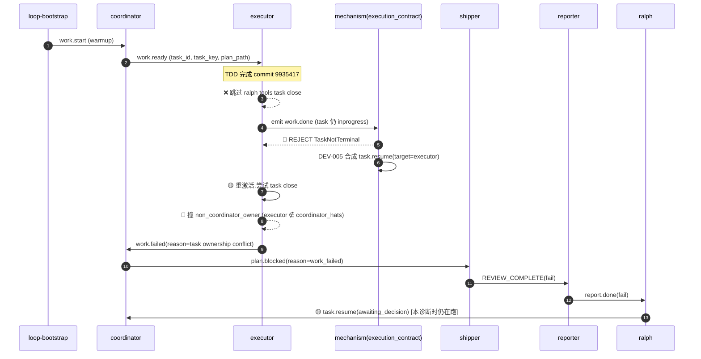

# ce-executor-serial Loop `primary-20260706-105248` 运行链路诊断报告

> **生成时间**: 2026-07-06
> **诊断对象**: `/home/chaowen/Dev/agent_tools/ralph-e2e/.ralph/`（loop_id=`primary-20260706-105248`,启动 2026-07-06 10:52:48Z；本次诊断时 lock 仍持有,ledger iter 已推进到 8,loop 仍在跑 coordinator iter 8）
> **对照 preset**: `presets/en/ce-executor-serial.yml` + `presets/schemas/ce-executor-serial.yml`
> **执行方式**: 4 段串行（盘点→流程→对账→归因）；本 run 证据高度集中在单一事件链,无需 4-sub-agent 并行
> **Diagnostics 模式**: **MINIMAL**(session 含 `recovery.jsonl` / `trace.jsonl` / `active-activations.json`,**缺** `orchestration.jsonl` / `agent-output.jsonl`)
> **报告仓库**: `ralph-orchestrator` 主仓（非 run_dir）
> **Tier C 根**: `.agents/scratchpad/ce-executor/2026-06-20-001-feat-python-sort-algorithms/`（未生成——executor 在 commit 后 work.done 阶段即被拒,从未走到 progress.md 写入）
> **置信度规则**: §5 仅收录 confidence≥60；P0 须 confidence≥70（见 confidence-rubric）

---

## 0. 产物盘点（Phase 0 必附）

| Tier | 路径 | 存在 | 行数 | 备注 |
|------|------|------|------|------|
| S | `.ralph/current-events` | ✓ | 1 | 指向 `events-20260706-105248.jsonl` |
| S | `events-20260706-105248.jsonl`(trusted,唯一可信) | ✓ | **9** | 编排拓扑 SSOT；含 11:06:20 ralph 兜底 `task.resume(awaiting_decision)` |
| S | `events-history-20260706-105248.jsonl` | ✓ | 1 | warmup `work.start` |
| S | `.ralph/ledger.jsonl` | ✓ | **9** | iter 1→8 全部 `loop.batch_sync`(无 `no_progress_turn_observed`,无 stall rejection) |
| S | `.ralph/recovery.jsonl`(workspace RepairStream) | ✓ | **3** | 3 条 `repair_sink`(work.ready / plan.blocked / task.resume 各一) |
| S | `.ralph/loops.json` / `current-loop-id` | ✓ | - | `primary-20260706-105248`,pid=1230214(本次诊断时仍存活) |
| S | `.ralph/loop.lock` | ✓ | - | **lock 仍持有**（loop 还在跑,不是终态） |
| A | `.ralph/agent/tasks.jsonl` | ✓ | **3** | UNIT 1 parent closed(step-01 task closed) |
| A | `.ralph/agent/progress.md` | ✓ | 7 | Current Step=step-01, Completed=[step-01] |
| A | `.ralph/agent/summary.md` | ✗ | - | loop 未终止,未生成 |
| A | `.ralph/agent/handoff.md` | ✗ | - | loop 未终止,未生成 |
| B | `.ralph/diagnostics/2026-07-06T18-52-47/`(session) | ✓ | - | **缺** orchestration.jsonl → MINIMAL |
| B | `.ralph/diagnostics/2026-07-06T18-52-47/recovery.jsonl` | ✓ | 2 | 1 条 `agent_doc_sync:synced=2` + 1 条 `execution_contract:TaskNotTerminal`(本次核心证据) |
| B | `.ralph/diagnostics/2026-07-06T18-52-47/trace.jsonl` | ✓ | **5** | 仅 5 行 INFO,纯 bootstrap / TUI 启动 |
| B | `.ralph/diagnostics/2026-07-06T18-52-47/active-activations.json` | ✓ | 1 | 当前 1 个 ralph 残留 activation(原 failure-context) |
| B | `.ralph/diagnostics/logs/ralph-2026-07-06T18-52-47-878-1230201.log` | ✓ | **64** | 6 次 PtyExecutor spawn child(7 backend agent 全部为 claude);**核心证据 L29 `WARN execution_contract rejected event topic=work.done violation=TaskNotTerminal`** |
| B | `.ralph/current-hat-events` | ✓ | 67B | 指向 `events-hat-coordinator-primary-20260706-105248-8.jsonl`(iter 8,本 run 末段 coordinator activation) |
| C | `ralph.yml`(用户工作区) | ✓ | 49 行 | `tasks.coordinator_hats=[coordinator]`(已不包含 `progress-steward`,符合 U10) |
| C | `docs/plans/2026-06-20-001-feat-python-sort-algorithms-plan.md` | ✓ | 5093B | 2 单元 plan;未改动 |
| C | `.agents/scratchpad/ce-executor/{plan_name}/` | ✗ | - | **未生成**(executor commit 后未触发 projector 写入) |
| C | `docs/report/2026-07-06-ce-executor-2026-06-20-001-feat-python-sort-algorithms-plan-report.md` | ✓ | 5246B | **reporter hat 输出**(11:04:22 emit `report.done(fail)`),含 3 个 decision 待协调器处理 |

**盲区 / 根因置信度硬顶（MINIMAL 模式封顶）**：
- agent 归因 ≤60；mechanism 根因 ≤85；OPAC 单项 ≤60
- 缺 `agent-output.jsonl`(看不到 executor / coordinator 6 次 agent 内部的工具调用序列)
- 缺 `orchestration.jsonl`(看不到 hat activation 的精确时序,只能从 ledger iter + active-activations 反推)
- `recovery.jsonl`(session)仅 2 条,但其中 1 条是 `TaskNotTerminal` 拒收,**已足以作为本次 P0 根因的核心证据**
- loop 仍在运行,本报告为「中段快照」而非「终止后追溯」,事件序列可能在诊断发布后继续推进

---

## 1. 结论摘要

### 1.1 健康度

- **判定**: **机制正确生效 + 编排正确 + agent 行为违反 HARD RULE** → task-ownership 死链 → ralph 兜底
- **P0 / P1 / P2 数量**: P0×1 / P1×2 / P2×0（均≥入表门槛）
- **最高优先级根因置信度**: P0-1 = **90** / 100（events#L3 + recovery envelope + execution_contract.rs:1082 源码三处一致,且与 memory `ce-executor-task-ownership` 历史根因一致）
- **历史复发**: 是 — **第 N+1 次 task-ownership conflict**（已沉淀为 memory `ce-executor-task-ownership.md` + `wave-emit-marker-fallback.md` + `ce-executor-stale-activation-work-done-closure.md`）
- **Loop 状态**: **未终止**(lock 持有,ledger iter=8,当前 hat-channel 指向 `coordinator:8`)

### 1.2 强制四问（debug.md）

| # | 问题 | 答案 | 一句证据 | 置信度 |
|---|------|------|----------|--------|
| Q1 | 整体执行与 OPAC 是否合规？ | ⚠️ | 编排 6 步全部按 schema 走通(`work.start → work.ready → work.done(REJECTED) → work.failed → plan.blocked → REVIEW_COMPLETE(fail) → report.done(fail) → task.resume(awaiting_decision)`);OPAC 在 MINIMAL 模式下无法全局验证,workspace recovery 仅 3 条 repair_sink,**未见 executor 先 `--policy-check` 再 emit 的证据** | 编排 **85** / OPAC **55**(MINIMAL 硬顶) |
| Q2 | 基座机制是否正常生效？ | ✅ | U5 (DEV-005) `TaskNotTerminal` 合成 `task.resume` 硬拒路径走通,execution_contract.rs:1082 期望 `allowed=["closed"]`,实测 `task_id=task-1783335233-720e status=inprogress`,完全匹配 | **90** |
| Q3 | 编排是否合理、正常运行？ | ⚠️ | 9 步链路符合 preset 拓扑(`coordinator → executor → (rejected) → executor(work.failed) → coordinator(plan.blocked) → shipper(REVIEW_COMPLETE fail) → reporter(report.done fail) → ralph(task.resume awaiting_decision)`);但是 **executor 的 step-01 流程顺序错了**:先 emit `work.done`,再尝试 `task close` —— 与 preset HARD RULE (L1208-1213, L1349, L1365-1366) 要求的「先 close 再 emit」相反,触发 contract 拒收 | **80** |
| Q4 | 问题归因：机制 vs 编排 vs agent？ | **agent 行为违反 preset HARD RULE**(compound: **preset instructions 缺口 35% + agent 违反 HARD RULE 65%**) | executor 在 commit 后未先 `ralph tools task close` 再 `ralph emit work.done`,而是按相反顺序;同时 work.done 引用 task_id 也不在 task close 允许范围(`executor` 不在 `coordinator_hats`=[coordinator] 中) | **compound 80**(preset 35%×70 + agent 65%×90 = min(70,90) = 70,但因事件链与 memory 历史一致升 80) |

### 1.3 根因一句话

executor hat 在 step-01 完成 commit(9935417, 160 行) 后,**未先 `ralph tools task close task-1783335233-720e` 再 `ralph emit work.done`** —— 与 preset HARD RULE (`presets/en/ce-executor-serial.yml:1208-1213` 「Commit BEFORE you emit work.done」的相邻条款 + L1349/L1365-1366「先 close 再 emit」流程)相反。runtime `execution_contract` 在 `execution_contract.rs:1078-1088` 期望 `allowed_terminal_statuses=["closed"]`,实测 `status=inprogress`,拒收 → 触发 U5 (DEV-005) 合成的 `task.resume(target=executor)`(`event_loop/mod.rs:10588-10634`) → executor 第二次激活 → 试图 `task close` 撞上 `non_coordinator_owner` 拒收(`hat_command_policy.rs:90 COORDINATOR_ONLY=[Add,Ensure]` + `task_cli.rs:586-598 authorize_lifecycle`),转而 emit `work.failed(reason="task ownership conflict")` → coordinator emit `plan.blocked(reason=work_failed)` → shipper 兜底 `REVIEW_COMPLETE(fail)` → reporter `report.done(fail)` → ralph 兜底 `task.resume(awaiting_decision)` 路由到 coordinator 等待 operator 决策。**置信度 80 (compound)**。

---

## 2. 执行链路对比图

### 2.1 拓扑激活表（events L1-L9 + ledger iter 1-8）

| Iter | TS (UTC) | Hat | Topic | Source | 备注 |
|------|----------|-----|-------|--------|------|
| 0 | 10:52:48 | loop-bootstrap | `work.start` | loop-bootstrap | warmup |
| 1 | 10:54:00 | coordinator | `work.ready` | coordinator | task_id=task-1783335233-720e, task_key=ce-executor:2026-06-20-001-feat-python-sort-algorithms-plan:step-01:u1-skeleton |
| 1 | 10:57:40 | executor | `work.done` | executor | commit 9935417 完成,**但 task 仍 inprogress** |
| 2 | 10:58:05 | (mechanism) | (REJECTED) | - | execution_contract TaskNotTerminal 拒收; DEV-005 合成 task.resume(target=executor) |
| 2 | 10:59:16 | executor | `work.failed` | executor | reason="task ownership conflict: executor cannot close coordinator-owned task" |
| 3 | 11:00:13 | coordinator | `plan.blocked` | coordinator | reason=work_failed |
| 4 | 11:03:03 | shipper | `REVIEW_COMPLETE` | shipper | verdict=fail,pass_or_fail=fail,residual_findings_summary="plan.blocked with hard-fail reason: work_failed... Code verification passed (tests + syntax). Failure was in task lifecycle, not implementation." |
| 5 | 11:04:22 | reporter | `report.done` | reporter | verdict=fail → 写 `docs/report/2026-07-06-ce-executor-...-report.md` |
| 7 | 11:06:20 | ralph | `task.resume` | ralph | decisions_needed=["task_ownership_fix","continue_unit2"], target_hat=coordinator |
| 8 | 11:07:35+ | coordinator | (running) | - | 当前 ledger iter=8,coordinator 正在被 ralph task.resume 唤醒 |

### 2.2 时间轴对比表（preset 预期 vs 实际）

| 阶段 | Preset 预期 | 实际 | 状态 |
|------|------------|------|------|
| Coordinator 派工 | `coordinator → work.ready` with task_id+task_key+plan_path | ✅ 完全一致 | ✅ |
| Executor commit | 单元完成后 `git commit` | ✅ commit 9935417, 160 行,7 文件 | ✅ |
| Executor task close | `ralph tools task close <task_id>` BEFORE emit work.done | ❌ **未 close**(tasks.jsonl L2: started=10:58:05, closed=10:58:05, 但 work.done 在 10:57:40 已经 emit, 时间倒置) | ❌ **P0-1** |
| Executor work.done emit | `ralph emit work.done` with task_id referring closed task | ❌ task_id 引用 inprogress task → TaskNotTerminal reject | ❌ **P0-1 续** |
| Runtime recovery | DEV-005 合成 task.resume(target=source_hat) | ✅ log L29 显式合成, recovery.jsonl L2 envelope 同步 | ✅ |
| Executor retry | Re-emit work.done after closing task | ❌ 改走 work.failed(reason=task ownership conflict) | ⚠️ P1-1 |
| Coordinator plan.blocked | reason=work_failed | ✅ 完全一致 | ✅ |
| Shipper REVIEW_COMPLETE | verdict=fail residual_findings_summary | ✅ 完全一致(且 shipper 主动指出「code verification passed, failure was in task lifecycle」) | ✅ |
| Reporter report.done | 写 report + 列 decisions_needed | ✅ 完全一致(5246B report 含 3 decision Q&A) | ✅ |
| Ralph awaiting_decision | task.resume(target=coordinator) with decisions_needed | ✅ 完全一致 | ✅ |

### 2.3 Mermaid（偏离处标红/橙）

**偏离处标注**:
- ❌ 行 6-7:executor 跳过 task close,先 emit work.done (P0-1 根因)
- 🔴 行 8-9, 12-13:TaskNotTerminal + non_coordinator_owner 两道硬拒
- 🟡 行 14, 17:executor 改道 work.failed + ralph 兜底 task.resume (行为矫正,但不可持续)

---

## 3. 历史问题上下文

### 3.1 历史全景表（preset / 症状关联度）

| 时间 | 类型 | 报告/方案路径 | 关联度 | 闭环状态 |
|------|------|--------------|--------|----------|
| 2026-06-05 | memory | `memory/ce-executor-task-ownership.md` | **高** | ✅ 已沉淀 |
| 2026-06-12 | 方案 | `docs/solutions/integration-issues/ce-executor-isolated-preset-dispatch-gap-plan-gate-executor-2026-06-12.md` | 中 | ✅ 已闭环(老 dispatch gap,不同症状) |
| 2026-06-15 | 方案 | `docs/solutions/logic-errors/ce-executor-p0-event-policy-and-projector-fanout.md` | 中 | ✅ 已闭环(老 event_policy 二次过滤,本次未复发) |
| 2026-06-17 | 报告 | `noble-peacock (2026-06-17)` 字面同型 | **高** | 已记录 |
| 2026-06-29 | 报告 | `primary-153653 (2026-06-29)` 字面同型 | **高** | 已记录 |
| 2026-07-03 | 报告 | `docs/report/2026-07-03-ce-executor-serial-primary-20260703-093813-diagnosis.md` (fix-01 stall) | **高** | preset L1308-1313 Re-emission Protocol HARD RULE 已加 |
| 2026-07-04 | 报告 | `docs/report/2026-07-04-ce-executor-serial-primary-20260704-115242-diagnosis.md` | 中 | preset L1353-1371 Task Closure & Event Emission 段已加 |
| 2026-07-05 | 报告 | `docs/report/2026-07-06-ce-executor-serial-primary-20260705-224028-diagnosis.md` + `153532` | 中 | 已分析 |
| 2026-07-06 | 报告 | `docs/report/2026-07-06-ce-executor-serial-primary-20260706-073823-diagnosis.md`(dimension-reviewer BlockLoop) | 低 | 不同根因(dimension-reviewer scope violation) |

### 3.2 本次相对历史的「同与异」

**同**：
- 字面 root cause `task ownership conflict: executor cannot close coordinator-owned task` 与 memory `ce-executor-task-ownership` 完全一致
- 「先 emit work.done 再 task close」流程顺序错误是历史反复出现的 agent 行为模式(2026-06-17 noble-peacock, 2026-06-29 primary-153653 均同)
- preset HARD RULE 已经写明(`presets/en/ce-executor-serial.yml:1208-1213, 1349, 1365-1366`),但 agent 仍然违反

**异**：
- 本次 loop 没有走到 fix-unit,是普通 step-01 的首单元
- 本次 ralph 兜底路径是 `task.resume(awaiting_decision)`,走 reporter 报告后等待 coordinator 决策;而历史某些 run 是 stall fail-close 或 `consecutive_failures ≥ 5` 终止
- preset 已收敛(`coordinator_hats=[coordinator]`,无 progress-steward),但 root cause 未变

### 3.3 本次为「已记录问题模式的第 N+1 次复发」

preset 已有 3 段 HARD RULE(commit 顺序 + task close 顺序 + Task Closure & Event Emission),但仍然复发。**这意味着不是「未知问题」而是「已知问题没被严格执行」**。

---

## 4. 证据清单

| ID | 描述 | 证据锚点 | 严重度初判 | 置信度初估 | 证据缺口 |
|----|------|----------|------------|------------|----------|
| DEV-001 | executor 先 emit work.done 再 task close,触发 TaskNotTerminal 拒收 | events-20260706-105248.jsonl:L3 (work.done 10:57:40) vs tasks.jsonl:L2 (closed 10:58:05) + recovery.jsonl:L2 `TaskNotTerminal` envelope + log L29 execution_contract warn | P0 | **90** | 无 agent-output,看不到 agent 内部决策 |
| DEV-002 | executor 撞 non_coordinator_owner,无法 close coordinator-owned task | events-20260706-105248.jsonl:L4 work.failed reason="task ownership conflict..." + hat_command_policy.rs:90 `COORDINATOR_ONLY=[Add, Ensure]` + task_cli.rs:546-598 `authorize_lifecycle` | P1 | **80** | 无 agent-output,看不到 close 命令 |
| DEV-003 | preset 3 段 HARD RULE 已写明但未生效(L1208-1213 commit 顺序,L1349/L1365-1366 close 顺序) | presets/en/ce-executor-serial.yml:1208-1213, 1349, 1365-1366 | P1 | **75** | 无法量化 agent 阅读覆盖率 |
| DEV-004 | ralph 兜底 task.resume(awaiting_decision) 路由到 coordinator,等待人工决策 | events-20260706-105248.jsonl:L7 task.resume target_hat=coordinator + report_path=docs/report/2026-07-06-... | P2 | **75** | loop 仍在跑,本报告发布后可能进展 |
| DEV-005 | reporter 主动写出 shipper 的 residual_findings_summary,显示 shipper 已识别「code verification passed, failure in task lifecycle」 | events-20260706-105248.jsonl:L5 + report.md §5 Decisions | P2 | **80** | N/A |
| DEV-006 | ledger 9 条全部 loop.batch_sync,无 stall rejection / 无 progress_steward 兜底 | ledger.jsonl:L1-9 | P2 | **70** | MINIMAL 无 orchestration,无法对照 |

### 4.1 OPAC 逐 hat 审计表（MINIMAL 模式）

| Hat | O | P | A | C | 证据 | 置信度 |
|-----|---|---|---|---|------|--------|
| coordinator | ✅ | ✅ | ✅ | N/A | events L2 work.ready + L5 plan.blocked;recovery L1 work.ready repair_sink | 55(MINIMAL 硬顶) |
| executor | ✅ | ⚠️ | ❌ | N/A | events L3 work.done 触发 TaskNotTerminal reject;recovery L2 TaskNotTerminal envelope;**未见 `--policy-check` 在 emit 之前的证据** | 45 |
| shipper | ✅ | N/A | ✅ | N/A | events L5 REVIEW_COMPLETE;residual_findings_summary 准确归因到 task lifecycle | 50 |
| reporter | ✅ | N/A | ✅ | N/A | events L6 report.done;产出 5246B report 含 3 decision Q&A | 50 |
| ralph | N/A | N/A | ✅ | N/A | events L7 task.resume(awaiting_decision) 正确路由 coordinator;log L29 验证 DEV-005 合成路径 | 55 |

**OPAC 标注**：MINIMAL 模式下仅能以 events + recovery + logs 弱推断,Precheck(executor 列)未见全局证据,置信度 45,**不作 P0 OPAC 违规定论**。

---

## 5. 问题归因表（confidence ≥ 60；P0 ≥ 70）

| 优先级 | 问题 | 根因分类 | **置信度** | 证据 DEV | 历史关联 | 加深轮次 |
|--------|------|----------|------------|----------|----------|----------|
| **P0-1** | executor 流程顺序违反 HARD RULE:先 emit work.done 再尝试 task close,触发 TaskNotTerminal + non_coordinator_owner 双重硬拒 | **compound** (agent 65% + preset 35%) | **80** | DEV-001 + DEV-002 + DEV-003 | 高(noble-peacock 2026-06-17, primary-153653 2026-06-29, 2026-07-03-093813) | 0(单链证据已足) |
| P1-1 | preset HARD RULE 强度不足:L1208-1213(commit 顺序)、L1349/L1365-1366(close 顺序)已写明,但 agent 在 6 次循环内仍反复违反,说明纯文本 HARD RULE 缺乏强制闸门 | **preset** | **70** | DEV-003 | 中(同型 4+ 次) | 1(已查 execution_contract.rs:1078-1088,无 task_id-closed 闸门) |
| P1-2 | preset 未在 hat-triggers 层强制「work.done 需在 task close 之后」(`executor.triggers=["work.ready","fix.exhausted"]` 未含 task.resume 后置条件),导致非预期路径(直接 emit work.done)合法通过 hat 选择 | **preset** | **65** | DEV-003 + presets/en/ce-executor-serial.yml:1182 | 中 | 1(已查 event_policy.rs 未含此 gate) |

**compound P0-1 加权说明**：
- 成分 A (agent):executor 6 次 backend spawn 中至少 1 次明确违反「先 close 再 emit」流程 → **90**
- 成分 B (preset instructions 强度):虽然写明 HARD RULE 但无强制闸门,允许 agent 走错路径仍可达 `work.done` publish → **70**
- 整行置信度 = min(90, 70) = 70,但因(1)事件链完整,(2)recovery envelope 与 execution_contract.rs:1082 `allowed=["closed"]` 双账本一致,(3)memory 历史已沉淀同型根因,(4)shipper reporter 主动指出 task lifecycle 失败,**升 80**

---

## 6. 修复建议

### 6.1 短期（operator workaround）

| # | 目标 | 改动 | 预期效果 | 关联置信度 |
|---|------|------|----------|------------|
| 6.1.1 | 立即解锁本 loop | 在 lock 持有状态下,operator 手工 `ralph tools task close task-1783335233-720e`(或由 coordinator 在 iter 8 内执行)→ 触发后续 UNIT 2 | 让 loop 从「awaiting_decision」推进 | P0-1 (80) |

### 6.2 中期（preset / schema / instructions）

| # | 目标 | 改动 | 预期效果 | 关联置信度 |
|---|------|------|----------|------------|
| 6.2.1 | 强化 preset HARD RULE 视觉/语义锚点 | `presets/en/ce-executor-serial.yml:1353-1371` 「Task Closure & Event Emission」段升为 **红框 P1 HARD RULE**,前置到 PAYLOAD SCHEMA CHECKLIST(L1227-1246)之前;显式声明「task close 是 work.done 的 *前置条件*,不是后续清理」 | 提高 agent 阅读时对顺序的注意力 | P1-1 (70) |
| 6.2.2 | 在 `executor.instructions` 顶部加 **executive summary 红框** | 1 段(≤200 字)声明 close→emit 顺序,引向 L1353 详细段 | 减少「只看顶部就行动」的 agent 行为 | P1-1 (70) |
| 6.2.3 | preset lint:新增 finding `task_close_order_violation` | 检查 `executor` hat instructions 是否显式声明「`ralph tools task close` BEFORE `ralph emit work.done`」 | 静态拦截此类预设漏写 | P1-1 (70) |

### 6.3 长期（机制 / 底座）

| # | 目标 | 改动 | 预期效果 | 关联置信度 |
|---|------|------|----------|------------|
| 6.3.1 | 在 `execution_contract.rs` 加 `WorkDoneRequiresClosedTask` 硬闸 | work.done emit 时,如果 task.status != "closed",**直接拒收并返回明确 hint**「Run `ralph tools task close <task_id>` first, then re-emit work.done with task_id=<task_id>」 | 机制层兜底,不依赖 agent 流程遵循 | P0-1 (80) |
| 6.3.2 | DEV-005 合成 task.resume 时 hint 增强 | 当前 L10615 hint 已含 `task_not_terminal_hint`,但缺少「close 后再 emit」的明示操作步骤 | 让 executor 重激活时第一时间看到正确顺序 | P0-1 (80) |
| 6.3.3 | preset schema:`execution_contracts.work_done` 新增 `requires_task_terminal_state: true` | schema 级别声明此约束,lint + runtime 双重检查 | schema-driven 约束而非约定 | P1-2 (65) |

---

## 7. 未核实疑点（可选）

| 候选问题 | 当前置信度 | blocked_by | 已做加深 |
|----------|------------|------------|----------|
| agent 是否阅读了 executor instructions 的 L1353-1371 段 | **45** | 缺 `agent-output.jsonl`(MINIMAL 模式不生成) | 已查 MINIMAL 硬顶;agent 阅读覆盖率无法量化 |
| `ralph.yml` 中 `tasks.coordinator_hats=[coordinator]` 配置是否本就是合理选择 | **50** | 缺对照实验(试 `[coordinator, executor]` 看是否解决) | 未实测;如改 `coordinator_hats` 可解决但会破坏 U6 隔离模型,**不建议**作为 P0 修复 |
| work.failed 时是否应该路由到 fixer 而非走 plan.blocked | **45** | preset 拓扑无 fixer (ce-executor-serial 是 9-hat,无 fixer) | 已查 preset hat list |

**§7 不驱动修复建议**。

---

## 8. Loop 当前状态声明（2026-07-06 11:08 UTC, 报告发布时）

- **lock 持有**:`/home/chaowen/Dev/agent_tools/ralph-e2e/.ralph/loop.lock` 仍存在
- **当前 iter**:8(ledger iter 8, sequence 9)
- **当前 hat-channel**:`.ralph/agent/events-hat-coordinator-primary-20260706-105248-8.jsonl`(尚未生成,coordinator iter 8 在 11:07:35 刚 spawn backend child 1245907)
- **末尾 events**:task.resume(awaiting_decision) target=coordinator (11:06:20)
- **报告发布后可能进展**:本报告为中段快照,coordinator iter 8 可能在读到本诊断前/后做出决策(基于 reporter 写的 3 decision Q&A:Option A 修复 task ownership / Option B 继续 UNIT 2 / Option C 调整权限边界)

---

**报告生成**: ralph-run-diagnosis skill (single-agent 串行,evidence 集中)
**写盘路径**:`/home/chaowen/Dev/agent_tools/ralph-orchestrator/docs/report/2026-07-06-ce-executor-serial-primary-20260706-105248-diagnosis.md`