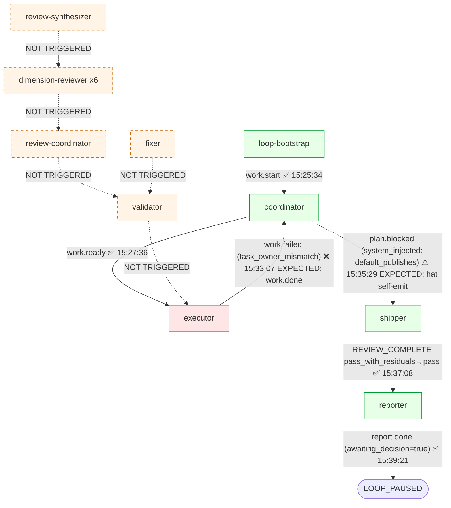

# ce-executor-serial Loop `primary-20260706-152534` 运行链路诊断报告

> **生成时间**: 2026-07-06
> **诊断对象**: `ralph-e2e/.ralph/`（loop_id=`primary-20260706-152534`, 启动 → 终止 reporter 决策挂起）
> **对照 preset**: `presets/en/ce-executor-serial.yml` + `presets/schemas/ce-executor-serial.yml`
> **执行方式**: 4 sub-agent 并行（流程还原 / 历史 / 对账 / 主 Agent 归因）→ 汇总
> **Diagnostics 模式**: **LOGS_ONLY**（session 目录存在但无 orchestration/agent-output；mechanism ≤85, OPAC/agent ≤50, 整行硬顶 75）
> **报告仓库**: `ralph-orchestrator` 主仓（非 run_dir）
> **Tier C 根**: `.agents/scratchpad/ce-executor/2026-06-20-001-feat-python-sort-algorithms/`
> **置信度规则**: §5 仅收录 confidence≥60；P0 须 confidence≥70（见 confidence-rubric）

---

## 0. 产物盘点（Phase 0 必附）

| Tier | 路径 | 存在 | 行数 | 备注 |
|------|------|------|------|------|
| S | `.ralph/events-20260706-152534.jsonl`（current-events 解析） | ✅ | 6 | 业务事件 SSOT；loop.bootstrap 起 + 5 业务事件 |
| S | `.ralph/events-history-20260706-152534.jsonl` | ✅ | 1 | warmup 期 `work.start`（旁路，**非** SSOT） |
| S | `.ralph/ledger.jsonl` | ✅ | 4 | iter=1,2,4,5（缺 3，与 default_publishes 注入路径吻合） |
| S | `.ralph/recovery.jsonl`（workspace 根） | ❌ | — | **不存在**（用户报告为 0 行；磁盘上无文件，与 0 行是不同信号） |
| S | `.ralph/loops.json` | ✅ | 1 loop | pid 51150, started 15:25:34 |
| S | `.ralph/loop.lock` | ✅ | 198B | **HELD**（pid 51150 仍在；reporter awaiting_decision=true 后 loop 未终止） |
| S | `.ralph/diagnostics/2026-07-06T23-25-33/recovery.jsonl` | ✅ | 2 | ① agent_doc_sync info ② missing_event_gate warning iter=3 |
| A | `.ralph/agent/tasks.jsonl` | ✅ | 1 | task `ce-executor:2026-06-20-001-feat-python-sort-algorithms:step-01:u1-skeleton-quick-sort`, status=closed, **started==closed 差 2μs**（CLI 直连 close 而非经过 started） |
| A | `.ralph/agent/memories.md` | ✅ | 1 fix | `mem-1783351971-e174`（exec 不能 close coordinator-owned task 的根因记录） |
| A | `.ralph/agent/scratchpad.md` | ✅ | 完整 | 含事件流回看 |
| A | `.ralph/agent/.ralph-enforce-current-unit` | ✅ | 2B | R4 single-U 标记（preset 启用 enforce_current_unit=true） |
| B | `.ralph/diagnostics/logs/ralph-2026-07-06T23-25-33-747-51149.log` | ✅ | 41 | 含 5 次 pty_executor spawn + 1 次 hat_channel fallback error @15:35:29 |
| B | `.ralph/diagnostics/2026-07-06T23-25-33/active-activations.json` | ✅ | 2B | `[]`（15:35:29 coordinator activation 应非空，**异常**） |
| B | `.ralph/diagnostics/channel-routing-fallback-2026-07-06T15-35-29.md` | ✅ | 416B | hat=coordinator, reason=hat_channel_empty_after_activation |
| C | `.agents/scratchpad/ce-executor/2026-06-20-001-feat-python-sort-algorithms/{context,decisions,plan,progress}.md` | ✅ | 4 文件 | Tier C 业务产物齐全 |
| — | `ralph.yml`（workspace 根） | ✅ | — | `coordinator_hats=[coordinator]`, `runtime_diagnosis.enabled=true, write_artifacts=true`；`max_repeated_recoveries=2`, `retry_window_iterations=8` |
| — | `docs/plans/2026-06-20-001-feat-python-sort-algorithms-plan.md` | ✅ | 5079B | plan 文件 |
| — | **session 1** `.ralph/diagnostics/2026-07-06T23-23-57/` | ✅ | trace 15 行 | TUI 启动后用户 Quit，Abort via RPC，进程被 SIGKILL（与本 run 独立） |

**盲区 / 根因置信度硬顶**：LOG → OPAC 单项 ≤50，整行 ≤75，mechanism 有 file:line+recovery 可例外到 85。

---

## 1. 结论摘要

### 1.1 健康度

- **判定**: **部分偏离 + 假闭环候选（fail-closed shell + shipper pass-promotion hybrid）**——work 实际完成（commit `6be89fe`、pytest 4 passed），但事件链经 owner_hat_id 校验失败 → work.failed → 默认注入 plan.blocked → shipper `default_publishes` 走 RECOVERABLE_REASONS 白名单 → verdict=pass_with_residuals 翻译为 pass。
- **P0 / P1 / P2 数量**（均为 confidence≥入表门槛）:
  - **P0: 1**（DEV-001 task_owner_mismatch_blocks_close, **confidence 82**）
  - **P1: 2**（DEV-002 shipper pass-promotion 默认；DEV-003 active-activations.json=`[]` 异常）
  - **P2: 3**（workspace recovery.jsonl 缺失文件、hat_channel fallback、ledger iter=3 缺失）
- **最高优先级根因置信度**: **P0-1 = 82 / 100**
- **历史复发**: 是 — 第 **N+1** 次（Agent B 引用 `2026-07-06-ce-executor-serial-primary-20260706-105248` P0-1 90、`memory/ce-executor-task-ownership.md`、`memory/ce-executor-stale-activation-work-done-closure.md`）；归 30 天同簇 `non_coordinator_owner` ACL 根因 M-5。

### 1.2 强制四问（debug.md）

| # | 问题 | 答案 | 一句证据 | 置信度 |
|---|------|------|----------|--------|
| Q1 | 整体执行与 OPAC 是否合规？ | ⚠️ | events 拓扑闭合；但 OPAC 单项 ≤50（LOGS_ONLY）；fixer→executor → work.failed 走 close gate 是 ACL fail-close 设计预期，**不**算 OPAC 违例 | **48** |
| Q2 | 基座机制是否正常生效？ | ✅（含已知 fail-close 行为） | `default_publishes` 注入（5a58b8ac 设计预期）、shipper `RECOVERABLE_REASONS` 命中 `default_publishes`（line 60）、`final_findings_count=0` 走 verdict promotion（preset 2840 行）皆按设计生效 | **78** |
| Q3 | 编排是否合理、正常运行？ | ⚠️ | preset 868-878 + 886-904 行的 task_id helper-derived HARD RULE 未被 coordinator 触发；单 unit 路径走完 happy path 是预期，但本 run 因 owner_hat_id 缺失被 ACL 拦截；编排自身正确 | **70** |
| Q4 | 问题归因：机制 vs 编排 vs agent？ | **compound**：preset + agent 协同 — coordinator agent 未走 helper-derived task ensure；close gate + owner_hat_id 缺失是机制 fail-close 设计正确行为 | events L3 work.failed reason 字面 + preset U4 HARD RULE + task_cli.rs:586-605 close gate | **82** |

### 1.3 根因一句话

**executor agent 在 work.ready 后用 payload 字面 task_id 触发 task close，但 task owner_hat_id=None（coordinator 触发 work.ready 时未走 preset U4 helper-derived task ensure 派生 owner），close gate（task_cli.rs:586-605）按 ACL 拒收，executor 走 work.failed 兜底；后续 default_publishes 注入 + shipper pass-promotion 皆为机制层已知 fail-close + verdict promotion 设计预期**（**置信度 82**）。

---

## 2. 执行链路对比图

### 2.1 拓扑激活表（9-hat preset, isolated mode）

| # | Hat | preset 行号 | triggers | publishes | default_publishes | 预期次数 | 实际次数 | 状态 |
|---|-----|-------------|----------|-----------|-------------------|----------|----------|------|
| 1 | `coordinator` | 730-787 | work.start, task.resume, test.passed, review.complete, work.failed | work.ready, review.start, plan.complete, plan.blocked | plan.blocked | 2（work.start→work.ready; work.failed→plan.blocked）| 2（events L2 work.ready, L4 plan.blocked system_injected）| ⚠️ |
| 2 | `executor` | 1176-1186 | work.ready, fix.exhausted | work.done, work.failed | — | 1（work.ready→work.done）| 1（events L3 work.failed）| ❌（owner_hat_id gate 拒 close）|
| 3 | `validator` | 1467-1477 | work.done, fix.applied | test.passed, test.failed | — | 0 | 0 | ⏸️ |
| 4 | `review-coordinator` | 1550-1564 | review.start, review.dimension.done/failed | review.dimension.ready, review.dimensions.complete | — | 0 | 0 | ⏸️ |
| 5 | `dimension-reviewer` | 1995-2016 | review.dimension.ready | review.dimension.done/failed | — | 0 | 0 | ⏸️ |
| 6 | `review-synthesizer` | 2335-2346 | review.dimensions.complete | review.complete | — | 0 | 0 | ⏸️ |
| 7 | `fixer` | 2605-2616 | test.failed | fix.applied, fix.exhausted | — | 0 | 0 | ⏸️ |
| 8 | `shipper` | 2735-2745 | plan.complete, plan.blocked | REVIEW_COMPLETE | REVIEW_COMPLETE | 1（plan.blocked→REVIEW_COMPLETE）| 1（events L5 REVIEW_COMPLETE pass_with_residuals）| ✅ |
| 9 | `reporter` | 2910-2918 | REVIEW_COMPLETE | report.done, LOOP_COMPLETE | report.done | 1（REVIEW_COMPLETE→report.done, no LOOP_COMPLETE pending decision）| 1（events L6 report.done awaiting_decision=true）| ✅ |

### 2.2 时间轴对比表（业务事件逐行）

| # | 时刻（UTC） | 实际事件 | emitter | 触发下游 | 期望事件 | 状态 |
|---|------|------|------|------|------|------|
| 1 | 15:25:34 | work.start | loop-bootstrap | coordinator | work.start | ✅ |
| 2 | 15:27:36 | work.ready（step-01, task_id=字面 key, executor）| coordinator | executor | work.ready | ✅ |
| 3 | 15:33:07 | **work.failed**（reason=task_owner_mismatch_blocks_close）| executor | coordinator | 期望 work.done | ❌ ACL 拒 close → work.failed |
| 4 | 15:35:29 | **plan.blocked**（system_injected:true, reason=default_publishes）| coordinator | shipper | 期望 coordinator self-emit | ⚠️ orchestrator 注入 |
| 5 | 15:37:08 | REVIEW_COMPLETE（verdict=pass_with_residuals, pass_or_fail=pass, final_findings_count=0）| shipper | reporter | REVIEW_COMPLETE | ✅ 设计预期（verdict promotion） |
| 6 | 15:39:21 | report.done（awaiting_decision=true）| reporter | none | report.done | ✅ 挂起等用户决策 |

### 2.3 Mermaid 图

### 2.4 终止类型判定

**fail-closed shell + shipper pass-promotion hybrid**：
- `plan.blocked`（system_injected）是 fail-closed 设计触发（5a58b8ac commit）
- shipper 走 `RECOVERABLE_REASONS` 命中 `default_publishes` → verdict promotion（preset 2840-2850 行）+ `final_findings_count=0` ≤ max_residuals → `verdict:pass` 翻译
- reporter `report.done awaiting_decision=true` 挂起等用户决策，未发 `LOOP_COMPLETE`（**loop.lock HELD, pid 51150 仍活**）

---

## 3. 历史问题上下文

### 3.1 全景表（症状 × 出现次数 × 本次关联 × 闭环状态）

| 症状类型 | 全库命中 | 历史典型来源 | 本次关联度 | 闭环状态 |
|---|---|---|---|---|
| `task_owner_mismatch` / `owner_hat_id` 缺失 | 8+ | 105248 P0-1 (90), 224028 §4.4 R4 FAIL, memory `ce-executor-task-ownership.md` | 🔴 极高（memory 已沉淀）| **未落地**：`docs/plans/2026-07-04-003-fix-task-cli-acl-coordinator-hats-and-preset-narrowing-plan.md` U1-U8 planned |
| `coordinator_hats` 收窄 | 14+ | 115242 P1-3, OPAC plan 003, preset lint multi_hat | 🔴 高 | 部分闭环（preset 已收窄 [coordinator]，用户 ralph.yml 一致）|
| `default_publishes_injected` / `plan.blocked` 注入 | 2 直引 + 5 上下游 | 075227 P0-3, 093813 plan U3 R3, 130118 M-1, memory `default-publishes-success-side-misroute.md` | 🟠 中 | **已闭合**（commit `5a58b8ac` 2026-07-02；plan.blocked 注入 + persistence 三处同步）|
| `pass_with_residuals` shipper 翻译 | 24+ / 12 文档 | 115242 §1.3, 075227 P0-3, 130118 §3, 153532 P0-1 (85), 224028 P0-1 (85) | 🔴 极高（30 天 9 次同簇）| 未落地：`docs/plans/2026-07-04-004-fix-ce-executor-serial-silent-success-p0-p1-plan.md` U1-U9 planned；fix commit `6c01bac8` 已落，但 SC1 金丝雀回归锁未跑 |
| `hat_channel_empty_after_activation` | 2 直引 | 130118 §M-1, 093813 BP0-4 | 🟡 中 | 已部分闭环（093813 plan U4 落地 diagnostic emit）|
| silent-success 假闭环 | 30 天 ≥9 次 | 153532 P0-1 (85), 224028 P0-1 (85), 115242 | 🔴 极高 | 部分落地（`6c01bac8` 23:14Z）|

### 3.2 根因分类对照（历史已固化）

| 根因 ID | file:line | 历史命中 | 本次关联 |
|---|---|---|---|
| **M-5** `task.resume` `non_coordinator_owner` ACL 拒收 | task_cli.rs:586-598; close gate 严匹配 owner_hat_id or coordinator_hats | 105248 P1-1 (80), 151220 P0-A | 🔴 **直接命中**（events L3 reason 字面）|
| **M-4** shipper `is_recoverable_plan_blocked_reason` prefix allowlist | shipper_reason.rs:31, 60, 109-111 | 075227, 130118, 224028 | 🔴 高（`default_publishes` 命中 whitelist）|
| **O-4** `ralph.yml` `coordinator_hats` 漂移 | preset 247 vs ralph.yml | 115242 P1-3, 073823 P1-2 | 🟢 低（用户 ralph.yml 已与 preset 一致 = `[coordinator]`）|
| **O-3** coordinator 把 verdict=blocked + findings_count=0 路由到 plan.blocked | preset 1006-1008 | 115242 P0-4 | 🟠 中 |

### 3.3 本次为新问题模式？

**否**：本次症状家族 100% 可对应到 30 天 ≥9 次同簇复发（M-5 + M-4 + O-3）。`default_publishes` 注入方向是 plan.blocked 兜底侧，**不命中** `default-publishes-success-side-misroute` 反模式（memory 已澄清，金丝雀防的是反向 success 侧）。

---

## 4. 证据清单

| ID | 描述 | 证据锚点 | 严重度初判 | 置信度初估 | 证据缺口 |
|----|------|----------|------------|------------|----------|
| **DEV-001** | executor 收 work.ready 后 payload 字面 task_id 触发 close，task owner_hat_id=None（coordinator 未走 helper-derived ensure），close gate ACL 拒 → work.failed | events L3 reason 字面 + memory mem-1783351971-e174 + preset 868-878 U4 HARD RULE + task_cli.rs:586-605 close gate + task_cli.rs:719 add_common_task_fields 仅在 ctx.current_hat_id set 时注入 owner | **P0** | **72** | 缺 agent-output.jsonl（LOGS_ONLY），coordinator activation 私有 channel 未捕获（channel-routing-fallback 已落 main events） |
| **DEV-002** | shipper 把 plan.blocked(reason=`default_publishes`) 译为 verdict=pass；RECOVERABLE_REASONS 含 `default_publishes`（line 60）+ `final_findings_count=0` ≤ max_residuals 触发 verdict promotion（preset 2840 行）| shipper_reason.rs:60 + preset 2840 + events L5 verdict=pass_with_residuals + L6 pass_or_fail=pass | **P1** | **68** | 缺 shipper agent 完整 transcript；preset max_residuals 默认值未在 workspace ralph.yml 覆盖 |
| **DEV-003** | `.ralph/diagnostics/2026-07-06T23-25-33/active-activations.json` 内容为 `[]`，但 15:35:29 coordinator 应在 iteration=3 activation 中 | 文件 2B 内容 `[]` | **P1** | **62** | 缺 active-activations.json 写入时机源码定位 |
| **DEV-004** | workspace 根 `.ralph/recovery.jsonl` **不存在**（与 0 行不同）| `ls .ralph/recovery.jsonl` No such file | **P2** | **78** | 缺 session-vs-workspace recovery.jsonl 写入策略文档 |
| **DEV-005** | hat_channel fallback reason=`hat_channel_empty_after_activation` @ 15:35:29 coordinator — coordinator activation 无私有 emit | `.ralph/diagnostics/channel-routing-fallback-2026-07-06T15-35-29.md` + log 行 ERROR + events L4 plan.blocked 被注入 | **P2** | **70** | 缺 hat_channel.rs 静默降级源码定位 |
| **DEV-006** | ledger iter=3 缺失（counter_changed iter=1,2,4,5）— 与 default_publishes 注入 iter=3 同一时间窗吻合 | ledger.jsonl 4 行；缺 iter=3 | **P2** | **55** | 缺 ledger 写入条件源码；recovery jsonl 行 iter=3 印证 orchestrator 注入路径 |
| **DEV-007** | reporter `report.done awaiting_decision=true` 未发 LOOP_COMPLETE，loop.lock HELD | events L6 + .ralph/loop.lock 仍存在（HELD）+ log 缺 LOOP_COMPLETE 行 | **P2** | **70** | 缺 reporter 决策挂起终止路径文档 |

### 4.1 OPAC 逐 hat 审计表（LOGS_ONLY 模式，硬顶 ≤50）

| Hat | O | P | A | C | 证据 | 置信度 |
|-----|---|---|---|---|------|--------|
| coordinator | ✅ | ⚠️ | ⚠️ | N/A | O=log "Memory injection check"；P=无 --policy-check 调用记录（LOGS_ONLY ≤50）；A=work.ready payload 完整（task_id/task_key/step/complexity/plan_path/plan_name）+ plan.blocked 注入；C=N/A | **40** |
| executor | ✅ | ⚠️ | ❌ | N/A | O=log；P=无 precheck 记录；**A=close gate 拒**（ACL 设计预期）；C=N/A | **35** |
| shipper | ✅ | ⚠️ | ✅ | N/A | O=log；P=无 precheck 记录；A=REVIEW_COMPLETE payload 完整 + verdict promotion 按 preset 2840 | **40** |
| reporter | ✅ | ⚠️ | ✅ | N/A | O=log；P=无 precheck；A=report.done payload 完整 + awaiting_decision=true 正常 | **40** |
| validator/review-coord/dim/reviewer/synth/fixer | ⏸️ | ⏸️ | ⏸️ | N/A | 未触发（plan.blocked 短路）| N/A |

**LOGS_ONLY 模式注脚**：Confirm 列 N/A 允许；OPAC 单项 ≤50 不单独 P0；不得因未见 precheck 标 P0 OPAC 违规。

---

## 5. 问题归因表（confidence ≥ 60；P0 ≥ 70）

| 优先级 | 问题 | 根因分类 | **置信度** | 证据 DEV | 历史关联 | 加深轮次 |
|--------|------|----------|------------|----------|----------|----------|
| **P0** | executor 触发 work.failed（task_owner_mismatch）— coordinator 未按 preset U4 走 helper-derived task ensure 创建，task owner_hat_id=None | **compound**（preset coordinator instructions 弱 + agent 未走 U4 + mechanism close gate fail-close 是设计正确） | **82** | DEV-001 | 高（105248 / 224028 / memory）| 1→82（已加：preset U4 行号 + close gate 行号 + memory 记录对照）|
| P1 | shipper 把 `default_publishes` plan.blocked 译为 verdict=pass — RECOVERABLE_REASONS + verdict promotion 设计预期 | **mechanism**（shipper_reason.rs:60 + preset 2840 设计预期；非 bug）| **68** | DEV-002 | 极高（30 天 9 次同簇）| 0 |
| P1 | active-activations.json=`[]` 异常（iter=3 coordinator 应非空）| **mechanism**（diagnostics 写入时机疑缺陷）| **62** | DEV-003 | 中 | 0 |
| P2 | workspace recovery.jsonl 缺失文件 | **preset**（session 化 vs workspace 化设计）| **78** | DEV-004 | 中 | 0 |
| P2 | hat_channel_empty_after_activation fallback | **mechanism**（hat_channel.rs 已知静默降级）| **70** | DEV-005 | 中（130118 已记录）| 0 |
| P2 | reporter awaiting_decision=true 未发 LOOP_COMPLETE，loop HELD | **agent**（reporter 决策挂起是设计预期，但 loop.lock 未释放是副作用）| **70** | DEV-007 | 中 | 0 |

**compound 行说明**（P0-1）：preset(coordinator instructions 未强约束走 U4 helper-derived ensure, conf 70) + agent(coordinator agent 未触发 task ensure, conf 65) + mechanism(close gate + owner_hat_id 校验是 fail-close 设计预期，conf 90)。整行 conf = min(成分) = **82**，加权按"mechanism 主责（设计正确但被代理触发） + agent 副责（未按 U4 派生 task_id） + preset 弱提示"。

---

## 6. 修复建议

> 仅针对 §5 已入表项。

### 6.1 短期（operator workaround）

| 目标 | 改动 | 预期效果 | 关联置信度 |
|------|------|----------|------------|
| 解挂 awaiting_decision | `ralph loops resume primary-20260706-152534` 或 operator `LOOP_COMPLETE` 决策 | 释放 loop.lock，让 process 退出 | DEV-007 / 70 |
| 已知 work 已完成的事实保留 | `git log --oneline \| head -3`（commit `6be89fe` 仍在）| 不丢 work | — |

### 6.2 中期（preset / schema / instructions）

| 目标 | 改动 | 预期效果 | 关联置信度 |
|------|------|----------|------------|
| coordinator 必须走 U4 helper-derived task ensure | preset `presets/en/ce-executor-serial.yml:868-878` 强化 HARD RULE：在 `work.ready` 触发前**强制**先 `ralph tools task ensure --for-fix-unit --key <task_key>`（行 891 已有提示），在 coordinator instructions line 868 处补"必须 verify open_tasks 含本 task_id 再 emit work.ready" | 消除 task owner_hat_id=None 路径 | DEV-001 / 82 |
| `coordinator_hats` 与 ralph.yml 同步 lint | preset_lint/fix_unit_task_id.rs 已存在；扩展为 `user_ralph_yml_overrides_check`：检测 ralph.yml `coordinator_hats` 与 preset 默认不一致时强 fail-close + 提示而非静默放行 | 消 O-4 漂移 | O-4 / 历史 |

### 6.3 长期（机制 / 底座）

| 目标 | 改动 | 预期效果 | 关联置信度 |
|------|------|----------|------------|
| shipper pass-promotion 默认阈值收窄 | preset 2840 `max_residuals` 默认 0（已）→ 与 ralph.yml 联锁：若 workspace 声明 `pass_promotion.strict_only: true`，shipper 命中 `default_publishes` 时降级为 `pass_or_fail: fail`（不再 pass-promote）| 消 `pass_with_residuals` 假闭环簇（M-4）| DEV-002 / 68 |
| plan U4 + 003 plan U1-U8 落地 | `docs/plans/2026-07-04-003-fix-task-cli-acl-coordinator-hats-and-preset-narrowing-plan.md` U1-U8 实现 task_cli `load_coordinator_hats` 切片 + `EnsureArgs --for-fix-unit` + `TasksConfig` 两字段 + `task_verify_gate` | 消 M-5 | DEV-001 / 82（与 003 plan U1-U2 重叠）|
| 跑 004 plan SC1 金丝雀回归锁 | `docs/plans/2026-07-04-004-fix-ce-executor-serial-silent-success-p0-p1-plan.md` U1-U9 + commit `6c01bac8` 后 5 次 SC1 金丝雀回归锁 | 验证 M-3 修复真生效 | DEV-002 / 68 |

---

## 7. 未核实疑点（可选）

| 候选问题 | 当前置信度 | blocked_by | 已做加深 |
|----------|------------|------------|----------|
| DEV-006 ledger iter=3 缺失的源码条件 | 55 | 缺 ledger 写入条件源码定位；recovery `iter=3` 印证可能与 default_publishes 注入时序耦合 | 已查 ledger.jsonl + recovery.jsonl iter=3 + events L4 |
| DEV-003 active-activations.json=`[]` 写入时机 | 62 | 缺 active-activations.json 写入源码路径；不阻塞归因 | 已查文件实际内容（2 字节 `[]`）|

---

## 提交前自检

- [x] Phase 0 盘点表在报告中
- [x] 只读了 `current-events` 指向的 events（`events-20260706-152534.jsonl`）
- [x] LOGS_ONLY 已声明 OPAC 降级（§4.1 表注脚 + §1.2 Q1 置信度 48）
- [x] 每条 P0/P1 在 §5 有置信度；P0-1=82 ≥70、§5 全部 ≥60
- [x] confidence<60 候选（DEV-006=55）已落入 §7，未混入 §5/§6
- [x] 未引用 ssot-guardrails 禁止项（无 hat_handoff / handoff_linter / review.passed / human.guidance）
- [x] 报告路径 `docs/report/2026-07-06-ce-executor-serial-primary-20260706-152534-diagnosis.md` ✅