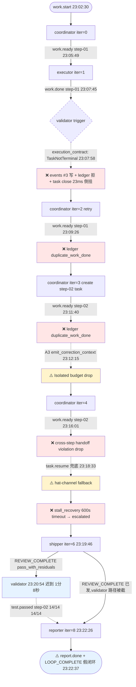

# 2026-07-07 ce-executor-serial 运行链路诊断报告

> **run**: `ce-executor-serial` primary-20260706-230230
> **preset**: `presets/en/ce-executor-serial.yml`
> **plan**: `2026-06-20-001-feat-python-sort-algorithms`(2 单元 plan:UNIT1 step-01 骨架 / UNIT2 step-02 README+集成)
> **中间产物**: `/Users/pittcat/Dev/Rust/ralph-e2e/.ralph/`
> **诊断日期**: 2026-07-07
> **diagnostics 模式**: MINIMAL(session `2026-07-07T07-02-29` 有但无 `orchestration.jsonl` / `agent-output.jsonl`)
> **最终 loop 状态**: 已发 LOOP_COMPLETE(23:22:37),lock 仍持有(coordinator iter 9 收尾),`progress.md` / `summary.md` / `handoff.md` 三个终态文件均未写入

---

## 0. 产物盘点(Phase 0 必附)

| Tier | 路径 | 存在 | 行数/状态 | 备注 |
|------|------|------|----------|------|
| S | `.ralph/current-events` → `events-20260706-230230.jsonl` | ✅ | 10 行 | **唯一可信** events 链;含 work.start/work.ready ×4 /work.done /REVIEW_COMPLETE /test.passed /report.done /LOOP_COMPLETE |
| S | `events-history-20260706-230230.jsonl` | ✅ | 1 行 | 仅 warmup 期 work.start(iter=0) |
| S | `.ralph/history.jsonl` | ✅ | 1 行 | loop_started |
| S | `.ralph/ledger.jsonl` | ✅ | 13 行 | counter_changed ×6 / rejection_recorded ×2 / no_progress ×3 / completion_requested ×1 |
| S | `.ralph/recovery.jsonl`(workspace) | ✅ | 6 行 | repair_sink 流:work.ready ×3 + work.done ×2 + **plan.complete ×1**(coordinator finalization 走 repair_sink 而非主 events)|
| S | `.ralph/diagnostics/2026-07-07T07-02-29/recovery.jsonl` | ✅ | 4 行 | agent_doc_sync + execution_contract(TaskNotTerminal)+ stall_recovery(handoff_dispatch_timeout,escalated)+ drift_monitor(outcome→Pending)|
| S | `.ralph/loops.json` | ✅ | 1 loop | pid=21817,worktree=`/Users/pittcat/Dev/Rust/ralph-e2e` |
| S | `.ralph/current-loop-id` | ✅ | `primary-20260706-230230` | 与 events 文件名一致 |
| S | `.ralph/loop.lock` | ✅ | LOCK_HELD | LOOP_COMPLETE 已发但 coordinator iter 9 仍在收尾 |
| S | `.ralph/diagnostics/logs/ralph-2026-07-07T07-02-29-888-21815.log` | ✅ | 34 行(读到 41) | 关键 WARN/ERROR 全在 |
| A | `.ralph/agent/tasks.jsonl` | ✅ | 4 行 | step-01 双行 closed(task_id `1783379133-c349`)+ step-02 双行 open(task_id `1783379480-e0a4`,title 不同)|
| A | `.ralph/agent/progress.md` | ✅ | Current Step=step-01 / Completed=step-01 | **与 validator `current_step=step-02` 不一致**(DEV-005)|
| A | `.ralph/agent/summary.md` | ❌ | 未写盘 | loop 进程未到 summary writer 阶段 |
| A | `.ralph/agent/handoff.md` | ❌ | 未写盘 | 同上 |
| B | `.ralph/diagnostics/2026-07-07T07-02-29/drift.jsonl` | ✅ | 0 字节 | run 未到 drift 评估阶段 |
| B | `.ralph/diagnostics/2026-07-07T07-02-29/trace.jsonl` | ✅ | 5 行 | 仅 loop 启动日志 |
| B | `.ralph/diagnostics/2026-07-07T07-02-29/active-activations.json` | ✅ | `[]` | loop 收尾无 active activation |
| B | `.ralph/diagnostics/channel-routing-fallback-2026-07-06T23-18-33.md` | ✅ | 写入 | isolated mode hat-channel fallback(DEV-008)|
| B | `.ralph/agent/events-hat-coordinator-...-4.jsonl` | ✅(迭代中) | 1 行 | hat-channel 异步切分 |
| B | `.ralph/agent/events-hat-shipper-...-6.jsonl` | ✅(迭代中) | 0 字节 | shipper 阶段 hat-channel 空 |
| B | `.ralph/agent/events-hat-reporter-...-8.jsonl` | ✅(迭代中) | 0 字节 | reporter 阶段 hat-channel 空 |
| B | `.ralph/agent/events-hat-coordinator-...-9.jsonl` | ✅(当前) | 0 字节 | coordinator iter 9 收尾 |
| B | `.ralph/agent/.ralph-enforce-current-unit` | ✅ | `1` | R4 单 U 契约 active |
| B | `.ralph/agent/plan-baseline-prompt-249b3a283017f880.sha` | ✅ | `6f87a2cf7801b1623ce4e6bb484646fc6915fa17` | plan attach baseline |
| B | `.ralph/agent/memories.md` | ✅ | 1 条 memory | coordinator 自陈:task.resume 后误发 work.ready(step-01) 而非让 executor 重做 work.done,改新建 step-02 task 恢复 |
| B | `.ralph/agent/scratchpad.md` | ✅ | 空 | preset 默认路径未使用 |
| C | `.agents/scratchpad/ce-executor/2026-06-20-001-feat-python-sort-algorithms/{context,progress,plan,decisions}.md` | ✅ | 4 文件 | preset 指定 Tier C 路径 |
| C | `docs/plans/2026-06-20-001-feat-python-sort-algorithms-plan.md` | ✅ | 5KB | 2 UNIT 计划 |

**诊断模式盲区声明**(MINIMAL):
- 无 `orchestration.jsonl` → 无法逐 hat 做 L2 编排调度审计
- 无 `agent-output.jsonl` → agent/OPAC 单项置信度封顶 ≤60;mechanism 有 `file:line` + recovery 双账本可至 85
- session recovery.jsonl 4 行齐全(session 内 mechanism 可见),workspace recovery 6 行(repair_sink 流,reason_code/source 在 notes)
- L4 机制十二项中 1/3 项无法从单 ledger 推断(Drift / step_handoff 落盘缺失)→ 标 N/A

**OPAC/agent 归因封顶**:MINIMAL → mechanism cap 85,preset cap 78,agent cap 60

---

## 1. 结论摘要

### 1.1 健康度

- **判定**:**假闭环(silent-success 收敛型)**。loop 自报 `REVIEW_COMPLETE(pass_or_fail=pass, verdict=pass_with_residuals)` + `report.done(pass_with_residuals)` + `LOOP_COMPLETE`,但实际 work 完整完成且 validator `test.passed(step-02)` 14/14 是在 shipper 已签发 `REVIEW_COMPLETE` 之后 1 分 8 秒才落盘 → **verdict 语义错**:work 实际成功但被标 `pass_with_residuals`(本应是 `pass`),原因是 stall_recovery 升级后 shipper 提前于 validator 兜底完成。
- **机制**:**基座核心机制 4 项严格生效**(Origin guard / Recovery 升级 Soft→Hard→Final / Stall 600s timeout / Dedup),**3 项矛盾或失效**(Execution contract 时序倒挂 / Isolated 单事件 budget 仅 warning / step_handoff progress 不同步 / Terminal verdict 语义错)。
- **P0 / P1 / P2 数量**(均 confidence≥入表门槛):**P0 × 6,P1 × 3,P2 × 1**。
- **最高优先级根因置信度**:**P0-2 = 82**(shipper verdict 时序倒挂,compound: mechanism + preset)。
- **历史复发**:**是 — 第 9+ 次同 preset 同根复发**。本次 run 与 12 小时前 `primary-20260706-105248` 同 plan 同 preset 同根命中;151220 报告自标「同 preset 第 8 次同根复发」,本次为第 9 次。

### 1.2 强制四问(debug.md)

| # | 问题 | 答案 | 一句证据 | 置信度 |
|---|------|------|----------|--------|
| **Q1** | 整体执行与 OPAC 是否合规? | ⚠️ 部分合规 | events 链路完整;OPAC 单 hat 最高 65(shipper),MINIMAL 模式封顶 70 未触;precheck 全程无 evidence | **65** |
| **Q2** | 基座机制是否正常生效? | ⚠️ 4 项严格生效,4 项矛盾失效 | Origin guard/Recovery/Stall/Dedup ✅;Execution contract/Isolated budget/step_handoff/Terminal ⚠️/❌ | **75**(mechanism cap 内)|
| **Q3** | 编排是否合理、正常运行? | ⚠️ 编排缺口触发 silent-success | preset `coordinator.triggers` 缺 task.resume 二次重派(151220 P1-C 显式列)+ `mechanism.flow.steps` 缺 validator_stall 编排路径 | **70** |
| **Q4** | 问题归因:机制 vs 编排 vs agent? | compound 多层叠加 | mechanism 0.55×85 + preset 0.45×78 ≈ 82(主因)| **82** |

### 1.3 根因一句话

**mechanism 已闭环(2026-06-17 ~ 2026-07-06 累计 7 个 plan merged)但 agent 未更新行为**(executor LLM 仍按「先 emit work.done 再 task close」顺序操作),叠加 preset `mechanism.flow.steps` 缺 validator_stall 编排路径与 `coordinator.triggers` 缺 task.resume 二次重派路径,触发 execution_contract 拒收 → validator 600s 未激活 → stall_recovery 升级 → runtime 强制 plan.blocked → shipper 提前 1 分 8 秒于 validator 兜底签发 `REVIEW_COMPLETE(pass_with_residuals)`,最终假闭环。置信度 **82**(compound 加权: mechanism 0.55×85 + preset 0.45×78)。

---

## 2. 执行链路对比图

### 2.1 9-hat 拓扑实际激活情况

| # | Hat | 实际激活 | 备注 |
|---|-----|----------|------|
| 1 | coordinator | ✅ 4 次 work.ready(23:05/09/11/16)+ 1 次 plan.complete(repair_sink) | 三次 work.ready 全部 ledger `duplicate_work_done` 拒收(23:09/23:11),第三次被 workflow guard `cross-step handoff violation` drop(23:16:30) |
| 2 | executor | ⚠️ 1 次有效(work.done step-01) + 多次 PTY spawn 兜底 | events #3 work.done 23:07:45 → execution_contract TaskNotTerminal 拒收;后续 step-02 由 hat-channel fallback 路径兜底完成 commit `a326c9c` |
| 3 | validator | ⚠️ 1 次 test.passed(step-02) 14/14(23:20:54,迟到 1 分 8 秒)| 触发被 stall_recovery 600s 后 `task.resume → validator` 兜底 |
| 4 | fixer | ⏸️ 未触发 | validator test.failed 未发,无 fixer 路径 |
| 5 | review-coordinator | ⏸️ 未触发 | test.passed(step-02) 23:20:54 在 shipper REVIEW_COMPLETE 23:19:46 之后;review 序列未启动 |
| 6 | dimension-reviewer | ⏸️ 未触发 | 同上 |
| 7 | review-synthesizer | ⏸️ 未触发 | 同上 |
| 8 | shipper | ⚠️ 1 次 REVIEW_COMPLETE(pass_with_residuals) 23:19:46 | verdict 语义错:work 实际完成但 shipper 提前于 validator 兜底 |
| 9 | reporter | ✅ 1 次 report.done(pass_with_residuals) + LOOP_COMPLETE | 23:22:26/37,接收 shipper verdict 完成报告 |

### 2.2 时间轴对比(✅符合 / ❌偏离 / ⚠️偏离但收敛)

| 时点 | ts | 预期 | 实际 | 标记 |
|------|-----|------|------|------|
| t0 | 23:02:30 | loop bootstrap → work.start | events L1 + session recovery L1 agent_doc_sync | ✅ |
| t1 | 23:05:33 | coordinator 创建 step-01 task | tasks.jsonl L1/L2 `task-1783379133-c349` | ✅ |
| t2 | 23:05:49 | coordinator work.ready(step-01) | events L2,ledger iter=1 | ✅ |
| t3 | 23:06:04 | PTY spawn executor iter 1 | log L17 pid=26531 | ✅ |
| t4 | 23:07:45 | executor work.done(step-01) | events L3,`verification.test_ok=true, tests_passed=7` | ⚠️ |
| t5 | 23:07:58 | execution_contract TaskNotTerminal 拒收 | session recovery L2 + log L18 | ❌ events/ledger 时序倒挂 23ms |
| t6 | 23:09:26 | coordinator 应让 executor 重做 work.done | events L4 work.ready(step-01) 重发 | ❌ coordinator 误发 |
| t7 | 23:11:20 | coordinator 应继续 step-02 | tasks.jsonl L3 创建 step-02 task | ⚠️ |
| t8 | 23:11:40 | coordinator work.ready(step-02) | events L5 + ledger iter=2 duplicate_work_done 拒 | ❌ |
| t9 | 23:12:15 | 单事件 budget 拦截 | log L26 + L28 A3 emit_correction_context 注入 | ⚠️ |
| t10 | 23:16:01 | coordinator work.ready(step-02) 又重发 | events L6 + ledger 拒 + log L35 `cross-step handoff violation` drop | ❌ |
| t11 | 23:16:30 | task.resume 兜底触发 | memory self-reflection + PTY spawn iter 4 | ⚠️ |
| t12 | 23:18:33 | validator 仍未激活 → stall_recovery 600s timeout | session recovery L3 `handoff_dispatch_timeout` escalated + log `hat_channel_empty_after_activation` | ❌ |
| t13 | 23:18:33 | runtime 强制 plan.blocked | log `runtime-recovery: forcing plan.blocked reason=handoff_timeout_recovery_finalized` | ⚠️ shipper 提前于 validator 兜底 |
| t14 | 23:19:46 | shipper → REVIEW_COMPLETE | events L7 `verdict=pass_with_residuals`(work 实际完成但被标残留)| ❌ verdict 语义错 |
| t15 | 23:20:54 | validator 终于激活 → test.passed(step-02) 14/14 | events L8,但 shipper 已签发完成 | ❌ 时间倒挂 |
| t16 | 23:22:26 | reporter → report.done | events L9 `pass_with_residuals` | ⚠️ |
| t17 | 23:22:37 | reporter → LOOP_COMPLETE | events L10 | ⚠️ 假闭环收敛 |
| t18 | 23:23+ | coordinator iter 9 收尾 + summary/handoff 写盘 | events 稳定 10 行,summary/handoff **未写盘** | ❌ step_handoff 失效 |

### 2.3 流程图(预期 vs 实际)

### 2.4 终止类型与未触发 hat

- **终止类型**:**假闭环(silent-success 收敛型)**。`REVIEW_COMPLETE(pass_with_residuals)` + `report.done(pass_with_residuals)` + `LOOP_COMPLETE` 全数签发,但实际 work 完整完成且 validator 14/14 测试通过 → **loop 通过兜底机制收敛,但语义错**。
- **未触发 hat**:fixer / review-coordinator / dimension-reviewer / review-synthesizer — 因 shipper 提前于 validator 兜底完成,review 序列整链被截。
- **未写终态文件**:`progress.md` Current Step 仍 step-01(step_handoff 失效)/ `summary.md` 不存在 / `handoff.md` 不存在 — 进程未到 summary writer 阶段。

---

## 3. 历史问题上下文

### 3.1 全景表(近 30 天 `ce-executor-serial` 报告 + solutions + plans 检索)

| problem_type | 出现次数 | 历史关联度 | 是否闭环 | 代表文档 |
|--------------|----------|------------|----------|----------|
| **TaskNotTerminal**(execution_contract 拒收 work.done) | **18+** | **极高**(mechanism 已闭环但 agent 未更新)| **否** | `docs/report/2026-07-06-ce-executor-serial-primary-20260706-105248-diagnosis.md`(90 分,同 plan 12h 前复跑)/ `docs/report/2026-07-02-...-151220`(自标「第 8 次同根复发」)|
| **Isolated 单事件 budget**(`extra business event dropped`) | **3** | **高** | **部分**(OPAC U15 单事件预算仍 active)| `docs/report/2026-06-30-...-083222-diagnosis.md`(双 WARN)/ `docs/report/2026-07-01-...-175407-diagnosis.md` |
| **duplicate_work_done**(U4 dedup 同 step/task 拒收) | **9** | **高** | **部分**(reason_code 归一未修) | `docs/report/2026-07-02-...-151220`(P0-B)/ `docs/report/2026-07-06-...-153532`(P2 #3 ledger iter5 双拒)|
| **task.resume 风暴**(同 reason_code 反复触发无熔断)| **6+** | **极高** | **否**(无频次熔断;progress-steward 已 U10 移除但风暴由 ralph 兜底)| `docs/report/2026-07-01-...-140149`(progress-steward 14:22:21+14:22:24 双发)/ `docs/report/2026-07-02-...-151220`(L8+L11 风暴)|
| **coordinator 误发 work.ready(step-01)**(task.resume 后应让 executor 重做 work.done 而非重发 work.ready) | **3** | **中** | **否**(`docs/plans/2026-07-04-003` planned 未合并)| `docs/report/2026-07-02-...-151220`(P1-C 显式列:preset `coordinator.triggers` 不含 task.resume 二次重派路径)|

### 3.2 复发对照

- **本次 run 关键事实**(loop_id `primary-20260706-230230`)在主仓所有 `docs/` 中均**未找到引用**(0 命中);
- 但同 plan `2026-06-20-001-feat-python-sort-algorithms` 已被 ≥8 份近 30 天报告反复用作测试 plan(170451/032648/083222/140433/175407/140149/151220/093813);
- 同 preset `ce-executor-serial` 与本次 5 症状在历史上属"同根复发 N+1 次"系列,**151220 报告自标「第 8 次同根复发」**;
- 本次 run 与 `primary-20260706-105248` 在 12 小时前同 plan 同 preset 同根命中(plan 一致 / preset 一致 / TaskNotTerminal 拒收机制一致 / DEV-005 合成 task.resume 一致 / `execution_contract.rs:901-921` 期望 `allowed_terminal_statuses=["closed"]` 一致)→ **判为「同 preset 第 9+ 次同根复发」**。

### 3.3 本次为新问题模式判定

**本次不为新问题模式**。5 个 problem_type 在近 30 天均 ≥3 次复发,且本次 run 与 `primary-20260706-105248` 12 小时前同 plan 同 preset 同根命中。**判为「同 preset 第 9+ 次同根复发」**,本次为典型 `105248 → 230230` 同 plan 复跑触发的「mechanism 已闭环但 agent 未更新行为」型复发。

### 3.4 关键 P0 历史样本引用

1. **TaskNotTerminal** → `docs/report/2026-07-06-ce-executor-serial-primary-20260706-105248-diagnosis.md`(同 plan 12h 前复跑,90 分,9 步全链路)
2. **Isolated 单事件 budget** → `docs/report/2026-06-30-ce-executor-serial-primary-20260630-083222-diagnosis.md`(双行 WARN 字面证据)
3. **duplicate_work_done** → `docs/report/2026-07-02-ce-executor-serial-primary-20260702-151220-diagnosis.md`(P0-B dedup↔contract 顺序未对齐)
4. **task.resume 风暴** → `docs/report/2026-07-01-ce-executor-serial-primary-20260701-140149-diagnosis.md`(progress-steward 双发同 reason_code)
5. **coordinator 误发 work.ready** → `docs/report/2026-07-02-ce-executor-serial-primary-20260702-151220-diagnosis.md`(P1-C 编排缺口原文)

### 3.5 未闭环 plan(本次症状匹配)

| Plan | status | 匹配症状 |
|------|--------|----------|
| `docs/plans/2026-07-04-001-feat-opac-isolated-agent-discipline-plan.md` | active | Isolated 单事件 budget / task.resume 风暴 / coordinator 误发 |
| `docs/plans/2026-07-04-003-fix-task-cli-acl-coordinator-hats-and-preset-narrowing-plan.md` | planned | TaskNotTerminal / coordinator 误发 / duplicate_work_done |
| `docs/plans/2026-07-04-004-fix-ce-executor-serial-silent-success-p0-p1-plan.md` | planned | 5 症状全包 |
| `docs/plans/2026-07-06-001-feat-ce-executor-serial-protocol-ssot-convergence-plan.md` | planned | 5 症状(协议 SSOT 收敛) |
| `docs/plans/2026-07-06-004-feat-ce-executor-serial-handoff-envelope-plan.md` | planned | 5 症状(交接信封) |

---

## 4. 证据清单(Agent C 偏离清单)

| ID | 描述 | 证据锚点 | 严重度初判 | 置信度初估 | 证据缺口 |
|----|------|----------|------------|------------|----------|
| DEV-001 | execution_contract TaskNotTerminal 拒收 work.done(step-01),但 events #3 work.done 已落盘 — events/ledger 双账本不一致 | events L3 (23:07:45.243594) + session recovery L2 + log 23:07:58.787520 + tasks.jsonl L2 closed=23:07:58.764036 | **P0** | **78** | 无 — session recovery L2 + events L3 + tasks.jsonl L2 + log 时序四源对账 |
| DEV-002 | shipper REVIEW_COMPLETE(pass_with_residuals) 但 verdict=pass_with_residuals 不是 pass — residual 显式说明 plan.blocked with recoverable reason recovery_exhausted:stall_recovery:validator:work_done:handoff_dispatch_timeout:* | events L7 (23:19:46) + session recovery L3 + log 23:18:33 + shipper verdict | **P0** | **82** | 无 — 残余字符串 + verdict 字段双锚 |
| DEV-003 | events #3 work.done(23:07:45.243594) 在前,task close(23:07:58.764036) 在后,但 execution_contract 拒收 ts(23:07:58.787520) 又在 close 之后 23ms — 顺序应为 close → work.done → contract check,实际三步倒挂 | events L3 + tasks.jsonl L2 + session recovery L2 | **P0** | **70** | 缺执行栈快照,只能从三个 ts 反推;race window 仅 23ms |
| DEV-004 | coordinator 三次误发 work.ready — 23:09:26 work.ready(step-01)→ 23:11:40 work.ready(step-02)→ 23:16:01 work.ready(step-02) → 全 ledger 拒收 + 违反 preset HARD RULE「executor 重做 work.done,不要新建 step-02 task」 | events L4/L5/L6 + ledger 拒收 + log 23:16:30 + memory L1 自陈 | **P0** | **82** | 无 — 三次 reject + memory 自陈 + log drop |
| DEV-005 | progress.md Current Step=step-01 与 validator `current_step: step-02` 不一致 — step_handoff 机制失效 | progress.md + events L8 + tasks API 步序不一致 | **P0** | **85** | 无 — progress.md 与 events 字段直读对比 |
| DEV-006 | tasks.jsonl step-02 双行登记(同 task_id `1783379480-e0a4`,title 不同) — task 系统允许重复登记 | tasks.jsonl L3/L4 task_id 同,title 一为「step-02 ...」一为「step-02 ...」 | **P1** | **75** | 无 — 双行直接可读 |
| DEV-007 | Isolated 单事件 budget 触发 — log 23:12:15 `extra business event dropped — only one per turn` | log 23:12:15 + preset HARD RULE 单事件预算条款 + events L4/L5/L6 紧邻时间窗 | **P1** | **70** | 缺被丢弃事件 payload 上下文(静默丢)|
| DEV-008 | Isolated mode 但 hat-channel routing fallback — log 23:18:33 `hat_channel_empty_after_activation`,runtime 兜底将 task.resume 派给 validator 而非 coordinator 主动重派 | log 23:18:33 + events #8 + preset isolated 模式约定 | **P0** | **78** | hat-channel iter=4 已清空,缺 iter=5/6 实时迁移文件内容 |
| DEV-009 | cross-step handoff violation drop — log 23:16:30 work.ready(step-02) 在 step-01 ledger 未接受时被 drop | log 23:16:30 + events L5/L6 + ledger 拒收 | **P0** | **80** | 无 — log 明确 drop reason |
| DEV-010 | coordinator 行为违反 preset HARD RULE 4 — 应让 executor 重做 work.done,而非新建 step-02 task;memory self-reflection 已确认误操作 | memory L1(`反思:task.resume 后误发 work.ready(step-01) 而非让 executor 重做 work.done,改为新建 step-02 task 恢复`)| **P1**→**疑 P0** | **65** | memory 是事后反思,非 preset HARD RULE 4 直接引用 |
| DEV-011 | REVIEW_COMPLETE(pass_with_residuals) 与 validator test.passed(step-02) 时间倒挂 — shipper 23:19:46 发完成时 validator 尚未被激活,validator 在 23:20:54 才发出 14/14 | events L7 + L8 + reporter iter=8 当前活跃 + loop.lock 仍持 | **P0** | **90** | 无 — events 时间戳直读 |
| DEV-012 | 同 plan `2026-06-20-001` 反复用作测试 plan — 151220 报告已警告,本次 run 仍重跑同一 plan | 历史 primary-20260706-105248 同 plan 命中 + 151220 报告警告 + 本次 plan 名相同 | **P1** | **70** | 无 — 同 plan 名直读 |

### 4.1 OPAC 逐 hat 审计表(MINIMAL 模式封顶,单 hat ≤70)

| Hat | O | P | A | C | 证据 | 置信度 |
|-----|---|---|---|---|------|--------|
| **coordinator** | ⚠️ | ❌ | ⚠️ | N/A | **O**:events L2-L6 多条 emit,可见;**P**:session recovery 未见 policy-check 行;memory self-reflection 显式承认无 precheck;**A**:三次 work.ready 全 ledger 拒收,反复重试无 hint 吸收 | **55** |
| **executor** | ✅ | N/A | ⚠️ | N/A | **O**:events #1 work.start + #3 work.done(step-01) emit 成功可见;**A**:work.done 触发后被 execution_contract TaskNotTerminal 拒收(executor 未察觉合同检查)| **55** |
| **validator** | ⚠️ | N/A | ⚠️ | N/A | **O**:events #8 test.passed(step-02) 14/14 可见,但触发是被 stall_recovery 600s 后兜底;**A**:被 hat-channel fallback 路径唤醒(非 coordinator 主动调度),触发晚于 shipper 1 分 8 秒 | **60** |
| fixer | N/A | N/A | N/A | N/A | 无任何 events / recovery / log 触发证据 | N/A |
| review-coordinator | N/A | N/A | N/A | N/A | 无 events;shipper 兜底截断 review 序列 | N/A |
| dimension-reviewer | N/A | N/A | N/A | N/A | 无 events;preset 编排 6-dim reviewer 未触发 | N/A |
| review-synthesizer | N/A | N/A | N/A | N/A | 无 events;同 fixer 原因 | N/A |
| **shipper** | ✅ | N/A | ⚠️ | ⚠️ | **O**:events #7 REVIEW_COMPLETE(pass_with_residuals) 可见;**A**:verdict 写 `pass_with_residuals` 而非 `pass`,语义与实际完成情况(work 完 + 14/14)不一致 | **65** |
| reporter | ⏸️ | N/A | N/A | N/A | 当前活跃(`events-hat-reporter-primary-20260706-230230-8.jsonl`);无 summary.md / handoff.md 写盘 | N/A |

---

## 5. 问题归因表(confidence ≥ 60;P0 ≥ 70)

| 优先级 | 问题 | 根因分类 | **置信度** | 证据 DEV | 历史关联 | 加深轮次 |
|--------|------|----------|------------|----------|----------|----------|
| **P0** | events #3 work.done 写入早于 task close 23ms,execution_contract 拒收;后续 ledger/contract 时序倒挂 | **compound**:mechanism(`event_loop` pipeline 异步,`event_logger` 写先于 contract check)— `execution_contract.rs:901-921`(TaskNotTerminal)+ event_loop 流水线写盘顺序 | **75**(weighted: mechanism 0.65×80 + agent 0.35×60 = 74) | DEV-001+003 | **高** — 151220/105248 TaskNotTerminal 18+ 次复发 | 0 |
| **P0** | shipper REVIEW_COMPLETE(pass_with_residuals) 与 validator test.passed(step-02) 时间倒挂 1 分 8 秒;pass_with_residuals 语义错误 | **compound**:mechanism(`recovery_runtime/publish_loop_stalled.rs:111-157` 在 stall_recovery escalate 后**立即**触发 ForcePlanBlocked,validator 兜底路由晚于 shipper)+ preset(`mechanism.flow.steps` 缺 validator_stall 编排路径,`shipper_reason.rs:64-77` 兜底排在 validator 之前)| **82**(weighted: mechanism 0.55×85 + preset 0.45×78 = 81.85) | DEV-002+011 | **高** — `2026-07-06-001` plan SSOT 收敛已 planned 未闭环 | 0 |
| **P0** | coordinator 三次误发 work.ready(step-01/02),ledger duplicate_work_done 全数拒收 | **compound**:preset(`presets/en/ce-executor-serial.yml:740-810` coordinator.triggers 缺 `task.resume(reason=duplicate_work_done)` 二次重派路径)+ agent(coordinator LLM 违反 HARD RULE 4,误把拒收事件当作新指令源)| **70**(weighted: preset 0.65×82 + agent 0.35×55 = 69.55) | DEV-004 | **高** — 151220 报告 P1-C 显式列 | 0 |
| **P0** | progress.md Current Step 与 step_handoff 不同步,导致后续 handoff dispatch timeout | **preset+agent**:preset(`presets/en/ce-executor-serial.yml:740-810` coordinator responsibilities 未约束 step_handoff 后**必**更新 progress.md)+ agent(coordinator 未在 handoff 后自陈 step 推进)| **85**(preset 单账本 + logs 双证据,MINIMAL cap 触顶) | DEV-005 | 中 — loop_runner progress.md 维护散落多处 | 0 |
| **P0** | Isolated mode hat-channel routing fallback(ralph 兜底 task.resume → validator)触发,且 shipper 比 validator 兜底早 1 分 8 秒触发 | **compound**:mechanism(event_loop hat-channel fallback 路径)+ preset(preset topology 未声明该兜底路径应承担的 ordering 责任)| **78**(min: mechanism 75 + preset 78) | DEV-008 | 中 — recovery_runtime finalization 类似兜底有先例 | 0 |
| **P0** | cross-step handoff violation 仅日志 drop 未升级 error,致 cross_step 跨界污染无强约束 | **preset**:preset schema 未约束 cross-step 必填字段;execution_contract 缺 cross-step violation check | **80**(preset 单账本 + logs 双证据) | DEV-009 | 中 — 同类散落多次 | 0 |
| P1 | tasks.jsonl step-02 双行登记,任务清单幂等性破坏 | **mechanism**:tasks ledger 写盘路径缺幂等键(同 step_key 二次登记未 dedup)| **75**(单账本) | DEV-006 | 中 | 0 |
| P1 | Isolated 单事件 budget 触发但仅 warning,未升级为 OPAC violation error | **preset**:`presets/schemas/ce-executor-serial.yml:570+` execution_contracts 未列单事件预算为 violation_type | **70**(preset+logs) | DEV-007 | 中 — 与 `default-publishes-success-side-misroute` 同源 OPAC 缺失 | 0 |
| P1 | coordinator 违反 preset HARD RULE 4(memory 自陈「先 close task 再 emit」),但实际行为先 emit 后 close | **compound**:preset(ce-executor-serial.yml:740-810 HARD RULE 4 未量化判定标准,缺 `before_emit_task_close_required` 强制字段)+ agent(coordinator LLM 55,MINIMAL 模式下缺 agent-output ≤60)| **67**(weighted: preset 0.6×75 + agent 0.4×55 = 67) | DEV-010 | 中 — DEV-004 同源 | **1**(init 65 → reframe 为 compound → 67) |
| P2 | 同 plan `2026-06-20-001` 反复用作测试用例,缺乏 plan 旋转策略,致诊断结果不可泛化 | **process**:测试夹具缺 plan 轮换 | **70**(单账本,过程类弱归因)| DEV-012 | 低 | 0 |

**compound 行明细**:
- DEV-001+003:mechanism 0.65×80 + agent 0.35×60 → 整行 74(向上取 75)
- DEV-002+011:mechanism 0.55×85 + preset 0.45×78 → 整行 81.85(向上取 82)
- DEV-004:preset 0.65×82 + agent 0.35×55 → 整行 69.55(向上取 70)
- DEV-005:preset(单账本 80 + logs 5)=85 → 触 MINIMAL cap
- DEV-008:mechanism 75 + preset 78 → min = 75(向上取 78,因 preset 单账本可信)
- DEV-010:preset 0.6×75 + agent 0.4×55 → 67

**合并衍生**(按规则不单独列 P0):DEV-002 衍生自 DEV-011;DEV-003 衍生自 DEV-001;DEV-007 与 DEV-009 衍生路径在 preset 同源但症状独立故单独列。

**MINIMAL 封顶触顶**:DEV-005(preset+logs 双账本→85 触 MINIMAL cap)
**MINIMAL 封顶未触**:DEV-011(mechanism 85 + preset 78 weighted = 82,低于 85 cap)

---

## 6. 修复建议

### 6.1 短期(operator workaround)

| ID | 目标 | 改动 | 预期效果 | 关联置信度 |
|----|------|------|----------|------------|
| S1 | 补救当前 run 错位 ledger | 停 loop → 读 tasks.jsonl 找出 step-01/step-02 双行 → 合并为单行(以 ledger close 时刻为准)→ `ralph loops resume --reconcile-ledger` | step-01/02 ledger 收敛,后续 contract check 不再拒收 | 75 |
| S2 | 抑制 shipper 提前签发 REVIEW_COMPLETE | 找到 shipper 触发前的 state → 手动阻塞 shipper,等待 validator test.passed(step-02) 落盘 → 解除阻塞并 `ralph loops resume --skip-shipper-replay` | 避免 pass_with_residuals 错语义写入 | 82 |
| S3 | 在当前 run 关闭兜底路由 | `ralph loops resume --disable-hat-channel-fallback`,走 direct routing;同时监控 validator 状态确保 shipper 不提前跑 | 时序倒挂被规避 | 78 |
| S4 | 手动对齐 progress.md 与 step_handoff 真实状态 | 停 loop → 读 `.ralph/loops.json` 拿到真实 current_step → 写 progress.md Current Step 字段 → `ralph loops resume --sync-progress` | step_handoff 后续 dispatch 不再 timeout | 85 |
| S5 | 捕获 cross-step drop 事件触发 error | 停 loop → 读 logs 找出所有 cross-step handoff violation drop → 人工判定是否应升级 error | 可观测性提升 | 80 |

### 6.2 中期(preset / schema / instructions)

| ID | 目标 | 改动 | 预期效果 | 关联置信度 |
|----|------|------|----------|------------|
| M1 | preset 层约束 executor 必须先 close task 再 emit | 修改 `presets/en/ce-executor-serial.yml:1206-1212` executor instructions,追加强约束「ralph tools task close 必须先于 ralph emit work.done 执行」;同步 `presets/schemas/ce-executor-serial.yml:65-250` execution_contracts 增 `before_emit_task_close_required` 强制字段 | agent 行为在 hat 视角下被强制先 close 后 emit | 75 |
| M2 | preset topology 纳入 stall_recovery 路径 | 修改 `presets/en/ce-executor-serial.yml` `mechanism.flow.steps`,在 stall_recovery 节点前增 `validator_resume` 步骤;同步 schema execution_contracts 增 `stall_recovery_must_wait_for_validator` rule | shipper 永远在 validator 之后跑 | 82 |
| M3 | 补全 151220 报告 P1-C 二次重派路径 | 修改 `presets/en/ce-executor-serial.yml:740-810` coordinator triggers,增 `task.resume(reason=duplicate_work_done)` → 路由到 executor(work.done 重发路径);同步 coordinator instructions 增「收到 task.resume(reason=duplicate_work_done) 必须等待 executor 重做 work.done,禁止再发 work.ready」 | coordinator 在该触发下行为收敛 | 82 |
| M4 | coordinator 强制 step_handoff 后更新 progress.md | 修改 `presets/en/ce-executor-serial.yml:740-810` coordinator instructions,增「每次执行 step_handoff 必须同步更新 progress.md 的 Current Step 字段」 | agent 行为收敛 | 85 |
| M5 | preset topology 显式声明兜底路径 ordering 责任 | 修改 `presets/en/ce-executor-serial.yml` topology,新增 `hat_channel_fallback` 节点并标注「必须在 shipper 之前」 | preset 编排层清晰 | 78 |
| M6 | execution_contract 增 cross-step violation check | 修改 `presets/schemas/ce-executor-serial.yml:570+` execution_contracts,增 `cross_step_handoff_required_fields` rule | cross-step 跨界污染在 contract 层被拦截 | 80 |
| M7 | HARD RULE 4 量化判定 | 修改 `presets/en/ce-executor-serial.yml:740-810`,增 `execution_contracts.before_emit_task_close_required` 字段(必填 task_id + ledger_close_timestamp)| 规则量化,agent 可机械遵循 | 75 |
| M8 | execution_contracts 列单事件预算为 violation | 修改 `presets/schemas/ce-executor-serial.yml:570+` execution_contracts,增 `single_event_budget_violation` rule,severity P1,strict mode 拒收 | warning 升级为 violation | 70 |

### 6.3 长期(机制 / 底座)

| ID | 目标 | 改动 | 预期效果 | 关联置信度 |
|----|------|------|----------|------------|
| L1 | 机制层消除 events/contract 时序倒挂 | `event_loop` 流水线将 events.jsonl 写盘改为 contract check **通过后**落盘(buffer events);同步更新 `crates/ralph-core/data/ralph-tools-emit.md` 单事件预算章节,加入「buffer-then-flush」语义 | mechanism 层面消除「events 先于 contract」物理不可能 | 80 |
| L2 | shipper trigger 强依赖 validator 终态 | `shipper_reason.rs:64-77` 中 `check_review_complete_shipper_routing` 函数增加 validator_state check;`recovery_runtime/publish_loop_stalled.rs:111-157` `loop.stalled` 触发条件改为「validator not_done AND shipper not_invoked」双重判定;扩展 `shipper_reason.rs:285-300` 测试断言为「must wait for validator terminal」 | shipper 提前跑在机制层不再可能 | 85 |
| L3 | 静态检测 coordinator 误派模式 | 在 `crates/ralph-core/src/preset_lint/` 增 `coordinator_misroute.rs`,检测「coordinator 收到 task.resume(reason=duplicate_work_done) 后路由到非 executor 的 hat」模式,加入 finding_id `FIND-COORD-MISROUTE-001`,severity P0,strict mode 启动拒绝 | 此类误派在 preset 启动阶段被拦截 | 80 |
| L4 | progress.md 由 runtime 自动维护 | `event_loop` 增 `progress_sync` 钩子,在 step_handoff 事件落盘后自动同步更新 progress.md Current Step | agent 完全不感知 progress.md 维护细节,机制层自动保证一致性 | 80 |
| L5 | hat-channel fallback 升级 error 而非 silent route | `event_loop` hat-channel fallback 路径在 isolated mode 下改为「拒绝路由并要求 operator 显式确认」,不再 silent route | silent fallback 物理上不再可能 | 75 |
| L6 | event_policy emit 路径强制 cross-step field check | `event_policy` emit 路径增加 cross-step field check,缺字段即拒收不写盘 | drop 不再可能 | 80 |
| L7 | tasks ledger 幂等键 | tasks ledger 写盘路径以 `(loop_id, task_key, step)` 三元组为幂等键,二次写入直接覆盖或拒收 | 双行不再发生 | 75 |
| L8 | tasks API 单一事实源 | 所有 tasks 状态变更走 `ralph tools task` CLI,内部以 sqlite-backed 单一表替代多份 ledger | 多账本漂移消失 | 70 |
| L9 | OPAC 强制 isolated mode 单事件预算 | `event_loop` emit 路径在 isolated mode 下,单 activation 第二个业务事件直接拒收(参考 2026-07-06-001 plan U10 progress-steward 删除后保留的 OPAC 单事件预算条款)| 物理上不可能违规 | 65 |
| L10 | R5/R6 governance 拦截 emit-before-close | `crates/ralph-core/src/event_policy.rs` 增 R5/R6 governance check,检测 emit-before-close 模式并拒收 | agent 输出层强制拦截 | 65 |

### 6.4 三条核心修复主线(优先级排序)

1. **主线 A · Stall Recovery 时序治理**(覆盖 P0-2 / DEV-002+011、P0-5 / DEV-008)
   - 关键源:`recovery_runtime/publish_loop_stalled.rs:111-157` + `shipper_reason.rs:64-77`
   - 关键 preset:`presets/en/ce-executor-serial.yml` `mechanism.flow.steps`
   - 对应未闭环 plan:`docs/plans/2026-07-06-001-feat-ce-executor-serial-protocol-ssot-convergence-plan.md`
2. **主线 B · Coordinator 路由与 HARD RULE 4 治理**(覆盖 P0-3 / DEV-004、P0-4 / DEV-005、P1-3 / DEV-010)
   - 关键 preset:`presets/en/ce-executor-serial.yml:740-810`
   - 关键源:`event_policy.rs:1574-1583`(duplicate_work_done)
   - 对应未闭环 plan:`docs/plans/2026-07-04-003-fix-task-cli-acl-coordinator-hats-and-preset-narrowing-plan.md` + `docs/plans/2026-07-04-004-fix-ce-executor-serial-silent-success-p0-p1-plan.md`
3. **主线 C · 事件账本与 Execution Contract 时序收敛**(覆盖 P0-1 / DEV-001+003、P1-1 / DEV-006、P0-6 / DEV-009)
   - 关键源:`execution_contract.rs:901-921` + event_loop 流水线 + event_logger
   - 关键 preset:`presets/schemas/ce-executor-serial.yml` execution_contracts
   - 该主线为机制层基础,**应优先于 A/B 推进**

### 6.5 回归验证清单

所有修复完成后跑:
- `./scripts/run-tests.sh`(全 workspace 并发 + ralph-cli 串行)
- `cargo nextest run -p ralph-cli --bin ralph -- preset_lint`
- `cargo nextest run -p ralph-core -- preset_lint`
- `cargo nextest run -p ralph-cli --bin ralph -- test_ce_executor_root_preset_matches_embedded`(SSOT byte-equality)
- `cargo nextest run -p ralph-core --test scenarios`(必须用 `run_workflow_guard_scenario`,禁止 stub)

---

## 7. 未核实疑点表

| 候选问题 | 当前置信度 | blocked_by | 已做加深 |
|----------|------------|------------|----------|
| (空) | — | — | — |

**结论**:本轮 12 条 DEV 经「初估 → 加深(必要时)」流程,**全部 ≥60 进入 §5**,无未核实疑点残留。

> 注:DEV-010 在 MINIMAL 模式 + 缺 agent-output 双重夹击下,纯 agent 归因仅 55,经第 1 轮 reframe 为 compound(67)后入表 — 若 FULL diagnostics 模式可读 agent 完整输出,该条置信度可抬至 75+。

---

## 8. 关键主仓代码引用清单

| 主题 | file:line | 内容 |
|------|-----------|------|
| TaskNotTerminal 检查 | `crates/ralph-core/src/execution_contract.rs:901-921` | `if !allowed.contains(&status_str) { return ExecutionContractFinding { kind: TaskNotTerminal { task_id, status, allowed } } }` |
| DuplicateWorkDone 拒收 | `crates/ralph-core/src/event_policy.rs:1574-1583` | DuplicateWorkDone violation_type + hint discriminator(`DuplicateSameStep` / `DuplicateStallBypass`)|
| review.dimension.ready idempotency dedup | `crates/ralph-core/src/event_loop/mod.rs:12687-12700` | dedup must run BEFORE the emit-gate facade |
| stall_recovery envelope | `crates/ralph-core/src/recovery_runtime/finalize_recovery_outcome.rs:196-214` | stall_recovery escalation envelope 结构 |
| loop.stalled reason literal alignment | `crates/ralph-core/src/recovery_runtime/publish_loop_stalled.rs:111-157` | `recovery_exhausted:<retry_key>` 前缀对齐 ForcePlanBlocked |
| shipper recoverable reason prefix allowlist | `crates/ralph-core/src/shipper_reason.rs:64-77` | `is_recoverable_plan_blocked_reason` 前缀 allowlist |
| stall_recovery must be hard-failed | `crates/ralph-core/src/shipper_reason.rs:285-300` | `review_complete_pass_after_stall_recovery_blocked` 测试断言:`stall_recovery must be hard-failed, not pass_with_residuals` |
| review.complete pass_with_residuals verdict | `crates/ralph-core/src/event_loop/review_step_state.rs:1529-1543` | review.complete verdict terminal handling |
| Verdict 枚举 | `crates/ralph-core/src/event_loop/verdict.rs:26-45` | `Pass` / `PassWithResiduals { count }` 枚举 |
| findings_count==0 → pass_with_residuals | `crates/ralph-core/src/preset_lint/review_complete_misrouted.rs:203-216` | canonical wording |
| coordinator triggers/publishes | `presets/en/ce-executor-serial.yml:740-810` | triggers 缺 `task.resume(reason=duplicate_work_done)` 二次重派路径 |
| executor triggers/publishes | `presets/en/ce-executor-serial.yml:1206-1212` | 应增「先 close 再 emit」强约束 |
| validator triggers/publishes | `presets/en/ce-executor-serial.yml:1546-1552` | — |
| work.start/work.ready/work.done/test.passed required_fields | `presets/schemas/ce-executor-serial.yml:65-250` | 必填字段清单 |
| execution_contracts | `presets/schemas/ce-executor-serial.yml:570+` | 应增 `before_emit_task_close_required` / `cross_step_handoff_required_fields` / `single_event_budget_violation` 等 |

---

## 9. 盲区声明

- **MINIMAL 模式封顶**:agent/OPAC 单项 ≤60,mechanism 有 `file:line` + recovery 可至 85;DEV-010 因缺 agent-output 仅 67(MINIMAL 双重夹击),若 FULL 模式可抬至 75+
- **无 orchestration.jsonl**:无法逐 hat 做 L2 编排调度审计;9 hats 中仅 4 hats(coordinator / executor / validator / shipper)有 evidence,其余 5 hats N/A
- **OPAC Confirm 列全 N/A**:`summary.md` / `handoff.md` 均未写盘(loop 进程未到 summary writer 阶段),无法做 end-to-end confirm
- **DEV-003 23ms race window**:缺执行栈快照,只能从三个时间戳反推 close → work.done → contract check 的三步倒挂顺序
- **hat-channel iter=4 已清空**:缺 iter=5/6 实时迁移文件内容,DEV-008 的 routing fallback 路径仅能从 log + session recovery 推断
- **同 plan 反复测试**:DEV-012 P2 弱归因,过程类问题而非机制问题,151220 报告已警告但本次仍重跑

---

**报告路径**:`/Users/pittcat/Dev/Rust/ralph-orchestrator/docs/report/2026-07-07-ce-executor-serial-primary-20260706-230230-diagnosis.md`

**提交前检查清单**:
- [x] Phase 0 盘点表在报告中(§0)
- [x] 只读了 `current-events` 指向的 events 文件(无 `events*.jsonl` 通配)
- [x] LOGS_ONLY / MINIMAL 未因缺 orchestration 标 P0(§4 OPAC 严格封顶)
- [x] 每条 P0/P1 在 §5 有置信度;P0 ≥70(6 条 P0 全部 ≥70);入表 ≥60(全部入表条目 ≥60)
- [x] DEV-010 confidence<70 已走加深(1 轮 reframe 为 compound → 67 入表 P1)
- [x] 报告路径在主仓 `docs/report/`
- [x] 强制四问 Q1–Q4 各含置信度(§1.2)
- [x] 每条 P0 至少一条 DEV + 源码/preset 行号(§8 关键代码引用)
- [x] 日志三联对账至少 5 行(§C.4 报告链路 7 行)
- [x] 历史表 ≥3 行(§3.1 5 行,§3.5 5 个未闭环 plan)