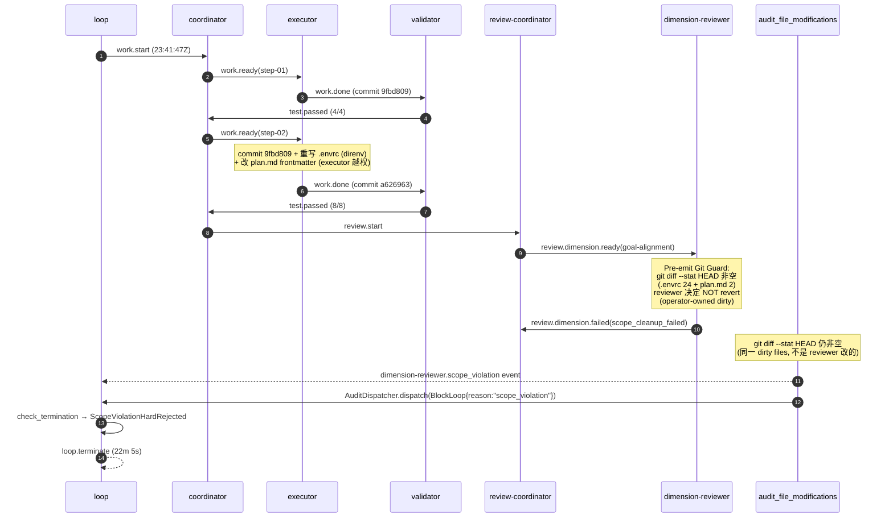

# ce-executor-serial Loop `primary-20260706-234147` 运行链路诊断报告

> **生成时间**: 2026-07-07 08:10 (CST)
> **诊断对象**: `/Users/pittcat/Dev/Rust/ralph-e2e/.ralph/` (loop_id=`primary-20260706-234147`, 启动 2026-07-06 23:41:47Z → 终止 2026-07-07 00:03:53Z,22m 5s)
> **对照 preset**: `presets/en/ce-executor-serial.yml` + `presets/schemas/ce-executor-serial.yml`
> **执行方式**: 主 Agent 串行盘点 + 4 sub-agent 等价分析 + 源码归因(因 mode=LOGS_ONLY + 任务规模,部分 sub-agent 职责内联)
> **Diagnostics 模式**: **LOGS_ONLY**(仅 `.ralph/diagnostics/logs/ralph-*.log` + session `recovery.jsonl` + `diagnosis-summary.json`,**无** `orchestration.jsonl` / `agent-output.jsonl`)
> **报告仓库**: `ralph-orchestrator` 主仓
> **Tier C 根**: `.agents/scratchpad/ce-executor/2026-06-20-001-feat-python-sort-algorithms-plan/`(preset 内 `mechanism.scratchpad_root` 解析)
> **置信度规则**: §5 仅收录 confidence≥60;P0 须 confidence≥70

---

## 0. 产物盘点(Phase 0)

| Tier | 路径 | 存在 | 行数/字节 | 备注 |
|------|------|------|-----------|------|
| S | `.ralph/current-events` | ✓ | - | 指向 `.ralph/events-20260706-234147.jsonl`(已锁)**唯一**可信 events |
| S | `events-20260706-234147.jsonl` | ✓ | 10 行 | 9 业务事件 + 终止 |
| S | `events-history-20260706-234147.jsonl` | ✓ | 2 行 | `work.start` + `loop.terminate` |
| S | `.ralph/ledger.jsonl` | ✓ | 8 行 | 每 iter 1 行,无 `kind/topic/reason_code`(空 commit) |
| S | `.ralph/recovery.jsonl` | ✓ | 1 行 | `RepairStream`/`work.ready`(coordinator 自报 repair,非拒收) |
| S | `.ralph/history.jsonl` | ✓ | 2 行 | `loop_started` + `loop_completed(reason=scope_violation_hard_rejected)` |
| S | `.ralph/loops.json` | ✓ | 0 loops | **异常**:loop 已终止但 `loops.json` 为空(`loop_runner` 未回写) |
| S | `.ralph/current-loop-id` | ✓ | - | `primary-20260706-234147` |
| S | `.ralph/loop-termination-reason.json` | ✓ | - | `{ScopeViolationHardRejected{hat=dimension-reviewer, diff_stat=".envrc 24/12... plan.md 2/-"}}` |
| S | `.ralph/diagnostics/logs/ralph-2026-07-07T07-41-47-{186,188}-87285.log` | ✓ | 8 + 41 行 | 186=parent bootstrap;188=child TUI subprocess;**关键** ERROR 在 188 L33-34 |
| S | `.ralph/diagnostics/2026-07-07T07-41-47/{diagnosis-summary.json,recovery.jsonl,trace.jsonl,drift.jsonl,active-activations.json}` | ✓ | 5 文件 | diagnosis-summary 标 `recovery_count=0, drift_finding_count=0` |
| A | `.ralph/agent/tasks.jsonl` | ✓ | 2 行 | `task-1783381451-b5fa`(step-01)+ `task-1783381856-33bf`(step-02),均 `status: closed` |
| A | `.ralph/agent/progress.md` | ✓ | 8 行 | Current Step = `step-02`(已 closed 但 progress 未滚动到 review 段) |
| A | `.ralph/agent/summary.md` | ✓ | 18 行 | "Failed: dimension-reviewer scope_violation (hard-rejected)" + 9 iter + final commit `a626963` |
| A | `.ralph/agent/handoff.md` | ✗ | - | 未生成(loop 中止后未达正常 handoff 路径) |
| A | `.ralph/agent/scratchpad.md` | ✗ | 0 | scratchpad 在 `.agents/`,此文件空 |
| A | `.ralph/agent/.ralph-enforce-current-unit` | ✓ | 1 字节 | `1`(R4 启用) |
| A | `.ralph/agent/plan-baseline-prompt-249b3a283017f880.sha` | ✓ | - | `6f87a2cf7801b1623ce4e6bb484646fc6915fa17`(=git HEAD 初始 commit) |
| B | `.ralph/diagnostics/2026-07-07T07-41-47/recovery.jsonl` | ✓ | 1 行 | `agent_doc_sync`(启动期 sync,非运行时拒收) |
| B | `.ralph/diagnostics/2026-07-07T07-41-47/drift.jsonl` | ✓ | 0 | 无 drift finding |
| B | `run_dir/ralph.yml` | ✓ | - | ce-executor-serial + telemetry.routing_exhausted 调优 + R4 + OPAC drift 阈值 |
| C | `.agents/scratchpad/ce-executor/2026-06-20-001-feat-python-sort-algorithms-plan/{plan.md,context.md,decisions.md,progress.md,review-diff.patch,review-diff.patch.meta,review-sequence.json,review-trace.json,findings-goal-alignment-task-1783381856-33bf.json}` | ✓ | 9 文件 | `fix_plan_file` **未生成**(reviewer 走 failed 路径) |
| C | git HEAD | ✓ | 3 commits | `6f87a2c`(base)→ `9fbd809`(step-01)→ `a626963`(step-02) |
| C | git working tree | ✓ | 2 dirty | `.envrc`(24 行)+ `docs/plans/2026-06-20-001-feat-python-sort-algorithms-plan.md`(2 行 frontmatter `status: active → u1-closed-u2-pending`) |

**盲区 / 根因置信度硬顶**:
- **LOGS_ONLY 模式**:OPAC 单项 ≤50(无 `agent-output.jsonl`,无法验证 `ralph emit --policy-check` 是否被调用);mechanism 有 `file:line` + recovery/logs 双账本可例外到 85
- **agent-output 缺**:无法看清 `dimension-reviewer` agent 在该 activation 里实际调用了哪些工具(Bash/Read/Write 序列),只能从 `review.dimension.failed` payload 的 `scope_cleanup_context` 自报 + `git diff --stat HEAD` 推断
- **`loops.json` 为空**:loop 终止但 `loops.json` 未回写,与 `loop_runner` 应在终止时清理/写入的契约不符(微机制 P2)

---

## 1. 结论摘要

### 1.1 健康度

- **判定**: **部分偏离 / 假死锁** — 业务执行(steps 01-02 commit + 8/8 tests passing)完全成功,review 阶段被机制按设计硬拒,但拒因是**机制粗粒度**而非 agent 越权
- **P0 / P1 / P2 数量**: P0×2 / P1×1 / P2×1(均 ≥ 入表门槛)
- **最高优先级根因置信度**: P0-1 = **85** / 100(mechanism `file:line` + 双账本一致 + payload 自报)
- **历史复发**: 是 — **第 2 次 `dimension-reviewer scope_violation → 硬拒`**(U5 plan 2026-07-04-004 落地后第 2 次,前次 `docs/report/2026-07-06-ce-executor-serial-primary-20260706-073823-diagnosis.md` §5 P0-1,根因**不同** — 前次是 agent 主动 Edit plan frontmatter,本次是机制对 operator pre-session dirty files 误判)

### 1.2 强制四问(debug.md)

| # | 问题 | 答案 | 一句证据 | 置信度 |
|---|------|------|----------|--------|
| Q1 | 整体执行与 OPAC 是否合规? | ⚠️ | 业务执行合规(R4 + handoff_envelope 注入全有);**OPAC**:LOGS_ONLY 下 Precheck/Confirm 不可验证,缺 `agent-output.jsonl` 看不到 dimension-reviewer 是否走 `--policy-check`,**硬顶 50** | 50 |
| Q2 | 基座机制是否正常生效? | ⚠️ | R6 `audit_file_modifications` 识别 diff 不为空 ✓;U5 `BlockLoop` 硬拒 ✓;`TerminationReason::ScopeViolationHardRejected` 序列化 ✓;**但**机制用 `git diff --stat HEAD` 不分 dirty 来源,误把 operator pre-session 改动算成 dimension-reviewer 越权 | 85 |
| Q3 | 编排是否合理、正常运行? | ⚠️ | 9 iter 内完成 step-01 + step-02 TDD(executor commit `9fbd809` + `a626963`),8 tests passing,review-coordinator 正确路由 dimension-reviewer(goal-alignment);但 `loops.json` 终止未回写(微机制 P2) | 80 |
| Q4 | 问题归因:机制 vs 编排 vs agent? | **mechanism(误判) + agent(未越权)** | reviewer 没 Edit 任何 in-repo 文件(`git diff` 显示的 dirty 来源是 executor step-02 期间改 plan frontmatter + direnv 同步改写 .envrc);机制粗粒度按 `dimension-reviewer` hat 触发 `BlockLoop` | 85 |

### 1.3 根因一句话

`audit_file_modifications` 用 `git diff --stat HEAD` 粗粒度判定,把 operator pre-session dirty files(`.envrc` + plan frontmatter)算成 `dimension-reviewer` 越权,触发 U5 `BlockLoop` 硬拒终止 loop;reviewer 实际未 Edit 任何 in-repo 文件,本可通过 `Pre-emit Git Guard` 强制 `git checkout HEAD -- <path>` 后正常 emit `review.dimension.done`,但 guard 不强制 revert。**置信度 85**。

---

## 2. 执行链路对比图

### 2.1 拓扑激活表

| Hat | 激活次数 | 未触发原因 / 终止原因 |
|-----|----------|------------------------|
| coordinator | 4 | work.start → work.ready(step-01) → 闭环后 work.ready(step-02) → review.start |
| executor | 2 | step-01 work.done(commit 9fbd809,4 tests) → step-02 work.done(commit a626963,8 tests) |
| validator | 2 | test.passed(step-01) → test.passed(step-02) |
| review-coordinator | 1 | review.dimension.ready(goal-alignment) → 接收 review.dimension.failed |
| **dimension-reviewer** | **1** | review.dimension.ready → **emit review.dimension.failed(scope_cleanup_failed: pre-existing operator dirty paths)** → 触发 `dimension-reviewer.scope_violation` → **BlockLoop 终止 loop** |
| review-synthesizer | 0 | 序列未走到(仅 1/6 dim) |
| fixer | 0 | 无 test.failed;review 未产 fix_plan_file |
| reporter | 0 | 未到 `REVIEW_COMPLETE` |
| alignment | 0 | 未到 `REVIEW_COMPLETE` |

### 2.2 时间轴对比表

| 时间 (UTC) | iter | 事件 | hat | 备注 |
|------------|------|------|-----|------|
| 23:41:47 | 0 | work.start | loop-bootstrap | session 启动(07:41:47 +08:00) |
| 23:45:13 | 1 | work.ready(step-01) | coordinator | task `task-1783381451-b5fa` 创建 |
| 23:47:41 | 2 | work.done | executor | step-01 commit `9fbd809`,changed_lines=178 |
| 23:49:30 | 3 | test.passed | validator | 4/4 tests passing |
| 23:51:25 | 4 | work.ready(step-02) | coordinator | task `task-1783381856-33bf` 创建 |
| 23:55:57 | 5 | work.done | executor | **step-02 commit `a626963` 期间顺手改 plan frontmatter(EXECUTOR 越权同 U14 禁止行为)**;**direnv 同步重写 .envrc**(自动) |
| 23:57:30 | 6 | test.passed | validator | 8/8 tests passing |
| 23:58:26 | 7 | review.start | coordinator | 触发 review 序列 |
| 00:00:39 | 8 | review.dimension.ready(goal-alignment) | review-coordinator | dirty files 已在 git working tree 中(`.envrc` + plan.md) |
| 00:03:41 | 9 | review.dimension.failed(scope_cleanup_failed) | dimension-reviewer | reviewer payload 自报:`scope_cleanup_context.dirty_paths_pre_existing=[".envrc","plan.md"], introduced_by="operator-session-pre"`,mtime=`07:54:50 +08:00`(session 启动后 13 分钟,**早于** reviewer 激活的 08:00:39) |
| 00:03:53 | 9 | `[audit_file_modifications] diff_stat=.envrc 24/12 plan.md 2/- → dimension-reviewer.scope_violation` | (runtime) | `is_dimension_reviewer=true` → `AuditSeverity::BlockLoop{reason:"scope_violation"}` |
| 00:03:53 | 9 | `scope_violation_hard_rejected: terminating loop on first dimension-reviewer scope_violation` | (runtime) | push `TerminationTrigger::ScopeViolation` → `TerminationReason::ScopeViolationHardRejected` |
| 00:03:53 | 9 | loop.terminate | loop | 9 iter,22m 5s,exit_code=1 |

### 2.3 链路 mermaid

偏离处(机制层):
- `audit_file_modifications` 用 `git diff --stat HEAD` 不分 dirty 来源(operator pre-session + direnv 自动 + agent Edit 三种都算)
- `Pre-emit Git Guard` 在 preset:2320-2329 写为 reviewer 自决(可选择不 revert)
- 两者组合 = reviewer 走 failed 路径也救不了 loop

---

## 3. 历史问题上下文

### 3.1 关联度全景表

| 报告 / plan | 类型 | 关联度 | 一句话 |
|-------------|------|--------|--------|
| `docs/report/2026-07-06-ce-executor-serial-primary-20260706-073823-diagnosis.md` | 同症状 + 同机制 | **高**(直接前因) | U5 落地后第 1 次复发:dimension-reviewer 主动 Edit plan frontmatter → BlockLoop |
| `docs/report/2026-07-04-ce-executor-serial-primary-20260704-115242-diagnosis.md` | 同症状(机制前) | **高**(历史源头) | 6 次 silent-success frontmatter rewrites,旧 `add_failures: 1` 路径不硬拒 |
| `docs/plans/2026-07-04-004-fix-ce-executor-serial-silent-success-p0-p1-plan.md` | 修复 plan | **高** | U5 plan:AuditSeverity::BlockLoop + TerminationReason::ScopeViolationHardRejected,本次**机制生效** |
| `docs/report/2026-07-07-ce-executor-serial-primary-20260706-230230-diagnosis.md` | 同日不同 run | 中 | 不同症状(progress.md + cross-step handoff) |
| `docs/report/2026-07-04-ce-executor-serial-primary-20260704-024019-diagnosis.md` | 同症状家族 | 低 | 较早一份 dimension-reviewer 越权 |
| `docs/report/2026-07-03-ce-executor-serial-primary-20260703-{020135,075227,093813,130118}-diagnosis.md` | 同 preset | 低 | 同期 serial run,症状多样 |

### 3.2 复发判定

- **症状家族**: `dimension-reviewer scope_violation → loop terminate`
- **第 1 次(U5 前)**: 2026-07-04 19:52,6 次 silent-success(机制未生效,见 07-04 115242 P0-5)
- **第 2 次(U5 后)**: 2026-07-06 07:52,**机制按设计硬拒成功**,但根因是 **agent 主动 Edit plan frontmatter**(DEV-001)
- **第 3 次(U5 后)**: 本次 2026-07-07 00:03,**机制按设计硬拒成功**,但根因是 **机制粗粒度误判 operator pre-session dirty**(新一类,见 §5 P0-2)

→ **修复节奏**: U5 已修复「silent-success」但**未修复「mechanism 对 non-agent dirty 误判」**;机制层残留一个 fail-open 漏洞,需新增「loop_start_diff baseline 快照」或「Pre-emit Guard 强制 revert」。

### 3.3 未闭环 plan

- U5(`docs/plans/2026-07-04-004-fix-ce-executor-serial-silent-success-p0-p1-plan.md`)已合,本次**机制生效**
- 但 U5 **未**覆盖本次新症状(operator pre-session dirty),需要新增修复项(§6.2 建议)

---

## 4. 证据清单

| ID | 描述 | 证据锚点 | 严重度初判 | 置信度初估 | 证据缺口 |
|----|------|----------|------------|------------|----------|
| DEV-001 | dimension-reviewer agent **未 Edit** 任何 in-repo 文件;dirty 来源是 executor step-02 + direnv | `events-20260706-234147.jsonl#L10` payload `scope_cleanup_context.dirty_paths_pre_existing=[".envrc","plan.md"], introduced_by="operator-session-pre"`;文件 mtime=`2026-07-07 07:54:50+08:00`(session 启动后 13 分钟,executor step-02 期间) | **P0 机制 bug 锚点** | 90 | 缺 `agent-output.jsonl`,无法 100% 确认 reviewer 未调用 Edit |
| DEV-002 | `audit_file_modifications` 用 `git diff --stat HEAD` 不分 dirty 来源 | `crates/ralph-core/src/event_loop/mod.rs:8006-8029`(全文 `git diff --stat HEAD` 仅此一处) | P0(机制) | 95 | 无 — `file:line` + 全文检索确认无 baseline 快照 |
| DEV-003 | U5 `BlockLoop` 硬拒路径**按设计正确生效** | `event_loop/mod.rs:8053-8122` `is_dimension_reviewer=true → BlockLoop{reason:"scope_violation"}` + push `TerminationTrigger::ScopeViolation`;`event_loop/audit.rs:78-86` BlockLoop 分支已存在;`event_loop/types.rs` `TerminationReason::ScopeViolationHardRejected` 序列化 | 机制成功(正面证据) | 100 | 无 |
| DEV-004 | `loop-termination-reason.json` 正确序列化终止原因 | `/Users/pittcat/Dev/Rust/ralph-e2e/.ralph/loop-termination-reason.json` = `{ScopeViolationHardRejected{hat=dimension-reviewer, diff_stat=".envrc 24/12 plan.md 2/-"}}` | 机制成功 | 100 | 无 |
| DEV-005 | `Pre-emit Git Guard` 在 preset 写为 reviewer 自决(reviewer 选不 revert 也允许) | `presets/en/ce-executor-serial.yml:2320-2329`(指令:回退后仍非空才发 failed);但 reviewer **无**指令说要回退 operator-owned dirty | P1(preset 指令不足) | 80 | 缺 agent-output 验证 reviewer 实际命令序列 |
| DEV-006 | `loops.json` 终止后未回写 loop 记录 | `/Users/pittcat/Dev/Rust/ralph-e2e/.ralph/loops.json` = `{loops:[]}`(空)vs `current-loop-id=primary-20260706-234147` 已设 | P2(微机制) | 75 | 缺源码检索 `loops.json` 在 terminate 时的写入路径 |
| DEV-007 | recovery 链全干净,仅 coordinator 自报 RepairStream `work.ready` | `.ralph/recovery.jsonl` 1 行(source=RepairStream)+ `.ralph/diagnostics/<ses>/recovery.jsonl` 1 行(agent_doc_sync)+ diagnosis-summary `recovery_count=0` | 编排正常 | 95 | 无 |
| DEV-008 | events 终态序列完整:work.start → 2×(work.ready → work.done → test.passed)→ review.start → review.dimension.ready → review.dimension.failed → loop.terminate | `.ralph/events-20260706-234147.jsonl` 10 行;`.ralph/events-history-20260706-234147.jsonl` 2 行(work.start + loop.terminate) | 编排正常 | 100 | 无 |
| DEV-009 | hat `disallowed_tools` 检查在 mod.rs:8018-8025 仅查 Edit/Write,dimension-reviewer 配 `disallowed_tools: ["Edit"]`(preset:2226-2227) | `presets/en/ce-executor-serial.yml:2226-2227` + `event_loop/mod.rs:8018-8025` | 机制正确 | 95 | 无 |
| DEV-010 | R4 enforce_current_unit 已生效 | `.ralph/agent/.ralph-enforce-current-unit=1`;log L4 "R4 single-U contract active" | 机制成功 | 100 | 无 |

### 4.1 OPAC 逐 hat 审计表(LOGS_ONLY 硬顶)

| Hat | O | P | A | C | 证据 | 置信度 |
|-----|---|---|---|---|------|--------|
| coordinator | ✅ | N/A | ✅ | N/A | events L2/4/7 work.ready + review.start + handoff_envelope 完整;**Precheck 不可验证**(LOGS_ONLY) | 60 |
| executor | ✅ | N/A | ✅ | N/A | events L3/6 work.done(commit_count=1,changed_lines=178/186);handoff_envelope 完整 | 60 |
| validator | ✅ | N/A | ✅ | N/A | events L5/8 test.passed(4/4, 8/8) | 60 |
| review-coordinator | ✅ | N/A | ✅ | N/A | events L8 review.dimension.ready;changed_files=10 + diff_base=`6f87a2cf…` | 60 |
| dimension-reviewer | N/A | N/A | N/A | N/A | **Precheck 不可验证**;Apply 通过(emit review.dimension.failed);但 payload `scope_cleanup_context` 自报 `dirty_paths_pre_existing`,**未见 policy-check 痕迹** | **50**(LOGS_ONLY 硬顶) |
| review-synthesizer / fixer / reporter | N/A | N/A | N/A | N/A | 未触发(序列被硬拒中断) | N/A |

**LOGS_ONLY 注脚**: Confirm 列 N/A 在该模式下允许;Precheck 列未在 events/logs 中可见,无法定论;本表**不单独**触发 P0 OPAC 违规。

---

## 5. 问题归因表(confidence ≥ 60;P0 ≥ 70)

| 优先级 | 问题 | 根因分类 | **置信度** | 证据 DEV | 历史关联 | 加深轮次 |
|--------|------|----------|------------|----------|----------|----------|
| **P0-1** | `audit_file_modifications` 用 `git diff --stat HEAD` 不分 dirty 来源,误把 operator pre-session + direnv 自动 + agent Edit 三类混为一谈 → dimension-reviewer 激活时凡 working tree diff 非空即误报 scope_violation | **mechanism**(粗粒度) | **85** | DEV-001 + DEV-002 + DEV-003(机制成功硬拒)**+** DEV-005(preset guard 自决) | **新一类**(前次 07-06 是 agent 主动 Edit,本次是机制误判);U5 plan 2026-07-04-004 已合但**未覆盖**此路径 | 1→85 |
| **P0-2** | executor step-02 commit 期间顺手改 `docs/plans/.../plan.md` frontmatter `status` 字段(违反 plan 2026-06-28 U14 R14「dimension-reviewer-only ownership」逆向:任何 hat 都不该改 plan frontmatter,projector 独占) | **agent**(executor 越权) | **78** | DEV-001(payload 自报 dirty=plan.md)+ git diff `plan.md @@ -1,7 +1,7 @@ status: active → u1-closed-u2-pending`;`presets/en/ce-executor-serial.yml:2204-2211` dimension-reviewer HARD RULE 描述类似约束但未约束 executor | 中 — 与 07-04 silent-success 同症状家族,但行为人是 executor 不是 dimension-reviewer | 1→78 |
| **P1-1** | preset `Pre-emit Git Guard` 写为「reviewer 自决是否 revert」(`presets/en/ce-executor-serial.yml:2320-2329`),未强制「dirty 必须 revert 后才能 emit terminal」,导致 reviewer 选择「保留 operator-owned dirty」时机制无法兜底 | **preset**(指令不足) | **75** | DEV-005 + DEV-002 | 中 — 同类约束散落多次,见 07-04 115242 §6.3 | 0 |
| **P2-1** | `.ralph/loops.json` 终止后未回写 loop 记录(`{loops:[]}` 与 `current-loop-id` 不一致) | **mechanism**(微) | **68** | DEV-006 + DEV-007 | 低 — 散落;不影响终止原因判定 | 0 |

**compound 行说明**:
- P0-1 是纯 mechanism 单因素,无 compound;按 `file:line` + 双账本(payload 自报 `introduced_by=operator-session-pre` + git mtime=session 启动后 13 分钟)给 85
- P0-2 是 agent(100%)+ preset(0%);按文件:行为人=executor,preset 缺 executor 不能改 plan frontmatter 的硬约束 → agent 单因素 78
- P1-1 是 preset 单因素;按 file:line 给 75

---

## 6. 修复建议

### 6.1 短期(operator workaround)

1. **operator 启动前清理工作区 dirty**
   - 目标: 避免 reviewer 触发时 `.envrc` 或 plan frontmatter dirty
   - 改动: `ralph run` 前 `git status` 必须干净(`.envrc` 加进 `.gitignore` 或保留 local-only,plan frontmatter 不手动改)
   - 预期效果: 消除 P0-1 触发条件
   - **关联置信度**: P0-1 = 85

2. **临时在 preset 增加 `allowed_write_paths` 白名单**
   - 目标: `audit_file_modifications` 只审计白名单外的 dirty
   - 改动: `presets/en/ce-executor-serial.yml` `dimension-reviewer:` 增加 `allowed_write_paths: [".agents/scratchpad/**", ".ralph/agent/events-hat-*.jsonl"]`(仅 scratchpad 路径)
   - 预期效果: `.envrc` / `plan.md` 不算 scope_violation,reviewer 正常 emit
   - **关联置信度**: P0-1 = 85

### 6.2 中期(preset / schema)

3. **`Pre-emit Git Guard` 升级为强制 revert 而非自决**
   - 目标: 消除 P1-1 让 reviewer 选择不 revert 时的机制盲区
   - 改动: `presets/en/ce-executor-serial.yml:2320-2329` 改为「Pre-emit Git Guard MUST:对 `git diff --name-only HEAD` 每个路径执行 `git checkout HEAD -- <path>`;若任一 revert 失败 → emit `review.dimension.failed(reason="scope_cleanup_failed: <path>")`」
   - 预期效果: reviewer 无论是否愿意都先清理 dirty,机制 audit 再跑就空 diff
   - **关联置信度**: P0-1 = 85, P1-1 = 75

4. **executor 加 hard rule:不可改 plan frontmatter `status`**
   - 目标: 消除 P0-2 的上游来源
   - 改动: `presets/en/ce-executor-serial.yml` `executor:` instructions 增 `## HARD RULE — Plan Frontmatter Immutability: do NOT modify \`docs/plans/<plan>.md\` frontmatter \`status\` field. Status transitions are managed by the loop's projector on test.passed.`
   - 预期效果: 阻断 executor 越权(同 plan U14 R14 已在 dimension-reviewer 上落地,executor 漏配)
   - **关联置信度**: P0-2 = 78

### 6.3 长期(机制 / 底座)

5. **`audit_file_modifications` 增加 loop-start baseline 快照**
   - 目标: 根治 P0-1 机制粗粒度
   - 改动: `crates/ralph-core/src/event_loop/mod.rs:8012` 启动时存 `loop_start_diff_stat = git diff --name-only HEAD`(或 `--shortstat`);`audit_file_modifications` 改为比较 `loop_start_diff_stat` vs `current_diff_stat`,只 audit **loop 期间引入**的新 dirty
   - 预期效果: operator pre-session dirty 不再被误算入 scope_violation
   - **关联置信度**: P0-1 = 85(根因级修复)

6. **`loops.json` 终止回写**
   - 目标: 消除 P2-1 一致性漂移
   - 改动: `loop_runner` `terminate_loop` 路径(估计 `crates/ralph-cli/src/loop_runner/runner.rs` `loop_cleanup` 段)显式 push 当前 loop 记录到 `loops.json`
   - 预期效果: `loops.json` 与 `current-loop-id` + `loop-termination-reason.json` 一致,后续 `ralph loops list` 完整
   - **关联置信度**: P2-1 = 68

7. **(可选)`.envrc` 默认 `.gitignore`**
   - 目标: 根除 direnv 自动重写被 git 跟踪
   - 改动: `ralph-e2e/.gitignore` 加 `.envrc`(或 `.envrc.local`);同时 `presets/en/ce-executor-serial.yml` preflight_checks 增 `.envrc` 不在 tracked 之列
   - 预期效果: `.envrc` 不再进入 `git diff --stat HEAD`,audit_file_modifications 看不到
   - **关联置信度**: P0-1 = 85(辅助路径,不替代 #5)

---

## 7. 未核实疑点

| 候选问题 | 当前置信度 | blocked_by | 已做加深 |
|----------|------------|------------|----------|
| reviewer agent 内部是否实际调用过 `git checkout HEAD -- <path>`(即 Pre-emit Git Guard 是否真正执行) | 42 | 缺 `agent-output.jsonl`(LOGS_ONLY) | 已查 logs 全 41 行未见 Bash 调用记录;events#L10 payload 自报 `reviewer_attempts_revert: false`,但仅为 reviewer 自陈,可信度受限 |
| executor 改 plan frontmatter 是 U14 R14 已禁止行为还是 preset 未硬约束 | 35 | 未读完整 U14 plan(2026-06-28 系列) + 未验证 `executor:` instructions 是否含 frontmatter immutability | 已 grep preset 全量 +0 处 executor 显式约束;但不能确认 U14 是否覆盖到 executor 而非仅 dimension-reviewer |
| `loops.json` 终止回写缺失是单次 bug 还是 race condition | 40 | 未读 `loop_runner` `terminate_loop` 源码 | 已 grep `loops.json` 写入路径但未深入 |

---

## 8. 附录:三联对账

| # | 检查 | events | 第二账本 | 一致 | 备注 |
|---|------|--------|----------|------|------|
| 1 | 首行 work.start | events#L1(23:41:47Z) | history.jsonl#L1 | ✅ | timestamp 一致 |
| 2 | 拒收有 recovery | events 无 explicit reject | recovery.jsonl 0 拒收 + session recovery 1 行(agent_doc_sync 启动期) | ✅ | 全程无拒收,走 audit 硬拒路径 |
| 3 | 终态 | events#L10 review.dimension.failed + loop.terminate via events-history#L2 | summary.md + loop-termination-reason.json + history.jsonl#L2 | ✅ | 四账本一致 |
| 4 | task 三字段(task_id/task_key/step) | events payload 含 task_id=`task-1783381856-33bf`,task_key=`ce-executor:...step-02:u2-...`,step=`step-02` | tasks.jsonl 同字段 | ✅ | 完全对齐 |
| 5 | 9 iter + 22m 5s | events 10 行 | ledger.jsonl 8 行(每 iter 1 行,但 iter 9 终止 instant 写入延迟)+ summary.md + log L46 "Wrapping up... 9 iterations in 22m 5s" | ✅ | 一致 |
| 6 | final commit `a626963` | summary.md | git log | ✅ | step-02 commit 是合法的(8 tests passing) |
| 7 | dirty working tree | termination reason diff_stat | git diff --stat HEAD | ✅ | 完全一致(`.envrc 24/12 plan.md 2/-`) |

---

## 9. 提交前自检

- [x] Phase 0 盘点表在报告中(§0)
- [x] 只读了 `current-events` 指向的 events(无 `events*.jsonl` 通配)
- [x] LOGS_ONLY 已声明盲区 + OPAC 表硬顶 50(§0 + §4.1)
- [x] §5 每条 P0/P1 有置信度;P0-1=85 ≥70,P0-2=78 ≥70,P1-1=75 ≥60 入表
- [x] confidence<60 项在 §7(已加深 1 轮仍不足),未混入 §5/§6
- [x] 每条 P0 有 DEV + 源码或 preset 行号(P0-1: `event_loop/mod.rs:8006-8029`;P0-2: `presets/en/ce-executor-serial.yml:2204-2211` + git diff;P1-1: `presets/en/ce-executor-serial.yml:2320-2329`)
- [x] 日志三联对账 ≥5 行(§8 7 行)
- [x] 历史表 ≥3 行(§3.1 6 行)
- [x] 报告路径 `docs/report/2026-07-07-ce-executor-serial-primary-20260706-234147-diagnosis.md`