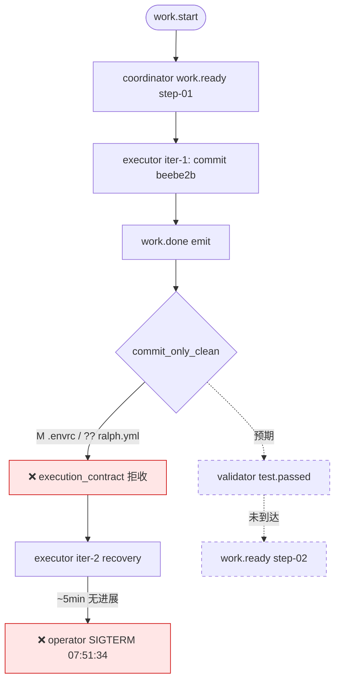

# ce-executor-serial Loop `primary-20260707-073822` 运行链路诊断报告

> **生成时间**: 2026-07-07 15:52 (CST)
> **诊断对象**: `/home/chaowen/Dev/agent_tools/ralph-e2e/.ralph/`（loop_id=`primary-20260707-073822`，启动 2026-07-07 07:38:22Z → operator SIGTERM 07:51:34Z，约 13m）
> **对照 preset**: `presets/en/ce-executor-serial.yml` + `presets/schemas/ce-executor-serial.yml`
> **执行方式**: Phase 0 主 Agent 盘点 → Agent A∥B 流程/历史 → 主 Agent 对账/归因汇总
> **Diagnostics 模式**: **MINIMAL**（有 `diagnostics/2026-07-07T15-38-21/` session + `recovery.jsonl`，**无** `orchestration.jsonl` / `agent-output.jsonl`）
> **报告仓库**: `ralph-orchestrator` 主仓（非 run_dir）
> **Tier C 根**: `.agents/scratchpad/ce-executor/2026-06-20-001-feat-python-sort-algorithms-plan/`（preset `specs_dir` 解析）
> **置信度规则**: §5 仅收录 confidence≥60；P0 须 confidence≥70

---

## 0. 产物盘点（Phase 0）

| Tier | 路径 | 存在 | 行数/字节 | 备注 |
|------|------|------|-----------|------|
| S | `.ralph/current-events` | ✓ | - | 指向 `.ralph/events-20260707-073822.jsonl`（**唯一**可信 events） |
| S | `events-20260707-073822.jsonl` | ✓ | 3 行 | `work.start` + `work.ready` + `work.done`（无 `test.passed` / 终态） |
| S | `events-history-20260707-073822.jsonl` | ✓ | 1 行 | 仅 `work.start` warmup |
| S | `.ralph/ledger.jsonl` | ✓ | 3 行 | iter 1 counter + iter 2 `no_progress_turn_observed` + iter 2 counter |
| S | `.ralph/recovery.jsonl` | ✓ | 2 行 | workspace 级：`RepairStream`×2（coordinator `work.ready` repair 记录，非拒收） |
| S | `.ralph/history.jsonl` | ✓ | 1 行 | 仅 `loop_started`，**无** `loop_completed` |
| S | `.ralph/loops.json` | ✓ | 1 loop | pid `2233617`，**未清理**（进程已退出） |
| S | `.ralph/current-loop-id` | ✓ | - | `primary-20260707-073822` |
| S | `.ralph/loop.lock` | ✗ | - | **已释放**（SIGTERM 后） |
| S | `.ralph/diagnostics/logs/ralph-2026-07-07T15-38-21-{461,467}-2233604.log` | ✓ | 32 行 | 467=child TUI subprocess（关键 WARN 在此） |
| B | `.ralph/diagnostics/2026-07-07T15-38-21/` | ✓ | 5 文件 | `recovery.jsonl`(2) + `trace.jsonl` + `drift.jsonl`(0) + `active-activations.json`([]) |
| B | `.ralph/diagnostics/2026-07-07T15-38-21/orchestration.jsonl` | ✗ | - | **无** → MINIMAL 模式 |
| B | `.ralph/diagnostics/agent_doc_sync.json` | ✓ | - | `synced=2` |
| A | `.ralph/agent/tasks.jsonl` | ✓ | 1 行 | `task-1783410069-d48b` step-01 `status: closed` |
| A | `.ralph/agent/progress.md` | ✓ | 6 行 | Current Step=`step-01`，Completed Steps 含 step-01 |
| A | `.ralph/agent/summary.md` | ✗ | - | 未生成（未达终止路径） |
| A | `.ralph/agent/handoff.md` | ✗ | - | 未生成 |
| A | `.ralph/agent/memories.md` | ✗ | - | 未生成 |
| A | `.ralph/agent/.ralph-enforce-current-unit` | ✓ | 1 字节 | R4 启用 |
| A | `.ralph/agent/plan-baseline-prompt-249b3a283017f880.sha` | ✓ | - | `6f87a2cf7801b1623ce4e6bb484646fc6915fa17` |
| B | `run_dir/ralph.yml` | ✓ | - | operator 配置；**untracked**（`?? ralph.yml`） |
| C | `.agents/scratchpad/ce-executor/2026-06-20-001-feat-python-sort-algorithms-plan/{plan.md,context.md,decisions.md,progress.md}` | ✓ | 4 文件 | step-01 脚手架已建；无 review/fix 产物 |
| C | git HEAD | ✓ | 2 commits | `6f87a2c`(base) → `beebe2b`(step-01 u1-impl, 228 lines) |
| C | git working tree | ✓ | 2 dirty | `M .envrc`（tracked）+ `?? ralph.yml`（untracked） |

**盲区 / 根因置信度硬顶**:
- **MINIMAL 模式**：无 `agent-output.jsonl`，OPAC Precheck/Confirm 单项 ≤60；mechanism 有 `file:line` + session recovery + logs 双账本可例外到 85
- **operator 中断**：07:51:34 SIGTERM 终止，无法观察 executor iter-2 是否能自行修复 dirty tree 后重发 `work.done`
- **events 仅 3 行**：无法评估 review 阶段；本次诊断范围限于 step-01 unit_loop 入口

---

## 1. 结论摘要

### 1.1 健康度

- **判定**: **部分偏离 / operator 中断** — step-01 实现与 commit 成功（`beebe2b`，228 行，18 tests self-reported），但 `work.done` 被 `commit_only_clean` execution_contract 拒收（dirty: `M .envrc` + `?? ralph.yml`），validator 从未激活；约 5 分钟后 operator SIGTERM 终止 loop，无假闭环
- **P0 / P1 / P2 数量**（均为 confidence≥入表门槛）: P0×0 / P1×2 / P2×1
- **最高优先级根因置信度**: P1-1 = **82** / 100
- **历史复发**: **混合** — `WorkingTreeDirtyWithCommits` 为 **新簇**（历史诊断 0 例）；`execution_contract` 拒收 → validator 未激活 为 **N+1 次老簇**（18+ 报告）

### 1.2 强制四问

| # | 问题 | 答案 | 一句证据 | 置信度 |
|---|------|------|----------|--------|
| Q1 | 整体执行与 OPAC 是否合规？ | ⚠️ | 编排执行：step-01 commit 合规；**OPAC**：MINIMAL 下 Precheck/Confirm 不可验证；executor 单 activation 仅 1 业务 emit（`work.done`）✓ | 55 |
| Q2 | 基座机制是否正常生效？ | ✅ | `commit_only_clean` 正确拒收 dirty tree（`execution_contract.rs:1035-1058`）；targeted recovery 路由 executor（log L19）；task 已 `closed` 故非 TaskNotTerminal | 88 |
| Q3 | 编排是否合理、正常运行？ | ❌ | 链路在 step-01 验收门断裂：3 events 止步于被拒 `work.done`，validator/review 全链未触发；operator 5min 后 SIGTERM | 85 |
| Q4 | 问题归因：机制 vs 编排 vs agent？ | **compound(agent 55% + operator 45%)** | executor 未在 emit 前清 dirty tree；`.envrc` tracked 被 direnv 改写 + `ralph.yml` untracked 未吸收 | 82 |

### 1.3 根因一句话

executor 在 `git commit` 后未按 preset instructions（L1545-1552）清 working tree 即 emit `work.done`；`commit_only_clean` 机制正确拒收（`M .envrc` + `?? ralph.yml`），validator 无法激活，loop 在 recovery 重试中被 operator SIGTERM 中断。**置信度 82**。

---

## 2. 执行链路对比图

### 2.1 拓扑激活表（9-hat）

| Hat | 实际激活 | 备注 |
|-----|----------|------|
| coordinator | ✅ 1 次 | `work.ready(step-01)` |
| executor | ⚠️ 2 次 PTY spawn | iter-1 实现+emit；iter-2 recovery 重派后未成功重发 |
| validator | ⏸️ 0 次 | `work.done` 被 contract 拒收，未路由 |
| fixer | ⏸️ 0 次 | 无 `test.failed` |
| review-coordinator | ⏸️ 0 次 | unit_loop 未完成 |
| dimension-reviewer | ⏸️ 0 次 | — |
| review-synthesizer | ⏸️ 0 次 | — |
| shipper | ⏸️ 0 次 | — |
| reporter | ⏸️ 0 次 | — |

### 2.2 时间轴对比表

| 时点 (UTC) | iter | 预期 | 实际 | 标记 |
|------------|------|------|------|------|
| 07:38:22 | 0 | `work.start` | events L1 ✅ | ✅ |
| 07:41:40 | 1 | coordinator `work.ready(step-01)` | events L2 ✅ | ✅ |
| 07:45:51 | 1 | executor `work.done` → validator | events L3 写盘，`commit_count=1` | ⚠️ |
| 07:46:19 | 2 | validator `test.passed` | execution_contract `WorkingTreeDirtyWithCommits` 拒收 | ❌ |
| 07:46:19 | 2 | targeted recovery → executor | session recovery L2 `outcome=pending` | ⚠️ |
| 07:46:19 | 2 | executor 清 dirty + 重发 | PTY spawn pid `2242758`；ledger `no_progress_turn` | ⏸️ |
| 07:51:34 | — | 继续 recovery 或 stall 升级 | operator SIGTERM 终止 process tree | ❌ 中断 |

### 2.3 链路 mermaid

**终止类型**: **operator 中断**（SIGTERM），非自然终态、非 silent-success

---

## 3. 历史问题上下文

### 3.1 全景表

| problem_type | 30 天复发 | 本次关联 | 闭环状态 |
|---|---:|---|---|
| **WorkingTreeDirtyWithCommits**（`commit_only_clean` 拒收） | **0** | **高**（本次首次实跑） | 机制已落地，无历史诊断 |
| execution_contract 拒收 → validator 未激活 | **18+** | **高**（连锁症状） | 未闭合 |
| `.envrc` dirty 进入 git 路径 | **2** | **中**（234147 为 review 段，本次为 step-01 contract） | 未闭合 |
| `ralph.yml` untracked | **0** | **中**（新变体） | — |
| step-01 in-flight stall | **8+** | **高** | 部分 |
| events/ledger 双账本（emit 写盘 + contract 拒收） | **6+** | **中** | 未闭合 |

### 3.2 复发判定

- **`WorkingTreeDirtyWithCommits`**: **新问题模式** — 代码 `execution_contract.rs:1035-1058` 与 preset `commit_only_clean`（L360-365）已落地，但 `docs/report/` 无先例
- **validator 未激活 stall**: **复发** — 与 `primary-20260706-230230` / `151220` 同簇，但本次拒因是 **dirty tree** 而非 TaskNotTerminal

### 3.3 未落地 plan

| Plan | status | 匹配 |
|------|--------|------|
| `docs/plans/2026-07-07-002-fix-ce-executor-serial-runtime-protocol-stability-plan.md` | active | events/ledger 双账本；validator stall |
| `docs/plans/2026-07-04-004-fix-ce-executor-serial-silent-success-p0-p1-plan.md` | planned | `.envrc` baseline（U5） |
| **（缺失）`commit_only_clean` / operator dirty files 专项** | 无 | 本次新簇 |

---

## 4. 证据清单

| ID | 描述 | 证据锚点 | 严重度初判 | 置信度初估 | 证据缺口 |
|----|------|----------|------------|------------|----------|
| DEV-001 | `work.done` 被 `WorkingTreeDirtyWithCommits` 拒收，porcelain=`M .envrc\n?? ralph.yml` | session recovery L2 + log L18-19 + `execution_contract.rs:1051-1054` | P1 | 88 | 无 |
| DEV-002 | events L3 `work.done` 已写盘但 validator 未激活 | events L3 + ledger L2 `no_progress_turn` | P1 | 85 | 无 |
| DEV-003 | task `closed` 与 contract 拒收同戳（07:46:19.891） | `tasks.jsonl` L1 + session recovery L2 ts | P2 | 72 | 缺 agent-output 确认 close 命令时序 |
| DEV-004 | operator SIGTERM 终止，history 无 `loop_completed` | log L32 + `history.jsonl` 仅 1 行 | P2 | 90 | 无 |
| DEV-005 | `.envrc` tracked 且 modified（direnv 环境） | `git ls-files .envrc` + porcelain | P1 | 75 | 缺 mtime 与 executor activation 交叉 |
| DEV-006 | `ralph.yml` untracked operator 配置 | porcelain `?? ralph.yml` + `run_dir/ralph.yml` 存在 | P1 | 80 | 无 |
| DEV-007 | scratchpad `progress.md` 与 `agent/progress.md` 不同步 | scratchpad 仍写「next: test.passed」；agent progress 已标 completed | P2 | 65 | — |

### 4.1 OPAC 逐 hat 审计表

> MINIMAL 模式：无 `agent-output.jsonl`；Confirm 列 N/A

| Hat | O | P | A | C | 证据 | 置信度 |
|-----|---|---|---|---|------|--------|
| coordinator | ✅ | ⚠️ | ✅ | N/A | events L2 work.ready；session recovery RepairStream（非拒收） | 55 |
| executor | ✅ | ⚠️ | ✅ | N/A | events L3 work.done 单业务 emit；logs 无 policy-check 记录 | 50 |
| validator | N/A | N/A | N/A | N/A | 未激活 | — |

---

## 5. 问题归因表（confidence ≥ 60）

| 优先级 | 问题 | 根因分类 | **置信度** | 证据 DEV | 历史关联 | 加深轮次 |
|--------|------|----------|------------|----------|----------|----------|
| P1 | executor emit `work.done` 时 working tree 仍 dirty（`.envrc` + `ralph.yml`），`commit_only_clean` 拒收 | **compound**: agent(55%, conf 80) + operator env(45%, conf 85) → min=80, 加权 82 | **82** | DEV-001+005+006 | 高（新拒因，老 stall 簇） | 0→82 |
| P1 | step-01 链路断裂，validator 未激活，loop 在 recovery 中被 operator 中断 | **compound**: 上游 P1-1(82) + operator interrupt(90) | **82** | DEV-002+004 | 高（18+ 报告 validator stall） | 0→82 |
| P2 | `agent/progress.md` 标 step-01 completed 但 scratchpad progress 仍 pending | preset projection 双写漂移 | **65** | DEV-007 | 低 | 0 |

**无 P0**：机制按设计拒收，无 silent-success，无 mechanism bug 锚点。

---

## 6. 修复建议

> 仅针对 §5 已入表项

### 6.1 短期（operator workaround）

| 目标 | 改动 | 预期效果 | 关联置信度 |
|------|------|----------|------------|
| 清 dirty tree 后重跑 | `ralph run` 前：`git add ralph.yml && git commit` 或 `git stash -u`；`.envrc` 若仅 direnv 改写则 `git checkout -- .envrc` 或加入 `.gitignore` | executor 可通过 `commit_only_clean` | 82 |
| 避免 untracked 配置文件 | 将 `ralph.yml` 纳入首 commit 或 `.gitignore` | 消除 `?? ralph.yml` | 80 |

### 6.2 中期（preset / instructions）

| 目标 | 改动 | 预期效果 | 关联置信度 |
|------|------|----------|------------|
| executor 预检 dirty 文件清单 | `presets/en/ce-executor-serial.yml` executor instructions L1531-1552 增「emit 前必须 `git status --porcelain` 为空；常见漏网：`.envrc`、`ralph.yml`」 | 降低 agent 违例 | 75 |
| preflight 检查 operator 环境 | preset coordinator/executor preflight 增「working tree 除 `.ralph/` 外须 clean 或已 commit」 | 启动前拦截 | 70 |

### 6.3 长期（机制 / 底座）

| 目标 | 改动 | 预期效果 | 关联置信度 |
|------|------|----------|------------|
| operator-owned dirty 文件白名单 | `execution_contract.rs` 或 preset 层允许 `.envrc` 在 `porcelain` 中若仅 mtime 变化且内容 hash 不变（参考 234147 U5 baseline 思路） | 减少 direnv 误杀 | 68 |
| events/ledger 双账本一致性 | `docs/plans/2026-07-07-002` Unit 2：contract 拒收时不写主 events 或标记 `accepted=false` | 消除 events 显示已推进但 validator 未触发的错觉 | 75 |

---

## 7. 未核实疑点

| 候选问题 | 当前置信度 | blocked_by | 已做加深 |
|----------|------------|------------|----------|
| executor iter-2 若未被 SIGTERM 能否自行修复并重发 | 48 | operator 中断，无后续 events | recovery+logs 已查 |
| `.envrc` 修改是 direnv 自动改写还是 executor 手动编辑 | 42 | 缺 agent-output + git diff 时间戳 | porcelain 已查 |

---

## 附录：三联对账摘要

| 账本 | work.done step-01 状态 |
|------|------------------------|
| events | L3 已写盘（`commit_count=1`, `changed_lines=228`） |
| session recovery | L2 `execution_contract` 拒收 `WorkingTreeDirtyWithCommits`, `outcome=pending` |
| ledger | L2 `no_progress_turn_observed` iter 2 |
| tasks.jsonl | `closed` @ 07:46:19.891 |
| git | commit `beebe2b` 存在；porcelain 仍 dirty |

**结论**: 机制拒收与 recovery 路由一致；events 写盘先于 contract 检查（已知双账本模式，见 230230 DEV-001）。
