# ce-executor-pipeline Loop `primary-20260710-220636` 运行链路诊断报告

> **生成时间**: 2026-07-11 14:08 (UTC+8)
> **诊断对象**: `../modem_log_inspector/.ralph/`（loop_id=`primary-20260710-220636`，2026-07-10 22:06:36 → 2026-07-10 22:20:05 UTC，4 iterations，13m 29s）
> **对照 preset**: `presets/en/ce-executor-pipeline.yml` + inline schema（preset.yml 316-471 行；本 preset 无外部 schema 文件）
> **plan_file**: `docs/plans/2026-07-11-001-feat-python-protocol-timeline-plan.md`
> **执行方式**: 4 phase 顺序（盘点 → 流程+历史+对账 并发 → 归因）→ 主 Agent 汇总
> **Diagnostics 模式**: **LOGS_ONLY**（无 `orchestration.jsonl` / 无 `agent-output`；仅 `diagnostics/logs/*.log` + 1 个 channel-routing-fallback）
> **报告仓库**: `ralph-orchestrator` 主仓（非 run_dir）
> **Tier C 根**: `.ralph/review/2026-07-11-001-feat-python-protocol-timeline/`（report.md + baseline-verification.md）
> **置信度规则**: §5 仅收录 confidence≥60；P0 须 confidence≥70（见 [confidence-rubric](../../../Users/pittcat/.claude/skills/ralph-run-diagnosis/references/confidence-rubric.md)）

---

## 0. 产物盘点（Phase 0 必附）

| Tier | 路径 | 存在 | 行数/详情 | 备注 |
|------|------|------|----------|------|
| S | `current-events` → `events-20260710-220636.jsonl` | ✅ | 5 行 | **唯一**可信事件流 |
| S | events-history（配对）| ✅ | 2 行 | `work.start` + `loop.terminate`，非编排 SSOT |
| S | ledger.jsonl | ✅ | 5 行（纯 terminator 视角：work.start warmup + loop.completion_requested + completion_honored） | 只记 loop 边界，不记业务事件 |
| S | recovery.jsonl | ❌ | 不存在 | workspace 层未拒收 |
| S | loops.json | ✅ | `{"loops": []}` | 空数组（启动 race） |
| S | loop.lock | ✅ | 0 字节 | primary 已释放 |
| S | history.jsonl | ✅ | 2 行：`loop_started` + `loop_completed(reason=completion_promise)` | 自然完成（ranter 视角） |
| B | diagnostics 模式 | **LOGS_ONLY** | 仅 2 个 ralph-*.log | 无 orchestration.jsonl |
| B | `diagnostics/logs/ralph-2026-07-11T06-06-35-808-58873.log` | ✅ | 801 B / 5 行 | 启动 log（fallback to autonomous） |
| B | `diagnostics/logs/ralph-2026-07-11T06-06-35-821-58873.log` | ✅ | 6784 B / 34 行 | 主 log，含 1 ERROR `hat-channel routing fallback hat=executor` + 4 次 MemoryInjection（plan-reviewer / executor / reporter / ralph） |
| B | `diagnostics/channel-routing-fallback-2026-07-10T22-14-52.md` | ✅ | executor `hat_channel_empty_after_activation` | 66ms 前发生 |
| B | `diagnostics/agent_doc_sync.json` | ✅ | synced=0, skipped=2, failed=0 | 已知 notifier 空跑 |
| A | `agent/summary.md` | ✅ | 22 行 / **Status: Completed successfully** / Iterations: 4 / Final Commit: 0dd553a | ⚠️ 与 events SSOT 相反 |
| A | `agent/handoff.md` | ✅ | 40 行 / **"Session completed successfully. No pending work."** | ⚠️ 与 events SSOT 相反 |
| A | `agent/decisions.md` | ✅ | 4 行（baseline + step 1.5 + executor checkpoint U1 + step ralph.receive） | 包含 `step 2.5b` baseline reconciliation + U1 pytest 8/8 pass + U2 broken 推测 |
| A | `agent/scratchpad.md` | ✅ | 0 行（空；与 `tasks.jsonl` 不存在 → `_Scratchpad found, but no task section extracted.`） | preset `tasks.enabled: false` |
| A | `agent/tasks.jsonl` | ❌ | — | `tasks.enabled: false` 符合 preset |
| A | `agent/plan-baseline-{plans-2026-07-11-001-feat-python-protocol-timeline}.sha` | ✅ | `b3e17e93900808142521036e440732bcf0565488` | plan-reviewer §Step 2.5b 已写入 |
| A | `agent/plan-baseline-PROMPT.pipeline.sha` | ✅ | 同上 | prompt key backup |
| C | `review/2026-07-11-001-feat-python-protocol-timeline/report.md` | ✅ | 187 行 / **verdict=blocked** ✅ | reporter 按 Branch B 设计正确产出 |
| C | `review/2026-07-11-001-feat-python-protocol-timeline/baseline-verification.md` | ✅ | baseline green / pytest 119/119 pass | executor §Step 1.75 |
| 仓内 | `ralph.pipeline.yml` | ✅ | 4 行 event_loop | user override `max_iterations: 500`，`prompt_file: PROMPT.pipeline.md`（preset 默认 40/PROMPT.md） |
| 仓内 | `execution.target` | ✅ | `docs/plans/2026-07-11-001-feat-python-protocol-timeline-plan.md` | preset 通过此文件 pick plan |
| 仓内 | `PROMPT.pipeline.md` | ✅ | 编排契约 prompt | 被 prompt_file 引用 |
| 仓内 | `git log b3e17e9..HEAD` | 2 commits | `0dd553a feat(protocol_timeline): U1 timeline output contract` + `2d5c800 chore: auto-commit before merge (loop primary)` | U2 ciphering.py + test_ciphering.py 在 2d5c800 由 landing auto-commit 收尸（不在 U1 commit 范围内） |

**盲区 / 根因置信度硬顶**：
- LOGS_ONLY → 纯 OPAC 归因 ≤50；整行（mechanism + SSOT）≤75
- executor hat 内部 agent stdout 不可见 → 0 emit 真根因（context 截断 / token 耗尽 / hat 崩溃 / U2 import error）置信度 ≤50，归为 P1 不进 §5
- precheck 日志级别不可知 → DEV-C-008 OPAC Precheck 行置信度 ≤35
- policy_check enforcement 在 `default_publishes` 注入路径是否走 schema check → 已读源码 (`event_loop/mod.rs:7676`)，不走 → ≤0 缺口，硬 confidence 90+

---

## 1. 结论摘要

### 1.1 健康度

- **判定**: **silent-success（甲类 quiet failure）**。events SSOT verdict=blocked + `report.md` verdict=blocked（reporter Branch B 设计正确），但 `summary.md` "Completed successfully / 4 iterations / Final Commit: 0dd553a" + `handoff.md` "Session completed successfully. No pending work." + `events-history` 第 4 步 loop.terminate "## Status\nAll tasks completed successfully." 三处与正本 verdict **直接对立**。机制层把 verdict 写到 events L3 SSOT 之后，**不再向下游 landing/summary/handoff 透传**，导致 operator 视角被乐观叙事覆盖。
- **P0 / P1 / P2 数量**（均为 confidence≥入表门槛）：**P0 ×3 / P1 ×3 / P2 ×0**（§5）
- **最高优先级根因置信度**: **P0-1 = 92 / 100**
- **历史复发**: 是 — 第 N 次（family ≥ 10 次/30 天）— 引用 `docs/report/2026-07-06-ce-executor-serial-primary-20260706-224028-diagnosis.md` / `152534` / `153532` 等。本次根因 **不完全同源**：历史是 shipper `recoverable_whitelist` prefix allowlist 误提升 plan.blocked → pass，本次是 `summary_writer.rs:368` 与 `handoff.rs:257` **完全无视 verdict 字段硬编 "successfully"**。两条机制家族不同；本次是 **L6 summary/handoff 层 silent-success**，是历史的姐妹家族。

### 1.2 强制四问（debug.md）

| # | 问题 | 答案 | 一句证据 | 置信度 |
|---|------|------|----------|--------|
| **Q1** | 整体执行与 OPAC 是否合规？ | ⚠️ 部分 | events#3 `work.failed` payload 缺 `plan_name`（schema drift），但 reporter 正确按 Branch B 走；OPAC 仅 LOGS_ONLY 弱信号，precheck 无痕迹 | **55**（LOGS_ONLY 限顶，混 SSOT 也仅 ≥75） |
| **Q2** | 基座机制是否正常生效？ | ❌ 失效 | `summary_writer.rs:368` 把 `TerminationReason::CompletionPromise` 硬编 "Completed successfully"；`handoff.rs:257` 同样无视 open_tasks 状态；两条都不读 events.jsonl verdict | **95**（双账本 + 源码行号 + 单元测试锁定） |
| **Q3** | 编排是否合理、正常运行？ | ⚠️ 部分 | preset 13-hat linear chain 设计 OK；6 dim / synthesizer / fix-planner / fixer / alignment 未触发是预设行为（executor 未 emit work.done）；reporter Branch B 走对 | **80**（events 全链路对比表） |
| **Q4** | 问题归因：机制 vs 编排 vs agent？ | **mechanism**（双重） | (M1) `summary_writer.rs:368` + `handoff.rs:257` + `landing.rs perform_landing` 不消费 verdict → silent-success；(M2) `event_loop/mod.rs:7546-7554` `default_publishes` 注入 payload 不携带 `plan_name` 且 `persist_system_injected_jsonl_event`（7676）直接 append 不走 policy_check → schema drift；executor 0 emit 是触发器 | **92**（双账本 + file:line + preset 行号） |

### 1.3 根因一句话

`summary_writer.rs:368` + `handoff.rs:257` + `landing.rs perform_landing` 三个下游 narrative 模块完全未消费 events.jsonl 中 `report.done{verdict=blocked}` 与 `LOOP_COMPLETE{verdict=blocked}` 字段；当 reporter 按设计 Branch B 写出正确 verdict=blocked report 时，**runtime landing 链路却硬编 "Completed successfully / Session completed successfully / All tasks completed successfully"**，把 silent-success 注入主 loop 视角的报告与 handoff；机制上 silent-success 是默认行为而非意外。**confidence 92**。

---

## 2. 执行链路对比图

### 2.1 拓扑激活表（每个 hat 激活次数 + 状态）

| 序号 | preset 预期 hat | events 实际激活 | 状态 | 备注 |
|---|---|---|---|---|
| 1 | loop-bootstrap → emit `work.start` | events#1 `work.start` (source=`loop-bootstrap`) | ✅ | 22:06:36 |
| 2 | plan-reviewer ← work.start | events#2 `plan.ready` (hat=`plan-reviewer`) | ✅ | 22:08:04；6 个 required_fields 全齐；flow_audit=first_run；missing_uids=U1-U13 |
| 3 | executor ← plan.ready | **0 emit** 6m32s | ❌ → runtime 兜底 | 22:08:20 child_pid=62500 → 22:14:52 default_publishes |
| 3-alt | runtime inject work.failed | events#3 `work.failed` (system_injected=true, reason=`default_publishes`, hat=`executor`) | ⚠️ schema drift | payload 缺 `plan_name` |
| 4 | reporter ← work.failed | events#4 `report.done` (hat=`reporter`, verdict=blocked) + events#5 `LOOP_COMPLETE` (hat=`ralph`, verdict=blocked) | ✅ Branch B | 22:17:14 report.done / 22:19:55 LOOP_COMPLETE |
| 5-12 | dim:goal-alignment / correctness / testing / maintainability / standards / adversarial → review-synthesizer → fix-planner → fixer → alignment | **未触发** | ✅ 设计 | 链路前提是 executor emit `work.done`；未触发是设计预期 |
| 13 | reporter → LOOP_COMPLETE | events#5 | ⚠️ hat=ralph 非 reporter | 系统注入路径：runner process_output 在 `complete_promise` 命中时由 ralph 写入；符合 preset topic_deny_rules 286-310 设计 |

### 2.2 时间轴对比表

| 时刻 (UTC) | 事件 | source | 备注 |
|---|---|---|---|
| 22:06:36 | `work.start` | loop-bootstrap | 一开始 log 报"fallback to autonomous"（stdout 非 TTY） |
| 22:08:04 | `plan.ready` | plan-reviewer | plan-reviewer §Step 2.5b baseline reconciliation 完成（decisions.md:1） |
| 22:08:20 | MemoryInjection × 1 + pty_executor spawn child_pid=62500 | runner | executor 启动 |
| 22:08:20.x | `Complete called for unknown or already-closed activation key key=primary:1:plan-reviewer terminal_topic=plan.ready completed_count=0` (WARN) | `ralph_core::hat_lifecycle` | plan-reviewer activation 关闭；正常 |
| 22:14:52.019 | **ERROR** `hat-channel routing fallback hat=executor reason=hat_channel_empty_after_activation` | `ralph::loop_runner::hat_channel` | executor hat-channel 空 5m 后 fallback 到 main |
| 22:14:52.084 | `work.failed` (system_injected=true) | event_loop | runtime 兜底 default_publishes |
| 22:14:52.085 | MemoryInjection × 1 + pty_executor spawn child_pid=74354 | runner | reporter 启动 |
| 22:17:14 | `report.done` (verdict=blocked) | reporter | Branch B 路径 |
| 22:17:35 | MemoryInjection × 1 + pty_executor spawn child_pid=79378 | runner | ralph（？）启动 |
| 22:19:55 | `LOOP_COMPLETE` (verdict=blocked, reason=plan_blocked_at_U2) | ralph | 实际是 reporter 命名 hat=ralph 写入（preset design） |
| 22:20:05.443 | **Completed.** 4 iterations in 13m 29s. reason=completed | `ralph_core::event_loop` | log L29 |
| 22:20:05.478 | `loop_completed reason=completion_promise` | history.jsonl | history 视角乐观 |
| 22:20:05.592 | `Auto-committed changes during landing commit=2d5c800 files=2` | `ralph_core::landing` | U2 untracked 被 landing auto-commit 收尸 |
| 22:20:05.704 | `Primary loop landed successfully committed=true handoff=...` | `ralph::loop_runner::runner` | log L34 写 "successfully" — **与 events#5 verdict=blocked 相反** |

### 2.3 可选 mermaid（偏离处标红/橙）

```mermaid
flowchart LR
    A[loop-bootstrap] -->|work.start| B[plan-reviewer]
    B -->|plan.ready| C[executor]
    C -. 0 emit / 5m .-> X[❌ runtime inject work.failed]
    X --> D[reporter]
    D -->|report.done verdict=blocked| E[LOOP_COMPLETE verdict=blocked]
    E --> F[runner process_output = CompletionPromise]
    F --> G[summary_writer.write status=Completed successfully ❌ ]
    G --> H[landing.perform_landing handoff=Session completed successfully ❌ ]
    H --> I[history.jsonl reason=completion_promise ❌]

    style X fill:#fdd
    style G fill:#fdd
    style H fill:#fdd
    style I fill:#fdd
```



对比 preset 预期（虚线 → 表示预设但未走的链路）：
- 6 dim hats → review-synthesizer → fix-planner → fixer → alignment → reporter 全部被 default_publishes 提前终结，**符合本 preset 单事件崩溃即终止的设计**（preset.yml:42-45 "no re-review loop"）

---

## 3. 历史问题上下文

### 3.1 同 preset 历史报告（来自 Agent B 扫描）

| 日期 | 报告 | 症状 | 闭环状态 | 与本次关联 |
|------|------|------|----------|------------|
| 2026-07-03 | `2026-07-03-ce-executor-pipeline-primary-20260702-163157-diagnosis.md` | pipeline 12-hat 线性, verdict=blocked 但 fixes_applied=0 未拦, shipper "信任 fixer 自律"软契约漏洞 | 未闭环 | 高 (同 preset 软契约家族) |
| 2026-07-08 | `2026-07-08-ce-executor-pipeline-loop-primary-20260708-084141-diagnosis.md` | pipeline-loop alignment+reporter 永未触发, LOOP_COMPLETE 3 次被 hard gate 拒 | 未闭环（multiple 命名裂痕） | 高 (同 preset 链路截断) |
| 2026-07-10 | `2026-07-10-ce-executor-pipeline-loop-primary-20260709-152400-diagnosis.md` | pipeline-loop fixer 后整段链路永未触发, Hard gate exhausted count=3 后无 typed TerminationReason | 未闭环 | 高 (`hat_channel.rs:19-50 race` + `event_loop/mod.rs:2380-2387` 同机制族) |
| 2026-07-10 | `2026-07-10-ce-executor-pipeline-loop-primary-20260709-173233-diagnosis.md` | 4 轮 review/fix 收敛成功闭环, verdict=pass; Round-1 review-gate 短暂 2 次空激活 | 部分闭环 | 中 (成功案例 + hat-channel 间歇复现) |

### 3.2 同症状（silent-success 家族）

| 症状 | 触发路径 | 次数（30 天） | 历史关联 | 本次关联 |
|------|----------|--------------|---------|----------|
| **L6 narrative silent-success**（本次 NEW：summary/handoff 硬编 success） | `summary_writer.rs:368` 写死 "Completed successfully" / `handoff.rs:257` 写死 "Session completed successfully" | **NEW** | 无直接历史 | **极高** — 本次专属 |
| **L5 shipper pass_with_residuals 翻译**（recoverable_whitelist allowlist 误提升 plan.blocked → pass_with_residuals） | `shipper_pass_promotion.rs` 中的 prefix allowlist 误匹配 | ≥12 | `2026-07-06-224028` §1.3 / `075227` P0-3 / `153532` P0-1=85 / `224028` P0-1=85 | 中 — 不同机制，但 family 同（silent-success）；fix commit `6c01bac8` 已落但 SC1 金丝雀回归锁未跑 |
| **default_publishes 注入**（hat 零 emit → orchestrator 注入 plan.blocked / work.failed） | `event_loop/mod.rs:7546-7554` 注入 | 4 次直接 + 8+ 次上下游 | `075227`/`093813`/`130118`/`152534` | **极高** — 本次 events#3 字面命中 |
| **hat_channel_empty_after_activation** | `hat_channel.rs:19-50 race` + isolated 模式 | 4+ 次 | `130118×3`/`093813`/`152534`/`152400` | **极高** — 本次 events#3 前 66ms 命中 |

### 3.3 doc/skill 引用

- `crates/ralph-core/data/ralph-tools.md:85` — **silent-success** 显式列为禁止模式
- `crates/ralph-core/data/ralph-tools-recovery-directives.md:18` — **silent-success** 列为禁止
- `crates/ralph-core/data/ralph-tools-recovery-directives.md:74` — 显式指认 silent-success loop family
- `docs/solutions/developer-experience/agent-execution-contract-gates-2026-06-03.md:15,22,46-49,75` — `default_publishes` 适用边界（executor 已移除）
- `crates/ralph-cli/src/presets.rs:743-756` — `executor.default_publishes` 显式保证只能 unset 或 `work.failed`（fail-closed，注释明示"Setting it to work.done would silently swallow real failures as success"）

### 3.4 本次是否新问题模式

- **是 NEW 家族 + 是 OLD 家族姐妹**。L6 narrative silent-success（新）+ default_publishes 注入（既有）+ hat-channel 空激活（既有）。本次**首次**把 L6 家族显化为 P0 根因，与历史的 L5 shipper family 同属 silent-success loop family。fix commit `6c01bac8` 已修了 L5，未触及 L6。

---

## 4. 证据清单

| ID | 描述 | 证据锚点 | 严重度初判 | 置信度初估 | 证据缺口 |
|----|------|----------|------------|------------|----------|
| **DEV-001** | work.failed system-injected payload 缺 `plan_name`,违反 preset schema `work.failed.required_fields: ["plan_name","reason"]`（preset.yml:347-348） | events.jsonl:3 payload keys=`hat/message/reason/topic`,缺 `plan_name` | **P0** | 95 | 无（字面缺失） |
| **DEV-002** | executor activation 0 emit（commit 0dd553a 之后 5 分钟零业务事件），被 default_publishes 兜底 | events.jsonl:3 system_injected=true,reason=default_publishes; log L15 `hat-channel routing fallback hat=executor reason=hat_channel_empty_after_activation` at 22:14:52.019Z | **P0** | 75 | 无 executor agent 内部 stdout；无法区分"context 截断 vs token 耗尽 vs hat 崩溃 vs U2 import error" |
| **DEV-003** | hat-channel routing fallback isolated 模式降级到 main events.jsonl | `diagnostics/channel-routing-fallback-2026-07-10T22-14-52.md`（5 行）+ log ERROR at 22:14:52.019Z | **P1** | 80 | 降级是否合规（preset execution_mode=isolated 但 fallback 写入 main）需源码确认（已确认在 `hat_channel.rs:320-334` 写入 fallback md 同时报 ERROR，但**写入 main events.jsonl 的路径**需进一步读 `runner.rs:3089-3105` 的 `prepare_hat_channel` 整体逻辑） |
| **DEV-004** | summary.md "Completed successfully / 4 iterations / Final Commit: 0dd553a" 与 events SSOT verdict=blocked 反向 | `.ralph/agent/summary.md:1-23`,status=Completed successfully,events=1 work.failed | **P0** | 95 | 无（summary 字面乐观） |
| **DEV-005** | handoff.md "Session completed successfully. No pending work." 被 landing 模块覆盖为 success 叙事 | `.ralph/agent/handoff.md:26`,KEY Files 列出 5 个已被 commit 的文件，**但 handoff 也没列出 U2 untracked 文件**（脱离 SSOT） | **P0** | 92 | 无（handoff 字面乐观） |
| **DEV-006** | events-history 第 4 步 `loop.terminate` payload 写 "All tasks completed successfully / Exit code 0 / Duration 13m 29s"（"completed" 字段），与 events.jsonl verdict=blocked 反向 | `.ralph/events-history-20260710-220636.jsonl:2` payload `## Status\nAll tasks completed successfully.` | **P0** | 92 | 无（字面相反） |
| **DEV-007** | `TerminationReason::CompletionPromise → "Completed successfully"` 是硬编码（`summary_writer.rs:368`）而非 verdict 透传 | `summary_writer.rs:368` match arm; 单元测试 `test_status_text:669` lock; `handoff.rs:257` 同样硬编码 | **P0** | 100 | 无（双账本 + 源码 + 测试锁定） |
| **DEV-008** | OPAC Precheck（`ralph emit --policy-check`）痕迹缺失；executor activation 全程零 precheck | `diagnostics/logs/*.log` 通篇 grep `precheck\|policy-check` = 0 hit；只有 MemoryInjection INFO + pty_executor INFO + 1 ERROR | P1 | 35 | LOGS_ONLY 无法区分"未跑" vs "日志未捕到" |
| **DEV-009** | U2 残留工作（`ptas_tools/metadata/ciphering.py` + `tests/test_ciphering.py`）报告里说是 untracked 但实际已被 `landing auto-commit` 收尸成 `2d5c800`——handoff 列出 committed 文件不列 untracked ⇒ operator 视角与现场不一致 | `2d5c800` 含 `ciphering.py` + `test_ciphering.py`;handoff.md:16-23 列出 5 个文件全部是 committed 的 | P1 | 85 | decisions.md:4 提"U2 broken at import time"但代码已 commit，patch 尚未 fix (`cipher_id` default 顺序错) |
| **DEV-010** | event#5 `LOOP_COMPLETE` hat=`ralph` 而非 reporter（preset reporter.publishes 含 LOOP_COMPLETE） | events.jsonl:5 hat="ralph"; preset.yml:287-310 topic_deny_rules, reporter hat:286-310 | P2 | 70 | 实际是 design：runner process_output 看到 `complete_promise` 时由 ralph 写盘；不是 bug 但 preset schema 视角下标记可疑 |
| **DEV-011** | decisions.md:4 显示"U2 broken at import time (TypeError: non-default argument 'cipher_id' follows default argument in ptas_tools/metadata/ciphering.py:52)"，但 executor 未在 emit 前 verify U2 commit 完整性 | `.ralph/agent/decisions.md:4`; executor 仅 checkpoint U1 + 写 U2 文件但未跑 import 验证 | P1 | 70 | 无 executor pytest 输出留痕；LOGS_ONLY；可能 schema drift DEV-001 把 plan_name issue 优先级放大 |

### 4.1 OPAC 逐 hat 审计表（LOGS_ONLY）

| Hat | O(Observe) | P(Precheck) | A(Apply) | C(Confirm) | 证据 | 置信度 |
|-----|---|---|---|---|---|---|
| plan-reviewer | ✅ MemoryInjection | ⚠️ 无 precheck 痕迹但 emit schema 完整 | ✅ emit `plan.ready` 6 required_fields 全齐 | ✅ executor 实际被触发 (child_pid=62500) | events.jsonl:2; log:4-7,14; decisions.md:1 | 75 |
| **executor** | ⚠️ 无独立 Observe | **❌ 0 precheck 痕迹** | **❌ 0 business event emit** | ❌ runtime 兜底 `work.failed{default_publishes}` 视为系统侧 fail-close | events.jsonl:3; log:14,15; decisions.md:3; channel-routing-fallback-*.md | 50 |
| reporter | ⚠️ MemoryInjection 复用 | ⚠️ 无 precheck 痕迹但 emit schema 完整 | ✅ emit `report.done{verdict=blocked}` + emit `LOOP_COMPLETE{verdict=blocked}` | ✅ runner terminate + landing | events.jsonl:4-5; log:21-27; report.md | 75 |
| ralph（loop-level） | n/a（loop 不是 hat） | n/a | ✅ loop.terminate + auto-commit 2d5c800 + write handoff.md | ❌ summary.md/handoff.md 写 success | summary.md:3; handoff.md:7-9,26; events-history.jsonl:2; log:29-34 | 50 |

**logs 弱信号**：仅见 1 条 ERROR；无 `--policy-check` 痕迹；无法验证 precheck 是否被静默吞掉。

---

## 5. 问题归因表（confidence ≥ 60；P0 ≥ 70）

| 优先级 | 问题 | 根因分类 | **置信度** | 证据 DEV | 历史关联 | 加深轮次 |
|--------|------|----------|------------|----------|----------|----------|
| **P0-1** | `summary_writer.rs:368` + `handoff.rs:257` + `landing.perform_landing` 三个 narrative 模块**完全未消费 events.jsonl `verdict=blocked` 字段**；reporter Branch B 已正确出 blocked verdict，但 summary/handoff/history/loop.terminate 全部硬编 "successfully" → silent-success L6 家族 | **mechanism** | **92** | DEV-004, 005, 006, 007 | NEW 家族（无直接历史） | 1→92（已读 3 个源文件 + 单元测试 + 全面 grep `verdict` 关键字确认 summary/handoff/landing 三文件零 `verdict` 字段读取） |
| **P0-2** | `event_loop/mod.rs:7546-7554` 的 `default_publishes` 注入 payload **不携带 `plan_name`**，且 `persist_system_injected_jsonl_event`（7676-7740）直接 `OpenOptions::append` 不走 `policy_check` → runtime 自己绕过 preset schema (`work.failed.required_fields: ["plan_name","reason"]`) → 同一 schema 既未在 emitter 端 enforce，也未在 runtime 端 enforce | **mechanism + preset** | **88** | DEV-001 | 高（`075227`/`152534`/`224028` 同注入路径） | 1→88（已读 `event_loop/mod.rs` 三个段：`default_publishes` 构造、`persist_system_injected_jsonl_event`、`recoverable_payload 注入走 confirm_event`） |
| **P0-3** | `executor` activation 0 emit 5m32s，commit 0dd553a 之后未继续 commit U2，未 `ralph emit` 任何 business event → `default_publishes` 兜底，loop 提前终止 12/13 units | **mechanism (default_publishes) + agent** | **72** | DEV-002, 011 | 高（family ≥10 recurrence，fix `6c01bac8` 仅覆盖 L5，未触及 executor 0 emit 真根因） | 1→72（LOGS_ONLY 看不到 executor 内部；加深到 80+ 需 agent-output） |
| P1-1 | U2 ciphering.py 在 `ciphering.py:52` `TypeError: non-default argument 'cipher_id' follows default argument` broken 状态下被 landing auto-commit 收尸成 `2d5c800`；handoff 没列但实际已入仓 → 后续 operator 拿到 handoff 看不到 U2 broken 提示 | agent + mechanism（landing 强 commit） | 80 | DEV-009 | 中 | 0（无缺口，已 confirmed） |
| P1-2 | `hat_channel.rs:19-50 race` → executor channel 空激活 → fallback 到 main events.jsonl，降级路径符合 fallback 写入机制（`hat_channel.rs:320-334` 写 fallback md 并 ERROR 上报），但**写入 main events.jsonl**意味着 isolated 模式不彻底 | mechanism（R1 infra 部分失守） | 75 | DEV-003 | 高（`130118×3`/`152400` 同源） | 0 |
| P1-3 | OPAC Precheck 全程无痕迹（logs 全 INFO + 1 ERROR，0 hit `precheck\|policy-check`） | agent（executor 未跑 precheck）+ mechanism（log 级别过滤） | 35 | DEV-008 | 低 | **0（confidence < 60 不入 §5；移 §7）** |

**compound 行说明**：
- P0-2 是 `mechanism + preset` 复合：mechanism 成分 confidence 92（`event_loop/mod.rs:7546-7554` + `:7676-7740`）；preset 成分 confidence 90（`presets/en/ce-executor-pipeline.yml:347-348` schema 定义 + `:100-101` `require_policy_check_for_cli_emit`/`plan_name_equality_required` 但 runtime 不执行）。整行 confidence = min = **88**。

---

## 6. 修复建议

### 6.1 短期（operator workaround）

**目标**：在本 loop 已经 silent-success 落地后，operator 仍能拉到正确 verdict。
- **改动**：跑 `cat .ralph/review/<plan_name>/report.md`（**只信 reporter Branch B 产物**）。`summary.md` / `handoff.md` / `loop.terminate payload` 在 L6 silent-success 修复前一律不读。
- **预期效果**：operator 看 operator dashboard 时不会被乐观叙事误导。
- **关联置信度**：**92**（DEV-007 单源）；本次 loop 已落地但未来 run 仍受影响。

### 6.2 中期（preset / schema / instructions）

**目标**：把 `LOOP_COMPLETE` 携带的 `verdict` / `report_path` 字段透传到 summary/handoff/landing narrative。
- **改动**：
  1. `crates/ralph-core/src/handler/handle_termination`（runner.rs:1789-1819）：在 `summary_writer.write` 之前**先读 events.jsonl 最后一条 `LOOP_COMPLETE` 的 payload.verdict**；如果非 `pass`，把 `reason_for_status` 透传给 `summary_writer`。
  2. `crates/ralph-core/src/summary_writer.rs:366-400`（`status_text`）：新增分支
     ```rust
     TerminationReason::CompletionPromise => "Completed"  // 中性词,不预判 success
     ```
     并在 `generate_content_with_landing` (L250-363) 新增 `**Verdict (from events):** {verdict}` 一行。
  3. `crates/ralph-core/src/handoff.rs:256-258`：把 `if open_tasks.is_empty()` 改为 `if open_tasks.is_empty() && verdict.unwrap_or("unknown") != "blocked"`，**或**新增字段 `**Verdict:** {verdict}` 在文件 header。
  4. `crates/ralph-core/src/loop_history.rs:record_completed` (L314)：把 `reason_str="completion_promise"` 改为附加 `verdict_str`，例如 `"completion_promise(blocked:plan_blocked_at_U2)"`。
  5. `crates/ralph-core/src/event_loop/mod.rs:7546-7554`：注入 `default_publishes` 时**填充当前 hat 的 `plan_name`**——通过读 events.jsonl 最后一条 `plan.ready` 的 `plan_name` 字段补全；同步在 `persist_system_injected_jsonl_event` (L7676-7740) 跑 policy_check（即使是 system-injected 也保持 schema parity）。
  6. preset.yml:316-471 schema 加固：`work.failed.required_fields` 增 `reason_code`（默认 `default_publishes`）便于 audit。
- **预期效果**：silent-success L6 家族根因消除；`default_publishes` 注入 payload schema 合规；operator 可信 summary/handoff。
- **关联置信度**：**88**（核心改动 #5 同 P0-2 根因置信度）。

### 6.3 长期（机制 / 底座）

**目标**：把 verdict 透传做成 tests 强制；金丝雀锁。
- **改动**：
  1. 在 `crates/ralph-core/tests/scenarios/ce-executor-pipeline-blocked.yml` 中新增一个 scenario：executor emit 0 → default_publishes → reporter verdict=blocked → 断言 summary.md `Status:** `字段**不包含 "successfully"**、handoff.md 不含 "Session completed successfully"、history.jsonl `loop_completed.reason` 包含 `blocked`。
  2. 把 P0-1/P0-2 加入 `docs/solutions/`（新文档：`ce-executor-pipeline-l6-silent-success-2026-07-11.md`）并以 `docs/report/2026-07-11-ce-executor-pipeline-primary-20260710-220636-diagnosis.md` 为 reference。
  3. 在 `ralph-ci` 或 `scripts/run-tests.sh` 加入"verdict 透传 e2e"金丝雀：每次 `scripts/run-tests.sh` 跑一个 BDD scenario 验证"summary status_text must match events verdict"。
  4. 在 preset_lint 中加一条 OPAC-style 检查：当 `tasks.enabled: false` 且 `execution_mode: isolated` 时，**强制要求** hat 必须在缺一次 emit 时把 detail error 写到 `.ralph/agent/decisions.md` + schema 上明确 `reason_code`(plan 2026-07-09-003 §378 的延伸:禁止未解释术语)。
- **预期效果**：silent-success 家族复发锁定；与 `224028` 的 shipper L5 family fix commit `6c01bac8` 形成姊妹修复。
- **关联置信度**：**88**（基于 P0-1/P0-2 根因）。

---

## 7. 未核实疑点（可选）

confidence < 60 且已加深 2 轮仍不足；**不驱动修复**。

| 候选问题 | 当前置信度 | blocked_by | 已做加深 |
|----------|------------|------------|----------|
| executor activation 0 emit 真根因（context 截断 / token 耗尽 / hat 崩溃 / U2 import error） | 45（§5 P1-3 已移此） | 缺 agent-output.jsonl（FULL diagnostics） | LOGS_ONLY 通读 logs（34 行）+ hat-channel fallback 文件，无内部 stdout 可看 |
| OPAC Precheck 未跑 vs 日志级别过滤 | 35 | 缺 FULL mode + tracing 痕迹 | LOGS_ONLY 已确认所有可见 log 无 precheck 字符串；无法判断"未跑"还是"被过滤" |
| `work.failed` schema drift 经 policy_check reject 后的具体错误消息是否被 executor 看到（看不到的话 executor 不知道怎么修） | 30 | 缺 emitter 端 stdout | LOGS_ONLY；LS events JSONL 写出来了说明 inject 端没拦；emitter 端不知道 |
| U2 broken 状态（`ciphering.py:52` `TypeError`）是否在 executor 第 1.95 步 delta-verifier 跑过（可能是 verification budget exhausted 但未 emit work.failed） | 25 | 缺 executor step trace | decisions.md:4 仅推测 broken，无 pytest 输出留痕 |

---

## 附录：与历史报告的差异表（NEW family 主因）

| 项 | 历史 L5 silent-success family（`2026-07-06-224028` / `153532`） | 本次 L6 silent-success |
|------|---------------------|----|
| 触发点 | shipper `recoverable_whitelist` prefix allowlist 把 plan.blocked 翻译为 pass_with_residuals | summary_writer / handoff / landing 完全不读 verdict 字段 |
| verdict 写作位置 | events.jsonl 同时写 pass_with_residuals（已被 shipper 翻译） | events.jsonl 写 blocked（reporter Branch B 正确），但下游 narrative 走另一条乐观通路 |
| summary.md 文本 | "Completed successfully"（与 events 一致：events 写 pass_with_residuals） | "Completed successfully"（**与 events 不一致**：events 写 blocked） |
| handoff.md 文本 | "Session completed successfully"（与 events 一致） | "Session completed successfully"（**与 events 不一致**） |
| fix commit | `6c01bac8` 已修 shipper allowlist | 未修；NEW family |
| 历史复发计数 | 30 天 ≥10 | 0 次（NEW），但与 L5 共同根属 silent-success loop family |

**核心差异**：历史 L5 在"events 层就静默"（shipper 直接 emit pass），operator 看 events.jsonl 也被骗。本次 L6 在"events 层正确 + narrative 层静默"，**reporter 与 report.md 仍然说真话**，operator 看 report.md 不被骗，但看 summary/handoff/history.jsnol.terminate 必然被骗。**L5 + L6 是 silent-success 家族的两条姐妹路径**，需要并行 fix 而非二选一。

---

*报告生成方法学：ralph-run-diagnosis skill（Phase 0 盘点 → Phase 1+2 流程/历史/对账 3 sub-agents 并发 → Phase 3 归因 + 置信度加深 → Phase 4 落盘）。*
