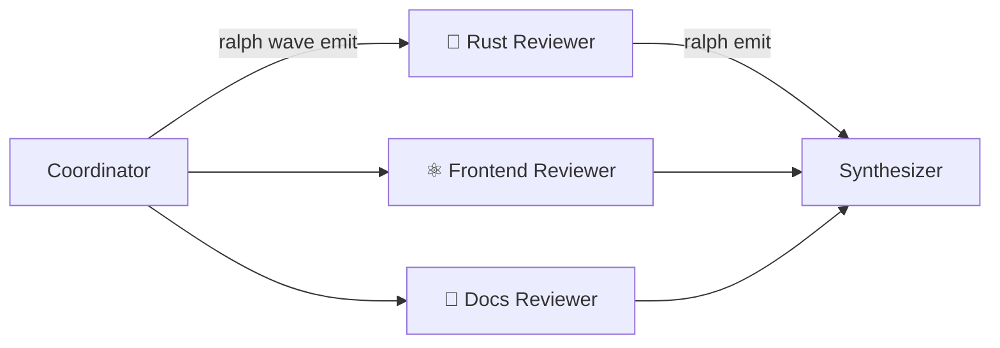

# Agent Waves

Agent Waves add intra-loop parallelism to Ralph's orchestration. Instead of processing work items one at a time, a hat can dispatch a **wave** of items that run as parallel backend instances — all within a single iteration.

## When to Use Waves

Waves are useful when a single iteration needs to fan out work across multiple independent items:

- Running specialized reviewers in parallel (Rust, frontend, docs)
- Researching N questions simultaneously
- Running N independent analyses concurrently

Without waves, a hat would process items sequentially across iterations. Waves collapse that into one parallel burst.

## How It Works



A wave lifecycle has three phases:

1. **Dispatch** — A hat emits N events as a wave using `ralph wave emit`
2. **Execute** — The loop runner spawns parallel backend instances (up to the hat's `concurrency` limit)
3. **Aggregate** — Results merge back into the main event stream for the next hat to consume

Each wave worker runs in isolation with its own events file and environment variables. Workers publish results via `ralph emit`, and the loop runner merges everything back into the main events file.

## Configuration

Two new hat config fields enable wave execution:

### `concurrency`

Sets the maximum number of parallel backend instances for this hat.

```yaml
hats:
  reviewer:
    name: "🔍 Reviewer"
    triggers: ["review.perspective"]
    publishes: ["review.done"]
    concurrency: 3  # Rust, frontend, and docs reviewers run simultaneously
    instructions: |
      Review code from your assigned specialist perspective.
```

When `concurrency` is 1 (the default), the hat runs sequentially as normal.

### `aggregate`

Configures how the downstream hat collects wave results.

```yaml
hats:
  synthesizer:
    name: "📊 Synthesizer"
    triggers: ["review.done"]
    publishes: ["review.complete"]
    aggregate:
      mode: wait_for_all  # Wait for every worker to finish
      timeout: 300        # Give up after 5 minutes
    instructions: |
      Combine all review findings into a unified report.
```

| Field | Description |
|-------|-------------|
| `mode` | `wait_for_all` — wait for all workers to complete before triggering |
| `timeout` | Seconds to wait before timing out the wave |

**Timeout resolution order:** When determining the per-worker timeout, Ralph checks `hat.timeout` first, then `aggregate.timeout`, then falls back to 300 seconds.

## Wave Dispatch

Hats dispatch waves using the `ralph wave emit` CLI command:

```bash
ralph wave emit <topic> --payloads "item1" "item2" "item3"
```

Each payload becomes a separate event tagged with a shared `wave_id`. The loop runner detects these tagged events and spawns parallel workers.

### Example: Dispatching Specialized Reviewers

```yaml
hats:
  coordinator:
    name: "📋 Coordinator"
    triggers: ["review.start"]
    publishes: ["review.perspective"]
    instructions: |
      Dispatch specialized reviewers as a wave. Each payload
      describes the reviewer's role and focus area:

      ```bash
      ralph wave emit review.perspective --payloads \
        "ROLE: Rust Reviewer. Focus on ownership, error handling, unsafe, performance." \
        "ROLE: Frontend Reviewer. Focus on React patterns, a11y, state management." \
        "ROLE: Docs Reviewer. Focus on README accuracy, doc comments, examples."
      ```
```

### Context Injection

When a hat's `publishes` target a wave-capable hat (one with `concurrency > 1`), Ralph automatically injects a **Wave Dispatch** section into the hat's prompt. This section shows the available topics, target hat, and usage syntax — so the dispatching hat knows how to emit waves without hardcoding instructions.

## Worker Isolation

Each wave worker runs with:

| Environment Variable | Purpose |
|---------------------|---------|
| `RALPH_WAVE_WORKER=1` | Marks this process as a wave worker |
| `RALPH_WAVE_ID` | Shared wave correlation ID |
| `RALPH_WAVE_INDEX` | 0-based index of this worker |
| `RALPH_EVENTS_FILE` | Per-worker events file path |

Workers publish results via standard `ralph emit`:

```bash
ralph emit review.done "## Rust Review\n\n### Critical\n- Unbounded clone in hot loop at src/handler.rs:42"
```

The loop runner collects results from each worker's events file and merges them into the main events file.

### Nested Wave Prevention

Wave workers cannot dispatch their own waves. This is enforced at two levels:

- **Hard guard** — `ralph wave emit` checks `RALPH_WAVE_WORKER` env var and refuses to run
- **Soft guard** — Worker prompts explicitly prohibit `ralph wave emit`

## Concurrency Control

Worker parallelism is bounded by the target hat's `concurrency` setting. If a wave has 10 items but `concurrency: 4`, only 4 workers run at a time. A semaphore gates additional workers until a slot opens.

```
Wave: 10 items, concurrency: 4

  Time →
  [Worker 0] [Worker 1] [Worker 2] [Worker 3]
             [Worker 4] ─────────── [Worker 5]
                        [Worker 6] [Worker 7]
                                   [Worker 8] [Worker 9]
```

## Three-Hat Pattern

Most wave workflows follow a three-hat pattern: **Coordinator → Worker → Synthesizer**.

```yaml
event_loop:
  starting_event: "review.start"
  completion_promise: "LOOP_COMPLETE"

hats:
  coordinator:
    name: "📋 Coordinator"
    triggers: ["review.start"]
    publishes: ["review.perspective"]
    instructions: |
      Dispatch specialized reviewers as a wave.
      Each payload describes a reviewer role and focus area.

  reviewer:
    name: "🔍 Reviewer"
    triggers: ["review.perspective"]
    publishes: ["review.done"]
    concurrency: 3
    instructions: |
      You are a specialized reviewer. Read your role from
      the event payload and review strictly from that perspective.

  synthesizer:
    name: "📊 Synthesizer"
    triggers: ["review.done"]
    publishes: ["review.complete"]
    aggregate:
      mode: wait_for_all
      timeout: 300
    instructions: |
      Merge all specialist findings into a unified report.
```

## Built-in Wave Presets

One wave-enabled preset ships with Ralph:

| Preset | File | Pattern | Workers | Concurrency |
|--------|------|---------|---------|-------------|
| `wave-review` | `presets/wave-review.yml` | Specialized parallel code review | Reviewer (Rust, Frontend, Docs) | 3 |

```bash
# Parallel code review
ralph run -c ralph.yml -H presets/wave-review.yml -p "Review the authentication module"
```

## Diagnostics

Wave execution emits structured diagnostics when `RALPH_DIAGNOSTICS=1`:

| Event | Fields |
|-------|--------|
| `WaveStarted` | `wave_id`, `expected_total`, `worker_hat`, `concurrency` |
| `WaveInstanceCompleted` | `wave_id`, `index`, `duration_ms`, `cost_usd` |
| `WaveInstanceFailed` | `wave_id`, `index`, `error`, `duration_ms` |
| `WaveCompleted` | `wave_id`, `total_results`, `total_failures`, `timed_out`, `duration_ms` |

Wave IDs follow the format `w-<hex-nanos>-<pid>-<seq>` (e.g., `w-1a2b3c4d-12345-0`), combining a hex timestamp, process ID, and sequence number for uniqueness.

```bash
# View wave diagnostics
jq 'select(.type | startswith("Wave"))' .ralph/diagnostics/*/orchestration.jsonl
```

## Current Limitations

- **One wave per iteration** — If multiple waves are detected, only the lexicographically first `wave_id` is executed (deterministic tiebreak); remaining waves are deferred to subsequent iterations
- **No nested waves** — Workers cannot dispatch sub-waves
- **Global backend fallback** — Workers use the global backend when the hat has no specific backend override
- **No TUI progress** — Wave workers run headless; progress is logged but not shown in the TUI

## See Also

- [Hats & Events](../concepts/hats-and-events.md) — How hats and events work
- [Parallel Loops](parallel-loops.md) — Inter-loop parallelism via worktrees
- [Diagnostics](diagnostics.md) — Debugging orchestration issues
- [Presets](../guide/presets.md) — Available hat collections
