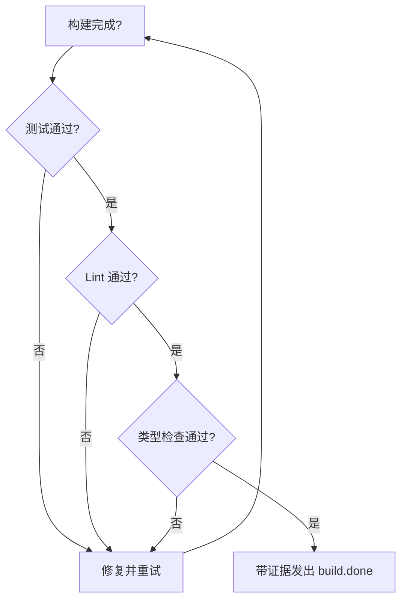

# 反压(Backpressure)

反压是 Ralph 用于强制质量门禁的机制。它不去规定"怎么做",而是定义"什么算合格",把不合格的工作挡回去。

## 核心思想

> "不要规定怎么做;要建立把不合格工作挡回去的门。" —— 第二信条

传统方式(规定做法):

```
1. 先写函数
2. 再写测试
3. 然后跑测试
4. 然后修复任何失败
5. 然后跑 lint
```

反压方式:

```
实现功能。
所需证据:tests: pass, lint: pass, typecheck: pass, audit: pass, coverage: pass
可选(仅警告):mutants: pass (>=70%)
可选(失败会阻塞):specs: pass
```

AI 自己想办法"怎么做"——它够聪明。你的工作是定义"什么算成功"。

## 工作原理

### 在 Hat 指令中

```yaml
hats:
  builder:
    instructions: |
      实现分配的任务。

      ## 反压要求

      在发出 build.done 之前,你必须已经满足:
      - tests: pass(运行 `cargo test`)
      - lint: pass(运行 `cargo clippy`)
      - typecheck: pass(运行 `cargo check`)
      - audit: pass(运行 `cargo audit`)
      - coverage: pass(运行 `cargo tarpaulin` 或等效工具)
      - mutants: pass(运行 `just mutants-baseline`)# 仅警告

      在事件中带上证据:
      ```
      ralph emit "build.done" "tests: pass, lint: pass, typecheck: pass, audit: pass, coverage: pass, mutants: pass (82%)"
      ```
```

### 在事件载荷中

事件必须携带反压达标的证据:

```bash
# 好:带证据
ralph emit "build.done" "tests: pass, lint: pass, typecheck: pass, audit: pass, coverage: pass, mutants: pass (82%)"

# 坏:无证据
ralph emit "build.done" "我觉得能跑"
```

### 由其它 Hat 验证

可以让一个审查类 hat 去核验反压:

```yaml
hats:
  reviewer:
    triggers: ["build.done"]
    instructions: |
      核验 builder 的声明:
      1. 检查事件载荷里的证据
      2. 如果证据看起来不够,重新跑一遍测试
      3. 反压未达标则拒绝

      通过:
        ralph emit "review.approved" "evidence verified"
      拒绝:
        ralph emit "review.rejected" "tests actually failing"
```

## 反压的类型

### 技术门

| 门 | 命令 | 拦截什么 |
|------|---------|-----------------|
| Tests | `cargo test`、`npm test` | 回归、Bug |
| Lint | `cargo clippy`、`eslint` | 代码质量问题 |
| Typecheck | `cargo check`、`tsc` | 类型错误 |
| Audit | `cargo audit`、`npm audit` | 已知漏洞 |
| Format | `cargo fmt --check` | 风格违规 |
| Build | `cargo build` | 编译错误 |
| Mutation | `just mutants-baseline`(基线)、`just mutants-hooks-gate`(CI 门) | 未被测试覆盖的逻辑空缺;hooks 灰度门同时强制阈值与关键路径无 `MISS` 的硬不变量 |
| Specs | 验证验收标准 | 测试未覆盖的规格点(可选,失败会阻塞) |

### 仓库变异测试基线

本仓库的变异测试基线工具为 **cargo-mutants**,通过以下命令调用:

```bash
just mutants-baseline
```

该命令作用域限于 hooks 关键模块,展开后等价于:

```bash
cargo mutants --file crates/ralph-core/src/hooks/executor.rs --file crates/ralph-core/src/hooks/engine.rs --file crates/ralph-core/src/preflight.rs --file crates/ralph-cli/src/loop_runner.rs
```

变异目标范围:
- `crates/ralph-core/src/hooks/executor.rs`
- `crates/ralph-core/src/hooks/engine.rs`
- `crates/ralph-core/src/preflight.rs`
- `crates/ralph-cli/src/loop_runner.rs`(hook disposition + suspend 控制路径)

全局变异质量门槛仍锚定 **>=70%**,由
`crates/ralph-core/src/event_parser.rs` 中的
`QualityReport::MUTATION_THRESHOLD` 定义。

针对 hooks 灰度的局部基线,校准结果记录于
`docs/06-analysis/hooks-mutation-baseline-2026-03-01.md`,把运行期门槛设为
**>=55%**(`caught / (caught + missed)`);超时与关键路径无存活变异体的检查另行强制。

强制执行的 hooks 变异 CI 门为:

```bash
just mutants-hooks-gate
```

`mutants-hooks-gate` 调用 `scripts/hooks-mutation-gate.sh`,其行为:

- 强制 `>= HOOKS_MUTATION_THRESHOLD` 的运行期得分;
- 在 `crates/ralph-cli/src/loop_runner.rs:3467-3560,3623-3635` 范围内,任何 `MISS` 直接硬失败;
- 单独报告 `TIMEOUT` 与 `unviable` 类别;
- 把可操作的产物写入 `.artifacts/hooks-mutation/` 以供 CI 上传。

### 行为门

对主观性标准,使用 LLM-as-judge:

```yaml
hats:
  quality_judge:
    triggers: ["code.written"]
    instructions: |
      评估代码质量:
      - 是否可读?
      - 命名是否表意?
      - 复杂度是否合理?

      通过或拒绝,并给出解释。
```

### 文档门

```yaml
hats:
  doc_reviewer:
    triggers: ["feature.done"]
    instructions: |
      检查文档:
      - [ ] README 已更新
      - [ ] API 文档完整
      - [ ] 示例可运行

      文档缺失即拒绝。
```

## 反压的落地

### 在 Guardrails 里

注入到每个 prompt 的全局规则:

```yaml
core:
  guardrails:
    - "声明完成前测试必须通过"
    - "永远不要跳过 lint"
    - "所有公开函数必须写 doc 注释"
```

### 在 Hat 指令里

每个 hat 的具体要求:

```yaml
hats:
  builder:
    instructions: |
      实现完成后:
      1. 运行 `cargo test`
      2. 运行 `cargo clippy`
      3. 只有两者都通过才发出 build.done
```

### 在事件设计里

需要带证据的事件:

```yaml
# 不要只发 "done" 事件
publishes: ["build.done"]

# 考虑 "done with evidence" 的形式
# 载荷结构本身强制要求带证据
```

## 反压流程



## 常见模式

### 全有或全无

所有项必须通过:

```bash
cargo test && cargo clippy && cargo fmt --check && \
  ralph emit "build.done" "all checks pass"
```

### 渐进式门

不同严格度:

```yaml
# 第一轮:只跑测试
evidence: "tests: pass"

# 后续轮次:全部检查
evidence: "tests: pass, lint: pass, typecheck: pass, audit: pass, coverage: pass (>=80%)"
```

### 例外开口

用于特殊情况:

```yaml
instructions: |
  默认情况下,所有测试都必须通过。

  例外:若某测试 flaky(间歇性失败),
  记下来并继续。补一条记忆:
  ralph tools memory add "Flaky test: test_network_timeout" -t fix
```

## 反模式

### 无反压

```yaml
# 坏:没有任何质量要求
instructions: |
  实现这个功能并发出 build.done。
```

### 假证据

```yaml
# 坏:声称有证据但其实没跑
ralph emit "build.done" "tests: pass, lint: pass, typecheck: pass, audit: pass, coverage: pass"  # 实际并未跑测试
```

### 门过多

```yaml
# 坏:要求过载
instructions: |
  必须通过:单元测试、集成测试、端到端测试、
  lint、typecheck、format、安全扫描、性能
  基准、可访问性审计、国际化检查……
```

反压要聚焦在真正重要的事情上。

## 最佳实践

1. **从测试开始** —— 最基础的门槛
2. **加 lint 保质量** —— 拦截常见问题
3. **带证据** —— 不只是声明,要去证明
4. **核验声明** —— 用审查类 hat
5. **保持可达** —— 太严会卡死进度

## 下一步

- 参见[创建自定义 Hat](../advanced/custom-hats.md)了解 hat 设计
- 探索带内置反压的 [Presets](../guide/presets.md)
- 学习[测试与验证](../advanced/testing.md)