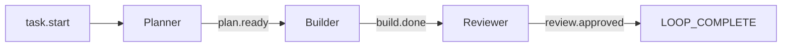
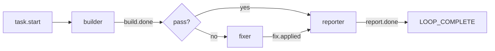
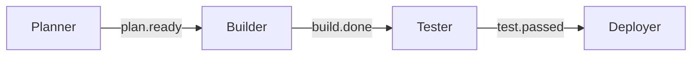
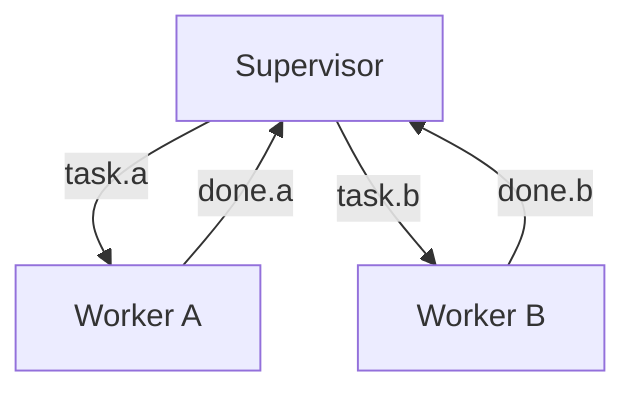
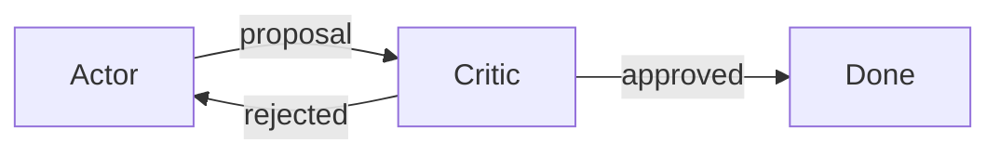

# Hats & Events

Hats are specialized Ralph personas that coordinate through typed events. This enables complex workflows with role separation.

## What Are Hats?

A hat is a persona that Ralph can "wear" — each with:

- **Triggers** — Events that activate this hat
- **Publishes** — Events this hat can emit
- **Instructions** — Prompt injected when hat is active

```yaml
hats:
  planner:
    name: "📋 Planner"
    triggers: ["task.start"]
    publishes: ["plan.ready", "plan.blocked"]
    instructions: |
      Create an implementation plan for the task.
      When done, emit plan.ready with a summary.
```

## How Events Work

Events are typed messages with:

- **Topic** — What kind of event (e.g., `build.done`)
- **Payload** — Optional data
- **Source hat** — Which hat published it
- **Target hat** — Optional routing

### Event Flow



### Publishing Events

Hats publish events using `ralph emit`:

```bash
ralph emit "build.done" "tests: pass, lint: pass, typecheck: pass, audit: pass, coverage: pass"
```

Or with JSON payloads:

```bash
ralph emit "review.done" --json '{"status": "approved", "issues": 0}'
```

When Ralph runs a Hat backend, it automatically injects provenance environment variables (`RALPH_CURRENT_HAT`, `RALPH_CURRENT_LOOP_ID`, `RALPH_EVENTS_FILE`, and `RALPH_TRIGGERED_HAT`). This means Hats can usually emit without explicit `--hat` flags — the event log will carry the correct attribution automatically.

For strict policy configs that require provenance, you can still pass flags explicitly:

```bash
ralph emit "experiment.planned" --json '{"task_key":"x"}' --hat strategist --triggered implementer
```

## Event Routing

Events are routed to hats based on subscription patterns:

### Exact Match

```yaml
triggers: ["task.start"]  # Only matches "task.start"
```

### Glob Patterns

```yaml
triggers: ["build.*"]     # Matches build.done, build.failed, etc.
triggers: ["*.error"]     # Matches build.error, test.error, etc.
triggers: ["*"]           # Matches everything
```

## Hat Configuration

### Basic Hat

```yaml
hats:
  builder:
    name: "🔨 Builder"
    triggers: ["task.start", "plan.ready"]
    publishes: ["build.done", "build.failed"]
    instructions: |
      Implement the task or plan.
      Run tests before declaring done.
```

### Hat with Backend Override

```yaml
hats:
  reviewer:
    name: "🔍 Reviewer"
    triggers: ["build.done"]
    publishes: ["review.approved", "review.rejected"]
    backend: "claude"  # Use Claude even if default is different
    instructions: |
      Review the implementation for quality.
```

### Hat with Max Activations

```yaml
hats:
  refactorer:
    name: "✨ Refactorer"
    triggers: ["test.passed"]
    publishes: ["refactor.done"]
    max_activations: 3  # Limit how many times this hat activates
    instructions: |
      Clean up the code.
```

### Default Publishes

```yaml
hats:
  worker:
    triggers: ["task.start"]
    publishes: ["work.done", "work.blocked"]
    default_publishes: "work.done"  # If no explicit emit
```

## Execution Modes

Ralph supports two ways of running hats:

### `coordinator` (default)

All hats share a single backend process. The coordinator prompt includes the instructions of every active hat, and one backend call can advance multiple workflow stages if the model emits several business events. This is fast and efficient, and it is the right choice for most workflows.

### `isolated`

Each hat runs in its own backend process. The prompt contains **only** the current hat's instructions and the events it is allowed to see. One backend call can produce **at most one** business event, so a multi-hat pipeline needs one iteration per hat. This prevents cross-hat prompt contamination and is the right choice when hats must remain truly independent (e.g. red-team vs. target, reviewer vs. author, or evaluator vs. generator).

#### Trade-offs

| Mode | Speed | Cost | Isolation | Use when |
|---|---|---|---|---|
| `coordinator` | Fast (1 process) | Low | Hats see each other's instructions | General workflows, small teams |
| `isolated` | Slower (1 process per hat stage) | Higher | Hats cannot see other hats' instructions | Red-team, reviewer, evaluator independence |

#### Configuring isolated mode

```yaml
event_loop:
  execution_mode: isolated

hats:
  strategist:
    subscribes_to:
      - task.start
    publishes:
      - experiment.planned
    instructions: |
      Plan the experiment approach.

  implementer:
    subscribes_to:
      - experiment.planned
    publishes:
      - experiment.ready
    instructions: |
      Implement the plan.

  reviewer:
    subscribes_to:
      - experiment.ready
    publishes:
      - review.done
    instructions: |
      Review the work independently.
```

In this example the strategist, implementer, and reviewer each run in a separate backend process. The reviewer never sees the strategist's or implementer's instructions, and the model cannot skip ahead by emitting multiple downstream events in a single call.

> **Note:** Isolation applies to the backend prompt and event boundary, not to the filesystem. All hats can still read the same working-directory files.

> **Note:** The `subscribes_to` field is an alias for `triggers`. Both names are accepted in configuration files. We use `subscribes_to` in examples because it reads more naturally in event-driven documentation, but `triggers` is the canonical field name.

## Event System Design

### Starting Event

The first event published when Ralph starts:

```yaml
event_loop:
  starting_event: "task.start"  # Triggers initial hat
```

### Completion Promise

The signal that ends the loop:

```yaml
event_loop:
  completion_promise: "LOOP_COMPLETE"
```

A hat can output this directly, or emit a completion event:

```yaml
hats:
  coordinator:
    triggers: ["all.done"]
    instructions: |
      All work complete. Output: LOOP_COMPLETE
```

### Required Events (All-of Gate)

`required_events` defines a list of topics that **all** must have appeared at least once before `LOOP_COMPLETE` is accepted. This is an **all-of** gate, not any-of: every listed topic must be satisfied.

```yaml
event_loop:
  completion_promise: "LOOP_COMPLETE"
  required_events: ["report.done"]
```

When the agent emits `LOOP_COMPLETE` and any required event has not been seen, the orchestrator rejects the completion and injects a `task.resume` event with a message like:

```
LOOP_COMPLETE rejected: missing required events: ["report.done"].
The agent must complete all workflow phases before emitting LOOP_COMPLETE.
Use loop.cancel to abort the workflow instead.
```

**How to choose required events:**

Select a convergence topic -- one that lies on every successful completion path. Avoid leaf topics that only one path emits.



In this graph, `report.done` is the convergence topic. Both the pass path and the fix path converge on the reporter, which emits `report.done`. Using `fix.applied` as a required event would be incorrect because the pass path never emits it.

**Validation:**

Use `ralph hats validate` to verify that each required event is on all completion paths. The validator builds a topology graph of topics and hats, then checks that blocking any required topic (and all hats that publish it) makes completion unreachable. If a required event can be bypassed, the validator reports an error.

```bash
ralph hats validate -H presets/my-workflow.yml
```

See [Presets](../guide/presets.md) for detailed guidance on creating presets with `required_events`.

## Common Patterns

### Pipeline

Linear flow from one hat to the next:



### Supervisor-Worker

One coordinator, multiple workers:



### Critic-Actor

One proposes, another critiques:



## Ordered Workflows with Guards

Some workflows require strict phase ordering. A hat should not emit a downstream event until its predecessor has completed. Without enforcement, a side-channel signal (like `periodic.review`) could bypass a required phase.

### The Problem

In an AutoResearch-style pipeline:

```
experiment.planned → experiment.ready → experiment.measured → experiment.scored → experiment.evaluated
```

If `periodic.review` triggers an evaluator while an experiment is still in the `measured` state, the evaluator could emit `experiment.evaluated` before scoring happens. The loop may then complete with corrupted state.

### The Solution: Workflow Guards

Configure `workflow_guards` in `event_loop` to enforce ordered topic chains:

```yaml
event_loop:
  starting_event: "experiment.start"
  workflow_guards:
    chains:
      - name: experiment
        topics:
          - experiment.planned
          - experiment.ready
          - experiment.measured
          - experiment.scored
          - experiment.evaluated
        mode: strict
        correlation:
          from_payload: experiment_id
```

With this in place, Ralph rejects out-of-order events before they reach the event bus. For example, `experiment.evaluated` is blocked until `experiment.scored` has been recorded for that experiment instance.

### Key Behaviors

- **Side-channel events** (like `periodic.review`) do not advance the guarded chain unless explicitly listed as chain topics
- **Per-instance tracking** uses `correlation.from_payload` to extract an instance key from JSON payloads, isolating parallel workflow instances
- **Recovery events** (`task.resume`) are published when an event is rejected, directing the agent to the missing prerequisite
- **Completion rejection** (`LOOP_COMPLETE`) is blocked if any started guarded instance has not reached its terminal phase
- **`mode: strict`** rejects out-of-order events; **`mode: advisory`** records topics without rejecting

### Event Policy

Event policy validates event payloads and enforces lifecycle rules before events reach the bus. It is opt-in and complements workflow guards: guards check *when* a topic may appear; policy checks *what* the event contains and whether it violates terminal-state rules.

**Use cases:**
- Require JSON payloads with specific fields (e.g. `experiment.planned` must contain `task_key`)
- Restrict field values to an allowed set (e.g. `evaluation.decision` must be `keep`, `discard`, or `blocked`)
- Prevent business events after terminal topics like `LOOP_COMPLETE`

**Configuration:**

```yaml
event_loop:
  event_policy:
    enabled: true
    mode: observe              # observe | enforce
    on_violation: warn         # warn | reject_with_resume | hold | block
    schemas:
      experiment.planned:
        payload: json_object
        required_fields:
          - task_key
      experiment.evaluated:
        payload: json_object
        required_fields:
          - task_key
          - evaluation.decision
        allowed_values:
          evaluation.decision: [keep, discard, blocked]
    terminal_topics:
      - LOOP_COMPLETE
    business_topics:
      - experiment.planned
      - experiment.evaluated
```

**Modes:**
- `observe` — violations are logged but events still pass through (recommended for initial rollout)
- `enforce` — violations trigger `on_violation`

See [Configuration](../guide/configuration.md#event_policy) for the complete reference.

### Guards vs. Other Mechanisms

| Mechanism | What it checks |
|-----------|----------------|
| `required_events` | Global topic list — has this topic appeared at all? |
| `enforce_hat_scope` | Per-hat publish permissions — can this hat emit this topic? |
| `workflow_guards` | Topic sequence — can this topic appear now given what came before? |
| `event_policy` | Payload shape, field values, and terminal-state lifecycle |

Guards and policy complement the others: `required_events` gates completion, `enforce_hat_scope` gates publication rights, `workflow_guards` gates runtime ordering, and `event_policy` gates payload validity and lifecycle correctness.

## Viewing Events

```bash
# View event history
ralph events

# Output:
# 2024-01-21 10:30:00 task.start → planner
# 2024-01-21 10:32:15 plan.ready → builder
# 2024-01-21 10:35:42 build.done → reviewer
```

## Best Practices

### 1. Keep Events Small

Events are routing signals, not data transport:

```bash
# Good: Small payload
ralph emit "build.done" "tests: pass, lint: pass, typecheck: pass, audit: pass, coverage: pass"

# Bad: Large payload
ralph emit "build.done" "full output of all test results..."
```

Use memories for detailed output:

```bash
ralph tools memory add "Build details: ..." -t context
ralph emit "build.done" "tests: pass, lint: pass, typecheck: pass, audit: pass, coverage: pass"
```

### 2. Clear Triggers

Make triggers specific:

```yaml
# Good: Specific
triggers: ["plan.ready", "plan.revised"]

# Risky: Too broad
triggers: ["*"]
```

### 3. One Responsibility Per Hat

Each hat should have a clear, single purpose:

```yaml
# Good: Focused
hats:
  tester:
    triggers: ["build.done"]
    instructions: "Run tests and report results."

# Bad: Multiple responsibilities
hats:
  do_everything:
    triggers: ["*"]
    instructions: "Test, lint, deploy, document..."
```

## Completion Gate

The `completion_promise` (default: `LOOP_COMPLETE`) defines the event that terminates the loop. You can configure additional gates using `required_events`:

```yaml
event_loop:
  completion_promise: "LOOP_COMPLETE"
  required_events:
    - "report.done"
```

### All-Of Semantics

`required_events` uses **all-of** semantics — the loop only terminates when every listed event has appeared on the event bus. This prevents premature completion before critical workflow stages finish.

Choose a **convergence topic** that every successful completion path emits. For example, `report.done` is a good convergence topic because the reporter hat is the last hat in the chain before `LOOP_COMPLETE`.

### Mutually Exclusive Events

Do not use mutually exclusive branch events (e.g., `review.passed` + `review.complete`) as required events. If two events come from different execution branches, no single path emits both. The topology validator (`ralph hats validate`) detects this and rejects such configurations.

### Validating Your Topology

Use `ralph hats validate` to verify your event topology before running:

```bash
# Validate a hat collection file
ralph hats validate -H .ralph/hats/my-workflow.yml

# Validate a builtin preset
ralph hats validate -H builtin:ce-executor
```

The validator checks:
1. The starting event reaches at least one hat
2. The completion promise is reachable from the starting event
3. All required events are on every completion path
4. No orphan or dead-end topics

The same check also runs during `ralph preflight` and `ralph run` (as `preset-topology`), so bad configurations fail before any backend API call.

## Next Steps

- Explore [Presets](../guide/presets.md) for ready-made hat workflows
- Learn about [Agent Waves](../advanced/agent-waves.md) for parallel hat execution
- Learn about [Memories & Tasks](memories-and-tasks.md)
- Understand [Backpressure](backpressure.md) for quality gates
