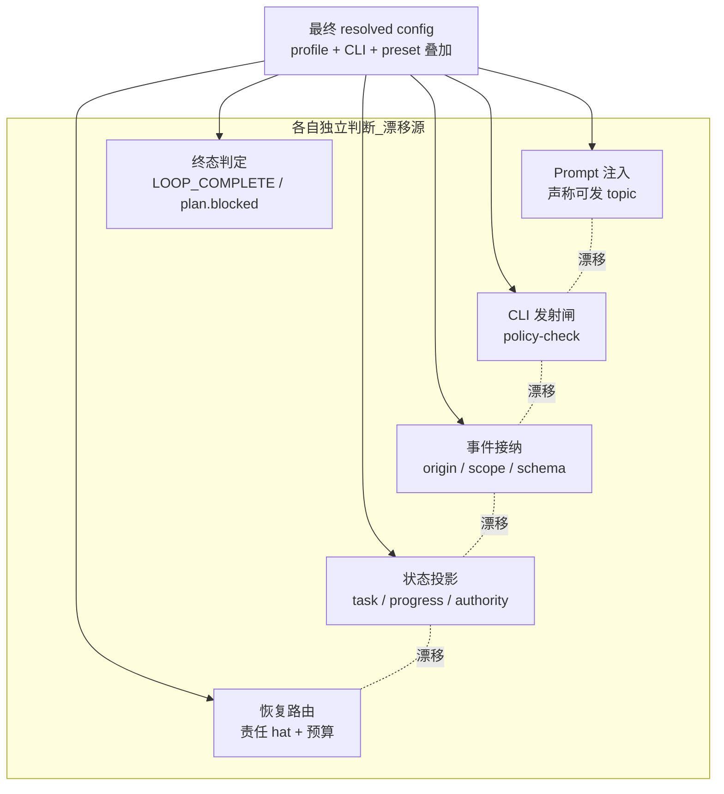
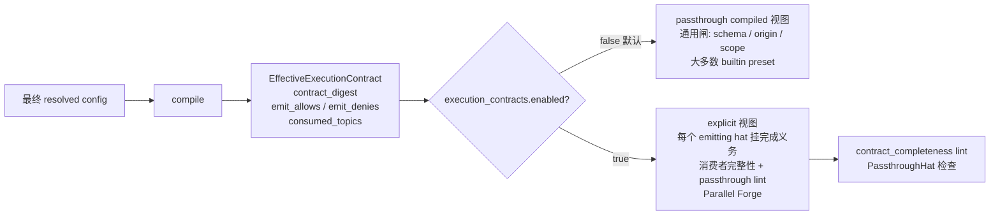
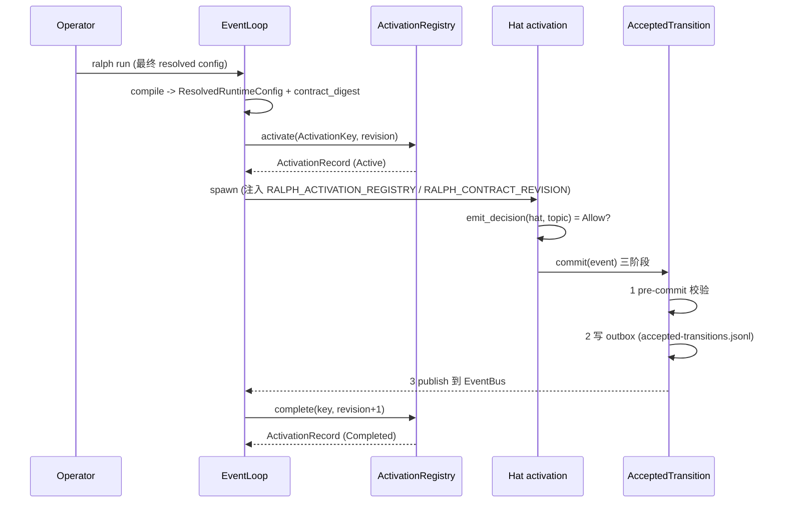
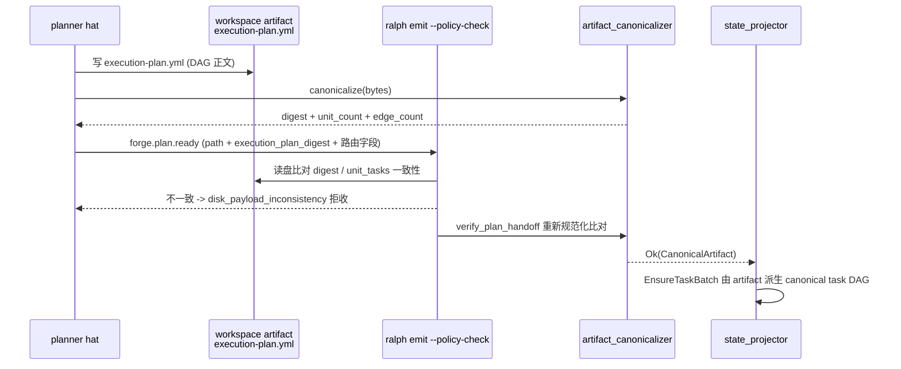
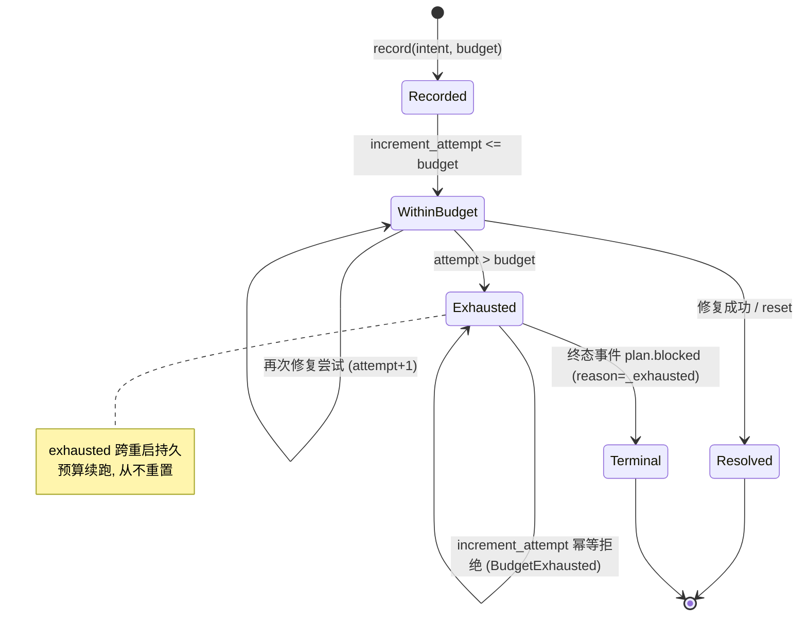

# Effective Activation Contract — 设计说明

> 本文是**面向读者**的设计解释文档：写给想要理解系统的工程师，不是写给实施者的规格说明，也不是 agent 注入 skill。
>
> 命令语法、payload 字段约束、`required_fields` 等**权威参数表**不在本文复述，请到注入 skill 查阅：
> `crates/ralph-core/data/ralph-tools.md`（核心规则）、`ralph-tools-emit.md`、`ralph-tools-wave.md`、`ralph-tools-tasks.md`、`ralph-tools-precheck.md`、`ralph-tools-recovery-directives.md`、`ralph-tools-opac.md`。
> 本文只在解释所需时引用其中章节，例如「字段约束见 `ralph-tools-emit` §Precheck Gates」。
>
> 配套的使用指南见 [`execution-contract-usage.md`](./execution-contract-usage.md)。

---

## 1. 问题陈述

Ralph 的一次 hat activation（某个 hat 在某一轮被触发后跑起来的那个隔离进程）在运行期间会被**多个消费者**同时评判「你现在到底能做什么」：

- **配置解析**：profile / CLI / preset 叠加后，这个 hat 的 `publishes` / `triggers` / `terminal_events` 是什么；
- **Prompt 注入**：给 agent 看的 `## HAT IDENTITY` / `## TRIGGER CONTEXT` 区块声称它能发什么 topic；
- **CLI 发射闸**：`ralph emit` / `ralph wave emit` 在落盘前的 `--policy-check`；
- **事件接纳**：runtime 把 agent 输出解析成事件后的 origin / scope / schema 校验；
- **状态投影**：事件被接纳后如何 materialize 成 task / progress / authority；
- **权限与恢复**：拒收之后把修复责任路由给哪个 hat、还剩多少重试预算；
- **终态判定**：什么事件能让 loop 收敛到 `LOOP_COMPLETE` / `plan.blocked`。

在这些消费者**各自独立**判断「这个 activation 此刻能做什么」时，它们会**漂移**：Prompt 说能发、CLI 却拒收；CLI 收下了、投影却无声丢弃；拒收之后恢复路由给了一个根本没有修复能力的 hat。每一个消费者都「局部正确」，合起来却互相矛盾。根因是**缺少一个所有消费者共同引用的、版本化的单一真相**。

**Effective Activation Contract（有效激活契约）** 就是为了消灭这种漂移：在 loop 启动前，把最终 resolved config 编译成一份**冻结的、带指纹的执行契约**，让上述所有消费者引用**同一份**权限与动作真相。任何 activation identity、revision 或 config 指纹不匹配都必须拒绝继续执行（fail-closed），而不是带着不一致的声明把 loop 跑起来。

---

## 2. 设计原则

1. **单一真相，编译期冻结**。契约在 loop 初始化**之前**由 `compile()` 一次性编译完成；编译成功后 resolved config 在 loop 生命周期内不再变更。见 `crates/ralph-core/src/execution_contract/compiler.rs:172-262`（`compile`）与 `compiler.rs:135-165`（`ResolvedRuntimeConfig` 冻结包装）。

2. **Fail-closed 优先于 fail-open**。未知能力一律拒绝；损坏的持久化状态一律报错而不是静默冷启动。能力解析见 `compiler.rs:117-126`（`emit_decision`：显式 deny → 拒绝；声明 allow → 允许；其余 → 拒绝）。

3. **确定性指纹**。同一输入永远产生同一 `contract_digest`。指纹对 profile overlay / CLI overlay / event schema / precheck 脱糖输入 / hat 拓扑 / deny rules / execution contracts / 终态身份全部敏感，见 `compiler.rs:270-423`（`canonical_contract_bytes`，所有 map/set 排序后序列化）。

4. **先落盘、后副作用**。业务状态变化先写可恢复的 receipt，再发布事件；崩溃后由 receipt replay 补齐。见 `crates/ralph-core/src/event_loop/accepted_transition.rs:147-200`（三阶段 commit）。

5. **deny-wins**。同一条 `(hat, topic)` 上，显式 deny 永远压过 publish 侧的 allow。见 `compiler.rs:176-207`（先收集 `emit_denies`，allow 集合在构建时就剔除被 deny 的键）。

6. **artifact-first handoff**。跨 hat 的完整结果、DAG 正文、证据写入 workspace 业务 artifact，事件只携带路径 + 身份 + digest 等短字段。见 §5。

7. **持久化预算不重置**。恢复重试预算跨 loop 重启续跑，永不归零，避免永久失败的恢复路由无限循环。见 §6 与 `crates/ralph-core/src/recovery_intent.rs:180-211`。

---

## 3. 两视图分工：explicit 视图 vs passthrough（compiled）视图

契约编译对**所有** preset 都生效，但「契约是否对每个 emitting hat 施加完成义务」分两种视图：

- **passthrough（compiled）视图**：`execution_contracts.enabled = false`（默认）。契约仍然编译、仍然解析出 `emit_allows` / `emit_denies` / `contract_digest`，但**不**要求每个 emitting hat 背后挂着完成义务规则。大多数 builtin preset 走这条路径——它们依靠 schema / origin / scope 这些通用闸，而不为每个 topic 单独声明「交卷义务」。

- **explicit 视图**：`execution_contracts.enabled = true`，且每个 emitting hat 至少有一个它发布的 topic 挂着 `execution_contracts.rules` 规则。此时编译期会额外跑两条完整性检查：
  - **消费者完整性**（`compile` 内）：声明了契约规则却不是终态/完成 topic 的 topic，必须有至少一个 hat `triggers` 消费它，否则编译失败（`ContractCompileFindingKind::MissingConsumer`，`compiler.rs:214-249`）。
  - **passthrough lint**（`contract_completeness`）：能发事件却没有任何契约规则覆盖其发布 topic 的 hat 被标记为 `PassthroughHat`——它的输出「穿透」下游而无任何背压闸。见 `crates/ralph-core/src/contract_completeness.rs:30-37` 与 `:80`。

**Parallel Forge 是第一个完整迁移到 explicit 视图的 builtin preset**：它的 planner / dispatcher / executor / reviewer / integrator / verifier 等 emitting hat 都被契约规则覆盖，`forge.plan.ready` 这类 handoff topic 带着 artifact digest 走 artifact-first 交接（§5）。其它 builtin preset 目前仍走 passthrough compiled 视图，迁移路径见 §9。

`EffectiveExecutionContract` 的字段语义见 `compiler.rs:90-106`：`contract_digest`（指纹）、`emit_denies`（显式拒绝的 `(hat, topic)`）、`emit_allows`（deny-wins 剔除后的可发集合）、`consumed_topics`（有 hat 触发的 topic）、`declared_contract_topics`（声明了契约规则的 topic，仅 enabled 时填充）。

---

## 4. Activation lifecycle：契约如何落到一次激活

一次 activation 从编译到退出，经历「编译 → 查询能力 → 登记身份 → 发射/接纳 → 完成」的闭环。关键点：

- **编译（一次）**：loop 启动前 `compile()` 产出 `ResolvedRuntimeConfig`。生产 `EventLoop` 构造必须先过编译并只在 `Ok` 时继续（`compiler.rs:1-18` 模块约束）。
- **能力查询（每次发射）**：某个 `(hat, topic)` 能否发射，由 `emit_decision()` 给出 deny-wins + fail-closed 的 Allow/Deny。只读预览走 `evaluate_candidate_emit`（`crates/ralph-core/src/event_policy.rs:2621`），返回 `policy_decision` / `reasons` / `projection` / `next_hat_candidates`（`event_policy.rs:2554-2600`）。
- **身份登记（持久化）**：activation 的稳定身份是 `ActivationKey = (loop_id, iteration, hat_id)`，登记在 `<workspace>/.ralph/activation-registry.jsonl`，带单调递增 `revision`。见 `crates/ralph-core/src/execution_contract/activation.rs:41`（路径）、`:56-68`（`ActivationRecord`）、`:249-307`（`activate`）。驻留 loop 与独立 CLI（`ralph inspect loop`）读同一份 registry，从而对「同一个 activation」达成身份一致。
- **接纳（单一业务写者）**：业务事件（`work.done` / `plan.complete` / `forge.*` …）必须经 Accepted Transition API 三阶段提交：① pre-commit 校验（拒绝则零副作用）→ ② 持久化 outbox 写 `.ralph/agent/accepted-transitions.jsonl` → ③ 发布到 EventBus。见 `accepted_transition.rs:39`（outbox 路径）、`:147-200`（commit）、`:250`（`commit_idempotent`，replay 幂等）、`:311`（`ack`，ack 后 exactly-once 投递）。
- **完成 / 取代**：activation 经终态事件 `complete`（`activation.rs:315-368`）或被更新的同 hat activation `supersede`（`activation.rs:374-425`）；stale revision 被拒（`ActivationRegistryError::StaleRevision`，`activation.rs:80`）。

事件的**处置（disposition）** 决定它走哪条通道：只有 `Business` 与 `Recovery` 经 Accepted Transition（持久化 outbox + 推进 flow）；`DiagnosticObservation` 与 `LoopControl` 走直发通道，不进 outbox、不推进 phase authority。见 `crates/ralph-core/src/event_loop/disposition.rs:32-57`（四类 + `advances_flow`）、`:84-127`（`classify` 优先级）、`:141-170`（`publish_synthetic`）。

spawn 子进程时，loop 通过 `RALPH_ACTIVATION_REGISTRY` 与 `RALPH_CONTRACT_REVISION` 两个环境变量把 registry 路径与契约 revision 传给 hat 子进程，子进程据此校验自己编译出的契约与 loop 正在跑的一致（`activation.rs:471-517`）。

与状态机 / ledger / 恢复的关系：契约编译出的 `consumed_topics` 与 `declared_contract_topics` 决定了哪些 topic 有消费者、哪些挂着完成义务；Accepted Transition 的 outbox 是 ledger 的权威append-only 记录；拒收产生的恢复责任（§6）引用同一份契约 revision 做确定性路由。

---

## 5. Artifact handoff：`forge.plan.ready` 的 artifact-first 规范化

Parallel Forge 的 planner 不直接把任务 DAG 塞进事件 payload，而是：

1. 把 `execution-plan.yml` 写到 workspace（业务 artifact，DAG 正文的唯一事实源）；
2. 对该 artifact 做**规范化（canonicalize）** 得到确定性 digest；
3. 发 `forge.plan.ready`，payload 只携带 `execution_plan_path` + `execution_plan_digest` + 路由字段（如 `execution_wave` / `wave_total` / `integration_order`）。

**规范化器**（`crates/ralph-core/src/artifact_canonicalizer.rs`）在做任何昂贵工作**之前**先强制资源边界：原始 artifact ≤ 1 MiB（`MAX_ARTIFACT_BYTES`，`:28`）、≤ 512 Units（`MAX_UNITS`，`:33`）、≤ 4096 条依赖边（`MAX_EDGES`，`:38`）。随后递归排序 mapping key 并重新序列化，使「仅 key 顺序 / 缩进 / 引号不同」的两份 artifact 产生**相同** digest（`canonicalize`，`:123-170`；`normalize`，`:194-209`）。sequence 顺序被保留，因为它有语义。

**handoff 校验**（`crates/ralph-core/src/parallel_forge_handoff.rs:117-136`，`verify_plan_handoff`）在收到事件时重新规范化 artifact 并比对 payload 声明的 `plan_digest`：不一致即 `HandoffError::DigestMismatch`（`:22-57`），说明 artifact 在 planner 盖章后被篡改。

**为什么不再接受 agent 对 `unit_tasks` 的双写**：历史上 planner 手工构造 payload、把 `execution_wave` 按叙事标签偏移，导致投影期无恢复路径地拒收。现在：

- CLI 侧 precheck（`crates/ralph-cli/src/policy_check.rs:2794`，`check_forge_plan_ready_disk_consistency`）要求 payload 的 `execution_plan_digest` 与磁盘 artifact 一致、每个 `unit_tasks[]` 项的 `execution_wave` / `integration_order` 按 `task_key` 与磁盘一致，不一致即 `reason_code = "disk_payload_inconsistency"`。
- 投影侧 `EnsureTaskBatch`（`crates/ralph-core/src/config/state_projection.rs:101-131`）通过 JSON pointer 从 **payload 指向的 artifact 内容**派生 task DAG（`items` / `count` / `key` / `title` / `blocked_by_keys`），并可选地用 `execution_plan_digest` pointer 做 digest 交叉校验（`crates/ralph-core/src/state_projector/task.rs:355` 起 `project_ensure_task_batch`，`:497` 调 `validate_wave_schedule`，`:1018-1022` digest 校验）。

结果是：DAG 正文只存在于磁盘 artifact，payload 只是「指向 artifact + 盖章」的短消息；任何独立构造的 payload 都会在 CLI 或投影层被 fail-closed 拒收。

---

## 6. Recovery Intent：拒收之后的确定性修复路由

当一次发射被拒收（origin / policy / execution_contract / payload_contract），runtime 不把修复交给自由文本诊断去「猜」，而是产生结构化的 **Recovery Intent**，绑定 activation lineage、契约 revision、稳定 reason、责任 hat、允许的修复 primitive、retry key 与剩余预算，用于下一次 activation 的确定性恢复。

**持久化预算**（`crates/ralph-core/src/recovery_intent.rs`）：

- 存储于 `<workspace>/.ralph/agent/recovery-intents.jsonl`（`RECOVERY_INTENTS_RELATIVE_PATH`，`:40`）。
- `RecoveryIntent`（`:43-57`）携带 `intent_id` / `target_hat` / `reason` / `attempt_count` / `budget` / `exhausted`。
- 每次变更（`record` `:156-164`、`increment_attempt` `:180-211`）都在排他文件锁下**先刷盘再返回**；重开 store 观察到的 `attempt_count` 与 `exhausted` 与上一实例停止时完全一致——**预算续跑，从不重置**。
- `attempt_count > budget` 时标记 `exhausted` 并返回 `RecoveryError::BudgetExhausted`，此后持续幂等地拒绝（不 panic），且该状态跨重启持久（`:194-210`）。
- 损坏的行 fail-closed 为 `RecoveryError::Corrupt`（`:75-78`），绝不静默丢弃（丢弃会重置预算，正是本 store 要防止的失败模式）。

**终态收敛**（`crates/ralph-core/src/event_loop/recovery_finalizer.rs`）：reminder 型机制（drift 关键发现堆积、repair stream 同一 retry_key 反复失败）共享一个失败模式——只发提醒、永不终止，造成 `Pending <-> Recovered` 抖动。`RecoveryFinalizer` 按机制计数，越过 `max_escalation_count` 时返回**恰好一次** `TerminalEvent`（`:92-102`，topic 默认 `plan.blocked`，reason 形如 `<suffix>_exhausted`），见 `record` `:126-144`、`reset` `:149-154`、`RecoveryMechanism` `:31-38`。

**编译期检测器**（`crates/ralph-core/src/recovery_runtime/mod.rs`）：四个独立检测器消费一小片 runtime 状态，产出 `RecoveryAction`（`:71-80`：`DedupeEnvelope` / `PublishEvent` / `InjectDirective` / `ForcePlanBlocked`），由 `dispatch`（`:85-99`）合并；retry-cap 检测器最后跑，其 `ForcePlanBlocked` 压过更早的升级，打破「loop 停不下来」的递归。

**fail-closed 权威（precheck gate）**：合成 `precheck-<X>` gate hat 被 `X.proposed` 激活后，runtime 必须在下一激活周期关闭前观察到 `X` 或 `X.rejected` 恰好一个；若 gate 沉默，runtime 合成 `X.rejected`（`reason = "gate_silent_or_ambiguous"`，`synthetic = true`）交给下游拒收路由，绝不放行沉默 gate。见 `crates/ralph-core/src/event_loop/precheck_gate_enforcement.rs:1-24`（契约）、`:31`（`GATE_HAT_PREFIX`）、`:243`（`collect_synthetic_precheck_rejections`）。Precheck 的 agent 视角行为见 `ralph-tools-precheck` skill。

---

## 7. 关键 trade-off

- **安全 vs 可用**：能力解析 fail-closed（未知 topic 拒绝），代价是新增 topic 必须显式声明 `publishes` 才能发；这是有意的——宁可让 agent 撞一次拒收并拿到结构化恢复指引，也不放任越权发射。deny-wins 保证任何显式禁令不会被 publish 侧覆盖。
- **性能 vs 确定性**：`canonical_contract_bytes` 对所有 map/set 排序后序列化、artifact 规范化递归排序 key，牺牲一点编译期开销换取「同输入同 digest」的跨进程/跨重启一致性；资源边界（1 MiB / 512 / 4096）在任何昂贵解析之前强制，防止恶意或失控 artifact 耗尽内存或依赖图。
- **向后兼容**：`execution_contracts.enabled` 默认 false，契约照编译但不施加完成义务、不跑消费者完整性检查（`compiler.rs:220-245` 仅在 enabled 时检查），使既有 preset 无需改动即可继续运行；`EnsureTaskBatch` 的 `execution_wave` / `integration_order` / `execution_plan_digest` pointer 为 `Option`，未声明时走 legacy DAG-only 路径（`state_projection.rs:112-131`）。仓库整体对向后兼容态度宽松（见 CLAUDE.md「Backwards compatibility doesn't matter」），但此处保留 opt-in 开关是为了让 preset 逐个迁移而非一次性强制。
- **持久化 vs 复杂度**：activation registry / recovery intent / accepted-transition outbox 都是 JSONL + 跨进程文件锁，每次变更先刷盘。换来崩溃可恢复与跨进程身份一致，代价是每次 mutation 一次磁盘往返与锁竞争。

## 8. 已知限制

- **契约编译是启动期一次性动作**：loop 运行中改 config 不会重编译；`ResolvedRuntimeConfig` 在 loop 生命周期内冻结是契约（`compiler.rs:129-138`）。
- **completeness lint 与机器可读契约视图目前是 core 库 API**：`check_contract_completeness`（`contract_completeness.rs:80`）与 `inspect_contract_json`（`contract_completeness.rs:120-140`，按 hat 输出 `contract_digest` / `emit_allows` / `emit_denies`）已在 `ralph-core` 落地并有测试，但尚未接到独立 CLI 子命令；operator 今天用 `ralph inspect prompt --topic --payload` 的能力预览（§usage）查询同一份编译结果。
- **artifact 规范化只对 YAML mapping 排序**：sequence 顺序被视为语义保留，因此「仅数组顺序不同」会产生不同 digest——这是有意设计，但调用方需知道。
- **disposition 默认 Business**：未识别 topic 会走 Accepted Transition（fail toward durability）；诊断/控制 topic 必须落在 `event.*` / `human.*` / `*.diagnostic` / `*.warning` 等命名空间或精确匹配，才能避开业务通道（`disposition.rs:79-127`）。

## 9. 后续迁移路径（其它 preset → explicit 视图）

把一个 passthrough preset 迁到 explicit 视图的增量步骤：

1. 为每个 emitting hat 至少一个发布 topic（或其拥有的终态事件）在 `execution_contracts.rules` 下声明规则，并置 `execution_contracts.enabled = true`。
2. 跑 `compile`：若某声明 topic 无消费者且非终态，会得 `MissingConsumer` 编译失败——补消费者 hat trigger 或删规则。
3. 跑 passthrough lint（`check_contract_completeness`）：消除所有 `PassthroughHat` finding，即每个 emitting hat 都被契约覆盖。
4. 对需要跨 hat 交接完整结果的 handoff topic，改为 artifact-first：artifact 写盘 + canonicalize digest + 事件只带路径/身份/digest，并在投影侧用 `EnsureTaskBatch` 的 digest pointer 做交叉校验（参照 §5 的 Parallel Forge）。
5. 同步更新 preset schema / lint / BDD scenario 与 agent skill 文档（参见 CLAUDE.md「preset/schema 改动后的下游同步清单」硬规则）。

Parallel Forge 是走完这条路径的参照实现；其它 preset 可按 hat 逐步迁移，无需一次性切换。
