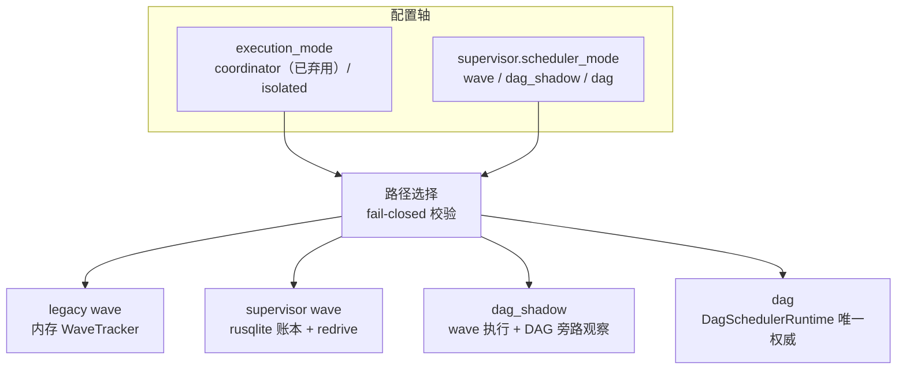

# 调度模式（Scheduler Modes）— 设计说明

> 本文是**面向读者**的设计解释文档：讲清 ralph loop 的调度权威（谁负责决定"下一步跑哪个 hat/job"）有哪几条实现路径、为什么这样分层、以及如何选型。
>
> **配套的 operator 操作手册**见 [`../advanced/dag-scheduler.md`](../advanced/dag-scheduler.md)（配置示例、inspect 字段表、`dag_shadow` 验证流程、`.ralph/dag.db` migrations）。
>
> **agent 注入 skill 的权威字段表**不在本文复述：DAG 模式下的环境变量与终态事件约束见 `crates/ralph-core/data/ralph-tools.md` §Runner 注入的环境变量 → DAG typed `JobContext`，以及 `crates/ralph-core/data/ralph-tools-emit.md` §`forge.unit.executed` 的幂等约束。
>
> 本文标注的关键事实均附源码位置（`path:line`），用于日后 drift 检查；行号漂移时请以函数/类型名为准重新定位。

---

## 1. 问题陈述：谁是调度权威

一个 ralph loop 里，事件被接纳之后"接下来激活谁、并发开几个、何时整合结果"需要一个**调度权威**来裁决。这个权威经历了三代演进，目前以两条配置轴上的四个组合共存：

四条路径不是四个独立实现，而是**同一条迁移路线上的四个站点**（动机见 §4，顺序见 §6）。理解它们的关键是看清每一步把哪一块职责从"prompt/内存"收编到了"runtime/持久账本"。

---

## 2. 两个正交的配置轴

### 2.1 `event_loop.execution_mode`（两态）

`HatExecutionMode`（`crates/ralph-core/src/config/workflow_guards.rs:45-56`）：

- `coordinator`（serde 默认值，**已弃用**）：所有 hat 的 instructions 注入同一个 prompt，Ralph 充当中央协调者。
- `isolated`：每个 hat 在独立 backend 进程中运行，只能通过 runtime API（`ralph tools task` / `ralph emit`）通信。自 2026-06-18 起全部 builtin preset 收敛到 isolated，且 4+ hat 的 preset 被强制要求 isolated（见 `AGENTS.md`「Multi-Hat Isolation Policy」）。

### 2.2 `event_loop.supervisor.scheduler_mode`（三态）

`SchedulerMode`（`crates/ralph-core/src/config/scheduler_mode.rs:35-49`，serde `snake_case`，缺省 `wave`）：

| 值 | 调度权威 | 一句话语义 |
|---|---|---|
| `wave`（默认） | legacy `WaveTracker` | 旧路径原样运行，零回归契约 |
| `dag_shadow` | legacy wave（唯一权威） | wave 照常执行，DAG 调度器旁路 dry-run 观察，零副作用 |
| `dag` | `DagSchedulerRuntime`（唯一权威） | runtime 自有 work-conserving DAG 调度器接管派发 |

### 2.3 fail-closed 组合规则

`validate_scheduler_mode`（`scheduler_mode.rs:183-201`）：

- `dag_shadow` / `dag` **必须**同时满足 `supervisor.enabled: true` 且 `execution_mode: isolated`；
- 违反组合在 `ralph preset check` / preflight / `ralph run` 启动即被拒绝，错误信息含字段路径 `event_loop.supervisor.scheduler_mode`（错误渲染契约见 `scheduler_mode.rs:118-157` 及测试 `scheduler_mode.rs:426-465`）；
- **无静默降级**：非法组合不会回落到 `wave`，而是直接拒绝启动（plan 决策 E12/E17）；
- `wave` 与任意 `execution_mode` / `supervisor.enabled` 组合恒合法（`scheduler_mode.rs:188-190`）。

为什么 fail-closed 而不是静默降级：调度权威选错意味着 job 无人派发或被两套权威重复派发，这属于"带病跑起来比不跑更糟"的语义错误。同理，`dag_pools` 与 `hats[].runtime_driven` 这类只对 DAG 权威有意义的配置在 `wave` 模式下也被拒绝（`validate_dag_pools` / `validate_runtime_driven_hats`，`scheduler_mode.rs:217-266`），避免"配置被静默忽略"造成第二套隐性容量权威。

---

## 3. 四条执行路径

### 3.1 legacy wave（默认）

- **权威**：内存态 `WaveTracker`（`crates/ralph-core/src/wave_tracker.rs:12`）。
- **执行面**：dispatcher 做 wave fan-out / fan-in（`crates/ralph-cli/src/loop_runner/wave/dispatcher/`）。
- **状态**：全部调度状态在 loop 进程内存中；进程退出即丢失。

### 3.2 supervisor wave

- **权威**：仍是 wave 语义，但调度事实写入 rusqlite 账本 `.ralph/supervisor.db`。
- **构建条件**：`supervisor.enabled && execution_mode == isolated && scheduler_mode != dag` 时构建 legacy wave bridge（`crates/ralph-cli/src/loop_runner/inner.rs:712-727`；门槛函数 `is_supervisor_path_enabled` 在 `crates/ralph-core/src/supervisor/bridge.rs:818`）。
- **增量能力**：账本使 redrive / recovery 成为可能——loop 重启时扫描 supervisor store 中已创建但未派发的 redrive child wave 并补派发（`inner.rs:1218-1224` 附近的 redrive boot scan）。

### 3.3 dag_shadow（cutover 观察窗）

- **权威**：legacy supervisor wave **照常执行，且是唯一权威**；bridge 被刻意保留以支撑并排观察（`inner.rs:714-717`）。
- **DAG 侧行为**：DAG 调度器只计算并记录"如果我来调度，会放行/阻塞什么"，**零副作用**——不 spawn worker、不建 worktree、不 merge、不 emit 业务事件、不 close task（plan R11 / S13；代码侧保证：`DagSchedulerRuntime` 在 `wave` / `dag_shadow` 下保持 observability-only，模块文档 `crates/ralph-cli/src/loop_runner/dag_scheduler/mod.rs:41-48`，执行面门槛 `dag_scheduler/spawn.rs:27-29`；shadow 观测的只读投影见 `dag_scheduler/shadow.rs` 与 `crates/ralph-core/src/supervisor/dag_shadow.rs:43`）。
- **可见性**：`ralph inspect loop --format json` 在 mode ≠ `wave` 时输出脱敏 `scheduler` 块；`wave` 模式无该键。字段语义与已知限制（内存观测跨进程不可读等）见操作手册 `../advanced/dag-scheduler.md` §dag_shadow 验证流程，本文不复述。

### 3.4 dag（runtime 全权调度）

- **权威**：`DagSchedulerRuntime` 是唯一调度权威（构建门槛 `inner.rs:1017-1031`；执行面挂在 `inner.rs:1200-1216`）；legacy supervisor bridge **故意不构建**（`inner.rs:719-720` 的 `scheduler_mode != Dag` 条件），不存在第二权威。
- **职责范围**：per-Unit admission、job launch / recovery、integration（per-target lane CAS fast-forward）、task-close acknowledgement、exactly-once 终态交付（`forge.exec.development.done`）全部归 runtime；实现位于 `crates/ralph-cli/src/loop_runner/dag_scheduler/`。
- **持久化**：DAG 自有账本 `.ralph/dag.db`（与 wave 账本 `.ralph/supervisor.db` 刻意分离），懒打开——从未见到 `forge.*` seam 事件的 run 不产生该文件（`inner.rs:1011-1014` 注释；store 选择逻辑 `dag_scheduler/mod.rs:104-120`）。

---

## 4. 设计动机（why）

### 4.1 为什么 wave 是 legacy

`WaveTracker` 是内存态结构：调度决策、slot 状态、fan-in 进度都只存在于 loop 进程内。这带来两个天花板：

1. **无持久化恢复**：进程崩溃或机器重启后，wave 中间态无法对账，只能靠 fresh-context 重来；
2. **无全局审计面**：调度事实不落盘，事后无法回答"当时为什么只开了 2 个 slot"。

在 thin-coordinator 哲学下这对简单 preset 是合理的——所以没有删除它，而是把它定位为默认的 legacy 面。

### 4.2 为什么引入 supervisor

把 wave 调度事实写入 rusqlite 账本（`.ralph/supervisor.db`），换来**可恢复的调度**：崩溃后从账本扫描 pending redrive 并补派发（§3.2）。supervisor 不改变 wave 的调度语义，只增加持久化与恢复能力——这是"先给旧权威加账本"的增量步。

### 4.3 为什么需要 dag_shadow

直接把生产 preset 切到一套全新的调度权威风险不可控。`dag_shadow` 是 **cutover 窗口期的对照实验**（plan D2：boolean 开关无法表达 shadow 态；复用 `enabled` 会误触默认 wave 的 DB）：

- 用**真实生产流量**驱动 DAG 调度器的决策逻辑，但执行结果完全由旧权威产出；
- shadow 决策可持久化、可对照（S13：所有 side-effect fake 计数必须为 0；D10：ready 排序采用依赖优先 + `(integration_order, unit_id)` 稳定序，使 shadow 与正式运行可逐 tick 比对）；
- 验证不达标可随时切回 `wave`，业务零影响。

### 4.4 为什么 dag 是终态

wave 语义的根本局限是 **wave barrier**：review/verify 以 wave 为粒度对齐，慢 Unit 拖住整波，产生空槽（plan D8）。`dag` 模式把调度收编为 **runtime-owned work-conserving** 模型：

- **为什么归 runtime 而不是 prompt**（D1）：prompt 无法持续持有全局调度状态；外部队列超出 thin coordinator 的边界。
- **runtime 管状态与预算，agent 管语义**（D12）：correction 的判断与修复由 failure-handler / fixer 完成，runtime 只管状态机、预算计数与派发。
- **整合也归 runtime**（D9）：per-target lane 的确定性 CAS fast-forward 取代 LLM integrator——LLM 整合既非确定又难审计。
- 切换完成后，正常路径不再激活 dispatcher / worktree / integrator 等控制面 hats，agent 只做规划、判断、编码、评审、修复与审计（plan D14 / R15）。

---

## 5. 选型决策表

| 场景 | 选择 | 理由 |
|---|---|---|
| 普通 preset（无崩溃恢复需求） | 默认 `wave`（不配 supervisor） | 零回归契约（R3/R14），内存态足够 |
| isolated 多 hat、需要 redrive / 崩溃恢复 | supervisor wave（`enabled: true`，`scheduler_mode` 缺省或显式 `wave`） | 获得 `.ralph/supervisor.db` 账本与 redrive boot scan |
| 准备把某 preset 切 DAG，处于验证期 | `dag_shadow` | 生产流量对照验证，零风险、可回退 |
| `parallel-forge` 类、要 runtime 全权调度 | `dag`（builtin `parallel-forge` 已启用） | work-conserving admission、确定性 integration、exactly-once 交付 |

两个提醒：

- `dag_shadow` / `dag` 的 fail-closed 前置条件（§2.3）意味着它们**只能**出现在 supervisor-enabled 的 isolated preset 上；
- 除 `parallel-forge` 外的 preset 在默认 `wave` 下事件序列、slot 行为、配置解析完全不变（plan R14）。

---

## 6. 迁移路径

推荐的 cutover 顺序（每步都可独立停留、可回退）：

1. **`wave` → supervisor wave**：打开 `supervisor.enabled: true`，获得持久化账本与 redrive；调度语义不变。
2. **supervisor wave → `dag_shadow`**：改 `scheduler_mode: dag_shadow`，用 `ralph inspect loop --format json` 的 `scheduler` 块观察 shadow 决策与旧权威的差异；差异应可解释（如 barrier 移除带来的提前 admission）。
3. **`dag_shadow` → `dag`**：shadow parity 达标后切换（plan D14）；同时移除该 preset 的 dispatcher / worktree / integrator 正常路径 hats，旧 wave hats 仅作为过渡期 runtime job template 存在。
4. **回退**：任何一步发现问题，把 `scheduler_mode` 改回上一档即可；`dag_shadow` 本身零副作用，`dag` 的账本与 wave 账本分离，互不污染。

---

## 7. 可见性差异（简述）

`dag` 模式下 hat 的协调面与 legacy wave 不同，细节不在本文展开：

- **协调 topic**：hat 订阅/发布的是 `forge.unit.*` 族（`forge.unit.ready` / `forge.unit.executed` / `forge.unit.failed` / `forge.unit.correction` 等）；旧 `forge.wave.*` 族在 `dag` 模式不再由 hat 订阅。topic 全集见 `../advanced/dag-scheduler.md` §`forge.unit.*` topic 参考表；emit 侧约束见 `crates/ralph-core/data/ralph-tools-emit.md` §`forge.unit.executed` 的幂等约束。
- **job 身份**：来自 runtime 注入的 typed `JobContext` 环境变量（`RALPH_DAG_*`，13 个）；旧 `wave_id` / `slot_index` / `worktree_map` 已弃用。字段表见 `crates/ralph-core/data/ralph-tools.md` §Runner 注入的环境变量 → DAG typed `JobContext`（`ralph-tools.md:30-50`）。
- **operator 观测**：`ralph inspect loop --format json` 在非 `wave` 模式输出脱敏 `scheduler` 块（SSOT 说明见 `.cursor/rules/feature-flags.mdc`「Supervisor Scheduler Mode」段）。

---

## 8. 事实—源码对照表（drift 检查锚点）

| 事实 | 源码位置 |
|---|---|
| `SchedulerMode` 三态定义与缺省 `wave` | `crates/ralph-core/src/config/scheduler_mode.rs:35-49` |
| fail-closed 校验（supervisor enabled + isolated） | `crates/ralph-core/src/config/scheduler_mode.rs:183-201` |
| 错误信息含字段路径的渲染契约 | `crates/ralph-core/src/config/scheduler_mode.rs:118-157` |
| `dag_pools` / `runtime_driven` 在 `wave` 下被拒 | `crates/ralph-core/src/config/scheduler_mode.rs:217-266` |
| `HatExecutionMode` 两态（coordinator / isolated） | `crates/ralph-core/src/config/workflow_guards.rs:45-56` |
| 内存态 `WaveTracker` | `crates/ralph-core/src/wave_tracker.rs:12` |
| legacy wave bridge 构建门槛（`dag` 时故意缺席） | `crates/ralph-cli/src/loop_runner/inner.rs:712-727` |
| `is_supervisor_path_enabled` | `crates/ralph-core/src/supervisor/bridge.rs:818` |
| `DagSchedulerRuntime` 构建门槛（`dag` + supervisor + isolated） | `crates/ralph-cli/src/loop_runner/inner.rs:1017-1031` |
| dag 执行面挂载（attach execution context） | `crates/ralph-cli/src/loop_runner/inner.rs:1200-1216` |
| supervisor redrive boot scan | `crates/ralph-cli/src/loop_runner/inner.rs:1218-1224` |
| `wave` / `dag_shadow` 下 seam 保持 observability-only | `crates/ralph-cli/src/loop_runner/dag_scheduler/mod.rs:41-48`（模块文档）；`crates/ralph-cli/src/loop_runner/dag_scheduler/spawn.rs:27-29`（执行面门槛） |
| `dag_shadow` 使用内存 store、永不打开 `dag.db` | `crates/ralph-cli/src/loop_runner/dag_scheduler/mod.rs:738-742` |
| shadow 观测 / inspect 只读投影 | `crates/ralph-core/src/supervisor/dag_shadow.rs:43`；`crates/ralph-cli/src/loop_runner/dag_scheduler/shadow.rs` |
| DAG store 选择（durable vs in-memory） | `crates/ralph-cli/src/loop_runner/dag_scheduler/mod.rs:104-120` |
| `RALPH_DAG_*` typed `JobContext` 字段表 | `crates/ralph-core/data/ralph-tools.md:30-50` |
| `forge.unit.executed` 幂等约束、`forge.wave.verified` 弃用 | `crates/ralph-core/data/ralph-tools-emit.md:660-666` |
| 设计决策原始记录（D1/D2/D10/D12/D14、R11、S13） | `docs/plans/2026-09-03-0959-feat-parallel-forge-runtime-dag-scheduler-plan.md` §决策矩阵 / §需求表 |

---

## 9. 参见

- [`../advanced/dag-scheduler.md`](../advanced/dag-scheduler.md)：operator 操作手册（配置、inspect 字段、shadow 验证流程、`.ralph/dag.db` migrations）
- [`../advanced/parallel-loops.md`](../advanced/parallel-loops.md) / [`../advanced/agent-waves.md`](../advanced/agent-waves.md)：wave 执行面的通用机制
- `.cursor/rules/feature-flags.mdc`「Supervisor Scheduler Mode」段：三态的 SSOT 速查
- `docs/plans/2026-09-03-0959-feat-parallel-forge-runtime-dag-scheduler-plan.md`：DAG 调度器的完整实施计划（决策证据链 E1-E18、需求 R1-R20、场景 S1-S19）
