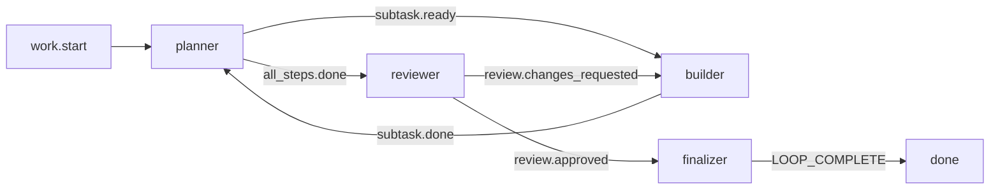

# Ralph Orchestrator 使用说明

这份文档说明当前仓库里的 Ralph 怎么使用，以及几个核心文件怎么配合工作：`ralph.yml`、`PROMPT.md`、`presets/`、各种 `ralph.*.yml`，以及 Ralph 的 hats 概念。

## 一句话理解

<<<<<<< ours
Ralph 是一个“循环驱动”的 AI 编程协调器。你给它一个目标，它会把目标、配置、上下文和当前事件交给后端 AI CLI，例如 Claude、Codex、Gemini、OpenCode、Pi、Trae CLI。后端完成一轮工作后，Ralph 读取输出和事件，再决定下一轮该让哪个 hat 工作，直到看到完成标记，例如 `LOOP_COMPLETE`。
||||||| base
Ralph 是一个“循环驱动”的 AI 编程协调器。你给它一个目标，它会把目标、配置、上下文和当前事件交给后端 AI CLI，例如 Claude、Kiro、Codex、Gemini、Pi、Roo。后端完成一轮工作后，Ralph 读取输出和事件，再决定下一轮该让哪个 hat 工作，直到看到完成标记，例如 `LOOP_COMPLETE`。
=======
Ralph 是一个“循环驱动”的 AI 编程协调器。你给它一个目标，它会把目标、配置、上下文和当前事件交给后端 AI CLI，例如 Claude、Codex、Gemini、OpenCode、Pi、Trae CLI。后端完成一轮工作后，Ralph 读取输出和事件，再决定下一轮该让哪个 hat 工作，直到看到完成标记，例如 `LOOP_COMPLETE`。
>>>>>>> theirs

最常见的使用方式是：

```bash
ralph run -c ralph.yml -p "修复某个 bug，并补测试"
```

如果任务比较复杂，建议把目标写进 `PROMPT.md`，再运行：

```bash
ralph run -c ralph.yml -P PROMPT.md
```

如果要使用内置工作流，而不是当前项目的 `hats`，可以用 `-H` 指定 preset：

```bash
ralph run -c ralph.yml -H builtin:ce-executor-pipeline -p "实现登录限流"
ralph run -c ralph.yml -H builtin:debug -p "排查 CI 偶发超时"
```

## 运行前准备

先安装 Ralph CLI 和至少一个后端 CLI。

```bash
npm install -g @ralph-orchestrator/ralph-cli
```

也可以用 Cargo：

```bash
cargo install ralph-cli
```

初始化一个基础配置：

```bash
ralph init --backend claude
```

查看内置 preset：

```bash
ralph init --list-presets
```

在本仓库开发时，按项目约定验证代码：

```bash
cargo build
./scripts/run-tests.sh
cargo nextest run -p ralph-core --features recording --test smoke_runner
cargo run -p ralph-e2e -- --mock
```

本仓库的 `AGENTS.md` 要求：改完代码前至少跑 `./scripts/run-tests.sh`；事件循环和运行时改动还应优先跑 replay-based smoke tests。如果全量基线出现竞态/时序 flake（如 `ralph-cli` `loop_runner` 相关测试报 Mutex/timeout 错误），先用 `RALPH_BASELINE_SERIAL=1 ./scripts/run-tests.sh` 强制单线程 cargo test 兜底；serial fallback 仍失败才是真失败。

## Ralph 启动后发生什么

一次 `ralph run` 大致经历这些步骤：

1. 加载配置。默认读取 `~/.ralph/config.yml` 和当前目录的 `ralph.yml`，也可以通过 `-c` 指定。
2. 加载 prompt。可以来自 `-p` 的文本、`-P` 的文件，或配置里的 `event_loop.prompt_file`，默认是 `PROMPT.md`。
3. 发布起始事件。如果启用了 hats，`event_loop.starting_event` 会触发第一个 hat。
4. 调用后端 AI CLI。Ralph 把任务、guardrails、memory、task 状态、hat instructions 和事件上下文组装成 prompt。
5. 后端执行工作。它可以改文件、运行命令、写 scratchpad、调用 `ralph emit` 发表事件。
6. Ralph 读取事件。事件会路由到下一个 hat，或者触发 backpressure、wave、human-in-the-loop 等机制。
7. 循环继续。直到后端输出或事件达到 `event_loop.completion_promise`，例如 `LOOP_COMPLETE`。

## Hooks：在 loop 生命周期里接入外部工具

hooks 是 Ralph 在固定生命周期点调用外部命令的机制。它适合做旁路自动化：环境检查、通知、审计、知识检索、知识沉淀、失败归档。它不编排 preset，不替代 hat，也不决定下一轮该执行哪个角色。

你可以把 hooks 配在用户级 `~/.ralph/config.yml`，也可以配在项目级 `ralph.yml`。用户级配置适合全局通知、全局守卫；项目级配置适合当前仓库特有的脚本和知识工具。完整字段参考见 [Configuration hooks](configuration.md#hooks)，CLI 校验命令见 [ralph hooks](cli-reference.md#ralph-hooks)。

### Hook 是怎么被调用的

当某个生命周期点到达时，Ralph 会按配置顺序启动外部命令，并把一段 JSON payload 写到该命令的 stdin。hook 的 stdout 和 stderr 会被 Ralph 捕获，用于诊断、日志和 telemetry。

一个 hook 命令通常长这样：

```yaml
hooks:
  enabled: true
  events:
    pre.loop.start:
      - name: env-guard
        command: ["./scripts/hooks/env-guard.sh"]
        on_error: block
```

这个脚本会收到类似这样的 stdin：

```json
{
  "schema_version": 1,
  "phase": "pre",
  "event": "loop.start",
  "phase_event": "pre.loop.start",
  "loop": {
    "id": "20260428-120000",
    "is_primary": true,
    "workspace": "/path/to/workspace",
    "repo_root": "/path/to/repo",
    "pid": 12345
  },
  "iteration": {
    "current": 0,
    "max": 150
  },
  "context": {
    "active_hat": "ralph",
    "selected_hat": null,
    "selected_task": null,
    "termination_reason": null,
    "human_interact": null
  },
  "metadata": {
    "accumulated": {}
  }
}
```

hook 失败时由 `on_error` 决定 Ralph 怎么处理：

| `on_error` | 行为 | 适合场景 |
|---|---|---|
| `warn` | 记录警告，主 loop 继续 | 通知、知识检索、非关键归档 |
| `block` | 阻止当前生命周期继续 | 缺少 token、依赖、必要服务 |
| `suspend` | 暂停 loop，等待恢复策略 | 需要人工处理的外部条件 |

常用字段：

| 字段 | 说明 |
|---|---|
| `name` | hook 名称，诊断和 metadata 会用它做标识 |
| `command` | argv 数组，第一项必须能解析成可执行文件 |
| `cwd` | 可选工作目录，支持 workspace 相对路径 |
| `env` | 给 hook 进程补环境变量 |
| `timeout_seconds` | 单个 hook 的超时时间 |
| `max_output_bytes` | stdout/stderr 捕获上限 |
| `mutate.enabled` | 允许 hook stdout 输出 metadata JSON，但 v1 只支持 metadata，不支持改 prompt、event 或 config |

### 支持的生命周期点

当前支持这些 `hooks.events` key：

| Hook | 触发时机 | 适合用途 |
|---|---|---|
| `pre.loop.start` | loop 初始化前，起始事件发布前 | 环境检查、知识检索、准备上下文 |
| `post.loop.start` | loop 初始化后，起始事件已进入事件系统 | 启动通知、记录 loop 已开始 |
| `pre.iteration.start` | 每一轮选择/执行 hat 前 | 轻量监控、预算检查、外部心跳 |
| `post.iteration.start` | 每一轮启动后 | 轻量审计、记录当前 active hat |
| `pre.plan.created` | 检测到 `plan.*` 事件、处理前 | 计划拦截、计划质量检查 |
| `post.plan.created` | `plan.*` 事件处理后 | 计划归档、外部审阅、生成 follow-up |
| `pre.loop.complete` | 成功终止前 | 完成前门禁、最终通知准备 |
| `post.loop.complete` | 成功终止后 | 成功通知、总结、知识沉淀 |
| `pre.loop.error` | 失败终止前 | 失败前门禁、保存关键状态 |
| `post.loop.error` | 失败终止后 | 失败归档、debug 复盘、知识沉淀 |

一般建议：

| 目标 | 推荐 hook |
|---|---|
| 缺少依赖时阻止运行 | `pre.loop.start` + `on_error: block` |
| 每次任务开始前检索历史知识 | `pre.loop.start` + `on_error: warn` |
| 长任务成功后生成总结 | `post.loop.complete` + `on_error: warn` |
| 长任务失败后保留现场 | `post.loop.error` + `on_error: warn` |
| 捕获计划文档 | `post.plan.created` |
| 审计人机交互 | （human-in-the-loop 已退役；改用 `pre.loop.error` + `post.loop.error` 做事后审计 — plan 2026-06-28-005） |

不建议把重型逻辑放进 `pre.iteration.start` 或 `post.iteration.start`。这两个 hook 每轮都会跑，适合轻量监控，不适合长时间检索、生成文档或网络重任务。

### 最小可用示例

这个配置会在 loop 开始前运行环境守卫。如果脚本失败，Ralph 不继续启动 loop。

```yaml
hooks:
  enabled: true
  events:
    pre.loop.start:
      - name: env-guard
        command: ["./scripts/hooks/env-guard.sh"]
        on_error: block
```

示例脚本可以从 stdin 读取 payload，也可以忽略 stdin：

```bash
#!/usr/bin/env bash
set -euo pipefail

if ! command -v cargo >/dev/null 2>&1; then
  echo "cargo is required" >&2
  exit 1
fi
```

如果 hook 只是通知或归档，通常用 `on_error: warn`，避免外部通知系统故障影响主任务。

```yaml
hooks:
  enabled: true
  events:
    post.loop.complete:
      - name: notify-success
        command: ["./scripts/hooks/notify.sh", "complete"]
        on_error: warn
    post.loop.error:
      - name: notify-failure
        command: ["./scripts/hooks/notify.sh", "error"]
        on_error: warn
```

### AKR：用 hooks 接入长期知识运行层

如果后续接入 `agent-knowledge-runtime`（简称 AKR），推荐让 Ralph 继续负责 loop 和 preset，AKR 只做知识旁路。也就是说，AKR 不创建 preset、不替代 hat、不控制事件流。

推荐配置：

```yaml
hooks:
  enabled: true
  events:
    pre.loop.start:
      - name: akr-prime
        command: ["akr", "prime", "--hook-payload", "-"]
        on_error: warn

    post.loop.complete:
      - name: akr-review
        command: ["akr", "review", "--hook-payload", "-"]
        on_error: warn

    post.loop.error:
      - name: akr-review-error
        command: ["akr", "review", "--hook-payload", "-"]
        on_error: warn
```

推荐数据流：

```text
Ralph pre.loop.start
  -> akr prime 读取 hook payload
  -> 搜索 Nowledge memory/thread 和 Obsidian notes
  -> 写 .ralph/agent/knowledge-context.md
  -> 写 .ralph/agent/knowledge-context.json

Ralph 构造 agent prompt
  -> 现有 prompt 会列出 .ralph/agent/*.md context files
  -> agent 看到 .ralph/agent/knowledge-context.md
  -> 项目 guardrail/PROMPT 要求 planning 前读取并应用它

Preset 正常执行
  -> AKR 不干预 hats、events、required_events 或 completion_promise

Ralph post.loop.complete / post.loop.error
  -> akr review 读取 events、summary、handoff、tasks
  -> 写 .ralph/agent/knowledge-review.md
  -> 写 .ralph/agent/knowledge-review.json
  -> 写 Obsidian draft

人工确认
  -> akr publish 发布到 Obsidian 正式目录
  -> 可选写入短 memory，作为下次检索索引
```

这里故意让 `akr prime` 写文件，而不是让 hook stdout 直接改 prompt。原因是当前 Ralph hook mutation 的范围很窄：stdout 只能按 `{"metadata": {...}}` 形式更新 hook metadata；v1 不支持通过 hook stdout 直接修改 prompt、事件或配置。

v1 推荐不改 Ralph 源码。AKR 利用 Ralph 已有的 context files 机制：Ralph prompt 会列出 `.ralph/agent/` 下的 Markdown 文件，agent 可以按需读取。为了让这个动作稳定发生，项目配置里应加入一条 guardrail：

```yaml
core:
  guardrails:
    - "Before planning, if `.ralph/agent/knowledge-context.md` is listed under AVAILABLE CONTEXT FILES and is relevant to the task, read it and apply the selected prior knowledge."
```

这个零源码接入分成三件事：

| 部分 | 职责 |
|---|---|
| `pre.loop.start` hook | 启动 AKR，让它准备知识上下文文件 |
| context file + guardrail | 让 agent 看到 `.ralph/agent/knowledge-context.md`，并在规划前读取 |
| `post.loop.complete/error` hook | 启动 AKR，让它生成知识审阅和 Obsidian draft |

这种方式不等于把全文强制注入 prompt；它依赖 agent 遵守 guardrail 读取 context file。好处是不需要维护 Ralph fork，也不需要改 `crates/` 源码。如果实测 agent 经常漏读，再考虑向 Ralph 上游提交可选 prompt bridge。

### 常见使用场景

| 场景 | 配置方式 | 注意事项 |
|---|---|---|
| 环境守卫 | `pre.loop.start` + `on_error: block` | 适合检查 token、CLI、依赖、服务端口 |
| 启动通知 | `post.loop.start` + `on_error: warn` | 不要阻塞主 loop |
| 完成通知 | `post.loop.complete` + `on_error: warn` | 可发送 Slack、桌面通知 |
| 失败通知 | `post.loop.error` + `on_error: warn` | 附带 loop id 和 workspace 方便排查 |
| 知识检索 | `pre.loop.start` + `akr prime` | 生成 `knowledge-context`，由 context file + guardrail 引导 agent 读取 |
| 知识沉淀 | `post.loop.complete/error` + `akr review` | 成功和失败都可能有长期价值 |
| 失败归档 | `post.loop.error` | 保存 events、summary、handoff、日志位置 |
| 计划审阅 | `post.plan.created` | 捕获 plan 事件，交给外部工具审查 |
| 预算或心跳 | `pre.iteration.start` | 必须轻量，避免拖慢每轮执行 |

### 验证 hooks 配置

改完 hook 配置后，先验证命令 wiring，不要直接开长 loop：

```bash
ralph hooks validate -c ralph.yml
```

如果要给脚本或其他工具消费结果：

```bash
ralph hooks validate -c ralph.yml --format json
```

`ralph hooks validate` 只检查配置加载、hook 字段、命令能否解析等，不会执行完整 `ralph run`，也不会真的跑你的长任务。它适合在调 `command`、`cwd`、`env`、`on_error` 时先做快速确认。

## 配置加载优先级

Ralph 的配置不是只来自一个文件，而是分层合并。

1. `~/.ralph/config.yml`：用户级默认配置，适合放全局后端、全局 hooks、通用 guardrails。
2. `ralph.yml` 或 `-c <file>`：项目级配置，适合放本仓库的事件循环、后端、hats、guardrails。
3. `-c core.field=value`：命令行覆盖项，最后生效。
4. `-H <source>`：hat collection 覆盖项。它会替换 `-c` 文件里的 `hats` 和相关工作流事件设置。

常用命令：

```bash
# 使用当前目录 ralph.yml
ralph run -p "做一个小改动"

# 指定配置文件
ralph run -c ralph.qa.yml -p "验证事件循环改动"

# 指定 prompt 文件
ralph run -c ralph.yml -P PROMPT.md

# 使用基础配置 + 内置 hats
ralph run -c ralph.yml -H builtin:ce-executor-pipeline -p "实现一个功能"

# 临时覆盖 specs 目录
ralph run -c ralph.yml -c core.specs_dir=.ralph/specs -p "按 spec 实现"
```

`-c` 和 `-H` 的区别很重要：

| 参数 | 用途 | 示例 |
|---|---|---|
| `-c` | 加载核心配置，可以是完整配置文件 | `-c ralph.yml` |
| `-c core.scratchpad=...` | 覆盖单个 core 字段 | `-c core.scratchpad=.ralph/agent/foo.md` |
| `-H` | 加载 hats 工作流 | `-H builtin:debug` |
| `-H` | 加载本地 hats 文件 | `-H presets/wave-review.yml` |

如果 `-c` 文件里已经有 `hats`，同时又传了 `-H`，以 `-H` 为准。

## `ralph.yml`

`ralph.yml` 是项目默认配置。当前仓库的 `ralph.yml` 用的是 **Claude** 后端，并定义了一个适合 Rust workspace 的多 hat 工作流。

核心结构：

```yaml
event_loop:
  completion_promise: LOOP_COMPLETE
  max_iterations: 150
  max_runtime_seconds: 28800
  starting_event: work.start

cli:
  backend: claude

core:
  specs_dir: ./specs/
  guardrails:
    - "Fresh context each iteration — re-read scratchpad and plan."
    - "Verification is mandatory — `just ci` must pass (fmt, clippy, tests). See AGENTS.md."

hats:
  planner:
    triggers: ["work.start", "subtask.done"]
    publishes: ["subtask.ready", "all_steps.done"]

  builder:
    triggers: ["subtask.ready", "review.changes_requested"]
    publishes: ["subtask.done", "implementation.done"]

  reviewer:
    triggers: ["all_steps.done", "implementation.done"]
    publishes: ["review.approved", "review.changes_requested"]

  finalizer:
    triggers: ["review.approved"]
    publishes: ["LOOP_COMPLETE"]
```

当前默认流程是：



### `event_loop`

`event_loop` 控制循环本身。

| 字段 | 含义 |
|---|---|
| `prompt_file` | 默认 prompt 文件，默认 `PROMPT.md` |
| `completion_promise` | 完成标记，Ralph 看到它后停止 |
| `starting_event` | 第一条事件，用来触发第一个 hat |
| `max_iterations` | 最大迭代次数 |
| `max_runtime_seconds` | 最大运行秒数 |
| `idle_timeout_secs` | 后端无输出多久算超时 |
| `checkpoint_interval` | Git checkpoint 频率 |
| `required_events` | 完成前必须见到的事件链，preset 里常用 |

当前仓库默认从 `work.start` 进入 planner，最多 150 轮，最长 8 小时。

### `cli`

`cli` 选择后端 AI CLI。

```yaml
cli:
  backend: claude
  prompt_mode: arg
```

常见 backend：

| backend | 用途 |
|---|---|
| `claude` | Claude Code |
| `codex` | Codex CLI |
| `gemini` | Gemini CLI |
| `opencode` | OpenCode |
| `pi` | Pi coding agent |
| `traecli` | Trae CLI |
| `custom` | 自定义命令和参数 |

如果要给后端补参数，可以在 `cli.args` 里配置。`ralph.m.yml` 就是这种模式。

### `core`

`core` 放项目级行为和注入规则。

| 字段 | 含义 |
|---|---|
| `specs_dir` | spec 目录，当前默认 `./specs/` |
| `scratchpad` | scratchpad 文件路径或开关 |
| `guardrails` | 每轮都注入给 agent 的硬规则 |

`guardrails` 是约束 agent 行为的主要方式。当前仓库的默认规则强调新上下文、按计划推进、必须验证、不允许假 acceptance test、保存 file:line 证据。

### `backpressure`

> **注意**：`backpressure` 不是 Ralph 配置 schema 的正式字段（不在 `RalphConfig` 中）。它只是本项目的本地约定 / 外部工具 gate，写在 `ralph.yml` 里供外部脚本或 agent guardrail 消费；Ralph 运行时本身不会解析或执行该块。

当前 `ralph.yml` 里的 backpressure gates 示例：

```yaml
backpressure:
  gates:
    - name: fmt
      command: cargo fmt --all -- --check
    - name: clippy
      command: cargo clippy --all-targets --all-features -- -D warnings
    - name: test
      command: ./scripts/run-tests.sh
```

它的目标是“让不合格结果不能通过”。由于 Ralph 不会直接解析 `backpressure`，实际门禁需要由 agent 的 guardrail、hook 或外部工具来实现。

### `memories` 和 `tasks`

`memories` 是跨 session 的长期知识，通常保存在 `.ralph/agent/memories.md`。

`tasks` 是运行时任务队列，通常保存在 `.ralph/agent/tasks.jsonl`。

当前项目说明里强调：memories 和 tasks 默认一起启用。启用时 scratchpad 不再是唯一完成判断依据；没有 open tasks 且连续完成信号后循环才会结束。要切回旧 scratchpad 模式，需要同时禁用：

```yaml
memories:
  enabled: false
tasks:
  enabled: false
```

### `RObot`

> **Removed.** The `RObot` block, the human-in-the-loop channel, and the
> `human.interact` / `human.response` event topics are all gone — human-in-the-loop
> is retired. If your `ralph.yml` still declares a `RObot:` block, the field is
> rejected as `unknown` on the next run; strip the block.

For recovery-time guidance when an iteration crosses a drift / correction threshold
(3-strike escalation, completion-correction injection, etc.), the runtime diagnosis
engine now publishes `plan.blocked(reason=...)` (the previous
`human.guidance` topic was removed by plan 2026-06-28-005), and
`task.resume` is injected into PENDING EVENTS whenever policy / origin /
contract rejects a payload. See
`docs/solutions/integration-issues/ce-executor-pipeline-precheck-recovery-alignment-2026-06-17.md`
for the surviving recovery flow.

> The `ralph run` loop continues to honour `.ralph/stop-requested` and
> `.ralph/restart-requested` signal files written by `ralph loops stop` or external
> tooling — that file-based stop/restart path is independent of the removed
> human-in-the-loop channel.

### `skills`

`skills` 指定 agent 可加载的技能目录。

```yaml
skills:
  enabled: true
  dirs:
    - .claude/skills
```

在这个仓库里，某些工作流会要求 agent 调用 `ralph tools skill load <skill>`，从技能文档里加载额外 SOP 或领域知识。

## `PROMPT.md`

`PROMPT.md` 是默认任务说明文件。它不负责配置 Ralph，而是告诉 agent 这次具体要做什么。

Ralph 读取 prompt 的优先级通常是：

1. `-p "inline prompt"`：命令行直接传入的文本。
2. `-P path/to/prompt.md`：命令行指定的 prompt 文件。
3. `event_loop.prompt_file`：配置里的 prompt 文件，默认 `PROMPT.md`。

当前仓库根目录的 `PROMPT.md` 很短，只包含 Ralph 自身运行规则：

```markdown
You are Ralph. You can wear hats. You wan't to get better at serving humans.

Rules of engagement:
- If I ask you restart yourself, ...
```

如果要让 Ralph 做一个真实任务，建议把 `PROMPT.md` 写成结构化任务文档：

```markdown
# 修复任务系统恢复 bug

## Objective
修复 `ralph run --continue` 在任务队列存在 open task 时重复创建任务的问题。

## Context
- 任务系统在 `crates/ralph-core/src/task_store.rs`
- CLI resume 逻辑在 `crates/ralph-cli/src/loop_runner.rs`

## Requirements
- 不重复创建相同 task key
- 恢复时保留原 task 状态
- 加回归测试

## Verification
- `cargo nextest run -p ralph-core -- task_store`
- `cargo nextest run -p ralph-cli --bin ralph -- resume`
- 最终运行 `./scripts/run-tests.sh`

## Completion
完成后输出 `LOOP_COMPLETE`。
```

写 prompt 的原则：

| 原则 | 说明 |
|---|---|
| 明确目标 | 不要只写“优化一下”，要写清楚要改善什么 |
| 给出边界 | 明确哪些文件、模块、行为在范围内 |
| 列出验证命令 | agent 更容易做出可验证结果 |
| 写完成标准 | 避免 agent 提前输出完成 |
| 复杂任务拆步骤 | 当前 `ralph.yml` 的 planner 会按步骤拆 sub-task |

## `presets/`

`presets/` 是内置 hat collections 的源码。它们不是普通 prompt，而是一组预定义 workflow：包含 `event_loop`、`cli`、`core.guardrails`、`hats`。

常用方式：

```bash
# 使用内置名称
ralph run -c ralph.yml -H builtin:ce-executor-pipeline -p "实现 OAuth 登录"

# 直接使用本地 preset 文件
ralph run -c ralph.yml -H presets/wave-review.yml -p "审查认证模块"

# 老式单文件模式，仍支持
ralph run -c presets/debug.yml -p "排查 flaky test"
```

推荐模式是“核心配置和 hats 分离”：

```bash
ralph run -c ralph.yml -H builtin:debug -p "排查某个问题"
```

这样 `ralph.yml` 提供项目级后端、guardrails、路径等配置，`builtin:debug` 只替换工作流。

### 支持的内置 presets

`presets/index.json` 当前列出的内置 preset：

| preset | 适合场景 | 特点 |
|---|---|---|
| `autoresearch` | 指标驱动实验 | 尝试想法、测量、保留有效改动、丢弃无效改动 |
| `ce-executor-pipeline` | 单阶段计划执行 | 一次执行整个 plan，6 维串行 review + aggregate，适合中小型 plan |
| `ce-executor-supervisor` | 大型计划执行 | supervisor 派发 per-slot worktree，并行 review/fix，需要 `--features supervisor-db` |
| `debug` | bug 排查 | 先复现和假设，再修复和验证 |
| `merge-batch` | 批量 merge | Git-first 多 worktree 批量 merge：review → integrate → stabilize → report |

仓库里还有 `presets/wave-review.yml`，用于演示 wave 并行审查；`presets/hatless-baseline.yml` 用于测试无 hats 基线。

### `presets/minimal/`

`presets/minimal/` 是按后端或简单场景准备的最小配置：

| 文件 | 用途 |
|---|---|
| `claude.yml` | Claude Code 基础配置 |
| `codex.yml` | Codex CLI 基础配置 |
| `gemini.yml` | Gemini CLI 基础配置 |
| `opencode.yml` | OpenCode 自定义命令示例 |
| `builder.yml` | 单 builder hat，适合小任务 |
| `smoke.yml` | 快速 smoke 测试配置 |
| `test.yml` | 测试用最小配置 |

这些文件适合做模板。真实项目通常复制一份到 `ralph.yml`，再按需要修改。

## 本仓库已有 `ralph.*.yml`

根目录下的多个 `ralph.*.yml` 是面向不同场景的配置。

| 文件 | 用途 | 典型命令 |
|---|---|---|
| `ralph.yml` | 当前项目默认开发工作流，Claude 后端，planner/builder/reviewer/finalizer | `ralph run -c ralph.yml -P PROMPT.md` |
| `ralph.qa.yml` | 事件循环、TUI、路由、backpressure、配置解析等高风险改动的 QA 工作流 | `ralph run -H ralph.qa.yml -p "QA event loop changes"` |
| `ralph.reviewer.yml` | 回归感知 PR 审查，会用 worktree 隔离 checkout 并跑测试 | `ralph run -H ralph.reviewer.yml -p "Review PR #207"` |
| `ralph.e2e.yml` | E2E 测试开发/修复专用，使用独立 scratchpad | `ralph run -c ralph.e2e.yml -p ".ralph/specs/e2e-test-fixes.spec.md"` |
| `ralph.pi.yml` | Pi backend 示例，使用 Claude Opus 等参数 | `ralph run -c ralph.pi.yml -p "..."` |
| `ralph.m.yml` | 长时间“小改进循环”，持续探索和构建，手动停止 | `ralph run -c ralph.m.yml -p "Focus on ..."` |

注意：有些文件写的是 `ralph run -H ralph.qa.yml`，因为它们主要作为 hats/workflow 文件使用；有些写的是 `-c`，因为它们包含完整 core 配置。实际运行时，如果文件同时包含 `event_loop`、`cli`、`core` 和 `hats`，用 `-c` 也能跑。

## Hats 概念

hat 是 Ralph 的“角色”。每个 hat 是一个专门的 agent persona，有自己的职责、触发条件、允许发布的事件和 instructions。

最小 hat：

```yaml
hats:
  builder:
    name: "Builder"
    description: "Implements the requested change."
    triggers: ["task.start"]
    publishes: ["build.done", "build.blocked"]
    default_publishes: "build.done"
    instructions: |
      Implement the task.
      Run tests before emitting build.done.
```

字段说明：

| 字段 | 必填 | 含义 |
|---|---:|---|
| `name` | 是 | 展示名 |
| `description` | 否 | 角色说明 |
| `triggers` | 是 | 哪些事件会激活这个 hat |
| `publishes` | 是 | 这个 hat 被允许发布哪些事件 |
| `default_publishes` | 否 | 如果该轮没有显式事件，自动补发哪个事件 |
| `max_activations` | 否 | 最多激活次数，避免无限循环 |
| `backend` | 否 | 单独覆盖这个 hat 使用的后端 |
| `scratchpad` | 否 | 单独覆盖这个 hat 使用的 scratchpad |
| `instructions` | 是 | 这个 hat 的专用 prompt |
| `concurrency` | 否 | wave 并行 worker 数，默认 1 |
| `aggregate` | 否 | 聚合 wave 结果的策略 |

### Events

event 是 hats 之间传递控制权的消息。它至少有 topic，通常还有 payload。

发布事件：

```bash
ralph emit "subtask.done" "Implemented config parser test; cargo nextest run -p ralph-core passed"
```

发布 JSON payload：

```bash
ralph emit "review.done" --json '{"status":"approved","issues":0}'
```

`triggers` 支持精确匹配和 glob：

| trigger | 匹配 |
|---|---|
| `task.start` | 只匹配 `task.start` |
| `build.*` | 匹配 `build.done`、`build.failed` 等 |
| `*.error` | 匹配任意 `.error` 结尾事件 |
| `*` | 匹配所有事件，不建议滥用 |

### 当前 `ralph.yml` 的 hats

当前默认工作流有四个 hats。

| hat | 触发 | 输出 | 职责 |
|---|---|---|---|
| `planner` | `work.start`、`subtask.done` | `subtask.ready`、`all_steps.done` | 读取 `PROMPT.md` 和 scratchpad，把大步骤拆成单个 sub-task |
| `builder` | `subtask.ready`、`review.changes_requested` | `subtask.done`、`implementation.done` | 只实现一个 sub-task，运行 fmt/clippy/test，提交原子 commit |
| `reviewer` | `all_steps.done`、`implementation.done` | `review.approved`、`review.changes_requested` | 审查实现质量、测试证据、AGENTS 约定、全量测试 |
| `finalizer` | `review.approved` | `LOOP_COMPLETE` | 更新 changelog，给出 AGENTS 建议，然后完成 |

这个流程的关键设计是：planner 不写代码，builder 不抢跑，reviewer 不修代码，finalizer 不偷偷改实现。职责分离靠事件推进。

### `default_publishes`

`default_publishes` 是容错机制。如果某个 hat 完成了一轮但没有显式调用 `ralph emit`，Ralph 可以自动注入默认事件。

例如当前 `planner`：

```yaml
default_publishes: "subtask.ready"
```

这能减少 agent 忘记 emit 导致流程卡住的问题。但不要把它当成主要控制逻辑；关键状态仍应由 hat 明确 `ralph emit`。

### Per-hat backend

可以让不同 hat 使用不同后端。

```yaml
hats:
  reviewer:
    name: "Reviewer"
    backend: "claude"
    triggers: ["build.done"]
    publishes: ["review.approved", "review.rejected"]
```

也可以使用结构化形式，传参数：

```yaml
hats:
  executor:
    backend:
      type: "codex"
      args: ["--model", "gpt-5.4"]
```

适用场景：planner 用便宜模型，builder 用强模型，reviewer 用更强或更严格的模型。

### Per-hat scratchpad

默认 scratchpad 由 `core.scratchpad` 决定。hat 可以覆盖。

```yaml
hats:
  planner:
    scratchpad: .ralph/agent/planner.md

  reviewer:
    scratchpad:
      enabled: false
```

适用场景：planner 维护计划，builder 写实现证据，reviewer 只读不写。

## Waves 并行 hats

wave 是单次迭代内的并行执行机制。一个 coordinator hat 可以一次派发多个事件，Ralph 根据目标 hat 的 `concurrency` 启动多个并行 worker。

典型三段式：


配置示例：

```yaml
hats:
  coordinator:
    triggers: ["review.start"]
    publishes: ["review.perspective"]

  reviewer:
    triggers: ["review.perspective"]
    publishes: ["review.done"]
    concurrency: 3

  synthesizer:
    triggers: ["review.done"]
    publishes: ["review.complete"]
    aggregate:
      mode: wait_for_all
      timeout: 300
```

派发 wave：

```bash
ralph wave emit review.perspective --payloads \
  "ROLE: Rust Reviewer. Focus on ownership and error handling." \
  "ROLE: Frontend Reviewer. Focus on React and accessibility." \
  "ROLE: Docs Reviewer. Focus on README and examples."
```

规则：

| 规则 | 说明 |
|---|---|
| `concurrency > 1` | 目标 hat 才会并行 |
| `aggregate` | 聚合 hat 等待 wave 结果 |
| 不能嵌套 wave | wave worker 不能再派发 wave |
| 一个 iteration 只处理一个 wave | 多个 wave 会顺延 |

示例 preset：`presets/wave-review.yml`。

## 推荐使用方式

### 小任务

```bash
ralph run -c ralph.yml -p "修复 crates/ralph-core 中 event parser 的边界 case，并补测试"
```

### 中等实现任务

把任务写入 `PROMPT.md`：

```bash
ralph run -c ralph.yml -P PROMPT.md
```

### 想用通用实现工作流

```bash
ralph run -c ralph.yml -H builtin:ce-executor-pipeline -p "实现配置校验错误信息优化"
```

### 排查 bug

```bash
ralph run -c ralph.yml -H builtin:debug -p "排查 ralph run --continue 重复创建 task 的问题"
```

### Plan-driven 执行

```bash
ralph run -c ralph.yml -H builtin:ce-executor-pipeline -p "docs/plans/my-plan.md"
```

### 并行审查

```bash
ralph run -c ralph.yml -H presets/wave-review.yml -p "审查认证模块的 Rust、前端和文档风险"
```

## 常见状态文件

Ralph 会在 `.ralph/` 下写运行状态。

| 文件 | 用途 |
|---|---|
| `.ralph/agent/memories.md` | 跨 session 学习和经验 |
| `.ralph/agent/tasks.jsonl` | runtime task 队列 |
| `.ralph/loop.lock` | 主 loop 锁，包含 PID 和 prompt |
| `.ralph/loops.json` | 多 loop 注册表 |
| `.ralph/merge-queue.jsonl` | worktree loop 的 merge 队列 |
| `.ralph/diagnostics/` | 开启 diagnostics 后的结构化日志 |

不要提交这些临时运行状态文件，除非某个文档或测试明确要求。

## Diagnostics

调试 Ralph 本身时启用 diagnostics：

```bash
RALPH_DIAGNOSTICS=1 ralph run -c ralph.yml -P PROMPT.md
```

常看日志：

```bash
jq 'select(.type == "tool_call")' .ralph/diagnostics/*/agent-output.jsonl
jq 'select(.type | startswith("Wave"))' .ralph/diagnostics/*/orchestration.jsonl
```

清理：

```bash
ralph clean --diagnostics
```

## 如何新增自己的工作流

如果只是给当前项目改默认流程，直接改 `ralph.yml` 的 `hats`。

如果想保存为可复用工作流，新建一个 hats 文件，例如 `.ralph/hats/my-workflow.yml`：

```yaml
event_loop:
  starting_event: "task.start"
  completion_promise: "LOOP_COMPLETE"

hats:
  builder:
    name: "Builder"
    triggers: ["task.start", "review.rejected"]
    publishes: ["build.done", "build.blocked"]
    default_publishes: "build.done"
    instructions: |
      Implement the requested change and run verification.

  reviewer:
    name: "Reviewer"
    triggers: ["build.done"]
    publishes: ["review.approved", "review.rejected", "LOOP_COMPLETE"]
    instructions: |
      Review the change. If it is correct, output LOOP_COMPLETE.
```

运行：

```bash
ralph run -c ralph.yml -H .ralph/hats/my-workflow.yml -p "实现一个小功能"
```

如果要把它做成内置 preset，需要同步这些位置：

| 位置 | 用途 |
|---|---|
| `presets/en/<name>.yml` | canonical preset 源文件 |
| `presets/manifest.yml` | `embedded:` 列表 |
| `crates/ralph-cli/src/presets.rs` | 内嵌 `PRESETS` 数组 |
| `presets/index.json` | 对用户可见的内置 preset 索引（public preset） |
| `CLAUDE.md` / `AGENTS.md` | 项目 guidance 里的 preset 列表 |
| `scripts/ralph-zsh-plugin.zsh` | `builtin:<name>` 的 zsh 补全 |

## 配置排错清单

| 症状 | 检查点 |
|---|---|
| Ralph 没有读到任务 | 是否用了 `-p` 覆盖了 `PROMPT.md`，或 `-P` 路径写错 |
| 没有触发第一个 hat | `event_loop.starting_event` 是否匹配某个 hat 的 `triggers` |
| 流程卡住 | 上一轮是否忘记 `ralph emit`，是否需要 `default_publishes` |
| preset 没生效 | 是否用了 `-c builtin:name`，新用法应是 `-H builtin:name` |
| 后端没启动 | `cli.backend` 是否安装和登录，必要时跑 `ralph doctor` |
| wave 没并行 | 目标 hat 是否设置 `concurrency > 1` |
| 完成后不退出 | `completion_promise` 是否和实际输出或事件一致 |

## 最小可用模板

如果你只想快速接入一个普通项目，可以从这个配置开始：

```yaml
event_loop:
  prompt_file: "PROMPT.md"
  completion_promise: "LOOP_COMPLETE"
  starting_event: "task.start"
  max_iterations: 50
  max_runtime_seconds: 7200

cli:
  backend: "claude"
  prompt_mode: "arg"

core:
  specs_dir: "./specs/"
  guardrails:
    - "Fresh context each iteration."
    - "Search before assuming code is missing."
    - "Run tests before completion."

hats:
  builder:
    name: "Builder"
    triggers: ["task.start", "review.rejected"]
    publishes: ["build.done", "build.blocked"]
    default_publishes: "build.done"
    instructions: |
      Implement the requested change. Keep scope small.
      Run relevant tests and include evidence in build.done.

  reviewer:
    name: "Reviewer"
    triggers: ["build.done"]
    publishes: ["review.approved", "review.rejected", "LOOP_COMPLETE"]
    instructions: |
      Review correctness, tests, and regressions.
      If solid, output LOOP_COMPLETE.
      If not, emit review.rejected with concrete file:line feedback.
```

对应 `PROMPT.md`：

```markdown
# Task

## Objective
Describe the exact outcome.

## Requirements
- Requirement 1
- Requirement 2

## Verification
- Command 1
- Command 2

## Completion
Output LOOP_COMPLETE only after verification passes.
```
