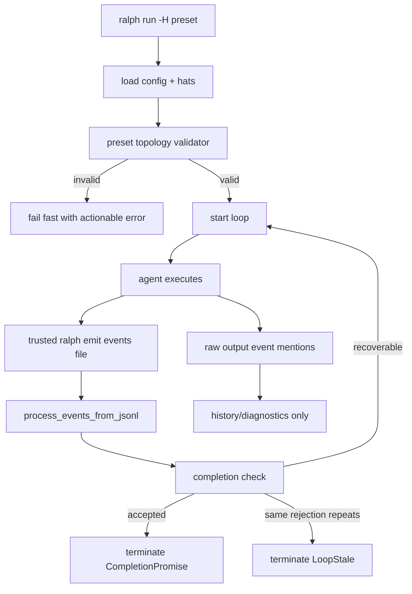

# fix: 防止 preset 完成后死循环

## Overview

本计划修复 `ce-executor` 以及其他 hat preset 在实际工作完成后仍继续空转的问题。修复分为两层：

1. **立即止血**：修正 `ce-executor` 的完成门槛，避免 `required_events` 把可选分支事件当成必选 AND 条件。
2. **机制级防护**：新增 preset 拓扑校验、可信事件输入与日志隔离、重复完成拒绝熔断，防止其他 preset 未来用类似方式进入死循环。

这不是单纯降低 `max_iterations` 的问题。`max_iterations` 只能减少损失，不能证明流程已经完成，也不能阻止坏事件重新触发调度。

## Problem Frame

两个真实 worktree 已复现同类故障：

- `.worktrees/implement-dev-plan-docs-plans-keen-sage`
- `.worktrees/implement-test-dev-plan-docs-tidy-aspen`

两者都已经完成实际任务、关闭 runtime tasks、生成报告并多次发出 `LOOP_COMPLETE`，但随后继续出现如下循环：

```text
ralph/debug output -> debug.step -> build.done -> experiment.planned -> LOOP_COMPLETE(reason=retry)
strategist(fake) -> experiment.planned(task_key="x") -> LOOP_COMPLETE(reason=done)
```

源码和事件文件复核后，问题不是单点 bug，而是多个薄弱点叠加：

- `ce-executor` 当前 `required_events: ["review.passed", "review.complete"]` 是 all-of 语义，但实际成功路径可能只产生 `review.complete`，导致最终 completion 被拒绝。
- `.ralph/current-events` 同时承担可信 `ralph emit` 输入和 raw output/event history 记录，模型输出中的示例事件可被下一轮当作真实事件读取。
- stale-loop 检测只看连续相同 signature，捕捉不到 `LOOP_COMPLETE` 与 `experiment.planned` 交替模式。
- 现有 `ralph hats validate` 只做基础拓扑检查，不能发现“required event 不在所有完成路径上”这种配置级死循环风险。

## Requirements Trace

- R1. `ce-executor` 完成后必须正常终止，不再因缺失 `review.passed` 反复拒绝 completion。
- R2. `required_events` 继续保持 all-of 语义，但 preset 校验必须能发现 required event 不在所有完成路径上的配置错误。
- R3. 模型输出文本中出现的 demo/fake event 不得进入可信事件调度输入。
- R4. 真实 `ralph emit` 写入的事件必须继续正常驱动 hat topology。
- R5. 重复 completion rejection 必须有熔断机制，避免无限消耗 API 调用。
- R6. `ralph hats validate`、builtin preset 测试、运行前 preflight 复用同一套拓扑校验逻辑。
- R7. 修复不能破坏 ce-executor 正常主链：`work.start -> work.ready -> work.done -> review.* -> REVIEW_COMPLETE -> report.done -> LOOP_COMPLETE`。
- R8. 测试必须覆盖真实事件序列回归，而不只覆盖源代码字符串断言。

## Scope Boundaries

- 不引入新的 `required_events_any_of` 或 completion DSL；本次坚持修正现有 all-of 使用方式。
- 不把 `max_iterations` 当成主要修复手段。
- 不重写整个 event policy/state machine。
- 不处理 Agent Operation Guard 文档里的 task/memory/loop 全面授权体系；本计划只覆盖与死循环直接相关的 completion、event input、preset validation。
- 不回溯清理已有 worktree 或历史事件文件。

### Deferred to Separate Tasks

- 全量 Agent Operation Guard：继续按 `docs/brainstorms/2026-05-31-agent-operation-guard-requirements.md` 另行规划。
- 更强的 payload evidence schema：不是本次死循环的必要前置。
- UI/TUI 展示死循环诊断：本次只保证 CLI termination reason 和 diagnostics 足够定位。

## Context & Research

### Relevant Code and Patterns

- Preset 定义：`presets/ce-executor.yml`
- Builtin preset 镜像：`crates/ralph-cli/presets/ce-executor.yml`
- Builtin preset 注册和测试：`crates/ralph-cli/src/presets.rs`
- Hat 拓扑校验命令：`crates/ralph-cli/src/hats.rs`
- Preflight config 加载：`crates/ralph-cli/src/preflight.rs`
- Loop runner 主循环和 fallback：`crates/ralph-cli/src/loop_runner.rs`
- 可信事件读取：`crates/ralph-core/src/event_loop/mod.rs`
- 事件日志：`crates/ralph-core/src/event_logger.rs`
- stale signature 状态：`crates/ralph-core/src/event_loop/loop_state.rs`
- Completion required-events 校验：`crates/ralph-core/src/event_loop/mod.rs`
- Event origin guard：`crates/ralph-core/src/event_origin.rs`

### Institutional Learnings

- `docs/brainstorms/2026-05-31-event-origin-guard-requirements.md` 已指出 fake/demo events 会污染 ce-executor，并要求机制级来源防护。
- `docs/brainstorms/2026-05-31-agent-operation-guard-requirements.md` 已把 event-origin 作为后续操作防护的前置条件，说明本次修复必须保持来源校验可回归。
- `docs/plans/2026-05-31-002-feat-ce-executor-worktree-mode-plan.md` 已要求 ce-executor 使用 runtime tasks 和 report 作为工作完成信号，本次修复应复用这个方向。

## Key Technical Decisions

- **把 `ce-executor.required_events` 改为 `["report.done"]`**：`report.done` 是 reporter 发出 `LOOP_COMPLETE` 前的必经事件，适合作为 all-of 完成门槛。`review.passed` 和 `review.complete` 是不同成功/残留路径上的分支事件，不应同时必选。
- **拓扑校验用静态图，不引入运行时 DSL**：从 `starting_event`、hat `triggers`、hat `publishes` 构建有向图，检查 completion path 和 required event 覆盖即可发现当前问题，复杂度低于新增 completion schema。
- **可信输入与日志分离**：Agent 通过 `ralph emit` 写入的权威 events 文件才参与调度；从模型 raw output 解析出的事件只能写 history/diagnostics，不能再写回 `current-events`。
- **completion rejection 熔断以“同一拒绝原因 + 无可信进展”为准**：不是所有 completion rejection 都是死循环；只有相同 missing-required/open-task/workflow-guard rejection 重复，且中间没有 accepted business event 或 task 状态进展，才终止为 `LoopStale`。
- **运行前 fail fast 优先于运行中补救**：坏 preset 应该在 `ralph hats validate`、`ralph preflight` 或 `ralph run` preflight 阶段失败，而不是让模型运行几十轮后再熔断。

## Open Questions

### Resolved During Planning

- **是否新增 any-of required events？** 不新增。当前 bug 源于把分支事件写成 all-of；正确做法是 required event 选择必经事件，并用 validator 检查。
- **是否只修 ce-executor？** 不够。用户明确要求机制级修复，且其他 preset 已出现同类风险。
- **是否降低 max_iterations？** 不作为本次核心修复。可以保留现有 `50`，通过正确终止和熔断解决。
- **raw output 事件是否还要保留？** 保留到 history/diagnostics，方便排查；但不参与调度。

### Deferred to Implementation

- 拓扑 validator 的具体模块归属可在实现时决定，但必须由 `hats validate`、preflight、builtin preset 测试共同复用。
- completion rejection signature 的最终字段名可由实现决定，但必须包含拒绝类型和关键参数，例如 missing required topic 列表。

## High-Level Technical Design

> This illustrates the intended approach and is directional guidance for review, not implementation specification. The implementing agent should treat it as context, not code to reproduce.



## Implementation Units

- [ ] **Unit 1: 修正 ce-executor 完成门槛**

**Goal:** 立即止血当前 preset，让完成路径以 reporter 的 `report.done` 作为必经 completion gate。

**Requirements:** R1, R7

**Dependencies:** None

**Files:**
- Modify: `presets/ce-executor.yml`
- Modify: `crates/ralph-cli/presets/ce-executor.yml`
- Test: `crates/ralph-cli/src/presets.rs`

**Approach:**
- 将 `event_loop.required_events` 从 `["review.passed", "review.complete"]` 改为 `["report.done"]`。
- 确认 reporter 的 `publishes` 包含 `report.done` 和 `LOOP_COMPLETE`，且指令明确先写 report，再发 `report.done`，最后发 `LOOP_COMPLETE`。
- 同步更新 builtin mirror，避免 `builtin:ce-executor` 与 repo 根目录 preset 行为不一致。
- 在 preset 测试中新增 ce-executor 专项断言：`required_events == ["report.done"]`。

**Patterns to follow:**
- `crates/ralph-cli/src/presets.rs` 中已有 `test_public_presets_have_required_events` 和 ce-executor origin guard 测试。

**Test scenarios:**
- Happy path: 解析 `presets/ce-executor.yml` 后，`config.event_loop.required_events` 只包含 `report.done`。
- Happy path: 解析 `crates/ralph-cli/presets/ce-executor.yml` 后，required events 与根目录 preset 完全一致。
- Regression: ce-executor 的 reporter 仍声明可发布 `report.done` 和 `LOOP_COMPLETE`。
- Regression: ce-executor 的 shipper 仍发布 `REVIEW_COMPLETE`，reporter 仍由 `REVIEW_COMPLETE` 触发。
- Error path: 如果未来有人把 `required_events` 改回 `review.passed + review.complete`，builtin preset 测试失败。

**Verification:**
- `ce-executor` 静态配置通过 preset tests。
- 真实事件序列中 `report.done` 之后的 `LOOP_COMPLETE` 不再因缺失 `review.passed` 被拒绝。

- [ ] **Unit 2: 新增可复用 preset 拓扑 validator**

**Goal:** 静态发现 preset 的 completion path 和 required-events 配置错误，阻止坏 preset 开跑。

**Requirements:** R2, R6

**Dependencies:** Unit 1

**Files:**
- Modify/Create: `crates/ralph-cli/src/hats.rs` 或新增相邻 validator 模块
- Modify: `crates/ralph-cli/src/preflight.rs`
- Modify: `crates/ralph-cli/src/presets.rs`
- Test: `crates/ralph-cli/src/hats.rs`
- Test: `crates/ralph-cli/src/presets.rs`

**Approach:**
- 构建 topic graph：
  - 起点为 `event_loop.starting_event`，默认则使用 `task.start`/Ralph fallback 语义。
  - 边为 `topic -> hat`（hat triggers）和 `hat -> topic`（hat publishes/default_publishes）。
  - completion promise 视为终点 topic。
- 检查项：
  - starting event 有可达 hat 或明确进入 Ralph fallback。
  - completion promise 至少由一个 reachable hat 发布。
  - 每个 required event 必须 reachable。
  - 每个 required event 必须出现在所有 reachable completion paths 上；如果只出现在部分分支，报错。
  - 每个 published non-terminal topic 如果没有具体 subscriber，继续保留现有 warning。
- 输出错误必须指向具体 topic 和可能路径，例如：`required event 'review.passed' is not on completion path review.complete -> shipper -> REVIEW_COMPLETE -> reporter -> LOOP_COMPLETE`。

**Technical design:**
- 用小型图遍历即可；不需要复杂 graph crate。
- 对循环拓扑设置 visited/path limit，避免 validator 自己无限递归。
- 对 wildcard trigger（如 `*` 或 `review.*`）沿用 `Topic::matches`/registry 现有匹配语义，不手写新匹配规则。

**Patterns to follow:**
- `HatRegistry::find_by_trigger`、`registry.has_subscriber`、`registry.can_publish`。
- `validate_hats` 现有 `CheckResult` 输出风格。

**Test scenarios:**
- Happy path: 简单线性 preset：`start -> A(mid) -> B(done) -> LOOP_COMPLETE`，required `done`，校验通过。
- Happy path: ce-executor 新配置中 `report.done` 在所有 completion path 上，校验通过。
- Error path: completion promise 没有任何 reachable hat 发布，校验失败。
- Error path: required event 完全不可达，校验失败。
- Error path: required event 在一条成功分支上存在，但另一条 completion 分支缺失，校验失败。
- Error path: `review.passed` 和 `review.complete` 作为互斥分支时同时 required，校验失败。
- Edge case: hat 有 `default_publishes` 指向 completion promise，validator 识别为可完成路径。
- Edge case: topic 使用 wildcard trigger，例如 `review.*`，validator 能正确识别 subscriber。
- Edge case: graph 中有环，例如 `A -> retry -> A`，validator 不递归爆栈，并仍能找到 completion path。
- Edge case: solo/empty registry 模式不误报 hat topology 错误。
- Regression: 所有 public builtin presets 通过 validator，失败时错误包含 preset 名称。
- Regression: `ralph hats validate -H builtin:ce-executor` 输出包含 completion gate 检查结果。

**Verification:**
- `ralph hats validate` 能对坏 preset fail fast。
- Builtin preset 测试覆盖 topology validator，而不是只检查 required_events 非空。

- [ ] **Unit 3: 在 preflight/run 阶段接入拓扑校验**

**Goal:** 用户运行 `ralph run -H ...` 或 `ralph preflight -H ...` 时，坏 preset 在调用后端前失败。

**Requirements:** R2, R6

**Dependencies:** Unit 2

**Files:**
- Modify: `crates/ralph-cli/src/preflight.rs`
- Modify: `crates/ralph-cli/src/main.rs`
- Test: `crates/ralph-cli/src/preflight.rs`
- Test: `crates/ralph-cli/tests/integration_run_presets.rs`

**Approach:**
- `load_config_for_preflight` 完成 core + hats 合并后，调用 topology validator。
- `ralph hats validate` 输出完整 report；`ralph run` 和 `ralph preflight` 可以输出精简 fatal message。
- 对 warning 不阻塞运行；对 completion path 和 required-events 错误阻塞运行。
- 错误消息必须给出修复建议：required event 应换成所有 completion path 都会经过的 topic，或调整拓扑。

**Patterns to follow:**
- 现有 `ConfigError`/`anyhow::Context` 错误传播。
- `preflight` 对 builtin hats source 的加载路径。

**Test scenarios:**
- Happy path: `builtin:ce-executor` preflight 通过。
- Happy path: 现有 public builtin presets 全部可 preflight。
- Error path: 构造临时 hats file，completion promise 不可达，`ralph preflight -H file` 返回非零。
- Error path: 构造临时 hats file，required event 只在部分 completion path 出现，`ralph run --dry-run` 或等价 dry path 在后端调用前失败。
- Error path: 错误信息包含 preset/source label、required topic、缺失路径。
- Edge case: 只有 warning 的 orphan publish 不阻塞运行。
- Regression: `-c builtin:{name}` 旧用法仍给迁移提示，不被新 validator 覆盖成模糊错误。

**Verification:**
- 坏 preset 不会消耗后端 API 调用。
- 错误信息足够让 preset 作者直接定位 required_events 或 publishes/triggers。

- [ ] **Unit 4: 分离 raw output event logging 与可信事件输入**

**Goal:** 阻止模型输出文本里的 demo/fake events 被写回 `.ralph/current-events` 并参与下一轮调度。

**Requirements:** R3, R4

**Dependencies:** None

**Files:**
- Modify: `crates/ralph-cli/src/loop_runner.rs`
- Modify: `crates/ralph-core/src/event_logger.rs`
- Test: `crates/ralph-cli/src/loop_runner.rs`
- Test: `crates/ralph-core/src/event_reader.rs` 或 `crates/ralph-core/src/event_loop/tests.rs`

**Approach:**
- 明确区分两类文件：
  - Trusted events input：`resolve_emit_events_path`/`.ralph/current-events`，只由 `ralph emit`、wave merge、系统可信写入路径产生。
  - History/diagnostics log：raw output 解析出的 event mentions 只写入 `.ralph/history.jsonl` 或 diagnostics，不写 trusted events input。
- 修改 `log_events_from_output` 调用路径，避免它使用指向 `current-events` 的 `EventLogger::from_context`。
- 如果仍需保留 event.orphaned 诊断，写到 history/diagnostics，不进入 EventReader 消费的文件。
- `log_accepted_events` 可以继续记录已经通过 runtime validation 的 accepted events，但不得造成下一轮重复读取。

**Patterns to follow:**
- `EventLogger` 已有 `history.jsonl` 相关用途，可复用现有 logger 或新增更明确的 output-history logger。
- `process_events_from_jsonl` 是可信调度入口，应保持单一职责。

**Test scenarios:**
- Happy path: agent 真正执行 `ralph emit work.done` 后，`process_events_from_jsonl` 读取并路由 `work.done`。
- Regression: agent output 文本包含 `<event topic="debug.step">task_id=demo</event>`，raw logging 后 trusted events file 不包含 `debug.step`。
- Regression: agent output 文本包含 JSON 行 `{"topic":"experiment.planned","payload":{"task_key":"x"}}`，不会进入 trusted events file。
- Regression: agent output 文本包含 `LOOP_COMPLETE` 字样但没有真实 emit 时，只走现有 text fallback completion 检测，不生成 fake JSONL business event。
- Error path: raw output 中出现无 subscriber topic，`event.orphaned` 只出现在 history/diagnostics，不触发 Ralph fallback 调度。
- Edge case: state-machine candidate events 文件不受 raw output logger 污染。
- Edge case: wave worker output 中的 raw event mentions 不污染 main events file。
- Integration: 一轮执行后同时存在 history 记录和 trusted events input，EventReader 只消费 trusted events input。
- Regression: `log_accepted_events` 记录 accepted events 不导致同一 event 在下一轮被再次读取。

**Verification:**
- 复刻 worktree 尾部事件中的 fake `debug.step/build.done/experiment.planned` 序列，确认 raw output 不再驱动下一轮 hat。

- [ ] **Unit 5: 强化 event origin guard 对无 hat 业务事件的策略**

**Goal:** 减少 no-hat business event 在 hat-based preset 中绕过来源校验的空间，避免 fake events 依赖无 provenance 进入可信管道。

**Requirements:** R3, R4, R7

**Dependencies:** Unit 4

**Files:**
- Modify: `crates/ralph-core/src/event_origin.rs`
- Modify: `crates/ralph-core/src/event_loop/mod.rs`
- Test: `crates/ralph-core/src/event_origin.rs`
- Test: `crates/ralph-core/src/event_loop/tests.rs`

**Approach:**
- 保留 solo/empty registry 的兼容行为。
- 在 hat-based mode 中：
  - control topics 继续允许无 hat provenance，例如 `human.interact`、`task.resume`、`loop.cancel`。
  - system-created diagnostics 不从 JSONL 入口信任。
  - 普通 business events 如果没有 `hat`，必须由当前 active hat scope 明确接受；否则拒绝。
- 当前源码中 no-hat events 被 origin guard 直接接受，依赖上游 scope enforcement。实现时要确保 scope enforcement 与 origin guard 顺序不会让无 hat business event 在 Ralph fallback/空 active hats 情况下误入。
- 对 `ralph` 作为 hat 名的 fake event 保持未知 hat fail-closed，除非 registry 显式定义该 hat 并允许 topic。

**Patterns to follow:**
- `validate_event_origin` 现有 unknown hat rejection。
- `event_loop` 的 `enforce_hat_scope` 和 `last_active_hat_ids`。

**Test scenarios:**
- Happy path: registered hat 发布声明内 topic，被接受。
- Happy path: no-hat `task.resume` control topic 被接受。
- Happy path: no-hat `human.interact` control topic 被接受并进入 human flow。
- Error path: unknown hat `strategist` 发布 `experiment.planned` 被拒绝。
- Error path: registered hat 发布未声明 topic 被拒绝。
- Error path: hat-based preset 中 no-hat `debug.step` 在无 active hat 可授权时被拒绝。
- Error path: hat-based preset 中 no-hat `build.done` 在 active hat 不可发布时被拒绝。
- Edge case: solo mode registry empty 时 no-hat business event 继续兼容。
- Edge case: cancellation promise topic 无 hat 时仍可触发 graceful cancellation。
- Regression: ce-executor 正常链中 coordinator/executor/reviewer/reporter 声明 hat 的事件全部通过。

**Verification:**
- fake `strategist`、fake `ralph`、no-hat chain 外 topic 不再进入 EventBus。

- [ ] **Unit 6: 增加 completion rejection 熔断**

**Goal:** 即使配置或输入污染漏网，也要在重复 completion rejection 时终止为 `LoopStale`，避免无限空转。

**Requirements:** R5

**Dependencies:** Unit 4

**Files:**
- Modify: `crates/ralph-core/src/event_loop/loop_state.rs`
- Modify: `crates/ralph-core/src/event_loop/mod.rs`
- Modify: `crates/ralph-core/src/summary_writer.rs`（如需要展示更明确摘要）
- Test: `crates/ralph-core/src/event_loop/tests.rs`

**Approach:**
- 在 loop state 中新增 completion rejection tracking：
  - rejection kind：missing required events / open runtime tasks / incomplete workflow guard / persistent suppression 可按需要区分。
  - signature：kind + sorted details，例如 missing topics。
  - consecutive count。
  - last progress marker：accepted event count 或 task state marker。
- `check_completion_event()` 每次拒绝 completion 时记录 signature。
- 当相同 signature 连续达到 3 次，且期间没有 accepted business event、runtime task 状态变化或 workflow progress，返回 `TerminationReason::LoopStale`。
- 任何可信业务进展都重置该计数。
- 熔断 diagnostics 要包含最近拒绝原因和建议，例如“required_events 配置可能不在 completion path 上”。

**Patterns to follow:**
- 现有 `consecutive_same_signature` stale 检测。
- 现有 `consecutive_malformed_events` 和 hard gate 计数风格。

**Test scenarios:**
- Happy path: 第一次 missing required events 时只注入 `task.resume`，不终止。
- Happy path: 第二次相同 missing required events 时继续恢复，不终止。
- Error path: 第三次相同 missing required events 且无可信进展时返回 `LoopStale`。
- Error path: open runtime tasks 导致 completion rejection 连续 3 次后返回 `LoopStale`。
- Error path: workflow guard incomplete 连续 3 次后返回 `LoopStale`。
- Edge case: 第一次 missing `review.passed`，第二次 missing `report.done`，signature 不同，不累计到 3。
- Edge case: 两次 rejection 中间有 accepted business event，计数重置。
- Edge case: 两次 rejection 中间有 task close/open 状态变化，计数重置。
- Edge case: persistent mode completion suppression 不应误判普通 daemon 模式为 stale，除非设计明确纳入熔断。
- Regression: 正常 `LOOP_COMPLETE` accepted 后仍返回 `CompletionPromise`，不是 `LoopStale`。
- Regression: duplicate terminal after completion honored 仍按 completion guard 处理，不被误算为 rejection loop。

**Verification:**
- 复现旧 ce-executor required-events 错误时，最多 3 次拒绝后终止，不再无限运行。

- [ ] **Unit 7: 加入真实事件序列 replay 回归**

**Goal:** 用两个 worktree 的最小化事件序列证明本次修复覆盖真实故障，而不是只覆盖人工构造小用例。

**Requirements:** R1, R3, R5, R8

**Dependencies:** Unit 1, Unit 4, Unit 6

**Files:**
- Create/Modify: `crates/ralph-core/tests/fixtures/` 下新增死循环 replay fixture，或加入现有 event loop fixture 目录
- Modify: `crates/ralph-core/src/testing/smoke_runner.rs` 或 `crates/ralph-core/src/event_loop/tests.rs`
- Test: `crates/ralph-core/src/event_loop/tests.rs`

**Approach:**
- 从两个 worktree 事件文件提取最小复现：
  - completed tasks + `review.complete/report.done/LOOP_COMPLETE`
  - 后续 fake `debug.step/build.done/experiment.planned(task_key=x)/LOOP_COMPLETE(retry)`。
- 测试应断言：
  - 新 ce-executor required event 下，`report.done + LOOP_COMPLETE` 可终止。
  - raw/fake events 不被可信输入处理。
  - 如果刻意启用旧 bad required-events 配置，重复 rejection 会熔断为 `LoopStale`。

**Patterns to follow:**
- `crates/ralph-core/tests/fixtures/` replay-based smoke fixture。
- `event_loop/tests.rs` 中现有 completion honored 和 same-batch business event 测试。

**Test scenarios:**
- Regression fixture keen-sage: `report.done -> LOOP_COMPLETE` 后终止为 `CompletionPromise`。
- Regression fixture tidy-aspen: `report.done -> LOOP_COMPLETE` 后终止为 `CompletionPromise`。
- Regression fixture: post-completion fake `experiment.planned(task_key=x)` 不触发 strategist/implementer。
- Regression fixture: fake `debug.step` 和 `build.done` 不计入 `seen_topics`。
- Regression fixture: 旧 bad config 中缺失 `review.passed` 连续 rejection 最终为 `LoopStale`。
- Integration: fixture 中 runtime tasks 全 closed 时 completion 被接受。
- Integration: fixture 中 runtime tasks open 时 completion 被拒绝，并在重复 3 次后 stale。
- Integration: fixture replay 不依赖 live backend/API。

**Verification:**
- Smoke/replay 测试能在 CI 中稳定运行。
- 测试失败信息能指出是 completion gate、event contamination 还是 stale breaker 失败。

- [ ] **Unit 8: 更新文档和诊断说明**

**Goal:** 让 preset 作者知道 `required_events` 是 all-of 语义，并知道如何运行校验和解读错误。

**Requirements:** R2, R6, R8

**Dependencies:** Unit 2, Unit 3

**Files:**
- Modify: `docs/guide/presets.md`
- Modify: `docs/concepts/hats-and-events.md`
- Modify: `docs/reference/troubleshooting.md`
- Modify: `docs/advanced/loop-detection.md`
- Modify: `crates/ralph-core/data/ralph-tools.md` only if any `ralph tools` command behavior changes

**Approach:**
- 在 preset 文档中明确：
  - `required_events` 是 all-of，不是 any-of。
  - required event 应选择所有成功完成路径都会经过的 topic。
  - 对分支路径使用共同汇聚点，例如 `report.done`。
- 在 troubleshooting 中新增“完成后反复 LOOP_COMPLETE/retry”的诊断条目。
- 在 loop detection 文档中补充 completion rejection stale breaker。
- 如果新增/改变 CLI 可见输出，文档包含示例错误消息。

**Test scenarios:**
- Documentation: 文档中出现 `required_events` all-of 语义说明。
- Documentation: 文档中出现 `ralph hats validate` 用于 preset 检查。
- Documentation: troubleshooting 包含 `LOOP_COMPLETE rejected: missing required events` 对应处理建议。
- Regression: 文档不再建议把互斥分支事件同时放入 `required_events`。

**Verification:**
- 文档能指导 preset 作者避免重现 `review.passed + review.complete` 错误。

## System-Wide Impact

- **Interaction graph:** 影响 `ralph run` preflight、`ralph hats validate`、event loop completion、event logging。正常 hat publish/trigger 语义保持不变。
- **Error propagation:** 坏 preset 从运行时无限循环变为 preflight fatal；运行中重复 rejection 从无限 retry 变为 `LoopStale`。
- **State lifecycle risks:** trusted events file 不应再被 history logging 写入，避免同一 event 被重复读取。
- **API surface parity:** CLI、builtin preset tests、preflight 必须共享同一 validator，避免三套判断不一致。
- **Integration coverage:** 必须有 replay fixture 覆盖真实事件序列。
- **Unchanged invariants:** `required_events` 仍是 all-of；`LOOP_COMPLETE` 仍是 completion promise；runtime tasks 仍是 completion 的 canonical queue。

## Risks & Dependencies

| Risk | Likelihood | Impact | Mitigation |
|------|------------|--------|------------|
| 拓扑 validator 对复杂 wildcard/循环误报 | Medium | High | 复用现有 topic match 逻辑，增加 wildcard 和 cycle 测试 |
| raw output 不再写 current-events 后丢失调试信息 | Low | Medium | 写入 history/diagnostics，保持可排查但不调度 |
| preflight 新 fatal 影响已有但勉强可跑的 preset | Medium | Medium | 只对 completion path/required-events 错误 fatal，orphan publish 保持 warning |
| stale breaker 误杀长流程 | Low | High | 只对相同 completion rejection 且无可信进展累计 |
| ce-executor mirror 漏同步 | Medium | Medium | 在 builtin preset tests 中比较 root preset 与 mirror 的关键字段 |
| replay fixture 过大或脆弱 | Medium | Medium | 提取最小事件序列，只保留触发机制所需事件 |

## Documentation / Operational Notes

- 需要在 plan 完成后运行完整 `cargo test -- --test-threads=1`，因为项目说明明确要求完成前跑全量测试。
- 优先使用 replay/smoke 测试验证，不调用 live backend。
- 如果修改 builtin preset 或 mirror preset 文件，要确认 `scripts/ralph-zsh-plugin.zsh` 是否涉及 builtin completion 列表；本计划不新增/删除 builtin preset 名称，预计不需要更新 zsh completion。
- 不提交 worktree 中的临时报告、history、events 文件。

## Detailed Test Plan

### Unit Tests

- `crates/ralph-cli/src/presets.rs`
  - `test_ce_executor_required_events_use_report_done`
  - `test_ce_executor_root_and_builtin_required_events_match`
  - `test_public_presets_pass_completion_topology_validation`
  - `test_bad_preset_required_event_missing_from_branch_fails`
  - `test_bad_preset_completion_promise_unreachable_fails`

- `crates/ralph-cli/src/hats.rs`
  - validator accepts linear topology with required event on completion path
  - validator rejects required event only present on one branch
  - validator handles wildcard trigger
  - validator handles graph cycles without recursion overflow
  - `ralph hats validate` output contains actionable required-events error

- `crates/ralph-cli/src/preflight.rs`
  - preflight accepts builtin ce-executor
  - preflight rejects bad hats file before backend execution
  - preflight preserves old `-c builtin:{name}` migration error

- `crates/ralph-cli/src/loop_runner.rs`
  - raw output event mentions are written only to history/diagnostics
  - `event.orphaned` from raw output is not written to trusted events file
  - accepted events can be logged without being re-consumed
  - text fallback completion still works when output contains bare `LOOP_COMPLETE`

- `crates/ralph-core/src/event_origin.rs`
  - unknown hat rejected
  - registered hat out-of-scope topic rejected
  - no-hat control topic accepted
  - no-hat business topic rejected in hat-based mode when not authorized by active hat
  - solo mode compatibility preserved

- `crates/ralph-core/src/event_loop/tests.rs`
  - `report.done` satisfies ce-executor completion gate
  - missing required event rejection increments completion rejection counter
  - same rejection 3 times returns `LoopStale`
  - trusted progress resets rejection counter
  - open task rejection can stale-break after repeated identical rejection
  - workflow guard rejection can stale-break after repeated identical rejection
  - accepted completion returns `CompletionPromise`, never `LoopStale`

### Integration Tests

- `crates/ralph-cli/tests/integration_run_presets.rs`
  - `ralph run --dry-run -H builtin:ce-executor` passes preflight.
  - bad temporary preset with unreachable completion fails with non-zero exit.
  - bad temporary preset with branch-only required event fails with non-zero exit.

- `crates/ralph-core` replay integration
  - keen-sage minimal replay terminates after `report.done + LOOP_COMPLETE`.
  - tidy-aspen minimal replay terminates after `report.done + LOOP_COMPLETE`.
  - post-completion fake `experiment.planned(task_key=x)` does not route to a hat.
  - old bad required-events config stale-breaks instead of infinite retry.

### Smoke / Regression Tests

- Run existing smoke runner after adding fixtures:
  - ce-executor completion fixture
  - fake event contamination fixture
  - repeated completion rejection fixture

- Existing regression suites that must remain green:
  - event origin guard tests
  - completion honored same-batch business event tests
  - duplicate terminal event tests
  - required-events existing tests
  - wave dispatch origin validation tests
  - public builtin preset tests

### Manual Verification Scenarios

- Run `ralph hats validate -H builtin:ce-executor` and confirm:
  - result is valid
  - completion promise path is visible or summarized
  - `report.done` is recognized as completion gate

- Create a temporary bad preset with:
  - two success branches: `review.passed` and `review.complete`
  - `required_events` containing both
  - both branches converging at reporter
  - validator must reject it before run.

- Replay a minimized copy of the worktree event tail:
  - verified tasks closed
  - `report.done`
  - `LOOP_COMPLETE`
  - fake `debug.step/build.done/experiment.planned`
  - loop must terminate and ignore fake tail.

### Full Verification Commands

- `cargo test -p ralph-cli hats`
- `cargo test -p ralph-cli presets`
- `cargo test -p ralph-core event_loop`
- `cargo test -p ralph-core event_origin`
- `cargo test -p ralph-core smoke_runner`
- `cargo test -- --test-threads=1`

## Sources & References

- Origin document: `docs/brainstorms/2026-05-31-event-origin-guard-requirements.md`
- Related requirements: `docs/brainstorms/2026-05-31-agent-operation-guard-requirements.md`
- Related plan: `docs/plans/2026-05-31-002-feat-ce-executor-worktree-mode-plan.md`
- Current preset: `presets/ce-executor.yml`
- Builtin mirror: `crates/ralph-cli/presets/ce-executor.yml`
- Real failure evidence:
  - `.worktrees/implement-dev-plan-docs-plans-keen-sage/.ralph/events-20260531-164955.jsonl`
  - `.worktrees/implement-test-dev-plan-docs-tidy-aspen/.ralph/events-20260531-170521.jsonl`
