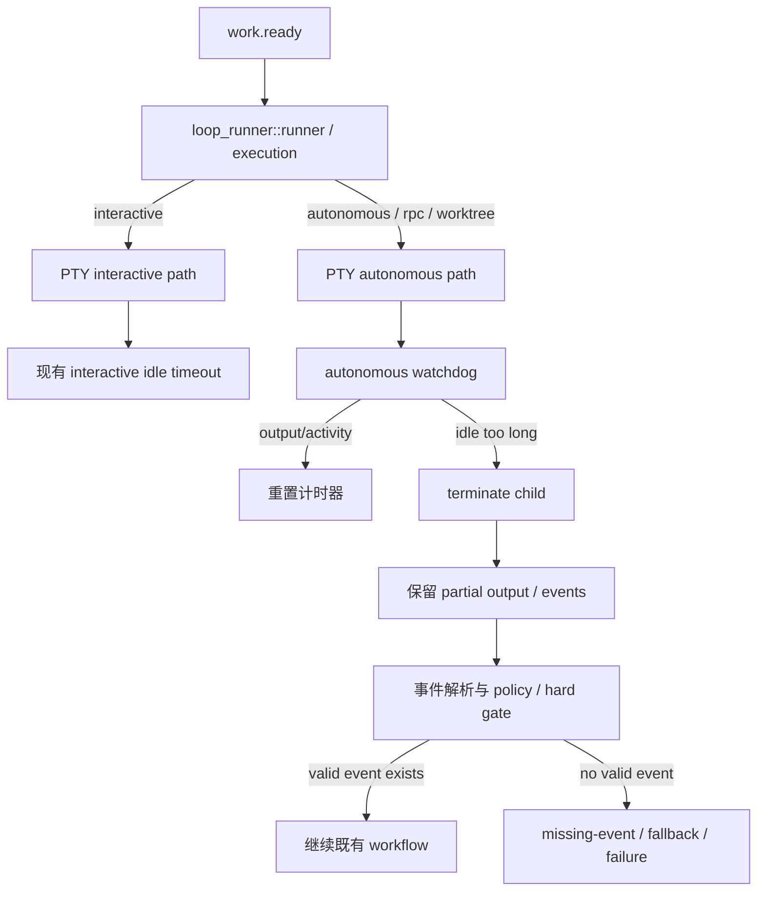

# fix: 修复 autonomous PTY/RPC 执行超时缺口

## Overview

当前 `ralph run -H builtin:ce-executor --worktree --rpc` 的执行路径里，Ralph 会把任务交给 executor Claude，但在 non-interactive / autonomous 模式下，PTY 观察路径把 idle timeout 关掉了。结果是：当 Claude 内部启动了一个长时间无输出、也不退出的命令时，外层循环会一直等，既不会及时产出错误，也不会进入后续 workflow。

这次修复要补上一个明确的“执行 watchdog”：保留现有 interactive 语义不变，同时让 autonomous PTY/RPC 路径在长时间无输出时也能终止当前轮次、记录原因、并把失败传回编排层。目标是让这类卡死变成可恢复的失败，而不是无期限挂起。

评审后收紧约束：watchdog 不能简单等同于“停止整个 loop”。它应该终止当前 backend 子进程、保留并处理已经产生的输出/事件；只有没有可处理事件且既有 missing-event / hard-gate / fallback 也无法恢复时，才让上层进入明确失败。否则会把“agent 已发出有效事件但命令尾部卡住”的正常 partial-output 场景误杀。

## Problem Frame

用户看到的是“worktree 里的 Ralph 半天没有动静”。实际链路是：

1. `ce-executor` 已经收到 `work.ready` 并启动 executor。
2. executor 进入 Claude 的 PTY/RPC 观察路径。
3. 在 autonomous 模式下，`idle_timeout_secs` 被设为 `0`，所以 PTY 侧不会因为无输出而超时。
4. Claude 内部的命令如果卡住，外层就会一直等，输出文件也会保持空白。

这不是 preset 拓扑错误，也不是任务没被派发，而是执行层缺少对“无输出卡住”的防护。

## Requirements Trace

- R1. autonomous / RPC / worktree 路径不能在长时间无输出时无限等待。
- R2. interactive 模式现有行为保持不变，不能把原本的手动交互超时语义改坏。
- R3. 超时后必须能向上层清晰传播失败原因，而不是静默退出或假成功。
- R4. 回归测试要覆盖 `ce-executor` 的真实执行路径，避免只修到单一 executor 适配器。
- R5. `worktree` 和 `--rpc` 组合下的挂起问题要被证明已解决。
- R6. autonomous watchdog 不能复用 `cli.idle_timeout_secs` 的 30 秒 interactive 默认值作为后台执行默认值，避免误杀正常长任务。
- R7. 超时前已经产生的有效事件必须继续可见并被处理，不能因为 backend idle timeout 丢失 partial events。
- R8. `--idle-timeout 0` / config `idle_timeout_secs: 0` 的禁用语义必须被明确保留或替换为等价的新字段禁用语义，不能悄悄变成“仍然启用默认 watchdog”。

## Scope Boundaries

- 不修改 `ce-executor` 的 plan/driven 拓扑，不改 review / fix / ship / report 链路。
- 不把这次修复做成新的用户流程功能。
- 不改变 interactive 模式的现有默认超时行为。
- 不尝试在本次修复里重构所有 backend 的 timeout 策略；优先修 `ce-executor` 触发的 PTY/RPC 路径。
- 不把 `cli.idle_timeout_secs` 的 interactive 默认 30 秒直接套到 autonomous / RPC 执行上。
- 不把 backend idle timeout 直接映射为 `TerminationReason::Stopped`，除非确认这是操作者主动停止或全局终止语义。

### Deferred to Separate Tasks

- 若后续发现多个 backend 都需要统一的“无输出 watchdog”，再拆成更通用的执行层抽象。
- 若需要暴露新的配置项名称、默认值或帮助文案，可作为单独的小修订一起落地。

## Context & Research

### Relevant Code and Patterns

- `crates/ralph-cli/src/loop_runner/runner.rs`：决定是否进入 PTY 路径，并在 autonomous 模式下把 `idle_timeout_secs` 设为 `0`。
- `crates/ralph-cli/src/loop_runner/execution.rs`：把 `interactive` 传给 `PtyExecutor`，并在 non-interactive 路径里同样把 timeout 关掉。
- `crates/ralph-adapters/src/pty_executor.rs`：PTY observe/streaming/interactive 的超时实现集中在这里，当前 autonomous 模式实际上没有可用 idle timeout。
- `crates/ralph-adapters/src/cli_executor.rs`：CLI executor 已经有 inactivity timeout 的成熟实现，可作为失败传播和 terminate 语义参考。
- `crates/ralph-core/src/config/cli.rs`：`idle_timeout_secs` 文档明确写的是 interactive mode，默认值是 30 秒；不能无审查地复用为 autonomous 后台默认。
- `crates/ralph-core/src/config/v1_adapters.rs`：adapter `timeout` 默认 300 秒，语义是 CLI execution inactivity timeout，更接近 autonomous backend watchdog 的现有配置来源。
- `crates/ralph-cli/src/loop_runner/hooks/format.rs`：当前 `convert_termination_type(IdleTimeout, false)` 会返回 `TerminationReason::Stopped`，这会直接终止 loop，是本计划必须重新审查的高风险点。
- `crates/ralph-cli/src/loop_runner/wave/worker.rs`：wave worker 已经有 timeout 后保留 partial events 的行为，可作为 main PTY 路径的回归参考。
- `presets/en/ce-executor.yml`：当前 preset 触发链和 runtime task 结构，不应因为修复 timeout 而被改乱。

### Institutional Learnings

- `docs/solutions/developer-experience/ce-executor-plan-gate-premature-completion-2026-06-02.md`：计划层和执行层职责要分开，不能用编排层兜底执行层卡死。
- `docs/solutions/developer-experience/agent-execution-contract-gates-2026-06-03.md`：成功和失败必须显式、可验证，不能靠“没报错”推断成功。

### External References

未做外部研究。这个问题是 Ralph 自身执行路径的缺口，repo 内现有实现和诊断证据足够支撑修复。

## Key Technical Decisions

- **保留 interactive 语义不变**：用户手动交互时，仍然沿用现有 idle timeout 逻辑，不把这次修复变成对手动模式的行为改造。
- **在 autonomous PTY/RPC 路径增加单独 watchdog**：不要再把 non-interactive timeout 直接设成 `0`，而是让无输出监视在这条路径上继续生效；默认来源优先对齐 adapter `timeout`，不能直接使用 interactive 默认 30 秒。
- **把超时视为 backend call 结束，不是天然 loop 终止**：watchdog 触发后终止当前 backend 子进程，但必须把已经收集到的输出和事件交给后续解析。没有事件时再走既有 missing-event gate / fallback / failure 机制。
- **保留禁用语义**：如果用户显式把相关 timeout 配为 `0`，实现必须清楚定义这是禁用 autonomous watchdog 还是只禁用 interactive idle timeout；不能出现 CLI 文案说 disabled、实际仍启用的状态。
- **先做 characterization，再改行为**：这类问题最容易修成“看起来好了但其实换了一种卡法”，所以先锁定现状，再补超时行为。

## Review Findings Incorporated

- **F1: 原计划能解决挂起，但可能用过短 timeout 误杀正常任务。** 源码里 `cli.idle_timeout_secs` 默认是 30 秒且文档写明是 interactive mode；如果实现直接复用它，后台 Claude 在长工具调用期间 30 秒没有输出就会被杀。计划已改为要求优先使用 adapter execution timeout 或新增明确的 autonomous watchdog 配置。
- **F2: 原计划把 timeout 说成“进入正常失败路径”，但源码当前会映射为 `TerminationReason::Stopped`。** 这会停止整个 loop，不一定会生成 executor 层面的 `work.failed` 或触发 hard gate。计划已改为要求 timeout 后保留 partial output，并让事件解析和既有 missing-event 机制决定后续。
- **F3: 原计划测试不够防回归。** 需要补齐 interactive、TUI、RPC、headless CLI、partial event、no event、disabled timeout、long silent command、periodic output reset、wave worker parity 等矩阵。

## Open Questions

### Resolved During Planning

- 修复目标不是改 preset，而是改执行机制。
- 主要故障面是 autonomous PTY/RPC 路径，不是 plan-gate 或 task creation。
- 这次修复要同时覆盖代码和测试，不做纯配置修补。

### Deferred to Implementation

- watchdog 的最终命名与配置归属：优先评估复用 adapter `timeout`，只有它无法表达禁用/override 语义时再新增更明确的 autonomous watchdog 配置项。
- 具体超时默认值：不能使用 interactive 默认 30 秒；候选默认应至少对齐 adapter `timeout` 默认 300 秒，或采用 hat/backend-level timeout。
- 超时后上抛的错误类型与文案：要在实现时和现有 failure handling 对齐，避免破坏上游分支判断。
- 超时后是继续事件处理还是终止 loop：实现前必须先由测试锁定。期望方向是“backend 调用结束，事件继续处理；没有事件时进入既有恢复/失败机制”。

## High-Level Technical Design

> *This illustrates the intended approach and is directional guidance for review, not implementation specification. The implementing agent should treat it as context, not code to reproduce.*

这个设计的核心是把“是否允许无输出一直等下去”从 `interactive` 的二元判断里拆出来：手动交互保留旧逻辑，autonomous/RPC 走单独的 watchdog 分支。watchdog 的职责是结束卡住的 backend 调用并交还控制权，不是绕过事件处理直接结束整个 loop。

## Implementation Units

- [ ] **Unit 1: 先把当前挂起行为钉成回归测试**

**Goal:** 先用测试把现有 bug 的可观察行为固定下来，避免后续改动只是在别处换一种挂法。

**Requirements:** R1, R2, R4, R5

**Dependencies:** None

**Files:**
- Modify: `crates/ralph-cli/src/loop_runner/tests.rs`
- Modify: `crates/ralph-adapters/src/pty_executor.rs`

**Approach:**
- 先补一组 characterization coverage，覆盖 `ce-executor` 在 `--rpc` / worktree 下进入 PTY autonomous 路径时的超时语义。
- 把“无输出长时间等待”的行为变成明确的测试预期：当前应当会挂住或缺少超时，修复后应当稳定终止并返回失败。
- 让测试直接指向 `runner.rs -> execution.rs -> pty_executor.rs` 的真实链路，而不是只测单个 helper。

**Execution note:** 先写失败测试，再改行为。

**Patterns to follow:**
- `crates/ralph-cli/src/loop_runner/tests.rs` 中已有的 backend/PTY 回归测试写法。
- `crates/ralph-adapters/src/cli_executor.rs` 的 timeout 断言风格。

**Test scenarios:**
- Happy path: interactive PTY 现有 idle timeout 语义保持不变，原有交互式测试继续通过。
- Edge case: autonomous / RPC PTY 在无输出时不应无限等待，测试应能证明当前实现缺少这条保护。
- Integration: `ce-executor` 触发的真实执行路径能进入 PTY autonomous 分支，而不是被错误地分流到别的 executor。
- Regression: `convert_termination_type(IdleTimeout, false)` 的现有 `Stopped` 行为必须被测试显式审查；如果实现保留它，计划必须解释为什么不会绕过 event parsing。
- Regression: `cli.idle_timeout_secs` 默认 30 秒不能自动成为 autonomous watchdog 默认值。

**Verification:**
- 测试先稳定暴露问题，再作为后续实现的回归护栏。

- [ ] **Unit 2: 给 autonomous PTY/RPC 路径补 watchdog**

**Goal:** 让 autonomous / RPC / worktree 运行时也有可用的无输出超时，而不是把 timeout 直接置零。

**Requirements:** R1, R2, R5

**Dependencies:** Unit 1

**Files:**
- Modify: `crates/ralph-cli/src/loop_runner/runner.rs`
- Modify: `crates/ralph-cli/src/loop_runner/execution.rs`
- Modify: `crates/ralph-adapters/src/pty_executor.rs`
- Modify: `crates/ralph-core/src/config/cli.rs`
- Modify: `crates/ralph-core/src/config/ralph_config.rs`
- Test: `crates/ralph-core/src/config/cli.rs`
- Test: `crates/ralph-core/src/config/ralph_config.rs`
- Test: `crates/ralph-adapters/src/pty_executor.rs`

**Approach:**
- 让 PTY 观察路径在 autonomous 模式下也收到一个明确的 timeout 值，而不是 `0`。
- 默认 timeout 来源优先使用 backend adapter `timeout`，因为它已有“CLI execution inactivity timeout”语义，默认 300 秒；不要把 interactive `cli.idle_timeout_secs` 的 30 秒默认值直接拿来用。
- 如果 adapter `timeout` 不能覆盖禁用和 override 需求，再新增一个明确字段，例如 `cli.autonomous_idle_timeout_secs` 或等价命名；新增字段必须有 `serde(default)`、validate、help/docs。
- 保持 interactive 路径不变，把新增逻辑限制在 `worktree / RPC / autonomous` 的执行分支。
- 终止逻辑要沿用现有子进程清理方式，避免留下孤儿进程或僵尸 PTY。
- 明确 `0` 的含义：如果 `0` 表示禁用 autonomous watchdog，所有配置解析、CLI help 和测试都必须一致；如果不允许禁用，则不要沿用“0 disables”文案。

**Patterns to follow:**
- `crates/ralph-adapters/src/cli_executor.rs` 的 inactivity timeout、SIGTERM、grace timeout 处理。
- `crates/ralph-core/src/config/*` 里现有的 `serde(default)`、`validate()`、测试组织方式。

**Test scenarios:**
- Happy path: autonomous / RPC 模式下有输出活动时，watchdog 不应误杀正常执行；每次 stdout/stderr/stream-json data 都应重置 inactivity 计时。
- Happy path: 一个会沉默 60 秒但配置 adapter timeout 为 300 秒的 backend 不应被 30 秒 interactive 默认值杀掉。
- Edge case: 长时间无输出超过 autonomous watchdog 后，watchdog 触发并终止当前子进程。
- Edge case: interactive 模式仍沿用原有超时，不受 autonomous 变更影响。
- Edge case: `--idle-timeout 0` 或配置 `idle_timeout_secs: 0` 的行为与文档一致，不出现“用户以为禁用但实际仍启用默认 watchdog”。
- Edge case: TUI observe 模式如果复用 PTY streaming，也必须明确是否使用 autonomous watchdog；不能因为 TUI observation 打开而改变用户可见交互语义。
- Error path: 终止失败时应返回明确错误，不应沉默失败或继续等待。
- Integration: 新的配置字段能被 `RalphConfig` 正确解析、默认值稳定、校验逻辑不破坏现有 preset。

**Verification:**
- autonomous 路径不再把 timeout 变成 `None`。
- 相关配置默认值和解析测试都能通过。

- [ ] **Unit 3: 让超时失败进入编排层的正常失败路径**

**Goal:** 超时不是“本地退出”，也不是无条件停止整个 loop；它应结束当前 backend 调用，把 partial output 交给事件处理，并在无有效事件时进入既有恢复/失败路径。

**Requirements:** R1, R3, R4

**Dependencies:** Unit 2

**Files:**
- Modify: `crates/ralph-cli/src/loop_runner/runner.rs`
- Modify: `crates/ralph-cli/src/loop_runner/execution.rs`
- Modify: `crates/ralph-cli/src/loop_runner/tests.rs`
- Modify: `crates/ralph-core/src/event_loop/mod.rs`
- Test: `crates/ralph-core/src/event_loop/tests/replay_light_integration.rs`
- Test: `crates/ralph-cli/src/loop_runner/tests.rs`

**Approach:**
- 在超时分支里补足清晰的失败原因，让上层能区分“普通命令失败”和“watchdog 终止”。
- 重新审查 `convert_termination_type(IdleTimeout, false) -> Some(TerminationReason::Stopped)`：这个映射适合 operator stop，不适合所有 backend idle timeout。实现应考虑让 main runner 继续解析输出，或引入更精确的 timeout outcome。
- 确认失败不会被错误地视为成功完成，也不会跳过事件解析直接推进或终止 workflow。
- 如果需要，把失败文案和状态码的转换集中到一个小的 helper，减少不同入口分支的行为漂移。

**Patterns to follow:**
- `event_loop` / `loop_runner` 里既有的失败传播与 termination reason 处理方式。
- `cli_executor.rs` 的 `timed_out` / `post_event_timed_out` 结果语义。

**Test scenarios:**
- Happy path: watchdog 超时且已有有效 `work.done` / `work.failed` 事件时，事件仍进入解析和后续 workflow，不被 `Stopped` 截断。
- Happy path: watchdog 超时且没有任何有效事件时，missing-event hard gate / fallback 仍有机会生成可诊断恢复事件或明确失败。
- Edge case: 超时原因能在日志/结果中被识别，便于后续诊断。
- Integration: 超时不会错误推进 plan-gate、review 或 report 流程，也不会绕过 hard gate。
- Regression: 非超时型失败仍保持原有传播方式，不被这次改动改坏。
- Regression: wave worker 的 partial-timeout-visible-events 测试继续通过，main PTY 路径行为与它保持一致。

**Verification:**
- 超时分支会终止当前轮次，并进入既有失败处理链。

- [ ] **Unit 4: 回归护栏与文档同步**

**Goal:** 用高层回归测试锁住 `ce-executor` 的真实路径，并把 timeout 语义写清楚，避免后续再把 autonomous timeout 关掉。

**Requirements:** R1, R2, R4, R5

**Dependencies:** Unit 1, Unit 2, Unit 3

**Files:**
- Modify: `docs/brainstorms/ce-executor-worktree-mode-requirements.md`
- Modify: `docs/plans/2026-06-04-004-feat-ce-executor-wave-preset-plan.md`  # 如实现验证发现相关说明需要同步
- Modify: `crates/ralph-cli/src/loop_runner/tests.rs`
- Modify: `crates/ralph-adapters/src/pty_executor.rs`

**Approach:**
- 补一个面向用户场景的回归测试：`ce-executor` 在 worktree / RPC 场景下不会因为无输出命令而无限挂起。
- 把 timeout 语义写进相关文档或运行说明，避免“interactive timeout”被误读成“所有 PTY 路径都有超时”。
- 若实现中引入了新配置字段，补齐默认值、校验和简短说明。
- 增加一张测试矩阵，覆盖 execution mode、output format、事件状态和 timeout 来源，作为实现完成前的检查表。

**Patterns to follow:**
- `docs/brainstorms/ce-executor-worktree-mode-requirements.md` 的需求/成功标准写法。
- 现有计划文档中“System-Wide Impact / Risks” 的写法。

**Test scenarios:**
- Happy path: worktree / RPC 下的 ce-executor 场景不再出现长时间空转。
- Edge case: 没有输出但很快退出的命令，不应被误判成超时。
- Regression: 交互式会话、普通 CLI 路径、其他 backend 不被影响。
- Documentation: timeout 语义说明与实现一致，避免用户继续误用。
- Matrix: `use_pty=false` 的 headless CLI 路径继续使用 `CliExecutor` timeout，不被 PTY 改动影响。
- Matrix: `enable_rpc=true`、`enable_tui=true`、普通 autonomous 三条 PTY streaming 路径都有明确 timeout 行为。
- Matrix: `StreamJson`、`Text`、`PiStreamJson` 至少覆盖关键 path；Claude stream-json 是必须项。
- Matrix: no-output/no-event、partial-output/valid-event、periodic-output/no-final-event 三类 backend 行为都要覆盖。
- Matrix: default config、adapter timeout override、explicit disabled timeout 三种配置状态都要覆盖。

**Verification:**
- 用户可从文档理解 autonomous timeout 的边界，测试可证明它确实生效。

## System-Wide Impact

- **Interaction graph:** 受影响的入口主要是 `ralph run -> loop_runner::runner -> loop_runner::execution -> PtyExecutor`，并通过失败返回进入现有 workflow。
- **Error propagation:** 超时必须被显式识别并向上返回，不能吞掉、不能假成功、不能把 hang 伪装成正常完成。
- **Partial event preservation:** 超时前产生的 valid/rejected events 不能丢失。main runner 应参考 wave worker 的 partial timeout 行为，把 timeout 看作 backend 结束条件，而不是事件丢弃条件。
- **State lifecycle risks:** 最主要的风险是子进程 terminate 不完整、PTY 句柄未关闭，导致残留进程或后续轮次受影响。
- **API surface parity:** 如果新增配置字段，需要与 `RalphConfig`、CLI help、测试默认值保持一致。
- **Integration coverage:** 仅测单个 executor helper 不够，必须有至少一个真实 `ce-executor` 路径的回归测试。
- **Unchanged invariants:** interactive 模式的交互体验和现有 timeout 语义不变；`ce-executor` 的 plan/review/ship/report 流程不改。

## Risks & Dependencies

| Risk | Mitigation |
|------|------------|
| autonomous 超时值设得太短，误杀正常长任务 | 先用 characterization 固定现状，再把默认值与现有 backend 行为对齐，必要时保留可配置项 |
| 只修到单一执行入口，另一个 PTY 分支仍会挂住 | Unit 1/2/4 都必须覆盖 `runner.rs`、`execution.rs` 和 `pty_executor.rs` 的真实链路 |
| 超时后子进程没有被干净终止 | 复用现有 terminate / wait 逻辑，并在测试里检查终止结果而不是只看返回值 |
| 配置语义变复杂，用户分不清 interactive 与 autonomous timeout | 只在必要时新增明确命名的 watchdog 配置，并补文档说明边界 |
| timeout 被映射成 `Stopped` 导致整个 loop 直接结束 | 重新定义 main PTY idle timeout 的上层语义：先处理 partial output/events，再由既有 gate 决定恢复或失败 |
| 修复破坏已有 wave timeout partial-event 行为 | 把现有 wave partial-timeout-visible-events 测试纳入必跑回归，并让 main PTY 行为与其一致 |
| `--idle-timeout 0` 文案与实际行为漂移 | 新增或修改配置前必须补 CLI help/config tests，明确 0 的语义 |

## Documentation / Operational Notes

- 如果实现引入新配置项，需要同步更新对应 config 说明和任何相关 help 文本。
- 计划完成后应复查 `ce-executor` 的运行说明，避免继续把“interactive timeout”误解成“自动化路径的 timeout”。
- 若实现证明多个 backend 都有同类问题，再考虑把 watchdog 抽成更通用的执行层能力。

## Sources & References

- 诊断结论来源：当前 worktree 的 `ce-executor` 运行日志、`runner.rs` / `execution.rs` / `pty_executor.rs` 的源码行为、以及 `bx4r6c1nm.output` 挂起现象。
- 相关代码：`crates/ralph-cli/src/loop_runner/runner.rs`
- 相关代码：`crates/ralph-cli/src/loop_runner/execution.rs`
- 相关代码：`crates/ralph-adapters/src/pty_executor.rs`
- 相关代码：`crates/ralph-adapters/src/cli_executor.rs`
- 相关需求：`docs/brainstorms/ce-executor-worktree-mode-requirements.md`
- 相关计划：`docs/plans/2026-06-04-004-feat-ce-executor-wave-preset-plan.md`
- 相关经验：`docs/solutions/developer-experience/ce-executor-plan-gate-premature-completion-2026-06-02.md`
- 相关经验：`docs/solutions/developer-experience/agent-execution-contract-gates-2026-06-03.md`
