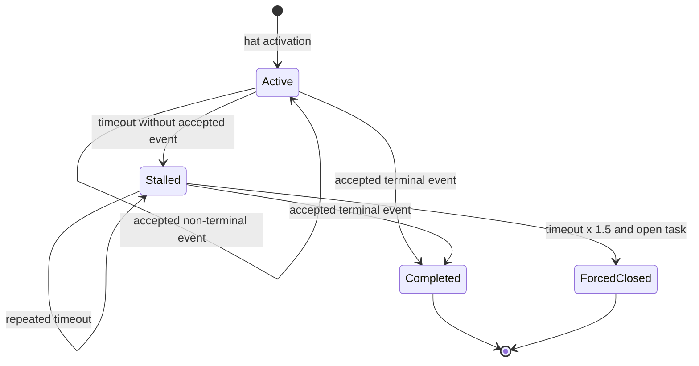
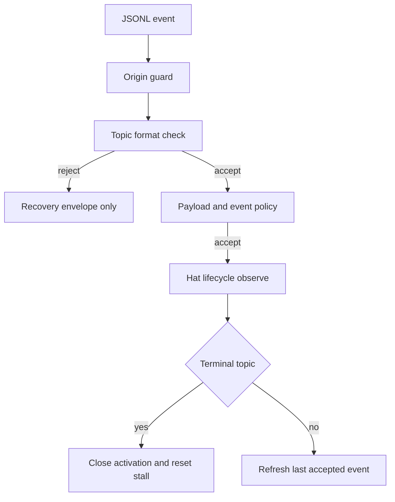

# feat: 强化 Hat 生命周期与 Stall 契约

## Summary

为每次 hat activation 建立显式生命周期跟踪，支持多结果终态、per-hat stall timeout、重复 stall 累积、运行时 topic 格式拒绝和 task forced closure。实现复用现有 recovery envelope、execution contract 与 task store，不把 hat 生命周期硬塞进当前以业务 instance 为中心的 `state_machine.rs`。

---

## Problem Frame

当前 `StateMachineRuntimeState` 跟踪 payload 中的业务 instance，并不识别“哪次 hat activation 尚未完成”。现有 stall 是“整次 iteration 无 event”后的 fallback 计数，无法按 hat 的 active timestamp 判定；`TaskNotTerminal` 只拒绝完成事件，不会形成明确的 forced closure。

需求文档要求单一 `terminal_event`，但现有 preset 多处存在成功/失败双结果。计划采用 OQ1 方案 A 的泛化形式：`terminal_events` 是非空集合；一轮 activation emit 集合中任一 terminal topic 即完成。这样保留显式契约，又不要求人为增加无业务意义的统一 completion event。

---

## Requirements

**生命周期配置**

- R1. `HatConfig` 支持非空 `terminal_events` 集合；单字符串 `terminal_event` 仅作为 serde 输入别名，不作为长期双 schema。
- R2. 每个 terminal topic 必须存在于该 hat 的 `publishes`，并通过现有 authoring contract 校验。
- R3. lifecycle tracking 以 activation 为单位，记录 trigger、hat、activated_at、last_event_at、terminal topics、关联 task id 与状态。

**Stall 与强制收尾**

- R4. `EventLoopConfig` 支持 global default 与 per-hat timeout；未配置 hat 使用 global default。
- R5. active activation 超时无 accepted event 时产生 `stall_no_events`；同一 activation 再次超时产生 `repeated_stall` 并递增计数。
- R6. terminal event 被接受后 activation 关闭并清除 stall 计数。
- R7. 超过 timeout 的 1.5 倍且关联 task 仍 open 时，产生 `task.terminal_forced`，并通过 task store 原子关闭任务，记录 closure metadata。
- R8. forced closure 不杀 backend process；loop runner 继续拥有进程处置权。

**Runtime topic contract**

- R9. 所有 JSONL agent event 在 payload policy 前执行 topic 格式检查；未白名单的非法 topic被拒绝。
- R10. topic 格式拒绝不自动向同一 agent 发 retry event，只写 recovery signal，避免自激循环。
- R11. 运行时 owner check 仅在 ownership 配置可用时启用；缺失时不阻塞本计划其他能力。

**迁移与验证**

- R12. manifest 中全部嵌入 preset 补齐 terminal sets 和合理 stall policy。
- R13. 新事件使用现有 `RecoveryDiagnosisEnvelope` 与 execution/stall source，不创建平行 diagnostics schema。

---

## Key Technical Decisions

- **新增 `hat_lifecycle.rs`，不扩张业务 instance state machine：** 两者 key、时间语义和关闭条件不同，强行复用会污染现有纯状态转换。
- **多 terminal topic 是一等配置：** 成功、失败、耗尽均可结束 activation；terminal 后是否推进成功链仍由现有拓扑决定。
- **只按 accepted event 更新时间：** origin/policy/execution contract 拒绝的 event 不算进展，避免坏 event 无限延长 timeout。
- **使用可注入 clock：** 所有 timeout 测试使用 fake clock，不依赖 sleep。
- **forced close 通过领域 API：** 扩展 `TaskStore` 的带 closure metadata 关闭操作，禁止 lifecycle tracker 直接改 JSONL。
- **topic 格式检查先于 schema：** 非法 topic不会进入 schema lookup；rejection 转成专用 `ViolationType` 和 recovery reason。
- **owner 能力可选：** 若 001 计划尚未实现，lifecycle 仍可独立工作；owner-related authoring/runtime 检查返回 capability unavailable warning，而不是编译依赖。

---

## High-Level Technical Design

---

## Implementation Units

### U1. Lifecycle 与 stall 配置模型

- **Goal:** 定义可迁移、可验证的 terminal set 和 timeout 配置。
- **Requirements:** R1, R2, R4
- **Dependencies:** 无
- **Files:** `crates/ralph-core/src/config/hat.rs`, `crates/ralph-core/src/config/loop_config.rs`, `crates/ralph-core/src/config/ralph_config.rs`, `crates/ralph-core/src/runtime_contract.rs`
- **Approach:** `terminal_events` 默认空以允许解析旧 preset，但 strict authoring contract 要求非空；`stall_policy` 提供非零 global default 和 per-hat map，验证未知 hat、0 秒和溢出。
- **Test scenarios:**
  1. 单字符串 alias 和数组形式解析为同一 terminal set。
  2. 空 terminal set 默认 warning、strict error。
  3. terminal topic 不在 publishes 时 error。
  4. per-hat key 指向未知 hat 或 timeout 为 0 时 error。
  5. 未覆盖 hat 正确回落 global default。
- **Verification:** 配置模型无 runtime 时间状态，contract report 能完整描述错误。

### U2. Activation 生命周期跟踪器

- **Goal:** 用纯 Rust 状态机跟踪每次 hat activation 的 active、stalled、completed、forced 状态。
- **Requirements:** R3, R5, R6
- **Dependencies:** U1
- **Files:** `crates/ralph-core/src/hat_lifecycle.rs`, `crates/ralph-core/src/lib.rs`
- **Approach:** activation key 由 loop id、iteration、hat id 和触发 event identity 组成；tracker API 分离 `activate`、`observe_accepted_event`、`poll_deadlines`，返回 action 而不直接做 I/O。
- **Execution note:** 以 fake clock 驱动状态转换测试。
- **Test scenarios:**
  1. active 后收到中间 event 只刷新时间，不关闭。
  2. 任一 terminal event关闭 activation。
  3. 首次 deadline 返回 stall count 1，第二次返回 repeated count 2。
  4. terminal 后 deadline polling 不再产生 stall。
  5. 并行 activation 的计数互不污染。
  6. 被拒 event 不调用 observe API，不延长 deadline。
- **Verification:** tracker 可在无 EventBus、文件系统和 tokio timer 的单测中完整运行。

### U3. Event loop 集成与 diagnostics

- **Goal:** 在真实 activation、accepted event 和 iteration tick 上驱动 tracker。
- **Requirements:** R3, R5, R6, R13
- **Dependencies:** U2
- **Files:** `crates/ralph-core/src/event_loop/mod.rs`, `crates/ralph-core/src/event_loop/loop_state.rs`, `crates/ralph-cli/src/loop_runner/runner.rs`, `crates/ralph-core/src/diagnosis/envelope.rs`, `crates/ralph-core/src/diagnostics/recovery.rs`
- **Approach:** hat 选中时 activate；policy/execution contract 后的 accepted events 更新 tracker；deadline actions映射到 `DiagnosisSource::StallRecovery` envelope。复用 retry key 维度，加入 activation id 和 accumulated count evidence。
- **Test scenarios:**
  1. 一轮无 accepted events 产生 stall envelope。
  2. 同 activation 重复 poll 产生 repeated outcome。
  3. 中间 accepted event 延后 deadline。
  4. terminal accepted event结束跟踪并重置计数。
  5. diagnostics 禁用时状态仍正确，只有落盘为 no-op。
- **Verification:** replay/integration 测试能从真实 event loop 观察 envelope，而非直接调用 logger。

### U4. Runtime topic 格式拒绝

- **Goal:** 在 agent event 进入 payload schema前拒绝非法 topic，且不自动 retry。
- **Requirements:** R9, R10, R11
- **Dependencies:** U1
- **Files:** `crates/ralph-core/src/event_policy.rs`, `crates/ralph-core/src/event_loop/mod.rs`, `crates/ralph-core/src/event_loop/rejection.rs`, `crates/ralph-cli/src/loop_runner/hard_gate.rs`, `crates/ralph-core/src/diagnosis/reporter.rs`
- **Approach:** 增加 `InvalidTopicFormat` violation；event loop 将其映射为 non-retryable policy rejection和 execution-contract recovery envelope。格式工具与静态 lint 通过独立共享模块复用；若 001 未落地，本计划把工具放在 `topic_contract.rs`，001 后续只消费它。
- **Test scenarios:**
  1. 未白名单 `REVIEW_COMPLETE` 被拒且不进入 payload schema。
  2. whitelist 中 `LOOP_COMPLETE` 被接受。
  3. 非法 topic 不产生 `task.resume`。
  4. 同 batch 中合法 event继续处理，不被非法 sibling 阻断。
  5. diagnostics 报告显示 reason code、source hat 和原 topic。
- **Verification:** accepted event history、EventBus 和 lifecycle tracker均看不到被拒 topic。

### U5. Forced task closure

- **Goal:** 超过 grace deadline 时显式关闭关联 open task并产生可追溯事件。
- **Requirements:** R7, R8, R13
- **Dependencies:** U2, U3
- **Files:** `crates/ralph-core/src/task.rs`, `crates/ralph-core/src/task_store.rs`, `crates/ralph-core/src/hat_lifecycle.rs`, `crates/ralph-core/src/event_loop/mod.rs`, `crates/ralph-core/src/execution_contract.rs`
- **Approach:** task 增加可选 closure metadata（reason、forced hat、timestamp、stall count）；tracker action由 event loop 调用 TaskStore 原子 API，然后发布受信任内部 `task.terminal_forced` event。无 task id 时只诊断，不猜测任务。
- **Test scenarios:**
  1. open task 在 1.5 倍 deadline 后被关闭并写完整 metadata。
  2. 已 closed/failed task保持不变且不重复发布 forced event。
  3. 无关联 task只产生 diagnostic。
  4. 文件写失败时 task内存状态不假装成功，返回 I/O recovery finding。
  5. forced closure 后 backend process仍由 runner管理，tracker不调用 kill。
- **Verification:** task store重载后仍保留 closure metadata，execution contract不再把该 task视为 open。

### U6. Preset 迁移与真实路径测试

- **Goal:** 为所有嵌入 preset声明 terminal sets/stall policy，并证明分支终态行为。
- **Requirements:** R12
- **Dependencies:** U1
- **Files:** `presets/en/*.yml`, `crates/ralph-cli/src/presets.rs`, `crates/ralph-core/tests/scenarios/hat_lifecycle_contract.yml`, `crates/ralph-core/tests/replay_light_integration.rs`, `crates/ralph-cli/src/loop_runner/tests.rs`
- **Approach:** 以 manifest 枚举迁移，不硬编码“8 个”；对成功/失败分支使用 terminal set。grand-lily 证据转为最小 replay fixture，避免依赖现场 worktree。
- **Test scenarios:**
  1. Covers AE1. 同一 activation 两次 stall升级 repeated。
  2. Covers AE2. 大写 topic被拒且无 retry。
  3. Covers AE3. open task在 grace deadline 后 forced close。
  4. Covers AE4. 非 terminal中间 event不关闭 activation。
  5. Covers AE5. 白名单 completion token保持可用。
  6. 所有 manifest preset strict authoring contract通过。
- **Verification:** BDD 经过真实 event loop、policy、task store 和 diagnostics路径。

---

## Scope Boundaries

### In Scope

- activation lifecycle、terminal sets、per-hat stall、forced task closure、runtime topic format。

### Out of Scope

- backend 自动 kill、wave worker 子生命周期、动态复杂度 timeout、payload schema 新规则。

### Deferred to Follow-Up Work

- 针对 wave worker 的子 activation 与 aggregate deadline 模型。

---

## Risks & Dependencies

- **现有 timeout 重叠：** `HatConfig.timeout` 是 backend execution timeout，新 stall policy 是 accepted-event progress timeout；文档和命名必须区分。
- **task 关联不完整：** 部分 activation payload 不含 task id；forced close必须 fail-safe，只诊断不猜任务。
- **重复事件：** deadline polling 与 late terminal event可能竞态；tracker action需带 generation/version，TaskStore操作幂等。
- **001 计划可选依赖：** topic whitelist/owner 配置若已存在则复用；否则通过 adapter trait 或共享 module保证本计划可独立编译。

---

## Acceptance Examples

- AE1. executor 同一 activation 两次无 accepted event，recovery 依次记录 stall 与 repeated count 2。
- AE2. 非白名单大写 topic被拒，不产生 retry，后续合法 event仍可处理。
- AE3. stalled activation关联的 open task在 grace deadline 后原子关闭并发出 forced event。
- AE4. success/failure 任一 terminal topic均可结束同一 hat activation。

---

## Documentation / Operational Notes

- 更新 runtime diagnosis 指南，解释 backend timeout、stall timeout、forced closure 的区别。
- preset 作者文档给出 terminal set 的分支结果示例，不鼓励增加无意义统一 terminal topic。

---

## Sources / Research

- `crates/ralph-core/src/state_machine.rs`：现有业务 instance state machine，证明需独立 lifecycle tracker。
- `crates/ralph-cli/src/loop_runner/runner.rs`：当前无 event fallback 与 stall recovery envelope。
- `crates/ralph-core/src/execution_contract.rs`：现有 `TaskNotTerminal` 拒绝路径。
- `crates/ralph-core/src/diagnosis/responder.rs`：现有 repeated/escalation in-memory 聚合模式。
