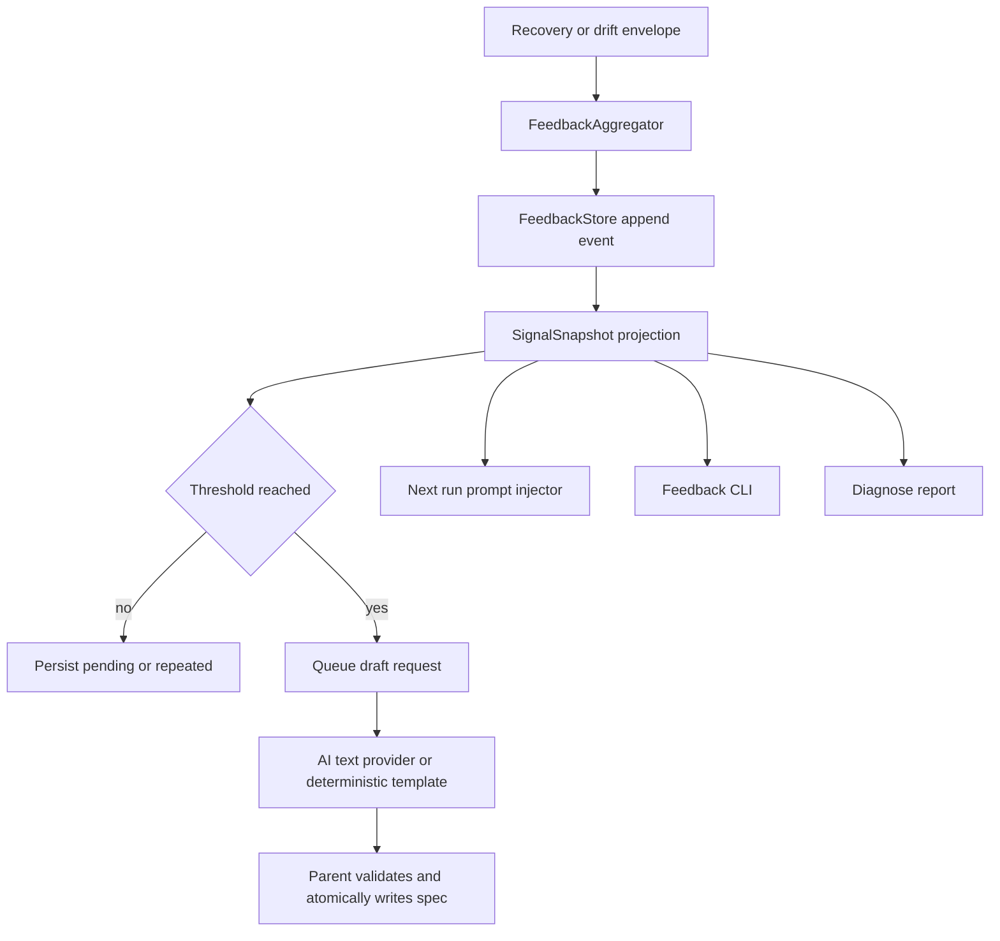
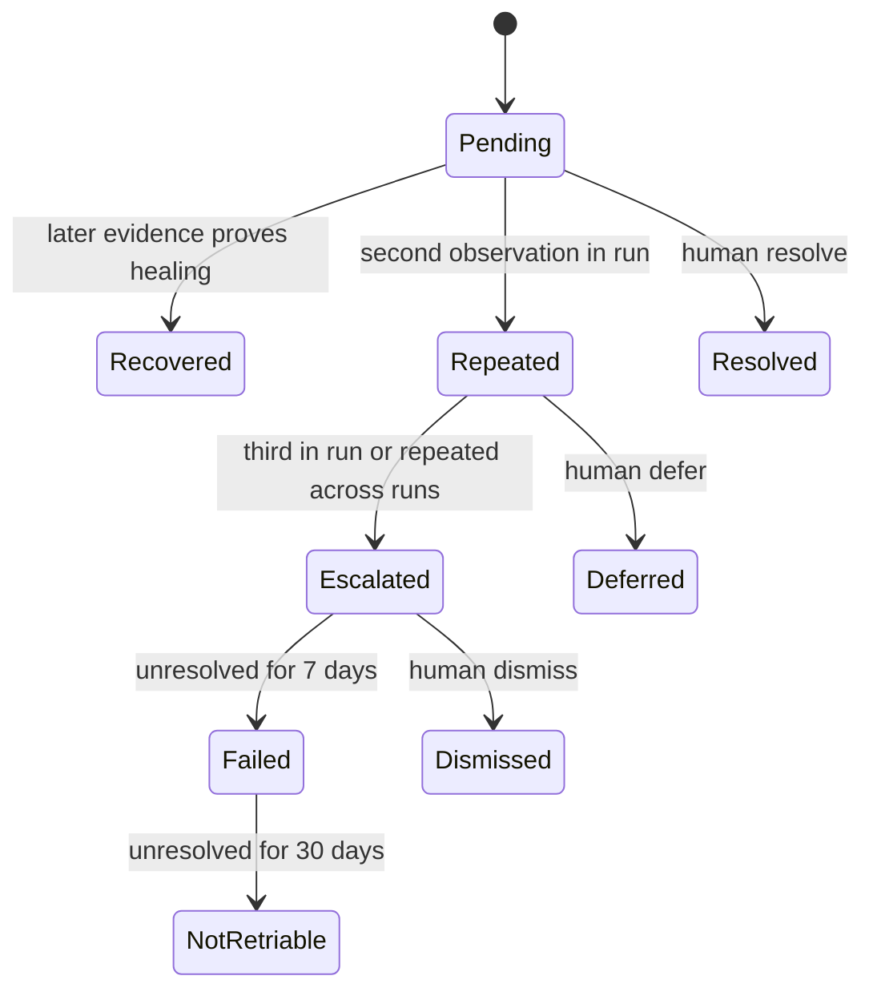

# feat: 建立 Recovery Feedback 聚合与人工闭环

## Summary

把现有 recovery/drift envelope 聚合为跨 iteration、跨 run 的持久 signal，并在达到阈值时生成可审阅 spec 草稿、向下一次 loop 注入摘要、提供人工 accept/defer/dismiss/resolve CLI。设计保持 append-only 审计和副作用隔离，AI 只返回草稿文本，父进程是唯一文件写入者。

---

## Problem Frame

现有 `RecoveryResponder` 只在单次 loop 内按 retry key 聚合并驱动 soft/hard/final action；session 结束后没有跨 run 状态。`recovery.jsonl` 和 `drift.jsonl` 是 session artifact，不是长期 feedback source，重复问题会在每次 run 被当作新问题。

需求中的“aggregation daemon”无需独立常驻进程。计划采用 OQ2 方案 A 的受限形式：in-process aggregator 在 recovery envelope 记录后执行纯内存更新并追加 journal，预算超限则延迟到 iteration boundary。OQ1 采用异步草稿生成，但 loop 终止时做有界 flush；下一次启动会补偿缺失草稿后再注入 signal。

---

## Requirements

**持久 signal**

- R1. 新增 `.ralph/feedback/feedback.jsonl` append-only journal，记录 evidence observed、outcome transition、human action、draft status 等事件。
- R2. signal identity 基于稳定 retry key/envelope source/topic 集合，不包含日期；同类问题跨日期仍能聚合。
- R3. 当前 run 同 signal 第 2 次为 repeated，第 3 次为 escalated；最近 5 个完成 run 中两次 repeated也升级 escalated。
- R4. escalation、7 天未处理、30 天未处理转换由可注入 clock 驱动；deferred/dismissed/resolved停止自动升级。
- R5. history 使用每次 run 的不可变 summary，不复制整份 feedback journal。

**草稿与 prompt**

- R6. escalated signal最多关联一个 active spec draft；相同 signal更新 metadata，不创建重复文件。
- R7. AI subprocess 只能接收结构化 signal并返回文本；父进程校验、渲染 frontmatter并原子写入 `.ralph/specs/`，AI 无项目文件系统写权限。
- R8. 下一次 loop 启动时把 unresolved repeated/escalated/failed signal注入 prompt 的独立 `## Recovery Signal(s)` 段；不依赖 scratchpad enabled 状态。
- R9. prompt 注入有条数和字符预算，包含 signal id、outcome、topics、owners、evidence counts、draft path与人工动作提示。

**人工闭环与报告**

- R10. `ralph feedback list|show|accept|defer|dismiss|resolve` 使用同一 store API并追加 human action。
- R11. 状态转换具备前置条件和幂等性；非法转换返回非零且不写 journal。
- R12. `ralph diagnose --include-feedback` 将当前 session 的 recovery finding关联到全局 signal摘要。
- R13. feedback 不修改 preset、不执行 git、不触发 build、不创建 PR。

**能力降级**

- R14. 缺 `topic_owners` 时 signal 仍生成，owners 为空并标记 unrouted。
- R15. 缺 `repeated_stall`/`task.terminal_forced` 时聚合所有现有 envelope，不阻塞其他 source。

---

## Key Technical Decisions

- **event-sourced journal 而非可变 signal 行：** 每行是 `FeedbackEvent`，读模型折叠为 `SignalSnapshot`；满足 append-only，避免“追加 outcome_history 到既有行”的矛盾。
- **复用 retry key 作为 identity 核心：** 现有 envelope 已提供稳定聚合键；新 signal id 使用 versioned hash，避免日期导致跨 run 永远无法匹配。
- **单 writer + 文件锁：** store 复用 `FileLock` 和 `LoopHistory` 的 append模式，支持并行 worktree写入共享 feedback目录。
- **异步只用于文本生成：** outcome transition和 journal追加同步完成；draft worker失败不会丢 signal，下次启动可重试。
- **prompt 注入走 InstructionBuilder/EventLoop：** 不直接改 scratchpad 文件，避免 fresh run 清理 scratchpad时误删 signal。
- **人工状态与 diagnosis outcome 分离：** `outcome` 表示机器判断，`review_status` 表示 human workflow，避免 defer/dismiss 被伪装成 recovery outcome。
- **默认关闭外部 AI draft provider：** 无 provider 时生成确定性模板草稿，反馈闭环仍完整；配置 provider 后才调用 backend。

---

## High-Level Technical Design





---

## Output Structure

```text
crates/ralph-core/src/feedback/
  mod.rs
  model.rs
  store.rs
  aggregator.rs
  draft_writer.rs
  prompt_injector.rs
crates/ralph-cli/src/feedback.rs
.ralph/feedback/
  README.md
```

---

## Implementation Units

### U1. Feedback 事件模型与 append-only store

- **Goal:** 建立稳定 schema、projection 和并发安全持久化。
- **Requirements:** R1, R2, R4, R5
- **Dependencies:** 无
- **Files:** `crates/ralph-core/src/feedback/mod.rs`, `crates/ralph-core/src/feedback/model.rs`, `crates/ralph-core/src/feedback/store.rs`, `crates/ralph-core/src/lib.rs`
- **Approach:** 定义 versioned `FeedbackEvent` variants 和 `SignalSnapshot`；store append 后 flush，reader对 malformed line按 telemetry policy处理。run summary记录 signal id、最终 outcome、run id和计数。
- **Execution note:** 先用事件序列测试 projection，再实现磁盘 store。
- **Test scenarios:**
  1. 相同 retry key/source/topics跨日期生成同 signal id。
  2. 不同 source 或 topic集合生成不同 id，topic顺序不影响 hash。
  3. journal replay得到正确 outcome history和 human status。
  4. partial trailing line按 warn/skip策略处理。
  5. 两个 writer在文件锁下不产生交错 JSON。
  6. 重复 append同 event id被 projection幂等忽略。
- **Verification:** 删除缓存 snapshot 后只靠 journal可重建全部 signal状态。

### U2. 单 run 聚合与现有 recovery 写路径接入

- **Goal:** 每个 recovery/drift envelope形成 observation并驱动 pending/repeated/escalated。
- **Requirements:** R3, R14, R15
- **Dependencies:** U1
- **Files:** `crates/ralph-core/src/feedback/aggregator.rs`, `crates/ralph-core/src/diagnostics/mod.rs`, `crates/ralph-core/src/diagnosis/envelope.rs`, `crates/ralph-core/src/event_loop/mod.rs`
- **Approach:** 在统一 `record_recovery_envelope` 后调用 aggregator，不能散落到各 producer；owner routing通过可选 resolver注入。聚合预算超限时排队到 iteration boundary。
- **Test scenarios:**
  1. 首次 observation写 pending，第二次 repeated，第三次 escalated。
  2. 不同 retry key互不累计。
  3. owner resolver缺失时 owners为空且 unrouted=true。
  4. diagnostics artifact关闭时 feedback仍按自身配置工作。
  5. append失败只记录 warning，不改变 recovery主路径的原结果。
- **Verification:** 所有 8 类现有 diagnosis source均能形成 signal，不要求新增 lifecycle事件。

### U3. 跨 run history 与时间升级

- **Goal:** 在启动/终止边界完成最近 5 run聚合和未处理时长升级。
- **Requirements:** R3, R4, R5
- **Dependencies:** U1
- **Files:** `crates/ralph-core/src/feedback/aggregator.rs`, `crates/ralph-core/src/feedback/store.rs`, `crates/ralph-cli/src/loop_runner/runner.rs`
- **Approach:** loop终止写不可变 run summary；启动时读取最近 5 个按完成时间排序的 summary。用 clock trait计算 7/30 天，明确以首次 escalated timestamp为基准。
- **Test scenarios:**
  1. 最近 5 run中两次 repeated升级 escalated。
  2. 第 6 个旧 run不参与窗口。
  3. escalated 6 天不升级，7 天升级 failed。
  4. failed 30 天升级 not_retriable。
  5. resolved/deferred/dismissed不再自动升级。
  6. crash未写完成 summary的 run不进入跨 run分母。
- **Verification:** 测试使用 fake clock与临时目录，无 wall-clock sleep。

### U4. 安全的 spec draft pipeline

- **Goal:** 为 escalated signal生成单一、可重试、不可越权写入的 spec草稿。
- **Requirements:** R6, R7, R13
- **Dependencies:** U1, U2
- **Files:** `crates/ralph-core/src/feedback/draft_writer.rs`, `crates/ralph-core/src/config/telemetry.rs`, `crates/ralph-cli/src/loop_runner/runner.rs`
- **Approach:** draft request进有界队列；provider仅返回 string。父进程拒绝绝对路径、`..`、symlink escape，生成 frontmatter并在 specs dir内原子 rename。无 AI provider时用确定性模板。终止时有界 flush，启动时补偿 escalated但无 draft的 signal。
- **Test scenarios:**
  1. escalation只创建一个 active draft，重复 escalation更新 seen metadata。
  2. provider返回 YAML/frontmatter注入内容时被作为正文转义，不覆盖父进程 metadata。
  3. 目标路径包含 traversal、absolute path或 symlink escape时拒绝且不污染外部目录。
  4. provider timeout/error后 signal保持 escalated且 draft status=failed，可在下次启动重试。
  5. deterministic provider在无 backend环境生成完整草稿。
  6. 父进程之外没有任何文件写 API暴露给 provider。
- **Verification:** 审计测试确认 `presets/`、git index和构建产物无变化。

### U5. 下一次 loop prompt 注入

- **Goal:** 让 agent在新 loop第一轮看到 unresolved signal，同时控制 prompt预算。
- **Requirements:** R8, R9, R14
- **Dependencies:** U1, U3
- **Files:** `crates/ralph-core/src/feedback/prompt_injector.rs`, `crates/ralph-core/src/instructions.rs`, `crates/ralph-core/src/event_loop/mod.rs`, `crates/ralph-core/src/config/telemetry.rs`
- **Approach:** 构建独立 prompt block，按 severity/outcome/last_seen排序，去重并截断；插入位置在系统 contract之后、任务上下文之前。仅启动快照注入，不在当前 loop中动态改变上下文。
- **Test scenarios:**
  1. Covers AE3. escalated signal在下一 run首轮 prompt可见。
  2. scratchpad禁用或 fresh run清理时 signal仍可见。
  3. resolved/dismissed/not_retriable不注入。
  4. 超过条数和字符预算时保留最高优先级并显示省略计数。
  5. draft尚未生成时明确显示 pending，不引用不存在路径。
- **Verification:** prompt snapshot测试证明 block只出现一次且不覆盖 Robot guidance/runtime diagnosis alert。

### U6. 人工 review CLI

- **Goal:** 提供可审计、幂等的人工状态转换。
- **Requirements:** R10, R11, R13
- **Dependencies:** U1
- **Files:** `crates/ralph-cli/src/feedback.rs`, `crates/ralph-cli/src/main.rs`, `crates/ralph-cli/src/commands/mod.rs`, `crates/ralph-core/src/feedback/store.rs`
- **Approach:** CLI只调用 store domain commands；`accept` 不自动改 preset，`resolve`要求 signal存在且未 dismissed。输出支持 human/json，便于未来自动化但不执行外部副作用。
- **Test scenarios:**
  1. list/show展示 projection后的最新状态。
  2. accept/defer/dismiss/resolve各写一条 human action event。
  3. 重复相同动作幂等成功，不重复 transition。
  4. dismissed后 resolve等非法转换返回非零且 journal不增长。
  5. 未知 signal id返回明确错误。
- **Verification:** CLI测试检查 git状态、preset内容和进程列表无副作用。

### U7. Diagnose 关联与文档

- **Goal:** 在现有诊断报告中显示长期 feedback上下文并说明人工闭环。
- **Requirements:** R12, R13
- **Dependencies:** U1, U3
- **Files:** `crates/ralph-cli/src/commands/diagnose.rs`, `crates/ralph-core/src/diagnosis/reporter.rs`, `docs/guide/runtime-diagnosis.md`, `.ralph/feedback/README.md`
- **Approach:** `--include-feedback` 显式启用全局 store读取；通过 retry key/signal id关联 session finding。JSON schema additive增加 optional feedback section。
- **Test scenarios:**
  1. flag关闭时现有 Markdown/JSON输出字节契约不变。
  2. flag开启时匹配 signal显示 outcome、review status和 draft path。
  3. store缺失或损坏时报告带 warning但仍渲染 session。
  4. JSON输出保持稳定 schema version策略。
- **Verification:** `ralph diagnose --help`、Markdown和JSON测试均覆盖新 flag。

### U8. 端到端 replay 与安全审计

- **Goal:** 用真实 recovery记录证明 evidence到人工 resolve的完整链路。
- **Requirements:** R1-R15
- **Dependencies:** U2-U7
- **Files:** `crates/ralph-core/tests/fixtures/recovery-feedback-grand-lily.jsonl`, `crates/ralph-core/tests/recovery_feedback_integration.rs`, `crates/ralph-cli/src/loop_runner/tests.rs`
- **Approach:** 将现场证据最小化为稳定 fixture；运行两次模拟 loop形成跨 run升级，再执行 CLI resolve和第三次启动验证不注入。
- **Test scenarios:**
  1. Covers AE1. 同 run第三次 stall升级并生成 draft。
  2. Covers AE2. 两个 run repeated后第三次启动升级。
  3. Covers AE4. provider无法写 preset。
  4. Covers AE5. resolve后不再升级或注入。
  5. Covers AE6. fake clock推进到 not_retriable。
- **Verification:** 集成测试经过 diagnostics collector、feedback store、draft writer、prompt builder和 CLI domain API。

---

## Scope Boundaries

### In Scope

- 本地 repo/worktree内的 signal journal、跨 run聚合、spec草稿、prompt注入、人工 CLI、diagnose关联。

### Out of Scope

- AI直接修改 preset、git/build/PR自动化、runtime热加载 builtin preset、跨机器集中聚合。

### Deferred to Follow-Up Work

- GitHub/Slack通知 hook、跨 worktree归并策略、组织级 signal服务。

---

## Risks & Dependencies

- **共享目录并发：** parallel loop可能同时追加；必须锁文件并使用 event id幂等。
- **无限增长：** append-only journal需要只读压缩/归档工具，但首版不得通过原地重写破坏审计。
- **AI边界：** 仅“路径白名单”不足以限制通用 agent；必须由父进程掌控全部写盘。
- **跨计划能力：** owner/lifecycle事件是增强项而非编译前置；缺失时保留 unrouted或通用 envelope聚合。
- **prompt污染：** feedback block必须有预算、排序和启动快照，避免每 iteration累积。

---

## Acceptance Examples

- AE1. 同一 run中相同 signal第三次出现后进入 escalated，且最多生成一个 draft。
- AE2. 最近 5 个完成 run内两次 repeated会在新 run启动时升级。
- AE3. unresolved signal在下一次 loop首轮 prompt可见，当前 loop prompt不被动态改写。
- AE4. provider即使输出恶意路径/内容也无法修改 `.ralph/specs/` 之外文件。
- AE5. human resolve后下一次启动不再升级和注入该 signal。
- AE6. fake clock达到未处理阈值后形成 failed与not_retriable审计事件。

---

## Documentation / Operational Notes

- `.ralph/feedback/README.md` 说明 journal、draft、human status、rebuild冷却和故障恢复。
- `docs/guide/runtime-diagnosis.md` 增加 feedback配置矩阵、文件清单和 `diagnose --include-feedback`。
- 新 CLI 不属于 `ralph tools` 命名空间，因此无需修改 tools skill；若实施时改为 tools子命令，必须同步对应 data markdown并反向验证源码引用。

---

## Sources / Research

- `crates/ralph-core/src/diagnosis/envelope.rs`：已有稳定 retry key和6类 outcome。
- `crates/ralph-core/src/diagnosis/responder.rs`：单 run内聚合和恢复判定模式。
- `crates/ralph-core/src/loop_history.rs`：文件锁保护的 append-only event store模式。
- `crates/ralph-core/src/instructions.rs` 与 `event_loop/mod.rs`：prompt构建和注入入口。
- `crates/ralph-cli/src/commands/diagnose.rs`：现有报告 CLI与退出码契约。
