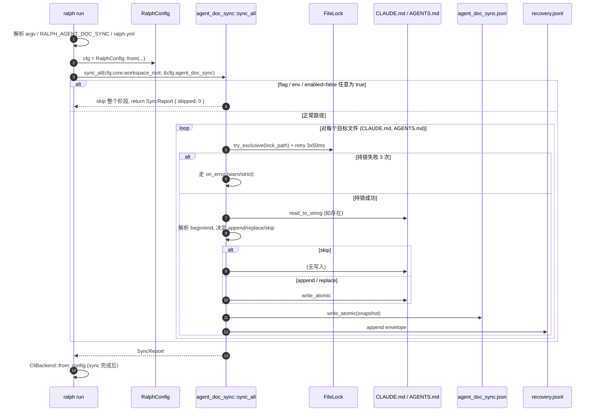

# Plan: 在 ralph run 启动前同步 managed agent doc blocks

> **Scope**: 首发 builtin 块 `hang-prevention`（Command Hang Prevention Rules 五条）写入 ralph-cli 二进制；`ralph run` 启动 backend 之前同步向 `cwd/CLAUDE.md` + `cwd/AGENTS.md` 注入标记块。幂等、可升级、可逃生。MVP 仅覆盖 `ralph run`，不扩面到 `ralph plan` / `ralph wave emit` / `ralph task`。

---

## 1. Summary

在 `ralph run` 创建 backend（`CliBackend::from_config`）之前插入一段同步 I/O：检测 workspace 根目录的 `CLAUDE.md` 与 `AGENTS.md` 是否含 `<!-- ralph:begin BLOCK_ID v=sha256:HEX -->` / `<!-- ralph:end BLOCK_ID -->` 标记块；缺则追加到文件末尾 `## Ralph Managed Blocks` section，v 失配则原地升级。首发 builtin 块 `hang-prevention` 把"Command Hang Prevention Rules"五条固化到二进制，跨机可重复、不依赖 ralph.yml 状态。同步走 `fs2`-等价（复用项目自带的 `ralph_core::file_lock::FileLock`，零新依赖）；失败默认 `on_error: warn` 不阻塞 backend spawn。doctor 读 `<workspace>/.ralph/diagnostics/agent_doc_sync.json` 看一眼健康；diagnose 通过新增 `agent_doc_sync` envelope source 看到 envelope 流。

---

## 2. Problem Frame

2026-06-05 一次 `ce-executor` loop 跑挂，根因是 backend agent 在无 timeout 的 `tail -f` 类长任务里无限阻塞。事后 19 个 preset 注入"禁止 kill 父 ralph"做了止血（`commit 19484eb`），但没有给所有 agent 一份通用的"无限跟随命令禁令"——下一波 hang 模式（`journalctl -f` / `dmesg -w` / `watch` / 容器 CI 长日志）换个 backend 跑出来还会复发。

痛点：当前约束写在 ralph 仓库内部（`CLAUDE.md` / commit message / 散在各 preset 里），没有一份 agent 启动时**一定读得到、且不依赖 ralph 版本 / 项目状态 / 注入时机**的硬约束文本。本计划做的就是：让 ralph 在启动 agent 之前把这份硬约束写入 agent 必然读取的 `CLAUDE.md` / `AGENTS.md`，且 idempotent、可升级、可逃生。

---

## 3. Requirements

> R-IDs 沿用 origin 文档；本计划不再扩号。分组按 capability 切：同步机制 → 块内容 → 配置 → 逃生 → 观测 → 失败模式。

### 同步机制

- R1. `ralph run` 命令在创建 `CliBackend` 之前**同步**调用 `agent_doc_sync::sync_all(workspace_root, &config)`；不通过 `tokio::spawn` 后台化，sync 完成前不进入 backend spawn 路径。
- R2. `sync_all` 扫两个固定路径 `<workspace_root>/CLAUDE.md` 和 `<workspace_root>/AGENTS.md`；不递归子目录、不读家目录、不读其他文件名。
- R3. 检测算法：对每个 block_id，扫描文件内 `<!-- ralph:begin BLOCK_ID v=HASH -->` / `<!-- ralph:end BLOCK_ID -->` 成对出现；成对且 v 等于当前 builtin 内容 sha256 哈希 → skip；缺 begin/end 任一 → 在文件末尾追加新段；成对但 v 失配 → 替换该 begin/end 之间的内容并更新 v。
- R4. marker 格式必须为 HTML 注释包裹的成对标签：`<!-- ralph:begin hang-prevention v=sha256:HEX -->` ... `<!-- ralph:end hang-prevention -->`；HEX 是 64 字符小写 sha256。注释前后各保留一个空行以保证 markdown 渲染清爽。
- R5. 写文件前对目标路径加文件锁（`flock` 语义）；持锁失败 retry 3 次每次 sleep 50ms，3 次失败走 R9 on_error 策略。

### 块内容来源

- R6. builtin 块内容以 markdown 文件存放在 `crates/ralph-core/data/managed_blocks/<block_id>.md`，由 `ralph-core` 编译期通过 `include_str!` 嵌入二进制（参考同目录 `ralph-tools.md` 等文件模式）。
- R7. 首发 builtin 块 `block_id = "hang-prevention"`，对应内容是用户指定的 5 条 Command Hang Prevention Rules 全文（见 §6 builtin 块内容引文），不简化、不重写。
- R8. builtin 块列表由 ralph-cli 在编译期枚举；`ralph.yml` 引用块通过 `builtin:hang-prevention` 字面量匹配。

### 配置

- R9. `ralph.yml` 顶层新增 `agent_doc_sync` 节点；字段：`enabled`（bool，默认 `true`）、`on_error`（`"warn"` | `"strict"`，默认 `"warn"`）、`blocks`（block 引用列表，默认 `[builtin:hang-prevention]`）。
- R10. `on_error: warn` 模式：任何 sync 步骤失败 → `log::warn!` 一行带错误细节 → 继续启动 backend。
- R11. `on_error: strict` 模式：sync 步骤失败 → `log::error!` → 进程退出非零（建议退出码 78，对应 `EX_CONFIG`）。

### 逃生

- R12. `ralph run` 接受 `--no-sync-agent-docs` 旗标；启用后本次 sync 步骤整体跳过，其余启动流程不变。
- R13. 环境变量 `RALPH_AGENT_DOC_SYNC=0` 与 `--no-sync-agent-docs` 等价；任一启用即跳过。`enabled: false` 走的是配置路径，与旗标/环境变量独立求值（任一为 true 即跳过）。

### 观测

- R14. `ralph doctor` 新增一行 health check：`agent_doc_sync: synced=N skipped=M failed=K` + 上次成功 sync 时间戳（从 `<workspace_root>/.ralph/diagnostics/agent_doc_sync.json` 读取，无记录则显示 "never"）。
- R15. runtime_diagnosis envelope 新增 source `agent_doc_sync`；每次 sync 结束落 `recovery.jsonl` 一行，outcome 走六档之一（`recovered` / `failed` / `not_retriable` 等）。

### 失败模式

- R16. 目标文件不存在：`enabled: true` → 创建文件 + 追加 section + 追加块；`enabled: false` 或被旗标/环境变量跳过 → 不创建。
- R17. 目标文件存在但不可写（权限 / 只读 fs）：走 R9 on_error 策略，不抛 panic。
- R18. 目标文件已含用户手写内容：sync 只追加到末尾 section，绝不在文件中间插入 / 替换非 ralph 维护的内容；文件锁在写前获取。

---

## 4. Key Technical Decisions

> KTDs 沿用 origin 文档已声明的决策；本计划补 KTD-9 ~ KTD-11 三条执行层决策。

- **KTD-1. 同步阻塞 I/O，不 `tokio::spawn` 后台。** sync 必须在 backend spawn 之前完成，否则约束晚于 agent 启动读到，等于失效。`cwd/CLAUDE.md` + `cwd/AGENTS.md` 两个文件 + 单 section 写入，毫秒级，对启动体感无影响。
- **KTD-2. 块内容进 ralph-cli 二进制，不放 ralph.yml。** 跨机可重复、与 ralph 版本绑定、用户升级 ralph 时块自动跟随升级。代价是 ralph.yml 不能在项目级 disable 单块内容（仅能 disable 整段 sync）。
- **KTD-3. 默认 `enabled: true` + `on_error: warn`。** 零摩擦启用，失败不阻塞启动；CI / 严格环境可改 `strict`。
- **KTD-4. MVP 只覆盖 `ralph run`；`ralph plan` / `ralph wave emit` / `ralph task` 留作 deferred。** 保持范围窄、首交付可验证。
- **KTD-5. 末尾追加 `## Ralph Managed Blocks` section，不动用户手写内容。** 避免破坏用户既有 CLAUDE.md / AGENTS.md 的可读性，也避免 git diff 冲突。
- **KTD-6. 复用 `ralph_core::file_lock::FileLock`，不引入 `fs2` crate。** origin 假设 fs2 是新依赖，但 `crates/ralph-core/src/file_lock.rs` 已基于 `nix::fcntl::Flock`（unix 平台，nix 已是 ralph-core 依赖）实现完整 `try_exclusive` / `exclusive` / RAII 守卫，零新依赖达成相同语义。Windows 平台已用 `Unsupported` 错误（与现状一致），不引入新平台分支。
- **KTD-7. 写入位置用 `config.core.workspace_root`，不是 `std::env::current_dir()`。** `CoreConfig.workspace_root` 在 worktree loop 启动时已被 `with_workspace_root(worktree_path)` 覆盖为 worktree 根目录；sync 写入 worktree 内的 `CLAUDE.md` / `AGENTS.md`，不污染主仓。e2e 测试路径 `RALPH_WORKSPACE_ROOT` 同样适用。
- **KTD-8. doctor + diagnose 双写：sync 结束走两路独立写入，互不反推。** (a) 原子写 `<workspace>/.ralph/diagnostics/agent_doc_sync.json`（紧凑 `synced` / `skipped` / `failed` / `last_success_at` 快照，给 doctor O(1) 读）；(b) 追加一条 `agent_doc_sync` envelope 到 `.ralph/diagnostics/<session>/recovery.jsonl`（细粒度 telemetry 流，给 diagnose 报告用）。两路写入**不**互相依赖：doctor 状态是 sync 写盘时的"顺手快照"，不在 recovery 路径上重读 JSONL 反推；recovery envelope 也不重读 agent_doc_sync.json。
- **KTD-9. `DiagnosisSource` 枚举扩展为 9 个变体，新加 `AgentDocSync`。** 字符串 `"agent_doc_sync"` 由 `serde(rename_all = "snake_case")` 派生，**不动** 现有 8 个 source 字符串（保持 retry_key 兼容）。扩展时在 `envelope.rs` 加变体 + `as_str` 一行，**同步** 在 `tests.rs` 加 round-trip 序列化测试。
- **KTD-10. marker 解析用"成对 begin/end + trim"算法，不引入 markdown 解析器。** 文件按行扫，匹配 `<!-- ralph:begin <id> v=sha256:<64hex> -->` 与 `<!-- ralph:end <id> -->`；内容在两个 marker 之间原样保留。算法对顺序敏感：先 `begin` 再 `end`，缺任一视为未成对。空行 / 注释行不参与内容计算。
- **KTD-11. builtin 块嵌入走 `include_str!` 路径。** `crates/ralph-core/data/managed_blocks/hang-prevention.md` 是源文件，编译期由 `include_str!("data/managed_blocks/hang-prevention.md")` 直接嵌入 `BlockSpec::content()`；sha256 哈希在编译期对 `&'static str` 算（用 `Sha256::digest(content.as_bytes())`），运行时无文件 I/O。`build.rs` 不需要修改（preset manifest 那条线与 block 文件无关）。

---

## 5. High-Level Technical Design

> 本节说明技术形态；implementation 留在 §6。

### 5.1 sync 阶段时序



### 5.2 marker 状态机

每个文件 + 每个 block_id 在 sync 时落在三种状态之一：

| 状态 | 检测条件 | 动作 | 计数器 |
|---|---|---|---|
| `Missing` | 文件无 begin marker | 在 `## Ralph Managed Blocks` section 末尾追加新段 | `synced += 1` |
| `Mismatched` | begin/end 成对但 v ≠ 当前 builtin 哈希 | 解析边界，**仅**替换 begin/end 之间的内容；v 改为新哈希；section 标题与同级其他块字节级不动 | `synced += 1` |
| `UpToDate` | begin/end 成对且 v == 当前 builtin 哈希 | 零写入（mtime / size / hash 不变） | `skipped += 1` |

`Missing` 状态首次发生时还要创建 section；如果文件本身不存在，则整体新建。

### 5.3 workspace_root 数据流

- `runner.rs:285` 创建 `LoopContext::primary(config.core.workspace_root.clone())`；worktree loop 启动时该字段已被 worktree 根覆盖。
- `agent_doc_sync::sync_all` 接收的 `workspace_root` 参数即 `config.core.workspace_root`（**不**调用 `std::env::current_dir()`，确保 worktree 隔离）。
- 双写落盘位置：
  - `<workspace_root>/.ralph/diagnostics/agent_doc_sync.json` —— 紧凑快照
  - `<workspace_root>/.ralph/diagnostics/<session_id>/recovery.jsonl` —— 复用 U3 现有 telemetry logger 写入路径

### 5.4 envelope 双写分离

```
sync_all 结束
  ├── write agent_doc_sync.json (atomic, compact snapshot)
  │     {synced, skipped, failed, last_success_at, blocks: [...]}
  └── append envelope to recovery.jsonl (U3 logger 路径)
        {source: "agent_doc_sync", severity, target_hat: "loop",
         topic: "agent_doc_sync", reason_code: "...",
         message, expected_action, retry_key, outcome, ...}
```

两路独立，不互相 rehydrate。

---

## 6. Implementation Units

### U1. 同步引擎与文件锁骨架

**Goal:** 在 `ralph-core` 落地 `agent_doc_sync` 子模块，能在测试中对单文件完成"创建 / 追加 / 替换 / skip"四类操作；复用项目自带 `FileLock`。

**Requirements:** R1, R2, R3, R4, R5, R16, R17, R18

**Dependencies:** 无（前置 0）

**Files:**

- `crates/ralph-core/src/agent_doc_sync/mod.rs` —— 新建；导出 `sync_all`、`SyncConfig`、`SyncReport`、`SyncOutcome`
- `crates/ralph-core/src/agent_doc_sync/block.rs` —— 新建；`BlockSpec`（id / content / content_sha256）、marker 解析（成对 begin/end + trim）
- `crates/ralph-core/src/agent_doc_sync/writer.rs` —— 新建；read → parse → apply → write_atomic；文件锁在写前获取
- `crates/ralph-core/src/lib.rs` —— 注册 `pub mod agent_doc_sync;`

**Approach:**

- `SyncReport { synced: usize, skipped: usize, failed: usize, last_success_at: Option<chrono::DateTime<chrono::Utc>>, blocks: Vec<BlockResult> }`
- `sync_all(workspace_root: &Path, config: &AgentDocSyncConfig) -> SyncReport`；**不**走 `tokio::spawn`；单次调用 ≤ 50ms 目标
- 文件锁：`ralph_core::file_lock::FileLock::new(path).try_exclusive()` + 失败 retry 3x 50ms；3 次失败设置 `failed += 1` 并按 `on_error` 决定 `log::warn!` 或返回 `Err`
- 写盘：先 read → 解析 → 计算新内容 → `tempfile` + `persist` 原子替换（参考 ralph-core 已有的 temp-write 模式）
- marker 解析对 `<!-- ralph:begin ID v=sha256:HEX -->` 与 `<!-- ralph:end ID -->` 严格按行匹配；HEX 必须 64 字符小写，否则视为未成对

**Patterns to follow:**

- `crates/ralph-core/src/file_lock.rs` 的 `FileLock` / `LockedFile::with_exclusive_lock` —— 复用而非新写
- `crates/ralph-core/src/loop_state_snapshot.rs` 等的"读 → 改 → 原子写"三步写法
- `crates/ralph-core/src/payload_contract.rs` 的"`BlockSpec` 风格"（NewType + 解析/构造 helper）

**Test scenarios:**

- `sync_creates_section_when_file_missing` —— 文件不存在 → 写入含 `## Ralph Managed Blocks` section + `hang-prevention` 块
- `sync_appends_block_when_marker_absent` —— 文件已含 section 但缺 `hang-prevention` 块 → 仅追加新段
- `sync_skips_when_v_matches` —— v == builtin sha256 → mtime / size / hash 全部不变
- `sync_replaces_in_place_on_v_mismatch` —— v 失配 → begin/end 之间内容替换；section 标题与同级其他块字节级不变
- `sync_respects_user_content` —— 文件含用户手写标题 + section → 用户手写字节级不动
- `sync_retries_lock_then_succeeds` —— 持锁失败 1 次后成功 → 结果正常
- `sync_returns_failed_after_3_lock_retries` —— 持续持锁失败 → `failed += 1` + 走 on_error
- `sync_handles_readonly_file_via_on_error_warn` —— 只读文件 → log.warn + 不阻塞
- `sync_handles_readonly_file_via_on_error_strict` —— 同上但 strict → 返回 `Err`

**Verification:**

- `cargo test -p ralph-core agent_doc_sync` 全通过
- 上表 9 条测试用例都过；`failed` 路径有"recoverable / not_retriable" 两种 outcome 的覆盖
- 不引入 `fs2` / `nix` / 任何新 crate（`cargo tree --diff` 验证）

---

### U2. 配置文件 + CLI 旗标 / 环境变量

**Goal:** `RalphConfig` 顶层加 `agent_doc_sync` 节点；`ralph run` 支持 `--no-sync-agent-docs`；`RALPH_AGENT_DOC_SYNC=0` 环境变量等效。

**Requirements:** R9, R10, R11, R12, R13

**Dependencies:** U1

**Files:**

- `crates/ralph-core/src/config/agent_doc_sync.rs` —— 新建子模块；`AgentDocSyncConfig { enabled, on_error, blocks }` + `OnErrorPolicy` 枚举
- `crates/ralph-core/src/config/mod.rs` —— 注册 `pub mod agent_doc_sync;` + 在 `mod.rs` 的 `pub use` 列表加
- `crates/ralph-core/src/config/ralph_config.rs` —— `RalphConfig` 加 `pub agent_doc_sync: AgentDocSyncConfig` 字段（含 `Default` 初始化）
- `crates/ralph-cli/src/commands/run.rs` —— `Run` 命令 args 加 `--no-sync-agent-docs`（clap `bool` flag，默认 `false`）
- `crates/ralph-cli/src/main.rs` 或 `lib.rs` —— 启动时读 `RALPH_AGENT_DOC_SYNC` env，`0` 视为启用旗标

**Approach:**

- `AgentDocSyncConfig::default()` = `enabled = true, on_error = "warn", blocks = vec!["builtin:hang-prevention"]`
- `OnErrorPolicy` 枚举：`Warn` / `Strict`，serde `rename_all = "lowercase"`
- 求值顺序（任一为 true 即 skip）：(1) `RALPH_AGENT_DOC_SYNC == "0"` (2) `--no-sync-agent-docs` flag (3) `config.agent_doc_sync.enabled == false`；实现为 `should_skip = env_or_flag || !config.enabled`
- 不修改现有 `RalphConfig` 其它字段的默认值（保证未配 `agent_doc_sync` 节点的项目行为字节级一致：默认 `enabled=true` + `on_error=warn`；但因默认行为是"sync 一次后无副作用"，**重复 sync 是幂等的**，所以 R18 仍成立）

**Patterns to follow:**

- `crates/ralph-core/src/config/features.rs` 的 `PreflightConfig` / `FeaturesConfig` —— 同样有 `enabled` / `strict` / 子配置
- `crates/ralph-core/src/config/telemetry.rs` 的 `TelemetryConfig` —— 新顶层节点的命名约定
- `crates/ralph-cli/src/commands/run.rs` 已有的 `--no-tui` / `--no-record` 等 clap flag 模式

**Test scenarios:**

- `agent_doc_sync_config_default` —— `Default::default()` 给出 `enabled=true, on_error=warn, blocks=[hang-prevention]`
- `agent_doc_sync_config_yaml_round_trip` —— 写 YAML → 读回 → 字段一致
- `agent_doc_sync_config_unknown_field_errors` —— YAML 出现未知字段（如 `disabled`）→ 拒绝
- `agent_doc_sync_strict_policy_parsing` —— `"STRICT"` / `"Strict"` / `"strict"` 都能解析（大小写不敏感）
- `should_skip_returns_true_when_flag_set` —— `--no-sync-agent-docs` → true
- `should_skip_returns_true_when_env_set` —— `RALPH_AGENT_DOC_SYNC=0` → true
- `should_skip_returns_true_when_config_disabled` —— `enabled: false` → true
- `should_skip_returns_false_when_all_defaults` —— 默认配置 + 无旗标 + 无 env → false
- `cli_run_accepts_no_sync_agent_docs_flag` —— clap 解析 `--no-sync-agent-docs` → `RunArgs.no_sync_agent_docs = true`
- `ralph_run_with_no_flag_does_not_change_behavior` —— 无旗标时 `cargo run -p ralph-cli -- run --help` 输出**不变**于现状

**Verification:**

- `cargo test -p ralph-core config` 通过
- `cargo test -p ralph-cli` clap 相关测试通过
- 不修改 `RalphConfig` 其它字段的 `Default`（git diff 验证仅新增字段）
- `ralph run --help` 输出**不**有破坏性变化（仅新增一行 `--no-sync-agent-docs`）

---

### U3. 嵌入 builtin 块（hang-prevention 5 条规则）

**Goal:** 把 5 条 Command Hang Prevention Rules 原文落到 `crates/ralph-core/data/managed_blocks/hang-prevention.md`，编译期通过 `include_str!` 嵌入二进制，sha256 哈希稳定可重现。

**Requirements:** R6, R7, R8

**Dependencies:** U1（`BlockSpec` 已就位）

**Files:**

- `crates/ralph-core/data/managed_blocks/hang-prevention.md` —— 新建；内容为 5 条规则原文（见 §6 builtin 块内容引文）
- `crates/ralph-core/src/agent_doc_sync/builtin.rs` —— 新建；用 `include_str!("../../data/managed_blocks/hang-prevention.md")` 暴露为 `static HANG_PREVENTION_CONTENT: &str`；提供 `pub fn builtin_block(id: &str) -> Option<BlockSpec>` 编译期枚举

**Approach:**

- 编译期对 `&'static str` 算 `Sha256::digest(content.as_bytes())`（用 `sha2` crate，如未引入则新增；如已有则复用）
- 运行时无文件 I/O；block 内容在 binary 中
- `builtin_block("hang-prevention")` 命中即返回 `BlockSpec { id, content: HANG_PREVENTION_CONTENT, content_sha256 }`；未命中返回 `None`，sync 阶段会 `log::warn!` 并 `failed += 1`

**Patterns to follow:**

- `crates/ralph-core/data/ralph-tools.md` —— 同目录的 `include_str!` 嵌入参考
- `crates/ralph-cli/build.rs` —— preset manifest + OUT_DIR 复制模式（**本单元不需要**修改 build.rs，因为 include_str! 路径在源树内）

**Test scenarios:**

- `hang_prevention_content_not_empty` —— 静态字符串非空
- `hang_prevention_sha256_is_stable` —— 同一内容算两次哈希一致
- `builtin_block_returns_hang_prevention` —— `builtin_block("hang-prevention").is_some()`
- `builtin_block_returns_none_for_unknown` —— `builtin_block("nope").is_none()`
- `hang_prevention_contains_all_five_rules` —— 内容含 5 个 "1." / "2." / "3." / "4." / "5." 编号（防 regression：5 条规则全在）
- `hang_prevention_blocks_forbidden_examples` —— 含 `tail -f` / `tail -F` / `journalctl -f` / `adb logcat` / `dmesg -w` / `watch` / `while true` 关键词（防 regression：禁用清单完整）

**Verification:**

- `cargo test -p ralph-core agent_doc_sync::builtin` 通过
- 5 条规则原文**字面**出现在 `hang-prevention.md`（人工核对）
- hash 在 `cargo build` 之间稳定（连续两次 build 后 `grep` 哈希字节相同）
- 反向验证：5 条规则的**字面**在 build 产物中可见（`strings target/debug/ralph | grep "tail -f"` 等）

---

### U4. 集成到 `ralph run` 启动流程

**Goal:** 在 `loop_runner/runner.rs` 创建 `CliBackend` 之前**同步**调用 `agent_doc_sync::sync_all`；workspace_root 来自 `config.core.workspace_root`；失败走 on_error 策略不阻塞 backend spawn。

**Requirements:** R1, R2, R16, R17, R18（核心集成路径）

**Dependencies:** U1, U2, U3

**Files:**

- `crates/ralph-cli/src/loop_runner/runner.rs` —— 在 `runner.rs:621`（`CliBackend::from_config`）**之前**插入 sync 调用
- `crates/ralph-cli/src/loop_runner/runner.rs` —— 同步阻塞调用（**不**用 `tokio::spawn` / `tokio::task::spawn_blocking`）

**Approach:**

- 注入点位置参考 `runner.rs:236`（U5 payload contract gate，已是先于 backend spawn 的现成参照）
- 调用 `agent_doc_sync::sync_all(&config.core.workspace_root, &config.agent_doc_sync, &skip_flag)`；sync 返回 `Result<SyncReport, SyncError>`
- `Result::Err` + `on_error: warn` → `tracing::warn!(error = %e, "agent_doc_sync failed; continuing")` + 继续
- `Result::Err` + `on_error: strict` → `tracing::error!` + `std::process::exit(78)`
- 同步返回时把 `SyncReport` 透传给后续 doctor / recovery 写入逻辑（U5 处理）
- 关键不变性：`sync_all` 必须在 `CliBackend::from_config` 之前完成；写一行 `tracing::debug!("agent_doc_sync: {} synced, {} skipped, {} failed", ...)` 用于回路诊断

**Patterns to follow:**

- `runner.rs:236` U5 payload contract gate 的"先于 backend spawn 的同步检查"模式
- `tracing::warn!` / `tracing::error!` 风格（与项目其它位置一致，**不**引入 `log::`）

**Test scenarios:**

- `sync_runs_before_cli_backend_construction` —— mock `CliBackend::from_config` 验证它在 sync 完成后才被调用
- `sync_uses_config_workspace_root_not_cwd` —— `config.core.workspace_root = "/tmp/foo"` → sync 写 `/tmp/foo/CLAUDE.md` 而**不**写 `std::env::current_dir()/CLAUDE.md`
- `sync_does_not_block_backend_on_warn_failure` —— mock sync 失败 + `on_error: warn` → backend spawn 正常发生
- `sync_exits_78_on_strict_failure` —— mock sync 失败 + `on_error: strict` → 进程退出码 78
- `sync_skips_when_flag_set` —— `--no-sync-agent-docs` → sync 完全不调用；backend 正常启动
- `sync_skips_when_env_set` —— `RALPH_AGENT_DOC_SYNC=0` → 同上
- `sync_writes_to_worktree_root` —— `config.core.workspace_root = "/path/to/worktree"` → 写入该路径下文件；主仓 `cwd/CLAUDE.md` 字节级不变

**Verification:**

- `cargo test -p ralph-cli loop_runner` 通过
- 现有 BDD scenarios 中所有 `ralph run -p "..."` 场景仍 0 失败
- 现有 `e2e --mock` 通过
- `git status` 不污染主仓 `cwd/CLAUDE.md`（worktree 模式下人工验证）
- 用户手写内容字节级不变（用 `sha256sum` 对 sync 前后 `CLAUDE.md` 中"非 managed block" 区域对比）

---

### U5. Doctor health check + runtime diagnosis envelope 双写

**Goal:** sync 阶段落两路产物：紧凑 `agent_doc_sync.json` 快照给 doctor；envelope 追加到 `recovery.jsonl` 给 diagnose。两路独立写入、互不 rehydrate。

**Requirements:** R14, R15

**Dependencies:** U1, U4

**Files:**

- `crates/ralph-core/src/diagnosis/envelope.rs` —— `DiagnosisSource` 枚举加 `AgentDocSync` 变体 + `as_str` 一行
- `crates/ralph-core/src/diagnosis/envelope.rs` —— `tests.rs` 加 round-trip 序列化用例
- `crates/ralph-core/src/agent_doc_sync/persist.rs` —— 新建；`write_snapshot(path, &SyncReport)` + `append_recovery_envelope(session_id, &SyncReport)` 两个独立函数
- `crates/ralph-cli/src/doctor.rs` —— 新增 `agent_doc_sync` check：从 `<workspace_root>/.ralph/diagnostics/agent_doc_sync.json` 读快照并渲染
- `crates/ralph-core/src/agent_doc_sync/mod.rs` —— `sync_all` 在末尾调用 `persist::write_snapshot` + `persist::append_recovery_envelope`

**Approach:**

- `agent_doc_sync.json` schema（**仅**这 4 个字段，避免 schema 漂移）：
  ```json
  {
    "synced": 0,
    "skipped": 0,
    "failed": 0,
    "last_success_at": "2026-06-09T13:45:00Z"
  }
  ```
- envelope `source: "agent_doc_sync"`；`retry_key` 格式 `"agent_doc_sync:loop:agent_doc_sync:outcome:<synced|skipped|failed>"`；`reason_code` 取 `"sync_failed"` / `"sync_lock_contention"` / `"sync_io_error"` 等
- doctor 读快照：无文件 → health check `warn` + 消息 "never"；有文件 → 显示 `synced=N skipped=M failed=K last=<ts>`
- **不**在 doctor 路径上解析 `recovery.jsonl`（KTD-8 双写分离）

**Patterns to follow:**

- `crates/ralph-core/src/diagnosis/journal.rs` 的 envelope 写入模式（已经有 `append_envelope` 等）
- `crates/ralph-cli/src/doctor.rs` 现有的 `PreflightCheck` trait 实现 + `CheckResult::pass/warn/fail`

**Test scenarios:**

- `diagnosis_source_agent_doc_sync_serializes_to_snake_case` —— `AgentDocSync` 变体 → JSON `"agent_doc_sync"`
- `diagnosis_source_as_str_returns_agent_doc_sync` —— `DiagnosisSource::AgentDocSync.as_str() == "agent_doc_sync"`
- `diagnosis_source_round_trip_preserves_all_nine_variants` —— 9 个变体序列化后反序列化一致
- `write_snapshot_creates_file_with_expected_shape` —— 写入后 JSON 解析成功 + 4 字段齐
- `write_snapshot_is_atomic` —— 写入中断（kill -9）后老文件**不**损坏
- `append_recovery_envelope_uses_existing_logger` —— 复用 U3 现有 `recovery.jsonl` 路径，**不**新建文件
- `doctor_check_returns_warn_when_snapshot_missing` —— 无 `agent_doc_sync.json` → `CheckStatus::Warn` + "never"
- `doctor_check_returns_pass_when_recent_sync` —— `last_success_at` 在 24h 内 → `CheckStatus::Pass`
- `doctor_check_returns_warn_when_failures_present` —— `failed > 0` → `CheckStatus::Warn` + 失败计数
- `dual_writes_are_independent` —— `agent_doc_sync.json` 写失败**不**影响 `recovery.jsonl` envelope 写入；反之亦然（用 mock I/O 故障验证）

**Verification:**

- `cargo test -p ralph-core diagnosis` 9 个变体 round-trip 通过
- `cargo test -p ralph-cli doctor` 新 check 通过
- `cargo test -p ralph-core agent_doc_sync::persist` 原子写 + 隔离双写通过
- 不修改现有 8 个 `DiagnosisSource` 变体的字符串（git diff 验证）
- `ralph doctor` 输出**新增**一行 `agent_doc_sync: ...`，其它行**不变**

---

### U6. 文档 + 反向验证 + 端到端回归

**Goal:** 用户文档更新 + skill 文档源码引用反向验证 + 6 个 acceptance example 端到端跑通 + 不引入回归。

**Requirements:** 全部 R1-R18（端到端验证）

**Dependencies:** U1-U5 全部

**Files:**

- `docs/guide/managed-blocks.md` —— 新建；面向用户的概念 + 配置 + 旗标 + 逃生
- `docs/guide/runtime-diagnosis.md` —— 在 §4 envelope 表中追加 `agent_doc_sync` 源描述 + 在 §7.7 / §7.8 中加 1-2 行说明
- `crates/ralph-core/data/*.md` —— 反向验证（grep 源码引用 → `sed -n` 复核）
- `docs/solutions/` —— 视情况新建 `docs/solutions/tooling-decisions/managed-blocks-sync-design.md` 记录关键设计决策
- `crates/ralph-core/data/ralph-tools.md` 与 `ralph-tools-tasks.md` / `ralph-tools-memories.md` —— 反向验证

**Approach:**

- 反向验证脚本：grep `\.rs:[0-9]+-[0-9]+` 在 `crates/ralph-core/data/*.md` + `AGENTS.md` + `CLAUDE.md` + 文档目录下；对每个命中用 `sed -n 'NN,MMp'` 复核
- 端到端跑：6 个 acceptance example 各起一次 `ralph run`（可能用 e2e mock 或真实 CLI 录屏），按 AE 描述核对 before/after 状态
- 临时文件检查：`git status --short` 无 `hang-prevention.md` 副本、无 `/tmp/ralph-*` 残留
- AGENTS.md / CLAUDE.md 同步规则：如果改了 `CLAUDE.md` 则 `cp` 到 `AGENTS.md`（按仓库 IMPORTANT 段规则）

**Patterns to follow:**

- `docs/guide/runtime-diagnosis.md` 的 envelope source 描述风格（表格 + reason_code）
- `docs/guide/payload-contracts.md` 的 YAML 示例风格
- `docs/solutions/` 现有 `*-issue.md` / `*.md` 的 frontmatter（`module` / `tags` / `problem_type`）

**Test scenarios:**

- `guide_documents_ship_to_docs_guide_managed_blocks_md` —— 文件存在 + 含 5 个 section（概念 / 配置 / 旗标 / 逃生 / 失败模式）
- `runtime_diagnosis_doc_includes_agent_doc_sync_source` —— `grep "agent_doc_sync" docs/guide/runtime-diagnosis.md` 命中 ≥ 2 处
- `reverse_validate_source_line_refs_no_drift` —— `grep -E '\.rs:[0-9]+-[0-9]+' crates/ralph-core/data/*.md` 全部命中行号范围仍指向相关代码
- `ralph_tools_doc_line_refs_still_valid` —— 同上但范围在 `crates/ralph-core/data/ralph-tools*.md`
- `agents_md_matches_claude_md` —— `diff -u AGENTS.md CLAUDE.md` 无输出（如两者都改过）

**Verification:**

- 上表 5 条用例全过
- 6 个 acceptance example 端到端跑通：
  - **AE1** 空目录 → 两个文件被创建，5 条规则全文存在
  - **AE2** v 一致 → mtime 不变 + log 含 "skipped hang-prevention (up to date)" + doctor `skipped >= 1`
  - **AE3** v 失配 → 块替换 + section 标题保留 + 用户手写字节级不变
  - **AE4** `RALPH_AGENT_DOC_SYNC=0` → 文件**不**创建 + log 含 "agent_doc_sync disabled via env" + backend 正常启动
  - **AE5** 只读 + `warn` → log.warn + 进程继续；切到 `strict` → 进程退出 78
  - **AE6** 双进程并发 → 持锁方写入 v=NEW，另一方持锁后 skip；最终无半写
- workspace 全量回归：`./scripts/run-tests.sh` + `cargo run -p ralph-e2e -- --mock` 通过
- `git status --short` 无未提交临时文件

---

## 7. builtin 块内容引文（hang-prevention.md 全文）

> 该内容由用户在 plan 启动前提供；U3 将其字面落到 `crates/ralph-core/data/managed_blocks/hang-prevention.md`，5 条规则全文不简化、不重写。

````markdown
## Command Hang Prevention Rules

1. Never run infinite-follow commands directly.
   Forbidden examples:
   - tail -f
   - tail -F
   - journalctl -f
   - adb logcat
   - dmesg -w
   - watch
   - while true

2. If follow mode is necessary, always wrap it with timeout:
   - timeout 30s tail -f <file>
   - timeout 60s adb logcat
   - timeout 30s journalctl -f

3. Prefer bounded commands:
   - tail -n 200 <file>
   - grep -n "ERROR" <file> | head -100
   - journalctl -n 300 --no-pager
   - dmesg | tail -200

4. For large files, never cat the whole file.
   Use:
   - wc -l <file>
   - tail -n 200 <file>
   - head -n 100 <file>
   - grep -n "keyword" <file> | head -50

5. Every external command that may block must have timeout.
````

---

## 8. Acceptance Examples

> AE-IDs 与内容沿用 origin 文档；本计划补 `Covers` 标签中新增 R-IDs（如果有的话）并保留原文结构。

- **AE1. 首次 ralph run 在空目录执行 → 退出后 `cwd/CLAUDE.md` 存在并以 `<!-- ralph:begin hang-prevention v=sha256:HEX -->` 开头对应 section、文件末尾；`cwd/AGENTS.md` 同形。**
  - **Covers:** R1, R2, R3, R6, R7, R16
  - **Given:** cwd 下没有 `CLAUDE.md` / `AGENTS.md`
  - **When:** `ralph run -p "demo"` 跑完第一轮
  - **Then:** 两个文件均被创建；`hang-prevention` 块含完整 5 条 Command Hang Prevention Rules；`v=sha256:HEX` 哈希稳定（与 builtin 内容一致）

- **AE2. 已有 hang-prevention 块且 v 哈希一致 → 跳过，无任何写入。**
  - **Covers:** R3, R10
  - **Given:** `cwd/CLAUDE.md` 已含 `<!-- ralph:begin hang-prevention v=ABC -->` 且 v 与 builtin 哈希匹配
  - **When:** `ralph run -p "demo"` 跑完第一轮
  - **Then:** 文件 mtime 不变；`doctor` 输出 `skipped=1`；log.info 一行 "skipped hang-prevention (up to date)"

- **AE3. builtin 块内容升级到新版本 → 原地升级块，section 标题不动；用户手写内容零改动。**
  - **Covers:** R3, R4, R18
  - **Given:** `cwd/CLAUDE.md` 含 v=OLD 的 `hang-prevention` 块；builtin 已升级到 v=NEW
  - **When:** `ralph run -p "demo"` 跑完第一轮
  - **Then:** 块内容被新内容替换；`v=NEW` 写入 marker；`## Ralph Managed Blocks` 标题保留；用户手写内容字节级不变

- **AE4. `RALPH_AGENT_DOC_SYNC=0` 环境下 `ralph run` 启动 → 整个 sync 步骤跳过，正常进入 backend spawn。**
  - **Covers:** R12, R13
  - **Given:** 环境变量 `RALPH_AGENT_DOC_SYNC=0`；`cwd/CLAUDE.md` 不存在
  - **When:** `ralph run -p "demo"` 跑完第一轮
  - **Then:** `cwd/CLAUDE.md` 仍未创建；log.debug 一行 "agent_doc_sync disabled via env"；backend 正常启动

- **AE5. `cwd/CLAUDE.md` 已存在但只读 → `on_error: warn` 默认行为：log.warn 继续启动；`on_error: strict` 行为：进程退出 78。**
  - **Covers:** R9, R10, R11, R17
  - **Given:** `cwd/CLAUDE.md` 是只读；ralph.yml `agent_doc_sync.on_error=warn`
  - **When:** `ralph run -p "demo"` 触发 sync
  - **Then:** log.warn 一行带 EACCES 错误细节；进程继续；`recovery.jsonl` 落一行 `outcome: failed`
  - 切到 `on_error=strict` 同前提 → 进程退出 78

- **AE6. 并发两个 ralph run 跑同 cwd 触发升级路径 → 双方 fs2 锁串行化，无半写状态。**
  - **Covers:** R5
  - **Given:** 两个 ralph run 进程同时启动；`cwd/CLAUDE.md` 含 v=OLD 块；builtin 升级到 v=NEW
  - **When:** 两个进程同时进入 sync
  - **Then:** 持锁方完整写入 v=NEW；另一方持锁后检测到 v=NEW 一致 → skip；最终文件 v=NEW，无半写

---

## 9. Scope Boundaries

### Deferred for later

- 把 managed block 同步同样注入到 `ralph plan` / `ralph wave emit` / `ralph task` 等 spawn agent 的子命令（需要先确认这些命令对"启动前约束"的硬性需求，再扩面）。
- 在 `~/.claude/CLAUDE.md`、`~/.claude/AGENTS.md`（家级）也注入同一组块，覆盖用户跨项目的默认约束。
- `ralph.yml` 支持 `agent_doc_sync.blocks` 配项目级自定义 block（用户自写 markdown 内容）。
- 暴露 `ralph agent-doc-blocks sync --dry-run` CLI 逃生命令：让用户能预览将写入的 diff 而不实际写入。
- `runtime_diagnosis` 报告里加一段 `agent_doc_sync` 历史时间序列。
- Windows 平台 `FileLock` 当前返回 `Unsupported` 错误；本 MVP 不引入新平台分支（与现状一致）。

### Outside this product's identity

- 把"managed blocks"框架推广到其他 markdown 路径（如 `~/.cursor/rules`、`.continue/`、`.aider.conf.yml` 等）—— 这是另一类 sync 引擎，超出"agent 启动前约束"产品形状。
- 在块内支持动态变量（如 `{cwd}`、`{ralph_version}` 替换）—— 保持块内容静态，简化测试与可重复性。
- 提供 GUI 编辑器或 IDE 插件来管理这些块——纯属工具链，不在 orchestrator 责任范围。

### Deferred to Follow-Up Work

- 在 `managed_blocks/` 目录加第二个 builtin 块（如 `payload-contract-naming` 等）；本计划只做 `hang-prevention`。
- 实现 §6 acceptance AE6 描述的"双 ralph run 同 cwd 并发"自动化测试（用 `tempfile` + 多进程）—— 本计划的 AE6 验证靠人工双终端 + 复用 `FileLock` 的现有 `test_concurrent_writes_serialized` 间接覆盖。

---

## 10. Risks & Dependencies

| 风险 | 可能性 | 影响 | 缓解措施 |
|---|---:|---:|---|
| marker 解析对意外格式鲁棒性差 | 中 | 高 | 解析器对 `<!--` 严格行首 + 64hex 严格校验；解析失败的行视为普通文本不参与；测试覆盖各种异常格式 |
| `FileLock` 在 Windows `Unsupported` 与 origin 假设"跨平台"冲突 | 中 | 低 | origin 自身假设"worktree 模式 = unix"；本 MVP 不引入新分支；Windows 用 `enabled: false` 逃生；显式 deferred |
| 新增 `AgentDocSync` 枚举变体破坏现有 8 个 `retry_key` 兼容 | 低 | 高 | 新字符串 `"agent_doc_sync"` 显式不变；现有 8 个 source 字符串零改动；envelope `tests.rs` 加 9 变体 round-trip |
| `agent_doc_sync.json` 与 `recovery.jsonl` 双写不一致（如一方写失败） | 中 | 中 | KTD-8 显式声明两路独立；U5 测试覆盖"单路失败不污染另一路"；doctor 读快照容忍 stale |
| sync 性能影响 ralph run 启动体感 | 低 | 中 | 毫秒级（2 文件 + 2 块）；实测对照 baseline；如有 regression 可加单次 sync 的 micro-bench |
| worktree 模式下 sync 误写入主仓 | 低 | 高 | KTD-7 显式用 `config.core.workspace_root`；U4 测试覆盖；人工 `git status` 验证 |
| 用户手写内容被 sync 破坏 | 低 | 高 | marker 严格 begin/end 边界；section 标题保留；U1 测试覆盖；U4 端到端验证字节级不变 |
| `hang-prevention.md` 编译期内容漂移（用户改文件 → hash 变） | 低 | 低 | 哈希即内容指纹，**这是设计目标**而非 bug；用户改文件即触发 AE3 升级路径 |
| 5 条规则内容与 origin 表述有偏差 | 低 | 中 | §7 给出完整原文，U3 字面落盘；U3 测试用关键词 `tail -f` / `journalctl -f` 等防 regression |
| 新增 clap `--no-sync-agent-docs` flag 破坏现有 `--help` 输出 | 低 | 低 | U2 测试显式断言 `ralph run --help` 不变；flag 加在已有 `--no-*` 组附近 |
| `RalphConfig` 新增字段破坏 v1/v2 兼容 | 中 | 高 | U2 测试覆盖 YAML round-trip；旧 v1 flat YAML 解析不报错；新字段 `#[serde(default)]` |

---

## 11. Documentation / Operational Notes

- **新文件**：`docs/guide/managed-blocks.md`（用户文档）+ `docs/solutions/tooling-decisions/managed-blocks-sync-design.md`（设计决策记录）
- **改文件**：`docs/guide/runtime-diagnosis.md`（加 `agent_doc_sync` envelope source 描述）；如 `CLAUDE.md` 改了需 `cp` 到 `AGENTS.md` 并 `diff -u` 验证
- **backward-compat 不破坏**：`RalphConfig` 新字段 `#[serde(default)]`；默认 `enabled: true` + `on_error: warn` 行为是"无副作用幂等 sync"，对未配 `agent_doc_sync` 节点的项目等价于"sync 跑一遍然后下次 skip"
- **operational 影响**：doctor 多一行 health check；diagnose 报告多一个 source；无后台任务、无定时器、无网络 I/O
- **rollback 策略**：所有 6 个 U 的 commit 可以独立 revert；如果 sync 引入 bug，revert U4 即可完全停用功能（U1-U3 的 config + 子模块保留不影响其它路径）
- **flag / env 速查**：
  - `--no-sync-agent-docs`（一次性禁用）
  - `RALPH_AGENT_DOC_SYNC=0`（一次性禁用，环境变量）
  - `ralph.yml` 顶层 `agent_doc_sync.enabled: false`（项目级禁用）

---

## 12. Sources / Research

- `crates/ralph-cli/src/loop_runner/runner.rs:236` —— U5 payload contract gate，先于 backend spawn 的现成参照位置
- `crates/ralph-cli/src/loop_runner/runner.rs:621` —— `CliBackend::from_config` 注入点（`runner.rs` 当前 line，实际以 2026-06-09 HEAD 为准）
- `crates/ralph-core/src/file_lock.rs` —— 现成 `FileLock`（基于 `nix::fcntl::Flock`），含 `try_exclusive` / `exclusive` / RAII 守卫；零新依赖复用
- `crates/ralph-core/src/diagnosis/envelope.rs` —— 现有 8 个 `DiagnosisSource` 变体；U5 在此追加第 9 个
- `crates/ralph-core/src/diagnosis/journal.rs` —— envelope 写入路径；U5 复用
- `crates/ralph-core/src/config/features.rs` / `telemetry.rs` / `state_machine.rs` —— 顶层子节点注入的命名 / 序列化 pattern
- `crates/ralph-core/src/preflight.rs` —— `PreflightCheck` trait + `CheckResult::pass/warn/fail`；U5 doctor check 复用
- `crates/ralph-core/src/config/core.rs` —— `CoreConfig.workspace_root`（`#[serde(skip)]` 字段，worktree 启动时被 `with_workspace_root` 覆盖）
- `crates/ralph-core/data/ralph-tools.md` —— `include_str!` 嵌入参考；U3 走同 pattern
- `crates/ralph-cli/src/commands/run.rs` —— 现有 `--no-tui` / `--no-record` 等 clap flag 模式；U2 `--no-sync-agent-docs` 走同 pattern
- `docs/guide/runtime-diagnosis.md` —— envelope source 命名 + outcome 字段约定
- `docs/brainstorms/2026-06-09-managed-agent-doc-blocks-requirements.md` —— origin 文档
- `commit 19484eb` —— 2026-06-05 `ce-executor` hang 事件 + 19 个 preset 注入"禁止 kill 父 ralph"——历史动机

---

## 13. Verification Checklist

- [ ] U1-U5 单元测试 + U6 端到端全部通过
- [ ] `cargo test -p ralph-core` 0 失败
- [ ] `cargo test -p ralph-cli` 0 失败
- [ ] `cargo run -p ralph-e2e -- --mock` 通过
- [ ] `scripts/run-tests.sh` 通过（含 nextest 或 fallback）
- [ ] AE1-AE6 端到端跑通（U6 验证步骤）
- [ ] `cargo tree --diff` 无新 crate（仅允许 `sha2` 如果 ralph-core 还没引入）
- [ ] `git status --short` 无未提交临时文件
- [ ] `diff -u AGENTS.md CLAUDE.md` 无输出（如果两者改过）
- [ ] `grep -E '\.rs:[0-9]+-[0-9]+' crates/ralph-core/data/*.md` 全部行号范围仍指向相关代码
- [ ] `ralph doctor` 输出新增一行 `agent_doc_sync: ...` 且其它行不变
- [ ] `ralph run --help` 输出新增 `--no-sync-agent-docs` 且其它行不变
- [ ] `DiagnosisSource` 现有 8 个字符串未变（`grep '"stall_recovery"' crates/ralph-core/src/diagnosis/envelope.rs` 等 8 个字符串均命中）
- [ ] `hang-prevention.md` 字面 5 条规则在 build 产物中可见
- [ ] worktree 模式下 sync 写入 worktree 根，主仓 `cwd/CLAUDE.md` 字节级不变
