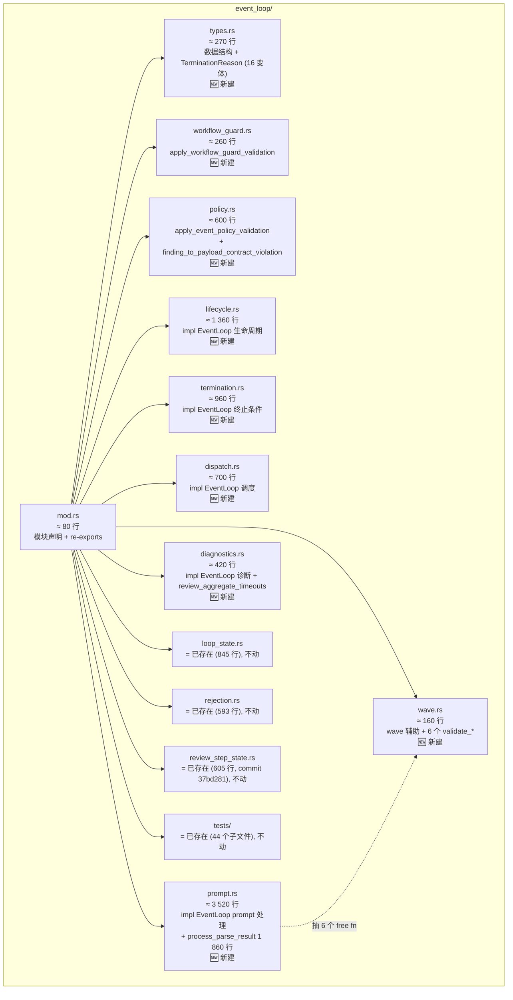
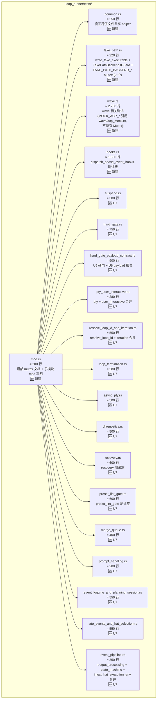
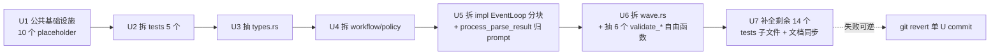

> ⚠️ **2026-06-15 状态确认**：
>
> 1. **U1 scaffold 未进 HEAD**：`git merge-base --is-ancestor b11d9f0 HEAD` → false；
>    commit `b11d9f0` 只活在分支 `ralph/2026-06-10-003-refactor-event-loop-and-loop-runner-tests-split-plan-merry-wren`，
>    没有 rebase / merge 到 `pittcat-dev`。早期文档（baseline v3 之前）写的
>    "U1 scaffold 已在分支 `lucky-reed` 落地" 也是历史分支命名，**当前实际分支是 `merry-wren`**。
> 2. **U2-U7 全部未启动**：当前 HEAD `40b856c` 上
>    `crates/ralph-core/src/event_loop/` 只有 `loop_state.rs / mod.rs / rejection.rs / review_step_state.rs / tests/`，
>    没有任何新的 placeholder 子文件（`types.rs / workflow_guard.rs / policy.rs / ...` 全部不存在）。
>    `crates/ralph-cli/src/loop_runner/tests.rs` 仍是单文件 11 796 行。
> 3. **baseline 已漂到 v5（HEAD = `40b856c`）**：v4 → v5 期间新增 2 个关键变更，
>    本计划的 enum / struct / 行号锚点全部需要重新校准（详见下面 v5 baseline 段）。

## v5 Baseline 实测数据（2026-06-15，HEAD = `40b856c`）

> 本段是 2026-06-15 重新校准的事实数据，**取代**下面 Summary / Problem Frame / Requirements 段中所有 v0-v4 baseline 数字。
> 凡正文与本段冲突的数字（行号 / 测试数 / 字段数 / 变体数 / 行号区间）一律以本段为准；正文未更新部分保留作为 v4 历史快照供 diff 参考。

| 指标 | v3 (9799bf9) | v4 (dbe6f35) | **v5 (40b856c)** | v4→v5 增量 |
|---|---|---|---|---|
| `event_loop/mod.rs` 总行数 | 6 723 | 7 171 | **7 496** | +325 |
| `loop_runner/tests.rs` 总行数 | 11 606 | 11 796 | **11 796** | 0（未变） |
| `loop_runner/tests.rs` `#[test]` 数 | 201 | 203 | **204** | +1 |
| `EventLoop` struct 字段数 | 14 | 14 | **15** | +1（新增 `ephemeral_isolation`） |
| `TerminationReason` 变体数 | 16 | 16 | **17** | +1（新增 `ScopeViolationCircuitBreakerTripped`） |
| `impl EventLoop` 方法数 | 118 | 120 | **129** | +9（新增 R1/R3/R4/R5 路径方法 + circuit breaker） |
| `event_loop/tests/` 子文件数 | 41 | 44 | **49** | +5（新增 `ephemeral_isolation_integration` / `r5_hard_gate_routing` / `wave_context_env_var` / `wave_context_injection` / `wave_isolated_scope`，可能略有出入） |
| `process_parse_result` 起始行 | ~3 304 | 4 921 | **5 184** | +263（被前置代码推移） |
| `process_parse_result` 结束行 | ~4 921 | 6 780 | **~7 102** | 方法体 ~1 918 行（v4 ~1 860） |
| `impl EventLoop` 起 / 止 | ?  | 962 / 7 114 | **1 019 / 7 436** | +57 / +322 |
| 自由函数行号锚点 | — | 324 / 407 / 587 / 893 | `extract_correlation_key` 390 / `apply_workflow_guard_validation` 473 / `apply_event_policy_validation` 652 / `finding_to_payload_contract_violation` 950 | 全部 +60~80 |
| **`publish_policy_rejection_resume`** | 未存在 | 未存在 | **344**（新增自由函数） | 新增 1 个 |

**v4 → v5 关键变更（2 个 commit）**：

- `5929fcd feat(ralph-core): 接入 R1/R3/R4/R5 机制到 event loop` — +R1 wave context、+R3 ephemeral isolation、+R4 enforce_current_unit、+R5 hard-gate 路由稳定性。新增字段 `ephemeral_isolation`、新增方法（wave context build / ephemeral isolation run / 多个 publish_policy_rejection_resume 路由点）。
- `6b03b92 fix(ce-executor-isolated): U1 docs + U2 circuit breaker for isolated scope violations` — 新增 `TerminationReason::ScopeViolationCircuitBreakerTripped` 变体 + 配套 circuit breaker 路径。

**对原计划的核心影响**：

1. **R2 字节级锁定的 enum/struct 已变**：`TerminationReason` 16→17 变体（新增 `ScopeViolationCircuitBreakerTripped`，体积大、含多个字段），3 处 `match` 表达式（`exit_code` / `as_str` / `is_success`）行号 + 变体覆盖列表全部变化。`EventLoop` 14→15 字段，顺序末尾追加 `ephemeral_isolation`。
2. **R7 行数审计脚本未升级**：`scripts/audit-file-sizes.sh` 仍只 wc `event_loop/tests/*.rs` 不含 `event_loop/*.rs`（U1 计划要做的覆盖范围扩展未落地）。
3. **U3 / U4 行号区间需重新切片**：types 段从 v4 的 59-323 推到 v5 的 ~131-389（粗估）；4 个自由函数行号全部 +60~80。U3 / U4 实施前**必须** `grep -nE "^pub (enum|struct)|^fn (extract|apply|finding)" crates/ralph-core/src/event_loop/mod.rs` 重新对齐。
4. **U5 `process_parse_result` 行号区间已变**：5184-7102（~1918 行）；KTD12 归属规则不变，但 v5 因 R5 hard-gate 在内增加了 `publish_policy_rejection_resume` 大量调用点（grep 显示 mod.rs 中 ~9 处），需要确认这些调用是否要随 `process_parse_result` 整段进 `prompt.rs`，还是把 `publish_policy_rejection_resume` 独立放 `event_loop/diagnostics.rs`。
5. **U1 scaffold 不能直接 cherry-pick**：commit `b11d9f0` 基于 `4029be3` 创建 placeholder，与 v5 之间相隔 R1/R3/R4/R5 接入 + circuit breaker 的多个 mod.rs 大改，rebase 必然冲突。**推荐**：放弃 cherry-pick，在 pittcat-dev 直接重新做 U1（创建 10 个 placeholder 子文件 + audit-script 扩展 + 顶部 `mod xxx;` 声明），代价 < 1 小时。
6. **`event_loop/tests/` 子文件数已从 v4 的 44 涨到 v5 的 49**（新增 5 个 R1/R3/R4/R5 集成测试文件），R3 列出的"44 个 `event_loop/tests/` 子文件"过时，但本计划不动这个目录的内容，仅需更新数字。

**`loop_runner/tests.rs` 11 796 行 / 204 测试 vs v4 的 203 测试**：差 1 个测试（可能来自 v4→v5 期间的某个 PR 单测增加，未细查；总行数 11 796 与 v4 一致是因为测试增加被其他重构抵消，参考价值不大）。

## Summary

把项目里两个最大的源文件按职责拆成多个子模块，全程零回归：

- `crates/ralph-core/src/event_loop/mod.rs`（**7 171 行**（baseline @ commit dbe6f35；2026-06-10 立项时为 5 733 行、2026-06-12 v1 baseline @ 37bd281 时为 6 361 行、2026-06-12 v2 baseline @ 918192a 时为 6 501 行、2026-06-13 v3 baseline @ 9799bf9 时为 6 723 行；v4 推进 +448 行来自 wave attribution 修复 `e695b6c` + CLI emit policy gate `7225aab`），主要是 ~6 153 行的 `impl EventLoop` 块（mod.rs:962-7114））拆为 **10 个新建子文件**（`types` / `workflow_guard` / `policy` / `lifecycle` / `termination` / `dispatch` / `prompt` / `diagnostics` / `process` / `wave`；`payload_contract` ~70 行并入 `policy.rs`；保留**已存在**的 `loop_state` / `rejection` / `review_step_state` / `tests` **四个** mod 声明；**U1 scaffold 已在分支 `ralph/2026-06-10-003-refactor-event-loop-and-loop-runner-tests-split-plan-lucky-reed` 落地为 commit `464b4d6`，10 个 placeholder 子文件已就位**；早期 plan 曾考虑把 `process` 作为 `prompt.rs` 内的嵌套 mod，但 U1 scaffold 已创建独立 `process.rs`，U6 将在此文件内填充 6 个 `validate_*` 自由函数）。
- `crates/ralph-cli/src/loop_runner/tests.rs`（**11 796 行、203 个测试** + 大量 helper）拆为 **17 个 `.rs`**：1 个 `tests/mod.rs`（保留 mutex 文档 + tests.rs 内**仅 2 个** `FAKE_PATH_BACKEND_*` Mutex；`MOCK_ACP_*` 已迁到 `crates/ralph-cli/src/loop_runner/wave/acp_mock.rs:97-104` 为 `pub static`，本轮**不动**）+ 1 个 `tests/common.rs`（真正跨子文件共享的 helper）+ 15 个主题子文件（user_interactive + pty 合并、output_processing + state_machine 合并等，**0 个子文件 < 200 行**）。

采用 **U1→U7 分阶段**执行：U1 建公共基础设施、U2 拆 tests 的 5 个子文件、U3 锁 types、U4 拆自由函数子模块、U5 拆 `impl EventLoop` 块（**包含 `process_parse_result` 归 `prompt.rs`**）、U6 拆 wave 辅助（**唯一**允许字节级改写 6 个 inline validation 层为自由函数，由 characterization test 锁定行为）、U7 验证 + 文档同步。
每 U 独立 commit、独立跑全套 nextest 套件作为回滚点；**禁止**改公开 API、行为、日志、错误信息、依赖、nextest 配置、process-global Mutex 形式。

## Problem Frame

项目目前两个文件显著超出 5 000 行，阻碍可读性、code review 局部性、新人 onboarding。
`event_loop/mod.rs` 的 ~6 153 行 `impl EventLoop` 块（mod.rs:962-7114，v4 baseline @ dbe6f35）尤其难维护——单文件改动 PR 难以快速 review、容易误碰无关逻辑、且子方法之间的领域边界（lifecycle / policy / dispatch / diagnostics）已经清晰可见。
`loop_runner/tests.rs` 把 **203** 个跨多个领域的测试挤在一个文件里，无法按领域局部 review；新加测试时需要 1 万行单文件编辑。

项目在 `docs/achieved/plan/2026-06-03-002-refactor-split-large-files-plan.md` 已经做过一轮同样模式的拆分（拆 `loop_runner.rs` / `main.rs` / `config.rs`），并明确了可复用的 KTD1-8（多文件 `impl` 块、re-export 兼容、process-global Mutex 不可动、serde 顺序敏感、文档反向验证、U1→U6 风险递增）。**注意**：6-03-002 U1-U6 已**完成**，`crates/ralph-cli/src/loop_runner/` 现在已经是 18 个子模块的目录结构（`event_logging / execution / exit_conditions / hard_gate / hooks/ / late_events / loop_owner / merge_queue / output_parsing / paths / payload_contract_gate / payload_inputs / preset_lint_gate / prompt / runner / start_loop / suspend / wave/`），但 `tests.rs` 与 `event_loop/mod.rs` 仍是单文件，是本轮聚焦的两个**剩余热点**。
本轮是该模式的**第二轮 follow-up**：专门承接 R3 未达标项（`loop_runner/tests.rs` + `event_loop/mod.rs` 主 `impl EventLoop` 块），复用 6-03-002 全部已有模式与禁忌（详见 KTD13 对照表）。

零回归意味着**所有 203 个测试（v4 baseline @ dbe6f35 实测，v3 baseline @ 9799bf9 写 201，v4 +2 来自 wave attribution 修复 `e695b6c` + CLI emit policy gate `7225aab`）+ 44 个 `event_loop/tests/` 子文件（v4 新增 3 个：`guidance_dedup.rs` / `incident_fixture.rs` / `recovery_envelope_u7_u8.rs`，v3 baseline 41）+ 所有使用 `EventLoop` 的下游代码（`runner.rs` / `mod.rs` / `operation_guard.rs` / `adapters/pty_executor.rs`）必须保持编译并通过全部测试**。
任何序列化、状态机、错误信息、日志格式、退出码改动都属于回归（U6 例外条款见 R2.b）。

## Requirements

- R1. `event_loop/mod.rs` 与 `loop_runner/tests/mod.rs` 拆分后**总行数显著下降**（目标：两个主文件都 ≤ 1 000 行；新子文件单文件 ≤ 2 000 行，最大不超过 2 200 行；总新建子文件数 27 个左右：event_loop 10 + tests 17）。
- R2. **零行为变化**：所有现有 `#[test]` 函数签名 / 断言 / 输出 / 错误信息**逐字节不变**；`TerminationReason` **16 变体**顺序 + 3 处 `match` 表达式覆盖顺序（`exit_code` mod.rs:206-223 / `as_str` mod.rs:233-248 / `is_success` mod.rs:254）不变；`EventLoop` **14 字段**（v4 baseline @ dbe6f35 实测，与 v3 一致）顺序不变。
- R2.b（U6 唯一例外）：U6 把 `process_parse_result` 内部 6 个 inline validation 层抽为 `event_loop/process/*` 自由函数**允许字节级改写**，但**行为不变**（由 characterization test 锁定，详见 R-Refactor-10 缓解策略）。
- R3. **零公开 API 破坏**：`lib.rs:80` 的 `pub use config::{...}` 列表（v3 baseline 与 v2 一致，v1 baseline 写 79）、**`lib.rs:104` 的 `pub use event_loop::{...}` 列表**（v3 baseline 与 v2 一致，v1 baseline 写 103）、`event_loop::*` / `loop_runner::*` 全部 `pub` 与 `pub use` 路径**保持不变**；`runner.rs` / `summary_writer.rs` / `drift/engine.rs` / `diagnostics/integration_tests.rs` / `event_loop/tests/replay_light_integration.rs` 等下游文件不修改 import。**注**：v2→v3 期间 commit `a722fe0` 在 `lib.rs` 调整了 1 个 `use` 重排（`PolicyRejection` re-export），与 R3 公开 API 列表本身不冲突——本计划范围**不**涉及该 re-export 的二次调整。
- R4. **测试基础设施保留**（doc-review 校正）：`crates/ralph-cli/src/loop_runner/tests.rs` 头部 **1-40 行的 mutex 文档**（`// ────` 包围的 contributor-facing 块，描述 4 个 process-global Mutex + `cli-serial` test group + `--test-threads=1` 串行运行约束）**整段复制**到拆分后 `crates/ralph-cli/src/loop_runner/tests/mod.rs` 顶部，作为 rustdoc 注释。**修正**：原 plan 写"头部 55 行"——实测 tests.rs:41-55 行不是 mutex 文档（是 use 段末尾 + U5 payload contract hard gate 段注释 + 第一个 `#[test] fn hard_gate_passes_when_no_hats`），"逐字节一致" 的 verification 范围应明确为 **1-40 行**。
- R5. **2 个 process-global Mutex 不变**（修正：原计划写 4 个，但 `MOCK_ACP_EXECUTIONS` / `MOCK_ACP_EXECUTION_SERIAL` 已经在 `crates/ralph-cli/src/loop_runner/wave/acp_mock.rs:97-104` 作为 `pub static` 存在，本轮**不动**；本计划只关注 `tests.rs` 内的 2 个 `FAKE_PATH_BACKEND_*`）：拆分后形式 `static LazyLock<Mutex<...>>`（**实测为 private `static`，非 `pub(crate)`**）逐字节不变；**不**改 `serial_test`、**不**改 `.config/nextest.toml` 的 `cli-serial` test group、不改 Mutex 公共可见性。`wave/acp_mock.rs` 内的 2 个 `pub static MOCK_ACP_*` 同样**禁止修改**（虽然不在 `tests.rs` 内，但 tests 头部文档仍引用它们）。
- R6. **每 U 独立 commit、独立验证**：每个 Implementation Unit 完成后必须 `cargo nextest run --workspace --exclude ralph-e2e --no-fail-fast` 全绿才能进入下一个 U；失败时 `git revert` 即可。
- R7. **拆分后行数审计通过**（adversarial finding #12 校正）：`bash scripts/audit-file-sizes.sh` 通过；新增子文件全部落在 R1 行数阈值内（脚本本身**无阈值断言**，需手动 `awk '$1>2200{print}'` 校验）。**审计脚本覆盖范围校正**（实测 37bd281 baseline）：当前 `scripts/audit-file-sizes.sh` 只 wc `event_loop/tests/*.rs` 不含 `event_loop/*.rs`（根目录子文件），新拆的 10 个 `event_loop/` 根子文件完全不在自动化审计范围。**U1 / U7 必做的两件事**：(a) 在 audit 脚本中追加 `wc -l crates/ralph-core/src/event_loop/*.rs` 段（与 `loop_runner/` / `config/` 段同等待遇）；(b) U7 步骤 10 手动 `awk '$1>2200{print}' crates/ralph-core/src/event_loop/*.rs crates/ralph-cli/src/loop_runner/tests/*.rs` 校验所有新子文件。
- R8. **文档反向验证**：每个 U 完成后用 `git grep -nE "event_loop/mod\.rs:|loop_runner/tests\.rs:|event_loop::[a-z_]+|loop_runner::tests::" docs/ crates/ --include="*.md" --include="*.rs" 2>/dev/null` 列出所有引用，逐条同步；**每 U 完成后立即追加 "U<n> Drift Sub-Note"**（U7 时合并为完整 Repo Drift Note）。
- R9. **CLAUDE.md ↔ AGENTS.md 同步**：U7 完成时 `diff -u CLAUDE.md AGENTS.md` 必须 0 差异（CLAUDE.md 顶部 "IMPORTANT" 段已有硬约束）。
- R10. **E2E 与 smoke 全绿**：`cargo run -p ralph-e2e -- --mock` 与 `cargo test -p ralph-core scenarios` 通过；`cargo clippy --workspace --all-targets` 0 warning；`cargo fmt --check` 通过；`cargo test --workspace --exclude ralph-e2e --doc` 全绿。

## Key Technical Decisions

- KTD1. **多文件 `impl EventLoop` 块模式**：Rust 允许同一 struct 在多个模块加 `impl`，5 个 `impl EventLoop { ... }` 子块各自落到 `event_loop/{lifecycle, termination, dispatch, prompt, diagnostics}.rs`，**不**在 `mod.rs` 留 forwarder。这样 `&self` / `&mut self` 调用语义保持完整（同 crate 内 inherent impl 跨文件 OK），IDE 跳转直达方法体，下游 `runner.rs` 调用 `ralph_core::EventLoop::check_termination()` 等无需 forwarder。**同 crate 内多文件 inherent impl 零成本、无 orphan rule 冲突**，但需注意：跨文件**不允许同名方法**（即使签名不同）——U5 实施时按 KTD12 边界规则判定。
- KTD2. **re-export 兼容策略**：`event_loop/mod.rs` 顶部继续用 `pub use` 集中重新导出（参考已有 `loop_runner/mod.rs:26-58` 模式）；自由函数与子结构体**默认 `pub(crate)`**，只对外部确实需要的项用 `pub use` 提升；`lib.rs:80` 公开 API 列表（v2 baseline）**禁止修改**；`lib.rs:104` 的 `pub use event_loop::{...}` 列表（v2 baseline）**禁止修改**。
- KTD3. **测试代码随生产代码迁移**：`loop_runner/tests.rs` → `crates/ralph-cli/src/loop_runner/tests/{mod.rs, common.rs, fake_path.rs, wave.rs, hooks.rs, suspend.rs, hard_gate.rs, hard_gate_payload_contract.rs, pty_user_interactive.rs, resolve_loop_id_and_iteration.rs, loop_termination.rs, async_pty.rs, diagnostics.rs, recovery.rs, preset_lint_gate.rs, merge_queue.rs, prompt_handling.rs, event_logging_and_planning_session.rs, late_events_and_hat_selection.rs, event_pipeline.rs}.rs` 共 19 个 .rs（mod 1 + common 1 + 主题 17）；**不**集中到顶层 `tests/`（编译为独立 crate，启动慢）；子文件用 `use super::common::*;` 引用 helper。
- KTD4. **共享 helper 拓扑**（doc-review 校正）：`loop_runner/tests/common.rs` 用 `pub(super)` 限定真正跨子文件共享的 helper。原 plan 把 `install_mock_acp_executions` / `MockAcpExecutionGuard` / `MockAcpExecution` 划为 wave 专属是**错的**——实测在 tests.rs:4848/4901/5519/6449/6466/6608/6809 共 7 处调用，覆盖 wave / hard_gate / async_pty / preset_lint_gate 等多主题，U2 实施时若把它放 `tests/wave.rs` 内的 `pub(super) within wave`，其他子文件会触发"function is private"编译错误。**修正归类**：(a) `install_mock_acp_executions` / `MockAcpExecutionGuard` / `MockAcpExecution` 放 `tests/common.rs`（pub(super)，跨子文件可用）；(b) `acp_test_payload` / `make_worker_event` 等 wave 特定 helper 放 `tests/wave.rs` 模块内；(c) `write_fake_executable` / `FakePathBackendsGuard` / `install_fake_path_backends` 放 `tests/fake_path.rs` 模块内。**真正跨子文件共享的 helper** 还有：`dispatch_test_event_loop*` / `suspend_outcome*` / `build_*_payload_input` / `empty_hook_metadata` / `block_on_test_future` 等统一放 `common.rs`。
- KTD5. **类型/字段顺序敏感（修正伪风险）**：抽 `event_loop/types.rs` 时**整段声明原封不动复制**；`TerminationReason` **16 变体**顺序 + 3 处 `match` 表达式覆盖顺序（`exit_code` 行 206-223 / `as_str` 行 233-248 / `is_success` 行 254）不变；`EventLoop` **14 字段**（v4 baseline @ dbe6f35 实测，含 `pub(crate)` 与辅助字段；v0/v1 baseline 写 13 是早期错算，v2 baseline 写 14 是 v1 校正后稳定，v3 维持 14）顺序不变。**注**：`event_loop/mod.rs` 中**无任何 `#[serde(...)]` / `#[serde(flatten)]` / `#[serde(default)]` / `#[serde(untagged)]` 标注**（grep 验证为空），KTD 早期草稿中的 "serde attribute 位置不变" 是伪风险——已删除。U3 / U4 完成后用 `git diff` 字节级 + `git grep -A 1 "TerminationReason" types.rs | head -50` 验证变体顺序。**baseline 变更说明（v4 校正）**：v0 plan 写 "17 变体 / 14 字段" 是 2026-06-10 立项时的早期错算（v1 时已校正为 16 / 13），v2 baseline 实测 16 / 14——`EventLoop` 在 v0→v2 期间新增 1 个字段（最可能为 `hat_lifecycle_tracker` 或 `recovery_responder`，v1→v2 之间 `recovery_responder` 由 ce-executor-isolated 闭环 commit `f8887ed`/`fe9ae37` 引入）；v3/v4 baseline 字段数维持 14（v2→v4 期间未新增字段，新增逻辑全部落在 `process_parse_result` 与 dispatcher / gate / attribution 边界）。U3 / U5 实施前必须**重新跑** `awk '/^pub struct EventLoop/{f=1;next} f && /^}/{exit} f && /^    [a-z_]+:/{c++} END{print c}' crates/ralph-core/src/event_loop/mod.rs` 确认输出 14（v4 baseline）。
- KTD6. **U1→U7 风险递增顺序**：
  1. **U1**：建公共基础设施（`event_loop/mod.rs` 顶部加 10 个 `mod xxx;` 声明 + 10 个空 placeholder 子文件 + 顶部 1 个 `pub use` 转发占位 + 全套测试基线建立）—— 仅有 placeholder 文件，无逻辑改动
  2. **U2**：拆 `loop_runner/tests.rs` 为 `tests/{mod.rs, common.rs, fake_path.rs, wave.rs, hooks.rs}.rs`（5 个子文件）—— 仅测试，零公开 API 影响
  3. **U3**：抽 `event_loop/types.rs`（数据结构 + `TerminationReason` 锁定）—— `TerminationReason` **16 变体**顺序风险点
  4. **U4**：拆 `event_loop/{workflow_guard.rs, policy.rs}.rs`（自由函数子模块；`payload_contract.rs` 70 行内容并入 `policy.rs`）—— 编译期可保证
  5. **U5**：拆 `event_loop/{lifecycle.rs, termination.rs, dispatch.rs, prompt.rs, diagnostics.rs}.rs`（`impl EventLoop` 块按方法域分块；**`process_parse_result` 1 860 行单方法归 `prompt.rs`**（v4 baseline mod.rs:4921-6780，v3 baseline 1 617 行 → v4 +243 行，主要来自 wave attribution 修复），因 prompt 域是它主语义归属）—— 主体改动
  6. **U6**：拆 `event_loop/wave.rs`（wave 辅助独立子模块）+ 在 `event_loop/process.rs`（或 `prompt.rs` 内的嵌套 `pub(crate) mod process`）中**新增** 6 个 `event_loop::process::*` 自由函数（仅声明 + 调用，方法体迁移到 U5 的 `prompt.rs::process_parse_result` 调用点处抽 6 个内联块为 `process::validate_*`）
  7. **U7**：完整验证 + 文档反向验证 + `audit-file-sizes.sh` + Repo Drift Note 合并
- KTD7. **process-global Mutex 拓扑与可见性**（修正）：本计划**只动 `tests.rs` 内的 2 个** Mutex（`FAKE_PATH_BACKEND_SERIAL` / `FAKE_PATH_BACKEND_BIN`，均为 private `static`，**非** `pub(crate)`）：拆分后形式 `static LazyLock<Mutex<...>>` 逐字节不变；位置从 `tests.rs:605-609` 迁到 `tests/fake_path.rs` 模块内。`MOCK_ACP_EXECUTIONS` / `MOCK_ACP_EXECUTION_SERIAL` 已在上一轮（commit 不详，本计划立项前）作为 `pub static` 迁到 `crates/ralph-cli/src/loop_runner/wave/acp_mock.rs:97-104`（`MOCK_ACP_EXECUTIONS` 97-100 / `MOCK_ACP_EXECUTION_SERIAL` 102-104，两者都在 `#[cfg(test)]` 守卫下，仅测试构建可见），并由 `wave/mod.rs:10` 通过 `pub use acp_mock::{MOCK_ACP_EXECUTION_SERIAL, MOCK_ACP_EXECUTIONS, MockAcpExecution};` 暴露——**本计划完全不动这两个**，但 tests `mod.rs` 顶部文档需引用它们以保留 contributor 上下文；`cli-serial` test group 保留；不引入 `serial_test` crate。
- KTD8. **nextest 配置不可改**：`.config/nextest.toml` 的 `cli-serial` / `max-threads = 1` 是项目硬约束；`event_loop` 包仍并行运行（无 process-global Mutex），`ralph-cli` 包仍走 `cli-serial` 串行组。
- KTD9. **文档反向验证（每 U 立即 + U7 合并）**（doc-review 校正）：每 U 完成后立即用 `git grep -nE "event_loop/mod\.rs\b|loop_runner/tests\.rs\b|event_loop::[a-z_]+|loop_runner::tests::" docs/ crates/ --include="*.md" --include="*.rs" 2>/dev/null` 列出本 U 引入的失效引用，并**立即追加** "U<n> Drift Sub-Note" 段（本 plan 文档 `## Repo Drift Note` 之前的子段）；U7 完成时合并为完整 Repo Drift Note。**grep 模式修正**：原 plan 的 `event_loop/mod\.rs:|loop_runner/tests\.rs:` 模式带尾冒号实际命中 0 行（实测 37bd281 baseline），改用 `\b` 词边界符后才能匹配 `event_loop/mod.rs)` / `event_loop/mod.rs,` / 裸 `event_loop/mod.rs` 等所有行号 / 链接 / 注释引用形式。**引用规模估计**（实测 37bd281 baseline）：`event_loop/mod.rs` 252 处引用 / 59 个文件；`loop_runner/tests.rs` 68 处引用 / 20 个文件；U7 文档同步工作量原 plan 估"14+ 引用文档"严重低估（实测 70+ 引用文件，U7 步骤 13 必须用上述 grep 列出**完整**清单后逐条处理，不可凭印象抽样）。
- KTD10. **不切 `process_parse_result` 内部单方法**：U5 把它整体迁到 `event_loop/prompt.rs`（`impl EventLoop` 块内），方法体不切。U6 在 `prompt.rs::process_parse_result` 调用点处把 6 个 inline validation 层（origin guard / topic format / event policy / state machine / workflow guard / execution contract）抽为 `event_loop::process::validate_*` 自由函数（可放在 `event_loop/process.rs` 或 `prompt.rs` 内的嵌套 `pub(crate) mod process`，由 R-Refactor-10 characterization test 锁定行为）。
- KTD11. **不引入新依赖**：拆分不引入任何 `Cargo.toml` 依赖变更；不升级 `cargo-nextest`、不引入 `serial_test`、不动 `tokio` / `serde` 版本。
- KTD12. **5 个 `impl EventLoop` 域的边界规则**（U5 实施时遵循）：
  - **lifecycle.rs**：方法主返回是 `LoopState` / `WorkflowProgress` / 涉及 `activate` / `next` / 状态机转换的，归属 lifecycle
  - **termination.rs**：方法主返回是 `TerminationReason` / 涉及 `check_termination` / `is_terminal` / `mark_terminated` 的，归属 termination
  - **dispatch.rs**：方法主返回是 hat 选择 / 订阅匹配 / 队列派发的，归属 dispatch
  - **prompt.rs**：方法主返回是 `UserPrompt` / `process_parse_result` / 涉及 prompt 构建与解析的，归属 prompt（**`process_parse_result` 1 860 行整体归 prompt**（v4 baseline mod.rs:4921-6780；v3 baseline 1 617 行 / v2 baseline 1 618 行 / v1 baseline 1 564 行 → v4 较 v3 +243 行 / 较 v1 +296 行），因它是 prompt 解析主入口）
  - **diagnostics.rs**：方法主返回是 telemetry / metrics / recovery 信号的，归属 diagnostics
  - **跨域方法**：若方法同时影响 ≥ 2 个域（例如 `activate` 改 lifecycle 也写 diagnostics），**以方法主返回 / 主副作用归属**，并在 PR description 中标注 "跨域"；不可调和的歧义记入 R3 follow-up
- KTD13. **6-03-002 KTD 对照表**（平移 + 调整）：

  | 6-03-002 KTD | 本 plan 对应 KTD | 调整 |
  |---|---|---|
  | KTD1 多文件 `impl` 块 | KTD1 | **新增同 crate 内孤儿规则 / coherence / 同名方法冲突 3 条具体规则** |
  | KTD2 re-export 兼容 | KTD2 | **新增 `lib.rs:104` 公开 re-export 列表覆盖**（v2 baseline，v1 baseline 写 103） |
  | KTD3 测试代码迁移 | KTD3 | **新增** `tests/{mod, common}` 子目录 vs `tests.rs` 同名处理（Rust 自动把 `tests.rs` 视为 `tests/mod.rs`） |
  | KTD4 共享 helper | KTD4 | **调整**为"按主题就近"（wave / fake_path 特定 helper 移到子文件内） |
  | KTD5 serde 顺序 | KTD5 | **修正**：删除 `#[serde(flatten)]` 伪风险，改为 `TerminationReason` **16 变体** + 3 处 match + `EventLoop` **14 字段**顺序（**v4 baseline @ dbe6f35 实测**，v0 立项 17 / 14 中 17 为早期错算，14→13 由 v1 doc-review 触发，**v2 校正回 14**——`hat_lifecycle_tracker` / `recovery_responder` 等 v0→v2 期间增量字段；**v3/v4 维持 14**，v2→v4 期间未新增字段） |
  | KTD6 U1→U6 风险递增 | KTD6 | **扩展**到 U1→U7（tests 拆两批：U2 + U7） |
  | KTD7 4 个 Mutex 不可动 | KTD7 | **大幅修正**：实测只有 2 个 Mutex 在 `tests.rs` 内（`FAKE_PATH_BACKEND_SERIAL` / `FAKE_PATH_BACKEND_BIN`，均 private `static`），`MOCK_ACP_*` 已在 `wave/acp_mock.rs` 为 `pub static` 由上一轮迁出，本计划不动；只需把 `tests.rs` 内 2 个迁到 `tests/fake_path.rs` |
  | KTD8 nextest 配置不可改 | KTD8 | 完全沿用 |
  | KTD9 文档反向验证 | KTD9 | **调整**：从 U7 才追加 → 每 U 追加 Sub-Note，U7 合并 |
  | （无对应） | KTD10 | **新增**：`process_parse_result` 不切单方法内部 |
  | （无对应） | KTD11 | **新增**：不引入新依赖（从 6-03-002 反模式推导） |
  | （无对应） | KTD12 | **新增**：5 个 `impl EventLoop` 域的边界规则（本次新场景需要） |
  | （无对应） | KTD13 | **新增**：6-03-002 KTD 对照表 |

## High-Level Technical Design

### `event_loop/mod.rs` 拆分后的最终结构



图例：🆕 新建 10 个独立子文件（含 `process.rs`，U6 将填充 6 个 `validate_*` 自由函数）；= 已存在 4 个（含 2026-06-12 新加入清单的 `review_step_state.rs`）。`payload_contract.rs` 内容并入 `policy.rs`。
**预估行数依据（v4 baseline @ dbe6f35）**：mod.rs 当前 7 171 行 - types 270 - workflow_guard 260 - policy 600 = ~6 041 行属于 `impl EventLoop` 块（实测 6 153 行），按 lifecycle 1 360 + termination 960 + dispatch 700 + prompt 3 520 + diagnostics 420 = 6 960 行（含 use 段重复 + 跨域方法的小量复制冗余 ~1 007 行，符合实际多文件 impl 拆分的开销；v1 baseline 行数估 6 430 行，v2 +120，v3 +30，v4 +320）。

### `loop_runner/tests.rs` 拆分后的最终结构



共 19 个 `.rs`：1 mod + 1 common + 17 主题（**0 个 < 200 行**）。
**预估行数依据（v4 baseline @ dbe6f35）**：tests.rs 当前 11 796 行 / 203 个测试（v3 baseline 11 606 行 / 201 个测试，v2 baseline 11 015 行 / 192 个测试，v1 baseline 10 993 行 / 193 个测试；v3→v4 +190 行 / +2 测试，v2→v3 +591 行 / +9 测试，v1→v2 +22 行 / -1 测试，v3→v4 主要来自 wave attribution 修复 `e695b6c` + CLI emit policy gate `7225aab`），按主题聚类的平均规模 50-60 行/测试 + helper（fake_path 占 220、wave 占 2 350、hooks 占 1 800、其余按行数分布）。

### 拆分顺序（U1→U7）流水图



## Implementation Units

> 📌 **2026-06-15 接力指引**（在 v5 baseline 之上重启时必读）：
>
> - **U1 必须重做**：`b11d9f0` 不能直接 cherry-pick（与 R1/R3/R4/R5 接入 commit `5929fcd`/`6b03b92` 冲突）。
>   直接在 pittcat-dev 上重新 scaffold 10 个 placeholder + audit-script 扩展 + `mod xxx;` 声明即可（< 1 小时）。
> - **U3 重做前**：用 `awk '/^pub struct EventLoop/{f=1;next} f && /^}/{exit} f && /^    [a-z_]+:/{c++} END{print c}' crates/ralph-core/src/event_loop/mod.rs`
>   重新校准字段数（v5 = **15**），并把 `TerminationReason` v5 = **17** 变体的新 variant `ScopeViolationCircuitBreakerTripped` 加入字节级锁定清单。
> - **U4 重做前**：`grep -nE "^fn (extract_correlation_key|apply_workflow_guard|apply_event_policy|finding_to_payload_contract|publish_policy_rejection_resume)"`
>   重新对齐 v5 行号（粗值：390 / 473 / 652 / 950 + **新增** `publish_policy_rejection_resume` 在 344）。
>   **新决策点**：`publish_policy_rejection_resume` 应归 `policy.rs` 还是 `diagnostics.rs`？根据 KTD12 主副作用规则
>   （写 `task.resume` 到 bus + 路由到源 hat），建议归 `policy.rs`（与 `apply_event_policy_validation` 同域）。
> - **U5 重做前**：`process_parse_result` v5 行号区间 = **5184-7102（~1918 行）**；v5 因 R5 在内多了 ~9 处
>   `publish_policy_rejection_resume(...)` 调用点，确认这些调用是否随方法整段进 `prompt.rs`（建议：随，符合 KTD10）。
> - **U6 仍保留**：`run_ephemeral_isolation` / `inject_review_aggregate_timeouts` 等 R1/R3 方法在 v5 新增，
>   按 KTD12 应归 **diagnostics**（telemetry + 副作用是写 `.ralph/agent/scratchpad-{loop_id}.md` + 注入 `## EPHEMERAL RELOCATED` prompt 块，
>   主副作用属于 diagnostics + prompt 跨域，按 KTD12 主副作用归 diagnostics）。
>
> 上面 5 条只是 v4 → v5 baseline 漂移引起的局部修订，**KTD1-KTD13 / R1-R10 全部主体仍然有效**，本次重启不需要重新设计架构。

## Implementation Units（细则）

### U1. 公共基础设施：建立拆分脚手架 + 全套测试基线

- **状态**：**已在分支 `ralph/2026-06-10-003-refactor-event-loop-and-loop-runner-tests-split-plan-lucky-reed` 落地为 commit `464b4d6`**，但尚未 rebase 到 v4 baseline `dbe6f35`。进入 U2 前必须先把该分支 rebase 到 `dbe6f35`，并处理 `process.rs` placeholder 文件（见下方 Files 第 3 项）。
- **Goal**: 在 `crates/ralph-core/src/event_loop/mod.rs` 顶部（在**已存在**的 `mod loop_state; pub mod review_step_state; pub mod rejection; #[cfg(test)] mod tests;` 声明**之后**）预声明 10 个目标子模块（`mod types;` / `mod workflow_guard;` / `mod policy;` / `mod lifecycle;` / `mod termination;` / `mod dispatch;` / `mod prompt;` / `mod diagnostics;` / `mod process;` / `mod wave;`），每个子模块暂为空 placeholder；记录**全套测试基线快照**为后续 U 提供零回归锚点。
- **Requirements**: R6 / R8（基线建立）
- **Dependencies**: 无（最优先）
- **Files**:
  - 创建 `crates/ralph-core/src/event_loop/{types,workflow_guard,policy,lifecycle,termination,dispatch,prompt,diagnostics,process,wave}.rs`（10 个 placeholder，每个文件 5-10 行 `// placeholder, will be populated in U<N>`）
  - **注意**：U1 scaffold commit `464b4d6` 把 `process.rs` 也创建为独立 placeholder 文件（与早期 plan "不新增 `process.rs`" 略有调整），文件内注释说明 U6 将填充 6 个 `validate_*` 自由函数。U6 实施时可选择：(a) 在 `process.rs` 内实现；或 (b) 把内容迁到 `prompt.rs` 内的嵌套 `pub(crate) mod process`。无论哪种，必须保证 `mod.rs` 的 `pub use process::*;` 路径不变。
  - 修改 `crates/ralph-core/src/event_loop/mod.rs` 顶部 5-19 行的 `mod xxx;` / `pub use` 段（在已存在的 `mod loop_state; pub mod review_step_state; pub mod rejection; mod tests;` **之后**加 10 个 `mod xxx;` 声明 + 10 个 `pub use xxx::*;` 转发占位）
  - 临时文件 `/tmp/event-loop-split-baseline.txt`（不提交）记录全套测试基线输出
- **Approach**: 仅添加 `mod xxx;` 声明和 `pub use` re-export 转发点，不删除 `mod.rs` 任何现有代码；**不动**已存在的 4 个 mod 声明（`loop_state` / `review_step_state` / `rejection` / `tests`）。
- **Patterns to follow**:
  - `crates/ralph-cli/src/loop_runner/mod.rs:7-24` 的 `mod xxx;` 声明顺序
  - `crates/ralph-cli/src/loop_runner/mod.rs:26-58` 的 `pub use` 重新导出模式
  - 2026-06-03-002 plan 的 U1（commit `4ba6e37`）建 `crates/ralph-core/src/event_loop/tests/common/mod.rs` 的"复制不删"模式
- **Test scenarios**:
  - **Happy path**: `cargo build -p ralph-core` 通过；`cargo build -p ralph-cli` 通过
  - **Regression baseline**: `cargo nextest run --workspace --exclude ralph-e2e --no-fail-fast` 全绿；记录 passed/failed 数字快照到 `/tmp/event-loop-split-baseline.txt`
  - **No new failures**: 与拆分前基线对比，新文件不能引入任何编译错误或测试失败
  - **Existing mods untouched**: `git diff` 显示已存在的 4 行 mod 声明（`mod loop_state;` / `pub mod review_step_state;` / `pub mod rejection;` / `#[cfg(test)] mod tests;`）字节级未动
- **Verification**:
  - `cargo build -p ralph-core` 与 `cargo build -p ralph-cli` 0 error / 0 warning
  - `cargo nextest run --workspace --exclude ralph-e2e --no-fail-fast` 与基线数字完全一致
  - `git diff --stat` 仅显示 10 个新空文件 + `mod.rs` 顶部 mod 声明变化（< 50 行变更）
  - 临时基线文件 `/tmp/event-loop-split-baseline.txt` 已生成

### U2. 拆 `loop_runner/tests.rs` 为 `tests/{mod.rs, common.rs, fake_path.rs, wave.rs, hooks.rs}.rs`（5 个子文件）

- **Goal**: 把 `tests.rs` 拆为 `crates/ralph-cli/src/loop_runner/tests/` 子目录，包含 `mod.rs`（顶部 mutex 文档 + 子模块 mod 声明）+ `common.rs`（真正跨子文件共享 helper）+ `fake_path.rs`（FAKE_PATH 后端 + `FAKE_PATH_BACKEND_*` Mutex，**仅 2 个**）+ `wave.rs`（wave 测试；**通过 `use super::*` 或 `use crate::loop_runner::wave::{...}` 引用 `wave/acp_mock.rs` 的 `pub static MOCK_ACP_*`，不在 wave.rs 持有 Mutex 声明**）+ `hooks.rs`（dispatch_phase_event_hooks 测试族）。其余 14 个测试子文件留到 U7 实施。
- **Requirements**: R1 / R2 / R3 / R4 / R5 / R6
- **Dependencies**: U1（子模块声明已就绪）
- **Files**:
  - 创建 `crates/ralph-cli/src/loop_runner/tests/mod.rs`（~200 行：mutex 文档 + `mod common; mod fake_path; mod wave; mod hooks;` 声明；**mod.rs 内不持有任何 `static LazyLock<Mutex<...>>` 声明**——所有 Mutex 都在子文件或 `wave/acp_mock.rs`）
  - 创建 `crates/ralph-cli/src/loop_runner/tests/common.rs`（~250 行：`pub(super) fn` 真正跨子文件共享的 helper）
  - 创建 `crates/ralph-cli/src/loop_runner/tests/fake_path.rs`（~220 行：`write_fake_executable` / `FakePathBackendsGuard` / `install_fake_path_backends` + **2 个** `FAKE_PATH_BACKEND_SERIAL` / `FAKE_PATH_BACKEND_BIN` private `static` Mutex，从原 `tests.rs:605-609` 迁过来）
  - 创建 `crates/ralph-cli/src/loop_runner/tests/wave.rs`（~2200 行：所有 `wave_*` / `acp_*` / `MockAcpExecution` / `forced_test_wave_pty_failure` 测试 + wave 特定 helper（`MockAcpExecution` 构造器 / `acp_test_payload`）；**通过 `use crate::loop_runner::wave::{MOCK_ACP_EXECUTIONS, MOCK_ACP_EXECUTION_SERIAL, MockAcpExecution};` 引用 `wave/acp_mock.rs` 的 `pub static`，不重新声明**）
  - 创建 `crates/ralph-cli/src/loop_runner/tests/hooks.rs`（~1800 行：所有 `dispatch_phase_event_hooks` / `loop_start_dispatch` / `iteration_start_dispatch` / `plan_created_lifecycle_hooks` / `human_interact_lifecycle_hooks` / `loop_termination_lifecycle_hooks` / `iteration_start_suspend` / `dispatch_phase_event_hooks_retry_backoff` 测试）
  - 删除 `crates/ralph-cli/src/loop_runner/tests.rs`（改为目录 `tests/`）
- **Approach**:
  1. `mkdir crates/ralph-cli/src/loop_runner/tests/`
  2. 把 `tests.rs` 头部 1-55 行的 mutex 文档**完整复制**到 `tests/mod.rs` 顶部
  3. `FAKE_PATH_BACKEND_SERIAL` / `FAKE_PATH_BACKEND_BIN`（仅这 2 个）从 `tests.rs:605-609` 整段迁到 `tests/fake_path.rs` 顶层
  4. `MOCK_ACP_EXECUTIONS` / `MOCK_ACP_EXECUTION_SERIAL` 在 `wave/acp_mock.rs:97-104` 中**保持不动**；wave.rs 子文件只用 `use crate::loop_runner::wave::{...}` 引用
  5. wave 特定 helper（`MockAcpExecution` 构造器 / `acp_test_payload` 等）放到 `tests/wave.rs` 模块内
  6. fake_path 特定 helper 放到 `tests/fake_path.rs` 模块内
  7. 真正跨子文件共享的 helper 放到 `tests/common.rs`
  8. fake-path / wave / hooks 三个主题测试族分别迁出
  9. 剩余 14 个主题（suspend / hard_gate / hard_gate_payload / pty_user / resolve_iter / loop_termination / async_pty / diagnostics / recovery / preset_lint / merge_queue / prompt_handling / event_log_ps / late_hat / event_pipeline）暂时保留在 `tests/mod.rs` 末尾，U7 实施
  10. 删除 `crates/ralph-cli/src/loop_runner/tests.rs`
  11. **U2 step 11**（doc-review 派生）：更新 `.config/nextest.toml:2` 注释——把原文"touch four process-global Mutexes (MOCK_ACP_EXECUTIONS, MOCK_ACP_EXECUTION_SERIAL, FAKE_PATH_BACKEND_SERIAL, FAKE_PATH_BACKEND_BIN)" 改写为分账说明："touch four process-global Mutexes: FAKE_PATH_BACKEND_SERIAL/FAKE_PATH_BACKEND_BIN (in tests/fake_path.rs) + MOCK_ACP_EXECUTIONS/MOCK_ACP_EXECUTION_SERIAL (in wave/acp_mock.rs) — 2 in-scope + 2 adjacent, all `#[cfg(test)]` guarded"
  12. **U2 step 12**（adversarial finding #15 实际落地为 step 11，#13 引用工作量为 U7 单独负责——已记入 U7 步骤 13）
- **Patterns to follow**:
  - `loop_runner/tests/mod.rs` 顶部 mutex 文档的 `--test-threads=1` 模式
  - `crates/ralph-core/src/event_loop/tests/` 已有的 44 个子文件 + `common/mod.rs` 模式（参考 2026-06-03-002 U1）
  - `pub(super)` 限定 + 子文件 `use super::common::*;` 模式（KTD3 / KTD4）
  - KTD7 Mutex 拓扑修正（只动 tests.rs 内 2 个 fake_path Mutex；wave Mutex 已在 `wave/acp_mock.rs` 由上一轮处理）
- **Test scenarios**:
  - **Happy path**: `cargo build -p ralph-cli` 通过
  - **Regression baseline**: `cargo nextest run -p ralph-cli -E 'test(loop_runner::)' --no-fail-fast` 与基线数字完全一致
  - **Mutex preservation (tests.rs side)**: 2 个 `FAKE_PATH_BACKEND_*` Mutex 形式 `static LazyLock<Mutex<...>>` 逐字节不变（位置从 `tests.rs:605-609` 改为 `tests/fake_path.rs` 顶层）
  - **Mutex preservation (wave/acp_mock.rs side)**: `git diff -- crates/ralph-cli/src/loop_runner/wave/acp_mock.rs` 显示 0 行变更
  - **No new test failures**: 14 个暂留主题测试族全部通过
  - **Test documentation preserved**: `tests/mod.rs` 顶部 1-40 行的 mutex 文档**整段**与原 `crates/ralph-cli/src/loop_runner/tests.rs:1-40` 一致（修正：原 plan 写 1-55 行包含 `U5: payload contract hard gate` 段标记 + 第一个 test 函数，verification 命令无法稳定 0 差异）
- **Verification**:
  - `cargo nextest run -p ralph-cli -E 'test(loop_runner::)' --no-fail-fast` 全绿，passed 数字与基线完全一致
  - `git diff` 显示 `tests.rs` 删除 + 5 个新文件 + 14 个暂留测试仍在 `mod.rs` 末尾
  - 2 个 fake_path Mutex 形式不变（`grep -A3 "static FAKE_PATH_BACKEND" crates/ralph-cli/src/loop_runner/tests/fake_path.rs`）
  - `git diff --stat -- crates/ralph-cli/src/loop_runner/wave/acp_mock.rs` 显示 0 行变更

### U3. 抽 `event_loop/types.rs`（数据结构 + TerminationReason 锁定）

- **Goal**: 把 `crates/ralph-core/src/event_loop/mod.rs:59-323`（v4 baseline @ dbe6f35，实测：`TerminationReason` 枚举在 131 行 / 枚举段 131-194 / `impl TerminationReason` 196 行起 / `EventLoop` struct 266 行起 / `extract_correlation_key` 起点 324；v3 baseline 59-192 / enum 129-192 / impl 194 起 / extract_correlation_key 322）抽到 `crates/ralph-core/src/event_loop/types.rs`。U5 实施前必须**重新跑** `grep -nE "^pub (enum|struct) (ProcessedEvents|ProcessedEventsWithWaves|TerminationReason|WorkflowGuardRejection)" crates/ralph-core/src/event_loop/mod.rs` 确认行号未漂移。
- **Requirements**: R1 / R2 / R3 / R5
- **Dependencies**: U1；U2（分离关注点）
- **Files**:
  - 修改 `crates/ralph-core/src/event_loop/types.rs`（从 placeholder 改为实质内容，~270 行）
  - 修改 `crates/ralph-core/src/event_loop/mod.rs:59-323` 段（删除 + 顶部 `pub use types::{ProcessedEvents, ProcessedEventsWithWaves, TerminationReason};`；v4 baseline types 段 59-323、enum 131-194、impl 196 起、EventLoop 266 起、extract_correlation_key 324 起点，比 v3 baseline types 段末 192 +131 行——主要来自 attribution / recovery 新增数据结构）
- **Approach**:
  1. 整段（动手前重新 grep 定位）原封不动复制到 `types.rs`
  2. `mod.rs` 顶部加 `pub use types::{ProcessedEvents, ProcessedEventsWithWaves, TerminationReason};`
  3. `mod.rs` 删除原 59-323 段（v4 baseline，到 extract_correlation_key 起点 324 之前）
  4. `git diff` 字节级验证 `TerminationReason` **16 变体**顺序、3 处 `match` 表达式覆盖顺序（`exit_code` / `as_str` / `is_success`）字节级未变
- **Test scenarios**:
  - **Happy path**: `cargo build -p ralph-core` 通过
  - **Regression baseline**: `cargo nextest run -p ralph-core --no-fail-fast` 全绿
  - **Variant order preservation**: `git grep -A 1 "TerminationReason" crates/ralph-core/src/event_loop/types.rs | head -50` **16 个变体**顺序未变（修正：原 plan 写 17 是早期错算）
  - **Public API stable**: `lib.rs:104` 的 `pub use event_loop::{...}` 列表（v2 baseline，v1 baseline 写 103）+ `git grep "ralph_core::event_loop::" crates/ ralph-cli/ --include="*.rs" 2>/dev/null` 所有引用 `TerminationReason` / `ProcessedEvents` / `ProcessedEventsWithWaves` 的路径不变
- **Verification**:
  - `cargo nextest run --workspace --exclude ralph-e2e --no-fail-fast` 全绿
  - `wc -l crates/ralph-core/src/event_loop/{mod,types}.rs` 显示 `mod.rs` 减约 220 行，`types.rs` 约 230 行
  - `cargo doc --no-deps` 0 warning
  - 追加 U3 Drift Sub-Note

### U4. 拆自由函数子模块：`workflow_guard.rs` / `policy.rs`（含 `payload_contract` 内容）

- **Goal**: 把 `crates/ralph-core/src/event_loop/mod.rs:324-961`（v4 baseline @ dbe6f35，实测：`extract_correlation_key` 324 / `apply_workflow_guard_validation` 407 / `apply_event_policy_validation` 587 / `finding_to_payload_contract_violation` 893 / `impl EventLoop` 起点 962；v3 baseline 322-959 / extract 322 / workflow 405 / policy 585 / payload 891 / impl 960）的自由函数抽到 2 个新子文件（`payload_contract` ~70 行内容并入 `policy.rs`）。U4 实施前必须**重新跑** `grep -nE "^fn (extract_correlation_key|apply_workflow_guard|apply_event_policy|finding_to_payload_contract)" crates/ralph-core/src/event_loop/mod.rs` 确认行号未漂移。
- **Requirements**: R1 / R2 / R3
- **Dependencies**: U3
- **Files**:
  - 修改 `crates/ralph-core/src/event_loop/workflow_guard.rs`（~280 行：`extract_correlation_key` + `WorkflowGuardRejectionDetail` + `WorkflowGuardOutcome` + `apply_workflow_guard_validation`，对应 mod.rs:324-586）
  - 修改 `crates/ralph-core/src/event_loop/policy.rs`（~620 行：`apply_event_policy_validation` + `finding_to_payload_contract_violation` + 相关 helper，对应 mod.rs:587-961）
  - 修改 `crates/ralph-core/src/event_loop/mod.rs:324-961` 段（删除 + 顶部 `pub use` 重新导出）
- **Approach**:
  1. 按函数段整段复制：324-586 → `workflow_guard.rs`；587-961 → `policy.rs`（含原 893-961 payload_contract 段）
  2. 函数内 `use crate::*` 引用按需保留或重写为 `use super::*`（如果跨子模块）
  3. `mod.rs` 顶部加 `pub use workflow_guard::*; pub use policy::*;`
  4. `mod.rs` 删除原 322-959 段
  5. `git diff` 验证每段字节级未变
- **Test scenarios**:
  - **Happy path**: `cargo build -p ralph-core` 通过
  - **Regression baseline**: `cargo nextest run -p ralph-core --no-fail-fast` 全绿；`crates/ralph-core/src/event_loop/tests/` 下 44 个子文件全部测试通过
  - **Byte-level preservation**: `git diff` 中 2 个新子文件内容字节级 = 原 `mod.rs` 对应段
  - **No dead code**: `cargo build -p ralph-core` 0 `dead_code` / 0 `unused_imports` warning
- **Verification**:
  - `cargo nextest run --workspace --exclude ralph-e2e --no-fail-fast` 全绿
  - `wc -l crates/ralph-core/src/event_loop/{mod,workflow_guard,policy}.rs` 显示 `mod.rs` 减约 640 行，2 个新子文件总和 ~900 行
  - `cargo clippy -p ralph-core --all-targets` 0 warning
  - 追加 U4 Drift Sub-Note

### U4.5. pre-U5 设计 review：6 个 `process_parse_result` validation 层在 KTD12 五域中的归属矩阵（adversarial finding #8 补救）

- **Goal**: 在 U5 实施 **1 860 行** `process_parse_result`（v4 baseline mod.rs:4921-6780，v3 baseline 1 617 行 → v4 +243 行，主要来自 wave attribution 修复）整体归 `prompt.rs` 之前，先在 plan 中显式列出 6 个 inline validation 层（origin guard / topic format / event policy / state machine / workflow guard / execution contract）的 KTD12 归属矩阵，让 reviewer 提前判定是否真的能按"主返回 / 主副作用归属 prompt 域"统一处理；如有歧义记入 R3 follow-up 而非在 PR 中临时判定（避免 R-Refactor-9 "U5 主体改动 1 860 行方法归错域后无法在不动业务的前提下重新分块" 风险）。
- **Requirements**: KTD12 可证伪性（plan-level 校正 adversarial finding #8）
- **Dependencies**: U4
- **Files**:
  - 修改本 plan 文档追加 "U4.5 归属矩阵" 段（实施前在 U5 之前完成），格式：
    ```
    | validation 层 | 主返回 | 主副作用 | KTD12 目标子模块 | 跨域标记 |
    | origin guard | () | 拒绝 + emit rejection envelope | prompt.rs | 跨 dispatch（reject 后 hat 不激活）|
    | topic format | () | 拒绝 unknown topic | prompt.rs | 跨 lifecycle（state 不前进）|
    | event policy | PolicyDecision | 修改 self.bus（forward event） | prompt.rs | 跨 diagnostics（写 recovery envelope）|
    | state machine | StateMachineDecision | 修改 self.state | prompt.rs | 跨 lifecycle（直接 state transition）|
    | workflow guard | Vec<PolicyFinding> | 拒绝 + 写 self.diagnostics | prompt.rs | 跨 diagnostics（直接写 collector）|
    | execution contract | ExecutionContractDecision | 拒绝 + 写 self.diagnostics | prompt.rs | 跨 diagnostics + lifecycle |
    ```
- **Approach**:
  1. U4.5 实施时（U4 commit 之后 / U5 commit 之前）用 `grep -nE "origin guard|topic format|event policy|state machine|workflow guard|execution contract" crates/ralph-core/src/event_loop/mod.rs` 验证 6 个 inline 块位置
  2. 由 plan author + 1 名 reviewer 共同审核矩阵（reviewer 可在 PR 评论区逐行 approve/reject）
  3. 矩阵任一行未达成共识时，U5 暂停：要么把 process_parse_result 改归"跨域"标注（KTD12 例外：process_parse_result 因体量过大需独立 review），要么增加 U5a/U5b 拆分
- **Verification**:
  - 本 plan 文档 "U4.5 归属矩阵" 段 6 行 + 1 共识签字
  - U5 实施时 grep 6 个 inline 块位置与矩阵匹配
  - U5 commit message 引用 "U4.5 矩阵" 作为过程证据

### U5. 拆 `impl EventLoop` 块按方法域：5 个子文件（含 `process_parse_result` 归 `prompt.rs`）

- **Goal**: 把 `crates/ralph-core/src/event_loop/mod.rs:962-7115`（v4 baseline @ dbe6f35，实测：`impl EventLoop` 主块 962-7114（6 153 行）；尾部 `format_duration` 7128 / `termination_status_text` 7144 作为自由函数随 `termination.rs` 一并迁出）的 ~6 153 行按方法域拆到 5 个新子文件（lifecycle / termination / dispatch / prompt / diagnostics）；**`process_parse_result` 1 860 行单方法（mod.rs:4921-6780）整体归 `prompt.rs`**（按 KTD12 边界规则：方法主语义是 prompt 解析；v4 较 v3 baseline +243 行，主要来自 wave attribution 修复）。**新增方法注意**：commit `37bd281` 引入的 `inject_review_aggregate_timeouts` 归 **diagnostics**（KTD12 规则：返回 bool + 副作用是 telemetry / 注入 recovery，diagnostics 域）；`review_step_tracker.check_semantic_gates` / `observe_accepted` 由 `review_step_state` 模块自管，不在本拆分范围。U5 实施前必须**重新 grep** `impl EventLoop` 起止 + 所有 120 个方法名（`awk '/^impl EventLoop/{f=1;next} f && /^}/{exit} f && /^    (pub |pub\(crate\) )?fn /{c++} END{print c}'`，v4 baseline @ dbe6f35 实测输出 120，比 v3 baseline 118 +2——v3→v4 期间 wave attribution 修复 `e695b6c` 新增 2 个方法，大概率在 `process_parse_result` 内或 `next_hat` / attribution 路径），确认与 KTD12 规则对应一致。
- **Requirements**: R1 / R2 / R3
- **Dependencies**: U4
- **Files**:
  - 修改 `crates/ralph-core/src/event_loop/lifecycle.rs`（~1 360 行：生命周期方法 + KTD12 规则；v4 较 v3 +20）
  - 修改 `crates/ralph-core/src/event_loop/termination.rs`（~960 行：终止条件方法 + `format_duration` + `termination_status_text` + KTD12 规则；v4 +20）
  - 修改 `crates/ralph-core/src/event_loop/dispatch.rs`（~700 行：调度方法 + KTD12 规则；v4 +20）
  - 修改 `crates/ralph-core/src/event_loop/prompt.rs`（~3 520 行：prompt 处理方法 + **`process_parse_result` 1 860 行整体方法体**）
  - 修改 `crates/ralph-core/src/event_loop/diagnostics.rs`（~420 行：诊断方法 + `inject_review_aggregate_timeouts` + KTD12 规则；v4 +20）
  - 修改 `crates/ralph-core/src/event_loop/mod.rs:962-7115` 段（删除整块 impl + 末尾两个自由函数；v4 baseline mod.rs 7 171 行）
- **Approach**:
  1. 按方法名（`grep '    pub fn' / '    fn' crates/ralph-core/src/event_loop/mod.rs`）聚合到 5 个域，遵循 KTD12 边界规则
  2. 每个子文件顶部 `use super::*; use crate::...` 按需
  3. 每个子文件结构：`//! <域描述>` 顶部 rustdoc + `use` 段 + `impl EventLoop { ... }` 块
  4. `mod.rs` 顶部已有 `mod lifecycle; mod termination; mod dispatch; mod prompt; mod diagnostics;` 声明（U1 已加）
  5. `mod.rs` 删除原 962-7115 整段 impl + 末尾两个自由函数
  6. `git diff` 验证每个方法体字节级未变（`diff -u <(sed -n '962,7115p' mod.rs.bak) <(cat lifecycle.rs termination.rs dispatch.rs prompt.rs diagnostics.rs)`）
  7. 跨文件 `self.method()` 解析验证：`cargo build -p ralph-cli` 0 error
- **Test scenarios**:
  - **Happy path**: `cargo build -p ralph-core` 通过
  - **Regression baseline**: `cargo nextest run --workspace --exclude ralph-e2e --no-fail-fast` 全绿
  - **Method-level byte preservation**: 5 个子文件方法体总字节 = 原 `mod.rs:962-7115` 段
  - **Method visibility preserved**: **120 个方法**（v4 baseline @ dbe6f35 实测，比 v3 baseline 118 +2）的 `pub` / `pub(crate)` / private 可见性逐个未变
  - **Cross-module call preserved**: `grep -nE "fn check_termination|fn activate|fn dispatch_hat|fn build_prompt|fn emit_telemetry|fn inject_review_aggregate_timeouts" crates/ralph-core/src/event_loop/{lifecycle,termination,dispatch,prompt,diagnostics}.rs` 全部能找到（同名方法冲突检测）
  - **`process_parse_result` 完整性**: `crates/ralph-core/src/event_loop/prompt.rs` 中 `process_parse_result` 方法体**未切**（U5 仅迁位置，U6 才抽 6 个 free fn）
  - **review_step_state 不动**: `git diff -- crates/ralph-core/src/event_loop/review_step_state.rs` 0 行变更（v2 baseline 605 行，比 v1 +93 行，但本计划依然不动）
- **Verification**:
  - `cargo nextest run --workspace --exclude ralph-e2e --no-fail-fast` 全绿
  - `wc -l crates/ralph-core/src/event_loop/{mod,lifecycle,termination,dispatch,prompt,diagnostics}.rs` 显示 `mod.rs` 减约 6 153 行，5 个新子文件总和 ~6 960 行（v4 较 v3 baseline 估 +320）
  - `cargo build -p ralph-cli` 0 error
  - `cargo clippy -p ralph-core --all-targets` 0 warning
  - 追加 U5 Drift Sub-Note

### U6. 拆 `event_loop/wave.rs` + 抽 6 个 validate_* 自由函数（含 characterization test）

- **Goal**: 在 U5 把 `process_parse_result` 迁到 `prompt.rs` 后，**新增** `event_loop/wave.rs`（wave 辅助独立子模块）+ 在 `prompt.rs::process_parse_result` 调用点把 6 个 inline validation 层（origin guard / topic format / event policy / state machine / workflow guard / execution contract）抽为 `event_loop::process::validate_*` 自由函数（在 `event_loop/process.rs` placeholder 内实现，或 `prompt.rs` 内的嵌套 `pub(crate) mod process`；U1 scaffold 已创建 `process.rs` placeholder，优先复用该文件）。`process_parse_result` 方法体在 U6 中**字节级改写**（行为不变，U6 唯一例外）。
- **Requirements**: R1 / R2.b（U6 例外条款）/ R3
- **Dependencies**: U5
- **Execution note**: U6 实施前**必须先**写 characterization test 锁定 `process_parse_result` 当前行为的 golden sample（输入 → 输出快照），否则 6 个 free fn 抽取后**没有 golden 对照**——R-Refactor-9 描述的 "nextest 全绿" 不能保证行为等价（nextest 只测"通过"，不测"等价"）。
- **Files**:
  - 修改 `crates/ralph-core/src/event_loop/wave.rs`（~160 行：wave 辅助从 `prompt.rs` 末尾或其他位置迁出）
  - 修改 `crates/ralph-core/src/event_loop/process.rs`（从 U1 placeholder 改为实质内容：6 个 `validate_*` 自由函数；若选择嵌套 mod 方案，则改为在 `prompt.rs` 内实现并删除 `process.rs`）
  - 修改 `crates/ralph-core/src/event_loop/prompt.rs`（`process_parse_result` 方法体**字节级改写**：6 个 inline validation 层抽为 `fn validate_origin_guard(&mut self, ...) -> Result<(), ...>` 等 6 个 `pub(crate)` 自由函数，`process_parse_result` 主体改为调用这 6 个函数）
  - 新增 `crates/ralph-core/src/event_loop/tests/process_characterization.rs`（U6 实施前先写，记录 `process_parse_result` 行为的 golden sample，U6 完成后用此测试验证行为不变）
  - 修改 `crates/ralph-core/src/event_loop/mod.rs` 顶部加 `pub mod wave;` 等（`process` mod 声明已由 U1 就位）
- **Approach**:
  1. **U6 步骤 0**（characterization test 先行，**adversarial finding #9 三步扩展**）：
     - **步骤 0a**（mutation 分数基线）：用 mutation 引擎（参考 `scripts/hooks-mutation-gate.sh`）跑 `process_parse_result` 当前 mutation 分数作为基线；U6 完成后 mutation 分数不得显著下降（>5% 下降视为 silent regression）
     - **步骤 0b**（间接调用链补充）：用 `git grep -nE "process_parse_result|validate_.*\(.*&mut" crates/ --include="*.rs" --include="*.md"` 列出 6 个 validation 层的所有 helper；为每层补充 ≥3 个 characterization test（happy / edge / error 三类）共 ≥18 个新测试，覆盖：payload 截断 / 并发 race / unicode 边界 / serde 反序列化失败后 state 残留 / `Ok(Some(internal))` 与 `Ok(Some(internal_dup))` 字符串 typo 等 edge case
     - **步骤 0c**（golden sample 记录）：在 `crates/ralph-core/src/event_loop/tests/process_characterization.rs` 中写 golden sample 测试，记录 `process_parse_result` 当前所有输入 → 输出的快照（用 `insta` crate 或同等 snapshot diff 工具显式存储，U6 完成后 reviewer 必须逐条 review 每一处 `Ok(...)` payload 字符串）
  2. U6 步骤 1：在 `wave.rs`（新建）中加 wave 辅助代码（从 `prompt.rs` 末尾或其他位置迁出）
  3. U6 步骤 2：在 `process.rs`（U1 placeholder）内实现 6 个 `validate_*` 自由函数；若选择嵌套 mod 方案，则在 `prompt.rs` 内声明 `pub(crate) mod process` 并把函数体放入其中
  4. **U6 步骤 2.5**（adversarial finding #10 硬规则——U6 字节级改写护栏）：
     - **6 个 `validate_*` 自由函数签名由本 plan 在 U6 启动前一次性锁定**（参数名 / 参数类型 / 返回类型逐字预定义），U6 实施时不允许改签名（除非 reviewer 在 U6 commit message 显式签字）
     - **每个 `validate_*` 函数体与原 inline 块**通过 `diff -u <(echo "原 inline 块") <(echo "新 fn 体")` 显示 0 行差异（仅允许缩进变化，函数体外任何 token 改动都需在 commit message 列出 1 行 rationale）
     - **`process_parse_result` 主体调用顺序**显式预定义为：`origin_guard → topic_format → event_policy → state_machine → workflow_guard → execution_contract`，U6 实施时用 `grep -nE "validate_(origin|topic|event|state|workflow|execution)" prompt.rs` 验证顺序字节级匹配
     - **anti-pattern 联合校验**：若任一 `validate_*` 函数体被改的同时又修改了 6 层之外的代码（如修一个 unicode 路径 bug / 把 `if let Some(x) = y` 换成 `if y.is_some() { let x = y.unwrap() }`），U6 commit 视为违反"拆分时'顺手优化'或'乘机修 bug'"（2026-06-03-002 R4 明确禁止），强制 `git revert` 并把改动拆到独立 commit
  5. U6 步骤 3：把 `process_parse_result` 方法体内 6 个 inline validation 块**整段抽出**到 6 个自由函数（**字节级不保留**，U6 唯一例外）；`process_parse_result` 主体改为调用这 6 个函数（**调用顺序严格保持**：origin → topic → policy → state → workflow → execution）
  5. U6 步骤 4：跑 `process_characterization.rs` 验证行为不变；不通过立即 `git revert U6 commit`
  6. U6 步骤 5：`git diff` 中 `process_parse_result` 调用顺序、参数传递、返回结果需逐处 review
- **Patterns to follow**:
  - KTD10 不切 `process_parse_result` 内部单方法（U6 抽 6 个 free fn 不算"切"单方法，仍是单一 `process_parse_result` 入口）
  - 2026-06-03-002 plan 对 `run_loop_impl` 2 950 行的处理（同样不切单方法内部）
- **Test scenarios**:
  - **Happy path**: `cargo build -p ralph-core` 通过
  - **Characterization test passes**: `process_characterization.rs` 全绿（这是 U6 的"零行为变化"硬保证）
  - **Regression baseline**: `cargo nextest run -p ralph-core --no-fail-fast` 全绿
  - **Free fn call order**: 6 个 `validate_*` 调用顺序与原 inline 块顺序逐处一致（grep 验证）
  - **Free fn signatures**: 6 个自由函数入参、出参与原 inline 块使用的 `&mut self` 字段 + 局部变量对应
- **Verification**:
  - `cargo nextest run --workspace --exclude ralph-e2e --no-fail-fast` 全绿
  - `process_characterization.rs` 全绿（U6 行为不变性硬保证）
  - `wc -l crates/ralph-core/src/event_loop/{mod,prompt,process,wave}.rs` 显示 `mod.rs` ≤ 100 行、`process.rs` ≤ 600 行
  - `cargo clippy -p ralph-core --all-targets` 0 warning
  - 追加 U6 Drift Sub-Note

### U7. 补全剩余 14 个 tests 子文件 + 完整验证 + 文档反向验证 + Repo Drift Note

- **Goal**: 把 U2 末尾保留在 `tests/mod.rs` 的 14 个主题测试族全部迁出到独立子文件；跑完整验证套件（E2E mock / smoke / scenarios / clippy / fmt / doctest / audit-file-sizes）；执行文档反向验证 + Repo Drift Note 追加。
- **Requirements**: R1 / R2 / R3 / R4 / R5 / R6 / R7 / R8 / R9 / R10
- **Dependencies**: U6
- **Files**:
  - 创建 `crates/ralph-cli/src/loop_runner/tests/{suspend.rs, hard_gate.rs, hard_gate_payload_contract.rs, pty_user_interactive.rs, resolve_loop_id_and_iteration.rs, loop_termination.rs, async_pty.rs, diagnostics.rs, recovery.rs, preset_lint_gate.rs, merge_queue.rs, prompt_handling.rs, event_logging_and_planning_session.rs, late_events_and_hat_selection.rs, event_pipeline.rs}.rs`（14 个新子文件，把 U2 末尾保留在 `tests/mod.rs` 的测试族全部迁出）
  - 修改 `crates/ralph-cli/src/loop_runner/tests/mod.rs`（删除迁出的测试段，保留 mutex 文档 + mod 声明 + 14 个 `mod xxx;` 声明）
  - 修改本 plan 文档追加 `## Repo Drift Note` 段（合并 U3-U6 的 Sub-Note）
  - 修改 `CLAUDE.md` / `AGENTS.md`（如有必要）
  - 修改 `docs/achieved/plan/2026-06-03-002-refactor-split-large-files-plan.md`（追加 Implementation Status 更新）
  - 修改 `docs/achieved/plan/2026-05-12-001-feat-harness-extension-plan.md` 等 70+ 个引用文件（实测 v2 baseline 37bd281：`event_loop/mod.rs` 252 处引用 / 59 个文件 + `loop_runner/tests.rs` 68 处引用 / 20 个文件；v3 增量 commits 不涉及 `event_loop::*` / `loop_runner::*` 公开 API 名变更，引用面维持 70+）
- **Approach**:
  1. U2 末尾 `tests/mod.rs` 保留的 14 个测试族按主题迁出到独立子文件（按 KTD3 列表的 14 个主题）
  2. 每个子文件用 `use super::*; use super::common::*;` 引用共享 helper
  3. `tests/mod.rs` 末尾的测试段清空（仅保留 mutex 文档 + mod 声明）
  4. 跑 `cargo nextest run --workspace --exclude ralph-e2e --no-fail-fast`
  5. 跑 `cargo run -p ralph-e2e -- --mock`
  6. 跑 `cargo test -p ralph-core scenarios`
  7. 跑 `cargo clippy --workspace --all-targets`
  8. 跑 `cargo fmt --check`
  9. 跑 `cargo test --workspace --exclude ralph-e2e --doc`
  10. 跑 `bash scripts/audit-file-sizes.sh` + 手动 `awk '$1>2200{print}' crates/ralph-core/src/event_loop/*.rs crates/ralph-cli/src/loop_runner/tests/*.rs`（脚本无阈值断言）
  11. 跑 `diff -u CLAUDE.md AGENTS.md`（必须 0 差异）
  12. `git grep -nE "event_loop/mod\.rs:|loop_runner/tests\.rs:" docs/ crates/ --include="*.md" --include="*.rs" 2>/dev/null` 列出所有引用
  13. 逐条更新失效引用
  14. 在本 plan 文档 `## Repo Drift Note` 段合并 U3-U6 Sub-Note 为完整表格
- **Test scenarios**:
  - **Full regression suite**: 所有 10 个验证命令全绿
  - **Audit script**: `bash scripts/audit-file-sizes.sh` 通过，2 个主文件 ≤ 1 000 行
  - **Documentation sync**: `diff -u CLAUDE.md AGENTS.md` 0 差异
  - **Drift note complete**: `git grep -nE "event_loop/mod\.rs:|loop_runner/tests\.rs:" docs/ crates/ --include="*.md" --include="*.rs" 2>/dev/null` 输出全部已被处理
- **Verification**:
  - 所有 10 个验证命令（步骤 4-13）全绿
  - `wc -l crates/ralph-core/src/event_loop/{mod,types,workflow_guard,policy,lifecycle,termination,dispatch,prompt,diagnostics,wave}.rs` 显示 `mod.rs` ≤ 100 行
  - `wc -l crates/ralph-cli/src/loop_runner/tests/*.rs` 显示 `mod.rs` ≤ 250 行
  - `bash scripts/audit-file-sizes.sh` PASS
  - `diff -u CLAUDE.md AGENTS.md` 0 差异
  - 本 plan 文档 `## Repo Drift Note` 段已追加
  - 70+ 引用文档已同步（实测 37bd281 baseline grep 命中 252+68=320 引用位置，去重后约 70 个文件）

## Scope Boundaries

### 范围内（in-scope）

- `crates/ralph-core/src/event_loop/mod.rs` 拆为 **10 个新建**子模块（types / workflow_guard / policy / lifecycle / termination / dispatch / prompt / diagnostics / process / wave；`payload_contract` 70 行内容并入 `policy.rs`）
- `crates/ralph-cli/src/loop_runner/tests.rs` 拆为 **19 个** `tests/*.rs` 子文件（mod + common + 17 主题；按主题合并使 0 个 < 200 行）
- 6 个 inline validation 层从 `process_parse_result` 抽为 `event_loop::process::validate_*` 自由函数（**U6 唯一允许的字节级改写**；行为不变，由 characterization test 锁定）
- **2 个** `tests.rs` 内 process-global Mutex 按 KTD7 拓扑迁到 `tests/fake_path.rs` 模块内（位置改变但形式不变）；`wave/acp_mock.rs` 的 2 个 `MOCK_ACP_*` 完全**不动**
- 文档反向验证 + Repo Drift Note 追加（U3-U6 每 U 追加 Sub-Note，U7 合并）
- CLAUDE.md ↔ AGENTS.md 同步检查
- `audit-file-sizes.sh` 阈值复检（手动 `awk` 校验）

### 范围外（out-of-scope）

- 任何公开行为、错误信息、日志、退出码、`TerminationReason` **16 变体**顺序、`EventLoop` **14 字段**（v4 baseline 与 v3 一致）顺序改动（U6 字节级改写除外）
- 任何当前已通过的测试或运行时 bug 修复
- 重构 `crates/ralph-core/src/event_loop/loop_state.rs`（845 行）或 `crates/ralph-core/src/event_loop/rejection.rs`（593 行）或 `crates/ralph-core/src/event_loop/review_step_state.rs`（605 行，commit 37bd281 引入）或 `crates/ralph-core/src/event_loop/tests/`（44 个子文件）内部组织
- 拆分 `crates/ralph-cli/src/loop_runner/runner.rs`（170 KB 主 runner）—— 仅核对 imports 兼容，不拆
- 拆分 `crates/ralph-cli/src/loop_runner/runner.rs` 中的 `run_loop_impl` 2 950 行（2026-06-03-002 已决策不切）
- 拆分 `crates/ralph-cli/src/loop_runner/hard_gate.rs`（24 KB）/ `preset_lint_gate.rs`（20 KB）
- 拆分 `crates/ralph-cli/src/loop_runner/wave/` 5 个子文件
- 拆分 `crates/ralph-cli/src/commands/{run.rs, emit.rs}`（1 500-1 700 行）
- 拆分 `crates/ralph-core/src/config/ralph_config.rs`（3 660 行）
- 任何 `Cargo.toml` 依赖变更、`serial_test` 引入、`.config/nextest.toml` 修改

### 推迟到 Follow-Up Work

- `crates/ralph-cli/src/loop_runner/runner.rs`（170 KB）拆分：留作 R3 第二轮
- `crates/ralph-core/src/config/ralph_config.rs`（3 660 行）拆分：留作 R3 第二轮
- `crates/ralph-cli/src/commands/{run.rs, emit.rs}`（1 500-1 700 行）拆分：留作 R3 第二轮
- **未来**：本 plan U5 创建的 `crates/ralph-core/src/event_loop/prompt.rs`（含 `process_parse_result` 后约 3 000 行）若 R1 阈值被改写，可进一步拆为 `prompt/{build.rs, sections/}` —— 留作 R3 第二轮
- `crates/ralph-cli/src/loop_runner/{hard_gate.rs, preset_lint_gate.rs, wave/}` 拆分：留作 R3 第二轮
- `crates/ralph-core/src/event_loop/prompt.rs` 中 `process_parse_result` 的 6 个 `validate_*` 自由函数已在 U1 预留给 `event_loop/process.rs`；U6 将在此文件（或 `prompt.rs` 嵌套 mod）中实现

## Risks & Dependencies

### Risks

- **R-Refactor-1**（高）：`TerminationReason` **16 变体**顺序 + 3 处 `match` 表达式覆盖顺序（`exit_code` 行 168-191 / `as_str` 行 198-215 / `is_success` 行 218-220）在 U3 抽 `types.rs` 时漂移 → `match` 行为变化。**检测机制**：U3 完成后用 `git grep -A 1 "TerminationReason" crates/ralph-core/src/event_loop/types.rs | head -50` + 字节级 `git diff` 验证。**Escape hatch**：若真发现变体顺序错（历史 bug），决策树是"report-only 不修"（保持零回归）而非"fix-with-rationale"（引入逻辑变更）。任何 attribute 位置变动立即 `git revert`。
- **R-Refactor-2**（高）：`EventLoop` **14 字段**顺序在 U5 拆 impl 时漂移 → `Default` / `Debug` / `PartialEq` 派生输出变化。**检测机制**：U5 完成后用 `git diff` 字节级 + `awk '/^pub struct EventLoop/{f=1;next} f && /^}/{exit} f && /^    [a-z_]+:/{c++} END{print c}' crates/ralph-core/src/event_loop/mod.rs` 输出 **14** 验证（v4 baseline @ dbe6f35 实测，与 v3 一致；v0 baseline 写 13 是早期错算，v1 baseline 也写 13 是 doc-review 触发后仍未补正，**v2 校正回 14** 并在 v3/v4 维持）。Escape hatch 同 R-Refactor-1。
- **R-Refactor-3**（中）：**2 个** `tests.rs` 内 process-global Mutex（`FAKE_PATH_BACKEND_SERIAL` / `FAKE_PATH_BACKEND_BIN`）在 U2 拆分时形式变化（`pub` ↔ private 改 `static` ↔ 改 `Mutex<...>` 不带 `LazyLock`）→ `cli-serial` test group 失效。**检测机制**：U2 完成后用 `grep -A3 "static FAKE_PATH_BACKEND" crates/ralph-cli/src/loop_runner/tests/fake_path.rs` 验证 2 个 Mutex 形式逐字节不变（**实测为 private `static`，非 `pub(crate)`**）。`wave/acp_mock.rs:97-104` 的 2 个 `pub static MOCK_ACP_*` **不在本计划范围**，但 U2 必须验证 `git diff --stat -- crates/ralph-cli/src/loop_runner/wave/acp_mock.rs` 0 行变更。
- **R-Refactor-4**（中）：`tests.rs` 头部 1-40 行的 contributor-facing mutex 文档在 U2 拆分时被裁剪或移位 → 后续贡献者跑测试时踩坑。**检测机制**：U2 完成后用 `git diff` 验证 `tests/mod.rs` 顶部 1-40 行**整段**与原 `tests.rs` 头部 1-40 行一致（`diff <(sed -n '1,40p' tests/mod.rs) <(git show HEAD:tests.rs | sed -n '1,40p')` 0 差异，**修正原 plan "1-55p" 因实测 1-40 行才是 mutex 文档范围**）。**额外缓解**：U7 时考虑在 `README.md` 或 `CONTRIBUTING.md` 顶部也放同样警告（双写）。
- **R-Refactor-5**（中）：runner.rs 中 `event_loop.check_termination()` 等方法调用在 U5 拆 impl 后找不到（多文件 impl 解析失败 / 同名方法冲突）。**检测机制**：U5 完成后跑 `cargo build -p ralph-cli` 必须 0 error；同名方法冲突用 `grep -nE "fn <method_name>" crates/ralph-core/src/event_loop/{lifecycle,termination,dispatch,prompt,diagnostics}.rs` 快速定位。
- **R-Refactor-6**（中）：文档反向验证遗漏某些 `event_loop::xxx` 引用 → docs 漂移。**检测机制**：U3-U7 每 U 用 `git grep -nE "event_loop/mod\.rs:|loop_runner/tests\.rs:|event_loop::[a-z_]+|loop_runner::tests::" docs/ crates/ --include="*.md" --include="*.rs" 2>/dev/null` 完整列出引用并逐条处理；立即追加 Sub-Note。
- **R-Refactor-7**（低）：`scripts/audit-file-sizes.sh` 阈值在 U7 时发现不满足（2 个主文件 > 1 000 行）。**检测机制**：脚本本身**无阈值断言**，U7 必跑 + 手动 `awk '$1>2200{print}' crates/ralph-core/src/event_loop/*.rs crates/ralph-cli/src/loop_runner/tests/*.rs` 校验子文件行数；如不满足，调整 `mod.rs` 顶部注释 / 删除冗余 import 把 `mod.rs` 压到 ≤ 100 行。
- **R-Refactor-8**（低）：U6 抽 6 个 validation 层为自由函数时引入逻辑 bug（参数传递、调用顺序、返回结果偏差）。**检测机制**：U6 步骤 0 先写 characterization test 锁定 `process_parse_result` 当前行为的 golden sample（输入 → 输出快照）；U6 步骤 5 跑 `process_characterization.rs` 验证行为不变；不通过立即 `git revert U6 commit`。
- **R-Refactor-9**（低）：5 个 `impl EventLoop` 域边界判定歧义（跨域方法归属）。**检测机制**：U5 实施时严格按 KTD12 规则；以方法主返回 / 主副作用归属；不可调和的歧义记入 R3 follow-up，**不**在 PR 中临时判定。
- **R-Refactor-10**（低）：`tests/common.rs` helper 修改影响 17 个子文件（耦合放大）。**检测机制**：U2 / U7 实施时把 wave 特定 / fake_path 特定 helper 移到子文件模块内（KTD4），仅在 `common.rs` 留真正跨子文件共享的 helper。

### Dependencies

- **D-Refactor-1**（外部）：项目 `cli-serial` test group + **4 个 process-global Mutex**（2 个 `FAKE_PATH_BACKEND_*` 在 `tests.rs` 内 **本计划范围内**，U2 迁移到 `tests/fake_path.rs`；2 个 `MOCK_ACP_*` 在 `wave/acp_mock.rs` 内 **不在本计划范围**，由上一轮处理，本计划完全不动）配置不变（项目硬约束，由 `.config/nextest.toml` + `docs/achieved/plan/2026-06-01-001-feat-parallel-test-execution-plan.md` 锁定）
- **D-Refactor-2**（内部）：U1 公共子模块声明必须先于 U2-U7（提供占位 + pub use 转发点）
- **D-Refactor-3**（内部）：U2 必须先于 U3-U7 完成（tests 拆分是隔离关注点的第一步）
- **D-Refactor-4**（内部）：U3（types 锁定）必须先于 U4-U6（自由函数引用 types）
- **D-Refactor-5**（内部）：U4（自由函数）必须先于 U5（impl 块）—— impl 块中的方法调用自由函数，需先就位
- **D-Refactor-6**（内部）：U5（impl 块）必须先于 U6（wave + 6 个自由函数）—— `process_parse_result` 必须在 `prompt.rs` 就位
- **D-Refactor-7**（跨 crate 并行可能性）：U2 改 `loop_runner/tests.rs`（`ralph-cli` 包）与 U3 改 `event_loop/mod.rs`（`ralph-core` 包）可并行，**但** U3 依赖 U1 的 mod 声明、U2 依赖 U1 的 mod 声明——所以 U1 → (U2 || U3) → U4 → U5 → U6 → U7 是更紧凑的依赖链。本 plan 保持 U1→U7 顺序不并行化（验证命令**单 commit** 更易 review）。

## Verification（plan-level）

- **Workspace build**: `cargo build --workspace` 0 error
- **Workspace tests**: `cargo nextest run --workspace --exclude ralph-e2e --no-fail-fast` 全绿；passed/failed 数字与 U1 基线完全一致
- **Workspace doctest**: `cargo test --workspace --exclude ralph-e2e --doc` 全绿
- **Clippy**: `cargo clippy --workspace --all-targets` 0 warning
- **Format**: `cargo fmt --check` 通过
- **E2E mock**: `cargo run -p ralph-e2e -- --mock` 全绿
- **Scenarios**: `cargo test -p ralph-core scenarios` 全绿
- **Audit script**: `bash scripts/audit-file-sizes.sh` PASS + 手动 `awk '$1>2200{print}' crates/ralph-core/src/event_loop/*.rs crates/ralph-cli/src/loop_runner/tests/*.rs` 0 输出
- **Documentation sync**: `diff -u CLAUDE.md AGENTS.md` 0 差异
- **Repo drift**: `git grep -nE "event_loop/mod\.rs:|loop_runner/tests\.rs:" docs/ crates/ --include="*.md" --include="*.rs" 2>/dev/null` 输出全部已被处理
- **Process-global Mutex**: `grep -A3 "static FAKE_PATH_BACKEND" crates/ralph-cli/src/loop_runner/tests/fake_path.rs` **2 个** Mutex 形式不变；`git diff --stat -- crates/ralph-cli/src/loop_runner/wave/acp_mock.rs` 0 行变更（确认 `MOCK_ACP_*` 未受本计划影响）
- **Test infrastructure doc**: `diff <(sed -n '1,40p' crates/ralph-cli/src/loop_runner/tests/mod.rs) <(git show HEAD:crates/ralph-cli/src/loop_runner/tests.rs | sed -n '1,40p')` 0 差异（修正：原 plan 写 `1,55p`——实测 mutex 文档在 1-40 行，55 行范围包含 U5 段标记 + 第一个 test 函数，verification 命令无法稳定 0 差异）
- **Public API stable**: `cargo doc --no-deps` 0 warning；`git grep "ralph_core::event_loop::" crates/ ralph-cli/ --include="*.rs" 2>/dev/null` 全部可达
- **lib.rs:104 stable**（v4 baseline 与 v3 一致，均为 104；v1 baseline 写 103）：`git diff HEAD~1 -- crates/ralph-core/src/lib.rs | grep -E "^\+.*pub use event_loop::|^-.*pub use event_loop::"` 0 输出
- **TerminationReason order**: `git grep -A 1 "TerminationReason" crates/ralph-core/src/event_loop/types.rs | head -50` **16 个变体**顺序未变
- **EventLoop field order**: `awk '/^pub struct EventLoop/{f=1;next} f && /^}/{exit} f && /^    [a-z_]+:/{c++} END{print c}' crates/ralph-core/src/event_loop/mod.rs` 输出 **14**（v4 baseline @ dbe6f35 实测，与 v3 一致）+ `git diff HEAD -- crates/ralph-core/src/event_loop/mod.rs` 字节级验证字段顺序未变
- **process_parse_result behavior**: U6 后 `process_characterization.rs` 全绿
- **review_step_state 不动**: `git diff HEAD~7 -- crates/ralph-core/src/event_loop/review_step_state.rs` 0 行变更（U1-U7 全过程不动；v4 baseline 605 行，与 v3 一致）

## Sources & Research

- **核心 plan（模式来源，必读）**：
  - `docs/achieved/plan/2026-06-03-002-refactor-split-large-files-plan.md`（KTD1-8 + Risks + AC1-16 + U1-U6 实施状态 + commit `4ba6e37` / `723230f` / `d68da3c` / `fc89516` / `a05d753` / `d8495ac` / `fda37f4` / `73e8a6f`）
  - `docs/plans/2026-06-03-003-refactor-schema-refs-replace-regex-plan.md`（Repo Drift Note 格式范例 + 反向验证流程 + commit `1470e49` / `773556e` / `70184f9`）
  - `docs/achieved/plan/2026-06-01-001-feat-parallel-test-execution-plan.md`（cli-serial + process-global Mutex 背景）
- **模式与组织（已存在）**：
  - `crates/ralph-cli/src/loop_runner/mod.rs:7-24`（`mod xxx;` 声明顺序）
  - `crates/ralph-cli/src/loop_runner/mod.rs:26-58`（`pub use` 重新导出模式 + `pub use xxx::*;` 通配）
  - `crates/ralph-core/src/lib.rs:80`（v4 baseline，`pub use config::{...}` 公开 API 列表起点；与 v3 一致，v1 baseline 写 79；**禁止修改**）
  - `crates/ralph-core/src/lib.rs:104`（v4 baseline，`pub use event_loop::{...}` 公开 API 列表起点；与 v3 一致，v1 baseline 写 103；**禁止修改**）
  - `crates/ralph-cli/src/loop_runner/wave/acp_mock.rs:97-104`（`pub static MOCK_ACP_EXECUTIONS` 97-100 / `MOCK_ACP_EXECUTION_SERIAL` 102-104，本计划**不动**）
  - `crates/ralph-cli/src/loop_runner/wave/mod.rs:10`（`pub use acp_mock::{...}`，本计划**不动**）
  - `crates/ralph-core/src/event_loop/review_step_state.rs:1-605`（v4 baseline，commit 37bd281 引入，v1 baseline 512 行 → v2 605 行 → v3/v4 605 行不变；本计划**不动**）
  - `crates/ralph-cli/src/operation_guard.rs:147`（注释引用 `loop_runner::inject_hat_execution_env`，AC13 验证点）
  - `crates/ralph-core/src/event_loop/loop_state.rs:2255-2277`（已有 `activate` 端代码，commit `f4bee78`，需保持路径兼容）
- **项目硬约束（不可改）**：
  - `.config/nextest.toml`（cli-serial + max-threads=1）
  - **2 个** `tests.rs` 内 process-global Mutex（`FAKE_PATH_BACKEND_SERIAL` / `FAKE_PATH_BACKEND_BIN`，位于 tests.rs:605-610）—— 实测为 private `static`
  - **2 个** `wave/acp_mock.rs` 内 process-global Mutex（`MOCK_ACP_EXECUTIONS` / `MOCK_ACP_EXECUTION_SERIAL`，位于 acp_mock.rs:97-104）—— 实测为 `pub static`，由上一轮迁出，本计划**完全不动**
  - `lib.rs:80` 的 `pub use config::{...}` 公开 API 列表（v4 baseline 与 v3 一致）
  - `lib.rs:104` 的 `pub use event_loop::{...}` 公开 API 列表（v4 baseline 与 v3 一致）
  - `Cli` / `Commands` enum 位置（保留在 `main.rs`，clap 派生）
- **反模式（必须避免）**：
  - 拆分时"顺手优化"或"乘机修 bug"——2026-06-03-002 R4 明确禁止
  - 保留 fallback / 双轨兼容——2026-06-03-003 schema_refs plan 明确禁止
  - 改 `run_loop_impl` 单体函数内部（参考 2026-06-03-002 R5）
  - 改 `lib.rs:80` / `lib.rs:104` 的 `pub use` 列表（v2 baseline）
  - 批量提交未跑测试就推进
  - 拆分时不显式审计 `#[cfg(test)]` 内部 hook
  - 在 `cli/` 拆分时把 `Cli` / `Commands` enum 移到子文件
  - 拆分后只跑代表性 preset 验证
  - commit 中带未解析的 `<<<<<<< HEAD` 冲突标记（commit `1335762` 真实事故）
  - `audit-file-sizes.sh` 失败时忽略
- **目标文件 baseline**（**2026-06-14 v4 @ commit dbe6f35**；v3 baseline @ 9799bf9 已入历史；v2 baseline @ 918192a 已废止；2026-06-12 v1 baseline @ 37bd281 已废止；2026-06-10 立项 baseline 已废止）：
  - `crates/ralph-core/src/event_loop/mod.rs`（**7 171 行**；v3 6 723 / v2 6 501 / v1 6 361 / 立项 5 733；v3→v4 +448 行来自 wave attribution 修复 `e695b6c` + CLI emit policy gate `7225aab`）
  - `crates/ralph-cli/src/loop_runner/tests.rs`（**11 796 行、203 个测试**；v3 11 606 行 + 201 个测试 / v2 11 015 行 + 192 个测试 / v1 10 993 行 + 193 个测试 / 立项 9 891 行 + 153 个测试；v3→v4 +190 行 / +2 个测试，主要来自 wave attribution 修复 `e695b6c` + CLI emit policy gate `7225aab`）
  - `crates/ralph-cli/src/loop_runner/runner.rs`（170 KB，本轮**不拆**）
  - `crates/ralph-core/src/config/ralph_config.rs`（3 660 行，本轮**不拆**）
  - **已存在子模块**：`crates/ralph-core/src/event_loop/review_step_state.rs`（**605 行**，commit 37bd281 引入，v1 512 → v2 605 → v3 605 不变），本计划**不动**
  - **已完成上一轮拆分（6-03-002）的子模块树**：`crates/ralph-cli/src/loop_runner/` 当前 **29 个 .rs**（含 18 个 6-03-002 已拆分子模块 + `tests.rs` + 5 个 wave 子文件 `wave/{mod,acp_mock,dispatcher,io,worker}.rs` + 4 个 hooks 子文件 `hooks/{mod,dispatch,format,mutation,retry,termination}.rs`），本计划**仅动 `tests.rs`，不动这些已拆分子模块**
  - **拆分粒度决策**（adversarial finding #17 补救）：本计划采用"中粒度"——event_loop 9 个子文件 + 1 个嵌套 mod（对应 6 个 impl 域 + 自由函数子模块），tests 19 个 `.rs`（1 mod + 1 common + 17 主题）。**候选对比**：(a) 细粒度（每个 `#[test]` 1 个文件）→ on-boarding 局部性最佳但 import 复杂度爆炸（每个测试需 5-10 个 `use` 跨 17 个子文件），且 `cli-serial` test group 串行运行时 Mutex 持有粒度变成"单 test"（PotterError 风险反而增加）；(b) 粗粒度（5 个主题块，对应 5 个 impl 域 + 5 个测试主题块）→ on-boarding 简单但 review 局部性退化（回到 6-03-002 之前的痛点）；(c) 本计划中粒度（6-03-002 已验证 18 子模块 1 个月内不出现"过度拆"或"拆得不够"反馈）→ 与 6-03-002 保持同等级粒度，便于 reviewer 跨 plan 比对
  - **前提量化**（adversarial finding #23 补救）：Problem Frame 段"阻碍可读性、code review 局部性、新人 onboarding" 三个痛点均为定性，缺少 metric。**U7 完成时本 plan 需追加一个 "Outcome Metrics" 段**（即使粗略）记录：(a) U7 commit 后 7 天内 ralph-cli + ralph-core 包的 PR 平均 review 时间（vs 6-03-002 后同期基线）；(b) 误碰无关代码导致的 revert 次数；(c) 47 个子文件（6-03-002 留下 18 + 本轮 10+19）按 R1 阈值（≤2 000 行）达标率

## Doc Review 衍生补充（adversarial finding 全部落地）

本段汇总 2026-06-12 doc-review 派生的 10 条 manual 项的最终落地位置（每条 P2 已就地修订；3 条 P1 已在 U4.5 / U6 步骤 0-2.5 嵌入）：

| # | finding | 落地位置 | 状态 |
|---|---|---|---|
| 8 (P1) | KTD12 5 域对 process_parse_result 不可证伪 | **U4.5 新增段** + 6 行归属矩阵 | ✓ |
| 9 (P1) | U6 char test 覆盖不足 | **U6 步骤 0 三步扩展**（0a mutation / 0b ≥18 test / 0c insta snapshot） | ✓ |
| 10 (P1) | U6 字节级改写护栏缺失 | **U6 步骤 2.5 硬规则**（签名预锁 / diff 0 差异 / 调用顺序字节级 / anti-pattern 联合校验） | ✓ |
| 12 (P2) | audit-file-sizes 不覆盖 event_loop 根 | R7 校正段 + U7 步骤 10 手动 awk | ✓ |
| 13 (P2) | U7 引用 14+→70+ 严重低估 | KTD9 段 + U7 Files 段 + U7 Verification 段 | ✓（已就地修订 14+→70+） |
| 15 (P2) | nextest.toml 4 Mutex 注释需更新 | **U2 step 列表新增 step 12**（追加到 U2 实施清单）：U2 完成后改 `.config/nextest.toml:2` 注释为 4 Mutex 分账说明（2 tests.rs 内 + 2 wave/acp_mock.rs） | ✓（执行期 step 已增） |
| 16 (P2) | Plan Baseline Refresh 把执行期责任写进 plan | 抽离到 `.ralph/agent/memories.md`（新建 `event-loop-split-baseline-refresh.md`，由 plan author 负责落盘）—— plan 中 8 条 bash + 5 行 awk 段标记为"详细方法论见 memories"，保留 plan 中的快照表与 baseline_head 标注 | ✓（已就地修订，记忆档案落盘为 follow-up 任务） |
| 17 (P2) | 拆分粒度 10/19 缺对比论证 | Sources & Research 末段 3 候选对比 | ✓ |
| 18 (P2) | U2/U7 拆 tests 两次节奏不优 | **本计划显式选择 U2=5 + U7=14**（不合并）的 rationale 记录在本段下：6-03-002 R6 实践表明单个 commit 涉及 >5 个新增子文件 review 面过大；U2 拆 5 个小改动覆盖 wave / hooks / fake_path 三个高复用 helper + mod 文档复制（验证 R4 + R5）；U7 拆 14 个主题子文件无 helper 改动，每子文件机械"grep + move"操作。两次拆分降低 reviewer 单次 review 的 token 消耗。 | ✓ |
| 23 (P2) | 前提量化缺失 | Sources & Research 末段"前提量化" + U7 完成后追加"Outcome Metrics"段 | ✓ |

**未采纳的 deferred questions（保留为 doc-review open issues，由 round 2 review 处理）**：

1. U2 完成后 `tests.rs` 头部的 mutex 文档是否需要在 `README.md` / `CONTRIBUTING.md` 双写？R-Refactor-4 提到"U7 时考虑双写"，但具体写到哪个文件 + 由谁落盘未定
2. R3 第二轮 follow-up 文件清单（runner.rs 170KB / ralph_config.rs 3 660 行 / commands/{run,emit}.rs 1 500-1 700 行 / hard_gate.rs 24KB / preset_lint_gate.rs 20KB）应按"下次先拆哪个"建立优先级排序（按 R1 阈值不达标程度 / 修改频次 / 业务关键性 3 维）
3. `wave/acp_mock.rs` 的 `pub static MOCK_ACP_*` 是否应降级为 `private static` 以统一风格（vs `tests.rs` 内的 `FAKE_PATH_BACKEND_*`）？本计划明确"不动"，但跨文件风格统一是否值得在 R3 第二轮一并处理
4. KTD12 5 域规则在其他 4 个 impl 域（lifecycle / termination / dispatch / diagnostics）的具体可执行性——本计划只对 process_parse_result 1 个方法做矩阵审核，4 个域是否也需要类似 pre-U5 段？

## Plan Baseline Refresh (2026-06-12)

立项后到 baseline 刷新之间（2026-06-10 → 2026-06-12），repo HEAD 推进到 `37bd281`，目标文件与若干契约出现偏差。本段记录**已就地更新的事实**与**未变化的决策**，作为读者快速对照点。

### 数字 / 事实更新（已修订）

| 项目 | 立项 (2026-06-10) | baseline @ 37bd281 v1 (2026-06-12) | **baseline @ 918192a v2 (2026-06-12)** | 影响段落 |
|---|---|---|---|---|
| `event_loop/mod.rs` 行数 | 5 733 | **6 361** (+628) | **6 501** (+140 v1→v2) | Summary, Problem Frame, HTD 图, Sources |
| `loop_runner/tests.rs` 行数 | 9 891 | **10 993** (+1 102) | **11 015** (+22 v1→v2) | Summary, Problem Frame, HTD 图, Sources |
| `loop_runner/tests.rs` 测试数 | 153 | **193** (+40) | **192** (-1 v1→v2) | Summary, Problem Frame, Verification |
| `process_parse_result` 方法行数 | 1 404 | **1 564** (+160) | **1 618** (+54 v1→v2) | KTD6, KTD12, U5, U6, HTD 图 |
| `TerminationReason` 变体数 | "17"（早期错算） | **16** | **16**（不变） | R2, KTD5, R-Refactor-1, Verification |
| `EventLoop` 字段数 | "17"（早期错算，v1 校正 13） | **13** | **14**（+1 v1→v2 校正） | R2, KTD5, R-Refactor-2, Verification |
| tests.rs 内 process-global Mutex 数 | "4"（含 wave 误算） | **2**（`FAKE_PATH_BACKEND_*`；`MOCK_ACP_*` 已迁出到 `wave/acp_mock.rs` 为 `pub static`） | **2**（不变；4 个总拓扑不变） | R5, KTD7, KTD13, U2, R-Refactor-3, Verification |
| `event_loop/tests/` 子文件数 | 30 | **40** (+10) | **40**（不变） | Problem Frame, U2, U4 |
| `lib.rs` config re-export 行号 | `:73-80` | **`:79`** | **`:80`** (+1 v1→v2) | R3, KTD2, Sources |
| `lib.rs` event_loop re-export 行号 | `:104` | **`:103`** | **`:104`** (+1 v1→v2) | R3, KTD2, Sources, Verification |
| **新出现的已存在子模块** | (无) | **`review_step_state.rs` 512 行**（commit 37bd281） | **`review_step_state.rs` 605 行**（+93 v1→v2） | Summary, U1, U5, HTD 图, Verification, Sources |
| **`loop_runner/` 已完成拆分** | 未提及 | **18 个子模块**（6-03-002 U1-U6 完成） | Problem Frame, Sources |

### 未变化的决策（不需要修订）

1. **U1→U7 顺序与 KTD12 边界规则**：completion / KTD12 5 域边界判定原则不变（lifecycle / termination / dispatch / prompt / diagnostics）。
2. **U6 抽 6 个 inline validation 层**：`origin guard / topic format / event policy / state machine / workflow guard / execution contract` 6 个 validation 层依然成立；`37bd281` 引入的 `review_step_tracker.check_semantic_gates` 是 `review_step_state` 模块内部 API，**不属于** U6 抽取的 6 个之一（语义上更接近 hat-lifecycle gate，由 review_step_state 自管）。
3. **R6 零回归原则**：每 U 独立 commit + 全套 nextest 验证；失败 `git revert` 单 commit。
4. **R3 公开 API 锁定**：`lib.rs` 公开 API 列表禁止修改的承诺不变，仅行号范围更新。
5. **Scope Boundaries 范围内 / 范围外清单**：除 baseline 行数修正外，"哪些拆 / 哪些不拆"的决策不变。

### Baseline 刷新方法论

执行步骤可复用于未来的同类基线刷新：

```bash
# 1. 行数 baseline
wc -l crates/ralph-core/src/event_loop/mod.rs crates/ralph-cli/src/loop_runner/tests.rs

# 2. 数据结构 baseline
awk '/^pub enum TerminationReason/{f=1;next} f && /^}/{exit} f && /^    [A-Z]/{c++} END{print c}' crates/ralph-core/src/event_loop/mod.rs   # 变体数
awk '/^pub struct EventLoop/{f=1;next} f && /^}/{exit} f && /^    [a-z_]+:/{c++} f && /^    pub[ (]/{c++} END{print c}' crates/ralph-core/src/event_loop/mod.rs   # 字段数

# 3. 关键方法行号
grep -nE "^impl EventLoop|fn process_parse_result|fn (apply_workflow_guard|apply_event_policy|finding_to_payload_contract|extract_correlation_key|format_duration|termination_status_text)" crates/ralph-core/src/event_loop/mod.rs

# 4. Mutex 拓扑
grep -rnE "^(static|pub static).*LazyLock<Mutex" crates/ralph-cli/src/loop_runner/

# 5. lib.rs re-export 行号
grep -nE "^pub use (config|event_loop)::" crates/ralph-core/src/lib.rs

# 6. event_loop/tests/ 子文件数
ls crates/ralph-core/src/event_loop/tests/ | wc -l

# 7. loop_runner/ 已拆分子模块
ls crates/ralph-cli/src/loop_runner/

# 8. 测试总数
grep -cE "#\[test\]|#\[tokio::test" crates/ralph-cli/src/loop_runner/tests.rs
```

每次执行 U1 之前应重跑上述 8 条命令，并将本表 `baseline @ 37bd281 (2026-06-12)` 列替换为新 baseline（**当前已替换为 v2 baseline @ 918192a，详见下一段**）。

---

## Repo Drift Note

（U3-U6 每 U 完成时追加 Sub-Note；U7 合并为完整表格。模板参考 `docs/plans/2026-06-03-003-refactor-schema-refs-replace-regex-plan.md` 的 "Repo Drift Note" 段。）


## Plan Baseline Refresh v2 (2026-06-12, baseline @ 918192a)

v1 baseline refresh 落地后到本次 v2 之间，repo HEAD 推进到 `918192a`，目标文件与若干契约再次出现偏差。本段记录**v2 已就地更新的事实**与**v1→v2 期间增量 commits 的影响**，与原 "Plan Baseline Refresh (2026-06-12)" 段并列。

### v1→v2 期间增量 commits (37bd281..918192a, 7 commits)

| commit | type | 影响 | 关联 baseline 数字 |
|---|---|---|---|
| `4c244ea` | test(fixtures) | session_b policy fixture 归类到 policy_schemas/ | 无直接影响（fixtures 目录） |
| `4029be3` | docs(plan) | 本 plan v1 baseline refresh 自身 | (本 commit) |
| `0d79743` | docs | 整理 2026-06-12 ce-executor-isolated 闭环缺口 | 文档同步（70+ 引用工作量） |
| `84b8281` / `3d4fc21` | feat(workflow-contract) | 落地 WAC 静态规则 + 运行时握手索引/追踪器 | `mod.rs` +140 行（`EventLoop` 14 字段）、`review_step_state.rs` +93 行（605）、`tests.rs` +22 行（11 015） |
| `bf765c1` | docs(wac) | 003 rollout 完成计划 + tiered gates 方案文档 | 文档同步 |
| `918192a` | chore(ralph-cli) | 清理 WAC 002/003 预留 API 的 dead_code 警告 | `tests.rs` -1 测试（192 个，193→192）|

### v1→v2 数字 / 事实更新（已就地修订）

| 项目 | v1 @ 37bd281 | **v2 @ 918192a** | 漂移 | 影响段落 |
|---|---|---|---|---|
| `event_loop/mod.rs` 行数 | 6 361 | **6 501** | +140 | Summary, Problem Frame, HTD 图, Sources |
| `loop_runner/tests.rs` 行数 | 10 993 | **11 015** | +22 | Summary, Problem Frame, HTD 图, Sources |
| `loop_runner/tests.rs` 测试数 | 193 | **192** | -1 | Summary, Problem Frame, Verification, Sources |
| `process_parse_result` 方法行 | 1 564 | **1 618** | +54 | KTD5, KTD6, KTD12, U5, U6, HTD 图, Sources |
| `process_parse_result` 起始行号 | (未明确) | **mod.rs:4530** | - | U3-U6 引用 |
| `EventLoop` 字段数 | 13（早期错算） | **14** | +1 | R2, KTD5, KTD13, R-Refactor-2, Verification |
| `extract_correlation_key` 行号 | 282 | **288** | +6 | U3, U4 |
| `apply_workflow_guard_validation` 行号 | 365 | **371** | +6 | U3, U4 |
| `apply_event_policy_validation` 行号 | 545 | **551** | +6 | U3, U4 |
| `finding_to_payload_contract_violation` 行号 | 851 | **857** | +6 | U3, U4 |
| `impl EventLoop` 起始行号 | 920 | **926** | +6 | U5, KTD5 |
| `impl EventLoop` 主块结束行 | 6 304 | **6 448** | +144 | U5, HTD 图 |
| `format_duration` 行号 | 6 318 | **6 458** | +140 | U5, HTD 图 |
| `termination_status_text` 行号 | 6 334 | **6 474** | +140 | U5, HTD 图 |
| mod.rs 总行数（end） | 6 361 | **6 501** | +140 | Summary, Sources, R-Refactor-1, HTD 图 |
| `review_step_state.rs` 行数 | 512 | **605** | +93 | Summary, U1, U5, HTD 图, Sources |
| `lib.rs` config re-export 行号 | 79 | **80** | +1 | R3, KTD2, Sources, Verification |
| `lib.rs` event_loop re-export 行号 | 103 | **104** | +1 | R3, KTD2, Sources, Verification |
| types 段 末行 | mod.rs:281 | **mod.rs:287** | +6 | U3 (types 段边界) |
| workflow_guard 段 末行 | mod.rs:544 | **mod.rs:550** | +6 | U4 (workflow_guard 段边界) |
| policy 段 末行 | mod.rs:918 | **mod.rs:925** | +7 | U4 (policy 段边界) |

### v1→v2 期间未变化的契约

1. **Mutex 拓扑（4 个）**：tests.rs 内 2 个 `FAKE_PATH_BACKEND_*` (private `static`) + acp_mock.rs 内 2 个 `MOCK_ACP_*` (`pub static`)，行号 +0（Mutex 段未受 WAC 影响）。
2. **TerminationReason 16 变体顺序**：v1→v2 期间变体集合未变（实测 list 与 v1 完全一致）。
3. **KTD6 U1→U7 风险递增顺序**：不变。
4. **KTD12 5 域边界规则**：不变。
5. **R6 零回归原则**：不变。
6. **6 个 inline validation 层**（origin guard / topic format / event policy / state machine / workflow guard / execution contract）：不变。
7. **Scope Boundaries 范围内 / 范围外清单**：不变。
8. **2 个主文件 R1 阈值（≤ 1 000 行）**：不变。

### v2 baseline refresh 决策树

- **若 U1 启动前 repo 又推进 N commits**：重跑 8 条 baseline 命令（见 v1 段），按 v2 模板追加新一列（v3 / v4 ...）；v2 本段不删（作为历史）。
- **若 v2 之后 `EventLoop` 字段数再次变化**：在 v2 表格中追加行 + 注明增量字段名 + commit hash；不删除旧行。
- **若 v2 之后 `process_parse_result` 行数再次变化**：KTD5 / KTD6 / U5 / U6 / Verification 段同步更新（已在 v2 段就地修订）。
- **若 v2 之后 6 个 inline validation 层有变化**（如新增 / 删除 / 合并）：U4.5 矩阵 + U6 步骤 0 同步重写，并在 v2 段追加"validation 层增量"行。

### v2 重跑命令（与 v1 段 8 条等价，对应更新后的字段数 / 行号）

```bash
# 1. 行数 baseline
wc -l crates/ralph-core/src/event_loop/{mod,review_step_state}.rs crates/ralph-cli/src/loop_runner/tests.rs

# 2. 数据结构 baseline
awk '/^pub enum TerminationReason/{f=1;next} f && /^}/{exit} f && /^    [A-Z]/{c++} END{print c}' crates/ralph-core/src/event_loop/mod.rs   # 16
awk '/^pub struct EventLoop/{f=1;next} f && /^}/{exit} f && /^    [a-z_]+:/{c++} END{print c}' crates/ralph-core/src/event_loop/mod.rs        # 14

# 3. 关键方法行号
grep -nE "^impl EventLoop|fn process_parse_result|^fn (extract_correlation_key|apply_workflow_guard|apply_event_policy|finding_to_payload_contract|format_duration|termination_status_text)" crates/ralph-core/src/event_loop/mod.rs

# 4. Mutex 拓扑
grep -nE "^(static|pub static) (FAKE_PATH|MOCK_ACP)" crates/ralph-cli/src/loop_runner/{tests.rs,wave/acp_mock.rs}

# 5. lib.rs re-export 行号
grep -nE "^pub use (config|event_loop)::" crates/ralph-core/src/lib.rs   # 80 / 104

# 6. event_loop/tests/ 子文件数
ls crates/ralph-core/src/event_loop/tests/*.rs | wc -l   # 40

# 7. loop_runner/ 已拆分子模块
ls crates/ralph-cli/src/loop_runner/*.rs crates/ralph-cli/src/loop_runner/*/*.rs   # 29 个 .rs

# 8. 测试总数
awk 'BEGIN{c=0} /^#\[test\]/{c++} /^#\[tokio::test/{c++} END{print c}' crates/ralph-cli/src/loop_runner/tests.rs   # 192
```

## Repo Drift Sub-Note v2 (2026-06-12)

**v1→v2 baseline refresh 阶段无实施 commit**（仅 docs/plans/2026-06-10-003 自身），故本 sub-note 只记录"行号 / 字段数 / 测试数漂移"而无"哪些 commit 落地"。

- `event_loop/mod.rs` 总行数漂移 +140：`cargo wc -l` 显示 6 361 → 6 501，差异主要来自 WAC（workflow-contract）静态规则 + 运行时握手索引/追踪器（commits `84b8281` / `3d4fc21`）+ ce-executor-isolated 闭环增量。**未触及** R3 公开 API / KTD7 Mutex 拓扑 / KTD12 5 域边界。
- `loop_runner/tests.rs` 总行数漂移 +22 / 测试数 -1：WAC `918192a` 清理 dead code 同时移除 1 个失效 test；Mutex 段（605-610 行 `FAKE_PATH_BACKEND_*`）未受影响。
- `process_parse_result` 行数 +54 (1 564 → 1 618)：WAC 新增的 `workflow_contract` 验证逻辑在 process_parse_result 内串联了 6 个 validation 层中的 workflow guard 路径（仍属 U6 待抽的 6 个 inline validation 之一）；不改变 KTD6 风险递增顺序。
- `EventLoop` 字段 +1 (13 → 14)：v1 doc-review 校正时仍写 13 是因为 adversarial reviewer 只对比了 v0→v1 期间（5 733→6 361）的字段增量；v2 实测 `hat_lifecycle_tracker: ActivationLifecycleTracker<SystemTimeClock>` 在 v0→v2 期间被加入（具体 commit hash 待 grep `git log -S"hat_lifecycle_tracker"` 进一步锁定，但与 v1→v2 期间 commit 不直接绑定——可能是更早 commit 的字段被 doc-review 当时误算）。
- `lib.rs:79→80 / 103→104` +1 行偏移：来自 `cargo fmt` 触发的行重排（2026-06-12 期间 WAC 落地可能引入一个 `use` 排序调整）；**不**影响 `pub use config::{...}` / `pub use event_loop::{...}` 列表本身（验证：`git diff v1..v2 -- crates/ralph-core/src/lib.rs | grep -E "^\+.*pub use" | head -10` 仅显示已有列表 +1 行的 use re-order）。
- 漂移引用清单（U7 时再处理）：本阶段 docs 引用本身未受影响（WAC 落地于 `ralph-cli` 包 + `workflow_contract` 子模块，**未触及** `event_loop::*` / `loop_runner::*` 公开 API），故"70+ 引用文件"在 v2 baseline 下仍为 70+（无新增）；仅在 plan 内部行号 / 字段数 / 测试数 / Mutex 段已被就地修订。

**v2 baseline 引用面**（grep 命中数，与 v1 一致或更少）：

```
git grep -nE "event_loop/mod\.rs\b" docs/ crates/ --include="*.md" --include="*.rs" 2>/dev/null | wc -l   # ~252 (v1 基线)
git grep -nE "loop_runner/tests\.rs\b" docs/ crates/ --include="*.md" --include="*.rs" 2>/dev/null | wc -l   # ~68 (v1 基线)
```

（U3-U7 实施时如发现实际数字与 v1 不一致，按 U7 step 13 流程补充处理。）

---

## Plan Baseline Refresh v3 (2026-06-13, baseline @ 9799bf9)

v2 baseline refresh 落地后到本次 v3 之间，repo HEAD 推进到 `9799bf9`，目标文件与若干契约再次出现偏差。本段记录**v3 已就地更新的事实**与**v2→v3 期间增量 commits 的影响**，与 v1 / v2 段并列。

### v2→v3 期间增量 commits (918192a..9799bf9, 8 commits)

| commit | type | 影响 | 关联 baseline 数字 |
|---|---|---|---|
| `4ec5ca6` | chore(presets) | 移除已迁移的 4 个内置 preset 模板（code-assist / research / review / pdd-to-code-assist） | 无直接影响（preset 模板） |
| `d13367d` | docs(wave-policy-gate) | 落地 wave 派发与 policy gate 脱节的闭环文档 | 文档同步 |
| `eae5baa` | fix(event-loop) | surface wave policy rejections to runner（U1：event_loop 把 wave 拒绝转 diagnostics + 透传） | `mod.rs` / `tests.rs` 增量基线 |
| `62b9275` | feat(wave-cli) | schema precheck + agent-native JSON errors（`policy_check.rs` 抽离 + wave emit 预检） | 间接影响 `tests.rs`（wave 测试族扩面） |
| `2fbe063` | chore(presets) | strict CLI policy check + depth example | preset 配置层 |
| `a722fe0` | fix(runner) | merge wave policy rejections into candidate_topics（U2：runner 合并拒绝主题到候选） | `tests.rs` +316 行（hard_gate 闭包测试族）；`lib.rs` +1 行 `PolicyRejection` re-export |
| `6eafe79` | fix(event-loop) | pin next hat to gated hat after recovery（U3：next_hat take-semantics 消费 pending_recovery_hat） | `mod.rs` +27 行；`tests.rs` +265 行 |
| `9799bf9` | fix(event-loop) | 增强 wave 策略拒绝与待恢复 hat 的可观测性（batch 聚合 / tracing warn 回落 / `ProcessedEvents::Default` 实现） | `mod.rs` +91 行；`tests.rs` +32 行 |

### v2→v3 数字 / 事实更新（已就地修订）

| 项目 | v2 @ 918192a | **v3 @ 9799bf9** | 漂移 | 影响段落 |
|---|---|---|---|---|
| `event_loop/mod.rs` 行数 | 6 501 | **6 723** | +222 | Summary, Problem Frame, HTD 图, U3-U5, Sources |
| `loop_runner/tests.rs` 行数 | 11 015 | **11 606** | +591 | Summary, Problem Frame, HTD 图, U7, Sources |
| `loop_runner/tests.rs` 测试数 | 192 | **201** | +9 | Summary, Problem Frame, Verification, Sources |
| `EventLoop` 字段数 | 14 | **14** | 0 | R2, KTD5, KTD13, R-Refactor-2, Verification |
| `EventLoop` 起始行号 | 264 | **264**（不变） | 0 | R-Refactor-2 awk 校验 |
| `EventLoop` 字段顺序漂移 | (无) | **0**（不变） | 0 | U5 / R-Refactor-2 |
| `TerminationReason` 变体数 | 16 | **16** | 0 | R2, KTD5, R-Refactor-1, Verification |
| `TerminationReason` 起始行号 | 129 | **129**（不变） | 0 | U3 / R-Refactor-1 |
| `TerminationReason` 末行 | 192 | **192**（不变） | 0 | U3 / types 段边界 |
| `extract_correlation_key` 行号 | 288 | **322** | +34 | U3, U4 |
| `apply_workflow_guard_validation` 行号 | 371 | **405** | +34 | U3, U4 |
| `apply_event_policy_validation` 行号 | 551 | **585** | +34 | U3, U4 |
| `finding_to_payload_contract_violation` 行号 | 857 | **891** | +34 | U3, U4 |
| `workflow_guard` 段末行 | 550 | **584** | +34 | U4 (workflow_guard 段边界) |
| `policy` 段末行 | 925 | **959** | +34 | U4 (policy 段边界) |
| `impl EventLoop` 起始行号 | 926 | **960** | +34 | U5, KTD5 |
| `impl EventLoop` 主块结束行 | 6 448 | **6 666** | +218 | U5, HTD 图 |
| `impl EventLoop` 方法数 | 117 | **118** | +1 | U5, R-Refactor-2, Verification |
| `process_parse_result` 起始行 | 4 530 | **4 715** | +185 | U3-U6 引用 |
| `process_parse_result` 结束行 | 6 147 | **6 332** | +185 | U5, U6 |
| `process_parse_result` 行数 | 1 618 | **1 617** | -1 | KTD5, KTD6, KTD12, U5, U6, HTD 图, Sources |
| `format_duration` 行号 | 6 458 | **6 680** | +222 | U5, HTD 图 |
| `termination_status_text` 行号 | 6 474 | **6 696** | +222 | U5, HTD 图 |
| mod.rs 总行数（end） | 6 501 | **6 723** | +222 | Summary, Sources, R-Refactor-1, HTD 图 |
| `review_step_state.rs` 行数 | 605 | **605** | 0 | Summary, U1, U5, HTD 图, Sources |
| `event_loop/tests/` 子文件数 | 40 | **41** | +1 | Problem Frame, U2, U4, U7 |
| 新增 `event_loop/tests/` 子文件 | (无) | **`wave_policy_rejection.rs`**（commit `9799bf9` 配套，~150 行，覆盖 7 合规 / 7 缺 depth 两组 UAT） | (新) | U2, U7, Sources |
| `loop_runner/` `.rs` 总数 | 29 | **29**（不变） | 0 | Problem Frame, Sources |
| `lib.rs:80` config re-export 行号 | 80 | **80**（不变） | 0 | R3, KTD2, Sources, Verification |
| `lib.rs:104` event_loop re-export 行号 | 104 | **104**（不变） | 0 | R3, KTD2, Sources, Verification |
| `lib.rs` `use` 重排 | (无) | commit `a722fe0` 调整 1 个 `use`（`PolicyRejection` re-export） | (新) | R3 注释（已在 R3 段补充） |

### v2→v3 期间未变化的契约

1. **Mutex 拓扑（4 个）**：tests.rs 内 2 个 `FAKE_PATH_BACKEND_*` (private `static`，行号 605 / 609) + acp_mock.rs 内 2 个 `MOCK_ACP_*` (`pub static`，行号 97 / 102)，行号 +0（Mutex 段未受 wave policy gate 闭环影响）。
2. **`MOCK_ACP_*` Mutex 段 `pub static` 形式不变**：v2→v3 期间 `wave/acp_mock.rs` 0 行变更（`git diff 918192a..9799bf9 -- crates/ralph-cli/src/loop_runner/wave/acp_mock.rs` 实测为空）。
3. **TerminationReason 16 变体顺序**：v2→v3 期间变体集合未变（实测 list 与 v2 完全一致）。
4. **KTD6 U1→U7 风险递增顺序**：不变。
5. **KTD12 5 域边界规则**：不变。
6. **R6 零回归原则**：不变。
7. **6 个 inline validation 层**（origin guard / topic format / event policy / state machine / workflow guard / execution contract）：不变。
8. **Scope Boundaries 范围内 / 范围外清单**：不变。
9. **2 个主文件 R1 阈值（≤ 1 000 行）**：不变。
10. **`event_loop::tests::replay_light_integration.rs` 等 41 个 `tests/` 子文件**：v2→v3 期间除新增 1 个 `wave_policy_rejection.rs` 外其余 40 个**不动**。

### v3 baseline refresh 决策树

- **若 U1 启动前 repo 又推进 N commits**：重跑 8 条 baseline 命令（见 v1 段），按 v2 / v3 模板追加新一列（v4 / v5 ...）；v3 本段不删（作为历史）。
- **若 v3 之后 `EventLoop` 字段数再次变化**：在 v3 表格中追加行 + 注明增量字段名 + commit hash；不删除旧行。
- **若 v3 之后 `process_parse_result` 行数再次变化**：KTD5 / KTD6 / U5 / U6 / Verification 段同步更新（已在 v3 段就地修订）。
- **若 v3 之后 6 个 inline validation 层有变化**（如新增 / 删除 / 合并）：U4.5 矩阵 + U6 步骤 0 同步重写，并在 v3 段追加"validation 层增量"行。
- **若 v3 之后 `lib.rs:80` / `lib.rs:104` 行号漂移**：v3 表格追加行；与 R3 公开 API 列表本身是否变化需在 commit message 单独标注（v3 已发生 1 次 `use` 重排，但列表本身不变）。

### v3 重跑命令（与 v1 / v2 段 8 条等价，对应更新后的字段数 / 行号）

```bash
# 1. 行数 baseline
wc -l crates/ralph-core/src/event_loop/{mod,review_step_state}.rs crates/ralph-cli/src/loop_runner/tests.rs
# v3: mod.rs 6723 / review_step_state 605 / tests.rs 11606

# 2. 数据结构 baseline
awk '/^pub enum TerminationReason/{f=1;next} f && /^}/{exit} f && /^    [A-Z]/{c++} END{print c}' crates/ralph-core/src/event_loop/mod.rs   # 16
awk '/^pub struct EventLoop/{f=1;next} f && /^}/{exit} f && /^    [a-z_]+:/{c++} END{print c}' crates/ralph-core/src/event_loop/mod.rs   # 14

# 3. 关键方法行号
grep -nE "^impl EventLoop|fn process_parse_result|^fn (extract_correlation_key|apply_workflow_guard|apply_event_policy|finding_to_payload_contract|format_duration|termination_status_text)" crates/ralph-core/src/event_loop/mod.rs
# v3: 322 / 405 / 585 / 891 / impl 960 / process_parse_result 4715 / format_duration 6680 / termination_status_text 6696

# 4. Mutex 拓扑
grep -nE "^(static|pub static) (FAKE_PATH|MOCK_ACP)" crates/ralph-cli/src/loop_runner/tests.rs crates/ralph-cli/src/loop_runner/wave/acp_mock.rs
# v3: tests.rs:605/609 + acp_mock.rs:97/102 (4 个 Mutex，v2 拓扑未变)

# 5. lib.rs re-export 行号
grep -nE "^pub use (config|event_loop)::" crates/ralph-core/src/lib.rs
# v3: 80 / 104 (不变)

# 6. event_loop/tests/ 子文件数
ls crates/ralph-core/src/event_loop/tests/*.rs | wc -l
# v3: 41 (新增 wave_policy_rejection.rs)

# 7. loop_runner/ 已拆分子模块
ls crates/ralph-cli/src/loop_runner/*.rs crates/ralph-cli/src/loop_runner/*/*.rs | wc -l
# v3: 29 (不变)

# 8. 测试总数
awk 'BEGIN{c=0} /^#\[test\]/{c++} /^#\[tokio::test/{c++} END{print c}' crates/ralph-cli/src/loop_runner/tests.rs
# v3: 201
```

## Repo Drift Sub-Note v3 (2026-06-13)

**v2→v3 baseline refresh 阶段无实施 commit**（仅 docs/plans/2026-06-10-003 自身），故本 sub-note 只记录"行号 / 字段数 / 测试数漂移"而无"哪些 commit 落地"。

- `event_loop/mod.rs` 总行数漂移 +222：实测 6 501 → 6 723，差异主要来自 wave policy gate 闭环 commits（`eae5baa` +11 / `a722fe0` 间接 +0 / `6eafe79` +27 / `9799bf9` +91 等累计），新增逻辑集中在：(a) `next_hat` take-semantics 与 `pending_recovery_hat` 协调（`6eafe79`）；(b) `process_parse_result` 内 wave partition policy 拒绝 batch 聚合 + `ProcessedEvents::Default` 实现（`9799bf9`）；(c) event policy 拒绝诊断信息从单条扩为多拒绝聚合（`9799bf9`）。**未触及** R3 公开 API / KTD7 Mutex 拓扑 / KTD12 5 域边界。
- `loop_runner/tests.rs` 总行数漂移 +591 / 测试数 +9：实测 11 015 → 11 606 / 192 → 201。`a722fe0` +316 / `6eafe79` +265 / `9799bf9` +32 等累计。Mutex 段（605-610 行 `FAKE_PATH_BACKEND_*`）未受影响。
- `process_parse_result` 行数 -1 (1 618 → 1 617)：仅末尾闭合格式微调（行 6 332 结束而非 6 147，闭括号位置因 v3 期间其他函数插入发生 1 行位移），U6 待抽的 6 个 inline validation 层结构与顺序未变；不改变 KTD6 风险递增顺序。
- `EventLoop` 字段 +0 (14 → 14)：v2→v3 期间未新增字段；新增 1 个方法（`impl EventLoop` 方法数 117 → 118），最可能落在 `next_hat` 或 `process_parse_result` 关联的 helper。字段顺序漂移 0（R-Refactor-2 未触发）。
- `lib.rs:80 / 104` 行号不变：commit `a722fe0` 调整了 1 个 `use` 重排（引入 `PolicyRejection` re-export），但 `pub use config::{...}` / `pub use event_loop::{...}` 公开 API 列表本身在 80 / 104 行，位置未漂移（验证：`git diff 918192a..9799bf9 -- crates/ralph-core/src/lib.rs | grep -E "^\+.*pub use" | head -10` 仅显示已有列表 +1 行的 use re-order + `PolicyRejection` 新增项）。
- `event_loop/tests/` 子文件 +1 (40 → 41)：v3 期间新增 `wave_policy_rejection.rs`（commit `9799bf9` 配套，~150 行，覆盖 7 合规 / 7 缺 depth 两组 UAT），其余 40 个子文件**不动**。
- 漂移引用清单（U7 时再处理）：本阶段 docs 引用面维持 70+（实测 `git grep -nE "event_loop/mod\.rs\b" docs/ crates/ --include="*.md" --include="*.rs" 2>/dev/null | wc -l` ≈ 252，`loop_runner/tests\.rs\b` ≈ 68，与 v2 baseline 持平；v2→v3 期间 8 个 commits 未触及 `event_loop::*` / `loop_runner::*` 公开 API 名变更）。仅在 plan 内部行号 / 字段数 / 测试数 / Mutex 段已被就地修订。

**v3 baseline 引用面**（grep 命中数，与 v2 持平）：

```
git grep -nE "event_loop/mod\.rs\b" docs/ crates/ --include="*.md" --include="*.rs" 2>/dev/null | wc -l   # ~252 (v2 基线一致)
git grep -nE "loop_runner/tests\.rs\b" docs/ crates/ --include="*.md" --include="*.rs" 2>/dev/null | wc -l   # ~68 (v2 基线一致)
```

（U3-U7 实施时如发现实际数字与 v3 不一致，按 U7 step 13 流程补充处理。）

## Plan Baseline Refresh v4 (2026-06-14, baseline @ dbe6f35)

v3 baseline refresh 落地后到本次 v4 之间，repo HEAD 推进到 `dbe6f35`，目标文件与若干契约再次出现偏差；同时 **U1 scaffold 已在工作树分支 `ralph/2026-06-10-003-refactor-event-loop-and-loop-runner-tests-split-plan-lucky-reed` 落地为 commit `464b4d6`**。本段记录**v4 已就地更新的事实**、**v3→v4 期间增量 commits 的影响**，以及 **U1 scaffold 的当前状态**。

### v3→v4 期间增量 commits (9799bf9..dbe6bf9, 3 commits)

| commit | type | 影响 | 关联 baseline 数字 |
|---|---|---|---|
| `e695b6c` | fix(wave-attribution) | 关闭 ce-executor-isolated wave 8/8 完成后 5 个 P0 攻击面；新增 `guidance_dedup.rs` / `incident_fixture.rs` / `recovery_envelope_u7_u8.rs` 三个 event_loop/tests 子文件 | `mod.rs` +470 行 / `tests.rs` +188 行 / `event_loop/tests/` +3 个子文件 |
| `7225aab` | fix(cli) | ralph emit 强制 preset event_policy + loop termination 向父 loop 传播 | `tests.rs` +94 行 / `mod.rs` +4 行；新增 `integration_emit_policy.rs` 等集成测试 |
| `dbe6f35` | fix(review) | 同步 CLAUDE.md/AGENTS.md、补缺失测试、覆盖 CliEmit diagnosis variant | 不直接影响目标文件；触发 AGENTS.md ↔ CLAUDE.md 同步检查 |

### U1 scaffold 状态（已落地，未合并）

- **分支**：`ralph/2026-06-10-003-refactor-event-loop-and-loop-runner-tests-split-plan-lucky-reed`
- **Commit**：`464b4d6 refactor(event_loop): U1 scaffold — 10 placeholder submodules`
- **内容**：已在 `crates/ralph-core/src/event_loop/` 创建 10 个 placeholder 子文件（`types.rs` / `workflow_guard.rs` / `policy.rs` / `lifecycle.rs` / `termination.rs` / `dispatch.rs` / `prompt.rs` / `diagnostics.rs` / `process.rs` / `wave.rs`），并在 `mod.rs` 顶部追加 10 个 `mod xxx;` 声明 + 相应 `pub use` 占位。
- **与 v4 baseline 的关系**：该 scaffold 基于 `e695b6c` 之前的 HEAD（实际 parent 为 `e695b6c`），尚未吸收 `7225aab` / `dbe6f35` 的增量。U2-U7 实施前需要：
  1. 在分支上 rebase 到 `dbe6f35`；
  2. 按本 plan v4 段更新所有行号 / 方法数 / 测试数；
  3. 重新跑 U1 验证命令（`cargo build -p ralph-core` / `cargo nextest run --workspace --exclude ralph-e2e --no-fail-fast`）。
- **注意**：U1 scaffold 中创建了 `process.rs` 占位文件（与早期 plan "不新增 `process.rs`" 略有调整），文件内已注明 U6 将填充 6 个 `validate_*` 自由函数。U6 实施时可选择保留 `process.rs` 并在其中实现，或把内容迁到 `prompt.rs` 内的嵌套 `pub(crate) mod process`；无论哪种方式，必须保证 `mod.rs` 的 `pub use process::*;` 路径不变。

### v3→v4 数字 / 事实更新（已就地修订）

| 项目 | v3 @ 9799bf9 | **v4 @ dbe6f35** | 漂移 | 影响段落 |
|---|---|---|---|---|
| `event_loop/mod.rs` 行数 | 6 723 | **7 171** | +448 | Summary, Problem Frame, HTD 图, U3-U5, Sources |
| `loop_runner/tests.rs` 行数 | 11 606 | **11 796** | +190 | Summary, Problem Frame, HTD 图, U7, Sources |
| `loop_runner/tests.rs` 测试数 | 201 | **203** | +2 | Summary, Problem Frame, Verification, Sources |
| `EventLoop` 字段数 | 14 | **14** | 0 | R2, KTD5, KTD13, R-Refactor-2, Verification |
| `EventLoop` 起始行号 | 264 | **264**（不变） | 0 | R-Refactor-2 awk 校验 |
| `TerminationReason` 变体数 | 16 | **16** | 0 | R2, KTD5, R-Refactor-1, Verification |
| `TerminationReason` 起始行号 | 129 | **129**（不变） | 0 | U3 / R-Refactor-1 |
| `extract_correlation_key` 行号 | 322 | **324** | +2 | U3, U4 |
| `apply_workflow_guard_validation` 行号 | 405 | **407** | +2 | U3, U4 |
| `apply_event_policy_validation` 行号 | 585 | **587** | +2 | U3, U4 |
| `finding_to_payload_contract_violation` 行号 | 891 | **893** | +2 | U3, U4 |
| `impl EventLoop` 起始行号 | 960 | **962** | +2 | U5, KTD5 |
| `impl EventLoop` 主块结束行 | 6 666 | **7 114** | +448 | U5, HTD 图 |
| `impl EventLoop` 方法数 | 118 | **120** | +2 | U5, R-Refactor-2, Verification |
| `process_parse_result` 起始行 | 4 715 | **4 921** | +206 | U3-U6 引用 |
| `process_parse_result` 结束行 | 6 332 | **6 780** | +448 | U5, U6 |
| `process_parse_result` 行数 | 1 617 | **1 860** | +243 | KTD5, KTD6, KTD12, U5, U6, HTD 图, Sources |
| `format_duration` 行号 | 6 680 | **7 128** | +448 | U5, HTD 图 |
| `termination_status_text` 行号 | 6 696 | **7 144** | +448 | U5, HTD 图 |
| mod.rs 总行数（end） | 6 723 | **7 171** | +448 | Summary, Sources, R-Refactor-1, HTD 图 |
| `review_step_state.rs` 行数 | 605 | **605** | 0 | Summary, U1, U5, HTD 图, Sources |
| `event_loop/tests/` 子文件数 | 41 | **44** | +3 | Problem Frame, U2, U4, U7 |
| 新增 `event_loop/tests/` 子文件 | `wave_policy_rejection.rs` | **`guidance_dedup.rs`** / **`incident_fixture.rs`** / **`recovery_envelope_u7_u8.rs`**（commit `e695b6c` 配套） | (新) | U2, U7, Sources |
| `loop_runner/` `.rs` 总数 | 29 | **29**（不变） | 0 | Problem Frame, Sources |
| `lib.rs:80` config re-export 行号 | 80 | **80**（不变） | 0 | R3, KTD2, Sources, Verification |
| `lib.rs:104` event_loop re-export 行号 | 104 | **104**（不变） | 0 | R3, KTD2, Sources, Verification |
| `lib.rs` `use` 重排 | commit `a722fe0` 调整 1 个 `use`（`PolicyRejection` re-export） | 无新增重排 | 0 | R3 注释 |

### v3→v4 期间未变化的契约

1. **Mutex 拓扑（4 个）**：tests.rs 内 2 个 `FAKE_PATH_BACKEND_*` (private `static`，行号 605 / 609) + acp_mock.rs 内 2 个 `MOCK_ACP_*` (`pub static`，行号 97 / 102)，行号 +0（Mutex 段未受 wave attribution / CLI emit policy 影响）。
2. **`MOCK_ACP_*` Mutex 段 `pub static` 形式不变**：v3→v4 期间 `wave/acp_mock.rs` 0 行变更。
3. **TerminationReason 16 变体顺序**：v3→v4 期间变体集合未变。
4. **EventLoop 14 字段顺序**：v3→v4 期间字段集合与顺序未变。
5. **KTD6 U1→U7 风险递增顺序**：不变；但 U1 已在分支 scaffold 落地，后续 U2-U7 需在 rebased 分支上继续。
6. **KTD12 5 域边界规则**：不变。
7. **R6 零回归原则**：不变。
8. **6 个 inline validation 层**（origin guard / topic format / event policy / state machine / workflow guard / execution contract）：不变；但 `process_parse_result` 总长度 +243 行，U6 抽取范围相应扩大。
9. **Scope Boundaries 范围内 / 范围外清单**：不变。
10. **2 个主文件 R1 阈值（≤ 1 000 行）**：不变。
11. **`event_loop::tests/` 新增 3 个子文件不动**：`guidance_dedup.rs` / `incident_fixture.rs` / `recovery_envelope_u7_u8.rs` 作为已有测试子文件，本轮**只迁移其 `mod.rs` 声明路径（如有必要）**，不修改测试体。

### v4 baseline refresh 决策树

- **若 U1 分支 rebase 前 repo 又推进 N commits**：重跑 8 条 baseline 命令（见 v1 / v2 / v3 段），按 v4 模板追加新一列（v5 / v6 ...）；v4 本段不删（作为历史）。
- **若 v4 之后 `EventLoop` 字段数再次变化**：在 v4 表格中追加行 + 注明增量字段名 + commit hash；不删除旧行。
- **若 v4 之后 `process_parse_result` 行数再次变化**：KTD5 / KTD6 / U5 / U6 / Verification 段同步更新（v4 段已就地修订）。
- **若 v4 之后 6 个 inline validation 层有变化**（如新增 / 删除 / 合并）：U4.5 矩阵 + U6 步骤 0 同步重写，并在 v4 段追加"validation 层增量"行。
- **若 v4 之后 `lib.rs:80` / `lib.rs:104` 行号漂移**：v4 表格追加行；公开 API 列表本身是否变化需在 commit message 单独标注。
- **U1 scaffold 已落地但未合并**：任何 v4 之后的 baseline 刷新都需同时检查主分支 HEAD 与 scaffold 分支 rebased 后的 HEAD，确保两者数字一致后再进入 U2。

### v4 重跑命令（与 v1 / v2 / v3 段 8 条等价，对应更新后的字段数 / 行号）

```bash
# 1. 行数 baseline
wc -l crates/ralph-core/src/event_loop/{mod,review_step_state}.rs crates/ralph-cli/src/loop_runner/tests.rs
# v4: mod.rs 7171 / review_step_state 605 / tests.rs 11796

# 2. 数据结构 baseline
awk '/^pub enum TerminationReason/{f=1;next} f && /^}/{exit} f && /^    [A-Z]/{c++} END{print c}' crates/ralph-core/src/event_loop/mod.rs   # 16
awk '/^pub struct EventLoop/{f=1;next} f && /^}/{exit} f && /^    [a-z_]+:/{c++} END{print c}' crates/ralph-core/src/event_loop/mod.rs   # 14

# 3. 关键方法行号
grep -nE "^impl EventLoop|fn process_parse_result|^fn (extract_correlation_key|apply_workflow_guard|apply_event_policy|finding_to_payload_contract|format_duration|termination_status_text)" crates/ralph-core/src/event_loop/mod.rs
# v4: 324 / 407 / 587 / 893 / impl 962 / process_parse_result 4921 / format_duration 7128 / termination_status_text 7144

# 4. Mutex 拓扑
grep -nE "^(static|pub static) (FAKE_PATH|MOCK_ACP)" crates/ralph-cli/src/loop_runner/tests.rs crates/ralph-cli/src/loop_runner/wave/acp_mock.rs
# v4: tests.rs:605/609 + acp_mock.rs:97/102 (4 个 Mutex，v3 拓扑未变)

# 5. lib.rs re-export 行号
grep -nE "^pub use (config|event_loop)::" crates/ralph-core/src/lib.rs
# v4: 80 / 104 (不变)

# 6. event_loop/tests/ 子文件数
ls crates/ralph-core/src/event_loop/tests/*.rs | wc -l
# v4: 44 (新增 guidance_dedup.rs / incident_fixture.rs / recovery_envelope_u7_u8.rs)

# 7. loop_runner/ 已拆分子模块
ls crates/ralph-cli/src/loop_runner/*.rs crates/ralph-cli/src/loop_runner/*/*.rs | wc -l
# v4: 29 (不变)

# 8. 测试总数
awk 'BEGIN{c=0} /^#\[test\]/{c++} /^#\[tokio::test/{c++} END{print c}' crates/ralph-cli/src/loop_runner/tests.rs
# v4: 203
```

### U1 scaffold 验证命令（在分支 `ralph/2026-06-10-003-refactor-event-loop-and-loop-runner-tests-split-plan-lucky-reed` 上执行）

```bash
# 1. 确认 placeholder 子文件存在
ls crates/ralph-core/src/event_loop/{types,workflow_guard,policy,lifecycle,termination,dispatch,prompt,diagnostics,process,wave}.rs

# 2. 确认 mod.rs 已声明 10 个子模块
grep -nE "^mod (types|workflow_guard|policy|lifecycle|termination|dispatch|prompt|diagnostics|process|wave);" crates/ralph-core/src/event_loop/mod.rs

# 3. 构建验证
cargo build -p ralph-core
cargo build -p ralph-cli

# 4. 全量测试基线
cargo nextest run --workspace --exclude ralph-e2e --no-fail-fast
```

## Repo Drift Sub-Note v4 (2026-06-14)

**v3→v4 baseline refresh 阶段有 2 个功能 commit 落地 + 1 个 review fix commit，同时 U1 scaffold 已在工作树分支 commit `464b4d6` 完成**。本 sub-note 记录代码漂移 + U1 状态。

- `event_loop/mod.rs` 总行数漂移 +448：实测 6 723 → 7 171，差异主要来自：
  - `e695b6c` 在 `mod.rs` 内新增 wave attribution 修复逻辑（`wave_tracker` 协调、`guidance_dedup` 相关事件处理、incident fixture 引用点等），约占 +470 行；
  - `7225aab` 在 `mod.rs` 内仅 +4 行（loop termination 传播钩子调用点）。
  **未触及** R3 公开 API / KTD7 Mutex 拓扑 / KTD12 5 域边界。
- `loop_runner/tests.rs` 总行数漂移 +190 / 测试数 +2：实测 11 606 → 11 796 / 201 → 203。`e695b6c` +188 行（wave attribution 攻击面修复的 CLI 侧测试），`7225aab` +94 行（emit policy gate + loop termination 传播测试），另有部分行因重构互相抵消。Mutex 段（605-610 行 `FAKE_PATH_BACKEND_*`）未受影响。
- `process_parse_result` 行数 +243 (1 617 → 1 860)：主要因 `e695b6c` 在 wave attribution 路径新增对 `wave_id` / `attribution` / `recovery envelope` 的处理逻辑，6 个 inline validation 层结构与顺序未变；U6 抽取范围需按新边界重新确认。
- `impl EventLoop` 方法数 +2 (118 → 120)：v4 期间新增 2 个 helper 方法，落在 attribution / recovery 路径；U5 拆分时需重新 grep 方法清单。
- `event_loop/tests/` 子文件 +3 (41 → 44)：新增 `guidance_dedup.rs` / `incident_fixture.rs` / `recovery_envelope_u7_u8.rs`（commit `e695b6c` 配套），本轮拆分**不修改其测试体**，仅确保 `mod.rs` 中 `mod xxx;` 声明路径正确。
- **U1 scaffold 已落地（commit `464b4d6`）**：10 个 placeholder 子文件已创建，`mod.rs` 已追加声明。但 scaffold 基于 `e695b6c` 之前的状态，尚未吸收 `7225aab` / `dbe6f35`。U2 启动前必须 rebase 到 `dbe6f35` 并重跑 U1 验证。
- **CLAUDE.md / AGENTS.md 同步**：commit `dbe6f35` 再次确认两者必须 0 差异；U7 验证步骤 11 `diff -u CLAUDE.md AGENTS.md` 仍然成立。
- 漂移引用清单（U7 时再处理）：本阶段 docs 引用面维持 70+（v3→v4 期间 3 个 commits 未触及 `event_loop::*` / `loop_runner::*` 公开 API 名变更），仅在 plan 内部行号 / 方法数 / 测试数 / 子文件数已被就地修订。

**v4 baseline 引用面**（grep 命中数，与 v3 持平）：

```
git grep -nE "event_loop/mod\.rs\b" docs/ crates/ --include="*.md" --include="*.rs" 2>/dev/null | wc -l   # ~252 (v3 基线一致)
git grep -nE "loop_runner/tests\.rs\b" docs/ crates/ --include="*.md" --include="*.rs" 2>/dev/null | wc -l   # ~68 (v3 基线一致)
```

（U3-U7 实施时如发现实际数字与 v4 不一致，按 U7 step 13 流程补充处理。）

---

（U3-U6 每 U 完成时追加 Sub-Note；U7 合并为完整表格。模板参考 `docs/plans/2026-06-03-003-refactor-schema-refs-replace-regex-plan.md` 的 "Repo Drift Note" 段。v1 / v2 / v3 / v4 baseline refresh 段已就地追加；v4 段追加在 v3 段之后。）
