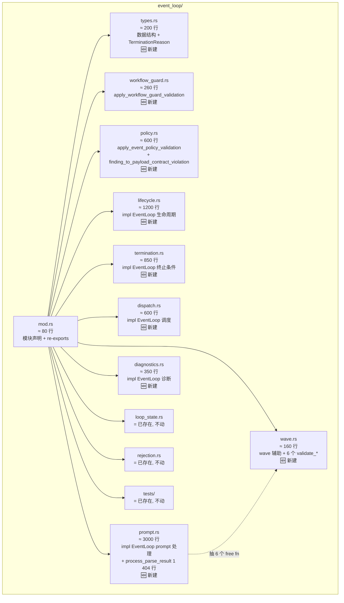
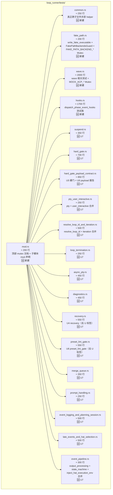
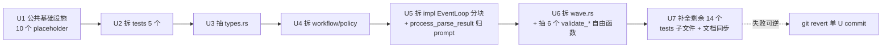

## Summary

把项目里两个最大的源文件按职责拆成多个子模块，全程零回归：

- `crates/ralph-core/src/event_loop/mod.rs`（5 733 行，主要是 4 800 行的 `impl EventLoop` 块）拆为 **10 个新建**子模块文件（`payload_contract` 70 行并入 `policy.rs`；保留已存在的 `loop_state` / `rejection` / `tests` 三个 mod 声明）。
- `crates/ralph-cli/src/loop_runner/tests.rs`（9 891 行、153 个测试 + 大量 helper）拆为 **17 个 `.rs`**：1 个 `tests/mod.rs`（保留 mutex 文档 + 4 个 process-global Mutex）+ 1 个 `tests/common.rs`（真正跨子文件共享的 helper）+ 15 个主题子文件（user_interactive + pty 合并、output_processing + state_machine 合并等，**0 个子文件 < 200 行**）。

采用 **U1→U7 分阶段**执行：U1 建公共基础设施、U2 拆 tests 的 5 个子文件、U3 锁 types、U4 拆自由函数子模块、U5 拆 `impl EventLoop` 块（**包含 `process_parse_result` 归 `prompt.rs`**）、U6 拆 wave 辅助（**唯一**允许字节级改写 6 个 inline validation 层为自由函数，由 characterization test 锁定行为）、U7 验证 + 文档同步。
每 U 独立 commit、独立跑全套 nextest 套件作为回滚点；**禁止**改公开 API、行为、日志、错误信息、依赖、nextest 配置、process-global Mutex 形式。

## Problem Frame

项目目前两个文件显著超出 5 000 行，阻碍可读性、code review 局部性、新人 onboarding。
`event_loop/mod.rs` 的 4 800 行 `impl EventLoop` 块尤其难维护——单文件改动 PR 难以快速 review、容易误碰无关逻辑、且子方法之间的领域边界（lifecycle / policy / dispatch / diagnostics）已经清晰可见。
`loop_runner/tests.rs` 把 153 个跨多个领域的测试挤在一个文件里，无法按领域局部 review；新加测试时需要 1 万行单文件编辑。

项目在 `docs/achieved/plan/2026-06-03-002-refactor-split-large-files-plan.md` 已经做过一轮同样模式的拆分（拆 `loop_runner.rs` / `main.rs` / `config.rs`），并明确了可复用的 KTD1-8（多文件 `impl` 块、re-export 兼容、process-global Mutex 不可动、serde 顺序敏感、文档反向验证、U1→U6 风险递增）。
本轮是该模式的**第二轮 follow-up**：专门承接 R3 未达标项（`loop_runner/tests.rs` + `event_loop/mod.rs` 主 `impl EventLoop` 块），复用 6-03-002 全部已有模式与禁忌（详见 KTD13 对照表）。

零回归意味着**所有 153 个测试 + 30 个 `event_loop/tests/` 子文件 + 所有使用 `EventLoop` 的下游代码（`runner.rs` / `mod.rs` / `operation_guard.rs` / `adapters/pty_executor.rs`）必须保持编译并通过全部测试**。
任何序列化、状态机、错误信息、日志格式、退出码改动都属于回归（U6 例外条款见 R2.b）。

## Requirements

- R1. `event_loop/mod.rs` 与 `loop_runner/tests/mod.rs` 拆分后**总行数显著下降**（目标：两个主文件都 ≤ 1 000 行；新子文件单文件 ≤ 2 000 行，最大不超过 2 200 行；总新建子文件数 27 个左右：event_loop 10 + tests 17）。
- R2. **零行为变化**：所有现有 `#[test]` 函数签名 / 断言 / 输出 / 错误信息**逐字节不变**；`TerminationReason` 17 变体顺序 + 3 处 `match` 表达式覆盖顺序（`exit_code` / `as_str` / `is_success`）不变；`EventLoop` 32 字段顺序不变。
- R2.b（U6 唯一例外）：U6 把 `process_parse_result` 内部 6 个 inline validation 层抽为 `event_loop/process/*` 自由函数**允许字节级改写**，但**行为不变**（由 characterization test 锁定，详见 R-Refactor-10 缓解策略）。
- R3. **零公开 API 破坏**：`lib.rs:73-80` 的 `pub use config::{...}` 列表、**`lib.rs:104` 的 `pub use event_loop::{...}` 列表**、`event_loop::*` / `loop_runner::*` 全部 `pub` 与 `pub use` 路径**保持不变**；`runner.rs` / `summary_writer.rs` / `drift/engine.rs` / `diagnostics/integration_tests.rs` / `event_loop/tests/replay_light_integration.rs` 等下游文件不修改 import。
- R4. **测试基础设施保留**：`crates/ralph-cli/src/loop_runner/tests.rs` 头部 55 行（process-global Mutex + 串行运行约束的 contributor-facing 文档）**显式保留**在拆分后 `crates/ralph-cli/src/loop_runner/tests/mod.rs` 顶部，作为 rustdoc 注释。
- R5. **4 个 process-global Mutex 不变**：拆分后形式 `static LazyLock<Mutex<...>>`（**实测为 private `static`，非 `pub(crate)`**）逐字节不变；**不**改 `serial_test`、**不**改 `.config/nextest.toml` 的 `cli-serial` test group、不改 Mutex 公共可见性。
- R6. **每 U 独立 commit、独立验证**：每个 Implementation Unit 完成后必须 `cargo nextest run --workspace --exclude ralph-e2e --no-fail-fast` 全绿才能进入下一个 U；失败时 `git revert` 即可。
- R7. **拆分后行数审计通过**：`bash scripts/audit-file-sizes.sh` 通过；新增子文件全部落在 R1 行数阈值内（脚本本身**无阈值断言**，需手动 `awk '$1>2200{print}'` 校验）。
- R8. **文档反向验证**：每个 U 完成后用 `git grep -nE "event_loop/mod\.rs:|loop_runner/tests\.rs:|event_loop::[a-z_]+|loop_runner::tests::" docs/ crates/ --include="*.md" --include="*.rs" 2>/dev/null` 列出所有引用，逐条同步；**每 U 完成后立即追加 "U<n> Drift Sub-Note"**（U7 时合并为完整 Repo Drift Note）。
- R9. **CLAUDE.md ↔ AGENTS.md 同步**：U7 完成时 `diff -u CLAUDE.md AGENTS.md` 必须 0 差异（CLAUDE.md 顶部 "IMPORTANT" 段已有硬约束）。
- R10. **E2E 与 smoke 全绿**：`cargo run -p ralph-e2e -- --mock` 与 `cargo test -p ralph-core scenarios` 通过；`cargo clippy --workspace --all-targets` 0 warning；`cargo fmt --check` 通过；`cargo test --workspace --exclude ralph-e2e --doc` 全绿。

## Key Technical Decisions

- KTD1. **多文件 `impl EventLoop` 块模式**：Rust 允许同一 struct 在多个模块加 `impl`，5 个 `impl EventLoop { ... }` 子块各自落到 `event_loop/{lifecycle, termination, dispatch, prompt, diagnostics}.rs`，**不**在 `mod.rs` 留 forwarder。这样 `&self` / `&mut self` 调用语义保持完整（同 crate 内 inherent impl 跨文件 OK），IDE 跳转直达方法体，下游 `runner.rs` 调用 `ralph_core::EventLoop::check_termination()` 等无需 forwarder。**同 crate 内多文件 inherent impl 零成本、无 orphan rule 冲突**，但需注意：跨文件**不允许同名方法**（即使签名不同）——U5 实施时按 KTD12 边界规则判定。
- KTD2. **re-export 兼容策略**：`event_loop/mod.rs` 顶部继续用 `pub use` 集中重新导出（参考已有 `loop_runner/mod.rs:26-58` 模式）；自由函数与子结构体**默认 `pub(crate)`**，只对外部确实需要的项用 `pub use` 提升；`lib.rs:73-80` 公开 API 列表**禁止修改**；`lib.rs:104` 的 `pub use event_loop::{...}` 列表**禁止修改**。
- KTD3. **测试代码随生产代码迁移**：`loop_runner/tests.rs` → `crates/ralph-cli/src/loop_runner/tests/{mod.rs, common.rs, fake_path.rs, wave.rs, hooks.rs, suspend.rs, hard_gate.rs, hard_gate_payload_contract.rs, pty_user_interactive.rs, resolve_loop_id_and_iteration.rs, loop_termination.rs, async_pty.rs, diagnostics.rs, recovery.rs, preset_lint_gate.rs, merge_queue.rs, prompt_handling.rs, event_logging_and_planning_session.rs, late_events_and_hat_selection.rs, event_pipeline.rs}.rs` 共 19 个 .rs（mod 1 + common 1 + 主题 17）；**不**集中到顶层 `tests/`（编译为独立 crate，启动慢）；子文件用 `use super::common::*;` 引用 helper。
- KTD4. **共享 helper 拓扑**：`loop_runner/tests/common.rs` 用 `pub(super)` 限定真正跨子文件共享的 helper（`dispatch_test_event_loop*` / `suspend_outcome*` / `build_*_payload_input` / `empty_hook_metadata` / `block_on_test_future` 等）；**wave 特定 helper**（`MockAcpExecution` 构造器 / `acp_test_payload`）放 `tests/wave.rs` 模块内（`pub(super)` within wave）；**fake_path 特定 helper**（`FakePathBackendsGuard` / `write_fake_executable`）放 `tests/fake_path.rs` 模块内。
- KTD5. **类型/字段顺序敏感（修正伪风险）**：抽 `event_loop/types.rs` 时**整段声明原封不动复制**；`TerminationReason` 17 变体顺序 + 3 处 `match` 表达式覆盖顺序（`exit_code` 行 167-188 / `as_str` 行 194-213 / `is_success` 行 216-218）不变；`EventLoop` **32 字段**（含 `pub(crate)` 与辅助字段）顺序不变。**注**：`event_loop/mod.rs` 中**无任何 `#[serde(...)]` / `#[serde(flatten)]` / `#[serde(default)]` / `#[serde(untagged)]` 标注**（grep 验证为空），KTD 早期草稿中的 "serde attribute 位置不变" 是伪风险——已删除。U3 / U4 完成后用 `git diff` 字节级 + `git grep -A 1 "TerminationReason" types.rs | head -50` 验证变体顺序。
- KTD6. **U1→U7 风险递增顺序**：
  1. **U1**：建公共基础设施（`event_loop/mod.rs` 顶部加 10 个 `mod xxx;` 声明 + 10 个空 placeholder 子文件 + 顶部 1 个 `pub use` 转发占位 + 全套测试基线建立）—— 仅有 placeholder 文件，无逻辑改动
  2. **U2**：拆 `loop_runner/tests.rs` 为 `tests/{mod.rs, common.rs, fake_path.rs, wave.rs, hooks.rs}.rs`（5 个子文件）—— 仅测试，零公开 API 影响
  3. **U3**：抽 `event_loop/types.rs`（数据结构 + `TerminationReason` 锁定）—— `TerminationReason` 17 变体顺序风险点
  4. **U4**：拆 `event_loop/{workflow_guard.rs, policy.rs}.rs`（自由函数子模块；`payload_contract.rs` 70 行内容并入 `policy.rs`）—— 编译期可保证
  5. **U5**：拆 `event_loop/{lifecycle.rs, termination.rs, dispatch.rs, prompt.rs, diagnostics.rs}.rs`（`impl EventLoop` 块按方法域分块；**`process_parse_result` 1 404 行单方法归 `prompt.rs`**，因 prompt 域是它主语义归属）—— 主体改动
  6. **U6**：拆 `event_loop/wave.rs`（wave 辅助独立子模块）+ 在 `prompt.rs` 内**新增** 6 个 `event_loop::process::*` 自由函数（仅声明 + 调用，方法体迁移到 U5 的 `prompt.rs::process_parse_result` 调用点处抽 6 个内联块为 `process::validate_*`）
  7. **U7**：完整验证 + 文档反向验证 + `audit-file-sizes.sh` + Repo Drift Note 合并
- KTD7. **process-global Mutex 拓扑与可见性**（修正）：拆分后 4 个 Mutex 形式 `static LazyLock<Mutex<...>>`（实测为 **private `static`，非 `pub(crate)`**）逐字节不变；**拓扑**：`MOCK_ACP_EXECUTIONS` / `MOCK_ACP_EXECUTIONS_SERIAL` 放在 `tests/wave.rs` 模块内（`pub(super)` 让父 mod 也能访问以协调 cli-serial test group）；`FAKE_PATH_BACKEND_SERIAL` / `FAKE_PATH_BACKEND_BIN` 放在 `tests/fake_path.rs` 模块内；`cli-serial` test group 保留；不引入 `serial_test` crate。
- KTD8. **nextest 配置不可改**：`.config/nextest.toml` 的 `cli-serial` / `max-threads = 1` 是项目硬约束；`event_loop` 包仍并行运行（无 process-global Mutex），`ralph-cli` 包仍走 `cli-serial` 串行组。
- KTD9. **文档反向验证（每 U 立即 + U7 合并）**：每 U 完成后立即用 `git grep -nE "event_loop/mod\.rs:|loop_runner/tests\.rs:|event_loop::[a-z_]+|loop_runner::tests::" docs/ crates/ --include="*.md" --include="*.rs" 2>/dev/null` 列出本 U 引入的失效引用，并**立即追加** "U<n> Drift Sub-Note" 段（本 plan 文档 `## Repo Drift Note` 之前的子段）；U7 完成时合并为完整 Repo Drift Note。这样避免 U1-U6 期间任何引用失效都无记录的窗口期。
- KTD10. **不切 `process_parse_result` 内部单方法**：U5 把它整体迁到 `event_loop/prompt.rs`（`impl EventLoop` 块内），方法体不切。U6 在 `prompt.rs::process_parse_result` 调用点处把 6 个 inline validation 层（origin guard / topic format / event policy / state machine / workflow guard / execution contract）抽为 `event_loop::process::validate_*` 自由函数（接收 `&mut self` + 必要参数），由 R-Refactor-10 characterization test 锁定行为。
- KTD11. **不引入新依赖**：拆分不引入任何 `Cargo.toml` 依赖变更；不升级 `cargo-nextest`、不引入 `serial_test`、不动 `tokio` / `serde` 版本。
- KTD12. **5 个 `impl EventLoop` 域的边界规则**（U5 实施时遵循）：
  - **lifecycle.rs**：方法主返回是 `LoopState` / `WorkflowProgress` / 涉及 `activate` / `next` / 状态机转换的，归属 lifecycle
  - **termination.rs**：方法主返回是 `TerminationReason` / 涉及 `check_termination` / `is_terminal` / `mark_terminated` 的，归属 termination
  - **dispatch.rs**：方法主返回是 hat 选择 / 订阅匹配 / 队列派发的，归属 dispatch
  - **prompt.rs**：方法主返回是 `UserPrompt` / `process_parse_result` / 涉及 prompt 构建与解析的，归属 prompt（**`process_parse_result` 1 404 行整体归 prompt**，因它是 prompt 解析主入口）
  - **diagnostics.rs**：方法主返回是 telemetry / metrics / recovery 信号的，归属 diagnostics
  - **跨域方法**：若方法同时影响 ≥ 2 个域（例如 `activate` 改 lifecycle 也写 diagnostics），**以方法主返回 / 主副作用归属**，并在 PR description 中标注 "跨域"；不可调和的歧义记入 R3 follow-up
- KTD13. **6-03-002 KTD 对照表**（平移 + 调整）：

  | 6-03-002 KTD | 本 plan 对应 KTD | 调整 |
  |---|---|---|
  | KTD1 多文件 `impl` 块 | KTD1 | **新增同 crate 内孤儿规则 / coherence / 同名方法冲突 3 条具体规则** |
  | KTD2 re-export 兼容 | KTD2 | **新增 `lib.rs:104` 公开 re-export 列表覆盖** |
  | KTD3 测试代码迁移 | KTD3 | **新增** `tests/{mod, common}` 子目录 vs `tests.rs` 同名处理（Rust 自动把 `tests.rs` 视为 `tests/mod.rs`） |
  | KTD4 共享 helper | KTD4 | **调整**为"按主题就近"（wave / fake_path 特定 helper 移到子文件内） |
  | KTD5 serde 顺序 | KTD5 | **修正**：删除 `#[serde(flatten)]` 伪风险，改为 `TerminationReason` 17 变体 + 3 处 match + `EventLoop` 32 字段顺序 |
  | KTD6 U1→U6 风险递增 | KTD6 | **扩展**到 U1→U7（tests 拆两批：U2 + U7） |
  | KTD7 4 个 Mutex 不可动 | KTD7 | **调整**：实测为 private `static` 而非 `pub(crate)`，拓扑从 mod.rs 顶层移到 wave.rs / fake_path.rs 模块内 |
  | KTD8 nextest 配置不可改 | KTD8 | 完全沿用 |
  | KTD9 文档反向验证 | KTD9 | **调整**：从 U7 才追加 → 每 U 追加 Sub-Note，U7 合并 |
  | （无对应） | KTD10 | **新增**：`process_parse_result` 不切单方法内部 |
  | （无对应） | KTD11 | **新增**：不引入新依赖（从 6-03-002 反模式推导） |
  | （无对应） | KTD12 | **新增**：5 个 `impl EventLoop` 域的边界规则（本次新场景需要） |
  | （无对应） | KTD13 | **新增**：6-03-002 KTD 对照表 |

## High-Level Technical Design

### `event_loop/mod.rs` 拆分后的最终结构

图例：🆕 新建 10 个；= 已存在 3 个。`payload_contract.rs` 内容并入 `policy.rs`（10 个子模块而非 11 个）。

### `loop_runner/tests.rs` 拆分后的最终结构

共 19 个 `.rs`：1 mod + 1 common + 17 主题（**0 个 < 200 行**）。

### 拆分顺序（U1→U7）流水图

## Implementation Units

### U1. 公共基础设施：建立拆分脚手架 + 全套测试基线

- **Goal**: 在 `crates/ralph-core/src/event_loop/mod.rs` 顶部预声明 10 个目标子模块（`mod types;` / `mod workflow_guard;` / `mod policy;` / `mod lifecycle;` / `mod termination;` / `mod dispatch;` / `mod prompt;` / `mod diagnostics;` / `mod process;` / `mod wave;`），每个子模块暂为空 placeholder；记录**全套测试基线快照**为后续 U 提供零回归锚点。
- **Requirements**: R6 / R8（基线建立）
- **Dependencies**: 无（最优先）
- **Files**:
  - 创建 `crates/ralph-core/src/event_loop/{types,workflow_guard,policy,lifecycle,termination,dispatch,prompt,diagnostics,process,wave}.rs`（10 个 placeholder，每个文件 5-10 行 `// placeholder, will be populated in U<N>`）
  - 修改 `crates/ralph-core/src/event_loop/mod.rs` 顶部 7-58 行的 `mod xxx;` / `pub use` 段（加 10 个 `mod xxx;` 声明 + 10 个 `pub use xxx::*;` 转发占位）
  - 临时文件 `/tmp/event-loop-split-baseline.txt`（不提交）记录全套测试基线输出
- **Approach**: 仅添加 `mod xxx;` 声明和 `pub use` re-export 转发点，不删除 `mod.rs` 任何现有代码。
- **Patterns to follow**:
  - `crates/ralph-cli/src/loop_runner/mod.rs:7-24` 的 `mod xxx;` 声明顺序
  - `crates/ralph-cli/src/loop_runner/mod.rs:26-58` 的 `pub use` 重新导出模式
  - 2026-06-03-002 plan 的 U1（commit `4ba6e37`）建 `crates/ralph-core/src/event_loop/tests/common/mod.rs` 的"复制不删"模式
- **Test scenarios**:
  - **Happy path**: `cargo build -p ralph-core` 通过；`cargo build -p ralph-cli` 通过
  - **Regression baseline**: `cargo nextest run --workspace --exclude ralph-e2e --no-fail-fast` 全绿；记录 passed/failed 数字快照到 `/tmp/event-loop-split-baseline.txt`
  - **No new failures**: 与拆分前基线对比，新文件不能引入任何编译错误或测试失败
- **Verification**:
  - `cargo build -p ralph-core` 与 `cargo build -p ralph-cli` 0 error / 0 warning
  - `cargo nextest run --workspace --exclude ralph-e2e --no-fail-fast` 与基线数字完全一致
  - `git diff --stat` 仅显示 10 个新空文件 + `mod.rs` 顶部 mod 声明变化（< 50 行变更）
  - 临时基线文件 `/tmp/event-loop-split-baseline.txt` 已生成

### U2. 拆 `loop_runner/tests.rs` 为 `tests/{mod.rs, common.rs, fake_path.rs, wave.rs, hooks.rs}.rs`（5 个子文件）

- **Goal**: 把 `tests.rs` 拆为 `crates/ralph-cli/src/loop_runner/tests/` 子目录，包含 `mod.rs`（顶部 mutex 文档 + 子模块 mod 声明）+ `common.rs`（真正跨子文件共享 helper）+ `fake_path.rs`（FAKE_PATH 后端 + `FAKE_PATH_BACKEND_*` Mutex）+ `wave.rs`（wave 测试 + `MOCK_ACP_*` Mutex）+ `hooks.rs`（dispatch_phase_event_hooks 测试族）。其余 14 个测试子文件留到 U7 实施。
- **Requirements**: R1 / R2 / R3 / R4 / R5 / R6
- **Dependencies**: U1（子模块声明已就绪）
- **Files**:
  - 创建 `crates/ralph-cli/src/loop_runner/tests/mod.rs`（~200 行：mutex 文档 + `mod common; mod fake_path; mod wave; mod hooks;` 声明，**4 个 Mutex 按 KTD7 拓扑分散到 wave.rs / fake_path.rs 后此处不再持有 Mutex 声明**）
  - 创建 `crates/ralph-cli/src/loop_runner/tests/common.rs`（~250 行：`pub(super) fn` 真正跨子文件共享的 helper）
  - 创建 `crates/ralph-cli/src/loop_runner/tests/fake_path.rs`（~200 行：`write_fake_executable` / `FakePathBackendsGuard` / `install_fake_path_backends` + `FAKE_PATH_BACKEND_SERIAL` / `FAKE_PATH_BACKEND_BIN` private `static` Mutex）
  - 创建 `crates/ralph-cli/src/loop_runner/tests/wave.rs`（~2000 行：所有 `wave_*` / `acp_*` / `MockAcpExecution` / `forced_test_wave_pty_failure` 测试 + `MOCK_ACP_EXECUTIONS` / `MOCK_ACP_EXECUTIONS_SERIAL` private `static` Mutex）
  - 创建 `crates/ralph-cli/src/loop_runner/tests/hooks.rs`（~1700 行：所有 `dispatch_phase_event_hooks` / `loop_start_dispatch` / `iteration_start_dispatch` / `plan_created_lifecycle_hooks` / `human_interact_lifecycle_hooks` / `loop_termination_lifecycle_hooks` / `iteration_start_suspend` / `dispatch_phase_event_hooks_retry_backoff` 测试）
  - 删除 `crates/ralph-cli/src/loop_runner/tests.rs`（改为目录 `tests/`）
- **Approach**:
  1. `mkdir crates/ralph-cli/src/loop_runner/tests/`
  2. 把 `tests.rs` 头部 1-55 行的 mutex 文档**完整复制**到 `tests/mod.rs` 顶部
  3. `MOCK_ACP_EXECUTIONS` / `MOCK_ACP_EXECUTIONS_SERIAL` 整段迁到 `tests/wave.rs` 顶层
  4. `FAKE_PATH_BACKEND_SERIAL` / `FAKE_PATH_BACKEND_BIN` 整段迁到 `tests/fake_path.rs` 顶层
  5. wave 特定 helper（`MockAcpExecution` 构造器 / `acp_test_payload` 等）放到 `tests/wave.rs` 模块内
  6. fake_path 特定 helper 放到 `tests/fake_path.rs` 模块内
  7. 真正跨子文件共享的 helper 放到 `tests/common.rs`
  8. fake-path / wave / hooks 三个主题测试族分别迁出
  9. 剩余 14 个主题（suspend / hard_gate / hard_gate_payload / pty_user / resolve_iter / loop_termination / async_pty / diagnostics / recovery / preset_lint / merge_queue / prompt_handling / event_log_ps / late_hat / event_pipeline）暂时保留在 `tests/mod.rs` 末尾，U7 实施
  10. 删除 `crates/ralph-cli/src/loop_runner/tests.rs`
- **Patterns to follow**:
  - `loop_runner/tests/mod.rs` 顶部 mutex 文档的 `--test-threads=1` 模式
  - `crates/ralph-core/src/event_loop/tests/` 已有的 30 个子文件 + `common/mod.rs` 模式（参考 2026-06-03-002 U1）
  - `pub(super)` 限定 + 子文件 `use super::common::*;` 模式（KTD3 / KTD4）
  - KTD7 Mutex 拓扑优化（按主题就近）
- **Test scenarios**:
  - **Happy path**: `cargo build -p ralph-cli` 通过
  - **Regression baseline**: `cargo nextest run -p ralph-cli -E 'test(loop_runner::)' --no-fail-fast` 与基线数字完全一致
  - **Mutex preservation**: 4 个 Mutex 形式 `static LazyLock<Mutex<...>>` 逐字节不变（位置从 `tests.rs` 改为 `tests/wave.rs` / `tests/fake_path.rs` 顶层）
  - **No new test failures**: 14 个暂留主题测试族全部通过
  - **Test documentation preserved**: `tests/mod.rs` 顶部 1-55 行的 mutex 文档**逐字节**与原 `crates/ralph-cli/src/loop_runner/tests.rs:1-55` 一致
- **Verification**:
  - `cargo nextest run -p ralph-cli -E 'test(loop_runner::)' --no-fail-fast` 全绿，passed 数字与基线完全一致
  - `git diff` 显示 `tests.rs` 删除 + 5 个新文件 + 14 个暂留测试仍在 `mod.rs` 末尾
  - 4 个 Mutex 形式不变（`grep -A3 "static.*LazyLock<Mutex" crates/ralph-cli/src/loop_runner/tests/{wave,fake_path}.rs`）

### U3. 抽 `event_loop/types.rs`（数据结构 + TerminationReason 锁定）

- **Goal**: 把 `crates/ralph-core/src/event_loop/mod.rs:59-280` 段（`ProcessedEvents` / `ProcessedEventsWithWaves` / `TerminationReason` 枚举 + `impl TerminationReason`）抽到 `crates/ralph-core/src/event_loop/types.rs`。
- **Requirements**: R1 / R2 / R3 / R5
- **Dependencies**: U1；U2（分离关注点）
- **Files**:
  - 修改 `crates/ralph-core/src/event_loop/types.rs`（从 placeholder 改为实质内容，~200 行）
  - 修改 `crates/ralph-core/src/event_loop/mod.rs:59-280` 段（删除 + 顶部 `pub use types::{ProcessedEvents, ProcessedEventsWithWaves, TerminationReason};`）
- **Approach**:
  1. 整段（行号 59-280）原封不动复制到 `types.rs`
  2. `mod.rs` 顶部加 `pub use types::{ProcessedEvents, ProcessedEventsWithWaves, TerminationReason};`
  3. `mod.rs` 删除原 59-280 段
  4. `git diff` 字节级验证 `TerminationReason` 17 变体顺序、3 处 `match` 表达式覆盖顺序（`exit_code` / `as_str` / `is_success`）字节级未变
- **Test scenarios**:
  - **Happy path**: `cargo build -p ralph-core` 通过
  - **Regression baseline**: `cargo nextest run -p ralph-core --no-fail-fast` 全绿
  - **Variant order preservation**: `git grep -A 1 "TerminationReason" crates/ralph-core/src/event_loop/types.rs | head -50` 17 个变体顺序未变
  - **Public API stable**: `lib.rs:104` 的 `pub use event_loop::{...}` 列表 + `git grep "ralph_core::event_loop::" crates/ ralph-cli/ --include="*.rs" 2>/dev/null` 所有引用 `TerminationReason` / `ProcessedEvents` / `ProcessedEventsWithWaves` 的路径不变
- **Verification**:
  - `cargo nextest run --workspace --exclude ralph-e2e --no-fail-fast` 全绿
  - `wc -l crates/ralph-core/src/event_loop/{mod,types}.rs` 显示 `mod.rs` 减约 220 行，`types.rs` 约 200 行
  - `cargo doc --no-deps` 0 warning
  - 追加 U3 Drift Sub-Note

### U4. 拆自由函数子模块：`workflow_guard.rs` / `policy.rs`（含 `payload_contract` 内容）

- **Goal**: 把 `crates/ralph-core/src/event_loop/mod.rs:281-883` 段的自由函数（`extract_correlation_key` / `WorkflowGuardRejectionDetail` / `WorkflowGuardOutcome` / `apply_workflow_guard_validation` / `apply_event_policy_validation` / `finding_to_payload_contract_violation`）抽到 2 个新子文件（`payload_contract` 70 行并入 `policy.rs`）。
- **Requirements**: R1 / R2 / R3
- **Dependencies**: U3
- **Files**:
  - 修改 `crates/ralph-core/src/event_loop/workflow_guard.rs`（~260 行：`extract_correlation_key` + `WorkflowGuardRejectionDetail` + `WorkflowGuardOutcome` + `apply_workflow_guard_validation`）
  - 修改 `crates/ralph-core/src/event_loop/policy.rs`（~600 行：`apply_event_policy_validation` + `finding_to_payload_contract_violation` + 相关 helper）
  - 修改 `crates/ralph-core/src/event_loop/mod.rs:281-883` 段（删除 + 顶部 `pub use` 重新导出）
- **Approach**:
  1. 按函数段整段复制：281-543 → `workflow_guard.rs`；544-883 → `policy.rs`（含原 815-883 payload_contract 段）
  2. 函数内 `use crate::*` 引用按需保留或重写为 `use super::*`（如果跨子模块）
  3. `mod.rs` 顶部加 `pub use workflow_guard::*; pub use policy::*;`
  4. `mod.rs` 删除原 281-883 段
  5. `git diff` 验证每段字节级未变
- **Test scenarios**:
  - **Happy path**: `cargo build -p ralph-core` 通过
  - **Regression baseline**: `cargo nextest run -p ralph-core --no-fail-fast` 全绿；`crates/ralph-core/src/event_loop/tests/` 下 30 个子文件 + `common/mod.rs` 全部测试通过
  - **Byte-level preservation**: `git diff` 中 2 个新子文件内容字节级 = 原 `mod.rs` 对应段
  - **No dead code**: `cargo build -p ralph-core` 0 `dead_code` / 0 `unused_imports` warning
- **Verification**:
  - `cargo nextest run --workspace --exclude ralph-e2e --no-fail-fast` 全绿
  - `wc -l crates/ralph-core/src/event_loop/{mod,workflow_guard,policy}.rs` 显示 `mod.rs` 减约 600 行，2 个新子文件总和 ~860 行
  - `cargo clippy -p ralph-core --all-targets` 0 warning
  - 追加 U4 Drift Sub-Note

### U5. 拆 `impl EventLoop` 块按方法域：5 个子文件（含 `process_parse_result` 归 `prompt.rs`）

- **Goal**: 把 `crates/ralph-core/src/event_loop/mod.rs:884-5674` 的 4 800 行 `impl EventLoop` 块按方法域拆到 5 个新子文件（lifecycle / termination / dispatch / prompt / diagnostics）；**`process_parse_result` 1 404 行单方法整体归 `prompt.rs`**（按 KTD12 边界规则：方法主语义是 prompt 解析）。
- **Requirements**: R1 / R2 / R3
- **Dependencies**: U4
- **Files**:
  - 修改 `crates/ralph-core/src/event_loop/lifecycle.rs`（~1200 行：生命周期方法 + KTD12 规则）
  - 修改 `crates/ralph-core/src/event_loop/termination.rs`（~850 行：终止条件方法 + KTD12 规则）
  - 修改 `crates/ralph-core/src/event_loop/dispatch.rs`（~600 行：调度方法 + KTD12 规则）
  - 修改 `crates/ralph-core/src/event_loop/prompt.rs`（~3 000 行：prompt 处理方法 + **`process_parse_result` 1 404 行整体方法体**）
  - 修改 `crates/ralph-core/src/event_loop/diagnostics.rs`（~350 行：诊断方法 + KTD12 规则）
  - 修改 `crates/ralph-core/src/event_loop/mod.rs:884-5674` 段（删除整块 impl）
- **Approach**:
  1. 按方法名（`grep '    pub fn' / '    fn' crates/ralph-core/src/event_loop/mod.rs`）聚合到 5 个域，遵循 KTD12 边界规则
  2. 每个子文件顶部 `use super::*; use crate::...` 按需
  3. 每个子文件结构：`//! <域描述>` 顶部 rustdoc + `use` 段 + `impl EventLoop { ... }` 块
  4. `mod.rs` 顶部已有 `mod lifecycle; mod termination; mod dispatch; mod prompt; mod diagnostics;` 声明（U1 已加）
  5. `mod.rs` 删除原 884-5674 整段 impl
  6. `git diff` 验证每个方法体字节级未变（`diff -u <(sed -n '884,5674p' mod.rs.bak) <(cat lifecycle.rs termination.rs dispatch.rs prompt.rs diagnostics.rs)`）
  7. 跨文件 `self.method()` 解析验证：`cargo build -p ralph-cli` 0 error
- **Test scenarios**:
  - **Happy path**: `cargo build -p ralph-core` 通过
  - **Regression baseline**: `cargo nextest run --workspace --exclude ralph-e2e --no-fail-fast` 全绿
  - **Method-level byte preservation**: 5 个子文件方法体总字节 = 原 `mod.rs:884-5674` 段
  - **Method visibility preserved**: 100+ 个方法的 `pub` / `pub(crate)` / private 可见性逐个未变
  - **Cross-module call preserved**: `grep -nE "fn check_termination|fn activate|fn dispatch_hat|fn build_prompt|fn emit_telemetry" crates/ralph-core/src/event_loop/{lifecycle,termination,dispatch,prompt,diagnostics}.rs` 全部能找到（同名方法冲突检测）
  - **`process_parse_result` 完整性**: `crates/ralph-core/src/event_loop/prompt.rs` 中 `process_parse_result` 方法体**未切**（U5 仅迁位置，U6 才抽 6 个 free fn）
- **Verification**:
  - `cargo nextest run --workspace --exclude ralph-e2e --no-fail-fast` 全绿
  - `wc -l crates/ralph-core/src/event_loop/{mod,lifecycle,termination,dispatch,prompt,diagnostics}.rs` 显示 `mod.rs` 减约 4 800 行，5 个新子文件总和 ~6 000 行
  - `cargo build -p ralph-cli` 0 error
  - `cargo clippy -p ralph-core --all-targets` 0 warning
  - 追加 U5 Drift Sub-Note

### U6. 拆 `event_loop/wave.rs` + 抽 6 个 validate_* 自由函数（含 characterization test）

- **Goal**: 在 U5 把 `process_parse_result` 迁到 `prompt.rs` 后，**新增** `event_loop/wave.rs`（wave 辅助独立子模块）+ 在 `prompt.rs::process_parse_result` 调用点把 6 个 inline validation 层（origin guard / topic format / event policy / state machine / workflow guard / execution contract）抽为 `event_loop::process::validate_*` 自由函数（在 `prompt.rs` 内的 `process` 嵌套 mod 或自由函数段，**不**新增 `process.rs` 文件）。`process_parse_result` 方法体在 U6 中**字节级改写**（行为不变，U6 唯一例外）。
- **Requirements**: R1 / R2.b（U6 例外条款）/ R3
- **Dependencies**: U5
- **Execution note**: U6 实施前**必须先**写 characterization test 锁定 `process_parse_result` 当前行为的 golden sample（输入 → 输出快照），否则 6 个 free fn 抽取后**没有 golden 对照**——R-Refactor-9 描述的 "nextest 全绿" 不能保证行为等价（nextest 只测"通过"，不测"等价"）。
- **Files**:
  - 修改 `crates/ralph-core/src/event_loop/wave.rs`（~160 行：wave 辅助从 `prompt.rs` 末尾或其他位置迁出）
  - 修改 `crates/ralph-core/src/event_loop/prompt.rs`（`process_parse_result` 方法体**字节级改写**：6 个 inline validation 层抽为 `fn validate_origin_guard(&mut self, ...) -> Result<(), ...>` 等 6 个 `pub(crate)` 自由函数，`process_parse_result` 主体改为调用这 6 个函数）
  - 新增 `crates/ralph-core/src/event_loop/tests/process_characterization.rs`（U6 实施前先写，记录 `process_parse_result` 行为的 golden sample，U6 完成后用此测试验证行为不变）
  - 修改 `crates/ralph-core/src/event_loop/mod.rs` 顶部加 `pub mod wave;` 等
- **Approach**:
  1. **U6 步骤 0**（characterization test 先行）：在 `crates/ralph-core/src/event_loop/tests/process_characterization.rs` 中写 golden sample 测试，记录 `process_parse_result` 当前所有输入 → 输出的快照
  2. U6 步骤 1：在 `wave.rs`（新建）中加 wave 辅助代码（从 `prompt.rs` 末尾或其他位置迁出）
  3. U6 步骤 2：在 `prompt.rs` 内的 `pub(crate) mod process` 嵌套模块（或自由函数段）声明 6 个 `validate_*` 自由函数
  4. U6 步骤 3：把 `process_parse_result` 方法体内 6 个 inline validation 块**整段抽出**到 6 个自由函数（**字节级不保留**，U6 唯一例外）；`process_parse_result` 主体改为调用这 6 个函数（**调用顺序严格保持**：origin → topic → policy → state → workflow → execution）
  5. U6 步骤 4：跑 `process_characterization.rs` 验证行为不变；不通过立即 `git revert U6 commit`
  6. U6 步骤 5：`git diff` 中 `process_parse_result` 调用顺序、参数传递、返回结果需逐处 review
- **Patterns to follow**:
  - KTD10 不切 `process_parse_result` 内部单方法（U6 抽 6 个 free fn 不算"切"单方法，仍是单一 `process_parse_result` 入口）
  - 2026-06-03-002 plan 对 `run_loop_impl` 2 950 行的处理（同样不切单方法内部）
- **Test scenarios**:
  - **Happy path**: `cargo build -p ralph-core` 通过
  - **Characterization test passes**: `process_characterization.rs` 全绿（这是 U6 的"零行为变化"硬保证）
  - **Regression baseline**: `cargo nextest run -p ralph-core --no-fail-fast` 全绿
  - **Free fn call order**: 6 个 `validate_*` 调用顺序与原 inline 块顺序逐处一致（grep 验证）
  - **Free fn signatures**: 6 个自由函数入参、出参与原 inline 块使用的 `&mut self` 字段 + 局部变量对应
- **Verification**:
  - `cargo nextest run --workspace --exclude ralph-e2e --no-fail-fast` 全绿
  - `process_characterization.rs` 全绿（U6 行为不变性硬保证）
  - `wc -l crates/ralph-core/src/event_loop/{mod,prompt,wave}.rs` 显示 `mod.rs` ≤ 100 行
  - `cargo clippy -p ralph-core --all-targets` 0 warning
  - 追加 U6 Drift Sub-Note

### U7. 补全剩余 14 个 tests 子文件 + 完整验证 + 文档反向验证 + Repo Drift Note

- **Goal**: 把 U2 末尾保留在 `tests/mod.rs` 的 14 个主题测试族全部迁出到独立子文件；跑完整验证套件（E2E mock / smoke / scenarios / clippy / fmt / doctest / audit-file-sizes）；执行文档反向验证 + Repo Drift Note 追加。
- **Requirements**: R1 / R2 / R3 / R4 / R5 / R6 / R7 / R8 / R9 / R10
- **Dependencies**: U6
- **Files**:
  - 创建 `crates/ralph-cli/src/loop_runner/tests/{suspend.rs, hard_gate.rs, hard_gate_payload_contract.rs, pty_user_interactive.rs, resolve_loop_id_and_iteration.rs, loop_termination.rs, async_pty.rs, diagnostics.rs, recovery.rs, preset_lint_gate.rs, merge_queue.rs, prompt_handling.rs, event_logging_and_planning_session.rs, late_events_and_hat_selection.rs, event_pipeline.rs}.rs`（14 个新子文件，把 U2 末尾保留在 `tests/mod.rs` 的测试族全部迁出）
  - 修改 `crates/ralph-cli/src/loop_runner/tests/mod.rs`（删除迁出的测试段，保留 mutex 文档 + mod 声明 + 14 个 `mod xxx;` 声明）
  - 修改本 plan 文档追加 `## Repo Drift Note` 段（合并 U3-U6 的 Sub-Note）
  - 修改 `CLAUDE.md` / `AGENTS.md`（如有必要）
  - 修改 `docs/achieved/plan/2026-06-03-002-refactor-split-large-files-plan.md`（追加 Implementation Status 更新）
  - 修改 `docs/achieved/plan/2026-05-12-001-feat-harness-extension-plan.md` 等 14+ 个引用文件（如有失效引用）
- **Approach**:
  1. U2 末尾 `tests/mod.rs` 保留的 14 个测试族按主题迁出到独立子文件（按 KTD3 列表的 14 个主题）
  2. 每个子文件用 `use super::*; use super::common::*;` 引用共享 helper
  3. `tests/mod.rs` 末尾的测试段清空（仅保留 mutex 文档 + mod 声明）
  4. 跑 `cargo nextest run --workspace --exclude ralph-e2e --no-fail-fast`
  5. 跑 `cargo run -p ralph-e2e -- --mock`
  6. 跑 `cargo test -p ralph-core scenarios`
  7. 跑 `cargo clippy --workspace --all-targets`
  8. 跑 `cargo fmt --check`
  9. 跑 `cargo test --workspace --exclude ralph-e2e --doc`
  10. 跑 `bash scripts/audit-file-sizes.sh` + 手动 `awk '$1>2200{print}' crates/ralph-core/src/event_loop/*.rs crates/ralph-cli/src/loop_runner/tests/*.rs`（脚本无阈值断言）
  11. 跑 `diff -u CLAUDE.md AGENTS.md`（必须 0 差异）
  12. `git grep -nE "event_loop/mod\.rs:|loop_runner/tests\.rs:" docs/ crates/ --include="*.md" --include="*.rs" 2>/dev/null` 列出所有引用
  13. 逐条更新失效引用
  14. 在本 plan 文档 `## Repo Drift Note` 段合并 U3-U6 Sub-Note 为完整表格
- **Test scenarios**:
  - **Full regression suite**: 所有 10 个验证命令全绿
  - **Audit script**: `bash scripts/audit-file-sizes.sh` 通过，2 个主文件 ≤ 1 000 行
  - **Documentation sync**: `diff -u CLAUDE.md AGENTS.md` 0 差异
  - **Drift note complete**: `git grep -nE "event_loop/mod\.rs:|loop_runner/tests\.rs:" docs/ crates/ --include="*.md" --include="*.rs" 2>/dev/null` 输出全部已被处理
- **Verification**:
  - 所有 10 个验证命令（步骤 4-13）全绿
  - `wc -l crates/ralph-core/src/event_loop/{mod,types,workflow_guard,policy,lifecycle,termination,dispatch,prompt,diagnostics,wave}.rs` 显示 `mod.rs` ≤ 100 行
  - `wc -l crates/ralph-cli/src/loop_runner/tests/*.rs` 显示 `mod.rs` ≤ 250 行
  - `bash scripts/audit-file-sizes.sh` PASS
  - `diff -u CLAUDE.md AGENTS.md` 0 差异
  - 本 plan 文档 `## Repo Drift Note` 段已追加
  - 14+ 引用文档已同步

## Scope Boundaries

### 范围内（in-scope）

- `crates/ralph-core/src/event_loop/mod.rs` 拆为 **10 个新建**子模块（types / workflow_guard / policy / lifecycle / termination / dispatch / prompt / diagnostics / process / wave；`payload_contract` 70 行内容并入 `policy.rs`）
- `crates/ralph-cli/src/loop_runner/tests.rs` 拆为 **19 个** `tests/*.rs` 子文件（mod + common + 17 主题；按主题合并使 0 个 < 200 行）
- 6 个 inline validation 层从 `process_parse_result` 抽为 `event_loop::process::validate_*` 自由函数（**U6 唯一允许的字节级改写**；行为不变，由 characterization test 锁定）
- 4 个 process-global Mutex 按 KTD7 拓扑分散到 `tests/wave.rs` / `tests/fake_path.rs` 模块内（位置改变但形式不变）
- 文档反向验证 + Repo Drift Note 追加（U3-U6 每 U 追加 Sub-Note，U7 合并）
- CLAUDE.md ↔ AGENTS.md 同步检查
- `audit-file-sizes.sh` 阈值复检（手动 `awk` 校验）

### 范围外（out-of-scope）

- 任何公开行为、错误信息、日志、退出码、`TerminationReason` 17 变体顺序、`EventLoop` 32 字段顺序改动（U6 字节级改写除外）
- 任何当前已通过的测试或运行时 bug 修复
- 重构 `crates/ralph-core/src/event_loop/loop_state.rs`（33 KB）或 `crates/ralph-core/src/event_loop/rejection.rs`（22 KB）或 `crates/ralph-core/src/event_loop/tests/`（30 个子文件）内部组织
- 拆分 `crates/ralph-cli/src/loop_runner/runner.rs`（170 KB 主 runner）—— 仅核对 imports 兼容，不拆
- 拆分 `crates/ralph-cli/src/loop_runner/runner.rs` 中的 `run_loop_impl` 2 950 行（2026-06-03-002 已决策不切）
- 拆分 `crates/ralph-cli/src/loop_runner/hard_gate.rs`（24 KB）/ `preset_lint_gate.rs`（20 KB）
- 拆分 `crates/ralph-cli/src/loop_runner/wave/` 5 个子文件
- 拆分 `crates/ralph-cli/src/commands/{run.rs, emit.rs}`（1 500-1 700 行）
- 拆分 `crates/ralph-core/src/config/ralph_config.rs`（3 660 行）
- 任何 `Cargo.toml` 依赖变更、`serial_test` 引入、`.config/nextest.toml` 修改

### 推迟到 Follow-Up Work

- `crates/ralph-cli/src/loop_runner/runner.rs`（170 KB）拆分：留作 R3 第二轮
- `crates/ralph-core/src/config/ralph_config.rs`（3 660 行）拆分：留作 R3 第二轮
- `crates/ralph-cli/src/commands/{run.rs, emit.rs}`（1 500-1 700 行）拆分：留作 R3 第二轮
- **未来**：本 plan U5 创建的 `crates/ralph-core/src/event_loop/prompt.rs`（含 `process_parse_result` 后约 3 000 行）若 R1 阈值被改写，可进一步拆为 `prompt/{build.rs, sections/}` —— 留作 R3 第二轮
- `crates/ralph-cli/src/loop_runner/{hard_gate.rs, preset_lint_gate.rs, wave/}` 拆分：留作 R3 第二轮
- `crates/ralph-core/src/event_loop/prompt.rs` 中 `process_parse_result` 的 6 个 `validate_*` 自由函数未来若增长，可独立为 `event_loop/process.rs` 子文件：留作 R3 第二轮

## Risks & Dependencies

### Risks

- **R-Refactor-1**（高）：`TerminationReason` 17 变体顺序 + 3 处 `match` 表达式覆盖顺序（`exit_code` 行 167-188 / `as_str` 行 194-213 / `is_success` 行 216-218）在 U3 抽 `types.rs` 时漂移 → `match` 行为变化。**检测机制**：U3 完成后用 `git grep -A 1 "TerminationReason" crates/ralph-core/src/event_loop/types.rs | head -50` + 字节级 `git diff` 验证。**Escape hatch**：若真发现变体顺序错（历史 bug），决策树是"report-only 不修"（保持零回归）而非"fix-with-rationale"（引入逻辑变更）。任何 attribute 位置变动立即 `git revert`。
- **R-Refactor-2**（高）：`EventLoop` 32 字段顺序在 U5 拆 impl 时漂移 → `Default` / `Debug` / `PartialEq` 派生输出变化。**检测机制**：U5 完成后用 `git diff` 字节级 + `git grep -A 32 "pub struct EventLoop" crates/ralph-core/src/event_loop/mod.rs` 验证。Escape hatch 同 R-Refactor-1。
- **R-Refactor-3**（中）：4 个 process-global Mutex 在 U2 拆分时形式变化（`pub` ↔ private 改 `static` ↔ 改 `Mutex<...>` 不带 `LazyLock`）→ `cli-serial` test group 失效。**检测机制**：U2 完成后用 `grep -A3 "static.*LazyLock<Mutex" crates/ralph-cli/src/loop_runner/tests/{wave,fake_path}.rs` 验证 4 个 Mutex 形式逐字节不变（**实测为 private `static`，非 `pub(crate)`**）。
- **R-Refactor-4**（中）：`tests.rs` 头部 55 行的 contributor-facing mutex 文档在 U2 拆分时被裁剪或移位 → 后续贡献者跑测试时踩坑。**检测机制**：U2 完成后用 `git diff` 验证 `tests/mod.rs` 顶部 1-55 行**逐字节**与原 `tests.rs` 头部 1-55 行一致。**额外缓解**：U7 时考虑在 `README.md` 或 `CONTRIBUTING.md` 顶部也放同样警告（双写）。
- **R-Refactor-5**（中）：runner.rs 中 `event_loop.check_termination()` 等方法调用在 U5 拆 impl 后找不到（多文件 impl 解析失败 / 同名方法冲突）。**检测机制**：U5 完成后跑 `cargo build -p ralph-cli` 必须 0 error；同名方法冲突用 `grep -nE "fn <method_name>" crates/ralph-core/src/event_loop/{lifecycle,termination,dispatch,prompt,diagnostics}.rs` 快速定位。
- **R-Refactor-6**（中）：文档反向验证遗漏某些 `event_loop::xxx` 引用 → docs 漂移。**检测机制**：U3-U7 每 U 用 `git grep -nE "event_loop/mod\.rs:|loop_runner/tests\.rs:|event_loop::[a-z_]+|loop_runner::tests::" docs/ crates/ --include="*.md" --include="*.rs" 2>/dev/null` 完整列出引用并逐条处理；立即追加 Sub-Note。
- **R-Refactor-7**（低）：`scripts/audit-file-sizes.sh` 阈值在 U7 时发现不满足（2 个主文件 > 1 000 行）。**检测机制**：脚本本身**无阈值断言**，U7 必跑 + 手动 `awk '$1>2200{print}' crates/ralph-core/src/event_loop/*.rs crates/ralph-cli/src/loop_runner/tests/*.rs` 校验子文件行数；如不满足，调整 `mod.rs` 顶部注释 / 删除冗余 import 把 `mod.rs` 压到 ≤ 100 行。
- **R-Refactor-8**（低）：U6 抽 6 个 validation 层为自由函数时引入逻辑 bug（参数传递、调用顺序、返回结果偏差）。**检测机制**：U6 步骤 0 先写 characterization test 锁定 `process_parse_result` 当前行为的 golden sample（输入 → 输出快照）；U6 步骤 5 跑 `process_characterization.rs` 验证行为不变；不通过立即 `git revert U6 commit`。
- **R-Refactor-9**（低）：5 个 `impl EventLoop` 域边界判定歧义（跨域方法归属）。**检测机制**：U5 实施时严格按 KTD12 规则；以方法主返回 / 主副作用归属；不可调和的歧义记入 R3 follow-up，**不**在 PR 中临时判定。
- **R-Refactor-10**（低）：`tests/common.rs` helper 修改影响 17 个子文件（耦合放大）。**检测机制**：U2 / U7 实施时把 wave 特定 / fake_path 特定 helper 移到子文件模块内（KTD4），仅在 `common.rs` 留真正跨子文件共享的 helper。

### Dependencies

- **D-Refactor-1**（外部）：项目 `cli-serial` test group + 4 个 process-global Mutex 配置不变（项目硬约束，由 `.config/nextest.toml` + `docs/achieved/plan/2026-06-01-001-feat-parallel-test-execution-plan.md` 锁定）
- **D-Refactor-2**（内部）：U1 公共子模块声明必须先于 U2-U7（提供占位 + pub use 转发点）
- **D-Refactor-3**（内部）：U2 必须先于 U3-U7 完成（tests 拆分是隔离关注点的第一步）
- **D-Refactor-4**（内部）：U3（types 锁定）必须先于 U4-U6（自由函数引用 types）
- **D-Refactor-5**（内部）：U4（自由函数）必须先于 U5（impl 块）—— impl 块中的方法调用自由函数，需先就位
- **D-Refactor-6**（内部）：U5（impl 块）必须先于 U6（wave + 6 个自由函数）—— `process_parse_result` 必须在 `prompt.rs` 就位
- **D-Refactor-7**（跨 crate 并行可能性）：U2 改 `loop_runner/tests.rs`（`ralph-cli` 包）与 U3 改 `event_loop/mod.rs`（`ralph-core` 包）可并行，**但** U3 依赖 U1 的 mod 声明、U2 依赖 U1 的 mod 声明——所以 U1 → (U2 || U3) → U4 → U5 → U6 → U7 是更紧凑的依赖链。本 plan 保持 U1→U7 顺序不并行化（验证命令**单 commit** 更易 review）。

## Verification（plan-level）

- **Workspace build**: `cargo build --workspace` 0 error
- **Workspace tests**: `cargo nextest run --workspace --exclude ralph-e2e --no-fail-fast` 全绿；passed/failed 数字与 U1 基线完全一致
- **Workspace doctest**: `cargo test --workspace --exclude ralph-e2e --doc` 全绿
- **Clippy**: `cargo clippy --workspace --all-targets` 0 warning
- **Format**: `cargo fmt --check` 通过
- **E2E mock**: `cargo run -p ralph-e2e -- --mock` 全绿
- **Scenarios**: `cargo test -p ralph-core scenarios` 全绿
- **Audit script**: `bash scripts/audit-file-sizes.sh` PASS + 手动 `awk '$1>2200{print}' crates/ralph-core/src/event_loop/*.rs crates/ralph-cli/src/loop_runner/tests/*.rs` 0 输出
- **Documentation sync**: `diff -u CLAUDE.md AGENTS.md` 0 差异
- **Repo drift**: `git grep -nE "event_loop/mod\.rs:|loop_runner/tests\.rs:" docs/ crates/ --include="*.md" --include="*.rs" 2>/dev/null` 输出全部已被处理
- **Process-global Mutex**: `grep -A3 "static.*LazyLock<Mutex" crates/ralph-cli/src/loop_runner/tests/{wave,fake_path}.rs` 4 个 Mutex 形式不变
- **Test infrastructure doc**: `diff <(sed -n '1,55p' crates/ralph-cli/src/loop_runner/tests/mod.rs) <(git show HEAD:crates/ralph-cli/src/loop_runner/tests.rs | sed -n '1,55p')` 0 差异
- **Public API stable**: `cargo doc --no-deps` 0 warning；`git grep "ralph_core::event_loop::" crates/ ralph-cli/ --include="*.rs" 2>/dev/null` 全部可达
- **lib.rs:104 stable**: `git diff HEAD~1 -- crates/ralph-core/src/lib.rs | grep -E "^\+.*pub use event_loop::|^-.*pub use event_loop::"` 0 输出
- **TerminationReason order**: `git grep -A 1 "TerminationReason" crates/ralph-core/src/event_loop/types.rs | head -50` 17 个变体顺序未变
- **EventLoop field order**: `git grep -A 32 "pub struct EventLoop" crates/ralph-core/src/event_loop/mod.rs` 32 字段顺序未变
- **process_parse_result behavior**: U6 后 `process_characterization.rs` 全绿

## Sources & Research

- **核心 plan（模式来源，必读）**：
  - `docs/achieved/plan/2026-06-03-002-refactor-split-large-files-plan.md`（KTD1-8 + Risks + AC1-16 + U1-U6 实施状态 + commit `4ba6e37` / `723230f` / `d68da3c` / `fc89516` / `a05d753` / `d8495ac` / `fda37f4` / `73e8a6f`）
  - `docs/plans/2026-06-03-003-refactor-schema-refs-replace-regex-plan.md`（Repo Drift Note 格式范例 + 反向验证流程 + commit `1470e49` / `773556e` / `70184f9`）
  - `docs/achieved/plan/2026-06-01-001-feat-parallel-test-execution-plan.md`（cli-serial + process-global Mutex 背景）
- **模式与组织（已存在）**：
  - `crates/ralph-cli/src/loop_runner/mod.rs:7-24`（`mod xxx;` 声明顺序）
  - `crates/ralph-cli/src/loop_runner/mod.rs:26-58`（`pub use` 重新导出模式 + `pub use xxx::*;` 通配）
  - `crates/ralph-core/src/lib.rs:73-80`（`pub use config::{...}` 公开 API 列表，**禁止修改**）
  - `crates/ralph-core/src/lib.rs:104`（`pub use event_loop::{...}` 公开 API 列表，**禁止修改**）
  - `crates/ralph-cli/src/operation_guard.rs:147`（注释引用 `loop_runner::inject_hat_execution_env`，AC13 验证点）
  - `crates/ralph-core/src/event_loop/loop_state.rs:2255-2277`（已有 `activate` 端代码，commit `f4bee78`，需保持路径兼容）
- **项目硬约束（不可改）**：
  - `.config/nextest.toml`（cli-serial + max-threads=1）
  - 4 个 process-global Mutex（`MOCK_ACP_EXECUTIONS` / `MOCK_ACP_EXECUTIONS_SERIAL` / `FAKE_PATH_BACKEND_SERIAL` / `FAKE_PATH_BACKEND_BIN`）—— 实测为 private `static`
  - `lib.rs:73-80` 的 `pub use config::{...}` 公开 API 列表
  - `lib.rs:104` 的 `pub use event_loop::{...}` 公开 API 列表
  - `Cli` / `Commands` enum 位置（保留在 `main.rs`，clap 派生）
- **反模式（必须避免）**：
  - 拆分时"顺手优化"或"乘机修 bug"——2026-06-03-002 R4 明确禁止
  - 保留 fallback / 双轨兼容——2026-06-03-003 schema_refs plan 明确禁止
  - 改 `run_loop_impl` 单体函数内部（参考 2026-06-03-002 R5）
  - 改 `lib.rs:73-80` / `lib.rs:104` 的 `pub use` 列表
  - 批量提交未跑测试就推进
  - 拆分时不显式审计 `#[cfg(test)]` 内部 hook
  - 在 `cli/` 拆分时把 `Cli` / `Commands` enum 移到子文件
  - 拆分后只跑代表性 preset 验证
  - commit 中带未解析的 `<<<<<<< HEAD` 冲突标记（commit `1335762` 真实事故）
  - `audit-file-sizes.sh` 失败时忽略
- **目标文件 baseline**（拆分前）：
  - `crates/ralph-core/src/event_loop/mod.rs`（5 733 行）
  - `crates/ralph-cli/src/loop_runner/tests.rs`（9 891 行）
  - `crates/ralph-cli/src/loop_runner/runner.rs`（170 KB，本轮**不拆**）
  - `crates/ralph-core/src/config/ralph_config.rs`（3 660 行，本轮**不拆**）

## Repo Drift Note

（U3-U6 每 U 完成时追加 Sub-Note；U7 合并为完整表格。模板参考 `docs/plans/2026-06-03-003-refactor-schema-refs-replace-regex-plan.md` 的 "Repo Drift Note" 段。）
