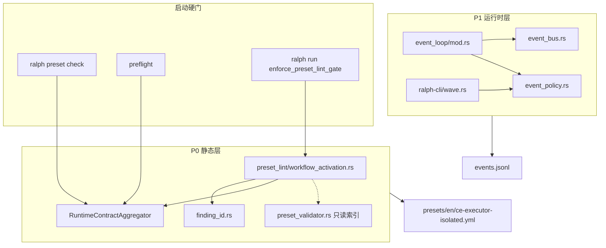
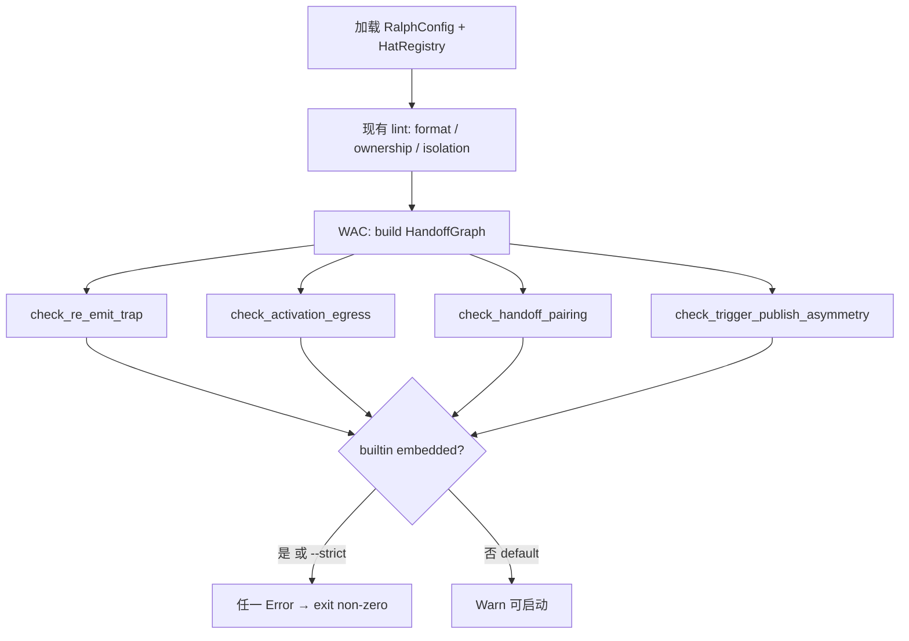
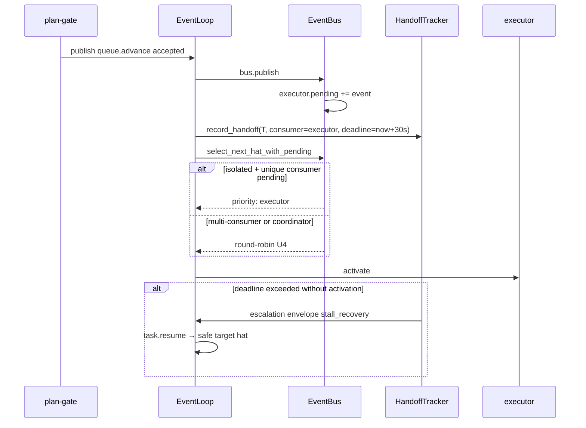
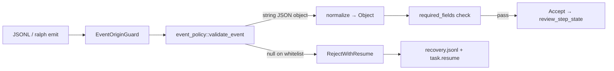

# feat: Workflow Activation Contract — ce-executor-isolated 编排机制护栏

## Summary

在 Ralph 编排层落地 **Workflow Activation Contract（WAC）**：`ralph preset check` / preflight / `ralph run` 启动前静态校验 hat 的 trigger→publish→下游可达性（含 re-emit trap、activation egress、handoff pairing）；isolated 运行时对单播 handoff topic 保证目标 hat 在可配置时限内被 dispatch；对 business/terminal payload 与 wave batch 执行硬拒收。以 `ce-executor-isolated` 为验收夹具，把 wave/dispatch 类故障从「反复改 preset YAML」升级为「机制硬拦 + 窄域运行时兜底」。

本计划与 `docs/plans/2026-06-12-001-fix-ce-executor-isolated-closure-gaps-plan.md` **互补**：001 聚焦 plan-gate 竞态、schema bypass、wave stall 补偿等**闭环缺口**；本计划聚焦**机制层 contract**，使同类编排错误在启动前不可通过、handoff 在运行时不可静默卡死。两计划可并行实施，但 **preset 同步（WAC-U4）必须在静态 contract（WAC-U1–WAC-U2）与 handoff 索引（WAC-U3）就绪后再合入**，否则 builtin strict 门会阻断 CI。

**001 协调门**：001 范围声明「不迁移 `queue.advance` 接收者」；本计划 WAC-U4 将移除 executor 的 `queue.advance` trigger 并改由 plan-gate 双 publish `queue.advance` + `work.ready`。合并前须修订 001 范围或冻结 001 对 preset 拓扑的假设，并评估对 001 `ReviewStepTracker` 的影响。

### 命名空间对照

| 前缀 | 含义 | 示例 |
|------|------|------|
| **WAC-U1…WAC-U8** | 本计划 Implementation Units | WAC-U1 = 静态 WAC 规则 |
| **step-U1…step-U8** | `2026-06-10-003` plan 的 step 编号（验收语境） | step-U1 完成 `work.done` 后 plan-gate 发 `queue.advance` |
| **MH-U3 / MH-U4** | multi-hat isolated 政策（终态 authority / fair scheduling） | 与 WAC-U3/U4 无关 |

---

## Problem Frame

`ce-executor-isolated` 的 wave 与 step 推进问题已多次以 preset 补丁、instructions 微调、运行时兜底等方式修复，但在真实 plan 运行中仍复发。`docs/report/2026-06-12-ce-executor-isolated-dispatch-gap-diagnosis.md` 记录的 loop `2026-06-10-003-...-merry-wren` 中：step-U1 已闭环，但 `plan-gate` 发出 `queue.advance (next_step=step-02)` 后 step-U2 executor **10 分钟**未被 dispatch；ralph hat 兜底后 executor 尝试 re-emit `queue.advance` 被 isolated scope 拒收，最终只能 `loop.cancel` 终止 plan。

现有机制各自覆盖了一部分，但存在系统性盲区：

| 机制 | 现状 | WAC 缺口 |
|------|------|----------|
| `preset_lint` | ownership、topic 格式、multi-hat isolation | 不校验「hat 被 topic 激活后能否合法推进工作流」 |
| `preset_validator` | 拓扑可达性 BFS | `(queue.advance → work.done)` 图论可达，但无法阻止 re-emit trap / dispatch gap |
| `hatless_ralph` | unreachable trigger 仅 warn | 不阻断启动 |
| `EventBus` | MH-U4 round-robin | 无 handoff 优先 dispatch |
| `event_policy` | schema 校验；默认 `on_violation: Warn` | null payload、string-as-json-object 可落盘 |
| `wave_detection` | 读批次时校验 `wave_total` | `ralph emit` / JSONL 直写可绕过 CLI 前置校验 |

用户目标不是再打一版 YAML，而是让同类编排错误在**机制层**不可启动、handoff 在**运行时**不可静默卡死（见 origin Key Decisions）。

---

## Requirements

需求 ID 与 origin `docs/brainstorms/2026-06-12-workflow-activation-contract-requirements.md` 对齐。

### 静态 Workflow Activation Contract

- R1. `ralph preset check` 与 preflight 必须运行 WAC 规则族，输出带稳定 finding ID、hat、topic、action hint 的报告。
- R2. **Re-emit trap**：若 hat H 的 `triggers` 包含 topic T，且 T 由另一 hat 的 `publishes` 声明，且 T ∉ H.`publishes`，则报 error（strict）或 warn（default）；finding 必须点名 re-emit 风险。
- R3. **Activation egress**：对每个 `(hat, trigger)` 对，必须存在至少一条长度 ≤2 的可达路径：从该 hat 的任一 `publishes` topic 出发，能触发至少一个其他 hat 或命中 preset 声明的 terminal/completion 链。
- R4. **Handoff pairing**：若 hat A publish topic T 且仅 hat B trigger T（唯一消费者），则 B 的 activation egress（R3）必须能到达该 plan 的下一业务阶段。
- R5. **Trigger/publish 不对称**：若 hat H trigger topic T 但 H 的合法响应集合（`publishes` + 允许的 terminal 路径）无法闭合 T 所代表的业务阶段，报 error。覆盖 `work.retry` 等已知缺口。
- R6. Builtin preset（`presets/manifest.yml` embedded 列表）违反 R2–R5 任一规则时，preflight 与 `ralph run` **必须拒绝启动**（exit non-zero），错误消息可供 CI 字面匹配。

### 运行时 handoff dispatch 保证

- R7. Isolated 模式下，handoff topic 集合至少包含：`queue.advance`、`work.ready`、`fix.plan.ready`、`work.failed`；实现可扩展，不得少于种子列表。
- R8. 当 handoff topic T 被 publish 且存在唯一消费者 hat B 时，B 必须在**默认 30s** 内进入 activation（可配置，上限 120s）。超时写 `recovery.jsonl`，不得静默等待 round-robin 多轮。
- R9. Handoff priority dispatch 不得破坏多消费者 topic 的 fair scheduling：仅当消费者 hat 数量为 1 时启用优先 dispatch。

### Payload / schema 硬执行

- R10. 对配置的 business/terminal topic（至少包含 `review.passed`、`review.failed`、`review.complete`、`work.done`、`queue.advance`、`review.wave.ready`），`payload: null` 必须 **Reject**，不写入主 `events.jsonl`。
- R11. 对 schema 声明 `payload: json_object` 的 topic，若收到 JSON string 且内容为合法 JSON object，允许 **normalize** 为 object 后接受；若无法解析为 object，Reject。
- R12. Wave emit 路径必须在写入前校验 `wave_total == len(payloads)`；违反时拒收整批并返回可操作的 CLI 错误。

### 验收与 preset 同步

- R13. 机制落地后，`presets/en/ce-executor-isolated.yml` 与 `presets/zh/ce-executor-isolated-zh.yml` 必须通过 R6 strict contract，且作为 CI 回归用例。
- R14. 在 `2026-06-10-003` plan worktree 或等价 fixture 上，step-U1 完成且 plan-gate 发出 `queue.advance` 后，step-U2 executor 首次 activation 相对 `queue.advance` 时间戳 **< 30s**。
- R15. 同一验收跑中，主事件流 **0 条** `review.passed` / `review.wave.ready` 的 null 或 string-as-object 违规落盘；review wave 以单次 batch（`wave_total > 1`）发射。

---

## Key Technical Decisions

| ID | 决策 | 理由 |
|----|------|------|
| KTD-1 | **静态优先，拒绝隐式桥接** | Runner 不做 `queue.advance → work.ready` 自动转换；编排语义必须在 preset 显式声明（origin Scope Boundaries） |
| KTD-2 | **扩展 `preset_lint/`，不新建平行验证栈** | 复用 `run_preset_lint` → `RuntimeContractAggregator` 管线；finding ID 进 `finding_id.rs`（与 `2026-06-08-003` 模式一致） |
| KTD-3 | **WAC 图算法独立于 `TopologyErrorKind`** | `preset_validator` 的 completion/required_events 语义与 R2–R5 不同；新建 `workflow_activation.rs` + 共享 `HandoffGraph`（从 `RalphConfig.hats` 构建，**不**直接引用 crate-private `TopologyGraph`；`default_publishes` 排除） |
| KTD-4 | **Re-emit 自环豁免** | 若 `T ∈ H.triggers ∩ H.publishes`，不报 trap（origin Outstanding Questions 默认） |
| KTD-5 | **egress / publishes 仅以 `publishes` 为准** | 与 MH-U3 isolated 终态 authority 一致；`default_publishes` 不计入 re-emit / egress 计算 |
| KTD-6 | **Handoff topic 混合推导** | 种子列表（R7）∪ preset 图自动推导「唯一消费者」topic；种子与推导在 consumer 归属冲突时以推导为准并 emit lint（`preset.handoff_seed_derived_conflict`）；wildcard trigger 导致多消费者时**不**启用 priority（R9 优先于 R8） |
| KTD-7 | **Builtin strict 由 manifest 驱动** | `presets/manifest.yml` embedded 列表决定 R6 error；用户 preset 默认 warn，`--strict` 升为 error |
| KTD-8 | **Handoff priority 是 MH-U4 之上的窄例外** | 在 `EventBus::select_next_hat_with_pending` 前插入 priority pass；coordinator 模式 no-op |
| KTD-9 | **Null reject 不受 `EventPolicyMode::Observe` 降级** | 对 R10 whitelist topic 强制 `RejectWithResume`；避免 merry-wren 式 warn-through |
| KTD-10 | **String normalize 全局应用于 `json_object` schema** | 与 `drift/mod.rs` 的 `parse_json_object_field_set` 对齐；normalize 在 required_fields 校验之前 |
| KTD-11 | **Handoff 超时配置键** | 新增 `event_loop.workflow_contract.handoff_dispatch_timeout_seconds`，默认 30，max 120 |
| KTD-12 | **Preset 修复与机制同步交付** | executor 去掉 `queue.advance` trigger；plan-gate 双 publish `queue.advance` + `work.ready`；`work.retry` 对称化或移除 trigger。修后 `queue.advance` 可能无唯一消费者——**handoff priority / timeout 仅对 `work.ready` 等仍有唯一消费者的 topic 生效**；`queue.advance` 保留为进度/审计信号（R7 seed），不参与 R8 dispatch 保证 |
| KTD-13 | **Escalation 禁止 ralph null terminal** | stall/handoff timeout → `review.failed` / `plan.blocked` 含结构化 payload，不注入 null `review.passed` |

---

## High-Level Technical Design

### 组件拓扑



### F1：静态 contract 校验流



**Hop 定义（R3）**：从 hat H 被 trigger topic T 激活后，H 可 emit 的任一 `publishes` topic P 出发，沿边 `publisher(P) → subscriber(trigger)` 最多 **2 步**到达：(a) 另一 workflow hat 的 trigger，或 (b) `completion_promise` / `required_events` / hat 声明的 terminal topic。

### F2：Handoff priority dispatch（isolated only）



2. **`HandoffTracker`** 建议挂在 `LoopState`（`crates/ralph-core/src/event_loop/loop_state.rs`），跟踪**已 accept** 的 handoff 事件（origin guard / policy 拒收的不计入）。**与 001 `ReviewStepTracker` 边界**：ReviewStepTracker 负责 review 终态 / plan-gate business gate；HandoffTracker 负责唯一消费者 handoff 的 dispatch deadline 与 priority 索引——两者在 `apply_event_policy_validation` 之后、`next_hat` 之前挂钩，不重复追踪同一语义。

### F3：Payload 硬门



### Preset 修复目标拓扑（ce-executor-isolated）

修复后期望 handoff 链（静态 + 运行时）：

```
review.passed → plan-gate → queue.advance + work.ready → executor → work.done → review 链
```

**禁止**：executor `triggers: queue.advance`（R2 违规源）；ralph hat 发 `work.ready`（origin 明确拒绝）。

---

## Scope Boundaries

### In scope

- R1–R15 全部需求
- `ce-executor-isolated` en/zh preset 同步与 CI 回归
- BDD scenario + replay fixture 覆盖 AE1–AE5 可自动化部分
- `CLAUDE.md` / `AGENTS.md` Presets 段无需改（preset 名不变）；builtin 列表不变

### Deferred for later（来自 origin，本计划不实施）

- `diagnosis-summary.json` counter 与 `active-activations.json` stale 状态修复
- `prerequisite_topics` 因果顺序、schema 版本化、Saga 补偿
- Coordinator 强制 `decisions.md`、task 标题与 task_key 对齐
- 扩展 `RALPH_CONTROL_TOPICS` 让 ralph hat 模拟 workflow publish
- 001 计划中的 plan-gate 竞态门、wave 缺维 synthesizer 自动补偿（与 WAC 正交，可另 PR）

### Outside this product's identity（禁止）

- Runner 隐式 topic 桥接
- 禁用 `review_step_state` synth_terminal gate
- 全局 preemption 替代 MH-U4 fair scheduling
- Dispatcher 静默合并 N×`wave_total=1` waves
- 纯 instructions 改动而不伴随机制护栏

### Deferred to Follow-Up Work

- Dogfood 全量 `2026-06-10-003` 8-step plan E2E（R14–R15 人工验收清单，自动化仅覆盖 timing replay 子集）
- Drift counter → escalation 联动（dispatch gap 报告 P1-2）

---

## System-Wide Impact

| 受众 | 影响 |
|------|------|
| **Preset 作者（A1）** | `ralph preset check` 新增 WAC findings；builtin 修 preset 前 CI 会红 |
| **Loop runner（A2）** | isolated 模式 handoff 调度行为变化；30s 内必须 dispatch 唯一消费者 |
| **Workflow hats（A3）** | re-emit 触发 topic 在 strict preset 下不可启动；null terminal 被拒收 |
| **Plan 操作者（A5）** | `ce-executor-isolated` multi-step plan 推进更可靠；故障首选读 preset check |
| **CI** | `scripts/validate-builtin-presets.sh --strict` 新增 WAC 断言；`cargo test` 新增 scenario |
| **001 计划** | payload hard gate 与 001 R2 重叠；合并时注意避免双重拒收逻辑分叉 |

---

## Phased Delivery

| 阶段 | 单元 | 可独立合并 | 验收 |
|------|------|------------|------|
| **P0-A** | WAC-U1, WAC-U2 | 是（CI 会红直到 WAC-U4） | AE1 单元测试绿；builtin strict 报 blocking violation |
| **P0-B** | WAC-U3, WAC-U4 | 依赖 P0-A | `ralph preset check --strict` 对 ce-executor-isolated 绿 |
| **P1-A** | WAC-U5, WAC-U6 | 依赖 P0-B | AE2 replay timing；handoff timeout envelope |
| **P1-B** | WAC-U7, WAC-U8 | 可部分并行 P1-A | AE3–AE5；R12 CLI 错误 |
| **验收** | WAC-U8 | 依赖全部 | R14–R15 dogfood 清单 |

---

## Risks & Dependencies

| 风险 | 缓解 |
|------|------|
| R3/R4 图算法误报导致 builtin 全红 | TDD：先写 ce-executor-isolated 违规 fixture，再写通过 fixture；自环/wildcard 单测 |
| Handoff priority 与 human.interact / wave 并发冲突 | H5/H7 边界单测；human pending 不饿死 handoff（明确定义优先级） |
| `max_activations` 耗尽导致 priority 选中但事件丢弃 | H4：emit `hat.exhausted` + contract escalation |
| Payload null reject 后 stall 无出路 | KTD-13：escalation 路由 `review.failed` / `plan.blocked` |
| 与 001 计划双重修改 `event_policy` | 合并顺序：WAC 做 whitelist hard reject；001 做 business-after-review 门 |
| Preset 四同步遗漏 | checklist：en、zh、manifest、presets.rs、index.json、zsh 补全 |

**依赖**：MH-U3/MH-U4 isolated 终态 authority 与 fair scheduling 保持不变；`HatRegistry::from_runtime_config` 为图构建输入。

---

## Success Criteria

与 origin 对齐，作为合并/发布 gate：

- `ce-executor-isolated` 在 strict contract 下 preflight 通过率 100%；修复前已知 blocking violation（re-emit trap、handoff pairing、`work.retry` 不对称）在 WAC-U4 preset 同步后清零
- `2026-06-10-003` 类 multi-step plan 可无人值守从 step-U1 推进到 step-U2+，不因 dispatch gap 触发 `loop.cancel`
- 主事件流 handoff 与 terminal topic 的 null payload 计数为 0；`review.wave.ready` string 违规计数为 0（normalize 后不计违规）
- CI 新增 contract 回归：`cargo test` / BDD scenario 覆盖 AE1、AE3；replay fixture 覆盖 AE2 可自动化部分；`scripts/validate-builtin-presets.sh --strict` 纳入 CI（WAC-U8）
- 同类故障复发时，操作者首选动作变为「读 preset check finding 修编排」，而非「再改一轮 instructions」

---

## Implementation Units

### WAC-U1. Workflow Activation Contract 静态规则核心

**Goal：** 实现 R2–R5 图算法与稳定 finding 产出，注册进 `run_preset_lint`。

**Requirements：** R1（部分）, R2, R3, R4, R5

**Dependencies：** 无

**Files：**
- 新建 `crates/ralph-core/src/preset_lint/workflow_activation.rs`
- 修改 `crates/ralph-core/src/preset_lint/mod.rs`（`pub mod workflow_activation`；`run_preset_lint` 调用）
- 修改 `crates/ralph-core/src/preset_lint/finding_id.rs`（新增 ID）
- 新建 `crates/ralph-core/src/preset_lint/tests/workflow_activation.rs`
- 参考 `crates/ralph-core/src/preset_validator.rs`（索引模式；**新建独立 `HandoffGraph`，不 import 私有 `TopologyGraph`**）

**Approach：**

1. **`HandoffGraph`**：从 `RalphConfig.hats` 构建
   - `topic_publishers: HashMap<Topic, Vec<HatId>>`（仅 `publishes`，不含 default）
   - `topic_subscribers: HashMap<Topic, Vec<HatId>>`（`triggers`，展开非 `*`）
   - `unique_consumer_topics()`：`|subscribers| == 1` 且 trigger 非 wildcard

2. **`check_re_emit_trap`（R2）**
   - 对每个 hat H、trigger T：若存在 publisher P≠H 且 T∉H.publishes 且 T∉(H.triggers∩H.publishes) → finding
   - `action_hint`: "Remove `{T}` from `{H}` triggers, or add `{T}` to `{H}` publishes if intentional self-loop"

3. **`check_activation_egress`（R3）**
   - 对每个 (H, T)：从 H.publishes 出发 BFS ≤2 hop
   - 终点：其他 hat 的 trigger、或 terminal/completion 集合
   - 失败 → `preset.activation_egress_missing`

4. **`check_handoff_pairing`（R4）**
   - 对每个 unique_consumer (T, B)：在 B 被 T 激活的上下文下，验证 B 的 egress 到达「下一业务阶段」
   - 业务阶段判定：从 T 出发沿 publish 边能到达 `work.done` / `review.passed` / `plan.complete` 链之一（可配置 seed handoff → downstream 映射表）

5. **`check_trigger_publish_asymmetry`（R5）**
   - 特化：`work.retry` trigger 但 preset 内无 publisher；`queue.advance` trigger 但 publishes 无法 handoff 续跑
   - 与 R2 重叠时合并 message，保留独立 finding ID 供 CI 匹配

**Execution note：** 先写失败测试（ce-executor-isolated 当前 YAML 切片），再实现规则使测试绿/红符合预期。

**Patterns to follow：**
- `crates/ralph-core/src/preset_lint/ownership.rs`（severity + action_hint）
- `crates/ralph-core/src/preset_lint/multi_hat.rs`（always-Error 先例）

**Test scenarios：**

| # | 输入 | 动作 | 期望 |
|---|------|------|------|
| T-U1-01 | executor triggers `queue.advance`，不 publish | `run_preset_lint(Strict)` | `lint.preset.re_emit_trap`，hat=executor, topic=queue.advance |
| T-U1-02 | H triggers+publish 同 topic T | strict | 无 re_emit_trap |
| T-U1-03 | hat 无 egress | strict | `lint.preset.activation_egress_missing` |
| T-U1-04 | plan-gate→executor handoff，executor 无 work.ready 路径 | strict | `lint.preset.handoff_pairing_broken` 或 R5 |
| T-U1-05 | executor triggers `work.retry`，无 publisher | strict | `lint.preset.trigger_publish_asymmetry` |
| T-U1-06 | wildcard `*` subscriber | 推导 unique consumer | 不纳入 handoff pairing |
| T-U1-07 | 输出两次 lint | 比较 | 确定性排序（id, topic, hat） |

**Verification：** `cargo test -p ralph-core workflow_activation` 全绿；对裁剪版 ce-executor YAML 违规用例报 ≥3 个 blocking violation（severity=error）。

---

### WAC-U2. Finding ID 契约、lint 聚合与 builtin strict 门

**Goal：** 完成 R1、R6；WAC findings 进入 `RuntimeContractAggregator` 与 `ralph run` 硬门。

**Requirements：** R1, R6

**Dependencies：** WAC-U1

**Files：**
- `crates/ralph-core/src/preset_lint/finding_id.rs`
- `crates/ralph-core/src/preset_lint/mod.rs`（`pub use` 新常量）
- `crates/ralph-core/src/runtime_contract.rs`（**扩展 Step 2：WAC 始终执行**，不受 `fail_on_warnings` 门控；见下方 Approach）
- `crates/ralph-cli/src/loop_runner/preset_lint_gate.rs`
- `crates/ralph-cli/src/preflight.rs`（`PresetContractCheck` strictness + builtin 来源识别）
- `crates/ralph-cli/src/commands/preset.rs`
- `crates/ralph-core/src/preset_lint/tests/run_preset_lint.rs`
- `crates/ralph-cli/src/commands/preset.rs`（tests）

**Approach：**

1. 新增 finding ID（稳定、可供 CI 字面匹配；**canonical 运行时 ID 带 `lint.` 前缀**，与 `finding_id.rs` 现有模式一致）：
   - `preset.re_emit_trap` → 报告 ID `lint.preset.re_emit_trap`
   - `preset.activation_egress_missing` → `lint.preset.activation_egress_missing`
   - `preset.handoff_pairing_broken` → `lint.preset.handoff_pairing_broken`
   - `preset.trigger_publish_asymmetry` → `lint.preset.trigger_publish_asymmetry`
   - `preset.handoff_seed_derived_conflict` → `lint.preset.handoff_seed_derived_conflict`

2. **Always-on WAC（R1）**：从 `RuntimeContractAggregator` 的 `fail_on_warnings` 门控中**拆出** WAC 步骤——`ralph preset check` 与 preflight **默认路径也必须运行 WAC** 并产出 warn/error findings；仅 severity 分级受 strict 影响。

3. **Builtin strict（R6）**：
   - 在 `preflight.rs` / `RuntimeContractStrictness` 路径：若 preset 来源为 `builtin:*` 且 preset 名在 `manifest.yml` embedded 列表 → 强制 `fail_on_warnings=true` + ownership Strict（**CLI 层传入真实 `source_label`，非固定 `"preflight"`**）
   - WAC 规则对 builtin **始终 Error**（仿 `multi_hat.rs`，不受 `LintStrictness::Default` 降级）

3. **`ralph preset check --format json`**：确认新 findings 含 `details.hat`, `details.topic`, `action_hint`

**Test scenarios：**

| # | 场景 | 期望 |
|---|------|------|
| T-U2-01 | builtin ce-executor-isolated 违规 YAML | `preflight` exit ≠ 0，消息含 `preset.re_emit_trap` |
| T-U2-02 | 用户自定义 preset 同违规，无 `--strict` | warn，exit 0 |
| T-U2-03 | 用户 preset + `--strict` | error，exit ≠ 0 |
| T-U2-04 | `enforce_preset_lint_gate` on builtin | `ralph run` 阻断 |
| T-U2-05 | JSON report schema | `lint.preset.*` id 稳定 |

**Verification：** Covers AE1. `cargo test -p ralph-cli preset` + `cargo test -p ralph-core run_preset_lint` 绿。

---

### WAC-U3. Handoff topic 推导与配置模型

**Goal：** 为运行时 R7–R9 提供 handoff topic 集合与唯一消费者索引；暴露 KTD-11 配置。

**Requirements：** R9（静态推导部分）；R7 的配置定义（运行时 enforcement 在 WAC-U5）

**Dependencies：** WAC-U1

**Files：**
- 新建 `crates/ralph-core/src/config/workflow_contract.rs`（或扩 `config/event_loop.rs`）
- `crates/ralph-core/src/config/mod.rs`
- `crates/ralph-core/src/preset_lint/workflow_activation.rs`（共享 `HandoffGraph`）
- 新建 `crates/ralph-core/src/workflow_contract/mod.rs`（运行时索引构建）
- `crates/ralph-core/src/workflow_contract/handoff_index.rs`

**Approach：**

1. **配置结构**（YAML 路径建议 `event_loop.workflow_contract`）：
   ```yaml
   event_loop:
     workflow_contract:
       handoff_dispatch_timeout_seconds: 30  # max 120
       handoff_topic_seeds:
         - queue.advance
         - work.ready
         - fix.plan.ready
         - work.failed
   ```

2. **`HandoffIndex::from_config`**：
   - `effective_topics = seeds ∪ unique_consumer_topics(graph)`
   - `consumer_of(topic) -> Option<HatId>`（仅当唯一消费者）
   - wildcard 多消费者 → `None`（R9）

3. 单元测试与 lint 共用图构建，避免双实现漂移。

**Test scenarios：**

| # | 场景 | 期望 |
|---|------|------|
| T-U3-01 | 默认 seeds | 包含 R7 四个 topic |
| T-U3-02 | 推导新增唯一消费者 topic | 并入 effective_topics |
| T-U3-03 | 两 hat trigger 同 topic | `consumer_of` = None |
| T-U3-04 | timeout 配置 150 | 校验 clamp 到 120 |
| T-U3-05 | coordinator mode preset | `HandoffIndex` 构建成功但 runtime no-op |

**Verification：** `cargo test -p ralph-core handoff_index` 绿。

---

### WAC-U4. ce-executor-isolated preset 同步（R13）

**Goal：** 修 preset 使 strict WAC 通过；落实 KTD-12 handoff 拓扑。

**Requirements：** R13

**Dependencies：** WAC-U1, WAC-U2, WAC-U3（lint + HandoffIndex 必须先存在以验证）

**Files：**
- `presets/en/ce-executor-isolated.yml`
- `presets/zh/ce-executor-isolated-zh.yml`
- `presets/schemas/ce-executor-isolated.yml`（若存在镜像）
- `crates/ralph-cli/src/presets.rs`（embedded 内容同步；contract test 更新）
- `scripts/ralph-zsh-plugin.zsh`（仅当 preset 名变化 — 本变更不涉及）
- `presets/en/ce-executor-isolated.yml` 内 `event_policy` 段：`on_violation: reject_with_resume`

**Approach（与机构学习对齐）：**

1. **executor**
   - `triggers`：移除 `queue.advance`；保留 `work.ready`, `fix.plan.ready`；`work.retry` 要么移除要么补全 publisher 链（推荐移除 trigger，改由 fixer→`work.ready` 路由）
   - `publishes`：保持 `work.done`, `work.failed`

2. **plan-gate**
   - 在 step 推进时 **双 publish**：`queue.advance` + `work.ready`（mirror payload：`plan_name`, `next_step`, `task_id`, `task_key`, `step`, `complexity`, `preflight_checks`）
   - instructions 增加 HARD RULE：禁止仅在 executor 侧 re-emit `queue.advance`

3. **review-coordinator**
   - 保留 wave batch HARD RULE（`docs/solutions/.../ce-executor-wave-emission-must-batch-in-single-emit-2026-06-09.md`）
   - `presets.rs` contract test 继续禁止 "for each dimension" 措辞

4. **event_policy**
   - 设 `on_violation: reject_with_resume`
   - 确认 `review.passed` / `review.wave.ready` schema 与 execution_contract 三层一致（agent-execution-contract-gates）

**Test scenarios：**

| # | 场景 | 期望 |
|---|------|------|
| T-U4-01 | `ralph preset check -H builtin:ce-executor-isolated --strict` | exit 0 |
| T-U4-02 | en/zh 镜像一致性 | `presets.rs` 漂移 guard 绿 |
| T-U4-03 | `scripts/validate-builtin-presets.sh --strict` | ce-executor-isolated 通过 |
| T-U4-04 | 无 `preset.re_emit_trap` | JSON report errors 为空 |

**Verification：** Covers AE1 正向（修后不应触发 trap）。`cargo test -p ralph-cli presets` 绿。

---

### WAC-U5. EventBus handoff priority dispatch

**Goal：** 实现 R7–R9 运行时窄例外调度。

**Requirements：** R7, R8, R9

**Dependencies：** WAC-U3, WAC-U4

**Files：**
- `crates/ralph-proto/src/event_bus.rs`
- `crates/ralph-core/src/event_loop/mod.rs`（`next_hat`）
- `crates/ralph-core/src/event_loop/loop_state.rs`
- `crates/ralph-core/src/workflow_contract/handoff_tracker.rs`（新建）
- `crates/ralph-core/src/event_loop/tests/isolated_complex_regression.rs`
- `crates/ralph-proto/src/event_bus.rs`（tests）

**Approach：**

1. **`EventBus::select_next_hat_with_pending`** 增加可选 `priority_hat: Option<HatId>`：
   - 若 `priority_hat` 有 pending 且该 hat 为 handoff 唯一消费者 → 选中并推进 cursor
   - 否则走现有 MH-U4 round-robin

2. **`EventLoop::next_hat`**（isolated 分支）：
   - 查询 `HandoffTracker::priority_consumer()` — 若有未 dispatch 的 handoff 且唯一消费者 pending → 传入 priority
   - coordinator 模式：跳过

3. **边界**：
   - H2：同一消费者多个 handoff pending → FIFO 取最早
   - H3：`queue.advance` + `work.ready` 连续 publish → executor 一次 activation 处理 batch（不 double iteration）
   - H11：10-hat preset 下一轮必须选中 executor，不等 N 轮

**Test scenarios：**

| # | 场景 | 期望 |
|---|------|------|
| T-U5-01 | isolated，仅 executor 订阅 `queue.advance`，publish 后 `next_hat` | 立即返回 executor |
| T-U5-02 | 两 hat 同 trigger topic | round-robin 均衡（Covers AE5） |
| T-U5-03 | coordinator mode publish handoff | 无 priority |
| T-U5-04 | handoff consumer 无 pending | 回退 round-robin |
| T-U5-05 | 连续 publish 同 handoff topic 3 次 | executor 激活，cursor 一致 |

**Verification：** `cargo test -p ralph-proto event_bus` + `cargo test -p ralph-core isolated_complex` 绿。

---

### WAC-U6. Handoff 超时追踪与 recovery escalation

**Goal：** 实现 R8 超时诊断与 KTD-13 escalation。

**Requirements：** R8

**Dependencies：** WAC-U5

**Files：**
- `crates/ralph-core/src/workflow_contract/handoff_tracker.rs`
- `crates/ralph-core/src/event_loop/mod.rs`（主循环 tick / stall 检查集成）
- `crates/ralph-core/src/diagnosis/envelope.rs`（`stall_recovery` source）
- `crates/ralph-core/src/event_loop/tests/handoff_dispatch.rs`（新建）

**Approach：**

1. `HandoffTracker::on_handoff_accepted(topic, consumer, event_id, deadline)`
2. `HandoffTracker::on_hat_activated(consumer)` → clear 对应 pending
3. 每 iteration 或 stall 检查：`now > deadline` → emit recovery envelope
   - `source`: `stall_recovery`（或新增 `workflow_contract` sub-reason 字段）
   - `outcome`: `escalated`
   - 注入 `task.resume` 路由到 safe target（plan-gate 或 review-coordinator），**非** null terminal

4. 配置：`handoff_dispatch_timeout_seconds` 默认 30

**Test scenarios：**

| # | 场景 | 期望 |
|---|------|------|
| T-U6-01 | publish handoff 后 31s 无 activation（mock clock） | recovery.jsonl 有记录 |
| T-U6-02 | 25s 内 activation | 无 escalation |
| T-U6-03 | policy 拒收 handoff | 不启动 timeout |
| T-U6-04 | escalation payload | 含 `safe_target`, `topic`, `consumer` |
| T-U6-05 | Covers AE2 | replay：queue.advance → executor Δt < 30s |

**Verification：** Covers F2 / AE2 可自动化部分。`cargo test -p ralph-core handoff_dispatch` 绿。

---

### WAC-U7. Payload hard gate 与 wave batch CLI 校验

**Goal：** 实现 R10–R12。

**Requirements：** R10, R11, R12

**Dependencies：** WAC-U4（preset `on_violation`）

**Files：**
- `crates/ralph-core/src/event_policy.rs`
- `crates/ralph-core/src/event_loop/mod.rs`（`apply_event_policy_validation`）
- `crates/ralph-core/src/event_loop/tests/event_policy.rs`
- `crates/ralph-core/src/drift/mod.rs`（复用 `parse_json_object_field_set`）
- `crates/ralph-cli/src/wave.rs`
- `crates/ralph-cli/src/emit.rs`（若存在独立 emit 路径）
- `crates/ralph-core/src/wave_detection.rs`（错误语义对齐）

**Approach：**

1. **R10 null hard reject**
   - 常量 `NULL_PAYLOAD_REJECT_TOPICS`（至少 R10 列表）
   - `validate_event`：null → 强制 `RejectWithResume`，忽略 `EventPolicyMode::Observe` 对 whitelist 的降级
   - 拒收事件不进入 `validated_events`；不调用 `review_step_state.observe_accepted`

2. **R11 normalize**
   - 对 `payload: json_object` schema：若 `Value::String` 且 `serde_json::from_str` 得 Object → 改写 event payload 为 Object 后继续 required_fields
   - 可选诊断字段 `payload_normalized: true`（recovery 或 orchestration log）

3. **R12 wave CLI**
   - `ralph wave emit`：已有 `wave_total = payloads.len()`；补充对 `ralph emit` 手写 JSONL 的 validate 子命令或 emit 前校验
   - 拒绝 `wave_total != len(payloads)` 整批；CLI exit ≠ 0，零行写入
   - 文档对齐 `docs/solutions/.../ce-executor-wave-emission-must-batch-in-single-emit-2026-06-09.md`

**Execution note：** 先加 `event_policy` 失败测试（null `review.passed`、string `review.wave.ready`），再改实现。

**Test scenarios：**

| # | 场景 | 期望 |
|---|------|------|
| T-U7-01 | null `review.passed` | Reject；主 JSONL 无该行（Covers AE3） |
| T-U7-02 | string 包 JSON object `review.wave.ready` | normalize 后 Accept（Covers AE4） |
| T-U7-03 | string 非 JSON | Reject |
| T-U7-04 | `{}` 缺 required_fields | Reject MissingRequiredField |
| T-U7-05 | `ralph wave emit` 3 payloads | wave_total=3 |
| T-U7-06 | 手动 JSONL wave_total mismatch | CLI 错误 |
| T-U7-07 | `EventPolicyMode::Observe` + null whitelist topic | 仍 Reject |

**Verification：** `cargo test -p ralph-core event_policy` + `cargo test -p ralph-cli wave` 绿。

---

### WAC-U8. BDD scenarios、replay fixtures 与 CI 回归

**Goal：** 锁定 AE1–AE5 与 R14–R15 可自动化验收。

**Requirements：** R1, R6, R13, R14, R15（自动化子集）

**Dependencies：** WAC-U1–WAC-U7

**Files：**
- 新建 `crates/ralph-core/tests/scenarios/workflow_activation_contract.yml`
- 新建 `crates/ralph-core/tests/fixtures/handoff/queue_advance_executor_dispatch.jsonl`（可选）
- `crates/ralph-core/tests/scenarios.rs`（注册 scenario）
- `scripts/validate-builtin-presets.sh`
- `crates/ralph-core/tests/fixtures/policy_schemas/`（扩展 null reject replay）

**Approach：**

1. **scenario `workflow_activation_contract.yml`**
   - Case AE1：加载违规 preset 片段 → `preset check --strict` 失败
   - Case AE3：replay null `review.passed` → 0 行入主 events
   - Case AE5：双消费者 topic → hat 交替（计数断言）

2. **Replay timing（AE2 部分）**
   - fixture：publish `queue.advance` 后断言 N tick 内 executor selected（mock backend）

3. **CI**
   - `validate-builtin-presets.sh` 已扫 strict；确认 WAC 纳入
   - `cargo test -p ralph-core scenarios workflow_activation`

4. **Dogfood 清单（人工，R14–R15）**
   - `docs/plans/2026-06-10-003-refactor-event-loop-and-loop-runner-tests-split-plan.md` worktree
   - 检查项：step-U1 完成 `work.done` 且 plan-gate 发 `queue.advance` 后，step-U2 executor <30s；0 null terminal；review wave 单次 batch wave_total=4

**Test scenarios：**

| # | 类型 | 期望 |
|---|------|------|
| T-U8-01 | BDD AE1 | strict check 失败含 re_emit_trap |
| T-U8-02 | BDD AE3 | null review.passed 拒收 |
| T-U8-03 | BDD AE5 | round-robin 计数 |
| T-U8-04 | replay dispatch | executor <30s |
| T-U8-05 | full `cargo test` workspace | 绿（exclude ralph-e2e） |

**Verification：** `./scripts/run-tests.sh` 或 `cargo test --workspace --exclude ralph-e2e` 绿。

---

## Acceptance Examples

与 origin 对齐，供实现与 code review 对照。

- **AE1. Re-emit trap 拦住 executor+queue.advance**（R2, R6）
  - Given：executor triggers `queue.advance`，不 publish
  - When：`ralph preset check --strict`
  - Then：error finding；`ralph run` 不进入 event loop

- **AE2. queue.advance 后 executor 及时启动**（R7, R8, R14）
  - Given：通过 contract 的 ce-executor-isolated，step-U1 已 `work.done`，plan-gate 发 `queue.advance` + `work.ready`
  - When：记录 `work.ready`（或 `queue.advance`）与 executor 首次 activation 时间戳
  - Then：间隔 <30s

- **AE3. null review.passed 被拒收**（R10, R15）
  - Given：synthesizer stall 或 ralph 兜底 null `review.passed`
  - When：event_policy
  - Then：不进主 events.jsonl；recovery 记录

- **AE4. review.wave.ready string payload 规范化**（R11）
  - Given：payload 为合法 JSON 的 string
  - When：policy 校验
  - Then：落盘为 object

- **AE5. 多消费者 topic 仍 fair scheduling**（R9）
  - Given：两 hat 同 trigger
  - When：连续 publish
  - Then：round-robin，非字典序固定首项

---

## Open Questions

### Resolved in this plan

| 问题 | 决议 |
|------|------|
| Handoff 超时配置键 | `event_loop.workflow_contract.handoff_dispatch_timeout_seconds`，默认 30，max 120（KTD-11） |
| String→object normalize 范围 | 全局 `json_object` schema topic（KTD-10） |
| Re-emit 自环豁免 | `T ∈ triggers ∩ publishes` 豁免（KTD-4） |
| Builtin strict 判定 | `presets/manifest.yml` embedded 列表（KTD-7） |

### Deferred to implementation

| 问题 | 默认假设 |
|------|----------|
| R4 是否强制 plan-gate 双 publish lint | 先 R4 egress；双 publish 由 preset 修复 + instructions HARD RULE；可选后续 `preset.handoff_bridge_missing` |
| Handoff escalation 专用 diagnosis source | 复用 `stall_recovery` + detail `reason=handoff_dispatch_timeout` |
| normalize 是否写 orchestration 诊断字段 | 可选 `payload_normalized`；不阻塞 P1 |

---

## Sources & Research

### Origin & 诊断

- `docs/brainstorms/2026-06-12-workflow-activation-contract-requirements.md` — R1–R15、AE1–AE5、Scope
- `docs/report/2026-06-12-ce-executor-isolated-dispatch-gap-diagnosis.md` — merry-wren 因果链
- `docs/report/2026-06-09-ce-executor-mechanism-vs-orchestration-diagnosis.md` — 机制 vs 编排分层
- `docs/report/2026-06-03-preset-orchestration-stability-gap.md` — preset_validator 能力与缺口

### 机构学习（docs/solutions/）

- `docs/solutions/integration-issues/ce-executor-isolated-preset-dispatch-gap-plan-gate-executor-2026-06-12.md`
- `docs/solutions/integration-issues/ce-executor-wave-emission-must-batch-in-single-emit-2026-06-09.md`
- `docs/solutions/developer-experience/agent-execution-contract-gates-2026-06-03.md`
- `docs/solutions/developer-experience/ce-executor-plan-gate-premature-completion-2026-06-02.md`

### 代码扩展点

- `crates/ralph-core/src/preset_lint/mod.rs` — `run_preset_lint`
- `crates/ralph-core/src/preset_validator.rs` — `TopologyGraph`
- `crates/ralph-proto/src/event_bus.rs` — `select_next_hat_with_pending`
- `crates/ralph-core/src/event_policy.rs` — `validate_event`
- `crates/ralph-core/src/runtime_contract.rs` — `RuntimeContractAggregator::aggregate`
- `crates/ralph-cli/src/loop_runner/preset_lint_gate.rs` — run 硬门
- `presets/en/ce-executor-isolated.yml` — 验收夹具

### 相关计划

- `docs/plans/2026-06-08-003-feat-preset-static-lint-plan.md` — lint 子系统先例
- `docs/plans/2026-06-11-003-feat-multi-hat-isolated-policy-plan.md` — MH-U4 fair scheduling
- `docs/plans/2026-06-12-001-fix-ce-executor-isolated-closure-gaps-plan.md` — 闭环缺口（互补）
