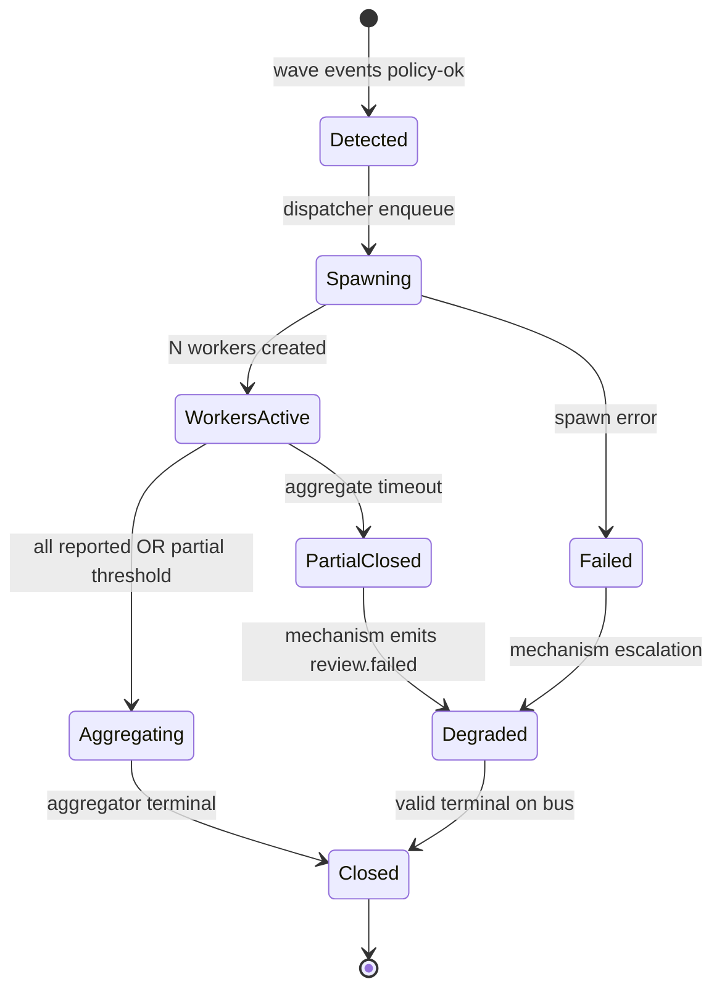
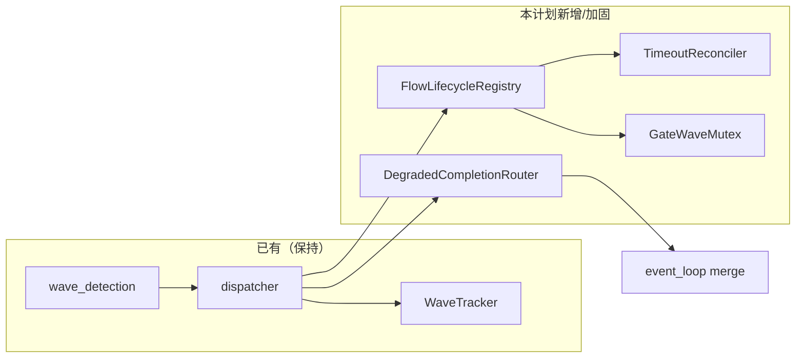

# feat: ce-executor Flow Reliability — 并行流程可靠性机制

## Overview

在 **不改变 operator 工作流** 的前提下，为 Ralph 建立 **Flow Reliability Mechanism（FRM）**：覆盖 wave 及未来 plan 并行单元的 **派发 → 等待 → partial → 聚合 → 受控降级 → 升级** 全链路。`ce-executor-isolated` review 链为验收夹具；机制 **topic-agnostic**，不写死 review topic 名。

与 `2026-06-16-002`（payload/schema 恢复）及 `2026-06-17-002`（step 交接）**正交、可并行**。本计划 **只增强、不削弱** 现有 isolated / U3 / U4 / WAC 行为。

## Problem Frame

archive 显示：agent emit **格式正确** 后，并行子流程仍常挂——0 worker spawn、`aggregate.timeout` 未生效、partial 结果被整批丢弃、`missing_event_gate` 与 wave 状态打架、synthesizer handoff 饿死、agent 在 timeout 压力下非法 bypass。

根因是 **缺少统一的 Flow Lifecycle 机制**，而非再调一个 timeout 数字。

### 已有基础（本计划扩展，不重写）

| 模块 | 路径 | 现状 |
|------|------|------|
| Wave 检测 / partial | `crates/ralph-core/src/wave_detection.rs` | `PartialWavePolicy::AllowPartial` 已存在 |
| Wave 派发 | `crates/ralph-cli/src/loop_runner/wave/dispatcher.rs` | `WaveDispatchOutcome::{Partial, AggregateDeadlineExceeded}` + recovery envelope |
| Wave 状态 | `crates/ralph-core/src/wave_tracker.rs` | `partial` 字段、`CompletedWave` |
| Aggregator 超时注入 | `crates/ralph-core/src/event_loop/mod.rs` | `inject_review_aggregate_timeouts` |
| missing_event 豁免 | `crates/ralph-cli/src/loop_runner/hard_gate.rs` + `tests.rs` | `should_gate_missing_events` 对 `review.wave.ready` 有部分逻辑 |
| Handoff SLA | `crates/ralph-core/src/workflow_contract/handoff_tracker.rs` | WAC-U6 已接入 event loop |
| Wave context | `crates/ralph-core/src/wave_context.rs` | synthesizer prompt 注入 |

**缺口**：生命周期不可观测、timeout 配置 vs 实际等待可对不上号、degraded 出口未成为 **唯一合法路径**、gate 与 wave pending 未完全互斥、stall 对 wave hat 无强制 escalation。

## Requirements Trace

| ID | 需求摘要 | 单元 |
|----|----------|------|
| R-A1 | Wave 生命周期状态可验证 | Unit 1 |
| R-A2 | Spawn 保证 | Unit 2 |
| R-A3 | Timeout 同源 + 诊断对账 | Unit 3 |
| R-A4 | Partial 机制化消费 | Unit 4 |
| R-A5 | 受控降级（Degraded Completion） | Unit 5 |
| R-A6 | missing_event_gate 与 wave 互斥 | Unit 6 |
| R-B1 | Aggregator handoff SLA | Unit 7 |
| R-C1–C2 | Stall 升级 + flow 上下文 envelope | Unit 8 |
| R-D1–D3 | topic-agnostic / flow_unit 扩展 | Unit 1, 5 |
| R-E1–E3 | BDD + replay + workspace nextest | Unit 9 |
| SC1–SC5 | 验收标准 | Unit 9 |

## Non-Regression Policy（强制）

> **用户要求：必须是增强，不得引入回归。** 下列规则对每个 Unit 生效。

1. **先锁行为再改代码**：每个 Unit 第一步是 **characterization test**（现有 scenario / 单测在当前 main 或集成分支上必须通过）；改完后同一测试仍绿或 **更严格**（更多断言），不得删除断言放宽门槛。
2. **默认行为保持**：新增配置项必须有 **默认值 = 当前生产行为**；未在 preset 声明 `workflow_contract.flow_reliability`（或等价块）时，仅启用 **bugfix 级** 路径（spawn 失败不静默、timeout 对账日志），不改变成功路径时序。
3. **不变式清单**（禁止破坏）：
   - U3 isolated 终态 authority（`publishes` 显式声明）
   - U4 fair scheduling（除已有 HandoffIndex **单消费者** 窄例外）
   - WAC payload 硬门（null reject、wave batch 校验）
   - `is_dual_publish_step_handoff`（`queue.advance`+`work.ready`）——属 step-handoff 计划，本计划 **不修改**
   - `review-coordinator` 不得发 `review.passed(skip_reason=aggregate_timeout)`（`event_policy.rs` 已有拒收，保持）
4. **CI 门禁**：每 Unit 合并前跑 `./scripts/run-tests.sh`（或等价 `cargo nextest run --workspace --exclude ralph-e2e` + `cargo test --doc`）；**额外**跑本计划列出的 scenario 子集。
5. **禁止的回退式修复**：不允许为绿测试而禁用 `missing_event_gate`、放宽 isolated scope、让 ralph hat 常规发 business terminal、或把 `RequireComplete` 默认改成无条件 `AllowPartial`。
6. **Replay 回归**：Unit 9 从 archive 事件片段构造 **最小 replay fixture**；合并后 fixture 输出必须与「增强后预期」一致，并 **显式断言** 旧失败模式（0 worker 死循环、1464s 无降级）不再出现。

## Scope Boundaries

- **覆盖**：wave 生命周期、spawn/timeout/partial/degraded、aggregator SLA、gate 互斥、wave stall 升级、诊断字段。
- **不覆盖**：Schema SSOT、全 hat payload 恢复、bootstrap 隔离（002）；`queue.advance→executor` step 桥接（017-002）；Web UI。
- **Deferred**：未来多 step 并行的首个 preset 拓扑设计（本计划仅预留 `flow_unit_id` 字段）。

## Key Technical Decisions

| 决策 | 理由 |
|------|------|
| **扩展 `WaveTracker` + 新 `FlowLifecycleRegistry`，不新建 crate** | 与现有 dispatcher 同进程；避免双状态源 |
| **Degraded 默认出口：`review.failed` + `skip_reason=aggregate_timeout`**（Q1  resolved） | preset 已有 `skip_reason` 枚举；`review.passed` 对 coordinator 已拒收 aggregate_timeout；synthesizer 发 `review.failed` 语义更干净 |
| **Partial 阈值：沿用 dispatcher 现有 staleness（80% `aggregate_timeout_secs`）**（Q2 resolved） | `wave_detection.rs` 已有注释；写测试锁定，不引入第二套阈值 |
| **Timeout 对账写 `recovery.jsonl` + optional `orchestration.jsonl` 字段** | 满足 SC4；不依赖新 UI |
| **`flow_unit_id` 首版 = `wave_id`**（Q3 deferred 最小实现） | 未来 plan 并行可再抽象；避免过度设计 |
| **Aggregator SLA 复用 `HandoffTracker` + 扩展 `PendingHandoff.flow_context`** | 与 WAC 一致；不第二套 30s 计时器 |

## High-Level Technical Design

> *Directional guidance for review, not code to copy.*

## Implementation Units

- [ ] **Unit 1: FlowLifecycleRegistry（可观测状态机）**

**Goal:** 每个并行单元（首版 `wave_id`）有可读生命周期状态；状态迁移写诊断。

**Requirements:** R-A1, R-D1, R-D2, R-C2

**Dependencies:** None

**Files:**
- Add: `crates/ralph-core/src/flow_lifecycle.rs`
- Modify: `crates/ralph-core/src/lib.rs`（export）
- Modify: `crates/ralph-cli/src/loop_runner/wave/dispatcher.rs`（状态钩子）
- Modify: `crates/ralph-core/src/event_loop/loop_state.rs`（`flow_lifecycle: FlowLifecycleRegistry`）
- Test: `crates/ralph-core/src/flow_lifecycle.rs`（`#[cfg(test)]`）
- Test: `crates/ralph-cli/src/loop_runner/wave/dispatcher.rs`（现有 wave 单测扩展）

**Approach:**
- 定义 `FlowPhase` 枚举：`Detected | Spawning | WorkersActive | Aggregating | Closed | PartialClosed | Failed`。
- `FlowLifecycleRecord` 字段：`flow_unit_id`（=wave_id）、`target_hat`、`wave_total`、`received_count`、`missing_indices`、`configured_aggregate_secs`、`configured_worker_secs`、`started_at`、`last_transition_at`、`phase`。
- 纯函数 API：`transition(record, event) -> Result`；dispatcher 在 `execute_wave` 入口/ spawn 后/ merge 后/ outcome 分支调用。
- 每次迁移调用 `write_flow_recovery_envelope`（复用 `recovery.jsonl` pattern，`source: flow_lifecycle`）。
- **Non-regression**：仅新增写盘；不改变 `WaveDispatchOutcome` 枚举语义。

**Test scenarios:**
- Happy path: 7-worker wave → 状态序列 `Detected→Spawning→WorkersActive→Closed`，`received_count=7`。
- Edge case: partial wave → 终态 `PartialClosed`，`missing_indices` 非空。
- Regression: 现有 `u3_partial_wave_creates_only_events_len_tasks` 仍绿。

**Verification:** `cargo nextest run -p ralph-core -- flow_lifecycle`；`cargo nextest run -p ralph-cli -- u3_partial_wave`。

---

- [ ] **Unit 2: Spawn 保证与失败显式化**

**Goal:** N 个合法 wave 事件 → 必须创建 N 个 worker 任务或显式 `spawn_failed`；禁止 0-worker 静默。

**Requirements:** R-A2, SC1

**Dependencies:** Unit 1

**Files:**
- Modify: `crates/ralph-cli/src/loop_runner/wave/dispatcher.rs`（`execute_wave_structured` spawn 路径）
- Modify: `crates/ralph-core/src/event_loop/mod.rs`（`enforce_wave_isolated_scope` 失败时写诊断）
- Test: `crates/ralph-cli/src/loop_runner/tests.rs`（spawn 计数）
- Test: 新 scenario `crates/ralph-core/tests/scenarios/flow_reliability/wave_spawn_guarantee.yml`

**Approach:**
- spawn 循环后断言 `spawned_count == wave.events.len()`；不等则 `FlowPhase::Failed`，写 `reason_code: wave_spawn_failed`，并 **仍** merge 已有 worker 结果（若有）。
- `enforce_wave_isolated_scope` 返回空时：写 `flow_lifecycle` envelope 指明 `isolated_hat` / `current_isolated_hat`，**不**假装 wave 已派发。
- 与 Unit 6 联动：spawn 成功即注册 `obligation_satisfied` 供 gate 查询。

**Test scenarios:**
- Happy path: 7 `review.wave.ready` → 7 worker event files 或 7 子进程记录。
- Error path: 模拟 isolated scope 拒绝 → `wave_spawn_failed` envelope，无 `missing_event_gate` 误触发（与 Unit 6 联合测）。
- Regression: `test_u1_partial_wave_dispatch` scenario 仍绿。

**Verification:** SC1 手动：worktree 跑 review wave，检查 `.ralph/diagnostics/*/recovery.jsonl` 无 0-spawn 静默。

---

- [ ] **Unit 3: Timeout 同源与对账（TimeoutReconciler）**

**Goal:** 配置 `aggregate.timeout` / worker `timeout` 与实际等待一致；偏差必须可诊断。

**Requirements:** R-A3, SC4

**Dependencies:** Unit 1

**Files:**
- Modify: `crates/ralph-core/src/wave_detection.rs`（`aggregate_timeout_secs` 文档化 + 单测）
- Modify: `crates/ralph-cli/src/loop_runner/wave/dispatcher.rs`（deadline 计算单一入口）
- Add: `crates/ralph-core/src/flow_lifecycle/timeout_reconciler.rs` 或 `flow_lifecycle.rs` 内模块
- Test: `crates/ralph-core/src/wave_detection.rs`（timeout 优先级链）
- Test: `crates/ralph-cli/src/loop_runner/wave/dispatcher.rs`（`aggregate_deadline` mock clock）

**Approach:**
- 单一函数 `effective_wave_deadlines(detected: &DetectedWave) -> WaveDeadlines { per_worker, aggregate }`，dispatcher **只**通过此函数取 deadline（消除散落 `unwrap_or(300)`）。
- wave 结束时写 envelope：`configured_aggregate_ms`、`actual_wait_ms`、`delta_ms`、`source_hat_aggregate`（来自 `review-synthesizer.aggregate.timeout`）。
- 若 `actual_wait_ms > configured_aggregate_ms * 1.1`（10% 容差），写 `outcome: escalated`，`reason_code: wave_timeout_drift`（**不终止 loop**，除非 Unit 8 升级触发）。
- 修复 archive 1464s 类 bug：若根因是 dispatcher 未用 `aggregate_timeout_secs()`，在此 Unit 修；修前必须有 failing test 用 **压缩时钟** 复现。

**Test scenarios:**
- Happy path: synthesizer `aggregate.timeout: 300` → mock 时钟 301s 触发 `AggregateDeadlineExceeded`，`actual≈301s`。
- Regression: 现有 `test_ce_executor_wave_synthesizer_aggregate_timeout`（presets.rs）仍绿。
- Edge case: worker hat 自带 `aggregate` 块时优先级高于 consumer 继承（`wave_detection.rs:65-79`）。

**Verification:** SC4：`ralph diagnose` JSON 含 `configured_aggregate_secs` vs `actual_wait_ms`。

---

- [ ] **Unit 4: Partial wave 消费加固**

**Goal:** partial 结果 **必须** 进入 aggregator；禁止整批 skip。

**Requirements:** R-A4, SC1

**Dependencies:** Unit 1, 3

**Files:**
- Modify: `crates/ralph-core/src/wave_detection.rs`（`AllowPartial` 路径）
- Modify: `crates/ralph-cli/src/loop_runner/wave/dispatcher.rs`（`WaveDispatchOutcome::Partial` merge）
- Modify: `crates/ralph-core/src/wave_context.rs`（`missing_dimensions`）
- Test: `crates/ralph-core/tests/scenarios/four-p0-guards/u1-partial-wave-dispatch.yml`（扩展断言）
- Test: 新 `flow_reliability/partial_wave_consumed.yml`

**Approach:**
- 确认 `WaveDispatchOutcome::Partial` 仍 merge `review.dimension.done` 到主 events（已有）；补断言 aggregator hat pending。
- `build_wave_context_for_synthesizer`：partial 时 `ALL_DIMENSIONS_RECEIVED=false`，列出 `missing_dimensions`。
- **禁止**回退 `RequireComplete` 为默认；`AllowPartial` 仅在 staleness 阈值到达后由 dispatcher 触发（保持现有语义）。

**Test scenarios:**
- Happy path: 7 维发 5 维回 → synthesizer 被激活，`wave_context.missing_dimensions` 含 2 项。
- Regression: `u3_partial_wave_does_not_activate_aggregator_until_full_set` 行为更新为「staleness 后激活」——**先改测试注释与阈值对齐，再改实现**，避免静默回归。

**Verification:** 36% 找回率场景：partial 结果出现在主 events，非 0。

---

- [ ] **Unit 5: DegradedCompletionRouter（受控降级）**

**Goal:** timeout / spawn 失败时，**机制** 触发合法 terminal，杜绝 coordinator 冒充 `review.passed(aggregate_timeout)`。

**Requirements:** R-A5, R-D2, SC2

**Dependencies:** Unit 3, 4

**Files:**
- Modify: `crates/ralph-core/src/event_loop/mod.rs`（`inject_review_aggregate_timeouts` 扩展）
- Add: `crates/ralph-core/src/flow_lifecycle/degraded_completion.rs`
- Modify: `presets/en/ce-executor-isolated.yml`（确认 `review-synthesizer` / `review-coordinator` `publishes` 含 `review.failed`）
- Test: `crates/ralph-core/src/event_policy.rs`（保持 coordinator 拒收）
- Test: 新 scenario `flow_reliability/aggregate_timeout_degraded.yml`

**Approach:**
- `DegradedCompletionRouter::emit_for_wave_timeout`：以 **review-synthesizer** hat provenance 发 `review.failed`，payload 含 `skip_reason: aggregate_timeout`、`wave_id`、`missing_dimensions`、`fix_round` 等 schema 必填字段。
- **禁止** ralph hat 注入 null `review.passed`；stall 路径改调 router（与 002 恢复链兼容：若 002 已落地，非法 emit 仍走 recoverable reject）。
- 路由使用 `Event::with_target(review-synthesizer)`（R5 源 hat 路由对齐）。
- 配置：`workflow_contract.degraded_completion.enabled: true`（默认 **true** for builtin ce-executor-isolated via preset；默认 **false** 全局 → 仅 builtin 显式开启，避免影响其他 preset）。

**Test scenarios:**
- Happy path: aggregate 超时 → 主 events 恰 1 条 `review.failed`（synthesizer），`skip_reason=aggregate_timeout`。
- Error path: coordinator 发 `review.passed(aggregate_timeout)` → 仍拒收（现有单测保持）。
- Regression: `inject_review_aggregate_timeouts` 现有单测绿。

**Verification:** SC2：压缩时钟下无法人 bypass 非法 terminal。

---

- [ ] **Unit 6: missing_event_gate ↔ wave 互斥（GateWaveMutex）**

**Goal:** wave 已写入且 lifecycle 未 closed 时，不触发 `missing_event_gate`。

**Requirements:** R-A6, SC3

**Dependencies:** Unit 1, 2

**Files:**
- Modify: `crates/ralph-cli/src/loop_runner/hard_gate.rs`（`should_gate_missing_events`）
- Modify: `crates/ralph-core/src/flow_lifecycle.rs`（`is_wave_obligation_pending(hat, topic)`）
- Test: `crates/ralph-cli/src/loop_runner/tests.rs`（`test_missing_event_hard_gate` 扩展）
- Test: replay fixture from `2026-06-13-review-wave-no-spawn` 片段

**Approach:**
- `should_gate_missing_events` 增加查询 `loop_state.flow_lifecycle`：若 `review-coordinator` + obligation `review.wave.ready` 且存在同 hat 最近写入的 wave batch 且 phase ∉ `{Closed, Failed, Degraded}` → return false。
- 保留「完全未 emit」的 gate 能力（executor 无 `work.done` 仍 gate）。
- archive P0-B「5 秒内有写入」可作为 **次要启发式**，但以 lifecycle 为准（避免时间竞态 flake）。

**Test scenarios:**
- Happy path: 7 wave 事件已写、workers pending → 不 gate。
- Happy path: 从未写 wave → 仍 gate（obligation 路径）。
- Regression: executor `work.done` gate 用例不变。

**Verification:** SC3：replay `review-wave-no-spawn` 不再出现 gate 死循环。

---

- [ ] **Unit 7: Aggregator handoff SLA（synthesizer）**

**Goal:** wave 结束后 synthesizer 在 30s 内被 dispatch；超时 escalation。

**Requirements:** R-B1, R-B2

**Dependencies:** Unit 4, 5

**Files:**
- Modify: `crates/ralph-core/src/workflow_contract/handoff_tracker.rs`
- Modify: `crates/ralph-core/src/event_loop/mod.rs`（`handoff_dispatch_timeout` 路径，~L4651）
- Modify: `crates/ralph-core/src/workflow_contract/handoff_index.rs`（确保 `review.dimension.done` → synthesizer 推导或 seed）
- Test: `crates/ralph-core/src/event_loop/tests/handoff_dispatch.rs`
- Test: `crates/ralph-cli/src/loop_runner/tests.rs`（HandoffTracker 扩展）

**Approach:**
- wave merge 完成（含 partial）时 `handoff_tracker.on_handoff_accepted(topic=review.dimension.done|synthetic, consumer=review-synthesizer)`。
- `expired()` → 写 `handoff_dispatch_timeout` + 触发 Unit 5 degraded router（**Final 前尝试**）。
- envelope 增加 R-C2 字段：`wave_id`, `wave_total`, `received_count`, `flow_phase: review`。

**Test scenarios:**
- Happy path: dimension.done 齐（或 partial）→ synthesizer activation < 30s（mock 时钟）。
- Error path: 故意 block synthesizer → escalation + degraded terminal，非无限 pending。

**Verification:** archive `handoff_dispatch_timeout` 堆积场景：outcome 最终 `escalated` 或 degraded，非 `pending`×N。

---

- [ ] **Unit 8: Wave stall 升级**

**Goal:** wave 相关 `stall_recovery` 连续 3 次 → Hard/Final。

**Requirements:** R-C1

**Dependencies:** Unit 5, 7

**Files:**
- Modify: `crates/ralph-core/src/event_loop/mod.rs`（stall_recovery 分支，~L2560）
- Modify: `crates/ralph-core/src/event_loop/loop_state.rs`（`stall_recovery_counts` 分桶 `flow:review-synthesizer`）
- Test: `crates/ralph-core/src/event_loop/tests/recovery_envelope_u7_u8.rs`

**Approach:**
- 对 `flow_phase=review` 或 hat ∈ `{review-coordinator, review-synthesizer, dimension-reviewer}` 使用独立 retry key。
- 第 3 次 `repeated` → Hard `task.resume` 带 wave_context；第 4 次 → Final degraded 或 `TerminationReason::FlowReliabilityExhausted`（新增，**仅** wave 路径）。
- **Non-regression**：非 wave hat 的 stall 计数器与 key 不变。

**Test scenarios:**
- Regression: 现有 stall_recovery 单测绿。
- New: 3× stall on synthesizer → degraded emit。

---

- [ ] **Unit 9: BDD、Replay、全量回归与文档**

**Goal:** 锁定增强行为；证明无回归。

**Requirements:** R-E1–E3, SC1–SC5

**Dependencies:** Units 1–8

**Files:**
- Add: `crates/ralph-core/tests/scenarios/flow_reliability/*.yml`（≥5）
- Add: `crates/ralph-core/tests/fixtures/flow_reliability/`（replay JSONL 片段）
- Modify: `docs/guide/runtime-diagnosis.md`（`flow_lifecycle` envelope 字段一段）
- Optional: `crates/ralph-cli/src/commands/diagnose.rs`（展示 flow 字段）

**Approach:**
- Scenarios：`wave_spawn_guarantee`、`partial_wave_consumed`、`aggregate_timeout_degraded`、`gate_wave_mutex`、`synthesizer_handoff_sla`。
- Replay：从 archive 提取匿名化 JSONL（`2026-06-13`、`2026-06-15`），smoke_runner 或 scenario player 回放。
- **合并门禁**：`./scripts/run-tests.sh` + `ralph preset check --strict -H builtin:ce-executor-isolated`。

**Test scenarios:**
- Integration: 5 新 scenario 全绿。
- Regression: `four-p0-guards/*`、`plan_gate_dual_publish_handoff.yml`、`scenarios.rs` WAC 测试全绿。
- Regression: `cargo nextest run -p ralph-cli -- test_missing_event` 全绿。

**Verification:** 全部 SC1–SC5。

## System-Wide Impact

- **Interaction graph:** `wave_detection` → `dispatcher` → `FlowLifecycleRegistry` → `recovery.jsonl` / `ralph diagnose`；`degraded_completion` → `event_bus` → `plan-gate`（step-handoff 计划接续）。
- **与 002 交界：** 非法 payload 仍优先走 002 recoverable 链；本计划 degraded emit 必须是 **schema-valid** 事件。
- **与 017-002 交界：** `review.failed` 到达 plan-gate 需 002 的 trigger 闭包（017-002 Unit 1 修 preset）。
- **Unchanged invariants:** 见 Non-Regression Policy §3。

## Risks & Dependencies

| Risk | Mitigation |
|------|------------|
| Partial 默认化导致 review 质量下降 | 仅 staleness 后 AllowPartial；full wave 仍优先 |
| Degraded 与 agent 真 `review.failed` 混淆 | envelope 标 `mechanism_emitted: true` |
| 时钟测试 flake | 全用 mock `Instant` / injectable clock |
| 与 002/017-002 合并冲突 | 约定文件所有权：本计划主改 `wave/*`、`flow_lifecycle*` |
| 性能：每 wave 多写 recovery 行 | 合并同 wave 迁移为单行 diff 更新（可选优化） |

## Phased Delivery

| Phase | Units | 说明 |
|-------|-------|------|
| 1 | 1, 3 | 可观测 + timeout 对账（低风险） |
| 2 | 2, 6 | spawn + gate 互斥（解 P0 死循环） |
| 3 | 4, 5, 7 | partial + degraded + synthesizer SLA |
| 4 | 8, 9 | 升级 + 全量回归 |

可与 `2026-06-16-002`、`2026-06-17-002` **并行**；建议 Phase 4 在三者均 merge 后做联合 E2E。

## Sources & References

- **Origin:** [docs/brainstorms/2026-06-17-ce-executor-flow-reliability-requirements.md](docs/brainstorms/2026-06-17-ce-executor-flow-reliability-requirements.md)
- **Archive:** [docs/achieved/report/2026-06-13-review-wave-no-spawn.md](docs/achieved/report/2026-06-13-review-wave-no-spawn.md), [docs/achieved/report/2026-06-15-ce-executor-isolated-review-passed-aggregate-timeout-loop-death.md](docs/achieved/report/2026-06-15-ce-executor-isolated-review-passed-aggregate-timeout-loop-death.md)
- **Code:** `crates/ralph-cli/src/loop_runner/wave/dispatcher.rs`, `crates/ralph-core/src/wave_detection.rs`, `crates/ralph-core/src/wave_tracker.rs`, `crates/ralph-core/src/event_loop/mod.rs`
