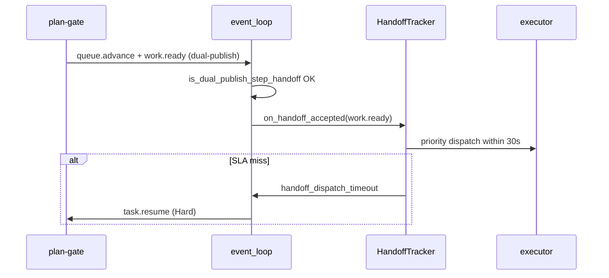
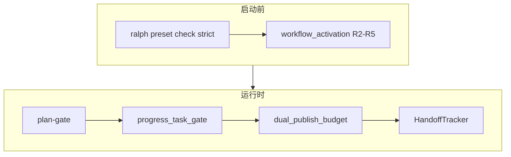

# feat: ce-executor Step Handoff — 阶段交接机制

## Overview

建立 **Step Handoff Mechanism（SHM）**：多步 plan 在阶段边界（`work.done` → review → `queue.advance` → `work.ready` → executor）的 **静态可证 + 运行时 SLA + 磁盘状态一致 + payload 硬门**。承接 WAC（`2026-06-12-002` / `003`）未完全闭合的 handoff 子集，并吸收 `2026-06-15` dual-publish isolated budget 教训。

与 `2026-06-16-002`（payload 恢复）、`2026-06-17-001`（wave 内并行）**正交、可并行**。本计划 **只增强、不削弱** 现有 WAC / U3 / U4 / isolated budget 行为。

## Problem Frame

archive dispatch-gap：`plan-gate` 发 `queue.advance` 后 executor **10 分钟**未启动；ralph 兜底 re-emit 被拒；最终 `loop.cancel`。后续 `2026-06-15`：preset 双发 `queue.advance`+`work.ready` 仍被 isolated 单轮 business-event 预算打掉 `work.ready`。

### 已有基础（扩展，不重写）

| 能力 | 路径 | 现状 |
|------|------|------|
| WAC 静态规则 | `crates/ralph-core/src/preset_lint/workflow_activation.rs` | re-emit trap、handoff pairing 等 |
| HandoffIndex | `crates/ralph-core/src/workflow_contract/handoff_index.rs` | 单消费者 priority |
| HandoffTracker | `crates/ralph-core/src/workflow_contract/handoff_tracker.rs` | 30s SLA + escalation |
| Dual-publish carve-out | `crates/ralph-core/src/event_loop/mod.rs` ~L5723 | `is_dual_publish_step_handoff` |
| plan-gate 双发 preset | `presets/en/ce-executor-isolated.yml` ~L1559 | `publishes: [queue.advance, work.ready, ...]` |
| Synth terminal gate | `crates/ralph-core/src/event_loop/review_step_state.rs` | null `review.passed` 不置 terminal |
| Verdict gate | `presets/en/ce-executor-isolated.yml` `verdict_gate.additional_topics` | 含 `report.done` |
| BDD | `crates/ralph-core/tests/scenarios/plan_gate_dual_publish_handoff.yml` | dual-publish 验收 |

### 仍缺 / 被击穿

- `plan-gate.triggers` **缺** `fix.exhausted`、`debug.exhausted`（`2026-06-09`）
- HandoffTracker escalation 在真实 multi-step run 仍可能 `pending`（multi-run 报告）
- **Progress ↔ tasks** 无机制硬门（agent 可漂移）
- null payload handoff 依赖分散逻辑，需与 002 SSOT 验收闭环
- Tier-0 WAC strict 需 **再验证** preset 变更后仍零 error

## Requirements Trace

| ID | 需求摘要 | 单元 |
|----|----------|------|
| R-A1–R-A5 | 静态 Step Handoff Contract | Unit 1 |
| R-B1–R-B4 | 运行时 handoff dispatch | Unit 2, 3 |
| R-C1 | Progress–Task 硬门 | Unit 4 |
| R-C2 | Synth terminal gate | Unit 5 |
| R-C3 | Verdict 闭包 | Unit 6 |
| R-D1–R-D3 | Handoff payload 硬门 + SSOT 验收 | Unit 5, 7 |
| R-E1–R-E2 | Preset 同步 | Unit 1 |
| R-F1–R-F4 | 验收 | Unit 8 |
| SC1–SC5 | 成功标准 | Unit 8 |

## Non-Regression Policy（强制）

1. **WAC 基线不得回退**：`cargo nextest run -p ralph-core -- workflow_activation` 及 `scenarios.rs` 中 WAC 测试 **始终绿**；本计划只 **增加** finding 或 **收紧** preset，不删除规则。
2. **Dual-publish 回归对**：任何改动 `is_dual_publish_step_handoff` 或 isolated budget 时，**同时**跑：
   - `plan_gate_dual_publish_handoff.yml`（必须通过）
   - `isolated_boundary_violation` scenario（第三 business event 仍拒）
3. **禁止隐式桥接**：不实现 `queue.advance` → 自动 `work.ready`；不扩展 `RALPH_CONTROL_TOPICS`（dispatch-gap anti-pattern）。
4. **Handoff priority 窄域**：仅 `HandoffIndex::is_priority_dispatchable()` 为 true 的 topic 走优先 dispatch；多消费者 topic 仍 U4 round-robin。
5. **Preset 变更可回滚**：`presets/en` + `zh` + `manifest` + `presets.rs` 四同步；`ralph preset check --strict -H builtin:ce-executor-isolated` 为合并门禁。
6. **默认不破坏其他 builtin**：WAC strict error **仅** Tier-0（`ce-executor-isolated` en/zh）；其他 builtin 仍 warn（WRC-09）。
7. **每 Unit 前跑** `./scripts/run-tests.sh` 子集 + 全量在 Unit 8。

## Scope Boundaries

- **覆盖**：静态 contract 收尾、preset 触发器闭包、handoff SLA 加固、progress/tasks 门、payload/verdict 硬门、multi-step E2E。
- **不覆盖**：wave spawn/partial/degraded（017-001）；Schema SSOT 实现（002）；bootstrap 隔离（002）。
- **Deferred**：用户自定义 preset 默认 strict（Q3：维持 builtin-only strict）。

## Key Technical Decisions

| 决策 | 理由 |
|------|------|
| **承接 WAC 003，不 fork 第二套 contract** | 代码已在 `workflow_activation.rs` |
| **Progress–Task 门放在 event_loop pre-handoff 钩子**（Q1 resolved） | 比纯 agent 自检可靠；比 preflight 更贴近运行时；`plan.blocked` 可路由 plan-gate |
| **Handoff SLA 超时 → Responder Hard：`task.resume` to plan-gate**（Q2 resolved） | 比直接 terminate 更可恢复；比 silent pending 强 |
| **`fix.exhausted` / `debug.exhausted` 仅加 trigger，不改拓扑** | 最小 preset diff |
| **与 002 集成：handoff null reject 后走 recoverable 链（若 002 已 merge）** | 单恢复语义 |

## High-Level Technical Design

## Implementation Units

- [ ] **Unit 1: Tier-0 WAC 闭包与 preset 触发器修补**

**Goal:** `ce-executor-isolated` strict WAC 零 error；补全 plan-gate triggers / 验证 handoff pairing。

**Requirements:** R-A1–R-A5, R-E1, SC2

**Dependencies:** None

**Files:**
- Modify: `presets/en/ce-executor-isolated.yml`（`plan-gate.triggers` 增加 `fix.exhausted`, `debug.exhausted`）
- Modify: `presets/zh/ce-executor-isolated-zh.yml`（镜像）
- Modify: `crates/ralph-cli/src/presets.rs`（KTD 测试：plan-gate triggers 闭包）
- Test: `crates/ralph-core/tests/scenarios.rs`（`test_workflow_activation_contract_*`）
- Test: `scripts/validate-builtin-presets.sh`（Tier-0 strict）

**Approach:**
- `plan-gate.triggers` 追加：`fix.exhausted`, `debug.exhausted`（保留现有 5 项）。
- instructions 补 3–5 行：收到 `fix.exhausted` / `debug.exhausted` 时发 `queue.advance`+`work.ready` 或 `plan.complete` / `plan.blocked`（与 `debug.exhausted` 路径一致）。
- 跑 `run_workflow_activation_contract(config, strict=true)` 确认零 `preset.re_emit_trap` / handoff pairing error。
- **验证** `coordinator_hats` 已含 plan-gate/fixer/…（当前 preset 已齐，加回归测试防漂移）。

**Test scenarios:**
- Happy path: `ralph preset check --strict -H builtin:ce-executor-isolated` exit 0。
- Happy path: 篡改 executor+queue.advance trap → strict check fail（AE1 回归）。
- Regression: `test_workflow_activation_contract_step_advance_handoff_chain` 仍绿。

**Verification:** SC2 零 finding。

---

- [ ] **Unit 2: HandoffTracker 运行时加固与 priority dispatch 验收**

**Goal:** `work.ready` handoff 后 executor **30s 内** activation；超时 Hard escalation。

**Requirements:** R-B1, R-B2, R-B4, SC1

**Dependencies:** Unit 1

**Files:**
- Modify: `crates/ralph-core/src/workflow_contract/handoff_tracker.rs`
- Modify: `crates/ralph-core/src/event_loop/mod.rs`（`on_handoff_accepted` / `expired` / hat 选择 priority pass）
- Modify: `crates/ralph-proto/src/event_bus.rs`（若 priority 选择在此，验证单测）
- Test: `crates/ralph-core/src/event_loop/tests/handoff_dispatch.rs`
- Test: `crates/ralph-cli/src/loop_runner/tests.rs`（HandoffTracker integration）

**Approach:**
- 确认 `work.ready` 在 HandoffIndex 中 `consumer=executor` 且 `is_priority_dispatchable`。
- `queue.advance` **不**进入 priority（KTD-WRC-5 / KTD-12：audit only）。
- `HandoffTracker::expired` → 写 recovery `handoff_dispatch_timeout` + inject `task.resume` **target=executor**（或 plan-gate 若 work.ready 从未发出——区分 reason）。
- Escalation 档位：1–2 次 `repeated` → Soft（已有）；3 次 → Hard resume；4 次 → `plan.blocked` 机制 emit（**非** loop.cancel）。
- **Non-regression**: `test_workflow_activation_contract_handoff_priority_dispatch` 仍绿。

**Test scenarios:**
- Happy path: `work.ready` publish → mock 时钟 29s 内 executor selected。
- Error path: 31s 无 activation → recovery envelope + `task.resume`。
- Regression: 多消费者 topic 不走 priority（AE5）。

**Verification:** SC1 p95 < 30s（scenario 或 integration mock）。

---

- [ ] **Unit 3: Dual-publish isolated budget 回归加固**

**Goal:** `queue.advance` + `work.ready` 同轮双发稳定；第三 business event 仍拒。

**Requirements:** R-B3, R-F4

**Dependencies:** Unit 1

**Files:**
- Modify: `crates/ralph-core/src/event_loop/mod.rs`（`is_dual_publish_step_handoff` 注释与边界）
- Test: `crates/ralph-core/tests/scenarios/plan_gate_dual_publish_handoff.yml`
- Test: isolated boundary scenario（与 2026-06-15-003 同名或 `four-p0-guards` 下）

**Approach:**
- 审阅 `is_dual_publish_step_handoff`：仅当 **同一 hat 同一轮**、**有序**、`queue.advance` 后接 `work.ready`。
- 增加负例单测：`(work.ready, queue.advance)` 逆序 → 第二项拒；`(queue.advance, work.ready, work.done)` → 第三项拒。
- 不改 per-turn budget 默认值（仍为 1 business + carve-out）。

**Test scenarios:**
- Happy path: dual-publish scenario YAML 绿。
- Error path: 第三 business event → `event.isolation.boundary_violation`。
- Regression: `2026-06-15` 复现 fixture（若已有）仍通过。

**Verification:** R-F4 双 scenario 绿。

---

- [ ] **Unit 4: Progress–Task 硬门（pre-handoff gate）**

**Goal:** `queue.advance` / `plan.complete` 前，progress.md 与 tasks.jsonl 一致；否则 `plan.blocked`。

**Requirements:** R-C1, R-F3, SC1

**Dependencies:** Unit 1

**Files:**
- Add: `crates/ralph-core/src/step_handoff/progress_task_gate.rs`
- Modify: `crates/ralph-core/src/event_loop/mod.rs`（在 policy accept 前或 `queue.advance`/`plan.complete` 专用钩子里调用）
- Modify: `crates/ralph-core/src/lib.rs`
- Test: `crates/ralph-core/src/step_handoff/progress_task_gate.rs`
- Test: 新 scenario `step_handoff/progress_task_mismatch.yml`

**Approach:**
- 纯函数 `check_progress_task_alignment(step, task_id, workspace) -> Result<(), MismatchReason>`：
  - 读 `.ralph/agent/progress.md` Current Step / Completed Steps（简单解析，与 preset instructions 字段对齐）
  - 读 `tasks.jsonl` 中 `task_id` status
  - 规则：若 task `closed` 但 progress 未标 completed → mismatch；若 event `step` 与 progress Current 冲突 → mismatch
- mismatch → **Reject** publish，inject `plan.blocked`（plan-gate provenance）reason 含具体字段。
- **配置**：`workflow_contract.step_handoff.progress_task_gate: true`；builtin `ce-executor-isolated` preset 显式 `true`；默认 `false`（non-regression for other presets）。
- 不替代 agent 写 progress；只在 **推进类** topic 上硬门。

**Test scenarios:**
- Happy path: task closed + progress 一致 → `queue.advance` accept。
- Error path: task closed + progress in_progress → `plan.blocked`，loop 不挂。
- Regression: 无关 topic（`review.dimension.done`）不触发 gate。

**Verification:** SC1 multi-step 无 progress 漂移导致的 silent stall。

---

- [ ] **Unit 5: Synth terminal + handoff payload 硬门统一**

**Goal:** null handoff terminal 拒收；synth terminal 仅 full payload；与 002 SSOT 验收对齐。

**Requirements:** R-C2, R-D1, R-D2, SC3

**Dependencies:** Unit 1；**软依赖** 002 Unit 1（SSOT 验收）

**Files:**
- Modify: `crates/ralph-core/src/event_policy.rs`（确认 null reject topic 列表含 handoff 集）
- Modify: `crates/ralph-core/src/event_loop/review_step_state.rs`（synth_terminal 单测加固）
- Modify: `crates/ralph-core/src/event_loop/mod.rs`（`apply_event_policy_validation` 与 review_step_state 顺序）
- Test: `crates/ralph-core/tests/scenarios.rs`（`test_workflow_activation_contract_null_payload_rejected`）
- Test: 新 `step_handoff/null_review_passed_blocked.yml`

**Approach:**
- 确认 R10 topic 列表包含：`queue.advance`, `work.ready`, `work.done`, `review.passed`, `review.complete`, `plan.complete`, `plan.blocked`。
- `review.passed` null → 不进入主 events；不置 `synth_terminal`；plan-gate 不被假阳性触发。
- string→object normalize 保持（WAC R11）。
- 若 002 已 merge：recoverable reject 走统一 `task.resume`；否则维持现有 Reject 行为（**不放宽**）。

**Test scenarios:**
- Happy path: full payload `review.passed` → synth_terminal set → `queue.advance` 可发。
- Error path: null `review.passed` ×3 → 主 events 0 条；recovery 有记录。
- Regression: dispatch-gap events #17–19 类 fixture replay 不推进 plan-gate。

**Verification:** SC3 主 events null 计数 0。

---

- [ ] **Unit 6: Verdict gate 闭包验证与加固**

**Goal:** REVIEW_COMPLETE fail 时 `report.done` / `LOOP_COMPLETE` 均被挡。

**Requirements:** R-C3

**Dependencies:** None（preset 已有 `additional_topics`）

**Files:**
- Modify: `crates/ralph-core/src/event_loop/mod.rs`（verdict_gate 实现 ~L1401）
- Modify: `presets/en/ce-executor-isolated.yml`（reporter `conditional_forbid_topics` 若需对齐）
- Test: `crates/ralph-core/src/event_loop/tests/`（新增 verdict_gate_report_done.rs 或扩展现有）
- Test: scenario `step_handoff/verdict_gate_fail_blocks_report.yml`

**Approach:**
- 读现有 `verdict_gate`：确认对 `report.done` 检查 `pass_or_fail`（preset 已声明 `additional_topics`）。
- 补单测：先 `REVIEW_COMPLETE` fail → reporter 发 `report.done` pass_or_fail=fail → gate reject LOOP_COMPLETE；发 `report.done` 假 pass → 若 payload 与 REVIEW_COMPLETE 不一致则拒。
- **Non-regression**：pass 路径 LOOP_COMPLETE 仍允许。

**Test scenarios:**
- Happy path: REVIEW_COMPLETE pass → report.done → LOOP_COMPLETE OK。
- Error path: REVIEW_COMPLETE fail → LOOP_COMPLETE blocked。
- Error path: REVIEW_COMPLETE fail → report.done with fail → LOOP_COMPLETE blocked。

**Verification:** `2026-06-09` gentle-orchid 类假成功不再出现。

---

- [ ] **Unit 7: Handoff topic SSOT 四消费链验收（002 集成点）**

**Goal:** handoff topic 在 prompt / precheck / loop / drift 同源（002 R-A3 在 handoff 子集的证明）。

**Requirements:** R-D3

**Dependencies:** 002 Unit 1（若未 merge，本单元 **仅** 跑现有 inline schema 基线并标记 follow-up）

**Files:**
- Test: `crates/ralph-cli/tests/policy_check_handoff.rs`（或扩展现有）
- Test: `crates/ralph-core/src/emit_schema_hint.rs`（handoff fix_hint）
- Doc: 本计划 Verification 段记录四链抽样命令

**Approach:**
- 对 `work.ready`, `queue.advance`, `work.done`, `review.passed` 抽样：改 SSOT 必填字段 → rebuild → 四处同步变化。
- `ralph emit --dry-run` / precheck 与 loop gate 同拒同一字段。
- **不改** SSOT 实现（归属 002）。

**Test scenarios:**
- Integration: SSOT 增字段 → 四链一致（002 SC3 子集）。

**Verification:** 002 merge 后本单元绿；未 merge 时 skip 标记 CI optional。

---

- [ ] **Unit 8: Multi-step E2E、BDD 与全量回归**

**Goal:** U1→U2 推进 <30s；fix/debug exhausted 路径；全 workspace 无回归。

**Requirements:** R-F1–R-F4, SC1–SC5, R-E2

**Dependencies:** Units 1–7

**Files:**
- Add: `crates/ralph-core/tests/scenarios/step_handoff/*.yml`（≥4）
- Modify: `crates/ralph-cli/src/presets.rs`（E2E 拓扑测试）
- Modify: `scripts/ralph-zsh-plugin.zsh`（若 preset 描述变更）

**Scenarios（最小集）:**
1. `step_advance_u1_to_u2.yml` — `queue.advance`+`work.ready` → executor <30s
2. `fix_exhausted_reaches_plan_gate.yml`
3. `debug_exhausted_reaches_plan_gate.yml`
4. `progress_task_mismatch.yml`（Unit 4）
5. `verdict_gate_fail_blocks_report.yml`（Unit 6）

**Approach:**
- 复用 `2026-06-10-003` plan 结构作 fixture prompt/plan.md（不跑 live LLM；scenario player 注入 events）。
- 合并门禁：`./scripts/run-tests.sh` + `ralph preset check --strict` + 017-001 scenario 子集（无冲突部分）。

**Test scenarios:**
- Integration: 5 scenario 绿。
- Regression: WAC、dual-publish、wave partial（017-001）、002 recovery（若已 merge）全绿。

**Verification:** 全部 SC1–SC5。

## System-Wide Impact

- **与 017-001 交界：** `review.failed`（含 mechanism degraded）必须触发 plan-gate（Unit 1 triggers）；`review.passed` 仍走 synth gate。
- **与 002 交界：** handoff payload 恢复统一；SSOT 四链在 Unit 7 验收。
- **Interaction graph:** `preset_lint/WAC` → startup；`plan-gate` dual-publish → `is_dual_publish_step_handoff` → `HandoffTracker` → executor；`progress_task_gate` → `plan.blocked`。
- **Unchanged:** U4 全局 fair scheduling；ralph hat control topics；executor 不 publish `queue.advance`。

## Risks & Dependencies

| Risk | Mitigation |
|------|------------|
| Progress 解析脆弱 | 窄字段（Current Step / Completed Steps）；测 fixture 覆盖 |
| plan-gate 触发器增多导致误激活 | 每 trigger 写 obligation / instructions 分支；scenario 覆盖 |
| 与 002 merge 冲突 | 约定：`event_policy` 大改在 002；本计划只加 gate 钩子 |
| Handoff Hard resume 循环 | 3 次上限 + plan.blocked Final |
| Tier-0 strict 阻断 CI | Unit 1 先修 preset 再启 strict |

## Phased Delivery

| Phase | Units | 说明 |
|-------|-------|------|
| 1 | 1, 3 | preset + dual-publish（低风险、高价值） |
| 2 | 2, 5 | handoff SLA + payload 硬门 |
| 3 | 4, 6 | progress/tasks + verdict |
| 4 | 7, 8 | SSOT 集成验收 + E2E |

可与 002、017-001 并行；**Phase 4** 建议三计划均 merge 后跑 `2026-06-10-003` 全 plan。

## Documentation / Operational Notes

- Operator 工作流不变。
- `docs/solutions/integration-issues/ce-executor-isolated-preset-dispatch-gap-plan-gate-executor-2026-06-12.md` 顶部可加「已由 017-002 机制闭合」注记（Unit 8 可选）。
- `docs/guide/runtime-diagnosis.md` 补 `handoff_dispatch_timeout` / `progress_task_mismatch` 排查一句（若尚无）。

## Sources & References

- **Origin:** [docs/brainstorms/2026-06-17-ce-executor-step-handoff-requirements.md](docs/brainstorms/2026-06-17-ce-executor-step-handoff-requirements.md)
- **WAC:** [docs/achieved/plan/2026-06-12-002-feat-workflow-activation-contract-plan.md](docs/achieved/plan/2026-06-12-002-feat-workflow-activation-contract-plan.md), [docs/achieved/plan/2026-06-12-003-feat-wac-rollout-completion-plan.md](docs/achieved/plan/2026-06-12-003-feat-wac-rollout-completion-plan.md)
- **Dispatch gap:** [docs/solutions/integration-issues/ce-executor-isolated-preset-dispatch-gap-plan-gate-executor-2026-06-12.md](docs/solutions/integration-issues/ce-executor-isolated-preset-dispatch-gap-plan-gate-executor-2026-06-12.md)
- **Code:** `crates/ralph-core/src/workflow_contract/`, `crates/ralph-core/src/event_loop/mod.rs`, `presets/en/ce-executor-isolated.yml`
