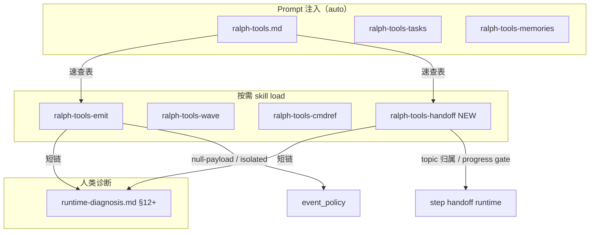

## Summary

同步 `crates/ralph-core/data` 内置 agent skill 与当前运行时：通用层修正 emit/policy/`task.resume` 参考与行号漂移；新增按需 `ralph-tools-handoff` skill 覆盖 ce-executor step handoff；扩展 `docs/guide/runtime-diagnosis.md` 决策树并由 data skill 短链引用。

---

## Problem Frame

Loop 内 agent 依赖编译进二进制的 `ralph-tools*.md` 作为 CLI 权威参考。step handoff（9 个 null-payload topic、progress gate、multi-consumer 路由）已落地，但 data 文档未跟进，导致 emit 失败与 `task.resume` 修复路径不可观察（见 `docs/code-review-2026-06-17-002.md` finding #19）。同时 `ralph-tools.md` 源码行号已漂（`event_loop/mod.rs:910-930` vs 实际 `4855-4896`）。

上游 brainstorm 要求：**通用参考不写 ce-executor 特制**；handoff 复杂编排进独立 skill；诊断深度留在 guide。

---

## Requirements

本计划追溯 brainstorm R1–R14、SC1–SC4、F1–F3、AE1–AE5。

| ID | 摘要 |
|----|------|
| R1 | 审计修正 data 内所有 `*.rs:NN` 行号引用 |
| R2 | `ralph-tools-emit.md` 列出 `NULL_PAYLOAD_REJECT_TOPICS`（9 topic）及 `--policy-check` 关系 |
| R3 | 通用 `task.resume` 修复表；ce-executor reason 一行摘要 → handoff skill |
| R4 | isolated `publishes` 越权规则（跨 preset 通用表述） |
| R5 | `--help` 冒烟，参数表与 clap 一致 |
| R6–R9 | 新建 `ralph-tools-handoff.md`、注册、速查表、修复步骤+校验命令 |
| R10–R12 | 扩展 `runtime-diagnosis.md` 决策树；data skill 短链；guide 行号复核 |
| R13–R14 | `.claude/skills` symlink；tasks/memories/cmdref 仅冲突时触达 |

---

## Key Technical Decisions

- **KTD1 — 三层文档分工不变**（see origin）：`ralph-tools-emit` = 跨 preset 通用；`ralph-tools-handoff` = ce-executor step 链；`runtime-diagnosis.md` = 人类/diagnose 深度排查。Preset YAML instructions 仍是 hat 行为 SSOT，不复制进 skill。
- **KTD2 — handoff skill 仅按需加载**（see origin U5 先例）：不修改 `event_loop` 注入白名单；`ralph-tools.md` 速查表为 discovery SSOT。
- **KTD3 — 不 patch ce-executor preset instructions**（resolve OQ1）：不在 `presets/en/ce-executor-isolated.yml` 各 hat 内嵌「load handoff skill」段落，避免 token 膨胀与 preset/skill 双维护。Agent 通过已注入的 `ralph-tools.md` 速查表发现 handoff skill。
- **KTD4 — 新建 `.claude/skills/ralph-tools-handoff/SKILL.md` symlink**（resolve OQ2）：对齐 `ralph-tools-emit` / `ralph-tools-wave` 模式，指向 `crates/ralph-core/data/ralph-tools-handoff.md`。
- **KTD5 — 显式文档化 policy-check 边界**：`ralph emit --policy-check` 覆盖 event policy schema/null-payload，**不**预检 U4 `progress_task_gate`（code review #21，scope 外实现）。文档须写明，避免 agent 误判「预检通过 = loop 必接受」。
- **KTD6 — handoff payload 字段以 SSOT 推导，不写死 JSON**：topic 必需字段引用 `presets/schemas/ce-executor-isolated.yml` + `policy_check_handoff.rs` 四链测试所验证的列表；文档写「常见缺失字段」+ `ralph emit --policy-check` 预检，不维护完整 schema 副本（see origin Scope Boundaries）。
- **KTD7 — 交付验证双轨**：`sed` 行号反向验证（CLAUDE.md 硬规则）+ `scripts/check-cli-doc-drift.sh`（`--help` 对齐）；本轮不建 CI 扩展（origin deferred）。

---

## High-Level Technical Design



**Agent 修复路径（F1）**：emit 失败 → 读 emit skill 通用表 → `--policy-check` 重试 → 若 handoff reason → `skill load ralph-tools-handoff` → 执行 handoff 表 → 仍不明 → 跟随短链到 guide + `ralph diagnose`。

---

## Implementation Units

### U1. 行号审计与 `ralph-tools.md` 修正

**Goal:** 消除已知漂移，建立可重复的 `sed` 审计清单（R1，部分 R5）。

**Requirements:** R1, R5, SC2

**Dependencies:** 无

**Files:**
- `crates/ralph-core/data/ralph-tools.md`
- `crates/ralph-core/data/ralph-tools-wave.md`（若 wave.rs 引用需复核）

**Approach:**
1. `grep -n '\.rs:[0-9]' crates/ralph-core/data/*.md` 列出全部引用。
2. 逐条 `sed -n` 复核，重点修正：
   - `event_loop/mod.rs` → `inject_memories_and_tools_skill` 内 ralph-tools 注入（约 4855–4896）
   - `hats.rs` → `validate_hats` 或实际 strict lint 入口
   - `skill_cli.rs` → `RALPH_CURRENT_HAT` 检查
   - `emit_path.rs` → events allowlist 解析
   - `wave.rs` → wave worker emit 路径
3. 保持 `ralph-tools.md` ≤200 行（CI guard）；速查表变更留到 U4。

**Patterns to follow:** `docs/achieved/report/2026-06-09-ce-executor-feat-managed-agent-doc-blocks-plan-1315-report.md` 行号修正先例；CLAUDE.md 反向验证段落。

**Test scenarios:**
- Covers AE1. **Given** 修正前 `mod.rs:910-930` 引用 **When** `sed -n '4855,4896p' event_loop/mod.rs` **Then** 文档行号覆盖该函数体。
- **Happy path:** 所有 data 文件 `*.rs:` 引用经人工 sed 清单勾选为零漂移。
- **Edge case:** 引用改为「函数名 + 文件路径」若行号过于脆弱（可选，仅当 sed 后仍易漂）。

**Verification:** 维护者完成 sed 勾选表；`wc -l ralph-tools.md` ≤200。

---

### U2. 扩展 `ralph-tools-emit.md` 通用层

**Goal:** 所有 preset 共用的 null-payload、task.resume、isolated 规则与 policy-check 边界（R2–R4，R5，R11 一半）。

**Requirements:** R2, R3, R4, R5, SC1, SC3, AE2, AE5

**Dependencies:** U1（行号若 emit 文档引用 base skill 段落）

**Files:**
- `crates/ralph-core/data/ralph-tools-emit.md`

**Approach:**
1. 新增 **Null-payload 硬门** 小节：9 topic 列表（SSOT：`event_policy.rs` `NULL_PAYLOAD_REJECT_TOPICS`）；说明空字符串/`""` 与 `-j` 空对象区别；与 `--policy-check` 关系。
2. 新增 **通用 task.resume 修复表**（markdown 表）：

   | Reason / violation | 检查 | 修复 | 验证 |
   |---|---|---|---|
   | `missing_required_field` | payload 缺 schema 字段 | 补字段后重 emit | `ralph emit --policy-check -j ...` |
   | `payload_contract_violation` | preset schema | 对齐 schema | 同上 |
   | isolated 越权 topic | 当前 hat `publishes` | 换 topic 或换 hat | `ralph hats list` |
   | `policy check failed` | CLI stderr | 读 validation_errors | `--help` |
   | `progress_task_mismatch` 等 handoff | — | **详见 `ralph-tools-handoff`** | `skill load` |

3. 强化 isolated 段落：不写「仅 ce-executor」；写 `execution_mode: isolated` 通用规则。
4. 新增 **Policy-check 边界** 短段（KTD5）：不覆盖 progress_task_gate / step_handoff gate。
5. 文末加诊断短链占位（U5 补 anchor 后填入确切 § 标题）。
6. 移除/替换误导性通用示例（如 legacy `build.done` 若仍作无上下文示例 — 见 `docs/achieved/plan/2026-06-14-004` 教训）。

**Patterns to follow:** 现有 `ralph-tools-emit.md` 错误恢复表格式；`integration_emit_policy.rs` 行为。

**Test scenarios:**
- Covers AE2. 文档含 9 topic 名且无「仅 ce-executor」限定语。
- Covers AE5. 通用表含 `progress_task_mismatch` 一行指向 handoff。
- **Happy path:** `ralph emit --help` 参数与文档表一致（`--policy-check`, `--unsafe-no-policy-check`, `--hat`, `-j`）。
- **Integration:** 扩展 `integration_agent_reference.rs` 锚点断言（如 `NULL_PAYLOAD_REJECT` 或表中稳定字符串 `missing_required_field`）。

**Verification:** `ralph emit --help` 冒烟；`bash scripts/check-cli-doc-drift.sh`（strict 若 baseline 允许）。

---

### U3. 新建 `ralph-tools-handoff.md` 并注册 builtin skill

**Goal:** ce-executor step handoff 可执行参考 + runtime 注册（R6–R7，R9，SC4）。

**Requirements:** R6, R7, R9, SC1, SC4, AE3

**Dependencies:** U2（emit 通用表中的交叉引用）

**Files:**
- `crates/ralph-core/data/ralph-tools-handoff.md`（新建）
- `crates/ralph-core/src/skill_registry.rs`
- `crates/ralph-core/src/skill_registry.rs` 内 `test_register_builtins`

**Approach:**

Frontmatter 对齐 emit/wave：
```yaml
---
name: ralph-tools-handoff
description: ce-executor step handoff 参考：topic 归属、progress gate、multi-consumer、plan.blocked
metadata:
  internal: true
---
```

**内容大纲（agent 可执行，非 preset 复制）：**

1. **何时加载** — ce-executor / multi-step plan；`ralph tools skill load ralph-tools-handoff`；需 `RALPH_CURRENT_HAT`。
2. **Step handoff topic 归属表** — 来源：`presets/en/ce-executor-isolated.yml` 注释与 plan-gate/executor publishes；强调 executor **不可** `queue.advance` / `plan.complete`。
3. **Handoff 链 null-payload topic payload 要点** — 按 `policy_check_handoff.rs` SSOT 四 topic（`work.ready`, `queue.advance`, `work.done`, `review.passed`）+ 扩展 topic（`plan.complete`, `plan.blocked`）列常见字段；每 topic 给 `ralph emit --policy-check` 示例骨架（非完整 schema）。
4. **progress_task_gate** — `progress.md` `## Completed Steps` 与 `tasks.jsonl` closed 对齐；`progress_task_mismatch` 修复步骤（关 task → 更新 progress → 再 emit）；参考 BDD `scenarios/step_handoff/progress_task_mismatch.yml`。
5. **trigger_multi_consumer_topics** — 概念说明；用 `ralph hats list` 查 publishes（注明 `ralph hats show` 暂不暴露该字段，KTD5 边界）。
6. **plan.blocked** — `dimension_reviewers_failed_to_converge` 等：等待机制收摊，禁止投机 empty_diff。
7. **review_passed_while_wave_open** — recoverable semantic gate；禁止 empty_diff；等待 `plan.blocked` 或补全维度。
8. **handoff_dispatch_timeout** — 消费者未激活：检查 pending hat / 隔离预算；修复摘要 + 指向 guide。
9. 每节附 **校验命令**（`jq` on events.jsonl、`ralph tools task list --format json` 等）。

**Registry:** `include_str!` + `register_builtin("ralph-tools-handoff", ...)`；**不**加入 `event_loop` 注入白名单。

**Patterns to follow:** `ralph-tools-emit.md` 结构；`crates/ralph-core/src/step_handoff/progress_task_gate.rs`；`docs/plans/2026-06-17-002-feat-ce-executor-step-handoff-plan.md`。

**Test scenarios:**
- Covers AE3. load 后输出含「executor」+「queue.advance」+ 不可 emit 或 plan-gate 归属语义。
- **Happy path:** `skill_registry` 单测断言 `get("ralph-tools-handoff").is_some()`。
- **Happy path:** `integration_agent_reference` — list 含 handoff；load 含 `progress_task_mismatch` 或 `progress_task_gate` 锚字符串。
- **Error path:** 无 `RALPH_CURRENT_HAT` 时 load 失败（已有 skill_cli 行为，文档提及即可）。

**Verification:** `cargo nextest run -p ralph-core -- skill_registry`；`cargo nextest run -p ralph-cli --bin ralph --test integration_agent_reference`。

---

### U4. `ralph-tools.md` 速查表与 Claude symlink

**Goal:** Discovery 路径与 IDE skill 对齐（R8，R13）。

**Requirements:** R8, R13

**Dependencies:** U3

**Files:**
- `crates/ralph-core/data/ralph-tools.md`
- `.claude/skills/ralph-tools-handoff/SKILL.md`（新建 symlink）

**Approach:**
1. 在「顶层命令 / 按需加载」速查表增加一行：

   | 场景 | load 命令 |
   |------|-----------|
   | Step handoff / ce-executor 多步 plan | `ralph tools skill load ralph-tools-handoff` |

2. 保持总行数 ≤200；若超限，压缩 wave/cmdref 描述而非删 handoff 行。
3. 创建 symlink：`../../../crates/ralph-core/data/ralph-tools-handoff.md`（对齐 emit 相对路径）。

**Test scenarios:**
- **Happy path:** `ralph tools skill list --format quiet` 含 `ralph-tools-handoff`。
- **Happy path:** symlink 目标文件存在且与 data 文件一致。

**Verification:** `wc -l ralph-tools.md` ≤200；`readlink .claude/skills/ralph-tools-handoff/SKILL.md`。

---

### U5. 扩展 `runtime-diagnosis.md` 与 data 短链

**Goal:** emit rejection → task.resume → 修复 决策树；双向链接（R10–R12，R11，AE4）。

**Requirements:** R10, R11, R12, AE4

**Dependencies:** U2, U3（短链 anchor 稳定）

**Files:**
- `docs/guide/runtime-diagnosis.md`
- `crates/ralph-core/data/ralph-tools-emit.md`（补全短链）
- `crates/ralph-core/data/ralph-tools-handoff.md`（短链）

**Approach:**
1. 在 §12「Step Handoff 诊断」之后新增 **§12.1 Emit rejection → task.resume 决策树**（或并入 §12 子节）：
   - 入口：`recovery.jsonl` 的 `source`（`payload_contract`, `workflow_guard`, `execution_contract`, `stall_recovery`）
   - 分支 → agent 动作（修 payload / 加载 handoff skill / 等待机制 / 查消费者 hat）
   - jq 示例（与现有 §12 风格一致）
2. 交叉引用 data skill：`loop 内优先读 ralph-tools-emit / ralph-tools-handoff`。
3. 在 emit + handoff skill 末尾添加：

   > Loop 内速查用本 skill。根因排查与 `ralph diagnose` 工作流见 `docs/guide/runtime-diagnosis.md` §12。

4. 复核 guide 内 `*.rs:` 行号（若有）。

**Patterns to follow:** 现有 `runtime-diagnosis.md` §11–§13 结构与表格风格。

**Test scenarios:**
- Covers AE4. handoff skill 短链字符串可 grep 到 guide §12 标题或 anchor。
- **Happy path:** 决策树覆盖 `payload_contract` + `progress_task_mismatch` + `handoff_dispatch_timeout` 三条路径。

**Verification:** 人工读通 F3 流程；grep 确认双向链接存在。

---

### U6. 集成验证与交付门禁

**Goal:** 满足 SC1–SC4；回归现有 handoff/policy 测试（全 Requirements 收尾）。

**Requirements:** SC1–SC4, R5, R14

**Dependencies:** U1–U5

**Files:**
- `crates/ralph-cli/tests/integration_agent_reference.rs`（扩展）
- `crates/ralph-core/src/skill_registry.rs`（测试扩展）

**Approach:**
1. 扩展 `test_agent_reference_skill_list_contains_emit` → 断言 `ralph-tools-handoff`。
2. 新增 `test_agent_reference_skill_load_handoff_shows_progress_gate` — load 后含 `progress_task` 或 `queue.advance` 归属锚点。
3. 更新 `test_agent_reference_skill_load_all_three_refs_works` → 四 skill 或单独 handoff 测试。
4. 全量回归：

```bash
cargo nextest run -p ralph-core -- skill_registry
cargo nextest run -p ralph-cli --bin ralph --test integration_agent_reference
cargo nextest run -p ralph-cli --bin ralph --test integration_emit_policy
cargo nextest run -p ralph-cli --bin ralph --test policy_check_handoff
bash scripts/check-cli-doc-drift.sh
```

5. R14 扫描：仅当 `grep` 发现 tasks/memories/cmdref 与 `--help` 明显冲突时才修改。

**Test scenarios:**
- Covers AE1, SC2, SC3, SC4 全部门禁。
- **Integration:** `policy_check_handoff` 四链仍绿（文档未改 SSOT schema）。

**Verification:** 上述命令全绿；维护者 sed 勾选表归档（可贴 plan PR 描述或 commit body）。

---

## Scope Boundaries

### In scope

- U1–U6 所述 data 文件、skill 注册、guide 扩展、integration 测试、symlink。

### Deferred for later（from origin）

- CI 自动 data ↔ `--help` 漂移门禁扩展。
- 全量 audit `ralph-tools-tasks.md` / `memories.md` / `cmdref.md`。
- `ralph hats show` 输出 `trigger_multi_consumer_topics`。
- `ralph emit --policy-check` 接入 step_handoff gate 预检。

### Deferred to Follow-Up Work

- `ce-compound` 沉淀 `docs/solutions/` 条目：`ralph-tools-doc-sync`（实施完成后）。
- preset hat instructions 内嵌 handoff load 提示（若 dogfood 证明发现率不足）。

### Outside this product's identity

- 在 data skill 复制完整 preset instructions 或 JSON Schema。

---

## Risks & Dependencies

| 风险 | 缓解 |
|------|------|
| `ralph-tools.md` 超 200 行 CI 失败 | U4 压缩措辞；handoff 仅一行速查 |
| 文档与 `policy_check_handoff` SSOT 字段漂移 | handoff skill 引用 schema 文件 + 指向四链测试；不写死字段全集 |
| agent 仍不主动 `skill load` | KTD3 接受；后续可 dogfood 评估 preset 提示 |
| `check-cli-doc-drift.sh --strict` baseline 阻塞 | 先用默认模式；strict 仅当 baseline 已更新 |

**依赖：** step handoff 代码已合入（`2026-06-17-002` plan）；`NULL_PAYLOAD_REJECT_TOPICS` 以当前 `main` 为准。

---

## Sources & Research

- `docs/brainstorms/2026-06-17-ralph-core-data-ce-executor-sync-requirements.md` — origin
- `crates/ralph-core/src/skill_registry.rs` — builtin 注册模式
- `crates/ralph-cli/tests/integration_agent_reference.rs` — list/load 测试模式
- `crates/ralph-cli/tests/policy_check_handoff.rs` — handoff 字段 SSOT 四链
- `scripts/check-cli-doc-drift.sh` — CLI 文档漂移脚本
- `docs/solutions/integration-issues/ce-executor-isolated-preset-dispatch-gap-plan-gate-executor-2026-06-12.md` — isolated / task.resume 教训
- `docs/solutions/integration-issues/ce-executor-wave-emission-must-batch-in-single-emit-2026-06-09.md` — 文档 HARD RULE 写法

---

## Open Questions

**Deferred to Implementation**

- handoff skill 各 topic 示例 payload 是否从 `presets/schemas/ce-executor-isolated.yml` 自动生成片段（手写 vs 脚本）— 实施时选手写最小可运行示例 + `--policy-check` 验证即可。
