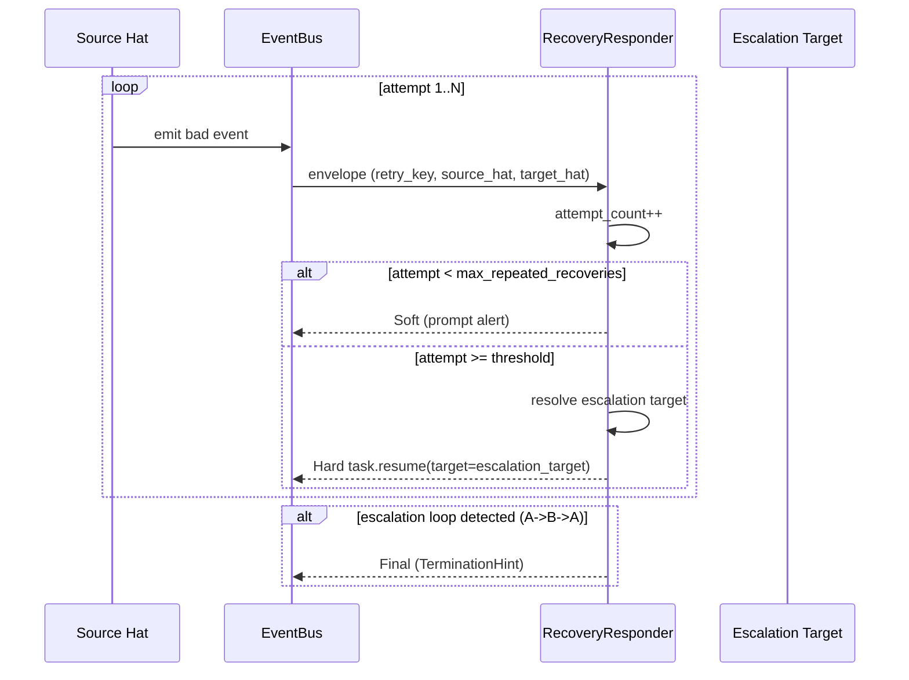

# feat: Recovery Escalation Routing — 重复失败时升级 target hat

## Overview

扩展 `RecoveryResponder` 的 Hard escalation 逻辑，使其在检测到同一 `retry_key` 连续失败达到阈值时，不再把 `task.resume` 发回源 hat，而是按 preset 配置的 escalation routing table 转发给更适合处理该类错误的 specialist hat。改动集中在机制层（Rust runtime），编排层（preset topology、hat instructions、event flow）不变。

---

## Problem Frame

Runtime diagnosis（U0–U8）已经能识别 loop 中的各类反压点，并通过 `RecoveryResponder` 三档动作（Soft / Hard / Final）进行恢复。当前 Hard escalation 的 `task.resume` **始终路由回源 hat**（`source_hat == target_hat`）。

当某个 hat 因 instructions 理解错误、payload 习惯性错误、或陷入局部死胡同时，反复把 `task.resume` 发回同一个 hat 会导致：
- 同样的 recovery envelope 重复出现
- iteration 空转
- 本应由 specialist hat 处理的问题被拖延

本方案只解决「该换个人看」的问题，不替 agent 执行修复。

---

## Requirements Trace

- R1. 同一 `retry_key` 重复失败 N 次后，`task.resume` 的 `target_hat` 变为 escalation target。
- R2. `recovery.jsonl` 完整记录 escalation 路径（`escalated_from`、`escalated_to`、`escalation_attempt`）。
- R3. 默认不启用 escalation 的 preset 行为与现在完全一致（向后兼容）。
- R4. `ce-executor-isolated` preset 提供保守的默认 escalation mapping。
- R5. 出现 escalation loop（A → B → A）时，runner 终止 escalation 并走 Final / `TerminationHint`。

---

## Scope Boundaries

- 自动改磁盘状态（progress.md / tasks.jsonl / source code）
- 新增 event 类型
- 新增 CLI 命令
- 修改 event bus 或 hat lifecycle
- 非 `ce-executor-isolated` preset 的默认启用（保持 opt-in）

### Deferred to Follow-Up Work

- 更多 preset 的默认 escalation mapping（需先观察 `ce-executor-isolated` 效果）。
- 基于 `reason_code` 细粒度的 escalation 策略（当前先按 source_hat + reason_code 通配）。

---

## Context & Research

### Relevant Code and Patterns

- `crates/ralph-core/src/diagnosis/responder.rs` — `RecoveryResponder` 是 runtime 唯一把 diagnosis 转换成 action 的地方。当前 `classify()` 在 `attempts >= max_repeated_recoveries` 且 `safe_target` 为真时返回 `EscalationLevel::Hard`，随后用 `envelope.target_hat` 构造 `RecoveryAction`。
- `crates/ralph-core/src/config/telemetry.rs` — `RuntimeDiagnosisConfig` 存放 `max_repeated_recoveries`、`retry_window_iterations` 等阈值，是本方案新增 escalation routing 配置的自然位置。
- `crates/ralph-core/src/diagnosis/envelope.rs` — `RecoveryDiagnosisEnvelope` 已含 `source_hat`、`target_hat`、`retry_key`、`reason_code`，足够支持 escalation 决策。
- `crates/ralph-core/src/config/ralph_config.rs` — `RalphConfig::validate` 会调用 `TelemetryConfig::validate`，新增配置校验可在此链路复用。
- `presets/en/ce-executor-isolated.yml` — 目标 preset，默认启用 escalation routing。

### Institutional Learnings

- `docs/guide/runtime-diagnosis.md` §6 已说明 RecoveryResponder 三档升级逻辑，本方案是其自然扩展。
- `docs/plans/2026-06-04-004-feat-drift-auto-calibration-plan.md` U6 定义了 `EscalationLevel` / `EscalationDecision` / `RecoveryAction`，本方案不改动其语义，只扩展 `target_hat` 的解析。

---

## Key Technical Decisions

| Decision | Rationale |
|----------|-----------|
| KTD1 — 配置放在 `RuntimeDiagnosisConfig` | 与 `max_repeated_recoveries`、`retry_window_iterations` 同域，避免新增顶层命名空间 |
| KTD2 — routing table 支持 `source_hat` + `reason_code` 通配 | 先有保守默认值，再逐步细化；通配降低维护成本 |
| KTD3 — source-specific rule 优先于 wildcard rule | 允许对特定 reason_code 覆盖通用规则 |
| KTD4 — escalation 只改 `RecoveryAction.target_hat`，不改 event 类型 | 最小侵入，复用现有 `task.resume` 路径 |
| KTD5 — escalation loop 检测用 chain 而非深度限制 | 更精确地捕获 A→B→A，而不是对长链过度限制 |
| KTD6 — target hat 必须在 preset 中已注册 | 启动时 hard gate 拒绝，避免运行时指向不存在的 hat |

---

## Open Questions

### Resolved During Planning

- **Q: escalation 配置放在 preset 还是 `ralph.yml`？** 放在 preset 的 `telemetry.runtime_diagnosis.escalation_routing` 下；operator 可通过 `ralph.yml` 的 telemetry 段覆盖。
- **Q: 是否所有 hat 默认启用？** 否，仅 `ce-executor-isolated` 提供默认 mapping，其他 preset 保持现有行为。

### Deferred to Implementation

- 具体 `reason_code` 字符串在 `ce-executor-isolated` 默认值中的精确匹配（需在代码中确认当前字符串）。
- `escalation_chain` 的持久化方式：内存 HashMap 足够，还是需要写入 `recovery.jsonl` 以便跨 loop 恢复？

---

## High-Level Technical Design

> *This illustrates the intended approach and is directional guidance for review, not implementation specification.*

Escalation 决策仅在 `classify()` 返回 `Hard` 之后、构造 `RecoveryAction` 之前插入一层 target resolution。若 resolution 结果与当前 `target_hat` 不同，则更新 `RecoveryAction.target_hat`，并在 `EscalationDecision` 中记录 `escalated_from` / `escalated_to`。

---

## Implementation Units

- [ ] U1. **Add `EscalationRoutingConfig` to `RuntimeDiagnosisConfig`**

**Goal:** 为 runtime diagnosis 增加可配置的 escalation routing table。

**Requirements:** R3

**Dependencies:** None

**Files:**
- Modify: `crates/ralph-core/src/config/telemetry.rs`
- Test: `crates/ralph-core/src/config/telemetry.rs` (existing mod tests)

**Approach:**
- 在 `RuntimeDiagnosisConfig` 中新增 `escalation_routing: Vec<EscalationRoutingEntry>`，默认空 Vec。
- `EscalationRoutingEntry` 字段：`source_hat: String`、`reason_code: String`（`*` 通配）、`target_hat: String`、`after_attempts: usize`（可选，默认继承 `max_repeated_recoveries`）。

**Patterns to follow:** 与 `DriftConfig` 的嵌套结构保持一致；使用 `#[serde(default)]` 保证向后兼容。

**Test scenarios:**
- Happy path: YAML 中声明 `escalation_routing` 后能正确解析。
- Edge case: 省略 `escalation_routing` 时等价于空 Vec，不影响现有测试。
- Error path: `after_attempts: 0` 在 validate 中被拒绝。

**Verification:**
- `RuntimeDiagnosisConfig::validate` 对默认配置返回空 warnings。
- 新增 YAML 解析测试通过。

---

- [ ] U2. **Validate escalation targets against registered hats**

**Goal:** 启动时拒绝指向未注册 hat 的 escalation 配置。

**Requirements:** R3, R5

**Dependencies:** U1

**Files:**
- Modify: `crates/ralph-core/src/config/telemetry.rs` 或 `crates/ralph-core/src/config/ralph_config.rs`
- Test: `crates/ralph-core/src/config/telemetry.rs`

**Approach:**
- 在 `RalphConfig::validate`（或等效校验入口）中，将 `hat_registry` / `hats` 列表传入，校验每个 `target_hat` 存在于 preset 的 hats 中。
- 校验失败返回 `ConfigError::TelemetryValidation`，明确字段路径。

**Patterns to follow:** 参考 `HatConfig` 校验或 `preset_lint` 中 hat 存在性检查。

**Test scenarios:**
- Happy path: `target_hat: debug-resolver` 在 `ce-executor-isolated` 中校验通过。
- Error path: `target_hat: nonexistent-hat` 返回硬错误。
- Edge case: 空 `escalation_routing` 不触发校验。

**Verification:**
- 校验测试覆盖上述三种场景。

---

- [ ] U3. **Implement escalation routing in `RecoveryResponder`**

**Goal:** 当 retry key 达到阈值时，按 routing table 解析 escalation target。

**Requirements:** R1, R5

**Dependencies:** U1

**Files:**
- Modify: `crates/ralph-core/src/diagnosis/responder.rs`
- Test: `crates/ralph-core/src/diagnosis/tests.rs` 或 `crates/ralph-core/src/diagnosis/responder.rs` 的 `#[cfg(test)]` 模块

**Approach:**
- 在 `RecoveryResponder` 中新增 `escalation_chain: HashMap<String, Vec<String>>`（或类似结构），记录每个 `retry_key` 已经历的 escalation 路径。
- 新增 `resolve_escalation_target(source_hat, reason_code, current_target) -> Option<String>`：按 source-specific → wildcard 顺序匹配 routing table；返回 `after_attempts` 最小的匹配项。
- 在 `record_finding` 的 `Hard` 分支中，用 `resolve_escalation_target` 替换默认 `target_hat`；若结果与当前 target 相同，行为不变。
- 检测到 escalation chain 循环（target 已在 chain 中）时，改走 `Final` 并记录原因。
- `mark_escalated` 时把本次 escalation 追加到 chain。

**Patterns to follow:** 保持 `EscalationDecision` / `RecoveryAction` 的现有字段；仅扩展 `target_hat` 解析逻辑。

**Test scenarios:**
- Happy path: `executor` 重复 3 次后，`RecoveryAction.target_hat` 变为 `debug-resolver`。
- Happy path: `review-coordinator` + `semantic_gate_violation` 重复 2 次后，target 变为 `review-synthesizer`。
- Edge case: 无 routing table 时，target 保持源 hat（向后兼容）。
- Edge case: wildcard rule 在 source-specific 不匹配时生效。
- Error path: `executor → debug-resolver → executor` 被检测为 loop，走 Final。
- Error path: 指向未注册 hat 的 rule 不会被用到（启动校验已拦）。

**Verification:**
- 单测覆盖所有 scenario；`drain_hard_escalations()` 输出的 target hat 符合预期。

---

- [ ] U4. **Record escalation provenance in `recovery.jsonl`**

**Goal:** 每条 escalation 都在 recovery journal 中留下审计路径。

**Requirements:** R2

**Dependencies:** U3

**Files:**
- Modify: `crates/ralph-core/src/diagnosis/envelope.rs`（若需要新增字段）或 `crates/ralph-core/src/diagnosis/responder.rs`
- Modify: `crates/ralph-core/src/diagnostics/` 中写入 recovery journal 的路径
- Test: `crates/ralph-core/src/diagnosis/tests.rs`

**Approach:**
- 在 `EscalationDecision` 中新增 `escalated_from: Option<String>` 和 `escalated_to: Option<String>`。
- `record_finding` 在发生 escalation 时填充这两个字段。
- 调用者（event loop）在写入 `recovery.jsonl` 时，把这些字段放入 envelope 的 `evidence` 或顶层 optional 字段。
- 优先使用 `evidence` 字段，避免破坏 envelope schema 稳定性。

**Patterns to follow:** 参考 `RecoveryDiagnosisEnvelopeBuilder` 的 `evidence` 用法。

**Test scenarios:**
- Happy path: escalation 发生后，`recovery.jsonl` 对应条目包含 `escalated_from` / `escalated_to`。
- Happy path: 未 escalation 时，字段不存在或为空。
- Edge case: 同一 retry_key 多次 escalation（如 A→B→C），每条记录都保留 chain。

**Verification:**
- 解析 `recovery.jsonl` 断言字段存在且值正确。

---

- [ ] U5. **Add default escalation mapping to `ce-executor-isolated.yml`**

**Goal:** 为 `ce-executor-isolated` 提供保守的默认 escalation mapping。

**Requirements:** R4

**Dependencies:** U1, U2

**Files:**
- Modify: `presets/en/ce-executor-isolated.yml`
- Test: `crates/ralph-cli/tests/integration_agent_reference.rs` 或现有 preset validation 测试

**Approach:**
- 在 `telemetry.runtime_diagnosis` 下新增 `escalation_routing` 段：
  - `executor` → `debug-resolver`，`after_attempts: 3`
  - `review-coordinator` + `semantic_gate_violation` → `review-synthesizer`，`after_attempts: 2`
  - `plan-gate` + `progress_task_mismatch` → `shipper`，`after_attempts: 2`
  - `*` + `handoff_dispatch_timeout` → `coordinator`，`after_attempts: 2`

**Patterns to follow:** 与 `ce-executor-isolated.yml` 中 `workflow_contract` 的配置风格一致。

**Test scenarios:**
- Happy path: `ralph preset check --strict -H builtin:ce-executor-isolated` 通过。
- Happy path: 解析后的 preset 包含 escalation routing 配置。
- Error path: 若某 `target_hat` 在 preset 中不存在，preset check 失败。

**Verification:**
- `cargo run -p ralph-cli -- preset check --strict -H builtin:ce-executor-isolated` 通过。

---

- [ ] U6. **Integration test: end-to-end escalation routing**

**Goal:** 验证 event loop 在真实 scenario 下会按 routing table 改变 `task.resume` 的 target。

**Requirements:** R1, R2, R5

**Dependencies:** U3, U4

**Files:**
- Create: `crates/ralph-core/src/event_loop/tests/recovery_escalation_routing.rs`

**Approach:**
- 构造最小 `EventLoop` + `HatRegistry`，启用 `ce-executor-isolated` 默认 mapping。
- 模拟 `executor` 连续 3 次 emit 字段缺失的 `work.done`。
- 断言第 3 次生成的 `task.resume` 的 target 是 `debug-resolver`，且 `recovery.jsonl` 含 `escalated_from: executor`。

**Patterns to follow:** 参考 `crates/ralph-core/src/event_loop/tests/recovery_envelope_u7_u8.rs`。

**Test scenarios:**
- Integration: 完整 escalation 链路 target hat 正确。
- Integration: escalation loop 触发 Final hint。
- Integration: 未配置 escalation 时行为与现有一致。

**Verification:**
- `cargo nextest run -p ralph-core -- recovery_escalation_routing` 全绿。

---

## System-Wide Impact

- **Interaction graph:** `RecoveryResponder` 新增的 escalation chain 只影响 `record_finding` 和 `RecoveryAction` 构造；下游 event loop 消费 `RecoveryAction` 的逻辑不变。
- **Error propagation:** 配置校验失败在 `RalphConfig::validate` 阶段硬失败，loop 不启动。
- **State lifecycle risks:** escalation chain 仅驻内存，loop 重启后重置；这是可接受的，因为 recovery state 本身就是内存聚合。
- **API surface parity:** `EscalationDecision` 新增可选字段，不影响现有调用者。
- **Unchanged invariants:** Soft / Hard / Final 三档语义不变；`task.resume` event 类型不变；hat publishing contract 不变。

---

## Risks & Dependencies

| Risk | Mitigation |
|------|------------|
| Escalation target 选错，问题转移而非解决 | 默认 mapping 保守；先只在一个 preset 启用；operator 可覆盖 |
| Escalation loop 导致无限 escalation | chain 循环检测 + Final hint |
| Audit trail 断裂 | `recovery.jsonl` 记录 `escalated_from` / `escalated_to` |
| 配置漂移 | 启动时校验 target hat 存在性；preset check 捕获 |
| Backward compatibility | `escalation_routing` 默认空 Vec；行为与现在一致 |

---

## Documentation / Operational Notes

- 更新 `docs/guide/runtime-diagnosis.md` §6，说明 escalation routing 行为。
- 在 `ce-executor-isolated` preset 注释中说明默认 escalation mapping 的 rationale。
- `ralph diagnose` 报告可继续按 `retry_key` 聚合；escalation 路径作为附加信息展示。

---

## Sources & References

- **Origin document:** [docs/brainstorms/2026-06-18-recovery-escalation-routing-requirements.md](docs/brainstorms/2026-06-18-recovery-escalation-routing-requirements.md)
- Related code:
  - `crates/ralph-core/src/diagnosis/responder.rs`
  - `crates/ralph-core/src/config/telemetry.rs`
  - `crates/ralph-core/src/diagnosis/envelope.rs`
  - `presets/en/ce-executor-isolated.yml`
- Related plan: `docs/plans/2026-06-04-004-feat-drift-auto-calibration-plan.md`
