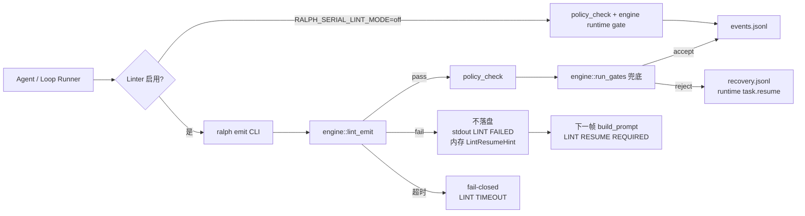
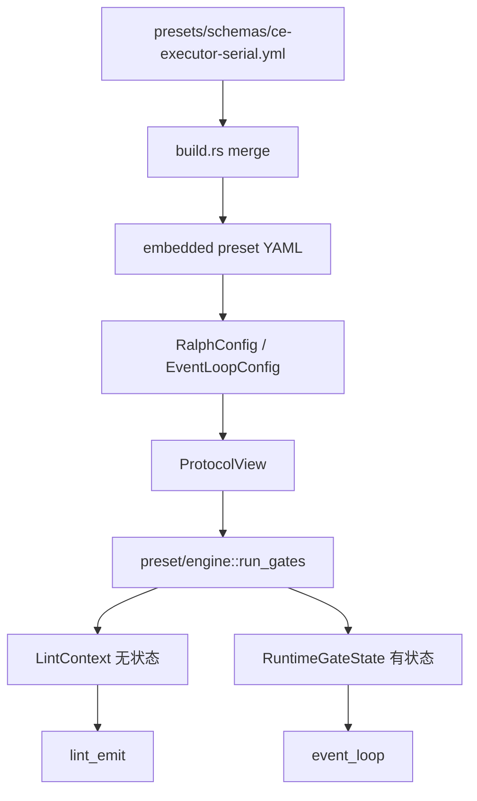
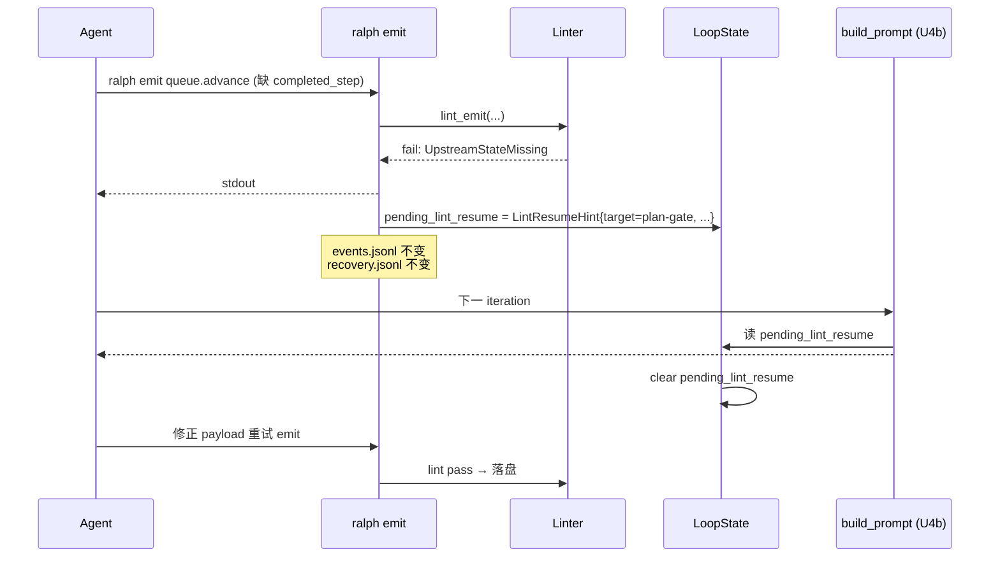

# ce-executor-serial Precheck-as-Linter + 协议 SSOT 重构

## Summary

把 30 天散落在 preset YAML / agent instructions / runtime Rust 三处的协议规则，收敛到 **一份 YAML 协议 SSOT**：`presets/schemas/ce-executor-serial.yml`（在现有 `schemas` 节基础上扩展 `execution_contracts` / `gates` / `state_projection` / `handoff`）。`cargo build` 时 `build.rs` deep-merge 进 embedded preset；**Rust 只提供通用执行引擎** `preset/engine/`（gate / 投影 / linter / lint_mirror / handoff 硬拦截），**读 embedded 配置，不在 Rust 里再维护一份 payload 字段表**。

`ralph emit` 从 fail-after 改为 fail-before：linter 与 runtime gate **共用同一份 embedded 协议**；lint 不过不落盘、不消耗 iteration。同步纳入 hat handoff B1–B4。两段式：Phase 1 扩 YAML SSOT + engine 接线 + `mark_step_completed`；Phase 2 linter + LINT MIRROR + handoff auto prepare。

---

## Problem Frame

### 30 天同一条根因路径摔了 5 次

| Run | 日期 | preset | 终止 | 根因类别 |
|---|---|---|---|---|
| merry-lotus | 2026-06-17 | serial | 41m 后 cancelled | task.resume 缺字段 + dimension 卡死 |
| noble-peacock | 2026-06-17 | serial | 28m 后 cancelled | 同上同构 |
| perky-maple | 2026-06-18 | serial | 2h7m 后用户 abort | fix.applied dedup 缺 fix_round |
| warm-tiger | 2026-06-18 | serial | 用户 abort | dimension-reviewer 卡死 + 越权 emit |
| primary-20260619 | 2026-06-19 | serial | 2h25m, consecutive_failures | state_projection 缺 Completed Steps + 8 对重复 emit + hat_handoff 0 触发 |

每次死循环后出 1 份诊断 + 1 份加固 plan + 1 份加固 commit（d623c09 是最新一次）。30 天累计 6 份诊断 + 5 份加固 plan + 1 份加固 commit。**没一次把根因打掉**——每次都打到根因的儿子，根因本身（共享可变状态 + 散落 schema + fail-after）每次都活下来。

### 5 个反复出现的根因（耦合）

| 根因 | 历史出现 | 本次状态 | 治法 |
|---|---|---|---|
| State projection 不写 Completed Steps | warm-tiger P2-B | P0-A：progress.md 45 字节未更新 | Phase 1 U3：`mark_step_completed` + typestate |
| progress_task_gate 误拒 / 范围过窄 | warm-tiger P2-B | P0-A：3 次 progress_not_found 误拒 | Phase 1 SSOT + Phase 2 U4 linter 提前告知 |
| agent 撞门不响应 | warm-tiger P0-B（dimension）→ 本次 P0-B（executor） | P0-B：8m stall | Phase 2 U4b `## LINT MIRROR` + 内存态 `LintResumeHint` 注入下一帧 prompt（见 KTD-8） |
| 重复 emit | perky-maple P1-2（135 条）→ 本次 P1-A（8 对） | P1-A：8 对重复 | Phase 2 U4 linter 改为不落盘 |
| hat_handoff 0 触发（B1–B4 叠加） | primary-20260619 | 全 run 0 artifact / 0 reason_code | Phase 1 U1 seeds + U7 注入/校验；Phase 2 U4 **同步 auto_prepare**（B4） |

用户已确认：5 个根因耦合，必须一起改。散落协议 + 共享可变状态 + fail-after + 软提示 同时满足时循环复活。

### schemas 当前角色 vs 目标角色

| | 现在 | 本 plan 之后 |
|--|------|-------------|
| `presets/schemas/*.yml` | 仅 `event_policy.schemas`（payload 字段） | **整份 serial 协议**：schemas + gates + projection + handoff + execution_contracts |
| operator 改规则 | schemas 改字段；gate/投影/handoff 另改 preset yml 或 Rust | **只改 schemas 文件** + `cargo build` |
| Rust | gate/投影/handoff 逻辑与配置散落 | **`preset/engine/` 通用执行器**，读 embedded，不 duplicate 字段 |

---

## Requirements

### Phase 1 — YAML 协议 SSOT 扩展 + engine 接线

#### 协议 SSOT（`presets/schemas/ce-executor-serial.yml`）

- **R1**. 现有顶层 topic 键（payload `required_fields`）**保持为 SSOT**，禁止在 Rust 再维护 duplicate 字段表。`execution_contracts.rules.*` 迁入 schemas 文件 `execution_contracts:` 节；`build.rs` merge 进 embedded preset；**禁止**在 `execution_contracts` 里重复列 `require_payload_fields`（见 KTD-12：engine 运行时从 `event_policy.schemas` 派生）。inline preset 同名块按 **「Inline 双写清除清单」** 迁出后删除。
- **R2**. `verdict_gate` / `workflow_contract.step_handoff.progress_task_gate` 迁入 schemas 文件对应节（`verdict_gate:` / `workflow_contract:`，见 Merge 映射表）；`build.rs` merge；build-time 与 embedded preset 不一致则 panic。
- **R3**. `state_projection.actions.*` 迁入 schemas 文件 `state_projection:` 节。动作 `kind` 必须是 engine 支持的枚举子集（`close_task` / `mark_step_completed` / …）。**顺序即语义**：`work.done` 必须 `close_task` 先于 `mark_step_completed`。顺序 SSOT 靠 **build-time `preset_lint` 断言**（主）+ engine typestate（辅，仅防 Rust 实现 bug）。
- **R4**. `state_projection.actions.work.done` 必须含 `mark_step_completed` 步骤（治 P0-A）。**U3a** 新增 `StateProjectionAction::MarkStepCompleted` + `project_mark_step_completed`（当前枚举不存在，绿field）。engine 按 YAML 顺序执行。

#### handoff 协议（同文件）

- **R19**. `workflow_contract.handoff_topic_seeds:` 列表写入 schemas 文件（治 B1，9+ 条 macro edge；**禁止**发明 `handoff.seeds` 别名）。`build.rs` merge 进 `event_loop.workflow_contract.handoff_topic_seeds`；运行时 `HandoffIndex` / `WorkflowContractConfig::effective_seeds()` 读 embedded 值；`workflow_contract.rs` 中 `HANDOFF_TOPIC_SEEDS` const **仅作非 serial preset 的 default fallback**，serial 以 embedded 为准。
- **R20**. `build_emit_instructions` 注入块在 `## WAVE CONTEXT` **之上**（U7）。
- **R21**. `handoff.artifact` 节声明 5 段式 + `## next` 标记要求；engine / inject 硬校验（U7）。

#### instructions / 查询

- **R5**. hat instructions 中手写 schema/gate 段落删除；`build.rs` 或 engine 从 embedded 协议生成 `{generated_from: protocol}` 块（见 U1）。
- **R6**. `ralph emit --schema <topic>` 输出 embedded 协议中该 topic 的 JSON 视图；附带 protocol hash，与 build-time 一致。

#### 加固项

- **R7**. 见 **「R7 承接清单」**；规则进 YAML，行为进 engine。

### Phase 2 — Precheck-as-Linter（engine 读同一份 embedded 协议）

- **R8**. `ralph emit` 新增 `lint` 阶段，调用 `preset::engine::lint_emit(&protocol_view, …)`，镜像 5 道 gate + R22 handoff auto prepare。
- **R9**. lint 失败：不落盘、不写 recovery；stdout `## LINT FAILED` + `LintResumeHint`（KTD-8）。
- **R10**. `--bypass-lint` 显式 opt-in + recovery 审计。
- **R11**. internal source 标记；**仅 serial preset**（R18）。
- **R12**. `build_prompt` 注入 `## LINT MIRROR`（U4b）；由 engine 从 embedded 协议 **生成**，不手写。
- **R13**. lint 失败写 `LoopState.pending_lint_resume`；下一帧 `## LINT RESUME REQUIRED`（KTD-8）。
- **R14**. lint p95 < 200ms；超时 **fail-closed**（KTD-9）。
- **R15**. linter 与 runtime **共用** `preset::engine::run_gates(protocol, …)`；差异仅 `GateContext`（无状态 vs 有状态 trait），**规则来源同一份 embedded YAML**。
- **R22**. macro edge lint 时：若 payload 缺 `handoff_path` 且 `hat_handoff.linter.auto_prepare_on_macro_edge: true`，**orchestrator 同步调用**与 `ralph tools handoff prepare` 等价的逻辑写 artifact、把 `handoff_path` 注入 payload，再跑 gate（治 B4；不是「仅提示 agent 去 prepare」）。prepare 失败 → lint fail-closed。配置 SSOT 在 schemas 文件 `hat_handoff.linter` 节。

### 跨阶段约束

- **R16**. 重构期新 bug 记 `docs/issues/2026-06-20-serial-refactor-known-issues.md`。
- **R17**. `RALPH_SERIAL_LINT_MODE=off` **仅关 linter**（非 d623c09 全量回滚）；gate 统一走 engine + embedded 协议（KTD-7）。U2 落地后 runtime gate 路径已与 d623c09 不同，off 不等于「回到加固前」。
- **R18**. `ce-executor-isolated.yml` 不修改。

### R7 承接清单

| ID | 摘要 | 协议 SSOT（YAML） | 引擎（Rust） | 测试（U6） |
|---|---|---|---|---|
| R7-1 / U5b | loop-runner provenance | schemas 可选 `provenance:` 节（merge TBD U5b） | `engine::check_provenance` | `serial_lint_internal_source_bypass.yaml` |
| R7-2 / U6 | RECENT REJECTIONS | reason_code 在 `gates` 节文档化 | `engine` + event_loop digest | `serial_lint_rejection_digest.yaml` |
| R7-3 | steward 豁免 suppress | serial preset 业务参数（仍可在 `presets/en/`） | `loop_config.rs` | `serial_lint_steward_guidance_exempt.yaml` |
| R7-4 | LintResumeHint 消费 | — | U4b prompt 注入 | `serial_lint_resume_hint_consumed.yaml` |
| R7-5 | fix.applied dedup | `execution_contracts.fix.applied.dedup_key` | `engine::run_gates` | `serial_lint_fix_applied_dedup.yaml` |
| R7-6 / R22 | handoff auto prepare | `hat_handoff.linter.auto_prepare_on_macro_edge` | `engine::auto_handoff_prepare`（同步写 artifact） | `serial_lint_handoff_auto_prepare.yaml` |
| R7-7 / R19 | seeds 覆盖拓扑 | `workflow_contract.handoff_topic_seeds` | build-time 断言 | `serial_lint_handoff_seeds_coverage.yaml` |

---

## Scope Boundaries

### 本次覆盖

- `presets/schemas/ce-executor-serial.yml`（**扩成整份协议 SSOT**：topic 键 + execution_contracts + verdict_gate + workflow_contract + state_projection + hat_handoff）
- `crates/ralph-cli/build.rs`（U1：multi-section deep-merge，见 KTD-1）
- `crates/ralph-core/src/preset/engine/`（**新建通用引擎**：gates / projection / linter / lint_mirror / handoff / protocol.rs）
- `crates/ralph-core/src/event_loop/`（gate 改调 engine；U4b LINT MIRROR；U7 handoff 注入顺序）
- `crates/ralph-core/src/state_projector/`（U3：按 YAML 动作链执行 + mark_step_completed）
- `crates/ralph-core/src/hat_handoff/inject.rs`（U7）
- `crates/ralph-cli/src/commands/emit.rs`、`schema.rs`
- `presets/en/ce-executor-serial.yml`（inline 协议块逐步清空，业务参数保留）
- R7 清单 7 项 + 11 BDD scenarios
- handbook + ralph-tools 文档

### 本次不覆盖

- `ce-executor-isolated.yml` 任何修改（按 D-3，后续会从仓库移除）
- Telegram / TUI 的 `human.guidance` target 路由回归测试（已由 2026-06-18-001 plan 处理）
- 重写 9-hat 拓扑或新增 hat
- 完整重做 `recovery.jsonl` 格式（向后兼容，旧格式只读）
- 自动化从 git diff 生成 `## changed` 骨架
- 删 `ce-executor-isolated.yml`（按用户指示是后续动作）

### Deferred to Follow-Up Work

- `ralph audit hat-handoff` 集成到 `ralph diagnose` UI
- `RecoveryEnvelope` 反序列化的运行时校验（`recovery.jsonl` 历史兼容性）
- `ralph-cli` 增加 `scenario-fault-injection` 子命令预防 6 类典型越权模式
- Linter 镜像的 5 道 gate 进一步覆盖到 `ce-executor-wave`（按用户指示 wave 不在本范围，但 isolated 被移除后 wave 可能成为唯一并行 preset）

---

## Key Technical Decisions

1. **协议 SSOT = `presets/schemas/ce-executor-serial.yml`（扩节；禁止 Rust duplicate 字段表）**  
   顶层 topic 键继续管 payload（plan 2026-06-16-002）。同文件新增 `execution_contracts` / `verdict_gate` / `workflow_contract` / `state_projection` / `hat_handoff`（见 Merge 映射表）。`build.rs` merge → embedded preset。operator 只改这一份 + `cargo build`。**废弃** v2 的 `preset/serial/contracts.rs` 静态 RULES 表。

2. **Rust = `preset/engine/` 通用执行器（preset 无关）**  
   `ProtocolView` 从已加载的 `EventLoopConfig`（`RalphConfig` 子树）构造；**禁止** ralph-core 再解析 raw embedded YAML 或 `include_str!` ralph-cli 产物（KTD-10）。`run_gates` / `lint_emit` / `apply_projection` / `auto_handoff_prepare` / `build_lint_mirror_block` 读 `ProtocolView` 不写协议。新 preset = 新 `presets/schemas/<name>.yml` + 同一 engine。

3. **两段式交付** — Phase 1：扩 YAML + engine 接线 + `mark_step_completed`（**会改** state_projection / progress.md；**不改** emit/linter 路径）。Phase 2：linter + LINT MIRROR + handoff auto prepare。

4. **Lint 失败反馈走内存态 `LintResumeHint`，不走持久化 task.resume（KTD-8，消解 R9↔R13 矛盾）**  
   brainstorm 中 D-OQ-2 原方案是持久化 task.resume，与 R9「不写 recovery.jsonl」冲突。**修订**：

   - lint 失败 → stdout `## LINT FAILED` + 写 `LoopState.pending_lint_resume: LintResumeHint`
   - 下一帧 `build_prompt` → 注入 `## LINT RESUME REQUIRED`（U4b），target 由 KTD-4 分类推断
   - **不**调用 `rejection.rs` 持久化路径；**不**写 recovery.jsonl（AE-3 可验收）
   - 仅 `--bypass-lint` / `linter_circuit_breaker` 审计写 recovery.jsonl

   **target 推断**（KTD-4，不变）：

   - **payload 错误** → `target = source_hat`
   - **上游状态错误**（progress.md / step / state_projection）→ `target = plan-gate`
   - **topic 越权** → `target = source_hat`
   - **handoff artifact 违规**（R22）→ `target = source_hat`

5. **linter 与 runtime 共用 `engine::run_gates(protocol, …)`（R15）** — 规则来自 embedded YAML；`GateContext` trait 区分无状态/有状态。

6. **保留 5 道 runtime gate 作为兜底**  
   d623c09 落地的 gate 保留，防御 loop_runner 内部 publish 等绕过路径。Linter 通过 ≠ 100% 通过 runtime。

7. **`RALPH_SERIAL_LINT_MODE` 仅关 linter（KTD-7）** — gate 统一走 `preset/engine`；熔断 disable linter，非 warn-only 放行。

8. **Lint 超时 fail-closed（KTD-9）**  
   超出 200ms p95 预算：CI 告警 + 单次 emit 拒收（`## LINT TIMEOUT`，exit ≠ 0）。禁止 fallback policy_check 放行——否则 reintroduce fail-after。

9. **build.rs multi-section merge（KTD-1）** — 映射表见下节「build.rs Merge 映射表」；U1 Step 0 spike 验证表内每一行。

10. **Instructions + mark_step_completed** — `engine::build_instruction_block` 从 `ProtocolView` 生成（R5）；投影顺序以 YAML 为准；**build-time `preset_lint`** 断言 `work.done` 动作顺序（KTD-3 主）；engine typestate 仅防 Rust 实现顺序 bug（辅）。

11. **execution_contracts 与 schemas _join（KTD-12，规则 A）** — YAML `execution_contracts.rules.<topic>` **只写增量约束**（`require_git_change` / `require_task` / `dedup_key` 等）。`require_payload_fields` **不在 YAML 重复**；engine / linter 运行时：

    ```text
    effective_required_fields(topic) =
      event_policy.schemas[topic].required_fields
      ∪ execution_contracts.rules[topic].extra_required_fields  # 可选，默认空
    ```

12. **ProtocolView 加载链（KTD-10）** — 单一数据路径，无 parallel 解析：

    ```text
    presets/schemas/*.yml
      → build.rs merge → OUT_DIR preset YAML
      → ralph-cli embed (include_str!)
      → 运行时 RalphConfig::load / preset resolve
      → EventLoopConfig
      → preset::engine::ProtocolView::from_event_loop(&config)
      → run_gates / lint_emit / apply_projection / build_lint_mirror_block
    ```

    ralph-core **不依赖** ralph-cli crate；engine 只接受 `&ProtocolView` / `&EventLoopConfig`。

### build.rs Merge 映射表（KTD-1，U1 spike 不得改语义）

| schemas 文件（authoring）路径 | embedded preset 目标路径 | 说明 |
|---|---|---|
| 顶层 topic 键（`work.done:` 等） | `event_loop.event_policy.schemas.<topic>` | 与 plan 2026-06-16-002 一致；SSOT 为 base，inline 仅过渡期 per-key override |
| `execution_contracts:` | `event_loop.execution_contracts` | 禁止含 duplicate `require_payload_fields` |
| `verdict_gate:` | `event_loop.verdict_gate` | |
| `workflow_contract:` | `event_loop.workflow_contract` | 含 `handoff_topic_seeds`、`step_handoff` |
| `state_projection:` | `event_loop.state_projection` | 含 `work.done` → `close_task` → `mark_step_completed` |
| `hat_handoff:` | `event_loop.hat_handoff` | 含 `enabled`、`artifact`、`linter.auto_prepare_on_macro_edge` |

**禁止** authoring 侧使用 `handoff.seeds` 等与 `RalphConfig` 不对应的别名。merge 后 `preset_lint` / build.rs 对 embedded 与 schemas 源做 hash 或结构化 diff；不一致则 panic。

### Inline 双写清除清单（P1，U1 末 / preset_lint）

迁到 `presets/schemas/ce-executor-serial.yml` 后，**必须删除** `presets/en/ce-executor-serial.yml` 内对应 inline 块；`preset_lint` 新增 finding `preset.serial_protocol_inline_duplicate`（或同等 ID）：

| inline 块（`presets/en/`） | schemas 文件节 | U1 完成后 |
|---|---|---|
| `event_loop.state_projection` | `state_projection:` | inline **删空** |
| `event_loop.workflow_contract`（含 `step_handoff`） | `workflow_contract:` | inline **删空** |
| `event_loop.verdict_gate` | `verdict_gate:` | inline **删空** |
| `event_loop.execution_contracts` | `execution_contracts:` | inline **删空** |
| `event_loop.event_policy.schemas`（per-topic） | 顶层 topic 键 | 逐 topic 清空 inline；仅 schemas 文件保留 |
| `event_loop.hat_handoff`（artifact / linter） | `hat_handoff:` | 业务 `enabled: true` 可留；协议子块迁出 |

验收：改 schemas 文件某 gate 字段 → `cargo build` → embedded 必变；**无 inline 覆盖时** operator 只改 schemas 即生效。

### YAML 协议文件目标结构（示意，D5 已决）

```yaml
# presets/schemas/ce-executor-serial.yml
# D5：顶层 topic 键 = payload SSOT（与 2026-06-16-002 一致）；命名节镜像 embedded event_loop.* 路径（去掉 event_loop. 前缀）

work.done:
  required_fields: [task_id, step, ...]

execution_contracts:
  enabled: true
  rules:
    work.done:
      require_git_change: true
      # 禁止 require_payload_fields — 由 KTD-12 从 work.done.required_fields 派生

verdict_gate:
  topic: REVIEW_COMPLETE
  additional_topics: [report.done]

workflow_contract:
  handoff_topic_seeds:          # R19：9+ 条，对齐 macro_edges Required
    - queue.advance
    - work.ready
    - work.done
    - review.dimension.ready
    - fix.plan.ready
    - work.failed
    # ... build-time 断言 ⊆ 拓扑 Required 边
  step_handoff:
    progress_task_gate: true

state_projection:
  enabled: true
  actions:
    work.done:
      - kind: close_task
        task_id: task_id
        step: step
      - kind: mark_step_completed
        step: step

hat_handoff:
  enabled: true
  artifact:
    required_sections: 5
    require_next_marker: true
  linter:
    auto_prepare_on_macro_edge: true   # R22：lint 时 orchestrator 同步 prepare
```

---

## Open Questions

### Resolved During Planning

- **Q1**: SSOT 放 Rust 还是 YAML？  
  **A**: **YAML**（`presets/schemas/` 扩节）。Rust 仅 `preset/engine/` 执行器。v2 的 `preset/serial/contracts.rs` 方案废弃。

- **Q2**: Linter 失败反馈？  
  **A**: LintResumeHint + prompt（KTD-8），非持久化 task.resume。

- **Q3**: mark_step_completed 顺序？  
  **A**: build-time `preset_lint` 断言 YAML 顺序（主）+ engine typestate（辅）。

- **Q4–Q7**: 同 v2（R9/R13、超时 fail-closed、handoff B1–B4、R7 inline）。

- **Q8**: 协议视图从哪来？  
  **A**: 不单独解析 raw YAML；`ProtocolView::from_event_loop(&EventLoopConfig)`（KTD-10）。

- **Q9**: `execution_contracts` 如何「引用」schemas？  
  **A**: KTD-12 规则 A — 运行时派生 `effective_required_fields`，YAML 不双写字段名。

- **Q10**: `handoff.seeds` vs `handoff_topic_seeds`？  
  **A**: 只用 `workflow_contract.handoff_topic_seeds`（R19）；禁止 authoring 别名。

### Deferred to Implementation

- **D1**: typestate marker 命名 — 实现期定。
- **D2**: `GateContext` trait 签名（`LintContext` vs `RuntimeGateState`）— 实现期定。
- **D3**: BDD 步骤细节 — 见「BDD Scenario 注册表」文件名；步骤实现期定。
- **D4**: LINT MIRROR token 预算 — 实现期 baseline。
- ~~**D5**~~: **已决** — 顶层 topic 键保留；其余节镜像 `event_loop.*` 子树（见 Merge 映射表）。

---

## Output Structure

扩 1 份 YAML 协议 + 1 个 engine 目录 + 改既有接线点。

```text
presets/schemas/ce-executor-serial.yml          # U1: 协议 SSOT（扩节：gates/projection/handoff/execution_contracts）
presets/en/ce-executor-serial.yml             # inline 协议块逐步清空；业务参数保留
crates/ralph-cli/build.rs                     # U1: multi-section deep-merge（KTD-1）
crates/ralph-core/src/preset/
├── mod.rs
└── engine/                                   # 通用执行器（preset 无关）
    ├── mod.rs
    ├── protocol.rs                           # ProtocolView：从 EventLoopConfig 构造（KTD-10）
    ├── gates.rs                              # run_gates(protocol, ctx)
    ├── projection.rs                         # apply_projection + mark_step_completed
    ├── linter.rs                             # lint_emit + auto_handoff_prepare
    ├── lint_mirror.rs                        # build_lint_mirror_block
    ├── instructions.rs                       # build_instruction_block
    ├── hint.rs                               # LintResumeHint + classify_lint_failure
    └── tests/
├── state_projector/                          # U3: 调 engine::apply_projection
├── event_loop/mod.rs                         # U2/U4b/U7: 调 engine + LINT MIRROR
├── event_loop/loop_state.rs                  # U4: pending_lint_resume
├── hat_handoff/inject.rs                     # U7
crates/ralph-cli/src/commands/emit.rs         # U4
crates/ralph-cli/src/commands/schema.rs         # U5: 读 embedded 协议
docs/handbook/serial-preset-development.md
```

---

## High-Level Technical Design

### 双层 gate 架构（linter 镜像 + runtime 兜底）



### state_projector 顺序保证（R4，双层）

**主（build-time）**：`preset_lint` 断言 `state_projection.actions.work.done` 中 `close_task` 索引 < `mark_step_completed` 索引；违反 → preset 启动 / build 失败。

**辅（compile-time）**：engine 内 typestate 防 **Rust 实现** 在错误 phase 调用 `project_mark_step_completed`；**不能**替代 YAML 顺序校验。

### Linter 与 runtime 共用 engine（R15）



### Linter 失败反馈（KTD-8：内存 hint，非持久化 task.resume）



**熔断路径**：连续 5 次 lint fail → disable linter → recovery audit → 后续跳过 lint，仍走 engine runtime gate。

---

## Implementation Units

### U1. 扩 `presets/schemas/` 协议 SSOT + build.rs merge + `ProtocolView`

- **Goal**: 在 **同一份** `presets/schemas/ce-executor-serial.yml` 扩展协议节（见 Merge 映射表）；`build.rs` multi-section merge；新建 `preset/engine/protocol.rs` 定义 `ProtocolView::from_event_loop`。**禁止**新建 `contracts.rs` 静态 RULES 表；**禁止** ralph-core 解析 raw embedded YAML。
- **Requirements**: R1–R3, R19, R5, R6
- **Dependencies**: —
- **Files**:
  - 修改 `presets/schemas/ce-executor-serial.yml`
  - 修改 `crates/ralph-cli/build.rs`（实现 Merge 映射表每一行）
  - 修改 `presets/en/ce-executor-serial.yml`（按 Inline 双写清除清单删 inline）
  - 创建 `preset/engine/protocol.rs`、`instructions.rs`；`preset/mod.rs`；注册 `lib.rs`
  - 修改 `preset_lint`：inline duplicate finding + `work.done` 动作顺序断言
- **Approach**:
  - **Step 0 spike**：对映射表每一行写 merge 单测；确认与现有 schemas-only merge 兼容
  - KTD-12：`ProtocolView::effective_required_fields(topic)` 实现
  - U1 末：inline 双写清除清单全部打勾
- **Test scenarios**:
  - 改 schemas `work.done.required_fields` → build → `--schema work.done` 含新字段（AE-1）
  - 改 `workflow_contract.handoff_topic_seeds` → embedded 9+ 条
  - merge / hash / inline duplicate → build panic 或 preset_lint finding

### U2. `preset/engine::run_gates` + event_loop 接线

- **Goal**: `engine::run_gates(protocol_view, ctx)`；serial 运行时 seeds 来自 `WorkflowContractConfig.handoff_topic_seeds`（R19）；删除 d623c09 inline 双轨 gate 逻辑。
- **Requirements**: R2, R15, R19
- **Dependencies**: U1
- **Files**:
  - 创建 `preset/engine/gates.rs`
  - 修改 `event_loop/mod.rs`、`execution_contract.rs`、`step_handoff/progress_task_gate.rs`、`hat_handoff/gate.rs`、`event_origin.rs`
  - `workflow_contract.rs`：`HANDOFF_TOPIC_SEEDS` 仅 default；serial 以 config 为准
- **Approach**:
  - `GateContext` trait：`LintContext` vs `RuntimeGateState`
  - build-time：macro edge `Required` ⊆ `handoff_topic_seeds`
- **Test scenarios**: hat_handoff 6 scenarios 全绿；seeds 9+

### U3a. `MarkStepCompleted` action（绿field）

- **Goal**: 新增 `StateProjectionAction::MarkStepCompleted`；`state_projector/progress.rs::project_mark_step_completed` 写 `## Completed Steps`；schemas `work.done` 动作链含该 kind。
- **Requirements**: R3, R4
- **Dependencies**: U1
- **Files**: `config/state_projection.rs`、`state_projector/mod.rs`、`state_projector/progress.rs`、`presets/schemas/ce-executor-serial.yml`
- **Test scenarios**: unit test `project_mark_step_completed`；preset_lint 顺序断言

### U3b. `engine::apply_projection` 接线

- **Goal**: `apply_projection(protocol_view, event, projector)` 按 YAML actions 顺序 dispatch；失败 compensate 回滚；typestate 仅包 Rust dispatch 路径。
- **Requirements**: R3, R4
- **Dependencies**: U3a
- **Files**: `preset/engine/projection.rs`；`state_projector/mod.rs` 改调 engine
- **Test scenarios**: work.done 后 progress.md 含 `## Completed Steps`（AE-2）；**Phase 1 止损核心**

### U4. `engine::lint_emit` + LintResumeHint + auto_prepare（KTD-8 / R22）

- **Goal**: emit 前 `lint_emit`；macro edge 缺 `handoff_path` 时若 `hat_handoff.linter.auto_prepare_on_macro_edge` → **同步** `auto_handoff_prepare`（写 artifact + 注入 path），再跑 gate；失败 `pending_lint_resume`，不写 recovery。
- **Requirements**: R8–R11, R13–R15, R22
- **Dependencies**: U1, U2, U7
- **Files**: `preset/engine/linter.rs`、`hint.rs`；`emit.rs`、`loop_state.rs`、`loop_runner`（serial-only）
- **Test scenarios**: AE-3、AE-4（LintResumeHint，非 task.resume）、`serial_lint_handoff_auto_prepare.yaml`、超时 fail-closed、熔断

### U4b. `engine::build_lint_mirror_block` + build_prompt 注入（R12）

- **Goal**: 从 `ProtocolView` + hat topology 生成 `## LINT MIRROR` / `## LINT RESUME REQUIRED`。
- **Requirements**: R12, R13, R7-4
- **Dependencies**: U1, U4
- **Files**: `preset/engine/lint_mirror.rs`；`event_loop/mod.rs` build_prompt
- **Test scenarios**: AE-1 prompt 镜像；R7-4 hint 消费

### U7. handoff 注入顺序 + artifact 硬校验（B2/B3）

- **Goal**: `build_emit_instructions` 在 `## WAVE CONTEXT` **之上**（R20）；`inject.rs` 读 `hat_handoff.artifact` 配置硬校验（R21）。
- **Requirements**: R20, R21
- **Dependencies**: U1
- **Files**: `event_loop/mod.rs`、`hat_handoff/inject.rs`

### U5. `--schema` + handbook + 文档

- **Goal**: `ralph emit --schema` 输出 `ProtocolView` JSON 视图 + protocol hash；handbook 指向 `presets/schemas/ce-executor-serial.yml`。
- **Requirements**: R5, R6, R16
- **Files**: `commands/emit.rs::schema_view`(原 `commands/schema.rs` 路径,实施时落到 emit 子模块)、`docs/handbook/serial-preset-development.md`、`ralph-tools-*.md`
- **Status (2026-06-20)**: **shipped**。R6 严格按字面 `ralph emit --schema <topic>` 落地,handler 在 config 加载/urgent-steer 之前短路返回;`schema_view` 子模块在 `commands/emit.rs` 内(plan 原路径 `commands/schema.rs` 因 R6 字面要求,实际包到 emit 模块)。

### U6. BDD + R7 回归（11 scenarios，见注册表）— **deferred**

- **Goal**: 下表 11 个 scenario 全绿 + replay AE-6 + 手跑 12U。
- **Dependencies**: U1–U7, U3a, U3b, U4b
- **Status (2026-06-20)**: deferred. BDD harness 扩展 + 11 scenario 落地独立 plan 跟踪 — `docs/plans/2026-06-20-002-feat-bdd-harness-extension-for-runtime-state-inspection-plan.md`(待创建)。本 plan 关闭时 U6 0/11 落地;in-loop hint 路径部分覆盖在 5 个 unit tests(`crates/ralph-core/src/event_loop/tests/serial_lint.rs`)。
- **Scenario 列表保留(供下个 plan 参照)**:

### BDD Scenario 注册表（U6，共 11）

| # | 文件 | 覆盖 |
|---|---|---|
| 1 | `serial_lint_internal_source_bypass.yaml` | R7-1 / AE-5 partial |
| 2 | `serial_lint_rejection_digest.yaml` | R7-2 |
| 3 | `serial_lint_steward_guidance_exempt.yaml` | R7-3 |
| 4 | `serial_lint_resume_hint_consumed.yaml` | R7-4 / AE-4（LintResumeHint，非持久化 task.resume） |
| 5 | `serial_lint_fix_applied_dedup.yaml` | R7-5 |
| 6 | `serial_lint_handoff_auto_prepare.yaml` | R7-6 / R22 / B4 |
| 7 | `serial_lint_handoff_seeds_coverage.yaml` | R7-7 / R19 |
| 8 | `serial_lint_step_chain_replay.yaml` | AE-6 / SC-1 CI |
| 9 | `serial_lint_timeout_fail_closed.yaml` | R14 / KTD-9 |
| 10 | `serial_lint_circuit_breaker.yaml` | 熔断仅 disable linter |
| 11 | `serial_lint_isolated_unaffected.yaml` | R18 / AE-7 |

路径：`crates/ralph-core/tests/scenarios/serial_lint/`（U6 创建）。

**建议实施顺序**：`U1 spike → U3a → U3b → U2 → U7 → U4 → U4b → U6 → U5`

---

## Verification

- **U1**：Merge 映射表每行单测；改 schemas 加字段 → `--schema` 反映；inline duplicate → preset_lint fail；无 Rust duplicate RULES。
- **U2**：`engine::run_gates` 接线；`handoff_topic_seeds` 9+；`required_fields` 校验由 `engine::run_gates` 取代（`execution_contract.rs::validate_payload` 的这一道分职责迁移完成）。`validate_task` / `validate_git_change` / `validate_test_evidence` 三道闸**保留**在 `execution_contract.rs`（2026-06-18-001 plan 的止血线,不并入 engine）。
- **U3a**：`MarkStepCompleted` 单测；preset_lint 顺序断言。
- **U3b**：**work.done 后 progress.md 含 `## Completed Steps`**（Phase 1 止损核心）。
- **U4**：AE-3；R22 auto_prepare 写 artifact；超时 fail-closed（post-hoc,真 fail-closed 见 F-PS-006 follow-up）；熔断仅 disable linter。
- **U4b**：AE-1 LINT MIRROR；AE-4 / R7-4 LintResumeHint 注入 + 消费后清空（**非** recovery task.resume）。in-loop 路径(`state.pending_lint_resume` → `inject_pending_lint_resume`)为 single source of truth,CLI emit 文件写入(`pending_lint_resume.json`)为 no-op stub。
- **U7**：B2/B3 单测 + prompt 快照。
- **U5**：文档反向验证。
- **U6**：**deferred** — BDD harness 当前是 stub,扩展它 + 落地 11 个 scenario 独立 plan 跟踪: `docs/plans/2026-06-20-002-feat-bdd-harness-extension-for-runtime-state-inspection-plan.md`(待创建)。本 plan 关闭时 U6 0/11 落地,但有 5 个 unit tests 覆盖 in-loop hint 路径(`crates/ralph-core/src/event_loop/tests/serial_lint.rs`)作为部分替代。

**最终验收**：

- **SC-1（人工）**：python sort 12U plan 手跑 3 次 LOOP_COMPLETE（Phase 2 止损线）。
- **SC-1（CI）**：**deferred** — 依赖 U6 BDD harness 扩展;验收时跑 `serial_lint_step_chain_replay.yaml`(独立 plan 跟踪)。
- **SC-4**：2026-07-20 前无同类 consecutive_failures 诊断；含 hat_handoff artifact > 0 的 serial run。

---

## Risks & Dependencies

### Dependencies

- **DEP-1**. commit d623c09 已落地 — 5 道 gate 基础已就位
- **DEP-2**. 协议 SSOT = `presets/schemas/ce-executor-serial.yml`；执行器 = `preset/engine/`
- **DEP-3**. BDD harness 可复用；replay fixture 目录待 U6 首次手跑后创建
- **DEP-4**. `emit.rs` 已有 policy_check，可在其前插入 lint
- **DEP-5**. U1 build.rs merge spike 通过（阻塞 U1 bulk 迁移）

### Risks

- **RISK-1**（高）. Linter 误报 → Mitigation：SSOT 共用 + BDD + `RALPH_SERIAL_LINT_MODE=off`
- **RISK-2**（中）. Lint 延迟 → Mitigation：p95 CI gate；**超时 fail-closed**（不 fallback 放行）
- **RISK-3**（中）. 工作流改变 → Mitigation：handbook + ralph-tools-presets.md
- **RISK-4**（低）. merge 扩展破坏现有 schemas-only preset — Mitigation：U1 spike + 仅 serial 先扩节
- **RISK-5**（中）. typestate 侵入 → Mitigation：仅 work.done dispatch；YAML 顺序靠 preset_lint
- **RISK-10**（中）. inline 覆盖击败 SSOT → Mitigation：双写清除清单 + preset_lint finding
- **RISK-6**（高）. Linter 全 fail → Mitigation：熔断 disable linter（非 warn-only 放行）
- **RISK-7**（中）. mark_step_completed 失败 → Mitigation：compensate 回滚
- **RISK-8**（中）. isolated 边界 → Mitigation：serial-only source 标记 + AE-7 scenario
- **RISK-9**（低，修订）. build.rs merge 扩展失败 → Mitigation：U1 spike 先行；fallback preset_lint 断言

### 早期止损线

- **Phase 1**：U3b 完成 + Completed Steps + U2 seeds 9+ + inline 双写清除 + scenarios 全绿。hotfix 不受 R16 约束。
- **Phase 2（CI）**：`serial_lint*` scenarios 全绿。
- **Phase 2（人工）**：python sort plan 手跑 3 次 LOOP_COMPLETE。
- **30 天对照**：2026-07-20 前 serial run 出现 consecutive_failures 或 handoff 0 触发 → SC-4 失败。

---

## Sources / Research

### 历史诊断报告（已读 6 份 + 本次 1 份）

- `docs/report/2026-06-16-loop-diagnostic-report.md`（652s stall 实证）
- `docs/report/2026-06-17-ce-executor-serial-merry-lotus-review-chain-stalled-diagnosis.md`（41m 后 cancelled）
- `docs/report/2026-06-17-ce-executor-serial-noble-peacock-review-chain-stalled-diagnosis.md`（28m 后 cancelled）
- `docs/report/2026-06-17-ce-executor-isolated-keen-fern-review-verdict-failed-diagnosis.md`（1h47m failed）
- `docs/report/2026-06-18-003-perky-maple-loop-link-diagnosis.md`（2h7m 用户 abort）
- `docs/report/2026-06-19-ce-executor-serial-warm-tiger-loop-diagnosis.md`（用户 abort）
- `docs/report/2026-06-20-ce-executor-serial-primary-20260619-164313-loop-diagnosis.md`（本 run，2h25m consecutive_failures）
- `docs/report/2026-06-20-hat-handoff-zero-trigger-root-cause-analysis.md`（本 run hat_handoff 0 触发的 4 bug 分析）

### 现有 plans（2 份相关 + R7 inline）

- `docs/plans/2026-06-18-001-fix-ce-executor-serial-recovery-handoff-plan.md`（d623c09 源 plan；R7 承接 U5b/U6/U7）
- `docs/plans/2026-06-18-004-fix-ce-executor-serial-perky-maple-orchestration-gaps-plan.md`（perky-maple；R7-5 dedup 参考）

### 现有 brainstorms（前置）

- `docs/brainstorms/2026-06-17-hat-orchestrator-state-projection-requirements.md`（state_projection 概念源头）
- `docs/brainstorms/2026-06-14-ce-executor-isolated-agent-output-governance-requirements.md`（GOV-R 系列）

### Lessons 学习（10 篇强相关）

- `docs/solutions/integration-issues/ce-executor-serial-precheck-recovery-alignment-2026-06-17.md`（merry-lotus follow-up U1/U2，已迈出第 1 步）
- `docs/solutions/integration-issues/ce-executor-serial-noble-peacock-recovery-2026-06-17.md`（noble-peacock KTD-1 fail-closed + 49s gate 误杀）
- `docs/solutions/integration-issues/ce-executor-serial-fix-applied-rereview-dedup-2026-06-18.md`（perky-maple dedup 缺 fix_round 真根因）
- `docs/solutions/2026-06-18-002-feat-isolated-hat-handoff.md`（hat handoff runbook，reason_code 全表是 linter 输入字典）
- `docs/solutions/2026-06-16-isolated-wave-stability-and-progress-steward.md`（warm-tiger P2-B 同症状 + Schema SSOT + inline 双写过渡期）
- `docs/solutions/integration-issues/ce-executor-isolated-preset-dispatch-gap-plan-gate-executor-2026-06-12.md`（hat publishes 列表 = schema SSOT 关键组成）
- `docs/solutions/developer-experience/ce-executor-plan-gate-premature-completion-2026-06-02.md`（progress.md Completed Steps 滞后 = state_projection 漏写早期教训）
- `docs/solutions/developer-experience/wac-rollout-tiered-gates-2026-06-12.md`（WAC 接线顺序：先 SSOT → preset → linter）
- `docs/solutions/developer-experience/agent-execution-contract-gates-2026-06-03.md`（execution_contract 是 5 道 runtime gate 之一的前身）
- `docs/solutions/integration-issues/traecli-ndjson-parser-schema-mismatch.md`（schema SSOT 失守的最严重后果 = 整个 loop 静默失败）

### 关键源码位置（按主题）

| 主题 | 路径 |
|---|---|
| 当前 5 道 gate 实现 | `crates/ralph-core/src/event_loop/mod.rs:2814-2852, 2636-2660, 1011-1080, 8380-8430, 8073-8209` |
| verdict_gate 配置 | `crates/ralph-core/src/config/loop_config.rs:434-466` |
| progress_task_gate 实现 | `crates/ralph-core/src/step_handoff/progress_task_gate.rs:32, 283-449, 402-446, 431-440` |
| execution_contract 校验 | `crates/ralph-core/src/execution_contract.rs:223-269, 122-208` |
| hat_handoff gate 纯函数 | `crates/ralph-core/src/hat_handoff/gate.rs:116-280, 26-33` |
| macro edge 判定 | `crates/ralph-core/src/hat_handoff/macro_edges.rs:30-71` |
| HandoffIndex | `crates/ralph-core/src/workflow_contract/handoff_index.rs:87-228` |
| 匿名 business topic | `crates/ralph-core/src/event_origin.rs:147-198, 32-45, 92-120` |
| 协议层入口 | `crates/ralph-proto/src/lib.rs:12-20` |
| Topic 类型 | `crates/ralph-proto/src/topic.rs:11-93` |
| 当前 emit 流程 | `crates/ralph-cli/src/commands/emit.rs:287, 337-382, 385-454, 495-536, 539-545, 606-636, 666-684, 721-747, 749-832` |
| CLI policy_check 入口 | `crates/ralph-cli/src/policy_check.rs:479-579, 283-310` |
| State projection actions | `crates/ralph-core/src/config/state_projection.rs:53-104` |
| state_projector apply | `crates/ralph-core/src/state_projector/mod.rs:280-340, 298-326` |
| project_close_task | `crates/ralph-core/src/state_projector/task.rs:97` |
| State projection actions (preset) | `presets/en/ce-executor-serial.yml:116-139` |
| verdict_gate / workflow_contract (preset) | `presets/en/ce-executor-serial.yml:149-160, 175-220` |
| task.resume 注入 | `crates/ralph-core/src/event_loop/rejection.rs:403-502` |
| Loop runner（未来 U5b 落地点） | `crates/ralph-cli/src/loop_runner/runner.rs`, `hard_gate.rs` |

### 反模式黑名单（linter 设计必须显式禁止）

- 禁给 plan-gate 加 `fix.applied` 触发（KTD3，perky-maple P1-1 误诊教训）
- 禁为绕过 linter 给 hat 加 `RALPH_CONTROL_TOPICS` 业务 topic（破坏 fail-closed）
- 禁 linter warn-only 模式（noble-peacock KTD-1）
- 禁在 Rust 维护 duplicate payload 字段表（与 `presets/schemas/` 冲突）
- 禁 lint 超时 fallback 放行（见 KTD-9）
- 禁在 `fix.applied` 保留 `review.dimensions.complete` 捷径（perky-maple P2-5）

---

## Plan Closing Summary（2026-06-20，v3.3 关闭时）

### Shipped（commits 712f41d → e59eb53,本次 session）

- **U1** 协议 SSOT deep-merge（`build.rs` 多段 merge + `merge_preset_with_schema_yaml` mirror）
- **U2** `engine::run_gates` 接线（required_fields 一道）；`execution_contract.rs` 的 validate_task / validate_git_change / validate_test_evidence 三道闸**保留**(d623c09 止血线)
- **U3a** `MarkStepCompleted` action
- **U3b** `engine::apply_projection` 接线(Phase 1 止损核心)
- **U4** `lint_emit` + `LintResumeHint` + R22 macro-edge auto_prepare;in-loop `state.pending_lint_resume` 为 single source of truth
- **U4b** `## LINT MIRROR` / `## LINT RESUME REQUIRED` 注入 + 消费后清空
- **U5** `ralph emit --schema <TOPIC>` 子命令(挂在 emit 下,R6 字面要求;实现为 `commands/emit.rs::schema_view` 子模块)+ 5 个测试 + `docs/handbook/serial-preset-development.md` + `ralph-tools-emit.md` 反向验证
- **U7** handoff 注入顺序(B2/B3)+ artifact 硬校验(B1)
- 5 个 unit tests 覆盖 in-loop hint 路径:`crates/ralph-core/src/event_loop/tests/serial_lint.rs`

### Deferred(独立 plan 跟踪)

- **U6** BDD 11 scenarios + harness 扩展 → `docs/plans/2026-06-20-002-feat-bdd-harness-extension-for-runtime-state-inspection-plan.md`
- **SC-1(CI)** 同 U6 deferred
- **F-PS-005** 跨 preset 同步(ce-executor-isolated / ce-executor-wave)—— 未开始
- **F-PS-006** 真正 fail-closed timeout(替换 `lint_emit_with_timeout` 的 post-hoc 实现为 `JoinHandle::join_timeout`)—— 未开始
- **SC-1(人工)** python sort 12U plan 手跑 3 次 —— 运维验收,不阻塞 plan 关闭
- **SC-4** 2026-07-20 前无同类 consecutive_failures —— 运维验收,不阻塞 plan 关闭

### 已知遗留风险

- 1 个 pre-existing test failure：`test_emit_ce_executor_serial_executor_can_emit_work_done`（在 baseline 712f41d 已存在，与本 plan 工作无关）
- d623c09 的 `validate_payload(required_fields)` 与 `engine::run_gates` 双轨共存（d623c09 fail-fast 与 plan engine SSOT 共存，不冲突，d623c09 仍为 required_fields 校验的最后一道闸）

### Review 修复记录

- P0 #1: `engine_required_field_filter` 位置错误（移到 malformed-handling 之前 + `&mut self`）
- P0 #2: CLI emit 写入 `.ralph/pending_lint_resume.json` 但 runtime 不读 → 改为 no-op stub
- P0 #3: R22 macro-edge auto_prepare 未实现 → `lint_emit` 改 `&mut Value` + is_macro_edge 自动补 handoff_path
- P0 #4: runtime 拒收无 agent 反馈 → `state.pending_lint_resume` 注入 + `## LINT RESUME REQUIRED`