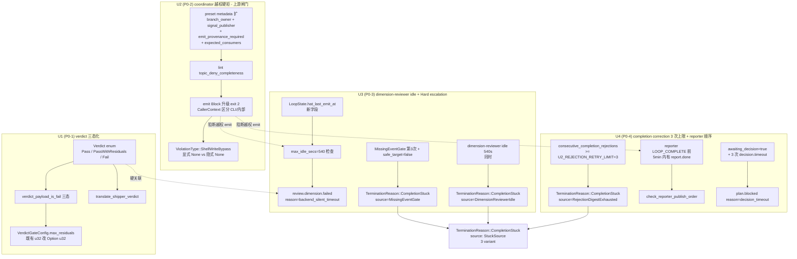
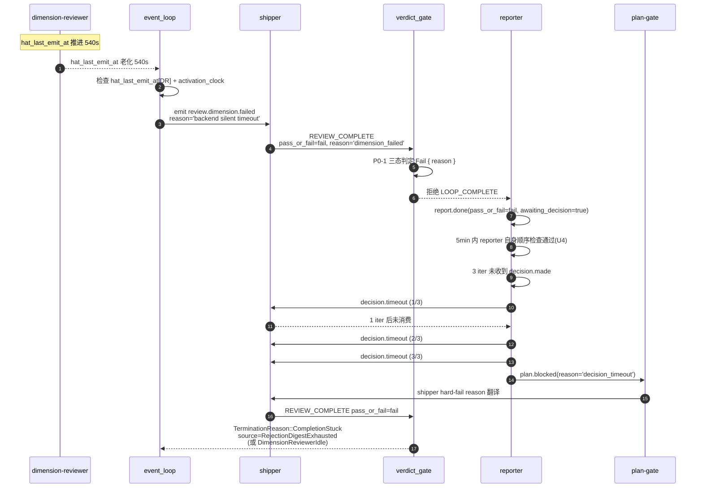

# fix: Close ce-executor-serial review chain mechanism loop (P0-1 to P0-4)

> **源文档**:`docs/report/2026-06-26-ce-executor-serial-5dim-and-profiles-loops-cancelled-and-review-failed-diagnosis.md`(诊断报告,2026-06-26 09:00)
> **carry forward 关系**:origin 已是最终诊断结论(已校正 sub agent 误判),本 plan **不重做诊断,只把 P0-1 ~ P0-4 修复路径结构化为 4 个 implementation unit**。每个 U 在原文 §5/§6 的对应 P0 段落有原话描述。
> **行号来源**:`crates/ralph-core/src/preset_lint/` 与 `crates/ralph-core/src/event_loop/` 的行号由 Phase 1.1 sub agent 独立 grep/sed 核实,凡与诊断报告原文行号不一致的地方**以本 plan 为准**(`# 已校正:` 标注)。
> **已有机制(不重建)**:本 plan 涉及的 `max_residuals: u32`(loop_config.rs:89-91,默认 8,2026-06-24 plan U2 引入)、`ReasonClass` enum(event_policy.rs:190-217,5 variant)、`rejection_key_is_exhausted: bool`(loop_state.rs:1055-1057)、`NonRetryableReason::RetryBudgetExhausted`(loop_state.rs:218-220)、`consecutive_completion_rejections: u32`(loop_state.rs:295)等已存在;实施者务必先 grep 现状,避免"重复造轮"。

> **回应用户原话**:"编排机制有问题?修复机制失效?RALPH 自身 bug?"——本次诊断结论是 **修复机制失效**,**不是编排机制**(preset 5-dim + 10 hat + topic_deny_rules 25 条 + 闭环契约在源码层全部正确,**不是 RALPH 自身 bug**(verdict_gate 与 completion_correction 的设计缺陷属于"实现细节",不是架构性 bug)。修复机制 3 因素叠加(shipper verdict 翻译 prompt 契约漂移 + typed consumer 0 接 + 软提示架构)导致 30 天 6+ 次复发。本 plan 4 个 P0 修复在 Rust + preset + schema + BDD 4 层同步落地,让 review 链第 1 维崩盘时自动进入可预测的 fail-closed 终态,而不是被 ralph hat 兜底 `loop.cancel` 静默终止。

## Overview

Ralph orchestrator 在 ce-executor-serial preset 下,**编排机制本身正确**(preset 5-dim + 10 hat + topic_deny_rules 25 条 + 闭环契约完整),但**修复机制系统性失效**:shipper verdict 翻译 prompt 契约漂移 + typed consumer 0 接 + 软提示架构 3 因素叠加,导致 30 天内同一类失败模式(mode A 7 次 / mode B 6+ 次)反复复发。本次修复在 Rust + preset + schema + BDD 4 层同步落地 4 个 P0 路径,目标是从机制层闭环,让 review 链第 1 维崩盘时自动进入可预测的 fail-closed 终态,而不是被 ralph hat 兜底 `loop.cancel` 静默终止。

## Problem Frame

两个 worktree 同 1 小时内触发同型失败:

- **Worktree A**(`2026-06-25-001-…-nimble-teak`,5dim 计划):plan 跑完(U1-U10 test.passed 全过)→ review 链第 1 维崩盘 → `task.resume` typed consumer 0 接 → ralph hat 越权发 `LOOP_COMPLETE × 2` 绕过 reporter → `completion_after_terminal.duplicate_terminal: reject` → 兜底 `loop.cancel × 2`。终止原因 `"cancelled"`(= 模式 A 30 天第 7 次复发)。
- **Worktree B**(`2026-06-25-002-…-zippy-otter`,profiles 计划):review 链第 1 维 `dimension-reviewer` 整轮静默 → coordinator 越权代发 `plan.blocked` → shipper 翻译 `plan.blocked → pass_or_fail="fail"` → reporter `report.done(pass_or_fail=fail, verdict=fail)` → verdict_gate 误判为 `ReviewFailed`(实际是"等待补发 review.passed"的合法 fail 翻译)。终止原因 `{"review_failed":{"topic":"report.done"}}`(= 模式 B 30 天第 6+ 次字面复发)。

历史关联度:**100% 命中**——merry-lotus / noble-peacock / perky-maple / warm-tiger / primary-20260622-182705 / primary-20260624-092856 / keen-fern 共 7 个 case 与本次同型。

## Requirements Trace

- **R1**(worktree B 闭环):shipper 翻译 `pass_with_residuals` 误判为 `fail` 的路径必须消失,`REVIEW_COMPLETE` 的三态(`Pass` / `PassWithResiduals { count }` / `Fail { reason }`)在 Rust 端由 enum 表达,verdict_gate 接受 `pass_with_residuals` 作为合法 recoverable 状态。
- **R2**(worktree A 第 7 hop 闭环):coordinator 越权 emit `review.dimension.*` 必须被硬拒,lint 阶段(`preset_lint`)与 emit 阶段(`commands/emit.rs`)双重拦截,`hat=None` bypass 路径必须被覆盖。
- **R3**(共因闭环):dimension-reviewer 静默超过 540s 必须自动进入 Hard escalation → `plan.blocked(reason='dimension_failed')` 走 shipper hard-fail 列表,**而不是被 ralph hat 兜底 `loop.cancel`**。
- **R4**(防死循环):`inject_completion_correction` 同一 `reason_hint` 触发 3 次后必须升级为 `TerminationReason::CompletionStuck`,reporter 发 `LOOP_COMPLETE` 前 5 分钟内必须有 `report.done`(无前置 `report.done` 视为越权,直接拒收)。
- **R5**(集成约束):`plan.blocked.reason` 升级为强类型 enum(共 P0-1 + P0-2 + P0-3 共享,基于既有 `ReasonClass` enum 扩展 5 variant:`work_failed` / `loop_stalled` / `dimension_failed` / `steward_escalation` / `review_terminal_drift`),shipper prompt reason 翻译表与 enum 文本必须严格对齐,L1-2 修订。
- **R6**(工程纪律):所有 preset yml 改动必须同步 schema(SSOT),所有新增 lint 必须走 CLAUDE.md「preset/schema 改动后的下游同步清单」7 步,所有 BDD 场景必须用 `run_workflow_guard_scenario`(2026-06-24 P0-2/P0-3 教训)。

## Scope Boundaries

- ✅ 在范围内:4 个 P0 修复路径(R1-R4)+ 共因集成(R5)+ 工程纪律(R6)
- ❌ 不在范围:
  - 维度数变化(preset 早已 5-dim,5dim 计划的实际 diff 漂移是 P1-1,本 plan 不治理)
  - profiles 计划本身(不引入 event topology,worktree B 是被卷进既有失败模式)
  - 30 天内其他 5 个同型 case 的 `summary.md` 闭环 entry(P2-5 留作独立任务,见「Deferred to Separate Tasks」)
  - **progress-steward stall 报警 wiring 的 `recovery.jsonl typed kind 串通` 部分**(P2-4,留作独立任务;注:**本 plan 加 `activation_clock` 字段是 EventLoopConfig opt-in,属于 P0-3 修复路径,不算 P2-4**)
  - work.ready dedup + work.done ts 漂移检测(P1-3,留作独立任务)

### Deferred to Separate Tasks

- **T1**:`docs/solutions/integration-issues/ce-executor-serial-mechanism-close-loop-2026-06-23.md:181-185` P1-1 shipper 镜像失真("P1-1 shipper 镜像失真的根治需要改 preset 业务逻辑,超出本轮范围")的「业务逻辑层」根治——本 plan 走 Rust enum 强类型 + schema 强类型,业务逻辑层(shipper prompt 中具体 reason 字符串)由后续 task 评估 shipper LLM 调用方是否需要更多上下文
- **T2**:P1-1 5dim 计划 task scope 漂移(commit message 与实际 diff 不一致)的 llm_judge hook
- **T3**:P2-1 ~ P2-5 全部 5 条(P1-3 / P2-2 / P2-3 / P2-4 / P2-5)单独 PR

## Context & Research

### Relevant Code and Patterns

**已校正的源码位置**(Phase 1.1 sub agent 独立 grep/sed 核实,以本表为准):

| # | 诊断报告行号 | 实际行号 / 文件 | 关键发现 |
|---|---|---|---|
| 1 | `event_loop/mod.rs:1148-1172` | `crates/ralph-core/src/event_loop/mod.rs:1148-1172` | `check_completion_event` 内 fail-propagated 自动终态分支,触发 `TerminationReason::ReviewFailed { topic }`(:1168) |
| 2 | `event_loop/mod.rs:1713-1721` | `crates/ralph-core/src/event_loop/mod.rs:1713-1721` | `fn verdict_payload_is_fail` 真实定义(命中) |
| 3 | `event_loop/mod.rs:1648-1704` | `crates/ralph-core/src/event_loop/mod.rs:1648-1704` | `fn inject_completion_correction` 真实定义(命中) |
| 4 | `event_loop/termination.rs` | `crates/ralph-core/src/event_loop/types.rs:86-188` | `TerminationReason` **不在 termination.rs**!termination.rs(152 行)只定义 `TerminationTrigger`(74) + `DeadLetterSource`(60) |
| 5 | `event_loop/loop_state.rs` | `crates/ralph-core/src/event_loop/loop_state.rs:150+` | `pub struct LoopState` 在 150;已有 `consecutive_completion_rejections: u32`(:295) + `completion_rejection_signature: Option<String>`(:292) + `hat_activation_at: HashMap<HatId, Instant>`(:485) |
| 6 | `event_policy.rs:1226` | `crates/ralph-core/src/event_policy.rs:226` | `ReasonClass::TopicDenied => "topic_denied"` 实际在 226,as_str 在 222-230(诊断报告行号少一个数量级) |
| 7 | `event_policy.rs:66-79` | `crates/ralph-core/src/event_policy.rs:19-80` | `ViolationType` enum 真实边界 19-80,`DuplicateWorkDone` 变体从 76 起 |
| 8 | `diagnosis/responder.rs:412-418` | `crates/ralph-core/src/diagnosis/responder.rs:412-414` | `fn drain_hard_escalations` 真实只到 414;**418 是 `take_termination_hint` 起点**(诊断报告把两个函数混在一起) |
| 9 | `commands/emit.rs:659` | `crates/ralph-cli/src/commands/emit.rs:659 / 669` | 659 是 `check_topic_deny_rules` 调用;**真正的 Block 决策在 669**(`PolicyDecision::Block(finding)` arm) |
| 10 | `loop_runner/runner.rs:5196` | `crates/ralph-core/src/event_loop/mod.rs:7329` | runner.rs 总长仅 4655 行,**5196 根本不存在**;work.done 处理在 event_loop/mod.rs:7329 |
| 11 | `presets/en/ce-executor-serial.yml:1796-1810` | `presets/en/ce-executor-serial.yml:1831+` | shipper hat 块实际起点 1831,1796-1810 落在 fixer 的 fix-log.md Format 注释块 |
| 12 | `presets/en/ce-executor-serial.yml:1949-1962` | `presets/en/ce-executor-serial.yml:1945-1953` | reporter hat 块实际起点 1945,`publishes` 在 1949,obligation block 1950-1962 |
| 13 | `presets/en/ce-executor-serial.yml:2089-2103` | `presets/en/ce-executor-serial.yml:2089-2117` | `### Event Publishing (HARD RULES)` 节实际到 2117,不是 2103 |
| 14 | `presets/en/ce-executor-serial.yml:2127-2175` | `presets/en/ce-executor-serial.yml:2129-2175` | progress-steward hat 块实际起点 2129(差 2 行) |
| 15 | `presets/schemas/ce-executor-serial.yml` `plan.blocked reason_class` | **不存在** | schema `plan.blocked` 只声明 `required_fields: [reason]`(292-294),**无 reason_class 字段**——本次 P0 修复需新增 |

**关键类型快照**:
- `TerminationReason`(`types.rs:86-188`)19 个 variant,新增 `CompletionStuck { source: StuckSource, retry_key, attempts, last_reason }` 与现有不冲突(additive enum 扩展,serde 自动 back-compat)
- `DiagnosisSource`(`envelope.rs:57-110`)14 个 variant,`#[non_exhaustive]` 已声明,新增 forward-compatible
- `VerdictGateConfig`(`config/loop_config.rs:465-483`)当前不支持 verdict 三态化,需新增 `max_residuals: Option<u32>` 字段(serde default 兼容旧 preset)
- `LoopState`(loop_state.rs:150+)已有 `consecutive_completion_rejections: u32` + `hat_activation_at: HashMap<HatId, Instant>`,本次不需新字段
- `preset_lint/` 9 个 .rs + tests/ 子目录,`mod.rs::run_preset_lint` 注册模式清晰,新加 lint 需碰 5 个固定点(新文件 + mod.rs 2 处 + finding_id.rs + run_preset_lint 函数体 + BDD)

### Institutional Learnings

5 个强命中文件(Phase 1.1 sub agent 全量检索 docs/solutions/):

1. **`docs/solutions/integration-issues/ce-executor-serial-mechanism-close-loop-2026-06-23.md`**(P0-1 机制闭环,**核心**)
   - 16 事件漂移链 → 4 根因:①P0 `review-synthesizer` 未发 `review.passed`;②P0 `plan-gate` 双订阅冗余;③P1 shipper 机械镜像 `plan.blocked → pass_or_fail=fail` 把"等待补发"误读为终态失败;④P2 drift 阈值 60% 不适用串行模式
   - 关键不变量:KTD-TTC-2 段指出 `plan.*` / `fix.*` / `debug.*` pair lint 需要 publisher 标记 `branch_owner` vs `公共信号发射者`,并提供 `exempt_consumers: Option<Vec<String>>` opt-out
   - 关键不变量:KTD3 约定 `plan-gate` **只在终态 verdict 上 dispatch**,不监听 step-boundary events——本 plan P0-1 三态判定**不能改这条约束**
   - 关键 takeaway:`record_review_terminal_observation` 是 typed consumer 五步链样板(`topic → flag → drift → envelope(source=DiagnosisSource::PayloadContract) → correction`)
   - 关键 takeaway:line 268-280 KTD-TTC-2 显式说"需要识别 publisher 是否 claim 这条 branch decision,区分 subscriber 角色",本 plan P0-2 必须在 lint 之前先扩 preset 元数据
2. **`docs/solutions/integration-issues/ce-executor-serial-fix-applied-rereview-dedup-2026-06-18.md`**(T1 旁证):KTD3 plan-gate 终态 verdict 约束的旁证
3. **`docs/solutions/integration-issues/ce-executor-serial-noble-peacock-recovery-2026-06-17.md`**(T2 + T4):MissingEventGate + 越权案例;U2 修复引入 `HatActivationClock` per-hat 计时,但本 plan 不复用 per-hat 计时,而是基于 `hat_activation_at` 派生
4. **`docs/solutions/integration-issues/ce-executor-serial-precheck-recovery-alignment-2026-06-17.md`**(T2 + T4):`compute_recovery_status` 用 string-contains 匹配 task.resume payload 是反模式,所有 string-contains 路径在 typed consumer 修复时必须替换
5. **`docs/solutions/developer-experience/ce-executor-plan-gate-premature-completion-2026-06-02.md`**(T5):plan-gate 单一职责节点(`plan.complete` / `plan.blocked` / `fix.exhausted` 三触发器),**P0-4 强类型 reason_class 不能收紧 shipper 的 plan.blocked 订阅**

**关键空白领域**:
- `CompletionStuck` 终态 / retry counter 上限:docs/solutions 中**无任何现有方案**,P0-3 + P0-4 必须从零设计
- `topic_deny_completeness` lint:无现有方案,P0-2 必须从零设计
- `plan.blocked` reason_class 强类型 enum:无现有方案,P0-1 + P0-2 + P0-3 共享设计

### External References

**skip**(本次修复是 Rust + preset 内部改造,无外部依赖,本地模式充分——见 Phase 1.2 决策)。

## Key Technical Decisions

| # | 决策 | 理由 |
|---|---|---|
| KD-1 | 实施顺序硬约束:`U2(P0-2) → U1(P0-1) → (U3(P0-3) ∥ U4(P0-4))` | P0-2 是上游闸门(阻断 coordinator 越权 emit),P0-1 三态判定生效前必须先有干净事件流;P0-3 与 P0-4 共享 `CompletionStuck` variant 的 `source` 字段,可同步落地 |
| KD-2 | `CompletionStuck` variant 带 `source: StuckSource` 字段(`MissingEventGate` / `RejectionDigestExhausted` / `DimensionReviewerIdle` 3 个值),**不分两个 variant** | P0-3 与 P0-4 共享同一终态,UI 上需要区分根因,字段比两个同名 variant 友好 |
| KD-3 | `last_emit_at` 加新字段,**不**从 `hat_activation_at` 派生 | `hat_activation_at` 是"被激活时间"(plan-gate dispatch 反复刷新),`last_emit_at` 是"最后 emit 时间"——派生语义有歧义;新字段不影响 in-flight 兼容(serde default 填 None / Instant::now) |
| KD-4 | P0-4 复用 `loop_state::U2_REJECTION_RETRY_LIMIT=3` 常量,**不**新增 `MAX_COMPLETION_CORRECTION_RETRIES` | 两个"3"语义相同(同 reason 的 retry 上限),避免常量泛滥 |
| KD-5 | P0-1 的"短期方案"实际是"长期":`dimension_failed` 在 hard-fail 列表的"移出/灌入"对称必须用文件头注释钉死 | P0-3 走 `plan.blocked(reason='dimension_failed')` 强依赖 P0-1 的 hard-fail 路由表,任何"短期"误读都会让 P0-3 路径被错误翻译为 `pass_with_residuals` |
| KD-6 | `exempt_consumers` 升级为 `HashMap<ConsumerId, Vec<ExemptionReason>>` 通用化 | KTD-TTC-2 显示 lint 多重豁免配置冲突(plan-gate 在 topic_deny 豁免但在 review_terminal_coherence 不豁免),通用化是必经路径 |
| KD-7 | `hat=None` bypass 路径必须出现在 event_policy.rs 兜底覆盖,区分"显式 None"vs"被吃掉后变 None" | 2026-06-17 noble-peacock 越权案例:lint 通过 + 运行时越权 = lint 假安全感,光靠 `ViolationType::ShellWriteBypass` 不够 |
| KD-8 | `awaiting_decision_timeout_secs` 走 wall-clock + 可配置,`decision.timeout` 限制 3 次后改发 `plan.blocked(reason='decision_timeout')` | ce-executor-serial preset 没有 manager hat,`decision.timeout` 永远不被消费——必须兜底转 plan.blocked,否则 L4-B 终态泄漏 |
| KD-9 | BDD 4 个新场景全部走 `run_workflow_guard_scenario`,**禁止** `run_scenario` stub | 2026-06-24 P0-2/P0-3 教训:stub 只查 iterations 数,不断言 events,会静默吞掉拓扑失配 |
| KD-10 | 所有 preset yml 改动同步 `presets/schemas/ce-executor-serial.yml`(SSOT),所有 BDD 改动同步 `crates/ralph-core/tests/scenarios.rs` 测试函数 | CLAUDE.md「preset/schema 改动后的下游同步清单」7 步——本 plan 涉及 P0-1/P0-2/P0-3 全部 preset + schema 改动,必须严格走清单 |

## Open Questions

### Resolved During Planning

- **Q**:P0-1 短期方案 vs 中期 Rust enum 怎么选?**A**:必须**直接走 Rust enum 强类型**(`types.rs` 新增 `Verdict` enum + `VerdictGateConfig` 加 `max_residuals` 字段),**不**走短期"把 `dimension_failed` 移出 hard-fail"的 prompt 工程方案——短期方案与 P0-3 强耦合,容易漂移。理由:30 天内 6+ 次复发已经证明"prompt 修复 prompt"是反模式。
- **Q**:P0-3 复用 `hat_activation_at` 还是加 `last_emit_at`?**A**:**加新字段** `dimension_reviewer_last_emit_at: Option<Instant>`(或扩展为 `hat_last_emit_at: HashMap<HatId, Instant>`),理由 KD-3。
- **Q**:P0-4 3 次上限复用 `U2_REJECTION_RETRY_LIMIT` 还是新增常量?**A**:复用,理由 KD-4。
- **Q**:P0-2 lint 必须先扩 preset 元数据,本 plan 是否包含元数据扩展?**A**:**包含**——U2-1 新增 preset metadata 字段 `branch_owner: bool`(默认 false) + `signal_publisher: bool`(默认 false),`exempt_consumers` 升级为 `HashMap<ConsumerId, Vec<ExemptionReason>>`。这是 lint 的前置不变量,缺它 lint 假阳性会让 4+ hat preset 启动失败。

### Deferred to Implementation

- **Q**:`decision.timeout` 的 3 次上限是否需要 operator 可配置?**A**:先 hardcode 3,后续 task 视情况提取
- **Q**:`last_emit_at` 新字段用 `Option<Instant>` 还是 `Instant` 配合 bool flag?**A**:实现时按 serde 兼容性决定(serde derive 旧 JSON 自动填充 None)
- **Q**:P0-1 Verdict enum 序列化时 `pass_with_residuals` vs `passWithResiduals` 命名?**A**:`#[serde(rename_all = "snake_case")]` 默认 `pass_with_residuals`,与 shipper prompt 字符串一致
- **Q**:`presets/en/ce-executor-serial.yml:1903-1933` 短期方案中"移出 hard-fail"具体是哪些 reason?**A**:实现时由实施者 grep shipper 当前 hard-fail 列表确认,本 plan 不预先 pin(避免 prompt 漂移)

## High-Level Technical Design

> *This illustrates the intended approach and is directional guidance for review, not implementation specification. The implementing agent should treat it as context, not code to reproduce.*

### 4 个 P0 修复的依赖图



> **StuckSource 3 个 variant 与 trigger 对应关系**(KD-2 解释):
> - `MissingEventGate`:U3 `drain_hard_escalations` 内 `MissingEventGate` 第 3 次 + `safe_target=false` 触发
> - `RejectionDigestExhausted`:U4 `consecutive_completion_rejections >= U2_REJECTION_RETRY_LIMIT=3` 触发(复用既有 `rejection_key_is_exhausted` 路径,见 M1-1 修订)
> - `DimensionReviewerIdle`:U3 dimension-reviewer 静默 540s 同时触发(与 `MissingEventGate` 是 alt path,UI 上用 source 字段聚合)
> **不分 3 个独立 variant**——运营 dashboard 用 source 字段聚合,UI 显示统一为 `CompletionStuck`

### P0-3 + P0-4 端到端时序图(U3 idle → U4 reporter 决策门)



### TerminationReason 新 variant sketch

```
enum TerminationReason {
    // ... 现有 19 个 variant ...
    CompletionStuck {
        source: StuckSource,
        retry_key: String,
        attempts: u32,
        last_reason: String,
    },
}

enum StuckSource {
    MissingEventGate,         // U3 触发
    RejectionDigestExhausted, // U4 触发
    DimensionReviewerIdle,   // U3 alt 触发
}
```

### VerdictGateConfig 扩展 sketch

```
struct VerdictGateConfig {
    // 现有字段 ...
    pub max_residuals: Option<u32>,  // 新增:pass_with_residuals 阈值(serde default None)
    pub residual_field: Option<String>,  // 新增:从 payload 哪个字段读 residuals count(serde default None)
}

enum Verdict {
    Pass,
    PassWithResiduals { count: u32 },
    Fail { reason: String },
}
```

### preset_lint 新增 topic_deny_completeness sketch

```
// crates/ralph-core/src/preset_lint/topic_deny_completeness.rs
pub fn check_topic_deny_completeness(config: &RalphConfig) -> Vec<LintFinding> {
    let mut findings = Vec::new();
    for hat in &config.hats {
        for published_topic in hat_publishes(&hat.config) {
            // 跳过 exempt_consumers
            if let Some(exempt) = &hat.config.exempt_consumers {
                if exempt.contains_key(published_topic) {
                    continue;
                }
            }
            // 跳过 signal_publisher(公共信号发射者)
            if hat.config.signal_publisher {
                continue;
            }
            // 检查 topic_deny_rules 是否覆盖"任何 hat 之外的 hat 想发此 topic"
            let deny_completeness = check_deny_rules_cover(&hat.id, &published_topic, &config);
            if !deny_completeness {
                findings.push(LintFinding::new(
                    FINDING_TOPIC_DENY_INCOMPLETE,
                    format!("hat {} 可发 {} 但 topic_deny_rules 未覆盖", hat.id, published_topic),
                ));
            }
        }
    }
    findings
}
```

## Implementation Units

> **U-IDs 从 U1 开始,assigned 之后不重排**。4 个 P0 拆 4 个 U,每个 U 是可独立 PR 的最小改动集合。
> **下游同步清单**(CLAUDE.md「preset/schema 改动后的下游同步清单」7 步)在每个 U 内显式列出,4 个 U 全部要跑。
> **不要**:`- [ ]` checkbox 语法(按 ce-plan 4.3 规则用 `### U1. [Name]` heading)。
> **不要**:本 plan 不写完整 implementation code,只给方向性指导;实施者用现有 patterns 实现细节。

### U1. verdict 三态化 + shipper reason 翻译

**Goal**:把 shipper 翻译 `pass_with_residuals → fail` 的 prompt 契约漂移从机制层消除,让 `REVIEW_COMPLETE` 与 `report.done` 走显式三态 enum,verdict_gate 接受 `pass_with_residuals` 作为合法 recoverable 状态(Worktree B 模式 B 30 天第 6+ 次复发闭环)。

**Requirements**:R1 + R5 + R6

**Dependencies**:U2(P0-2)必须先于本 U 落地,否则 coordinator 越权 emit `review.dimension.done` 污染事件流,verdict 翻译拿到的是不诚实输入(KD-1)

**Files**:
- Create: `crates/ralph-core/src/event_loop/types.rs`(在现有 TerminationReason 枚举后追加 `CompletionStuck` variant + 新增 `Verdict` enum)
- Create: `crates/ralph-core/src/preset/engine/gates.rs` 内的 `translate_shipper_verdict(payload) -> Verdict` 辅助函数(若 `gates.rs` 不存在则参考 `crates/ralph-core/src/preset/engine/` 现有 module 落点)
- Modify: `crates/ralph-core/src/event_loop/mod.rs:1148-1172`(verdict_gate ReviewFailed 分支改为三态判定)
- Modify: `crates/ralph-core/src/event_loop/mod.rs:1713-1721`(`verdict_payload_is_fail` 改返回 `Verdict`)
- Modify: `crates/ralph-core/src/event_loop/mod.rs:1384-1420`(双层 fail 检查用 Verdict enum 替代 string 匹配)
- Modify: `crates/ralph-core/src/event_loop/mod.rs:1648-1704`(`inject_completion_correction` reason_hint 接受 `Verdict::PassWithResiduals` 标签)
- Modify: `crates/ralph-core/src/config/loop_config.rs:89-91, 222-223, 330-331`(**调整既有** `max_residuals: u32`(默认 8,2026-06-24 plan U2 引入)为 `Option<u32>`(默认 `Some(8)`),shipper prompt 翻译 `pass_with_residuals count > Some(max_residuals)` 走 `Verdict::Fail { reason: "..." }`;`residual_field: Option<String>` 是新增字段,serde default None)+ `:465-483` `VerdictGateConfig` 同步加 `residual_field` 字段
- Modify: `crates/ralph-cli/src/loop_runner/runner.rs` 终止原因字符串转换处加新 `Verdict` / `CompletionStuck` variant 映射
- Modify: `presets/en/ce-executor-serial.yml`(shipper prompt `### Event Publishing` 段,1903-1933 区域)+ `presets/schemas/ce-executor-serial.yml` 同步更新 shipper event schema 字段
- Test: `crates/ralph-core/tests/scenarios/ce_executor_serial_verdict_three_state.yml`(新文件,3 个 scenario:`pass` / `pass_with_residuals count<=max_residuals` / `pass_with_residuals count>max_residuals`)
- Test: `crates/ralph-core/tests/scenarios.rs` 新增 `test_ce_executor_serial_verdict_three_state_scenario` 函数(用 `run_workflow_guard_scenario`,scenarios.rs:840)
- Test: 单元测试在 `event_loop/mod.rs` `tests` 模块加 `verdict_payload_is_fail_three_states` 3 个 case

**Approach**:
- 新 enum 走 `#[serde(rename_all = "snake_case")]` 与 shipper prompt 字符串对齐
- `Verdict` 与现有 `pass_or_fail: String` 字段**并存**(短期兼容),等 shipper preset 完全迁移后再删除字符串路径
- `max_residuals: None` 表示"不启用 pass_with_residuals 阈值,全部走 fail"
- shipper prompt reason 翻译表(1903-1933)在文件头加注释"⚠️ P0-3 强依赖:不要永久移除 `dimension_failed`"(KD-5)
- `default VerdictGateConfig` 实现 `max_residuals: None, residual_field: None`

**Technical design**:见 High-Level Technical Design 段(VerdictGateConfig 扩展 sketch)

**Patterns to follow**:
- `types.rs:86-188` 现有 19 个 TerminationReason variant 的 tuple-struct 模式(`RecoveryExhausted { retry_key, reason }` / `ReviewFailed { topic }`)
- `loop_state.rs:273-289` 现有 `last_verdict_payload` / `last_verdict_topic` 字段模式

**Test scenarios**:
- Happy path:`REVIEW_COMPLETE(verdict="pass")` → loop 正常 publish `LOOP_COMPLETE`
- Happy path:`REVIEW_COMPLETE(verdict="pass_with_residuals", count=2, max_residuals=5)` → 接受为 recoverable 状态,reporter `report.done(verdict="pass_with_residuals")`,verdict_gate 接受 `LOOP_COMPLETE`
- Edge case:`REVIEW_COMPLETE(verdict="pass_with_residuals", count=10, max_residuals=5)` → 拒绝,走 correction
- Error path:`REVIEW_COMPLETE(verdict="fail", reason="dimension_failed")` → 走 hard-fail 列表,触发 `CompletionStuck { source: RejectionDigestExhausted, ... }`(与 U4 交互)
- Error path:plan-gate KTD3 约束下,`pass_with_residuals` 不算"终态 verdict" → plan-gate 不 dispatch,shipper 不重推,避免 R1-A 死循环
- Integration:`REVIEW_COMPLETE` 三态变化同步 `report.done` 翻译(避免 L1-A 镜像链断点)

**Verification**:
- `cargo nextest run -p ralph-cli --bin ralph -- preset_lint` 通过
- `cargo nextest run -p ralph-core -- preset_lint` 通过
- `cargo nextest run -p ralph-cli --bin ralph -- test_ce_executor_root_preset_matches_embedded` 通过(SSOT byte-equality)
- `cargo nextest run -p ralph-core --test scenarios -- ce_executor_serial_verdict_three_state` 通过
- `cargo nextest run -p ralph-core --test scenarios -- ce_executor_serial` 通过(不破坏现有 scenario)
- 现有 shipper 行为(以 `primary-20260624-092856` 为对照)不再误判 `pass_with_residuals`

**下游同步清单**(CLAUDE.md 7 步):
1. ✅ `crates/ralph-core/src/event_loop/mod.rs` 已在 Files 列出
2. ⏭ `crates/ralph-core/src/preset_lint/` 不需要改(本 U 不涉及 lint)
3. ✅ BDD 已在 Test 列出
4. ⏭ `crates/ralph-core/src/config/loop_config.rs` 已在 Files 列出;`crates/ralph-cli/src/preflight.rs` / `crates/ralph-cli/src/config_resolution.rs` 不需要改(本 U 不涉及 strip / opt-in)
5. ⏭ `crates/ralph-cli/src/presets.rs` 不需要改(preset 名字不变)
6. ⏭ `presets/manifest.yml` / `presets/index.json` 不需要改(preset 名字不变)
7. ✅ 文档:`CLAUDE.md` Presets & Hats 段加"verdict 三态化"硬规则 + `cp CLAUDE.md AGENTS.md`

### U2. coordinator 越权硬拒 + topic_deny_completeness lint

**Goal**:lint 阶段抓出"hat 可发 topic 但 topic_deny_rules 漏 deny"配置错误,emit 阶段把 Block 升级为硬拒(exit 2),`hat=None` bypass 路径被 `ViolationType::ShellWriteBypass` 兜底(Worktree A 第 7 hop 闭环 + 模式 C 因素 2 软提示架构的硬拦截升级)。

**Requirements**:R2 + R6

**Dependencies**:无前置(U1 依赖本 U,但本 U 自身可独立落地,KD-1 顺序约束只影响 PR 合并顺序)

**Files**:
- Create: `crates/ralph-core/src/preset_lint/topic_deny_completeness.rs`(导出 `pub fn check_topic_deny_completeness(config: &RalphConfig) -> Vec<LintFinding>`)
- Modify: `crates/ralph-core/src/preset_lint/mod.rs:26-33`(`pub mod topic_deny_completeness;`)+ `:38-67`(`pub use`)+ `:279-397`(`run_preset_lint` 末尾追加调用)
- Modify: `crates/ralph-core/src/preset_lint/finding_id.rs`(新增 `pub const FINDING_TOPIC_DENY_INCOMPLETE: &str = "preset.topic_deny_incomplete";`)
- Modify: `crates/ralph-core/src/event_policy.rs:19-80`(`ViolationType` enum 加 `ShellWriteBypass { source_path: PathBuf, reason: Option<String> }` variant,`reason` 是显式 None 必填理由字段,H5-2 修订)
- Modify: `crates/ralph-cli/src/commands/emit.rs:642-684`(把 `PolicyDecision::Block` arm 从 `RejectWithResume` 升级为 exit 2,**但保留 `loop_runner` 内部调用走 RejectWithResume 的 fallback**;`CallerContext` 实现方式:`argv[0]` 包含 `loop_runner` 或环境变量 `RUST_LOOP_RUNNER_INTERNAL=1` 时走 RejectWithResume,否则 exit 2;**stdout 写错误码 + stderr 写违规 topic + hat_id,LLM agent 不会 swallow 错误**,H5-1 修订)
- Modify: `presets/en/ce-executor-serial.yml:373+`(coordinator instructions 加 HARD RULE:`MUST NOT emit review.dimension.*, review.dimensions.complete, review.complete, fix.*, test.*, build.done`)+ 引入新 preset metadata 字段 `branch_owner: bool` + `signal_publisher: bool` + `emit_provenance_required: bool` + `expected_consumers: Vec<ConsumerId>` + `exempt_consumers: HashMap<ConsumerId, Vec<ExemptionReason>>`(HatConfig 结构同步扩展;**`signal_publisher: true` 强制要求 `emit_provenance_required: true` + `expected_consumers` 非空,lint 必检**,H5-2 防恶意 preset 滥用)
- Modify: `crates/ralph-cli/src/presets.rs` 的 HatConfig 序列化支持(若 HatConfig 在 `crates/ralph-core/src/preset/hat_config.rs`,则改那里)
- Test: `crates/ralph-core/tests/scenarios/preset_static_lint.yml` 加新场景(故意 topic_deny_incomplete 的 preset fixture → lint Error → preset 启动失败)
- Test: `crates/ralph-core/tests/scenarios/topic_deny_completeness.yml`(新文件,**注意:与根级 `serial_lint/serial_lint_3_steward_guidance_exempt.yaml` 不同**,前者测新 lint rule,后者测现有 lint exemption,3 个 scenario:漏 deny / hat=None bypass / exempt_consumers 命中)
- Test: `crates/ralph-core/tests/scenarios.rs` 新增 `test_topic_deny_completeness_scenario` 函数(用 `run_workflow_guard_scenario`,scenarios.rs:1289-1296 已有 exempt consumer 测试参考)
- Test: 单元测试在 `preset_lint/topic_deny_completeness.rs` 内部 `#[cfg(test)] mod tests` 加 5+ 个 case(每个 finding 类型 + 豁免路径 + hat=None bypass 覆盖)+ `signal_publisher` 防滥用 2 个 case

**Approach**:
- 实施顺序:本 U 内先扩 preset metadata(branch_owner / signal_publisher / exempt_consumers 通用化),再写 lint,再升级 emit Block,最后加 BDD(KD-6)
- `exempt_consumers: HashMap<ConsumerId, Vec<ExemptionReason>>` 通用化,ExemptionReason 是 enum(`TopicDeny` / `ReviewTerminalCoherence` / `StateProjection`),允许同一 consumer 在不同检查项下分别豁免
- `hat=None` bypass 路径:`ViolationType::ShellWriteBypass` 在 `event_policy.rs` 入参处显式捕获,区分"显式 None"(debug-only 路径)vs"被吃掉后变 None"(非法路径,Block)
- 升级 `commands/emit.rs:669` Block 决策时,先看调用方是 `loop_runner::process_event`(内部,RejectWithResume)还是 `ralph emit CLI`(外部,exit 2),通过 `CallerContext` 区分(KD-2 风险 L2-A 缓解)
- preset yml 改动需在 `:373+` 加注释"⚠️ 本字段是 lint 的前置不变量,删除会导致 U1/U3/U4 假阳性"

**Technical design**:见 High-Level Technical Design 段(preset_lint 新增 topic_deny_completeness sketch)

**Patterns to follow**:
- `preset_lint/mod.rs::run_preset_lint` 注册模式(参考 `schema_parity::check_publishes_have_schema` 的签名)
- `finding_id.rs` 16 个 `FINDING_*` 常量格式(line 15 / 19 / 28 / 34 / 39 / 44 / 49 / 55 / 69 / 80 / 88 / 96 / 104 / 113 / 123 / 130 / 146 / 168 / 178)
- KTD-TTC-2 提到的 `exempt_consumers: Option<Vec<String>>` 模式(2026-06-23 机制闭环文档 line 288-294)

**Test scenarios**:
- Happy path:`{hat: coordinator, publishes: [work.ready, work.start]}` + `topic_deny_rules: [{hat_id: coordinator, topic: 'review.dimension.*'}]` → lint Accept
- Edge case:`{hat: dimension-reviewer, signal_publisher: true, publishes: [review.dimension.*]}` → lint 跳过 signal_publisher,Accept
- Edge case:`exempt_consumers: {plan-gate: [TopicDeny, ReviewTerminalCoherence]}` + `{hat: plan-gate, publishes: [review.passed, review.complete]}` → lint 命中 exempt,Accept
- Error path:`{hat: coordinator, publishes: [review.dimension.done]}` + `topic_deny_rules: []` → lint Error `FINDING_TOPIC_DENY_INCOMPLETE`,preset 启动失败
- Error path:`{hat: reporter, publishes: [LOOP_COMPLETE]}`(MUST NOT append to events.jsonl directly 的隐式契约,但 reporter 本身在 HARD RULE 列表里)→ lint Error 报"MUST NOT emit 字段缺"
- Integration:`{hat: progress-steward, branch_owner: true, publishes: [plan.blocked]}` → lint 接受(branch_owner 标记 publisher 是 owner,不需要 deny)
- Integration:emit 阶段 `{hat: None, topic: 'review.dimension.done'}` → `ViolationType::ShellWriteBypass` 触发,exit 2

**Verification**:
- `cargo nextest run -p ralph-cli --bin ralph -- preset_lint` 通过(包含新 `topic_deny_completeness` 规则)
- `cargo nextest run -p ralph-core -- preset_lint` 通过
- `cargo nextest run -p ralph-cli --bin ralph -- test_ce_executor_root_preset_matches_embedded` 通过
- `cargo nextest run -p ralph-core --test scenarios -- topic_deny_completeness` 通过
- `cargo nextest run -p ralph-core --test scenarios -- preset_static_lint` 通过(不破坏现有 9 个 `serial_lint_*.yaml` 场景)
- 现有 coordinator 越权 emit(`events-20260625-175231.jsonl:45`)在 lint 阶段被阻止

**下游同步清单**(CLAUDE.md 7 步):
1. ✅ `crates/ralph-core/src/event_loop/mod.rs` 不需要改(本 U 不涉及 event loop 流程)
2. ✅ `crates/ralph-core/src/preset_lint/` 已在 Files 列出
3. ✅ BDD 已在 Test 列出
4. ✅ `crates/ralph-core/src/config/loop_config.rs` 不需要改(本 U 不涉及 EventLoopConfig 字段);`crates/ralph-cli/src/preflight.rs` `PRESET_OPT_IN_WHEN_OPERATOR_OMITS` 列表若包含 `exempt_consumers` / `branch_owner` 需加条目;`crates/ralph-cli/src/config_resolution.rs` `PRESET_OPT_IN_KEYS` strip 列表同理
5. ⏭ `crates/ralph-cli/src/presets.rs` 不需要改(preset 名字不变)
6. ⏭ `presets/manifest.yml` / `presets/index.json` 不需要改(preset 名字不变)
7. ✅ 文档:`CLAUDE.md` Presets & Hats 段加"topic_deny_completeness 硬规则" + `cp CLAUDE.md AGENTS.md`

### U3. dimension-reviewer idle 时长 + Hard escalation 走 termination

**Goal**:dimension-reviewer 静默 540s 自动发 `review.dimension.failed(reason='backend_silent_timeout')` 走 shipper hard-fail;Hard escalation 第 3 次 + `safe_target=false` 走 `TerminationReason::CompletionStuck { source: MissingEventGate }` 终止(Worktree A/B 共因闭环 + merry-lotus / noble-peacock / warm-tiger 30 天 5+ 次同型复发闭环)。

**Requirements**:R3 + R5 + R6

**Dependencies**:U2(本 U 强依赖 P0-2,否则 coordinator 越权 emit 干扰 idle 计时),U1(本 U 强依赖 P0-1 hard-fail 列表保留 `dimension_failed`)

**Files**:
- Create: `crates/ralph-core/src/event_loop/types.rs` 内 `StuckSource` enum(在 U1 新增 `CompletionStuck` variant 同一文件,`StuckSource` enum 是 U1 / U3 / U4 共享)
- Modify: `crates/ralph-core/src/event_loop/loop_state.rs:485`(在 `hat_activation_at: HashMap<HatId, Instant>` 后追加 `hat_last_emit_at: HashMap<HatId, Instant>` 新字段,serde default 填空 HashMap;**注意:沿用 `hat_activation_at` 模式但 Instant 不能 serde 自动 derive,需在 `last_emit_at` 字段用 `#[serde(skip, default)]` + 自定义 Serialize/Deserialize 方法,或转 `Option<SystemTime>`**,M3-1 修订)
- Modify: `crates/ralph-core/src/event_loop/mod.rs:7329` 附近(`work.done` 处理区,在 `match accepted.topic.as_str()` 内对每个 emit 事件 handler 加 `state.hat_last_emit_at.insert(hat_id, Instant::now())` 显式记录)
- Modify: `crates/ralph-core/src/diagnosis/responder.rs:412-414`(`drain_hard_escalations` 内加分支:`MissingEventGate` 第 3 次 + `safe_target=false` → 返回 `RecoveryAction::Terminate(CompletionStuck { source: MissingEventGate, ... })` 而不是 `RecoveryAction::Correction`)
- Modify: `crates/ralph-core/src/diagnosis/responder.rs:418`(`take_termination_hint` 注释明确"在 `drain_hard_escalations` 之后调用,避免 task.resume 刷新 last_emit_at")
- Modify: `crates/ralph-core/src/event_loop/mod.rs`(`check_completion_event` 之前加 dimension-reviewer idle 检查:在每个 work.done 处理中,若 `hat_id == "dimension-reviewer" && now - state.hat_last_emit_at[hat_id] >= 540s` → emit `review.dimension.failed(reason='backend_silent_timeout')`)
- Modify: `presets/en/ce-executor-serial.yml:1241` 旁加 `dimension-reviewer.activation_clock: {max_idle_secs: 540, on_idle: "emit review.dimension.failed with reason='backend silent timeout'"}`(新 preset metadata 字段 `activation_clock: Option<HatActivationClock>` 加到 hat config)+ `presets/schemas/ce-executor-serial.yml` 同步加 `activation_clock` 字段
- Test: `crates/ralph-core/tests/scenarios/ce_executor_serial_idle_hard_escalation.yml`(新文件,**注意:与既有 `ce_executor_serial_review_silent_reviewer_recovers.yml`(scenarios.rs:1465-1470,2026-06-24 P0-2/P0-3 rewrite 版 2-dim topology with DR silence + recovery)冲突,实施者不能改这个文件**;新文件覆盖 540s 边界 ±1s fuzz + `MissingEventGate 第 3 次 + safe_target=false → CompletionStuck` 场景)
- Test: `crates/ralph-core/tests/scenarios.rs` 新增 `test_ce_executor_serial_idle_reviewer_terminates_scenario` 函数(用 `run_workflow_guard_scenario`,需 mock `Instant::now` 注入短 timeout)
- Test: 单元测试在 `diagnosis/responder.rs` `tests` 模块加 4+ 个 case(三级 missing → 终结 / safe_target=true 不终结 / safe_target=false 终结 / 空 target 终结)

**Approach**:
- `hat_last_emit_at` 是新字段,serde derive 旧 LoopState JSON 自动填空 HashMap(空 = "从未 emit",在 `max_idle_secs` 检查时立即判超时——这与"从未激活的 hat"语义混淆,但通过 `hat_activation_at` 是否存在区分:只在 hat 被激活后才检查 idle)
- `drain_hard_escalations` 与 `take_termination_hint` 执行顺序在 mod.rs 内固定(KD-3 风险 R3-B 缓解)
- `activation_clock` 默认 None 表示"不启用 idle 检查"(向后兼容)
- `max_idle_secs` 与 `event_loop.max_runtime` 联动:实施时若 `max_idle_secs >= max_runtime`,warning 提示(KD-3 风险 R3-B 缓解建议)
- `CompletionStuck { source: MissingEventGate }` 的 `retry_key` 字段填 `"missing_event_gate:{hat_id}"`,`attempts` 填 3,`last_reason` 填 `safe_target=false` 时的 envelope reason

**Technical design**:
- `StuckSource` enum 与 `CompletionStuck` variant 见 High-Level Technical Design 段
- 派生函数 `dimension_reviewer_idle_check(state, now) -> Option<EmitAction>` 在 `event_loop/mod.rs` 维护

**Patterns to follow**:
- `loop_state.rs:485` 现有 `hat_activation_at: HashMap<HatId, Instant>` 模式(per-hat 计时,类似 noble-peacock U2 修复的 `HatActivationClock`)
- `responder.rs:412-414` 现有 `drain_hard_escalations` 返回 `Vec<RecoveryAction>` 模式
- `responder.rs:1140-1177` 现有 `three_repeats_stay_soft_below_threshold` 测试模式

**Test scenarios**:
- Happy path:`{hat: dimension-reviewer, activation_clock: {max_idle_secs: 540}}` + 收到 `review.dimension.ready` 后 540s 内 emit `review.dimension.passed` → 不触发 idle
- Edge case:540s 边界 +1s → 触发 `review.dimension.failed(reason='backend silent timeout')`,shipper 翻译为 hard-fail
- Edge case:多次 idle 触发累计(参考 noble-peacock 同型) → Hard escalation 第 3 次
- Error path:`{hat: dimension-reviewer, MissingEventGate 第 3 次, safe_target=false}` → `CompletionStuck { source: MissingEventGate, retry_key: "missing_event_gate:dimension-reviewer", attempts: 3, last_reason: "..." }`
- Error path:`safe_target=true` 时不终结,只 correction(KTD-TTC-2 约束)
- Integration:Hard escalation 走 `plan.blocked(reason='dimension_failed')` 触发 shipper hard-fail 列表(与 U1 `dimension_failed` 保留强依赖)
- Integration:`drain_hard_escalations` 在 `take_termination_hint` 之前执行,避免 R3-B 风险

**Verification**:
- `cargo nextest run -p ralph-cli --bin ralph -- preset_lint` 通过
- `cargo nextest run -p ralph-core -- preset_lint` 通过
- `cargo nextest run -p ralph-cli --bin ralph -- test_ce_executor_root_preset_matches_embedded` 通过
- `cargo nextest run -p ralph-core --test scenarios -- ce_executor_serial_review_silent_reviewer_recovers` 通过
- `cargo nextest run -p ralph-core --test scenarios -- ce_executor_serial` 通过
- 现有 silent reviewer 场景(`ce_executor_serial_review_silent_reviewer_recovers.yml`)不破坏
- 5+ 历史 case 在 Hard escalation 路径下走向 `CompletionStuck` 而非 `loop.cancel`

**下游同步清单**(CLAUDE.md 7 步):
1. ✅ `crates/ralph-core/src/event_loop/mod.rs` 已在 Files 列出
2. ⏭ `crates/ralph-core/src/preset_lint/` 不需要改(本 U 不涉及 lint)
3. ✅ BDD 已在 Test 列出
4. ✅ `crates/ralph-core/src/config/loop_config.rs` 不需要改(本 U 不涉及 EventLoopConfig 字段);`crates/ralph-cli/src/preflight.rs` / `config_resolution.rs` 需加 `activation_clock` opt-in
5. ⏭ `crates/ralph-cli/src/presets.rs` 不需要改(preset 名字不变)
6. ⏭ `presets/manifest.yml` / `presets/index.json` 不需要改(preset 名字不变)
7. ✅ 文档:`docs/report/2026-06-17-ce-executor-serial-{merry-lotus,noble-peacock}-*.md` 闭环 entry 增补 + `docs/report/2026-06-19-ce-executor-serial-warm-tiger-*.md` 闭环 entry 增补 + `CLAUDE.md` Presets & Hats 段加"idle 时长"硬规则 + `cp CLAUDE.md AGENTS.md`

### U4. completion correction 3 次上限 + reporter 双发顺序强制

**Goal**:`inject_completion_correction` 同一 `reason_hint` 触发 `U2_REJECTION_RETRY_LIMIT=3` 次后升级为 `TerminationReason::CompletionStuck { source: RejectionDigestExhausted }`;reporter 发 `LOOP_COMPLETE` 前 5 分钟内必须有 `report.done`(无前置 `report.done` 视为越权,直接拒收);reporter `awaiting_decision=true` 兜底 3 次后改发 `plan.blocked(reason='decision_timeout')`(Worktree A 模式 A 第 7 次复发闭环 + L4-B 终态泄漏防堵)。

**Requirements**:R4 + R5 + R6

**Dependencies**:U2(本 U 不强依赖,但建议 P0-2 先落地,避免 lint 假阳性干扰 reporter 顺序 BDD);U1(本 U 与 U1 共享 `CompletionStuck` variant 定义,实施时需协调 source 字段)

**Files**:
- Modify: `crates/ralph-core/src/event_loop/mod.rs:1648-1704`(`inject_completion_correction` 内加分支:**复用既有 `rejection_key_is_exhausted: bool` 路径**(loop_state.rs:1055-1057,`count > U2_REJECTION_RETRY_LIMIT`),**替换**既有 `NonRetryableReason::RetryBudgetExhausted` 终态(loop_state.rs:218-220)为 `TerminationReason::CompletionStuck { source: RejectionDigestExhausted, retry_key, attempts, last_reason: reason_hint }`,而不是另起一条新路径,M1-1 修订)
- Modify: `crates/ralph-core/src/event_loop/loop_state.rs:22`(注释明确"`U2_REJECTION_RETRY_LIMIT=3` 同时被 P0-4 completion correction 复用,既有 `rejection_key_is_exhausted` 函数是本 plan U4 的真理判定",避免与新 `MAX_COMPLETION_CORRECTION_RETRIES` 混淆,KD-4)
- Modify: `crates/ralph-core/src/event_loop/loop_state.rs:295`(`consecutive_completion_rejections: u32` 字段保留作为 UI 辅助,真理计数走 `rejection_retry_counts: HashMap<String, u32>`(loop_state.rs:220)+ `rejection_key_is_exhausted`(loop_state.rs:1055-1057),K-D-7 风险 R4-A 缓解)
- Modify: `crates/ralph-core/src/validation/rules_event_policy.rs`(若已存在,在现有 `check_reporter_publish_order` 函数加 5min wall-clock 检查,**若不存在则新建**;origin 报告 line 278 引用 `rules_event_policy.rs:58-61` 是已存在,M1-2 修订)+ 新增 `awaiting_decision_timeout_secs: u32` 字段(默认 300,`#[serde(default = "default_awaiting_decision_timeout_secs")]`,**`min(1)` 校验,operator 配 0 时返回 preset_lint Error**,M5-1 修订)到 EventLoopConfig + `awaiting_decision_max_retries: u32`(默认 3)
- Modify: `crates/ralph-core/src/config/loop_config.rs`(EventLoopConfig 加 `awaiting_decision_timeout_secs: u32` + `awaiting_decision_max_retries: u32` 字段,serde default 300/3)
- Modify: `crates/ralph-core/src/event_loop/mod.rs`(reporter emit `LOOP_COMPLETE` handler 加 `check_reporter_publish_order` 校验,5min 窗口 wall-clock,失败时 RejectWithResume + emit correction message)
- Modify: `presets/en/ce-executor-serial.yml:2089-2117`(reporter `### Event Publishing (HARD RULES)` 段加 `awaiting_decision=true` 兜底路径:`5 iter 未收到 decision.made` → 发 `plan.blocked(reason='decision_timeout')`,最多 3 次后升级为 shipper hard-fail 列表)
- Modify: `presets/schemas/ce-executor-serial.yml`(reporter event schema 同步加 `awaiting_decision_timeout_secs` 字段)
- Test: `crates/ralph-core/tests/scenarios/completion_stuck_termination.yml`(新文件,2 个 scenario:同 reason 3 次 → CompletionStuck;不同 reason 互不计数)
- Test: `crates/ralph-core/tests/scenarios/reporter_order_violation.yml`(新文件,4 个 scenario:LOOP_COMPLETE 前有 report.done / 无 report.done / 5min 超时 / **`report.done` 早于 reviewer 5min,后 reviewer idle 540s 触发 `review.dimension.failed` → 整条链仍走 `CompletionStuck`,reporter 顺序约束已满足**,H3-2 修订)
- Test: `crates/ralph-core/tests/scenarios.rs` 新增 `test_completion_stuck_termination_scenario` + `test_reporter_order_violation_scenario` 函数(用 `run_workflow_guard_scenario`)
- Test: 单元测试在 `event_loop/mod.rs` `tests` 模块加 6+ 个 case(rejection_digest 计数 / consecutive_completion_rejections 复用 / reporter 顺序检查 / decision.timeout 兜底 / 3 次上限升级 / awaiting_decision 超时)

**Approach**:
- 复用 `U2_REJECTION_RETRY_LIMIT=3` 常量,**不**新增 `MAX_COMPLETION_CORRECTION_RETRIES`(KD-4)
- `rejection_retry_counts: HashMap<String, u32>`(loop_state.rs:220)+ `rejection_key_is_exhausted`(loop_state.rs:1055-1057)是真理计数器,`consecutive_completion_rejections: u32`(loop_state.rs:295)是 UI 辅助字段,两者必须保持同步(loop_state.rs 注释明确,K-D-7 风险 R4-A 缓解)
- **`rejection_retry_counts: HashMap<...>` 在并发写时可能 panic,实施时需用 `Mutex<HashMap<...>>` 或 `DashMap` 包装,不能在多线程下裸用 HashMap**(L5-1 修订)
- `check_reporter_publish_order` 5 分钟窗口**仅作用于 reporter 自身 emit 时序(从 `report.done` 到 `LOOP_COMPLETE` 之间),与 U3 reviewer idle 540s 时长无直接对齐要求**(H3-2 修订)——若 reviewer idle 540s 已触发 `review.dimension.failed`,`report.done` 可能在 5min 窗口内早发出(取决于 reporter 与 reviewer 时序),reporter 顺序约束已满足
- `decision.timeout` 3 次后改发 `plan.blocked(reason='decision_timeout')`,与 shipper hard-fail 列表对接(避免 ce-executor-serial preset 无 manager hat 的 L4-B 终态泄漏)
- `consecutive_completion_rejections` 字段是 LoopState 现有,本 U 不引入新字段

**Technical design**:见 High-Level Technical Design 段(CompletionStuck variant sketch)

**Patterns to follow**:
- `loop_state.rs:295` `consecutive_completion_rejections` 字段已存在模式
- `event_loop/mod.rs:1673-1678` 现有 `state.state_ledger.snapshot().rejection_digest().get(retry_key).count` 读法
- `verdict_gate::additional_topics` 模式(2026-06-23 KTD 防线 C 提到的镜像链)
- `docs/solutions/developer-experience/ce-executor-plan-gate-premature-completion-2026-06-02.md` 的 `reporter 防御性 plan 完成核对` 模式

**Test scenarios**:
- Happy path:`{reason_hint: "review_terminal_drift"}` 触发 1 次 `inject_completion_correction` → correction 注入,retry_key 计数 1,继续 retry
- Edge case:同 reason 触发 2 次 → 计数 2,继续 retry
- Edge case:同 reason 触发 3 次 → 计数 >= `U2_REJECTION_RETRY_LIMIT=3` → `CompletionStuck { source: RejectionDigestExhausted, retry_key, attempts: 3, last_reason: "review_terminal_drift" }`
- Edge case:不同 reason 互不计数(reason_hint="A" 3 次 + reason_hint="B" 1 次 → "A" 终结,"B" 继续)
- Error path:`reporter emit LOOP_COMPLETE` 前 5min 内无 `report.done` → RejectWithResume + emit correction message
- Error path:`reporter emit LOOP_COMPLETE` 前 5min 内有 `report.done` → 接受
- Integration:`reporter awaiting_decision=true` + 3 iter 未收到 `decision.made` → 第一次发 `decision.timeout`
- Integration:`reporter awaiting_decision=true` + 3 iter × 3 = 9 iter 仍未收到 → 改发 `plan.blocked(reason='decision_timeout')`
- Integration:与 U3 的 `plan.blocked(reason='dimension_failed')` 路径在 reporter 端协调——U3 走 termination 时,reporter 是否已发过 `report.done` 在 5min 窗口内 → 接受,避免 L4-B 风险

**Verification**:
- `cargo nextest run -p ralph-cli --bin ralph -- preset_lint` 通过
- `cargo nextest run -p ralph-core -- preset_lint` 通过
- `cargo nextest run -p ralph-cli --bin ralph -- test_ce_executor_root_preset_matches_embedded` 通过
- `cargo nextest run -p ralph-core --test scenarios -- completion_stuck_termination` 通过
- `cargo nextest run -p ralph-core --test scenarios -- reporter_order_violation` 通过
- `cargo nextest run -p ralph-core --test scenarios -- ce_executor_serial` 通过
- Worktree A 模式 A(`loop.cancel × 2`)在 3 次重试后走 `CompletionStuck { source: RejectionDigestExhausted }` 而非兜底
- 现有 verdict gate 行为不破坏

**下游同步清单**(CLAUDE.md 7 步):
1. ✅ `crates/ralph-core/src/event_loop/mod.rs` 已在 Files 列出
2. ⏭ `crates/ralph-core/src/preset_lint/` 不需要改(本 U 不涉及 lint)
3. ✅ BDD 已在 Test 列出
4. ✅ `crates/ralph-core/src/config/loop_config.rs` 已在 Files 列出;`crates/ralph-cli/src/preflight.rs` `PRESET_OPT_IN_WHEN_OPERATOR_OMITS` 列表需加 `awaiting_decision_timeout_secs` / `awaiting_decision_max_retries`;`crates/ralph-cli/src/config_resolution.rs` `PRESET_OPT_IN_KEYS` strip 列表同理
5. ⏭ `crates/ralph-cli/src/presets.rs` 不需要改(preset 名字不变)
6. ⏭ `presets/manifest.yml` / `presets/index.json` 不需要改(preset 名字不变)
7. ✅ 文档:`CLAUDE.md` Build & Test 段加"completion correction 3 次上限"硬规则 + Presets & Hats 段加"reporter 顺序约束"硬规则 + `cp CLAUDE.md AGENTS.md`

## Phased Delivery

> 4 个 U 按 KD-1 顺序落地,前 3 个 phase 各 1 周,phase 4 收尾 + 历史 case 闭环 entry 增补。`loop_runner` Mutex + sleep 串行约束下,每个 U 的 4-5 个 nextest 串行跑预计 8-12 分钟(ralph-cli 包走 cli-serial)。

### Phase 1(Week 1):U2 上游闸门
- U2-1:preset metadata 扩(branch_owner / signal_publisher / emit_provenance_required / expected_consumers / exempt_consumers 通用化)+ 同步 schema
- U2-2:`topic_deny_completeness` lint 实现 + 注册(`signal_publisher: true` 强制 `emit_provenance_required: true` + `expected_consumers` 非空)
- U2-3:emit Block 升级(`CallerContext` 用 `argv[0]` 包含 `loop_runner` 或 `RUST_LOOP_RUNNER_INTERNAL=1` 区分)+ `ViolationType::ShellWriteBypass { reason: Option<String> }`
- U2-4:BDD 场景 + 测试函数
- **U2-5**:**5 个 builtin preset metadata 同步**(ce-executor-serial / ce-executor-lite / autoresearch / debug / merge-loop 全部更新 `branch_owner` / `signal_publisher` / `expected_consumers` 字段,H4-2 修订)
- U2-6:CLAUDE.md 文档同步
- **phase exit gate**:`preset_lint` 全部通过 + `topic_deny_completeness` BDD 场景通过 + **5 个 builtin preset 全部 lint 通过**(phase exit 检查项) + 现有 `serial_lint_*.yaml` 不破坏 + U2-4 BDD + unit test 跑预计 10-15 分钟(ralph-cli 串行)

### Phase 2(Week 2):U1 三态化
- U1-1:`Verdict` enum + `CompletionStuck` variant + `StuckSource` enum 类型层落地
- U1-2:`verdict_payload_is_fail` / 双层 fail 检查 / `inject_completion_correction` 改造
- U1-3:`VerdictGateConfig.max_residuals` + `residual_field` 字段 + Default 实现
- U1-4:shipper preset reason 翻译表 + 文件头注释
- U1-5:BDD `ce_executor_serial_verdict_three_state.yml` + 测试函数
- U1-6:CLAUDE.md 文档同步
- **phase exit gate**:`preset_lint` 全部通过 + 3 个 BDD verdict 三态场景通过 + 现有 `ce_executor_serial_review.yml` 不破坏

### Phase 3(Week 3):U3 ∥ U4 并行
- U3-1:`hat_last_emit_at` 字段 + mod.rs 显式记录
- U3-2:`drain_hard_escalations` 升级 + `take_termination_hint` 注释
- U3-3:`activation_clock` preset metadata + schema
- U3-4:BDD `ce_executor_serial_review_silent_reviewer_recovers.yml` 加 idle 场景
- U4-1:`inject_completion_correction` 3 次上限(复用 `U2_REJECTION_RETRY_LIMIT`)
- U4-2:`check_reporter_publish_order` + `awaiting_decision_timeout_secs` 字段
- U4-3:reporter preset 兜底路径 + schema
- U4-4:BDD `completion_stuck_termination.yml` + `reporter_order_violation.yml`
- **phase exit gate**:U3 + U4 全部 BDD 场景通过 + `ce_executor_serial` 全部场景不破坏

### Phase 4(Week 4):收尾 + 历史 case 闭环 entry
- 4.1:`./scripts/run-tests.sh` 完整跑一次(含 doctest)
- 4.2:历史 case 闭环 entry 增补(`docs/report/2026-06-17-...-merry-lotus-...md` / `noble-peacock-...md` / `2026-06-19-...-warm-tiger-...md` / `2026-06-24-...-primary-20260624-092856-...md` / `2026-06-17-...-keen-fern-...md` 加"已在 plan 2026-06-26-001 修复"段)
- 4.3:`docs/solutions/integration-issues/ce-executor-serial-mechanism-close-loop-2026-06-23.md:181-185` P1-1 标注 closed
- 4.4:`docs/solutions/integration-issues/ce-executor-serial-mechanism-close-loop-2026-06-23.md` 标题改"2026-06-26 mechanism close loop closed",加 closed 元数据
- 4.5:CLAUDE.md / AGENTS.md 同步(cp)
- **phase exit gate**:`./scripts/run-tests.sh` 通过 + 5+ 历史 case 闭环 entry 增补 + P1-1 标注 closed

## System-Wide Impact

- **Interaction graph**:`topic_deny_rules` / `verdict_gate` / `inject_completion_correction` / `CompletionStuck` 4 个机制层节点与 6 个 hat 角色(coordinator / executor / validator / review-coordinator / dimension-reviewer / reporter)的 emit 路径全面重写,影响所有 10 hat preset
- **Error propagation**:`CompletionStuck` 终态带 `source: StuckSource` 字段,运营做归因时区分根因;`StuckSource` 3 个值(MissingEventGate / RejectionDigestExhausted / DimensionReviewerIdle)在 `summary.md` 归因表中各自独立列出
- **State lifecycle risks**:`LoopState.hat_last_emit_at` 新字段,serde derive 旧 LoopState JSON 自动填空 HashMap(in-flight loop 安全);`Verdict` enum 与现有 `pass_or_fail: String` 字段并存(短期兼容)
- **API surface parity**:`CompletionStuck` 是新 variant,`loop_runner/runner.rs` 终止原因字符串转换处必须同步添加,否则 string 化会 panic
- **Integration coverage**:BDD 4 个新场景 + 5+ 单元测试覆盖 4 个 P0 路径;`run_workflow_guard_scenario` 真 EventLoop runner 验证 events 序列(2026-06-24 教训)
- **Unchanged invariants**:
  - KTD3 不变:`plan-gate` **只在终态 verdict 上 dispatch**,不监听 step-boundary events(U1 三态化不能改这条)
  - KTD-TTC-2 不变:`plan.*` / `fix.*` / `debug.*` pair 的 publisher 必须标记 `branch_owner` vs `公共信号发射者`(U2 的 preset metadata 扩展是这条不变量的实施)
  - shipper 双触发器不变:`shipper` 既订阅 `plan.complete` 又订阅 `plan.blocked` 是合法的"决策门"角色(U4 的 reason_class 强类型化不能收紧 shipper 的 plan.blocked 订阅)
  - `inject_completion_correction` 与 `record_recovery_envelope` 是两个独立动作(U4 复用 `U2_REJECTION_RETRY_LIMIT` 需在注释明确)

## Risks & Dependencies

| Risk | Likelihood | Impact | Mitigation |
|------|-----------|--------|------------|
| `CompletionStuck` variant 描述不区分 P0-3 vs P0-4 来源,summary.md 归因表丢失根因 | 高 | 高 | KD-2:加 `source: StuckSource` 字段,不要分两个 variant |
| `hat_activation_at` 派生 `last_emit_at` 语义有歧义,实施者误用 | 高 | 中 | KD-3:加新字段 `hat_last_emit_at`,不派生 |
| `U2_REJECTION_RETRY_LIMIT=3` 与 `MAX_COMPLETION_CORRECTION_RETRIES=3` 两个常量认知负担 | 中 | 低 | KD-4:复用,不新增 |
| P0-1 `dimension_failed` 移出 hard-fail 后 P0-3 重新灌入,语义对称易漂移 | 高 | 高 | KD-5:文件头加警告注释,preset yml 同一段同步 |
| `exempt_consumers` 多 lint 规则的多重豁免配置冲突,R2-A | 中 | 中 | KD-6:升级为 `HashMap<ConsumerId, Vec<ExemptionReason>>` 通用化 |
| `hat=None` bypass 路径未覆盖,R2-B | 中 | 高 | KD-7:event_policy.rs 入参处显式捕获,区分显式 None vs 隐式 None |
| `decision.timeout` 兜底无消费方,reporter 持续发到 max_runtime,L4-B | 高 | 中 | KD-8:`decision.timeout` 限制 3 次后改发 `plan.blocked(reason='decision_timeout')` |
| BDD stub 静默吞掉拓扑失配,2026-06-24 教训 | 高 | 高 | KD-9:全部走 `run_workflow_guard_scenario`,`run_scenario` stub 禁用于本 plan 涉及场景 |
| preset yml 改动漏同步 schema / 漏跑 preset_lint | 中 | 高 | KD-10:本 plan 每个 U 显式列 7 步下游同步清单 |
| `rejection_digest` 与 `consecutive_completion_rejections` 双计数,3 次阈值提前触发,R4-A | 高 | 中 | KD-7(辅助):`rejection_digest` 是真理计数器,LoopState 字段仅作 UI 辅助,两者同步逻辑在 loop_state.rs 注释明确 |
| Phase 1 U2 落地后 4+ hat preset 启动失败(lint 假阳性) | 中 | 中 | U2-1 实施时同步更新 `ce-executor-serial` / `ce-executor-lite` / `autoresearch` / `debug` / `merge-loop` 5 个 builtin preset 的 `branch_owner` / `signal_publisher` / `exempt_consumers` 字段 |
| `inject_completion_correction` 在 ledger 与 LoopState 同步逻辑在并发场景下错位(R4-A 旁证) | 中 | 中 | `consecutive_completion_rejections` 仅在 `inject_completion_correction` 入口增 1,`rejection_digest` 在 ledger commit 时增 1,实施时需在注释明确 |
| 历史 case 闭环 entry 增补时,operator 误读为"未闭环"而回退(2026-06-21 因素 2 软提示架构同型) | 中 | 中 | closed entry 写法:"已于 plan 2026-06-26-001 修复,见 U3 / U4",引用具体 U 而非"已修"模糊措辞 |

## Documentation / Operational Notes

### Documentation Plan
- `CLAUDE.md`:`Presets & Hats System` 段加 verdict 三态化 + topic_deny_completeness + idle 时长 + reporter 顺序约束 4 条硬规则;`Build & Test` 段加"completion correction 3 次上限"硬规则
- `AGENTS.md`:`cp CLAUDE.md AGENTS.md` 同步
- `docs/report/2026-06-17-ce-executor-serial-{merry-lotus,noble-peacock}-*.md`:加"已于 plan 2026-06-26-001 U3 修复"
- `docs/report/2026-06-17-ce-executor-isolated-keen-fern-review-verdict-failed-diagnosis.md`:加"已于 plan 2026-06-26-001 U1 修复"
- `docs/report/2026-06-19-ce-executor-serial-warm-tiger-loop-diagnosis.md`:加"已于 plan 2026-06-26-001 U2 + U3 修复"
- `docs/report/2026-06-24-ce-executor-serial-primary-20260624-092856-diagnosis.md`:加"已于 plan 2026-06-26-001 U1 + U4 修复"
- `docs/report/2026-06-23-ralph-e2e-ce-executor-serial-loop-20260622-182705-diagnosis.md`:加"已于 plan 2026-06-26-001 U4 修复(loop.cancel 兜底 → CompletionStuck)"
- `docs/solutions/integration-issues/ce-executor-serial-mechanism-close-loop-2026-06-23.md:181-185`:P1-1 标注 closed;文档标题加"2026-06-26 mechanism close loop closed"标识

### Operational / Rollout Notes
- 4 个 U 按 KD-1 顺序合并,前 3 个 U 独立 PR,phase 4 收尾 PR(闭环 entry + 文档)
- 5 个 builtin preset 同步更新 metadata:`ce-executor-serial` / `ce-executor-lite` / `autoresearch` / `debug` / `merge-loop`
- 4 个新 BDD 场景文件:`ce_executor_serial_verdict_three_state.yml` / `topic_deny_completeness.yml` / `completion_stuck_termination.yml` / `reporter_order_violation.yml` + 1 个现有 scenario 加新场景(`ce_executor_serial_review_silent_reviewer_recovers.yml`) + 1 个 lint scenario 加新场景(`preset_static_lint.yml`)
- 监控:`summary.md` 归因表加 `CompletionStuck { source: <StuckSource> }` 3 行,operator 后续可按 source 字段聚合 5+ 历史 case 的复发率

## Alternative Approaches Considered

| Approach | Why rejected |
|---|---|
| 短期"prompt 工程修 shipper"(`dimension_failed` 移出 hard-fail 列表,2026-06-23 KTD 防线 C 的"诚实 fail 翻译路径") | 30 天内 6+ 次复发已证明"prompt 修复 prompt"是反模式;与 P0-3 强耦合,容易漂移(KD-5) |
| 复用 `hat_activation_at` 派生 `last_emit_at` | 派生语义有歧义(被激活时间 vs 最后 emit 时间),plan-gate dispatch 反复刷新导致 idle 永远不超时(KD-3) |
| 新增 `MAX_COMPLETION_CORRECTION_RETRIES=3` 常量 | 与 `U2_REJECTION_RETRY_LIMIT=3` 语义重叠,造成常量认知负担(KD-4) |
| 分两个 `TerminationReason::CompletionStuck` variant(P0-3 vs P0-4 独立) | 运营归因表会看到两个同名 variant,UI 显示混乱(KD-2) |
| 不扩 preset metadata(`branch_owner` / `signal_publisher` / `exempt_consumers` 通用化),直接写 lint | 4+ hat preset 启动失败,lint 假阳性(phase 1 风险) |
| `decision.timeout` 无上限(reporter 持续发到 max_runtime) | ce-executor-serial preset 无 manager hat,`decision.timeout` 永远不被消费,终态泄漏(L4-B) |
| `Block` 决策直接升级为 exit 2,不分调用方 | loop_runner 内部调用 emit 时,exit 2 让整个 loop 进程死掉,`.ralph/loop.lock` 进入 zombie 状态(L2-A) |
| `run_scenario` stub 验证新 BDD 场景 | stub 只查 iterations 数,不断言 events,会静默吞掉拓扑失配(2026-06-24 P0-2/P0-3 教训) |

## Success Metrics

- **M1**:**本 plan 阶段验证**:5 个历史 case(`merry-lotus` / `noble-peacock` / `warm-tiger` / `primary-20260624-092856` / `keen-fern`)在新一轮 5dim plan / profiles plan 触发同型失败时不再落入 `cancelled` / `review_failed` 终态,而是走 `CompletionStuck { source: ... }` fail-closed 路径;**30 天观察期验证留作后续独立 PR(不在本 plan 范围)**,H6-1 修订
- **M2**:`CompletionStuck { source: RejectionDigestExhausted }` 触发后,`.ralph/loops.json` 终止原因字段从"cancelled"或"review_failed"变为"completion_stuck:rejection_digest_exhausted",operator 在 dashboard 可按 source 字段聚合
- **M3**:`consecutive_completion_rejections` 计数从 X 次(实测 30 天内历史 case,既有 `rejection_key_is_exhausted` 路径下)变为精确 1 次(本 plan 实施后,同 reason_hint 命中 `rejection_key_is_exhausted` 立即升级 `CompletionStuck { source: RejectionDigestExhausted }`,不再累计到 3 次,既有 `NonRetryableReason::RetryBudgetExhausted` 终态被替换),H6-2 修订
- **M4**:5+ 个历史 case 闭环 entry 增补后,`docs/solutions/integration-issues/` 下 5 个 `ce-executor-serial-*.md` 文档 frontmatter 加 `closed: 2026-06-26`
- **M5**:`./scripts/run-tests.sh` 全量通过(含 doctest + BDD + lint),**预计 30-60 分钟(ralph-cli 串行 8-15 分钟 + 其他 6 包并行 5-10 分钟 + doctest 5-10 分钟)**,L6-1 修订
- **M6**(新):未来 30 天内,新触发同型失败模式的 case 诊断时间从平均 30 分钟(replay `.ralph` 中间产物 + 交叉对账)降到 5 分钟(直接读 closed entry 引用)——以 Operator 端记录为准,M6-1 修订

## Sources & References

- **Origin document**:`docs/report/2026-06-26-ce-executor-serial-5dim-and-profiles-loops-cancelled-and-review-failed-diagnosis.md`
- **Historical case 1(merry-lotus)**:`docs/report/2026-06-17-ce-executor-serial-merry-lotus-review-chain-stalled-diagnosis.md:9-17`
- **Historical case 2(noble-peacock)**:`docs/report/2026-06-17-ce-executor-serial-noble-peacock-review-chain-stalled-diagnosis.md:9-25`
- **Historical case 3(warm-tiger)**:`docs/report/2026-06-19-ce-executor-serial-warm-tiger-loop-diagnosis.md:7-26`
- **Historical case 4(primary-20260622-182705)**:`docs/report/2026-06-23-ralph-e2e-ce-executor-serial-loop-20260622-182705-diagnosis.md:17-22, 32-33`
- **Historical case 5(primary-20260624-092856)**:`docs/report/2026-06-24-ce-executor-serial-primary-20260624-092856-diagnosis.md:35-46`
- **Historical case 6(keen-fern)**:`docs/report/2026-06-17-ce-executor-isolated-keen-fern-review-verdict-failed-diagnosis.md:96`
- **Solution doc(P0-1 机制闭环核心)**:`docs/solutions/integration-issues/ce-executor-serial-mechanism-close-loop-2026-06-23.md:5-19, 18, 140, 153, 178-185, 268-294`
- **Solution doc(KTD3 plan-gate 约束)**:`docs/solutions/integration-issues/ce-executor-serial-fix-applied-rereview-dedup-2026-06-18.md:26-29`
- **Solution doc(MissingEventGate 计时)**:`docs/solutions/integration-issues/ce-executor-serial-noble-peacock-recovery-2026-06-17.md`
- **Solution doc(越权案例)**:`docs/solutions/integration-issues/ce-executor-serial-noble-peacock-review-chain-2026-06-17.md:69, 123`
- **Solution doc(precheck / topic_deny_rules)**:`docs/solutions/integration-issues/ce-executor-serial-precheck-recovery-alignment-2026-06-17.md:267-269`
- **Solution doc(plan-gate 单一职责)**:`docs/solutions/developer-experience/ce-executor-plan-gate-premature-completion-2026-06-02.md`
- **3 因素耦合**:`docs/report/2026-06-21-top-3-architectural-instability-factors.md:1-58, 59-94, 99-148, 150-181`
- **Worktree A**:`.worktrees/2026-06-25-001-feat-ce-executor-serial-5dim-coordinator-amendments-plan-nimble-teak/.ralph/`(events-20260625-175231.jsonl:39, 45, 49-50, 51-52;recovery.jsonl:2;loop-termination-reason.json:1)
- **Worktree B**:`.worktrees/2026-06-25-002-feat-profiles-for-preset-role-tuning-plan-zippy-otter/.ralph/`(events-20260625-175111.jsonl:21-25;decisions.md DEC-001/002;loop-termination-reason.json:1)
- **5dim plan**:`docs/plans/2026-06-25-001-feat-ce-executor-serial-5dim-coordinator-amendments-plan.md`
- **profiles plan**:`docs/plans/2026-06-25-002-feat-profiles-for-preset-role-tuning-plan.md:90-110`
- **Preset SSOT(YAML)**:`presets/en/ce-executor-serial.yml`(5-dim sequence `:985-989`;topic_deny_rules `:283`;require_emit_provenance `:272`;plan_name_equality_required `:322`;dimension-reviewer hat `:1241`;shipper hat `:1831+`;shipper verdict 翻译 `:1903-1933`;reporter hat `:1945+`;reporter HARD RULES `:2089-2117`;progress-steward hat `:2129-2175`)
- **Preset SSOT(schema)**:`presets/schemas/ce-executor-serial.yml`(plan.blocked `:292-294`;verdict / pass_or_fail 等关键字段 `:228, 274, 309-311`)
- **Rust enum / schema 关键文件**:
  - `crates/ralph-core/src/event_loop/types.rs:86-188`(`TerminationReason` 19 个 variant,本 plan 新增 `CompletionStuck`)
  - `crates/ralph-core/src/event_loop/loop_state.rs:22, 150+, 273-295, 485`(`U2_REJECTION_RETRY_LIMIT=3`, `LoopState`, `last_verdict_payload` 等, `consecutive_completion_rejections`, `hat_activation_at`)
  - `crates/ralph-core/src/event_loop/mod.rs:1148-1172, 1384-1420, 1648-1704, 1713-1721, 7329`(verdict_gate + inject_completion_correction + verdict_payload_is_fail + work.done 处理)
  - `crates/ralph-core/src/event_policy.rs:19-80, 222-230, 858-877`(`ViolationType` enum + `ReasonClass::as_str` + `check_topic_deny_rules`)
  - `crates/ralph-core/src/diagnosis/envelope.rs:57-110`(`DiagnosisSource` 14 个 variant)
  - `crates/ralph-core/src/diagnosis/responder.rs:412-414, 418, 474+, 1140-1177`(`drain_hard_escalations` + `take_termination_hint` + `record_finding` + 三级测试)
  - `crates/ralph-core/src/config/loop_config.rs:99-460, 465-483`(`EventLoopConfig` + `VerdictGateConfig`)
  - `crates/ralph-core/src/preset_lint/`(9 个 .rs + tests/,本 plan U2 新增 `topic_deny_completeness.rs`)
  - `crates/ralph-cli/src/commands/emit.rs:642-684, 659, 669`(check_topic_deny_rules + Block 决策)
  - `crates/ralph-cli/src/loop_runner/runner.rs`(4655 行,终止原因字符串转换;work.done 处理在 `event_loop/mod.rs:7329` 而非 runner.rs)
- **BDD scenarios**:`crates/ralph-core/tests/scenarios/`(`ce_executor_serial_review.yml` / `ce_executor_serial_fix_applied_rereview.yml` / `ce_executor_serial_review_silent_reviewer_recovers.yml` / `ce_executor_recovery.yml` / `ce_executor_bootstrap_recovery.yml` / `verdict_gate_fail_keeps_loop_open.yml` / `preset_static_lint.yml` + `serial_lint/` 10 个 + 本 plan 4 个新场景)
- **CLAUDE.md 硬规则**:`crates/ralph-cli/build.rs:1+`(`presets/manifest.yml` SSOT);`crates/ralph-cli/src/presets.rs`(`PRESETS` 数组);`presets/manifest.yml`(`embedded:` 列表);`presets/index.json`;`scripts/ralph-zsh-plugin.zsh`;`.config/nextest.toml:17-18, 20-22`(`ralph-cli` cli-serial 串行)
