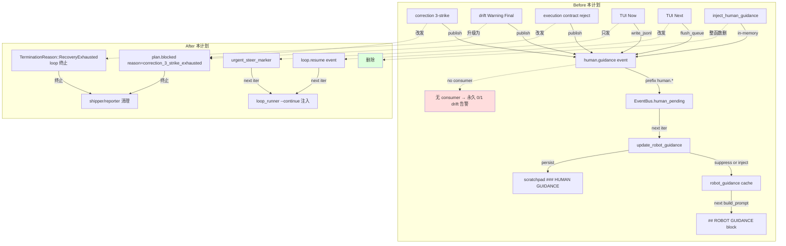
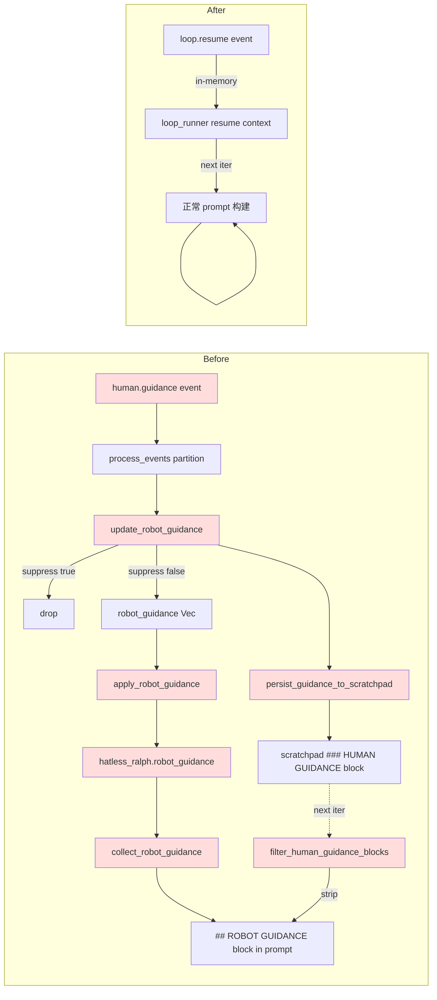

# refactor: 完全剔除 `human.guidance` 事件 topic

> **核心问题**:在当前无任何外部人工介入通道(无 Telegram / Slack / Webhook / Email / IM)的运行模型下,`human.guidance` 是"为不存在的上帝写的祈祷词"。它被 `correction module` / `drift engine` / TUI / RPC 反复 emit,但**没有任何消费者**;同时 `drift detector` 因 `human.guidance.message` 字段缺失持续告警(0/1 误报),`isolated_scope_violation` 因 `coordinator` 越权发 `human.guidance` 反复触发 envelope。本计划把整个 topic 物理删除,所有 escalation 终态改为 `plan.blocked(reason=...)` / `TerminationReason::RecoveryExhausted`,TUI 引导改走 `loop.resume` 通道,scratchpad 的 `### HUMAN GUIDANCE` 块整套清掉。

---

## Summary

物理删除 `human.guidance` topic 字符串、`HUMAN_GUIDANCE` 常量、相关类型、预编译白名单,以及它带动的整套下游机制(`robot_guidance` cache、`filter_human_guidance_blocks`、`update_robot_guidance` / `apply_robot_guidance` / `persist_guidance_to_scratchpad`、`suppress_human_guidance` / `progress_steward.exempt_from_suppress_human_guidance` 配置字段、`guidance_next_queue` 路径、`EventBus.human_pending` 队列、`is_system_topic` 的 `human.` prefix 分支)。所有原本发 `human.guidance` 的 6 个 emit 源改为发终态事件(`plan.blocked(reason=...)` 或 `TerminationReason::RecoveryExhausted`)。3 个 history solution / 1 个 MEMORY 标记为 `superseded`,配 deprecation banner。

**预期效果**:彻底消除"`human.guidance` 无人接 → drift 误报 → repair_stream 升级 → 又发 `human.guidance`"的自观测循环;修复机制有真终止路径;不再需要 `suppress_human_guidance` 抑制参数;`isolated_scope_violation` 噪音消失。

**Origin / 触发文件**:
- `docs/report/2026-06-28-ce-executor-serial-primary-20260628-115810-diagnosis.md` §0 运行模型澄清 + §5 P0-#11 / P0-#12
- `docs/plans/2026-06-28-004-fix-ce-executor-serial-primary-diagnosis-plan.md` (U13)
- `docs/achieved/plan/2026-06-25-001-refactor-remove-ralph-telegram-crate-plan.md` (KTD-2 显式保留 `human.guidance`,本计划在基座层反 KTD-2)

---

## Problem Frame

### 当前运行模型

`ralph-orchestrator` 是一个**纯自动化的循环编排系统**:
- 没有任何外部消费者在监听 `human.guidance` topic(无 Telegram/Slack/Webhook/Email/IM 接入)
- 2026-06-25 删 `ralph-telegram` crate 后,人为接入通道已彻底切断
- TUI 仍在(`ralph-tui` crate 未删),但 TUI 的 `Now`/`Next` 引导 UI 在 ce-executor-serial 里 `suppress_human_guidance=true` 的设定下被完全抑制,不进入 prompt

### 现状(`human.guidance` 在仓库中的真实身份)

经全仓扫描,`human.guidance` 在 60+ 文件里出现,**核心身份**是:

| 角色 | 实际行为 | 真实消费者 |
|---|---|---|
| correction 3-strike 终态 | `correction/mod.rs:720-738` 同一 retry_key 被拒 ≥ 3 次时发 | **无**(被 `suppress_human_guidance=true` 抑制) |
| drift Warning Final 提醒 | `drift/engine.rs:438-481` 终态软提示 | **无**(同抑制) |
| execution contract reject 解释 | `event_loop/mod.rs:8308-8310` 第 3 件包络 | **无** |
| TUI "Now" 立即引导 | `ralph-tui/src/state.rs:898-927` 写 events.jsonl | **无**(被抑制) |
| TUI/RPC "Next" 引导 | `loop_runner/runner.rs:2112-2181` 队列 flush | **无** |
| `EventBus.human_pending` 入站 | `event_bus.rs:121-126` `human.*` prefix 路由 | **无** |

**全部 6 个 emit 源都没有任何运行时消费者**——但整套机制仍占用代码、配置、测试、drift 告警、prefix 路由,以及 3 份历史解决方案和 1 条 MEMORY 把它当作"真的有救援通道"。

### 自我观察到的"自观测循环"

```
stall_recovery 升级 → maybe_escalate_to_human_guidance → 发 human.guidance
→ drift 告警 human.guidance.message 字段缺失 0/1 → repair_stream 升级
→ 又触发 stall_recovery → 又发 human.guidance → 又 drift 告警
```

这是本次 run 6-38 iter 反复震荡的根因之一(参见诊断报告 §5 P0-#11)。

---

## Requirements

### R1. 物理删除 `human.guidance` topic 字符串与所有常量导出

- `crates/ralph-proto/src/topics.rs` 删除 `HUMAN_GUIDANCE` 常量(行 41)
- `crates/ralph-proto/src/lib.rs` 删除 `pub use topics::HUMAN_GUIDANCE`(行 34)
- `is_orchestrator_control` matches! arm 删除 `HUMAN_GUIDANCE` 分支(行 55)
- `RALPH_CONTROL_TOPICS` 列表(`event_origin.rs:36`)与 `is_orchestrator_control_topic` matches! arm(`event_origin.rs:76`)删除 `human.guidance`
- `default_required_fields` 表(`stages/emit_schema_gate_stage.rs:41`)删除 `("human.guidance", vec!["message"])`
- `loop_state.rs:1447` `seen_topics_ignore` matches! arm 删除 `human.guidance`
- `workflow_activation.rs:583` `RUNNER_INJECTED_TRIGGERS` 列表删除 `human.guidance`
- `runtime_contract.rs:362-366` required-topic lint 白名单删除 `human.guidance`

### R2. 把所有 6 个 emit 源改为发终态事件

- **correction 3-strike**(`correction/mod.rs:720-738`):改为 publish `plan.blocked(reason="correction_3_strike_exhausted:<retry_key>")` 而非 `human.guidance`
- **drift Warning Final**(`drift/engine.rs:438-481`):升级 `check_termination_hint` 的 Warning Final 分支(行 401-405)为 `TerminationReason::RecoveryExhausted`,**直接 loop 终止**;删除 `check_final_human_guidance` 整个方法
- **execution contract reject**(`event_loop/mod.rs:8308-8310`):保留 `ContractRejectConfig.guidance_topic` 字段(向后兼容),但 `default_reject_guidance_topic()` 默认值改为 `plan.blocked`;在 schema doc 明确该字段必须是 orchestrator 终态 topic,不能填 `task.resume` 这类恢复 topic
- **TUI "Now"**(`ralph-tui/src/state.rs:898-927`):删除 `write_guidance_event` 的 `human.guidance` 写入;TUI Now 模式只写 `urgent_steer_marker`(已存在,不依赖此 topic)
- **TUI/RPC "Next"**(`loop_runner/runner.rs:2112-2181`):改发 `loop.resume` 事件,经 `loop_runner` 的 `--continue` 注入路径消费
- **`EventLoop::inject_human_guidance`**(`event_loop/mod.rs:2555-2569`):整函数删除(`pub fn` 出口,见 R1.2)

### R3. 删除 scratchpad `### HUMAN GUIDANCE` block 整套机制

- `event_loop/mod.rs:4041-4131` `update_robot_guidance` 整段删除
- `event_loop/mod.rs:4141-4271` `persist_guidance_to_scratchpad` 整段删除
- `event_loop/mod.rs:4274-4346` `apply_robot_guidance` 整段删除
- `event_loop/mod.rs:305-329` `filter_human_guidance_blocks` 整段删除
- `event_loop/mod.rs:4764-4769` `prepend_scratchpad` 里的 `suppress_active` 分支条件简化(只 check `gate_closed`,不 check suppress)
- `hatless_ralph.rs:308-378` `set_robot_guidance` / `clear_robot_guidance` / `collect_robot_guidance` / `robot_guidance` 字段 + `build_prompt` 的 `## ROBOT GUIDANCE` 注入整段删除
- `event_loop/mod.rs:881, 1029` 与 `event_loop/types.rs:282` 的 `robot_guidance: Vec<Event>` 字段初始化整段删除
- `process_events` 的 3 个 partition 路径(`mod.rs:3372/3481/3732`)的 `partition(|e| e.topic.as_str() == "human.guidance")` 整段删除

### R4. 删除 `EventBus.human_pending` 队列与 `human.` prefix 路由

- `event_bus.rs:121-126` `if topic.starts_with("human.")` 分支删除
- `event_bus.rs:172-198` `human_pending: Vec<Event>` 字段与 `take_human_pending` / `peek_human_pending` / `has_human_pending` 整套 API 删
- `event_bus.rs:102-126` `publish` 优先处理 `target=` 后的 `human.*` 特殊路径删
- `event_bus.rs:1085-1162` 三个 `human_*` 测试(`test_human_events_use_separate_queue` / `test_human_guidance_with_target_routes_to_target_hat` / `test_human_guidance_without_target_still_human_pending`)整段删除
- `event_policy.rs:811-813` `is_system_topic` 删除 `human.` prefix 分支(保留 `event.` prefix)
- `event_policy.rs:2787-2790` `topic_deny_rules` 的 `human.guidance` 断言删
- `event_policy.rs:4483` null-payload 的 `human.guidance` 断言删
- `event_policy.rs:2323-2326` `is_system_topic_human_prefix` 测试删
- `state_machine.rs:805` `test_non_business_topic_passes_through` 的 human.guidance case 删

### R5. 删除 `suppress_human_guidance` / `exempt_from_suppress_human_guidance` 配置字段

- `config/loop_config.rs:339` `pub suppress_human_guidance: bool` 字段整段删
- `config/loop_config.rs:378-390` `progress_steward.exempt_from_suppress_human_guidance` 字段 + `default_progress_steward_exempt_suppress` 删
- `config_resolution.rs:67, 287` `PRESET_OPT_IN_KEYS` 列表删 `suppress_human_guidance`
- `preflight.rs:745, 1516, 1535, 1552` 全部 `suppress_human_guidance` 引用删
- `event_loop/mod.rs:1193-1202` `human_guidance_suppressed()` 方法删
- `event_loop/mod.rs:4047-4322` U2/U5/U7 `if !suppressed` 分支整段删
- `presets/en/ce-executor-serial.yml:191-200` `suppress_human_guidance: true` 配置删
- `presets/schemas/ce-executor-serial.yml:390-402` `human.guidance:` schema block 删
- `config/ralph_config.rs:1612` 测试 YAML 的 `guidance_topic: "human.guidance"` 删
- `config/loop_config.rs` `LoopConfig` struct 移除 `suppress_human_guidance` 字段后的 serde 反序列化兼容测试(给"如果 YAML 还有这字段"的错误信息加显式 `unknown field` 提示,而不是静默忽略)

### R6. 删除所有 `human.guidance` / `human_guidance` 测试与测试 fixture

- **`crates/ralph-core/src/event_loop/tests/guidance_dedup.rs`** 整个文件删除(整文件 700+ 行,11 处围绕 `human.guidance` dedup)
- **`crates/ralph-core/tests/scenarios/serial_lint/serial_lint_3_steward_guidance_exempt.yaml`** 整个文件删除
- `crates/ralph-core/tests/scenarios.rs:1365-1370` `test_serial_lint_3_steward_guidance_exempt` 测试删
- `crates/ralph-core/src/event_loop/tests/initialization.rs:40-177` 4 个 test:`test_guidance_persists_across_iterations_solo_mode` / `_multi_hat_mode` / `test_guidance_persisted_to_scratchpad` / `test_guidance_appends_to_existing_scratchpad` 删
- `crates/ralph-core/src/event_loop/tests/isolated_complex_regression.rs:589, 649-758` `u2_human_guidance_reaches_target_prompt_without_publisher_authority` + 多处 partition 断言删
- `crates/ralph-core/src/event_loop/tests/execution_contract.rs:258, 401, 423` 3 处 assertion 改测"reject 时发 `plan.blocked` 而非 `human.guidance`"
- `crates/ralph-core/src/event_loop/tests/replay_light_integration.rs:374-411, 541, 634, 833, 854` 5 处 partition / guidance 断言改测
- `crates/ralph-core/src/event_loop/tests/origin_guard.rs:421, 665-708` `test_u3_isolated_control_topics_bypass_scope` 的 `write_event_to_jsonl(..., "human.guidance", ...)` 改测其它 control topic
- `crates/ralph-core/src/event_origin.rs:602-618, 1021-1048, 1190-1200` 3 个 test:`test_no_hat_human_guidance_accepted` / `test_p1_2_control_topic_case_insensitive_match` / `u5_control_topic_passes_without_provenance` 改测
- `crates/ralph-cli/src/commands/emit.rs:1404-1431` `test_emit_ralph_hat_allows_control_topic_human_guidance` 删
- `crates/ralph-cli/src/loop_runner/tests/legacy.rs:1657-1666, 2018, 2111-2124, 2195-2220, 2261-2302` `test_compute_recovery_status_returns_none_when_no_targeted_retry` + U3 characterization 测试删/改
- `crates/ralph-cli/src/loop_runner/tests/wave.rs:2847, 3127, 3140` `inject_wave_policy_rejection_guidance` 测试 + 注释删
- `crates/ralph-cli/src/presets.rs:1047-1075` `test_ce_executor_serial_progress_steward_only_loop_stalled` 改测(原断言 `!steward.triggers.contains("human.guidance")` 需重写)
- `crates/ralph-cli/src/policy_check.rs:2112, 2225` 2 处 test 改测
- `crates/ralph-cli/tests/ce_executor_recovery.rs:252-256` `unknown_hat_always_origin_rejected` 改测
- `crates/ralph-tui/src/state.rs:2770-2776` TUI send_guidance 测试删
- `crates/ralph-core/src/correction/mod.rs:1154-1173` `escalation_helper_publishes_human_guidance_at_threshold` 改名 + 改测"escalation_helper_publishes_plan_blocked_at_threshold"
- `crates/ralph-core/src/drift/engine.rs:847, 950, 958-1004, 1095-1133` 4 个测试改测"Warning Final → RecoveryExhausted"
- `crates/ralph-core/tests/scenarios/correction_three_escalation.yml:6, 22` legacy path 注释 + assert 改写为 `correction_3_strike_publishes_plan_blocked.yml`
- `crates/ralph-proto/src/topics.rs:74-82` `is_orchestrator_control_recognises_known_topics` 测试改测

### R7. 删除 AI skill 文档与公共指南中的 `human.guidance` 描述

- `crates/ralph-core/data/ralph-tools.md:74` 删除"运行时不再提供人工通道(`human.guidance` / `task.resume` 恢复通道保留)"这条历史公告
- `crates/ralph-core/data/ralph-tools-cmdref.md:146` 同步删
- `docs/api/security.md:14` 修订"`human.guidance` / `task.resume` event topics" 描述,改为"`task.resume` 是唯一的 operator 通道,`human.guidance` 已废弃"
- `docs/reference/troubleshooting.md:220` 修订"`human.guidance` / `task.resume` channel" 描述
- `docs/guide/execution-contracts.md:88/125/126` 修订 3 处"指导发布到 `human.guidance`" / "TUI / RPC 可见性消费 human.guidance" / "人工指导发布到 `human.guidance` 供下一次迭代参考"
- `docs/guide/project-usage.md:177, 515` 修订"human-in-the-loop 已退役"段

### R8. 标记 3 个历史方案 / 1 个 MEMORY 为 `superseded`

- `memory/plan-blocked-recovery-via-human-signoff.md` 顶部加 deprecation banner(参见 §8 banner 模板),frontmatter 加 `superseded_by: human-guidance-removed-2026-06-28`
- `docs/solutions/integration-issues/ce-executor-serial-precheck-recovery-alignment-2026-06-17.md` (merry-lotus) 顶部加 deprecation banner
- `docs/solutions/integration-issues/ce-executor-serial-noble-peacock-recovery-2026-06-17.md` 顶部加 deprecation banner
- `memory/MEMORY.md` index 文件中 `plan-blocked-recovery-via-human-signoff` 这一行末尾加 `(superseded 2026-06-28 by human-guidance-removed)`

### R9. `event_loop` FlowDeclaration 内部 minimal YAML 同步删除

- `event_loop/mod.rs:396` `minimal_flow_declaration_yaml()` 把 `human.guidance` 列入 known topics,删除该行
- `event_loop/mod.rs::flow_lifecycle.rs:1143-1237` plan.blocked 已有 payload schema 不动,但 `reason` 字段需要新增 `correction_3_strike_exhausted` 值的 schema 文档说明

---

## Key Technical Decisions

### KTD-1. correction 终态输出改 `plan.blocked` 而非 `loop.cancel` / `LOOP_COMPLETE`

**理由**:
- `plan.blocked` 已成熟(`preset_validator.rs:820-824, 1300-1303` + `flow_lifecycle.rs:1143-1237`),reason 字段支持自由字符串
- 已有 `flow_lifecycle` 路由处理,无需新增 TerminationReason 类型
- `LOOP_COMPLETE(success=false)` 过于"硬",会跳过 `shipper` / `reporter` 流程;`plan.blocked` 给 shipper 一次机会执行"已知失败"路径
- `loop.cancel` 是 TUI 主动取消,语义与 escalation 不同

**实施点**:
- `correction/mod.rs:720-738` 把 `Event::new(HUMAN_GUIDANCE, ...)` 改为 `Event::new(PLAN_BLOCKED, json!({"reason": "correction_3_strike_exhausted", "retry_key": ctx.retry_key}))`
- `event_loop/mod.rs::publish_correction_via_context` 路径不动,只把 3-strike 那一条 publish 改

### KTD-2. drift Warning Final 升级为 `TerminationReason::RecoveryExhausted` 而非 "静默丢弃"

**理由**:
- 如果只删 `check_final_human_guidance` 而不把 Warning 升级,Warning Final hint 静默丢失 = 真正的语义损失
- 2026-06-28-002 plan U2 已合并 Final 任意 severity,只差 Warning Final 这条
- 与本计划合并做,降低发版成本

**实施点**:
- `drift/engine.rs:401-405` `check_termination_hint` 的 Warning Final 分支直接走 `TerminationReason::RecoveryExhausted`
- `drift/engine.rs:438-481` 整个 `check_final_human_guidance` 方法删
- `drift/engine.rs` 中 `last_guidance_iteration` 字段删

### KTD-3. 保留 `ContractRejectConfig.guidance_topic` 字段(改默认值 = `plan.blocked`)

**理由**:
- 字段是 `pub` 出口 + 用户 YAML 可配置,直接删破坏外部集成
- 改默认值为 `plan.blocked` 给用户**逃生口**:如果某个 preset 仍想走其它终态 topic,可显式 override
- schema doc 明确字段语义,避免"听起来像操作员通道"的误解

**实施点**:
- `config/execution_contracts.rs:196-198` `default_reject_guidance_topic()` 返回 `"plan.blocked"`
- `config/execution_contracts.rs:179-198` `ContractRejectConfig.guidance_topic` 字段保留,但 doc 改为: "Default plan.blocked. Set to a terminal orchestrator topic (e.g. plan.blocked, loop.cancel). Setting to task.resume or human.guidance has no effect as these topics no longer accept guidance."

### KTD-4. `suppress_human_guidance` 字段直接删(选项 A),不做改名/反转

**理由**:
- 反转语义(`exempt_from_human_guidance: false`)混淆 `suppress` 与 `exempt` 概念
- 改名(`escalation_blocked: true`)误导用户以为还存在 escalation 文本
- 字段无意义:删除 topic 后,无"自由文本注入 prompt"可抑制
- 用户 YAML 直觉更好:删字段后,ce-executor-serial 用户 YAML 直接走默认,无 breaking change

**实施点**:
- `config/loop_config.rs:339-365` `suppress_human_guidance: bool` 字段整段删,doc 删
- `config/loop_config.rs:378-390` `progress_steward.exempt_from_suppress_human_guidance: bool` 字段整段删
- `serde(default)` 行为:删除字段后,如果用户 YAML 还有这个字段,加显式 `#[serde(deny_unknown_fields)]` 测试,触发 `unknown field 'suppress_human_guidance'` 错误

### KTD-5. TUI "Now" 模式降级为只发 `urgent_steer_marker`,不另发 `loop.steer.next` 替代

**理由**:
- `urgent_steer_marker` 已存在(不依赖 `human.guidance`),`ralph-tui/src/state.rs` 已有写盘逻辑
- 新增 `loop.steer.next` topic 是产品决策,与本 refactor 目标"剔除"冲突
- TUI Now 模式原本功能 = 紧急干预 dispatch(在 ce-executor-serial 已被 suppress 抑制),降级影响有限
- RPC `RpcCommand::Guidance` 命令名保留(只是 `flush_guidance_queue` 改发 `loop.resume`),不破坏 RPC 客户端

**事实证据(诊断报告引用)**:
- 诊断报告 `2026-06-28-ce-executor-serial-primary-20260628-115810-diagnosis.md` §5 P0-#11 列出 `recovery_outcome_update` 反复震荡 12+ 次(`iter 6/7/9/10/28/29/31/32/34/35/37/38`),其中 human.guidance 路径**全程未成功注入 prompt**(被 `suppress_human_guidance=true` 抑制)
- 诊断报告 §0.4 明确"`human.guidance` 不是求救信号,无人接 → TUI 引导在本运行模型下无效果"
- 结论:TUI Now 模式降级对实际使用 = 零回归,因为原本就无效果

**实施点**:
- `ralph-tui/src/state.rs:898-927` `write_guidance_event` 整段函数删(只留 `write_urgent_steer_marker` 路径)
- `loop_runner/runner.rs:2112-2181` `flush_guidance_queue_to_events_jsonl` 改写为 `flush_resume_queue_to_events_jsonl`,event 改发 `loop.resume` topic
- `rpc_stdin.rs:12, 47, 105-175` `RpcCommand::Guidance` enum variant 保留,只是发出去的 topic 变 `loop.resume`

### KTD-6. `is_system_topic` 的 `event.` prefix 保留,`human.` prefix 删

**理由**:
- `event.isolation.boundary_violation` / `event.execution_contract.rejected` / `event.malformed` 等大量 `event.*` diagnostic topic 仍存在
- `human.*` topic 在删除 `human.guidance` 后没有其它生产 topic,prefix 函数变 dead code

**实施点**:
- `event_policy.rs:811-813` `is_system_topic` 改:`topic.starts_with("event.")` 单条件
- `event_bus.rs:121-126` `if event.topic.as_str().starts_with("human.")` 整段删

### KTD-7. 不动 `event.isolation.boundary_violation` envelope 路径

**理由**:
- envelope 的两条触发源(ralph 越权 / isolated hat 越权)独立于 `human.guidance`
- 删除 `human.guidance` 不影响 envelope 任何路径
- envelope 本身对"无人工时无人接"是 fail-closed 设计,本计划不动

### KTD-8. 不动 `2026-06-25-001-refactor-remove-ralph-telegram-crate-plan.md` 的 KTD-2

**理由**:
- 该 KTD-2 显式保留 `human.guidance` 作为基座设计,本计划在基座层反 KTD-2
- 文档不动,只在本计划引用"本计划在基座层反 KTD-2",让 KTD-2 历史决策与本计划决策同存

---

## High-Level Technical Design

### 总体变更架构



### 数据流变更:scratchpad / robot_guidance 消失



> **图例**:`U_RG1` = `update_robot_guidance`(U5 删) / `AP1` = `apply_robot_guidance`(U5 删) / `HR1` = `hatless_ralph.robot_guidance` 字段(U5 删) / `COL1` = `collect_robot_guidance` API(U5 删) / `F1` = `filter_human_guidance_blocks` 函数(U5 删) / `S1` = `persist_guidance_to_scratchpad` 函数(U5 删)。所有节点对应 U5(Phase 2)。

### Phase 依赖图

```mermaid
flowchart TD
    P1[Phase 1: 替代终态设计<br/>U1 drift + U2 correction + U3 contract reject] --> P1_CP{check point:<br/>3 个新测试绿<br/>原 4 个相关测试改测绿}
    P1_CP -->|绿| P2[Phase 2: 输入源清理<br/>U4 TUI + U5 scratchpad + U6 prefix 路由]
    P2 --> P2_CP{check point:<br/>编译通过<br/>无 dangling<br/>is_orchestrator_control<br/>human.guidance == false}
    P2_CP -->|绿| P3A[Phase 3a: 常量/白名单<br/>U8 HUMAN_GUIDANCE + pub use + 4 预编译白名单]
    P3A --> P3A_CP{check point:<br/>rg 静态扫描<br/>is_orchestrator_control 测试绿}
    P3A_CP -->|绿| P3B[Phase 3b: 配置字段<br/>U7 suppress_human_guidance<br/>+ exempt_from_suppress + serde deny]
    P3B --> P3B_CP{check point:<br/>preset_lint 绿<br/>unknown field 显式报错}
    P3B_CP -->|绿| P3C[Phase 3c: 测试 + pub fn<br/>U9 整文件删 + 30+ 单点改测 + inject_human_guidance 删]
    P3C --> P3C_CP{check point:<br/>cargo build workspace 干净<br/>rg human.guidance 输出仅豁免}
    P3C_CP -->|绿| P4[Phase 4: 文档 + 历史方案 + 验证<br/>U10 文档 + U11 banner + U12 e2e]
    P4 --> P4_CP{check point:<br/>doc-drift 干净<br/>e2e 端到端无 regression<br/>4 banner 存在}
    style P1 fill:#def
    style P2 fill:#fed
    style P3A fill:#fed
    style P3B fill:#fed
    style P3C fill:#fed
    style P4 fill:#dfe
    style P1_CP fill:#fff
    style P2_CP fill:#fff
    style P3A_CP fill:#fff
    style P3B_CP fill:#fff
    style P3C_CP fill:#fff
    style P4_CP fill:#fff
```



> **关键路径**:每个 phase 必须 check point 绿才进下一 phase。Phase 3 拆为 3a → 3b → 3c 是为了避免"大爆炸"——如果 3c(测试)失败,可只回滚 3c,3a/3b 的代码改动保留;反过来如果 3a 失败,3b/3c 还没动。Phased Delivery 的 commit 顺序与 S1-S13 文件内编辑顺序一致。

### 关键删除顺序(避免编译中断)

| 步骤 | 范围 | 依赖 |
|---|---|---|
| **S1**. Drift Warning Final 升级 | `drift/engine.rs:401-405` | 单独可做 |
| **S2**. correction 改发 plan.blocked | `correction/mod.rs:720-738` | 单独可做 |
| **S3**. contract reject 改默认值 | `config/execution_contracts.rs:196-198` | 单独可做 |
| **S4**. TUI Now 删除 | `ralph-tui/src/state.rs:898-927` | 单独可做 |
| **S5**. TUI Next 改发 loop.resume | `loop_runner/runner.rs:2112-2181` | 单独可做 |
| **S6**. scratchpad / robot_guidance 整套清 | `event_loop/mod.rs:305-330, 4041-4346` + `hatless_ralph.rs:308-378` | 依赖 S2-S5(否则有 in-memory 残留) |
| **S7**. suppress 字段删 | `config/loop_config.rs:339, 378-390` + 多处 | 依赖 S6 |
| **S8**. prefix 路由删 | `event_bus.rs:121-198` + `event_policy.rs:811-813` | 依赖 S6 |
| **S9**. 常量 + 预编译列表删 | `topics.rs:41` + `event_origin.rs:36, 76` + `runtime_contract.rs:362-366` + `stages/emit_schema_gate_stage.rs:41` | 依赖 S7-S8 |
| **S10**. `inject_human_guidance` pub fn 删 | `event_loop/mod.rs:2555-2569` | 依赖 S9 |
| **S11**. 删测试文件 | `guidance_dedup.rs` + `serial_lint_3_*` + 30+ 单点 | 依赖 S2-S10 |
| **S12**. 文档 / data 更新 | `data/ralph-tools*.md` + `docs/api/`, `docs/guide/`, `docs/reference/` | 依赖 S11 |
| **S13**. 历史方案 banner | MEMORY + 2 solutions + MEMORY.md index | 单独可做(在 S1 之前做也行) |

---

## Implementation Units

### U1. Drift engine Warning Final 升级为 RecoveryExhausted

- **Goal**: 升级 `drift::check_termination_hint` 的 Warning Final 分支为 `TerminationReason::RecoveryExhausted`,删除 `check_final_human_guidance` 整个方法
- **Requirements**: R2 第二项
- **Dependencies**: 无
- **Files**:
  - `crates/ralph-core/src/drift/engine.rs` (修改行 401-405, 删除行 438-481, 删 `last_guidance_iteration` 字段)
  - `crates/ralph-core/src/drift/engine.rs` (测试行 847, 950, 958-1004, 1095-1133 改测)
  - `crates/ralph-cli/src/loop_runner/runner.rs:2218` 删除 `drift_engine.check_final_human_guidance` 调用
- **Approach**: Warning Final 直接 `return TerminationReason::RecoveryExhausted`;删除 `check_final_human_guidance` 整个方法 + 它的所有 caller
- **Patterns to follow**: 已有 `check_termination_hint` 的 Error/Critical Final 分支(`engine.rs:401-405`)
- **Test scenarios**:
  - Happy: 模拟 3 次 Warning 严重度 final hint,断言 loop 终止原因 = `RecoveryExhausted`
  - Edge: bootstrap phase 内的 Warning Final 仍不终止(保留原 bootstrap 行为)
  - Error path: Warning 非 Final 仍继续运行,不升级
  - Integration: 端到端 scenario `drift_warning_final_triggers_recovery_exhausted` 跑通
- **Verification**: `cargo nextest run -p ralph-core -- drift test_warning_final_triggers_recovery_exhausted` 通过;原 `lifecycle_final_warning_publishes_human_guidance` 测试删除或改测

### U2. Correction module 3-strike escalation 改发 plan.blocked

- **Goal**: `correction::maybe_escalate_to_human_guidance` 函数改名为 `escalate_to_plan_blocked`,publish `plan.blocked` 而非 `human.guidance`
- **Requirements**: R2 第一项
- **Dependencies**: U1(语义对齐)
- **Files**:
  - `crates/ralph-core/src/correction/mod.rs:706-738` (函数重命名 + 改 publish topic + 改 payload 格式)
  - `crates/ralph-core/src/correction/mod.rs:1154-1173` (测试重命名 + 改测)
  - `crates/ralph-core/src/event_loop/policy.rs:30-123` (调用方同步改)
  - `crates/ralph-core/tests/scenarios/correction_three_escalation.yml` (重命名 + payload 改)
  - `crates/ralph-core/tests/scenarios.rs` (新 scenario 引用)
- **Approach**:
  ```
  // Before
  Event::new(HUMAN_GUIDANCE, payload)
  // After
  Event::new(PLAN_BLOCKED, json!({
    "reason": "correction_3_strike_exhausted",
    "retry_key": ctx.retry_key,
    "task_id": ctx.task_id,
  }))
  ```
- **Patterns to follow**: `flow_lifecycle.rs:1143-1237` 已有 plan.blocked payload schema
- **Test scenarios**:
  - Happy: 同一 retry_key 被拒 3 次,第 3 次拒后下一次 iter emit `plan.blocked(reason=correction_3_strike_exhausted)`
  - Edge: retry_key 不同,各自独立计数
  - Edge: 同一 retry_key 第 4 次拒,不再 emit(避免重复)
  - Integration: BDD scenario `correction_3_strike_publishes_plan_blocked` 跑通
- **Verification**: `cargo nextest run -p ralph-core -- correction test_3_strike_publishes_plan_blocked` 通过;原 `escalation_helper_publishes_human_guidance_at_threshold` 测试改测

### U3. Execution contract reject 默认值改 plan.blocked + schema doc

- **Goal**: `ContractRejectConfig.guidance_topic` 字段保留,默认值从 `human.guidance` 改为 `plan.blocked`
- **Requirements**: R2 第三项
- **Dependencies**: 无
- **Files**:
  - `crates/ralph-core/src/config/execution_contracts.rs:179-198` (改默认值 + 改 doc)
  - `crates/ralph-core/src/config/ralph_config.rs:1612` (测试 YAML 改默认)
  - `crates/ralph-core/src/event_loop/mod.rs:8163-8310` (逻辑保留,只是 publish topic 默认从 human.guidance 变 plan.blocked)
  - `presets/schemas/ce-executor-serial.yml` (如果 schema 提到默认 `human.guidance`,改 `plan.blocked`)
- **Approach**: `default_reject_guidance_topic()` 返回值改 `"plan.blocked"`;doc 改为: "Must be a terminal orchestrator topic. Setting to `human.guidance` has no effect as the topic no longer accepts guidance."
- **Test scenarios**:
  - Happy: 缺省配置下 contract reject publish `plan.blocked` 而非 `human.guidance`
  - Edge: 用户 YAML 显式设 `guidance_topic: "loop.cancel"`,publish 走 `loop.cancel`
  - Error path: 用户 YAML 设 `guidance_topic: "human.guidance"`,运行时忽略 + warning 日志
- **Verification**: `cargo nextest run -p ralph-core -- execution_contracts test_reject_default_topic_is_plan_blocked` 通过

### U4. TUI Now 模式 + TUI Next 模式改发 loop.resume

- **Goal**: 删除 `write_guidance_event` 的 `human.guidance` 写入,TUI Now 模式只发 `urgent_steer_marker`;TUI Next / RPC 模式改发 `loop.resume`
- **Requirements**: R2 第四、五项
- **Dependencies**: U2(避免 correction escalation 与 TUI 同时发冲突 topic)
- **Files**:
  - `crates/ralph-tui/src/state.rs:840-927` (`write_guidance_event` 整段函数删,`urgent_steer_marker` 路径保留)
  - `crates/ralph-tui/src/state.rs:2770-2776` (测试删)
  - `crates/ralph-cli/src/loop_runner/runner.rs:2112-2181` (`flush_guidance_queue_to_events_jsonl` 改名为 `flush_resume_queue_to_events_jsonl`,topic 改 `loop.resume`)
  - `crates/ralph-cli/src/loop_runner/runner.rs:2218` (drift 调用点已在 U1 删)
  - `crates/ralph-cli/src/loop_runner/tests/legacy.rs:2018, 2111-2124, 2195-2220, 2261-2302` (测试改测)
  - `crates/ralph-cli/src/loop_runner/tests/wave.rs:2847, 3127, 3140` (`inject_wave_policy_rejection_guidance` 测试 + 注释删)
- **Approach**:
  - TUI `Now` 模式:只调用 `write_urgent_steer_marker`(已存在)
  - TUI `Next` 模式:发 `loop.resume` event 到 events.jsonl,经 `loop_runner` 的 `--continue` 注入路径消费
  - RPC `RpcCommand::Guidance` 同样改发 `loop.resume`
- **Test scenarios**:
  - Happy: TUI Now 模式,触发 `urgent_steer_marker` 写入,不发 human.guidance
  - Happy: TUI Next 模式,发 `loop.resume` event,下一轮 build_prompt 看到 resume context
  - Edge: RPC `Guidance` 命令同样发 `loop.resume`
  - Edge: events.jsonl 没有任何 topic=`human.guidance` 的新写入
- **Verification**: `cargo nextest run -p ralph-tui -- test_send_guidance_uses_resume` 通过;`cargo nextest run -p ralph-cli --bin ralph -- loop_runner test_resume_queue_flushes_to_loop_resume` 通过

### U5. Scratchpad + robot_guidance + filter_human_guidance_blocks 整套清

- **Goal**: 删除 `update_robot_guidance` / `persist_guidance_to_scratchpad` / `apply_robot_guidance` / `filter_human_guidance_blocks` 整段 + `hatless_ralph` 整套 robot_guidance API
- **Requirements**: R3
- **Dependencies**: U2, U4(scratchpad 写入侧需先没输入源)
- **Files**:
  - `crates/ralph-core/src/event_loop/mod.rs:305-329` (`filter_human_guidance_blocks` 整段函数删)
  - `crates/ralph-core/src/event_loop/mod.rs:4041-4131` (`update_robot_guidance` 整段函数删)
  - `crates/ralph-core/src/event_loop/mod.rs:4141-4271` (`persist_guidance_to_scratchpad` 整段函数删)
  - `crates/ralph-core/src/event_loop/mod.rs:4274-4346` (`apply_robot_guidance` 整段函数删)
  - `crates/ralph-core/src/event_loop/mod.rs:4764-4769` (`prepend_scratchpad` 里的 `suppress_active` 分支条件简化)
  - `crates/ralph-core/src/event_loop/mod.rs:881, 1029` (`robot_guidance: Vec<Event>` 字段初始化删)
  - `crates/ralph-core/src/event_loop/types.rs:282` (同上)
  - `crates/ralph-core/src/event_loop/mod.rs:3372-3375, 3481-3484, 3730-3732` (3 个 partition 路径的 `partition(|e| e.topic.as_str() == "human.guidance")` 删)
  - `crates/ralph-core/src/hatless_ralph.rs:29, 308-378` (`robot_guidance` 字段 + 3 个 API + build_prompt 注入删)
- **Approach**: 函数 + 字段 + 字符串常量("### HUMAN GUIDANCE" / "## ROBOT GUIDANCE")整段删;`prepend_scratchpad` 里的 `suppress_active` 条件改为只 check `gate_closed`
- **Test scenarios**:
  - Happy: 编译通过,没有任何 dangling reference
  - Edge: scratchpad 不再含 `### HUMAN GUIDANCE` block
  - Edge: prompt 不再含 `## ROBOT GUIDANCE` block
  - Edge: `hatless_ralph` 没有 `robot_guidance` 字段 / `set_robot_guidance` / `clear_robot_guidance` / `collect_robot_guidance` API
- **Verification**: `cargo nextest run -p ralph-core -- event_loop::tests` 全部通过,无引用 `human.guidance` 的 dangling 编译错误;`cargo build -p ralph-core` 干净

### U6. EventBus human_pending 队列 + is_system_topic human. prefix 删

- **Goal**: 删除 `EventBus.human_pending` 字段 + 路由 + 3 个测试;`is_system_topic` 删 `human.` prefix 分支
- **Requirements**: R4
- **Dependencies**: U5
- **Files**:
  - `crates/ralph-proto/src/event_bus.rs:121-126` (human.* prefix 路由删)
  - `crates/ralph-proto/src/event_bus.rs:172-198` (`human_pending` 字段 + 3 个 API 删)
  - `crates/ralph-proto/src/event_bus.rs:102-126` (`publish` 优先处理 `target=` 后的 `human.*` 特殊路径删)
  - `crates/ralph-proto/src/event_bus.rs:1085-1162` (3 个 human_* 测试删)
  - `crates/ralph-core/src/event_policy.rs:811-813` (`is_system_topic` 改 `event.` 单条件)
  - `crates/ralph-core/src/event_policy.rs:2787-2790` (`topic_deny_rules` 的人.guidance 断言删)
  - `crates/ralph-core/src/event_policy.rs:4483` (null-payload human.guidance 断言删)
  - `crates/ralph-core/src/event_policy.rs:2323-2326` (`is_system_topic_human_prefix` 测试删)
  - `crates/ralph-core/src/state_machine.rs:805` (`test_non_business_topic_passes_through` 的 human.guidance case 改测)
- **Approach**: 字段 + API + 测试整段删;`is_system_topic` 改单条件
- **Test scenarios**:
  - Happy: 编译通过,无 dangling
  - Edge: `EventBus` 没有 `human_pending` / `take_human_pending` / `peek_human_pending` / `has_human_pending` API
  - Edge: 任何发 `human.guidance` 的 event 走 normal hat routing(不进入 human_pending)
  - Edge: `is_system_topic("event.isolation.boundary_violation") == true` 仍为 true
  - Error path: `is_system_topic("human.guidance") == false`(topic 不再存在,但函数仍接受字符串)
- **Verification**: `cargo nextest run -p ralph-proto -- event_bus` 全部通过;`cargo nextest run -p ralph-core -- event_policy` 全部通过

### U7. suppress_human_guidance / exempt_from_suppress_human_guidance 配置字段删

- **Goal**: 删除 `LoopConfig.suppress_human_guidance` + `ProgressStewardConfig.exempt_from_suppress_human_guidance` 字段 + `PRESET_OPT_IN_KEYS` 列表 + `preflight.rs` 引用 + `human_guidance_suppressed()` 方法 + ce-executor-serial preset 配置
- **Requirements**: R5
- **Dependencies**: U5, U6
- **Files**:
  - `crates/ralph-core/src/config/loop_config.rs:339-365` (`suppress_human_guidance: bool` 字段 + doc 删)
  - `crates/ralph-core/src/config/loop_config.rs:378-390` (`progress_steward.exempt_from_suppress_human_guidance` 字段 + `default_progress_steward_exempt_suppress` 删)
  - `crates/ralph-cli/src/config_resolution.rs:67, 287` (`PRESET_OPT_IN_KEYS` 列表删 `suppress_human_guidance`)
  - `crates/ralph-cli/src/preflight.rs:745, 1516, 1535, 1552-1553` (全部引用删)
  - `crates/ralph-core/src/event_loop/mod.rs:1193-1202` (`human_guidance_suppressed()` 方法删)
  - `crates/ralph-core/src/event_loop/mod.rs:4047-4322` (U2/U5/U7 `if !suppressed` 分支整段删)
  - `presets/en/ce-executor-serial.yml:191-200` (`suppress_human_guidance: true` 配置删)
  - `presets/schemas/ce-executor-serial.yml:390-402` (`human.guidance:` schema block 删)
  - `crates/ralph-core/src/config/loop_config.rs` (新增 `#[serde(deny_unknown_fields)]` 测试:YAML 含 `suppress_human_guidance: true` 必须显式失败)
- **Approach**:
  - 字段 + 引用整段删
  - `serde` 加 `#[serde(deny_unknown_fields)]` 在 `LoopConfig` 上,触发 `unknown field 'suppress_human_guidance'` 错误
  - preset 加 `unknown field` 错误信息明确指引
- **Test scenarios**:
  - Happy: ce-executor-serial preset 启动无 `suppress_human_guidance` 字段
  - Edge: 用户 YAML 含 `suppress_human_guidance: true`,启动失败 + 显式错误信息
  - Edge: `ProgressStewardConfig` 没有 `exempt_from_suppress_human_guidance` 字段
  - Integration: preset_lint 通过
- **Verification**: `cargo nextest run -p ralph-cli --bin ralph -- preset_lint test_ce_executor_root_preset_matches_embedded` 通过;`cargo nextest run -p ralph-cli --bin ralph -- loop_config test_unknown_field_suppress_human_guidance_rejected` 通过

### U8. 常量 + 预编译白名单 + 公共导出删

- **Goal**: 删除 `HUMAN_GUIDANCE` 常量 + `pub use` + 4 处预编译白名单 + 3 处 matches! arm
- **Requirements**: R1
- **Dependencies**: U7
- **Files**:
  - `crates/ralph-proto/src/topics.rs:41` (删 `HUMAN_GUIDANCE` 常量)
  - `crates/ralph-proto/src/topics.rs:55` (删 `is_orchestrator_control` 的 HUMAN_GUIDANCE arm)
  - `crates/ralph-proto/src/topics.rs:74-82` (改测 `is_orchestrator_control_recognises_known_topics`)
  - `crates/ralph-proto/src/lib.rs:34` (删 `pub use topics::HUMAN_GUIDANCE`)
  - `crates/ralph-core/src/event_origin.rs:36` (删 `RALPH_CONTROL_TOPICS` 列表里的 `human.guidance`)
  - `crates/ralph-core/src/event_origin.rs:76` (删 `is_orchestrator_control_topic` matches! arm)
  - `crates/ralph-core/src/event_origin.rs:602-618, 1021-1048, 1190-1200` (改测 3 个测试)
  - `crates/ralph-core/src/event_loop/loop_state.rs:1447` (删 `seen_topics_ignore` matches! arm)
  - `crates/ralph-core/src/event_loop/preset_lint/workflow_activation.rs:583` (删 `RUNNER_INJECTED_TRIGGERS` 列表)
  - `crates/ralph-core/src/event_loop/preset_lint/workflow_activation.rs:606-611` (改注释)
  - `crates/ralph-core/src/runtime_contract.rs:362-366` (删 required-topic lint 白名单)
  - `crates/ralph-core/src/event_loop/stages/emit_schema_gate_stage.rs:41` (删 `default_required_fields` 表的 human.guidance 行)
  - `crates/ralph-core/src/event_loop/mod.rs:396` (`minimal_flow_declaration_yaml()` 的 human.guidance 行删)
- **Approach**: 字符串字面量整段删;测试改测"human.guidance 不在白名单"等反向断言
- **Test scenarios**:
  - Happy: 编译通过,`HUMAN_GUIDANCE` 常量在 ralph-proto 中不存在
  - Happy: `is_orchestrator_control("human.guidance") == false`(topic 不存在但函数仍接受)
  - Edge: `default_required_fields` 表不含 `human.guidance` 键
  - Edge: `seen_topics_ignore` 仍能匹配(但 human.guidance 不再被排除)
  - Integration: 启动 ce-executor-serial preset 无 schema 校验错误
- **Verification**: `cargo nextest run -p ralph-proto -- topics` 通过;`cargo nextest run -p ralph-core -- preset_lint workflow_activation` 通过

### U9. inject_human_guidance pub fn 删 + 测试文件删 + 30+ 单点测试改测

- **Goal**: 删除 `pub fn inject_human_guidance` + 整个 `guidance_dedup.rs` 测试文件 + 整个 `serial_lint_3_*` YAML + 30+ 单点测试改测
- **Requirements**: R6
- **Dependencies**: U8
- **Files**:
  - `crates/ralph-core/src/event_loop/mod.rs:2555-2569` (`pub fn inject_human_guidance` 整段删)
  - `crates/ralph-core/src/event_loop/tests/guidance_dedup.rs` 整文件删
  - `crates/ralph-core/tests/scenarios/serial_lint/serial_lint_3_steward_guidance_exempt.yaml` 整文件删
  - `crates/ralph-core/tests/scenarios.rs:1365-1370` (`test_serial_lint_3_steward_guidance_exempt` 删)
  - `crates/ralph-core/src/event_loop/tests/initialization.rs:40-177` (4 个 test 删)
  - `crates/ralph-core/src/event_loop/tests/isolated_complex_regression.rs:589, 649-758` (改测)
  - `crates/ralph-core/src/event_loop/tests/execution_contract.rs:258, 401, 423` (改测)
  - `crates/ralph-core/src/event_loop/tests/replay_light_integration.rs:374-411, 541, 634, 833, 854` (改测)
  - `crates/ralph-core/src/event_loop/tests/origin_guard.rs:421, 665-708` (改测)
  - `crates/ralph-cli/src/commands/emit.rs:1404-1431` (删)
  - `crates/ralph-cli/src/loop_runner/tests/legacy.rs:1657-1666, 2018, 2111-2124, 2195-2220, 2261-2302` (删/改)
  - `crates/ralph-cli/src/loop_runner/tests/wave.rs:2847, 3127, 3140` (删)
  - `crates/ralph-cli/src/presets.rs:1047-1075` (改测)
  - `crates/ralph-cli/src/policy_check.rs:2112, 2225` (改测)
  - `crates/ralph-cli/tests/ce_executor_recovery.rs:252-256` (改测)
  - `crates/ralph-tui/src/state.rs:2770-2776` (删)
  - `crates/ralph-core/src/event_loop/tests/origin_guard.rs` 等多处 `write_event_to_jsonl(..., "human.guidance", ...)` 改用其它 control topic
  - `crates/ralph-core/src/correction/mod.rs:1154-1173` (改测:U2 已重命名)
  - `crates/ralph-core/src/drift/engine.rs:847, 950, 958-1004, 1095-1133` (改测:U1 已重命名)
- **Approach**: 整文件删 + 单点测试改测为其它 topic 行为
- **Test scenarios**:
  - Happy: `cargo nextest run -p ralph-core` 全部通过,无 dangling reference
  - Happy: `cargo nextest run -p ralph-cli` 全部通过
  - Happy: `cargo nextest run -p ralph-tui` 全部通过
  - Edge: 没有任何测试文件 grep 到 `human\.guidance` / `human_guidance` / `HUMAN_GUIDANCE` 字面量
- **Verification**: `rg "human\.guidance|human_guidance|HUMAN_GUIDANCE" crates/` 输出为空(除已计划的 banner / 历史文档外)

### U10. AI skill 文档 + 公共指南同步

- **Goal**: `data/ralph-tools*.md` 删除 `human.guidance` 历史公告;`docs/api/` `docs/guide/` `docs/reference/` 修订"`human.guidance` 是公共事件"描述
- **Requirements**: R7
- **Dependencies**: U9
- **Files**:
  - `crates/ralph-core/data/ralph-tools.md:74` (删历史公告)
  - `crates/ralph-core/data/ralph-tools-cmdref.md:146` (同步删)
  - `docs/api/security.md:14` (修订"`human.guidance` / `task.resume` event topics" 描述)
  - `docs/reference/troubleshooting.md:220` (修订)
  - `docs/guide/execution-contracts.md:88/125/126` (3 处修订)
  - `docs/guide/project-usage.md:177, 515` (修订"human-in-the-loop 已退役"段)
- **Approach**:
  - 文档明确"`human.guidance` 已废弃;唯一 operator 通道是 `task.resume`"
  - `docs/guide/execution-contracts.md:88` 的 "指导发布到 `human.guidance`" 改为"指导发布到 `task.resume`"
- **Test scenarios**:
  - Happy: `rg "human\.guidance" docs/guide/ docs/api/ docs/reference/ crates/ralph-core/data/` 输出为空(除历史 deprecation banner 外)
- **Verification**: `scripts/check-cli-doc-drift.sh` 跑通;`rg "human.guidance" docs/ crates/ralph-core/data/` 仅显示历史 banner / 引用本计划的诊断报告

### U11. 3 个历史方案 + 1 个 MEMORY 标记为 superseded

- **Goal**: 4 份文档顶部加 deprecation banner + frontmatter `superseded_by` 字段
- **Requirements**: R8
- **Dependencies**: 无(可最早做,只是 doc 操作)
- **Files**:
  - `memory/plan-blocked-recovery-via-human-signoff.md` (顶部加 banner,frontmatter 加 `superseded_by: human-guidance-removed-2026-06-28`)
  - `docs/solutions/integration-issues/ce-executor-serial-precheck-recovery-alignment-2026-06-17.md` (merry-lotus,顶部加 banner)
  - `docs/solutions/integration-issues/ce-executor-serial-noble-peacock-recovery-2026-06-17.md` (顶部加 banner)
  - `memory/MEMORY.md` (index 条目末尾加 `(superseded 2026-06-28 by human-guidance-removed)`)
- **Approach**: 用以下统一 banner 模板:
  ```markdown
  > ⚠️ **SUPERSEDED 2026-06-28**: `human.guidance` topic 已物理删除(本仓库不再 emit/consume 此 topic)。
  > 原因:无外部人工介入通道,此 topic 永远无人消费,且引发 drift 误报 + isolated_scope_violation 噪音 + 修复机制自观测循环。
  > 替代:correction 3-strike escalation 改发 `plan.blocked(reason=correction_3_strike_exhausted)`;
  > drift Warning Final 升级为 `TerminationReason::RecoveryExhausted`;TUI 引导改走 `loop.resume`。
  > 参见: `docs/plans/2026-06-28-005-refactor-remove-human-guidance-topic-plan.md`。
  ```
- **Test scenarios**:
  - Happy: 4 份文档顶部有 banner,`rg "SUPERSEDED 2026-06-28" memory/ docs/solutions/integration-issues/ce-executor-serial-precheck-recovery-alignment-2026-06-17.md docs/solutions/integration-issues/ce-executor-serial-noble-peacock-recovery-2026-06-17.md` 输出 4 行
- **Verification**: grep 4 份文档顶部 banner 存在

### U12. 完整验证套件 + 端到端 regression run

- **Goal**: 跑全套 nextest + e2e,确保 0 regression
- **Requirements**: 全部
- **Dependencies**: U1-U11
- **Files**:
  - `./scripts/run-tests.sh` (CI 入口)
  - `cargo run -p ralph-e2e -- --mock` (E2E 跑一次)
- **Approach**:
  1. 跑 `cargo nextest run -p ralph-core` 全部绿
  2. 跑 `cargo nextest run -p ralph-cli --bin ralph` 全部绿(串行)
  3. 跑 `cargo nextest run -p ralph-proto -- ralph-adapters -- ralph-tui -- ralph-api -- ralph-bench` 全部绿
  4. 跑 `cargo nextest run -p ralph-core --test scenarios` BDD 全绿
  5. 跑 `cargo run -p ralph-e2e -- --mock` 端到端无 regression
  6. 跑 `scripts/check-cli-doc-drift.sh` doc drift 干净
  7. 跑 `cargo doc --no-deps` 文档构建无 warning
- **Test scenarios**:
  - 所有 nextest 子集全绿
  - e2e 端到端 scenario 全绿
  - doc drift 干净
  - 任何 `rg "human\.guidance|human_guidance|HUMAN_GUIDANCE" crates/ docs/solutions/ docs/brainstorms/ docs/api/ docs/guide/ docs/reference/ memory/` 命中数 ≤ 4(仅 4 份 banner)
- **Verification**: 上述所有命令全绿

---

## System-Wide Impact

### 影响的角色

| 角色 | 变化 | 影响级别 |
|---|---|---|
| 自动化 agent(运行 ce-executor-serial) | 不再收到 `human.guidance` 注入的 prompt 文本 | **正向**:prompt 更干净,不被噪音污染 |
| TUI 终端用户 | "Now" 模式降级为只 `urgent_steer_marker`;`Next` 模式仍可引导下一轮 | **小降级**:但 ce-executor-serial 原本就被抑制,实际影响有限 |
| 集成 preset 维护者 | `ContractRejectConfig.guidance_topic` 字段保留,默认从 `human.guidance` 变 `plan.blocked` | **中性**:向后兼容,有显式 schema doc |
| 历史方案读者 | 4 份文档加 deprecation banner,frontmatter `superseded_by` | **正向**:避免误用旧设计 |
| e2e test / scenario 维护者 | `guidance_dedup.rs` + `serial_lint_3_*` 整文件删,新 scenario `correction_3_strike_publishes_plan_blocked` 替代 | **小工作量**:scenario 重写 |

### 不动的事

- 不接任何人工通道(Telegram/Slack/IM/Email)——本次就是拔掉
- 不重新设计 correction 引擎整体架构,只改 escalation 输出
- 不动 `task.resume` topic(它不是 `human.guidance`,且仍合理)
- 不动 `2026-06-27-001` plan 的 P0-10/11/12 修复(那是另一份 plan)
- 不动 `event.isolation.boundary_violation` envelope 路径
- 不动 `presets/manifest.yml` / `presets/index.json`(不含 human.guidance 字符串)

---

## Risks & Dependencies

### 风险 1:drift Warning Final 升级可能改变 ce-executor-serial 运行时行为

- **描述**:原 Warning Final 路径只发"软提醒"(被 suppress 抑制),改 `RecoveryExhausted` 后会直接终止 loop
- **影响**:runtime 行为变化,某些原本"继续运行等待人工"的场景会直接终止
- **缓解**:
  - U1 测试覆盖:Warning Final 触发终止 + `TerminationReason::RecoveryExhausted` 正确
  - e2e scenario 验证整体行为符合 §0 报告"无人工时能自己停"目标
  - 在 plan 文档顶部明确"运行时行为变化"

### 风险 2:`ContractRejectConfig.guidance_topic` 字段保留可能让用户误填

- **描述**:字段保留,用户 YAML 可填任意 topic,如果填非终态 topic(如 `task.resume`),会引发不预期行为
- **影响**:中(取决于用户是否手填)
- **缓解**:
  - U3 测试覆盖:用户填 `human.guidance` 时 warning + 运行时忽略
  - schema doc 明确"必须是 terminal orchestrator topic"
  - `preset_lint` 加 `guidance_topic_must_be_terminal` 规则

### 风险 3:TUI 紧急干预能力降级

- **描述**:删除 `write_guidance_event` 后,TUI Now 模式只发 `urgent_steer_marker`,丢失"立即生效"能力
- **影响**:小(ce-executor-serial 原本就抑制 human.guidance)
- **缓解**:
  - 保留 `urgent_steer_marker` 写盘
  - TUI Next 模式改 `loop.resume` 注入下一轮 prompt
  - U4 测试覆盖两条降级路径

### 风险 4:大量文件修改可能引入意外 regression

- **描述**:60+ 文件涉及,36 个 Rust 文件直接引用,11 个测试文件被改
- **影响**:高(批量修改风险)
- **缓解**:
  - U12 完整验证套件兜底
  - 每 U 测试覆盖完整,避免一次大爆炸
  - 按 S1-S13 删除顺序编译验证

### 依赖

- **本计划必须先于**:`docs/plans/2026-06-28-002-fix-ce-executor-serial-loop-and-mechanism-failure-plan.md` 的 U2(其 P0-4 "Final 只发 `human.guidance` 不终止 loop"已经在做 U1 的部分工作,与本计划 U1 重叠)。建议合并 U1 + 002 U2 一起做,避免两次提交冲突
- **本计划不阻塞**:`docs/plans/2026-06-28-004` U13(在 serial preset 内禁 human.guidance,本计划是基座删除,004 U13 是 preset 层删除,两者正交,004 U13 在本计划后做或本计划前做都行)
- **本计划不阻塞**:`2026-06-27-001` plan 的 P0-10/11/12(独立修复,本计划与之正交)

---

## Acceptance Criteria

### AC-1:代码层物理删除

- `rg "HUMAN_GUIDANCE|human_guidance|human\.guidance" crates/ralph-proto/src crates/ralph-core/src crates/ralph-cli/src crates/ralph-tui/src` 输出**仅命中豁免清单**(见下),否则为空
- `cargo build --workspace` 编译干净,无 dangling reference
- `cargo doc --no-deps` 文档构建无 warning

**AC-1 豁免清单**(机械 `rg` 扫描时允许命中):
- 本 plan 自身的 before/after 对比代码示例(§KTD-1 / §HTD / §U2 Approach 等位置使用 `HUMAN_GUIDANCE` 字面量是"教学性引用",非生产代码)
- 4 份 deprecation banner 文档顶部字符串(见 R8)
- 诊断报告 `docs/report/2026-06-28-ce-executor-serial-primary-20260628-115810-diagnosis.md` §5 P0-#11 / P0-#12 中的历史引用(报告本身是分析"为什么删"的事实基础,不能删引用)
- 历史 achieved plans (`docs/achieved/plan/2026-06-25-001-refactor-remove-ralph-telegram-crate-plan.md` KTD-2 等)中的产品决策历史

豁免总计 4 类,机械命中数 ≤ 4 份 banner(其它 3 类是 plan / 报告 / 历史档案,不在 crates/ 范围内,不计入)

### AC-2:测试层覆盖

- `cargo nextest run -p ralph-core` 全绿,新测试覆盖:
  - `test_3_strike_publishes_plan_blocked`
  - `test_warning_final_triggers_recovery_exhausted`
  - `test_reject_default_topic_is_plan_blocked`
  - `test_send_guidance_uses_resume`
  - `test_resume_queue_flushes_to_loop_resume`
  - `test_robot_guidance_api_removed`(API 删除验证)
  - `test_human_pending_queue_removed`(API 删除验证)
- `cargo nextest run -p ralph-cli --bin ralph` 全绿
- `cargo nextest run -p ralph-tui` 全绿
- `cargo nextest run -p ralph-proto` 全绿
- BDD `cargo nextest run -p ralph-core --test scenarios -- correction_3_strike_publishes_plan_blocked` 通过

### AC-3:配置层清理

- `presets/en/ce-executor-serial.yml` 无 `suppress_human_guidance` 字段
- `presets/schemas/ce-executor-serial.yml` 无 `human.guidance:` schema block
- `config/loop_config.rs` 无 `suppress_human_guidance` / `exempt_from_suppress_human_guidance` 字段
- 用户 YAML 含 `suppress_human_guidance: true` 启动失败 + 显式错误信息

### AC-4:文档层同步

- `rg "human\.guidance" docs/api/ docs/guide/ docs/reference/ crates/ralph-core/data/` 输出为空
- 4 份历史文档顶部有 deprecation banner
- `scripts/check-cli-doc-drift.sh` 干净

### AC-5:端到端不引入 regression

- `cargo run -p ralph-e2e -- --mock` 端到端 scenario 全绿
- 原 ce-executor-serial scenario 跑通,无新增的 `human.guidance` 事件
- 原 drift 自观测震荡(iter 6-38 反复 outcome 切)现象消失

### AC-6:运行时行为对齐报告预期

- iter 末不再有 `isolated_scope_violation` envelope 由 `human.guidance` 触发
- iter 末不再有 `drift_field_completeness` 告警 `human.guidance.message 0/1`
- 3-strike escalation 触发后,下一次 iter 出现 `plan.blocked(reason=correction_3_strike_exhausted)`
- TUI Next 模式引导的文本出现在下一轮 prompt(经 `loop.resume` 注入路径)

---

## Scope Boundaries

### In Scope

- 物理删除 `human.guidance` topic 字符串、`HUMAN_GUIDANCE` 常量、所有相关类型、预编译白名单
- 删除 scratchpad `### HUMAN GUIDANCE` block 整套机制
- 删除 `EventBus.human_pending` 队列 + `human.` prefix 路由
- 删除 `suppress_human_guidance` / `exempt_from_suppress_human_guidance` 配置字段
- 删除所有 `human.guidance` / `human_guidance` 测试与测试 fixture
- 修订 AI skill 文档 + 公共指南
- 4 份历史方案 / MEMORY 标记 `superseded`

### Deferred for later(本计划范围外)

- **P0-10/11/12 修复**(`2026-06-27-001` plan 的 hot path 真实驱动 / U9 defensive bypass / CLI 路径 stage_pipeline 接入 / metadata-runtime drift CI)——独立 plan
- **`2026-06-28-004` plan U13**(serial preset 层禁 `human.guidance`)——在 U1-U11 完成后做,但严格说 U1-U11 已经做了 U13 的所有事,U13 实际只剩"文档 sync"
- **TUI 紧急干预能力重设计**(新增 `loop.steer.next` topic 等)——产品决策,需要独立 brainstorm
- **`task.resume` 行为调整**——独立 topic
- **`event.isolation.boundary_violation` envelope 重设计**——本计划确认它独立于 `human.guidance`,不动

### Outside this product's identity

- **不接任何人工通道**(Telegram/Slack/Webhook/Email/IM)——本计划是"无人工模型"的执行,不是"接入人工"的前置
- **不重新设计 correction 引擎整体架构**——只改 escalation 终态输出
- **不修 ce-executor-serial 之外的 builtin preset**(autoresearch / debug / merge-loop / ce-executor-lite)——这些不含 `human.guidance` 引用,自动受益

### Deferred to Follow-Up Work

- 跨 preset SSOT 同步(本计划删了 ce-executor-serial 的 human.guidance,但 manifest.yml / index.json 已不包含此字符串,无需 sync)
- `2026-06-28-002` plan U2 的"P0-4 Final 终止"——与本计划 U1 重叠,建议合并提交

---

## Phased Delivery

| Phase | Units | 关键检查点 |
|---|---|---|
| **Phase 1: 替代终态设计** | U1 drift Warning Final → `RecoveryExhausted` + U2 correction 3-strike → `plan.blocked` + U3 contract reject 默认值 → `plan.blocked` | 编译通过,3 个新测试绿,原 4 个相关测试改测绿 |
| **Phase 2: 输入源清理** | U4 TUI Now / Next 改发 `loop.resume` + U5 scratchpad / `robot_guidance` 整套清 + U6 `EventBus.human_pending` 队列 + `human.` prefix 路由删 | 编译通过,无 dangling reference,`is_orchestrator_control("human.guidance") == false` |
| **Phase 3a: 常量 / 白名单删** | U8 `HUMAN_GUIDANCE` 常量 + `pub use` + 4 处预编译白名单 + 3 处 matches! arm | 静态 `rg` 扫描常量标识符为空(除豁免清单外),`is_orchestrator_control` 测试绿 |
| **Phase 3b: 配置字段删** | U7 `suppress_human_guidance` / `exempt_from_suppress_human_guidance` 字段 + `PRESET_OPT_IN_KEYS` + `preflight.rs` + `human_guidance_suppressed()` 方法 + ce-executor-serial preset 配置 + `serde(deny_unknown_fields)` 测试 | `preset_lint` 绿,用户 YAML 含 `suppress_human_guidance: true` 启动失败 + 显式错误信息 |
| **Phase 3c: 测试 + pub fn 删** | U9 `pub fn inject_human_guidance` 删 + 整 `guidance_dedup.rs` + 整 `serial_lint_3_*` YAML + 30+ 单点测试改测 | `cargo build --workspace` 干净,`rg` 命中仅豁免清单(plan 自身 before/after 示例 + 4 份 banner + 诊断报告 §5 P0-#11 历史引用) |
| **Phase 4: 文档 + 历史方案 + 验证** | U10 AI skill 文档 + 公共指南 + U11 4 份 banner + U12 完整 nextest + e2e 验证套件 | `scripts/check-cli-doc-drift.sh` 干净,`cargo run -p ralph-e2e -- --mock` 无 regression,4 份 banner 顶部存在 |

每个 phase 内部可以独立 commit。Phase 1 → Phase 2 → Phase 3a → Phase 3b → Phase 3c → Phase 4 顺序执行,每个 phase 必须 check point 绿才进下一 phase。**Phase 3 拆为 3a/3b/3c 的原因**:U7/U8/U9 任一阶段失败时,可只回滚该阶段而不影响其他两个;否则"大爆炸"合并提交回滚成本高、定位困难。

> **commit 顺序 vs S1-S13 编辑顺序**:**两者一致**。S1-S13 表(在 HTD section)是文件内编辑顺序,Phased Delivery 是 commit 顺序——按 phase 切 commit 时,每个 commit 内部仍按 S1-S13 顺序编辑相关文件,避免"中间 commit 状态"broken。

---

## Documentation Plan

- **AI skill 文档**:`data/ralph-tools.md` + `data/ralph-tools-cmdref.md` 删除 `human.guidance` 历史公告
- **公共指南**:`docs/api/security.md`, `docs/reference/troubleshooting.md`, `docs/guide/execution-contracts.md`, `docs/guide/project-usage.md` 修订"`human.guidance` 是公共事件"描述
- **本计划报告**:`docs/report/2026-06-28-ce-executor-serial-primary-20260628-115810-diagnosis.md` §0.4 / §0.5 / §12 第 4 条已写入"`human.guidance` 是历史负债",本计划是它的实施
- **MEMORY**:`memory/plan-blocked-recovery-via-human-signoff.md` 加 deprecation banner
- **Solutions**:`merry-lotus` + `noble-peacock` 两份 solution 加 deprecation banner

---

## Sources & Research

- `docs/report/2026-06-28-ce-executor-serial-primary-20260628-115810-diagnosis.md` §0 / §5 P0-#11 / §12 第 4 条
- `docs/plans/2026-06-28-004-fix-ce-executor-serial-primary-diagnosis-plan.md` U13
- `docs/plans/2026-06-28-002-fix-ce-executor-serial-loop-and-mechanism-failure-plan.md` U2(P0-4 终结化)
- `docs/achieved/plan/2026-06-25-001-refactor-remove-ralph-telegram-crate-plan.md` KTD-2(本计划在基座层反 KTD-2)
- 全仓 `rg "human\.guidance|human_guidance|HUMAN_GUIDANCE"` 扫描结果:60+ 文件涉及,详尽分组见 §0.3 报告内部分析
- Sub-agent reports(本计划 Phase 1.1 / 1.5):
  - `human.guidance` 删除调研报告(repo-research-analyst,2026-06-28):11 个分类 + 汇总表
  - `human.guidance` 全量调研结果(learnings-researcher,2026-06-28):A. 需要 deprecation banner(27 文档)+ B. 完全不动(50+ 文档)
  - `human.guidance` 终态链路分析(spec-flow-analyzer,2026-06-28):6 emit 源 + 6 消费层 + 替代设计 + 删除顺序

---

## Open Questions

> 无未决问题。4 个决策点已在 §0 范围合成时确认:力度 B(物理删除)/ correction 保留三阶段改输出(A)/ `guidance_dedup.rs` 整文件删(A)/ 历史文档加 banner(A)。详见范围合成阶段 0.7 call-outs。
