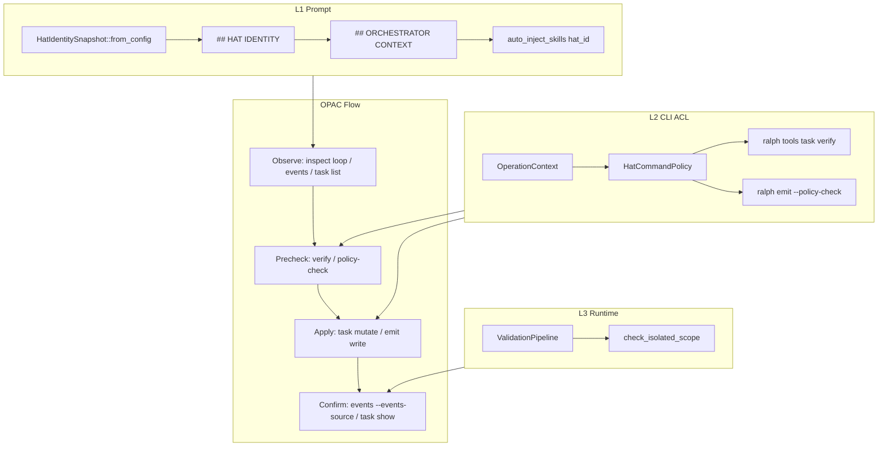
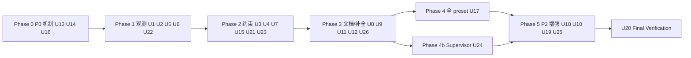

# feat: OPAC 通用 agent 纪律框架（isolated 模式稳定性）

## Overview

在 isolated 模式下，agent 不稳定的核心根因是 **preset 契约、机制 enforcement、agent 行为** 三层失配：hat 不知道自己的身份与权限、CLI 工具缺少统一的「先观测再预检再执行再确认」纪律、观测面（`ralph events` / `inspect`）与写入面（hat-channel）不一致。

本计划引入 **OPAC（Observe → Precheck → Apply → Confirm）** 作为所有 state-changing 操作的通用工作流，并通过三层防御落地：

| 层 | 机制 | 数据来源（通用，非硬编码 hat 名） |
|----|------|----------------------------------|
| **L1 Prompt** | `## HAT IDENTITY` 注入 | `HatRegistry`：`publishes` / `triggers` + `tasks.coordinator_hats` |
| **L2 CLI ACL** | `HatCommandPolicy` | 同上 + 可选 `tasks.command_rules` |
| **L3 Runtime** | 既有 gate + 补强 | `check_isolated_scope`、`ValidationPipeline`、completion-emit 告警 |

**不绑 preset 名、不绑 `executor` / `work.ready` 等固定字符串**——所有规则从 resolved `RalphConfig` 派生，与 `preset_lint` / `HatRegistry::can_publish` 同源。

**2026-07-04 对抗性审查增补（用户确认）**：OPAC alone 无法闭合 130118/093813 类机制 P0；本 plan 已并入 P0–P2 补项，并强制 **全部 7 个 embedded preset** 适配新工具。`2026-07-03-002` 作为 **U14 吸收执行**。

**2026-07-04 supervisor 专项（用户确认）**：`ce-executor-supervisor` 并发编排依赖 `ralph wave emit` + `supervisor.db`，但 wave 路径 **未纳入 OPAC Confirm**、**10 个 hat 无 instructions**、**review-synthesizer 被要求 emit 协调 topic 而 origin guard 拒收**（preset 注释 F-019）。见 **U21–U26**、R22–R27；与 `docs/plans/2026-07-03-001-feat-supervisor-rusqlite-parallel-preset-plan.md` 互补（001 偏机制/store，本 plan 偏 agent 状态管理纪律）。

## Problem Frame

### 业务问题

多次 diagnosis 报告（`docs/report/2026-07-03-ce-executor-serial-primary-*` 等）反复出现同类 P0：

- agent 乱发 task（非 coordinator 调用 `task add/ensure`）
- `task_id` 复用 / 与 emit payload 不同源
- isolated 单事件预算静默丢弃终态事件
- `task close` 后未 emit completion topic，链路断裂
- agent 读错 events 文件（主 ledger vs hat-channel），Confirm 阶段误判
- **supervisor preset**：wave fan-out hat 无 OPAC Confirm 路径；worker/integrator 等 **无 instructions**；agent 被引导 emit **supervisor-only 协调 topic**（`review.wave.complete`）遭 origin guard 拒收（preset 内 F-019 注释）

### 机制缺口

| 缺口 | 现状 | 后果 |
|------|------|------|
| Hat 身份不可观测 | 仅有 `You are {name}` + `## ORCHESTRATOR CONTEXT` | agent 越权调用 CLI |
| CLI ACL 不完整 | `validate_owner_hat_id` 仅 create 侧；无统一 policy | 非 coordinator 可 `task add` |
| 观测面错位 | `ralph events` 读 `current-events`，不读 `current-hat-events` | Confirm 看不到本 activation emit |
| 无 loop 诊断 CLI | `ralph inspect` 仅有 `profiles` | Observe 阶段缺少机器可读入口 |
| 无 task dry-run | 无 `task verify` | Precheck 与 Apply 分裂 |
| Skill 注入未 per-hat | `auto_inject_skills(None)` | 所有 hat 看到相同命令全集 |
| OPAC 未文档化 | skill 有 `--policy-check` 片段，无四阶段流程 | agent 跳过 Precheck/Confirm |
| **Wave 与 isolated 观测分裂** | `ralph wave emit` 写 `current-events`（`wave.rs:resolve_events_file`），**不**走 hat-channel；无 `ralph wave verify` | task-planner Confirm 与 loop 侧不一致 |
| **Supervisor 编排 vs agent 可观测** | `supervisor.db` 仅 runtime/diagnose；hat 被引导 `ralph diagnose --supervisor` | 违反 HARD RULE 4；无 agent-safe `inspect` |
| **Supervisor preset 拓扑/实现漂移** | `review-synthesizer` instructions 要求 emit `review.wave.complete`；`event_origin` 拒 agent 协调 topic | fan-in 链死锁（F-019） |
| **Worker hat 无 instructions** | `worker`/`fix-worker`/`review-batch-worker` 等 10 hat 无 `instructions:` | 并发 slot 内无 OPAC/TDD 契约 |

### 与既有 plan 的关系

- **`2026-07-03-002`**：**已吸收为 U14**（fix-unit mint、shipper whitelist、hat-channel 诊断、progress-steward close→emit 兜底）。002 plan 可标记 superseded by 本 plan U14。
- **`2026-05-31-004` AOG**：P1 `OperationContext` 已完成；本 plan 实现其 P2–P4 子集（task ACL、emit 路径已有 P6）。
- **Roadmap handoff（`hat_handoff`）**：已于 `2026-06-23-006` **全量删除**。轻量 **macro edge next 指针** 见 U18（P2）。

## Requirements Trace

- **R1** — 所有 state-changing 操作遵循 OPAC 四阶段；skill 文档提供 hat 无关的流程模板。(见对话共识)
- **R2** — L1：`## HAT IDENTITY` 注入当前 `hat_id`、可 emit topics、可触发 topics（agent 可观测表述）、task 命令权限矩阵。(见对话 I1)
- **R3** — L2：`HatCommandPolicy` 在 agent 上下文 hard-deny 非 coordinator 的 `task add/ensure`；人类 CLI bypass + warning。(见对话 T1/T1')
- **R4** — L2：`task close` **不 hard-deny**，但在 agent 上下文对「close 后未 emit completion topic」发出强 warning + structured hint。(见对话默认策略 1)
- **R5** — Observe：`ralph inspect loop` 只读输出与 `## HAT IDENTITY` **同源 struct**。(见对话 I1)
- **R6** — Observe/Confirm：`ralph events` 支持读 hat-channel（`--events-source hat-channel`），与 `emit_path.rs` allowlist 对齐。(见对话观测优先)
- **R7** — Precheck：`ralph tools task verify` 与真实 mutation **共享 authorization 内核**，零写盘。(见 OPAC Precheck)
- **R8** — Precheck：agent 上下文 **默认 enforce** `ralph emit --policy-check`（无 flag 则拒写盘）；`event_loop.require_policy_check_for_cli_emit` 或等价 config **opt-out**；skill 文档与 preset instructions 一致。(2026-07-04 审查修订，原 R8 仅 skill 软约束不足)
- **R9** — L1：`auto_inject_skills(hat_id)` 贯通 event_loop prompt 路径；新增 `ralph-tools-opac.md` 按需/条件注入。(见对话 S1)
- **R10** — 通用性：规则从 `publishes`/`triggers`/`coordinator_hats` 派生；测试 fixture 用内联 YAML，不用 `ce-executor-*` 专有 hat 名断言。(见对话通用性要求)
- **R11** — Skill 文档同步 + `scripts/check-cli-doc-drift.sh` + 行号反向验证。(见 AGENTS.md HARD RULE)
- **R12** — Preset hat `instructions:` 只 **引用** skill 章节，不复述 OPAC/命令语法。(见 HARD RULE 4/8)
- **R13** — U7：`task close` 后读 **hat-channel tail**（或 activation emit 计数），再发 completion-emit warning；文案含「下一步必须 emit \<topics\>」。(对抗审查 P0-1)
- **R14** — U13：isolated 单事件 budget 对 **config 声明的 serial/multi-publish 边** carve-out（通用，非 review-coordinator 硬编码）。(130118 M-1)
- **R15** — U14：并行闭合 093813/075227 P0（fix-unit mint、shipper whitelist、hat-channel 诊断、close→work.done steward）。(吸收 002 plan)
- **R16** — U4 扩展：`task verify` 校验 `task_id`/`task_key`/`step` 与 `ralph tools task list` 同源。(对抗审查 P0-4)
- **R17** — U16：`task.resume` 路由校验 consumer hat `triggers` 含 target topic。(130118 M-2)
- **R18** — U11：`preset_lint` 全覆盖 instructions 反模式（`task create` 字面量、缺 mint 模板、缺 OPAC skill 引用）。(对抗审查 P1-7)
- **R19** — U17：**全部 7 个 embedded preset** 适配 OPAC 工具链（见下表）。(用户强制要求)
- **R20** — U18（P2）：轻量 macro edge next 指针。
- **R21** — U19（P2）：BDD 覆盖 ce-executor-serial fix-unit + 6-dim serial walk。
- **R22** — U21：`ralph wave verify`（零写盘 batch precheck，同源 `policy_check`）+ wave Confirm 路径与 `events --events-source` 对齐。
- **R23** — U22：`ralph inspect loop` 含 **supervisor 摘要**（active_waves、queue_depth、slot 状态）；替代 hat 侧 `ralph diagnose --supervisor`。
- **R24** — U23：`HatCommandPolicy` 扩展 **wave emit 授权**（dispatcher hat → 对应 `*.unit.ready`；worker 内禁止 wave emit）。
- **R25** — U24：**`ce-executor-supervisor` 深度适配** — 补全 10 个无 instructions hat；**修复 F-019**（synthesizer emit `review.complete`，`review.wave.complete` 仅 supervisor 注入）；Wave OPAC 写入各 dispatcher/worker instructions。
- **R26** — U25：supervisor **BDD**（exec wave fan-out → integrator → review batch → fix wave）。
- **R27** — U26：`ralph-tools-wave.md` + `ralph-tools-opac.md` 增加 **Wave OPAC 四阶段**章节。

## Code Baseline Verification（2026-07-04 对抗审查后增补）

对照当前 `HEAD` 代码复核后，以下事实影响实施路径，必须在开工前写入计划：

1. **`ralph events --events-source` 已实现**（`crates/ralph-cli/src/commands/events.rs:11-58`）。U6 从「新增」降级为「补强/验收」；需确认 `Auto` 分支在 agent context 下优先读 `current-hat-events` marker，且空 channel 回退 main 的行为与 U7 一致。
2. **`event_policy.require_policy_check_for_cli_emit` / `allow_unsafe_cli_emit` 已存在**（`crates/ralph-core/src/config/event_policy.rs:42-46`）。U15 不是新增配置字段，而是**在 agent context 下默认 enforce**（无显式 config 时也按 `require_policy_check_for_cli_emit: true` 处理），并保留 preset `allow_unsafe_cli_emit: true` 作为 opt-out。
3. **`validate_owner_hat_id` 已在 create 路径拒绝非 coordinator agent**（`crates/ralph-cli/src/task_cli.rs:347-360`、`execute_add` 第 566 行调用）。U3 不应重复实现 owner 校验，而应在命令入口做 **early role-deny** 并给出更清晰的 recovery hint。
4. **`HandoffIndex::consumer_of(topic)` 已存在**（`crates/ralph-core/src/workflow_contract/handoff_index.rs:228`）。U16 无需新建 API，只需在 `task.resume` inject 前调用并校验 consumer hat 的 `triggers`。
5. **`auto_inject_skills(None)` 是当前实现缺口**（`crates/ralph-core/src/event_loop/mod.rs:5533`）。U8 的改动是把它改为 `auto_inject_skills(Some(hat_id.as_str()))`，并注册 `ralph-tools-opac.md`。
6. **`execution_contracts` 已内建于 `EventLoopConfig`**（`crates/ralph-core/src/config/loop_config.rs:274`）。U13 的 carve-out 不应再新增 `event_loop.declared_serial_publish` 段；优先从 `execution_contracts.rules` / `event_policy.business_topics` 派生。
7. **`presets/zh/*` 没有 ce-executor 系列的中文副本**。U17 只需改 `presets/en/*`，`presets/zh/*` 保持不改编（与 Scope Boundaries 一致）。
8. **U12 编号缺失**。本计划在 U11 之后、U13 之前插入 U12「CLI 变更总表与代码基线校准」，解决编号跳跃问题。
9. **`ralph wave emit` 写 `current-events`，不走 hat-channel**（`crates/ralph-cli/src/wave.rs:581-590` `resolve_events_file`）。dispatcher hat 在 isolated 下 Confirm 不能只用 U6 hat-channel 路径；U21 需定义 wave Confirm（读 `current-events` + `--output json` 验 `wave_id`）。
10. **`review-synthesizer` F-019 已文档化但未修复**（`presets/en/ce-executor-supervisor.yml:876-886`）：instructions 要求 agent emit `review.wave.complete`，`event_origin::is_supervisor_coordination_topic` 拒 agent。U24 必须改拓扑/instructions/schema。
11. **Supervisor preset 10 hat 无 `instructions:`**（`worker`, `exec-integrator`, `exec-failure-handler`, `review-batch-worker`, `fix-worker`, `fix-integrator`, `alignment`, `reporter`, `fixer`, `progress-steward`）。并发 slot 无 OPAC/TDD 契约，U24 必补。
12. **`ralph diagnose --supervisor`** 已存在（`commands/diagnose.rs`）但 **hat 不可直接读 db**；U22 应在 `inspect loop` 暴露 agent-safe 摘要，禁止 instructions 引用 diagnose。

### Embedded preset 全量适配清单（R19）

| Preset | Schema 同步 | Hat instructions OPAC 引用 | coordinator_hats / tasks | 备注 |
|--------|-------------|--------------------------|--------------------------|------|
| `autoresearch` | 若动 event 拓扑则同步 | 全部 emitter/coordinator hat | 核对 tasks.enabled | |
| `ce-executor-pipeline` | 必须 | 全部 hat | 必须 | 12-hat |
| `ce-executor-serial` | 必须 | 全部 hat；U14 fix-unit 段 | 必须 | 002 主靶 |
| `ce-executor-supervisor` | 必须 | 全部 hat | 必须 | 16-hat |
| `debug` | 若动则同步 | 全部 hat | 若 tasks.enabled | |
| `merge-loop` | 必须 | 全部 hat | 必须 | |
| `merge-batch` | 必须 | 全部 hat | 必须 | |

每个 preset 改动走 AGENTS.md「preset/schema 改动后下游同步清单」全量校验（preset_lint ×2、SSOT byte-equality、scenarios、zsh、CLAUDE/AGENTS）。

## Scope Boundaries

### In scope

- `HatIdentitySnapshot` SSOT + prompt 注入 + `ralph inspect loop`
- `HatCommandPolicy` + `ralph tools task verify`
- `ralph events --events-source`
- Per-hat skill auto-inject 修复 + `ralph-tools-opac.md`
- Completion-emit 告警（hat-channel tail 感知，见 U7 修订）
- Isolated budget serial/multi-publish carve-out（U13）
- 吸收 `2026-07-03-002` 全部 P0（U14）
- Agent 上下文 emit policy-check 默认 enforce（U15）
- `task.resume` consumer 路由校验（U16）
- `preset_lint` instructions 全覆盖（U11）
- **全部 7 embedded preset OPAC 适配**（U17）
- 通用 + ce-executor-serial 专项 BDD（U10 + U19）
- Skill 文档 OPAC 章节更新

### Non-goals

- 不恢复已删除的完整 `hat_handoff` 五段模板（U18 轻量 next 指针不足时再扩展）
- 不 hard-block executor `task close`（仍 warn-only；U14 steward 负责 recovery）
- 不修改 coordinator 模式主路径（isolated 为一等公民）
- 不改编 `presets/zh/*` 参考副本（仅 `presets/en/*` embedded 集）
- 不改编 `hatless-baseline`（manifest 未 embedded）

### Deferred to Separate Tasks

- **完整 handoff v2**（若 U18 轻量 next 指针不足，再单独 plan 扩展为完整 roadmap 文件机制）

## Context & Research

### Relevant Code and Patterns

| 文件 | 用途 |
|------|------|
| `crates/ralph-cli/src/operation_guard.rs` | `OperationContext`、agent 检测；ACL 挂载点 |
| `crates/ralph-cli/src/task_cli.rs` | `validate_owner_hat_id`、`authorize_lifecycle` |
| `crates/ralph-cli/src/policy_check.rs` | `--policy-check` 与 loop 同源 `ValidationPipeline` |
| `crates/ralph-cli/src/cli/emit_path.rs` | `current-hat-events` allowlist |
| `crates/ralph-cli/src/commands/events.rs` | 待扩展 `--events-source` |
| `crates/ralph-cli/src/commands/inspect.rs` | 待扩展 `inspect loop` |
| `crates/ralph-core/src/runtime_state.rs` | `## ORCHESTRATOR CONTEXT` 模式参考 |
| `crates/ralph-core/src/hat_registry.rs` | `can_publish(hat, topic)` SSOT |
| `crates/ralph-core/src/skill_registry.rs` | `auto_inject_skills(hat_id)` |
| `crates/ralph-core/src/event_loop/mod.rs` | `build_prompt`、`prepend_orchestrator_context`、`inject_custom_auto_skills(None)` 缺口 |
| `crates/ralph-core/src/config/tasks.rs` | `coordinator_hats` |

### Institutional Learnings

- **仅靠 prompt 不够**：merry-lotus 8 次 `debug.step` 落盘后才被 runtime 丢弃 → CLI 边界拒收 + 可读 recovery（`docs/solutions/integration-issues/ce-executor-serial-precheck-recovery-alignment-2026-06-17.md`）
- **`RALPH_CURRENT_HAT` 不可信**：必须在 ingestion 端用 registry 校验（`docs/achieved/brainstorms/2026-05-31-agent-operation-guard-requirements.md`）
- **isolated scope 必须在 CLI 层拒收**：不能等 runtime 静默丢弃（同上）
- **Confirm 读错 events 文件**：hat-channel merge 发生在 backend 退出后，同 activation 内读主 events 看不到刚 emit 的行（093813 / spec-flow 分析）
- **task_id 三字段同源**：`ralph-tools-tasks.md` red box；verify 应校验 live id

### External References

- 无额外外部 research；本地模式已足够（`check_isolated_scope`、`OperationContext`、AOG plan）。

## Key Technical Decisions

| ID | 决策 | 理由 |
|----|------|------|
| KTD-1 | 新增 `HatIdentitySnapshot` struct 作为 L1 + `inspect loop` + 测试 golden 的 **单一事实源** | 避免 prompt 与 CLI 输出 drift |
| KTD-2 | `HatCommandPolicy::from_config(config, hat_id)` 派生权限；默认规则：`task add/ensure` → 仅 `coordinator_hats`；lifecycle → owner ∪ coordinator | 不硬编码 hat 名；复用已有 allowlist |
| KTD-3 | `ralph tools task verify` 调用与 mutation 相同的 `authorize_*` / `validate_owner_hat_id` / `HatCommandPolicy`，通过 `--dry-run` 或 internal flag 跳过 store write | 避免 verify/apply 双实现 |
| KTD-4 | `ralph events --events-source hat-channel\|main\|auto`；默认 `auto` = agent 上下文优先 hat-channel，人类默认 main | 对齐 Confirm 时序；`auto` 减少 agent 记 flag |
| KTD-5 | `## HAT IDENTITY` 置于 `## ORCHESTRATOR CONTEXT` **之前**；前者静态契约，后者动态快照 | 职责分离，减少重复 |
| KTD-7 | `task close` 后：读 hat-channel 文件 tail（`OperationContext` + `current-hat-events` marker），检查是否已有 caller `publishes` 中属于 **completion-class** 的 topic；若无 → stderr JSON warning。completion-class 判定：取 `event_policy.terminal_topics ∪ event_policy.business_topics` 中该 hat `publishes` 含有的 topic（即该 hat 有能力发的终态/业务完成事件） | 对抗审查：不扫描则 R13 落不实；判定源用既有 event_policy 字段，不新增概念 |
| KTD-8 | `ralph-tools-opac.md`：always-inject 当 `tasks.enabled \|\| memories.enabled`；内容只写四阶段 + 引用 emit/tasks 章节 | HARD RULE 8 防 drift |
| KTD-9 | 测试：内联 2–3 hat YAML fixture；BDD 用 `run_workflow_guard_scenario` | AGENTS.md + 2026-06-24 P0-2 教训 |
| KTD-10 | **吸收** `2026-07-03-002` 为 U14；与 OPAC 同批 P0 闭合，不再范围隔离 | 093813/075227 不 absorb 则 OPAC 仍会翻车 |
| KTD-11 | **不从 `event_loop` 新增 `declared_serial_publish` 字段**。isolated budget carve-out 的 SSOT 为 `event_policy.business_topics` + 可选 `execution_contracts.rules` 中声明的 topic：若某 hat 的 `publishes` 与 `business_topics` 交集非空，则这些 topic 允许在 **不同 activation** 各 emit 一次；同一 activation 内重复发同/不同 business topic 仍按原 budget drop/deny。130118 的 6-dim serial walk 通过 `review-coordinator` 每 activation 发一条 `review.dimension.ready` 自然满足此规则 | 避免新增 config 段导致 schema/lint/config 三处同步；复用既有 event_policy 语义 |
| KTD-12 | Agent 上下文 `ralph emit`：**默认 enforce policy-check**（即使 config 未显式设置 `event_policy.require_policy_check_for_cli_emit: true`，agent path 也按 true 处理）；`event_policy.allow_unsafe_cli_emit: true` 作为 preset opt-out（字段已存在，见 `crates/ralph-core/src/config/event_policy.rs:46`） | 2026-07-04 审查修订 R8；复用既有 event_policy 字段 |
| KTD-13 | `task.resume` inject 前校验 `HandoffIndex::consumer_of(topic)` 的 hat `triggers` 含 topic | 130118 M-2 |
| KTD-14 | `preset_lint` 新增 instructions 规则集（`task create`、缺 `ralph-tools-opac` 引用、fix-unit 缺 mint 模板）→ **strict 可 fail** | U11；先于 U17 全量改 preset |
| KTD-15 | **全部 7 embedded preset** 必须过 U11 lint + OPAC instructions 引用；一 preset 一 commit 或分 PR 均可 | 用户强制 R19 |
| KTD-16 | U18 轻量 macro edge：`event_loop.macro_edge_next_hint.enabled` + payload optional `next_hint`（≤120 字符）或 ORCHESTRATOR CONTEXT 注入；**非**完整 hat_handoff 五段文件 | P2；吸收 handoff 最有价值部分 |

## Open Questions

### Resolved During Planning

- **Q: executor 能否 task close？** — 可以；warn-only，不 block（用户确认）。
- **Q: 是否全局强制 policy-check？** — **2026-07-04 修订**：agent 上下文默认 enforce（KTD-12）；人类 CLI + preset opt-out 保留。
- **Q: 是否绑 ce-executor / work.ready？** — 否；全从 registry/config 派生（用户确认）。
- **Q: hat_handoff 是否本 plan 做？** — 否；已删除，单独 deferred（源码 `grep hat_handoff` 无实现）。

### Deferred to Implementation

- `ralph inspect loop` JSON schema 版本字段命名（`schema_version` vs `inspect_schema_version`）。
- `ralph tools task verify` 子命令层级：采用 `ralph tools task verify <subcmd>` 还是 `ralph tools task verify-emit-bridge`；实现前根据 clap 嵌套深度与 skill 引用一致性决定。

## High-Level Technical Design

> *This illustrates the intended approach and is directional guidance for review, not implementation specification. The implementing agent should treat it as context, not code to reproduce.*

**Confirm 时序契约（关键）**：

- 同一 activation 内 Confirm **必须**用 `ralph events --events-source hat-channel`（或 `--events-source auto` 在 agent 上下文自动选 hat-channel）。
- Merge 后主 events 用于跨 hat / 诊断，不作为同轮 Confirm 首选。

## Implementation Units

- [ ] **U1: HatIdentitySnapshot SSOT**

**Goal:** 从 resolved config 渲染 hat 身份块，供 prompt、inspect、测试共用。

**Requirements:** R2, R5, R10

**Dependencies:** None

**Files:**
- Create: `crates/ralph-core/src/hat_identity.rs`
- Modify: `crates/ralph-core/src/lib.rs`
- Test: `crates/ralph-core/src/hat_identity.rs`

**Approach:**
- Struct 字段：`hat_id`, `publishes[]`, `triggers[]`（agent 可观测表述）, `is_coordinator`, `allowed_task_commands[]`, `denied_task_commands[]`。
  - **不**在 struct 中预存 `completion_publishes[]`：completion-class topic 由调用方用 `publishes[] ∩ (event_policy.terminal_topics ∪ event_policy.business_topics)` 实时计算，避免 U1 与 U7/U13 的 SSOT drift。
- `HatIdentitySnapshot::from_config(config, hat_id) -> Option<Self>`
- `to_prompt_block() -> String` 渲染 `## HAT IDENTITY`
- `to_json() -> serde_json::Value` 供 inspect；JSON 输出不含 `completion_publishes`，`inspect loop` 如需要 completion-class 可现场计算

**Execution note:** 先写单元测试（内联 2-hat config），再实现渲染。

**Patterns to follow:**
- `RuntimeStateSnapshot::to_prompt_block`（`runtime_state.rs`）
- `HatRegistry::can_publish`

**Test scenarios:**
- Happy path: coordinator hat → `allowed_task_commands` 含 add/ensure
- Happy path: non-coordinator → denied 含 add/ensure，allowed 含 start/close/list
- Edge case: 未知 hat_id → None
- Edge case: 空 `coordinator_hats` + agent owner → fail-closed 语义与 `validate_owner_hat_id` 一致
- Error path: hat 无 publishes → 空数组，不 panic

**Verification:**
- `cargo nextest run -p ralph-core -- hat_identity` 绿

---

- [ ] **U2: ## HAT IDENTITY prompt 注入**

**Goal:** isolated `build_prompt` 路径在 ORCHESTRATOR CONTEXT 之前注入身份块。

**Requirements:** R2, R5

**Dependencies:** U1

**Files:**
- Modify: `crates/ralph-core/src/event_loop/mod.rs`
- Test: `crates/ralph-core/src/event_loop/tests/runtime_state_injection.rs`（或新建 `hat_identity_injection.rs`）

**Approach:**
- 新增 `prepend_hat_identity(prompt, hat_id)`，在 isolated `build_prompt` 路径调用 `prepend_orchestrator_context` 之前调用（当前 `prepend_orchestrator_context` 位于 `crates/ralph-core/src/event_loop/mod.rs:4535`）。
- 注入位置顺序：`## HAT IDENTITY` → `## ORCHESTRATOR CONTEXT` → `## WAVE CONTEXT` → ... → `prepend_auto_inject_skills`。
- Coordinator 模式：可选跳过或简化（isolated 为主路径；coordinator 不破坏）。

**Test scenarios:**
- Happy path: isolated build_prompt 输出含 `## HAT IDENTITY` 且含 hat_id
- Happy path: 块在 `## ORCHESTRATOR CONTEXT` 之前
- Edge case: hat_id 不在 registry → 不注入或注入 explicit error stub（实现时选 fail-visible）
- Integration: golden snapshot 不含硬编码 `executor` 字符串（用 fixture hat 名）

**Verification:**
- event_loop injection 测试绿；无 coordinator 路径回归

---

- [ ] **U3: HatCommandPolicy CLI ACL（早期拒绝 + 消息优化）**

**Goal:** agent 上下文统一 enforcement；人类 bypass + warning。

**Requirements:** R3, R10

**Dependencies:** U1

**Files:**
- Create: `crates/ralph-cli/src/hat_command_policy.rs`
- Modify: `crates/ralph-cli/src/operation_guard.rs`（或 re-export）
- Modify: `crates/ralph-cli/src/task_cli.rs`（`execute_add` / `execute_ensure` / `execute_close` 入口）
- Modify: `crates/ralph-cli/src/main.rs`（mod 声明）
- Test: `crates/ralph-cli/src/hat_command_policy.rs`, `crates/ralph-cli/src/task_cli.rs`

**Approach:**
- 现状：`task add/ensure` create 路径已有 `validate_owner_hat_id` 在写盘前拒绝非 coordinator owner（`task_cli.rs:347-360`、`execute_add` 第 566 行）。该检查**保留**，不在 U3 重复实现。
- 新增 `HatCommandPolicy::check(command, subcommand, ctx, config) -> PolicyResult`（Allow / Deny / Warn），在 `execute_add` / `execute_ensure` / `execute_close` **入口最早处**调用：
  - `task add` / `task ensure`：agent + 非 coordinator → **Deny**（hard-deny，exit ≠ 0）。
  - 其它 task 变异：走现有 `authorize_lifecycle` + policy 补充（Warn 场景）。
- 错误消息含 recovery hint（如「只有 coordinator hat 可创建任务；你是 `{hat_id}`，请让 coordinator 执行 `ralph tools task add/ensure`」——用 role 词，不用固定 hat 名）。
- 人类 CLI：`is_agent_context == false` → Allow，但跨 loop 时仍打印现有 warning（`authorize_lifecycle` 第 252-258 行）。

**Patterns to follow:**
- `validate_owner_hat_id`、`authorize_lifecycle`（`task_cli.rs`）
- AOG plan P2 授权矩阵

**Test scenarios:**
- Happy path: coordinator agent `task add` → Allow
- Error path: worker agent `task add` → Deny + 明确 message（与 `validate_owner_hat_id` 的拒绝消息前缀一致）
- Happy path: human CLI `task add` → Allow（无 owner 检查）
- Edge path: agent 无 `RALPH_CURRENT_HAT` → Deny
- Edge path: owner worker `task start` on own task → Allow

**Verification:**
- `cargo nextest run -p ralph-cli --bin ralph -- hat_command_policy` 绿
- `cargo nextest run -p ralph-cli --bin ralph -- task_cli` 绿（不破坏既有 owner 校验测试）

---

- [ ] **U4: ralph tools task verify（含三字段同源）**

**Goal:** Precheck 阶段零写盘校验 task 变异 + emit payload 前置字段一致性。

**Requirements:** R7, R16, R1

**Dependencies:** U3

**Files:**
- Modify: `crates/ralph-cli/src/task_cli.rs`
- Modify: `crates/ralph-cli/src/main.rs`（clap 子命令）
- Test: `crates/ralph-cli/src/task_cli.rs`

**Approach:**
- 新子命令 `ralph tools task verify <subcmd> ...`，镜像 add/ensure/start/close/fail/reopen 参数。
- 内部：`HatCommandPolicy` + `authorize_lifecycle` + field validation；**不**写 `tasks.jsonl`。
- **扩展（三字段同源校验）**：采用 `ralph tools task verify emit-bridge --task-id ID --task-key KEY --step STEP`（作为 `verify` 的子命令），对照 `ralph tools task list/show` 断言：
  - `task_id` 为当前 loop open/live id（非 closed 复用）
  - `task_key` 与注册 key 一致
  - `step` 匹配 `task_key` 内 `:step-<n>:` 段（per `ralph-tools-tasks` red box，`crates/ralph-core/data/ralph-tools-tasks.md:60-63`）
- 备选：若 clap 嵌套 `verify <subcmd>` 与 `verify` flags 冲突，则改为 `ralph tools task verify-emit-bridge` 顶层子命令。实现前在 U12 的 CLI 变更总表中锁定。
- 输出：human 摘要 / `--format json` 与 emit policy-check 错误结构对齐。

**Test scenarios:**
- Happy path: verify add 与正式 add 同 Allow/Deny
- Integration: verify deny 后正式 add 也 deny（同 msg 前缀）
- Edge case: verify close 对不存在的 task_id → 与正式 close 同错
- Error path: agent 非 coordinator verify ensure → deny
- **Error path: verify emit-bridge 用 closed task_id → fail**
- **Error path: step 与 task_key 段不一致 → fail**

**Verification:**
- `ralph tools task verify --help` 可解析；单测绿

---

- [ ] **U5: ralph inspect loop**

**Goal:** Observe 阶段机器可读 loop + hat 身份诊断。

**Requirements:** R5, R1

**Dependencies:** U1

**Files:**
- Modify: `crates/ralph-cli/src/commands/inspect.rs`
- Modify: `crates/ralph-cli/src/main.rs`
- Test: `crates/ralph-cli/src/commands/inspect.rs`（tests mod）

**Approach:**
- 新子命令 `ralph inspect loop [--format human|json]`
- 输出：loop_id, iteration, current_hat（env/marker）, `HatIdentitySnapshot`, events 路径解析（main + hat-channel markers）, hat-channel 文件 size/非空
- 只读；不启动 loop

**Patterns to follow:**
- `inspect profiles` 的 view struct + JSON 序列化模式

**Test scenarios:**
- Happy path: 有 marker 时 JSON 含 loop_id + hat_identity
- Edge case: 无 loop marker → 清晰 note，exit 0
- Edge case: hat-channel 0 字节 → warnings 数组非空
- Happy path: human 格式含关键字段标题

**Verification:**
- `ralph inspect loop --help`；inspect 模块测试绿

---

- [ ] **U6: ralph events --events-source（已存在，补强与验收）**

**Goal:** Confirm 阶段读正确 events 文件。

**Requirements:** R6, R1

**Dependencies:** None（可与 U1 并行）

**Files:**
- Modify: `crates/ralph-cli/src/commands/events.rs`（已有实现，主要补测试 + 与 U7 对齐空 channel 回退文案）
- Modify: `crates/ralph-cli/src/cli/emit_path.rs`（复用 resolve 逻辑）
- Test: `crates/ralph-cli/src/commands/events.rs`

**Approach:**
- 当前代码已实现 `--events-source auto|main|hat-channel`（`events.rs:11-58`），默认 `auto`。
- U6 工作重点：
  1. 确认 `Auto` 分支在 agent context 下优先读 `.ralph/current-hat-events` marker（与 `emit_path.rs:92` allowlist 一致）。
  2. 空/不可读 hat-channel 时的 warning 文案与 U7 共用同一 helper，避免两处文案 drift。
  3. 补充 round-trip 测试：agent emit → `ralph events --events-source hat-channel` 可见。

**Test scenarios:**
- Happy path: agent env + `--events-source auto` 读 `current-hat-events` 指向文件
- Happy path: human + auto → main events
- Edge case: explicit `--events-source hat-channel` 无 marker → 清晰错误
- Integration: 与 emit 写入同路径 round-trip（测试 temp dir）

**Verification:**
- `cargo nextest run -p ralph-cli --bin ralph -- events` 绿

---

- [ ] **U7: Completion-emit 告警（close 后 + hat-channel tail）**

**Goal:** agent close 后若 hat-channel 无 completion emit，强 warning 并给出下一步 emit 指令。

**Requirements:** R4, R13, KTD-7

**Dependencies:** U3, U6

**Files:**
- Modify: `crates/ralph-cli/src/task_cli.rs`（close 路径）
- Create: `crates/ralph-core/src/completion_emit.rs`（helper：从 `event_policy` 派生 caller 的 completion-class topics）
- Modify: `crates/ralph-cli/src/cli/emit_path.rs`（复用 hat-channel 路径解析）
- Test: `task_cli.rs`、`completion_emit.rs`

**Approach:**
- `task close` 成功后（agent 上下文）：
  1. 从 `HatIdentitySnapshot` 取 caller `publishes[]`；与 `event_policy.terminal_topics ∪ event_policy.business_topics` 求交，得到 `completion_publishes[]`。
  2. 读 hat-channel 文件 tail（`resolve_emit_path(current-hat-events)` / `OperationContext` marker），解析最近 N 行 JSONL。
  3. 若无一 topic ∈ `completion_publishes` → stderr JSON：
     `{ "code": "close_without_completion_emit", "expected_topics": [...], "next_step": "ralph emit <TOPIC> --policy-check ... 然后去掉 --policy-check 正式 emit" }`
  4. hat-channel 空/不可读 → warning 含 `hint: run ralph inspect loop` + 仍提示 expected_topics。
- 人类 CLI：无 warning（或 dim note）。

**Test scenarios:**
- Happy path: close 前 hat-channel 已有 completion topic → 无 warning
- Happy path: close 后 hat-channel 无 completion → Warn + next_step
- Happy path: 无 completion publishes 的 hat close → 无 warning
- Edge case: 空 hat-channel 文件 → Warn + channel_empty hint
- Edge case: 空 publishes → 无 warning

**Verification:**
- 单测绿；不误伤纯 reviewer hat

---

- [ ] **U8: Per-hat skill 注入 + ralph-tools-opac.md**

**Goal:** 修复 `auto_inject_skills(None)`；注入 OPAC skill。

**Requirements:** R8, R9, R11

**Dependencies:** U1（可并行）

**Files:**
- Modify: `crates/ralph-core/src/event_loop/mod.rs`（`inject_custom_auto_skills`，当前调用为 `auto_inject_skills(None)`，见 `event_loop/mod.rs:5533`）
- Create: `crates/ralph-core/data/ralph-tools-opac.md`
- Modify: `crates/ralph-core/src/skill_registry.rs`（注册 builtin）
- Modify: `crates/ralph-core/data/ralph-tools.md`（索引条目）
- Test: `crates/ralph-core/src/skill_registry.rs`

**Approach:**
- 把 `inject_custom_auto_skills` 中的 `self.skill_registry.auto_inject_skills(None)` 改为 `self.skill_registry.auto_inject_skills(Some(hat_id.as_str()))`，使 hat-restricted skill 只注入给对应 hat。
- `ralph-tools-opac.md`：
  - frontmatter `auto_inject: true`（与 ralph-tools 同级）。
  - 内容只写 OPAC 四阶段流程 + 索引表，**不复制**命令参数表；命令细节引用 `ralph-tools-emit` §5 precheck、`ralph-tools-tasks` red box、`ralph-tools-cmdref` 中 `inspect loop` / `task verify`。
  - 明确注入条件：与 `ralph-tools.md` 一致，当 `tasks.enabled || memories.enabled` 时注入。
- `ralph-tools.md` 索引表增加 `ralph-tools-opac` 条目。

**Test scenarios:**
- Happy path: hat A 有 `hats: [A]` 的 skill 仅 A 注入
- Happy path: opac skill 在所有 agent loop 注入
- Regression: 无 hat_id 时不 crash

**Verification:**
- `cargo nextest run -p ralph-core -- skill_registry` 绿
- `cargo nextest run -p ralph-core -- build_prompt` 绿（确认 per-hat skill 注入不破坏既有 prompt 结构）

---

- [ ] **U9: Skill 文档 OPAC 工作流同步**

**Goal:** 现有 skill 与 OPAC 一致，消除 drift。

**Requirements:** R11, R12, R1, R8

**Dependencies:** U4, U5, U6, U8

**Files:**
- Modify: `crates/ralph-core/data/ralph-tools.md`
- Modify: `crates/ralph-core/data/ralph-tools-tasks.md`
- Modify: `crates/ralph-core/data/ralph-tools-emit.md`
- Modify: `crates/ralph-core/data/ralph-tools-cmdref.md`
- Modify: `crates/ralph-core/data/ralph-tools-opac.md`（若 U8 已创建则修订）

**Approach:**
- 各文档增加 OPAC 交叉引用，不复制参数表
- 删除/修正不存在的 `task create` 引用 → `add`/`ensure`
- 行号引用 `sed -n` 复核

**Test scenarios:**
- Test expectation: none — 文档变更；跑 `scripts/check-cli-doc-drift.sh`

**Verification:**
- drift 脚本绿；`ralph tools task verify --help` 等与文档一致

---

- [ ] **U10: BDD scenario — OPAC agent discipline**

**Goal:** 真 EventLoop 路径验收 OPAC 关键链路。

**Requirements:** R10, R1

**Dependencies:** U2, U3, U6

**Files:**
- Create: `crates/ralph-core/tests/scenarios/opac/isolated_agent_discipline.yml`
- Modify: `crates/ralph-core/tests/scenarios.rs`

**Approach:**
- 2-hat inline preset fixture：`coordinator` + `worker`（不用 ce-executor 名）
- 场景：worker 尝试越权 task 操作 → recovery/deny；coordinator 合法 emit 链
- **必须** `run_workflow_guard_scenario`

**Test scenarios:**
- ACL-1: worker 越权 → 事件链含 deny/recovery
- CH-1: emit 后 events 可读（mock 断言 hat-channel merge 后 topic 出现）
- BUD-1: 双业务 emit → 第二件 dropped（isolated 预算）

**Verification:**
- `cargo nextest run -p ralph-core --test scenarios opac`

---

- [ ] **U11: preset_lint — instructions OPAC 全覆盖**

**Goal:** 静态拦截 preset instructions 中导致 agent 误用 CLI 的反模式。

**Requirements:** R18

**Dependencies:** U9

**Files:**
- Modify: `crates/ralph-core/src/preset_lint/mod.rs` + 新模块 `instructions_opac.rs`
- Modify: `crates/ralph-core/src/preset_lint/finding_id.rs`
- Test: `crates/ralph-core/src/preset_lint/instructions_opac.rs`

**Approach:**
- 新 findings（名称实现时定，均需 `--strict` 可 fail）：
  - `INSTRUCTIONS_TASK_CREATE_LITERAL`：正则匹配 `\bralph\s+tools\s+task\s+create\b` 或 `\bralph\s+task\s+create\b`（命令不存在，应改为 `add`/`ensure`）
  - `INSTRUCTIONS_FIX_UNIT_MINT_TEMPLATE_MISSING`：**仅对 `publishes` 含 `work.ready` 或 `coordinator_hats` 中的 hat**；若 instructions 含 `fix-unit` / `fix unit` / `fresh mint` 等关键词但无 `task ensure --for-fix-unit` 或 `ensure.*--for-fix-unit` 模板引用 → finding
  - `INSTRUCTIONS_OPAC_SKILL_REFERENCE_MISSING`：**对 `publishes` 非空的所有 hat**；instructions 未引用 `ralph-tools-opac` 或未引用 `ralph-tools-emit` §5 precheck（正则匹配 `ralph-tools-opac` 和 `ralph-tools-emit`）→ finding
  - `INSTRUCTIONS_READ_INTERNAL_LEDGER`：正则匹配 `read.*\.ralph/events\.jsonl` / `tail.*\.ralph/events\.jsonl` / `read.*supervisor\.db` / `ralph diagnose --supervisor` / `\.ralph/loops\.json` 等（违反 HARD RULE 4）
  - `INSTRUCTIONS_SUPERVISOR_COORDINATION_TOPIC`：instructions 要求 agent `ralph emit` / `ralph wave emit` **supervisor-only 协调 topic**（`*.wave.complete` / `*.unit.ready` 等，`event_origin::is_supervisor_coordination_topic` 拒 agent）；与 F-019 同源
- 扫描对象：全部 hat `instructions:` 文本；**不绑 preset 名**
- 实现时先对 7 embedded preset 跑 lint 产出 baseline，再迭代阈值，避免误判。

**Test scenarios:**
- Happy path: 合规 instructions → 无 finding
- Error path: 含 `ralph tools task create` → finding
- Error path: 含 `read events.jsonl` → finding
- Error path: coordinator hat 谈 fix-unit 但无 `--for-fix-unit` → finding
- Integration: 对 7 embedded preset 跑 lint，产出 baseline（U17 前可能红，U17 后必须绿）

**Verification:**
- `cargo nextest run -p ralph-core -- preset_lint instructions` 绿

---

- [ ] **U12: CLI 变更总表与 zsh 补全同步**

**Goal:** 把本次新增/改动的 CLI 命令、参数、zsh 补全一次性列清，避免 U20 遗漏。

**Requirements:** R11, R19

**Dependencies:** U4, U5, U6

**Files:**
- Modify: `scripts/ralph-zsh-plugin.zsh`

**CLI 变更总表：**

| 命令 | 变更 | 对应 Unit | zsh 影响 |
|------|------|----------|----------|
| `ralph tools task verify <add\|ensure\|start\|close\|fail\|reopen>` | 新增 | U4 | `_ralph_task_subcmd` 加 `verify` |
| `ralph tools task verify-emit-bridge --task-id ID --task-key KEY --step STEP` | 新增（或挂在 `verify` 子命令下） | U4 | 同上 |
| `ralph inspect loop [--format human\|json]` | 新增；含 `supervisor` 摘要块（U22） | U5, U22 | `_ralph_inspect_subcmd` 加 `loop`；`_ralph_inspect_loop_args` 文档化 supervisor 字段 |
| `ralph events --events-source auto\|main\|hat-channel` | 已存在，补全/稳定 | U6 | `_ralph_events_args` 加 `--events-source` |
| `ralph wave verify --payloads-stdin [--policy-check]` | 新增（零写盘 batch precheck） | U21 | `_ralph_wave_subcmd` 加 `verify` |
| `ralph wave emit` | agent context 默认 enforce `--policy-check`（同 U15） | U21, U15 | `_ralph_wave_emit_args` 注释说明 precheck 顺序 |
| `ralph emit` | agent context 默认 enforce policy-check | U15 | 无新 flag，但 `_ralph_emit_args` 注释说明 `--policy-check` / `--unsafe-no-policy-check` 行为 |
| `ralph tools task close` | close 后可能 stderr warning JSON | U7 | 无新 flag |

**Approach:**
- U12 不写新 Rust 代码，只更新 zsh 补全脚本，使新增子命令/参数可 TAB。
- 每个受影响的 `_ralph_*_args` 函数在注释里标注变更来源 Unit，方便后续 plan 追踪。
- 安装与验证：`cp scripts/ralph-zsh-plugin.zsh ~/.oh-my-zsh/plugins/ralph/ralph.plugin.zsh` 后，新 shell 里 `ralph inspect <TAB>` / `ralph tools task verify <TAB>` 能列出新增项。

**Test scenarios:**
- `ralph inspect loop --help` 可解析
- `ralph tools task verify --help` 可解析
- zsh 补全脚本语法无错：`zsh -n scripts/ralph-zsh-plugin.zsh`

**Verification:**
- `zsh -n scripts/ralph-zsh-plugin.zsh` 通过
- 手动 smoke：新 shell 中 `ralph inspect <TAB>` 出现 `loop`

---

- [ ] **U13: Isolated budget — business_topics serial carve-out**

**Goal:** config 已声明的 business/terminal topics 允许跨 activation 各 emit 一次，不被单事件 budget 静默 drop。

**Requirements:** R14, KTD-11

**Dependencies:** None（可与 Phase 1 并行；**P0 机制**）

**Files:**
- Modify: `crates/ralph-core/src/event_loop/mod.rs`（budget / `enforce_wave_isolated_scope` 段）
- Modify: `crates/ralph-core/src/config/event_policy.rs`（如需要新增 helper）
- Test: `crates/ralph-core/src/event_loop/tests/scope_enforcement.rs` 或新建 `serial_publish_carveout.rs`

**Approach:**
- **不新增 `event_loop` 配置字段**。Carve-out SSOT 为 `event_policy.business_topics`（必要时加 `terminal_topics`）。
- 判定规则：
  - 某 hat 的 `publishes` ∩ `event_policy.business_topics`（或 `terminal_topics`）= 该 hat 的 **completion-class topics**。
  - 这些 completion-class topics **在不同 activation 之间**允许各 emit 一条；同一 activation 内重复发同/不同 completion-class topic 仍按原 budget 处理（非 silent，优先 CLI 拒收或 runtime drop 并写 diagnostic）。
  - 非 completion-class 业务 topic（如一个 hat 同时发 `work.ready` 和 `work.done`）仍受原单事件 budget 约束。
- 130118 场景：`review-coordinator` 每 activation 发一条 `review.dimension.ready`（该 topic 进入 `business_topics` 后），6 个 activation 各 accept 1 条。

**Test scenarios:**
- Happy path: 6 topic 序列跨 6 activation 各 accept 1 条
- Error path: 同 activation 发第 2 条业务 event → drop/deny（非 silent 优先）
- Edge case: 未在 `business_topics` 声明的 topic → 原 budget 行为不变
- Integration: ce-executor-serial schema 声明接入后 130118 场景 mock 通过

**Verification:**
- event_loop carve-out 单测 + preset_lint 校验 `business_topics` 与 hat `publishes` 一致

---

- [ ] **U14: 吸收 2026-07-03-002 P0（093813/075227）**

**Goal:** 闭合 fix-unit mint、close→emit steward、shipper whitelist、hat-channel 诊断。

**Requirements:** R15, KTD-10

**Dependencies:** U13（budget carve-out 协同）, U16（resume 路由校验协同）；**U7 不阻塞 U14**——U7 在 Phase 2 叠加 close 后 warning，U14 的 progress-steward 兜底可在 Phase 0 先行落地。

**Files:**
- 见 `docs/plans/2026-07-03-002-fix-ce-executor-serial-093813-p0-orchestration-gaps-plan.md` 各 Unit 文件清单；核心：
- Modify: `presets/en/ce-executor-serial.yml`、`presets/schemas/ce-executor-serial.yml`
- Modify: `crates/ralph-cli/src/loop_runner/hat_channel.rs`
- Modify: `crates/ralph-core/src/preset_lint/`（fix-unit mint finding）
- Test: 002 plan BDD + `preset_lint`

**Approach:**
- **U14a** fix-unit：`preset_lint` + coordinator instructions 改为 `ralph tools task ensure --for-fix-unit` 模板（非 `task create`）
- **U14b** progress-steward：`missing_work_done` 快速 `task.resume`（runtime 兜底，不依赖 U7 的 CLI warning）
- **U14c** shipper：`default_publishes` 进 schema + recoverable_whitelist
- **U14d** hat-channel：0 字节 diagnostic（与 U6/U7 对齐）
- 002 plan 标记 **superseded by U14**；不重复维护两份 checklist

**Test scenarios:**
- 沿用 002 plan FV BDD（fix-unit 链、`run_workflow_guard_scenario`）

**Verification:**
- 002 plan Final Verification 场景绿

---

- [ ] **U15: Agent 上下文 emit policy-check 默认 enforce**

**Goal:** agent 不能跳过 schema precheck 直写 emit。

**Requirements:** R8, KTD-12

**Dependencies:** U3

**Files:**
- Modify: `crates/ralph-cli/src/commands/emit.rs`（`emit_command` 入口）
- Modify: `crates/ralph-cli/src/policy_check.rs`（`resolve_policy_check_mode` 新增 agent context 分支）
- Modify: `crates/ralph-core/src/config/event_policy.rs`（文档注释说明 agent default）
- Test: `crates/ralph-cli/tests/integration_emit_policy.rs`

**Approach:**
- 当前 `event_policy.require_policy_check_for_cli_emit` / `allow_unsafe_cli_emit` 字段已存在（`event_policy.rs:42-46`）。U15 不是新增字段，而是改行为：
  - Agent 上下文（`OperationContext::is_agent`）+ 业务 topic + 无 `--policy-check` + 无 `--unsafe-no-policy-check` → **按 `require_policy_check_for_cli_emit: true` 处理**（即 enforce）。
  - 人类 CLI：仍按 config 显式值（默认 `require_policy_check_for_cli_emit: false`）。
  - Preset 显式 `allow_unsafe_cli_emit: true` 可作为 agent opt-out（打印 deprecation warning）。
- 实现点：`resolve_policy_check_mode` 在 `config == None` 或 config 未显式 strict 时，若 `ctx.is_agent()` 则返回 `Enforce`。

**Test scenarios:**
- Error path: agent emit 无 policy-check → reject
- Happy path: agent emit `--policy-check` 通过后再正式 emit → accept
- Happy path: human CLI 无 env → 不 enforce
- Happy path: preset `allow_unsafe_cli_emit: true` → agent 可写（deprecated warning）
- Error path: agent `--unsafe-no-policy-check` 但 `allow_unsafe_cli_emit: false` → reject

**Verification:**
- `cargo nextest run -p ralph-cli --bin ralph -- integration_emit_policy` 绿

---

- [ ] **U16: task.resume consumer triggers 路由校验**

**Goal:** recovery 事件只投给订阅该 topic 的 consumer hat。

**Requirements:** R17, KTD-13

**Dependencies:** None

**Files:**
- Modify: `crates/ralph-core/src/event_loop/mod.rs`（handoff dispatch / resume inject）
- Test: `crates/ralph-core/src/event_loop/tests/handoff_dispatch.rs`

**Approach:**
- `HandoffIndex::consumer_of(topic)` 已存在（`workflow_contract/handoff_index.rs:228`），无需新建 API。
- inject `task.resume` 前：调用 `self.handoff_index.consumer_of(resume_topic)`，取 consumer hat id；再查该 hat 的 `triggers` 是否包含 `resume_topic`。
- 不匹配 → 拒 inject + diagnostic（不 silent 30s stall）。

**Test scenarios:**
- Happy path: consumer 订阅 topic → resume 可达
- Error path: consumer 不订阅 → 不 inject + logged rejection
- Edge path: 自环 resume → 按 handoff index 规则

**Verification:**
- `cargo nextest run -p ralph-core -- handoff_dispatch` 绿

---

- [ ] **U17: 全 embedded preset OPAC 适配**

**Goal:** 7 个 builtin preset 全部适配新工具链（R19 清单）。

**Requirements:** R12, R19, KTD-15

**Dependencies:** U9, U11, U14（ce-executor-serial 部分与 U14 重叠）；`ce-executor-supervisor` **深度改动在 U24**，U17 对该 preset 仅做 checklist 收尾与 lint 绿

**Files:**
- Modify: `presets/en/autoresearch.yml`
- Modify: `presets/en/ce-executor-pipeline.yml`
- Modify: `presets/en/ce-executor-serial.yml`（U14 后收尾）
- Modify: `presets/en/ce-executor-supervisor.yml`
- Modify: `presets/en/debug.yml`
- Modify: `presets/en/merge-loop.yml`
- Modify: `presets/en/merge-batch.yml`
- 各 preset 对应 `presets/schemas/<name>.yml`（event 拓扑若动则同步）
- Modify: `scripts/ralph-zsh-plugin.zsh`、`CLAUDE.md` / `AGENTS.md`（若 preset 列表/描述变）

**Approach（每个 preset 统一 checklist）:**
1. 全部 emitter hat `instructions:` → 引用 `ralph-tools-opac` + `ralph-tools-emit` §5 + `ralph-tools-tasks` red box；**删除**命令语法复述
2. coordinator / task publisher hat → 引用 `task verify` / `ensure --for-fix-unit`（若适用）
3. `tasks.coordinator_hats` 与 task publisher 对齐
4. 若 hat 有 serial walk → 将对应 completion topics 加入 `event_policy.business_topics`（U13 carve-out SSOT），并确保 schema 同步
5. 跑 U11 lint **strict 绿** + preset_lint 四件套 + SSOT byte-equality
6. 需要 BDD 的 preset 追加/更新 scenarios（至少 smoke）

### U17 per-preset 改动矩阵（R19）

| Preset | Hat 数 | 主要 emitter / coordinator | 关键改动点 | Schema 是否必动 | U13 business_topics |
|--------|--------|---------------------------|-----------|----------------|---------------------|
| `autoresearch` | 3 | `researcher`, `reporter` | instructions 引用 opac/emit；核对 `tasks.enabled` | 若 event 拓扑不动则否 | 无 serial walk |
| `ce-executor-pipeline` | 12 | `coordinator`, `executor`, `shipper`, `reporter` | 全部 emitter 引用 skill；coordinator 引用 `task verify` | 是（加 `business_topics`） | `plan.complete`, `REVIEW_COMPLETE`, `report.done`, `LOOP_COMPLETE` 等 |
| `ce-executor-serial` | 10+2(precheck) | `coordinator`, `executor`, `review-coordinator`, `fixer`, `shipper`, `reporter` | U14 已改大部分；剩余：全部 hat instructions 引用 skill；`review.dimension.ready` 进 `business_topics` | 是 | `review.dimension.ready`, `review.dimensions.complete`, `work.done`, `test.passed`, `fix.applied` 等 |
| `ce-executor-supervisor` | 16+ | `coordinator`, `task-planner`, `review-coordinator`, `fix-task-planner`, `shipper`, `reporter` | **U24 主责**：10 hat 补 instructions、F-019 拓扑修复、Wave OPAC；U17 收尾 lint/`business_topics` | 是（F-019 + wave 边） | `review.complete`, `work.done`, `test.passed`, `fix.applied` 等；**不含** supervisor-only 协调 topic |
| `debug` | 2-3 | `debugger`, `reporter` | instructions 引用 opac/emit | 否 | 无 serial walk |
| `merge-loop` | 3 | `reviewer`, `integrator`, `stabilizer` | 全部 emitter 引用 skill；self-loop stabilizer 注意 completion emit | 是 | `merge.ready`, `merge.done` 等 |
| `merge-batch` | 3 | `reviewer`, `integrator`, `reporter` | 同 merge-loop，batch 场景无 self-loop | 是 | 同 merge-loop |

**说明**：
- "Hat 数"来自 `presets/en/<name>.yml` 当前 `hats:` 列表；实现前再核对一次。
- `ce-executor-serial` 的改动与 U14 重叠：U14 负责 fix-unit / progress-steward / shipper whitelist 等 P0 机制；U17 负责剩余 hat 的 instructions 引用清理与 `business_topics` 补齐。
- `ce-executor-supervisor`：**U21–U26 负责 wave/并发 OPAC 机制 + preset 深度改造**；U17 在该 preset 上只做 U24 后的 lint 绿与 manifest 同步，避免与 U24 重复改 YAML。
- 任何 `business_topics` 增删必须同步 `presets/schemas/<name>.yml` 与 `event_policy.schemas` 的 required_fields，并跑 AGENTS.md 下游同步清单。

**Test scenarios:**
- 每个 preset：`cargo nextest run -p ralph-cli --bin ralph -- preset_lint` + core preset_lint strict
- ce-executor-serial：U19 BDD 场景
- ce-executor-supervisor：U25 BDD 场景（需 `--features supervisor-db`）
- merge-* / pipeline：workflow guard scenario smoke

**Verification:**
- 7 preset × lint 全绿；`scripts/check-cli-doc-drift.sh` 绿

---

- [ ] **U18: 轻量 macro edge next 指针（P2）**

**Goal:** 宏观边交接时下游可见「第一步动作」，不恢复完整 hat_handoff。

**Requirements:** R20, KTD-16

**Dependencies:** U1, U2, U17（preset 声明 macro 边）

**Files:**
- Modify: `crates/ralph-core/src/config/loop_config.rs`
- Modify: `crates/ralph-core/src/runtime_state.rs` 或 `event_loop/mod.rs`（inject）
- Modify: `crates/ralph-core/data/ralph-tools-opac.md`
- Test: `crates/ralph-core/src/event_loop/tests/` 新场景

**Approach:**
- Config：`event_loop.macro_edge_next_hint.enabled: false` 默认
- 宏观边 emit 时 payload optional `next_hint`（≤120 字符，动词开头）或 mechanism 从 `HandoffIndex` 生成模板 hint
- 下游 `build_prompt` 注入 `## NEXT ACTION`（单行，非五段文件）
- **不**引入 `handoff_path` 文件 SSOT（避免 2026-06 删除复发）

**Test scenarios:**
- Happy path: enabled + macro edge emit 带 hint → 下游 prompt 含 ## NEXT ACTION
- Edge case: disabled → 无块
- Error path: hint 空 / 超 long → gate reject 或 truncate

**Verification:**
- 单测 + 1 BDD macro edge smoke

---

- [ ] **U19: 扩展 BDD — fix-unit + 6-dim serial walk**

**Goal:** 覆盖 093813 + 130118 真实拓扑，不只 2-hat fixture。

**Requirements:** R21

**Dependencies:** U13, U14, U17

**Files:**
- Create: `crates/ralph-core/tests/scenarios/opac/ce_executor_serial_fix_unit_chain.yml`
- Create: `crates/ralph-core/tests/scenarios/opac/ce_executor_serial_serial_walk_6dim.yml`
- Modify: `crates/ralph-core/tests/scenarios.rs`

**Approach:**
- fix-unit：mint fresh id → work.ready → close → work.done → test.passed
- serial walk：6 activation mock 各 1 `review.dimension.ready` 均 accept（验证 U13 carve-out）
- **必须** `run_workflow_guard_scenario`；断言 `expected.events`

**Test scenarios:**
- FV-1: fix-unit 链不断裂
- FV-2: 6 dim ready 无 silent drop（accept 6 条）

**Verification:**
- `cargo nextest run -p ralph-core --test scenarios opac`

---

- [ ] **U21: Wave OPAC 管线 — verify + Confirm 路径**

**Goal:** 让 `ralph wave emit` 纳入 OPAC 四阶段；dispatcher hat 能零写盘 Precheck、写盘后 Confirm 读到正确 ledger。

**Requirements:** R22, R8

**Dependencies:** U6（events-source 验收）, U15（agent policy-check enforce 内核复用）

**Files:**
- Modify: `crates/ralph-cli/src/wave.rs`（新增 `verify` 子命令；emit 路径复用 `policy_check`）
- Modify: `crates/ralph-cli/src/commands/wave/mod.rs` 或等价 clap 树
- Modify: `crates/ralph-core/data/ralph-tools-wave.md`
- Test: `crates/ralph-cli/src/wave.rs` 单测 + integration（mock stdin payloads）

**Approach:**
1. **Precheck — `ralph wave verify --payloads-stdin`**：与 `wave emit` 同源 `ValidationPipeline` / schema / origin guard；**零写盘**；输出 JSON `{ "ok": true, "wave_id": "...", "topics": [...] }` 或 structured errors。
2. **Apply — `ralph wave emit --payloads-stdin`**：agent 上下文必须先过 verify（U15 同等 enforce：无 precheck 成功记录则拒写盘，或要求显式 `--unsafe-no-policy-check` + preset opt-out）。
3. **Confirm — 双路径文档化（写入 skill，不硬编码 preset）**：
   - **单 emit hat**（`ralph emit`）：Confirm 用 `ralph events --events-source hat-channel`（U6）。
   - **wave dispatcher hat**（`ralph wave emit`）：Confirm 用 `ralph events --events-source main`（因 `wave.rs:resolve_events_file` 写 `current-events`），`--output json` 过滤本 `wave_id` / topic。
4. **`--events-source auto` 行为**：agent 上下文若最近一次 mutation 是 wave emit → 默认 main；若是单 emit → hat-channel（与 U6 验收对齐，避免 Confirm 误判）。

**Test scenarios:**
- WV-1: verify 拒 supervisor-only 协调 topic（agent origin）→ 非零 exit + 同源 error 与 emit 一致
- WV-2: verify 通过后 emit 成功 → main ledger 含 wave batch
- WV-3: agent context 跳过 verify → emit 拒写盘（U15 联动）
- WV-4: Confirm 文档/集成：`events --events-source main` 可见刚 emit 的 topic

**Verification:**
- `cargo nextest run -p ralph-cli --bin ralph -- wave` 绿
- `ralph wave verify --help` / `ralph wave emit --help` 与 `ralph-tools-wave.md` 一致

---

- [ ] **U22: `ralph inspect loop` — supervisor agent-safe 摘要**

**Goal:** 并发 preset 的 Observe 阶段不依赖 `ralph diagnose --supervisor` 或裸读 `supervisor.db`。

**Requirements:** R23, R5

**Dependencies:** U5（`inspect loop` 基线）, U1（`HatIdentitySnapshot` 同源输出）

**Files:**
- Modify: `crates/ralph-cli/src/commands/inspect.rs`（或等价）
- Modify: `crates/ralph-core/src/supervisor/`（只读 summary API，若 001 plan 已有则复用）
- Modify: `crates/ralph-core/data/ralph-tools-opac.md`（Observe 节）
- Test: inspect 单测（supervisor disabled → 无块；enabled → 摘要字段）

**Approach:**
- `ralph inspect loop --format json` 增加可选块 `supervisor`（仅当 `event_loop.supervisor.enabled`）：
  - `active_waves[]`：`wave_id`, `phase`, `pending_units`, `done_units`
  - `queue_depth`, `slot_summary[]`（slot_id, hat, status — **不含** db 路径）
  - `last_coordination_topics[]`（runtime 注入摘要，非 events.jsonl tail）
- **禁止** instructions 再写 `ralph diagnose --supervisor`；U11 `INSTRUCTIONS_READ_INTERNAL_LEDGER` 覆盖。
- 与 `2026-07-03-001` supervisor store 只读 API 对齐，避免 duplicate SQL。

**Test scenarios:**
- IS-1: supervisor disabled → JSON 无 `supervisor` 键
- IS-2: mock db 有 active wave → 摘要字段 populated
- IS-3: hat 视角文档：coordinator 用 `ralph tools task list` + `inspect loop`，不读 db

**Verification:**
- `cargo nextest run -p ralph-cli --bin ralph -- inspect` 绿

---

- [ ] **U23: `HatCommandPolicy` — wave emit 授权**

**Goal:** L2 ACL 区分「可 wave fan-out 的 dispatcher hat」与「slot 内 worker」。

**Requirements:** R24, R3

**Dependencies:** U3（`HatCommandPolicy` 基线）, U21（wave verify 共享 policy）

**Files:**
- Modify: `crates/ralph-cli/src/operation_guard.rs` 或 `hat_command_policy.rs`（若已拆分）
- Modify: `crates/ralph-cli/src/wave.rs`（emit/verify 入口调用 policy）
- Test: policy 单测（inline YAML fixture，不用 ce-executor 名）

**Approach:**
- 从 resolved config 派生（**不硬编码 hat 名**）：
  - hat `publishes` 含 `*.unit.ready` 或 preset 声明的 wave dispatcher 角色 → 允许 `ralph wave emit` / `verify`
  - slot worker（仅 `work.ready` / `test.passed` / dimension review emit）→ **deny** wave 子命令
  - 人类 CLI bypass + stderr warning（同 U3 task ACL）
- worker 仍可用 `ralph emit`（单事件）+ `ralph tools task *`（按 coordinator 规则）

**Test scenarios:**
- WP-1: dispatcher fixture → wave verify ok
- WP-2: worker fixture → wave emit denied
- WP-3: 无 `RALPH_CURRENT_HAT` → bypass

**Verification:**
- `cargo nextest run -p ralph-cli --bin ralph -- operation_guard` 或等效 policy 测试绿

---

- [ ] **U24: `ce-executor-supervisor` 深度 OPAC 适配 + F-019 修复**

**Goal:** 并发 preset 全 hat 有 OPAC/TDD 契约；消除 agent emit 协调 topic 与 origin guard 矛盾。

**Requirements:** R25, R12, R19

**Dependencies:** U21, U22, U23, U26（skill 章节）, U11（lint findings 含 F-019）

**Files:**
- Modify: `presets/en/ce-executor-supervisor.yml`
- Modify: `presets/schemas/ce-executor-supervisor.yml`
- Modify: `crates/ralph-cli/src/presets.rs`（若 embedded 字节变）
- 下游：event_loop step-close（若 `review.complete` 拓扑变）、BDD U25、zsh、CLAUDE/AGENTS

**Approach:**

**A. 补全 10 个无 `instructions:` 的 hat**（hat 视角，引用 skill，不复述语法）：
`worker`, `exec-integrator`, `exec-failure-handler`, `review-batch-worker`, `fix-worker`, `fix-integrator`, `alignment`, `reporter`, `fixer`, `progress-steward`

每 hat 至少包含：
- Observe：`ralph inspect loop` + 本 slot `ralph tools task list`
- Precheck：`ralph emit --policy-check` 或 `ralph wave verify`（dispatcher）
- Apply：TDD / 实现职责（一句）
- Confirm：对应 events-source（U21）

**B. F-019 拓扑修复**（preset 注释 876–886 行已承认的问题）：
- `review-synthesizer` **改 emit 业务 topic** `review.complete`（agent 可发），payload 含 `wave_id` / `batch_id` / findings 摘要
- `review.wave.complete` **仅从 supervisor runtime 注入**（`event_origin::SUPERVISOR_COORDINATION_TOPICS`）；更新 schema `publishes` / `triggers` / `review-coordinator` 边
- 同步 `event_loop/mod.rs` step-close（若终态语义变）+ preset_lint ownership

**C. 已有 dispatcher hat**（`task-planner`, `review-coordinator`, `fix-task-planner`）：
- 删除 `ralph diagnose --supervisor` 引用 → `ralph inspect loop`
- Wave OPAC 四阶段引用 `ralph-tools-wave` + `ralph-tools-opac`
- U13：serial/multi-publish 边所需 topic 写入 `event_policy.business_topics`

**Test scenarios:**
- PL-1: preset_lint strict 绿（含 `INSTRUCTIONS_SUPERVISOR_COORDINATION_TOPIC` 无命中）
- PL-2: SSOT byte-equality `test_ce_executor_supervisor_preset_matches_embedded`
- PL-3: schema parity 与 YAML triggers/publishes 一致

**Verification:**
- AGENTS.md preset 下游同步清单全跑
- `cargo nextest run -p ralph-cli --bin ralph -- preset_lint` + core preset_lint

---

- [ ] **U25: Supervisor BDD — exec wave → integrator → review batch**

**Goal:** 真 EventLoop + supervisor 路径验收 wave fan-out / fan-in，不只 mock stub。

**Requirements:** R26, R10

**Dependencies:** U24（拓扑稳定）, U13（budget carve-out）, U21（wave verify/emit）

**Files:**
- Create: `crates/ralph-core/tests/scenarios/opac/ce_executor_supervisor_exec_wave_fanout.yml`
- Create: `crates/ralph-core/tests/scenarios/opac/ce_executor_supervisor_review_batch.yml`（可选合并为一个多段 scenario）
- Modify: `crates/ralph-core/tests/scenarios.rs`
- Feature: 测试 harness 需 `--features supervisor-db`（与 preset 一致）

**Approach:**
- **必须** `run_workflow_guard_scenario`；断言 `expected.events` 含：
  - exec wave：`exec.unit.ready` × N → worker mock → `work.done` / `test.passed`
  - integrator：`exec.integrator.ready` → merge 边
  - review batch：`review.unit.ready` × M → `review.complete`（**非** agent `review.wave.complete`）
  - supervisor 注入 `review.wave.complete`（mock runtime 或 harness hook）
- mock_responses payload 字段与 U24 schema 对齐

**Test scenarios:**
- SB-1: fan-out 3 unit → 3 worker 完成 → integrator 触发
- SB-2: review synthesizer emit `review.complete` accept；agent emit `review.wave.complete` **reject**（origin guard）
- SB-3: fix wave 对称 smoke（若 scenario 合并则 SB-3 为第二文件）

**Verification:**
- `cargo nextest run -p ralph-core --features supervisor-db --test scenarios ce_executor_supervisor`

---

- [ ] **U26: Skill — Wave OPAC 四阶段**

**Goal:** agent 在并发 preset 下有与 serial preset 同级的 wave 纪律文档。

**Requirements:** R27, R11, R12

**Dependencies:** U21, U9

**Files:**
- Modify: `crates/ralph-core/data/ralph-tools-wave.md`（Wave OPAC 专章）
- Modify: `crates/ralph-core/data/ralph-tools-opac.md`（交叉引用 + Confirm 双路径表）
- Modify: `crates/ralph-core/data/ralph-tools-cmdref.md`

**Approach:**
- 新增 **Wave OPAC** 表格（Observe / Precheck / Apply / Confirm），与单 emit OPAC 并列
- 明确：**协调 topic 表**（supervisor-only vs agent-allowed）— 与 `event_origin.rs` 同源列表，不复制到 hat instructions
- Confirm 双路径：`hat-channel` vs `main`（U21）
- 行号引用 `wave.rs` / `events.rs`；跑 `scripts/check-cli-doc-drift.sh`

**Test scenarios:**
- 文档-only；drift 脚本 + `ralph wave verify --help` 冒烟

**Verification:**
- `scripts/check-cli-doc-drift.sh` 绿

---

- [ ] **U20: Final verification**

**Goal:** CI 基线通过。

**Requirements:** 全部

**Dependencies:** U1–U26

**Files:** （无代码变更）

**Approach:**
- Targeted nextest 子集 → `./scripts/run-tests.sh`
- `scripts/check-cli-doc-drift.sh`
- 更新 zsh 补全：`scripts/ralph-zsh-plugin.zsh`（`inspect loop`、`task verify`、`events --events-source`、`wave verify`）
- Supervisor 子集：`cargo nextest run -p ralph-core --features supervisor-db --test scenarios ce_executor_supervisor`

**Verification:**
- 全 workspace nextest + doctest 绿

## System-Wide Impact

- **Interaction graph:** `build_prompt` → agent → `ralph tools` / `ralph emit` / `ralph events` / `ralph inspect` → hat-channel merge → `ValidationPipeline`
- **Error propagation:** L2 Deny 在 CLI  exit非零；L3 拒收仍走 recovery/`task.resume`；L2 Warn 仅 stderr，不改 exit code
- **State lifecycle risks:** `task verify` 必须零写盘；`inspect loop` 只读
- **API surface parity:** 新增 CLI 子命令/flags 同步 cmdref + zsh（U12）+ skill docs；**不新增 event_loop 配置字段**（U13/U15 复用既有 `event_policy` 字段）
- **Integration coverage:** BDD U10 + U19 + **U25**；7 preset U17 lint 全绿 + **U24 supervisor 深度**才算 OPAC 闭环
- **Supervisor blast radius:** U24 touch preset + schema + event_loop step-close；与 `2026-07-03-001` 机制 plan 分工：001=store/wave runtime，本 plan=agent 纪律与 F-019
- **Unchanged invariants:** `HandoffTracker`、session `handoff.md`、`step_handoff` gate、人类 CLI 诊断 bypass 策略
- **Preset blast radius:** U17 touch 7 YAML + 若干 schema；必须走 AGENTS.md 下游同步清单
- **Code baseline alignment:** U6 已存在、U15 字段已存在、U3 create 侧校验已存在；计划已据此校准，避免重复实现

## Risks & Dependencies

| Risk | Mitigation |
|------|------------|
| U17 7 preset 同批改动 merge 冲突 | 按 preset 拆分 commit；U11 lint 先落地再逐 preset 改 |
| KTD-7 hat-channel tail 读失败 | 降级为 expected_topics warning + `inspect loop` hint |
| U13 carve-out 过宽导致 budget 形同虚设 | `business_topics` 必须显式声明；lint 校验与 hat `publishes` 一致；同 activation 内重复仍 drop/deny |
| U15 agent policy-check enforce 破坏旧 preset | preset `allow_unsafe_cli_emit: true` opt-out + U17 全量适配；字段已存在，不新增 |
| verify/apply drift | 共享 `authorize_lifecycle` / `validate_owner_hat_id`；U4 集成测试强制同 msg |
| `auto` events-source 隐式行为难调试 | `inspect loop` 显示解析结果；文档明确；U6 已存在 |
| U14 与 U3/U7 同改 `task_cli.rs` | U14 不依赖 U7；实施顺序：U3 → U14b（steward 兜底）→ U7（close warning） |
| ralph-cli Mutex flake | 新测放单测/子进程 integration；遵守 nextest 串行 |
| U18 next_hint 与 payload schema 冲突 | schema optional 字段 + preset_lint 校验长度 |
| U24 F-019 改拓扑破坏 in-flight supervisor loop | BDD U25 先行红→绿；schema/preset 同 commit；001 plan store 迁移若有则对齐 |
| Wave Confirm 双路径 agent 混淆 | U26 skill 表 + U22 inspect 显示 last mutation source；U6 auto 行为 |

## Phased Delivery

### Phase 0 — P0 机制（与 Phase 1 可并行启动）
**U13** isolated budget carve-out；**U14** 吸收 002；**U16** resume 路由。  
不完成 Phase 0，130118/093813 类仍会复发。

### Phase 1 — 身份与观测（U1, U2, U5, U6, U22）
Agent 能「看见自己是谁、读对 events、inspect loop（含 supervisor 摘要）」。U6 代码已存在，本阶段以验收和补测试为主。

### Phase 2 — 约束与 Precheck（U3, U4, U7, U15, U21, U23）
CLI 拒收越权；task verify + 三字段同源；close+hat-channel 告警；emit/wave policy-check agent 默认 enforce；**wave verify + wave ACL**。

### Phase 3 — 文档、lint 与 CLI 补全（U8, U9, U11, U12, U26）
Skill OPAC + **Wave OPAC**；instructions 静态 lint（U11 必须先于 U17/U24 全量改 preset）；zsh 补全同步（U12）。

### Phase 4 — 全 preset 适配（U17）
6 个非 supervisor preset 全部 OPAC 化；supervisor 仅 checklist 收尾（深度见 Phase 4b）。

### Phase 4b — Supervisor 深度（U24）
**并发 preset 主靶**：10 hat instructions、F-019、schema/event_loop 同步。依赖 U21–U23、U26。

### Phase 5 — P2 增强与 BDD（U10, U18, U19, U25）
通用 2-hat BDD；ce-executor-serial 专项 BDD；**supervisor wave BDD**；轻量 macro next 指针。

### Phase 6 — Final Verification（U20）
`./scripts/run-tests.sh` + drift + zsh。

## Documentation / Operational Notes

- **U12 完成后** 更新 `scripts/ralph-zsh-plugin.zsh` 并安装到 `~/.oh-my-zsh/plugins/ralph/ralph.plugin.zsh`
- **U17 完成后** 必须 `cp CLAUDE.md AGENTS.md` 并更新 Presets 段（若描述变）
- Operator：人类 shell 残留 `RALPH_CURRENT_HAT` 会触发 agent ACL — 文档写入 `ralph-tools-opac.md` Observe 节
- 不手改 `.ralph/` 运行时文件
- **`2026-07-03-002` plan**：实施 U14 后于 frontmatter 标 `status: superseded`，指向本 plan U14

## Sources & References

- **对抗性审查增补:** 2026-07-04 用户确认 P0–P2 + 全 preset 适配（agent transcript cb5f6a16）
- **130118 诊断:** `docs/report/2026-07-03-ce-executor-serial-primary-20260703-130118-diagnosis.md`
- **093813 P0 plan（U14 吸收）:** `docs/plans/2026-07-03-002-fix-ce-executor-serial-093813-p0-orchestration-gaps-plan.md`
- **Origin (handoff，U18 轻量吸收):** `docs/brainstorms/2026-06-18-isolated-hat-handoff-requirements.md`
- **AOG plan:** `docs/achieved/plan/2026-05-31-004-feat-agent-operation-guard-plan.md`
- **hat_handoff 删除:** `docs/achieved/plan/2026-06-23-006-refactor-remove-hat-handoff-plan.md`
- **Supervisor 专项:** `presets/en/ce-executor-supervisor.yml` F-019；`crates/ralph-cli/src/wave.rs`；`crates/ralph-core/src/event_origin.rs`
- **Supervisor 机制 plan（互补）:** `docs/plans/2026-07-03-001-feat-supervisor-rusqlite-parallel-preset-plan.md`
