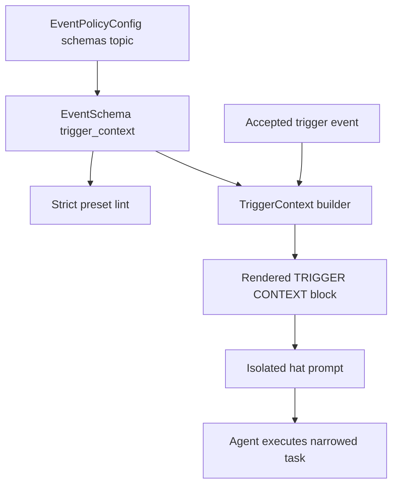
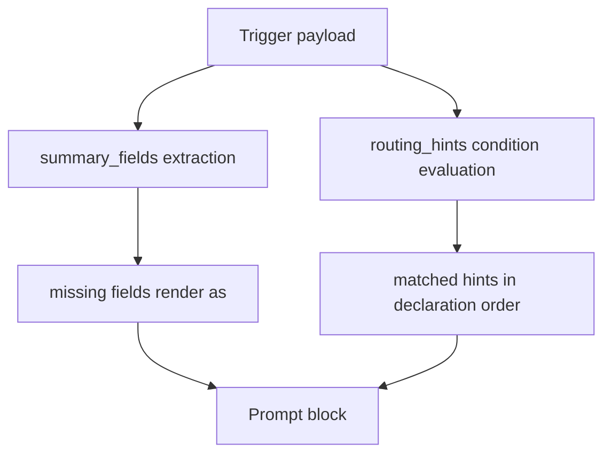

# Schema-Backed Trigger Context - Plan

## Goal Capsule

| Field | Value |
|---|---|
| Objective | 为 preset/schema 作者提供 schema-backed `Trigger Context` 与 `Routing Hints`，让下游 isolated hat 在 prompt 中直接看到当前 trigger payload 的结构化摘要与任务指导。 |
| Product authority | `docs/brainstorms/2026-07-09-schema-backed-trigger-context-requirements.md` 是产品契约来源。Product Contract unchanged。 |
| Execution profile | 严格串行执行。按 U1 → U2 → U3 → U4 → U5 → U6 → U7 → U8 → U9 顺序，一个 Unit 编码、测试、重构闭环完成后才能进入下一个 Unit。 |
| Isolation rule | 每个 Unit 必须是独立孤岛：只依赖之前已完成 Unit 的公开行为，不依赖后续 Unit 的内部逻辑、真实接口或试点 preset 改动。 |
| TDD rule | 每个 Unit 先写只验证当前 Unit 输入输出的验收测试，红 → 绿 → 重构后才算完成；禁止把当前 Unit 的边界问题留给下一个 Unit。 |
| Stop conditions | 若发现 trigger payload 在 prompt 构建链路中不可获得，或 schema SSOT 不能承载声明且会迫使双写，停止并回到计划修订。 |
| Tail ownership | 完成代码后必须同步 `crates/ralph-core/data/*.md` agent-facing skill guide，并按 preset/schema 改动清单同步 schema、BDD、lint 和文档。 |

---

## Product Contract

### Summary

多 hat 编排里，上游 hat 通过 JSON payload 把状态交给下游 hat。
当前下游 agent 需要自己读完整 payload，再从自然语言 instructions 判断这些字段意味着什么。
本计划新增一个薄层能力：schema/preset 作者声明当前 trigger topic 的 `summary_fields` 和有限 `routing_hints`，runtime 在激活下游 hat 时把当前 trigger payload 的摘要与命中的 hint 注入 prompt。
该能力不改变 topic routing、hat 选择、event bus、公平调度、policy-check 或终态语义。

### Problem Frame

`review.synthesized` 这类 payload 同时携带 `must_fix_now_count`、`residual_findings_count`、`verdict`、`synthesized_review_file` 等字段。
这些字段对 runtime 只是合法 JSON，但对下游 hat 是任务视角：接受、生成 fix plan、阻塞报告或把 residual 当 report-only。
如果分支只写在长段 hat instructions 中，agent 容易漏读、误读或同时维护两套规则。
Trigger Context 把“如何理解本次 trigger payload”收敛到 schema-backed prompt context，而不是让下游 agent 自己从完整 payload 推断。

### Requirements

**Trigger Context 声明**

- R1. Preset/schema 必须能为某个 trigger topic 声明 `summary_fields`，这些字段会从 trigger payload 中提取并注入给下游 hat。
- R2. `summary_fields` 必须引用 schema 中已声明的字段；字段可以来自 `required_fields`，也可以来自明确声明的 optional/known fields，不得引用完全未知字段。
- R3. Trigger Context 声明必须是可选增强；没有声明的 preset 行为与当前完全一致。
- R4. Trigger Context 必须基于已经通过 event policy 的 payload 构建，不得绕过现有 schema/policy-check。
- R5. 当 summary field 在 payload 中缺失时，prompt 必须显式显示 `<missing>` 或等价标记，不能默默省略，也不能把缺失当作默认值。
- R6. Trigger Context 只注入当前 activation 的 trigger payload 摘要，不得要求 hat 直接读取 `.ralph/events.jsonl`、`.ralph/supervisor.db` 或其它 runtime ledger。

**Routing Hints**

- R7. Preset/schema 必须能为 trigger topic 声明有限的 `routing_hints`：当 payload 满足条件时，向下游 agent 注入一段短任务指导。
- R8. 第一版 hint 条件只支持字段等于、字段不等于、数字大于/等于/小于常量、字段存在、字段缺失。
- R9. Hint 条件只能读取 trigger payload 中的字段，不得读取文件、git 状态、任务状态、事件历史或调用 LLM。
- R10. Hint 输出必须是 agent-facing task guidance，不得是 runtime 控制命令，也不得修改 topic routing、hat 权限或工具权限。
- R11. 多个 hint 命中时，第一版采用声明顺序全部输出；strict lint 应能发现明显冲突的 hint 标签或重复互斥描述，但不做自然语言理解。
- R12. 没有 hint 命中时，runtime 仍注入 summary fields；不得改变下游 hat 激活、事件接受/拒绝或 loop 终态。

**Prompt 注入与 Agent 使用**

- R13. 下游 prompt 必须有稳定的 Trigger Context 区块，列出 source topic、source hat、payload summary fields、matched routing hints。
- R14. Trigger Context 区块必须短、结构化、可扫读，不能把完整 payload 原样塞进 prompt。
- R15. Matched hint 必须用“本轮你应该如何处理”的语言表达，避免让 agent 再次解释底层条件。
- R16. 试点 preset 应把手写 payload if/else 收敛为引用 Trigger Context 区块，避免自然语言规则和 schema hints 双写漂移。
- R17. Agent-facing skill 文档必须说明 Trigger Context 的读取顺序：先看 injected Trigger Context，再按 hat instructions 执行；不要重新从 events ledger 推断同一信息。

**SSOT 与校验**

- R18. Trigger Context 和 routing hints 的声明应优先放在 schema SSOT 或同等 protocol SSOT 中，而不是散落在多个 hat instructions 中。
- R19. Strict lint 必须检查 `summary_fields` 和 hint 条件引用的字段存在于对应 topic schema 中；未知字段应报错。
- R20. Strict lint 必须检查 hint 条件使用第一版允许的谓词集合；不允许任意表达式语言或字符串拼接执行。
- R21. Strict lint 必须检查 hint 的目标 topic 和 consuming hats 在拓扑上合理：只给实际订阅该 trigger topic 的 hats 注入，不泄漏给无关 hat。
- R22. 生成的 prompt 只允许展示当前 hat 当前 trigger 的 context；不得展示其它 hats、其它 trigger topics 的 payload shape 或 hint。

**试点场景**

- R23. 第一版应以 `ce-executor-pipeline-loop` 的 review/fix 收敛事件作为试点，至少覆盖 `review.synthesized -> review-gate` 和 `review.accepted/fix.requested -> downstream` 分支。
- R24. 试点必须覆盖 `must_fix_now_count == 0`、`must_fix_now_count > 0`、`review_round >= max` 这类实际影响 agent 行为的 hint。
- R25. 试点必须明确 residual findings 的处理方式：当 hint 说明 residual 是 report-only 时，下游 agent 不应为它们生成 fix units。

**非回归**

- R26. 本需求不得改变 topic routing、hat trigger 匹配、event bus 队列、公平调度、event policy 接受/拒绝或 terminal event 语义。
- R27. 本需求不得动态选择不同 hat，也不得动态修改 subscribes/publishes。
- R28. 本需求不得替代 policy-check；payload 形状错误仍由 policy-check/schema gate 拦截。
- R29. 未声明 Trigger Context 的 preset，prompt 和 runtime 行为必须保持当前语义。

### Success Criteria

- SC1. 声明了 `summary_fields` 的 trigger topic 会在下游 prompt 中出现稳定 Trigger Context 区块，并列出字段值和缺失字段标记。
- SC2. `must_fix_now_count == 0` 时，下游 prompt 直接显示准备接受或 residual report-only 的 task guidance。
- SC3. `must_fix_now_count > 0` 时，下游 prompt 直接显示只处理 `must_fix_now` findings 的 task guidance。
- SC4. payload 缺少被声明的 summary field 时，prompt 显示 `<missing>`，且不推断为 `0`、`false` 或空字符串。
- SC5. Strict lint 能捕获 hint 引用未知字段、使用不支持谓词、或向非订阅 hat 泄漏 context 的配置错误。
- SC6. 未采用 Trigger Context 的 preset 行为不变。
- SC7. `ce-executor-pipeline-loop` 试点减少 relevant hat instructions 中手写 payload 分支判断，不复制 schema/hint 内容。

### Scope Boundaries

- 不做动态下一跳选择；现有 event routing、subscription 和 hat trigger 匹配仍决定谁被激活。
- 不做任意表达式 DSL；第一版只支持有限、可静态校验的谓词。
- 不让 routing hints 调用工具、读文件、读事件历史或做 LLM 判断。
- 不让 hints 改工具权限、hat 权限、topic 权限或 policy-check 结果。
- 不把完整 payload 注入 prompt；只注入作者声明的 summary fields 和 matched hints。
- 不一次性迁移所有 preset；只试点高风险 review/fix loop。

### Acceptance Examples

- AE1. Given `review.synthesized` payload has `must_fix_now_count: 0` and `residual_findings_count: 1`, when `review-gate` is activated, then prompt includes `## TRIGGER CONTEXT`, shows both field values, and includes guidance that residual findings are report-only.
- AE2. Given `review.synthesized` payload has `must_fix_now_count: 2`, when `review-gate` is activated, then prompt includes guidance that the current round must request fixes for must-fix findings only.
- AE3. Given `review.synthesized` payload lacks a declared optional summary field, when prompt is built, then that field renders as `<missing>` and no default is inferred.
- AE4. Given schema declares a hint condition on an unknown field, when strict preset lint runs, then lint emits an Error finding for unknown trigger context field reference.
- AE5. Given a preset has no `trigger_context` declarations, when the same scenario runs, then prompt and event progression match the pre-feature behavior.

### Dependencies and Assumptions

- 现有 `EventSchema` 已支持 `required_fields`、`field_docs` 和 `examples`，适合承载 `trigger_context` 的第一版 schema-backed 声明。
- 现有 isolated prompt chain 已可读取当前 regular events，并已有 `## ACTIVE TRIGGER`、`## NEXT ACTION`、`## HANDOFF ENVELOPE` 等 prompt 注入模式可复用。
- 现有 BDD scenario runner 支持 `prompt_contains` 断言，可用真实 `EventLoop` 验证 prompt 注入而不是写 source-only stub。
- 第一版只支持 top-level 字段和 dot-path 字段读取；数组过滤、JSONPath、聚合表达式延期。

---

## Planning Contract

### Key Technical Decisions

- KTD1. `trigger_context` 放在 `event_policy.schemas.<topic>` 下，而不是独立 sibling protocol block。这样 `summary_fields`、`routing_hints`、`field_docs`、`required_fields` 使用同一个 topic schema SSOT，满足 R18，也避免 `presets/en/*` 与 `presets/schemas/*` 的第三处语义漂移。
- KTD2. 第一版新增 `known_fields`，让 summary/hint 可以引用非 required 但已声明的 optional field。R2 要求允许未来 optional/known fields；如果只允许 `required_fields`，SC4 的缺失字段场景会无法表达。
- KTD3. Hint 条件采用 tagged YAML 形状，不采用字符串表达式。推荐形状是 `conditions: [{field: must_fix_now_count, op: eq, value: 0}]`，`op` 只允许 `eq`、`ne`、`gt`、`gte`、`lt`、`lte`、`exists`、`missing`，便于 serde 解析和 strict lint。
- KTD4. Runtime 构建 Trigger Context 只读最近激活当前 hat 的 accepted trigger event，不扫描事件历史做推断。EventLoop 已维护 `last_activation_events`，计划把当前 trigger payload 作为输入传给 isolated prompt helper，满足 R4、R6、R22。
- KTD5. Prompt 注入新增 `## TRIGGER CONTEXT`，位置在 `## ACTIVE TRIGGER` 语义之后、hat instructions 之前的 isolated prompt prepend 链中。该位置让 agent 先看到当前 trigger 摘要，再执行 hat instructions，满足 R13、R17。
- KTD6. 多 hint 命中按声明顺序全部输出；strict lint 只做结构性冲突检查。第一版冲突检查限定为重复 `label`、同一 `exclusive_group` 下可能同时命中的 hint、以及同一 label 下重复互斥描述，不做自然语言理解。
- KTD7. 第一版不新增 `targets`、`consuming_hats` 或显式目标 hat 字段。Topology 合理性只从当前 preset 的 `hats[*].triggers` / `subscribes_to` 推导：订阅该 source topic 的 hat 才可能接收 Trigger Context。这样避免新增未使用配置面，也满足 R21/R22。
- KTD8. 试点先覆盖 `ce-executor-pipeline-loop` 的 `review.synthesized`、`review.accepted`、`fix.requested`，不迁移其它 preset。这样能覆盖 R23-R25，同时把变更范围限制在一个高风险链路。
- KTD9. Agent skill guide 只说明读取顺序和行动边界，不复制试点字段表。字段意义和 hint 文案留在 schema SSOT；skill guide 只写通用 agent 动作，符合注入 skill 去计划化规则。

### High-Level Technical Design

### Sequencing Model

本计划的执行顺序是单向流水线：U1 → U2 → U3 → U4 → U5 → U6 → U7 → U8 → U9。
每个 Unit 必须完成自己的测试红绿闭环、局部重构和 targeted verification 后才能进入下一 Unit。
后一个 Unit 可以依赖前一个 Unit 已提交或已验证的公开 API，但当前 Unit 不能依赖后一个 Unit 的代码、fixtures、真实 preset 试点或集成测试。
U9 是所有 Unit 完成后的发布级验证门，不新增功能逻辑；它不替代任何 Unit 的原子 TDD 验收，也不能用来补偿前序 Unit 缺失的测试。

### System-Wide Impact

- Schema 配置面：`EventSchema` 的反序列化会新增 optional 字段，必须保持默认空值以保护未声明 preset。
- Prompt 面：isolated prompt 会多一个短区块，但只在当前 hat 当前 trigger topic 有声明时出现。
- Lint 面：strict preset lint 会新增 Error finding，可能阻止错误 schema 启动；default mode 可保留 Warn 或不触发启动硬拒。
- Agent 文档面：`crates/ralph-core/data/*.md` 需要告知 agent Trigger Context 的优先读取顺序和不要读 ledger 的边界。

### Risks and Mitigations

| Risk | Mitigation |
|---|---|
| Trigger Context 误改 routing 语义 | Builder 只返回 prompt block，不参与 hat selection、event acceptance 或 EventBus publish。U3/U5 测试必须证明无声明 preset 无变化。 |
| Optional field 缺失被误认为默认值 | Renderer 对任何缺失 summary field 固定输出 `<missing>`；测试覆盖数值字段缺失不等于 0。 |
| Hint 条件变成隐式表达式语言 | serde enum + lint allowlist 双层约束，只接受有限 op。 |
| Prompt 泄漏其它 hat/topic payload | Builder 输入必须带 current hat + current trigger event；lint 基于 `hats[*].triggers` / `subscribes_to` 订阅关系图检查可见性，BDD 用 `prompt_contains` 和 absent substrings 约束。 |
| Preset schema 与 inline runtime view 漂移 | 修改 `presets/schemas/ce-executor-pipeline-loop.yml` 后同步 embedded inline view，并跑 schema parity / byte-equality 相关 nextest。 |

---

## Implementation Units

### U1. Schema Data Model for Trigger Context

- **Goal:** 在配置模型中新增 trigger-context 声明类型，能解析 `summary_fields`、`known_fields` 和 `routing_hints`，但不接入 lint、runtime 或 preset 试点。
- **Requirements:** R1, R2, R3, R7, R8, R9, R10, R11, R12, R18。
- **Dependencies:** 无。
- **Files:** `crates/ralph-core/src/config/loop_config.rs`; `crates/ralph-core/src/config/ralph_config.rs`; `crates/ralph-core/src/config/loop_config.rs` inline tests or `crates/ralph-core/src/config/tests.rs` if the module already centralizes config tests.
- **Approach:** 在 `EventSchema` 下新增 `trigger_context: Option<TriggerContextConfig>` 或默认空 struct。新增 `TriggerContextConfig`、`RoutingHintConfig`、`HintCondition`、`HintOp` 等 serde 类型，全部 `#[serde(default)]`。`HintOp` 必须保留未知 op 的原始字符串或等价 `Unknown(String)`，不能在 serde 阶段直接丢弃；这样 U4 strict lint 能产生稳定 finding。`known_fields` 与 `summary_fields` 同属 schema 作者声明面，第一版只承诺 top-level 和 dot-path 字段字符串，不做 JSONPath。
- **Execution note:** 先写 focused serde/config 验收测试；测试只验证 YAML → typed config 的输入输出，不触碰 runtime prompt 或 preset lint。
- **Detailed implementation steps:**
  1. 先在 config 测试位置新增最小 YAML 解析验收测试，只构造 `event_loop.event_policy.schemas.<topic>`，不引用真实 preset 文件。
  2. 用旧 schema YAML 写一个回归测试，断言未声明 `trigger_context` 时解析结果为空或默认空，且已有 `required_fields` / `field_docs` 不变。
  3. 用新 schema YAML 写一个解析测试，覆盖 `known_fields`、`summary_fields`、两个 `routing_hints`、`conditions`、`label`、`guidance`、`exclusive_group` 的顺序保留。
  4. 用 `op: contains` 写一个测试，断言 serde 层能保留未知 op 值，避免后续 U4 lint 无法读取配置。
  5. 用 `exists` / `missing` 无 `value` 和 `gt` 缺 `value` 的输入写 config validation 测试，限定本 Unit 只验证条件形状，不产生 lint finding。
  6. 在 `EventSchema` 上添加 optional/defaulted `trigger_context` 字段，保持没有字段时的旧 YAML 反序列化行为。
  7. 添加 `TriggerContextConfig`，字段只包含 `summary_fields` 和 `routing_hints`；`known_fields` 放在 `EventSchema` 同级字段，作为 schema 可引用字段集合的一部分。
  8. 添加 `RoutingHintConfig` 和 `HintCondition`，让 `conditions` 使用声明顺序的 `Vec`，避免 map 重排影响 hint 输出顺序。
  9. 添加 `HintOp` 的未知值保留策略，确保未知谓词不会在 parse 阶段被丢掉。
  10. 添加轻量 validation helper，只检查本 Unit 能独立判断的形状约束，例如比较 op 是否需要 `value`；不检查字段是否存在、不检查 topology、不访问 preset lint。
  11. 重构命名和默认值实现，确保所有新增类型的默认值是空集合或 `None`，没有 hidden behavior。
  12. 本 Unit 结束前只确认 config/model 测试通过；不要为了“证明功能有用”去接入 builder、prompt 或真实 preset。
- **Patterns to follow:** `EventFieldDoc`、`ElementConstraint`、`HandoffEnvelopeConfig` 的默认值和 serde 兼容模式。
- **Test scenarios:**
  - 输入一个只含 `required_fields` 的旧 schema YAML，解析后 `trigger_context` 为空或默认空，证明 R3 不破坏旧 preset。
  - 输入带 `summary_fields`、`known_fields`、两个 `routing_hints` 的 topic schema，解析后字段顺序保持声明顺序。
  - 输入 `op: contains` 这类不支持谓词，serde 解析成功并保留未知 op 值；U1 config validation 可单独返回错误，但不能阻止 U4 lint 读取该配置并报告稳定 finding。
  - 输入 `exists` / `missing` 条件没有 `value`，解析成功；输入 `gt` 条件缺少 `value`，config validation 返回错误。
- **Verification:** `cargo nextest run -p ralph-core -- loop_config` 或更精确的 config 相关测试子串通过；本 Unit 不要求任何 prompt 或 lint 行为出现。

### U2. Pure Trigger Context Builder

- **Goal:** 新增纯函数 builder：给定 topic schema、source topic/source hat、current hat 和单个 JSON payload，返回结构化 Trigger Context 结果。
- **Requirements:** R4, R5, R6, R8, R9, R10, R11, R12, R13, R14, R15。
- **Dependencies:** U1。
- **Files:** `crates/ralph-core/src/trigger_context.rs`; `crates/ralph-core/src/lib.rs`; `crates/ralph-core/src/config/loop_config.rs`; `crates/ralph-core/src/trigger_context.rs` inline tests.
- **Approach:** Builder 不读文件、不访问 EventBus、不接触 `EventLoop`。输入只包含 `EventSchema`、`serde_json::Value` payload、source metadata 和 current hat。输出包含 `summary: Vec<FieldSummary>`、`matched_hints: Vec<MatchedHint>`、`source_topic`、`source_hat`。字段读取支持 top-level 和 dot-path；缺失值输出 `FieldValue::Missing`，不做默认值推断。数字比较只接受 JSON number；类型不匹配时条件不命中而不是 panic。
- **Execution note:** 先写纯单元验收测试；这些测试只验证 builder 输入输出，禁止引入真实 preset YAML 或 prompt 字符串。
- **Detailed implementation steps:**
  1. 先创建纯单元测试模块，手写一个最小 `EventSchema` 和 `serde_json::Value` payload，不从 YAML 文件或 preset fixture 读取。
  2. 写 summary happy-path 测试：payload 有数值、字符串、布尔值时，输出保留 JSON 值并按 `summary_fields` 声明顺序排列。
  3. 写 missing-field 测试：payload 缺少字段时输出 `FieldValue::Missing`，测试只断言结构化结果，不断言 markdown 文案。
  4. 写 hint 条件测试：`eq 0`、`gt 0`、`exists`、`missing` 分别命中或不命中，断言 `matched_hints` 只包含满足条件的 hint。
  5. 写多 hint 顺序测试：两个条件都满足时，输出按 schema 声明顺序排列，而不是按 label 或 map 顺序。
  6. 写 dot-path 测试：`nested.count` 能读取对象字段；遇到数组、非对象或中间节点缺失时不 panic，并按缺失或不命中处理。
  7. 新建 `trigger_context` 模块，定义 builder 输入结构，输入中显式携带 source topic、source hat、current hat、schema 和 payload。
  8. 定义 builder 输出结构，输出只表达数据，不包含 markdown 字符串，也不含 EventLoop、HatlessRalph 或 lint 类型。
  9. 实现字段读取 helper，统一处理 top-level、dot-path、缺失、非 object payload，并让 missing 语义只在一个位置决定。
  10. 实现谓词 evaluator，比较类只接受 JSON number，类型不匹配返回 false；未知 op 返回 false 或 structured error，具体错误展示留给 U4 lint。
  11. 在 `lib.rs` 暴露模块或 crate-internal API，范围以 U3 能调用为准，不为外部 API 预留过宽 public surface。
  12. 重构 builder，使所有测试 fixture 都是内建假数据；本 Unit 不引入 prompt renderer、不读 scenario、不修改 preset。
- **Patterns to follow:** `crates/ralph-core/src/correction/mod.rs` 中结构化 context 类型和 renderer 分离的模式；`event_loop` prompt helpers 的输入 struct 模式。
- **Test scenarios:**
  - 给定 summary field `must_fix_now_count` 存在且值为 `0`，输出 summary value 是 JSON number 0。
  - 给定 summary field `residual_findings_count` 缺失，输出该字段为 `<missing>` 等价枚举，Covers AE3 / SC4。
  - 给定 hints：`eq 0` 和 `gt 0`，payload 为 0 时只命中第一条，payload 为 2 时只命中第二条。
  - 给定两个兼容 hints 都满足，输出按 YAML 声明顺序排列，Covers R11。
  - 给定条件读取 `nested.count` dot-path，payload 中嵌套字段存在时命中；数组路径不支持时不 panic。
  - 给定 payload 是 string 而不是 JSON object，builder 返回空 summary 或全部 missing，并记录 non-object input 为不可匹配，不读取其它状态。
- **Verification:** `cargo nextest run -p ralph-core -- trigger_context` 通过；没有任何 preset 或 EventLoop 依赖。

### U3. Prompt Renderer and Isolated Prompt Injection

- **Goal:** 把 U2 输出渲染成稳定 `## TRIGGER CONTEXT` prompt block，并只在当前 isolated hat 的当前 trigger event 有声明时注入。
- **Requirements:** R4, R5, R6, R12, R13, R14, R15, R22, R26, R29, SC1, SC4, SC6。
- **Dependencies:** U1, U2。
- **Files:** `crates/ralph-core/src/trigger_context.rs`; `crates/ralph-core/src/event_loop/mod.rs`; `crates/ralph-core/src/hatless_ralph.rs`; `crates/ralph-core/src/event_loop/tests/build_prompt.rs`; `crates/ralph-core/tests/scenarios/opac/trigger_context_prompt.yml`; `crates/ralph-core/tests/scenarios.rs`。
- **Approach:** Renderer 输出短结构化 markdown：source topic/source hat、summary fields、matched routing hints。Injection helper 接收 regular events、current hat、event policy schemas 和当前 activation trigger topics，只选择最近一个匹配当前 hat trigger 的 event。无声明时 no-op，保证 R29。不要把完整 payload 放入 prompt。
- **Execution note:** 先写 isolated prompt 验收测试，使用极简内建 fake config 和 mock event；测试只验证 prompt block 的出现、缺失标记和 no-op，不依赖 lint 或真实 `ce-executor-pipeline-loop`。
- **Detailed implementation steps:**
  1. 先给 renderer 写结构化输出测试，输入直接使用 U2 的 builder result，不经过 EventLoop，断言 markdown 包含固定标题、source topic/source hat、summary 和 matched hints。
  2. 写 `<missing>` 渲染测试，明确缺失字段只显示 `<missing>`，不显示 `0`、空字符串或省略该行。
  3. 写 payload 泄漏测试，payload 中放一个未声明字段，断言 renderer 不输出该字段名和值。
  4. 写 injection no-op 测试，构造无 `trigger_context` 的 schema，断言 prompt 与旧 helper 输出一致或至少不包含 `## TRIGGER CONTEXT`。
  5. 写 current-hat 过滤测试，构造两个 hats 和一个 source event，只有订阅当前 source topic 的 hat 得到 context。
  6. 在 `trigger_context` 模块内添加 renderer，保持 renderer 只接收 U2 输出，不自己读 schema、不重新匹配事件。
  7. 找到 isolated prompt prepend 链中 `## ACTIVE TRIGGER` 后、hat instructions 前的组合点，新增一个小 helper 负责决定是否生成 Trigger Context block。
  8. 在 helper 输入中传入当前 hat、当前 activation regular events、event policy schemas 和 hat trigger/subscription 信息；不要让 helper 自己读取 `.ralph/` ledger。
  9. 用最近一个 accepted trigger event 构建 context；如果没有匹配 event、schema 没声明 context、当前 hat 不订阅该 topic，全部返回 no-op。
  10. 把 renderer 输出插入 prompt prepend 链，保持已有 `## ACTIVE TRIGGER`、`## NEXT ACTION`、handoff envelope 的相对语义不变。
  11. 在 `crates/ralph-core/tests/scenarios.rs` 增加真实 runner 场景函数，使用极简 OPAC fixture 验证 prompt 注入，不能只添加 YAML。
  12. 本 Unit 结束前只证明 prompt injection 行为；不要改 `ce-executor-pipeline-loop`，不要添加 strict lint finding。
- **Patterns to follow:** `prepend_macro_next_hint`、`build_isolated_prompt_with_handoff`、`HatlessRalph::hats_section` 的 prompt prepend/no-op 模式；`crates/ralph-core/tests/scenarios/opac/macro_edge_next_hint.yml` 的 `prompt_contains` 场景模式。
- **Test scenarios:**
  - Covers AE1 partially. 给定 active hat `review-gate` 订阅 `review.synthesized`，payload 含 declared summary fields，prompt 包含 `## TRIGGER CONTEXT`、source topic、field/value。
  - Covers AE3 / SC4. declared summary field 缺失时 prompt 包含 `field: <missing>`，且不包含 `field: 0`。
  - 无 `trigger_context` 声明时，同一 fake scenario 的 prompt 不包含 `## TRIGGER CONTEXT`，Covers SC6。
  - 当前 hat 不订阅 source topic 时，不注入 block，Covers R22。
  - Matched hint 文案出现在 `Matched routing hints` 区域，完整 payload 未出现在 prompt。
- **Verification:** `cargo nextest run -p ralph-core -- trigger_context` 和 `cargo nextest run -p ralph-core --test scenarios -- trigger_context_prompt` 通过；本 Unit 不修改试点 preset。若新增 YAML 场景，必须同时在 `crates/ralph-core/tests/scenarios.rs` 增加真实 `EventLoop` runner 测试函数，不能只提交 YAML fixture。

### U4. Strict Lint for Field References and Predicate Shape

- **Goal:** 在 preset lint 中校验 trigger-context 声明的字段引用、谓词集合、value 要求和明显结构冲突。
- **Requirements:** R2, R8, R9, R11, R19, R20, SC5。
- **Dependencies:** U1, U2。
- **Files:** `crates/ralph-core/src/preset_lint/trigger_context.rs`; `crates/ralph-core/src/preset_lint/mod.rs`; `crates/ralph-core/src/preset_lint/finding_id.rs`; `crates/ralph-core/src/preset_lint/trigger_context.rs` inline tests; `crates/ralph-core/src/preset_lint/tests/run_preset_lint.rs`。
- **Approach:** 新增 lint family，遍历 `event_policy.schemas` 中的 `trigger_context`。`summary_fields` 和 condition `field` 必须存在于 `required_fields ∪ known_fields ∪ field_docs.keys() ∪ allowed_values.keys()`。`exists`/`missing` 不需要 value；比较类 op 必须有 value；数值比较 op 的 value 必须是 number。重复 hint `label` 报结构性冲突；如果引入 `exclusive_group`，同组内两个无互斥条件的 hints 在 strict 下报错。
- **Execution note:** 先写 lint 单元验收测试；测试只构造最小 `RalphConfig` 或 YAML，不依赖 prompt injection 或试点 preset。
- **Detailed implementation steps:**
  1. 先在 preset lint 测试位置新增最小 YAML/config fixture，只包含一个 schema topic 和一个 trigger_context，不包含真实 hats 拓扑。
  2. 写 known-field 通过测试：字段分别来自 `required_fields`、`known_fields`、`field_docs`、`allowed_values` 时不产生 unknown-field finding。
  3. 写 summary unknown-field 测试：`summary_fields` 引用未知字段时产生稳定 finding id 和 Error severity。
  4. 写 condition unknown-field 测试：hint condition 的 `field` 未声明时产生同类 finding，并在 message 中指向 topic、hint label、field。
  5. 写 unsupported-op 测试：使用 U1 保留下来的未知 op，断言 lint 报 `trigger_context_unsupported_predicate`，而不是 parse error。
  6. 写 value-shape 测试：比较 op 缺 value、数值比较 value 非 number、`exists`/`missing` 带多余 value 的行为按本计划选择的规则报告。
  7. 写 structural-conflict 测试：重复 label 必须报错；不同 label 且条件互斥或兼容时不误报。
  8. 新增 `preset_lint/trigger_context.rs`，先实现字段集合收集函数，输入是单个 `EventSchema`，输出可引用字段集合。
  9. 实现 summary 和 condition 字段引用检查，finding 中包含 topic、字段名、位置类型，方便 preset 作者修复。
  10. 实现 op allowlist 和 value shape 检查，复用 U1 的 `HintOp` 表示，不再自己解析字符串表达式。
  11. 在 `preset_lint/mod.rs` 和 `finding_id.rs` 接入新 lint family 与 finding id，保持 strict/default severity 语义与现有 lint 一致。
  12. 本 Unit 结束前只验证 lint 层；不要把 finding 用到 runtime prompt，也不要修改试点 preset。
- **Patterns to follow:** `schema_parity::check_publishes_have_schema`、`ownership` lint 的 `LintFinding` 构造和 `run_preset_lint` wiring。
- **Test scenarios:**
  - 已知字段引用通过，不产生 finding。
  - `summary_fields: [unknown_count]` 产生 `lint.preset.trigger_context_unknown_field` Error。
  - hint condition 引用未知字段产生同类 Error，Covers AE4 / SC5。
  - `op: regex` 或其它不支持谓词产生 `lint.preset.trigger_context_unsupported_predicate` Error。
  - `op: gt` 但 value 是字符串时产生类型 Error。
  - 重复 hint label 产生结构冲突 finding；不同 label 且兼容条件不报错。
- **Verification:** `cargo nextest run -p ralph-core -- preset_lint` 通过；本 Unit 不改变 runtime prompt。

### U5. Topology Leakage Lint

- **Goal:** 校验 trigger context 只会注入给实际订阅该 trigger topic 的 hats，避免无关 hat 看到其它 topic 的 payload shape 或 hint。
- **Requirements:** R21, R22, SC5。
- **Dependencies:** U1, U4。
- **Files:** `crates/ralph-core/src/preset_lint/trigger_context.rs`; `crates/ralph-core/src/preset_lint/trigger_context.rs` inline tests; `crates/ralph-core/src/preset_lint/tests/run_preset_lint.rs`; `crates/ralph-core/src/hatless_ralph.rs`。
- **Approach:** 在 U4 lint family 中加入 topology-aware 检查。默认语义是 schema topic 自身即 trigger topic，只有 `hats[*].triggers` / `subscribes_to` 匹配该 topic 的 hats 可收到 context。第一版不读取也不新增 `targets`、`consuming_hats` 或显式目标 hat 字段；如果实现中发现必须引入这些字段，必须停止并回到计划修订，而不是在 U5 内扩展范围。Runtime injection 也必须使用 current hat + trigger topic 双条件过滤，形成 lint + runtime 双保险。
- **Execution note:** 先写 topology lint 验收测试；测试只验证 schema/hats 配置关系，不依赖 prompt block 文案。
- **Detailed implementation steps:**
  1. 先写一个最小 topology fixture：一个 schema topic、一个订阅该 topic 的 hat、一个不订阅的 hat，断言 lint 只认可订阅关系。
  2. 写 glob trigger 测试：hat 使用现有 glob 语义能匹配 topic 时通过，避免 U5 和 runtime topic matching 规则漂移。
  3. 写 no-consumer 测试：schema 声明 trigger_context 但没有任何 hat 订阅该 topic 时，strict lint 产生 Error 或复用已有 workflow activation finding。
  4. 写 non-subscriber 不可见测试：未订阅 hat 不得被视为 context 消费者；测试不使用 `targets` 或任何新字段。
  5. 抽取或复用现有 topic matching helper，避免 lint 使用一套匹配规则、runtime 使用另一套匹配规则。
  6. 在 U4 的 `trigger_context` lint family 中加入拓扑检查入口，输入必须是完整 preset config 中已存在的 hats 和 schemas。
  7. 将 topology finding 与 U4 字段/predicate finding 分开命名，message 必须指明 topic 和缺失订阅关系。
  8. 回看 U3 runtime injection helper，确认 current hat + trigger topic 双条件过滤已存在；若缺失，只补过滤，不改变 prompt 文案。
  9. 添加一个 runtime 层 focused 测试或扩展 U3 测试，断言未订阅当前 topic 的 hat 不收到 block。
  10. 本 Unit 结束前不改 schema shape，不新增显式目标配置，不修改试点 preset。
- **Patterns to follow:** `workflow_activation` 的 handoff graph 判断、`hat_scope_invariant` 的 isolated-mode topic visibility 检查。
- **Test scenarios:**
  - 一个 hat 订阅 `review.synthesized`，该 topic 声明 trigger context，lint 通过。
  - 一个 hat 不订阅 `review.synthesized`，即使 preset 里存在同名 schema context，runtime/lint 都不能把该 topic 的 Trigger Context 视为该 hat 可见，Covers SC5。
  - 使用 glob trigger 的 hat 能匹配 topic 时通过。
  - 没有任何 hat 订阅 declared context topic 时，strict lint Error 或复用已有 WAC/schema coverage finding，不静默通过。
- **Verification:** `cargo nextest run -p ralph-core -- preset_lint` 通过；本 Unit 结束后 topology 泄漏风险在 lint 层闭环。

### U6. Pilot ce-executor-pipeline-loop Schema and Instructions

- **Goal:** 在 `ce-executor-pipeline-loop` schema SSOT 中声明 review/fix convergence topics 的 trigger context，并收敛相关 hat instructions 为引用 Trigger Context。
- **Requirements:** R16, R18, R23, R24, R25, SC2, SC3, SC7。
- **Dependencies:** U1, U2, U3, U4, U5。
- **Files:** `presets/schemas/ce-executor-pipeline-loop.yml`; `presets/en/ce-executor-pipeline-loop.yml`; `crates/ralph-cli/src/presets.rs`; `crates/ralph-core/tests/scenarios/ce_executor_pipeline_loop.yml`; `crates/ralph-core/tests/scenarios/ce_executor_pipeline_loop_fix_reentry.yml`。
- **Approach:** 在 schema SSOT 为 `review.synthesized` 声明 summary fields：`review_round`、`must_fix_now_count`、`blocking_main_conflict_count`、`residual_findings_count`、`verdict`、`synthesized_review_file`、`loop_decision_basis`。Hints 覆盖：`must_fix_now_count == 0` 接受/残留 report-only；`must_fix_now_count > 0` 只处理 must-fix；`review_round >= 6` 且 blocking count > 0 进入 loop.blocked 语义。为 `review.accepted` 和 `fix.requested` 添加下游-facing summary/hints，指导 alignment/fix-planner 不重新推断 residual。同步内联 merged preset，并删除或压缩对应 hat instructions 中重复 payload if/else，只保留“先看 Trigger Context，再按本 hat 职责执行”。
- **Execution note:** 先写/更新试点场景 prompt 断言，场景只验证该 preset 中当前 topic 的 Trigger Context 文案和既有事件顺序；不要在本 Unit 新增 builder/lint 测试。
- **Detailed implementation steps:**
  1. 先读取 `presets/schemas/ce-executor-pipeline-loop.yml` 中 `review.synthesized`、`review.accepted`、`fix.requested` 的现有 `required_fields`、`field_docs`、`examples`，列出本 Unit 要引用的字段是否已声明。
  2. 先更新或新增试点 scenario 断言，覆盖 `must_fix_now_count == 0`、`must_fix_now_count > 0`、`review_round >= max` 三条 prompt guidance；断言只关注当前 topic 的 Trigger Context，不扩展 builder/lint 覆盖。
  3. 给 residual report-only 场景添加负向 prompt 断言，确保 prompt 不指导 agent 为 residual findings 生成 fix units。
  4. 在 schema SSOT 中为 `review.synthesized` 添加 `known_fields` 缺口，确保所有 summary/hint 字段都由 schema 声明，而不是靠 U4 放宽。
  5. 在 `review.synthesized.trigger_context.summary_fields` 中声明 review round、fix counts、residual count、verdict、review file、decision basis，并按 agent 最需要扫描的顺序排列。
  6. 在 `review.synthesized.routing_hints` 中添加三类 hint：接受/report-only、must-fix-only、max-round blocked；每条 guidance 直接写当前 hat 行动，不写 runtime 控制命令。
  7. 为 `review.accepted` 添加下游 summary/hints，让 alignment 或 reporter 知道已接受状态和 residual 处理边界。
  8. 为 `fix.requested` 添加下游 summary/hints，让 fix-planner 只处理 must-fix 输入，不重新解释 residual。
  9. 同步 `presets/en/ce-executor-pipeline-loop.yml` 或 embedded source 所需的 inline/merged preset view，保持 schema SSOT 与 runtime view 一致。
  10. 修改相关 hat instructions，只保留“先看 `## TRIGGER CONTEXT`，再按本 hat 职责执行”的引用，不复制 hint 条件和字段表。
  11. 检查 `crates/ralph-cli/src/presets.rs` 中 embedded preset 的 byte-equality 或 include 机制，按现有模式同步，不手写第二份语义。
  12. 本 Unit 结束前只验证试点 preset；不迁移其它 preset，不改 builtin preset 名称，不改 manifest/index/zsh completion。
- **Patterns to follow:** `presets/schemas/ce-executor-pipeline-loop.yml` 当前 `field_docs` / `examples` SSOT；`crates/ralph-core/tests/scenarios/ce_executor_pipeline_loop*.yml` 的真实 EventLoop runner 场景。
- **Test scenarios:**
  - Covers AE1 / SC2. `ce_executor_pipeline_loop.yml` 第一轮 `must_fix_now_count: 0`，`review-gate` prompt 包含接受或 residual report-only hint。
  - Covers AE2 / SC3. `ce_executor_pipeline_loop_fix_reentry.yml` 第一轮 `must_fix_now_count: 2`，`review-gate` prompt 包含只处理 must-fix findings 的 hint。
  - Covers R24. 增加 max-round fixture 或扩展现有场景，使 `review_round >= 6` 且 blocking count > 0 时 prompt 包含 loop.blocked task guidance。
  - Covers R25. 第二轮 payload `residual_findings_count: 1` 且 `must_fix_now_count: 0` 时，prompt 不出现“generate fix units for residuals”类指导。
  - Covers SC7. Preset instructions 不再复制 schema hint 条件值，只引用 `## TRIGGER CONTEXT` 和 agent skill guide 的读取顺序。
- **Verification:** `cargo nextest run -p ralph-core --test scenarios -- ce_executor_pipeline_loop` 和 `cargo nextest run -p ralph-cli --bin ralph -- test_ce_executor_root_preset_matches_embedded` 通过；如 inline/schema 字节等价测试名不同，使用 `rg` 确认后只跑相关 nextest 子集。本 Unit 不新增/重命名 builtin preset；因此不应修改 `presets/manifest.yml`、`presets/index.json` 或 `scripts/ralph-zsh-plugin.zsh`。

### U7. Agent-Facing Skill Guide Sync

- **Goal:** 更新注入给 agent 的 Ralph tools 文档，说明 Trigger Context 的读取顺序、边界和失败处理。
- **Requirements:** R6, R13, R14, R15, R17, R22。
- **Dependencies:** U3, U6。
- **Files:** `crates/ralph-core/data/ralph-tools.md`; `crates/ralph-core/data/ralph-tools-emit.md`; `crates/ralph-core/data/ralph-tools-cmdref.md` if command/reference text needs a pointer; `scripts/check-cli-doc-drift.sh`; `.claude/skills/ralph-tools/SKILL.md` is symlinked and should not be edited directly.
- **Approach:** 在 always-injected `ralph-tools.md` 添加短规则：若 prompt 有 `## TRIGGER CONTEXT`，先读该区块，再执行 hat instructions；区块只描述当前 activation 的 source topic/source hat/summary/hints；不要读 runtime ledger 重新推断同一信息。允许编辑范围仅限 `crates/ralph-core/data/ralph-tools.md`、`ralph-tools-emit.md`、`ralph-tools-cmdref.md` 以及确有必要时新增 `ralph-tools-*.md`；不直接编辑 `.claude/skills/ralph-tools/SKILL.md`。每条新增规则必须说明触发条件、agent 下一步动作、关键字段从哪里取得、失败时停止条件。首次出现的术语必须解释，例如 `Trigger Context`、`source topic`、`source hat`、`summary_fields`、`routing_hints`、`matched hints`、`policy-check`。不要写入试点 preset 名、计划编号、源码行号、内部函数/模块名、reviewer-only 背景、一次性诊断路径、过窄样例、未解释的 `fail-close` / `silent-success` / `retry budget` 等术语。若 `ralph-tools-emit.md` 已有 schema-aware publish section，可补一句 Trigger Context 是消费方 prompt context，不替代 `--policy-check`。
- **Execution note:** 先写文档 drift/内容断言测试或脚本检查；本 Unit 只验证文档内容，不改 runtime。
- **Detailed implementation steps:**
  1. 先读取 `crates/ralph-core/data/ralph-tools.md` 中 prompt 读取顺序、isolated 单事件预算、precheck/policy-check 相关章节，确认 Trigger Context 应插入的位置。
  2. 写文档内容检查清单，先定义必须出现和禁止出现的关键词，再改文档，避免改完才发现违反 data skill 限制。
  3. 在 `ralph-tools.md` 新增短规则：触发条件是 prompt 出现 `## TRIGGER CONTEXT`；agent 动作是先读取该区块，再执行 hat instructions。
  4. 在同一规则中解释 `source topic`、`source hat`、`summary fields`、`matched hints` 的 agent 可见含义，避免 agent 需要知道 runtime 内部结构。
  5. 写清关键字段来源：这些字段来自当前 activation 的注入区块，不来自 `.ralph/events.jsonl`、`.ralph/supervisor.db` 或其它 ledger。
  6. 写清失败停止条件：如果 Trigger Context 与 hat instructions 冲突，agent 不应自行猜测，应停止并按现有阻塞/报告机制处理。
  7. 在 `ralph-tools-emit.md` 只补充边界说明：Trigger Context 是消费方 prompt context，不替代 `--policy-check` 和 schema gate。
  8. 只在确有命令引用变化时修改 `ralph-tools-cmdref.md`；本功能不新增 CLI 命令时优先不改命令速查。
  9. 检查新增文档是否包含具体 preset 名、计划编号、源码行号、内部函数名、reviewer-only 解释或一次性诊断路径，发现即删除。
  10. 确认 `.claude/skills/ralph-tools/SKILL.md` 是 symlink 目标，不直接编辑它。
  11. 如果新增命令语法引用，按 AGENTS.md 要求复核 help 输出；如果没有命令语法变化，只跑 drift 静态检查。
  12. 本 Unit 结束前只同步 agent-facing data docs；不要改 operator skills，它们由 U8 独立闭环。
- **Patterns to follow:** AGENTS.md 的 AI skill guide 可读性规则、去计划化规则和允许编辑范围。
- **Test scenarios:**
  - 文档包含 `Trigger Context`、`## TRIGGER CONTEXT`、`先看 injected Trigger Context`、`不要读取 .ralph/events.jsonl` 这类 agent-facing 行动规则。
  - 文档新增规则逐条包含触发条件、agent 动作、关键字段来源、失败停止条件，而不是解释 runtime 内部如何实现。
  - 文档不包含本计划编号、具体 preset 名、源码行号、内部函数/模块名、reviewer-only 注释、一次性诊断路径、过窄 preset 案例、`.ralph/supervisor.db` 等内部 ledger 路径。
  - 文档首次出现的新术语有 agent-facing 解释；不存在未解释的专业词或仅维护者可见的实现术语。
  - 若文档出现命令语法引用，`scripts/check-cli-doc-drift.sh` 不报新 drift。
- **Verification:** `scripts/check-cli-doc-drift.sh` 通过；如改动命令说明，补跑对应 `ralph <cmd> --help` 冒烟。

### U8. Preset Operator Skills Adaptation

- **Goal:** 同步 loop 外 preset author/review 操作规程，让 `ralph-preset-author`、`ralph-preset-review` 和共享 common references 能识别并审计 Trigger Context / Routing Hints。
- **Requirements:** R17, R18, R19, R20, R21, R22, SC5, SC7。
- **Dependencies:** U1, U4, U5, U6, U7。
- **Files:** `skills/ralph-preset-author/SKILL.md`; `skills/ralph-preset-review/SKILL.md`; `skills/ralph-preset-common/references/agent-native-model.md`; `skills/ralph-preset-common/references/author-checklist.md`; `skills/ralph-preset-common/references/commands.md`; `skills/ralph-preset-common/references/finding-rubric.md`; `skills/ralph-preset-common/references/patterns.md`; `skills/ralph-preset-common/fixtures/aaf-review-negative-fixture.yml` or an equivalent fixture if a Trigger Context negative fixture is cleaner.
- **Approach:** 在 author workflow 中把 Trigger Context 纳入拓扑阶段和单 hat AAF：schema 作者必须为 trigger-consuming hats 填写 summary fields、hint 条件、matched guidance 的可见性证据，并说明 instructions 只引用 `## TRIGGER CONTEXT` 而不复制 hint 条件。更新 common references：`agent-native-model.md` 的 isolated prompt stack 增加 `## TRIGGER CONTEXT`；`author-checklist.md` 的 schema metadata / Payload Contract 表增加 trigger summary/hint 审核项；`finding-rubric.md` 增加新 lint finding_id 映射和软性 AAF 缺口；`commands.md` 增加 `ralph preset check --strict` / `ralph emit --schema` 对 Trigger Context 只能验 shape 与声明、不能证明 hint 语义正确的说明；`patterns.md` 更新通用 review/fix convergence pattern，强调 residual report-only 由 Trigger Context hints 表达，避免把某个试点 preset 名写成通用规则。
- **Execution note:** 先写 operator-skill 文档验收检查：grep 新术语、finding_id、prompt stack 行和负例 fixture，再改文档；本 Unit 不改 runtime 或 preset YAML。
- **Detailed implementation steps:**
  1. 先读取 `skills/ralph-preset-author/SKILL.md` 和 `skills/ralph-preset-review/SKILL.md` 的 workflow，标出 schema author、AAF、Payload Audit、policy-check feedback adoption 的插入点。
  2. 先读取 common references 中的 `agent-native-model.md`、`author-checklist.md`、`commands.md`、`finding-rubric.md`、`patterns.md`，确认每个文件现有职责，避免把同一规则复制到多个地方。
  3. 写 operator-skill 验收 grep 清单，包含 `Trigger Context`、`summary_fields`、`routing_hints`、`## TRIGGER CONTEXT`、新增 finding_id 和负例关键词。
  4. 更新 author skill workflow，让 preset 作者在 schema metadata 阶段声明 summary fields 和 routing hints，并在 hat instructions 阶段只引用 Trigger Context。
  5. 更新 review skill workflow，让 reviewer 检查 hint 条件是否能被 schema/lint 验证、guidance 是否是 agent action、instructions 是否复制了 hint 规则。
  6. 更新 `agent-native-model.md` 的 isolated prompt stack，新增可选 `## TRIGGER CONTEXT`，并写明它只来自当前 activation trigger payload。
  7. 更新 `author-checklist.md` 的 Payload Contract / AAF 项，要求作者说明 summary field 值源、missing 语义、matched hint 到下游行动的关系。
  8. 更新 `finding-rubric.md`，加入 U4/U5 新 finding id 到 P0/P1 映射，并把 invisible context、duplicated hint conditions、non-subscriber leakage 映射到可审查风险。
  9. 更新 `commands.md`，说明 `ralph preset check --strict` 能发现 shape/topology 问题，`ralph emit --schema` 只能帮助验证 payload shape，不能证明 hint 语义正确。
  10. 更新 `patterns.md` 为通用 review/fix convergence pattern，不把 `ce-executor-pipeline-loop` 的字段清单写成所有 preset 的模板。
  11. 如现有负例 fixture 能自然承载 Trigger Context，就扩展 fixture；否则新增等价负例 fixture，覆盖未知字段、复制 hint 条件、非订阅 hat 泄漏。
  12. 本 Unit 结束前逐条复核 `commands.md` 的 CLI 引用；不要用 `scripts/check-cli-doc-drift.sh` 替代 operator skills 的命令引用检查。
- **Patterns to follow:** `skills/ralph-preset-author/SKILL.md` 现有 field_docs / examples author 流程；`skills/ralph-preset-review/SKILL.md` 现有 Payload Audit 和 policy-check feedback adoption 审核模型；`skills/ralph-preset-common/references/finding-rubric.md` 的 finding_id 映射表。
- **Test scenarios:**
  - `ralph-preset-author` 的 Use This Skill / workflow 明确覆盖 `trigger_context.summary_fields`、`routing_hints` 和 consuming-hat prompt guidance，不只覆盖 `field_docs` / `examples`。
  - `agent-native-model.md` 的 isolated prompt stack 明确列出可选 `## TRIGGER CONTEXT`，并说明它只来自当前 activation 的 trigger payload。
  - `author-checklist.md` 要求每个 trigger-consuming hat 在 AAF Q2 / Payload Contract 中标注 summary field 值源、missing 语义、hint guidance 与下游行动关系。
  - `finding-rubric.md` 映射新增 trigger-context lint IDs，例如 unknown field、unsupported predicate、topology leakage，并把 invisible / duplicated / copied hint rules 映射到 P0/P1。
  - 负例 fixture 或文档示例覆盖：schema hint 引用未知字段、instructions 复制 hint 条件、non-subscriber hat 泄漏 context。
- **Verification:** 文档 grep 检查能定位 `Trigger Context`、`summary_fields`、`routing_hints`、`## TRIGGER CONTEXT`、新增 finding_id；若 fixture 更新，运行对应 preset review/author 说明仍成立；对 `skills/ralph-preset-common/references/commands.md` 中新增或修改的每条 CLI 引用，逐条用对应 `ralph <cmd> --help` 或已有示例命令做人工 parity 复核。`scripts/check-cli-doc-drift.sh` 只作为 `crates/ralph-core/data/*.md` agent-facing docs 的补充检查，不能替代 operator skills 的命令引用复核。

### U9. Final Validation and Non-Regression Sweep

- **Goal:** 串行收口全功能，验证 schema、lint、prompt、试点 preset、docs 和全仓测试入口满足项目硬规则。
- **Requirements:** R3, R4, R12, R18, R19, R20, R21, R22, R26, R27, R28, R29, SC5, SC6。
- **Dependencies:** U1, U2, U3, U4, U5, U6, U7, U8。
- **Files:** `docs/plans/2026-07-09-003-feat-schema-backed-trigger-context-plan.md`; any changed files from U1-U8; `AGENTS.md`; `CLAUDE.md` only if project instructions change, which this plan should avoid.
- **Approach:** 做最终验证，不新增 feature logic。检查所有 preset/schema 改动下游清单：runtime prompt、preset_lint、BDD scenarios、config字段、CLI preset embedded merge、manifest/index 是否受影响。由于本计划不新增/重命名 builtin preset，不应改 `presets/manifest.yml`、`presets/index.json` 或 zsh completion。若执行中确实改了 builtin preset 名称，则必须同步 AGENTS/CLAUDE 与 completion 并安装 zsh plugin。
- **Execution note:** 先列验证清单，再逐项跑；如果某项失败，修复必须回到对应已完成 Unit 的边界内，不允许引入跨 Unit 新功能。
- **Detailed implementation steps:**
  1. 先从 git diff 列出 U1-U8 实际改动文件，确认没有计划外文件进入 diff，特别是 manifest/index/zsh completion、AGENTS/CLAUDE、`.ralph/` runtime state。
  2. 对 config/model、builder/renderer、lint、scenario、CLI preset parity、agent docs、operator skills 分别建立验证清单，映射到 Verification Contract 的每个 gate。
  3. 先跑 focused gates，按失败所属边界回到对应 Unit 修复；例如 builder 测试失败只回 U2，topology lint 失败只回 U5。
  4. 复核 `presets/schemas/ce-executor-pipeline-loop.yml` 与 `presets/en/ce-executor-pipeline-loop.yml` 的 event topology、required/known fields、trigger_context 字段是否一致。
  5. 复核 `crates/ralph-cli/src/presets.rs` embedded preset 同步方式，确认 byte-equality 或相应 SSOT 测试覆盖本次 schema/preset 改动。
  6. 复核 `crates/ralph-core/data/*.md` 中是否出现禁止内容，包括计划编号、试点 preset 名、源码行号、内部 ledger 路径、内部函数名。
  7. 复核 `skills/ralph-preset-common/references/commands.md` 的新增 CLI 引用，逐条对照 help 输出或现有示例命令。
  8. 检查所有新增 finding id 在 `finding_id.rs`、lint implementation、tests、operator rubric 中命名一致。
  9. 检查 BDD scenario 是否通过真实 `EventLoop` runner 断言 prompt，而不是只提交 fixture 或 source-only assertion。
  10. 跑最终全量验证；如果默认全量出现已知时序 flake，才使用 AGENTS.md 指定的 serial fallback。
  11. 删除 dead-end 实验代码、临时 fixtures、调试输出和未使用 helpers；计划外但有价值的发现只记录 follow-up，不混入本 feature。
  12. 本 Unit 不新增功能逻辑；任何需要新行为才能让最终验证通过的情况，都必须回到对应 U1-U8 的 Unit 边界修复。
- **Patterns to follow:** AGENTS.md Build & Test hard rules；禁止裸跑 `cargo test -p ralph-cli`。
- **Test scenarios:**
  - `cargo nextest run -p ralph-core -- trigger_context` 覆盖纯 builder、renderer、lint focused tests。
  - `cargo nextest run -p ralph-core -- preset_lint` 覆盖 strict lint wiring。
  - `cargo nextest run -p ralph-core --test scenarios -- ce_executor_pipeline_loop` 覆盖试点 prompt 和事件链。
  - `cargo nextest run -p ralph-cli --bin ralph -- preset_lint` 覆盖 CLI preset lint gate。
  - `cargo nextest run -p ralph-cli --bin ralph -- test_ce_executor_root_preset_matches_embedded` 或实际 byte-equality 子串覆盖 embedded preset/schema 同步。
  - `scripts/check-cli-doc-drift.sh` 覆盖 agent-facing docs 静态 drift；operator command reference 另用 `ralph <cmd> --help` 或示例命令逐条复核。
  - `./scripts/run-tests.sh` 作为最终全量验证入口。
- **Verification:** 所有 targeted tests 和最终 `./scripts/run-tests.sh` 通过；如全量出现已知时序 flake，按 AGENTS.md 只用 `RALPH_BASELINE_SERIAL=1 ./scripts/run-tests.sh` 兜底，仍失败则视为真失败。

---

## Verification Contract

| Gate | Applies To | Done Signal |
|---|---|---|
| Focused config/model tests | U1 | `cargo nextest run -p ralph-core -- loop_config` 或实际新增测试子串通过。 |
| Focused builder/renderer tests | U2, U3 | `cargo nextest run -p ralph-core -- trigger_context` 通过。 |
| Strict lint tests | U4, U5 | `cargo nextest run -p ralph-core -- preset_lint` 包含新增 trigger-context lint 测试并通过。 |
| Scenario prompt tests | U3, U6 | `cargo nextest run -p ralph-core --test scenarios -- trigger_context_prompt` 和 `cargo nextest run -p ralph-core --test scenarios -- ce_executor_pipeline_loop` 通过。 |
| CLI preset lint / embedded parity | U6, U9 | `cargo nextest run -p ralph-cli --bin ralph -- preset_lint` 与 embedded byte-equality 子集通过。 |
| Agent guide drift | U7 | `scripts/check-cli-doc-drift.sh` 通过；命令语法改动时对应 `ralph <cmd> --help` 冒烟通过。 |
| Preset operator skills | U8 | `skills/ralph-preset-author`、`skills/ralph-preset-review`、`skills/ralph-preset-common/references/` 明确覆盖 Trigger Context author/review 审核点和 finding_id 映射；`commands.md` 的 CLI 引用已用 `ralph <cmd> --help` 或示例命令逐条复核。 |
| Full baseline | U9 | `./scripts/run-tests.sh` 通过；不得用裸 `cargo test -p ralph-cli`。 |

---

## Definition of Done

- U1-U9 已按顺序完成，且每个 Unit 都有本 Unit 专属验收测试先红后绿。
- 没有 Unit 依赖后续 Unit 的未实现接口、真实 preset 改动或集成场景才能运行。
- `EventSchema` 能解析 optional `trigger_context`，旧 preset 默认行为不变。
- Runtime 只为当前 isolated hat 的当前 trigger payload 注入 `## TRIGGER CONTEXT`，并且缺失字段显示 `<missing>`。
- Strict lint 捕获未知字段、不支持谓词和 topology leakage。
- `ce-executor-pipeline-loop` 试点 schema/hints 与 inline embedded preset 同步，相关 instructions 不再双写 payload if/else。
- Agent-facing skill guide 已同步 Trigger Context 读取顺序，且没有泄漏一次性计划、源码行号或 runtime ledger 操作细节。
- Preset operator skills 已同步 Trigger Context author/review 规程、common references、finding rubric 和必要 fixture。
- 所有 targeted verification gates 和最终 `./scripts/run-tests.sh` 通过。
- 清理任何实验性、废弃或 dead-end 代码；计划外发现只记录为 follow-up，不混入本 feature diff。

---

## Sources and Research

- `docs/brainstorms/2026-07-09-schema-backed-trigger-context-requirements.md`：产品契约、R/SC/边界来源。
- `crates/ralph-core/src/config/loop_config.rs`：`EventSchema`、`EventFieldDoc`、`MacroEdgeNextHintConfig`、`HandoffEnvelopeConfig` 的 serde/default 模式。
- `crates/ralph-core/src/hatless_ralph.rs`：`## ACTIVE TRIGGER` prompt 注入位置和 active hat prompt 构建模式。
- `crates/ralph-core/src/event_loop/mod.rs`：isolated prompt prepend 链、`prepend_macro_next_hint`、handoff envelope prompt helper wiring。
- `crates/ralph-core/src/preset_lint/schema_parity.rs` 和 `crates/ralph-core/src/preset_lint/mod.rs`：preset lint family 结构、finding wiring 和 strict/default severity 模式。
- `presets/schemas/ce-executor-pipeline-loop.yml` 与 `presets/en/ce-executor-pipeline-loop.yml`：试点 schema SSOT 与 runtime embedded preset view。
- `crates/ralph-core/tests/scenarios/opac/macro_edge_next_hint.yml` 与 `crates/ralph-core/tests/scenarios.rs`：真实 EventLoop 场景和 `prompt_contains` 断言模式。
- `skills/ralph-preset-author/SKILL.md`、`skills/ralph-preset-review/SKILL.md`、`skills/ralph-preset-common/references/*.md`：loop 外 preset 起草/评审规程与 AAF / Payload Audit / finding rubric 来源。
