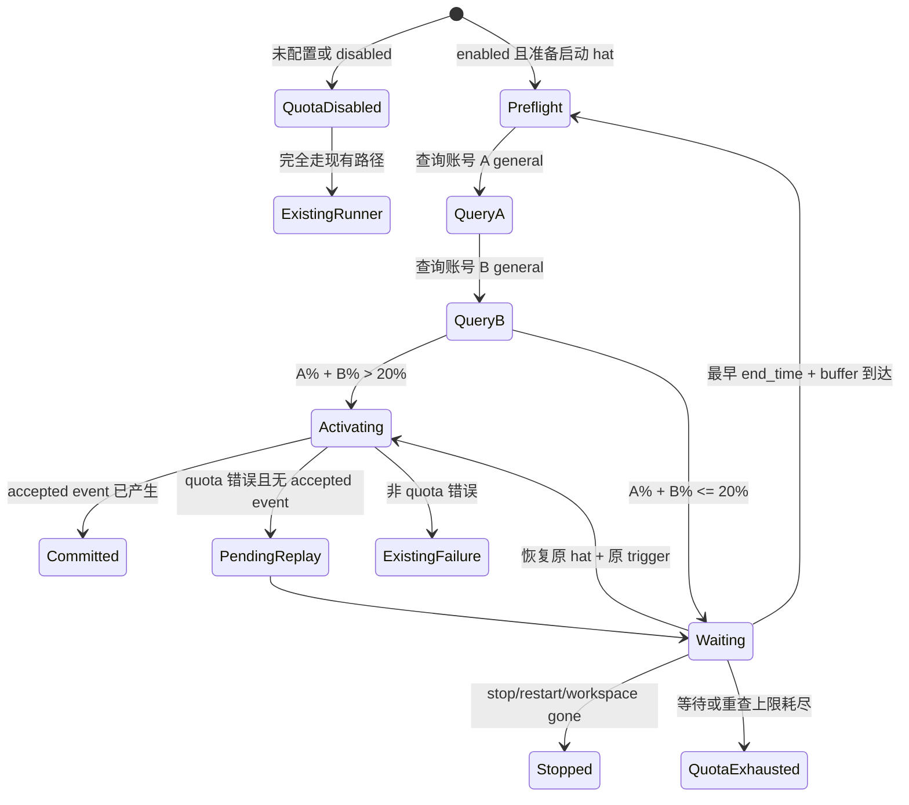

# MiniMax 双 Coding Plan 配额门控与中断续跑 - Plan

## Overview

Ralph 通过一个既有 Proxy 使用两个 MiniMax Coding Plan 账号。Proxy 已负责账号路由，Ralph 不选择账号、不切换 Proxy 凭据；Ralph 只用两个账号各自的 MiniMax API Key 查询 `general` 文本/Coding 额度，并把两个账号当前 5 小时窗口的剩余百分比相加。

每次启动串行 hat activation 前，只有额度池总量严格大于单次 hat 预算（默认 20%）才允许启动。总量不足时不再启动 hat，而是等到两个账号中最早的窗口刷新时刻后重新查询。若已经运行的 hat 因配额耗尽而报错，Ralph 不把它算作普通失败：已成功交接则提交本次 activation；尚未交接则持久化原 activation，额度恢复后 cold-restart 同一个 hat 和同一个任务。

该能力严格 opt-in。没有 `event_loop.quota`、`enabled: false`、或未配置账号时，所有调度、backend 环境变量、错误传播、运行时状态和性能行为必须与当前版本一致。

## Problem Frame

现有 runner 在 hat backend 返回错误时，要么通过 `?` 直接退出，要么进入普通 `success=false`、consecutive failure、missing-event/hard-gate/fallback 路径。配额耗尽不是业务失败：它既不表示 hat 判断错误，也不表示任务不可恢复。若把它当普通失败，会丢失当前 activation 的交接责任；若只等待后调用 `next_hat()`，又可能选错 hat 或丢失原始 trigger。

另一方面，MiniMax 已提供可查询的额度接口，用户也明确知道每个 hat 预留约 20% 的额度。最有效的策略是先阻止明显无法完成的 activation，再用运行中错误识别兜住“查询后仍在执行中耗尽”的竞态。

## Product Contract

### 配额池语义

- 只适配 MiniMax：`GET https://www.minimaxi.com/v1/token_plan/remains`。
- 每个账号使用其配置的 API Key 发送 `Authorization: Bearer <key>`。
- 只读取 `model_name == "general"` 的文本/Coding 额度，忽略 `video` 等条目。
- 当前可用池量固定为两个配置账号的 `current_interval_remaining_percent` 之和；MVP 不泛化任意账号数量。
- 默认单次 hat 预算 `activation_budget_percent = 20`。
- 只有 `pool_remaining_percent > activation_budget_percent` 才允许启动；等于 20% 也不启动，保留安全余量。
- 本期只支持串行 activation，不设计并发额度预留、锁、reservation ledger 或并行 worker 配额协调。
- Proxy 继续负责真实请求的账号选择。查询 Key 不注入 backend，不覆盖 `ANTHROPIC_AUTH_TOKEN`、`ANTHROPIC_API_KEY`、Proxy URL 或任何现有认证变量。
- 百分比求和的运维前提是两个账号购买等容量 Coding Plan，且 Proxy 能在一次长 activation 期间继续消费任一账号；若套餐容量不同，本期不得启用该配置。

### 等待语义

- 总量不足时，为每个账号计算下一次可能可用时间：5 小时额度不足取 `end_time`，周额度为 0 取 `weekly_end_time`；再取两个账号中最早的未来时间，加可配置安全缓冲后作为下一次重查 deadline。
- 某账号查询失败时，该账号的候选时间是 `fallback_recheck_seconds` 后；最终 deadline 仍取两个账号候选时间的最早值，不能因为另一个成功账号的窗口很晚而长时间放弃重查失败账号。
- deadline 到达后重新查询全部账号；只有总量重新严格大于预算才启动 hat。
- 等待期间响应现有 stop/restart/workspace-gone 信号，不用固定短周期轮询 usage endpoint。
- quota 等待时间不计入 `max_runtime_seconds`，也不增加 iteration、consecutive failure、fallback 或 recovery 次数。
- 设置独立的 `max_wait_seconds`（默认 86400）与 `max_rechecks`（默认 20）；一次“同时查询两个账号并形成一个池决策”只计一次 recheck，任一上限用尽后以新的明确 quota 终止原因退出。

### 运行中中断语义

- backend 输出或错误中命中 MiniMax quota signature 时，先检查本 activation 是否已有被 runtime 接受的业务/终态事件。
- 已有被接受事件：该事件是 activation 的提交点；保留事件并继续正常路由，不重复运行 hat。
- 尚无被接受事件：本次 activation 处于未提交状态；不进入普通失败、missing-event、hard-gate、fallback 或 consecutive failure 路径。
- runtime quota 命中后强制经历至少一次 `fallback_recheck_seconds` 冷却并重新查询两个账号；不得使用启动该 hat 前的缓存 observation 立即重放。
- 未提交状态保存当前 hat、原始触发事件、task 上下文、iteration、attempt 与 deadline；额度恢复后 cold-restart 同一个 hat，继续同一个任务。
- 工作区、task、memory、scratchpad 保持现状，不自动回滚。恢复 prompt 明示“上次因 quota 中断，工作区可能包含部分修改，应先检查再继续”。
- isolated hat channel 若没有形成被接受事件，则不得把残缺记录作为成功交接；重放前清理该次未提交 channel。若已有事件成功合并并被接受，则按已提交处理。

## Requirements Trace

- **R1 配额查询**：分别查询且只查询两个配置账号，验证成功响应并只提取 `general` 条目。
- **R2 池化判断**：将两个账号 5 小时剩余百分比相加；总量严格大于默认 20% 才启动串行 hat。
- **R3 Proxy 边界**：Ralph 只查询额度，不选择账号、不切换 Key、不改 backend/Proxy 认证环境。
- **R4 智能等待**：总量不足时等最早有效 `end_time` 加缓冲，到点重查，不高频轮询。
- **R5 查询失败安全**：只有成功查询到的账号才贡献可用额度；无法证明的额度按 0 计算。若仍有已知额度大于预算，可启动；否则等待/重试。
- **R6 activation 提交点**：accepted event 已产生则不重跑；无 accepted event 的 quota 中断必须重放原 activation。
- **R7 独立恢复预算**：quota 不污染普通 failure/recovery 计数，并有自己的最大等待与重查上限。
- **R8 跨进程恢复**：等待时进程被终止后，下一次 `ralph run --continue` 能读取持久状态，重新评估 deadline 与原 activation。
- **R9 人工控制**：等待期间 stop/restart 信号沿用现有语义并在现有响应预算内生效。
- **R10 凭据保密**：YAML 可直接配置 Key，但 Key 不得出现在日志、TUI/RPC、quota state、summary、diagnostics、错误消息或测试快照中。
- **R11 零回归**：功能未显式启用时不得发 HTTP 请求、不得增加启动延迟、不得改变现有错误分类和 runner 分支。
- **R12 文档同步**：配置和 agent 可观察行为同步到用户配置文档及 `crates/ralph-core/data/*.md` 中真正需要 agent 知道的指南；不得向 hat instructions 泄漏 runtime 内部状态。

## Scope Boundaries

- 仅支持 MiniMax `token_plan/remains` 与 `general` 模型额度。
- 仅支持当前单 loop、串行 hat activation；不处理并发 hats、wave workers 的额度预留或跨 loop 全局协调。
- 不让 Ralph 替 Proxy 做账号路由，也不把查询 API Key 注入 agent/backend。
- 不按 token 数精确预测消耗；单次 activation 使用固定百分比预算。
- 不自动回滚 quota 中断前的代码或 task 副作用。
- 不对瞬时普通 429、每秒请求限流或其它供应商错误做 quota 等待，除非命中 MiniMax quota signature。
- 不把 API Key 迁移到系统 keychain；用户已明确接受私有 YAML 直配，安全边界限定为运行时不泄漏。
- 不支持容量不同的 Coding Plan 做百分比加权；异构套餐未来另行设计容量权重。

## Execution Contract：纯串行、绝对隔离、TDD 闭环

本计划只有一条合法实施路径：

```text
Unit 1 → Unit 2 → Unit 3 → Unit 4 → Unit 5 → Unit 6 → Final Release Gate
```

- **纯粹串行**：任一时刻只允许一个 Unit 处于开发状态。前一 Unit 的测试、重构、文档内验收项没有全部完成，不得开始下一 Unit；禁止交替开发、并行落码或提前搭后续实现。
- **完成即冻结**：每个 Unit 完成后冻结其公开输入/输出契约。后续 Unit 只能使用该已完成契约，不能依赖前一 Unit 的内部实现，也不能为后续便利偷偷扩张前一 Unit。
- **无前向依赖**：当前 Unit 不得引用、调用或等待任何后置 Unit。当前 Unit 所需的外部行为全部通过本 Unit 内的极简 fake/fixture/trait boundary 提供。
- **绝对隔离**：每个 Unit 只改自己的职责边界和列出的文件簇；其验收测试只验证该 Unit 的输入与输出，不验证多个尚在演进的 Unit 组合。跨层、端到端与全 workspace 验证统一放在所有 Unit 完成后的 Final Release Gate，不作为某个 Unit 的未偿债务。
- **唯一机械例外**：Rust 父模块注册文件 `crates/ralph-cli/src/loop_runner/mod.rs` 可由 Unit 2、3、5、6 各追加一条新子模块声明；该文件只能做声明注册，不得借机修改、重排或耦合已完成 Unit 的逻辑。每个新增模块的实现与测试仍只存在于本 Unit 自有文件。
- **原子 TDD**：每个 Unit 必须按“先写本 Unit 验收测试（红）→ 最小实现（绿）→ 本 Unit 内重构 → 重跑本 Unit 完整测试”闭环。测试通过不是阶段性状态，而是该 Unit 的完成条件。
- **禁止遗留债务**：不得用 TODO、ignored test、临时 fail-open、未来 Unit 会补齐等方式结束 Unit。若后续发现已冻结契约有缺陷，必须停止当前 Unit，回到原 Unit 修正并重新完成其 TDD 闭环，再按线性顺序继续。
- **零回归贯穿每一 Unit**：每个触及共享路径的 Unit 都必须先锁定 quota 缺省/disabled 的现状，再证明新代码在禁用时不产生 HTTP、文件 I/O、状态变化、额外 backend 环境变量或错误分类变化；不能只把零回归留到最后验证。

## Context & Research

### Relevant Code and Patterns

- `crates/ralph-core/src/config/loop_config.rs`：`EventLoopConfig` 使用 `#[serde(default)]` 和 master `enabled` 的 opt-in 模式；quota 配置应遵循同一零回归结构。
- `crates/ralph-cli/src/loop_runner/runner.rs`：hat 选择、prompt 构造、isolated channel、backend 执行、accepted event 处理和终止分支的主集成点。
- `crates/ralph-cli/src/loop_runner/execution.rs`：`ExecutionOutcome` 已区分 watchdog 与普通结果，适合增加结构化 quota 分类，而不是在 runner 多处重新匹配字符串。
- `crates/ralph-adapters/src/cli_executor.rs`、`pty_executor.rs`、`acp_executor.rs`：不同 backend 路径必须把 output/error 统一收敛到可分类的 execution outcome。
- `crates/ralph-cli/src/loop_runner/suspend.rs`：现有 stop/restart sentinel 等待模式可复用信号语义，但 quota 需要 deadline 驱动的独立等待状态。
- `crates/ralph-cli/src/loop_runner/hat_channel.rs`：未提交 activation 的 isolated channel 清理与 accepted event 判定边界。
- `crates/ralph-core/src/event_loop/loop_state.rs`：`started_at: Instant` 当前直接参与 max runtime；quota pause 需要累计排除等待时长。
- Workspace 已有 `reqwest`、`tokio`、`serde_json`，无需引入新的 HTTP/runtime 依赖。

### Institutional Learnings

- `docs/solutions/integration-issues/fix-claude-stream-thinking-post-event-timeout-false-failure-2026-05-06.md`：backend 非零结束不必然代表 activation 失败；若事件已经成功发出，应以交接事实而不是进程退出形式判定成功。本计划沿用同一原则，把 accepted event 定义为提交点。
- `docs/solutions/developer-experience/ralph-cli-loop-runner-tests-must-run-serial.md`：runner 测试必须使用 nextest 的 cli-serial 隔离；新增 quota runner 测试不得使用裸 `cargo test`。
- `docs/solutions/patterns/critical-patterns.md` 当前不存在；计划不假装存在额外 critical pattern 结论。

### External Contract

- 实测响应的关键字段：`model_remains[]`、`model_name`、`current_interval_remaining_percent`、`current_weekly_remaining_percent`、`end_time`、`remains_time`、`base_resp.status_code`。
- `end_time` 为 Unix 毫秒；等待和持久状态统一保存 UTC/RFC3339 展示值与原始毫秒值，避免本地时区歧义。

## Key Technical Decisions

- **额度池采用求和**：Proxy 已聚合两个 Coding Plan，因此 Ralph 判断总池量，不要求任一单账号独立达到 20%。
- **严格大于预算**：`sum > 20` 才启动，等于预算也等待，给估算误差留余量。
- **每次 activation 前查询**：不缓存上一次百分比作为下一次启动依据，防止上一 hat 已消耗但本地仍认为额度充足。
- **成功部分可贡献额度**：一个账号查询失败时按 0 计；另一个账号已知额度若单独足够仍可启动，避免不必要停机。
- **不猜测 status 枚举**：MVP 不以未确认含义的 `current_interval_status` / `current_weekly_status` 决策；5 小时池量以 remaining percent 为主，周额度仅在 `current_weekly_remaining_percent == 0` 时明确判为不可用。
- **查询严格串行**：先查账号 A，再查账号 B；不为两个 usage 请求引入并发任务。
- **没有可信 deadline 时使用慢重查**：若所有不足/失败账号都没有未来 `end_time`，使用 `fallback_recheck_seconds`（默认 60）作为下一 deadline；仍受独立上限约束。
- **accepted event 是提交点**：这与现有 post-event timeout 的成功语义一致，可防止重复业务事件和重复交接。
- **未提交 activation 原位重放**：不重新调用一般 `next_hat()`；必须恢复同一个 hat 与原 trigger。
- **quota wait 排除出 max runtime**：长期等待是产品目标，不能被现有 wall-clock runtime 上限误杀。
- **状态不含 Key**：持久化只记录账号配置序号/名称、百分比、deadline、错误类别和 activation 元数据。
- **禁用路径最前置短路**：quota gate 在任何 Client 构造、HTTP 请求、状态文件访问之前检查 `enabled`，用结构与测试证明零回归。

## High-Level Technical Design

> 此图用于表达目标状态机，是评审方向指引，不是要求照抄的实现代码。



## Configuration Contract

方向性 YAML 示例：

```yaml
event_loop:
  quota:
    enabled: true
    provider: minimax
    activation_budget_percent: 20
    request_timeout_seconds: 5
    reset_buffer_seconds: 30
    fallback_recheck_seconds: 60
    max_wait_seconds: 86400
    max_rechecks: 20
    accounts:
      - name: coding-plan-a
        api_key: "<private MiniMax key A>"
      - name: coding-plan-b
        api_key: "<private MiniMax key B>"
```

约束：

- `enabled: true` 时 `provider` 必须为 `minimax`，账号列表必须恰好两个，`name` 必须唯一，Key 不得为空。
- 百分比预算限定为 1..199；MVP 默认 20，可配置但不做 per-hat 差异化。单账号请求 timeout 默认 5 秒且必须大于 0。
- 账号 Key 的 `Debug`/错误展示必须始终脱敏；序列化配置只用于读取，任何 runtime state 不复写完整 quota config。
- 未配置 `quota` 与 `quota.enabled: false` 语义相同，且不校验 accounts。

## Implementation Units

以下 Dependencies 形成严格的单链。依赖只表示“前一 Unit 已经 100% 完成并冻结其公开契约”，不允许读取前一 Unit 内部实现来完成当前测试。

- [ ] **Unit 1：定义 opt-in 配置与凭据脱敏边界**

**Goal:** 建立 MiniMax quota 配置、校验、默认值和 secret wrapper，不改变禁用配置的解析与运行行为；usage 响应模型属于 Unit 2。

**Requirements:** R2（配置表达）、R3、R10、R11

**Dependencies:** None

**Files:**
- Modify: `crates/ralph-core/src/config/loop_config.rs`
- Modify: `crates/ralph-core/src/config/mod.rs`
- Modify: `crates/ralph-core/src/config/ralph_config.rs`
- Test: `crates/ralph-core/src/config/ralph_config.rs`

**Approach:**
- 新增默认关闭的 quota 配置块、账号条目和范围校验。
- Key 类型不得派生会输出明文的 `Debug`；错误只指出账号名和字段，不回显值。
- 配置标准化不能把 Key 写入日志或通用诊断结构。

**Execution note:** 先增加禁用/缺省配置的 characterization tests，再加入新配置解析测试。

**Atomic TDD gate:** 本 Unit 的测试输入仅为 YAML/配置对象，输出仅为解析结果、校验错误和脱敏展示；不得启动 HTTP client、runner 或 backend。红→绿→重构全部完成后冻结 quota 配置契约，才可进入 Unit 2。

**Test scenarios:**
- Happy path：两个账号、预算 20 的 YAML 解析后保留账号顺序与默认等待参数。
- Edge case：缺少 quota、显式 disabled、disabled 且 accounts 非法时均保持旧配置可解析且不启用功能。
- Error path：enabled 但账号不是两个、名称重复、Key 为空、预算越界或 request timeout 为 0 时，给出不含 Key 的配置错误。
- Security：对配置及错误做 Debug/Display 检查，任何输出都不包含 Key 的前缀或完整值。

**Verification:** 旧配置 fixture 无需修改即可解析；新配置能表达两个查询凭据且不存在明文输出路径。

- [ ] **Unit 2：实现 MiniMax usage client 与额度池决策器**

**Goal:** 查询每个账号的 `general` 额度，形成可测试的池总量、可信 deadline 与启动/等待决定。

**Requirements:** R1、R2、R4、R5、R10

**Dependencies:** Unit 1

**Files:**
- Create: `crates/ralph-cli/src/loop_runner/quota.rs`
- Modify: `crates/ralph-cli/src/loop_runner/mod.rs`
- Test: `crates/ralph-cli/src/loop_runner/quota.rs`（模块内 `#[cfg(test)]`，不共享测试注册文件）

**Approach:**
- HTTP transport 与纯决策逻辑分离；测试通过本地 mock server/注入 transport 验证，不调用真实 MiniMax。
- 对每个账号独立处理 HTTP、JSON、`base_resp` 与 `general` 缺失错误；成功账号百分比求和，失败账号贡献 0。
- `pool_total > budget` 返回 Start；否则分别为两个账号计算候选 deadline：interval/weekly exhaustion 使用服务端窗口时间，unavailable 使用 fallback deadline，再选择最早值。
- weekly 百分比为 0 时，该账号贡献 0，避免 5 小时窗口看似有量但周额度已耗尽；本期不解释未确认的 status 枚举。
- 所有日志只使用账号名、状态类别、百分比和 deadline，不记录 header/request debug。
- 固定 HTTPS endpoint；redirect policy 只允许 MiniMax 同源跳转，禁止把 Bearer header 带到其它 host。

**Atomic TDD gate:** 本 Unit 只接受内建 JSON fixture/fake transport，输出账号 observation 与 Start/Wait 决策；不得启动 runner、hat 或写 quota state。Unit 1 仅作为已冻结的配置输入契约使用。全部本地测试闭环后冻结 usage/decision 接口，才可进入 Unit 3。

**Test scenarios:**
- Happy path：12% + 15% = 27%，预算 20，允许启动。
- Boundary：10% + 10% = 20%，严格不允许启动；10% + 11% = 21%，允许启动。
- Pool semantics：0% + 25% 允许启动，证明不是“每个账号都过线”。
- Model filtering：响应同时含 general/video，仅 general 参与求和。
- Weekly exhaustion：账号 interval 有余额但 weekly 已耗尽，该账号按 0 计。
- Partial failure：A 查询失败、B=25% 时启动；A 查询失败、B=15% 时等待。
- Partial failure deadline：A 查询失败、B=15% 且 B 四小时后刷新时，一分钟 fallback 早于四小时窗口，因此一分钟后先重查 A。
- Error path：401、429、5xx、timeout、畸形 JSON、status_code 非 0、缺 general 均产生脱敏的账号级 unavailable 结果。
- Deadline：两个不足账号的 end_time 不同，选择最早未来值加 buffer；无可信 end_time 时使用 fallback。
- Weekly deadline：周额度为 0 时使用 weekly_end_time，而不是更早但无意义的 interval end_time。
- Security：mock server 捕获 Bearer 正确，所有返回对象、错误和日志字符串不包含 Key。
- Redirect security：同源跳转可完成查询；跨 host 跳转被拒绝，目标服务收不到 Authorization header。
- Scope：配置一个或三个账号均被 Unit 1 拒绝，Unit 2 不承担动态账号数量逻辑。

**Verification:** 给定两份实测形状的响应，决策器稳定得到池总量和下一动作，且无需启动 backend。

- [ ] **Unit 3：实现独立的 quota gate 与可中断等待原语**

**Goal:** 提供独立、可注入虚拟时钟与控制信号的 gate/wait 原语；本 Unit 不接线主 runner。

**Requirements:** R2、R4、R5、R7、R9、R11

**Dependencies:** Unit 2（且 Unit 1、2 均已冻结）

**Files:**
- Create: `crates/ralph-cli/src/loop_runner/quota_wait.rs`
- Modify: `crates/ralph-cli/src/loop_runner/mod.rs`
- Test: `crates/ralph-cli/src/loop_runner/quota_wait.rs`（模块内 `#[cfg(test)]`）

**Approach:**
- 原语输入为 Start/Wait decision、deadline、虚拟/真实 clock 与抽象控制信号，输出为 Start、Recheck、Stopped、RestartRequested、WorkspaceGone 或 Exhausted。
- 等待由单个 deadline timer 与控制信号选择，不以固定频率查询 usage。
- 原语返回精确 paused duration，供最终装配从 active runtime 中扣除；自身不读取或修改 LoopState。
- spawn probe 只是本 Unit 的输出观察器，不创建真实 backend 子进程。

**Atomic TDD gate:** 本 Unit 用 fake quota decision source、虚拟时钟和 fake spawn probe，只验证“给定 Start/Wait/控制信号时是否 spawn、等待多久、计时如何变化”；不得解析 MiniMax JSON、不得分类 backend quota 错误、不得持久化恢复状态。完成本 Unit 红→绿→重构后冻结 pre-activation gate/wait 接口，才可进入 Unit 4。

**Test scenarios:**
- Happy path：fake decision=Start 时 spawn probe 正好记录一次启动。
- Wait path：fake decision=Wait 时 deadline 前 spawn probe 为零；推进虚拟时间并切换为 Start 后记录一次。
- Control：等待期间 stop 在现有响应预算内返回 Stopped；restart 与 workspace-gone 保持各自现有原因。
- Runtime accounting：虚拟等待 5 小时后输出 paused duration=5 小时；如何扣除 max runtime 由 Unit 6 装配测试负责。
- Limit：max wait 或 max rechecks 达限时输出本 Unit 自有的 `Exhausted` wait outcome，不引用后续 Unit 才负责的全局 termination 映射。
- Disabled：输入 disabled 时立即输出 bypass，不启动 timer、不订阅控制信号；HTTP、状态文件和 backend 均不在本 Unit 边界内。

**Verification:** 对任意 fake decision/clock/signal 输入，原语给出唯一 wait outcome 与 paused duration，且没有 HTTP、持久化或真实 spawn 副作用。

- [ ] **Unit 4：统一识别运行中 quota 错误并定义 activation 提交点**

**Goal:** 跨 CLI/PTY/ACP execution path 分类 MiniMax quota 错误，并按 accepted event 是否存在决定提交或重放。

**Requirements:** R6、R7、R11

**Dependencies:** Unit 3（Unit 1–3 均已完成并冻结）

**Files:**
- Modify: `crates/ralph-cli/src/loop_runner/execution.rs`
- Modify: `crates/ralph-adapters/src/cli_executor.rs`
- Modify: `crates/ralph-adapters/src/pty_executor.rs`
- Modify: `crates/ralph-adapters/src/acp_executor.rs`
- Test: `crates/ralph-cli/src/loop_runner/execution.rs`（模块内 quota decision tests）
- Test: `crates/ralph-cli/src/loop_runner/tests/legacy.rs`
- Test: `crates/ralph-adapters/src/cli_executor.rs`
- Test: `crates/ralph-adapters/tests/pty_executor_integration.rs`
- Test: `crates/ralph-adapters/tests/acp_executor_integration.rs`

**Approach:**
- detector 接收完整 output、stderr/stream tail 与 executor error chain，输出结构化 quota classification；signature 以 MiniMax 实测错误 fixture 为准，并避免把普通速率限制误判为 5 小时额度耗尽。
- classification 接口保留 executor output/error，不让 `?` 在最终装配之前丢失 quota 证据。
- 纯决策器以本 activation 的 accepted-event snapshot 为提交点，而不是仅搜索输出文本，输出 ExistingFailure、Committed 或 PendingReplay。
- channel 的实际合并/丢弃与 runner 分支只在 Unit 6 装配；本 Unit 不修改它们。

**Atomic TDD gate:** 本 Unit 输入仅为 execution output/error fixture 与本 activation 的 accepted-event snapshot，输出仅为 ExistingFailure/Committed/PendingReplay 及 channel 处理决定；不得真正查询 usage、等待 deadline 或读写持久状态。完成分类与提交点的专属测试闭环后冻结 outcome contract，才可进入 Unit 5。

**Test scenarios:**
- CLI/PTY/ACP：相同 quota fixture 都产生同一结构化分类。
- False positive：普通 1 req/s 429、网络断开、认证失败、模型不存在仍走现有错误路径。
- Uncommitted：quota 错误且无 accepted event，输出 PendingReplay，并证明不会增加 failure 或注入 fallback；实际恢复执行属于后续装配，不在本 Unit 测试。
- Freshness：PendingReplay 标记必须要求一次 quota cooldown + fresh recheck，不能携带“直接使用 pre-activation observation 重放”的决定。
- Committed：accepted-event snapshot 非空且进程返回 quota/非零时，纯决策输出 Committed；实际单次路由由 Unit 6 验证。
- Invalid partial：snapshot 标记 channel 半截或策略拒绝时输出 PendingReplay；主 ledger 处理不在本 Unit 边界内。
- Regression：非 quota watchdog、post-event timeout、普通 backend failure 的既有测试语义不变。

**Verification:** quota 与普通失败在所有 executor 路径上可稳定区分，且不会重复业务事件。

- [ ] **Unit 5：持久化 quota wait 与未提交 activation，支持 continue 恢复**

**Goal:** 进程退出/机器重启后仍能恢复等待决定和原 activation，而不是重新选择 hat。

**Requirements:** R7、R8、R9、R10

**Dependencies:** Unit 4（Unit 1–4 均已完成并冻结）

**Files:**
- Create: `crates/ralph-cli/src/loop_runner/quota_state.rs`
- Modify: `crates/ralph-cli/src/loop_runner/mod.rs`（仅机械注册新模块）
- Modify: `crates/ralph-core/src/event_loop/types.rs`
- Modify: `crates/ralph-core/src/event_loop/termination_impl.rs`
- Modify: `crates/ralph-cli/src/display.rs`
- Test: `crates/ralph-cli/src/loop_runner/quota_state.rs`（模块内 `#[cfg(test)]`）
- Test: `crates/ralph-core/src/event_loop/tests/termination.rs`

**Approach:**
- `.ralph/quota-state.json` 使用版本化 schema 与原子写入，保存 pool observations、deadline、累计等待、重查次数、状态、terminal reason 和 pending activation metadata。
- 明确禁止 Key、Authorization header、完整 quota config 和未经清洗的 backend output 进入状态文件。
- quota state 按 owner-only 权限创建；原 trigger payload 只保存恢复所需字段，不复制完整 prompt 或 backend 输出。
- 从 quota state 纯函数式推导恢复决定：deadline 未到为 ContinueWaiting，已到为 Recheck，pending activation 未提交为 ReplayPending；本 Unit 不接线 `--continue` 或启动 backend。
- 状态成功恢复并提交后标记 completed/清理；用户 stop 保留可读 terminal marker，但不得导致后续普通 run 错误重放。
- 新增专用 `TerminationReason::QuotaExhausted`（或同等明确变体），在本 Unit 完成 core/display 的纯映射测试；runner、RPC、summary 的装配映射留给 Unit 6，避免本 Unit触碰主调度文件，也避免冒充 MaxCost。

**Atomic TDD gate:** 本 Unit 使用临时目录、固定 wall clock 和序列化 fixture，只验证 quota state 的写入、读取、版本、恢复决定、终止映射与脱敏；不得发 HTTP、不得启动 backend。完成红→绿→重构并冻结 persistence/recovery contract 后，才可进入 Unit 6。

**Test scenarios:**
- Restart decision：读取等待状态后，deadline 未到输出 ContinueWaiting，到点输出 Recheck；不得启动 backend 或发 HTTP。
- Replay identity：ReplayPending 输出的 hat_id、trigger payload、task_id/task_key/step 与写入前一致。
- Expired deadline：启动时 deadline 已过，立即重查而不是额外睡眠。
- Corrupt state：畸形/未知版本状态 fail-closed 并给出可操作错误，不静默选择新 hat。
- Completed state：已提交 activation 不会因陈旧 state 被重复运行。
- Stop：等待中 stop 写入脱敏 terminal reason；后续显式 continue 的行为有确定规则。
- Security：状态 JSON、summary、RPC、TUI、Debug 中均搜索不到两个测试 Key。

**Verification:** quota state 经原子写入、重新读取后，恢复决定与原 activation identity 完全一致且不含凭据；不需要 runner、HTTP 或 backend。

- [ ] **Unit 6：冻结契约装配、文档与默认路径保护**

**Goal:** 让操作者能正确配置和诊断功能，并证明 opt-in 功能没有改变默认路径。

**Requirements:** R10、R11、R12

**Dependencies:** Unit 5（Unit 1–5 均已完成并冻结）

**Files:**
- Create: `crates/ralph-cli/src/loop_runner/quota_wiring.rs`
- Modify: `crates/ralph-cli/src/loop_runner/mod.rs`（仅机械注册新模块）
- Modify: `crates/ralph-cli/src/loop_runner/runner.rs`
- Modify: `crates/ralph-cli/src/loop_runner/suspend.rs`
- Modify: `crates/ralph-cli/src/loop_runner/hat_channel.rs`
- Modify: `crates/ralph-cli/src/commands/run.rs`
- Modify: `crates/ralph-core/src/event_loop/loop_state.rs`
- Modify: `docs/guide/configuration.md`
- Modify: `docs/guide/backends.md`
- Modify: `docs/reference/troubleshooting.md`
- Modify: `crates/ralph-core/data/ralph-tools.md`
- Modify if needed: `crates/ralph-core/data/ralph-tools-cmdref.md`
- Test: `crates/ralph-cli/src/loop_runner/quota_wiring.rs`（模块内 `#[cfg(test)]`）

**Approach:**
- 用户文档解释 pool sum、严格阈值、两个 Key 仅用于查询、Proxy 认证不变、等待/终止状态和私有 YAML 风险。
- agent 注入指南只描述 agent 可执行的恢复动作：quota cold-restart 后先检查 workspace/task/scratchpad；不暴露内部 ledger 路径、函数或实现术语。
- 本 Unit 只完成已冻结契约的装配入口、操作者文档和 agent-facing 文档；装配测试使用 fake quota facade + fake execution facade，只验证启用/禁用分流和字段传递，不重新测试各 facade 内部逻辑。
- 在一般 `next_hat()` 之前装配 Unit 5 的恢复决定：ContinueWaiting 进入已冻结 wait 接口，Recheck 进入已冻结 quota decision 接口，ReplayPending 恢复同一个 hat/trigger；`--continue` 只负责编排，不重做持久化判断。
- 把 Unit 2 的 Start/Wait 决策、Unit 3 的 wait outcome、Unit 4 的 ExistingFailure/Committed/PendingReplay 与 Unit 5 的 state/recovery contract 一次性接入 runner；Unit 6 是唯一修改主调度分支的 Unit。
- 只有在本装配层处理 isolated channel 的提交/丢弃，并把 Unit 3 返回的 paused duration 纳入 LoopState active-runtime 计算。
- 在本装配层补齐 `QuotaExhausted` 的 runner exhaustive matches、RPC、summary 与 termination sentinel 映射。
- 真实 EventLoop/runner 的 BDD/replay、静态 CLI 文档 drift 和全 workspace nextest 统一属于 Unit 6 完成后的 Final Release Gate，不得借此掩盖 Unit 1–6 的局部欠账。

**Atomic TDD gate:** 先写只针对装配边界的测试：quota disabled 选择 ExistingRunner、enabled 选择 QuotaAwareRunner、查询 Key 不进入 backend env、恢复提示只消费脱敏 pending metadata；再完成最小装配与文档。不得在本 Unit 修改 Unit 1–5 已冻结的内部算法。

**Test scenarios:**
- Wiring：quota disabled 只调用 existing runner facade，quota facade 零调用。
- Wiring：quota enabled 将 secret-wrapper 账号配置只交给 quota facade，且其 Debug/日志脱敏；backend facade 仍只收到原有 Proxy 环境。
- Wiring：PendingReplay metadata 被转换为恢复上下文，不包含 Key 或内部 state 路径。
- Wiring：`--continue` 对 ContinueWaiting/Recheck/ReplayPending 只调用各自一个已冻结 facade，调用参数保持原 activation identity。
- Wiring：QuotaExhausted 在 runner、RPC、summary 与 sentinel 中得到一致且可读的专用原因。
- Documentation：配置字段、默认值和示例与已冻结 serde 契约一致；skill guide 不包含 Key 或内部 quota ledger 指示。

**Verification:** Unit 6 的装配与文档测试独立通过，且没有修改 Unit 1–5 的已冻结内部实现；随后才允许进入 Final Release Gate。

## System-Wide Impact

- **Interaction graph:** `RalphConfig` → quota client/decision → runner pre-activation gate → backend execution classification → isolated event commit → quota state/continue → termination/display/diagnostics。
- **Error propagation:** 查询失败是账号级 unavailable；总池仍足够可继续，否则进入等待。quota backend 错误从普通 anyhow/failure 路径提升为结构化可恢复结果。状态损坏与恢复上限走明确终止，不静默 fail-open。
- **State lifecycle risks:** 未提交 activation、残缺 isolated channel、accepted event 与 quota state 必须有单一提交顺序，避免重复交接；状态写入需要原子替换和 schema version。
- **API surface parity:** TUI、RPC、summary、loop termination sentinel、display 的 termination reason match 必须同步；不新增用户必须调用的 CLI 命令。
- **Integration coverage:** 单元测试不能证明“额度不足时没有 spawn”与“恢复后仍是同一 trigger”，必须有 runner 级 fake backend + mock HTTP 场景。
- **Unchanged invariants:** Proxy 与 backend 认证、hat topology、event policy、task API、普通 timeout/failure、disabled/default 配置均不改变。

## Flow and Edge-Case Decisions

1. **一个账号恢复、另一个仍不足**：两者总和大于 20 即启动；不等待两个都恢复。
2. **一个账号查询失败**：未知部分按 0；另一个已知部分大于 20 仍启动。
3. **总量恰好 20**：不启动，严格执行 `>`。
4. **周额度耗尽**：即使当前 5 小时字段仍有值，该账号也不能贡献可用池量；下一 deadline 应考虑 weekly end_time。
5. **窗口时间已过但百分比未刷新**：立即重查；服务仍返回陈旧窗口时用 fallback 间隔，防止零延迟循环。
6. **系统时间变化**：持久状态以服务端 epoch deadline 为依据；进程内等待用当前时间计算剩余 duration，不持久化 `Instant`。
7. **查询超时**：单账号请求有短 timeout；不能让 preflight 永久卡住。
8. **hat 已修改代码但未 emit**：保留工作区并重放；恢复 prompt 要求先检查而非从零覆盖。
9. **hat 已 emit 后 quota**：accepted event 优先，避免重复执行。
10. **未启用功能**：任何 quota signature 都继续按当前 backend error 行为处理，这是零回归契约的一部分。

## Risks & Mitigations

| Risk | Mitigation |
|---|---|
| 百分比求和只在 Proxy 确实聚合账号时成立 | 配置和文档明确这是当前 Proxy 拓扑的产品前提；Ralph 不推广为通用 provider 行为 |
| 两个套餐容量不同会让百分比求和失真 | MVP 要求两个等容量 Coding Plan；异构套餐禁止启用，未来另做加权设计 |
| 单个 hat 实际消耗超过 20% | 默认采用保守 20%，允许用户上调；运行中 detector 提供第二层恢复 |
| Key 直配 YAML 泄漏 | 不进入日志/状态/诊断；脱敏类型与全产物 secret-search 测试；文档提示保持文件私有 |
| usage API 瞬时不可用导致不必要等待 | 已知账号仍可贡献；无已知足够额度时 fail-closed，并使用短 fallback 重查而非终止 |
| accepted event 与 quota 错误竞态导致重复交接 | 以 runtime accepted event 为提交点，先完成 channel merge/validation 再决定 replay |
| quota 等待触发 max runtime | 累计 pause duration 从 active runtime 中扣除并测试跨小时虚拟时间 |
| continue 恢复错 hat/错 task | pending activation 持久化原 trigger/task identity；恢复在 `next_hat()` 前优先处理 |
| 新分支影响普通 runner | master enabled 最前置短路 + characterization tests + default-path zero-call assertions |

## Verification Strategy

### 开发中 targeted 验证

- `ralph-core` 配置、loop state 与 termination 测试走 `cargo nextest run -p ralph-core -- <subset>`。
- `ralph-cli` runner/config/display 测试走 `cargo nextest run -p ralph-cli --bin ralph -- <subset>`，继承 cli-serial；禁止裸 `cargo test`。
- adapter 测试走 `cargo nextest run -p ralph-adapters -- <subset>`。
- BDD 必须使用真实 runtime runner，不使用只检查 iteration 的 stub。

### Final Release Gate（全部 Unit 完成后）

- Final Release Gate 不是新的开发 Unit，不允许在此补实现、改契约或偿还前面遗留的测试债；若失败，必须退回责任 Unit，重新完成该 Unit 的原子 TDD 闭环，然后按顺序重验后续 Unit。
- 使用 `ralph-cli` 现有 fake backend/loop-runner harness 做黑盒验收：两个账号池量不足→不 spawn→最早窗口刷新→恢复原 hat；运行中 quota 且无 accepted event→同一 activation 重放；已有 accepted event→不重放。该能力位于 CLI runner，不错误塞入只覆盖 core `EventLoop` 的 YAML scenario harness。
- 运行 default/disabled 对照场景，证明无 quota 配置时 backend 调用、事件序列、termination、HTTP 调用数和 quota 状态文件访问均与基线一致。
- 使用 mock MiniMax HTTP 服务和 replay backend，不使用线上 Key或真实 API。
- 运行涉及配置/命令文档后的 `scripts/check-cli-doc-drift.sh`。
- 反向检查 `crates/ralph-core/data/*.md` 的命令、字段和 agent 可见性准确性。
- 最终运行 `./scripts/run-tests.sh`；若仅出现明确时序 flake，按项目规则使用 serial fallback 复核，真失败必须修复。

## Documentation / Operational Notes

- 文档必须醒目标注：两个 `api_key` 只用于查询余额，hat 仍使用现有 Proxy 认证。
- 日志 marker 限定为：查询结果摘要（账号名+百分比）、pool insufficient/wait deadline、pool recovered/replay；不得刷屏。
- quota state 对用户显示各账号最后已知百分比、池总量、预算、deadline、recheck 次数和 pending hat，但绝不显示 Key。
- 本计划新增配置和 runtime 行为，实施后必须同步检查 `crates/ralph-core/data/ralph-tools*.md`；不涉及 preset schema/topology，因此不修改 builtin preset、preset schema、zsh completion 或 operator preset skills，除非实现阶段实际扩大范围。

## Resolved Questions

- **供应商**：仅 MiniMax。
- **模型条目**：`model_name: general`。
- **账号关系**：两个 Coding Plan 由既有 Proxy 聚合；Ralph 不路由账号。
- **容量前提**：两个 Coding Plan 容量相同，允许直接把剩余百分比相加。
- **判断方式**：两个账号 5 小时剩余百分比求和。
- **阈值**：默认每个 activation 预算 20%，池总量严格大于 20 才启动。
- **并发**：本期明确没有并发 activation，不设计预留账本。
- **Key 配置**：允许直接写私有 YAML，仅用于 usage 查询。
- **恢复单位**：无 accepted event 时重放同一 activation，而不是一般 next-hat 调度。
- **零回归**：未启用时所有行为保持当前路径。

## Deferred to Implementation

- MiniMax 实际 quota 错误体 signature：用用户环境采集的脱敏 fixture 补齐，未确认文本不得用过宽的 `429` 单独匹配。
- `current_interval_status` / `current_weekly_status` 的完整枚举语义：本期明确不参与决策，未来取得可靠文档后另行扩展，不能在实现中临时猜测。
- 恢复 prompt 的最终简短文案：遵守 hat 视角与 injected skill 引用规则，不在计划中锁定文本。

## Sources & References

- `crates/ralph-cli/src/loop_runner/runner.rs`
- `crates/ralph-cli/src/loop_runner/execution.rs`
- `crates/ralph-cli/src/loop_runner/suspend.rs`
- `crates/ralph-core/src/config/loop_config.rs`
- `crates/ralph-core/src/event_loop/loop_state.rs`
- `docs/solutions/integration-issues/fix-claude-stream-thinking-post-event-timeout-false-failure-2026-05-06.md`
- `docs/solutions/developer-experience/ralph-cli-loop-runner-tests-must-run-serial.md`
