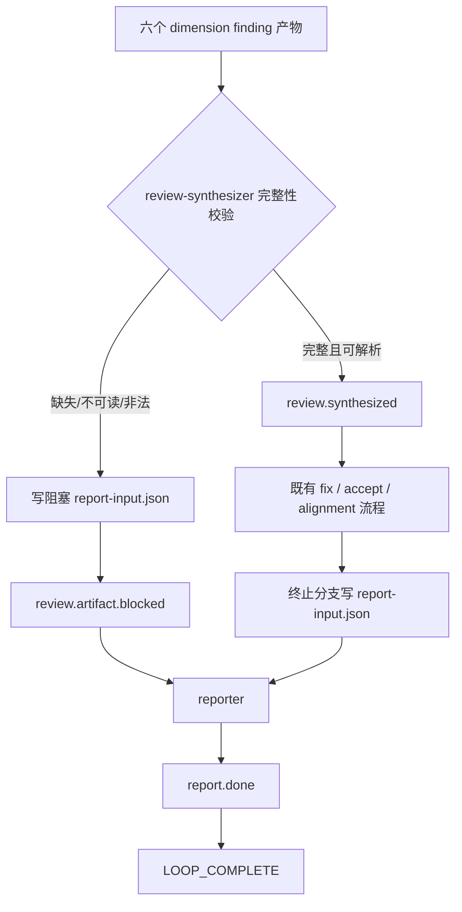
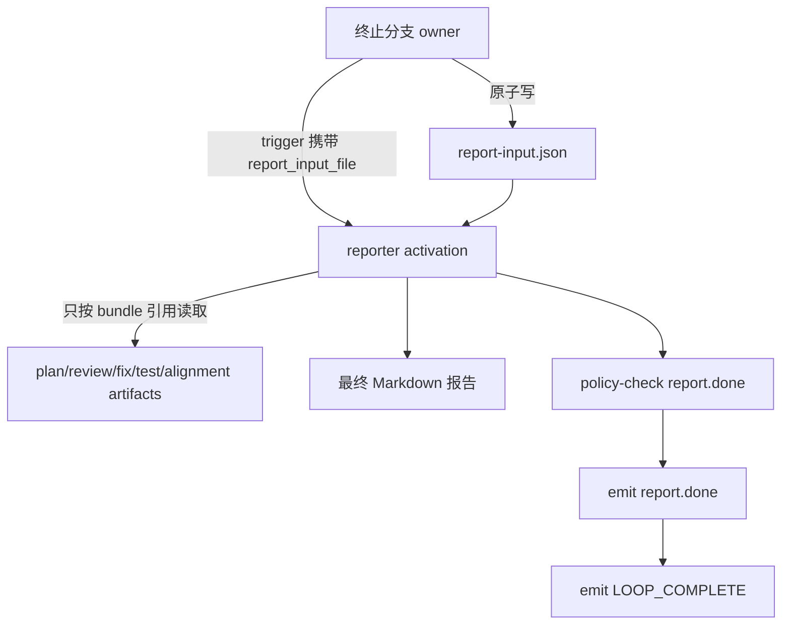

# 修复 CE Pipeline Preset 评审发现

## Goal Capsule

- **目标：** 修复 `ce-executor-pipeline` 与 `ce-executor-pipeline-loop` 评审中确认成立的全部 P0/P1 问题，使两套 preset 在原始文件、embedded builtin、外置 schema SSOT、运行时终态、AAF 评审规则及真实 EventLoop 场景中保持一致。
- **权威顺序：** 本计划中的 Product Contract → `presets/schemas/*.yml` 的结构化事件契约 → preset 拓扑与 hat instructions → runtime/BDD 证据 → operator skill 文档。
- **执行方式：** 先用测试固化现有合法终态，再修 schema 与失败分支，随后引入 artifact-first 报告交接并压缩 prompt，最后完成跨层同步与全量验证。
- **停止条件：** 任一 mandatory review artifact 缺失仍可进入成功/修复路径、任一原始 preset 严格 lint 失败、reporter 仍依赖主事件历史重建业务状态、或 `report.done → LOOP_COMPLETE` 合法终态不能被真实 runtime 接受时，不得声明完成。
- **尾部责任：** 最后一个实施单元负责全量测试、CLI 文档漂移检查、operator fixture 复核、无关改动清理，以及 `CLAUDE.md`/`AGENTS.md` 完全一致性。

---

## Product Contract

### Summary

本次工作是一次有边界的缺陷修复，不改变两套 CE pipeline 的产品定位、hat 数量或正常 review/fix 主流程。它修复原始 loop preset 无法通过 strict lint、review 证据缺失被降级为可忽略项、reporter 通过 main event history 隐式重建状态、关键 schema 字段缺少来源文档，以及重复 prompt 墙造成的漂移风险。同时保留并明确现有合法终态契约：reporter 先发 required event `report.done`，再发 completion promise `LOOP_COMPLETE`。

### Problem Frame

当前缺陷分成三类。第一类是可直接导致错误成功或校验失败的 P0：loop 原始 YAML 缺少 `stabilization.done`/`stabilization.blocked` inline schema；两个 synthesizer 在六维评审产物缺失或不可读时伪造 P3/ignore finding，可能继续进入 pass/accept；reporter 依赖 `ralph events --events-source main` 聚合跨 hat 状态，与 preset 的显式 artifact handoff 方向冲突。第二类是 P1 可维护性缺陷：关键 identity/handoff/decision 字段缺少 `field_docs`，多个 hat 大段复制通用命令、OPAC、git handoff 与 task identity 规则。第三类是评审假阳性：既有 reviewer 规则把同 activation 双业务事件一律判 P0，却没有识别 runtime 已测试的 required-event-to-completion 窄例外。

### Requirements

**P0 行为正确性**

- R1. `presets/en/ce-executor-pipeline-loop.yml` 作为独立文件执行 strict preset check 时，`test-stabilizer` 发布的 `stabilization.done` 与 `stabilization.blocked` 必须都有 inline schema，并与外置 schema SSOT 结构一致。
- R2. 两套 preset 的 `review-synthesizer` 必须把六个 mandatory dimension finding 文件中的任一缺失、不可读、格式非法或无法完成计数核对视为阻塞，不得合成 P3/ignore finding，不得继续发 `review.synthesized`。
- R3. 证据阻塞必须通过专用业务事件 `review.artifact.blocked` 交给 reporter；该事件不得进入 fix-planner、review-gate、alignment 或下一轮 review。
- R4. reporter 必须仅使用当前 trigger、trigger 中的 `report_input_file` 以及该 bundle 明确引用的产物生成报告，不得通过 main event history 推断跨 hat 状态。
- R5. 所有可进入 reporter 的终止分支都必须先原子写入当前 plan 对应的 `report-input.json`，再把 `report_input_file` 放入 trigger payload；至少覆盖 `align.done`、`plan.blocked`、`work.failed`、`stabilization.blocked`、`review.loop.blocked` 与 `review.artifact.blocked`。
- R6. `report.done → LOOP_COMPLETE` 必须保持不变：`report.done` 继续列在 `event_loop.required_events`，reporter 按顺序先发送该 required event，再发送精确 completion promise；不得用删除 `report.done` 或改写 completion 语义来“修复”评审假阳性。

**P1 契约与可维护性**

- R7. 两套 preset 的全部 required identity、handoff、artifact reference 与 decision 字段都必须具备 `field_docs.meaning`、`field_docs.source`、`field_docs.fill_rule`；示例只能表达数据形状，不得硬编码会影响判定的业务结论。
- R8. linear preset 应建立与 loop preset 同形态的外置 schema SSOT；原始 YAML 保留足以通过 path-based strict check 的 inline 结构化 schema，embedded 构建继续由 SSOT 深合并并接受语义 parity 校验。
- R9. 长 instructions 必须删除通用规则复述，只保留本 hat 的职责、可见输入、决策规则、artifact 输出、允许 topic 与停止条件；命令语法、policy-check、task 三字段、OPAC 和通用 git handoff 通过注入 skill 引用。
- R10. 若现有注入 skill 无法承载反复出现的 git entry/exit 与 writer handoff 契约，应新增通用、agent 可执行的 `ralph-tools-git-handoff` skill，并在 skill registry、入口文档和测试中注册；不得把 preset 名、U 编号、内部 ledger 或 runtime 函数名写入该 skill。
- R11. operator author/review 规则必须识别 required-event-to-completion 窄例外，同时继续把任意其它同 activation 多业务 emit 判为 P0；正反 fixture 都要覆盖。
- R12. agent 注入文档必须说明上述窄例外的触发条件、精确顺序、字段来源和失败停止条件，并明确 main event history 是诊断入口而非业务 handoff 来源。

**验证与同步**

- R13. 新增或修改的 BDD 必须通过 `run_workflow_guard_scenario` 走真实 EventLoop，并验证成功、早期失败、stabilization blocked、review artifact blocked、loop 最大轮次以及双事件 completion 路径。
- R14. preset/schema 拓扑变化必须逐层检查 runtime step-close、preset_lint、BDD、config opt-in、embedded presets、manifest/index、项目文档和 zsh completion；无须修改的层也要留下核查结论，不能默认跳过。

### Key Flows

- F1. **正常完成：** alignment 写 report bundle → `align.done` 携带 `report_input_file` → reporter 只读 bundle 及引用产物 → `report.done` → `LOOP_COMPLETE`。
- F2. **评审证据阻塞：** synthesizer 校验六个 finding 文件 → 任一失败即写阻塞 report bundle → 发 `review.artifact.blocked` → reporter 生成阻塞报告 → `report.done` → `LOOP_COMPLETE`；fix 与 alignment 不激活。
- F3. **其它终止分支：** 终止分支 owner 先写统一 report bundle，再触发 reporter；reporter 不需要知道触发事件之前的 main history。
- F4. **合法双事件终态：** reporter 的首个业务事件恰为配置中的 required event，第二个事件恰为 completion promise，runtime 接受二者；任意不满足该条件的双 emit 仍被拒绝或丢弃。

### Acceptance Examples

- AE1. 给定原始 loop YAML，执行 strict check 时不再出现 `lint.preset.publishes_missing_schema`。
- AE2. 给定六维产物中缺少一个文件，synthesizer 发 `review.artifact.blocked`，事件流中不存在 `review.synthesized`、`review.accepted`、`fix.requested` 或 `align.done`。
- AE3. 给定 happy path bundle，reporter 在无法访问 main event history 的条件下仍能生成包含 plan、执行、稳定化、评审、修复、alignment 和残留项摘要的报告。
- AE4. 给定 `required_events: [report.done]`，reporter 依次发送 `report.done` 与 `LOOP_COMPLETE`，真实 EventLoop 记录二者并完成 loop；把第一个事件换成非 required topic 时，测试必须证明不享受例外。
- AE5. 给定任一 schema required handoff 字段，CE builtin 结构化契约测试可验证它具有完整三段 field docs，且既有 strict lint 可验证外置 SSOT、inline authoring view 与 embedded preset 不冲突。

### Scope Boundaries

**本轮包含**

- 两套 CE pipeline preset、对应 schema、author notes、BDD、preset lint/embedded preset 测试、agent 注入 skill 与 preset operator skill。
- 为 report bundle 和 `review.artifact.blocked` 所需的最小 runtime/preset contract 适配。

**本轮不包含**

- 不改变 hat 数量、review 六维分类、loop 最大轮数、fix 决策算法或 supervisor preset。
- 不移除 `report.done`，不改变 completion promise，不把 main event history CLI 功能删除。
- 不引入通用 artifact 数据库、事件溯源平台或新 orchestrator 子系统。
- 不用精确 prompt 文本测试或 root/embedded YAML byte equality 测试锁定文案。

### Success Criteria

- 两个原始 preset 与 embedded builtin 均通过 strict lint，且 schema required fields 的文档覆盖完整。
- mandatory review artifact 缺失只能进入专用阻塞报告路径，不能产生成功、修复或 alignment 事件。
- reporter instructions 和 BDD 不再依赖 `--events-source main` 获取业务输入。
- runtime 单测与 preset BDD 同时证明合法双事件终态，operator review 不再对此报 P0。
- 所有 targeted gates 与 `./scripts/run-tests.sh` 通过；`CLAUDE.md` 和 `AGENTS.md` 完全一致。

### Sources

- `crates/ralph-core/src/event_loop/tests/payload_types.rs`：现有 required-event-to-completion 双 publish 行为测试。
- `crates/ralph-core/src/event_loop/mod.rs`：isolated activation 单事件预算及 handoff 例外实现。
- `crates/ralph-core/src/event_loop/loop_state.rs`：required event 与 completion gate 状态判定。
- `crates/ralph-cli/build.rs`：外置 schema SSOT 向 embedded preset 的深合并模式。
- `crates/ralph-core/src/preset_lint/schema_parity.rs`：publishes/schema 与 schema reference parity 检查模式。
- `crates/ralph-core/data/ralph-tools-opac.md` 与 `crates/ralph-cli/src/commands/events.rs`：main event source 的现有诊断能力及边界。
- `docs/solutions/integration-issues/ce-executor-isolated-preset-dispatch-gap-plan-gate-executor-2026-06-12.md`：isolated 单事件预算需要 runtime 与测试共同固化的经验。
- `docs/solutions/developer-experience/ce-executor-plan-gate-premature-completion-2026-06-02.md`：required event gate 防止过早 completion 的经验。
- `docs/solutions/architecture-patterns/orchestrator-expected-event-ledger-ssot.md`：终态与 expected-event SSOT 约束。
- `docs/solutions/tooling-decisions/ralph-preset-embedded-compilation-2026-05-26.md`：preset embedding 与外置 schema 合并约束。

---

## Planning Contract

### Key Technical Decisions

- KTD1. **保留双事件终态。** `(session-settled: user-approved — chosen over removing report.done: runtime 已有 required-event-to-completion 窄例外，删除 required event 会削弱 completion gate。)` 本轮只补充 runtime/preset/AAF 的一致证据，不改终态拓扑。
- KTD2. **reporter 采用 artifact-first 输入。** `(session-settled: user-approved — chosen over main event history reconstruction: 显式 bundle 能建立可审计的数据所有权并避免跨 hat 隐式耦合。)` 每个 reporter 入口由上游 owner 写同一版本的 report bundle。
- KTD3. **评审证据缺失使用独立阻塞事件。** `(session-settled: user-approved — chosen over synthesizing an ignore finding: 缺失独立评审证据时系统无法证明 review 已完成。)` `review.artifact.blocked` 只通向 reporter。
- KTD4. **外置 schema 是 SSOT，inline schema 是可独立校验的 authoring view。** build merge 不替代原始文件 strict check；两者通过结构化 parity 测试保持一致，不做 byte equality。
- KTD5. **report bundle 是版本化、只引用产物的轻量 JSON。** bundle 至少含 `schema_version`、plan identity、terminal reason/verdict basis、execution/stabilization/review/fix/alignment 摘要、按顺序排列的 round artifact references、相关 commit SHA、verification status/counts 与 residual/block reason。大体积 findings 不复制进 bundle，只保存 repo-relative 引用与必要计数。
- KTD6. **prompt 精简以行为边界为准，不以行数为唯一指标。** 重复的通用操作契约下沉到注入 skill；hat instructions 仍保留足以独立执行的职责、输入、输出和停止条件。
- KTD7. **用 CE builtin 结构化契约测试约束 field docs。** 对这两套 preset 的 required fields 检查三段 field docs，使 P1 从一次性人工修补变为回归门禁；不新增影响所有 preset 的全局 lint finding，避免把本轮修复扩散成全仓 schema 迁移。

### High-Level Technical Design

### Report Bundle Directional Contract

以下是实现方向，不是要求逐字照抄的代码结构。实现时应在两个 preset 中采用同一 schema/version，并由共享的 prompt skill 或清晰的 artifact contract 保持一致：

- `schema_version`：固定版本字符串，未知版本时 reporter 停止并报告阻塞。
- `plan`：`plan_file`、`plan_key`、`plan_id`、`plan_epoch`。
- `terminal`：来源 topic、结果类别、verdict basis、block/residual reason。
- `execution`、`stabilization`、`review`、`fix`、`alignment`：各阶段状态、关键计数、验证结论、commit SHA；未执行阶段显式标记 `not_run`，不得通过缺字段猜测。
- `artifacts`：repo-relative 路径数组；loop review rounds 按 round 序排序，每项带 round、dimension、producer topic、路径和可选摘要计数。
- `verification`：执行过的 targeted/full gate 状态及失败摘要；不得把未运行写成通过。
- `residuals`：范围外、baseline、新发现但未修复及最大轮次残留。

### Sequencing

1. U1 先固化合法终态与 reviewer 例外，避免后续把正确行为误改掉。
2. U2 建立 schema/field docs 基线，为 U3/U4 的新 topic 与字段提供统一门禁。
3. U3 实现 fail-close review artifact 分支；U4 在其上统一全部 reporter 入口。
4. U5 在行为契约稳定后精简 instructions，避免精简过程中掩盖语义变化。
5. U6 同步 operator skills 与 fixtures；U7 完成真实 runtime 场景、文档和全量收口。

### System-Wide Impact

- **事件生命周期：** 新增一个终止型业务 topic，但 completion gate 仍由 `report.done` 控制。
- **数据所有权：** reporter 从事件历史消费者变为显式 artifact consumer；上游终止分支承担 bundle 生成责任。
- **agent prompt：** 通用规则集中到注入 skill，减少上下文占用与 preset/skill 漂移。
- **静态治理：** field docs 从建议提升为 strict lint 可验证契约，影响所有触及相应 schema 的维护者。

---

## Implementation Units

### U1. 固化 required-event-to-completion 终态契约

- **Goal：** 在修改 preset 前，用 runtime 与 preset 级证据证明 `report.done → LOOP_COMPLETE` 是合法窄例外，并把 blanket P0 规则改成条件判断。
- **Requirements：** R6、R11、R12、AE4。
- **Dependencies：** 无。
- **Files：**
  - `crates/ralph-core/src/event_loop/tests/payload_types.rs`
  - `crates/ralph-core/data/ralph-tools.md`
  - `crates/ralph-core/data/ralph-tools-emit.md`
  - `skills/ralph-preset-common/references/agent-native-model.md`
  - `skills/ralph-preset-common/references/finding-rubric.md`
  - `skills/ralph-preset-common/references/author-checklist.md`
  - `skills/ralph-preset-common/references/patterns.md`
- **Approach：** 保留生产 runtime 分支不动，扩充现有单测为正反 characterization：正例必须同时满足“首 topic 在 required_events、次 topic 等于 completion_promise、顺序正确”；反例分别覆盖非 required 首 topic、错误 completion、反序与第三个业务事件。agent 文档用可执行语言解释何时能采用该例外、必须从 preset 配置读取哪些值、precheck/emit 顺序以及任一步失败即停止。operator rubric 只有在 reviewer 核对配置与行为证据后才能免除 P0。
- **Test Scenarios：**
  1. reporter 依次发送 required `report.done` 和精确 `LOOP_COMPLETE`，二者均被接受并完成 loop。
  2. 首事件不是 required event 时，第二事件不得被当作合法 handoff completion。
  3. 首事件正确但 completion 文本不匹配时，loop 不完成。
  4. 任意第三个业务事件仍受单事件预算约束。
- **Verification：** `cargo nextest run -p ralph-core -- isolated_dual_publish_handoff`；复核注入 skill 未出现内部函数名、ledger 路径或 preset 专名。

### U2. 建立完整 schema SSOT 与 field docs 门禁

- **Goal：** 消除 loop 原始文件 strict lint P0，并让两个 preset 的关键字段来源契约可机械验证。
- **Requirements：** R1、R7、R8、R14、AE1、AE5。
- **Dependencies：** U1。
- **Files：**
  - `presets/en/ce-executor-pipeline.yml`
  - `presets/en/ce-executor-pipeline-loop.yml`
  - `presets/schemas/ce-executor-pipeline.yml`（新增）
  - `presets/schemas/ce-executor-pipeline-loop.yml`
  - `crates/ralph-cli/src/presets.rs`
- **Approach：** 为 linear 新增外置 schema SSOT；补齐 loop inline `stabilization.done`/`stabilization.blocked`，再系统枚举两个 preset 所有 schema 的 required fields，给 identity、handoff、artifact reference、decision 字段补齐 meaning/source/fill_rule。在 `crates/ralph-cli/src/presets.rs` 增加仅覆盖这两个 CE builtin 的结构化契约测试：required handoff 字段必须在 embedded schema 中存在完整三段文档。继续复用既有 `schema_parity` 检查 topic/required fields 一致性，不新增全局 finding。测试比较结构化 topic、required fields 与 field docs key，不比较完整 YAML 字节或 prompt 文案。
- **Test Scenarios：**
  1. 两个原始 YAML 分别通过 strict check。
  2. 删除任意 publishes topic 的 inline schema 时产生既有 missing-schema finding。
  3. 删除 required handoff field 的 `source` 时 CE builtin 契约测试失败；其它 preset 不被本轮新门禁强制迁移。
  4. 外置 SSOT 与 inline 同 topic 的 required fields 冲突时 parity 失败。
  5. embedded preset 深合并后保留全部 field docs，且 `PRESETS`/manifest 结构断言仍通过。
- **Verification：** `cargo nextest run -p ralph-core -- preset_lint`；`cargo nextest run -p ralph-cli --bin ralph -- preset_lint`；`cargo nextest run -p ralph-cli --bin ralph -- presets`；对两个 path 执行 `ralph preset check -H <path> --strict`。

### U3. 将 mandatory review artifact 缺失改为 fail-close 分支

- **Goal：** 任何无法证明六维独立评审完成的情况都进入明确阻塞报告，不再伪造低优先级 finding。
- **Requirements：** R2、R3、R13、R14、AE2。
- **Dependencies：** U2。
- **Files：**
  - `presets/en/ce-executor-pipeline.yml`
  - `presets/en/ce-executor-pipeline-loop.yml`
  - `presets/schemas/ce-executor-pipeline.yml`
  - `presets/schemas/ce-executor-pipeline-loop.yml`
  - `presets/author-notes/ce-executor-pipeline.md`
  - `presets/author-notes/ce-executor-pipeline-loop.md`
  - `crates/ralph-core/tests/scenarios/ce_executor_pipeline_review_artifact_blocked.yml`（新增）
  - `crates/ralph-core/tests/scenarios/ce_executor_pipeline_loop_review_artifact_blocked.yml`（新增）
  - `crates/ralph-core/tests/scenarios.rs`
- **Approach：** 在两个 synthesizer 的 instructions 中定义六个 mandatory finding products 的有序清单与校验边界：存在、可读、格式合法、dimension/round/plan identity 匹配、计数可核对。任一失败时禁止生成 synthesized verdict，写阻塞 artifact/bundle，经 policy-check 后只发 `review.artifact.blocked`。把 topic 加入 synthesizer publishes、reporter triggers/event filter、business_topics、schema、ownership 与 deny rules；明确禁止 fix-planner/review-gate/alignment 消费。检查 `event_loop/mod.rs` step-close 与 completion correction：若无 topic hardcode，记录“不需生产 runtime 修改”，只通过通用 policy/schema 路径；若存在终止 topic枚举，则同步更新并加单测。
- **Test Scenarios：**
  1. 六个文件齐全且 identity/count 合法时仍发 `review.synthesized`。
  2. 每类错误至少覆盖一个：缺失、不可读、非法 JSON/YAML、dimension 错、loop round 错、count 不一致；均只发 `review.artifact.blocked`。
  3. 阻塞事件激活 reporter 并最终完成报告，但事件流不含 fix、accept、alignment。
  4. topic ownership、required fields、deny rules 与 publishes/schema parity 均通过 strict lint。
- **Verification：** `cargo nextest run -p ralph-core --test scenarios review_artifact_blocked`；重复 U2 的三个 preset lint/presets gate。

### U4. 引入统一 report bundle，移除 reporter 的 main-history 业务依赖

- **Goal：** 让每个 reporter activation 获得自包含、可审计、版本化的输入，不再扫描 main event history。
- **Requirements：** R4、R5、R13、R14、F1-F3、AE3。
- **Dependencies：** U3。
- **Files：**
  - `presets/en/ce-executor-pipeline.yml`
  - `presets/en/ce-executor-pipeline-loop.yml`
  - `presets/schemas/ce-executor-pipeline.yml`
  - `presets/schemas/ce-executor-pipeline-loop.yml`
  - `presets/author-notes/ce-executor-pipeline.md`
  - `presets/author-notes/ce-executor-pipeline-loop.md`
  - `crates/ralph-core/data/ralph-tools-opac.md`
  - `crates/ralph-core/tests/scenarios/ce_executor_pipeline.yml`
  - `crates/ralph-core/tests/scenarios/ce_executor_pipeline_stabilization_blocked_report.yml`
  - `crates/ralph-core/tests/scenarios/ce_executor_pipeline_loop.yml`
  - `crates/ralph-core/tests/scenarios/ce_executor_pipeline_loop_max_round_blocked.yml`
  - `crates/ralph-core/tests/scenarios.rs`
- **Approach：** 为 `align.done`、`plan.blocked`、`work.failed`、`stabilization.blocked`、`review.loop.blocked`、`review.artifact.blocked` 统一增加 `report_input_file` required field 与完整 field docs。每个 owner 先在 `.ralph/review/<plan>/` 下临时文件写入并校验 bundle，再原子 rename 到 `report-input.json`，最后 policy-check/emit trigger；失败时不得发送一个指向不存在 bundle 的事件。reporter 验证 schema version、plan identity、引用路径边界与文件可读性，只按 bundle 生成最终报告。删除 reporter instructions 中 `--events-source main` 聚合步骤；`ralph-tools-opac` 澄清 main source 用于诊断/审计，不是跨 hat 业务 handoff。
- **Test Scenarios：**
  1. happy path 的 bundle 含所有执行阶段与 ordered review artifacts，reporter 不读取 main history 即完成。
  2. plan blocked/work failed/stabilization blocked/max-round/review-artifact-blocked 各自生成字段完整但允许 `not_run` 阶段的 bundle。
  3. bundle 缺失、版本未知、plan identity 不匹配、引用越出允许目录或引用文件不可读时，reporter 停止且不得伪造成功报告。
  4. loop 多轮 bundle 保持 round 顺序，能区分已修复 finding、残留 finding 与 baseline/out-of-scope。
  5. trigger payload 缺 `report_input_file` 时被 schema/policy-check 拒绝。
- **Verification：** 针对修改的 scenario 用 `cargo nextest run -p ralph-core --test scenarios <scenario_substring>`；运行两个 preset strict check；用 `rg -- '--events-source main' presets/en/ce-executor-pipeline*.yml` 确认 reporter 不再依赖该入口。

### U5. 精简 hat instructions 并抽取通用 git handoff skill

- **Goal：** 降低 prompt 上下文与规则漂移，同时不削弱每个 isolated activation 的可执行性。
- **Requirements：** R9、R10、R12。
- **Dependencies：** U3、U4。
- **Files：**
  - `presets/en/ce-executor-pipeline.yml`
  - `presets/en/ce-executor-pipeline-loop.yml`
  - `crates/ralph-core/data/ralph-tools-git-handoff.md`（新增）
  - `crates/ralph-core/data/ralph-tools.md`
  - `crates/ralph-core/src/skill_registry.rs`
  - `crates/ralph-cli/src/presets.rs`
- **Approach：** 将 executor、test-stabilizer、fix-planner、fixer、review-synthesizer、reporter 等 instructions 中重复的 task 三字段、policy-check 双阶段、OPAC、通用 git entry/exit/writer handoff 内容替换为对对应注入 skill 的章节引用。新增 git handoff skill 只描述通用触发条件、writer/readonly 动作、从哪里读取 live HEAD/worktree、`.ralph/` 排除、失败停止条件；注册为可按需加载的 builtin，并从 `ralph-tools.md` 建立发现入口。逐 hat 人工做 AAF 复核：每条剩余 instruction 必须只依赖该 activation 可见输入或可调用 runtime API。
- **Test Scenarios：**
  1. `ralph tools skill load ralph-tools-git-handoff` 可加载完整内容。
  2. writer hat 能从引用 skill 得到 entry、Stage A/B、commit 与 handoff 动作；readonly hat 不被要求提交代码。
  3. 两个 preset strict lint 与 embedded parse 通过，所有 emitter instructions 仍明确要求 policy-check 后再真 emit。
  4. instructions 不出现内部 ledger、runtime 函数名、手写 task_id、对其它 hat 进程状态的假设或复制的大段命令参考。
- **Verification：** `cargo nextest run -p ralph-core -- skill_registry`；`cargo nextest run -p ralph-cli --bin ralph -- presets`；执行 `ralph tools skill load ralph-tools-git-handoff` 冒烟；运行 `scripts/check-cli-doc-drift.sh --strict`。

### U6. 更新 preset operator 评审模型与 AAF fixtures

- **Goal：** 让之后的 author/review 流程能正确发现新缺陷，并避免再次把合法双事件终态误报 P0。
- **Requirements：** R7、R9、R11、R14。
- **Dependencies：** U1-U5。
- **Files：**
  - `skills/ralph-preset-review/SKILL.md`
  - `skills/ralph-preset-author/SKILL.md`
  - `skills/ralph-preset-common/references/agent-native-model.md`
  - `skills/ralph-preset-common/references/author-checklist.md`
  - `skills/ralph-preset-common/references/commands.md`
  - `skills/ralph-preset-common/references/finding-rubric.md`
  - `skills/ralph-preset-common/references/patterns.md`
  - `skills/ralph-preset-common/fixtures/aaf-review-negative-fixture.yml`
  - `skills/ralph-preset-common/fixtures/aaf-review-required-event-completion-fixture.yml`（新增）
- **Approach：** 在 reviewer workflow 中加入四项显式检查：mandatory artifacts 是否 fail-close、reporter 是否从 trigger/artifact 获取跨 hat 状态、required-event-to-completion 是否满足窄例外、CE handoff required fields 是否具备完整三段 field docs。正 fixture 证明合法双事件不报 P0，负 fixture 证明任意双 emit、缺失 artifact 仍报 P0。`commands.md` 只保留与实际 CLI `--help` 一致的命令；若无 CLI 语法变化，记录验证而不引入无关改写。
- **Test Scenarios：**
  1. 正 fixture 的 reporter 配置 required event 后依次 completion，不产生 multi-emit P0。
  2. 负 fixture 的任意业务 topic 后 completion 仍产生 P0。
  3. synthesizer 把缺失 artifact 降级为 ignore 时产生 P0；使用 `review.artifact.blocked` 时通过。
  4. reporter 使用 main history 作为业务输入时产生 P0；只读 trigger/bundle 时通过。
  5. required handoff field 缺三段 field docs 时，CE builtin 结构化契约测试稳定失败。
- **Verification：** 按 `skills/ralph-preset-review/SKILL.md` 对正负 fixture 分别重跑机械 lint 与 AAF 审计；执行 `ralph preset check --help`、`ralph hats --help`、`ralph emit --help` 复核 `commands.md`。

### U7. 完成真实 EventLoop 回归、下游同步与全量收口

- **Goal：** 证明两套 preset 的所有 terminal branch、schema 层和文档层一致，且没有因 prompt/schema 改造产生回归。
- **Requirements：** R13、R14 及全部 AE。
- **Dependencies：** U1-U6。
- **Files：**
  - `crates/ralph-core/tests/scenarios/*.yml`（仅本计划涉及的 CE pipeline 场景）
  - `crates/ralph-core/tests/scenarios.rs`
  - `scripts/validate-builtin-presets.sh`
  - `.cursor/rules/multi-hat-isolation.mdc`
  - `CLAUDE.md`
  - `AGENTS.md`
  - `presets/manifest.yml`（核查，preset 未增删则不改）
  - `presets/index.json`（核查，公共入口未变则不改）
  - `scripts/ralph-zsh-plugin.zsh`（核查，builtin 名称未变则不改）
- **Approach：** 所有新/改场景必须由 `run_workflow_guard_scenario` 驱动真实 EventLoop并断言 events，不使用只看 iteration 的 stub。更新 happy、早期失败、stabilization blocked、loop fix re-entry、max-round blocked 和两套 artifact-blocked 场景；显式断言 reporter 最终产生 `report.done` 与 completion。逐项执行项目规定的七层下游清单：runtime hardcode、lint、BDD、config opt-in、CLI presets、manifest/index、文档/completion。由于 preset 名称和数量不变，manifest/index/zsh 预期仅核查；若实际实现改变用户可见入口，则必须同步并安装/验证 zsh completion。更新 `CLAUDE.md` 后复制为 `AGENTS.md`，确保字节一致。
- **Test Scenarios：**
  1. linear happy path、plan blocked、work failed、stabilization blocked、review artifact blocked 均走对应 bundle 到 reporter。
  2. loop happy path、fix re-entry、max-round blocked、review artifact blocked 均保留轮次/残留语义。
  3. 所有 reporter 路径都出现 `report.done` 后 `LOOP_COMPLETE`，无提前 completion。
  4. artifact-blocked 路径不存在 review/fix/alignment 假成功事件。
  5. 两个原始 preset、embedded presets、外置 schema SSOT 和 author notes 对新 topic/字段一致。
- **Verification：** 先运行所有 targeted nextest gates，再运行 `./scripts/run-tests.sh`；若仅出现已确认的竞态/时序 flake，按项目规则运行 `RALPH_BASELINE_SERIAL=1 ./scripts/run-tests.sh`，serial 仍失败则视为真实失败。最后执行 `cmp -s CLAUDE.md AGENTS.md`、`scripts/check-cli-doc-drift.sh --strict` 与两次 strict preset check。

---

## Verification Contract

| Gate | Command | Proves | Applicable Units |
|---|---|---|---|
| Runtime 双事件契约 | `cargo nextest run -p ralph-core -- isolated_dual_publish_handoff` | required-event-to-completion 窄例外及反例 | U1 |
| Core preset lint | `cargo nextest run -p ralph-core -- preset_lint` | schema、ownership、topic 等通用静态规则 | U2-U4 |
| CLI preset lint | `cargo nextest run -p ralph-cli --bin ralph -- preset_lint` | CLI 严格 lint 集成 | U2-U4 |
| Embedded presets | `cargo nextest run -p ralph-cli --bin ralph -- presets` | manifest/PRESETS/embedded merge 与结构化 parity | U2-U5 |
| 原始 linear strict | `ralph preset check -H presets/en/ce-executor-pipeline.yml --strict` | path-based authoring view 可独立通过 | U2-U7 |
| 原始 loop strict | `ralph preset check -H presets/en/ce-executor-pipeline-loop.yml --strict` | 缺失 stabilization schema P0 已消除 | U2-U7 |
| Scenario 回归 | `cargo nextest run -p ralph-core --test scenarios` | 真实 EventLoop 全分支事件流 | U3、U4、U7 |
| Skill registry | `cargo nextest run -p ralph-core -- skill_registry` | 新注入 skill 注册与加载 | U5 |
| CLI 文档漂移 | `scripts/check-cli-doc-drift.sh --strict` | agent/operator 命令文档与 CLI 一致 | U5-U7 |
| 全 workspace | `./scripts/run-tests.sh` | nextest + doctest 最终基线 | U7 |
| 指令文件一致 | `cmp -s CLAUDE.md AGENTS.md` | 两份项目硬规则字节一致 | U7 |

验证纪律：开发中只跑对应 U-ID 的 targeted nextest；所有单元完成后才跑全量。不得裸跑 `cargo test -p ralph-cli`。不得用 source-only 或 prompt 精确文本断言替代真实 runtime、结构化 schema 和 policy-check 验证。

---

## Definition of Done

- R1-R14 均有实现与对应验证证据，AE1-AE5 均由结构化测试或真实 EventLoop 场景覆盖。
- 两个原始 preset 和 embedded builtin 均 strict-clean；loop 不再缺 stabilization schemas，linear/loop 外置 SSOT 均存在且与 inline authoring view 语义一致。
- 任一 mandatory dimension artifact 异常都只能发 `review.artifact.blocked` 并进入 reporter，不能被降级、修复或接受。
- 所有 reporter 入口携带有效 `report_input_file`；reporter instructions 不再用 main history 构建业务报告。
- `report.done` 保持 required event，之后的 `LOOP_COMPLETE` 被 runtime 单测与 preset BDD 共同证明；operator review 正负 fixture 不再误判或漏判。
- required handoff/identity/decision 字段拥有完整 field docs，缺失时 CE builtin 结构化契约测试稳定失败。
- prompt 重复规则已下沉到 agent-facing skill；每个 hat instructions 仍从自身 activation 视角可独立执行。
- preset operator skills、author notes、注入 skill、`.cursor` 规则和项目文档同步；`CLAUDE.md` 与 `AGENTS.md` 完全一致。
- targeted gates、CLI drift、两个 strict checks 与 `./scripts/run-tests.sh` 全部通过。
- diff 中不存在临时 report bundle、`.ralph/` runtime 状态、评审报告副本、死代码或中途失败方案残留。
