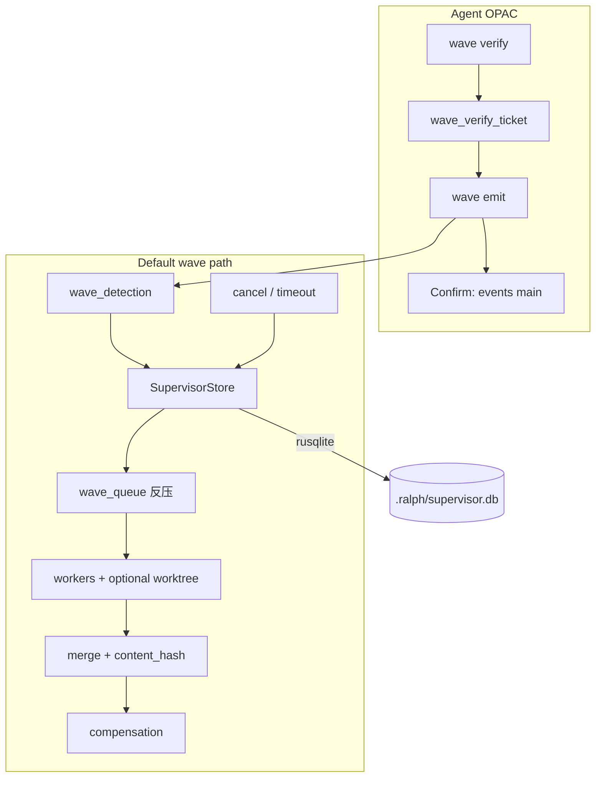
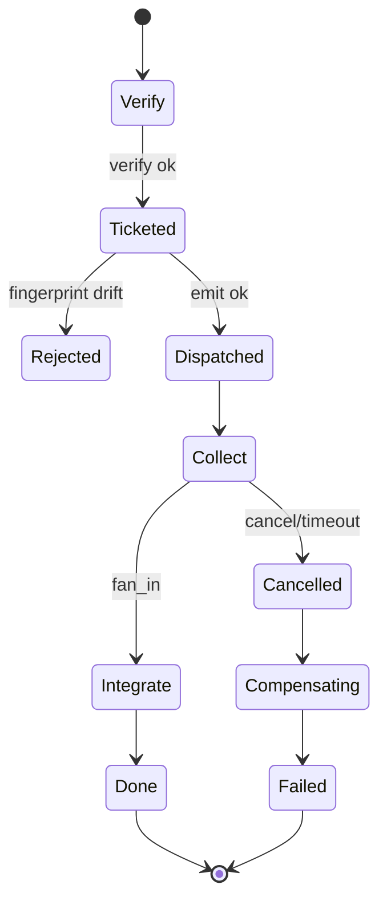

# feat: 默认 Wave 路径吸收协议六件套 + OPAC Precheck/Apply 硬化

## Goal Capsule

- Objective: 让**每一次** `ralph wave` fan-out（不依赖 `supervisor.enabled`）都具备可崩溃恢复、可取消、可反压、可幂等/去重、可补偿的协议能力，并把 wave OPAC 的 **Precheck→Apply 一致性**从 skill 纪律升级为 CLI ticket 硬闸；Apply 后的 Confirm 仍以公开只读证据完成，不把 ticket 消费误称为 Confirm。
- Authority: 本计划 Product Contract + KTDs；冲突时以本计划为准，并显式覆盖 07-03「六件套仅 opt-in supervisor」中与默认路径相关的部分。
- Stop when: Verification Contract 全部绿灯；非目标（P2 fail-fast / 增量 emit / 成本帽 / 改 pipeline 拓扑）未潜入 diff。
- Out of scope reminder: 不把 wave 升为 CE 主路径；不替代 executor 内 subagent。

Product Contract preservation: 本计划为 `ce-plan-bootstrap` 直接规划；会话确认 `1A / 2B / 3A` 已写入 KTDs。

---

## 1. 功能目标

### 业务目标

- 修复默认 wave「有形无实」：进程挂了丢状态、超时后 worker 仍烧 token、无跨 wave 反压、无可靠写隔离、verify 后 payload 可漂移。
- 让只读/写并行 fan-out 在**不显式打开** `ce-executor-supervisor` 时也能获得 Supervisor 六件套语义。
- 把 wave OPAC 的 **Precheck→Apply ticket gate** 做成与 `task_verify_gate` 同级的硬约束，堵住 verify→改 payload→直 emit 漂移窗；Confirm 继续要求 agent 用 `wave emit` 返回的 `wave_id` 经公开只读接口验证，不声称 CLI 能强制 agent 已执行 Confirm。

### 本次范围（P0 + P1，已确认 2B）

| ID | 能力 | 外部可观察结果 |
|----|------|----------------|
| R1 | 默认 wave 走统一协议 store（非仅内存 `WaveTracker` 孤岛） | 任意 preset 触发 wave 时，ledger 可查询 slot/wave 状态 |
| R2 | 状态持久化 + 启动恢复 | 杀进程重启后未完成 wave 可恢复，不重复 inject `*.wave.complete` |
| R3 | 分布式取消 | `cancel` / 超时收摊后 in-flight worker 被终止；不再继续消耗额度 |
| R4 | 跨 wave 反压 | 达 `max_concurrent_workers` 时新 wave 入队，slot 释放后 FIFO 出队 |
| R5 | 幂等键 SSoT | 同 key 重复 `wave emit` / `register_wave` 不二次 spawn |
| R6 | 内容哈希去重 | 同 slot 同 `content_hash` 不重复 merge JSONL |
| R7 | 补偿执行 | failed/timeout/cancelled 后跑补偿 job（至少：记诊断 + 可配置清理 hook），失败不阻塞终态标记 |
| R8 | 写隔离 | `isolation_mode=worktree` 的 wave 每 slot 绑定独立 worktree；shared_readonly 保持共享仓 |
| R9 | Wave Precheck/Apply ticket 硬闸 | agent 上下文：无有效 verify-ticket 禁止 `wave emit`；fingerprint 漂移拒绝；ticket 消费不等于 Confirm 完成 |
| R10 | 可观测性 | `ralph inspect loop` / `ralph diagnose` 在默认路径也能展示 active waves / queue / 缺 slot（agent-safe，不泄 db 路径） |

### 非目标

- 不把 `ce-executor-pipeline` / `-loop` 改成 wave 主拓扑（仍串行 hat + 内部 subagent）。
- 不做 P2：`fail-fast` 可配、`wave start/end` 增量 emit、`max_wave_cost`、subagent/wave 边界 lint 产品化。
- 不把 `events.jsonl` / `tasks.jsonl` 全量迁入 SQL。
- 不交付中文 `ce-executor-supervisor-zh`、Turso/远程 DB、跨 loop 全局 worker pool。
- 不改变「协调 topic（`*.wave.complete`）仅 runtime 注入」契约。

### 已知约束和假设

- 会话确认：架构 **1A**（默认路径吸收六件套）、范围 **2B**（P0+P1）、OPAC 硬化 **3A**（纳入本计划）；术语经复核明确为 Precheck→Apply ticket gate，不宣称技术上强制 Apply 后的 Confirm 动作。
- 覆盖既有决策：07-03 KD-2「六件套仅 `supervisor.enabled`」在**默认 wave 执行路径**上被本计划取代；pipeline **拓扑**零改动承诺仍成立。
- 覆盖 06-27「默认不引入 SQLite」：本计划将 `supervisor-db` 升为 `ralph-cli` **默认 feature**（KTD-2）；无 feature 构建退化为内存 store + 启动 warn，不得静默假装已持久化。
- 假设：现有 `SupervisorStore` / `InMemorySupervisorStore` / `RusqliteSupervisorStore` / `memory_protocol_tests` 是六件套语义 SSOT，默认路径应**复用**而非再写一套 JSON wave-state。
- 假设：未发 wave 的 loop（纯 pipeline）行为与今日一致——不创建空 DB 副作用以外的语义变化；若开店策略要求「首次 wave 才 open DB」，优先该惰性策略。

---

## Product Contract

### Requirements

- R1–R10：见上表。
- R11. 人类 CLI（非 agent context）bypass wave verify ticket，与 task gate 一致。
- R12. Agent 不可 emit 协调 topic；本计划不放松 origin guard。
- R13. Wave 仍必须单次 batch emit（历史教训：禁止每维一次 emit）。
- R14. `crates/ralph-core/data/*.md` / CONCEPTS 与最终 CLI 行为同步：明确 Precheck→Apply ticket 为硬闸、Confirm 为 Apply 后独立阶段；禁止把 ticket 消费写成 Confirm，禁止保留 sidecar、`supervisor.enabled` 可见性或 unsafe bypass 等旧语义。
- R15. 注入 skill 只描述 agent 可执行动作、关键字段来源、公开证据和失败停止条件；不得新增或保留 ticket/DB/sidecar/events 文件路径、内部 store/函数/源码行号、PID/process-group、补偿队列等 agent 不可见实现细节，也不得指导手工修改 `.ralph/` 状态文件。

### Actors

- A1. Dispatcher hat（可 `ralph wave emit`）
- A2. Wave worker（`RALPH_WAVE_WORKER=1`，禁嵌套 wave）
- A3. Aggregator hat（`wait_for_all`）
- A4. Runtime / dispatcher（唯一协调 topic 写入者）
- A5. 人类 operator（bypass wave verify ticket）

### Key Flows

- F1. Precheck（Verify）→ ticket → Apply（Emit）→ Confirm（用 emit 返回的 `wave_id` 调公开只读查询）；ticket 仅约束前两步的一致性
- F2. Fan-out → slot 完成 → fan-in → inject `*.wave.complete`（若拓扑需要）
- F3. 超时/取消 → kill in-flight → 补偿 → 终态可观测
- F4. 进程崩溃 → 重启 → recover → 不重复 complete
- F5. 反压：超并发 → 入队 → 出队再 spawn

### Acceptance Examples

- AE1. Agent：`wave verify` 通过后改动某一 payload 再 `wave emit` → 非 0，提示 fingerprint mismatch。
- AE2. 杀进程于 collect 阶段 → 重启 loop → 同一 `wave_id` 恢复，不二次 spawn 已 completed 且已 merge 的 slot。
- AE3. 达并发上限后再 emit 新 wave → 入队；一 slot 释放后 FIFO 出队 spawn。
- AE4. Cancel 后 worker 进程退出；ledger 标记 cancelled；补偿 job 记一条诊断。
- AE5. 同 `idempotency_key` 二次 emit → 返回原 `wave_id`，`deduplicated=true`，无新 slot。
- AE6. `isolation_mode=worktree` 两 slot 的 cwd 不同且互不写入对方树。
- AE7. 未使用 wave 的 `ce-executor-pipeline` mock/BDD 场景行为与基线一致（回归）。
- AE8. 注入后的 skill 不包含内部 ticket/DB/sidecar/events 路径或源码行号；不把 ticket 消费描述成 Confirm；verify/emit 示例复用同一份 payload 输入。

---

## Planning Contract

### Key Technical Decisions

| ID | 决策 | 理由 |
|----|------|------|
| KTD-1 | **统一热路径**：`execute_wave_structured` 默认走 `SupervisorStore`（废除「enabled 才有六件套」分叉）；`supervisor.enabled` 保留为「全量 supervisor preset 语义」（协调 topic 注入策略、worktree 默认策略、inspect 块）的兼容开关，但 **store/六件套不再依赖它** | 兑现用户 1A；避免双账本 |
| KTD-2 | **持久化**：默认使用 `RusqliteSupervisorStore`；`ralph-cli` 默认启用 `supervisor-db` feature；无 feature 时 InMemory + stderr warn `wave_ledger_ephemeral` | 复用 07-03 SSOT；诚实降级 |
| KTD-3 | **惰性开店**：loop 启动不强制建 DB；**首次 wave 检测或 recover 需要时**再 open；open 失败 → fail-closed（对齐 R-C4），禁止再 fallback 静默 legacy（删除/禁用今日 register 失败回退 legacy 行为） | 修现有不一致；pipeline 无 wave 时零 DB |
| KTD-4 | **幂等 SSoT**：store `idempotency_key` 权威；CLI sidecar 仅作过渡适配或删除（本计划 U5 二选一：优先删除双写，保留一个周期 deprecation warn） | 消除双账本打架 |
| KTD-5 | **Precheck→Apply ticket 硬闸**：新建 `wave_verify_gate`，镜像 `task_verify_gate`（fingerprint = topic + canonical payloads + loop + hat）；内部 ticket 位置属于实现细节，仅 agent context 强制。skill 不得暴露 ticket 路径，也不得把消费 ticket 称为 Confirm | 兑现 3A，同时保持 OPAC 四阶段语义准确 |
| KTD-6 | **写隔离默认**：未声明 `isolation_mode` 时 = `shared_readonly`（保持 v1 review 语义）；仅 hat/wave 显式 `worktree` 才绑 worktree | 避免静默改变只读 review |
| KTD-7 | **补偿**：必须接到 dispatcher 热路径；最小实现 = 写 `diagnostics` 记录 + 可选 hook 命令；补偿失败只记 warn，不阻止 wave 终态 | 补齐半成品 CompensationEntry |
| KTD-8 | **取消**：超时/显式 cancel → store `cancel_wave` + dispatcher kill child PID/process group；与 R6 incomplete gate 共用出口 | 止烧 token |
| KTD-9 | **反压**：复用 `max_concurrent_workers`（配置可挂在 `event_loop.supervisor` 或新 `event_loop.wave` 别名，读取时两者等价）；跨 wave FIFO `wave_queue` | 复用现协议测 |
| KTD-10 | **测试入口**：一律 `cargo nextest`；含 `supervisor-db` 的矩阵进 `./scripts/run-tests.sh` 或等价默认路径 | HARD RULE 1 |

session-settled: user-directed — 1A 默认路径吸收六件套（chosen over 仅完善 opt-in supervisor）
session-settled: user-directed — 2B P0+P1（chosen over 仅 P0 或 P0+P1+P2）
session-settled: user-directed — 3A OPAC 硬化纳入本计划（chosen over 另开计划；实现边界明确为 Precheck→Apply ticket gate，Confirm 仍由公开证据完成）

### High-Level Technical Design





### Assumptions

- `SupervisorStore` 协议测试矩阵可直接作为默认路径契约；差异用 differential 锁定。
- 首次引入默认 rusqlite 时，CI 镜像已能编译 bundled sqlite（现有 `supervisor-db` 路径已验证）。
- Ticket gate 只保证 verify 与 emit 的 topic/payload/loop/hat 一致，不能证明 agent 已执行 Apply 后 Confirm。
- Confirm 的完成证据是：从 `wave emit --output json` 取得 `wave_id`，再通过当前 CLI 提供的公开只读查询确认对应 wave 可见；它只证明本次 wave 已登记，不证明下游 aggregator 已完成。

### Open Questions（非阻塞）

- OQ1. CLI idempotency sidecar：U5 执行时选择「删除」还是「一个版本 deprecation warn」——默认倾向删除双写。
- OQ2. `event_loop.wave.max_concurrent_workers` 是否作为 `supervisor.max_concurrent_workers` 的配置别名写入 schema——实现时选最小 diff。
- OQ3. 补偿 hook 命令的沙箱/超时上限数值——实现时用现有 aggregate_timeout 量级或固定 30s，不必再开产品讨论。

### Scope Boundaries

#### Deferred for later（P2）

- fail-fast 策略可配、`wave start/end`、wave 级成本帽、subagent/wave 产品化 lint、中文 supervisor preset、远程 DB。

#### Outside this product's identity

- 将 CE 主执行改为 wave；禁止 agent 读 `supervisor.db` 当业务输入。

#### Deferred to Follow-Up Work

- 删除所有 legacy `WaveTracker` 类型（本计划可保留为 thin adapter / 测试 shim）。
- `/ce-compound` 运维学习沉淀。

---

## 2. BDD 行为规格

```gherkin
Feature: 默认 Wave 协议六件套与 OPAC Precheck/Apply ticket gate
  作为 dispatcher hat
  我希望 wave 扇出具备可恢复、可取消、可反压的账本
  并且 verify 与 emit 之间的输入漂移不能绕过 ticket gate

  Scenario: OPAC ticket 硬闸 — 无 ticket 拒绝 emit
    Given agent context 且当前 hat 为 dispatcher
    And 未成功执行过匹配的 "ralph wave verify"
    When 执行 "ralph wave emit" 带合法 payloads
    Then 命令以非 0 退出
    And stderr 含稳定前缀 "wave_verify_gate denied"
    And events 主账本无新 wave_id

  Scenario: OPAC ticket 硬闸 — fingerprint 漂移拒绝
    Given agent 已对 payload 集合 P 执行 wave verify 并获得 ticket
    When agent 将 payloads 改为 P' 后执行 wave emit
    Then 命令以非 0 退出
    And ticket 仍存在（未消费）或按设计要求重新 verify
    And 无 worker 被 spawn

  Scenario: OPAC 正常路径 — verify 后 emit 并 Confirm 可见
    Given agent 对 payload 集合 P verify 通过
    When agent 用同一 P 执行 wave emit
    Then stdout/json 返回 wave_id
    And "ralph events --events-source main" 能按 wave_id 过滤到 wave_total 条事件
    And ticket 已被消费

  Scenario: ticket 消费不替代 Confirm
    Given agent 已成功执行匹配的 verify 与 emit
    When agent 仅观察到 emit 成功但尚未按返回的 wave_id 查询
    Then OPAC 仍处于 Confirm 未完成状态
    When 公开只读查询确认该 wave_id 可见
    Then 只确认 wave 已登记，不推断下游 worker 或 aggregator 已完成

  Scenario: 人类 CLI bypass wave verify ticket
    Given 非 agent context
    When 直接 wave emit 合法 payloads
    Then 命令成功且写入 wave 事件

  Scenario: 非法输入 — 空 payloads
    Given dispatcher hat
    When wave verify/emit 不提供任何 payload
    Then 非 0 且提示至少 1 个 payload

  Scenario: 权限 — worker 禁止 wave emit
    Given RALPH_WAVE_WORKER=1 或 hat 非 dispatcher
    When 调用 wave emit
    Then ACL/嵌套检查拒绝

  Scenario: 持久化恢复 — collect 中崩溃
    Given 一 wave 处于 collect 且部分 slot completed
    When runtime 进程被杀死并重新启动同一 loop
    Then recover 恢复该 wave_id
    And 已 merge 的 slot 不重复 merge
    And 未完成 slot 可继续或按策略失败收摊

  Scenario: 反压入队
    Given max_concurrent_workers=1 且已有 1 个 active worker
    When 再 register/emit 新 wave
    Then 新 wave 进入 queue
    And active workers 不超过 1
    When 前一 slot 完成
    Then 队列头 wave 被 dispatch

  Scenario: 取消 in-flight
    Given wave 有 running worker 进程
    When 触发 cancel_wave 或 aggregate timeout 收摊
    Then worker 进程退出
    And ledger 标记 cancelled/failed
    And 补偿 job 被记录（执行成功或 warn）

  Scenario: 幂等键去重
    Given 使用同一 idempotency_key 成功 emit 过
    When 再次 emit 相同 key
    Then 返回同一 wave_id 且 deduplicated=true
    And 不新增 slot/spawn

  Scenario: 内容哈希去重
    Given slot 已 merge 某 content_hash 的结果
    When 再次提交相同 content_hash 的 worker 结果
    Then 不重复追加 JSONL 业务行
    And 诊断可观测 dedup

  Scenario: worktree 写隔离
    Given isolation_mode=worktree 的 exec wave 含 2 slots
    When 两 worker 分别写入文件
    Then 各自写入自己的 worktree_path
    And 不污染对方树（在 merge 前）

  Scenario: 无 wave 的 pipeline 回归
    Given builtin ce-executor-pipeline 场景不触发 wave
    When 跑既有 BDD/workflow 场景
    Then 事件序列与基线一致
    And 不强制出现 supervisor 业务行为变化
```

---

## 3. 验收与测试策略

| Scenario | 验收条件 | 推荐测试层级 | 是否需要 E2E |
| -------- | ---- | ------ | -------- |
| 无 ticket 拒绝 emit | 非 0 + `wave_verify_gate denied` + 无写盘 | 单元（CLI） | 否 |
| fingerprint 漂移 | 非 0 + 无 spawn | 单元 | 否 |
| verify→emit→Confirm 可见 | wave_id 可查 main events | 单元 + 轻集成 | 否 |
| 人类 bypass | 无 ticket 也可 emit | 单元 | 否 |
| 空 payloads | 非 0 | 单元 | 否 |
| worker ACL | Deny | 单元（既有加强） | 否 |
| 崩溃恢复 | recover 后无重复 merge | 集成（store+recover） | 否 |
| 反压入队 | queue depth 与并发上限 | 单元（协议）+ 集成 | 否 |
| 取消 in-flight | 进程退出 + 状态 | 集成（含假进程/fixture） | 否 |
| 幂等键 | deduplicated | 单元 + CLI | 否 |
| content_hash | 不双写 JSONL | 集成 | 否 |
| worktree 隔离 | cwd/path 分离 | 集成 | 否 |
| pipeline 无 wave 回归 | 场景绿 | BDD scenarios | 否（mock BDD） |

额外风险驱动：

- Characterization / Differential：`WaveTracker` 旧路径 vs 新 store 路径关键断言对齐。
- Idempotency / Concurrency：反压 + 双 emit。
- State-machine：wave phase collect→integrate→done / cancelled。
- Fault injection：DB open 失败 fail-closed。

---

## 4. 需求—测试追踪矩阵

| 需求 | Scenario | 验收测试 | 单元测试 | 集成/契约测试 | E2E |
| -- | -------- | ---- | ---- | ------- | --- |
| R9 Confirm | 无 ticket / 漂移 / 正常 / 人类 bypass | `wave_verify_gate` 测 | fingerprint / consume | CLI tempdir emit | — |
| R1 统一 store | 恢复/反压/取消共用 ledger | dispatcher 分支测 | store trait | `wave_supervisor` 扩展到默认 | — |
| R2 持久化 | 崩溃恢复 | recover 测 | rusqlite roundtrip | loop 启动 recover | — |
| R3 取消 | 取消 in-flight | cancel 测 | — | kill fixture | — |
| R4 反压 | 反压入队 | protocol 测 | queue FIFO | dispatcher 集成 | — |
| R5 幂等 | 幂等键 | CLI + store DuplicateKey | sidecar 移除/兼容 | — | — |
| R6 去重 | content_hash | merge 测 | hash 字段 | io merge | — |
| R7 补偿 | 取消后补偿 | compensation 执行测 | job 状态 | dispatcher hook | — |
| R8 写隔离 | worktree | bind 测 | — | 双 slot tmp | — |
| R10 可观测 | inspect 有 wave 摘要 | inspect JSON 断言 | summarize | — | — |
| R14/R15 文档 | skill 与最终 CLI 行为一致且不泄漏内部实现 | 文档契约测试 + `check-cli-doc-drift` + help 冒烟 | 禁词/必备语义断言 | skill 注入测试 | — |
| 回归 | pipeline 无 wave | scenarios | — | `ce_executor_pipeline*` | — |

---

## 5. 严格串行开发单元

执行纪律：Unit N 的验收、相关集成、受影响回归全部绿灯后，才能开始 Unit N+1。禁止并行开发多个 Unit。

### U1. Wave OPAC Precheck→Apply ticket 硬闸（wave_verify_gate）

- Unit 目标：agent 上下文强制 verify→ticket→emit；漂移拒绝；人类 bypass。
- 对应 Scenario：无 ticket / 漂移 / 正常 / 人类 bypass / 空 payloads（与 verify 交互）。
- 外部可观察结果：无匹配 ticket 时 `wave emit` 非 0；成功 emit 后 ticket 消费；`events --events-source main` 可见 wave。
- 输入与输出：输入 = verify 的 topic+payloads；输出 = 内部 one-shot ticket 或 deny。ticket 的物理位置仅属于实现与测试，不进入 agent skill。
- 可依赖的已完成能力：`task_verify_gate` 模式、`wave verify`、`HatCommandPolicy::check_wave_emit`。
- 明确禁止依赖的未来能力：SupervisorStore、持久化、取消、反压。
- 验收测试：`crates/ralph-cli/src/wave_verify_gate.rs`（新）+ `wave.rs` CLI 测。
- 需要拆分的单元测试：fingerprint 稳定性；consume one-shot；loop/hat 不匹配；人类 bypass。
- Red 预期失败原因：emit 路径尚无 `require_ticket`。
- 最小实现范围：`wave_verify_gate.rs`；`wave.rs` verify 成功写 ticket、emit 前检查。**本 Unit 不编辑 data skill**：先固定最终 CLI 契约，避免 U5 改幂等 SSoT、U8 改可观测接口后再次产生半成品文档漂移；所有注入 skill 在 U8 按最终行为一次性收敛。
- 集成验证：tempdir 下 verify→emit→events 过滤。
- 回归范围：既有 `wave.rs` policy/ACL 测；`hat_command_policy` wave 测。
- 完成标准：R9/R11 相关 Scenario 绿；测试证明 ticket gate 与 `--policy-check` 正交，且未把 ticket 消费当作 Confirm 完成。
- 风险与注意事项：ticket 路径勿进 git；与 `--unsafe-no-policy-check` 正交（unsafe 不绕过 ticket，除非显式产品决定——本计划：**不绕过**）。
- Execution note: Implement test-first；先写 deny 用例再接线。

### U2. 默认路径统一到 SupervisorStore（内存）

- Unit 目标：`supervisor_bridge == None` 时也不再独走裸 `WaveTracker` 作为唯一账本；每次 `execute_wave` 使用 `InMemorySupervisorStore`（或等价 facade）注册/记账。
- 对应 Scenario：为后续恢复/反压铺契约；本 Unit 外部可见 = inspect/测试可读取 store snapshot（测试 API）。
- 外部可观察结果：wave 生命周期写入 store phases；legacy 行为用 differential 对齐。
- 输入与输出：DetectedWave → register_wave → slots。
- 可依赖：U1；现有 `SupervisorStore`、`memory_protocol_tests`。
- 禁止依赖：rusqlite 默认开启、cancel 杀进程、补偿执行（可 register 但不要求执行）。
- 验收测试：扩展 `loop_runner/tests/wave.rs` + `wave_supervisor.rs`（enabled false 也有 store）。
- 单元测试：register / fan_in 计数；与旧 WaveTracker 关键断言 differential。
- Red：默认路径仍无 store。
- 最小实现：`dispatcher.rs` 去除「无 bridge 则纯 tracker」；构造 per-loop InMemory store；**删除 register 失败 fallback legacy**（改为错误上抛）。
- 集成验证：既有 wave 测全绿 + 新 store 断言。
- 回归：`event_loop/tests/wave_*.rs`、flow_reliability wave scenarios。
- 完成标准：R1 在内存语义下成立；无行为回退洞。
- 风险：大 diff；保持 shared_readonly 默认，勿引入 worktree。

### U3. 持久化 + 启动恢复（默认 rusqlite）

- Unit 目标：默认 build 可持久化；首次 wave 惰性 open DB；启动 `recover_active_waves`；open 失败 fail-closed。
- 对应 Scenario：崩溃恢复。
- 外部可观察结果：`.ralph/supervisor.db` 在首次 wave 后出现；重启后 wave 状态仍在。
- 可依赖：U2。
- 禁止依赖：补偿执行完整语义（恢复标记即可）、worktree。
- 验收测试：`recover.rs` / rusqlite 测 + CLI 集成「写盘→drop store→reopen→snapshot」。
- 单元测试：migrations；DuplicateKey；merged_to_events 不双 inject。
- Red：默认 feature 未开或 recover 未接到非 supervisor.enabled 路径。
- 最小实现：`ralph-cli` 默认 `supervisor-db`；runner 在任意 wave 路径调用 recover；文档说明。
- 回归：无 wave pipeline scenarios；并行 nextest 下 DB 路径必须 per-tempdir。
- 完成标准：R2 + AE2。
- 风险：CI 时间；双 feature 矩阵收敛为默认 on。
- Execution note: Characterization of recover_active_waves before changing call sites.

### U4. 分布式取消 + 超时收摊杀进程

- Unit 目标：cancel/timeout → store 状态 + 杀 in-flight worker。
- 对应 Scenario：取消 in-flight。
- 外部可观察结果：worker 退出；ledger cancelled/failed；不再产生新业务 emit。
- 可依赖：U2–U3。
- 禁止依赖：补偿执行（本 Unit 可只置 job；U6 执行）、反压队列（可并行概念但代码本 Unit 不实现 queue）。
- 验收测试：dispatcher 集成用短命假 backend / fake PID fixture。
- 单元测试：`cancel_wave` 状态机。
- Red：timeout 只合成事件不杀进程。
- 最小实现：dispatcher 持有 child handles；cancel 路径 kill；与 incomplete wave gate 共用。
- 回归：partial-wave / incomplete_wave scenarios。
- 完成标准：R3。
- 风险：误杀；Unix process group；Windows 非目标可文档化。

### U5. 反压队列 + 幂等 SSoT + content_hash 去重

- Unit 目标：跨 wave FIFO 反压；idempotency 只认 store；merge 去重。
- 对应 Scenario：反压入队、幂等键、content_hash。
- 外部可观察结果：queue_depth；deduplicated；JSONL 无重复 hash 行。
- 可依赖：U2–U4。
- 禁止依赖：补偿、worktree。
- 验收测试：复用/扩展 `memory_protocol_tests`；CLI idempotency 测改为 store；merge io 测。
- Red：超并发仍立刻 spawn；sidecar 与 store 双写不一致。
- 最小实现：接线 `enqueue_wave`/`try_dispatch_next`；移除或 deprecate sidecar；merge 路径读 content_hash。
- 回归：既有 wave emit idempotency 测更新期望。
- 完成标准：R4/R5/R6。
- 风险：配置字段别名文档。

### U6. 补偿执行器接线

- Unit 目标：failed/timeout/cancelled 后执行 compensation_jobs（最小：诊断记录 + 可选命令 hook）。
- 对应 Scenario：取消后补偿。
- 外部可观察结果：diagnostics 或 job 状态 completed/failed_warn；wave 终态仍可达成。
- 可依赖：U4–U5。
- 禁止依赖：worktree 清理以外的业务合并策略。
- 验收测试：job 从 pending→done；hook 失败不阻塞。
- Red：CompensationEntry 仍 dead_code、recover 注释「不跑补偿」。
- 最小实现：dispatcher/coordinator tick 执行队列；本 Unit 记录 agent 可观察的最终状态、公开查询字段和失败停止条件，交由 U8 写入 skill，不写“dispatcher tick / compensation queue”等内部实现。
- 回归：取消场景。
- 完成标准：R7。

### U7. 写隔离 worktree 绑定（显式 isolation_mode）

- Unit 目标：`isolation_mode=worktree` 时 per-slot worktree；默认 shared_readonly 不变。
- 对应 Scenario：worktree 写隔离。
- 外部可观察结果：`RALPH_WAVE_WORKTREE_PATH`；双 slot 文件隔离。
- 可依赖：U2–U3（资源表）；U4 取消时应能拆 worktree（补偿可调清理）。
- 禁止依赖：改 pipeline preset。
- 验收测试：`worktree_bind` + dispatcher 集成。
- Red：默认路径忽略 isolation_mode。
- 最小实现：复用 `supervisor/worktree_bind.rs` 接到默认 store 路径。
- 回归：只读 review 类 wave 测仍共享 cwd。
- 完成标准：R8 + AE6。

### U8. 可观测性 + 文档/CONCEPTS/skill 同步

- Unit 目标：inspect/diagnose 在默认路径展示 wave ledger 摘要；CONCEPTS 补 wave/OPAC/六件套；根据 U1–U7 已通过测试的**最终外部行为**一次性重写受影响 skill，删除旧语义与内部实现泄漏。
- 对应 Scenario：可观测；文档一致性。
- 外部可观察结果：`ralph inspect loop --format json` 含 agent-safe wave/supervisor 摘要（无 db 绝对路径泄露）。
- 可依赖：U2–U7。
- 验收测试：inspect 单测；skill registry 注入测试；文档契约测试；全部相关 `--help` 冒烟；`scripts/check-cli-doc-drift.sh`。
- Red：仅 `supervisor.enabled` 才有摘要。
- 最小实现：`inspect.rs` / `diagnose.rs`；`CONCEPTS.md`；逐文件检查并按下述编辑规格处理 `ralph-tools-wave.md`、`ralph-tools-opac.md`、`ralph-tools.md`、`ralph-tools-cmdref.md`、`ralph-tools-emit.md`。后 3 个文件允许结论为“检查后无需修改”，但必须在 U8 scratch/执行记录中逐文件写明依据，不能静默跳过。
- 回归：OPAC scenarios。
- 完成标准：R10/R14/R15；skill 只包含 agent 可执行的触发条件、命令/动作、关键字段来源、公开证据与失败停止条件；所有禁止内容扫描为零；示例与真实 help/CLI 测试一致。

#### U8-A. skill 修改总原则（写入前门禁）

1. **先代码、后文档**：只有 U1–U7 的相关 CLI/运行时测试已绿，才允许开始编辑 `crates/ralph-core/data/*.md`；skill 不描述尚未落地或仍在 OQ 中的行为。
2. **四阶段不得混写**：统一使用 `Observe → Precheck → Apply → Confirm`。ticket 只约束 Precheck 与 Apply 的输入一致；ticket 被消费不算 Confirm，命令 exit 0 也不单独算 Confirm。
3. **只写 agent 视角**：每条新增规则必须同时回答：何时触发、执行什么命令/动作、topic/payload/wave_id 等字段从哪里取得、失败或证据不一致时何时停止。
4. **公开接口优先**：Confirm 只引用实现完成后真实存在、agent 可调用的只读 CLI；不直接读取 DB、events 文件、marker、sidecar、ticket、diagnostics ledger 或 worktree registry。
5. **不泄漏实现**：禁止写内部模块/函数/trait、源码行号、数据库和 ticket 路径、sidecar 文件名、锁策略、PID/process group、dispatcher tick、补偿队列表、JSONL 合并算法。
6. **不计划化**：禁止出现本计划名称、日期、U-ID、具体 preset 名、事故文档路径或“本次修复”等一次性背景。
7. **失败即停止**：verify 拒绝、fingerprint mismatch、emit 失败、Confirm 查无 wave、inspect warning 或公开状态不一致时，skill 必须明确“停止后续状态变更；修正输入并重新 verify”，不得建议绕过或手工修 ledger。
8. **同源 payload**：所有示例必须让 verify 与 emit 读取同一份未修改输入；禁止先后重建两份看似相同但可能漂移的 JSON。

#### U8-B. `ralph-tools-wave.md` 具体修改规格

按章节执行以下编辑，不做笼统措辞替换：

1. **重写「Wave OPAC 四阶段」表**：
   - Observe：只保留 `ralph inspect loop --format json` 与必要的公开 task 查询；删除内部 ledger 文件名。
   - Precheck：写明把 topic 和完整 payload batch 固化到一个临时输入，通过 `ralph wave verify <TOPIC> --payloads-stdin --output json` 校验；成功后不得改 topic、payload、loop 或 hat。
   - Apply：用同一 topic、同一输入执行 `ralph wave emit ... --output json`；说明 agent context 无匹配 ticket、ticket 已消费、作用域变化或 fingerprint 漂移都会拒绝；`--unsafe-no-policy-check` 不绕过 ticket gate。
   - Confirm：从 Apply JSON 输出取得 `wave_id`，调用实现后确认的公开只读查询验证该 ID 可见；明确这只证明 wave 已登记，不证明 worker/aggregator 完成。
2. **重写 verify→emit 示例**：使用一个保存好的 payload 输入连续喂给 verify 和 emit；捕获 emit JSON 的 `wave_id`；随后演示公开 Confirm。示例不得读取 `.ralph/current-events`、`.ralph/events.jsonl` 或任意 marker。
3. **修订参数和错误表**：以 `ralph wave verify --help`、`ralph wave emit --help` 与 clap 定义为准，补充/更新稳定错误类别：无 ticket、fingerprint mismatch、ticket 作用域不匹配、ticket 已消费、空 payload、worker/hat ACL、Confirm 查无 wave。每项给出 agent 恢复动作和停止条件。
4. **修订幂等说明**：只描述公开契约——相同 scope/key/payload 返回原 `wave_id` 与 `deduplicated=true`，不同 payload 冲突；删除 sidecar 文件名、文件锁、扫 events 补 record 等实现。重复 emit 的 Confirm 使用返回的原 `wave_id`，不得期待新增事件。
5. **修订可观测说明**：删除“仅 `event_loop.supervisor.enabled: true` 才可见”假设；按最终 `inspect loop --format json` 字段写 active wave、queue、slot 缺口和取消/失败状态。字段不存在或带 warning 时停止，不猜 DB 状态。
6. **修订取消/补偿说明**：只告诉 agent 如何从公开状态区分 queued/running/cancelled/failed，以及补偿失败 warning 不改变 wave 已终态的事实；不得出现 child PID、process group、hook runner、队列表或内部 diagnostics 路径。
7. **修订 worktree 说明**：只描述 `isolation_mode=worktree` 时 worker 通过 runtime 提供的公开 cwd/环境取得隔离目录，默认 `shared_readonly` 不允许写；不得让 agent 创建、删除或合并 supervisor 管理的 worktree。
8. **删除现有违规内容**：删除源码函数/行号引用、事件文件解析优先级、current-events/candidate-events 内部落点解释、sidecar 路径、手工删除残留 events 行、直接读取内部 ledger 的 jq 示例。若某项对用户 CLI 必须保留，移到非注入开发文档，本 skill 只保留公开命令。

#### U8-C. `ralph-tools-opac.md` 具体修改规格

1. 将总表的 wave Precheck 从含混的 `wave emit --policy-check` 改为 `ralph wave verify`；Apply 为完全相同输入的 `ralph wave emit`；Confirm 明确路由到 `ralph-tools-wave` 的公开查询。
2. 新增简短的“Wave ticket gate”段，只写行为契约：agent 必须先 verify；topic/payload/loop/hat 任一变化需重新 verify；成功 Apply 消费 ticket；unsafe policy flag 不绕过；人类 CLI bypass。**不写 ticket 路径、哈希算法或内部函数名**。
3. 保留 task gate 与 wave gate 的边界：不得把 task ticket 的配置开关、unsafe recovery bypass 或错误文本机械套到 wave；两者各自以实际 CLI 测试为准。
4. 改写 Observe/supervisor 摘要：默认 wave 路径也可通过 `inspect loop` 看 agent-safe 摘要，不再以 `supervisor.enabled` 为必要条件；只列稳定公开字段。
5. Confirm 通用规则补充：ticket 消费和 exit 0 都只是 Apply 成功证据；wave 必须再以 Apply 返回的 `wave_id` Confirm；查无结果、warning 或状态冲突时停止。
6. 删除 `.ralph-task-verify-ticket` 等 ticket 路径、内部 ledger 名、trait/常量名和源码实现说明；OPAC skill 只教动作，不教 runtime 内部结构。

#### U8-D. 其余 data skill 的逐文件核对

- `ralph-tools.md`：把总入口中的“agent 默认 enforce `--policy-check`”拆清楚，明确 policy precheck 与 wave ticket gate 是两层独立约束；wave 行指向 `ralph-tools-wave`，不复制完整协议。
- `ralph-tools-cmdref.md`：若 wave verify/emit、inspect/diagnose 的参数、JSON 输出或字段发生变化，按 clap/help 更新参数表；若该文件没有相应命令表，记录“无需修改”及 rg/help 证据。
- `ralph-tools-emit.md`：确认单事件 emit 的 ticket/policy/Confirm 规则未被 wave 语义污染；不得把 wave ticket 写成所有 emit 通用 gate。无变化则记录“无需修改”。
- `skill_registry.rs` 相关测试：确认 `ralph-tools-wave` 可按需加载、`ralph-tools-opac` 仍按现有规则自动注入，修改 markdown 不破坏 frontmatter 解析或 hat 可见性。
- `CLAUDE.md` / `AGENTS.md`：当前“允许编辑的文件范围”未显式列出既有 `ralph-tools-opac.md`，实现前必须同步补入两份完全一致的规则，或先取得维护者明确豁免；不得在硬规则存在歧义时直接改该文件。两文件必须保持 byte-equal。

#### U8-E. 防漂移自动化与负面断言

新增/扩展结构化测试或仓库脚本，至少证明：

- 必备语义存在：`wave verify`、同输入 Apply、fingerprint/作用域漂移需重新 verify、ticket one-shot、人类 bypass、unsafe 不绕过、用返回的 `wave_id` Confirm、Confirm 不代表下游完成。
- 禁止语义不存在：ticket/DB/sidecar/events 内部路径、源码 `.rs:NN` 行号、内部函数/trait 名、手工删除/编辑 `.ralph/`、`supervisor.enabled` 是 wave 摘要必要条件、ticket 消费等于 Confirm。
- 示例可执行：从同一个 fixture 输入依次跑 verify 与 emit；改变一条 payload 后 emit 必须失败；重新 verify 后成功；Confirm 能按返回的 `wave_id` 查询。
- 文档参数与 `ralph wave verify --help`、`ralph wave emit --help`、`ralph inspect loop --help`、`ralph diagnose --help` 一致。
- `scripts/check-cli-doc-drift.sh` 覆盖 `wave verify` 与 `wave emit`，不能只检查一个命令标题；如脚本无法检查语义，由上述 Rust/脚本测试补足。

### U9. BDD 场景包 + 全量回归门禁

- Unit 目标：为默认路径六件套增加 `crates/ralph-core/tests/scenarios/`（或 cli 集成）真 runner 场景；跑全量回归。
- 对应 Scenario：全表；pipeline 无 wave 回归。
- 外部可观察结果：新 scenario 文件 + `./scripts/run-tests.sh` 绿。
- 可依赖：U1–U8 全部。
- 禁止依赖：无。
- 验收测试：`run_workflow_guard_scenario`（禁止 stub `run_scenario` 只数 iteration）。
- Red：场景期望事件不存在。
- 最小实现：2–4 个 scenario（confirm gate 可用 CLI 测为主；恢复/反压/取消至少各 1 集成或 BDD）。
- 回归：`ralph-cli` wave*；`ralph-core` scenarios；preset_lint；doctest 按仓库惯例。
- 完成标准：AE1–AE7；最终质量门禁清单全部勾选。

---

## Implementation Units（ce-work 索引）

与上节 U1–U9 一一对应。执行时仅按 Unit 序号串行。

| U-ID | 名称 | 依赖 |
|------|------|------|
| U1 | wave_verify_gate | — |
| U2 | 默认路径 SupervisorStore | U1 |
| U3 | rusqlite 持久化 + recover | U2 |
| U4 | cancel + kill | U2, U3 |
| U5 | 反压 + 幂等 + content_hash | U2, U3, U4 |
| U6 | 补偿执行 | U4, U5 |
| U7 | worktree 隔离 | U2, U3, U4 |
| U8 | inspect + docs/skills | U2–U7 |
| U9 | BDD + 全量回归 | U1–U8 |

### Patterns to follow

- `crates/ralph-cli/src/task_verify_gate.rs` — Precheck→Apply one-shot ticket 模式（只复用行为结构，不复用 Confirm 术语）
- `crates/ralph-core/src/supervisor/memory_protocol_tests.rs` — 六件套契约
- `crates/ralph-cli/src/loop_runner/wave/dispatcher.rs` — `execute_wave_via_supervisor`
- `docs/solutions/integration-issues/ce-executor-wave-emission-must-batch-in-single-emit-2026-06-09.md` — batch emit
- `docs/solutions/2026-06-16-isolated-wave-stability-and-progress-steward.md` — 预算/provenance

---

## Verification Contract

- 单测/集成：`cargo nextest run -p ralph-cli --bin ralph -- wave`
- Store 协议：`cargo nextest run -p ralph-core -- supervisor`
- BDD：`cargo nextest run -p ralph-core --test scenarios -- supervisor` 与新增默认 wave 场景名
- skill registry / 注入：`cargo nextest run -p ralph-core -- skill_registry`
- CLI help 冒烟：`ralph wave verify --help`、`ralph wave emit --help`、`ralph inspect loop --help`、`ralph diagnose --help`
- 文档漂移：`scripts/check-cli-doc-drift.sh`，并运行 U8-E 新增的语义/禁词/示例契约测试；静态脚本通过不能替代行为测试
- 文档源码引用复核：对所有受影响 `crates/ralph-core/data/*.md` 执行 `rg -n '\.rs:[0-9]'`；原则上本次应清零受影响章节的行号引用，确需保留者逐条以 `sed -n` 对照并说明为何属于稳定、agent 可用契约
- 规则同步：若为允许编辑 `ralph-tools-opac.md` 而修改 `CLAUDE.md`，立即同步 `cp CLAUDE.md AGENTS.md`，并以 `cmp -s CLAUDE.md AGENTS.md` 验证完全一致
- 最终：`./scripts/run-tests.sh`（须覆盖默认 `supervisor-db`）
- Lint/format：`cargo clippy`、`cargo fmt`（按仓库惯例）

---

## 6. 最终质量门禁

- [ ] 计划内全部 Scenario 有对应自动化且通过
- [ ] U1–U9 各自完成标准满足；无跨 Unit 未关闭债务
- [ ] 所有单元测试通过（含 wave_verify_gate / store / cancel / dedup）
- [ ] 必要集成与 BDD 通过；**无**新增 `#[ignore]` / 删断言 / 无解释刷新 golden
- [ ] `./scripts/run-tests.sh` 通过
- [ ] clippy / fmt /（如适用）doc 通过
- [ ] skill 与 CONCEPTS 已同步；明确 ticket gate 强制 Precheck→Apply 一致性，而 Confirm 是 Apply 后独立的公开证据检查
- [ ] `ralph-tools-wave.md` 已按 U8-B 八项逐项完成，`ralph-tools-opac.md` 已按 U8-C 六项逐项完成
- [ ] `ralph-tools.md` / `ralph-tools-cmdref.md` / `ralph-tools-emit.md` 已逐文件记录“修改内容”或“无需修改及证据”
- [ ] 注入 skill 无 ticket/DB/sidecar/events 内部路径、源码行号、内部函数/trait、手工修改 `.ralph/` 的建议
- [ ] verify/emit 示例使用同一个 payload fixture，漂移拒绝、重新 verify、Confirm 查询均有可执行测试
- [ ] `CLAUDE.md` 与 `AGENTS.md` 在需要扩充 opac 允许编辑范围时已同步且 byte-equal
- [ ] `ce-executor-pipeline` 无 wave 场景相对基线无回归
- [ ] 未验证内容与剩余风险已记录：P2 全项、Windows 杀进程、补偿 hook 的幂等语义深化、WaveTracker 类型完全删除

### 剩余风险（门禁后仍可接受）

- 默认引入 sqlite 增加二进制体积与 CI 时间。
- 历史「best-effort partial」与强取消并存——aggregator 指令需理解 cancelled slots。
- Confirm 只证明 ledger 写入，不证明下游 aggregator 已跑完。

---

## Definition of Done

- R1–R15 均有测试或文档门禁证明。
- 默认路径不再依赖 `supervisor.enabled` 才能获得六件套。
- OPAC wave Precheck→Apply ticket gate 在 agent context 下不可绕过；skill 不把 ticket 消费误称为 Confirm。
- Apply 后 Confirm 使用公开只读证据，且明确不代表下游 aggregator 已完成。
- 无 P2 范围潜入；无 CE 主路径拓扑改动。

---

## Sources & Research

- `docs/achieved/brainstorms/2026-06-18-supervisor-wave-protocol-upgrade-requirements.md`
- `docs/achieved/plan/2026-07-03-001-feat-supervisor-rusqlite-parallel-preset-plan.md`
- `docs/achieved/brainstorms/2026-07-03-supervisor-rusqlite-parallel-preset-requirements.md`
- `specs/agent-waves/{requirements,design,summary}.md`
- `docs/solutions/2026-06-16-isolated-wave-stability-and-progress-steward.md`
- `docs/solutions/integration-issues/ce-executor-wave-emission-must-batch-in-single-emit-2026-06-09.md`
- `crates/ralph-cli/src/{wave.rs,task_verify_gate.rs,loop_runner/wave/dispatcher.rs}`
- `crates/ralph-core/src/supervisor/*`
- 会话调研：[wave/supervisor 代码](6308163f-fa51-47b3-a328-c0a7301a440a)、[学习库](6f8f9691-3370-4ba3-bfd5-7ca9994165e3)
