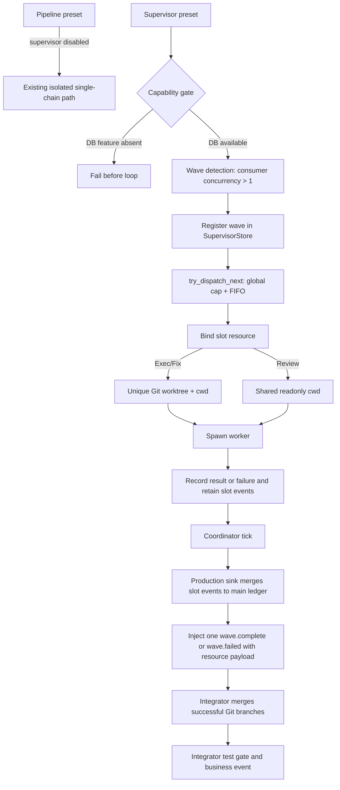
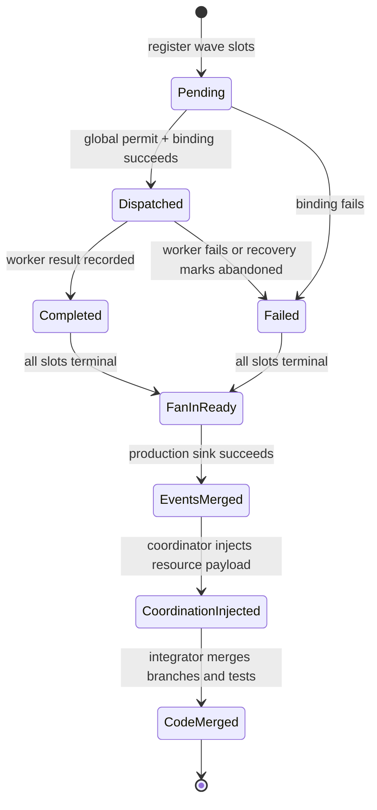
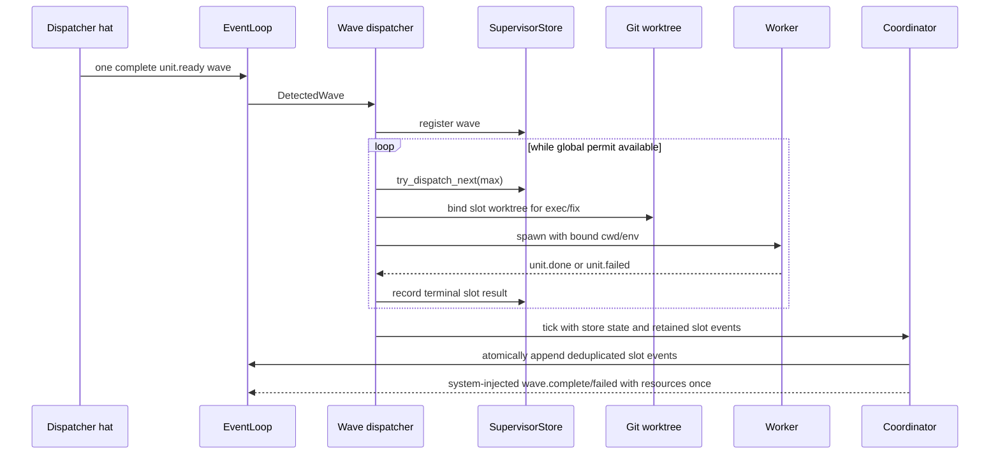

# Supervisor Worktree Dispatch Closure - Plan

## Goal Capsule

- Objective: 修复 `ce-executor-supervisor` 从 wave 识别、SQLite supervisor、slot worktree、全局反压、结果登记、fan-in 到终态事件的生产链路，使 exec/review/fix 并行路径真实可运行。
- Authority: 本计划 Product Contract、会话确认的 KTD、仓库 HARD RULE；发生冲突时，`ce-executor-pipeline` 零行为变化与 supervisor 默认持久化优先。
- Execution profile: 严格执行 `U1 → U2 → U3 → U4 → U5 → U6 → U7 → U8`；每个 Unit 独立完成验收测试、Red、最小实现、Refactor、targeted regression 后才能进入下一 Unit。
- Stop when: Verification Contract 全部通过，真实临时 Git 仓库中可观察到受并发上限约束的独立 slot worktree，完整 supervisor 主路径闭环，所有 pipeline 场景保持原行为。
- Tail ownership: U8 统一收口 agent skill、operator skill、架构规则、诊断报告和 CLI 文档漂移；任何失败或跳过测试必须在完成前清零。

Product Contract preservation: 本计划由已确认的运行诊断与会话约束直接建立；不改变 pipeline 产品契约，不吸收 `docs/plans/2026-07-22-001-feat-wave-protocol-suite-default-plan.md` 的默认 wave 重构范围。

---

## Product Contract

### 1. 功能目标

#### 业务目标

- 让 `event_loop.supervisor.enabled: true` 表示一项可依赖的发布能力：默认安装的 Ralph CLI 自带 SQLite supervisor，并真实执行 per-slot worktree、排队、并发 worker 和 fan-in。
- 让 builtin `ce-executor-supervisor` 的 exec、review、fix 三类 fan-out 都被 runtime 识别为 wave，而不是退化为 isolated 普通事件并丢掉 N-1 条。
- 消除“测试证明 helper/mock 可用，但生产 bridge 没有接线”的假阳性，建立从 CLI 配置到 Git worktree 和终态事件的 Outside-In 证据链。
- 保证 `presets/en/ce-executor-pipeline.yml`、`ce-executor-pipeline-loop` 以及其他未启用 supervisor 的 preset 在拓扑、调度、状态文件、事件和测试结果上零行为变化。

#### 本次范围

- `ralph-cli` 默认启用 `supervisor-db`；显式构建为无该 feature 时，supervisor preset 启动前 fail-closed，禁止内存降级假装具备持久化能力。
- 修复 supervisor DB 相对路径解析，确保默认 `.ralph/supervisor.db` 不会变成 `.ralph/.ralph/supervisor.db`。
- 为 supervisor wave consumer 建立 `concurrency > 1` 的通用 lint 契约，并修复 exec/review/fix 三类 builtin hats。
- 将现有 `bind_slot_worktree` 接入生产 bridge：exec/fix 使用独立 worktree，review 保持 shared-readonly；绑定失败不得回退主工作区写入。
- 将 `max_concurrent_workers` 接入实际跨 wave/slot 调度，使并发上限、FIFO 排队和 slot 状态由 `SupervisorStore` 执行，而非仅由 hat 本地 semaphore 决定。
- 将 worker 成功/失败记录接入 store，并驱动 coordinator tick 注入唯一的 `*.wave.complete` / `*.wave.failed`。
- 将每个 slot 的真实业务事件接入生产 `EventMergeSink`，在 fan-in 时原子写入主 ledger；协调事件载荷公开稳定排序的 branch/worktree 元数据，供 integrator 执行 Git merge，禁止继续以空事件批次或 in-memory sink 充当生产实现。
- 让 runtime 将虚拟 `supervisor` 识别为内部 consumer，避免合法 `*.unit.done` 被 U16 误报为 `task.resume.misrouted`。
- 用真实 runtime/CLI 路径验证 worktree 并发、fan-in、恢复和终态闭环；同步 schema、lint、skills、规则和诊断报告。

#### 非目标

- 不编辑 `presets/en/ce-executor-pipeline.yml` 或 pipeline-loop 的业务拓扑、hat instructions、事件 schema、执行顺序。
- 不把 pipeline 改成 wave/supervisor，也不让未启用 supervisor 的 loop 创建 `supervisor.db`、slot worktree 或 supervisor diagnostics。
- 不实现 `docs/plans/2026-07-22-001-feat-wave-protocol-suite-default-plan.md` 中“所有默认 wave 吸收 supervisor 六件套”的架构重构。
- 不增加新的 builtin preset，不修改 zsh builtin 名称补全，不引入跨 loop 全局 worker pool或远程数据库。
- 不用 live LLM/API 作为 CI 验收；关键 E2E 使用 fake backend、临时 Git 仓库和 replay/mock 响应。

#### 已知约束和假设

- 所有 Rust 测试使用 `cargo nextest run` 或 `./scripts/run-tests.sh`；禁止裸跑 `cargo test -p ralph-cli`。
- spawn `ralph` 的测试使用 `common::ralph_bin()` 或等价 scrub helper，清除所有外层 hat runtime env；另加一次污染环境回归。
- preset/schema 变更必须执行双 crate preset lint、embedded preset parity、BDD 和全量校验。
- `SupervisorStore` 是 wave/slot 状态、幂等、反压和恢复的 SSOT；不得另建旁路 JSON 状态。
- 生产 worktree binding 必须复用 `crates/ralph-core/src/supervisor/worktree_bind.rs` 与现有 `crate::worktree` 能力，不复制 Git worktree 实现。
- 当前 BDD helper `run_bdd_supervisor_fan_in` 手工注册、绑定、dispatch、record 和 tick，只能作为组件场景；它不能证明 CLI 生产 wiring，必须新增更外层验收。

### Requirements

- R1. 未启用 supervisor 的 pipeline preset 不构建 bridge、不创建 supervisor DB/worktree、不改变事件序列或终态。
- R2. 默认构建、cargo install 和 cargo-dist 产物均包含 `supervisor-db`；启用 supervisor 时必须使用 `RusqliteSupervisorStore`。
- R3. 显式无 `supervisor-db` feature 的构建遇到 `supervisor.enabled: true` 必须在 worker 启动前返回明确错误；`supervisor.enabled: false` 仍可正常运行。
- R4. supervisor DB 默认路径唯一解析为 `<workspace>/.ralph/supervisor.db`，绝不重复 `.ralph` 路径段。
- R5. supervisor wave 的目标 worker hat 必须声明 `concurrency > 1`；不满足时 preset lint 返回稳定 finding，runtime 不接受“配置看似启用但永远不进入 wave”的拓扑。
- R6. builtin exec/review/fix 三类 wave consumer 均显式配置 `concurrency: 4`；最终并发为 `min(hat.concurrency, supervisor.max_concurrent_workers)`，wave 大小可以大于 4 并由 store 排队。
- R7. exec/fix 每个 slot 在 spawn 前绑定唯一 Git worktree、branch、cwd 和 `RALPH_WAVE_*` env；review slot 不创建可写 worktree。
- R8. worktree 创建或 store binding 失败时，该 slot 进入失败态并产生可观察失败，不得在主 workspace 无隔离执行。
- R9. supervisor store 实际执行 slot dispatch 与跨 wave FIFO 反压；并发 worker 数不得超过 `max_concurrent_workers`，即使多个 wave 同时就绪。
- R10. 每个 worker 结果只登记一次；成功记录 content hash/event count，失败记录 reason；重复结果不得重复 merge 或重复完成计数。
- R11. fan-in 收齐或达到失败终态后，runtime 先把已去重的 slot 业务事件经生产 sink 原子写入主 ledger，再只注入一次对应协调 topic；协调载荷包含稳定排序的成功 slot branch/worktree 元数据，integrator 据此执行 Git merge 并发出业务事件；禁止 agent emit supervisor 协调 topic。
- R12. 虚拟 supervisor consumer 不经过普通 hat `triggers` 查找，不产生 `task.resume.misrouted`；普通真实 hat 的 U16 校验行为保持不变。
- R13. crash/restart 后从 SQLite 恢复未完成 wave，不重复 spawn 已完成 slot，不重复注入已完成协调事件。
- R14. 关键主路径在临时 Git 仓库用 fake backend 验证：5 个 exec slots、并发上限 4、独立 worktrees、fan-in、`exec.wave.complete`、`work.done`，随后 review/fix/终态按场景闭环。
- R15. 新 lint finding、配置语义、CLI feature 和 agent 可见行为同步到 operator skills、`crates/ralph-core/data/*.md`、`CLAUDE.md`/`AGENTS.md` 与相关 cursor rules。
- R16. 诊断报告必须把“缺 concurrency”“生产 bind_slot 空实现”“未接 store dispatch/result/tick”“生产 sink 仍为空事件/in-memory 实现”“DB feature/path”置于正确因果顺序，删除“内存 store 本身不能 fan-in”的无证据结论。

### Actors

- A1. Pipeline operator：运行 `ce-executor-pipeline`，预期完全不受 supervisor 修复影响。
- A2. Supervisor operator：运行 `ce-executor-supervisor`，不应额外记忆 Cargo feature。
- A3. Dispatcher hat：一次 batch emit 多个 `*.unit.ready` payload。
- A4. Slot worker：在独立 worktree 或 review shared-readonly cwd 中处理一个 slot。
- A5. Supervisor runtime：唯一管理 store、queue、slot lifecycle、fan-in 和协调 topic。
- A6. Integrator/reviewer/fixer：消费 wave 级协调事件并推进业务链。

### 2. BDD 行为规格

```gherkin
Feature: Supervisor preset 真实执行并行 worktree 且不影响 pipeline

  Scenario: 未启用 supervisor 的 pipeline 保持原行为
    Given 使用 builtin ce-executor-pipeline 且 event_loop.supervisor.enabled 为 false
    When loop 走完既有 happy path 与 blocked path
    Then 不构建 supervisor bridge
    And 不创建 supervisor.db 或 slot worktree
    And 事件拓扑、hat 激活顺序和终态与现有基线一致

  Scenario: 默认发布二进制具备 supervisor 持久化能力
    Given 使用默认 Cargo features 构建或安装 ralph-cli
    When 启动 event_loop.supervisor.enabled 为 true 的 isolated preset
    Then runtime 使用 RusqliteSupervisorStore
    And 创建的数据库位于 workspace/.ralph/supervisor.db
    And 不出现 supervisor-db feature off fallback warning

  Scenario: 无 supervisor-db 能力的特殊构建拒绝 supervisor preset
    Given ralph-cli 被显式构建为 no-default-features 且没有 supervisor-db
    When 启动 supervisor.enabled 为 true 的 preset
    Then loop 在任何 worker 或 worktree 启动前失败
    And 错误明确指出该构建不支持 supervisor 持久化
    But supervisor.enabled 为 false 的 pipeline 仍可运行

  Scenario: supervisor wave consumer 缺少并发声明时被 lint 拒绝
    Given supervisor.enabled 为 true 且 dispatcher 发布 exec.unit.ready
    And 唯一消费该 topic 的 worker concurrency 等于 1 或缺省
    When 执行 strict preset check
    Then 返回稳定的 supervisor wave consumer concurrency finding
    And 不允许该 preset 进入 runtime

  Scenario: 五个 exec slots 受全局上限约束地使用独立 worktree
    Given worker concurrency 等于 4 且 supervisor.max_concurrent_workers 等于 4
    And dispatcher 一次 emit 含五个 exec.unit.ready 的完整 wave
    When supervisor 执行该 wave
    Then 同时运行的 slot 不超过 4
    And 每个已启动 slot 的 cwd、branch 和 worktree_path 唯一
    And 第五个 slot 在前四个之一结束后才按 FIFO 启动
    And 主 workspace 在 integrator merge 前不含 slot 写入

  Scenario: worktree binding 失败时禁止回退主 workspace
    Given 一个 exec slot 的 Git worktree 创建失败
    When supervisor 尝试绑定并启动该 slot
    Then 该 slot 被记录为 failed
    And 不启动 cwd 为空或指向主 workspace 的 worker
    And fan-in 最终产生 exec.wave.failed 或明确的业务失败出口

  Scenario: slot 结果驱动唯一 fan-in 协调事件
    Given 一个 exec wave 的全部 slots 已 dispatched
    When 每个 worker 各自返回一次 exec.unit.done
    Then store 的 completed_count 等于 expected_total
    And 各 slot 的真实业务事件按 slot index 稳定排序且只合入主 ledger 一次
    And runtime 只注入一次 exec.wave.complete
    And exec.wave.complete 载荷包含成功 slot 的 branch 和 worktree_path
    And exec-integrator 被激活并发出 work.done
    And 不产生 task.resume.misrouted consumer=supervisor

  Scenario: 重复 slot 结果不重复完成或 merge
    Given 某 slot 的 content_hash 已记录为 completed
    When 相同结果因重试再次到达
    Then completed_count 不增加
    And main ledger 不重复 merge 该结果
    And wave.complete 不重复注入

  Scenario: 主 ledger 写入失败时 fan-in 可恢复且禁止提前合并代码
    Given 全部 slots 已终态但生产 EventMergeSink 写入失败
    When coordinator 执行 fan-in
    Then merged_to_events 保持 false
    And 不注入 wave.complete
    And integrator 不会收到 branch/worktree 合并指令
    When 恢复后使用同一批 slot 事件重试并写入成功
    Then 每个业务事件与 wave.complete 均只出现一次

  Scenario: 崩溃恢复继续未完成 wave
    Given SQLite 中一个五 slot wave 已完成两个、另有两个 dispatched、一个 pending
    When loop 重启并执行 supervisor recovery
    Then 已完成 slots 不被重复 spawn
    And abandoned dispatched slots 按恢复契约处理
    And pending slot 继续受全局并发上限调度
    And 最终协调事件最多出现一次

  Scenario: 完整 supervisor 主路径闭环
    Given fake backend 在临时 Git 仓库提供确定性 exec、review、fix 响应
    When builtin ce-executor-supervisor 运行到结束
    Then exec/review/fix 所需 wave 均真实经过 dispatcher 和 supervisor store
    And 可观察到对应 wave.complete 与业务 handoff
    And required_events 包含 work.done 和 LOOP_COMPLETE
    And loop 以成功终态结束而不是 loop_stale
```

### 3. 验收与测试策略

| Scenario | 验收条件 | 推荐测试层级 | 是否需要 E2E |
| --- | --- | --- | --- |
| Pipeline 保持原行为 | bridge/db/worktree 均未出现；既有事件与终态不变 | characterization + BDD integration | 否，复用真实 EventLoop scenarios |
| 默认发布具备 SQLite supervisor | 默认 features 含 `supervisor-db`，DB 位置正确 | Cargo contract + CLI integration | 是，安装/构建 smoke |
| 无 feature 构建 fail-closed | supervisor 启动前报错，pipeline 正常 | feature-matrix integration | 否 |
| 缺并发声明被 lint 拒绝 | 稳定 finding id、Error severity、action hint | lint unit + preset integration | 否 |
| 5 slots / cap 4 / 独立 worktree | 最大同时 4、路径唯一、第五个排队 | concurrency integration | 是，fake backend + 临时 Git repo |
| binding 失败不回退 | slot failed、worker 未在主目录启动 | fault-injection integration | 否 |
| 唯一 fan-in | completed_count 正确、协调事件一次、无 misrouted | state-machine + EventLoop integration | 是，纳入关键主路径 |
| 重复结果幂等 | 不增计数、不重复 merge/complete | store unit + integration | 否 |
| ledger 写失败可恢复 | 不标 merged、不发 complete；重试后 exactly-once | fault-injection integration | 否 |
| crash/restart 恢复 | completed 不重跑、pending 续调度、complete once | rusqlite recovery integration | 是，进程重启 smoke |
| 完整主路径 | exec/review/fix/terminal 全链真实通过 | mock/replay E2E | 是，保留 1 个关键 E2E |

### 4. 需求—测试追踪矩阵

| 需求 | Scenario | 验收测试 | 单元测试 | 集成/契约测试 | E2E |
| --- | --- | --- | --- | --- | --- |
| R1 | Pipeline 保持原行为 | pipeline happy/blocked event assertions | supervisor gate predicate | existing scenario runner | 不需要 |
| R2–R4 | 默认 SQLite 与路径 | 默认构建启动 supervisor | path resolver | feature matrix + packaging contract | install smoke |
| R5–R6 | 并发声明 | strict lint fixture | supervisor lint positive/negative | embedded preset parse + wave detection | 不需要 |
| R7–R8 | worktree binding | distinct cwd/branch；failure fail-closed | binding factory cases | production bridge + temp Git | exec wave E2E |
| R9 | 全局反压 | 5 slots cap 4 FIFO | memory/rusqlite parity | dispatcher concurrency integration | exec wave E2E |
| R10–R12 | result/fan-in/production sink/U16 | slot events与complete once、载荷可合并、无 misrouted | idempotency + payload ordering + virtual consumer | EventLoop + coordinator + fault injection | exec wave E2E |
| R13 | 恢复 | restart continuation | recovery state transitions | rusqlite reopen | restart smoke |
| R14 | 完整主路径 | required events 与成功终态 | 最小必要单元覆盖 | BDD scenarios | 关键 mock/replay E2E |
| R15–R16 | 文档和诊断一致 | drift/checklist 全绿 | 文档契约测试 | preset review fixture | 不需要 |

### Scope Boundaries

#### Deferred to Follow-Up Work

- 默认非 supervisor wave 统一迁入持久化 store，继续由 `docs/plans/2026-07-22-001-feat-wave-protocol-suite-default-plan.md` 负责。
- supervisor dashboard、跨 loop 全局队列和远程 store 不进入本修复。

#### Outside This Plan

- pipeline preset 的任何拓扑重写、并行化或 prompt 调整。
- live API 性能/质量评估；本计划只证明确定性编排机制。

---

## Planning Contract

### Key Technical Decisions

- KTD-1. Pipeline 是不可触碰的对照组 `(session-settled: user-directed — chosen over 共用 supervisor 热路径改造: 现有 pipeline preset 必须保持全部行为不变)`；所有新逻辑必须由 `supervisor.enabled && execution_mode == isolated` 能力门控，且 U1 先建立非干扰 characterization。
- KTD-2. `supervisor-db` 成为 `ralph-cli` 默认 feature `(session-settled: user-directed — chosen over 由 operator 手工传 --features supervisor-db: 使用 supervisor 时默认就必须可用)`；显式无 feature 构建仍受支持，但只能运行非 supervisor 路径，不能内存降级运行 supervisor preset。
- KTD-3. relative `db_path` 以 workspace 为基准理解；`.ralph/supervisor.db` 解析一次，`supervisor.db` 也归一到 `.ralph/supervisor.db`，避免调用者与 resolver 双重添加 `.ralph`。
- KTD-4. `concurrency > 1` 是 wave 识别的结构化前置条件；supervisor lint 必须从 dispatcher 发布的 `*.unit.ready` 解析目标 consumer，通用检查而非按 builtin 名称硬编码。
- KTD-4a. builtin `worker`、`review-batch-worker`、`fix-worker` 均固定为 `concurrency: 4`；这是本修复的明确配置值，不把选值留给 Executor，也不修改任何 pipeline preset。
- KTD-5. exec/fix 使用 `IsolationMode::Worktree`，review 使用 `SharedReadonly`；生产 bridge 持有创建 binding 所需的 loop/workspace context 与可注入 `WorktreeFactory`，测试 fake 只替换 Git 边界，不替换 store/dispatcher 行为。
- KTD-6. `SupervisorStore::try_dispatch_next(max_concurrent_workers)` 决定全局 slot 启动资格；hat `concurrency` 仍是单 wave 并发上限，实际并发取两者较小值。
- KTD-7. store 是 slot lifecycle SSOT；dispatcher 必须保留每个 slot 的真实事件批次并与 store terminal 结果关联。coordinator 按 slot index 将去重后的事件交给生产 ledger sink，sink 成功后才标记 `merged_to_events` 并注入协调事件；`from_store` 不得在生产路径构造 `InMemoryMergeSink`。
- KTD-7a. supervisor runtime 负责事件 fan-in，integrator hat 负责代码 fan-in。runtime 在 `*.wave.complete` 的 agent 可见 payload 中提供稳定排序的 `slot_index`、`branch`、`worktree_path`；integrator 只能依此合并成功 slots，不能读取 supervisor 内部 DB。代码 merge 失败发业务失败事件，成功且全测通过后才发 `work.done`/对应后续事件；worktree 仅在代码 merge 成功或明确终态清理策略执行后删除。
- KTD-8. 虚拟 supervisor 是 runtime consumer，不是 HatRegistry agent hat；U16 对它走内部 handoff 分支，对所有真实 hats 保留原校验和诊断。
- KTD-9. 生产验收必须跨过真实 CLI/runner/dispatcher/bridge/store/worktree 边界；禁止仅以 `MockSupervisorBridge`、手工 `run_bdd_supervisor_fan_in` 或 source-string assertion 作为完成证据。
- KTD-10. builtin preset schema 仍是事件 schema SSOT；若本次只改 hat concurrency 而事件字段未变，schema 文件记录“检查后无需变更”，但仍运行全部 parity/lint 门禁。

### High-Level Technical Design







### Outside-In Discovery Order

1. 从 operator 看到的 pipeline 零变化和 supervisor 成功/失败启动行为建立外层契约。
2. 从完整 wave batch 是否进入 dispatcher，发现 preset concurrency 与 lint 能力。
3. 从 worker cwd/worktree 的外部证据，发现 production bridge binding。
4. 从同时运行数量和 FIFO 顺序，发现 store dispatch/backpressure 接线。
5. 从协调事件唯一性和 integrator 激活，发现 result recording、tick 与虚拟 handoff。
6. 最后用完整 mock/replay E2E 验证各层协作，不用 E2E 替代低层精确测试。

### Risks and Mitigations

| 风险 | 影响 | 缓解 |
| --- | --- | --- |
| 默认启用 rusqlite 增加构建/发布依赖 | 安装或跨平台产物失败 | U2 覆盖 default build、cargo install shape、cargo-dist targets 与 no-default feature matrix |
| worktree 测试泄漏目录/branch | 污染开发仓库或 flaky | 全部使用临时 Git repo；每测断言 cleanup；失败路径也验证清理 |
| 并发测试依赖时间 sleep | flake | 使用 barrier/channel/有界事件轮询，禁止断言侧裸 sleep |
| 多 wave 反压错误造成饥饿 | slot 永久 pending | memory/rusqlite differential + FIFO state-machine test |
| 特殊处理 virtual supervisor 放松真实 hat 校验 | 权限回归 | 正反配对测试：virtual 接受、普通 misrouted 仍拒绝 |
| E2E fake 继续绕过 production wiring | 假绿 | 禁止调用手工 fan-in helper作为关键 E2E；断言 DB rows、worktree cwd 与生产日志边界 |
| preset 文档与 schema/operator skill 漂移 | 后续 author 再造错误 preset | U3/U8 更新通用 lint finding、rubric、fixtures 和 drift checks |

---

## Implementation Units

### 5. 严格串行开发单元

> 执行顺序固定为 `U1 → U2 → U3 → U4 → U5 → U6 → U7 → U8`。每个 Unit 的 Red、Green、Refactor、集成验证和回归范围全部完成后才能进入下一 Unit。

### U1. 建立 pipeline 零影响 characterization 门禁

- **Unit 目标:** 在修改 supervisor 生产路径前，固定所有 `supervisor.enabled: false` 路径的可观察基线，作为后续每个 Unit 的非回归门禁。
- **对应 Scenario:** 未启用 supervisor 的 pipeline 保持原行为。
- **外部可观察结果:** pipeline happy/blocked 场景事件序列和终态不变；runner 不构建 bridge，不创建 `supervisor.db`、slot worktree 或 supervisor recovery 产物。
- **输入与输出:** 输入为 builtin `ce-executor-pipeline`、`ce-executor-pipeline-loop` 和 supervisor disabled 的最小 wave fixture；输出为既有事件/终态与“无 supervisor 副作用”断言。
- **可依赖的已完成能力:** 现有 pipeline BDD scenarios、`is_supervisor_path_enabled`、临时目录测试设施。
- **明确禁止依赖的未来能力:** 不依赖 U2 默认 feature、U3 concurrency lint、U4 worktree binding 或后续 fan-in 修复。
- **Files:** `crates/ralph-cli/src/loop_runner/tests/wave_supervisor.rs`、`crates/ralph-core/tests/scenarios.rs`、既有 `crates/ralph-core/tests/scenarios/ce_executor_pipeline*.yml`；只增测试，不编辑 pipeline preset YAML。
- **验收测试:** 强化/新增测试，证明 supervisor disabled 时 bridge builder 未调用、`.ralph/supervisor.db` 不存在、`git worktree list` 没有 slot branch；复跑 pipeline happy、blocked、loop reentry 场景并断言既有关键事件集合。
- **需要拆分的单元测试:** capability gate 的四种 enabled/mode 组合；非 supervisor path 的惰性副作用断言。
- **Red 预期失败原因:** 若当前测试只断言 predicate 而没有外部副作用，新增 characterization 会暴露无法观测 bridge construction 的 seam；先补只读计数/fake seam，不改变生产行为。
- **最小实现范围:** 仅增加可靠测试 seam 和 characterization；不得借此重构 runner 或更改任何 preset。
- **TDD 闭环:** 验收测试 Red → 最小测试 seam Green → 去除重复 fixture Refactor → targeted nextest → pipeline scenario regression。
- **集成验证:** `cargo nextest run -p ralph-cli --bin ralph -- wave_supervisor`；`cargo nextest run -p ralph-core --test scenarios -- ce_executor_pipeline`。
- **回归范围:** pipeline、pipeline-loop、普通 legacy WaveTracker 路径。
- **完成标准:** characterization 稳定绿；`git diff -- presets/en/ce-executor-pipeline.yml presets/en/ce-executor-pipeline-loop.yml` 为空；无跳过测试。
- **风险与注意事项:** 不用精确全 JSON snapshot 锁死易变文案，只断言结构化事件、终态与副作用。

### U2. 默认启用 supervisor-db 并修正启动与路径契约

- **Unit 目标:** 让默认发布/安装的 CLI 始终具备 SQLite supervisor，并使特殊无 feature 构建对 supervisor preset fail-closed；修正 DB 相对路径双 `.ralph`。
- **对应 Scenario:** 默认发布二进制具备 supervisor 持久化能力；无 supervisor-db 能力的特殊构建拒绝 supervisor preset。
- **外部可观察结果:** 默认构建启动 supervisor 时生成唯一 `.ralph/supervisor.db`；无 feature 构建在任何 worker 前报错；pipeline 仍无 DB。
- **输入与输出:** 输入为 Cargo default features、`SupervisorConfig.db_path` 与 `LoopContext`；输出为 store 或结构化启动错误。
- **可依赖的已完成能力:** U1 非干扰门禁、现有 `RusqliteSupervisorStore::open` 和 R-C4 runner error path。
- **明确禁止依赖的未来能力:** 不要求 U3–U7 的 wave/worktree/fan-in 已工作；本 Unit 只证明 capability、store 类型和路径。
- **Files:** `crates/ralph-cli/Cargo.toml`、`crates/ralph-cli/src/loop_runner/runner.rs`、`crates/ralph-cli/src/loop_runner/tests/wave_supervisor.rs`、`.github/workflows/ci.yml`、`.github/workflows/release.yml`、`scripts/ci-rust-gate.sh`；必要时更新 dist/build validation 配置。
- **验收测试:** 默认 feature 编译下构建 bridge 并断言 SQLite 文件位于 `<workspace>/.ralph/supervisor.db`；显式 no-default/no-supervisor-db 编译的 contract test 断言 supervisor enabled 报错而 disabled 正常；发布 smoke 断言默认安装无需 feature 参数。
- **需要拆分的单元测试:** DB path normalization 表驱动测试：`supervisor.db`、`.ralph/supervisor.db`、绝对路径、worktree LoopContext；feature gate 的 enabled/disabled 分支。
- **Red 预期失败原因:** 当前 `ralph-cli` 没有 default feature；feature off 会返回可用内存 bridge；`.ralph/supervisor.db` 会被拼成 `.ralph/.ralph/supervisor.db`。
- **最小实现范围:** 设置默认 feature，删除 supervisor enabled 下的内存 fallback，集中修正 path resolver；不改变 `InMemorySupervisorStore` 的测试/BDD用途。
- **TDD 闭环:** feature/path contract Red → 默认 feature 与 fail-closed Green → 提取单一 path normalization Refactor → feature matrix nextest/build → U1 pipeline regression。
- **集成验证:** 默认与 no-default feature 矩阵使用 nextest/build contract；CI 入口验证 cargo install/dist 默认 feature。
- **回归范围:** U1 全部；`cargo nextest run -p ralph-cli --bin ralph -- build_supervisor_bridge`；rusqlite store tests。
- **完成标准:** 默认产物有 DB 能力、特殊构建错误清晰、路径无重复、pipeline 无新副作用。
- **风险与注意事项:** CI 仍有裸 `cargo test` 历史命令时，本计划只允许将涉及测试入口同步为 nextest；不得新增违反 HARD RULE 的命令。

### U3. 用通用 lint 保证 supervisor wave consumer 可并发识别

- **Unit 目标:** 防止 supervisor dispatcher 发布完整 wave，但目标 consumer 因缺省 `concurrency: 1` 被 runtime 当普通 isolated 事件处理。
- **对应 Scenario:** supervisor wave consumer 缺少并发声明时被 lint 拒绝。
- **外部可观察结果:** 非法 preset strict lint 返回稳定 Error finding；builtin supervisor 的 worker、review-batch-worker、fix-worker 通过 lint并被 wave detector识别。
- **输入与输出:** 输入为 supervisor-enabled raw YAML/parsed config；输出为 finding 或合法 wave consumer topology。
- **可依赖的已完成能力:** U1、U2；现有 `check_supervisor_rules`、wave partition/detection 和 preset schema merge。
- **明确禁止依赖的未来能力:** 不依赖 worktree binding、store dispatch 或 fan-in；本 Unit 的验收截止在 wave 被正确分区/检测。
- **Files:** `crates/ralph-core/src/preset_lint/supervisor.rs`、`crates/ralph-core/src/preset_lint/finding_id.rs`、`crates/ralph-core/src/preset_lint/supervisor_preset_test.rs`、相关 lint fixture/tests、`presets/en/ce-executor-supervisor.yml`、检查 `presets/schemas/ce-executor-supervisor.yml`、`skills/ralph-preset-common/references/finding-rubric.md`、`skills/ralph-preset-common/references/author-checklist.md`。
- **验收测试:** 通用负例包含 dispatcher `publishes: exec.unit.ready` 与 consumer 缺/等于 1；边界 `concurrency: 2` 通过；非 supervisor wave/pipeline 不被新 finding 误伤；builtin 三类 consumer 结构化断言并通过 `detect_all_wave_events_capped` 完整 batch。
- **需要拆分的单元测试:** topic→consumer解析、缺 consumer、多个 consumer、concurrency 0/1/2、review/fix topic族、supervisor disabled N/A。
- **Red 预期失败原因:** 当前 lint 仅检查 isolated、integrator trigger 和协调 topic；builtin 三个 worker 均缺 concurrency，默认值为 1。
- **最小实现范围:** 新增一个稳定 finding 和结构化检查；为三个 worker hats明确配置`concurrency: 4`；不改 instructions 文案或事件字段。
- **TDD 闭环:** lint/检测验收 Red → finding + preset concurrency Green → 合并 topic族解析 Refactor → preset lint/parity → U1/U2 回归。
- **集成验证:** `cargo nextest run -p ralph-cli --bin ralph -- preset_lint`；`cargo nextest run -p ralph-core -- preset_lint`；`cargo nextest run -p ralph-cli --bin ralph -- presets`。
- **回归范围:** pipeline strict lint、所有 builtin presets、wave detection、operator negative fixture。
- **完成标准:** 三类 wave consumer 均可被 runtime 检测；错误拓扑启动前失败；schema 检查结论记录且 parity 全绿。
- **风险与注意事项:** 不写只校验 YAML 文本包含某字符串的测试；必须解析结构和验证行为。

### U4. 接通生产 per-slot worktree binding 并 fail-closed

- **Unit 目标:** 让 production `CoordinatorSupervisorBridge::bind_slot` 真正调用 worktree helper、写入 store binding，并把 cwd/env 交给 worker。
- **对应 Scenario:** 五个 exec slots 使用独立 worktree；worktree binding 失败时禁止回退主 workspace。
- **外部可观察结果:** exec/fix 返回非空且唯一 binding，review 返回 shared-readonly；worker cwd 与 binding 一致；失败 slot 不 spawn。
- **输入与输出:** 输入为 loop id、workspace/repo root、wave kind/id、slot index；输出为 `SlotBinding` 或 typed failure。
- **可依赖的已完成能力:** U1–U3、`bind_slot_worktree`、`DefaultWorktreeFactory`、`SupervisorStore::bind_worktree`、dispatcher `WorkerRequest.cwd`。
- **明确禁止依赖的未来能力:** 不等待 U5 的全局反压或 U6 fan-in；可用单 wave/单 slot独立验收 binding。
- **Files:** `crates/ralph-cli/src/loop_runner/wave/supervisor_bridge.rs`、`crates/ralph-cli/src/loop_runner/runner.rs`、`crates/ralph-cli/src/loop_runner/wave/dispatcher.rs`、`crates/ralph-core/src/supervisor/worktree_bind.rs`、`crates/ralph-cli/src/loop_runner/tests/wave_supervisor.rs`；必要时新增专用 integration test 文件。
- **验收测试:** 临时 Git repo 中两个 exec slots 获得不同 branch/path/cwd；fix 同理；review 不创建 worktree；注入 factory failure 时 store 记录失败、ProductionExecutor 未调用、主 workspace 无写入。
- **需要拆分的单元测试:** wave kind→isolation mapping；loop/wave/slot branch命名；binding env一致性；重复 bind 幂等；失败清理。
- **Red 预期失败原因:** 当前 production `bind_slot` 对所有 kind 直接 `Ok(None)`，现有测试甚至把该空实现断言为预期。
- **最小实现范围:** bridge 持有必要 context/factory并调用现有 helper；dispatcher 对 exec/fix `None` 或 bind error fail-closed；更新错误预期测试，不扩展 Git worktree模块职责。
- **TDD 闭环:** production bridge integration Red → real binding Green → 提取构造依赖 Refactor → temp Git integration → U1–U3 regression。
- **集成验证:** nextest targeted supervisor bridge/worktree tests；测试结束断言 worktree和branch清理。
- **回归范围:** legacy WaveTracker、review shared-readonly、外层 `ralph run --worktree`（与 per-slot worktree 区分）、pipeline。
- **完成标准:** 不再存在“生产 Exec/Fix 返回 None 是合法默认”的测试或路径；失败绝不落主 cwd。
- **风险与注意事项:** 测试不得在当前开发仓库创建 worktree；必须使用 temp repo和 fake factory边界。

### U5. 将全局反压与 slot dispatch 接入 SupervisorStore

- **Unit 目标:** 让 `max_concurrent_workers` 真正限制跨 wave/slot 并发，并使 pending slots 通过 FIFO 获得启动资格。
- **对应 Scenario:** 五个 exec slots 受全局上限约束地使用独立 worktree。
- **外部可观察结果:** cap=4 时最多四个 worker同时运行，第五个保持 pending并在 permit释放后启动；多个 wave间仍按 FIFO。
- **输入与输出:** 输入为已注册/绑定 slots和全局并发上限；输出为 store批准的 `(wave_id, slot_index)` dispatch序列。
- **可依赖的已完成能力:** U1–U4，特别是已绑定worktree的可调度slots。
- **明确禁止依赖的未来能力:** 不要求 fan-in协调事件已实现；worker可由barrier-controlled fake executor完成。
- **Files:** `crates/ralph-cli/src/loop_runner/wave/dispatcher.rs`、`crates/ralph-cli/src/loop_runner/wave/supervisor_bridge.rs`、`crates/ralph-core/src/supervisor/bridge.rs`、memory/rusqlite store tests、`crates/ralph-cli/src/loop_runner/tests/wave_supervisor.rs`。
- **验收测试:** barrier控制的5-slot cap4测试；两个waves交错入队的FIFO测试；hat concurrency小于global cap时取较小值；cap边界1；取消/失败释放全局permit。
- **需要拆分的单元测试:** effective concurrency计算；`try_dispatch_next` None/Some；slot从Pending→Dispatched合法迁移；memory/rusqlite differential。
- **Red 预期失败原因:** 当前 runner只打印 `max_concurrent_workers`；生产dispatcher不调用 `try_dispatch_next`，只用hat concurrency构造本地worker requests。
- **最小实现范围:** 把global cap传入bridge/dispatch context，由store批准后才spawn；不重写worker executor或store schema。
- **TDD 闭环:** concurrency验收 Red → store-gated dispatch Green → 合并重复permit逻辑 Refactor → differential/integration → U1–U4 regression。
- **集成验证:** nextest memory/rusqlite supervisor protocol + dispatcher barrier tests。
- **回归范围:** per-wave timeout、global deadline、partial wave、legacy WaveTracker、pipeline。
- **完成标准:** 所有生产spawn均可追溯到一次store dispatch批准；没有仅日志可见但未使用的max配置。
- **风险与注意事项:** 不使用时间睡眠判断并发；用channel/barrier记录最大in-flight和启动顺序。

### U6. 接通真实事件 fan-in、结果登记与虚拟 supervisor handoff

- **Unit 目标:** 将worker join结果及其真实事件批次登记到fan-in上下文，使用生产ledger sink按稳定顺序合并事件，驱动coordinator产生含slot资源的唯一协调事件，并消除virtual supervisor的U16误路由。
- **对应 Scenario:** slot结果驱动唯一fan-in协调事件；重复slot结果不重复完成或merge；主ledger写入失败时fan-in可恢复且禁止提前合并代码。
- **外部可观察结果:** store计数正确；主ledger包含每个成功slot的业务事件且无重复；complete/failed只注入一次且payload可指导Git merge；integrator被激活；无`task.resume.misrouted consumer=supervisor`。
- **输入与输出:** 输入为每slot成功事件批次/content hash或失败reason以及slot资源；输出为store terminal状态、主ledger事件和system-injected协调事件payload。
- **可依赖的已完成能力:** U1–U5、现有`SupervisorCoordinator::tick`、wave merge layer、origin guard、U4已登记的slot resources。
- **明确禁止依赖的未来能力:** 不依赖U7完整16-hat E2E；使用最小exec topology即可验收。
- **Files:** `crates/ralph-cli/src/loop_runner/wave/dispatcher.rs`、`crates/ralph-cli/src/loop_runner/wave/supervisor_bridge.rs`、`crates/ralph-core/src/supervisor/coordinator.rs`、`crates/ralph-core/src/event_loop/mod.rs`、handoff index相关tests、`crates/ralph-cli/src/loop_runner/tests/wave_supervisor.rs`。
- **验收测试:** 成功N/N→slot事件按index稳定写入且单次`exec.wave.complete`；payload列出成功slot的branch/path；含失败且全部terminal→契约规定的complete/failed及blocking slots；重复record/tick幂等；sink首次失败不标merged/不发complete、恢复重试exactly-once；virtual supervisor不报misrouted；普通真实consumer缺trigger仍报U16。
- **需要拆分的单元测试:** join outcome→record API与事件批次映射；content hash稳定性；slot事件排序/去重；resource payload排序与字段完整性；production sink append失败状态转换；tick action→system event；coordination injection dedup；virtual consumer predicate正反例。
- **Red 预期失败原因:** 当前dispatcher从未调用`record_slot_result`/`record_slot_failure`，源码只有注释提到不存在的`run_supervisor_fan_in`；coordinator向sink提交空`Vec<Event>`，production bridge的`from_store`仍使用`InMemoryMergeSink`，协调action不携带worktree资源；event loop把supervisor当普通hat查registry。
- **最小实现范围:** 在现有structured outcome边界保留slot事件、登记store并tick；为production bridge注入主ledger sink；扩展协调action/payload承载稳定排序的成功slot资源；复用origin/system_injected路径；对virtual supervisor做窄特判，不放宽普通hat规则。不得在本Unit自动执行Git merge，代码fan-in仍由integrator消费公开payload完成。
- **TDD 闭环:** minimal topology与非空sink验收 Red → record/event merge/tick/payload/virtual route Green → 统一成功失败与排序逻辑 Refactor → sink fault injection和真实EventLoop integration → U1–U5 regression。
- **集成验证:** nextest targeted dispatcher/coordinator/handoff；真实EventLoop runner断言events而非仅iteration数。
- **回归范围:** origin guard、task.resume misrouting、协调topic agent拒收、legacy wave merge、pipeline。
- **完成标准:** fan-in由生产store状态触发；不存在生产空事件batch或in-memory sink；slot事件与协调事件exactly-once；integrator只依赖agent可见payload即可确定待合并branches；U16无假阳性且无权限放宽。
- **风险与注意事项:** 明确store terminal、主ledger append、`merged_to_events`和协调事件的顺序；若现有JSONL API不能原子提交slot事件与协调事件，必须用幂等键/恢复测试证明崩溃窗口不会重复或丢失，不得以注释代替保证。

### U7. 用真实生产路径闭合恢复与完整 supervisor 主流程

- **Unit 目标:** 建立少量关键Outside-In E2E，证明builtin preset从exec fan-out到终态真实经过dispatcher/SQLite/worktree/fan-in，而不是BDD helper手工模拟。
- **对应 Scenario:** 崩溃恢复继续未完成wave；完整supervisor主路径闭环。
- **外部可观察结果:** temp repo出现受控slot worktrees和SQLite状态；exec/review/fix协调事件及业务handoff完整；required events满足；loop成功结束。
- **输入与输出:** 输入为builtin preset、deterministic fake backend、5-unit plan和可选review/fix分支；输出为Git提交/merge结果、events、DB可公开派生状态和终态。
- **可依赖的已完成能力:** U1–U6全部能力。
- **明确禁止依赖的未来能力:** 不依赖U8文档修正；不得继续使用`run_bdd_supervisor_fan_in`替代production runner。
- **Files:** `crates/ralph-cli` integration test适当位置、`crates/ralph-core/tests/scenarios/supervisor/*.yml`与`scenarios.rs`（组件BDD保留但标清边界）、必要的`crates/ralph-e2e` mock fixture；不新增live API测试。
- **验收测试:** 5 exec slots/cap4/worktree唯一；slot事件真实进入主ledger；coordination payload驱动integrator合并全部成功branches并在全测后发`work.done`；review六维shared-readonly；有finding时fix worktrees及对应代码合并；无finding时合法skip；进程中断后重启不重跑completed slot；成功终态；binding/store/sink/tick/Git merge fault各有失败恢复出口；终态后无泄漏worktree/branch。
- **需要拆分的单元测试:** 本Unit不新增无业务价值的细碎单测；若E2E暴露新状态转换，先回到所属U4–U6测试层补最小Red，再恢复本Unit。
- **Red 预期失败原因:** 当前builtin缺concurrency、production binding为空、store dispatch/result/tick未接线；现有BDD通过手工helper绕开这些缺口。
- **最小实现范围:** 只新增/调整fixture和必要测试基础设施；若生产缺陷已由U1–U6修完，本Unit不再改生产行为。
- **TDD 闭环:** 主路径E2E Red → 仅补测试基础设施/修复遗漏Green → 精简重复fixture Refactor → crash recovery与fault tests → 全部targeted regression。
- **集成验证:** `cargo nextest run -p ralph-core --test scenarios -- supervisor`；对应`ralph-cli` integration nextest；`cargo run -p ralph-e2e -- --mock`若fixture归属E2E crate。
- **回归范围:** 全部supervisor scenarios、pipeline scenarios、smoke/replay、agent env污染复跑。
- **完成标准:** 关键E2E不用手工fan-in helper且稳定绿；能从外部证据证明真实worktree并发和SQLite恢复；无loop_stale。
- **风险与注意事项:** E2E只保留覆盖跨层契约的少量场景，具体边界仍由低层测试负责；避免把所有Scenario堆成E2E。

### U8. 同步agent/operator文档并纠正诊断报告

- **Unit 目标:** 让agent指南、preset operator规则、项目硬规则和诊断报告与最终生产行为一致，防止错误根因和错误preset再次出现。
- **对应 Scenario:** 所有Scenario的文档/审计可发现对应违规，尤其是缺concurrency、无DB能力和内部ledger边界。
- **外部可观察结果:** 新lint finding在rubric/fixtures可查；CLI/skill示例与help一致；报告P0因果链按真实断点排序；`CLAUDE.md`与`AGENTS.md`完全一致。
- **输入与输出:** 输入为U1–U7最终行为、help输出、lint IDs和测试证据；输出为同步文档与修订报告。
- **可依赖的已完成能力:** U1–U7全部完成并验证。
- **明确禁止依赖的未来能力:** 不把计划编号、一次事故路径、特定builtin名称或源码内部函数写入通用注入skill。
- **Files:** `crates/ralph-core/data/ralph-tools-wave.md`及确有agent可见变化的相关guides、`skills/ralph-preset-common/references/{agent-native-model,author-checklist,commands,finding-rubric,patterns}.md`、`skills/ralph-preset-{author,review}/SKILL.md`与fixtures、`.cursor/rules/{multi-hat-isolation,feature-flags}.mdc`、`CLAUDE.md`、`AGENTS.md`、`docs/report/2026-07-22-ce-executor-supervisor-primary-20260722-084810-diagnosis.md`。
- **验收测试:** operator negative fixture缺concurrency时报新finding；commands与`ralph <cmd> --help`一致；注入skill说明触发条件/动作/字段来源/失败停止且无内部ledger路径依赖；报告明确区分根因、下游症状和已推翻假设。
- **需要拆分的单元测试:** 文档契约/drift检查；`CLAUDE.md`/`AGENTS.md`字节一致；finding ID rubric parity。
- **Red 预期失败原因:** 当前报告遗漏production bind/dispatch/result/tick断点并把feature-off内存store误判为fan-in根因；项目规则仍写 supervisor需手工feature；operator checklist未检查consumer concurrency。
- **最小实现范围:** 只同步最终已实现行为；不提前文档化未来默认wave重构；preset名称列表未变，不改zsh补全。
- **TDD 闭环:** 文档/fixture contract Red → 同步Green → 去事故化/去实现细节Refactor → drift与fixture验收 → 全量回归。
- **集成验证:** `scripts/check-cli-doc-drift.sh`；preset review negative fixture流程；skill契约测试；`cmp CLAUDE.md AGENTS.md`。
- **回归范围:** 所有operator skill fixtures、agent reference tests、preset lint/parity、U1 pipeline门禁。
- **完成标准:** 文档无漂移；报告不再误导；所有人类输出中文；未编辑runtime状态文件。
- **风险与注意事项:** `crates/ralph-core/data/*.md`只写agent下一步可执行内容，不泄漏内部DB/store/函数/行号；实现背景留在开发文档与报告。

---

## Verification Contract

### Unit-level TDD Gate

每个Unit都必须按以下顺序关闭，不能把失败、边界或测试债务推给后续Unit：

1. 写或启用本Unit验收测试。
2. 运行并确认因目标能力缺失而Red，排除fixture/环境错误。
3. 将缺失能力拆成最小单元/状态机/契约测试。
4. 逐个Red→Green→Refactor，不削弱断言、不跳过、不加`.only`、不无解释更新snapshot/golden。
5. 运行本Unit集成测试。
6. 运行U1 pipeline非干扰门禁和所有已完成前置Units回归。
7. 记录可观察证据并满足Unit完成标准。
8. 才能进入下一个Unit。

### Risk-driven Test Selection

- Characterization: U1固定pipeline现状。
- Contract: U2 Cargo feature/发布产物，U3 preset lint/schema，U8 CLI/skills。
- State-machine: U5 slot dispatch与U6 fan-in。
- Idempotency/Concurrency: U5跨wave cap/FIFO，U6重复结果/complete once。
- Fault injection: U4 worktree创建失败，U6 store/merge边界，U7 restart。
- Differential: memory与rusqlite store对同一dispatch/fan-in序列输出一致。
- E2E: 仅U7关键supervisor主路径与restart；pipeline用既有EventLoop BDD而非重复E2E。

### Required Commands and Gates

| Gate | Command | Timing | Pass condition |
| --- | --- | --- | --- |
| Pipeline characterization | `cargo nextest run -p ralph-core --test scenarios -- ce_executor_pipeline` | 每个Unit | 全绿且事件/终态无差异 |
| Supervisor targeted | `cargo nextest run -p ralph-cli --bin ralph -- wave_supervisor` | U2–U7 | targeted tests全绿 |
| Supervisor core | `cargo nextest run -p ralph-core -- supervisor` | U3–U7 | store/coordinator/lint全绿 |
| Preset lint CLI | `cargo nextest run -p ralph-cli --bin ralph -- preset_lint` | U3/U8 | 全绿 |
| Preset lint core | `cargo nextest run -p ralph-core -- preset_lint` | U3/U8 | 全绿 |
| Embedded preset parity | `cargo nextest run -p ralph-cli --bin ralph -- presets` | U3/U8 | manifest/schema/strict lint全绿 |
| BDD supervisor | `cargo nextest run -p ralph-core --test scenarios -- supervisor` | U6/U7 | 真实EventLoop场景全绿 |
| Mock E2E | `cargo run -p ralph-e2e -- --mock` | U7/最终 | 全绿 |
| Agent env污染 | 带`RALPH_CURRENT_HAT`等污染运行相关`cargo nextest` integration | U7 | scrub后行为不变 |
| CLI doc drift | `scripts/check-cli-doc-drift.sh` | U8/最终 | 无新增drift |
| Formatting | `cargo fmt --all -- --check` | 每个实现Unit | 无diff |
| Lint/build | `cargo clippy --all-targets --all-features -- -D warnings`与默认feature build | 最终 | 全绿 |
| Full baseline | `./scripts/run-tests.sh` | 最终 | nextest+doctest全绿；若仅竞态flake，按规则serial fallback确认 |

### 6. 最终质量门禁

- 所有计划内BDD Scenario通过，需求—测试矩阵无空白。
- 所有单元、状态机、契约、集成和少量关键E2E通过。
- 默认feature、no-default特殊构建、cargo install/cargo-dist发布路径均验证。
- 真实temp Git repo证明worktree隔离、cap=4反压、FIFO、非空事件fan-in、协调payload驱动的Git branch合并和cleanup。
- pipeline/pipeline-loop所有既有结构化场景通过，且相关preset文件无修改。
- preset lint、schema parity、embedded presets、AAF/operator fixtures通过。
- fmt、clippy、build、CLI doc drift、全量`./scripts/run-tests.sh`通过。
- 没有新增失败/ignored/skipped测试，没有`.only`，没有削弱断言或用mock绕过关键生产边界。
- 没有遗留实验代码、临时worktree/branch、DB、events或其他ephemeral文件。
- `CLAUDE.md`与`AGENTS.md`完全一致，agent skill符合可读性与去计划化规则。
- 未验证内容和剩余风险明确记录；任何P0/P1 residual都会阻止完成。

---

## Definition of Done

- U1–U8严格按顺序分别完成TDD闭环与回归，不存在交替开发或后置测试债务。
- 默认Ralph CLI运行supervisor preset时无需额外Cargo feature参数，SQLite路径正确且启动失败策略明确。
- builtin supervisor三类wave均可识别；exec/fix有真实per-slot worktree，review shared-readonly。
- 全局反压、slot状态、结果幂等、生产ledger fan-in、协调topic、Git branch合并交接与crash recovery由真实生产链路闭合。
- 完整mock/replay主路径成功结束，`work.done`与`LOOP_COMPLETE`满足，未出现`loop_stale`或virtual-supervisor misrouting。
- pipeline preset与所有未启用supervisor的行为、拓扑、状态副作用和测试基线保持不变。
- 文档、skills、lint rubric、schema检查与诊断报告反映最终真实行为。
- 所有废弃尝试、旁路helper、与最终设计冲突的旧测试假设和误导性注释已删除或重写；工作树只包含本计划授权的持久改动。

---

## Sources and Research

- `docs/report/2026-07-22-ce-executor-supervisor-primary-20260722-084810-diagnosis.md`：运行账本、loop_stale与原始P0判断；本计划纠正其根因排序。
- `docs/achieved/plan/2026-07-03-001-feat-supervisor-rusqlite-parallel-preset-plan.md`：原始SupervisorStore、worktree、反压和fan-in契约。
- `docs/solutions/integration-issues/ce-executor-wave-emission-must-batch-in-single-emit-2026-06-09.md`：wave必须单次batch emit的历史约束。
- `docs/solutions/integration-issues/ce-executor-isolated-preset-dispatch-gap-plan-gate-executor-2026-06-12.md`：preset/runtime双层断点与真实路径验收经验。
- `crates/ralph-core/src/event_loop/mod.rs`：wave partition仅接受consumer concurrency>1；U16普通hat校验。
- `crates/ralph-cli/src/loop_runner/wave/supervisor_bridge.rs`：当前production `bind_slot`为空实现，store方法存在但热路径未闭合。
- `crates/ralph-cli/src/loop_runner/wave/dispatcher.rs`：当前supervisor分支注册wave但未使用store dispatch/result/tick。
- `crates/ralph-core/src/supervisor/{memory,rusqlite,coordinator,worktree_bind}.rs`：可复用SSOT与差分测试基础。
- `presets/en/ce-executor-supervisor.yml`：三类wave consumer当前缺并发配置。
- `crates/ralph-cli/Cargo.toml`与发布工作流：`supervisor-db`当前非默认feature。
