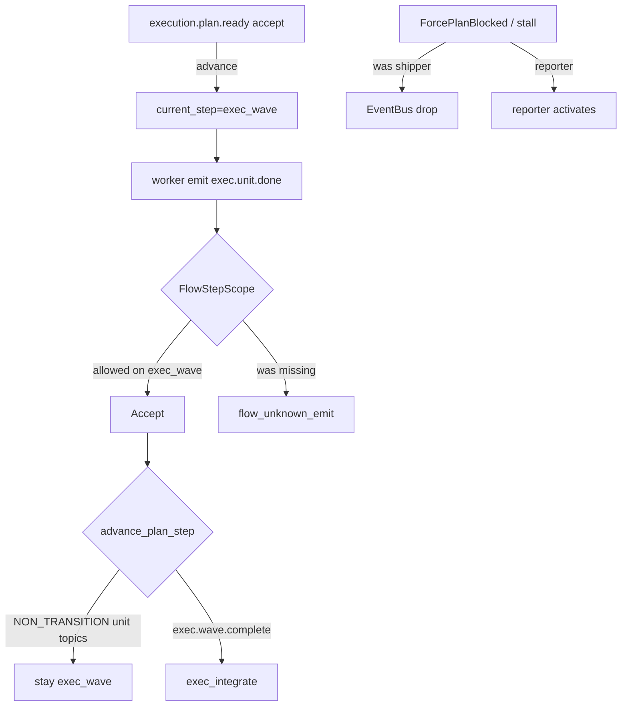

# 最小化修复 supervisor exec.unit.done flow 契约 + 全仓 shipper→reporter 清理

## Goal Capsule

- Objective: 用**最小改动**闭合 `primary-20260724-121001` 诊断中的 P0-1（`exec.unit.done` FlowStepScope 拒收）与 P1 shipper 死路由；并加一条 F-003 式表征，防止 Completed slot 进入 `blocking_slots`。
- Authority: 本文件 Product Contract + KTDs；与 004 冲突时，以本计划「接手 004 明确 defer 的 shipper residual」为准，**不重做** 004 U1–U4。
- Sequencing: **U1 → U2 → U3 → U4**（严格串行；禁止并行交替）。
- Stop when: Verification Contract 全绿；Definition of Done 勾选；同构 residuals（其它 `*.unit.*` topic）已书面记录。
- Out of scope reminder: 不恢复 `shipper` / `progress-steward`；不重写 supervisor fan-in 算法；不做 payload schema 大改；不做 M4 task↔event 统一。

Product Contract preservation: 无上游 brainstorm；本计划自举。用户已确认三叉：全仓 shipper 清理；加 blocking_slots 表征；`exec.unit.done` 挂在 `exec_wave`。

---

## Product Contract

### Summary

`ce-executor-supervisor` 将 `exec.unit.done` 放在 business topics，但 `mechanism.flow` 的 `exec_wave.allowed_emits` 未声明它；主环 FlowStepScope 在 `current_step=exec_wave`（或仍钉在 unit_loop）时以 `flow_unknown_emit` 拒收，叠加 recovery 打向已删 `shipper`，导致 exec wave 无法收敛到可达终态。本计划：全仓把 `plan.blocked` 的硬编码 `target=shipper` 改为 `reporter`；把 `exec.unit.done`（及同波次必要的 unit 终态 topic）挂到 `exec_wave`，并防止 unit topic 误推进 flow step；补一条 Completed∉blocking_slots 表征。

### Requirements

- R1. 生产代码中所有把 `plan.blocked`（及等价 recovery 终态）路由到 `HatId("shipper")` 的路径，改为 `reporter`；不恢复 shipper hat。
- R2. `ce-executor-supervisor` 的 `mechanism.flow` step `exec_wave.allowed_emits` 包含 `exec.unit.done`（及为避免同构拒收所需的最小 companion：至少 `exec.unit.failed`）。
- R3. 接受 `exec.unit.done` **不得**把 `current_plan_step` 从 `exec_wave` 提前推进到 `exec_integrate`（仅 wave 终态 topic 应推进）。
- R4. `execution.plan.ready` 被 accept 后，`current_plan_step` 必须推进到 `exec_wave`（表征钉死推进前提）。
- R5. `evaluate_phase` / `blocking_slot_indices`：含 Completed+Failed 的 snapshot 上，`blocking_slots` 不得包含 Completed 索引。
- R6. 不重做 004 已交付范围（plan.blocked allowlist、steward false、coordinator 禁终态、LOOP_COMPLETE fingerprint）。

### Actors

- A1. Operator — 跑 `builtin:ce-executor-supervisor`。
- A2. Worker hat — emit `exec.unit.done` / `exec.unit.failed`。
- A3. Reporter hat — `plan.blocked` / `plan.complete` / `work.failed` 唯一消费者。
- A4. Runtime event_loop / drift — 合成 `plan.blocked` 的 fail-close / recovery 路径。

### Key Flows

- F1. Happy：`execution.plan.ready` accept → step=`exec_wave` → worker `exec.unit.done` 过 FlowStepScope → store Completed → fan-in → `exec.wave.complete`。
- F2. Slot 失败：`exec.unit.failed` 过 scope → store Failed → `exec.wave.failed`，`blocking_slots` 仅 Failed/Cancelled。
- F3. Recovery exhausted / stall fail-close：合成 `plan.blocked` → **target=reporter** → reporter 可激活（不再静默丢给已删 shipper）。

### Acceptance Examples

- AE1. 全仓生产路径无 `with_target(...("shipper"))` / `pending_recovery_hat = shipper`（测试夹具可用假 hat 名，但断言「必须投递 shipper」的生产语义测必须改成 reporter）。
- AE2. supervisor preset：`exec_wave.allowed_emits` 含 `exec.unit.done`；strict preset_lint 绿。
- AE3. `advance_plan_step(exec_wave, "exec.unit.done")` → `None`（不推进）；`advance_plan_step(exec_wave, "exec.wave.complete")` → `Some(exec_integrate)`。
- AE4. FlowStepScope：`current_step=exec_wave` + topic `exec.unit.done` → Accept。
- AE5. Mixed snapshot：slot0 Completed、slot1 Failed → `blocking_slots == [1]`。

### Scope Boundaries

**In scope**

- `crates/ralph-core/src/event_loop/mod.rs` 四处 shipper target
- `crates/ralph-core/src/drift/engine.rs` 生产路由 + 依赖 shipper pending 的断言测
- `presets/en/ce-executor-supervisor.yml` 的 `exec_wave.allowed_emits`
- `advance_plan_step` 的 NON_TRANSITION（或等价）扩展
- `supervisor/phase.rs`（或现有测试模块）F-003 表征补强
- 相关作者注释 / 死 `DEFENSIVE_BYPASS` 条目清理（顺手、最小）

**Deferred for later**

- `exec.unit.ready` / review·fix 同构 `*.unit.*` 全量挂 step（本计划只覆盖 exec 波次最小集合）
- 真 E2E 重跑 `ralph-e2e` supervisor（产物已不在；可选 smoke，非门禁）
- M4 task ledger ↔ event bus
- payload `content_hash` 强制与 agent precheck 强化（诊断 P1-3）

**Outside this product's identity**

- 恢复 `shipper` / `progress-steward` hat
- 重写 fan-in / rusqlite schema
- 回滚或重做 004 U1–U4

### Success Criteria

- `plan.blocked` 合成路径可被 `reporter` 消费，不再因无 shipper 静默丢失。
- `exec.unit.done` 在 `exec_wave` 步可通过 FlowStepScope；unit topic 不误推进 step。
- Completed slot 不出现在 `blocking_slots`（表征测钉死）。

---

## Planning Contract

### Assumptions

- Ass1. `execution.plan.ready` 已在 `unit_loop.allowed_emits`；accept 后 `advance_plan_step` 进入 `exec_wave`（源码 `advance_plan_step` + NON_TRANSITION 不含该 topic）。若表征失败，优先修推进，**禁止**退回「双挂 unit_loop」除非用户改口。
- Ass2. Schema 已有 `exec.unit.done` required_fields；改 allowed_emits **通常不必**改 `presets/schemas/ce-executor-supervisor.yml`；仍须跑 schema parity / preset_lint。
- Ass3. 诊断「4 done + 5 blocking」主因是 done 未入 store Completed，而非 F-003 fabricate-range 回归；U4 只锁契约，不宣称重写 fan-in。
- Ass4. CLI / 注入 skill 契约不变 → `crates/ralph-core/data/*.md` **预期无需改**；preset operator skills 仅当新增 lint finding 时同步（预期无需）。
- Ass5. 004 若尚未合入，本计划仍可独立落地；合入顺序建议 004 先于或并行，但 shipper retarget **以本计划为准**（004 曾 defer）。

### Key Technical Decisions

- KTD1. **Shipper → reporter，全仓生产路径**：不引入 registry lookup；目标 hat 固定为 `reporter`（与 supervisor preset 拓扑一致；serial 等仍含 shipper 的 preset 若存在，其 hat 可继续订阅，但 runtime 硬编码不再指向 shipper）。
- KTD2. **`exec.unit.done` 挂 `exec_wave`，不挂 `unit_loop`**：语义归属 supervisor exec 波次；companion 最小集含 `exec.unit.failed`。
- KTD3. **必须同步扩展 NON_TRANSITION（或等价）**：`advance_plan_step` 对「在当前 step.allowed_emits 且非 NON_TRANSITION」的 topic 会推进下一步；把 unit 终态加入 `exec_wave.allowed_emits` 而不排除推进，会在**第一个** `exec.unit.done` 就把 step 推到 `exec_integrate`。最小做法：将 `exec.unit.done` / `exec.unit.failed`（及如需的 `exec.unit.ready`）列入 NON_TRANSITION，或按 `*.unit.done|failed|ready` 模式匹配；**wave 终态** `exec.wave.complete|failed` 保持可推进。
- KTD4. **F-003 表征只锁契约**：不重写 `blocking_slot_indices`，除非表征证明 filter 被旁路。
- KTD5. **测试纪律**：不 byte-lock 整份 preset YAML；用结构化断言（parse → flow step allowed_emits 含 topic）；机制测放在现有 `u4_current_plan_step_tests` / `flow_step_scope_stage/tests` / `supervisor/phase` 测试模块。

### High-Level Technical Design



### Alternatives Considered

| 方案 | 为何不选 |
|---|---|
| 只把 `exec.unit.done` 加进 `unit_loop.allowed_emits` | 用户已否决；语义归属错误 |
| 仅 DEFENSIVE_BYPASS `(worker, exec.unit.done)` | 绕过声明、难审计；可作 Ass1 失败后备，不作主路径 |
| registry lookup 动态找终态 hat | 超最小范围 |
| 恢复薄 shipper hat | 与删除决策回退 |

---

## 1. 功能目标

### 业务目标

让 `builtin:ce-executor-supervisor` 在 exec wave 期间合法接受 worker 的 `exec.unit.done`，并把无法恢复的 `plan.blocked` 送到仍存在的 `reporter`，避免静默死胡同。

### 本次范围

- 全仓生产 `shipper` 硬编码路由 → `reporter`
- preset：`exec_wave.allowed_emits` + `advance_plan_step` NON_TRANSITION 配套
- F-003 式 `blocking_slots` 表征

### 非目标

- 恢复已删 hat；重写 fan-in；schema/payload 全面强化；重做 004；全量 E2E 必跑

### 已知约束和假设

- 见 Ass1–Ass5、KTD1–KTD5
- HARD RULE：测试用 nextest；preset 改后跑 lint/presets；中文计划文档

---

## 2. BDD 行为规格

```gherkin
Feature: Supervisor exec wave 接受 unit 终态且失败可到达 reporter
  作为 operator
  我希望 worker 的 exec.unit.done 不被 flow scope 误拒
  并且 recovery/stall 的 plan.blocked 能唤醒 reporter

  Scenario: S1 Happy — exec_wave 接受 exec.unit.done 且不提前推进 step
    Given mechanism.flow 当前步为 exec_wave
    And exec_wave.allowed_emits 包含 exec.unit.done
    When 系统接受一条来源为 worker 的 exec.unit.done
    Then FlowStepScope 不返回 flow_unknown_emit
    And current_plan_step 仍为 exec_wave

  Scenario: S2 Illegal — unit_loop 步上的 exec.unit.done 仍被拒（边界）
    Given mechanism.flow 当前步为 unit_loop
    And unit_loop.allowed_emits 不包含 exec.unit.done
    When 系统评估 exec.unit.done
    Then FlowStepScope 以 flow_unknown_emit 拒绝
    # 说明：推进到 exec_wave 是前置条件；本 Scenario 锁定「不双挂 unit_loop」

  Scenario: S3 Boundary — execution.plan.ready 推进到 exec_wave
    Given current_plan_step 为 unit_loop
    And unit_loop.allowed_emits 包含 execution.plan.ready
    When 系统接受 execution.plan.ready
    Then current_plan_step 变为 exec_wave

  Scenario: S4 Failure recovery — plan.blocked 路由到 reporter
    Given 运行时触发 ForcePlanBlocked 或 stall fail-close
    When 合成 plan.blocked 事件
    Then 事件 target 为 reporter
    And 在已注册 reporter 的 EventBus 上可 take_pending(reporter)

  Scenario: S5 State — Completed 不进入 blocking_slots
    Given wave snapshot 含 slot0=Completed 与 slot1=Failed
    When evaluate_phase 得出 RequiredSlotFailure
    Then blocking_slots 等于 [1]
    And 不含 0

  Scenario: S6 Regression — exec.wave.complete 仍可推进
    Given current_plan_step 为 exec_wave
    When 系统接受 exec.wave.complete
    Then current_plan_step 变为 exec_integrate
```

---

## 3. 验收与测试策略

| Scenario | 验收条件 | 推荐测试层级 | 是否需要 E2E |
|---|---|---|---|
| S1 | Accept + step 不推进 | 单元（FlowStepScope + advance_plan_step） | 否 |
| S2 | unit_loop 拒收 | 单元（FlowStepScope） | 否 |
| S3 | step→exec_wave | 单元（advance_plan_step / u4 tests） | 否 |
| S4 | target=reporter；bus 可投递 | 单元/集成（event_loop / drift 子集） | 否 |
| S5 | blocking_slots=[failed] | 单元（phase） | 否 |
| S6 | wave complete 推进 | 单元（advance_plan_step） | 否 |
| AE2 | preset_lint / presets 绿 | 集成（cli+core lint） | 否 |

---

## 4. 需求—测试追踪矩阵

| 需求 | Scenario | 验收测试 | 单元测试 | 集成/契约 | E2E |
|---|---|---|---|---|---|
| R1 | S4 | drift/stall/ForcePlanBlocked 子集断言 target=reporter | event_loop / drift 测改写 | — | 否 |
| R2 | S1, AE2 | preset 结构化断言 + preset_lint | parse_yaml / flow step 断言 | ralph-cli presets / preset_lint | 否 |
| R3 | S1, S6 | advance_plan_step 单测 | u4_current_plan_step_tests 扩展 | — | 否 |
| R4 | S3 | advance 表征 | 同上 | — | 否 |
| R5 | S5 | phase 表征 | supervisor/phase 测 | — | 否 |
| R6 | — | 代码评审：不触碰 004 范围文件意图 | — | — | 否 |

---

## Implementation Units

> 严格串行：U1 全部完成标准满足后才能开始 U2，依此类推。每个 Unit 内执行 TDD：写/启用验收测 → Red（正确原因）→ 最小实现 → Green → Refactor → 集成 → 回归 → 关闭。

---

### U1. 全仓 shipper → reporter 路由清理

**Unit 目标：** 生产路径合成的 `plan.blocked` / recovery 终态可到达 `reporter`。

**对应 Scenario：** S4

**外部可观察结果：** EventBus 上 `take_pending(reporter)` 能拿到合成 `plan.blocked`；生产代码不再 `with_target(shipper)`。

**输入与输出：**

- 输入：stall fail-close / ForcePlanBlocked / incomplete-wave blocked / drift recovery exhaustion
- 输出：`plan.blocked` 事件，`target=reporter`

**可依赖的已完成能力：** EventBus `with_target`；reporter hat 已在 supervisor preset 订阅 `plan.blocked`。

**明确禁止依赖的未来能力：** U2 flow allowed_emits；U4 blocking_slots。

**验收测试：**

- 改写/新增：`crates/ralph-core/src/drift/engine.rs` 内断言 shipper pending 的测试 → reporter
- 覆盖 `event_loop/mod.rs` 四处生产调用的现有或最小新测（stall disabled fail-close、U5 escalation、ForcePlanBlocked、incomplete wave）

**需要拆分的单元测试：** 每个调用点至少一条「target hat id == reporter」或 bus drain 断言。

**Red 预期失败原因：** 仍 target=shipper 或 bus 无 reporter pending。

**最小实现范围：**

- modify: `crates/ralph-core/src/event_loop/mod.rs`（四处 `.with_target(...shipper)` → reporter；更新误导注释）
- modify: `crates/ralph-core/src/drift/engine.rs`（`pending_recovery_hat` + `emit_plan_blocked_for_recovery_exhaustion`）
- modify: 依赖生产语义的测试（`drift/engine.rs` 测；必要时 `correction/mod.rs` 若断言生产 escalate 目标——仅当其测的是生产 API 而非任意假 hat）
- 可选清理：`flow_lifecycle.rs` 注释；`DEFENSIVE_BYPASS` 死条目 `("shipper", "REVIEW_COMPLETE")`
- **保留**：`preset_lint` 的 `DELETED_SUPERVISOR_HATS` 含 shipper；emit 测里用假 hat 名做 override 的夹具可保留

**集成验证：** `cargo nextest run -p ralph-core -- drift` 与 stall / ForcePlanBlocked 相关子集。

**回归范围：** `cargo nextest run -p ralph-core -- shipper`（应无「必须注册 shipper 才能终态」的生产断言残留）；correction / event_loop 相关子集。

**完成标准：** AE1；S4 绿；生产 grep `with_target(.*shipper` 仅剩注释或零命中。

**风险与注意事项：** serial 等仍声明 shipper hat 的 preset 不受「硬编码 target」影响（hat 仍可订阅）；本 Unit 改的是 runtime 合成路径。勿恢复 hat。

**Execution note:** 先改断言生产语义的测试为 Red，再改生产 target。

**Patterns to follow:** `escalate_to_plan_blocked` 已 `with_system_injected` 不绑 shipper；reporter 为 supervisor 终态 owner（preset U8）。

---

### U2. `exec.unit.done` 挂入 `exec_wave` + NON_TRANSITION 防误推进

**Unit 目标：** 在 `exec_wave` 步合法允许 unit 终态 emit，且 unit topic 不推进 step。

**对应 Scenario：** S1, S2, S6, AE2

**外部可观察结果：** preset 解析后 `exec_wave.allowed_emits` 含 `exec.unit.done`（及 `exec.unit.failed`）；`advance_plan_step` 对 unit topic 返回 `None`，对 `exec.wave.complete` 仍推进。

**输入与输出：**

- 输入：preset YAML flow 声明；accepted topic 字符串
- 输出：允许集合变更；step 推进语义不变（wave 终态）/ 修正（unit 终态）

**可依赖的已完成能力：** U1（无硬依赖，但串行已完成）；现有 `advance_plan_step`；`RalphConfig::parse_yaml`。

**明确禁止依赖的未来能力：** U3 的 FlowStepScope 全路径测可后置，但本 Unit 必须自带 advance + preset 结构化验收；不得把 NON_TRANSITION 留给 U3。

**验收测试：**

- 结构化：加载 embedded / `presets/en/ce-executor-supervisor.yml`，断言 `exec_wave` 含 `exec.unit.done` 与 `exec.unit.failed`；`unit_loop` **不含** `exec.unit.done`（锁 S2 产品决策）
- `u4_current_plan_step_tests`：S1/S6 行为

**需要拆分的单元测试：** NON_TRANSITION 扩展的表驱动用例（unit.done / unit.failed / wave.complete）。

**Red 预期失败原因：** allowed_emits 缺 topic；或加入 allowed 后 `advance_plan_step(exec_wave, exec.unit.done)` 错误返回 `Some(exec_integrate)`。

**最小实现范围：**

- modify: `presets/en/ce-executor-supervisor.yml`（仅 `exec_wave.allowed_emits`）
- modify: `crates/ralph-core/src/event_loop/mod.rs`（`NON_TRANSITION_TOPICS` 或等价模式）
- 嵌入式 preset 经既有 build/manifest 管道同步（勿手改无关 PRESETS 文案）
- schema：先跑 parity；**仅当 lint 要求时**改 `presets/schemas/ce-executor-supervisor.yml`

**集成验证：**

- `cargo nextest run -p ralph-cli --bin ralph -- preset_lint`
- `cargo nextest run -p ralph-core -- preset_lint`
- `cargo nextest run -p ralph-cli --bin ralph -- presets`

**回归范围：** `u4_current_plan_step_tests` 全模块；mechanism flow 相关测。

**完成标准：** AE2、S1（advance 部分）、S2（preset 不含于 unit_loop）、S6 绿。

**风险与注意事项：** KTD3 是本 Unit 的负载决策；漏做 NON_TRANSITION 会表现为「第一个 done 后 step 错乱」。可选 companion：若实现中发现 dispatcher 主账本仍 emit `exec.unit.ready` 并被拒，可在本 Unit 一并加入 `exec.unit.ready` + NON_TRANSITION——仍属最小同构，写入实现备注。

**Execution note:** 先写「加入 allowed 后误推进」的失败测，再同时改 YAML + NON_TRANSITION。

**Patterns to follow:** 现有 `NON_TRANSITION_TOPICS` 对 `work.*` 的处理；HARD RULE：不 byte-lock 整份 preset。

---

### U3. FlowStepScope 接受 exec_wave 上的 exec.unit.done + plan.ready 推进表征

**Unit 目标：** 钉死「推进到 exec_wave 后，FlowStepScope 接受 exec.unit.done」；并表征 `execution.plan.ready` → `exec_wave`。

**对应 Scenario：** S1（Accept 部分）, S3

**外部可观察结果：** FlowStepScope 在 `current_step=exec_wave` 对 `exec.unit.done` 返回 Ok；`advance_plan_step(unit_loop, execution.plan.ready)` → `Some(exec_wave)`（用 supervisor 形状的 steps fixture）。

**输入与输出：**

- 输入：StageContext.current_step + Event(topic=exec.unit.done)
- 输出：Accept / Reject reason

**可依赖的已完成能力：** U2（allowed_emits + NON_TRANSITION）。

**明确禁止依赖的未来能力：** U4；真 supervisor E2E。

**验收测试：**

- `crates/ralph-core/src/event_loop/stages/flow_step_scope_stage/tests.rs`：exec_wave + exec.unit.done → Ok；unit_loop + exec.unit.done → flow_unknown_emit
- `u4_current_plan_step_tests` 或同文件：supervisor 三步 fixture（unit_loop → exec_wave → exec_integrate）下 `execution.plan.ready` 推进

**需要拆分的单元测试：** 上述两条即最小集。

**Red 预期失败原因：** U2 未合入时 Accept 失败；或推进测因 fixture 与 preset 不一致失败。

**最小实现范围：**

- test-only 优先；若表征证明 `execution.plan.ready` **不能**推进（与 Ass1 冲突），允许最小修 `advance_plan_step` / flow 声明——须在实现备注写明，并不得改回双挂 unit_loop
- 不改 hat instructions 文案（除非发现与 allowed 冲突的硬错误）

**集成验证：** `cargo nextest run -p ralph-core -- flow_step_scope`；`u4_current_plan_step`

**回归范围：** mechanism foundation `flow_unknown_emit_rejected` scenario（不得被误伤成过宽 bypass）。

**完成标准：** S1 Accept、S2、S3 绿。

**风险与注意事项：** 报告路径 `preset/engine/flow_step_scope_stage.rs` 已过时；真实路径为 `event_loop/stages/flow_step_scope_stage.rs`。禁止为图省事把 `(worker, exec.unit.done)` 永久塞进 DEFENSIVE_BYPASS（仅 Ass1 失败时的临时后备，须标 residual）。

**Execution note:** Characterization-first：先写 Accept/Reject 对偶测。

**Patterns to follow:** 现有 `flow_step_scope_rejects_event_outside_allowed_emits`。

---

### U4. F-003 表征：Completed 不得出现在 blocking_slots

**Unit 目标：** 锁死「mixed Completed+Failed → blocking 仅 Failed/Cancelled」。

**对应 Scenario：** S5

**外部可观察结果：** `evaluate_phase` 失败分支的 `blocking_slots` 不含 Completed 索引。

**输入与输出：**

- 输入：`WaveSnapshot`（显式 slots 状态）
- 输出：`PhaseDecision::Failed { blocking_slots }`

**可依赖的已完成能力：** U1–U3（无硬依赖逻辑，但串行纪律要求已完成）；现有 `blocking_slot_indices`。

**明确禁止依赖的未来能力：** 无后续 Unit。

**验收测试：**

- `crates/ralph-core/src/supervisor/phase.rs` tests：若已有等价测则加强断言；否则新增 mixed-status 用例覆盖 `RequiredSlotFailure` 与 Timeout 两条 Failed 出口

**需要拆分的单元测试：** 一条 mixed snapshot 即可；可选 Timeout 路径复用同一 snapshot。

**Red 预期失败原因：** 仅当 filter 回归时失败；预期多数情况下先写测即绿（characterization）——若已绿，保留测作为回归钉，**不**为制造 Red 而改生产代码。

**最小实现范围：**

- test: `crates/ralph-core/src/supervisor/phase.rs`（或 `plan_b_contract.rs` 若更贴 fan-in）
- 仅当表征证明 Completed 泄漏进 blocking 时，才改 `blocking_slot_indices` / 调用方

**集成验证：** `cargo nextest run -p ralph-core -- blocking_slot`；`evaluate_phase` / `RequiredSlotFailure` 子集

**回归范围：** `supervisor/coordinator`、`plan_b_contract` 相关测

**完成标准：** S5 绿；不重写 fan-in

**风险与注意事项：** 勿把诊断「全员 blocking」误判为 filter bug 而大改 store；本 Unit 只保证契约。

**Execution note:** Characterization：先跑现有测；缺则补钉。

**Patterns to follow:** `blocking_slot_indices_reads_real_status`；F-003 注释契约。

---

## Verification Contract

- U1: `cargo nextest run -p ralph-core -- drift`；stall / ForcePlanBlocked / incomplete_wave 相关子集
- U2: `cargo nextest run -p ralph-core -- u4_current_plan_step`；`cargo nextest run -p ralph-cli --bin ralph -- preset_lint`；`cargo nextest run -p ralph-core -- preset_lint`；`cargo nextest run -p ralph-cli --bin ralph -- presets`
- U3: `cargo nextest run -p ralph-core -- flow_step_scope`；推进表征子集
- U4: `cargo nextest run -p ralph-core -- blocking_slot`（及 phase / RequiredSlotFailure）
- 最终门禁：`./scripts/run-tests.sh`（含 doctest）
- **禁止**裸 `cargo test -p ralph-cli`

---

## Definition of Done

- [ ] U1–U4 均满足各自完成标准，且按串行顺序落地
- [ ] 生产路径无 shipper hardcode target；reporter 可收 `plan.blocked`
- [ ] `exec_wave.allowed_emits` 含 `exec.unit.done`（+ failed）；unit topic 不误推进 step
- [ ] FlowStepScope 在 exec_wave 接受 `exec.unit.done`；unit_loop 仍拒
- [ ] Completed∉blocking_slots 表征存在且绿
- [ ] 未恢复 shipper/progress-steward；未重做 004；未重写 fan-in
- [ ] skill / ralph-tools：确认无需更新（或已按 HARD RULE 更新）
- [ ] 同构 residual 已写入下文

### Deferred to Follow-Up Work

- review/fix 波次 `*.unit.*` 与对应 side_effect step 的 allowed_emits / NON_TRANSITION 同构
- 可选：真实 supervisor E2E 复跑验证 121001 场景消失
- 004 其它 residuals（M4 等）仍有效

---

## 5. 严格串行开发单元（执行清单摘要）

| 顺序 | Unit | 关闭前必须绿 |
|---|---|---|
| 1 | U1 shipper→reporter | S4 / AE1 |
| 2 | U2 exec_wave + NON_TRANSITION | S1 advance / S2 / S6 / AE2 |
| 3 | U3 FlowStepScope + 推进表征 | S1 Accept / S3 |
| 4 | U4 blocking_slots 表征 | S5 |

每个 Unit 强制 TDD 闭环（验收测 → Red → 最小单测 Red/Green/Refactor → 集成 → 回归 → 关闭）。禁止削弱断言、skip、`.only`、无解释更新 golden、mock 掉待验行为、只跑局部就宣称完成。

---

## 6. 最终质量门禁

- [ ] 计划内 Scenario S1–S6 对应测试通过
- [ ] 相关单元测试通过
- [ ] preset_lint / presets / 必要集成测通过
- [ ] 无新增失败或跳过测试
- [ ] `./scripts/run-tests.sh` 通过（含 lint 由仓库钩子/脚本覆盖的部分）
- [ ] `cargo clippy` / `cargo fmt` 按仓库惯例干净（若钩子要求）
- [ ] 未验证：完整 ralph-e2e supervisor 实机复跑（产物缺失；记为剩余风险）
- [ ] 剩余风险：其它波次 `*.unit.*` 同构拒收；payload required_fields 代理合规仍依赖 agent/precheck

---

## Appendix

### 与 004 的关系

| 004 | 本计划 |
|---|---|
| 明确 **不做** shipper→reporter | **接手并闭合** 该 residual |
| U1–U4（allowlist / steward / coordinator / fingerprint） | **不重做** |
| 钉死 `progress_steward.enabled: false` | **保持**；U1 使 disabled fail-close 终于可达 reporter |

### 诊断映射（121001）

| 诊断项 | 本计划 | 闭合程度 |
|---|---|---|
| P0-1 flow_unknown_emit / allowed_emits | U2+U3 | 高（契约+表征） |
| P0-2 全员 blocking / 双账本 | U4 +（根因依赖 U2） | 中（契约钉死；不重写 store） |
| P1 recovery→shipper / exhausted | U1 | 高 |
| P1 payload schema | Deferred | 未做 |
| 报告错误源码路径 | Appendix 更正 | 文档 |

### 关键源码锚点（实现时复核，勿死锁行号）

- `crates/ralph-core/src/event_loop/stages/flow_step_scope_stage.rs` — `flow_unknown_emit`
- `crates/ralph-core/src/event_loop/mod.rs` — `advance_plan_step` / `NON_TRANSITION_TOPICS` / shipper targets
- `crates/ralph-core/src/drift/engine.rs` — recovery shipper
- `crates/ralph-core/src/supervisor/phase.rs` — `blocking_slot_indices`
- `presets/en/ce-executor-supervisor.yml` — `mechanism.flow` / reporter triggers
